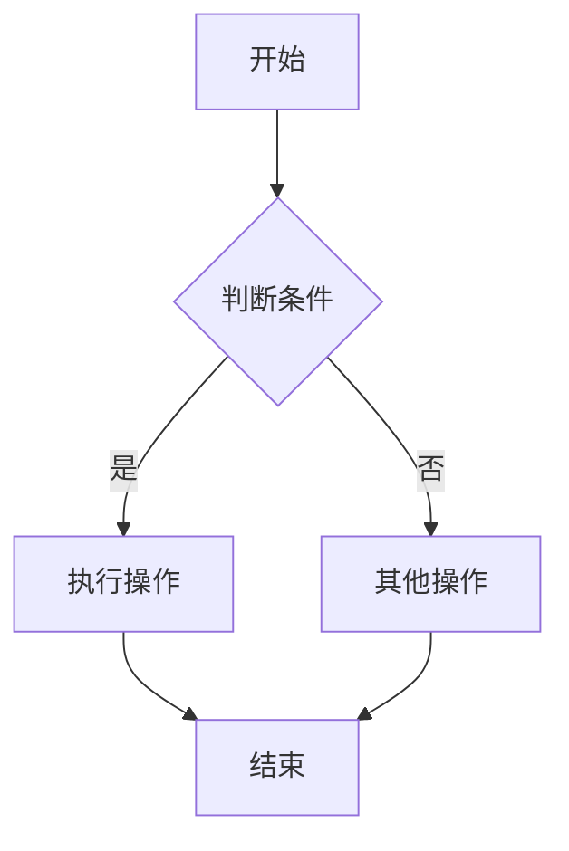

                 

### 引言：代码重用的重要性

在当今快速发展的软件行业中，代码重用已经成为提高开发效率和一致性的关键策略。随着软件项目的规模和复杂度不断增加，开发团队面临着越来越大的挑战。代码重用不仅能够减少重复劳动，提高开发速度，还能够确保代码质量和一致性，降低维护成本。本文将深入探讨代码重用的基础、策略、方法和最佳实践，以帮助读者更好地理解和应用这一重要技术。

#### 核心概念与联系

**代码重用（Code Reuse）**：代码重用是指在不同软件项目中重复使用已编写好的代码模块，以减少开发时间和成本。它包括功能代码重用、数据结构重用和设计模式重用等多种形式。

**模块化（Modularization）**：模块化是将软件系统划分为独立的模块，每个模块实现特定的功能。模块化有助于代码重用，提高代码的可维护性和可扩展性。

**设计模式（Design Patterns）**：设计模式是解决软件设计中常见问题的通用解决方案。设计模式提供了可重用的模板，有助于提高代码的可读性和可维护性。

**框架（Frameworks）**：框架是一组预定义的代码和组件，用于简化软件开发过程。框架通常提供了代码重用的机制和工具，如MVC框架、RESTful API框架等。

**Mermaid流程图**：Mermaid是一种简单的Markdown语法，用于创建流程图、UML图、甘特图等。以下是Mermaid流程图的示例：

#### 文章结构

本文将分为八个主要章节：

1. **第一部分：代码重用的基础**：介绍代码重用的背景、概念和分类。
2. **第二部分：代码重用的策略与方法**：探讨代码模块化、设计模式和框架在代码重用中的作用。
3. **第三部分：代码重用工具与实践**：介绍代码库管理、代码审查与重构、编码规范和代码质量评估。
4. **第四部分：提高代码重用性的最佳实践**：讨论编码规范、代码质量评估和最佳实践。
5. **第五部分：代码重用在不同开发阶段的应用**：分析需求分析与设计阶段、编码与测试阶段的代码重用。
6. **第六部分：案例分析：成功实现代码重用的项目**：介绍一个成功实现代码重用的项目案例。
7. **第七部分：总结与展望**：回顾代码重用的重要性，探讨未来的发展趋势。
8. **结语**：总结文章主要内容，提供拓展阅读建议。

通过本文的深入探讨，读者将能够全面了解代码重用的概念、策略和方法，从而在实际项目中有效应用，提高开发效率和质量。

### 第一部分：代码重用的基础

#### 第1章：代码重用的背景与重要性

**1.1 代码重用的定义与概述**

代码重用是指在软件开发过程中，通过复用已有的代码模块、组件或设计模式，以减少开发时间和成本，提高代码质量和一致性。代码重用不仅仅是简单地复制粘贴已有代码，而是要确保在新的项目中有效地使用这些代码。

在传统的软件开发中，每个项目都是从头开始编写代码，这导致了大量的重复劳动，增加了开发时间和成本。而代码重用则通过将可重用的代码模块化、标准化，从而实现代码的重复利用。

**1.2 代码重用的重要性**

代码重用对于现代软件开发具有重要意义，主要体现在以下几个方面：

1. **提高开发效率**：通过复用已有的代码，开发团队可以节省大量时间和精力，专注于新功能的开发，从而提高整体开发效率。

2. **确保代码质量**：经过验证的代码模块在新的项目中再次使用，可以确保代码的质量和一致性。此外，代码重用还可以促进代码审查和重构，进一步提高代码质量。

3. **降低维护成本**：当多个项目中使用相同的代码模块时，对代码的修改和优化可以一次完成，从而降低维护成本。

4. **促进团队协作**：代码重用可以促进团队成员之间的协作，通过共同维护和改进可重用的代码，提高团队的整体技术水平。

**1.3 代码重用的挑战与解决策略**

尽管代码重用具有诸多优势，但在实际应用中仍面临一些挑战：

1. **代码冗余与耦合**：如果不恰当地重用代码，可能会导致代码冗余和耦合，降低系统的可维护性。

2. **版本控制**：当多个项目共同使用同一代码模块时，版本控制变得尤为重要。任何对代码的修改都可能导致其他项目的功能受到影响。

3. **代码质量**：重用的代码不一定总是高质量的，因此需要对代码进行严格的审查和测试。

为解决上述挑战，可以采取以下策略：

1. **模块化**：将代码划分为独立的模块，每个模块实现特定的功能，有助于降低代码耦合和提高可维护性。

2. **标准化**：制定统一的编码规范和设计模式，确保代码的质量和一致性。

3. **代码库管理**：建立和维护一个可靠的代码库，方便团队成员共享和重用代码。

4. **代码审查与重构**：定期进行代码审查和重构，确保代码的健壮性和可维护性。

通过上述策略，可以有效克服代码重用过程中的挑战，充分发挥代码重用的优势。

### 第二部分：代码重用的策略与方法

#### 第2章：代码重用的概念与分类

**2.1 代码复用与代码重用的区别**

在讨论代码重用之前，我们首先需要明确代码复用与代码重用之间的区别。代码复用（Code Replication）是指在不同项目中复制和粘贴相同的代码，而代码重用（Code Reuse）则强调通过模块化、设计模式和框架等手段实现代码的重复利用。

**代码复用**通常会导致代码冗余和耦合，增加系统的复杂度，而**代码重用**则注重通过合理的设计和开发策略，确保代码的高可维护性和可扩展性。

**2.2 代码重用的类型**

代码重用可以根据不同的分类标准进行划分，常见的分类方法包括功能性代码重用、数据结构重用和设计模式重用等。

1. **功能性代码重用**

功能性代码重用是指在不同项目中复用具有相似功能的代码模块。这种方法通常通过将功能代码封装成独立的模块或函数来实现。功能性代码重用有助于提高开发效率，减少重复劳动，但需要注意的是，如果代码模块设计不当，可能会导致模块之间的强耦合，降低系统的灵活性。

**示例：**在多个项目中，可以复用一个通用的用户登录模块，而不是在每个项目中分别实现。

2. **数据结构重用**

数据结构重用是指在不同项目中复用相同的数据结构。这种方法适用于那些具有相似数据需求的场景，例如，在多个项目中使用相同的数据库表结构或数据模型。

**示例：**在一个电子商务系统中，订单管理模块和客户管理模块可以使用相同的数据结构来存储订单和客户信息。

3. **设计模式重用**

设计模式重用是指在不同项目中复用经典的设计模式。设计模式是解决软件设计中常见问题的通用解决方案，它们具有高复用性和可维护性。

**示例：**在多个项目中，可以复用“工厂模式”（Factory Pattern）来创建对象，这样可以确保对象创建的逻辑一致性和可扩展性。

**2.3 代码重用的层次**

代码重用可以分为不同的层次，从简单到复杂，包括以下几种：

1. **代码片段重用**

代码片段重用是指在不同项目中复用特定的代码片段，例如，复用一个通用的数据库查询函数或日志记录器。

2. **模块化重用**

模块化重用是指将代码划分为独立的模块，每个模块实现特定的功能，模块之间通过接口进行通信。这种方法可以提高代码的可维护性和可扩展性。

3. **组件化重用**

组件化重用是指将代码模块组合成更复杂的组件，这些组件具有完整的生命周期，可以从一个项目中迁移到另一个项目。组件化重用通常涉及到框架和中间件的使用。

4. **架构级重用**

架构级重用是指在整个系统架构层面进行代码重用，这通常涉及到复用成熟的系统架构和设计模式。这种方法适用于大规模、高复杂度的系统。

**2.4 代码重用的挑战与解决方案**

尽管代码重用具有显著的优势，但在实际应用中仍面临一些挑战：

1. **代码冗余与耦合**

代码冗余和耦合是代码重用过程中最常见的挑战。为了避免这些问题，可以采用模块化和接口设计，确保模块之间的松耦合。

2. **版本控制**

在多个项目共同使用同一代码模块时，版本控制变得尤为重要。可以采用版本控制系统，如Git，来管理和跟踪代码变更。

3. **代码质量**

重用的代码不一定总是高质量的，因此需要对代码进行严格的审查和测试。可以建立代码审查机制和自动化测试工具，确保代码的质量。

通过采取上述解决方案，可以有效克服代码重用过程中的挑战，充分发挥代码重用的优势。

#### 第3章：代码重用的策略与方法

**3.1 代码模块化**

代码模块化是将代码划分为独立的模块，每个模块实现特定的功能，从而提高代码的可维护性和可扩展性。模块化是实现代码重用的基础，它有助于降低代码的复杂度，提高代码的可重用性。

**3.1.1 模块化的定义与原则**

模块化（Modularization）是将软件系统划分为多个独立的模块，每个模块具有明确的职责和功能。模块化有以下几个基本原则：

1. **单一职责原则**：每个模块应实现单一功能，避免功能过多导致模块复杂化。
2. **高内聚低耦合原则**：模块内部代码应具有较高的内聚性，模块之间应具有较低的耦合性，以降低模块之间的依赖关系。
3. **模块独立性原则**：模块应尽量独立，避免对其他模块的依赖，以提高模块的可移植性和可重用性。
4. **可重用性原则**：模块应设计为可重用的，以便在多个项目中复用。

**3.1.2 模块化工具与技术**

实现代码模块化需要使用适当的工具和技术。以下是一些常用的模块化工具和技术：

1. **模块划分**：根据功能需求将代码划分为多个模块，每个模块具有明确的功能和职责。
2. **接口设计**：为模块提供清晰的接口，确保模块之间的松耦合。
3. **依赖注入**：使用依赖注入（Dependency Injection）技术，将模块之间的依赖关系解耦。
4. **模块管理工具**：如Maven、Gradle等，用于管理模块的依赖和构建过程。

**3.2 设计模式与框架**

设计模式（Design Patterns）是解决软件设计中常见问题的通用解决方案。设计模式通过抽象和模板方法，提高了代码的可重用性和可维护性。框架（Frameworks）是一组预定义的代码和组件，用于简化软件开发过程，框架通常提供了代码重用的机制和工具。

**3.2.1 设计模式的基本概念**

设计模式可以分为三大类：创建型模式、结构型模式和行为型模式。

1. **创建型模式**：负责对象的创建，包括工厂模式、单例模式和建造者模式等。
2. **结构型模式**：负责类和对象的组合，包括适配器模式、装饰器模式和代理模式等。
3. **行

