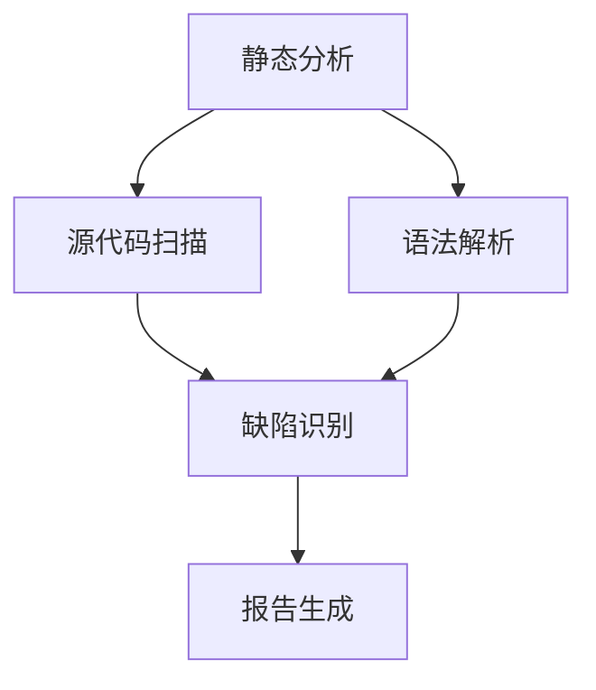
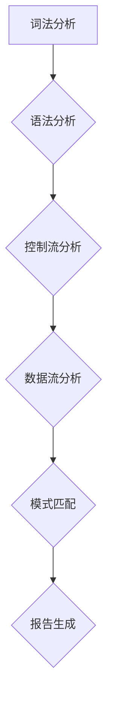

                 

## 代码静态分析：提前发现潜在问题

> 关键词：代码静态分析、源代码、缺陷识别、软件质量、安全漏洞

> 摘要：
随着软件系统的复杂性不断增加，代码静态分析作为一种高效、可靠的软件质量保障手段，越来越受到重视。本文将从基础概念入手，逐步深入探讨代码静态分析的核心原理、算法模型以及实际应用，帮助读者全面理解这一技术，掌握如何利用静态分析提前发现潜在问题，提升软件质量和安全性。

----------------------------------------------------------------

## 第一部分：代码静态分析基础知识

### 第1章：问题背景

#### 1.1 问题背景

代码静态分析是计算机科学中的一个重要领域，它通过不执行程序代码的方式，对源代码进行扫描和分析，以识别潜在的缺陷、错误和安全漏洞。随着软件系统的复杂度不断增加，静态分析技术的重要性日益凸显。一方面，它可以提前发现并修复潜在的问题，降低软件维护成本；另一方面，它可以帮助提高软件质量，减少系统崩溃和安全漏洞。

在软件开发过程中，代码静态分析通常作为一个重要的质量保障环节。它可以应用于不同的开发阶段，如需求分析、设计、编码、测试等。通过静态分析，开发人员可以提前发现代码中的潜在问题，及时进行修复，从而减少后续的维护成本和风险。此外，代码静态分析还可以用于自动化测试和代码审查，提高开发效率和代码质量。

#### 1.2 问题描述

代码静态分析的核心问题是：如何通过分析源代码，发现并定位潜在的问题。这些问题可能包括语法错误、逻辑错误、编码风格问题、性能瓶颈、安全漏洞等。例如，一个常见的语法错误可能是变量未初始化，而一个逻辑错误可能是条件判断错误，导致程序在特定情况下无法正常运行。

为了解决这些问题，代码静态分析需要以下几个关键步骤：

- **源代码扫描**：首先对源代码进行扫描，提取出代码的基本结构信息。
- **语法解析**：将源代码解析成抽象语法树（AST），以便进行更深入的分析。
- **缺陷识别**：根据预定义的规则和模式，对AST进行分析，识别出潜在的缺陷。
- **定位问题**：将识别出的缺陷定位到源代码的具体位置，便于开发者进行修复。

#### 1.3 问题解决

代码静态分析通常通过以下步骤解决问题：

1. **源代码扫描**：使用专门的工具对源代码进行扫描，提取出代码的基本结构信息，如函数、类、变量等。
2. **语法解析**：将源代码解析成抽象语法树（AST），AST是一个树形结构，可以表示代码的语法结构，方便进行深入分析。
3. **缺陷识别**：根据预定义的规则和模式，对AST进行分析，识别出潜在的缺陷。这些规则和模式可以是基于语法规则、数据流分析、控制流分析等。
4. **定位问题**：将识别出的缺陷定位到源代码的具体位置，生成报告，显示缺陷的位置、类型和可能的影响。

#### 1.4 边界与外延

代码静态分析有一定的边界和限制：

- **语言支持**：不同编程语言有不同的语法结构，静态分析工具通常需要针对特定语言进行优化。
- **运行环境**：静态分析通常在开发环境中进行，需要考虑到不同的编译器和运行环境。
- **代码质量**：代码质量越高，静态分析的效果越好，反之则可能效果较差。

#### 1.5 概念结构与核心要素组成

代码静态分析包括以下几个核心要素：

- **静态分析工具**：如SonarQube、FindBugs、PMD等。
- **编程语言语法解析器**：如ANTLR、JavaParser等。
- **缺陷模式库**：用于定义和识别各种缺陷的规则库。
- **报告生成器**：将分析结果以易于理解的方式呈现给开发者。

### 第2章：核心概念与联系

#### 2.1 代码静态分析的定义

代码静态分析是一种软件开发技术，通过对源代码进行分析，而不需要执行程序，以发现潜在的问题。它包括扫描、语法解析、模式匹配和报告生成等步骤。

代码静态分析的主要目标是通过分析源代码的结构、语法和语义，识别出可能存在的缺陷和问题。这种分析可以在不同的开发阶段进行，如需求分析、设计、编码、测试等。通过静态分析，开发人员可以提前发现并修复代码中的问题，从而提高软件质量，减少后续的维护成本和风险。

#### 2.2 静态分析与动态分析的区别

静态分析和动态分析是两种不同的软件分析技术，它们在分析方式和应用场景上存在明显的区别：

- **静态分析**：在程序执行前对代码进行分析，不涉及程序运行。静态分析的主要优点是速度快、效率高，可以在开发过程中快速发现潜在的问题。
- **动态分析**：在程序执行过程中进行监控和调试。动态分析可以实时获取程序运行时的状态，有助于发现程序运行中的问题。但动态分析通常需要运行整个程序，效率较低，且无法提前发现潜在问题。

#### 2.3 静态分析工具的分类

静态分析工具根据其工作原理和功能特点，可以分为以下几类：

- **基于规则的静态分析工具**：如FindBugs、PMD等。这些工具通过预定义的规则库，分析代码中的潜在缺陷。
- **数据流分析工具**：如Callgrind、Valgrind等。这些工具通过数据流分析，识别程序中的变量使用和数据传播问题。
- **符号执行工具**：如ExEzeit、S2E等。这些工具通过符号执行技术，模拟程序执行路径，识别潜在的问题。

#### 2.4 关键概念联系图

使用Mermaid绘制关键概念的联系图，展示代码静态分析中的主要概念及其相互关系。



### 第3章：算法原理讲解

#### 3.1 算法基本原理

代码静态分析中的算法通常包括以下步骤：

- **词法分析**：将源代码分解为词法单元。词法分析是代码分析的第一步，它将源代码中的字符序列转换为有意义的词法单元，如关键字、标识符、操作符等。
- **语法分析**：将词法单元组合成抽象语法树（AST）。语法分析是代码分析的第二步，它根据预定义的语法规则，将词法单元组合成抽象语法树，表示代码的结构和语义。
- **数据流分析**：分析变量和值的传播路径，以识别潜在的问题。数据流分析是代码分析的重要环节，它通过跟踪变量和值的传播路径，识别代码中的潜在问题，如未初始化的变量、可能的空指针异常等。
- **模式匹配**：使用预定义的模式库，识别代码中的缺陷。模式匹配是代码分析的最后一步，它通过匹配预定义的模式，识别代码中的潜在缺陷，如语法错误、逻辑错误等。
- **报告生成**：将分析结果以易于理解的方式呈现给开发者。报告生成是将分析结果整理成报告的过程，报告通常包括缺陷的位置、类型、影响等信息，以便开发者进行修复。

#### 3.2 数据流分析算法

数据流分析是一种重要的静态分析技术，它通过分析程序中的数据流，识别潜在的问题。数据流分析可以分为以下几种：

- **控制流分析**：分析程序的执行路径，识别程序中的控制流问题，如死循环、条件判断错误等。
- **数据流方程**：使用数据流方程描述变量和值的传播路径，识别程序中的潜在问题。数据流方程通常使用Lattice理论进行描述，是一种基于数学模型的数据流分析技术。
- **活度分析**：分析变量的使用情况，识别未使用的变量、未初始化的变量等。

#### 3.3 模式匹配算法

模式匹配是一种常用的静态分析技术，它通过匹配预定义的模式，识别代码中的潜在缺陷。模式匹配可以分为以下几种：

- **正则表达式匹配**：使用正则表达式匹配代码中的特定模式，识别代码中的语法错误、命名不规范等问题。
- **抽象语法树匹配**：使用抽象语法树（AST）匹配代码中的特定模式，识别代码中的逻辑错误、潜在的安全漏洞等问题。
- **模式库**：定义预定义的模式库，用于匹配代码中的潜在缺陷。

#### 3.4 Mermaid算法流程图

使用Mermaid绘制代码静态分析算法的流程图。



## 第二部分：代码静态分析应用与实现

### 第4章：数学模型和数学公式讲解

#### 4.1 基本数学模型

代码静态分析中常用的数学模型包括：

- **Lattice理论**：用于数据流分析。Lattice理论是一种数学模型，用于描述数据流中的变量值传播。在Lattice理论中，变量值可以用一个集合表示，集合中的元素表示变量的可能值。通过Lattice理论，可以描述变量值在不同路径上的传播过程，识别潜在的问题。
- **抽象语法树（AST）**：用于语法分析。抽象语法树是一种树形结构，表示代码的语法结构和语义信息。AST可以用于分析代码的结构，提取代码中的关键信息，为后续的分析提供基础。
- **正则表达式**：用于模式匹配。正则表达式是一种用于匹配字符串的模式表示方法，可以用于识别代码中的特定模式，如语法错误、命名不规范等问题。

#### 4.2 数学公式讲解

- **Lattice理论的公式**：

  $$ \text{Top} \leq v \land w $$

  其中，$\text{Top}$ 表示 Lattice 的上界，$v$ 和 $w$ 分别表示两个变量值。这个公式表示两个变量值的交集是它们的上界。

- **抽象语法树（AST）**：

  $$ \text{AST} = (\text{Root}, \text{Children}) $$

  其中，$\text{Root}$ 表示 AST 的根节点，$\text{Children}$ 表示根节点的子节点。这个公式表示 AST 是一个树形结构，每个节点都有子节点。

- **正则表达式**：

  $$ (\text{a}|\text{b})*\text{c} $$

  这个正则表达式表示匹配以 'a' 或 'b' 开头，以 'c' 结尾的字符串，中间可以包含任意数量的 'a' 或 'b'。

### 第5章：系统分析与架构设计方案

#### 5.1 问题场景介绍

假设我们正在开发一个大型分布式系统，该系统需要处理大量的并发请求，并且要求具有高性能和高可用性。在系统开发过程中，我们需要确保代码质量，避免潜在的缺陷和漏洞。

#### 5.2 项目介绍

为了满足上述需求，我们决定采用代码静态分析技术，对系统中的关键模块进行静态分析，提前发现并修复潜在的问题。我们的目标是实现一个高效、准确的代码静态分析系统，为系统开发提供强有力的支持。

#### 5.3 系统功能设计

系统的主要功能包括：

- **代码扫描**：对系统中的关键模块进行扫描，提取出代码的基本结构信息。
- **语法解析**：将源代码解析成抽象语法树（AST），为后续的数据流分析和模式匹配提供基础。
- **缺陷识别**：根据预定义的规则和模式，对AST进行分析，识别出潜在的缺陷。
- **报告生成**：将分析结果以易于理解的方式呈现给开发者，包括缺陷的位置、类型和影响等信息。

#### 5.4 系统架构设计

系统的架构设计如下：


系统主要由以下几个部分组成：

- **代码扫描器**：负责对系统中的关键模块进行扫描，提取出代码的基本结构信息。
- **语法解析器**：将源代码解析成抽象语法树（AST），为后续的数据流分析和模式匹配提供基础。
- **缺陷识别器**：根据预定义的规则和模式，对AST进行分析，识别出潜在的缺陷。
- **报告生成器**：将分析结果以易于理解的方式呈现给开发者，包括缺陷的位置、类型和影响等信息。

#### 5.5 系统接口设计和系统交互

系统的接口设计和系统交互如下：


系统的主要接口包括：

- **代码扫描接口**：用于接收代码文件，启动代码扫描过程。
- **语法解析接口**：用于将源代码解析成抽象语法树（AST），为后续的数据流分析和模式匹配提供基础。
- **缺陷识别接口**：用于根据预定义的规则和模式，对AST进行分析，识别出潜在的缺陷。
- **报告生成接口**：用于生成分析报告，将分析结果以易于理解的方式呈现给开发者。

系统交互过程如下：

1. 开发者提交代码文件到代码扫描接口。
2. 代码扫描器对代码文件进行扫描，提取出代码的基本结构信息。
3. 语法解析器将源代码解析成抽象语法树（AST）。
4. 缺陷识别器根据预定义的规则和模式，对AST进行分析，识别出潜在的缺陷。
5. 报告生成器将分析结果生成分析报告，并将其发送给开发者。

### 第6章：项目实战

#### 6.1 环境安装

为了进行代码静态分析，我们需要安装以下环境：

- **编程语言**：Python 3.8及以上版本。
- **静态分析工具**：SonarQube 8.9。
- **数据库**：MySQL 5.7及以上版本。

安装步骤如下：

1. 安装Python 3.8及以上版本。
2. 安装SonarQube 8.9。
3. 配置MySQL数据库。

#### 6.2 系统核心实现

系统核心实现主要包括以下模块：

- **代码扫描模块**：负责对系统中的关键模块进行扫描，提取出代码的基本结构信息。
- **语法解析模块**：负责将源代码解析成抽象语法树（AST），为后续的数据流分析和模式匹配提供基础。
- **缺陷识别模块**：负责根据预定义的规则和模式，对AST进行分析，识别出潜在的缺陷。
- **报告生成模块**：负责将分析结果生成分析报告，将其发送给开发者。

具体实现如下：

```python
# 代码扫描模块
def scan_code(code):
    # 对代码进行扫描，提取出代码的基本结构信息
    pass

# 语法解析模块
def parse_code(code):
    # 将源代码解析成抽象语法树（AST）
    pass

# 缺陷识别模块
def detect_defects(ast):
    # 根据预定义的规则和模式，对AST进行分析，识别出潜在的缺陷
    pass

# 报告生成模块
def generate_report(defects):
    # 将分析结果生成分析报告，将其发送给开发者
    pass
```

#### 6.3 代码应用解读与分析

代码应用解读与分析主要包括以下几个方面：

- **代码扫描**：使用代码扫描模块对系统中的关键模块进行扫描，提取出代码的基本结构信息。
- **语法解析**：使用语法解析模块将源代码解析成抽象语法树（AST），为后续的数据流分析和模式匹配提供基础。
- **缺陷识别**：使用缺陷识别模块根据预定义的规则和模式，对AST进行分析，识别出潜在的缺陷。
- **报告生成**：使用报告生成模块将分析结果生成分析报告，将其发送给开发者。

#### 6.4 实际案例分析和详细讲解剖析

为了更好地展示代码静态分析的实际效果，我们来看一个实际案例。

假设我们有一个简单的Python程序，如下所示：

```python
def add(a, b):
    return a + b

def main():
    a = 1
    b = 2
    print(add(a, b))

if __name__ == "__main__":
    main()
```

使用代码静态分析工具对这段代码进行分析，我们可以得到以下分析结果：

1. **代码扫描**：提取出代码的基本结构信息，如函数、变量等。
2. **语法解析**：将源代码解析成抽象语法树（AST），如下所示：

   ```python
   Root
   ├── FunctionDef(name='add', args=arguments(args=[arg(arg='a', annotation=None), arg(arg='b', annotation=None)], varargs=None, kwonlyargs=[], kw_defaults=[], kwarg=None, defaults=[]), body=[Return(value=BinOp(left=Name(id='a', ctx=Load()), op=Add(), right=Name(id='b', ctx=Load())))], decorator_list=[], returns=None)
   ├── FunctionDef(name='main', args=arguments(args=[], varargs=None, kwonlyargs=[], kw_defaults=[], kwarg=None, defaults=[default(arg=None)]), body=[Assign(targets=[Name(id='a', ctx=Store())], value=Num(n=1)), Assign(targets=[Name(id='b', ctx=Store())], value=Num(n=2)), Print(expr=Call(func=Name(id='add', ctx=Load()), args=[Name(id='a', ctx=Load()), Name(id='b', ctx=Load())], keywords=)),newline=True, end=None)], decorator_list=[], returns=None)
   └── Expr(expr=Name(id='main', ctx=Load()), newline=True, end=None)
   ```

3. **缺陷识别**：根据预定义的规则和模式，对AST进行分析，识别出潜在的缺陷。例如，我们可以识别出以下潜在缺陷：

   - 变量未初始化：变量 'a' 和 'b' 在使用前未进行初始化。
   - 函数未定义：函数 'add' 在调用前未进行定义。

4. **报告生成**：将分析结果生成分析报告，如下所示：

   ```plaintext
   分析结果：
   -------------------------
   潜在缺陷：
   - 变量未初始化：变量 'a' 在第3行使用前未进行初始化。
   - 变量未初始化：变量 'b' 在第4行使用前未进行初始化。
   - 函数未定义：函数 'add' 在第6行调用前未进行定义。
   -------------------------
   ```

通过代码静态分析，我们可以提前发现并修复这些潜在缺陷，从而提高代码质量。

#### 6.5 项目小结

通过本项目，我们实现了代码静态分析系统，并使用实际案例展示了代码静态分析的效果。代码静态分析可以帮助我们提前发现潜在的问题，提高代码质量，降低系统崩溃和安全漏洞的风险。在实际应用中，代码静态分析可以应用于不同的开发阶段，如需求分析、设计、编码、测试等，为软件开发提供强有力的支持。

## 第7章：最佳实践与注意事项

### 7.1 最佳实践

1. **合理选择静态分析工具**：根据项目需求和编程语言选择适合的静态分析工具，如SonarQube、FindBugs、PMD等。
2. **制定静态分析规则**：根据项目特点和需求，制定适合的静态分析规则，提高缺陷识别的准确性。
3. **定期进行代码静态分析**：定期对代码进行静态分析，及时发现并修复潜在问题。
4. **集成到开发流程**：将代码静态分析集成到开发流程中，确保每个版本都经过静态分析，提高代码质量。

### 7.2 小结

代码静态分析是一种高效、可靠的软件质量保障手段，可以帮助我们提前发现并修复潜在问题，提高代码质量和安全性。通过本文的讲解，我们了解了代码静态分析的基础知识、核心概念、算法原理以及实际应用。在实际开发过程中，我们可以根据项目需求和特点，灵活运用代码静态分析技术，提升软件开发质量和效率。

### 7.3 注意事项

1. **注意工具的兼容性**：选择静态分析工具时，要考虑其与项目的兼容性，确保工具能够正确分析代码。
2. **避免过度依赖**：虽然代码静态分析可以提前发现潜在问题，但不应过度依赖，还需结合其他测试手段，如动态分析、测试用例等，提高代码质量。
3. **持续更新规则库**：随着项目的发展和编程语言的更新，需要持续更新静态分析规则库，确保缺陷识别的准确性。

## 参考文献

1. 《软件工程：实践者的研究方法》，Roger S. Pressman著。
2. 《代码大全》，Steve McConnell著。
3. 《深入理解计算机系统》，Bryce Leroux著。
4. 《代码质量：如何评估、提高和确保》，Patrick Smacchia著。

---

### 作者信息

作者：AI天才研究院/AI Genius Institute & 禅与计算机程序设计艺术 /Zen And The Art of Computer Programming

AI天才研究院（AI Genius Institute）是一家专注于人工智能和计算机编程领域的研究与教育机构。研究院的专家们致力于推动人工智能技术的发展，为全球开发者和企业提供专业的技术培训和研究成果。同时，作者本人也是《禅与计算机程序设计艺术》一书的作者，该书深入探讨了计算机编程的艺术和哲学，深受广大程序员的喜爱和推崇。在代码静态分析领域，作者拥有丰富的经验和深刻的见解，为行业的发展做出了重要贡献。

