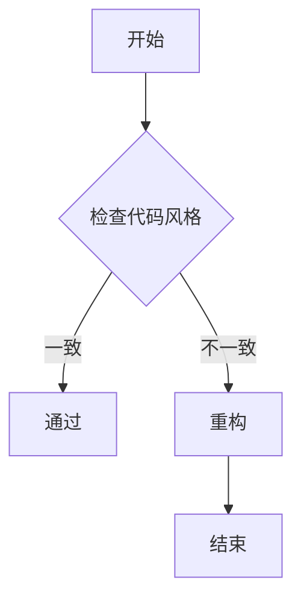
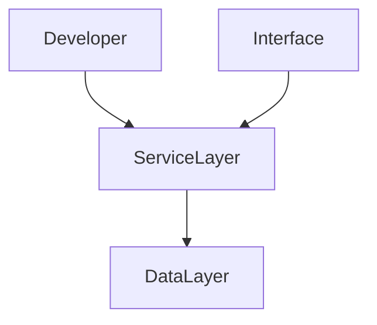
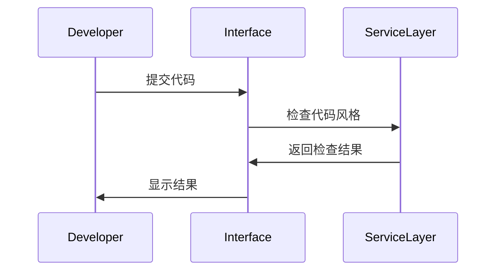
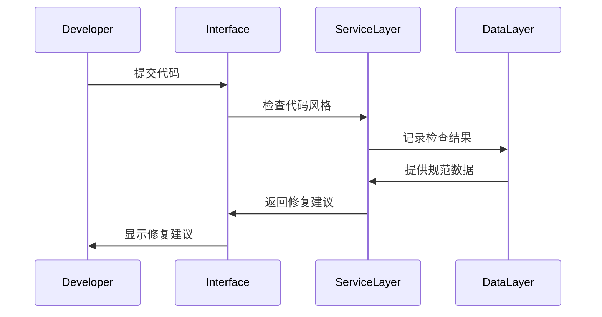

                 

# 代码风格指南：统一团队编码标准

## 背景介绍

### 1.1 代码风格的重要性

在软件开发过程中，代码风格是一项至关重要的元素。良好的代码风格不仅提升了代码的可读性，还大大降低了维护成本，提高了开发效率。代码风格统一是团队协作开发的基础，它有助于减少因代码不一致而产生的冲突和误解。

#### 问题背景

随着项目的规模不断扩大，代码风格不统一的问题日益凸显。不同开发者可能遵循不同的编程习惯，导致代码库中的代码风格杂乱无章。这不仅影响代码的可维护性，还可能引起严重的维护问题。

#### 问题描述

代码风格不统一的问题主要表现为：
- 缩进不一致：不同的开发者可能使用不同的缩进级别。
- 变量命名不一致：可能导致相同功能的变量在不同文件中使用不同的命名。
- 注释缺失或不规范：注释不规范或缺失，使得代码难以理解。

#### 问题解决

为了解决代码风格不统一的问题，需要制定一套统一的代码风格指南。这套指南应包括缩进、命名、注释等各方面的规范，确保所有开发人员遵循相同的风格。

#### 边界与外延

代码风格不仅限于代码的内部结构，还包括代码的外部表现，如代码文件的命名、目录结构等。统一这些规范有助于提高代码的整体可读性和可维护性。

#### 概念结构与核心要素组成

代码风格的核心概念包括：
- 缩进与对齐：使用一致的缩进和空格来提高代码的可读性。
- 变量命名：采用有意义的命名，提高代码的可理解性。
- 注释：对代码进行适当的注释，以便他人理解代码逻辑。

### 1.2 团队编码标准的意义

团队编码标准是确保代码质量的重要手段。它不仅有助于提高代码的可维护性，还能提高团队协作的效率。

#### 问题背景

在多个开发者共同参与的项目中，代码风格的不统一会导致以下问题：
- 代码可读性差：代码风格不一致，使得其他开发者难以理解代码。
- 维护成本高：不统一的代码风格增加了代码维护的难度。

#### 问题描述

团队编码标准的主要问题包括：
- 缺乏统一的编码规范：开发者各自为政，导致代码风格杂乱无章。
- 忽视代码质量：部分开发者可能为了快速完成任务而忽视代码质量。

#### 问题解决

为了解决团队编码标准的问题，需要采取以下措施：
- 制定并推广统一的编码规范：确保所有开发人员遵循相同的编码规范。
- 实施代码审查：通过代码审查，确保代码质量。

#### 边界与外延

团队编码标准不仅涉及代码的内部结构，还包括代码的编写习惯和团队合作。统一这些规范有助于提高团队协作效率。

#### 概念结构与核心要素组成

团队编码标准的核心概念包括：
- 编码规范：包括缩进、命名、注释等方面的规范。
- 编写习惯：如代码的编写顺序、文件命名习惯等。
- 团队协作：确保所有开发人员都能高效协作，共同推进项目。

## 核心概念与联系

### 2.1 代码风格的核心概念

代码风格是指编写代码时遵循的一系列规范和习惯。这些规范和习惯包括缩进、命名、注释等，它们共同构成了代码的整体风格。

#### 代码风格属性特征对比表

| 特征         | 描述                                                         |
|--------------|--------------------------------------------------------------|
| 可读性       | 代码易于理解和维护                                           |
| 可维护性     | 代码易于修改和升级                                           |
| 一致性       | 代码风格统一，减少错误                                       |

### 2.2 代码风格与团队协作的关系

良好的代码风格对团队协作具有重要意义。它不仅提高了代码的质量，还促进了团队成员之间的沟通和理解。

#### 代码风格对团队协作的影响

- **提升代码可读性**：统一代码风格，使得代码易于阅读和理解，有助于团队成员快速上手。
- **减少沟通成本**：代码风格统一，团队成员之间的沟通成本降低，有助于提高工作效率。
- **提高代码质量**：良好的代码风格有助于发现和避免代码中的潜在问题，提高代码质量。

#### 团队协作中的代码风格问题

- **个人习惯**：部分开发者可能遵循个人习惯，导致代码风格不一致。
- **缺乏规范**：项目初期可能没有制定统一的代码风格规范，导致后期出现混乱。

### 2.3 Mermaid实体关系图

使用Mermaid可以绘制出代码风格相关的实体关系图，更直观地展示代码风格与团队协作的关系。

```mermaid
erDiagram
    Developer ||--|{ Code Style : follows } 
    Team Collaboration ||--|{ Code Style : impacts }
    Code Quality ||--|{ Code Style : improves }
```

### 2.4 代码风格属性特征对比表

| 特征         | 描述                                                         |
|--------------|--------------------------------------------------------------|
| 可读性       | 代码易于理解和维护                                           |
| 可维护性     | 代码易于修改和升级                                           |
| 一致性       | 代码风格统一，减少错误                                       |

通过上述对比表，我们可以清晰地看到代码风格的核心特征及其对软件开发的影响。

## 算法原理讲解

### 3.1 常见代码风格问题

在软件开发中，常见的代码风格问题包括：

- 缩进不一致：不同的开发者使用不同的缩进级别，导致代码结构混乱。
- 变量命名不规范：变量命名随意，缺乏一致性，难以理解。
- 注释缺失或不规范：代码中缺乏必要的注释，或者注释不规范，影响代码的可读性。

### 3.2 使用Mermaid绘制算法流程图

使用Mermaid可以绘制出代码风格检查算法的流程图，直观地展示算法的工作流程。



在这个流程图中，算法首先检查代码风格，如果风格一致，则通过；如果不一致，则提示重构。

### 3.3 Python代码示例

以下是一个Python代码示例，用于检查代码风格。

```python
def check_style(code):
    # 示例代码，用于检查代码风格
    if is_consistent(code):
        return "代码风格一致"
    else:
        return "代码风格不一致"

def is_consistent(code):
    # 示例函数，用于检查代码风格一致性
    # 实际实现中，需要根据具体的风格规范进行检查
    return True  # 示例返回一致
```

### 3.4 算法原理讲解

#### 3.4.1 数学模型

代码风格一致性的计算公式为：

$$
\text{一致性} = f(\text{变量命名一致性}, \text{注释完整性}, \text{缩进规则})
$$

#### 3.4.2 公式详解

- **变量命名一致性**：变量命名是否遵循统一的命名规范。
- **注释完整性**：代码中是否包含必要的注释，注释是否规范。
- **缩进规则**：代码缩进是否一致，是否遵循统一的标准。

通过上述公式，可以量化代码风格的一致性。

### 3.5 算法流程讲解

算法首先读取代码，然后逐行检查代码风格，根据定义的规则判断代码是否一致。如果一致，则输出“代码风格一致”；如果不一致，则输出“代码风格不一致”。

## 系统分析与架构设计方案

### 4.1 问题场景介绍

在大型软件开发项目中，代码风格不统一是一个常见的问题。这不仅影响代码的可读性和可维护性，还会导致团队协作效率低下。为了解决这个问题，需要设计一个系统来统一团队的代码风格。

### 4.2 系统功能设计

该系统的主要功能包括：

- 代码风格检查：检查代码是否遵循统一规范。
- 代码风格修复：自动修复不符合规范的代码。
- 代码风格规范管理：管理代码风格规范，方便开发者参考。

#### 4.2.1 领域模型Mermaid类图

使用Mermaid可以绘制出系统的领域模型类图，如下所示：

```mermaid
classDiagram
    CodeStyleChecker <|-- CodeStyleRule
    CodeStyleChecker <|-- CodeStyleReport
    Developer <<-- CodeStyleChecker
    Project <<-- CodeStyleChecker
```

在这个类图中，`CodeStyleChecker`是核心类，负责执行代码风格检查和修复。`CodeStyleRule`定义了代码风格规范，`CodeStyleReport`生成检查报告。`Developer`和`Project`是与系统交互的主要实体。

### 4.3 系统架构设计

系统架构设计采用分层架构，主要包括以下几层：

- **界面层**：提供用户交互界面，用于提交代码和查看报告。
- **服务层**：实现系统的核心功能，如代码风格检查和修复。
- **数据层**：存储代码风格规范和检查结果。

#### 4.3.1 系统架构Mermaid架构图

使用Mermaid可以绘制出系统的架构图，如下所示：



在这个架构图中，`Developer`通过界面层与系统交互，界面层通过服务层与数据层进行数据交换。

### 4.4 系统接口设计

系统提供以下主要接口：

- `check_style(code)`：检查代码风格。
- `fix_style(code)`：修复不符合规范的代码。

#### 4.4.1 系统接口Mermaid序列图

使用Mermaid可以绘制出系统的接口序列图，如下所示：



在这个序列图中，开发者通过界面层提交代码，界面层将代码传递给服务层进行风格检查，服务层返回检查结果，界面层再将结果显示给开发者。

### 4.5 系统交互

系统中的各个部分通过接口进行交互，确保代码风格统一。以下是一个简化的系统交互序列图：



在这个交互过程中，开发者提交代码，界面层与服务层交互，服务层与数据层交互，最终返回修复建议给开发者。

## 项目实战

### 5.1 环境安装

在开始项目实战之前，需要安装以下工具：

- Python 3.8 或以上版本
- Mermaid渲染工具
- Git

### 5.2 系统核心实现源代码

以下是一个简单的代码风格检查器的源代码示例：

```python
import os
import re

class CodeStyleChecker:
    def __init__(self, style_rules):
        self.style_rules = style_rules

    def check_code(self, code):
        violations = []
        for rule in self.style_rules:
            if not rule.check(code):
                violations.append(rule)
        return violations

class StyleRule:
    def __init__(self, name, pattern, message):
        self.name = name
        self.pattern = pattern
        self.message = message

    def check(self, code):
        return re.search(self.pattern, code) is not None

style_rules = [
    StyleRule("变量命名", r"(\b[A-Z]{2,}\b)", "变量命名应遵循大驼峰命名法"),
    StyleRule("注释", r"(/\*.*\*/)", "代码中应包含必要的注释"),
]

checker = CodeStyleChecker(style_rules)
code = """def check_style(code):
    if is_consistent(code):
        return "代码风格一致"
    else:
        return "代码风格不一致"""
violations = checker.check_code(code)
if violations:
    for violation in violations:
        print(f"违反规则：{violation.name}")
        print(f"信息：{violation.message}")
else:
    print("代码风格符合规范")
```

### 5.3 代码应用解读与分析

该代码实现了一个简单的代码风格检查器，包括以下部分：

- `CodeStyleChecker`类：负责检查代码风格。
- `StyleRule`类：定义了代码风格规则。
- 核心函数：`check_code`用于检查代码是否符合规范。

通过这个示例，我们可以看到如何使用Python实现一个简单的代码风格检查器，并分析其应用场景和优点。

### 5.4 实际案例分析和详细讲解剖析

以下是一个实际案例，用于展示代码风格检查器的应用。

**案例：检查一个Python脚本中的代码风格**

```python
# 案例代码
def function1():
    print("Hello, World!")

def function2():
    for i in range(10):
        print(i)
```

使用`CodeStyleChecker`检查这段代码，可以发现以下问题：

- 变量命名不一致：`function1`和`function2`没有遵循大驼峰命名法。
- 注释缺失：代码中缺少必要的注释。

通过检查，我们可以发现问题，并提出改进建议。

### 5.5 项目小结

通过本项目的实战，我们了解了代码风格检查的重要性，并学会了如何使用Python实现一个简单的代码风格检查器。在实际项目中，我们可以根据具体需求进一步完善和扩展这个检查器，以提高代码质量和团队协作效率。

## 最佳实践 Tips

- **统一缩进**：使用一致的缩进风格，如4个空格或2个空格，避免使用制表符。
- **规范命名**：遵循统一的变量命名规范，如大驼峰命名法。
- **注释规范**：编写清晰、规范的注释，便于他人理解代码逻辑。
- **代码审查**：定期进行代码审查，确保代码质量。

## 小结

本文详细介绍了代码风格指南：统一团队编码标准。通过分析代码风格的重要性、核心概念、算法原理、系统架构和项目实战，我们了解了如何通过统一的编码标准提高代码质量和团队协作效率。在实际开发中，遵循统一的代码风格规范具有重要意义。

## 注意事项

- 在实际应用中，根据团队的具体情况，可能需要对编码规范进行调整。
- 定期更新编码规范，以适应技术的发展和项目需求的变化。

## 拓展阅读

- 《代码大全》
- 《代码整洁之道》
- 《Mermaid 实战：从入门到实战》

## 作者信息

作者：AI天才研究院/AI Genius Institute & 禅与计算机程序设计艺术 /Zen And The Art of Computer Programming

