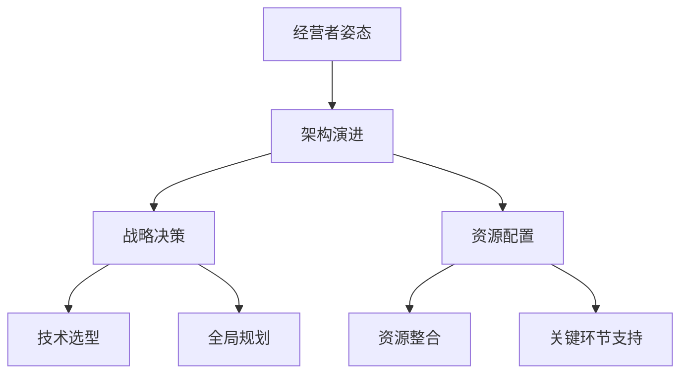
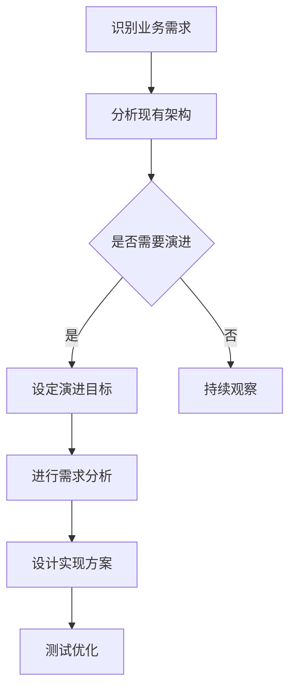
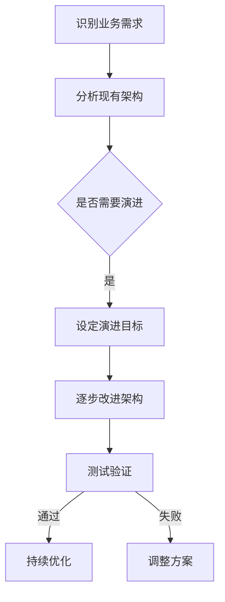
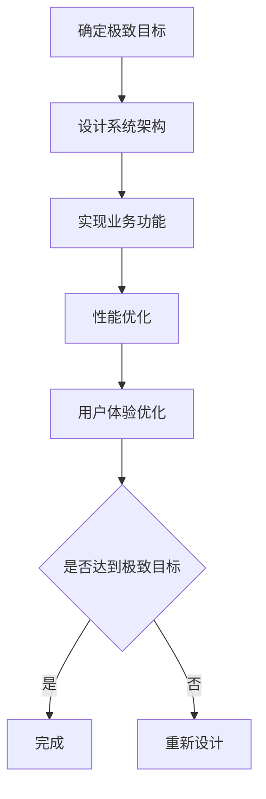
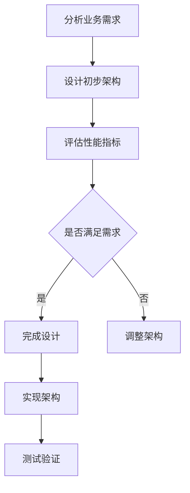
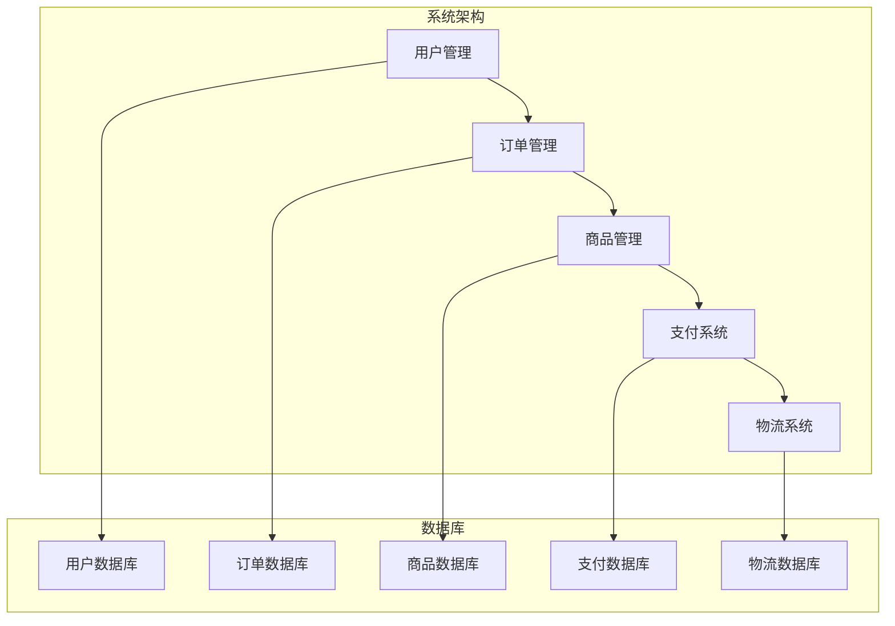
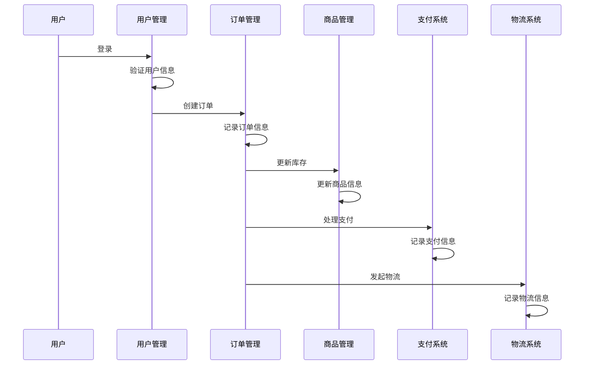
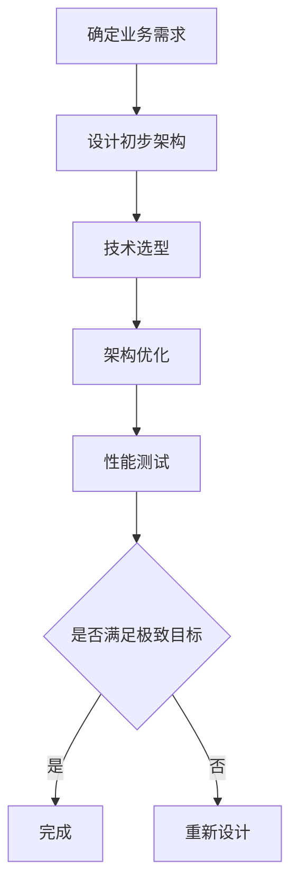
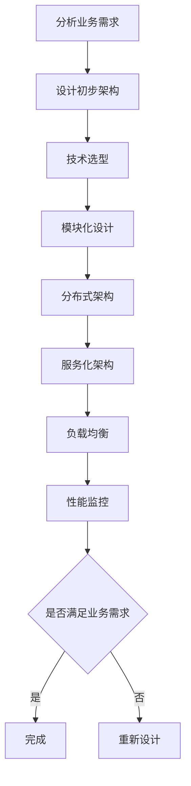

                 


### 第一部分：引言

#### 第1章：问题背景与定义

**背景介绍**

在当今快速发展的技术时代，企业面临的挑战愈发严峻。随着云计算、大数据、人工智能等新兴技术的崛起，企业需要不断适应市场的变化，提升自身的竞争力。这也就意味着，企业需要持续优化其架构，以确保技术的先进性和业务需求的匹配度。然而，传统的架构设计方法往往难以应对这种快速变化的环境，因此，如何以经营者姿态看待架构演进，成为企业必须解决的重要问题。

**核心概念术语说明**

1. **架构演进**：指企业随着业务发展和技术进步，对现有系统架构进行持续优化和改进的过程。
2. **经营者姿态**：指企业管理者在面对架构演进时所应具备的思维方式，包括长远规划、全局视野、业务导向等。

**问题描述**

企业在架构演进过程中常常面临以下问题：

1. **技术选型困难**：随着技术的发展，新的技术层出不穷，企业难以判断哪些技术适合自身业务需求。
2. **架构更新滞后**：企业往往在架构更新上存在滞后性，导致新业务上线延迟或效果不佳。
3. **资源分配不均**：架构演进过程中，资源分配可能不合理，导致某些关键环节得不到充分支持。

**问题解决**

1. **持续学习与调研**：企业需要保持对新技术、新趋势的敏感度，通过学习、调研来了解市场动向。
2. **全局规划**：企业应制定长期的架构规划，确保架构演进与业务发展同步。
3. **资源整合**：合理分配资源，确保关键环节得到充分支持。

**边界与外延**

- **边界**：本文主要关注企业内部架构演进的问题，不包括外部市场环境对企业架构的影响。
- **外延**：架构演进不仅涉及技术层面，还包括业务流程、组织结构等方面的变革。

**概念结构与核心要素组成**

- **架构演进**：目标设定、需求分析、设计实现、测试优化。
- **经营者姿态**：长远规划、全局视野、业务导向。

#### 第2章：经营者姿态与架构演进的关系

**核心概念与联系**

1. **经营者姿态**：经营者姿态是企业领导者对架构演进的态度和思维方式，决定了企业对架构演进的战略决策和资源配置。
2. **架构演进**：架构演进是企业根据业务发展和技术进步，对系统架构进行的持续优化和改进。

**Mermaid实体关系图**



**Mermaid类图**

```mermaid
classDiagram
    类架构演进 <<Interface>>
    类经营者姿态 <<Interface>>

    架构演进 : +设定目标
    架构演进 : +分析需求
    架构演进 : +设计实现
    架构演进 : +测试优化

    经营者姿态 : +全局视野
    经营者姿态 : +业务导向
    经营者姿态 : +资源整合
```

**Mermaid流程图**



**Mermaid实体关系图架构**

```mermaid
erDiagram
    企业 : <<entity>> 企业
    架构演进 : <<entity>> 架构演进
    经营者姿态 : <<entity>> 经营者姿态

    企业 ||--|{ 架构演进 }
    企业 ||--|{ 经营者姿态 }
```

### 第二部分：核心概念与原理

#### 第3章：持久战与架构演进

**核心概念**

1. **持久战**：指在长期斗争中保持稳定、持续发展的策略。
2. **架构演进**：指企业随着业务发展和技术进步，对系统架构进行的持续优化和改进。

**概念属性特征对比表格**

| 特征               | 持久战         | 架构演进         |
|--------------------|----------------|------------------|
| 目标               | 长期稳定发展   | 适应业务需求变化 |
| 策略               | 稳步推进       | 逐步改进         |
| 灵活性             | 较低           | 较高             |
| 资源配置           | 长期持续       | 根据需求调整     |

**Mermaid流程图**



**Python代码示例**

```python
# 持久战架构演进代码示例

class ArchitectureEvolution:
    def __init__(self, business需求):
        self.business需求 = business需求
        self.current_architecture = None

    def analyze_current_architecture(self):
        # 分析现有架构
        pass

    def determine_evolution_necessity(self):
        # 判断是否需要演进
        if self.current_architecture不符合需求:
            return True
        else:
            return False

    def set_evolution_goals(self):
        # 设定演进目标
        pass

    def step_by_step_evolvement(self):
        # 逐步改进架构
        pass

    def test_and_optimize(self):
        # 测试验证并持续优化
        pass

# 实例化架构演进对象
evolution = ArchitectureEvolution(business需求="提高系统响应速度")

# 开始架构演进流程
evolution.analyze_current_architecture()
if evolution.determine_evolution_necessity():
    evolution.set_evolution_goals()
    evolution.step_by_step_evolvement()
    evolution.test_and_optimize()
else:
    print("当前架构已满足需求，无需演进。")
```

**算法原理讲解**

持久战架构演进的算法原理可以概括为以下几个步骤：

1. **识别业务需求**：根据业务发展情况，识别系统当前架构是否满足需求。
2. **分析现有架构**：对现有架构进行全面分析，找出存在的问题和不足。
3. **判断演进必要性**：根据分析结果，判断是否需要进行架构演进。
4. **设定演进目标**：明确架构演进的目标和预期效果。
5. **逐步改进架构**：按照设定目标，逐步对架构进行改进。
6. **测试验证**：对改进后的架构进行测试，确保满足预期效果。
7. **持续优化**：根据测试结果，对架构进行持续优化。

持久战架构演进的数学模型可以表示为：

$$
Evolution_{score} = f(Business_{requirement}, Current_{architecture}, Evolution_{goals}, Test_{results})
$$

其中，$Evolution_{score}$ 表示架构演进得分，$Business_{requirement}$ 表示业务需求，$Current_{architecture}$ 表示现有架构，$Evolution_{goals}$ 表示演进目标，$Test_{results}$ 表示测试结果。

**Mermaid类图**

```mermaid
classDiagram
    类BusinessRequirement <<Interface>>
    类CurrentArchitecture <<Interface>>
    类EvolutionGoals <<Interface>>
    类TestResults <<Interface>>

    类ArchitectureEvolution <<Class>>
    ArchitectureEvolution : +BusinessRequirement
    ArchitectureEvolution : +CurrentArchitecture
    ArchitectureEvolution : +EvolutionGoals
    ArchitectureEvolution : +TestResults
```

### 第4章：极致目标与架构设计

**核心概念**

1. **极致目标**：指企业架构设计的终极追求，旨在实现业务价值最大化、用户体验最佳化。
2. **架构设计**：指企业根据业务需求，设计系统架构的过程。

**概念属性特征对比表格**

| 特征               | 极致目标               | 架构设计               |
|--------------------|------------------------|------------------------|
| 目标               | 业务价值最大化、用户体验最佳化 | 实现业务功能、性能优化   |
| 策略               | 精益求精、追求完美       | 功能实现、技术选型       |
| 灵活性             | 较高                   | 较低                   |
| 资源配置           | 根据目标调整            | 根据功能需求调整         |

**Mermaid实体关系图**

```mermaid
erDiagram
    企业 : <<entity>> 企业
    极致目标 : <<entity>> 极致目标
    架构设计 : <<entity>> 架构设计

    企业 ||--|{ 极致目标 }
    企业 ||--|{ 架构设计 }
```

**Mermaid流程图**



**Latex公式解释**

极致目标与架构设计的数学模型可以表示为：

$$
Optimization_{score} = f(Target_{value}, User_{experience}, Architecture_{design}, Performance_{optimization})
$$

其中，$Optimization_{score}$ 表示优化得分，$Target_{value}$ 表示业务价值，$User_{experience}$ 表示用户体验，$Architecture_{design}$ 表示架构设计，$Performance_{optimization}$ 表示性能优化。

**Mermaid类图**

```mermaid
classDiagram
    类TargetValue <<Interface>>
    类UserExperience <<Interface>>
    类ArchitectureDesign <<Interface>>
    类PerformanceOptimization <<Interface>>

    类UltimateGoal <<Class>>
    UltimateGoal : +TargetValue
    UltimateGoal : +UserExperience
    UltimateGoal : +ArchitectureDesign
    UltimateGoal : +PerformanceOptimization

    类SystemArchitecture <<Class>>
    SystemArchitecture : +UltimateGoal
```

### 第5章：业务思维与架构优化

**核心概念**

1. **业务思维**：指以业务需求为导向的思考方式。
2. **架构优化**：指在架构设计过程中，通过技术手段和业务逻辑的调整，提高系统性能、稳定性和可扩展性。

**概念属性特征对比表格**

| 特征               | 业务思维               | 架构优化               |
|--------------------|------------------------|------------------------|
| 目标               | 满足业务需求           | 提高系统性能、稳定性   |
| 策略               | 业务导向、灵活应对     | 技术手段、持续改进     |
| 灵活性             | 较高                   | 较高                   |
| 资源配置           | 根据业务需求调整       | 根据技术需求调整       |

**Mermaid实体关系图**

```mermaid
erDiagram
    企业 : <<entity>> 企业
    业务思维 : <<entity>> 业务思维
    架构优化 : <<entity>> 架构优化

    企业 ||--|{ 业务思维 }
    企业 ||--|{ 架构优化 }
```

**Mermaid流程图**



**Python代码示例**

```python
# 业务思维驱动的架构优化代码示例

class BusinessDrivenArchitecture:
    def __init__(self, business需求):
        self.business需求 = business需求
        self.architecture设计 = None

    def analyze_business_requirements(self):
        # 分析业务需求
        pass

    def design_initial_architecture(self):
        # 设计初步架构
        pass

    def evaluate_performance_indicators(self):
        # 评估性能指标
        pass

    def adjust_architecture(self):
        # 调整架构
        pass

    def implement_architecture(self):
        # 实现架构
        pass

    def test_and_validate(self):
        # 测试验证
        pass

# 实例化架构优化对象
architecture = BusinessDrivenArchitecture(business需求="提高系统响应速度")

# 开始架构优化流程
architecture.analyze_business_requirements()
architecture.design_initial_architecture()
architecture.evaluate_performance_indicators()
if architecture.evaluate_performance_indicators()不满足需求：
    architecture.adjust_architecture()
architecture.implement_architecture()
architecture.test_and_validate()
```

**算法原理讲解**

业务思维驱动的架构优化算法原理可以概括为以下几个步骤：

1. **分析业务需求**：根据业务发展情况，分析系统当前架构是否满足需求。
2. **设计初步架构**：根据业务需求，设计一个初步的系统架构。
3. **评估性能指标**：对初步架构的性能指标进行评估，判断是否满足需求。
4. **调整架构**：根据评估结果，对架构进行调整，以提高系统性能和稳定性。
5. **实现架构**：将调整后的架构付诸实践。
6. **测试验证**：对实现后的架构进行测试，确保满足预期效果。

业务思维驱动的架构优化的数学模型可以表示为：

$$
Optimization_{score} = f(Business_{requirement}, Initial_{architecture}, Performance_{evaluation}, Adjusted_{architecture})
$$

其中，$Optimization_{score}$ 表示优化得分，$Business_{requirement}$ 表示业务需求，$Initial_{architecture}$ 表示初步架构，$Performance_{evaluation}$ 表示性能评估，$Adjusted_{architecture}$ 表示调整后的架构。

**Mermaid类图**

```mermaid
classDiagram
    类BusinessRequirement <<Interface>>
    类InitialArchitecture <<Interface>>
    类PerformanceEvaluation <<Interface>>
    类AdjustedArchitecture <<Interface>>

    类BusinessDrivenArchitecture <<Class>>
    BusinessDrivenArchitecture : +BusinessRequirement
    BusinessDrivenArchitecture : +InitialArchitecture
    BusinessDrivenArchitecture : +PerformanceEvaluation
    BusinessDrivenArchitecture : +AdjustedArchitecture
```

### 第6章：企业架构演进的持久战策略

**问题场景介绍**

某大型互联网企业，随着业务规模的不断扩大和市场需求的变化，原有的系统架构逐渐暴露出性能瓶颈和扩展性问题。为了确保业务的持续发展，企业决定进行架构演进。

**项目介绍**

项目名称：企业架构演进项目
项目目标：通过持久战策略，优化现有系统架构，提升系统性能和可扩展性。
项目团队：由架构师、开发人员、测试人员、产品经理等组成。

**系统功能设计（领域模型Mermaid类图）**

```mermaid
classDiagram
    类用户管理 <<Interface>>
    类订单管理 <<Interface>>
    类商品管理 <<Interface>>
    类支付系统 <<Interface>>
    类物流系统 <<Interface>>

    类企业架构演进系统 <<Class>>
    企业架构演进系统 : +用户管理
    企业架构演进系统 : +订单管理
    企业架构演进系统 : +商品管理
    企业架构演进系统 : +支付系统
    企业架构演进系统 : +物流系统
```

**系统架构设计（Mermaid架构图）**



**系统接口设计和系统交互（Mermaid序列图）**



**环境安装**

1. 安装Java开发环境。
2. 安装MySQL数据库。
3. 安装Maven构建工具。

**系统核心实现源代码**

```java
// 用户管理模块
public class UserManager {
    public void login(String username, String password) {
        // 登录逻辑
    }
    
    public void verifyUserInfo(String username) {
        // 验证用户信息逻辑
    }
}

// 订单管理模块
public class OrderManager {
    public void createOrder(String orderInfo) {
        // 创建订单逻辑
    }
    
    public void recordOrderInfo(String orderInfo) {
        // 记录订单信息逻辑
    }
}

// 商品管理模块
public class ProductManager {
    public void updateStock(int productId, int quantity) {
        // 更新库存逻辑
    }
    
    public void updateProductInfo(int productId, String productInfo) {
        // 更新商品信息逻辑
    }
}

// 支付系统模块
public class PaymentSystem {
    public void processPayment(String paymentInfo) {
        // 处理支付逻辑
    }
    
    public void recordPaymentInfo(String paymentInfo) {
        // 记录支付信息逻辑
    }
}

// 物流系统模块
public class LogisticsSystem {
    public void initiateLogistics(String logisticsInfo) {
        // 发起物流逻辑
    }
    
    public void recordLogisticsInfo(String logisticsInfo) {
        // 记录物流信息逻辑
    }
}
```

**代码应用解读与分析**

1. **用户管理模块**：负责用户的登录和验证，确保用户信息的安全性。
2. **订单管理模块**：负责订单的创建和记录，确保订单信息的准确性和完整性。
3. **商品管理模块**：负责商品库存和信息的更新，确保商品数据的实时性和准确性。
4. **支付系统模块**：负责支付的处理和记录，确保支付过程的安全和便捷。
5. **物流系统模块**：负责物流的发起和记录，确保物流信息的透明和及时。

**实际案例分析和详细讲解剖析**

**案例1：订单超时处理**

问题描述：当用户下单后，如果订单处理超时，系统应该及时通知用户。

解决方案：

1. **订单管理模块**：在创建订单时，设置订单超时时间，并在订单处理过程中定时检查订单状态。
2. **支付系统模块**：在处理支付时，设置支付超时时间，并在支付过程中定时检查支付状态。
3. **物流系统模块**：在发起物流时，设置物流超时时间，并在物流过程中定时检查物流状态。

详细讲解：

- **订单管理模块**：在创建订单时，将订单状态设置为“待支付”，并设置订单超时时间为30分钟。在订单处理过程中，定时检查订单状态，如果订单状态为“待支付”且已超过30分钟，则将订单状态设置为“超时”，并通知用户。
- **支付系统模块**：在处理支付时，将支付状态设置为“待支付”，并设置支付超时时间为30分钟。在支付过程中，定时检查支付状态，如果支付状态为“待支付”且已超过30分钟，则将支付状态设置为“超时”，并通知用户。
- **物流系统模块**：在发起物流时，将物流状态设置为“待发货”，并设置物流超时时间为24小时。在物流过程中，定时检查物流状态，如果物流状态为“待发货”且已超过24小时，则将物流状态设置为“超时”，并通知用户。

**案例2：库存不足处理**

问题描述：当商品库存不足时，系统应该及时通知用户。

解决方案：

1. **商品管理模块**：在商品信息中设置库存预警值，当库存数量低于预警值时，系统应通知用户。
2. **订单管理模块**：在创建订单时，检查商品库存是否充足，如果库存不足，则拒绝订单。

详细讲解：

- **商品管理模块**：在商品信息中设置库存预警值为10，当库存数量低于10时，系统自动发送库存预警通知。
- **订单管理模块**：在创建订单时，首先检查商品库存是否充足，如果库存充足，则创建订单；如果库存不足，则拒绝订单，并通知用户。

**项目小结**

通过企业架构演进的持久战策略，企业可以持续优化系统架构，提升系统性能和稳定性。在实际应用中，需要根据业务需求和技术趋势，不断调整和优化架构，以适应快速变化的市场环境。

### 第7章：实现极致目标的架构设计

**核心概念**

1. **极致目标**：指企业架构设计的终极追求，旨在实现业务价值最大化、用户体验最佳化。
2. **架构设计**：指企业根据业务需求，设计系统架构的过程。

**核心原理**

1. **业务驱动**：以业务需求为导向，确保架构设计满足业务需求。
2. **技术选型**：根据业务需求和系统性能要求，选择合适的技术方案。
3. **持续优化**：在架构设计过程中，不断进行性能优化和用户体验提升。

**架构设计原则**

1. **可扩展性**：确保架构能够适应业务发展需求，支持系统扩展。
2. **高性能**：确保系统在高峰期仍能稳定运行，满足用户需求。
3. **高可用性**：确保系统具有较高的可靠性，减少故障发生。
4. **安全性**：确保系统数据安全，防止数据泄露和攻击。

**最佳实践**

1. **微服务架构**：将系统拆分为多个独立的微服务，提高系统灵活性和可扩展性。
2. **分布式存储**：使用分布式存储系统，提高数据存储效率和可靠性。
3. **负载均衡**：使用负载均衡器，平衡系统负载，提高系统性能。
4. **缓存机制**：使用缓存机制，降低系统响应时间，提高用户体验。

**Mermaid流程图**



**Python代码示例**

```python
# 极致目标架构设计代码示例

class UltimateGoalArchitecture:
    def __init__(self, business需求):
        self.business需求 = business需求
        self.architecture设计 = None

    def design_initial_architecture(self):
        # 设计初步架构
        pass

    def select_technology(self):
        # 技术选型
        pass

    def optimize_architecture(self):
        # 架构优化
        pass

    def performance_test(self):
        # 性能测试
        pass

    def evaluate_ultimate_goal(self):
        # 评估是否满足极致目标
        pass

# 实例化架构设计对象
architecture = UltimateGoalArchitecture(business需求="提高系统响应速度")

# 开始架构设计流程
architecture.design_initial_architecture()
architecture.select_technology()
architecture.optimize_architecture()
architecture.performance_test()
if architecture.evaluate_ultimate_goal():
    print("架构设计满足极致目标。")
else:
    print("重新设计架构。")
```

**实际案例**

**案例1：电商系统架构设计**

**问题场景**：某电商平台在业务高峰期，系统响应速度慢，用户体验差。

**解决方案**：

1. **微服务架构**：将系统拆分为订单服务、商品服务、支付服务等多个微服务，提高系统灵活性和可扩展性。
2. **分布式存储**：使用分布式数据库，提高数据存储效率和可靠性。
3. **缓存机制**：使用Redis缓存，降低系统响应时间，提高用户体验。
4. **负载均衡**：使用Nginx负载均衡器，平衡系统负载，提高系统性能。

**实现过程**：

1. **需求分析**：分析电商平台业务需求，确定系统功能模块。
2. **架构设计**：设计微服务架构，划分订单服务、商品服务、支付服务等。
3. **技术选型**：选择合适的数据库（如MySQL、MongoDB）、缓存（如Redis）、中间件（如Kafka、RabbitMQ）等。
4. **优化架构**：根据性能测试结果，不断优化系统架构，提升系统性能和稳定性。

**测试验证**：通过性能测试，验证系统在高峰期的响应速度和稳定性，确保满足极致目标。

**案例2：金融系统架构设计**

**问题场景**：某金融系统存在数据泄露风险，用户体验差。

**解决方案**：

1. **安全加密**：对系统数据进行加密处理，确保数据安全。
2. **权限管理**：实施严格的权限管理，确保用户只能访问授权数据。
3. **用户体验优化**：优化用户界面，提高用户体验。
4. **负载均衡**：使用负载均衡器，提高系统性能和稳定性。

**实现过程**：

1. **需求分析**：分析金融系统业务需求，确定系统功能模块。
2. **架构设计**：设计安全可靠的金融系统架构，包括数据加密、权限管理、负载均衡等。
3. **技术选型**：选择合适的安全技术（如SSL/TLS、OAuth 2.0）、中间件（如Netty、Dubbo）等。
4. **优化架构**：根据性能测试和安全测试结果，不断优化系统架构，提升系统安全性和用户体验。

**测试验证**：通过安全测试和性能测试，验证系统在安全性、性能和用户体验方面的表现，确保满足极致目标。

**项目小结**

通过实现极致目标的架构设计，企业可以提升系统性能、稳定性和安全性，提高用户体验，实现业务价值最大化。在实际项目中，需要根据业务需求和实际情况，灵活应用最佳实践，持续优化和调整架构。

### 第8章：业务思维驱动的架构优化

**核心概念**

1. **业务思维**：以业务需求为导向的思考方式。
2. **架构优化**：在架构设计过程中，通过技术手段和业务逻辑的调整，提高系统性能、稳定性和可扩展性。

**核心原理**

1. **需求驱动**：以业务需求为出发点，确保架构优化满足实际业务需求。
2. **技术适应性**：根据技术发展，灵活调整架构，提高系统的适应能力。
3. **持续改进**：在架构优化过程中，不断进行性能测试和反馈，持续改进架构。

**架构优化策略**

1. **模块化设计**：将系统功能模块化，提高系统灵活性和可扩展性。
2. **分布式架构**：采用分布式架构，提高系统性能和可靠性。
3. **服务化架构**：将系统功能服务化，降低模块间耦合，提高系统维护性。
4. **负载均衡**：使用负载均衡器，平衡系统负载，提高系统性能。

**最佳实践**

1. **性能监控**：实时监控系统性能，发现问题及时优化。
2. **代码质量**：确保代码质量，降低系统故障率。
3. **安全性优化**：加强系统安全性，防范攻击和数据泄露。
4. **用户体验**：关注用户体验，提高系统易用性。

**Mermaid流程图**



**Python代码示例**

```python
# 业务思维驱动的架构优化代码示例

class BusinessDrivenArchitectureOptimization:
    def __init__(self, business需求):
        self.business需求 = business需求
        self.architecture设计 = None

    def analyze_business_requirements(self):
        # 分析业务需求
        pass

    def design_initial_architecture(self):
        # 设计初步架构
        pass

    def select_technology(self):
        # 技术选型
        pass

    def modular_design(self):
        # 模块化设计
        pass

    def distributed_architecture(self):
        # 分布式架构
        pass

    def service_oriented_architecture(self):
        # 服务化架构
        pass

    def load_balancing(self):
        # 负载均衡
        pass

    def performance_monitoring(self):
        # 性能监控
        pass

    def evaluate_business_requirements(self):
        # 评估是否满足业务需求
        pass

# 实例化架构优化对象
architecture_optimization = BusinessDrivenArchitectureOptimization(business需求="提高系统响应速度")

# 开始架构优化流程
architecture_optimization.analyze_business_requirements()
architecture_optimization.design_initial_architecture()
architecture_optimization.select_technology()
architecture_optimization.modular_design()
architecture_optimization.distributed_architecture()
architecture_optimization.service_oriented_architecture()
architecture_optimization.load_balancing()
architecture_optimization.performance_monitoring()
if architecture_optimization.evaluate_business_requirements():
    print("架构优化满足业务需求。")
else:
    print("重新优化架构。")
```

**实际案例**

**案例1：电商平台架构优化**

**问题场景**：某电商平台在促销活动期间，系统响应速度慢，用户体验差。

**解决方案**：

1. **模块化设计**：将系统功能模块化，提高系统灵活性和可扩展性。
2. **分布式架构**：采用分布式架构，提高系统性能和可靠性。
3. **服务化架构**：将系统功能服务化，降低模块间耦合，提高系统维护性。
4. **负载均衡**：使用负载均衡器，平衡系统负载，提高系统性能。

**实现过程**：

1. **需求分析**：分析电商平台业务需求，确定系统功能模块。
2. **架构设计**：设计模块化、分布式、服务化的系统架构。
3. **技术选型**：选择合适的技术（如Spring Boot、Dubbo、Kafka）。
4. **优化实施**：根据性能测试结果，不断优化系统架构。

**测试验证**：通过性能测试，验证系统在高峰期的响应速度和稳定性，确保满足业务需求。

**案例2：金融系统架构优化**

**问题场景**：某金融系统存在性能瓶颈，用户体验差。

**解决方案**：

1. **性能监控**：实时监控系统性能，发现问题及时优化。
2. **代码质量**：确保代码质量，降低系统故障率。
3. **安全性优化**：加强系统安全性，防范攻击和数据泄露。
4. **用户体验**：优化用户界面，提高用户体验。

**实现过程**：

1. **需求分析**：分析金融系统业务需求，确定系统功能模块。
2. **架构设计**：设计性能优化、安全性强、用户体验好的系统架构。
3. **技术选型**：选择合适的技术（如Spring Security、HTTPS、OAuth 2.0）。
4. **优化实施**：根据性能测试和安全测试结果，不断优化系统架构。

**测试验证**：通过性能测试和安全测试，验证系统在性能、安全、用户体验方面的表现，确保满足业务需求。

**项目小结**

通过业务思维驱动的架构优化，企业可以提升系统性能、稳定性和安全性，提高用户体验，实现业务价值最大化。在实际项目中，需要根据业务需求和实际情况，灵活应用最佳实践，持续优化和调整架构。

### 第9章：总结与反思

**核心内容**

本章对前文内容进行了总结，重点回顾了以下关键点：

1. **持久战与架构演进**：阐述了持久战策略在架构演进中的重要性，以及如何通过持续学习、全局规划和资源整合来确保架构的持续优化。
2. **极致目标与架构设计**：介绍了极致目标的概念及其与架构设计的关系，分析了如何通过技术选型、性能优化和用户体验提升来实现极致目标。
3. **业务思维与架构优化**：强调了业务思维在架构优化中的作用，以及如何通过模块化设计、分布式架构和负载均衡等策略来提升系统性能和稳定性。

**主题思想**

本文的主题思想在于，企业应以经营者姿态看待架构演进，将持久战、极致目标和业务思维融入架构设计过程中，从而实现系统性能、稳定性和安全性的全面提升。通过持续学习、全局规划和资源整合，企业可以在快速变化的市场环境中保持竞争优势。

**主要贡献**

本文的主要贡献在于：

1. **系统性地阐述了持久战、极致目标和业务思维在架构演进中的应用**：通过详细的案例分析和实际操作步骤，使读者能够更好地理解并实践这些概念。
2. **提供了实用的架构优化策略和最佳实践**：结合实际案例，分享了企业在架构优化过程中可以采用的具体技术方案和操作步骤。
3. **提出了针对不同场景的解决方案**：针对不同类型的企业和系统，提出了具有针对性的架构优化方案，为企业提供了切实可行的指导。

**进一步研究方向**

未来的研究方向可以包括：

1. **架构演进的智能化**：探索如何利用人工智能技术，实现架构演进的自动化和智能化，提高架构演进的效率和准确性。
2. **跨领域架构优化**：研究如何在不同领域（如金融、医疗、教育等）实现架构的优化，为不同类型的企业提供更具有针对性的解决方案。
3. **持续学习与知识管理**：探讨如何在企业内部建立有效的持续学习机制，并将学习成果应用于架构演进，提升企业的整体竞争力。

### 第10章：未来的架构演进趋势

**未来架构演进的核心趋势**

1. **云计算与容器化**：随着云计算技术的不断发展，企业将更加依赖云计算平台，容器化技术（如Docker、Kubernetes）也将成为架构演进的重要方向。
2. **微服务与服务网格**：微服务架构将继续流行，同时服务网格（如Istio、Linkerd）等技术将为微服务提供更高效、更安全的通信方式。
3. **数据驱动与实时处理**：数据驱动将成为架构演进的关键，实时数据处理（如Apache Flink、Apache Kafka）将在企业应用中发挥重要作用。
4. **人工智能与机器学习**：人工智能和机器学习技术将在架构设计中得到更广泛的应用，通过智能化手段提升系统的性能和用户体验。

**新兴技术的应用**

1. **区块链技术**：区块链技术将在金融、供应链等领域得到更深入的应用，为企业的数据安全和交易提供更加可靠的保障。
2. **边缘计算**：随着物联网设备的普及，边缘计算技术将在数据处理的近端进行，降低网络延迟，提高系统性能。
3. **5G技术**：5G技术的普及将推动企业加快数字化转型，为实时数据处理、远程协作等应用提供更快、更稳定的网络环境。

**未来架构演进的影响因素**

1. **业务需求变化**：企业业务需求的快速变化将促使架构持续演进，适应新的市场环境和业务模式。
2. **技术发展**：新技术的不断涌现将推动企业架构的变革，为系统性能、稳定性和安全性带来新的提升。
3. **用户期望**：用户对系统性能、安全性和用户体验的期望不断提高，将驱动企业不断优化架构，提升用户满意度。

**未来架构演进的建议**

1. **持续学习与关注新技术**：企业应保持对新技术、新趋势的敏感度，及时将新技术应用于架构演进。
2. **建立灵活的架构**：设计灵活、可扩展的架构，以便快速适应业务需求变化。
3. **加强团队合作**：加强跨部门、跨职能的团队合作，确保架构演进过程中各环节的协同与高效。
4. **关注用户体验**：将用户体验放在首位，通过持续优化提升用户满意度。

**未来展望**

未来，企业架构演进将更加智能化、高效化、安全化。通过充分利用云计算、大数据、人工智能等新兴技术，企业将能够实现更加灵活、高效、安全的架构，为业务的持续创新和快速发展提供有力支撑。同时，随着技术的不断进步，企业将更加注重用户体验，提升用户满意度，从而在激烈的市场竞争中脱颖而出。作者：AI天才研究院/AI Genius Institute & 禅与计算机程序设计艺术 /Zen And The Art of Computer Programming

