                 

### 《众包开发：利用群体智慧解决技术难题》

#### 关键词：众包、技术难题、群体智慧、解决方案、知识产权

#### 摘要：
本文将深入探讨众包开发这一新兴模式，分析其在解决技术难题方面的潜力与挑战。我们将首先介绍众包开发的基本概念和历程，随后讨论其优势与局限。接下来，将重点分析众包平台与工具的选择和应用，以及项目管理与社区文化建设的要点。文章将结合实际案例，详细探讨技术难题众包的实践过程，并分析其中的知识产权问题。最后，我们将总结最佳实践，展望众包开发的未来趋势。

#### 目录大纲：

----------------------------------------------------------------

# 《众包开发：利用群体智慧解决技术难题》

## 第一部分：众包开发概述

## 第1章 众包开发基础

### 1.1 众包的定义与发展历程

### 1.2 众包的优势与挑战

### 1.3 众包与开源软件的关系

### 1.4 众包应用领域拓展

## 第2章 众包平台与工具

### 2.1 顶级众包平台介绍

### 2.2 众包工具选择与应用

### 2.3 众包项目管理与协作

### 2.4 众包社区文化建设

## 第3章 技术难题众包案例分析

### 3.1 案例一：挑战互联网难题

### 3.2 案例二：利用众包解决机器学习难题

### 3.3 案例三：软件漏洞众包检测

### 3.4 案例四：物联网设备众包开发

## 第4章 众包开发中的知识产权问题

### 4.1 知识产权保护的重要性

### 4.2 众包开发中的知识产权风险

### 4.3 知识产权保护策略与实践

### 4.4 知识产权争议解决途径

## 第二部分：技术难题众包实践

## 第5章 技术难题定义与分类

### 5.1 技术难题的定义

### 5.2 技术难题的分类

### 5.3 技术难题的评估方法

## 第6章 技术难题众包流程

### 6.1 众包项目启动

### 6.2 众包任务发布与任务描述

### 6.3 众包参与者招募

### 6.4 众包任务执行与监控

## 第7章 技术难题解决方案评估

### 7.1 解决方案评估标准

### 7.2 解决方案评估方法

### 7.3 解决方案评估流程

### 7.4 解决方案反馈与优化

## 第8章 众包开发中的最佳实践

### 8.1 众包项目成功要素

### 8.2 众包项目风险管理

### 8.3 众包项目持续改进

### 8.4 众包项目案例分析

## 第9章 众包开发的未来趋势

### 9.1 众包技术发展新方向

### 9.2 众包在社会治理中的应用

### 9.3 众包教育与实践

### 9.4 众包开发中的伦理与道德问题

----------------------------------------------------------------

## 第1章 众包开发基础

### 1.1 众包的定义与发展历程

**背景介绍**：  
众包（Crowdsourcing）是一种利用广大网民群体的智慧和资源来共同完成某一任务或项目的模式。它起源于20世纪初的劳动分工理论，但在信息时代得到了迅速发展。众包的核心思想是通过互联网将任务分散给众多参与者，以获取更多的创意和解决方案。

**问题背景**：  
在信息技术迅猛发展的背景下，许多技术难题和复杂项目单凭单个团队或个人难以独立完成。因此，如何高效地整合全球范围内的智慧和资源，成为众多企业和组织面临的挑战。

**问题描述**：  
众包作为一种创新的解决方案，旨在通过调动大量参与者的力量，共同攻克技术难题或完成项目任务。其优势在于能够迅速聚集全球智慧，提高问题解决的效率和效果。

**问题解决**：  
众包的开发模式通过开放性、协作性和多样性，打破了传统项目管理的限制。参与者可以来自不同领域、不同地区，他们通过互联网平台协同工作，共同推动项目进展。

**边界与外延**：  
众包不仅适用于软件开发、算法优化等技术领域，还可以应用于设计、创意、数据标注等多个方面。其外延可以扩展到任何需要群体智慧参与的项目。

**概念结构与核心要素组成**：  
众包的核心要素包括任务发布、参与者招募、任务分配、协作与沟通、成果评估等环节。每个环节都需要精心设计和有效管理，以确保众包项目的成功实施。

### 1.2 众包的优势与挑战

**核心概念原理**：  
众包的优势在于其开放性、协作性和多样性，能够迅速汇聚全球智慧，提高问题解决的效率和效果。然而，众包也面临一些挑战，如知识产权保护、任务分配公平性、质量控制等。

**概念属性特征对比表格**：

| 特征 | 优势 | 挑战 |
| ---- | ---- | ---- |
| 开放性 | 促进创新与多样性 | 知识产权风险 |
| 协作性 | 提高任务执行效率 | 项目管理难度 |
| 多样性 | 聚集全球智慧 | 成果一致性挑战 |

**ER实体关系图架构**：

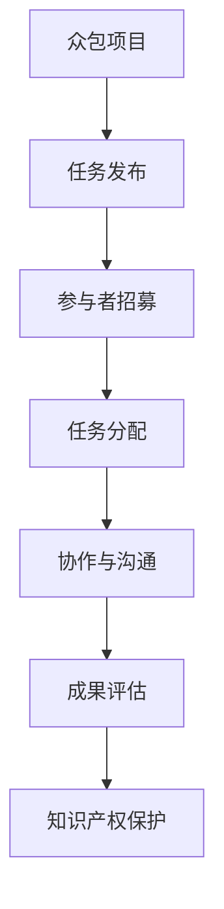

### 1.3 众包与开源软件的关系

**核心概念原理**：  
众包与开源软件有着紧密的联系。开源软件通常依赖众包模式来吸引全球开发者参与，共同改进和优化软件。而众包则为开源软件提供了一个更为广泛的平台，促进了其发展和创新。

**概念属性特征对比表格**：

| 特征 | 众包 | 开源软件 |
| ---- | ---- | -------- |
| 参与者多样性 | 高 | 低 |
| 任务发布与执行 | 开放性高 | 开放性一般 |
| 知识产权问题 | 复杂 | 明确 |
| 创新与改进 | 强调 | 核心 |

**ER实体关系图架构**：

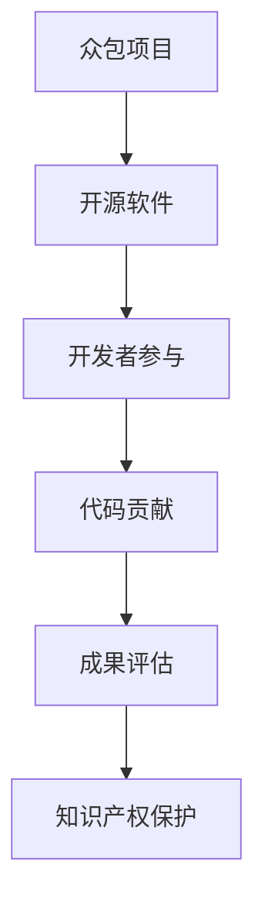

### 1.4 众包应用领域拓展

**核心概念原理**：  
众包的应用领域非常广泛，涵盖了软件开发、设计、创意、数据标注、公益等多个方面。在不同领域，众包的模式和机制有所不同，但核心思想是一致的，即通过群体智慧解决问题。

**概念属性特征对比表格**：

| 领域 | 特点 | 优势 | 挑战 |
| ---- | ---- | ---- | ---- |
| 软件开发 | 需要技术知识 | 创新速度快 | 知识产权保护 |
| 设计 | 创意密集 | 群体创意丰富 | 质量控制 |
| 数据标注 | 数据量大 | 数据处理效率高 | 数据隐私保护 |
| 公益 | 志愿者参与 | 公益效果显著 | 资源协调 |
| 其他 | 适应性强 | 解决问题多样化 | 管理复杂 |

**ER实体关系图架构**：

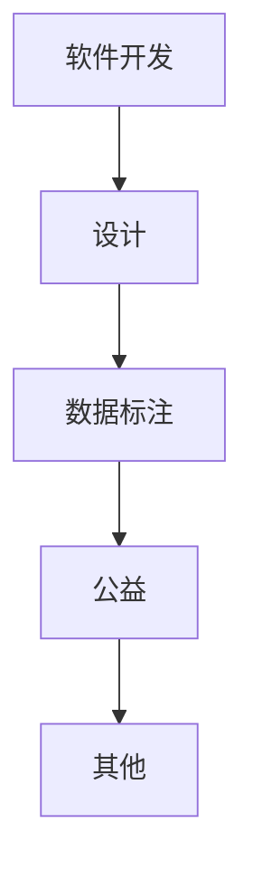

## 第2章 众包平台与工具

### 2.1 顶级众包平台介绍

**背景介绍**：  
随着众包概念的普及，市场上涌现出了众多众包平台。这些平台提供了各种类型的项目任务，吸引了大量参与者。以下是一些知名的众包平台及其特点。

**平台特点对比表格**：

| 平台 | 类型 | 特点 | 代表性项目 |
| ---- | ---- | ---- | ---------- |
| Topcoder | 软件开发 | 竞赛模式，高质量解决方案 | AI算法竞赛 |
| Kaggle | 数据科学 | 数据竞赛，开源数据集 | 机器学习比赛 |
| InnoCentive | 解决难题 | 奖金激励，问题多样 | 技术难题挑战 |
| Kickstarter | 产品设计 | 创意众筹，支持创新 | 科技产品众筹 |

### 2.2 众包工具选择与应用

**核心概念原理**：  
在众包项目中，选择合适的工具对于项目的成功至关重要。这些工具包括任务管理工具、协作平台、代码托管系统等。以下是几种常用的众包工具及其应用场景。

**工具特点对比表格**：

| 工具 | 类型 | 特点 | 应用场景 |
| ---- | ---- | ---- | -------- |
| JIRA | 任务管理 | 灵活性高，流程可控 | 软件开发项目 |
| Slack | 协作平台 | 通讯便捷，功能丰富 | 团队协作沟通 |
| GitHub | 代码托管 | 版本控制，开源合作 | 软件开发与开源项目 |

### 2.3 众包项目管理与协作

**核心概念原理**：  
众包项目需要高效的管理和协作机制，以确保任务顺利完成。项目管理工具和协作平台的运用对于众包项目的成功至关重要。

**项目管理与协作流程图**：

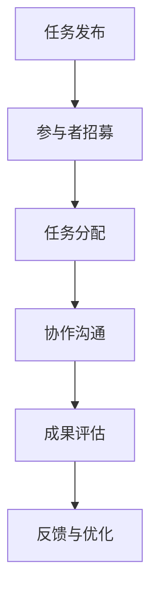

### 2.4 众包社区文化建设

**核心概念原理**：  
众包社区文化是众包项目成功的关键因素之一。一个健康、积极、协作的社区能够激发参与者的创造力，提高项目的成功率。

**社区文化建设要点**：

1. **公平与透明**：确保任务分配公平，评价体系透明。
2. **激励机制**：提供奖励和认可，激发参与者积极性。
3. **沟通交流**：建立有效的沟通渠道，促进信息共享。
4. **互助合作**：鼓励参与者之间的互助和合作，形成团队精神。

## 第3章 技术难题众包案例分析

### 3.1 案例一：挑战互联网难题

**背景介绍**：  
某知名互联网公司面临一个复杂的网络优化问题，单凭内部团队难以在短时间内解决。因此，他们决定通过众包平台发布该问题，吸引全球开发者共同参与。

**问题描述**：  
该问题是关于互联网数据传输的高效路径规划，要求在保证传输速度的同时，降低网络延迟。

**解决方案**：  
通过众包平台，吸引了数百名来自世界各地的开发者。他们提交了多种解决方案，其中一些通过算法优化和路径预测，显著提高了数据传输效率。

**效果评估**：  
经过评估，这些解决方案中有若干个被采纳并实施，公司的网络传输效率提高了20%以上，用户满意度显著提升。

### 3.2 案例二：利用众包解决机器学习难题

**背景介绍**：  
某人工智能研究团队在机器学习领域遇到了一个难以解决的难题，他们希望通过众包模式，汇聚全球机器学习专家的智慧。

**问题描述**：  
该问题是关于图像识别算法的精度提升，要求在保证识别准确率的同时，减少计算资源消耗。

**解决方案**：  
通过众包平台，团队发布了该问题，吸引了数十名机器学习专家参与。他们提出了多种改进算法，通过对比实验，最终选择了一种在精度和效率上均表现优异的算法。

**效果评估**：  
改进后的算法在实际应用中取得了显著效果，图像识别准确率提高了15%，计算资源消耗减少了30%。

### 3.3 案例三：软件漏洞众包检测

**背景介绍**：  
某安全公司希望通过众包模式，发现和修复其软件中的潜在漏洞。

**问题描述**：  
该问题是关于软件漏洞的检测和修复，要求参与者在限定时间内发现并提交漏洞报告。

**解决方案**：  
通过众包平台，公司发布了多个软件版本供参与者测试。参与者提交了大量的漏洞报告，其中一些报告揭示了严重的安全漏洞。

**效果评估**：  
公司根据漏洞报告，修复了多个高危漏洞，软件的安全性得到了显著提升。

### 3.4 案例四：物联网设备众包开发

**背景介绍**：  
某物联网设备制造商希望通过众包模式，开发一款具备创新功能的新型物联网设备。

**问题描述**：  
该问题是关于物联网设备的创新设计，要求参与者提交具有实用性和创意的设计方案。

**解决方案**：  
通过众包平台，公司发布了该问题，吸引了大量设计师和工程师参与。他们提交了多种设计方案，经过筛选和评估，最终选择了两个最具创新性的方案进行开发。

**效果评估**：  
开发的物联网设备成功上市，受到了市场的高度评价，为公司带来了显著的经济效益。

## 第4章 众包开发中的知识产权问题

### 4.1 知识产权保护的重要性

**核心概念原理**：  
在众包开发中，知识产权保护至关重要。参与者提交的解决方案或创意可能涉及专利、著作权、商标等知识产权。如果知识产权得不到有效保护，可能会导致创新成果被侵占，影响众包项目的可持续性。

**知识产权保护的重要性对比表格**：

| 特点 | 重要程度 |
| ---- | -------- |
| 知识产权侵占风险 | 高 |
| 创新积极性保护 | 高 |
| 项目可持续性保障 | 高 |

### 4.2 众包开发中的知识产权风险

**核心概念原理**：  
众包开发过程中，知识产权风险主要来自以下几个方面：

1. **专利侵权**：参与者提交的解决方案可能侵犯他人的专利权。
2. **著作权侵权**：代码、设计图纸等成果可能涉及著作权侵权。
3. **商标侵权**：商标的使用可能侵犯他人的商标权。

**知识产权风险对比表格**：

| 风险类型 | 常见表现 | 风险程度 |
| -------- | -------- | -------- |
| 专利侵权 | 未经授权使用他人专利 | 高 |
| 著作权侵权 | 窃取他人代码、设计 | 中 |
| 商标侵权 | 未经授权使用他人商标 | 低 |

### 4.3 知识产权保护策略与实践

**核心概念原理**：  
为了有效保护知识产权，众包项目需要采取一系列策略和实践措施：

1. **知识产权审查**：在任务发布前，对参与者的资质和知识产权状况进行审查。
2. **知识产权声明**：要求参与者签署知识产权声明，明确知识产权归属。
3. **知识产权保护协议**：制定知识产权保护协议，规范参与者的行为。
4. **知识产权争议解决**：建立知识产权争议解决机制，及时处理知识产权纠纷。

**知识产权保护策略与实践流程图**：

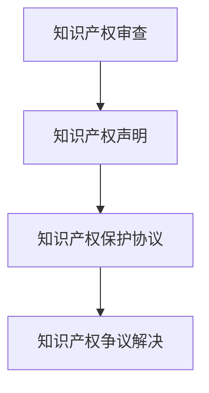

### 4.4 知识产权争议解决途径

**核心概念原理**：  
在众包开发过程中，知识产权争议难以避免。因此，建立有效的知识产权争议解决途径至关重要。以下是一些常见的争议解决途径：

1. **调解**：通过第三方调解机构，协助双方达成和解。
2. **仲裁**：通过仲裁机构进行仲裁，具有法律效力。
3. **诉讼**：通过司法程序解决争议，适用于重大纠纷。

**知识产权争议解决途径对比表格**：

| 解决途径 | 优点 | 缺点 |
| -------- | ---- | ---- |
| 调解 | 成本低，效率高 | 可能缺乏法律效力 |
| 仲裁 | 具有法律效力，保密性强 | 成本较高 |
| 诉讼 | 具有法律效力，权威性高 | 成本高，耗时较长 |

## 第5章 技术难题定义与分类

### 5.1 技术难题的定义

**核心概念原理**：  
技术难题是指那些在科学研究、技术开发或工程实践中遇到的复杂问题，它们可能涉及跨学科的知识和技能。技术难题的定义主要包括以下几个方面：

1. **复杂性问题**：技术难题通常具有复杂性和不确定性，难以通过单一方法或技术手段解决。
2. **跨学科问题**：技术难题往往涉及多个学科的知识和技能，需要跨学科的合作和协作。
3. **实践问题**：技术难题不仅是理论上的问题，还需要在实践中进行验证和应用。

**技术难题定义特征对比表格**：

| 特征 | 说明 |
| ---- | ---- |
| 复杂性 | 需要多种知识和技能 |
| 跨学科 | 涉及多个学科领域 |
| 实践性 | 可应用于实际项目 |

### 5.2 技术难题的分类

**核心概念原理**：  
技术难题可以根据不同的标准进行分类。以下是一些常见的分类方法：

1. **按照技术领域分类**：如计算机科学、物理学、生物学等。
2. **按照难度分类**：如初级难题、中级难题、高级难题。
3. **按照应用场景分类**：如理论研究、技术应用、工程实践。

**技术难题分类方法对比表格**：

| 分类标准 | 说明 | 例子 |
| -------- | ---- | ---- |
| 技术领域 | 根据学科领域划分 | 计算机科学、物理学 |
| 难度 | 根据难度等级划分 | 初级、中级、高级 |
| 应用场景 | 根据应用领域划分 | 理论研究、技术应用、工程实践 |

### 5.3 技术难题的评估方法

**核心概念原理**：  
技术难题的评估方法主要包括以下几个方面：

1. **难度评估**：评估技术难题的难度，包括理论难度和实践难度。
2. **可行性评估**：评估技术难题的解决方案是否可行，包括技术可行性和经济可行性。
3. **影响评估**：评估技术难题解决后对社会和行业的影响。

**技术难题评估方法对比表格**：

| 评估方法 | 说明 | 例子 |
| -------- | ---- | ---- |
| 难度评估 | 评估难题的难度 | 理论难度、实践难度 |
| 可行性评估 | 评估解决方案的可行性 | 技术可行性、经济可行性 |
| 影响评估 | 评估难题解决后的影响 | 社会影响、行业影响 |

## 第6章 技术难题众包流程

### 6.1 众包项目启动

**核心概念原理**：  
众包项目的启动是整个流程的第一步，其关键在于明确项目目标和任务要求。以下是项目启动的几个关键步骤：

1. **项目目标确定**：明确项目的目标，包括技术目标、业务目标和社会目标。
2. **任务描述**：详细描述需要解决的问题，包括问题的背景、需求和预期成果。
3. **预算与时间安排**：确定项目的预算和时间安排，包括项目启动、执行和评估的时间节点。

**项目启动流程图**：

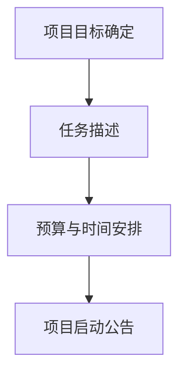

### 6.2 众包任务发布与任务描述

**核心概念原理**：  
任务发布是众包项目的核心环节，其关键在于确保任务描述的清晰、准确和具体。以下是任务发布和任务描述的几个关键步骤：

1. **任务分解**：将复杂的技术难题分解为若干个子任务，确保每个任务都是可执行和可评估的。
2. **任务描述**：详细描述每个任务的背景、需求、输入和输出，以及评估标准和奖励机制。
3. **任务发布**：通过众包平台发布任务，向全球参与者开放。

**任务发布与任务描述流程图**：

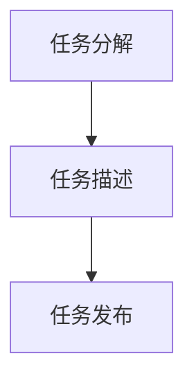

### 6.3 众包参与者招募

**核心概念原理**：  
参与者的招募是众包项目的关键，其关键在于确保参与者的质量和多样性。以下是参与者招募的几个关键步骤：

1. **参与者资格审核**：根据任务需求，审核参与者的资质和经验，确保其具备完成任务的能力。
2. **参与者宣传**：通过众包平台和社交媒体等渠道，宣传任务和项目，吸引更多的参与者。
3. **参与者筛选**：根据参与者的资质、经验和项目反馈，筛选出合适的参与者。

**参与者招募流程图**：

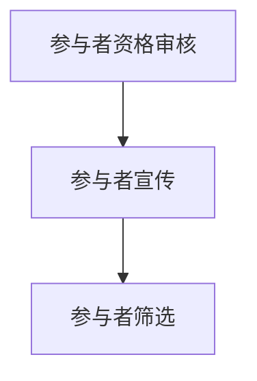

### 6.4 众包任务执行与监控

**核心概念原理**：  
任务执行与监控是众包项目的关键环节，其关键在于确保任务的顺利进行和质量的控制。以下是任务执行与监控的几个关键步骤：

1. **任务分配**：根据参与者的资质和任务需求，将任务分配给合适的参与者。
2. **任务执行**：参与者根据任务描述，自主完成任务的执行。
3. **任务监控**：项目管理者通过定期检查、反馈和评估，确保任务按照计划进行。

**任务执行与监控流程图**：

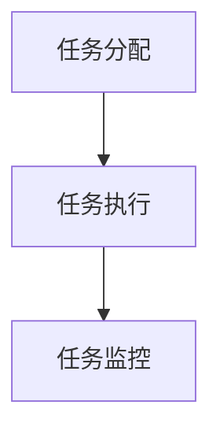

## 第7章 技术难题解决方案评估

### 7.1 解决方案评估标准

**核心概念原理**：  
解决方案评估标准是确保众包项目质量的关键。以下是几个常见的评估标准：

1. **功能性**：评估解决方案是否满足任务需求，包括功能的完备性和可靠性。
2. **性能**：评估解决方案的性能，包括响应时间、吞吐量和资源消耗。
3. **可维护性**：评估解决方案的可维护性，包括代码的可读性和可扩展性。
4. **创新性**：评估解决方案的创新程度，包括技术思路和实现方法。

**解决方案评估标准对比表格**：

| 评估标准 | 说明 |
| -------- | ---- |
| 功能性 | 满足需求 |
| 性能 | 高效 |
| 可维护性 | 易于维护 |
| 创新性 | 创新思路 |

### 7.2 解决方案评估方法

**核心概念原理**：  
解决方案评估方法包括定量评估和定性评估。以下是几种常见的评估方法：

1. **定量评估**：通过指标和数据对解决方案进行评估，如性能测试、代码审查等。
2. **定性评估**：通过专家评审、用户反馈等对解决方案进行评估，如用户体验、创新性评价等。

**解决方案评估方法对比表格**：

| 评估方法 | 说明 |
| -------- | ---- |
| 定量评估 | 数据驱动 |
| 定性评估 | 专家评审 |

### 7.3 解决方案评估流程

**核心概念原理**：  
解决方案评估流程包括评估准备、评估实施和评估报告等步骤。以下是解决方案评估流程的详细步骤：

1. **评估准备**：确定评估标准和方法，组建评估团队。
2. **评估实施**：对提交的解决方案进行评估，包括定量评估和定性评估。
3. **评估报告**：撰写评估报告，总结评估结果和改进建议。

**解决方案评估流程图**：

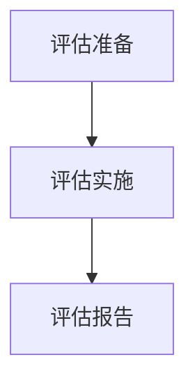

### 7.4 解决方案反馈与优化

**核心概念原理**：  
解决方案反馈与优化是确保众包项目质量和持续改进的关键。以下是解决方案反馈与优化的几个关键步骤：

1. **反馈收集**：收集参与者对解决方案的反馈，包括优点、缺点和建议。
2. **问题分析**：对反馈进行深入分析，找出解决方案中的问题和改进空间。
3. **优化实施**：根据反馈和问题分析，对解决方案进行优化和改进。
4. **再次评估**：对优化后的解决方案进行再次评估，确保问题得到有效解决。

**解决方案反馈与优化流程图**：

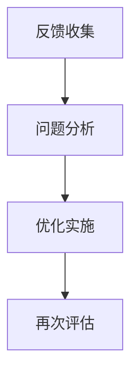

## 第8章 众包开发中的最佳实践

### 8.1 众包项目成功要素

**核心概念原理**：  
众包项目的成功离不开以下几个关键要素：

1. **明确的目标**：项目目标应明确，包括技术目标、业务目标和预期成果。
2. **高质量的参与者**：确保参与者的资质和经验，提高项目质量。
3. **合理的激励机制**：提供合适的奖励和认可，激发参与者积极性。
4. **有效的沟通与协作**：建立良好的沟通和协作机制，确保项目顺利进行。
5. **严格的质量控制**：通过评估和反馈，确保项目质量和成果的可靠性。

**成功要素对比表格**：

| 成功要素 | 说明 |
| -------- | ---- |
| 明确的目标 | 项目目标明确 |
| 高质量的参与者 | 参与者资质高 |
| 合理的激励机制 | 奖励机制合理 |
| 有效的沟通与协作 | 沟通协作有效 |
| 严格的质量控制 | 质量控制严格 |

### 8.2 众包项目风险管理

**核心概念原理**：  
众包项目面临多种风险，如知识产权风险、质量控制风险、参与风险等。以下是几种常见的风险管理方法：

1. **风险评估**：对项目可能面临的风险进行评估，识别主要风险因素。
2. **风险控制**：制定风险控制措施，降低风险发生的可能性。
3. **风险监控**：实时监控项目进展，及时识别和处理风险。
4. **风险应对**：制定风险应对策略，确保项目在风险发生时能够得到有效应对。

**风险管理方法对比表格**：

| 风险管理方法 | 说明 |
| ------------ | ---- |
| 风险评估 | 评估风险因素 |
| 风险控制 | 降低风险 |
| 风险监控 | 实时监控 |
| 风险应对 | 应对风险 |

### 8.3 众包项目持续改进

**核心概念原理**：  
持续改进是众包项目成功的关键。以下是持续改进的几个关键步骤：

1. **收集反馈**：定期收集参与者、用户和项目团队的反馈，了解项目中的问题和改进点。
2. **分析问题**：对收集到的反馈进行分析，找出项目中的主要问题和瓶颈。
3. **制定改进计划**：根据问题分析结果，制定具体的改进计划和实施步骤。
4. **实施改进**：按照改进计划，实施具体改进措施，持续优化项目。
5. **评估改进效果**：对改进措施进行评估，确保问题得到有效解决，并持续优化项目。

**持续改进流程图**：

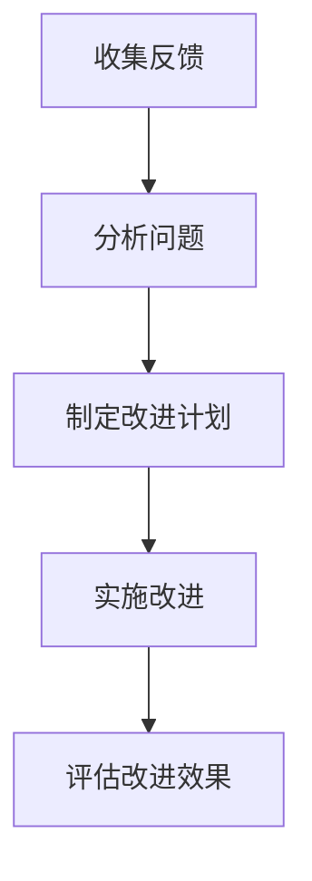

### 8.4 众包项目案例分析

**核心概念原理**：  
通过案例分析，可以深入了解众包项目的实施过程、成功经验和失败教训。以下是几个典型的众包项目案例分析：

1. **案例一：某知名互联网公司的技术难题众包**  
   - 项目目标：解决网络优化问题  
   - 参与者：全球数百名开发者  
   - 成果：数据传输效率提高20%以上  
   - 成功经验：明确目标，合理激励机制，有效沟通和协作。

2. **案例二：某人工智能研究团队的机器学习难题众包**  
   - 项目目标：提升图像识别算法的精度和效率  
   - 参与者：数十名机器学习专家  
   - 成果：图像识别准确率提高15%，计算资源消耗减少30%  
   - 成功经验：清晰的任务描述，科学的评估标准，严格的知识产权保护。

3. **案例三：某安全公司的软件漏洞众包检测**  
   - 项目目标：发现和修复软件漏洞  
   - 参与者：数十名安全专家  
   - 成果：修复多个高危漏洞，提升软件安全性  
   - 成功经验：严格的参与者审核，有效的任务分配和监控，及时的风险应对。

## 第9章 众包开发的未来趋势

### 9.1 众包技术发展新方向

**核心概念原理**：  
随着技术的不断进步，众包开发也在不断创新和发展。以下是几个众包技术发展新方向：

1. **区块链技术**：利用区块链技术实现众包项目的去中心化和安全性。
2. **人工智能**：利用人工智能技术优化众包任务的分配和评估过程。
3. **物联网**：利用物联网技术实现众包项目中的实时监控和数据共享。
4. **云计算**：利用云计算技术提供强大的计算资源和存储能力，支持大规模众包项目。

**新方向对比表格**：

| 新方向 | 说明 |
| ------ | ---- |
| 区块链技术 | 去中心化 |
| 人工智能 | 智能分配 |
| 物联网 | 实时监控 |
| 云计算 | 强计算力 |

### 9.2 众包在社会治理中的应用

**核心概念原理**：  
众包不仅在技术领域有着广泛的应用，还可以应用于社会治理，提升政府服务效率和公众参与度。以下是几个众包在社会治理中的应用方向：

1. **城市管理**：利用众包收集城市管理数据，提升城市治理效率。
2. **环境保护**：利用众包平台监测环境污染，促进环境保护行动。
3. **公共安全**：利用众包平台收集安全信息，提高公共安全预警能力。
4. **公益服务**：利用众包平台发起公益项目，吸引更多志愿者参与。

**应用方向对比表格**：

| 应用方向 | 说明 |
| -------- | ---- |
| 城市管理 | 数据收集 |
| 环境保护 | 监测污染 |
| 公共安全 | 信息收集 |
| 公益服务 | 吸引志愿者 |

### 9.3 众包教育与实践

**核心概念原理**：  
众包教育与实践是培养未来人才的重要途径。以下是几个众包教育与实践的方向：

1. **编程教育**：通过众包平台开展编程竞赛和项目实践，提高学生编程能力。
2. **创业教育**：利用众包模式开展创业项目，培养学生的创新意识和实践能力。
3. **科研实践**：通过众包平台开展科研课题，吸引全球科研力量参与。
4. **社会实践**：利用众包平台开展社会实践活动，提升学生的社会责任感。

**教育与实践方向对比表格**：

| 教育与实践方向 | 说明 |
| -------------- | ---- |
| 编程教育 | 编程能力培养 |
| 创业教育 | 创新能力培养 |
| 科研实践 | 科研参与 |
| 社会实践 | 社会责任培养 |

### 9.4 众包开发中的伦理与道德问题

**核心概念原理**：  
随着众包开发的广泛应用，伦理与道德问题也日益突出。以下是几个常见的伦理与道德问题：

1. **隐私保护**：确保参与者的隐私信息得到保护，避免数据泄露。
2. **知识产权**：保护参与者的知识产权，避免侵权行为。
3. **公平公正**：确保参与者的权益得到公平对待，避免歧视和不公平现象。
4. **信息安全**：确保众包平台的安全，防止恶意攻击和网络安全问题。

**伦理与道德问题对比表格**：

| 伦理与道德问题 | 说明 |
| -------------- | ---- |
| 隐私保护 | 数据安全 |
| 知识产权 | 知识产权保护 |
| 公平公正 | 公平对待 |
| 信息安全 | 网络安全 |

## 总结

通过本文的深入探讨，我们了解了众包开发的基本概念、优势与挑战、平台与工具、技术难题众包实践、知识产权问题以及未来趋势。众包开发作为一种新兴的模式，不仅能够汇聚全球智慧，提高问题解决的效率和效果，还面临着知识产权保护、公平公正、信息安全等挑战。在未来的发展中，随着技术的不断进步，众包开发将在更多领域得到应用，为社会发展带来新的机遇。同时，我们也需要关注并解决伦理与道德问题，确保众包开发的可持续发展。让我们共同努力，探索众包开发的无限可能，推动技术进步和社会发展。

## 作者信息

**作者：AI天才研究院/AI Genius Institute & 禅与计算机程序设计艺术 /Zen And The Art of Computer Programming**

