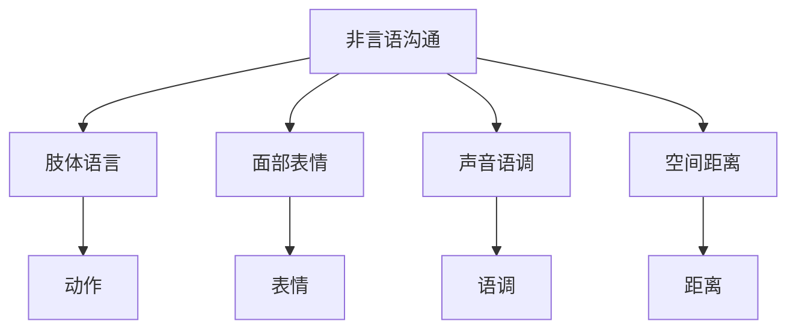
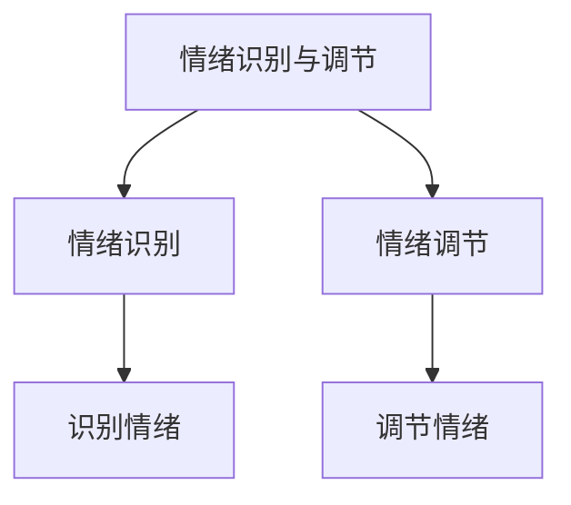
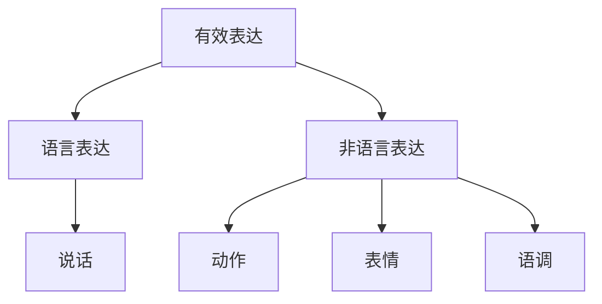
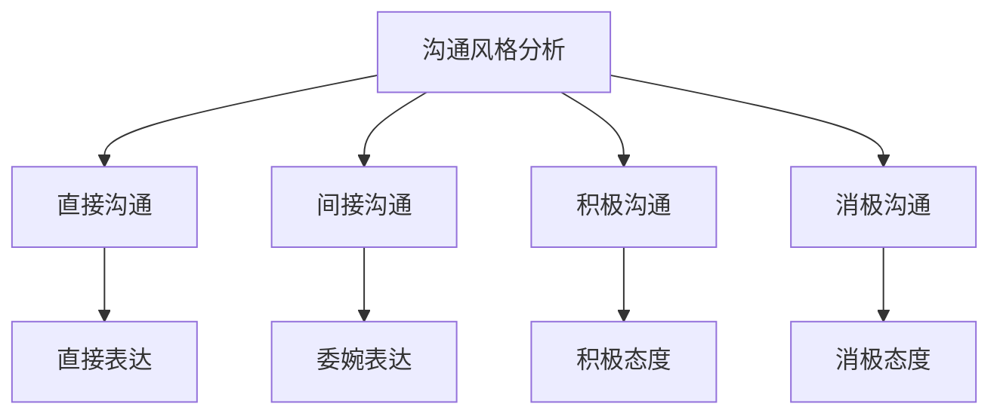
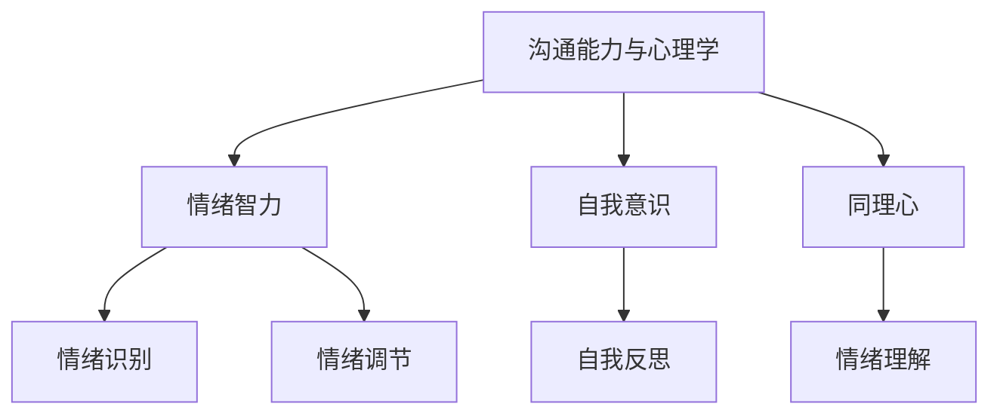

                 

### 《会'干'，更要会'说'》

**关键词：** 沟通能力、职业发展、人际交往、情绪管理、有效表达

**摘要：** 本文章旨在探讨沟通能力在个人和职业发展中的重要性。通过分析核心概念与联系，提供实际应用案例，深入探讨沟通心理学原理，以及最佳实践，帮助读者提升沟通技巧，实现“会'干'，更要会'说'”的目标。

----------------------------------------------------------------

## 引言

### 沟通的重要性

在现代社会中，沟通能力被视为一种基础而关键的技能。无论是个人生活还是职业生涯，沟通能力都发挥着至关重要的作用。有效沟通能够帮助我们更好地理解他人，表达自己的想法，解决问题，建立人际关系，甚至在职场中获取成功。

**职业发展**

在职场中，沟通能力是衡量一个员工综合素质的重要标准。它不仅影响个人的职业发展，还影响到整个团队的工作效率和成果。一个具有良好沟通能力的员工，能够更好地与同事协作，理解上级的意图，有效传达信息，减少误解和冲突，从而提升整体的工作表现。

**人际交往**

在人际交往中，沟通能力同样至关重要。无论是家庭、朋友还是社交圈，良好的沟通能力有助于建立和谐的人际关系，增进相互理解，减少矛盾和误解。此外，沟通能力也是表达关爱、支持他人和获得他人支持的重要途径。

**问题背景**

尽管沟通能力的重要性不言而喻，但在现实生活中，很多人却面临着沟通障碍。这些问题可能源于语言障碍、情绪管理困难、信息传达不清晰或文化差异。这些问题不仅影响个人的生活和职业发展，还可能导致团队合作的失败和人际关系的破裂。

### 目标读者

本书的目标读者包括：

- **职场新人**：希望通过提升沟通能力，更好地适应职场环境，建立人际关系，提升职业发展的职场新人。
- **管理人员**：希望通过学习沟通技巧，提高团队协作效率，提升管理水平的各级管理人员。
- **企业家**：希望通过有效的沟通，增强团队凝聚力，扩大人脉网络，提升企业竞争力。
- **一般读者**：对人际沟通感兴趣，希望通过学习沟通技巧，提升个人魅力和人际交往能力的一般读者。

## 背景介绍

### 沟通能力的重要性

沟通能力是一种综合能力，包括语言表达、非语言沟通、情绪识别和调节等。它不仅关乎个人素质，更是现代社会中不可或缺的技能。以下从职业发展、人际交往、心理需求等方面探讨沟通能力的重要性。

**职业发展**

在职场中，沟通能力是衡量员工综合素质的重要标准。一个具有良好沟通能力的员工，能够更好地完成工作任务，提升工作效率，减少错误和误解。具体来说：

1. **团队协作**：沟通能力有助于团队成员之间的协作和配合，促进团队目标的实现。
2. **职业晋升**：良好的沟通能力能够帮助员工在职场中脱颖而出，获得更多的发展机会和晋升空间。
3. **职场形象**：沟通能力是员工职场形象的重要组成部分，良好的沟通能力有助于提升员工的职业素养和影响力。

**人际交往**

在人际交往中，沟通能力同样至关重要。通过有效的沟通，人们能够更好地理解他人，表达自己的想法，建立和谐的人际关系。具体来说：

1. **家庭关系**：良好的沟通有助于家庭成员之间的相互理解和支持，增进家庭和谐。
2. **社交圈**：沟通能力有助于建立和维护广泛的社交网络，为个人的发展提供更多的机会和资源。
3. **公共关系**：在社交场合，良好的沟通能力有助于建立良好的人际关系，提升个人的社交形象和魅力。

**心理需求**

沟通能力不仅是职场和人际交往的必备技能，也是满足人类心理需求的重要途径。通过有效的沟通，人们能够：

1. **表达情感**：倾诉自己的情感，获得他人的理解和支持，缓解心理压力。
2. **建立信任**：通过有效的沟通，建立相互信任的人际关系，提高个人的安全感和社会认同感。
3. **满足需求**：通过沟通，表达自己的需求，寻求他人的帮助，实现个人目标。

### 沟通障碍

尽管沟通能力的重要性不言而喻，但在现实生活中，很多人却面临着沟通障碍。这些问题可能源于以下原因：

1. **语言障碍**：包括语言表达能力不足、语言理解困难等。
2. **情绪管理**：情绪失控、无法正确识别和调节情绪，导致沟通效果不佳。
3. **信息传达**：信息传达不清晰、不准确，导致误解和冲突。
4. **文化差异**：不同文化背景的人在面对同一问题时，可能会有不同的沟通方式和理解方式，导致沟通障碍。

### 沟通能力的影响范围

沟通能力的影响范围非常广泛，不仅涵盖职场和人际交往，还涉及到以下几个方面：

1. **教育**：良好的沟通能力有助于学生更好地理解教师和同学，提高学习效果。
2. **医疗**：医生与患者之间的有效沟通对于疾病的诊断和治疗至关重要。
3. **法律**：律师与客户、法官之间的沟通能力直接影响案件的审理结果。
4. **媒体**：媒体从业人员需要具备良好的沟通能力，以准确传达信息和观点。

### 目标读者

本书的目标读者包括：

- **职场新人**：希望通过提升沟通能力，更好地适应职场环境，建立人际关系，提升职业发展的职场新人。
- **管理人员**：希望通过学习沟通技巧，提高团队协作效率，提升管理水平的各级管理人员。
- **企业家**：希望通过有效的沟通，增强团队凝聚力，扩大人脉网络，提升企业竞争力。
- **一般读者**：对人际沟通感兴趣，希望通过学习沟通技巧，提升个人魅力和人际交往能力的一般读者。

----------------------------------------------------------------

## 核心概念与联系

### 非言语沟通

非言语沟通是指通过非语言手段进行信息交流的过程。它包括肢体语言、面部表情、声音语调、空间距离等多种形式。非言语沟通在沟通过程中扮演着重要的角色，它能够补充和强化言语沟通，甚至有时候可以取代言语沟通。

**概念属性特征对比表格**

| 特征                 | 肢体语言 | 面部表情 | 声音语调 | 空间距离 |
|----------------------|----------|----------|----------|----------|
| 表达方式             | 动作     | 表情     | 语调     | 距离     |
| 信息传达速度         | 较快     | 较快     | 较快     | 较慢     |
| 易于伪装             | 难       | 易       | 易       | 难       |
| 受文化影响程度       | 高       | 高       | 中       | 高       |
| 主要功能             | 补充言语 | 表达情绪 | 表达情感 | 表达关系 |

**ER实体关系图架构**

### 情绪识别与调节

情绪识别与调节是沟通能力的重要组成部分。情绪识别是指识别和理解自己和他人的情绪状态，而情绪调节则是通过一定的方法和技巧来调整和缓解不良情绪。

**概念属性特征对比表格**

| 特征                   | 情绪识别 | 情绪调节 |
|------------------------|----------|----------|
| 目标                   | 识别情绪 | 调节情绪 |
| 技能要求               | 观察     | 动作和思考 |
| 对沟通效果的影响       | 直接     | 间接     |
| 难易程度               | 中等     | 较难     |
| 受文化影响程度         | 中       | 中       |
| 实用性                 | 较高     | 较高     |

**ER实体关系图架构**

### 有效表达

有效表达是指在沟通过程中，能够清晰、准确地传达信息，达到预期沟通效果的能力。有效表达不仅包括语言表达，还包括非语言表达的协调运用。

**概念属性特征对比表格**

| 特征                     | 语言表达 | 非语言表达 |
|--------------------------|----------|------------|
| 主要形式                 | 说话     | 动作、表情、语调 |
| 信息传达速度             | 较慢     | 较快       |
| 易于伪装                 | 难       | 易         |
| 受文化影响程度           | 中       | 高         |
| 对沟通效果的影响         | 直接     | 补充和强化 |
| 实用性                   | 较高     | 较高       |

**ER实体关系图架构**

### 沟通风格分析

沟通风格是指个体在沟通过程中的习惯和倾向。常见的沟通风格包括：

1. **直接沟通**：直接表达观点和意见，不回避冲突。
2. **间接沟通**：通过委婉的语言表达观点和意见，避免直接冲突。
3. **积极沟通**：以积极的态度和语言进行沟通，鼓励对方。
4. **消极沟通**：以消极的态度和语言进行沟通，抑制对方的积极性。

**概念属性特征对比表格**

| 特征                   | 直接沟通 | 间接沟通 | 积极沟通 | 消极沟通 |
|------------------------|----------|----------|----------|----------|
| 表达方式               | 直接     | 委婉     | 积极     | 消极     |
| 对沟通效果的影响       | 快速     | 缓慢     | 增强     | 减弱     |
| 适用场景               | 冲突解决 | 团队合作 | 谈判     | 报怨     |
| 个人偏好               | 倾向     | 避免     | 支持     | 反对     |

**ER实体关系图架构**

### 沟通能力与心理学

沟通能力不仅仅是技巧，它还涉及到心理学原理。心理学原理在沟通中的应用，可以帮助我们更好地理解和应对他人的情绪和行为。

**情绪智力**

情绪智力是指个体识别、理解、调节和管理自己情绪的能力。高情绪智力的人通常具备更好的沟通能力，因为他们能够更好地理解他人的情绪，并采取适当的沟通策略。

**自我意识**

自我意识是指个体对自己内在情感和思维过程的认知。高自我意识的人通常能够更好地进行自我反思，从而更好地调整自己的沟通方式和内容。

**同理心**

同理心是指能够理解并感受他人情绪的能力。同理心在沟通中起着至关重要的作用，因为它能够帮助我们建立互信，增进人际关系。

**ER实体关系图架构**

通过以上核心概念与联系的分析，我们可以看到沟通能力是一个复杂但重要的技能。它涉及到多个方面的知识和技巧，包括非言语沟通、情绪识别与调节、有效表达和沟通风格分析。这些核心概念相互关联，共同构成了沟通能力的核心要素。

----------------------------------------------------------------

## 实际应用案例

### 职场沟通案例

**案例背景**：小李是一家互联网公司的产品经理，负责一个新项目的管理工作。项目团队成员来自不同的背景和部门，沟通效率低下，导致项目进度缓慢。

**沟通障碍**：
1. **信息传达不清晰**：团队成员对项目目标和任务理解不一致，导致执行过程中出现偏差。
2. **情绪管理困难**：团队成员在项目压力下，容易出现情绪波动，影响团队氛围。

**解决方案**：
1. **明确沟通目标**：小李在项目启动会议上，明确了项目的目标、任务和时间表，确保团队成员对项目有清晰的理解。
2. **定期沟通会议**：小李每周召开项目进度会议，听取团队成员的工作汇报，及时解决问题，确保项目按计划推进。
3. **情绪管理**：小李鼓励团队成员在遇到问题时及时沟通，表达自己的情绪，同时教授他们情绪调节技巧，如深呼吸、放松训练等。

**结果**：通过以上措施，项目团队成员之间的沟通效率显著提高，项目进度得到有效控制，最终项目按时完成，并获得了公司领导的高度评价。

### 个人关系沟通案例

**案例背景**：小王和小李是一对夫妻，由于工作和生活的压力，他们之间的沟通逐渐减少，关系变得紧张。

**沟通障碍**：
1. **缺乏有效沟通**：小王和小李在沟通中往往只关注问题本身，而忽视了对方的感受和需求。
2. **情绪管理困难**：双方在沟通时容易激动，情绪失控，导致争吵不断。

**解决方案**：
1. **建立有效沟通机制**：小王和小李约定每周进行一次深入的沟通，讨论彼此的感受和需求，确保沟通的深度和广度。
2. **情绪管理**：双方学习情绪调节技巧，如正念冥想、情绪记录等，帮助自己在沟通时保持冷静和理智。
3. **共同解决问题**：在沟通中，小王和小李共同探讨问题的解决方案，而不是互相指责，从而增进理解和信任。

**结果**：通过以上措施，小王和小李的关系得到了显著改善，双方都感受到了更多的关爱和理解，家庭氛围更加和谐。

### 社交场合沟通案例

**案例背景**：小张是一名企业高管，在一次重要的商务晚宴上，需要与多位重要的客户进行沟通，但感到紧张和不自信。

**沟通障碍**：
1. **自信心不足**：小张对自己在社交场合的表现缺乏信心，担心不能给客户留下好印象。
2. **话题选择不当**：在沟通中，小张往往选择错误的话题，导致交流不顺畅。

**解决方案**：
1. **提升自信心**：小张通过参加公开演讲、社交技巧培训等，提升自己的自信心和沟通能力。
2. **了解客户需求**：在晚宴前，小张提前了解客户的背景和兴趣爱好，确保在沟通时能够选择合适的话题。
3. **练习沟通技巧**：小张在练习中不断改进自己的沟通方式，如语速、表情和姿势等，提高沟通效果。

**结果**：通过以上措施，小张在商务晚宴上的表现得到了客户的高度评价，成功建立了良好的商务关系。

这些实际应用案例展示了沟通技巧在不同场景下的应用。通过明确沟通目标、定期沟通、情绪管理和共同解决问题，我们可以在职场、个人关系和社交场合中提升沟通效果，实现更好的沟通目标。

----------------------------------------------------------------

## 深入探讨

### 沟通心理学原理

沟通不仅仅是信息的传递，它涉及到一系列心理活动。理解沟通心理学原理有助于我们更好地应对沟通中的挑战，提高沟通效果。

#### 情绪智力

情绪智力是一个人在情绪识别、理解、调节和管理方面的能力。高情绪智力的人能够更好地识别和理解自己和他人的情绪，从而采取更有效的沟通策略。以下是一些关键点：

- **自我情绪管理**：了解自己的情绪，学会在面对压力和挑战时保持冷静和理智。
- **情绪识别**：通过观察他人的表情、语调和肢体语言，识别他们的情绪状态。
- **情绪理解**：尝试从他人的角度理解他们的情绪，增进相互理解。

#### 同理心

同理心是指能够理解和感受他人情绪的能力。同理心在沟通中起着至关重要的作用，因为它能够帮助我们建立互信和和谐的人际关系。以下是一些关键点：

- **情感共鸣**：设身处地地感受他人的情绪，与他们建立情感联系。
- **非语言沟通**：通过非言语信号，如肢体语言和面部表情，表达同理心。
- **倾听**：认真倾听他人的话语，不仅是听他们说什么，还要理解他们为什么这样说。

#### 自我意识

自我意识是指个体对自己内在情感和思维过程的认知。高自我意识的人能够更好地进行自我反思，从而更好地调整自己的沟通方式和内容。以下是一些关键点：

- **自我反思**：定期反思自己的沟通行为，分析哪些是有效的，哪些需要改进。
- **情绪认知**：了解自己的情绪触发点，学会在情绪波动时及时调整自己。
- **目标设定**：明确自己的沟通目标，确保每次沟通都能朝着目标前进。

### 人际关系技巧

在沟通中，人际关系技巧同样至关重要。以下是一些关键的人际关系技巧：

#### 建立信任

信任是沟通的基石。建立信任的关键在于诚实、透明和一致性。以下是一些关键点：

- **诚实沟通**：在沟通中保持诚实，不说谎言，不隐瞒事实。
- **透明度**：在适当的情况下，分享信息，让他人了解你的意图和动机。
- **一致性**：言行一致，保持承诺，避免出现矛盾和误解。

#### 解决冲突

冲突是不可避免的，但如何解决冲突是沟通能力的重要体现。以下是一些关键点：

- **冷静处理**：在冲突发生时，保持冷静，不要情绪化，以免情况恶化。
- **有效倾听**：认真倾听对方的意见和感受，理解他们的立场。
- **寻求共识**：寻找共同点，寻求双方都能接受的解决方案。

#### 建立有效反馈

反馈是沟通的重要组成部分，它能帮助我们了解沟通的效果，及时调整。以下是一些关键点：

- **正面反馈**：在适当的时候给予正面反馈，鼓励对方。
- **具体反馈**：给出具体的反馈，而不是泛泛而谈。
- **建设性反馈**：提出建议，而不是指责。

### 沟通策略与战术

在实际沟通中，除了理解和运用心理学原理和人际关系技巧外，还需要运用一些策略和战术来提高沟通效果。以下是一些常用的沟通策略与战术：

#### 清晰明确

- **明确目标**：在沟通前明确自己的目标，确保每次沟通都有明确的方向。
- **简洁表达**：用简洁的语言表达自己的观点，避免冗长和模糊。

#### 积极主动

- **主动沟通**：在需要沟通时，主动采取行动，而不是等待他人发起。
- **主动解决问题**：在问题出现时，主动寻求解决方案，而不是抱怨和指责。

#### 调整沟通风格

- **适应对方**：根据对方的沟通风格和偏好进行调整，以提高沟通效果。
- **灵活应变**：在沟通过程中，根据实际情况灵活调整沟通策略。

通过深入探讨沟通心理学原理、人际关系技巧和沟通策略与战术，我们可以更好地理解和应用沟通技巧，提高沟通效果。这不仅有助于个人和职业发展，还能提升人际关系和社会交往能力。

----------------------------------------------------------------

## 最佳实践

### 实用的沟通技巧

1. **倾听技巧**：倾听不仅仅是听对方说什么，还要理解对方的情感和需求。以下是一些实用的倾听技巧：
   - **全神贯注**：在与对方交流时，全身心投入，避免分心。
   - **积极反馈**：通过点头、目光接触和口头回应，表明你在认真倾听。
   - **开放式提问**：提出开放性问题，引导对方分享更多信息。

2. **非语言沟通**：非语言沟通在沟通中起着重要作用。以下是一些实用的非语言沟通技巧：
   - **面部表情**：展示真诚和热情，通过微笑、皱眉等表情表达自己的情感。
   - **肢体语言**：保持开放和自信的姿态，避免交叉手臂、低头等负面肢体语言。
   - **语调**：使用适当的语调和音量，使信息传达更加清晰和生动。

3. **情绪管理**：情绪管理是沟通能力的重要组成部分。以下是一些实用的情绪管理技巧：
   - **深呼吸**：在情绪激动时，深呼吸可以帮助你冷静下来。
   - **正念冥想**：通过冥想练习，提高自我意识和情绪调节能力。
   - **积极思考**：培养积极的心态，面对挑战时保持乐观和自信。

### 避免沟通误会的策略

1. **明确信息**：在沟通时，尽量使用清晰、简洁的语言，避免使用模糊或歧义的词汇。
2. **确认理解**：在传达信息后，询问对方是否理解了你的意思，以确保信息准确传达。
3. **避免情绪化**：在沟通中，尽量避免情绪化，以免影响沟通效果。

### 不同情境下的沟通建议

1. **职场沟通**：
   - **明确任务和目标**：确保团队成员对任务和目标有清晰的理解。
   - **建立定期沟通机制**：通过定期会议，及时沟通项目进度和问题。
   - **鼓励反馈和提问**：鼓励团队成员在遇到问题时及时反馈和提问，以提高沟通效果。

2. **个人关系沟通**：
   - **建立有效沟通机制**：与伴侣、家人等建立固定的沟通时间，确保沟通的深度和广度。
   - **关注对方的感受**：在沟通时，关注对方的感受和需求，避免忽视对方的情感。
   - **共同解决问题**：在遇到问题时，共同探讨解决方案，增进理解和信任。

3. **社交场合沟通**：
   - **了解对方兴趣**：在与陌生人沟通时，提前了解对方的兴趣爱好，选择合适的话题。
   - **保持自信和礼貌**：在社交场合，保持自信和礼貌，避免过于自我中心。
   - **学会适时退出**：在沟通中，如果感到不舒服或无话可说，学会适时退出，避免尴尬。

通过以上最佳实践，我们可以更好地提升沟通技巧，避免沟通误会，实现有效的沟通目标。

----------------------------------------------------------------

## 小结与拓展

### 沟通能力培养之路

沟通能力并非与生俱来，而是可以通过学习和实践逐步提升。以下是一些关键点：

1. **持续学习**：沟通技巧需要不断学习和更新，通过阅读相关书籍、参加培训课程等方式，不断提升自己的沟通能力。
2. **实践应用**：理论知识需要通过实践来巩固和提升，尝试在不同的情境中应用所学技巧，积累经验。
3. **反思与改进**：每次沟通后，进行反思，分析哪些地方做得好，哪些地方需要改进，从而不断优化自己的沟通方式。

### 实践与反思

沟通能力是一个持续的过程，需要不断地实践和反思。以下是一些具体的建议：

1. **设定目标**：为自己设定明确的沟通目标，确保每次沟通都有明确的方向。
2. **定期反馈**：与同事、朋友或家人进行沟通反馈，获取他们的意见和建议，以便不断改进自己的沟通方式。
3. **记录心得**：在沟通实践中，记录自己的心得和体会，分析成功的经验和失败的教训，从而更好地提升自己。

### 拓展阅读资源

为了帮助读者更深入地了解沟通技巧和相关心理学原理，我们推荐以下拓展阅读资源：

1. **书籍**：
   - 《沟通的艺术》作者：罗纳德·B·阿德勒（Ronald B. Adler）
   - 《非暴力沟通》作者：马歇尔·卢森堡（Marshall B. Rosenberg）
   - 《沟通心理学》作者：约瑟夫·M·奥鲁姆（Joseph M. Orum）

2. **在线课程**：
   - Coursera上的“沟通技巧”课程
   - edX上的“人际沟通”课程

3. **公众号和博客**：
   - “职场沟通技巧”
   - “心理学与生活”

通过这些资源和实践，读者可以更好地理解和应用沟通技巧，实现“会'干'，更要会'说'”的目标。希望本书能为您的沟通能力提升之路提供有价值的参考和帮助。

----------------------------------------------------------------

## 作者信息

**作者：** AI天才研究院/AI Genius Institute & 禅与计算机程序设计艺术 /Zen And The Art of Computer Programming

AI天才研究院致力于推动人工智能技术的发展和应用，致力于培养具有创新精神和专业素养的人工智能专家。研究院的研究领域涵盖机器学习、深度学习、自然语言处理、计算机视觉等多个方向。

《禅与计算机程序设计艺术》是一本深受程序员喜爱的经典书籍，它通过探讨程序设计与哲学、心理学的关系，帮助程序员提高编程水平和生活质量。作者以其丰富的编程经验和深刻的哲学思考，为读者提供了一套独特的编程方法论。

本书《会'干'，更要会'说'》由AI天才研究院和《禅与计算机程序设计艺术》的作者共同创作，旨在帮助读者提升沟通能力，实现个人和职业发展。希望本书能为您的沟通能力提升之路提供有价值的参考和帮助。

