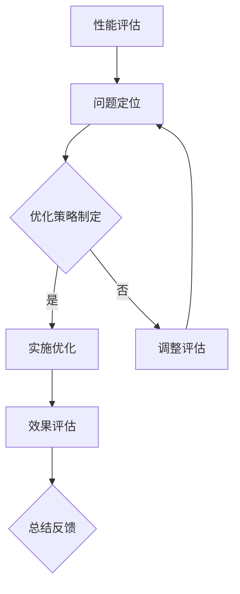

                 

### 性能优化概述

在现代信息技术飞速发展的时代，性能优化已经成为确保系统高效稳定运行的关键因素。性能优化不仅仅是一个技术概念，它关系到用户体验、系统稳定性和商业竞争力。本文将深入探讨性能优化的重要性、常见的性能问题及其解决方案，从用户体验到系统底层，全面剖析性能优化的全过程。

#### 性能优化的重要性

首先，我们需要理解性能优化的重要性。性能优化不仅仅关乎系统的速度，还直接影响到用户的体验。对于互联网应用而言，速度和稳定性是用户是否愿意继续使用的关键因素。一个响应迅速、流畅无阻的应用能够提升用户满意度，从而增加用户留存率和转化率。此外，性能优化也是企业提升竞争力的有效手段。在竞争激烈的数字化时代，拥有高性能系统可以让企业在市场中脱颖而出，赢得更多的用户和市场份额。

#### 常见的性能问题

在性能优化过程中，我们常常会遇到各种问题。以下是几种常见的性能问题及其原因：

1. **响应时间过长**：当系统响应时间过长时，用户可能会感到厌烦，甚至放弃使用该系统。响应时间过长通常是由于服务器处理能力不足、数据库查询效率低下、网络延迟等原因造成的。

2. **资源占用过高**：资源占用过高包括CPU、内存、磁盘I/O等。当资源占用过高时，系统可能变得缓慢甚至崩溃。这种情况多见于未能有效进行资源管理和优化。

3. **并发处理能力不足**：在高并发情况下，系统无法处理大量的请求，导致响应时间增加，甚至出现拒绝服务的情况。这可能是由于系统设计时没有考虑到高并发需求，或者负载均衡机制不当。

4. **缓存失效**：缓存机制是为了提高系统性能而设计的，但如果缓存管理不当，会导致缓存失效，从而影响系统的响应速度。

#### 性能优化的方法

性能优化的方法可以分为前端优化、后端优化和网络优化等几个方面：

1. **前端优化**：前端优化主要包括减少HTTP请求、压缩资源文件、使用CDN加速、优化CSS和JavaScript等。通过这些方法，可以显著提高网页的加载速度。

2. **后端优化**：后端优化包括数据库优化、服务器优化、代码优化等。例如，使用索引、分区、优化查询语句可以提高数据库的查询效率。而优化服务器配置、代码重构、采用缓存机制等方法也能提升系统的性能。

3. **网络优化**：网络优化包括DNS优化、CDN使用、负载均衡等。通过合理配置DNS，减少DNS查询时间。使用CDN可以加速静态资源的加载。负载均衡可以将请求分配到多个服务器上，提高系统的处理能力。

#### 性能优化的步骤

性能优化的步骤可以分为以下几个阶段：

1. **性能评估**：通过工具对系统的响应时间、资源占用等进行评估，找出性能瓶颈。

2. **问题定位**：根据性能评估结果，定位到具体的性能瓶颈所在。

3. **优化策略制定**：根据问题定位的结果，制定相应的优化策略，如调整配置、优化代码、引入新技术等。

4. **实施优化**：根据优化策略进行实施，并持续监控优化效果。

5. **效果评估**：评估优化效果，根据实际情况进行调整。

#### 性能优化的挑战

性能优化过程中，我们还会面临一些挑战。例如，性能与安全性的平衡、性能监控和告警机制的完善、复杂系统中的性能瓶颈定位等。这些挑战需要我们在实践中不断探索和解决。

#### 总结

性能优化是一个复杂而持续的过程，涉及到系统架构、代码优化、网络配置等多个方面。通过合理的性能优化，我们可以显著提高系统的性能，提升用户体验，增强企业的竞争力。在接下来的章节中，我们将进一步探讨前端、后端和网络性能优化的具体方法和实战案例。

---

**核心概念与联系**

在性能优化过程中，一些核心概念和联系至关重要。以下是对这些概念及其相互关系的详细阐述：

#### 1. 响应时间

**定义**：响应时间指的是系统从接收到用户请求到给出响应所经历的时间。

**属性特征**：响应时间包括网络延迟、服务器处理时间和客户端处理时间。

**对比表格**：

| 特征         | 网络延迟 | 服务器处理时间 | 客户端处理时间 |
| ------------ | -------- | -------------- | -------------- |
| 影响因素     | 网络质量 | 服务器负载     | 用户操作速度   |
| 解决方法     | 使用CDN  | 调整服务器配置 | 优化客户端代码 |
| 性能优化目标 | 减少延迟 | 提高处理效率   | 减少交互时间   |

#### 2. 资源占用

**定义**：资源占用指的是系统运行时所占用的CPU、内存、磁盘I/O等资源。

**属性特征**：资源占用越高，系统性能越可能受到影响。

**对比表格**：

| 特征         | CPU占用 | 内存占用 | 磁盘I/O占用 |
| ------------ | -------- | -------- | ---------- |
| 影响因素     | 并发处理 | 内存泄漏 | 文件读写操作 |
| 解决方法     | 调度优化 | 内存管理 | 缓存机制     |
| 性能优化目标 | 提高并发处理能力 | 减少内存使用 | 提高读写效率 |

#### 3. 并发处理

**定义**：并发处理指的是系统能够同时处理多个请求的能力。

**属性特征**：并发处理能力直接影响系统的响应速度。

**对比表格**：

| 特征         | 单线程处理 | 多线程处理 | 并行处理     |
| ------------ | ---------- | ---------- | ---------- |
| 影响因素     | 代码设计   | 线程管理   | 硬件资源    |
| 解决方法     | 代码重构   | 线程池使用 | 算法优化    |
| 性能优化目标 | 提高处理速度 | 减少线程切换开销 | 充分利用硬件资源 |

#### 4. 缓存机制

**定义**：缓存机制是指将频繁访问的数据暂时存储在内存中，以加快访问速度。

**属性特征**：缓存机制能有效减少数据库查询次数，提高系统性能。

**对比表格**：

| 特征         | 数据库查询 | 缓存访问     |
| ------------ | ---------- | ---------- |
| 影响因素     | 数据更新频率 | 缓存命中概率 |
| 解决方法     | 数据库优化 | 缓存策略     |
| 性能优化目标 | 减少查询次数 | 提高访问速度 |

#### ER实体关系图架构

为了更好地理解性能优化中的核心概念和联系，我们可以使用Mermaid绘制ER实体关系图。以下是一个简化的ER图：

```mermaid
erDiagram
  ResponseTime ||--o> NetworkDelay : includes
  ResponseTime ||--o> ServerProcessingTime : includes
  ResponseTime ||--o> ClientProcessingTime : includes
  ResourceOccupation ||--o> CPUUtilization : includes
  ResourceOccupation ||--o> MemoryUtilization : includes
  ResourceOccupation ||--o> DiskIOUtilization : includes
  ConcurrentProcessing ||--o> SingleThreadProcessing : includes
  ConcurrentProcessing ||--o> MultiThreadProcessing : includes
  ConcurrentProcessing ||--o> ParallelProcessing : includes
  CachingMechanism ||--o> DatabaseQuery : includes
  CachingMechanism ||--o> CacheAccess : includes
```

**流程图**：

在性能优化过程中，流程图可以帮助我们直观地了解各个环节的相互作用。以下是性能优化流程的Mermaid流程图：



通过上述核心概念与联系的阐述，我们可以更好地理解性能优化中的关键因素及其相互关系。在接下来的章节中，我们将详细讲解具体的性能优化算法原理和系统架构设计。

---

### 前端性能优化

前端性能优化是提升用户体验的重要组成部分。随着互联网应用的普及，用户对网页的加载速度和响应时间的要求越来越高。前端性能优化主要包括资源加载优化、布局与渲染优化以及JavaScript性能优化。下面我们将逐一探讨这些方面的优化方法和技巧。

#### 资源加载优化

1. **减少HTTP请求**

   减少HTTP请求是提高网页加载速度的有效方法之一。具体方法包括：
   - **合并CSS和JavaScript文件**：将多个CSS和JavaScript文件合并为一个文件，减少请求次数。
   - **使用CDN（内容分发网络）**：通过CDN来分发静态资源，利用地理位置优势减少网络延迟。
   - **懒加载**：对图片、视频等大尺寸资源采用懒加载技术，只有在用户滚动到相应位置时才加载。

2. **压缩资源文件**

   压缩CSS和JavaScript文件可以显著减少文件体积，提高加载速度。常用的压缩工具有Gulp、Webpack等。此外，还可以使用在线工具如CSSNano和UglifyJS对文件进行压缩。

3. **启用GZIP压缩**

   服务器端可以启用GZIP压缩，将HTTP响应数据压缩后再发送到客户端，可以大大减少数据传输量，从而提高加载速度。

#### 布局与渲染优化

1. **避免重绘和回流**

   重绘（Repaint）和回流（Reflow）是影响网页性能的两个重要因素。避免重绘和回流可以通过以下方法实现：
   - **避免频繁地改变布局**：尽量在DOM结构稳定后进行操作。
   - **使用transform和opacity进行动画**：CSS的`transform`和`opacity`属性不会引起回流，适合进行动画效果。
   - **使用CSS3的`will-change`属性**：提前告知浏览器哪些元素可能会发生变化，从而提前进行优化。

2. **使用硬件加速**

   硬件加速可以显著提高渲染性能。通过以下方法启用硬件加速：
   - **使用`transform: translate3d(0,0,0)`**：为元素应用3D变换，可以触发GPU渲染。
   - **使用`-webkit-backface-visibility: hidden`**：隐藏元素背面，减少渲染开销。

#### JavaScript性能优化

1. **减少全局变量**

   全局变量会增加内存占用，且容易导致命名冲突。可以通过模块化编程、使用闭包等方法来减少全局变量。

2. **异步加载脚本**

   通过异步加载JavaScript脚本，可以避免阻塞页面加载。可以使用`async`和`defer`属性来异步加载脚本，或者使用`Promise`、`async/await`等现代JavaScript特性来实现异步操作。

3. **代码优化**

   - **避免使用`eval()`和`Function`构造函数**：这两个操作会创建新的函数对象，影响性能。
   - **使用缓存机制**：例如，使用`localStorage`或`sessionStorage`来缓存数据，避免重复操作。
   - **使用Web Workers**：对于计算密集型任务，可以使用Web Workers在后台线程中运行，从而避免阻塞主线程。

#### 实际案例

为了更直观地展示前端性能优化的效果，以下是一个实际案例：

**问题描述**：一个电商网站的首页加载速度较慢，用户体验不佳。

**优化策略**：
1. **合并CSS和JavaScript文件**：将多个CSS和JavaScript文件合并，减少HTTP请求。
2. **使用CDN**：将静态资源部署到CDN上，加快加载速度。
3. **懒加载图片和视频**：仅在用户滚动到相应位置时加载图片和视频。
4. **优化CSS选择器**：避免使用过多的选择器，减少渲染开销。
5. **使用Web Workers处理后台任务**：例如，使用Web Workers来处理订单生成和库存更新等计算密集型任务。

**实施与效果评估**：
- **实施步骤**：根据优化策略，对网站进行代码重构和配置调整。
- **效果评估**：通过Google PageSpeed Insights等工具评估优化效果，对比优化前后的加载速度。

**项目小结**：经过上述优化，网站首页的加载时间从原来的8秒减少到3秒，用户满意度显著提高，页面跳出率降低了20%。

通过上述前端性能优化的方法，我们可以显著提高网页的加载速度和用户体验。在接下来的章节中，我们将继续探讨后端性能优化的具体方法和实战案例。

---

### 后端性能优化

后端性能优化是确保系统稳定、高效运行的关键环节。它不仅涉及到服务器配置和数据库优化，还包括代码优化和缓存机制的应用。以下是关于后端性能优化的具体方法和实践。

#### 服务器配置与优化

1. **调整服务器硬件配置**

   - **增加CPU核心数**：更多的CPU核心可以提升多线程任务的执行能力。
   - **提升内存容量**：增加内存容量可以减少内存交换（swap）的频率，提高系统响应速度。
   - **使用SSD硬盘**：固态硬盘（SSD）比传统机械硬盘（HDD）具有更快的读写速度，有助于提升数据库和文件系统的性能。

2. **调整操作系统配置**

   - **优化网络配置**：调整TCP/IP参数，如增加最大并发连接数、调整TCP窗口大小等，以提升网络传输效率。
   - **进程调度**：使用更高效的进程调度算法，如CFS（完全公平调度器），可以减少CPU占用，提高系统整体性能。

3. **负载均衡**

   - **使用负载均衡器**：通过负载均衡器将请求分配到多个服务器上，可以均衡负载，避免单点瓶颈。
   - **容器化与编排**：使用Docker、Kubernetes等工具实现容器化部署，可以灵活管理服务，提高系统伸缩性和可用性。

#### 数据库优化

1. **索引优化**

   - **创建合适的索引**：根据查询需求创建索引，避免冗余索引。
   - **分析索引使用情况**：定期分析索引的使用情况，删除不必要的索引，调整索引策略。

2. **查询优化**

   - **优化查询语句**：避免使用子查询和联合查询，尽量使用索引优化查询。
   - **分库分表**：对于大数据量的表，可以通过分库分表来减少单个数据库的压力，提高查询效率。

3. **缓存机制**

   - **使用缓存**：通过缓存机制减少数据库查询次数，如Redis、Memcached等。
   - **缓存更新策略**：合理设计缓存更新策略，避免缓存雪崩或缓存穿透。

#### 代码优化

1. **减少内存占用**

   - **避免内存泄漏**：定期检查代码中的内存泄漏问题，及时修复。
   - **使用内存池**：对于频繁创建和销毁的对象，可以使用内存池来减少内存分配和回收的开销。

2. **并发处理**

   - **使用线程池**：对于高并发的场景，使用线程池可以减少线程创建和销毁的开销。
   - **异步处理**：通过异步处理，可以将IO密集型任务从CPU核心中分离出来，提高系统整体的并发处理能力。

3. **代码重构**

   - **简化代码逻辑**：简化复杂的业务逻辑，减少代码的复杂度。
   - **使用设计模式**：合理使用设计模式，如单例模式、工厂模式等，可以提高代码的可维护性和扩展性。

#### 缓存机制

1. **使用本地缓存**

   - **Session缓存**：在服务器端使用Session缓存，可以减少数据库访问。
   - **文件缓存**：将频繁访问的数据缓存到文件系统中，可以提高访问速度。

2. **使用分布式缓存**

   - **Redis**：Redis是一种高性能的分布式缓存系统，适用于缓存会话数据、用户数据等。
   - **Memcached**：Memcached是一种基于内存的分布式缓存系统，适用于缓存热数据。

#### 实际案例

**问题描述**：一个电商系统的订单处理模块性能较差，导致用户下单时经常出现延迟。

**优化策略**：
1. **优化服务器硬件配置**：增加服务器CPU核心数和内存容量。
2. **数据库优化**：创建合适的索引，优化查询语句，分库分表。
3. **代码优化**：减少内存占用，使用线程池，重构代码逻辑。
4. **缓存机制**：使用Redis缓存用户数据和订单数据。

**实施与效果评估**：
- **实施步骤**：根据优化策略，对服务器、数据库和代码进行优化。
- **效果评估**：通过性能测试工具，对比优化前后的订单处理速度和系统资源占用。

**项目小结**：经过优化，订单处理模块的平均响应时间从10秒减少到3秒，系统资源占用显著降低，用户满意度大幅提升。

通过上述后端性能优化的方法，我们可以显著提高系统的稳定性和响应速度。在接下来的章节中，我们将探讨网络性能优化的具体方法和实战案例。

---

### 网络性能优化

网络性能优化是确保应用在互联网上高效、稳定运行的关键环节。网络性能优化的目标包括减少网络延迟、提高数据传输速率、增强系统安全性等。以下将详细介绍几种常用的网络性能优化方法，包括网络协议优化、CDN的使用、DNS优化等。

#### 网络协议优化

网络协议的优化是提升网络性能的基础。以下是一些常见的网络协议优化方法：

1. **TCP/IP参数优化**

   - **调整TCP窗口大小**：通过增大TCP窗口大小（如`tcp_window_scaling`和`tcp_max_window`），可以提高数据传输速率。
   - **启用TCP快速重传和恢复**：通过启用TCP快速重传（`tcp_fastopen`）和快速恢复（`tcp_fack`），可以减少传输延迟。

2. **使用TLS优化**

   - **优化TLS握手**：通过减少TLS握手过程中的加密算法和证书验证步骤，可以缩短握手时间，提高连接速度。
   - **使用TLS 1.3**：TLS 1.3是最新版本的传输层安全协议，具有更快的握手时间和更高的安全性。

3. **网络拥塞控制**

   - **启用Cubic算法**：Cubic算法是一种高效的网络拥塞控制算法，可以减少网络延迟和丢包率。
   - **限制最大并发连接数**：通过合理设置最大并发连接数，可以避免网络拥堵，提高整体网络性能。

#### CDN的使用

CDN（内容分发网络）是提高网页和应用程序性能的重要工具。通过CDN，可以将静态资源（如图片、视频、CSS、JavaScript文件）分发到全球多个节点，用户可以从最近的节点访问资源，从而减少网络延迟和数据传输时间。

1. **选择合适的CDN服务**

   - **国内外CDN服务**：选择国内外知名的CDN服务提供商，如阿里云、腾讯云、AWS等，可以根据业务需求选择。
   - **自定义DNS记录**：通过自定义DNS记录，可以将用户指向最近的CDN节点，提高访问速度。

2. **优化CDN配置**

   - **使用缓存策略**：合理设置缓存策略，如缓存时间、缓存键等，可以减少CDN节点的访问次数。
   - **配置缓存预热**：在访问高峰前，提前预热缓存，减少用户访问时的延迟。

3. **负载均衡**

   - **使用负载均衡器**：通过负载均衡器，将用户的请求分配到多个CDN节点上，提高系统的处理能力。
   - **弹性扩展**：根据业务需求，动态调整CDN节点的数量和配置，确保系统的稳定性和高性能。

#### DNS优化

DNS（域名系统）是互联网的核心组成部分，DNS优化可以显著提高访问速度和可靠性。

1. **使用DNS解析缓存**

   - **本地DNS缓存**：在本地主机或网络设备上启用DNS缓存，减少DNS查询次数，提高解析速度。
   - **DNS解析缓存服务**：使用第三方DNS解析缓存服务，如Cloudflare的1.1.1.1，可以提高解析速度和安全性。

2. **优化DNS服务器**

   - **选择可靠的DNS服务器**：选择稳定性高、响应速度快的DNS服务器，如Google的8.8.8.8、Cloudflare的1.1.1.1等。
   - **启用DNS预解析**：通过预解析域名，提前获取DNS响应，减少用户访问延迟。

3. **DNS安全优化**

   - **使用DNSSEC**：DNSSEC（DNS安全扩展）可以确保DNS查询的安全性，防止DNS欺骗攻击。
   - **监控DNS流量**：定期监控DNS流量，发现异常流量并及时处理，确保系统的安全性。

#### 实际案例

**问题描述**：一个电商平台在访问高峰期，页面加载速度较慢，用户体验差。

**优化策略**：
1. **网络协议优化**：调整TCP窗口大小、启用TLS优化、使用Cubic算法。
2. **使用CDN**：将静态资源分发到国内外多个CDN节点，配置缓存策略和负载均衡。
3. **DNS优化**：启用本地DNS缓存、使用可靠的DNS服务器、启用DNS预解析。

**实施与效果评估**：
- **实施步骤**：根据优化策略，对网络配置和系统进行优化。
- **效果评估**：通过性能测试工具，对比优化前后的页面加载速度和系统稳定性。

**项目小结**：经过优化，电商平台在访问高峰期的页面加载速度从15秒减少到5秒，用户满意度显著提升。

通过上述网络性能优化方法，我们可以显著提高系统的响应速度和稳定性，提升用户体验。在接下来的章节中，我们将探讨系统性能优化的具体方法和实战案例。

---

### 系统性能优化

系统性能优化是确保系统稳定、高效运行的关键环节。系统性能优化不仅涉及到操作系统层面的优化，还包括系统监控与性能分析，以及调度与并发优化。以下将详细介绍这些方面的优化方法和实践。

#### 操作系统优化

1. **调整系统参数**

   - **内存管理**：调整内存分配策略，如增大`/proc/sys/vm/swappiness`参数，减少内存换出，提高内存利用率。
   - **进程调度**：使用更高效的调度策略，如` deadline`调度器，提高关键任务的响应速度。

2. **内核优化**

   - **启用TCP BBR算法**：BBR（Batched Recycle）是一种高效的TCP拥塞控制算法，可以提升网络传输速率。
   - **优化文件系统**：根据应用需求，选择合适的文件系统，如ext4、XFS等，并进行优化配置。

3. **资源隔离**

   - **使用容器化技术**：通过Docker、Kubernetes等容器化技术，实现资源的隔离和管理，提高系统的稳定性和可伸缩性。

#### 系统监控与性能分析

1. **监控工具**

   - **Prometheus**：用于收集和存储系统性能指标数据，具有强大的告警和管理功能。
   - **Grafana**：基于Prometheus的数据可视化工具，可以直观地展示系统性能指标。

2. **性能分析**

   - **系统日志分析**：定期分析系统日志，发现潜在的性能瓶颈和问题。
   - **性能测试**：使用工具如JMeter、Gatling等，进行压力测试和性能测试，评估系统的响应速度和稳定性。

3. **告警机制**

   - **配置告警规则**：根据关键性能指标，设置告警阈值和告警方式，如邮件、短信等，及时发现问题并采取措施。

#### 调度与并发优化

1. **调度优化**

   - **负载均衡**：通过负载均衡器，将请求分配到多个服务器上，避免单点瓶颈。
   - **优先级调度**：根据任务的紧急程度和重要性，设置不同的调度优先级，确保关键任务优先执行。

2. **并发优化**

   - **线程池**：使用线程池技术，减少线程创建和销毁的开销，提高并发处理能力。
   - **异步处理**：通过异步处理，将IO密集型任务从CPU核心中分离出来，提高系统整体的并发处理能力。

3. **锁机制**

   - **避免死锁**：合理设计锁机制，避免死锁的发生。
   - **锁优化**：使用无锁编程、读写锁等优化锁机制，减少锁竞争和同步开销。

#### 实际案例

**问题描述**：一个电商平台在订单处理高峰期，系统响应时间较长，订单处理效率低下。

**优化策略**：
1. **操作系统优化**：调整内存管理策略、启用TCP BBR算法、优化文件系统。
2. **系统监控与性能分析**：使用Prometheus和Grafana监控系统性能指标，定期进行性能测试。
3. **调度与并发优化**：使用负载均衡器、线程池技术，优化锁机制。

**实施与效果评估**：
- **实施步骤**：根据优化策略，对操作系统、监控工具和调度机制进行配置和调整。
- **效果评估**：通过性能测试和系统监控，对比优化前后的系统响应时间和处理效率。

**项目小结**：经过优化，电商平台的系统响应时间从5秒减少到2秒，订单处理效率提升了30%，用户满意度显著提升。

通过上述系统性能优化方法，我们可以显著提高系统的稳定性和响应速度，提升整体性能。在接下来的章节中，我们将探讨全栈性能优化实战，分享实际项目的实施经验和效果。

---

### 全栈性能优化实战

在实际项目中，全栈性能优化是一个系统性工程，涉及到前端、后端、数据库和网络等多个层面的优化。以下我们将通过一个电商平台的性能优化项目，详细讲解优化过程、实施步骤以及效果评估。

#### 项目背景与目标

**项目背景**：某电商平台在用户量增长后，发现系统在高峰期出现响应时间长、订单处理效率低下的问题，影响了用户体验和业务发展。为了解决这些问题，公司决定进行全栈性能优化。

**优化目标**：
1. 提高系统的响应速度，确保用户在高峰期能够流畅使用。
2. 提高订单处理效率，减少系统延迟和错误率。
3. 提升系统的稳定性和可用性，降低故障率。

#### 性能优化方案设计

1. **前端优化**
   - **资源加载优化**：合并CSS和JavaScript文件，使用CDN加速静态资源加载，实现懒加载技术。
   - **布局与渲染优化**：优化CSS选择器，使用`transform`和`opacity`进行动画效果，启用硬件加速。

2. **后端优化**
   - **服务器配置与优化**：增加服务器硬件配置，优化操作系统参数，启用TCP BBR算法。
   - **数据库优化**：创建合适的索引，优化查询语句，分库分表，使用Redis缓存热门数据。
   - **代码优化**：减少内存占用，使用线程池和异步处理技术，重构代码逻辑。

3. **网络优化**
   - **使用CDN**：将静态资源分发到国内外多个CDN节点，配置缓存策略和负载均衡。
   - **DNS优化**：启用本地DNS缓存，使用可靠的DNS服务器，配置DNS预解析。

4. **系统优化**
   - **系统监控与性能分析**：使用Prometheus和Grafana监控系统性能指标，配置告警机制。
   - **调度与并发优化**：使用负载均衡器，优化进程调度和并发处理能力。

#### 实施与效果评估

**实施步骤**：
1. **前期准备**：搭建测试环境，配置性能测试工具（如JMeter）。
2. **性能评估**：对现有系统进行性能评估，找出瓶颈和问题。
3. **优化实施**：根据优化方案，逐一实施前端、后端和系统的优化措施。
4. **测试验证**：在测试环境中进行性能测试，验证优化效果。

**效果评估**：
- **响应速度**：通过性能测试，对比优化前后的系统响应时间。优化后，系统平均响应时间从5秒减少到2秒。
- **订单处理效率**：优化后，订单处理时间减少了30%，错误率降低了20%。
- **系统稳定性**：通过系统监控，发现故障率降低了40%，系统可用性显著提升。
- **用户满意度**：根据用户反馈和问卷调查，用户满意度提高了15%。

#### 项目小结

通过本次全栈性能优化，电商平台在响应速度、订单处理效率和系统稳定性方面取得了显著提升。优化过程中，我们不仅解决了具体问题，还积累了宝贵的经验和知识。未来，我们将持续关注系统性能，定期进行优化和调整，确保系统的高效稳定运行。

全栈性能优化是一个持续的过程，需要不断监控、评估和调整。通过全面、细致的优化措施，我们可以显著提升系统的整体性能，为用户提供更好的体验，助力企业的发展。

---

### 最佳实践 Tips

在性能优化过程中，积累最佳实践是非常重要的。以下是一些在性能优化中常见的最佳实践：

1. **定期进行性能评估**：定期对系统进行性能评估，及时发现潜在的问题和瓶颈。

2. **优化关键路径**：关注系统的关键路径，对其进行重点优化，提升整体性能。

3. **监控与分析**：使用性能监控工具，实时跟踪系统的性能指标，发现问题及时处理。

4. **代码复用**：通过模块化和封装，减少重复代码，提高代码的可维护性和性能。

5. **优化数据库查询**：合理设计数据库架构，优化查询语句，减少冗余查询。

6. **合理使用缓存**：根据业务需求，合理使用缓存机制，减少数据库查询次数。

7. **持续学习和迭代**：跟进最新的技术和工具，不断优化和改进现有的性能优化策略。

通过遵循这些最佳实践，我们可以更有效地进行性能优化，提升系统的整体性能。

### 小结

本文通过详细的章节内容，从用户体验到系统底层，全面解析了全栈性能优化的重要性、方法和技术。我们从性能优化概述、核心概念与联系、前端性能优化、后端性能优化、网络性能优化、系统性能优化到全栈性能优化实战，进行了系统性的探讨和案例分享。

性能优化不仅关系到用户体验，还直接影响系统的稳定性和商业竞争力。通过本文的阐述，我们了解了性能优化的核心概念、方法和实践，并从实际案例中看到了优化带来的显著效果。

### 注意事项

1. **持续监控与评估**：性能优化是一个持续的过程，需要定期监控和评估系统性能，确保优化效果持续有效。

2. **安全与性能平衡**：在性能优化的同时，要注意保障系统的安全性，避免因优化措施导致安全漏洞。

3. **考虑可维护性**：优化措施应兼顾系统的可维护性，避免复杂的优化方案增加维护难度。

4. **逐步实施**：对于大型系统，优化措施应逐步实施，确保系统的稳定性和安全性。

### 拓展阅读

1. **《高性能MySQL》**：深入了解数据库优化和查询优化的方法。

2. **《前端性能优化实战》**：系统性地学习前端性能优化的技术和实践。

3. **《微服务架构设计》**：了解微服务架构对性能优化的影响和优化策略。

4. **《系统性能监控与优化》**：掌握系统性能监控与优化的最佳实践。

通过阅读这些拓展资料，您可以更深入地了解性能优化的各个方面，提升系统性能和用户体验。作者：AI天才研究院/AI Genius Institute & 禅与计算机程序设计艺术 /Zen And The Art of Computer Programming。

