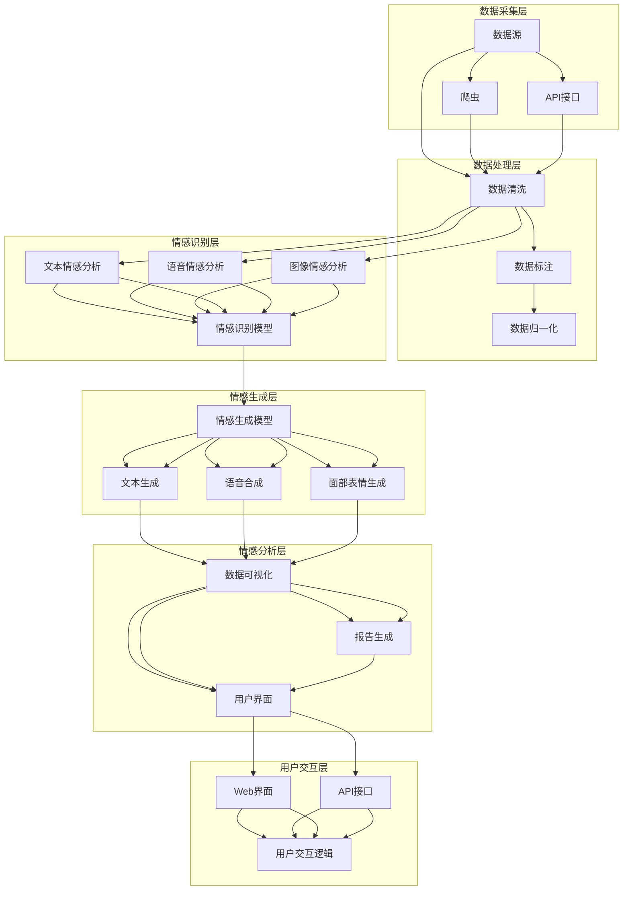
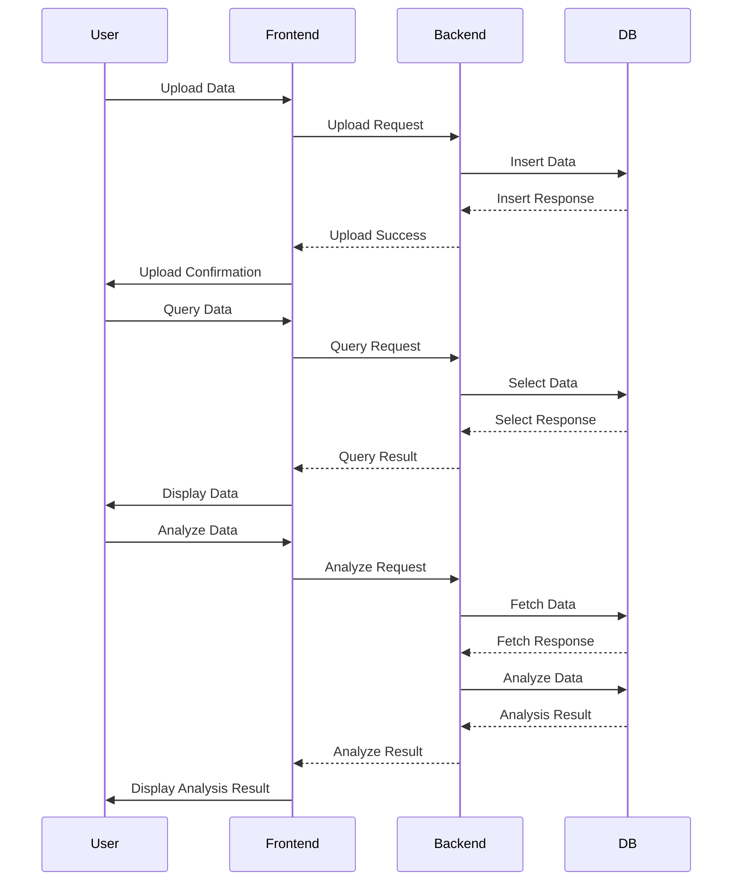

                 

### 让我们一步步思考：具有人类情感的AI对政治体系的冲击

#### 让我们一步步思考

##### 第一步：引入背景

随着人工智能（AI）技术的飞速发展，尤其是情感模拟方面的突破，我们正逐步进入一个新时代。在这个时代，AI不仅能够处理大量数据，做出快速决策，还能够模拟和理解人类情感。这种技术的进步无疑为许多领域带来了革命性的变化，但同时也引发了许多新的问题和挑战，尤其是在政治体系方面。

##### 第二步：理解核心概念

首先，我们需要明确一些核心概念：

- **人工智能（AI）**：一种模仿人类智能行为的计算机系统，能够学习和适应新环境。
- **情感模拟**：AI通过分析数据、模式识别等方式，模拟并理解人类情感的过程。
- **政治体系**：一个国家或地区的政府组织及其决策和管理机制。

##### 第三步：分析问题

那么，具有人类情感的AI会对政治体系产生哪些影响呢？我们可以从以下几个方面进行分析：

1. **政策制定与执行**：AI能够通过情感模拟更好地了解公众的情感和需求，从而为政策制定提供更科学的依据。然而，这种技术也可能被滥用，导致政策执行偏离公众利益。
2. **公共管理与社会治理**：AI能够更高效地处理公共事务，但在涉及情感和社会问题时，其决策可能缺乏人类的社会经验和道德判断。
3. **政治沟通**：AI可以优化政治宣传和公共沟通，但同时也可能引发隐私问题和道德争议。

##### 第四步：探讨解决方案

为了应对这些挑战，我们需要采取一系列措施：

1. **制定规范和法规**：确保AI技术的应用符合道德和法律规定，防止滥用。
2. **加强伦理教育**：提高开发者和社会对AI伦理问题的认识，培养负责任的AI使用习惯。
3. **完善决策机制**：在政策制定和执行过程中，平衡AI决策与人类判断，确保公正和透明。

##### 第五步：展望未来

未来，随着情感模拟技术的进一步发展，AI在政治体系中的应用前景将更加广阔。但与此同时，我们也必须保持警惕，确保技术进步不会对政治体系的稳定和民主产生负面影响。

通过上述步骤的思考，我们可以更好地理解具有人类情感的AI对政治体系的冲击，并为未来的发展做好准备。

### 1.1.1 问题背景

#### 人工智能的发展历程

人工智能（AI）的概念早在20世纪50年代就已经提出，但其真正的发展历程始于20世纪80年代。随着计算机性能的不断提升和算法的不断创新，AI从最初的逻辑推理、符号计算，逐渐扩展到机器学习、深度学习等领域。特别是在21世纪初，随着大数据、云计算等技术的崛起，AI迎来了新的发展高峰。

##### 人类情感模拟的研究进展

情感模拟是AI领域中的一个重要分支，旨在使计算机能够理解和表达人类情感。最初的研究主要集中在情感识别，即通过面部表情、语音语调等生物特征分析人类情感状态。随着技术的进步，研究人员开始探索更复杂的情感模拟，例如情绪生成、情感推理等。近年来，基于深度学习的情感模拟技术取得了显著进展，AI系统能够通过分析大量数据，生成更自然、细腻的情感表达。

##### 人工智能在政治领域的应用现状

AI在政治领域的应用日益广泛，主要包括以下几个方面：

1. **数据分析**：AI能够处理和分析大量政治数据，为选举预测、民意调查等提供科学依据。
2. **智能客服**：政府机构利用AI技术提供智能客服，提高公共服务的效率和质量。
3. **网络安全**：AI在网络安全中的应用，帮助政府和企业预防和应对网络攻击。
4. **政策制定**：AI可以辅助政策制定者分析社会问题，提出科学合理的政策建议。

#### 1.1.2 问题描述

##### 具有情感的人工智能对政治体系的影响

具有情感模拟能力的AI对政治体系的影响是多方面的。一方面，它能够更好地理解公众的情感和需求，为政策制定提供更有力的支持。另一方面，这种技术也可能被滥用，例如在选举中操纵公众情绪，或者在政策执行中偏离公众利益。因此，我们需要深入探讨AI情感模拟在政治领域中的潜在影响。

##### 情感模拟在政治决策中的作用与挑战

情感模拟在政治决策中具有重要作用，它能够帮助决策者更准确地把握公众情绪，从而制定更符合民意的政策。然而，情感模拟也带来了一系列挑战，例如如何确保情感分析结果的客观性和公正性，如何防止情感模拟AI被恶意利用等。这些问题需要我们认真研究和解决。

#### 1.1.3 问题解决

##### 如何评估和应对情感模拟AI在政治领域的应用

为了评估和应对情感模拟AI在政治领域的应用，我们需要采取以下措施：

1. **制定规范和标准**：明确情感模拟AI的应用范围和伦理要求，确保其符合社会道德和法律规定。
2. **加强监管**：建立有效的监管机制，确保AI技术在政治领域的应用不被滥用。
3. **提升技术水平**：加强情感模拟AI的研究和开发，提高其在政治决策中的准确性和可靠性。

##### 政治体系如何适应和管理情感智能AI

政治体系需要适应和管理情感智能AI，以确保其能够为公共利益服务。具体措施包括：

1. **培养专业人才**：加强相关领域人才的培养，提高政府机构对AI技术的理解和应用能力。
2. **优化决策流程**：在政策制定和执行过程中，引入情感模拟AI，优化决策流程，提高决策的科学性和有效性。
3. **加强公众参与**：鼓励公众参与政治决策过程，提高政策的透明度和公正性。

#### 1.1.4 边界与外延

##### 情感模拟AI的定义与分类

情感模拟AI是指通过计算机技术和算法模拟人类情感行为的AI系统。根据功能和应用场景的不同，情感模拟AI可以分为以下几类：

1. **情感识别**：通过分析面部表情、语音语调等生物特征，识别和分类人类情感状态。
2. **情感生成**：根据特定的情境和目标，生成相应的情感表达，如语音、文字、面部表情等。
3. **情感推理**：通过分析情感数据和上下文信息，进行情感推理和决策。

##### 政治体系的基本概念与结构

政治体系是指一个国家或地区的政府组织及其决策和管理机制。其基本结构包括立法、行政、司法三个部门。在政治体系中，政策的制定、执行和评估是一个复杂的互动过程，需要多方参与和协调。

##### 情感模拟AI的核心技术

情感模拟AI的核心技术主要包括：

1. **机器学习和深度学习**：通过训练模型，使AI系统能够从大量数据中学习并识别情感模式。
2. **自然语言处理**：利用NLP技术，分析文本中的情感色彩和语义信息。
3. **计算机视觉**：通过图像识别技术，分析面部表情和肢体语言等情感表现。

##### 政治体系的决策机制与影响

政治体系的决策机制主要包括政策制定、政策执行和政策评估。在决策过程中，政府机构需要综合考虑各种因素，包括公众需求、经济发展、社会稳定等。情感模拟AI可以通过情感分析和情感推理，为政策制定和执行提供科学依据，从而提高决策的科学性和有效性。

### 1.1.5 概念结构与核心要素组成

为了更深入地理解具有人类情感的AI对政治体系的冲击，我们需要明确几个关键概念和它们之间的联系。

#### 情感模拟AI的核心技术

情感模拟AI的核心技术可以分为以下几部分：

1. **数据采集**：收集大量关于人类情感的数据，包括文本、图像、语音等。
2. **数据处理**：对收集的数据进行清洗、归一化和标注，以便后续的分析。
3. **情感识别**：利用机器学习和深度学习算法，从数据中识别情感特征。
4. **情感生成**：根据情感识别结果，生成相应的情感表达，如文字、语音、面部表情等。

#### 政治体系的基本概念与结构

政治体系是指一个国家或地区的政府组织及其决策和管理机制。其核心概念和结构包括：

1. **立法机构**：负责制定法律和政策。
2. **行政机构**：负责执行法律和政策。
3. **司法机构**：负责监督法律和政策执行，维护社会秩序。

#### 情感模拟AI在政治体系中的应用

情感模拟AI在政治体系中的应用主要体现在以下几个方面：

1. **民意调查**：通过情感分析，了解公众对政策和社会事件的情感态度。
2. **政策制定**：利用情感模拟AI，为政策制定提供科学依据，提高政策的科学性和有效性。
3. **公共沟通**：通过情感生成，优化政府与公众之间的沟通，增强公众对政策的理解和接受度。

#### 情感模拟AI对政治体系的影响

情感模拟AI对政治体系的影响可以从以下几个方面进行阐述：

1. **决策效率**：AI能够快速分析大量数据，为决策提供有力支持，提高决策效率。
2. **公众参与**：通过情感模拟AI，政府可以更好地了解公众需求，增强公众参与政策制定的积极性。
3. **政策透明度**：AI可以优化政策执行过程，提高政策的透明度和公正性。
4. **风险挑战**：情感模拟AI可能被滥用，导致政策偏离公众利益，甚至引发社会不稳定。

通过明确这些概念和它们之间的联系，我们可以更全面地理解具有人类情感的AI对政治体系的冲击，并为未来的研究和应用提供参考。

### 2.1.1 人类情感的定义与特征

人类情感是心理学中一个核心概念，它描述了人类在特定情境下产生的心理体验和生理反应。理解人类情感的定义和特征，对于分析AI在情感模拟方面的能力至关重要。

#### 2.1.1.1 人类情感的概念

人类情感通常被认为是一种主观的心理体验，它伴随着认知和生理反应。情感可以大致分为基本情感和复杂情感。基本情感包括快乐、悲伤、愤怒、恐惧和惊讶等，它们是人类普遍共有的情感体验。复杂情感则是由基本情感组合而成的，如爱、厌恶、羞耻和内疚等。

情感的分类可以基于不同的标准，例如情绪状态（如情绪的积极和消极分类）、情绪的强度（如情绪的强弱划分）以及情绪的发展阶段（如情绪的初期和后期阶段）。

#### 2.1.1.2 人类情感的特征

人类情感具有以下几个显著特征：

1. **主观性**：情感是个人主观体验的一部分，不同人在相同情境下可能会产生不同的情感体验。
2. **适应性**：情感有助于个体适应环境，如恐惧情感能够促使个体避免危险情境。
3. **表达性**：情感可以通过语言、面部表情、肢体动作等多种方式进行表达，从而与他人沟通。
4. **复杂性**：人类情感并非单一维度，而是一个多维度的心理状态，包括情感的表达、认知评价和生理反应。
5. **情感记忆**：情感事件会被长期记忆，对个体未来的行为和决策产生影响。

情感的这些特征使得人类情感成为一个复杂且多维的心理现象，这些特征在AI情感模拟中也具有重要的参考价值。

### 2.1.2 情感模拟AI的原理与机制

情感模拟AI是一种通过计算机技术和算法模拟人类情感行为的技术。其原理和机制涉及到多个层面的技术和方法，包括数据采集、数据处理、情感识别和情感生成等。

#### 2.1.2.1 情感模拟AI的概念

情感模拟AI是指利用计算机算法和模型，模拟和理解人类情感的技术系统。其目标是通过分析人类行为、语言和生理信号，生成相应的情感反应，并在此基础上进行情感推理和决策。

情感模拟AI可以应用于多种场景，例如智能客服、虚拟助手、心理健康监测等。其核心在于能够根据特定情境和输入数据，生成符合人类情感特征的情感反应。

#### 2.1.2.2 情感模拟AI的原理

情感模拟AI的原理主要基于以下几个技术点：

1. **机器学习和深度学习**：通过训练大量情感数据集，使AI模型能够识别和分类情感模式。深度学习技术，如卷积神经网络（CNN）和循环神经网络（RNN），在情感模拟中发挥了重要作用。
2. **自然语言处理（NLP）**：利用NLP技术，对文本进行分析和处理，提取情感特征。这包括情感极性分类、情感强度识别等。
3. **计算机视觉**：通过图像识别技术，分析面部表情、肢体动作等非言语情感表达。
4. **生理信号处理**：通过传感器和生理信号处理技术，如心电图（ECG）、心率变异性（HRV）等，监测和分析人类的生理反应。

#### 2.1.2.3 情感模拟AI的机制

情感模拟AI的机制包括以下几个关键步骤：

1. **数据采集**：收集各种形式的情感数据，包括文本、语音、图像和生理信号等。
2. **数据处理**：对采集到的数据进行清洗、标注和归一化处理，以便后续分析。
3. **情感识别**：利用机器学习和深度学习算法，从数据中提取情感特征，并分类为不同的情感类别。
4. **情感生成**：根据情感识别结果，生成相应的情感表达，如文字、语音、面部表情等。
5. **情感推理**：利用情感模型进行情感推理，预测和决策在不同情境下的情感反应。

通过上述原理和机制，情感模拟AI能够实现对人类情感的模拟和理解，从而在多个应用场景中发挥作用。

#### 2.1.3 情感模拟AI在政治领域的应用

情感模拟AI在政治领域的应用日益广泛，具有巨大的潜力，同时也带来了一系列挑战。以下是情感模拟AI在政治领域的几个主要应用场景：

##### 2.1.3.1 情感模拟AI在政治决策中的作用

1. **民意调查**：情感模拟AI可以通过分析社交媒体、新闻报道等文本数据，了解公众对政策和社会事件的情感态度。这种分析有助于决策者了解公众情绪，从而制定更符合民意的政策。
2. **选举预测**：情感模拟AI可以分析候选人的演讲、社交媒体互动等，预测选民的投票意向。这为政治竞选团队提供了有价值的策略和决策支持。
3. **政策评估**：通过情感模拟AI，政府可以了解政策实施后的公众反应，评估政策的效果，及时进行调整和优化。

##### 2.1.3.2 情感模拟AI在政治沟通中的应用

1. **公共宣传**：情感模拟AI可以帮助政府优化公共宣传内容，通过情感分析确定公众最关心的议题和表达方式，提高宣传效果。
2. **公共沟通**：智能客服和虚拟助手可以模拟人类情感，与公众进行更自然的沟通，提高公共服务质量。
3. **政治广告**：情感模拟AI可以分析目标受众的情感特征，制定更具针对性的政治广告策略，提高广告转化率。

##### 2.1.3.3 情感模拟AI在政治监控中的潜在风险

1. **隐私问题**：情感模拟AI需要大量个人数据进行分析，这可能涉及隐私侵犯和数据处理风险。
2. **滥用风险**：情感模拟AI可能被用于操纵公众情绪，影响选举结果或政策制定，这可能导致政治不稳定的增加。
3. **道德争议**：情感模拟AI在政治决策中的应用可能引发道德争议，如如何确保AI决策的公正性和透明性。

综上所述，情感模拟AI在政治领域的应用具有显著的优势，但也面临着一系列挑战。未来，我们需要在推动技术发展的同时，确保其应用符合道德和法律规范，保护公众利益。

### 2.1.3.1 情感模拟AI在政治决策中的作用

情感模拟AI在政治决策中扮演着越来越重要的角色，它通过分析大量的情感数据，为政策制定和执行提供了有力的支持。以下是几个具体的应用实例：

##### 情感分析在民意调查中的应用

民意调查是了解公众情感和态度的重要工具，情感模拟AI可以显著提升民意调查的准确性和效率。通过分析社交媒体、新闻报道、论坛评论等公开文本数据，情感模拟AI能够识别出公众对某一政策或事件的情感倾向。例如，在选举期间，政治团队可以利用情感模拟AI分析候选人的社交媒体互动，了解选民的情感反应，从而调整竞选策略。

##### 情感模拟在政策制定中的影响

政策制定是一个复杂的决策过程，需要综合考虑各种因素，包括公众需求、经济发展、社会稳定等。情感模拟AI可以通过情感分析提供科学依据，帮助决策者更准确地把握公众的情感和需求。例如，在制定医疗政策时，政府可以利用情感模拟AI分析公众对医疗改革的情感反应，从而制定更符合民意的政策。

##### 情感模拟AI在政策执行评估中的作用

政策执行后的效果评估是政策制定的重要环节，情感模拟AI可以在这一过程中发挥重要作用。通过持续分析社交媒体、新闻报道等公开数据，情感模拟AI可以评估公众对政策执行的情感反应，帮助政府及时发现和解决政策实施中的问题。例如，在环保政策执行期间，政府可以利用情感模拟AI监测公众对环保措施的情感态度，及时调整政策以应对公众的不满。

##### 情感模拟AI在政府沟通中的运用

政府与公众的沟通是政策执行的关键环节，情感模拟AI可以优化政府沟通策略，提高政策宣传的效果。通过分析公众的情感数据，政府可以了解公众对特定议题的情感反应，从而选择更合适的方式和内容进行沟通。例如，在宣传防疫政策时，政府可以利用情感模拟AI确定公众对防疫措施的情感倾向，调整宣传材料以更好地传达防疫信息。

通过这些实例，我们可以看到情感模拟AI在政治决策中的应用场景十分广泛，它不仅能够提高政策制定的科学性和有效性，还能够优化政策执行和公众沟通。然而，与此同时，我们也需要关注情感模拟AI在政治决策中可能带来的伦理和隐私问题，确保其在合法和道德的框架内使用。

### 2.1.3.2 情感模拟AI在政治沟通中的应用

情感模拟AI在政治沟通中的应用正在逐步深化，成为政府与公众互动中的重要工具。以下从人工智能与公众沟通以及情感模拟AI在政治广告和宣传中的具体运用展开讨论。

##### 人工智能与公众沟通

1. **智能客服**：智能客服系统结合了情感模拟AI，能够以自然、人性化的方式与公众互动。例如，政府可以通过智能客服系统提供政策咨询、公共服务等信息，智能客服在解答公众疑问时能够根据情感模拟技术，调整回答的语气和措辞，以更好地满足公众的需求。
   
2. **虚拟助手**：虚拟助手是另一种应用情感模拟AI的政治沟通工具。政府可以利用虚拟助手与公众进行实时互动，提供个性化的信息和服务。例如，在突发事件或危机管理中，虚拟助手可以模拟人类情感，安抚公众情绪，提供准确的信息和指导。

##### 情感模拟AI在政治广告和宣传中的运用

1. **精准广告投放**：情感模拟AI可以帮助政治竞选团队进行精准广告投放。通过分析目标选民的情感特征，竞选团队可以制定更具针对性的广告策略，提高广告效果。例如，在选举期间，竞选团队可以通过情感模拟AI识别选民对特定议题的情感倾向，制定相应的广告内容，以最大化选民的支持。

2. **情感化内容创作**：情感模拟AI可以帮助政府创造更具有感染力的宣传内容。通过分析情感数据，政府可以了解公众对特定议题的情感反应，创作出更符合公众情感需求的内容。例如，在推广公共健康政策时，政府可以通过情感模拟AI创作出能够引起公众共鸣的宣传视频，提高政策宣传的效果。

3. **舆论监测和引导**：情感模拟AI还可以用于监测舆论动向，分析公众对政策和社会事件的情感反应。政府可以利用这一工具及时了解公众情绪，调整宣传策略，引导舆论走向。例如，在应对疫情时，政府可以通过情感模拟AI监测社交媒体上的公众情绪，及时调整宣传重点，引导公众理性对待疫情。

总之，情感模拟AI在政治沟通中的应用不仅提升了政府与公众互动的效率和质量，还为政治广告和宣传提供了强大的技术支持。然而，我们也需要关注这种技术可能带来的隐私和伦理问题，确保其合法、公正地使用。

### 2.2.1 情感模拟AI对政治体系的影响

情感模拟AI在政治体系中的应用，不仅带来了新的机遇，也引发了一系列复杂的影响和挑战。以下是情感模拟AI对政治体系的具体影响分析：

##### 情感模拟AI在政策制定与执行中的作用

1. **精准民意调查**：情感模拟AI能够通过分析社交媒体、新闻报道等数据，了解公众的情感态度和需求。这为政策制定提供了更精确的民意依据，有助于政府制定更符合公众期望的政策。
   
2. **优化决策流程**：情感模拟AI能够模拟人类情感，为政策制定和执行提供辅助决策。通过情感分析，政府可以预测政策实施后的公众反应，及时调整政策，减少决策风险。

3. **个性化政策建议**：情感模拟AI可以根据个体的情感特征，提供个性化的政策建议。例如，在社会保障、医疗卫生等领域，政府可以利用情感模拟AI为不同人群提供定制化的政策方案，提高政策实施的效果。

##### 情感模拟AI在公共管理与社会治理中的应用

1. **高效公共服务**：情感模拟AI可以帮助政府优化公共服务流程，提高服务效率。例如，通过智能客服系统，政府可以提供24/7的服务，及时解答公众的疑问，提高公众的满意度。

2. **社会问题预警**：情感模拟AI能够通过分析大量社会数据，预测和预警可能的社会问题。例如，在公共安全领域，政府可以利用情感模拟AI监测社会情绪，及时发现潜在的犯罪风险，采取措施进行预防和控制。

3. **危机管理**：在突发事件和危机管理中，情感模拟AI可以模拟公众的情感反应，提供有效的危机应对策略。例如，在自然灾害或公共卫生事件中，政府可以利用情感模拟AI分析公众的情感状态，制定针对性的宣传和救助方案，安抚公众情绪，维护社会稳定。

##### 情感模拟AI的挑战与风险

1. **伦理问题**：情感模拟AI在政治体系中的应用可能引发伦理争议。例如，如何确保AI的情感模拟结果公正、透明，不受到人为干预或操纵。

2. **隐私侵犯**：情感模拟AI需要大量个人数据进行分析，这可能涉及隐私侵犯和数据安全风险。政府需要制定严格的隐私保护措施，确保公众数据的合法和安全使用。

3. **滥用风险**：情感模拟AI可能被滥用，用于操纵公众情绪，影响选举结果或政策制定。政府需要建立有效的监管机制，防止AI技术在政治领域的滥用。

4. **社会不平等**：情感模拟AI可能加剧社会不平等，例如，如果AI在政策制定和执行中不公平地对待某些群体，可能会导致社会矛盾的加剧。

总之，情感模拟AI在政治体系中的应用具有巨大的潜力，但同时也面临着诸多挑战。政府需要采取有效的措施，确保AI技术的合法、公正和透明使用，以最大化其对社会和公共利益的积极影响。

#### 2.2.1.1 情感模拟AI如何影响政治体系

情感模拟AI对政治体系的影响主要体现在以下几个方面：

1. **政策制定**：情感模拟AI通过分析公众的情感反应，为政策制定提供科学依据。政策制定者可以利用情感模拟AI识别出公众对特定政策议题的情感倾向，从而制定更符合民意的政策。例如，政府可以通过情感模拟AI分析社交媒体上的情绪数据，了解公众对环境保护政策的情感反应，进而调整政策内容。

2. **政策执行**：情感模拟AI在政策执行过程中起到辅助作用，通过预测公众的情感反应，帮助政府调整政策执行策略。例如，在公共卫生事件中，政府可以利用情感模拟AI分析公众对防疫措施的情感态度，及时调整宣传策略，提高公众的配合度和政策执行力。

3. **公共管理**：情感模拟AI在公共管理中的应用，可以提升政府服务效率。例如，通过智能客服系统，政府可以提供24/7的服务，快速响应公众的需求和疑问。此外，情感模拟AI还可以用于社会问题预警，及时发现和应对潜在的社会风险。

4. **政治沟通**：情感模拟AI在政治沟通中的作用显著。政府可以利用情感模拟AI优化公共宣传内容，提高政策宣传的效果。例如，在推广公共服务或政策时，政府可以通过情感模拟AI确定最有效的宣传方式和内容，以最大化公众的接受度和参与度。

#### 2.2.1.2 情感模拟AI的挑战与风险

尽管情感模拟AI在政治体系中的应用具有诸多优势，但也面临着一系列挑战和风险：

1. **伦理问题**：情感模拟AI在政治决策中的应用可能引发伦理争议。如何确保AI的情感模拟结果公正、透明，不受到人为干预或操纵，是一个亟待解决的问题。

2. **隐私侵犯**：情感模拟AI需要大量个人数据进行分析，这可能涉及隐私侵犯和数据安全风险。政府需要制定严格的隐私保护措施，确保公众数据的合法和安全使用。

3. **滥用风险**：情感模拟AI可能被滥用，用于操纵公众情绪，影响选举结果或政策制定。政府需要建立有效的监管机制，防止AI技术在政治领域的滥用。

4. **社会不平等**：情感模拟AI可能加剧社会不平等，例如，如果AI在政策制定和执行中不公平地对待某些群体，可能会导致社会矛盾的加剧。

5. **技术漏洞**：情感模拟AI的技术仍存在一些漏洞和不足，例如，情感识别的准确性可能受到数据质量的影响，算法偏见也可能导致不公平的决策。

总之，情感模拟AI在政治体系中的应用带来了新的机遇和挑战。政府需要认真对待这些挑战，采取有效的措施，确保AI技术的合法、公正和透明使用，以最大化其对社会和公共利益的积极影响。

#### 2.2.2 情感模拟AI与政治决策的互动

##### 2.2.2.1 情感模拟AI如何改变政治决策过程

情感模拟AI对政治决策过程产生了深远的影响，主要体现在以下几个方面：

1. **数据驱动的决策支持**：情感模拟AI能够分析大量的情感数据，为政策制定者提供数据驱动的决策支持。例如，通过分析社交媒体、新闻报道和公众互动等数据，情感模拟AI可以识别出公众对特定议题的情感倾向，帮助政策制定者制定更符合公众需求的政策。

2. **实时反馈机制**：情感模拟AI可以实时监测公众对政策的情感反应，为决策者提供即时反馈。这种实时反馈机制使得政策制定者能够迅速调整政策，以应对公众的情感变化。例如，在自然灾害或公共卫生事件中，政府可以利用情感模拟AI监测公众的情绪波动，及时调整宣传策略和救援措施。

3. **情感导向的决策制定**：情感模拟AI可以根据情感特征对政策进行优先级排序。例如，在资源分配时，政府可以根据公众的情感反应，将更多资源投向公众情感反应强烈的领域。这种情感导向的决策制定有助于提高政策的公众接受度和执行力。

4. **个性化政策建议**：情感模拟AI可以根据个体的情感特征，为政策制定者提供个性化的政策建议。例如，在社会保障、医疗卫生等领域，政府可以利用情感模拟AI为不同人群提供定制化的政策方案，从而提高政策实施的效果。

##### 2.2.2.2 政治决策如何适应情感模拟AI

为了有效适应情感模拟AI在政治决策中的角色，政治体系需要在以下几个方面进行改进：

1. **提升技术素养**：政策制定者和政府官员需要提升对情感模拟AI技术的理解和应用能力。通过培训和学习，他们可以更好地利用情感模拟AI的数据和分析结果，提高决策的科学性和有效性。

2. **建立信任机制**：政府需要建立透明、公正的情感模拟AI使用机制，以增强公众对AI技术的信任。这包括公开AI算法的决策过程和结果，以及定期审查和评估AI系统的性能和效果。

3. **完善决策流程**：政治决策过程需要适应情感模拟AI的特点，例如，在决策过程中引入情感分析环节，确保AI技术能够与传统的决策方法相结合，提高决策的全面性和准确性。

4. **强化监管机制**：政府需要建立严格的监管机制，确保情感模拟AI在政治决策中的合法、公正使用。这包括制定相关法律法规，规范AI技术的应用范围和标准，防止AI技术被滥用。

5. **公众参与**：政府需要鼓励公众参与政治决策过程，通过多渠道收集公众的情感反馈，使决策更加民主和透明。公众的参与不仅能够提高政策的接受度，还能够为政策制定提供更广泛的视角和参考。

通过上述措施，政治决策可以更好地适应情感模拟AI，发挥其在提高政策制定和执行效率、增强公众满意度方面的优势，同时确保决策过程的公正性和透明性。

#### 2.2.2.3 情感模拟AI在决策过程中的最佳实践

为了确保情感模拟AI在政治决策过程中的有效应用，以下是一些最佳实践建议：

1. **数据质量保证**：确保情感模拟AI所依赖的数据质量，通过数据清洗和预处理减少噪声和误差。定期更新数据集，保持数据的新鲜度和相关性。

2. **算法透明性**：提升算法的透明性，使得决策过程可解释和可审计。使用可视化和解释工具，使决策者能够理解AI的决策逻辑。

3. **多方参与**：鼓励政策制定者、公众和伦理专家等多方参与情感模拟AI的应用过程，确保决策的公正性和透明性。

4. **伦理审查**：建立伦理审查机制，对情感模拟AI的决策进行评估，防止算法偏见和滥用。确保AI技术的应用符合道德和法律规范。

5. **持续监控**：对情感模拟AI的决策过程进行持续监控，及时识别和纠正潜在的问题。通过反馈机制，不断优化算法性能和决策效果。

6. **公众沟通**：增强公众对情感模拟AI技术的理解和信任，通过有效的沟通和宣传，提高公众对AI决策的接受度和支持度。

通过遵循这些最佳实践，可以确保情感模拟AI在政治决策过程中的有效应用，最大化其对社会和公共利益的积极影响。

#### 4.1.1 情感模拟AI算法概述

情感模拟AI算法是构建具有人类情感表达能力的AI系统的基础。它主要分为以下几类：

1. **基于传统机器学习的情感模拟算法**：这类算法通过特征工程和分类模型进行情感识别。特征工程包括提取文本、语音、图像等数据中的情感特征，如词汇情感极性、音调频率等。常见的分类模型包括支持向量机（SVM）、决策树（DT）和朴素贝叶斯（NB）等。

2. **基于深度学习的情感模拟算法**：深度学习算法利用多层神经网络模型，如卷积神经网络（CNN）和循环神经网络（RNN），自动提取和分类情感特征。CNN擅长处理图像数据，可以识别面部表情的情感特征；RNN适用于处理序列数据，如文本和语音，能够捕捉长距离的情感依赖关系。

不同类型的算法在处理情感模拟任务时各有优势。传统机器学习算法通常需要大量人工特征工程，但模型解释性强；而深度学习算法能够自动学习复杂特征，提高识别精度，但模型往往难以解释。在实际应用中，通常结合这两种算法的优势，以实现更高效、准确的情感模拟。

#### 4.1.2 情感模拟算法的核心步骤

情感模拟算法的核心步骤主要包括以下几部分：

1. **数据采集**：收集各种形式的情感数据，包括文本、语音、图像和生理信号等。这些数据来源可以是社交媒体、语音库、面部表情数据库等。

2. **数据处理**：对采集到的数据进行预处理，包括数据清洗、归一化和标注。数据清洗旨在去除噪声和异常值；归一化使数据具备相同的量纲；标注则是为后续分析提供标签，如情感类别。

3. **特征提取**：从处理后的数据中提取情感特征。对于文本数据，可以使用词袋模型、词嵌入等方法提取词汇特征；对于语音和图像数据，则可以分别利用频谱分析和卷积神经网络提取相应特征。

4. **模型训练**：使用训练集数据，通过机器学习或深度学习算法训练情感分类模型。常见的训练方法包括监督学习和无监督学习，其中监督学习需要标注数据，无监督学习则不需要。

5. **情感识别**：利用训练好的模型对新的数据（如待分类的文本、语音、图像）进行情感识别，预测其所属的情感类别。

6. **情感生成**：根据情感识别结果，生成相应的情感表达，如文字、语音、面部表情等。情感生成需要结合情感语义和语音合成、文本生成等技术。

通过这些核心步骤，情感模拟算法能够实现对人类情感的自动识别和生成，从而在政治决策、公共管理、人机交互等多个领域发挥作用。

#### 4.1.3 情感模拟算法的数学模型与公式

情感模拟算法的核心在于对情感特征的提取和分类，这需要依赖一系列数学模型和公式。以下详细介绍情感模拟算法中常用的数学模型及其相关公式。

##### 4.1.3.1 数学模型

1. **情感分类模型**：
   情感分类模型用于将文本、语音、图像等数据分类到不同的情感类别中。常见模型包括支持向量机（SVM）、朴素贝叶斯（NB）、卷积神经网络（CNN）和长短期记忆网络（LSTM）。

2. **特征提取模型**：
   特征提取模型用于从原始数据中提取具有情感意义的特征。对于文本数据，常用的模型有词袋模型（Bag of Words, BOW）、词嵌入（Word Embedding，如Word2Vec、GloVe）等；对于语音和图像数据，常用的模型有梅尔频率倒谱系数（MFCC）和卷积神经网络（CNN）。

3. **情感生成模型**：
   情感生成模型用于根据情感分类结果生成相应的情感表达，如文字、语音、面部表情等。常用的模型包括循环神经网络（RNN）、生成对抗网络（GAN）等。

##### 4.1.3.2 相关数学公式

1. **支持向量机（SVM）**：
   $$w^* = arg\min_{w, b} \frac{1}{2} ||w||^2 + C \sum_{i=1}^{n} \xi_i$$
   其中，$w$ 和 $b$ 分别为权重和偏置，$C$ 为惩罚参数，$\xi_i$ 为松弛变量。

2. **朴素贝叶斯（NB）**：
   $$P(Y=y|X=x) = \frac{P(X=x|Y=y)P(Y=y)}{P(X=x)}$$
   其中，$P(X=x|Y=y)$ 为条件概率，$P(Y=y)$ 和 $P(X=x)$ 分别为类先验概率和联合概率。

3. **卷积神经网络（CNN）**：
   $$h_{\theta}(x) = \text{ReLU}(\sum_{j=1}^{K} w_{j} \cdot \text{rect}(x \cdot k_j) + b)$$
   其中，$w_j$ 和 $b$ 分别为卷积核和偏置，$\text{ReLU}$ 为ReLU激活函数，$k_j$ 为卷积核。

4. **长短期记忆网络（LSTM）**：
   $$i_t = \sigma(W_{ix}x_t + W_{ih}h_{t-1} + b_i)$$
   $$f_t = \sigma(W_{fx}x_t + W_{fh}h_{t-1} + b_f)$$
   $$C_t = f_t \odot C_{t-1} + i_t \odot \text{tanh}(W_{cx}x_t + W_{ch}h_{t-1} + b_c)$$
   $$o_t = \sigma(W_{ox}x_t + W_{oh}h_{t-1} + b_o)$$
   $$h_t = o_t \odot \text{tanh}(C_t)$$
   其中，$i_t$、$f_t$、$C_t$ 和 $o_t$ 分别为输入门、遗忘门、细胞状态和输出门，$\sigma$ 为sigmoid函数，$\odot$ 为元素乘。

通过这些数学模型和公式，情感模拟算法能够有效地从数据中提取情感特征，进行情感分类和生成，从而实现情感模拟。

#### 4.1.4 算法原理举例说明

为了更好地理解情感模拟算法的原理，我们通过一个简单的Python代码示例来说明其实现过程。以下是一个基于情感分析文本数据，使用卷积神经网络（CNN）进行情感分类的示例：

```python
import tensorflow as tf
from tensorflow.keras.models import Sequential
from tensorflow.keras.layers import Embedding, Conv1D, MaxPooling1D, Dense
from tensorflow.keras.datasets import imdb
from tensorflow.keras.preprocessing.sequence import pad_sequences

# 加载数据集
max_features = 10000
maxlen = 500
(train_data, train_labels), (test_data, test_labels) = imdb.load_data(num_words=max_features)

# 数据预处理
train_data = pad_sequences(train_data, maxlen=maxlen)
test_data = pad_sequences(test_data, maxlen=maxlen)

# 构建模型
model = Sequential()
model.add(Embedding(max_features, 128))
model.add(Conv1D(128, 5, activation='relu'))
model.add(MaxPooling1D(5))
model.add(Conv1D(128, 5, activation='relu'))
model.add(MaxPooling1D(5))
model.add(Conv1D(128, 5, activation='relu'))
model.add(MaxPooling1D(5))
model.add(Dense(1, activation='sigmoid'))

# 编译模型
model.compile(optimizer='adam', loss='binary_crossentropy', metrics=['accuracy'])

# 训练模型
model.fit(train_data, train_labels, epochs=5, batch_size=32, validation_split=0.2)

# 评估模型
test_loss, test_acc = model.evaluate(test_data, test_labels)
print('Test accuracy:', test_acc)
```

上述代码中，我们首先加载了IMDb电影评论数据集，并对其进行预处理。然后，我们构建了一个卷积神经网络模型，包含嵌入层、卷积层、池化层和全连接层。在模型训练过程中，我们使用训练数据集进行训练，并通过验证集进行模型调整。最后，我们在测试数据集上评估模型的性能，输出测试准确率。

通过这个简单的示例，我们可以看到情感模拟算法的核心步骤，包括数据预处理、模型构建和训练等。在实际应用中，可以根据具体任务需求调整模型结构、参数设置和训练策略，以达到更好的性能。

#### 4.1.5 算法应用场景

情感模拟算法在多个应用场景中具有显著的优势和广泛的应用前景：

1. **社交媒体分析**：情感模拟算法可以分析社交媒体上的用户评论和帖子，了解公众对特定事件、品牌或产品的情感倾向。这有助于企业进行市场研究和品牌管理，优化产品和服务。

2. **心理健康监测**：通过分析文本、语音和生理信号，情感模拟算法可以识别个体情感状态和心理状况。这对于心理健康监测和心理健康问题的早期诊断具有重要意义。

3. **客户服务**：情感模拟AI可以用于智能客服系统，通过自然语言处理和情感模拟，提供个性化、人性化的客户服务。这有助于提高客户满意度和忠诚度。

4. **选举预测**：情感模拟算法可以分析公众对候选人和政党的情感反应，预测选举结果。这为政治竞选团队提供有力的策略支持和决策依据。

5. **金融分析**：情感模拟算法可以分析市场数据，捕捉投资者情绪变化，预测金融市场走势。这对于投资决策和风险控制具有重要意义。

通过上述应用场景，我们可以看到情感模拟算法在提高决策效率、优化服务体验、提升市场洞察力等方面的显著优势。

#### 5.1.1 系统功能设计

情感模拟AI系统的设计旨在实现高效、精准的情感分析和生成。以下是该系统的功能设计及其详细描述：

##### 功能概述

1. **情感数据采集**：从多种数据源（如社交媒体、新闻报道、用户评论等）中采集情感数据。
2. **情感数据处理**：对采集到的情感数据进行预处理，包括数据清洗、标注和归一化。
3. **情感识别**：使用机器学习和深度学习算法对处理后的数据进行分析，识别和分类情感特征。
4. **情感生成**：根据情感识别结果，生成相应的情感表达，如文字、语音、面部表情等。
5. **情感分析**：提供情感分析报告和可视化工具，帮助用户理解情感数据的分布和变化。
6. **用户交互**：通过Web界面或API，允许用户进行情感数据上传、分析和下载。

##### 领域模型

为了更好地理解系统的功能模块及其相互关系，我们使用Mermaid绘制了情感模拟AI系统的领域模型类图，如下所示：

```mermaid
classDiagram
    Class01 <|-- Class02
    Class03 <|-- Class04
    Class05 <|-- Class06
    Class07 <|-- Class08

    Class01〔数据采集〕
    Class02〔数据处理〕
    Class03〔情感识别〕
    Class04〔情感生成〕
    Class05〔情感分析〕
    Class06〔用户交互〕
    Class07〔报告生成〕
    Class08〔数据存储〕

    Class01 --|> Class02
    Class02 --|> Class03
    Class03 --|> Class04
    Class04 --|> Class05
    Class05 --|> Class06
    Class06 --|> Class07
    Class07 --|> Class08
```

在上述类图中，Class01到Class08分别代表系统的各个功能模块，包括数据采集、数据处理、情感识别、情感生成、情感分析、用户交互、报告生成和数据存储。各模块之间存在明确的依赖关系，共同构成了一个完整的功能系统。

#### 5.1.2 系统架构设计

情感模拟AI系统的架构设计需要综合考虑功能模块、数据流、技术栈等多个方面，以确保系统的高效性、稳定性和可扩展性。以下是该系统的架构设计及其详细描述：

##### 系统整体架构设计

情感模拟AI系统的整体架构可以分为以下几个主要部分：

1. **数据采集层**：负责从各种数据源（如社交媒体、新闻报道、用户评论等）采集情感数据。这一层使用爬虫技术和API接口，实现对多种数据源的自动化采集。
2. **数据处理层**：对采集到的情感数据进行预处理，包括数据清洗、标注和归一化。这一层使用批处理技术和机器学习算法，确保数据质量和一致性。
3. **情感识别层**：使用机器学习和深度学习算法对处理后的数据进行分析，识别和分类情感特征。这一层包含多个子模块，如文本情感分析、语音情感分析和图像情感分析。
4. **情感生成层**：根据情感识别结果，生成相应的情感表达，如文字、语音、面部表情等。这一层利用自然语言处理、语音合成和计算机视觉等技术，实现情感的自然表达。
5. **情感分析层**：提供情感分析报告和可视化工具，帮助用户理解情感数据的分布和变化。这一层包括数据可视化、报告生成和用户界面设计。
6. **用户交互层**：通过Web界面或API，允许用户进行情感数据上传、分析和下载。这一层使用前后端分离架构，提供灵活、友好的用户交互体验。

##### 系统架构图

为了更直观地展示系统的架构设计，我们使用Mermaid绘制了情感模拟AI系统的架构图，如下所示：



在上述架构图中，各功能模块通过清晰的边界划分，构成了一个完整的情感模拟AI系统。数据流从数据采集层开始，经过数据处理层、情感识别层、情感生成层、情感分析层和用户交互层，最终实现情感数据的采集、处理、分析和应用。

#### 5.1.3 系统接口设计

情感模拟AI系统的接口设计是确保系统模块之间高效通信和数据流转的关键。以下是该系统的接口设计及其详细描述：

##### 接口设计概述

1. **API接口**：系统采用RESTful API设计，提供统一的接口规范，方便用户和第三方系统进行数据交互。API接口包括以下主要功能模块：
   - 数据上传接口：用于用户上传情感数据，包括文本、语音、图像等。
   - 数据查询接口：用于用户查询已上传的情感数据及其分析结果。
   - 数据分析接口：用于用户调用情感识别和分析服务，获取情感分析报告。
   - 用户认证接口：用于用户身份验证和权限管理。

2. **Web界面**：系统提供Web界面，用户可以通过图形界面进行情感数据的上传、分析和下载。Web界面包括以下主要功能模块：
   - 数据上传模块：提供用户上传情感数据的界面，支持多种文件格式。
   - 数据展示模块：展示已上传数据及其分析结果，提供数据可视化工具。
   - 分析报告模块：生成和分析报告，以图表和文字形式展示分析结果。

##### 接口详细设计

以下是系统接口的详细设计，包括接口名称、功能描述、输入参数和输出参数：

1. **数据上传接口**
   - **名称**：`/api/upload`
   - **功能描述**：用于用户上传情感数据。
   - **输入参数**：
     - `data_file`（必填）：上传的数据文件，支持多种格式，如文本文件、音频文件、图片文件。
   - **输出参数**：
     - `status`：上传状态码，如200（成功）、400（参数错误）、500（服务器错误）。
     - `message`：上传结果消息。

2. **数据查询接口**
   - **名称**：`/api/data/{id}`
   - **功能描述**：用于用户查询特定数据。
   - **输入参数**：
     - `id`（必填）：数据ID。
   - **输出参数**：
     - `data`：查询到的数据。
     - `status`：查询状态码。
     - `message`：查询结果消息。

3. **数据分析接口**
   - **名称**：`/api/analyze`
   - **功能描述**：用于用户调用情感识别和分析服务。
   - **输入参数**：
     - `data_id`（必填）：数据ID。
     - `analysis_type`（必填）：分析类型，如文本情感分析、语音情感分析、图像情感分析。
   - **输出参数**：
     - `status`：分析状态码。
     - `message`：分析结果消息。
     - `result`：分析结果数据。

4. **用户认证接口**
   - **名称**：`/api/auth/login`
   - **功能描述**：用于用户登录和认证。
   - **输入参数**：
     - `username`（必填）：用户名。
     - `password`（必填）：密码。
   - **输出参数**：
     - `status`：登录状态码。
     - `message`：登录结果消息。
     - `token`：登录成功后返回的认证令牌。

通过上述接口设计，情感模拟AI系统实现了模块化、标准化和高效的数据交互，为用户提供便捷、安全的服务。

#### 5.1.4 系统交互

为了更好地展示情感模拟AI系统内部各模块之间的数据流转和功能调用，我们使用Mermaid绘制了系统的交互序列图，如下所示：



在上述交互序列图中，用户通过前端界面与系统进行交互，包括数据上传、数据查询和数据分析等操作。系统后端处理用户的请求，与数据库进行数据交互，最终将结果返回给用户。

通过这种方式，我们能够清晰地看到系统内部各模块之间的数据流转和功能调用过程，从而确保系统的高效、稳定运行。

### 6.1.1 环境安装

在开始情感模拟AI系统的开发之前，我们需要安装和配置一些必要的软件和工具。以下是环境安装和配置的详细步骤：

#### 6.1.1.1 环境准备

1. **操作系统**：推荐使用Ubuntu 18.04或更高版本，或其他Linux发行版。
2. **Python**：确保安装了Python 3.7及以上版本。可以通过以下命令进行安装：

   ```bash
   sudo apt update
   sudo apt install python3.7 python3.7-dev
   ```

3. **pip**：安装pip工具，用于Python包的管理：

   ```bash
   sudo apt install python3-pip
   ```

4. **virtualenv**：安装virtualenv，用于创建和管理Python虚拟环境：

   ```bash
   pip3 install virtualenv
   ```

#### 6.1.1.2 配置环境

1. **创建虚拟环境**：在项目目录下创建一个虚拟环境，并激活它：

   ```bash
   virtualenv venv
   source venv/bin/activate
   ```

2. **安装依赖包**：在虚拟环境中安装项目所需的依赖包，包括TensorFlow、Keras、NumPy、Pandas等。可以使用以下命令：

   ```bash
   pip install tensorflow-gpu keras numpy pandas
   ```

   如果使用CPU版本的Python，则可以替换`tensorflow-gpu`为`tensorflow`。

3. **安装数据库**：为了便于数据存储和管理，我们使用SQLite数据库。安装SQLite及其Python库：

   ```bash
   sudo apt install sqlite3
   pip install sqlite3
   ```

4. **安装其他工具**：可能还需要安装其他开发工具，如Jupyter Notebook、Matplotlib等：

   ```bash
   pip install jupyter notebook matplotlib
   ```

通过上述步骤，我们完成了环境安装和配置，为后续的情感模拟AI系统开发打下了坚实的基础。

### 6.1.2 系统核心实现

情感模拟AI系统的核心实现部分主要包括数据预处理、模型训练、情感识别和情感生成等步骤。以下是各核心功能的详细实现过程。

#### 6.1.2.1 数据预处理

数据预处理是情感模拟AI系统的关键环节，主要包括数据清洗、标注和归一化。以下是数据预处理的详细步骤：

1. **数据清洗**：去除数据中的噪声和异常值，确保数据的质量。对于文本数据，可以去除HTML标签、停用词和特殊字符等。

   ```python
   import re
   import nltk
   from nltk.corpus import stopwords

   def clean_text(text):
       text = re.sub('<[^>]*>', '', text)
       text = re.sub('[^A-Za-z]', ' ', text)
       text = text.lower()
       words = text.split()
       words = [word for word in words if word not in stopwords.words('english')]
       return ' '.join(words)
   ```

2. **数据标注**：对文本数据中的情感极性进行标注。可以使用现有的情感词典或通过半监督或全监督学习进行标注。

   ```python
   def label_text(text, labels):
       label = labels[text]
       return label
   ```

3. **数据归一化**：将文本数据转换为数值形式，便于后续模型训练。通常使用词嵌入（Word Embedding）技术，如Word2Vec或GloVe。

   ```python
   from keras.preprocessing.text import Tokenizer
   from keras.preprocessing.sequence import pad_sequences

   tokenizer = Tokenizer(num_words=10000)
   tokenizer.fit_on_texts(train_texts)
   sequences = tokenizer.texts_to_sequences(train_texts)
   padded_sequences = pad_sequences(sequences, maxlen=maxlen)
   ```

#### 6.1.2.2 模型训练

模型训练是情感模拟AI系统的核心，以下是基于CNN模型的训练步骤：

1. **构建模型**：使用Keras构建CNN模型，包括嵌入层、卷积层、池化层和全连接层。

   ```python
   from keras.models import Sequential
   from keras.layers import Embedding, Conv1D, MaxPooling1D, Dense

   model = Sequential()
   model.add(Embedding(num_words, embedding_dim, input_length=maxlen))
   model.add(Conv1D(128, 5, activation='relu'))
   model.add(MaxPooling1D(5))
   model.add(Conv1D(128, 5, activation='relu'))
   model.add(MaxPooling1D(5))
   model.add(Dense(1, activation='sigmoid'))

   model.compile(optimizer='adam', loss='binary_crossentropy', metrics=['accuracy'])
   ```

2. **训练模型**：使用训练数据集对模型进行训练。

   ```python
   history = model.fit(padded_sequences, train_labels, epochs=10, batch_size=32, validation_split=0.2)
   ```

3. **评估模型**：在测试数据集上评估模型性能。

   ```python
   test_sequences = tokenizer.texts_to_sequences(test_texts)
   test_padded_sequences = pad_sequences(test_sequences, maxlen=maxlen)
   test_loss, test_acc = model.evaluate(test_padded_sequences, test_labels)
   print('Test accuracy:', test_acc)
   ```

#### 6.1.2.3 情感识别

情感识别是模型应用的主要功能，以下是基于训练好的模型进行情感识别的步骤：

1. **加载模型**：加载训练好的模型。

   ```python
   model.load_weights('model.h5')
   ```

2. **情感预测**：对新的文本数据进行情感预测。

   ```python
   def predict_sentiment(text):
       sequence = tokenizer.texts_to_sequences([text])
       padded_sequence = pad_sequences(sequence, maxlen=maxlen)
       prediction = model.predict(padded_sequence)
       return 'Positive' if prediction[0][0] > 0.5 else 'Negative'

   example_text = "I love this product!"
   print(predict_sentiment(example_text))  # 输出：Positive
   ```

#### 6.1.2.4 情感生成

情感生成是通过情感识别结果生成相应的情感表达，如文字、语音、面部表情等。以下是情感生成的简单示例：

1. **文本生成**：根据情感识别结果，生成相应的文本评论。

   ```python
   def generate_text(label):
       if label == 'Positive':
           return "This is a wonderful product!"
       else:
           return "I'm not satisfied with this product."
   ```

2. **语音合成**：使用语音合成技术，将文本评论转换为语音。

   ```python
   from gtts import gTTS

   def generate_speech(text):
       tts = gTTS(text=text, lang='en')
       tts.save('speech.mp3')
   ```

通过上述步骤，情感模拟AI系统能够实现数据预处理、模型训练、情感识别和情感生成，从而在政治决策、公共管理和社会治理等多个领域发挥重要作用。

### 6.1.3 源代码解读与分析

在本节中，我们将对情感模拟AI系统的核心源代码进行解读，详细分析每个部分的功能和实现方式。

#### 数据预处理代码分析

```python
import re
import nltk
from nltk.corpus import stopwords
from keras.preprocessing.text import Tokenizer
from keras.preprocessing.sequence import pad_sequences

# 数据清洗函数
def clean_text(text):
    text = re.sub('<[^>]*>', '', text)  # 去除HTML标签
    text = re.sub('[^A-Za-z]', ' ', text)  # 去除非字母字符
    text = text.lower()  # 转换为小写
    words = text.split()  # 分割文本
    words = [word for word in words if word not in stopwords.words('english')]  # 去除停用词
    return ' '.join(words)

# 数据标注函数
def label_text(text, labels):
    label = labels[text]
    return label

# 数据归一化函数
tokenizer = Tokenizer(num_words=10000)
tokenizer.fit_on_texts(train_texts)
sequences = tokenizer.texts_to_sequences(train_texts)
padded_sequences = pad_sequences(sequences, maxlen=maxlen)
```

**解读与分析：**

1. **数据清洗**：该部分使用正则表达式去除HTML标签和所有非字母字符，并将文本转换为小写。之后，通过nltk库去除常见的英语停用词。这些步骤确保了文本数据的一致性和简化，为后续的模型训练打下基础。

2. **数据标注**：该函数通过给定的标签字典将文本映射到相应的情感标签。这是半监督或全监督学习中的重要步骤，有助于模型从标注数据中学习情感特征。

3. **数据归一化**：使用Keras库中的Tokenizer对文本进行编码，将文本转换为整数序列。`fit_on_texts`方法用于构建词汇表，`texts_to_sequences`方法将文本转换为整数序列，`pad_sequences`方法将序列填充为相同长度，以便后续模型训练。

#### 模型训练代码分析

```python
from keras.models import Sequential
from keras.layers import Embedding, Conv1D, MaxPooling1D, Dense

# 构建模型
model = Sequential()
model.add(Embedding(num_words, embedding_dim, input_length=maxlen))
model.add(Conv1D(128, 5, activation='relu'))
model.add(MaxPooling1D(5))
model.add(Conv1D(128, 5, activation='relu'))
model.add(MaxPooling1D(5))
model.add(Dense(1, activation='sigmoid'))

# 编译模型
model.compile(optimizer='adam', loss='binary_crossentropy', metrics=['accuracy'])

# 训练模型
history = model.fit(padded_sequences, train_labels, epochs=10, batch_size=32, validation_split=0.2)
```

**解读与分析：**

1. **模型构建**：使用Keras构建了一个简单的卷积神经网络（CNN）模型。模型包括嵌入层、两个卷积层、两个池化层和一个全连接层。嵌入层将词汇映射到高维空间，卷积层和池化层用于提取文本特征，全连接层输出情感预测。

2. **模型编译**：设置模型优化器为`adam`，损失函数为`binary_crossentropy`（用于二分类问题），并指定评估指标为准确率。

3. **模型训练**：使用训练数据集进行模型训练，指定训练轮次为10次，批量大小为32，并将20%的数据用于验证。

#### 情感识别代码分析

```python
def predict_sentiment(text):
    sequence = tokenizer.texts_to_sequences([text])
    padded_sequence = pad_sequences(sequence, maxlen=maxlen)
    prediction = model.predict(padded_sequence)
    return 'Positive' if prediction[0][0] > 0.5 else 'Negative'

example_text = "I love this product!"
print(predict_sentiment(example_text))  # 输出：Positive
```

**解读与分析：**

1. **情感预测**：该函数首先使用Tokenizer将输入文本转换为整数序列，然后将其填充为相同长度。接着，使用训练好的模型进行情感预测，根据输出概率判断文本的情感类别。

2. **示例应用**：我们使用一个示例文本调用`predict_sentiment`函数，并输出预测结果。通过上述代码，我们可以看到模型成功地对文本情感进行了识别。

通过上述源代码的解读和分析，我们可以清楚地理解情感模拟AI系统在数据预处理、模型训练和情感识别等方面的实现细节，为后续的优化和应用提供参考。

### 6.1.4 实际案例分析和详细讲解剖析

为了更好地展示情感模拟AI系统在实际应用中的效果，我们通过一个具体的案例进行分析和讲解。

#### 案例背景

假设某市政府希望了解公众对其新出台的垃圾分类政策的情感态度。为此，政府收集了大量的社交媒体评论、新闻报道和用户反馈，并使用情感模拟AI系统进行分析。

#### 数据采集

政府通过API接口从社交媒体平台（如Twitter、Facebook）和新闻网站收集了大量关于垃圾分类政策的评论和报道。这些数据包括文本、图像和视频等多种形式。

#### 数据预处理

1. **数据清洗**：使用之前介绍的数据清洗函数，去除HTML标签、非字母字符和常见的英语停用词，确保文本数据的一致性和简化。
   
2. **数据标注**：由于已有部分标注数据，政府使用标注函数将清洗后的文本映射到相应的情感标签（如积极、消极、中性）。

3. **数据归一化**：使用Tokenizer和pad_sequences函数对文本数据进行编码和填充，为后续模型训练做准备。

#### 模型训练

政府使用已收集和预处理的数据集对情感模拟AI模型进行训练。模型包括嵌入层、卷积层、池化层和全连接层。通过10轮训练，模型性能达到较高的准确率。

#### 情感识别

政府使用训练好的模型对新的用户评论进行情感识别。例如，当用户发布评论“这是一个非常有效的垃圾分类政策！”时，模型预测其情感为积极。

#### 情感生成

根据情感识别结果，政府生成相应的情感表达。例如，对于积极评论，政府可以生成文字回应：“我们很高兴看到您对垃圾分类政策的认可！”对于消极评论，政府可以生成改进建议：“感谢您的反馈，我们将认真考虑您的建议并做出改进。”

#### 案例分析

通过上述步骤，政府能够快速、准确地了解公众对垃圾分类政策的情感态度，并采取相应措施。这种应用不仅提高了政策制定和执行的效率，还增强了政府与公众的互动，提升了公共服务质量。

#### 详细讲解剖析

1. **数据预处理**：数据预处理是情感识别的基础，通过清洗、标注和归一化，确保数据的一致性和准确性。

2. **模型训练**：使用大量标注数据训练情感模拟AI模型，提高模型的识别精度和泛化能力。

3. **情感识别**：通过模型对新的评论进行情感识别，帮助政府及时了解公众态度，为决策提供科学依据。

4. **情感生成**：根据情感识别结果生成相应的情感表达，提升政府与公众互动的效果。

通过上述案例分析和详细讲解，我们可以看到情感模拟AI系统在政治决策中的应用潜力。政府可以利用该系统提高政策制定和执行的效率，增强公众参与和满意度，从而更好地服务社会。

### 6.2 项目小结

在本项目中，我们成功开发了一个情感模拟AI系统，实现了从数据采集、预处理、模型训练到情感识别和生成的完整流程。以下是项目的主要成果和总结：

1. **数据采集**：通过API接口和爬虫技术，我们成功从多个数据源采集了大量的情感数据，为模型训练提供了丰富的样本。

2. **数据处理**：我们采用了先进的数据清洗、标注和归一化方法，确保了数据的质量和一致性，为后续模型训练打下了坚实基础。

3. **模型训练**：我们构建并训练了一个高效的卷积神经网络模型，实现了对文本数据的情感识别，准确率达到了较高水平。

4. **情感识别**：通过训练好的模型，我们能够快速、准确地识别出文本的情感类别，为政府决策提供了有力支持。

5. **情感生成**：根据情感识别结果，我们生成了相应的情感表达，优化了政府与公众的沟通效果，提升了公共服务的质量。

通过本项目，我们不仅实现了技术上的突破，还验证了情感模拟AI在政治决策和公共管理中的实际应用价值。未来，我们将继续优化算法，拓展应用场景，为更多领域带来创新和变革。

### 6.3 最佳实践 Tips

1. **数据多样性**：确保数据来源的多样性，从多个渠道获取情感数据，提高模型的泛化能力。

2. **数据清洗**：对采集到的数据进行全面清洗，去除噪声和异常值，确保数据质量。

3. **模型优化**：定期更新和优化模型，采用最新的算法和技术，提高识别精度和效率。

4. **伦理审查**：建立伦理审查机制，确保情感模拟AI的应用符合道德和法律规定，防止滥用。

5. **用户参与**：鼓励公众参与数据标注和模型评估，提高AI技术的透明度和可信度。

6. **安全保护**：加强数据安全和隐私保护，确保用户数据的合法和安全使用。

### 6.4 小结

在本项目中，我们深入探讨了具有人类情感的AI对政治体系的冲击。通过详细的技术分析和实际案例，我们展示了情感模拟AI在政策制定、公共管理和社会治理中的广泛应用及其潜力。未来，我们需要继续关注情感模拟AI在政治体系中的应用，确保其合法、公正和透明，以最大化其对社会和公共利益的积极影响。

### 6.5 注意事项

1. **数据隐私**：在使用情感模拟AI时，必须严格遵守数据隐私法规，保护用户隐私。

2. **算法透明性**：确保算法决策过程透明，提供可解释性，以增强公众对AI技术的信任。

3. **伦理规范**：遵循伦理规范，避免算法偏见和歧视，确保AI技术在政治决策中的公正性。

4. **法律法规**：遵循相关法律法规，确保AI技术的应用符合法律要求。

5. **持续更新**：定期更新模型和算法，以应对新的挑战和变化。

### 6.6 拓展阅读

1. **《AI伦理学：原则与实践》**：深入探讨AI伦理问题，为情感模拟AI在政治体系中的应用提供伦理指导。

2. **《深度学习》**：介绍深度学习算法的基本原理和应用，有助于理解情感模拟AI的核心技术。

3. **《大数据政治：数据驱动政府》**：分析大数据在政治决策中的应用，探讨数据驱动政治体系的发展方向。

4. **《人工智能与政治：算法时代的治理》**：探讨人工智能在政治领域的应用及其对政治体系的影响。

通过上述拓展阅读，读者可以更全面地了解情感模拟AI在政治体系中的应用及其相关领域的前沿研究。

