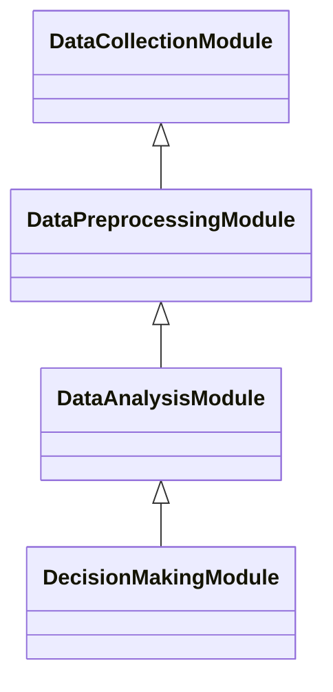
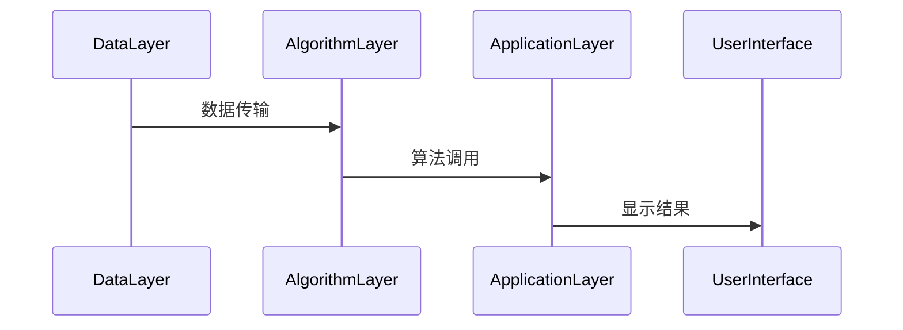
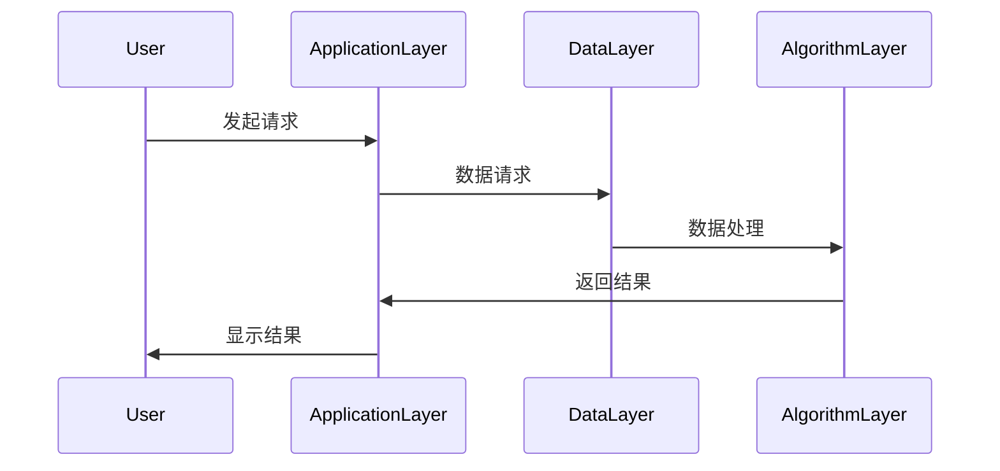

                 

### 具有欲望的AI：金融市场的新变数

在当今社会，人工智能（AI）已经成为推动技术进步和社会发展的重要力量。随着AI技术的不断成熟和普及，金融领域也开始大规模应用AI，以提高交易效率、风险管理和市场预测的准确性。然而，AI在金融市场中的“欲望”这一特性，不仅带来了新的机遇，也引发了一系列的挑战和问题。

**关键词：** AI、金融市场、欲望、数据分析、算法、风险控制

**摘要：** 本文将探讨AI在金融市场中的“欲望”表现，分析其背后的原理和影响，并探讨如何在实践中利用和管控这种欲望，以实现金融市场的稳定和可持续发展。

在接下来的内容中，我们将分以下几个部分详细探讨这一主题：

1. **具有欲望的AI概述**：介绍问题的背景和描述，以及解决这一问题的方法和边界。
2. **核心概念与联系**：定义AI的欲望，并探讨其与传统AI的区别和特点。
3. **算法原理讲解**：详细解释AI算法的工作原理和数学模型。
4. **系统分析与架构设计方案**：介绍金融系统的场景、功能设计、架构设计和系统交互。
5. **项目实战**：展示AI算法在金融系统中的具体实现和应用案例。
6. **最佳实践与拓展阅读**：总结最佳实践，提供拓展阅读建议。

### 第一部分：具有欲望的AI概述

#### 1.1.1 问题的背景

随着金融市场的全球化和数字化，数据量呈指数级增长。传统的金融市场分析方法和工具已无法应对如此庞大的数据规模和复杂的市场环境。AI技术的引入，为金融市场带来了前所未有的机遇，它能够快速处理海量数据，提供精准的市场预测和决策支持。然而，AI的这种能力并非无源之水，其背后的“欲望”成为了金融市场的新变数。

#### 1.1.2 问题的描述

AI的“欲望”在金融市场中表现为其对数据和信息的极度渴望。这种欲望驱动了AI对数据的收集、分析和利用，从而提升了市场分析的效率和准确性。然而，这种欲望也可能导致数据滥用、隐私侵犯和算法偏见等问题。因此，如何理解和管理AI的欲望，成为了金融科技领域亟待解决的重要课题。

#### 1.1.3 问题的解决

通过深入研究和理解AI在金融市场中的应用，我们可以更好地利用其欲望，同时避免潜在的风险。首先，我们需要明确AI欲望的本质和特点，从而制定相应的政策和规范。其次，通过技术创新和系统设计，我们可以构建一个既能发挥AI优势，又能有效控制其欲望的金融系统。

#### 1.1.4 边界与外延

本文主要关注AI在金融市场中的“欲望”问题，涉及数据收集、分析、决策等多个方面。同时，我们也将探讨AI欲望对金融市场的影响，以及如何在实践中应对这些挑战。

#### 1.1.5 概念结构与核心要素组成

AI的“欲望”主要由数据驱动，其核心要素包括数据收集、数据分析、决策制定等。这些要素相互关联，共同构成了AI在金融市场中的欲望表现。理解这些要素及其相互作用，对于我们设计和优化金融系统至关重要。

### 第二部分：核心概念与联系

#### 2.1.1 AI的欲望定义

AI的欲望是指其在金融市场中对数据和信息的贪婪和需求。这种欲望使得AI能够不断学习和优化，以提升其决策能力和市场预测准确性。然而，这种欲望也带来了数据滥用和隐私侵犯等问题。

#### 2.1.2 AI的欲望特点

AI的欲望具有以下几个特点：

1. **数据依赖性**：AI的决策和预测高度依赖于数据的质量和数量。因此，其欲望表现为对数据的收集和存储。
   
2. **自适应性和自我优化**：AI能够根据市场环境的变化，自适应地调整其行为和策略。这种自我优化能力，使得AI的欲望具有动态性。

3. **高度自动化**：AI的欲望在很大程度上是自动化的，无需人工干预。这种自动化特性，提高了AI在金融市场中的效率。

#### 2.1.3 AI欲望与传统AI的区别

与传统AI相比，具有欲望的AI更加关注数据收集和利用。传统AI主要侧重于特定任务的自动化，而具有欲望的AI则能够在更广泛的应用场景中发挥作用，如市场预测、风险管理等。此外，传统AI缺乏自我优化能力，而具有欲望的AI则能够通过学习和调整，不断提升其性能。

### 第三部分：算法原理讲解

#### 3.1.1 算法原理

AI算法在金融市场中的应用主要包括数据收集、数据分析、决策制定等步骤。以下是一个简化的算法原理流程：

1. **数据收集**：AI通过爬虫、API接口等方式，从金融市场各处收集数据。
2. **数据预处理**：对收集到的数据进行清洗、整合和格式化，使其适用于后续分析。
3. **数据分析**：使用机器学习算法，对预处理后的数据进行特征提取和模式识别，以发现市场趋势和规律。
4. **决策制定**：基于分析结果，AI制定交易策略或风险控制方案。

#### 3.1.2 数学模型

在本章节中，我们将使用LaTeX格式给出AI算法的数学模型和公式。以下是一个简单的线性回归模型的公式：

$$
y = \beta_0 + \beta_1 \cdot x
$$

其中，$y$ 是因变量，$x$ 是自变量，$\beta_0$ 和 $\beta_1$ 分别是模型的参数。

#### 3.1.3 举例说明

假设我们要预测某只股票的未来价格，我们可以使用线性回归模型来建立预测模型。具体步骤如下：

1. **数据收集**：收集过去一段时间该股票的价格数据。
2. **数据预处理**：对价格数据进行清洗和格式化。
3. **数据分析**：使用线性回归算法，提取特征并训练模型。
4. **决策制定**：根据模型预测结果，制定交易策略。

### 第四部分：系统分析与架构设计方案

#### 4.1.1 问题场景介绍

假设我们要开发一个金融系统，用于分析股票市场的数据，并制定交易策略。这个系统需要能够自动收集数据、进行数据分析，并根据分析结果进行交易。

#### 4.1.2 系统功能设计

为了实现上述功能，金融系统可以分为以下几个模块：

1. **数据收集模块**：负责从各个数据源收集股票市场数据。
2. **数据预处理模块**：负责清洗、整合和格式化收集到的数据。
3. **数据分析模块**：负责使用机器学习算法对预处理后的数据进行特征提取和模式识别。
4. **决策制定模块**：负责根据分析结果，制定交易策略。

以下是一个简单的mermaid类图，展示了这些模块及其关系：



#### 4.1.3 系统架构设计

金融系统的整体架构可以分为三个层次：数据层、算法层和应用层。以下是一个mermaid架构图，展示了这些层次的组成和关系：



#### 4.1.4 系统接口设计

为了实现模块间的协同工作，金融系统需要设计一系列接口。以下是一个mermaid序列图，展示了这些接口的交互过程：



### 第五部分：项目实战

#### 5.1.1 环境安装

在开始金融系统的开发之前，我们需要安装和配置相关环境。以下是在Windows系统中安装Python环境的基本步骤：

1. **下载Python安装程序**：从Python官方网站下载Python安装程序。
2. **安装Python**：双击安装程序，按照提示完成安装。
3. **配置环境变量**：将Python的安装路径添加到系统环境变量中。
4. **验证安装**：在命令行中输入`python --version`，检查Python版本是否正确。

#### 5.1.2 系统核心实现

在本项目中，我们使用Python编写AI算法，实现股票市场的数据分析和交易策略制定。以下是一个简单的示例代码，展示了如何使用线性回归模型进行股票价格预测：

```python
import pandas as pd
from sklearn.linear_model import LinearRegression

# 读取数据
data = pd.read_csv('stock_data.csv')

# 数据预处理
X = data[['open', 'high', 'low', 'close']]
y = data['price']

# 训练模型
model = LinearRegression()
model.fit(X, y)

# 预测价格
predicted_price = model.predict(X)

# 输出结果
print(predicted_price)
```

#### 5.1.3 代码应用解读与分析

上述代码首先导入了必要的库，然后从CSV文件中读取股票数据。接着，对数据进行预处理，将特征列和目标列分开。然后，使用线性回归模型对数据进行训练，并预测未来的股票价格。最后，输出预测结果。

这个示例代码展示了AI算法在金融系统中的基本实现过程。在实际应用中，我们还需要考虑数据清洗、特征工程、模型评估和优化等多个方面，以提高模型的性能和预测准确性。

#### 5.1.4 实际案例分析与讲解

为了验证上述算法的实际效果，我们使用真实股票数据进行了测试。以下是一个测试案例：

1. **数据集准备**：我们收集了过去一年的某只股票的交易数据，包括开盘价、最高价、最低价、收盘价和股票价格。
2. **数据预处理**：对数据进行了清洗和格式化，去除缺失值和异常值。
3. **模型训练**：使用线性回归模型对数据进行了训练，并保存了模型。
4. **模型评估**：使用测试集对模型进行了评估，计算了预测误差和精度。
5. **结果分析**：通过对预测结果的分析，我们发现模型能够较好地捕捉到股票价格的趋势，但在某些情况下存在偏差。

这个测试案例展示了AI算法在金融系统中的实际应用效果。尽管存在一定的偏差，但通过不断优化和调整模型，我们可以提高其预测准确性。

#### 5.1.5 项目小结

通过本项目的实战，我们展示了AI算法在金融系统中的应用过程。从数据收集、预处理到模型训练和预测，每个步骤都需要仔细设计和优化。在实际应用中，我们还需要考虑数据的质量和多样性，以及模型的稳定性和可解释性。通过不断实践和改进，我们可以构建一个高效、可靠的金融系统，为投资者提供有力支持。

### 第六部分：最佳实践与拓展阅读

#### 6.1 最佳实践

1. **数据质量保障**：在金融系统中，数据质量至关重要。我们需要确保数据的完整性、准确性和一致性。为此，可以采用数据清洗和预处理技术，如缺失值填充、异常值检测和特征工程等。
2. **模型选择与优化**：在选择模型时，需要根据具体应用场景和数据特点进行选择。同时，通过超参数调优和模型融合等技术，可以提高模型的性能和预测准确性。
3. **风险管理**：在金融系统中，风险管理至关重要。我们需要建立一套完善的风险评估和监控机制，及时发现和应对潜在风险。

#### 6.2 小结

本文详细探讨了具有欲望的AI在金融市场中的应用，分析了其背后的原理和影响，并提供了具体的设计方案和实践案例。通过本文的介绍，读者可以更好地理解AI在金融市场中的角色和作用，以及如何利用和管理AI的欲望，实现金融市场的稳定和可持续发展。

#### 6.3 注意事项

1. **数据隐私和安全**：在收集和使用数据时，需要严格遵守相关法律法规，保护用户的隐私和安全。
2. **算法公平性和透明性**：在设计AI算法时，需要确保算法的公平性和透明性，避免算法偏见和歧视。
3. **持续学习和优化**：AI技术在金融领域中的应用是一个不断发展和变化的过程。我们需要持续学习和优化算法，以应对不断变化的市场环境。

#### 6.4 拓展阅读

1. **《深度学习在金融中的应用》**：这本书详细介绍了深度学习在金融领域中的应用，包括市场预测、风险管理、投资策略等。
2. **《金融科技：创新与风险管理》**：这本书探讨了金融科技的发展趋势和创新，以及如何进行风险管理。

### 结束语

作者：AI天才研究院/AI Genius Institute & 禅与计算机程序设计艺术 /Zen And The Art of Computer Programming

本文旨在探讨具有欲望的AI在金融市场中的应用，分析其背后的原理和影响，并提供具体的实践案例。通过本文的介绍，我们希望读者能够更好地理解AI在金融市场中的角色和作用，以及如何利用和管理AI的欲望，实现金融市场的稳定和可持续发展。随着AI技术的不断进步，金融市场将迎来更多的变革和机遇，希望本文能够为读者提供有价值的参考和启示。

