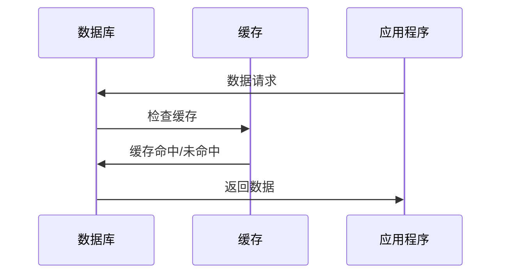
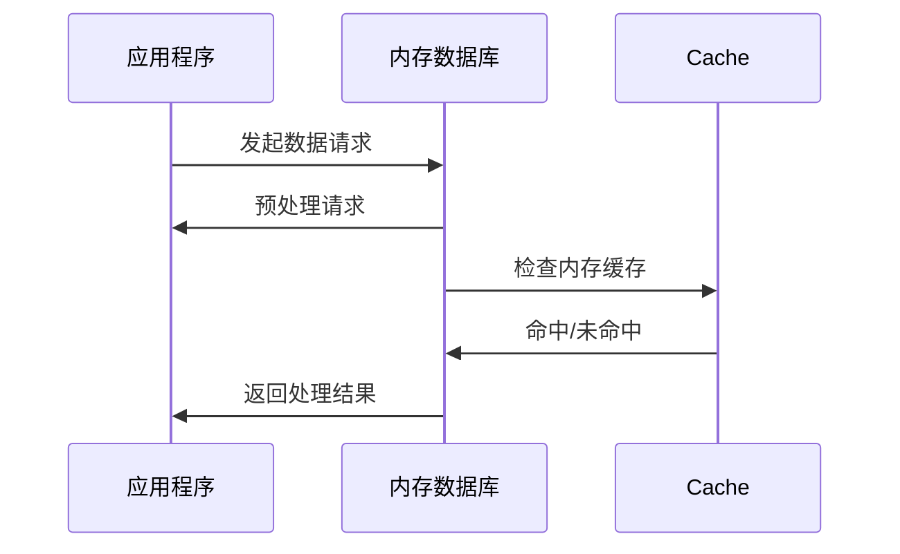

                 

# 内存数据库：高性能数据处理解决方案

## 关键词
- 内存数据库
- 高性能数据处理
- 数据库优化
- 数据库架构
- 算法效率

## 摘要
本文将深入探讨内存数据库的技术原理、架构设计、实现技术和实际应用，为高性能数据处理提供一种解决方案。我们将通过逐步分析，比较内存数据库与传统数据库的差异，探讨其在现代数据环境中的优势和挑战，并通过案例研究展示其实际应用效果。

## 引言
在现代数据处理的领域中，数据处理速度和效率是至关重要的。随着大数据和实时分析需求的不断增加，传统磁盘存储数据库面临性能瓶颈。为了解决这些问题，内存数据库应运而生，它利用快速访问内存存储来加速数据处理速度。本文将详细分析内存数据库的工作原理、架构设计，以及其在实际应用中的效果。

## 背景与核心概念
### 1. 传统数据库的局限性
传统数据库依赖于磁盘存储，尽管其存储容量大，但磁盘I/O性能限制了数据处理速度。当数据量增加或查询复杂度提高时，磁盘I/O操作成为瓶颈，导致响应时间延长。

### 2. 内存数据库的概念
内存数据库将数据存储在内存中，利用CPU的高速缓存和内存访问速度，显著提高数据处理速度。内存数据库的优势在于快速随机访问、低延迟和极高的吞吐量。

### 3. 问题与解决
随着数据规模的不断扩大和数据分析需求的变化，如何高效地进行数据处理成为一个关键问题。内存数据库通过将数据存放在内存中，实现了快速读取和写入，解决了传统数据库的性能瓶颈。

### 4. 边界与外延
内存数据库虽然性能优越，但受限于内存容量。此外，内存数据库需要考虑数据持久化问题，如何在保证性能的同时保证数据的持久化和安全性。

### 5. 概念结构与核心要素
内存数据库的核心要素包括：
- 内存缓存：快速访问的内存存储
- 数据管理：高效的内存数据管理算法
- 缓存一致性：保证内存与磁盘数据的一致性

## 内存数据库架构设计
### 1. 基本架构
内存数据库的基本架构通常包括以下组件：
- 内存缓存层
- 存储层（通常为磁盘）
- 缓存管理模块
- 数据访问层

### 2. 设计原则
- 高速访问：利用内存的高带宽和低延迟特性。
- 数据一致性：保证内存与磁盘数据的同步。
- 高效内存管理：优化内存使用，减少内存碎片。

### 3. Mermaid架构图

## 高性能特征与性能对比
### 1. 关键特性
- 低延迟：数据存储在内存中，访问速度远超磁盘。
- 高吞吐量：内存数据库能处理大量并发请求。
- 快速查询：随机访问内存，查询速度显著提高。

### 2. 与传统数据库对比
| 特性 | 内存数据库 | 传统数据库 |
| ---- | ---------- | ---------- |
| 存储介质 | 内存 | 磁盘 |
| 访问速度 | 高 | 低 |
| 数据一致性 | 易于维护 | 需要额外保证 |
| 并发处理能力 | 强 | 弱 |

## 实施技术
### 1. 实现方法
- 内存分配与回收：优化内存使用，减少内存碎片。
- 数据压缩：减少内存占用，提高数据存储效率。
- 缓存一致性协议：确保内存与磁盘数据同步。

### 2. Mermaid实现流程图

## 实际案例与应用场景
### 1. 案例一：电商平台
- 应用场景：实时库存管理和订单处理。
- 解决方案：使用内存数据库进行快速数据读写，提升系统响应速度。

### 2. 案例二：金融交易系统
- 应用场景：高频交易和实时数据分析。
- 解决方案：采用内存数据库实现快速交易确认和数据分析。

### 3. 案例三：物联网（IoT）系统
- 应用场景：实时数据处理和设备监控。
- 解决方案：利用内存数据库进行快速数据处理，实现低延迟的设备监控。

## 挑战与未来趋势
### 1. 挑战
- 内存容量限制：内存成本较高，内存容量成为制约因素。
- 数据持久化：如何在保证高性能的同时保证数据持久化。

### 2. 未来趋势
- 结合边缘计算：在边缘设备上使用内存数据库，实现更高效的数据处理。
- 分布式内存数据库：提升系统可扩展性和容错性。

## 结论与最佳实践
- 内存数据库在高性能数据处理中具有显著优势，但需权衡成本和容量。
- 最佳实践：合理规划内存使用，确保数据一致性和安全性。

## 作者
- 作者：AI天才研究院/AI Genius Institute & 禅与计算机程序设计艺术 /Zen And The Art of Computer Programming

## 附录与进一步阅读
- 附录：内存数据库常见问题与解决方案。
- 进一步阅读：相关技术文献和最新研究动态。

通过逐步分析，本文揭示了内存数据库的优势和挑战，并展示了其在不同场景下的应用。随着技术的不断发展，内存数据库在未来数据处理中将发挥越来越重要的作用。

