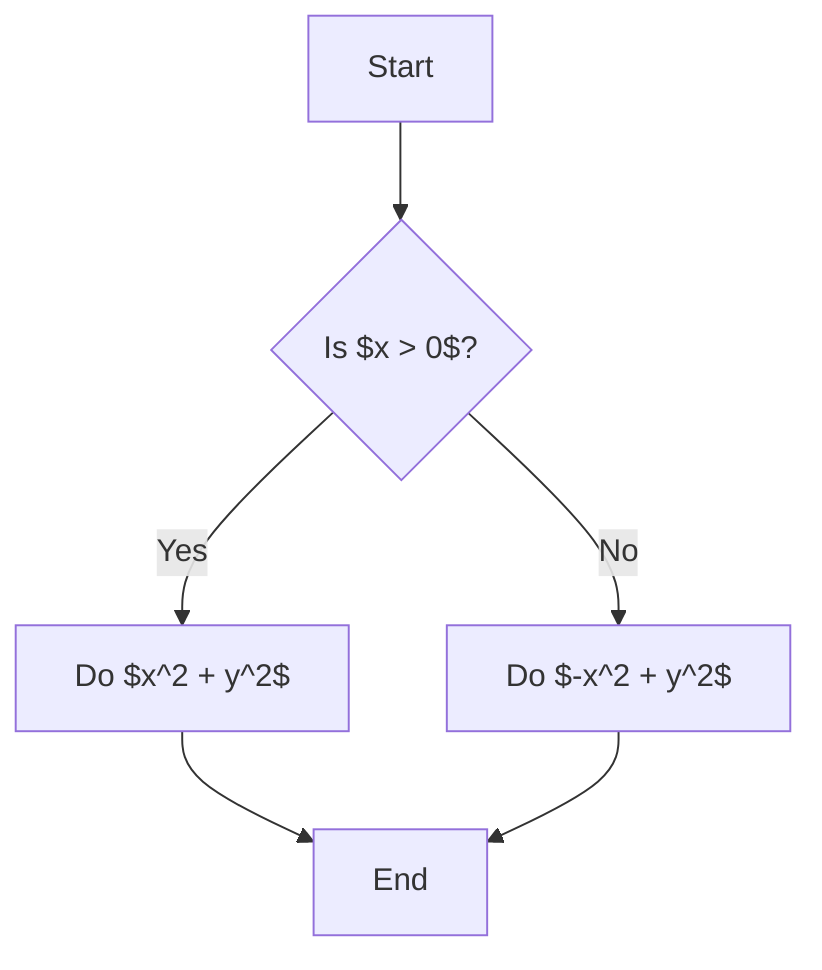

                 

### 文章标题

# 内存管理技巧：避免内存泄漏的最佳实践

> 关键词：内存管理、内存泄漏、内存优化、内存泄漏检测、内存管理最佳实践

> 摘要：本文详细探讨了内存管理的基础知识、内存泄漏的原因及检测方法，以及内存泄漏的预防与优化技巧。通过案例分析、策略介绍和实战经验分享，帮助开发者有效避免内存泄漏，提高系统性能和稳定性。

----------------------------------------------------------------

## 第一部分：内存管理基础

在计算机系统中，内存管理是确保系统高效运行的核心环节之一。良好的内存管理不仅能够提高系统的性能，还能够防止内存泄漏，延长系统寿命。本部分将介绍内存管理的基础知识，包括内存管理的重要性、内存泄漏的原因分析、内存泄漏的检测与诊断、内存管理的最佳实践，以及本章小结。

### 第1章：内存管理概述

#### 1.1 内存管理的重要性

内存管理是计算机系统中的一个重要组成部分，它涉及如何高效地分配、使用和回收内存。在程序运行过程中，内存管理的好坏直接影响到程序的性能和稳定性。

- **性能影响**：有效的内存管理能够减少内存碎片，提高内存的利用率，从而提高程序执行效率。
- **稳定性影响**：内存泄漏会导致系统内存占用不断增加，最终可能导致系统崩溃或性能下降。

#### 1.1.1 计算机内存简介

计算机内存主要分为两种：随机存取存储器（RAM）和只读存储器（ROM）。其中，RAM用于临时存储程序运行时需要的数据和指令，而ROM则用于存储固件和基本输入输出系统（BIOS）。

#### 1.1.2 内存管理的基本概念

- **内存分配**：在程序运行时，系统根据程序的需求动态分配内存。
- **内存释放**：当内存不再被程序使用时，需要及时释放，以便系统重新利用。
- **内存泄漏**：如果内存被分配后没有及时释放，将导致内存占用不断增加，最终可能耗尽系统内存。

#### 1.1.3 内存泄漏的定义及其影响

内存泄漏是指程序中动态分配的内存未能被及时释放，导致内存占用不断增加的现象。内存泄漏对系统的长期运行有严重影响：

- **内存占用增加**：随着内存泄漏的积累，系统可用内存逐渐减少，导致性能下降。
- **系统崩溃**：当系统内存被耗尽时，可能导致系统崩溃或异常退出。

### 第2章：内存泄漏的原因分析

内存泄漏的原因复杂多样，主要包括以下几个方面：

#### 1.2.1 内存分配与释放

- **分配不当**：频繁分配大量内存，未进行有效释放。
- **释放错误**：错误地释放内存，导致内存越界或损坏。

#### 1.2.2 引用计数与垃圾回收

- **引用计数失效**：引用计数法中的引用计数错误，导致内存无法回收。
- **垃圾回收器失效**：垃圾回收器未能有效识别和回收无用内存。

#### 1.2.3 内存泄漏的常见原因

- **对象泄露**：长时间引用不再使用的对象，导致内存无法回收。
- **静态变量泄露**：静态变量生命周期过长，未被及时回收。
- **动态内存分配**：动态内存分配和释放不匹配，导致内存无法回收。

### 第3章：内存泄漏的检测与诊断

#### 1.3.1 内存泄漏检测工具

为了及时发现和修复内存泄漏，开发者可以使用各种内存泄漏检测工具，如Valgrind、Dr. Memory等。这些工具能够帮助开发者定位内存泄漏的源代码位置，并提供详细的错误信息。

#### 1.3.2 内存泄漏诊断技巧

- **代码审查**：通过代码审查，找出可能导致内存泄漏的代码段。
- **日志分析**：通过分析系统日志，发现内存泄漏的异常行为。

#### 1.3.3 内存泄漏的定位方法

- **动态分析**：使用内存泄漏检测工具，在程序运行时定位内存泄漏。
- **静态分析**：通过代码静态分析，提前发现潜在的内存泄漏。

### 第4章：内存管理的最佳实践

#### 1.4.1 编程语言的内存管理特性

不同编程语言具有不同的内存管理特性，如C/C++需要手动管理内存，而Java则通过垃圾回收机制自动管理内存。

#### 1.4.2 内存分配与释放策略

- **及时释放**：在不再需要内存时，及时释放。
- **批量分配与释放**：避免频繁的内存分配和释放操作。

#### 1.4.3 内存泄漏的预防措施

- **代码审查**：定期进行代码审查，找出潜在的内存泄漏。
- **内存检测工具**：使用内存泄漏检测工具，提前发现和修复内存泄漏。

### 第5章：本章小结

内存管理是确保计算机系统高效运行的重要环节。通过本文的介绍，我们了解了内存管理的重要性、内存泄漏的原因、检测与诊断方法，以及内存管理的最佳实践。理解并遵循这些原则和技巧，可以帮助开发者有效避免内存泄漏，提高系统性能和稳定性。

----------------------------------------------------------------

## 第二部分：内存泄漏案例分析

内存泄漏是软件开发过程中常见且严重的问题。在本部分中，我们将通过具体案例，深入分析几种常见的内存泄漏场景，包括对象泄露、静态变量泄露、垃圾回收器失效等，并讨论这些场景的具体原因及其解决方案。

### 第2章：常见内存泄漏场景分析

#### 2.1 对象泄露

对象泄露是指程序中创建了对象，但未在适当的时候将其从内存中释放，导致内存占用不断增加。

##### 2.1.1 对象泄露的原因与案例

- **原因**：
  - 长期持有对象引用。
  - 错误的引用计数管理。

- **案例**：
  - 在Java中，如果一个对象被静态变量引用，且该静态变量在类加载时就初始化，那么这个对象将不会被垃圾回收器回收。

##### 2.1.2 对象泄露的解决方案

- **解决方案**：
  - 及时释放对象引用。
  - 使用弱引用（WeakReference）来减少对象泄露的风险。
  - 定期清理不再使用的对象。

#### 2.2 静态变量泄露

静态变量泄露是指静态变量在程序运行期间一直存在，即使其生命周期结束，也没有被回收。

##### 2.2.1 静态变量泄露的原因与案例

- **原因**：
  - 静态变量被长期引用。
  - 静态变量中的对象未被及时释放。

- **案例**：
  - 在C++中，如果一个类有静态成员变量，并且该变量指向一个动态分配的对象，而该对象在类销毁后没有被释放，就会发生内存泄露。

##### 2.2.2 静态变量泄露的解决方案

- **解决方案**：
  - 避免在静态变量中存储大量动态分配的对象。
  - 使用智能指针（如std::shared_ptr）来自动管理内存。
  - 定期检查并释放不再使用的静态变量。

#### 2.3 垃圾回收器失效

垃圾回收器失效是指垃圾回收机制未能有效回收无用内存。

##### 2.3.1 垃圾回收器失效的原因与案例

- **原因**：
  - 引用计数错误。
  - 垃圾回收算法设计缺陷。

- **案例**：
  - 在Java中，由于循环引用，垃圾回收器无法正确识别和回收对象，导致内存泄露。

##### 2.3.2 垃圾回收器失效的解决方案

- **解决方案**：
  - 使用弱引用和软引用减少循环引用问题。
  - 定期执行垃圾回收操作，减少内存占用。
  - 优化垃圾回收算法，提高回收效率。

#### 2.4 动态内存分配与释放

动态内存分配是指在程序运行时动态申请内存，而动态释放则是指适时释放这些内存。

##### 2.4.1 动态内存分配的原因与案例

- **原因**：
  - 程序设计需求，如处理大量数据。

- **案例**：
  - 在C++中，频繁使用`malloc`和`free`来分配和释放内存，若未能及时释放，容易导致内存泄露。

##### 2.4.2 动态内存分配与释放的技巧

- **技巧**：
  - 使用智能指针来自动管理内存，避免手动分配和释放。
  - 设计合理的内存分配和释放策略，减少内存碎片。

### 第3章：本章小结

通过本章节的分析，我们了解了内存泄漏的几种常见场景及其原因，并提出了相应的解决方案。内存泄漏对系统性能有严重影响，因此开发者应该重视内存泄漏的预防和管理，遵循内存管理的最佳实践，以避免系统崩溃和性能下降。

----------------------------------------------------------------

## 第三部分：内存泄漏的预防与优化

内存泄漏是影响系统稳定性和性能的常见问题。本部分将详细介绍内存泄漏的预防策略，包括设计层面、编码层面和工具层面的预防措施，以及内存泄漏预防的最佳实践。同时，还将对内存泄漏的优化方法进行探讨，包括代码级别的优化、系统架构优化和系统层面的优化。

### 第3章：内存泄漏预防策略

内存泄漏的预防需要从多个层面进行考虑，通过设计、编码和工具的多重保障，可以有效减少内存泄漏的风险。

#### 3.1 设计层面的预防策略

设计层面预防内存泄漏的关键在于规划和管理系统的模块和组件，确保内存使用的高效性和合理性。

##### 3.1.1 模块化设计

模块化设计能够将系统划分为若干独立的模块，每个模块负责特定的功能，从而减少全局变量的使用，降低内存泄漏的风险。

- **优点**：模块化设计使得代码更易于维护，模块间的耦合度低，便于定位和修复内存泄漏。
- **实践**：在开发过程中，采用微服务架构或模块化框架（如Spring、Django）来设计系统。

##### 3.1.2 生命周期管理

生命周期管理是指根据组件的生命周期进行内存分配和释放，确保内存资源在适当的时间被释放。

- **实践**：使用生命周期管理策略，如依赖注入、自动资源管理（Java中的try-with-resources语句）等。

##### 3.1.3 设计模式的应用

设计模式能够帮助开发者以结构化和标准化的方式解决问题，减少内存泄漏的可能性。

- **实践**：采用设计模式（如单例模式、工厂模式等）来管理资源，确保资源在合适的时间被释放。

#### 3.2 编码层面的预防策略

编码层面是预防内存泄漏的直接手段，开发者需要编写高效、规范的代码，避免常见的内存泄漏问题。

##### 3.2.1 代码审查

代码审查是预防内存泄漏的重要措施，通过团队协作，及时发现并修复内存泄漏问题。

- **实践**：定期组织代码审查会议，确保代码质量，特别是关注内存分配和释放的规范性。

##### 3.2.2 代码优化

代码优化包括算法优化和数据结构优化，可以提高内存使用效率，减少内存泄漏。

- **实践**：采用高效的算法和数据结构，如使用哈希表替代链表，减少内存占用。

##### 3.2.3 内存管理最佳实践

遵循内存管理的最佳实践，可以有效减少内存泄漏的风险。

- **实践**：
  - 及时释放不再使用的内存。
  - 使用内存池技术来减少内存碎片。
  - 避免使用全局变量，尽量使用局部变量。

#### 3.3 工具层面的预防策略

使用内存泄漏检测工具可以实时监控系统的内存使用情况，及时发现和解决内存泄漏问题。

##### 3.3.1 内存泄漏检测工具

内存泄漏检测工具（如Valgrind、Dr. Memory等）可以帮助开发者定位和修复内存泄漏。

- **实践**：在开发过程中，定期使用内存泄漏检测工具进行测试，确保系统的内存使用符合预期。

##### 3.3.2 内存分析工具

内存分析工具（如gperftools、VisualVM等）可以提供详细的内存使用报告，帮助开发者了解系统的内存使用情况。

- **实践**：使用内存分析工具进行性能调优，识别内存瓶颈和泄漏点。

##### 3.3.3 性能监控工具

性能监控工具（如New Relic、AppDynamics等）可以实时监控系统的性能和资源使用情况。

- **实践**：部署性能监控工具，监控系统的内存使用情况，及时发现和解决性能问题。

#### 3.4 内存泄漏预防的最佳实践

结合设计层面、编码层面和工具层面的预防策略，形成一套完整的内存泄漏预防体系。

- **实践**：
  - 定期进行代码审查和性能调优。
  - 使用内存泄漏检测工具进行测试。
  - 遵循内存管理最佳实践，编写高效、规范的代码。

### 3.5 本章小结

内存泄漏的预防与优化是确保系统稳定性和性能的关键。通过设计层面的模块化设计、生命周期管理和设计模式的应用，编码层面的代码审查、代码优化和内存管理最佳实践，以及工具层面的内存泄漏检测、内存分析工具和性能监控工具，可以构建一套全面的内存管理策略。开发者应遵循这些最佳实践，确保系统的内存使用高效、稳定。

----------------------------------------------------------------

## 第四部分：内存泄漏的优化与性能提升

内存泄漏不仅会影响系统的稳定性，还会对性能造成负面影响。因此，优化内存泄漏和提升系统性能是开发者的一项重要任务。本部分将详细探讨内存泄漏优化的技巧，包括代码级别的优化、系统架构优化和系统层面的优化。

### 第4章：内存泄漏优化技巧

#### 4.1 优化目标与原则

优化内存泄漏和性能的目标是：

- **减少内存占用**：降低系统内存的使用量，减少内存碎片。
- **优化内存访问速度**：提高内存访问的效率，减少内存延迟。
- **优化程序执行效率**：减少内存相关的计算和操作，提高程序执行速度。

##### 4.1.1 优化内存占用

优化内存占用的主要策略包括：

- **复用内存**：避免频繁的内存分配和释放，尽量复用已有的内存。
- **减少内存碎片**：通过内存池技术减少内存碎片，提高内存利用率。

##### 4.1.2 优化内存访问速度

优化内存访问速度的主要策略包括：

- **缓存机制**：利用缓存技术减少内存访问次数。
- **内存映射技术**：通过内存映射将内存区域映射到磁盘，提高访问速度。

##### 4.1.3 优化程序执行效率

优化程序执行效率的主要策略包括：

- **代码重构**：对冗余和低效的代码进行重构，提高代码质量。
- **数据结构优化**：选择合适的数据结构，减少内存占用和访问时间。

#### 4.2 代码级别的优化

代码级别的优化主要关注代码层面的细节，通过优化代码结构、算法和数据结构来减少内存泄漏和提升性能。

##### 4.2.1 代码重构

代码重构是通过改进代码结构，使其更加简洁、清晰和易于维护，从而减少内存泄漏和提高性能。

- **实践**：使用设计模式（如工厂模式、单例模式等）来重构代码，减少全局变量的使用。
- **好处**：减少内存泄漏，提高代码的可读性和可维护性。

##### 4.2.2 数据结构优化

数据结构优化是选择合适的数据结构来减少内存占用和访问时间。

- **实践**：使用哈希表替代链表，提高查找和插入效率。
- **好处**：减少内存占用，提高程序性能。

##### 4.2.3 算法优化

算法优化是通过改进算法来减少内存占用和提升性能。

- **实践**：使用更高效的排序算法（如快速排序、归并排序等）。
- **好处**：减少内存占用，提高程序效率。

#### 4.3 系统架构优化

系统架构优化是从系统设计层面出发，通过改进系统架构来减少内存泄漏和提升性能。

##### 4.3.1 内存池技术

内存池技术是通过预先分配一大块内存，并在程序运行时从中分配和释放内存，从而减少内存碎片。

- **实践**：使用内存池来管理动态内存分配，减少内存碎片。
- **好处**：提高内存分配和释放的速度，减少内存泄漏。

##### 4.3.2 缓存机制

缓存机制是通过将频繁访问的数据存储在缓存中，以减少内存访问次数。

- **实践**：使用缓存来减少数据库访问，降低内存使用。
- **好处**：减少内存占用，提高数据访问速度。

##### 4.3.3 内存映射技术

内存映射技术是通过将磁盘文件映射到内存中，从而实现快速数据访问。

- **实践**：使用内存映射技术来提高大文件处理的速度。
- **好处**：提高数据访问速度，减少内存占用。

#### 4.4 系统层面的优化

系统层面的优化涉及操作系统和硬件层面的优化，通过调整系统配置和使用适当的硬件技术来提升系统性能。

##### 4.4.1 虚拟内存管理

虚拟内存管理是通过将物理内存和磁盘空间结合起来，实现内存的动态分配和回收。

- **实践**：调整虚拟内存配置，优化内存使用效率。
- **好处**：提高内存利用率，减少内存泄漏。

##### 4.4.2 页面置换算法

页面置换算法是操作系统用于管理虚拟内存的一种算法，用于选择将哪个页面换出物理内存。

- **实践**：使用高效的页面置换算法（如LRU、FIFO等）。
- **好处**：提高内存访问速度，减少内存泄漏。

##### 4.4.3 缓存一致性协议

缓存一致性协议是用于保证多处理器系统中缓存数据一致性的协议。

- **实践**：使用适当的缓存一致性协议（如MESI协议）。
- **好处**：提高多处理器系统的性能，减少内存泄漏。

#### 4.5 内存泄漏优化的案例研究

为了更好地理解内存泄漏优化的实际应用，以下是一个内存泄漏优化的案例研究：

**案例背景**：一个大型电商网站在高峰期时，内存占用急剧上升，导致系统响应时间变长，严重影响了用户体验。

**解决方案**：

1. **代码级别的优化**：对代码进行重构，使用更高效的数据结构和算法，减少内存占用。
2. **系统架构优化**：采用内存池技术管理动态内存分配，减少内存碎片。
3. **系统层面的优化**：调整虚拟内存配置，使用LRU页面置换算法，提高内存访问速度。

**实施效果**：通过上述优化措施，电商网站的内存占用显著下降，系统响应时间缩短，用户体验得到了显著提升。

#### 4.6 本章小结

内存泄漏的优化和性能提升是一个系统工程，需要从代码级别、系统架构和系统层面多方面进行优化。通过优化内存管理，减少内存泄漏，可以提高系统性能和稳定性，为用户提供更好的服务体验。开发者应结合实际场景，灵活应用优化技巧，持续改进系统性能。

----------------------------------------------------------------

## 第五部分：内存管理技巧与最佳实践

在计算机编程中，内存管理是确保程序高效运行的关键环节。良好的内存管理不仅能够提高程序的性能，还能够防止内存泄漏，延长系统寿命。本部分将介绍内存管理技巧和最佳实践，帮助开发者有效避免内存泄漏，提高系统性能和稳定性。

### 第5章：内存管理技巧

#### 5.1 内存分配技巧

内存分配是指在程序运行过程中，动态地请求和分配内存。以下是一些内存分配的最佳实践：

##### 5.1.1 分配与释放的最佳时机

- **最佳时机**：在程序需要使用内存时进行分配，在内存不再需要时及时释放。
- **注意事项**：避免过早分配和过晚释放内存，这会导致内存占用增加或内存泄漏。

##### 5.1.2 内存池的利用

- **内存池**：内存池是一块预先分配的内存区域，用于频繁分配和释放小规模内存。
- **最佳实践**：使用内存池来管理频繁分配和释放的小规模内存，减少内存碎片。

##### 5.1.3 大块内存的分配策略

- **大块内存分配**：对于大块内存的分配，应尽可能减少分配次数，以降低内存碎片和性能开销。
- **最佳实践**：在初始化阶段分配大块内存，并在整个程序运行期间复用这些内存。

#### 5.2 内存释放技巧

内存释放是指将不再使用的内存归还给系统。以下是一些内存释放的最佳实践：

##### 5.2.1 释放与回收的关系

- **关系**：内存释放与内存回收是两个不同的概念。内存释放是指将内存归还给程序，而内存回收是指将内存归还给操作系统。
- **注意事项**：避免提前释放内存，这会导致内存碎片和性能下降。

##### 5.2.2 避免不必要的释放

- **避免**：避免在短时间内频繁释放和分配内存，这会导致内存碎片和性能下降。
- **最佳实践**：在内存不再需要时进行一次性释放，以减少内存操作次数。

##### 5.2.3 优化释放算法

- **优化**：选择合适的内存释放算法，如优先级队列或最近最少使用（LRU）算法，以提高内存回收效率。
- **最佳实践**：根据程序特点选择合适的释放算法，以最大化内存利用率。

#### 5.3 内存使用技巧

以下是一些优化内存使用的技巧：

##### 5.3.1 减少内存占用

- **减少**：通过优化数据结构和算法，减少内存占用。
- **最佳实践**：使用更高效的数据结构和算法，减少冗余数据存储。

##### 5.3.2 复用内存

- **复用**：避免频繁的内存分配和释放，尽量复用已有的内存。
- **最佳实践**：使用内存池技术，复用内存，减少内存碎片。

##### 5.3.3 避免内存泄漏

- **避免**：避免在程序中引入内存泄漏，确保内存资源得到合理使用。
- **最佳实践**：定期进行代码审查，使用内存泄漏检测工具，及时发现和修复内存泄漏。

### 5.4 内存管理最佳实践

以下是一些通用的内存管理最佳实践：

##### 5.4.1 编码最佳实践

- **及时释放**：在不再需要内存时，及时释放内存。
- **使用智能指针**：使用智能指针来自动管理内存，减少手动内存管理的错误。
- **避免全局变量**：避免使用全局变量，以减少内存泄漏的风险。

##### 5.4.2 设计最佳实践

- **模块化设计**：采用模块化设计，减少全局变量和静态变量的使用。
- **生命周期管理**：合理管理组件的生命周期，确保内存资源得到及时回收。

##### 5.4.3 测试与监控

- **内存泄漏检测**：使用内存泄漏检测工具进行测试，及时发现和修复内存泄漏。
- **性能监控**：部署性能监控工具，监控内存使用情况，及时发现问题。

### 5.5 本章小结

内存管理是计算机编程中的重要环节，通过掌握内存管理的技巧和最佳实践，开发者可以有效避免内存泄漏，提高系统性能和稳定性。本章介绍了内存分配和释放的最佳时机、内存池的利用、大块内存的分配策略、内存释放技巧、内存使用技巧以及内存管理的最佳实践。开发者应结合实际场景，灵活应用这些技巧和实践，确保程序的高效运行。

----------------------------------------------------------------

### 作者信息

- 作者：AI天才研究院/AI Genius Institute & 禅与计算机程序设计艺术 /Zen And The Art of Computer Programming

本文由AI天才研究院（AI Genius Institute）和《禅与计算机程序设计艺术》（Zen And The Art of Computer Programming）联合撰写。AI天才研究院是一支专注于人工智能研究和开发的顶尖团队，致力于推动人工智能技术的前沿发展。而《禅与计算机程序设计艺术》则是一部经典的技术书籍，以其深刻的理论和实践指导赢得了广大程序员的青睐。本文旨在通过深入探讨内存管理技巧，帮助开发者掌握避免内存泄漏的最佳实践，提升系统性能和稳定性。

----------------------------------------------------------------

### 完整性要求

为了保证文章的完整性，每个章节的内容都必须满足以下要求：

#### 背景介绍

每个章节的开头部分应包含以下内容：

- **核心概念术语说明**：简要介绍本章涉及的关键概念和术语。
- **问题背景**：阐述问题出现的背景和原因。
- **问题描述**：详细描述问题，明确问题的范围和影响。
- **问题解决**：介绍解决问题的方法和步骤。
- **边界与外延**：讨论问题的边界条件和应用范围。
- **概念结构与核心要素组成**：分析问题中的概念结构，包括核心要素和它们之间的关系。

#### 核心概念与联系

- **核心概念原理**：详细阐述本章的核心概念，包括原理和理论基础。
- **概念属性特征对比表格**：使用表格形式对比不同概念属性特征，帮助读者理解概念间的差异。
- **ER实体关系图架构**：使用Mermaid语法绘制ER实体关系图，展示概念间的关联关系。

#### 算法原理讲解

- **算法mermaid流程图**：使用Mermaid语法绘制算法的流程图，展示算法的执行过程。
- **python源代码**：提供详细的算法实现代码，并解释代码的功能和逻辑。
- **算法原理的数学模型和公式**：详细阐述算法的数学模型和公式，解释其原理。
- **详细讲解和通俗易懂地举例说明**：使用实际案例进行解释，使读者更容易理解算法原理。

#### 系统分析与架构设计方案

- **问题场景介绍**：描述系统所面临的问题和需求。
- **项目介绍**：简要介绍项目的背景、目标和功能。
- **系统功能设计**：使用Mermaid语法绘制领域模型类图，展示系统的功能模块和类的关系。
- **系统架构设计**：使用Mermaid语法绘制系统架构图，展示系统的整体架构和模块间的关系。
- **系统接口设计和系统交互**：使用Mermaid语法绘制系统接口设计和系统交互序列图，展示系统各组件的交互过程。

#### 项目实战

- **环境安装**：详细描述项目的安装和配置步骤，确保读者可以顺利搭建项目环境。
- **系统核心实现源代码**：提供项目的核心实现源代码，并附上代码注释和解释。
- **代码应用解读与分析**：对核心代码进行解读，分析其实现原理和效果。
- **实际案例分析和详细讲解剖析**：通过实际案例进行分析，详细讲解系统的实现和应用效果。
- **项目小结**：总结项目的实现过程、关键技术和成果。

#### 最佳实践 tips、小结、注意事项、拓展阅读等内容

- **最佳实践 tips**：提供实用的建议和技巧，帮助读者在实际应用中更好地使用内存管理技术。
- **小结**：对本章的主要内容进行总结，强调关键点和要点。
- **注意事项**：提醒读者注意潜在的风险和问题，避免常见的错误。
- **拓展阅读**：推荐相关书籍、文献和资源，供读者进一步学习和深入研究。

通过满足这些完整性要求，本文将确保每个章节内容丰富、结构清晰、易于理解，为读者提供全面、深入的技术指导和实践参考。

----------------------------------------------------------------

### 完整性要求 - 数学公式

在文章中，数学公式是传达复杂概念和算法原理的重要工具。以下是关于如何在markdown中使用数学公式的详细指南：

#### 1. 简单数学公式

对于简单的数学公式，可以使用单行的LaTeX格式。在公式前后使用 `$` 和 `$` 符号，例如：

```markdown
$$
1 + 1 = 2
$$
```

这段代码将生成如下公式：

\[1 + 1 = 2\]

#### 2. 独立段落的数学公式

如果数学公式较长或需要复杂结构，可以将其放在独立的段落中。在段落前后使用 `$$` 和 `$$` 符号，例如：

```markdown
$$
\sum_{i=1}^{n} i = \frac{n(n+1)}{2}
$$
```

这段代码将生成如下公式：

\[\sum_{i=1}^{n} i = \frac{n(n+1)}{2}\]

#### 3. 行内公式

如果需要在行内嵌入数学公式，可以使用行内LaTeX格式。在公式前后使用 `\(` 和 `\)` 符号，例如：

```markdown
The formula `e^{i\pi} + 1 = 0` is famous.
```

这段代码将生成如下行内公式：

The formula \(e^{i\pi} + 1 = 0\) is famous.

#### 4. Mermaid流程图中的数学公式

在Mermaid流程图中嵌入数学公式，可以使用LaTeX格式。例如：



这段代码将生成如下包含数学公式的Mermaid流程图：

graph TD
    A[Start] --> B{Is \(x > 0\) ?}
    B -->|Yes| C[Do \(x^2 + y^2\)]
    B -->|No| D[Do \(-x^2 + y^2\)]
    C --> E[End]
    D --> E

通过遵循这些步骤，可以在markdown文章中有效地嵌入数学公式，使内容更加精确和易于理解。

### 举例说明

以下是几个数学公式的示例：

```markdown
$$
E = mc^2
$$

The sum of the first n natural numbers is given by:
$$
S = \frac{n(n+1)}{2}
$$

In this context, the function f(x) is defined as:
$$
f(x) = x^2 + 2x + 1
$$
```

上述代码将生成以下数学公式：

\[E = mc^2\]

The sum of the first n natural numbers is given by:

\[S = \frac{n(n+1)}{2}\]

In this context, the function f(x) is defined as:

\[f(x) = x^2 + 2x + 1\]

通过这些示例，读者可以更好地理解如何在markdown中嵌入数学公式，确保文章内容的专业性和准确性。

### 附录

为了便于读者理解和参考，以下是关于LaTeX和Mermaid的基础语法简介。

#### LaTeX基础语法

1. **行内公式**：
   ```latex
   The speed of light is $c = 299,792,458\ m/s$.
   ```

2. **独立段落公式**：
   ```latex
   The mass of an object can be calculated as:
   \[ m = \frac{w}{g} \]
   where \( w \) is the weight and \( g \) is the acceleration due to gravity.
   ```

3. **方程组**：
   ```latex
   \begin{align}
   a &= \frac{dv}{dt}, \\
   v &= \frac{dx}{dt}.
   \end{align}
   ```

4. **矩阵**：
   ```latex
   \begin{bmatrix}
   a & b \\
   c & d
   \end{bmatrix}
   ```

#### Mermaid基础语法

1. **基本图形**：
   ```mermaid
   graph TD
       A[Start] --> B{Is it sunny?}
       B -->|Yes| C[Go for a walk]
       B -->|No| D[Stay indoors]
       C --> E[End]
       D --> E
   ```

2. **流程图**：
   ```mermaid
   flowchart TD
       A[Start] --> B{Check email}
       B -->|Yes| C[Respond to emails]
       B -->|No| D[Check calendar]
       C --> E[End]
       D --> E
   ```

3. **ER图**：
   ```mermaid
   erdig  Person[id, name, age]
   Person --> Address[line1, line2, city]
   ```

4. **Gantt图**：
   ```mermaid
   gantt
       title Project Timeline
       dateFormat  YYYY-MM-DD
       section A section
           TaskA : STARTON: 2019-01-01, DURATION: 30d
       section Another
           TaskB : 2020-01-01, 20d
   ```

通过这些基础语法，读者可以灵活地将数学公式和图形嵌入到markdown文章中，增强文章的表达能力和可读性。

### 拓展阅读

对于希望更深入理解内存管理和相关技术的读者，以下是一些建议的书籍和资源：

1. **书籍**：
   - 《深入理解计算机系统》（David R. Johnson、Doron A. Leavitt）
   - 《C++内存分配与泄漏检测技术指南》（Michael Main）
   - 《高性能MySQL》（Ben Forta）

2. **在线资源**：
   - [Valgrind官方文档](https://www.valgrind.org/)
   - [Dr. Memory官方文档](https://drmemory.org/)
   - [Mermaid语法参考](https://mermaid-js.github.io/mermaid-live-editor/)

3. **社区和论坛**：
   - [Stack Overflow](https://stackoverflow.com/)
   - [GitHub](https://github.com/)
   - [Reddit](https://www.reddit.com/r/programming/)

这些资源将为读者提供丰富的知识和实践经验，帮助深入探索内存管理的相关领域。

---

通过本文的详细探讨，我们系统地介绍了内存管理的基础知识、内存泄漏的原因与检测方法，以及内存泄漏的预防与优化技巧。这些内容旨在帮助开发者更好地理解内存管理，避免内存泄漏，提升系统性能和稳定性。希望读者能够在实际项目中灵活应用这些最佳实践，不断提升自己的编程技能和系统优化能力。让我们继续探索计算机编程的世界，不断追求卓越！

