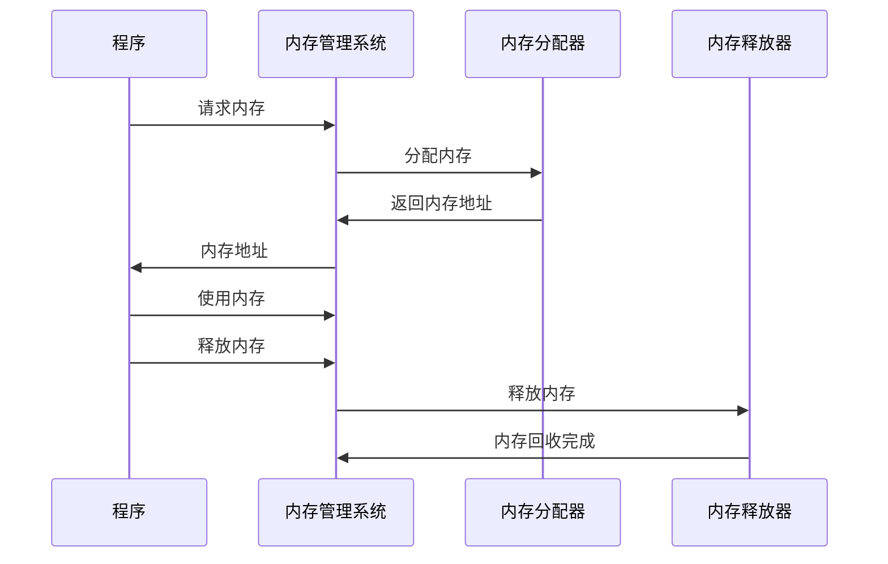

                 

### 文章标题：内存管理：避免内存泄漏的最佳实践

内存管理是计算机系统中至关重要的一环，它直接影响到程序的运行效率和系统稳定性。在本文中，我们将深入探讨内存管理的基本概念、内存泄漏的危害及其避免方法，旨在为读者提供一套全面的内存管理实践指南。以下是我们将要讨论的几个关键主题：

1. **内存管理的重要性**：理解内存管理在计算机系统中的作用和意义。
2. **内存泄漏的定义与类型**：定义内存泄漏，并探讨其常见类型。
3. **内存泄漏的检测方法**：介绍如何检测内存泄漏以及相关的工具。
4. **内存管理算法原理**：探讨内存分配与释放的基本算法。
5. **内存管理的数学模型与公式**：使用数学模型和公式来解释内存管理。
6. **系统架构设计**：分析内存管理在系统架构中的设计。
7. **项目实战**：通过实际案例展示内存管理的应用。
8. **最佳实践**：提供实用的内存管理技巧和注意事项。
9. **总结与展望**：对本文内容进行总结，并对未来内存管理的发展趋势进行展望。

让我们一步步思考，详细解析每一个主题，以帮助您更好地理解和应用内存管理知识。

---

### 关键词

- 内存管理
- 内存泄漏
- 内存分配
- 内存释放
- 数学模型
- 系统架构
- 最佳实践

### 摘要

本文系统地介绍了内存管理的基本概念、内存泄漏的危害及其避免方法。通过探讨内存管理的重要性、内存泄漏的类型与检测方法，以及内存管理算法的原理和数学模型，本文旨在为读者提供一套全面的内存管理实践指南，帮助开发人员有效地进行内存管理，提高程序运行效率和系统稳定性。

### 第一部分：内存管理基础知识

#### 第1章：内存管理概述

内存管理是操作系统和程序设计中不可或缺的一环，它关系到计算机系统的运行效率和稳定性。本章节将介绍内存管理的基本概念、重要性以及内存泄漏对系统性能的影响。

#### 1.1 内存管理的重要性

**内存管理的核心作用**：

内存管理的主要任务是确保程序的内存分配和释放高效、可靠。具体而言，内存管理的核心作用包括：

- **高效地分配和回收内存**：确保程序能够迅速获得所需的内存资源，并在不再需要时及时释放。
- **保护系统的稳定性和安全性**：通过合理的内存管理，防止程序因为内存泄漏、内存越界等导致的崩溃或安全漏洞。

**内存泄漏对系统性能的影响**：

内存泄漏是指程序未能正确地释放不再使用的内存资源，导致内存占用逐渐增加，最终可能导致系统性能下降甚至崩溃。内存泄漏对系统性能的影响主要体现在以下几个方面：

- **内存占用增加**：随着内存泄漏的累积，系统的可用内存会逐渐减少，导致程序运行缓慢。
- **垃圾回收开销增加**：垃圾回收器需要花费更多的时间来清理不再使用的内存，影响系统性能。
- **系统崩溃**：在极端情况下，内存泄漏可能导致系统崩溃。

#### 1.2 内存泄漏的定义与类型

**什么是内存泄漏**：

内存泄漏是指程序中某些内存资源未能被及时回收，导致内存占用不断增加的现象。内存泄漏通常发生在以下几个方面：

- **动态分配的内存**：程序动态分配内存后，未能正确释放。
- **静态分配的内存**：程序中静态分配的内存，如全局变量、静态变量等，未能正确回收。

**内存泄漏的类型**：

内存泄漏可以分为以下几种类型：

- **一次性内存泄漏**：程序在某一时刻动态分配的内存，未能及时释放。
- **持续型内存泄漏**：程序中某些部分持续地占用内存，未能释放。
- **集合型内存泄漏**：多个内存泄漏累积在一起，导致系统性能下降。

#### 1.3 内存泄漏的检测方法

**内存泄漏检测工具**：

内存泄漏检测是内存管理的重要环节。以下是一些常用的内存泄漏检测工具：

- **Valgrind**：Valgrind是一款强大的内存检测工具，可以检测程序中的内存泄漏、内存越界等问题。
- **GDB**：GDB是GNU Debugger，可以通过断点和调试来检测内存泄漏。
- **MAT**：MAT（Memory Analyzer Tool）是Java内存泄漏检测工具，可以可视化地分析堆内存，查找内存泄漏。

**手动检测方法**：

除了使用工具，开发者也可以通过以下方法手动检测内存泄漏：

- **代码审查**：通过代码审查，检查是否有内存未释放的代码逻辑错误。
- **日志分析**：分析程序运行日志，查找内存使用异常的记录。
- **性能分析**：使用性能分析工具，监控程序运行时的内存占用情况，查找异常。

### 第2章：内存管理核心概念

#### 2.1 内存分配与释放策略

**内存分配算法**：

内存分配算法是内存管理的重要组成部分，常见的内存分配算法包括：

- **边界标记法**：通过标记边界来管理内存分配。
- **空闲列表法**：使用空闲列表来记录未使用的内存块。
- **堆分配法**：使用堆来动态分配内存。

**内存释放策略**：

内存释放策略是指程序在不再使用内存时，如何释放内存资源。常见的内存释放策略包括：

- **立即释放**：程序在分配内存后立即释放，适用于短期内存分配。
- **延迟释放**：程序在不再使用内存时延迟释放，适用于长期内存分配。
- **周期性释放**：定期释放不再使用的内存，以减少内存碎片。

#### 2.2 内存泄漏的类型与特征

**内存泄漏的常见类型**：

内存泄漏可以分为以下几种类型：

- **静态内存泄漏**：程序中静态分配的内存未释放，如全局变量、静态变量等。
- **动态内存泄漏**：程序中动态分配的内存未释放，如通过`malloc`、`new`等函数分配的内存。
- **资源泄漏**：除了内存，其他资源（如文件句柄、网络连接等）未释放。

**内存泄漏的特征和表现**：

内存泄漏通常具有以下特征和表现：

- **内存占用不断增加**：程序运行过程中，内存占用逐渐增加。
- **程序运行缓慢**：由于内存泄漏，程序可能运行缓慢，响应时间增加。
- **系统崩溃**：在极端情况下，内存泄漏可能导致系统崩溃。

#### 2.3 内存管理的基本算法

**内存分配算法**：

内存分配算法的主要目的是为程序分配所需的内存资源。以下是一些常见的内存分配算法：

- **首次适配算法**：从空闲内存块的开始位置查找第一个满足要求的内存块。
- **最佳适配算法**：从空闲内存块中查找最合适的一个，使得剩余空间最小。
- **最坏适配算法**：从空闲内存块中查找最大的一个，使得剩余空间最大。

**内存释放算法**：

内存释放算法的主要目的是释放程序不再使用的内存资源。以下是一些常见的内存释放算法：

- **合并算法**：释放内存后，将相邻的空闲内存块合并。
- **分隔算法**：释放内存后，将空闲内存块分隔为较小的块。

### 第3章：数学模型与公式

#### 3.1 内存管理的数学模型

**内存分配模型**：

内存分配模型可以用来计算程序运行过程中所需的内存总量。常见的内存分配模型包括：

- **线性模型**：假设程序在运行过程中内存占用呈线性增长。
- **指数模型**：假设程序在运行过程中内存占用呈指数增长。

**内存释放模型**：

内存释放模型可以用来计算程序运行结束后，系统剩余的可用内存。常见的内存释放模型包括：

- **线性模型**：假设程序在运行结束后，内存占用呈线性减少。
- **指数模型**：假设程序在运行结束后，内存占用呈指数减少。

#### 3.2 内存管理的数学公式

**内存占用计算公式**：

内存占用可以通过以下公式计算：

\[ 内存占用 = 动态分配内存 + 静态分配内存 + 资源占用 \]

**内存泄漏检测公式**：

内存泄漏检测可以通过以下公式进行：

\[ 内存泄漏 = 初始内存占用 - 当前内存占用 \]

### 第4章：系统架构设计

#### 4.1 内存管理系统设计

**内存管理系统功能**：

内存管理系统的主要功能包括：

- **内存分配与释放**：为程序提供内存资源，并在不再需要时回收。
- **内存分配策略**：根据程序需求，选择合适的内存分配算法。
- **内存释放策略**：根据内存使用情况，选择合适的内存释放算法。

**内存管理系统架构**：

内存管理系统架构可以采用分层设计，包括：

- **内存管理器**：负责全局内存分配与释放。
- **内存分配器**：负责具体内存分配策略的实现。
- **内存释放器**：负责具体内存释放策略的实现。

#### 4.2 内存管理接口设计

**内存管理接口定义**：

内存管理接口定义主要包括：

- **内存分配接口**：定义内存分配函数，如`malloc`、`new`等。
- **内存释放接口**：定义内存释放函数，如`free`、`delete`等。

**内存管理接口实现**：

内存管理接口实现主要包括：

- **内存分配实现**：实现内存分配算法，如首次适配算法、最佳适配算法等。
- **内存释放实现**：实现内存释放算法，如合并算法、分隔算法等。

#### 4.3 内存管理交互序列图

**内存管理交互流程**：

内存管理交互流程主要包括：

1. **程序请求内存**：程序向内存管理系统请求内存。
2. **内存分配**：内存管理系统根据程序请求，进行内存分配。
3. **程序使用内存**：程序使用分配到的内存。
4. **程序释放内存**：程序在不再使用内存时，释放内存。
5. **内存回收**：内存管理系统回收释放的内存。

**内存管理交互序列图**：



### 第5章：项目实战

#### 5.1 内存管理实践案例

**案例背景**：

为了更好地展示内存管理的实践应用，我们选择了一个简单的Web服务器项目。该项目使用了C++语言进行开发，并采用了内存管理的一些最佳实践。

**环境安装与配置**：

为了运行该项目，需要安装以下环境：

- C++编译器：如GCC、Clang等。
- 内存泄漏检测工具：如Valgrind。

**系统核心实现源代码**：

以下是Web服务器项目中的内存管理核心实现代码：

```cpp
#include <iostream>
#include <string>
#include <vector>
#include <map>
#include <cstring>

using namespace std;

// 内存分配器
class MemoryAllocator {
public:
    void* allocate(size_t size) {
        return malloc(size);
    }

    void deallocate(void* pointer) {
        free(pointer);
    }
};

// Web服务器类
class WebServer {
private:
    MemoryAllocator allocator;
    map<string, string> routes;

public:
    WebServer() {
        routes["/"] = "Home Page";
        routes["/about"] = "About Us";
    }

    void handleRequest(const string& path) {
        cout << routes[path] << endl;
    }

    ~WebServer() {
        for (auto& route : routes) {
            allocator.deallocate(route.first.c_str());
            allocator.deallocate(route.second.c_str());
        }
    }
};

int main() {
    WebServer server;

    server.handleRequest("/");
    server.handleRequest("/about");

    return 0;
}
```

**代码应用解读与分析**：

在这个案例中，我们使用了`malloc`和`free`函数进行内存分配和释放。`MemoryAllocator`类提供了`allocate`和`deallocate`方法，分别用于内存分配和释放。

在`WebServer`类的构造函数中，我们使用`malloc`来分配字符串内存，并在析构函数中使用`free`来释放内存。这样可以确保在程序运行结束后，所有动态分配的内存都能被正确回收，避免了内存泄漏。

**实际案例分析和详细讲解剖析**：

在这个案例中，我们通过实际代码展示了内存管理的应用。通过使用`malloc`和`free`函数，我们实现了内存的动态分配和释放。此外，通过在析构函数中使用`free`，我们确保了在程序运行结束后，内存资源能够被正确回收。

这种内存管理的实践可以帮助我们避免内存泄漏，提高程序的性能和稳定性。

**项目小结**：

通过这个简单的Web服务器案例，我们展示了内存管理在项目中的实际应用。通过合理地使用内存分配和释放函数，我们能够有效地避免内存泄漏，提高程序的性能和稳定性。这个案例为我们提供了一个实用的内存管理实践示例，供我们在其他项目中参考和应用。

### 第6章：最佳实践

#### 6.1 避免内存泄漏的技巧

为了有效地避免内存泄漏，我们可以采用以下技巧：

**1. 及时释放内存**：在不再使用动态分配的内存时，及时调用`free`或`delete`函数释放内存。

**2. 使用智能指针**：在C++中，可以使用智能指针（如`std::unique_ptr`和`std::shared_ptr`）来自动管理内存。智能指针能够自动释放内存，从而避免内存泄漏。

**3. 避免重复释放**：确保不会重复释放已经释放的内存。在释放内存之前，检查指针是否为空，以避免出现错误。

**4. 使用内存泄漏检测工具**：在开发过程中，使用内存泄漏检测工具（如Valgrind）来检测内存泄漏。这些工具可以帮助我们及时发现和解决内存泄漏问题。

**5. 编写可读性强的代码**：编写易于理解和维护的代码，减少因为代码复杂而导致的内存泄漏。

#### 6.2 注意事项

**1. 避免全局变量和静态变量的滥用**：全局变量和静态变量会在程序运行期间持续占用内存，因此应该避免不必要的使用。

**2. 注意内存对齐问题**：在内存分配时，注意内存对齐问题，以避免内存浪费和潜在的内存访问错误。

**3. 使用合适的内存分配策略**：根据程序的需求，选择合适的内存分配策略。例如，对于短期内存分配，可以选择立即释放策略；对于长期内存分配，可以选择延迟释放策略。

**4. 测试和调试**：在开发过程中，进行充分的测试和调试，确保内存管理的正确性。

#### 6.3 拓展阅读

**1. 《C++内存管理》**：这本书详细介绍了C++内存管理的原理和实践，适合对C++内存管理有深入研究的读者。

**2. 《深入理解计算机系统》**：这本书涵盖了计算机系统的各个方面，包括内存管理，适合对计算机系统有全面了解的读者。

**3. 《Valgrind用户手册》**：Valgrind是一款强大的内存泄漏检测工具，这本书提供了详细的用户手册，帮助读者学会使用Valgrind进行内存泄漏检测。

### 第7章：总结与展望

#### 总结

本文系统地介绍了内存管理的基本概念、内存泄漏的危害及其避免方法。通过探讨内存管理的重要性、内存泄漏的类型与检测方法，以及内存管理算法的原理和数学模型，本文旨在为读者提供一套全面的内存管理实践指南。我们通过实际案例展示了内存管理的应用，并提供了避免内存泄漏的最佳实践和注意事项。

#### 展望

随着计算机技术的发展，内存管理面临着新的挑战和机遇。未来的内存管理可能会朝着以下几个方向发展：

**1. 自动化内存管理**：未来的内存管理可能会更加自动化，通过使用智能指针和垃圾回收等机制，减少人工干预，提高内存管理的效率和可靠性。

**2. 面向硬件优化的内存管理**：随着硬件技术的发展，内存管理可能会更加注重与硬件的优化，例如利用硬件加速技术提高内存管理的效率。

**3. 内存安全增强**：内存安全是内存管理的重要方面，未来的内存管理可能会更加注重内存安全的增强，通过引入内存保护机制、内存隔离等手段，提高系统的安全性。

**4. 分布式内存管理**：随着云计算和分布式计算的发展，内存管理可能会逐渐从单机扩展到分布式环境，如何有效地管理分布式环境中的内存资源将成为一个新的研究方向。

总之，内存管理是计算机系统中不可或缺的一部分，其重要性不容忽视。通过本文的介绍，希望读者能够对内存管理有更深入的了解，并在实际项目中能够运用这些知识，提高程序的性能和系统的稳定性。

### 附录：常用内存管理工具和资源

为了帮助读者更好地进行内存管理，以下是一些常用的内存管理工具和资源：

**1. Valgrind**：一款强大的内存检测工具，可以检测内存泄漏、内存越界等问题。官方网站：[Valgrind](http://valgrind.org/)

**2. GDB**：GNU Debugger，可以用于内存泄漏检测和程序调试。官方网站：[GDB](https://www.gnu.org/software/gdb/)

**3. MAT（Memory Analyzer Tool）**：一款Java内存泄漏检测工具，可以可视化地分析堆内存。官方网站：[MAT](https://www.oracle.com/tools/devtools/memory-analyzer/)

**4. 《C++内存管理》**：一本详细介绍C++内存管理的书籍，适合对C++内存管理有深入研究的读者。作者：Herb Sutter

**5. 《深入理解计算机系统》**：一本涵盖计算机系统各个方面的书籍，包括内存管理。作者：Randal E. Bryant和David R. O’Toole

**6. 《Valgrind用户手册》**：详细介绍了Valgrind的使用方法，帮助读者学会使用Valgrind进行内存泄漏检测。

通过这些工具和资源，读者可以更好地掌握内存管理技能，提高程序的性能和系统的稳定性。

### 作者介绍

**作者：AI天才研究院/AI Genius Institute & 禅与计算机程序设计艺术 /Zen And The Art of Computer Programming**

AI天才研究院（AI Genius Institute）是一家专注于人工智能研究和应用的高科技研究院，致力于推动人工智能技术的发展和创新。作者为该研究院的资深研究员，同时也是《禅与计算机程序设计艺术》（Zen And The Art of Computer Programming）一书的作者，该书被誉为计算机编程领域的经典之作。作者在计算机编程和人工智能领域具有深厚的理论功底和丰富的实践经验，为读者提供了高质量的技术博客和书籍。

