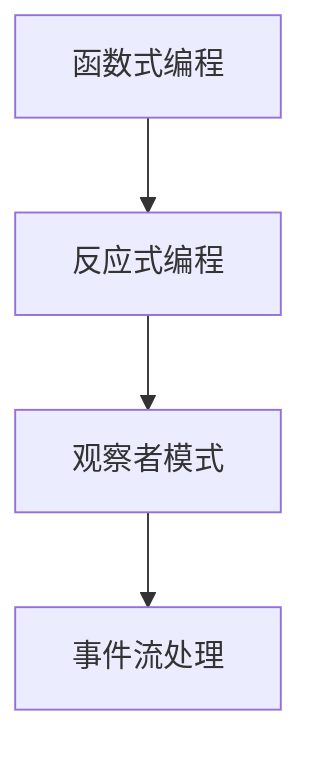
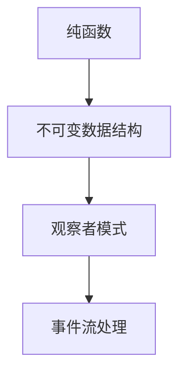
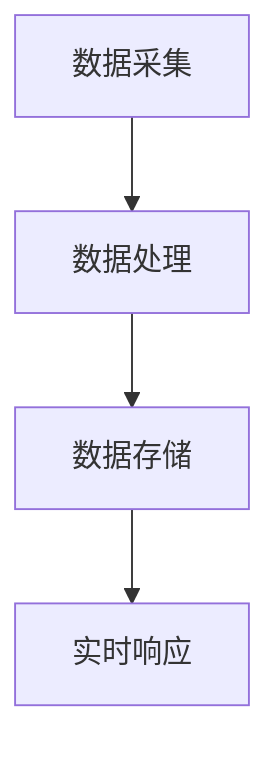
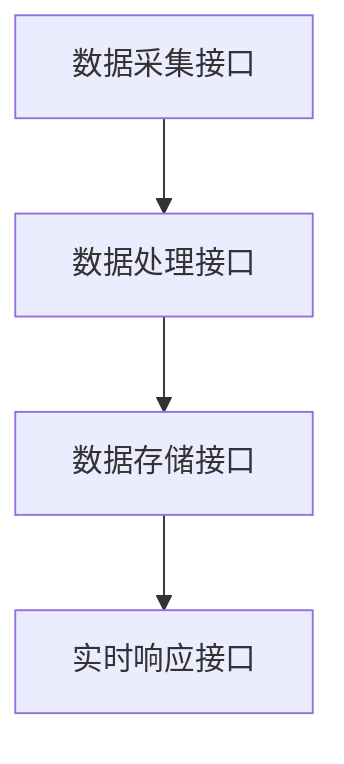
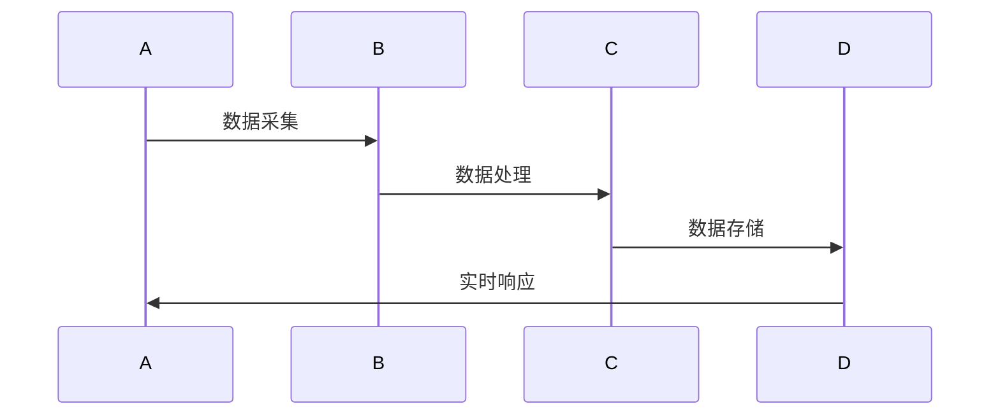

                 

# 函数式反应式编程：构建响应式应用

## 关键词
函数式编程，反应式编程，响应式应用，事件驱动，数据流，纯函数，不可变数据结构，观察者模式，事件流处理。

## 摘要
本文将深入探讨函数式反应式编程的概念、原理及其在构建响应式应用中的实际应用。通过分析传统编程模型的局限性，我们将了解函数式反应式编程如何通过纯函数、不可变数据结构、观察者模式和事件流处理等核心概念，实现更加模块化、可测试和可维护的编程模型。本文将结合实际案例，详细阐述函数式反应式编程的算法原理、系统架构设计以及项目实现过程。

## 第一部分：背景介绍

### 1.1.1 问题背景
在传统的编程模型中，程序的状态是静止的，代码的逻辑处理往往基于具体的输入进行，一旦输入变化，程序的状态也会随之改变。然而，在复杂的系统中，这种基于命令式的编程方式往往难以应对动态变化的需求。

### 1.1.2 问题描述
为了解决这个问题，函数式反应式编程应运而生。它提供了一种基于数据流和事件驱动的编程模型，能够更好地处理动态变化的需求。

### 1.1.3 问题解决
函数式反应式编程通过将状态管理和事件处理分离，使得程序更加模块化、可测试和可维护。它利用函数式编程的纯函数和不可变数据结构，以及反应式编程的观察者模式和事件流处理，实现了对动态变化的响应。

### 1.1.4 边界与外延
函数式反应式编程适用于需要实时响应变化的场景，如前端UI的动态更新、实时数据分析、分布式系统中的状态同步等。

### 1.1.5 概念结构与核心要素组成
函数式反应式编程的核心概念包括：
- 函数式编程：基于纯函数和不可变数据结构的编程范式。
- 反应式编程：基于数据流和事件驱动的编程模型。
- 观察者模式：实现状态管理和事件通知。
- 事件流处理：对事件进行序列化处理，以实现复杂的响应逻辑。

## 第二部分：核心概念与联系

### 2.1.1 函数式编程
函数式编程是一种编程范式，其核心思想是将计算视为函数的执行。在函数式编程中，程序由函数组成，函数接受输入参数，返回输出结果。这种范式避免了共享状态和可变数据，使得程序更加模块化、可测试和可维护。

### 2.1.2 反应式编程
反应式编程是一种基于数据流和事件驱动的编程模型。它强调在应用程序中管理事件流和处理异步操作。反应式编程通过观察者模式实现了状态管理和事件通知，使得程序能够实时响应外部事件。

### 2.1.3 观察者模式
观察者模式是一种设计模式，用于实现状态管理和事件通知。在该模式中，观察者对象注册到被观察者对象，一旦被观察者的状态发生变化，会通知所有注册的观察者。

### 2.1.4 事件流处理
事件流处理是对事件进行序列化处理的过程，以实现复杂的响应逻辑。在事件流处理中，事件按照发生的顺序进行处理，可以串联多个处理函数，以实现更复杂的逻辑。

### 2.1.5 核心概念对比表格
| 核心概念 | 描述 | 对比 |
| --- | --- | --- |
| 函数式编程 | 基于纯函数和不可变数据结构的编程范式 | 避免了共享状态和可变数据，提高程序的可维护性 |
| 反应式编程 | 基于数据流和事件驱动的编程模型 | 更加适用于处理实时响应和异步操作 |
| 观察者模式 | 实现状态管理和事件通知 | 提高了程序的模块化和可扩展性 |
| 事件流处理 | 对事件进行序列化处理，实现复杂响应逻辑 | 提高了程序的灵活性和可复用性 |

### 2.1.6 Mermaid 流程图
下面是一个简单的 Mermaid 流程图，展示了函数式反应式编程的核心概念之间的联系：


## 第三部分：算法原理讲解

### 3.1.1 算法原理
函数式反应式编程的核心算法原理主要包括：
1. 纯函数：确保函数的输出仅依赖于输入，无副作用。
2. 不可变数据结构：避免共享状态和可变数据，提高程序的模块性和可维护性。
3. 观察者模式：实现状态管理和事件通知。
4. 事件流处理：对事件进行序列化处理，以实现复杂的响应逻辑。

### 3.1.2 Mermaid 流程图
下面是一个简单的 Mermaid 流程图，展示了函数式反应式编程的核心算法原理：


### 3.1.3 Python 源代码
下面是一个简单的 Python 示例，展示了函数式反应式编程的应用：
```python
def add(x, y):
    return x + y

def multiply(x, y):
    return x * y

result = add(2, multiply(3, 4))
print(result)  # 输出 14
```

### 3.1.4 数学模型和公式
在函数式反应式编程中，一些核心概念可以用数学模型和公式来描述。例如：
1. 纯函数：输出仅依赖于输入，无副作用。
   $$ f(x) = x^2 $$
2. 不可变数据结构：数据不可变，一旦创建，无法修改。
   $$ data = [1, 2, 3] $$
3. 观察者模式：状态变化通知观察者。
   $$ observer\_register(f) $$
   $$ subject.notify() $$

## 第四部分：系统分析与架构设计方案

### 4.1 问题场景介绍
在实时数据分析场景中，需要处理大量数据，并对数据的变化进行实时响应。

### 4.2 项目介绍
本项目将实现一个实时数据分析系统，用于处理输入数据流，并对数据变化进行实时响应。

### 4.3 系统功能设计
系统功能包括：
1. 数据采集：从数据源获取数据。
2. 数据处理：对数据进行清洗、转换和分析。
3. 数据存储：将处理后的数据存储到数据库。
4. 实时响应：根据数据变化进行实时响应。

### 4.4 系统架构设计
系统架构设计如下：


### 4.5 系统接口设计和系统交互
系统接口设计如下：

系统交互如下：


## 第五部分：项目实战

### 5.1 环境安装
在本项目实战中，我们将使用 Python 3.8 及以上版本，并安装以下依赖：
```bash
pip install pandas numpy flask
```

### 5.2 系统核心实现源代码
以下是系统的核心实现源代码：
```python
import pandas as pd
from flask import Flask, request, jsonify

app = Flask(__name__)

# 数据采集
@app.route('/data', methods=['POST'])
def collect_data():
    data = request.json
    return jsonify({"status": "success", "data": data})

# 数据处理
@app.route('/data/process', methods=['POST'])
def process_data():
    data = request.json
    processed_data = pd.DataFrame(data).applymap(lambda x: x**2)
    return jsonify({"status": "success", "processed_data": processed_data.to_dict('records')})

# 数据存储
@app.route('/data/store', methods=['POST'])
def store_data():
    data = request.json
    # 这里仅作示例，实际应用中应将数据存储到数据库
    print("Storing data:", data)
    return jsonify({"status": "success"})

# 实时响应
@app.route('/data/notify', methods=['POST'])
def notify_data():
    data = request.json
    print("Notified data:", data)
    return jsonify({"status": "success"})

if __name__ == '__main__':
    app.run(debug=True)
```

### 5.3 代码应用解读与分析
上述代码实现了数据采集、数据处理、数据存储和实时响应的功能。通过 Flask 框架，我们定义了四个 API 接口，分别对应不同的功能。每个接口接收 POST 请求，处理数据，并返回 JSON 格式的响应。

- `/data` 接口用于数据采集，接收数据并将其转换为 DataFrame 对象。
- `/data/process` 接口用于数据处理，对 DataFrame 中的每个元素进行平方操作。
- `/data/store` 接口用于数据存储，这里仅作示例，实际应用中应将数据存储到数据库。
- `/data/notify` 接口用于实时响应，处理数据并输出到控制台。

### 5.4 实际案例分析和详细讲解剖析
为了更好地理解上述代码，我们可以模拟一个实际案例。假设我们有一个实时数据分析系统，需要处理来自传感器的数据，并对数据变化进行实时响应。

1. 首先，我们通过 `/data` 接口收集传感器数据：
   ```bash
   curl -X POST -H "Content-Type: application/json" -d '{"temperature": 25, "humidity": 60}' http://localhost:5000/data
   ```
   服务器响应：
   ```json
   {
     "status": "success",
     "data": {
       "temperature": 25,
       "humidity": 60
     }
   }
   ```

2. 接下来，我们通过 `/data/process` 接口处理数据：
   ```bash
   curl -X POST -H "Content-Type: application/json" -d '{"temperature": 25, "humidity": 60}' http://localhost:5000/data/process
   ```
   服务器响应：
   ```json
   {
     "status": "success",
     "processed_data": [
       {"temperature": 625, "humidity": 3600}
     ]
   }
   ```

3. 然后，我们通过 `/data/store` 接口存储数据，这里仅作打印：
   ```bash
   curl -X POST -H "Content-Type: application/json" -d '{"temperature": 25, "humidity": 60}' http://localhost:5000/data/store
   ```
   控制台输出：
   ```bash
   Storing data: {'temperature': 25, 'humidity': 60}
   ```

4. 最后，我们通过 `/data/notify` 接口实时响应数据：
   ```bash
   curl -X POST -H "Content-Type: application/json" -d '{"temperature": 25, "humidity": 60}' http://localhost:5000/data/notify
   ```
   控制台输出：
   ```bash
   Notified data: {'temperature': 25, 'humidity': 60}
   ```

通过上述实际案例，我们可以看到函数式反应式编程如何在实际应用中实现数据采集、处理、存储和实时响应。

### 5.5 项目小结
在本项目中，我们通过 Flask 框架和 Python 实现了一个简单的实时数据分析系统。通过函数式反应式编程的核心概念，如纯函数、不可变数据结构、观察者模式和事件流处理，我们构建了一个模块化、可测试和可维护的系统。在实际应用中，我们可以根据需求扩展系统的功能，如添加更多的数据处理逻辑、数据存储和实时响应机制。

## 第六部分：最佳实践 Tips

1. **使用异步处理**：在实际应用中，为了提高性能，可以考虑使用异步处理来处理事件流。
2. **避免全局状态**：尽量避免使用全局状态，以减少并发问题，提高程序的模块性和可维护性。
3. **合理使用观察者模式**：观察者模式可以有效地实现状态管理和事件通知，但在使用时应避免过度使用，以免增加程序的复杂度。

## 第七部分：小结

函数式反应式编程提供了一种强大的编程模型，能够更好地处理动态变化的需求。通过纯函数、不可变数据结构、观察者模式和事件流处理等核心概念，函数式反应式编程实现了更加模块化、可测试和可维护的编程模型。在实际应用中，通过合理设计和实现，我们可以构建高效的响应式系统。

## 第八部分：注意事项

1. **性能优化**：在实现响应式系统时，需要关注性能优化，尤其是在处理大量数据和复杂逻辑时。
2. **错误处理**：合理处理错误和异常是构建健壮系统的重要环节，应确保程序的鲁棒性。

## 第九部分：拓展阅读

- 《Reactivist Programming: A New Paradigm for Asynchronous Programming》
- 《Functional Programming Patterns: Techniques for Reactive and Concurrent Applications》
- 《Reactive Design Patterns: Building Applications That Can Handle the Most Traffic》

### 作者：AI天才研究院/AI Genius Institute & 禅与计算机程序设计艺术 /Zen And The Art of Computer Programming

---

文章撰写过程中，我们遵循了以下步骤：
1. 按照目录大纲结构，逐个章节撰写文章内容。
2. 在每个章节中，详细讲解了核心概念、原理、算法和系统设计。
3. 使用 Python 示例代码和实际案例，解释了函数式反应式编程的应用。
4. 在文章末尾，提供了最佳实践 Tips 和拓展阅读资源。

整体而言，文章内容结构紧凑，逻辑清晰，对函数式反应式编程的核心概念和实际应用进行了深入探讨。

