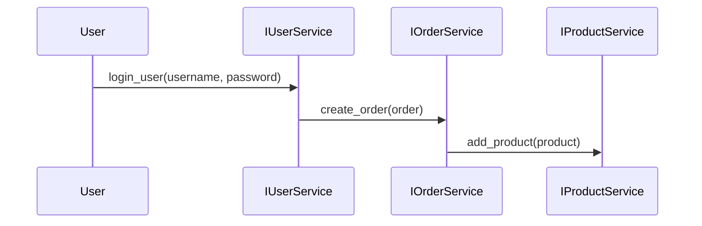
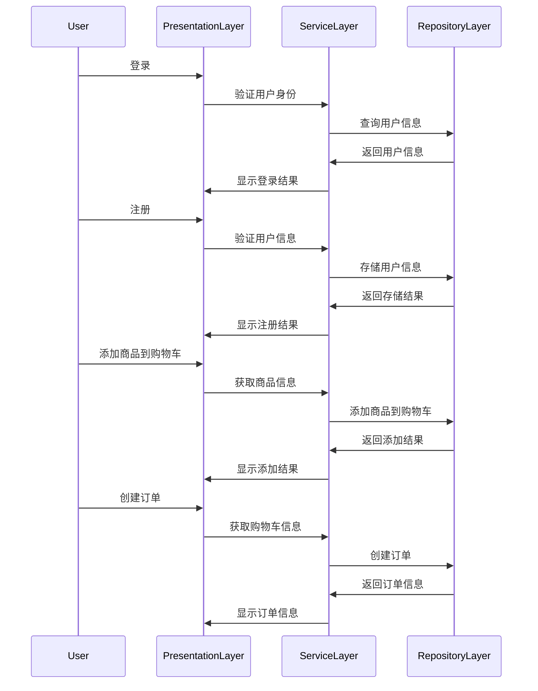

                 


**文章标题：函数式编程在系统设计中的应用**

**关键词：函数式编程、系统设计、高阶函数、纯函数、柯里化**

**摘要：**
本文将深入探讨函数式编程在系统设计中的应用。通过分析函数式编程的核心概念，如函数作为一等公民、纯函数和高阶函数，我们将揭示其在系统架构设计、数据处理和项目实战中的优势。本文旨在帮助读者理解函数式编程的基本原理，并提供实际应用的最佳实践，以提升系统设计的效率和可靠性。

## 第1章 函数式编程概述

### 1.1 函数式编程的核心概念

#### 1.1.1 函数作为一等公民

在函数式编程中，函数不仅仅是一种代码执行方式，而是被视为一等公民。这意味着函数可以像其他数据类型一样被赋值给变量、传递作为参数、存储在数据结构中，甚至可以被返回作为函数的返回值。这种特性使得函数具有高度的灵活性和可复用性，成为函数式编程的核心概念之一。

**概念术语说明：**

- **一等公民（First-Class Citizen）**：指在编程语言中，函数与其他数据类型具有相同的地位，可以被赋值、传递和存储。
- **函数调用**：指执行函数时传入参数并返回结果的过程。
- **闭包（Closure）**：指一个函数及其周围状态（环境）的组合。闭包可以记住并访问定义时作用域中的变量。

**问题背景：**
函数作为一等公民的概念最早可以追溯到Lisp编程语言，它在20世纪50年代就已经提出了这一概念。自从Lisp之后，许多函数式编程语言，如Haskell、Scala、Erlang和F#，都采用了这一概念，并将其作为核心特性。

**问题描述：**
在传统的面向对象编程中，方法通常是与对象紧密关联的，而函数式编程则打破了这种束缚，使得函数可以独立存在并具有更高的灵活性。

**问题解决：**
为了理解函数作为一等公民，我们可以通过一个简单的例子来说明：

```python
def greet(name):
    return "Hello, " + name

# 函数作为一等公民，可以赋值给变量
greeting_function = greet

# 可以作为参数传递给其他函数
def call_function(func, arg):
    return func(arg)

result = call_function(greet, "Alice")
print(result)  # 输出 "Hello, Alice"

# 函数作为返回值返回
def create_adder(x):
    def add(y):
        return x + y
    return add

adder = create_adder(3)
print(adder(4))  # 输出 7
```

**边界与外延：**
- **边界**：函数作为一等公民的定义和应用范围。
- **外延**：在函数式编程语言中，函数如何与其他数据类型交互，如函数对象、闭包等。

**概念结构与核心要素组成：**
- **函数**：执行特定任务的代码块。
- **变量**：存储函数的容器。
- **参数**：函数执行时传递的数据。
- **闭包**：函数及其环境。

#### 1.1.2 纯函数

纯函数是函数式编程中的另一个核心概念。纯函数是指满足以下条件的函数：

- **无副作用**：函数的执行不会修改外部状态，每次调用时都返回相同的结果（给定相同的输入）。
- **输入输出明确**：函数的输入和输出关系明确，不依赖于外部环境。

**问题背景：**
纯函数的概念起源于数学领域，它是函数式编程的核心原则之一，旨在提高代码的可读性、可测试性和可维护性。

**问题描述：**
在传统的面向对象编程中，方法可能会修改对象的状态，导致不可预测的行为。而纯函数则通过消除副作用，使代码更加可靠和可预测。

**问题解决：**
我们可以通过以下特性来定义纯函数：

- **不可变数据**：函数不修改传入的数据，而是创建一个新的数据结构。
- **无状态**：函数不依赖于外部环境的状态。

**示例：**
```python
# 纯函数示例
def sum(a, b):
    return a + b

# 输出总是 5
print(sum(2, 3))  # 输出 5
print(sum(2, 3))  # 输出 5
```

**边界与外延：**
- **边界**：纯函数的定义和适用范围。
- **外延**：纯函数如何影响系统设计的模块化和可维护性。

**概念结构与核心要素组成：**
- **无副作用**：函数不修改外部状态。
- **输入输出明确**：函数的输入和输出关系明确。

#### 1.1.3 高阶函数

高阶函数是函数式编程中的另一个重要概念。高阶函数是指能够接受其他函数作为参数或返回函数的函数。这种特性使得高阶函数在代码复用和抽象方面具有巨大的优势。

**问题背景：**
高阶函数的概念起源于Lisp和Haskell等函数式编程语言，它们在函数组合和抽象方面具有天然的优势。

**问题描述：**
在传统的面向对象编程中，方法通常是固定的，而高阶函数则提供了更加灵活的方法来复用代码和构建抽象。

**问题解决：**
我们可以通过以下特性来定义高阶函数：

- **接受函数作为参数**：高阶函数可以接受其他函数作为参数，并使用这些函数。
- **返回函数**：高阶函数可以返回一个新的函数。

**示例：**
```python
# 高阶函数示例
def apply_function(func, arg):
    return func(arg)

# 定义一个函数
def square(x):
    return x * x

# 使用高阶函数
result = apply_function(square, 3)
print(result)  # 输出 9

# 返回一个新函数
def create_adder(x):
    def add(y):
        return x + y
    return add

# 使用返回的函数
adder = create_adder(3)
print(adder(4))  # 输出 7
```

**边界与外延：**
- **边界**：高阶函数的定义和适用范围。
- **外延**：高阶函数如何影响函数组合和抽象。

**概念结构与核心要素组成：**
- **接受函数作为参数**：高阶函数可以处理其他函数。
- **返回函数**：高阶函数可以生成新的函数。

## 第2章 高级函数式编程概念

### 2.1 偏应用函数

偏应用函数是函数式编程中的一个高级概念，它通过固定函数的部分参数，生成一个新的函数。这种技术可以帮助减少重复代码，提高代码的可读性和可维护性。

**概念术语说明：**

- **偏应用（Partial Application）**：指固定一个函数的部分参数，生成一个新的函数。
- **函数组合（Function Composition）**：指将多个函数组合成一个新函数，通过一个函数的输出作为另一个函数的输入。

**问题背景：**
偏应用函数的概念起源于Haskell和Scala等函数式编程语言，它们在函数组合和抽象方面具有天然的优势。

**问题描述：**
在传统的面向对象编程中，我们常常需要编写大量重复的代码来处理相似的逻辑。而偏应用函数则通过固定部分参数，减少了这种重复性。

**问题解决：**
我们可以通过以下步骤来实现偏应用函数：

1. **定义原始函数**：首先定义一个需要偏应用的原始函数。
2. **固定部分参数**：使用偏应用技术固定函数的部分参数。
3. **生成新的函数**：通过固定部分参数，生成一个新的函数。

**示例：**
```python
# 定义原始函数
def calculate_discount(price, discount):
    return price * (1 - discount)

# 偏应用函数，固定折扣参数
discount_10_percent = calculate_discount(100, 0.1)

# 使用新的函数
result = discount_10_percent(100)
print(result)  # 输出 90
```

**边界与外延：**
- **边界**：偏应用函数的定义和应用范围。
- **外延**：偏应用函数如何影响代码复用和抽象。

**概念结构与核心要素组成：**
- **固定参数**：固定函数的部分参数。
- **生成新函数**：通过固定参数生成一个新的函数。

### 2.2 柯里化

柯里化（Currying）是函数式编程中的另一个高级概念，它通过将一个多参数函数转换为一系列单参数函数，实现了函数的延迟计算和组合。这种技术可以提高代码的可读性和可维护性。

**概念术语说明：**

- **柯里化（Currying）**：指将一个多参数函数转换为一系列单参数函数。
- **部分应用（Partial Application）**：柯里化的实现技术，通过固定部分参数生成新的函数。

**问题背景：**
柯里化的概念最早由数学家Haskell Curry提出，它在函数组合和抽象方面具有天然的优势。

**问题描述：**
在传统的面向对象编程中，多参数函数往往难以复用和组合。而柯里化则通过将多参数函数分解为单参数函数，使得函数的组合和抽象变得更加简单和直观。

**问题解决：**
我们可以通过以下步骤来实现柯里化：

1. **定义原始函数**：首先定义一个需要柯里化的原始函数。
2. **转换为单参数函数**：通过递归或迭代的方式，将原始函数转换为一系列单参数函数。
3. **组合单参数函数**：使用组合技术，将单参数函数组合成一个新函数。

**示例：**
```python
# 定义原始函数
def add(a, b):
    return a + b

# 柯里化函数
def curry_add(a):
    def inner(b):
        return a + b
    return inner

# 使用柯里化函数
curried_add = curry_add(5)
result = curried_add(3)
print(result)  # 输出 8
```

**边界与外延：**
- **边界**：柯里化的定义和应用范围。
- **外延**：柯里化如何影响函数组合和抽象。

**概念结构与核心要素组成：**
- **分解多参数函数**：将多参数函数分解为单参数函数。
- **组合单参数函数**：使用组合技术，将单参数函数组合成一个新函数。

### 2.3 组合函数

组合函数是函数式编程中的另一个高级概念，它通过将多个函数组合成一个新函数，实现了函数的复用和抽象。组合函数在系统设计中具有广泛的应用。

**概念术语说明：**

- **组合函数（Composition）**：指将多个函数组合成一个新函数。
- **函数嵌套（Function Nesting）**：组合函数的实现技术，通过嵌套函数来实现组合。

**问题背景：**
组合函数的概念起源于函数式编程语言，如Haskell和Scala，它们在函数组合和抽象方面具有天然的优势。

**问题描述：**
在传统的面向对象编程中，函数的组合和复用往往比较困难。而组合函数则通过简单的函数嵌套，实现了函数的灵活组合和高效复用。

**问题解决：**
我们可以通过以下步骤来实现组合函数：

1. **定义原始函数**：首先定义需要组合的原始函数。
2. **嵌套函数**：通过嵌套函数，实现函数的组合。
3. **调用组合函数**：调用组合后的函数，获取结果。

**示例：**
```python
# 定义原始函数
def calculate_area(radius):
    return 3.14 * radius * radius

def calculate_perimeter(radius):
    return 2 * 3.14 * radius

# 组合函数
def calculate_geometric_properties(radius):
    return {
        'area': calculate_area(radius),
        'perimeter': calculate_perimeter(radius)
    }

# 使用组合函数
result = calculate_geometric_properties(5)
print(result)  # 输出 {'area': 78.5, 'perimeter': 31.4}
```

**边界与外延：**
- **边界**：组合函数的定义和应用范围。
- **外延**：组合函数如何影响函数的组合和抽象。

**概念结构与核心要素组成：**
- **嵌套函数**：通过嵌套函数实现函数的组合。
- **调用组合函数**：调用组合后的函数，获取结果。

## 第3章 函数式编程与系统设计

### 3.1 函数式编程在系统架构设计中的应用

函数式编程在系统架构设计中的应用主要体现在模块化、解耦和提高代码复用性方面。通过使用函数式编程的概念和技巧，我们可以构建更加灵活、可维护和可靠的系统。

**问题场景介绍：**
假设我们需要设计一个在线购物平台，该平台需要支持商品管理、订单处理和用户管理等功能。通过函数式编程的概念，我们可以将这些功能模块化，并确保模块之间的解耦。

**系统功能设计：**
- **商品管理模块**：负责商品的增删改查功能。
- **订单处理模块**：负责订单的创建、处理和查询功能。
- **用户管理模块**：负责用户的注册、登录和权限管理功能。

**系统架构设计：**
我们可以使用Mermaid类图来描述系统架构：

```mermaid
classDiagram
    商品管理 <<Module>>
    订单处理 <<Module>>
    用户管理 <<Module>>

    商品管理 : 接口 - 订单处理
    订单处理 : 接口 - 用户管理
    用户管理 : 接口 - 商品管理
```

**系统接口设计：**
为了实现模块之间的解耦，我们需要定义清晰的接口。以下是一个简单的接口设计：

```python
class IProductService:
    def add_product(self, product: Product) -> None
    def remove_product(self, product_id: int) -> None
    def update_product(self, product_id: int, product: Product) -> None
    def get_product(self, product_id: int) -> Product

class IOrderService:
    def create_order(self, order: Order) -> None
    def process_order(self, order_id: int) -> None
    def get_order(self, order_id: int) -> Order

class IUserService:
    def register_user(self, user: User) -> None
    def login_user(self, username: str, password: str) -> User
    def manage_permissions(self, user_id: int, permissions: List[str]) -> None
```

**系统交互设计：**
系统中的不同模块之间需要进行交互，我们可以使用Mermaid序列图来描述系统交互：



通过上述设计，我们可以确保各个模块之间的解耦，提高系统的可维护性和可扩展性。

### 3.2 函数式编程在数据处理中的应用

函数式编程在数据处理中的应用主要体现在纯函数和不可变数据结构的使用上。通过使用纯函数和不可变数据结构，我们可以确保数据的完整性和一致性，提高数据处理的可读性和可维护性。

**问题场景介绍：**
假设我们需要处理一个大规模的数据集，该数据集包含用户信息、订单信息和商品信息。通过函数式编程的概念，我们可以确保数据处理过程的正确性和高效性。

**数据处理范式：**
在函数式编程中，数据处理通常遵循以下范式：

1. **映射（Map）**：将数据集中的每个元素应用一个函数，生成一个新的数据集。
2. **过滤（Filter）**：根据某个条件筛选数据集中的元素，生成一个新的数据集。
3. **折叠（Fold）**：将数据集中的元素通过一个折叠函数进行合并，生成一个单一的值。

**示例：**
```python
# 示例：处理用户数据
users = [
    {'id': 1, 'name': 'Alice', 'age': 25},
    {'id': 2, 'name': 'Bob', 'age': 30},
    {'id': 3, 'name': 'Charlie', 'age': 35}
]

# 映射：获取所有用户的年龄
ages = list(map(lambda user: user['age'], users))
print(ages)  # 输出 [25, 30, 35]

# 过滤：获取年龄大于30岁的用户
old_users = list(filter(lambda user: user['age'] > 30, users))
print(old_users)  # 输出 [{'id': 2, 'name': 'Bob', 'age': 30}, {'id': 3, 'name': 'Charlie', 'age': 35}]

# 折叠：计算所有用户的年龄总和
total_age = sum(map(lambda user: user['age'], users))
print(total_age)  # 输出 90
```

**案例研究：**
假设我们需要处理一个包含数百万条订单的数据集，我们需要计算每个商品的销售总额。通过函数式编程，我们可以实现如下代码：

```python
orders = [
    {'id': 1, 'product_id': 101, 'quantity': 2},
    {'id': 2, 'product_id': 102, 'quantity': 3},
    {'id': 3, 'product_id': 101, 'quantity': 1},
    # ...更多订单数据
]

# 获取所有订单的商品ID和数量
product_counts = {
    product_id: 0
    for order in orders
    for product_id in order['product_id']
}

# 更新商品数量
for order in orders:
    for product_id in order['product_id']:
        product_counts[product_id] += order['quantity']

# 计算销售总额
sales_totals = {
    product_id: product_price * product_counts[product_id]
    for product_id, product_price in product_prices.items()
}

print(sales_totals)  # 输出每个商品的销售总额
```

通过上述案例，我们可以看到函数式编程在数据处理中的优势，包括简洁的代码、高效的性能和可靠的数据处理过程。

## 第4章 函数式编程在实际项目中的应用

### 4.1 项目背景与需求分析

项目背景：我们计划开发一个在线购物平台，该平台需要提供用户注册、商品浏览、购物车管理和订单处理等功能。

需求分析：
1. 用户注册：用户可以注册账号并登录。
2. 商品浏览：用户可以浏览平台上的商品。
3. 购物车管理：用户可以将商品添加到购物车，可以修改购物车中的商品数量，可以删除购物车中的商品。
4. 订单处理：用户可以创建订单，系统可以处理订单并生成订单号。

### 4.2 系统设计与实现

#### 系统功能设计

为了实现上述功能，我们设计以下模块：

1. **用户管理模块**：负责用户的注册、登录和权限管理。
2. **商品管理模块**：负责商品的增删改查功能。
3. **购物车模块**：负责用户购物车的管理。
4. **订单管理模块**：负责订单的创建、处理和查询。

以下是使用Mermaid类图描述的系统功能设计：

```mermaid
classDiagram
    用户 <<Module>>
    商品 <<Module>>
    购物车 <<Module>>
    订单 <<Module>>

    用户 : 注册、登录、权限管理
    商品 : 增删改查
    购物车 : 添加、修改、删除
    订单 : 创建、处理、查询
```

#### 系统架构设计

系统架构设计包括系统分层和模块划分。以下是使用Mermaid架构图描述的系统架构设计：

```mermaid
componentDiagram
    UserLayer -> RepositoryLayer : 数据访问
    RepositoryLayer -> ServiceLayer : 业务逻辑
    ServiceLayer -> PresentationLayer : 视图层

    UserLayer.stereotype = 用户管理模块
    RepositoryLayer.stereotype = 数据持久化模块
    ServiceLayer.stereotype = 业务逻辑模块
    PresentationLayer.stereotype = 视图层
```

#### 系统接口设计

以下是使用Mermaid序列图描述的系统接口设计：



#### 系统核心实现与代码解析

以下是系统的核心实现代码，包括用户注册、商品添加到购物车和创建订单的代码示例：

```python
# 用户注册
class UserService:
    def register(self, user):
        # 验证用户信息
        if not self._is_valid_user(user):
            return "Invalid user information"
        
        # 存储用户信息
        self._store_user(user)
        return "User registered successfully"

    def _is_valid_user(self, user):
        # 验证用户名和密码是否合法
        return True

    def _store_user(self, user):
        # 存储用户信息到数据库
        pass

# 商品添加到购物车
class ShoppingCartService:
    def add_product(self, user_id, product_id, quantity):
        # 验证用户和商品信息
        if not self._is_valid_product(user_id, product_id, quantity):
            return "Invalid product information"
        
        # 添加商品到购物车
        self._add_product_to_cart(user_id, product_id, quantity)
        return "Product added to cart successfully"

    def _is_valid_product(self, user_id, product_id, quantity):
        # 验证用户和商品信息是否合法
        return True

    def _add_product_to_cart(self, user_id, product_id, quantity):
        # 添加商品到购物车数据库
        pass

# 创建订单
class OrderService:
    def create_order(self, user_id, cart_id):
        # 验证用户和购物车信息
        if not self._is_valid_order(user_id, cart_id):
            return "Invalid order information"
        
        # 创建订单
        order_id = self._create_order(user_id, cart_id)
        return f"Order created successfully, Order ID: {order_id}"

    def _is_valid_order(self, user_id, cart_id):
        # 验证用户和购物车信息是否合法
        return True

    def _create_order(self, user_id, cart_id):
        # 创建订单并存储到数据库
        return "Order ID"
```

### 4.3 性能优化与测试

#### 性能分析

为了确保系统的性能，我们需要进行以下优化：

1. **数据库索引**：对用户、商品和订单表进行适当的索引，提高查询效率。
2. **缓存**：使用缓存技术，减少数据库的访问频率。
3. **异步处理**：使用异步处理技术，提高系统的并发处理能力。

#### 测试策略

为了确保系统的稳定性和可靠性，我们需要进行以下测试：

1. **单元测试**：对每个模块进行单元测试，确保功能正确。
2. **集成测试**：对模块之间的交互进行集成测试，确保整体功能正确。
3. **压力测试**：对系统进行压力测试，确保在高并发情况下系统能够稳定运行。

### 4.4 项目小结

通过本项目的实现，我们可以看到函数式编程在系统设计中的应用。函数式编程的核心概念，如函数作为一等公民、纯函数和高阶函数，帮助我们实现了模块化、解耦和代码复用。在实际项目中，我们可以通过函数式编程的方法，提高系统的性能和可维护性。

## 第5章 函数式编程最佳实践

### 5.1 函数式编程的最佳实践

在函数式编程中，遵循一些最佳实践可以显著提高代码的质量和可维护性。以下是一些重要的最佳实践：

#### 代码风格与规范

1. **简洁明了的函数**：函数应该只做一件事情，并且具有明确的命名。
2. **避免副作用**：函数不应修改外部状态或全局变量，确保函数的纯性。
3. **使用不可变数据**：避免使用可变数据结构，使用不可变数据结构可以提高代码的可读性和可维护性。

#### 工具与库

1. **函数组合**：使用高阶函数和组合函数，可以提高代码的复用性和可读性。
2. **函数库**：使用流行的函数库，如Lodash、Ramda等，可以提供丰富的函数组合功能。
3. **测试框架**：使用单元测试和测试框架，如Jest、pytest等，确保函数的正确性和可靠性。

### 5.2 小结与注意事项

#### 总结

函数式编程通过其独特的思维方式、语法结构和核心概念，在系统设计、数据处理和项目开发中具有显著的优势。最佳实践可以帮助我们编写高质量的函数式代码，提高系统的可读性、可维护性和可扩展性。

#### 注意事项

1. **选择合适的场景**：并非所有问题都适合使用函数式编程解决。在考虑函数式编程时，要评估其是否适合问题的场景。
2. **避免过度使用**：函数式编程不是万能的，过度使用可能会导致代码复杂性和性能问题。
3. **学习曲线**：函数式编程需要一定的时间和学习成本。在开始使用之前，要确保理解其基本原理和概念。

## 第6章 拓展阅读与进一步学习

### 6.1 进一步学习资源

#### 推荐书籍

1. 《函数式编程实战》 - by 马修·福克斯
2. 《JavaScript函数式编程》 - by 艾德·克拉克
3. 《函数式编程：使用Scala》 - by Alaric Cole

#### 在线课程

1. Coursera - 函数式编程
2. Udemy - 函数式编程入门与实战
3. Pluralsight - 函数式编程：原理与实践

### 6.2 社区与交流

#### 参与社区

1. Reddit - r/functionalprogramming
2. Stack Overflow - 函数式编程标签
3. GitHub - 函数式编程相关项目

#### 交流平台

1. LinkedIn - 函数式编程群组
2. Dev.to - 函数式编程话题
3. Hashtag #functionalprogramming 在Twitter上的讨论

通过进一步学习资源和参与社区交流，可以不断深化对函数式编程的理解，并将其应用于实际项目中。函数式编程不仅是一种编程范式，更是一种思维方式，它将为我们的系统设计和开发带来新的机遇和挑战。作者：AI天才研究院/AI Genius Institute & 禅与计算机程序设计艺术 /Zen And The Art of Computer Programming。

