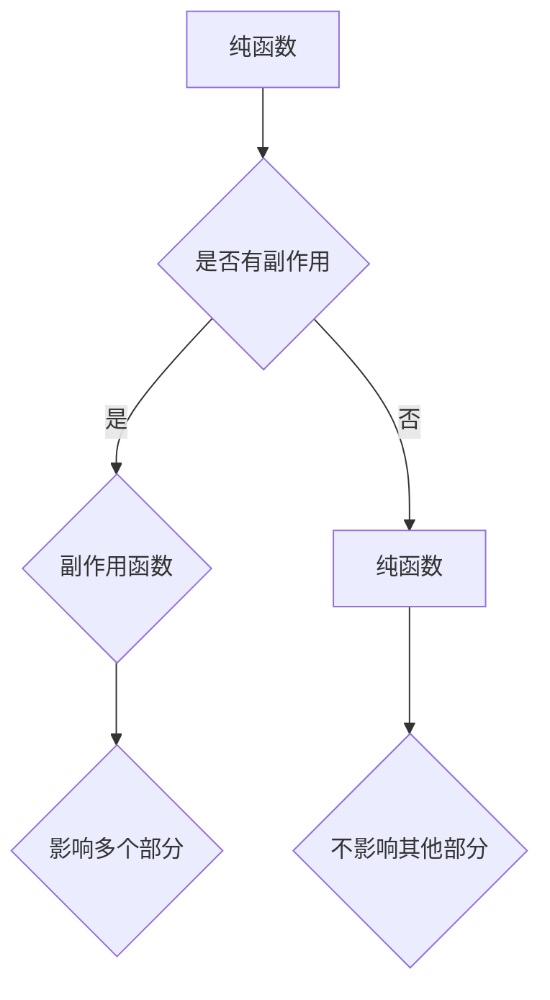
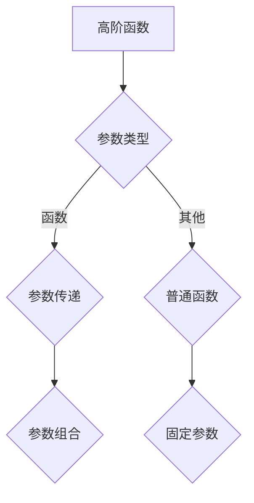
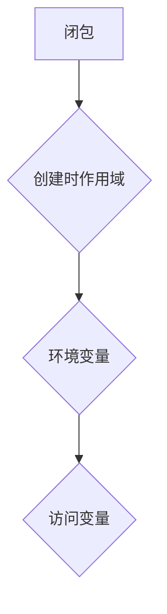
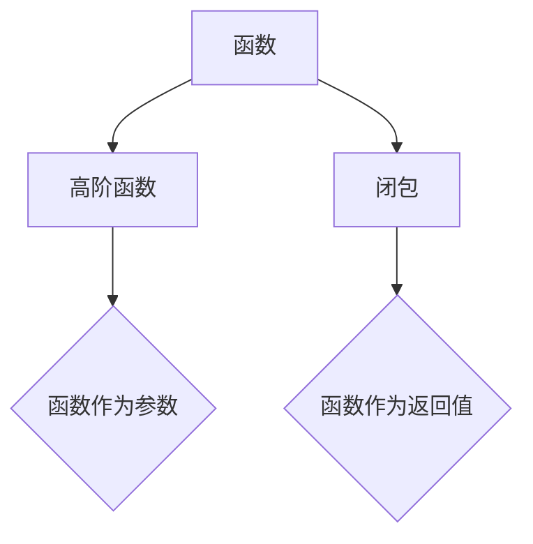
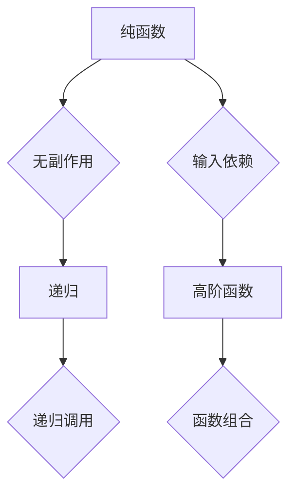
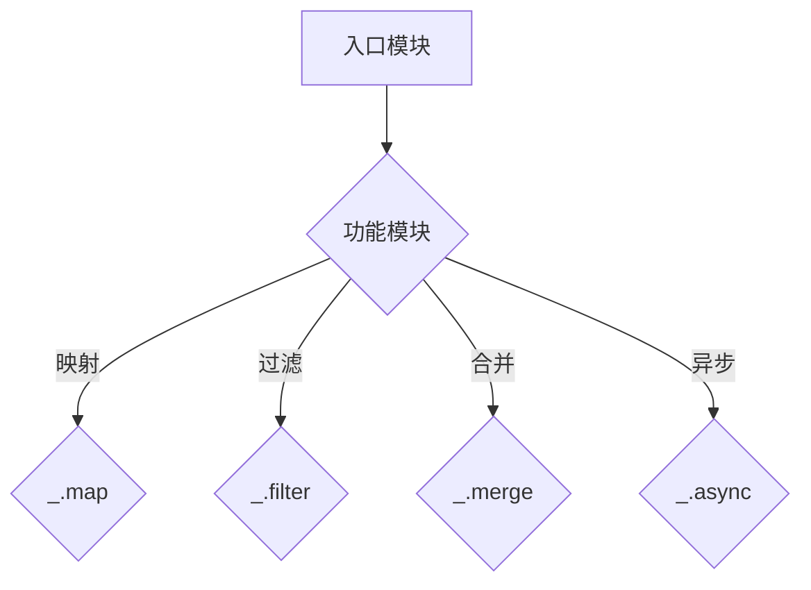
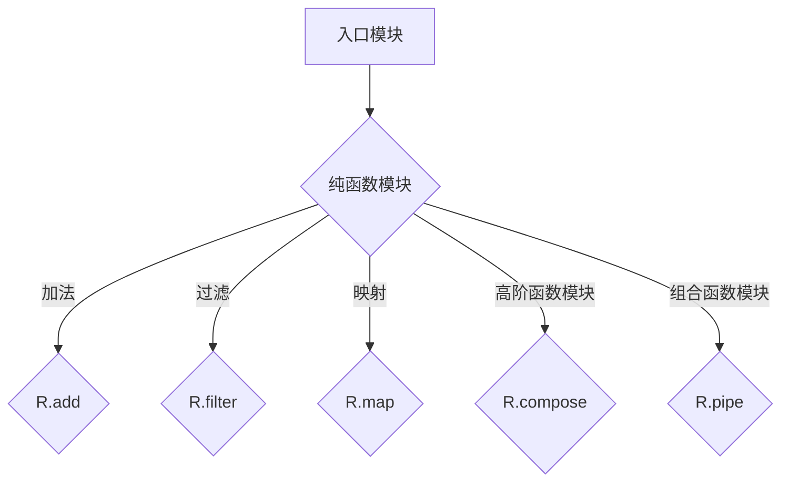

                 

# 函数式编程：范式转换与实际应用

## 关键词
- 函数式编程
- 范式转换
- 实际应用
- 纯函数
- 递归
- 组合
- 高阶函数
- 闭包

## 摘要
本文将深入探讨函数式编程这一编程范式，从基础概念到实际应用进行全面剖析。通过介绍函数式编程的基本概念、核心语法特性，以及函数式编程范式，本文旨在帮助读者理解函数式编程的精髓，并掌握其在实际项目中的应用。此外，文章还将介绍一些常用的函数式编程工具和库，并提供最佳实践和注意事项。通过本文，读者将能够掌握函数式编程的核心原理，并能够在实际项目中灵活应用。

---

## 目录

1. **函数式编程概述** <a id="概述"></a>
   1.1 函数式编程的基本概念
   1.2 函数式编程的发展历程
   1.3 函数式编程与传统编程的差异

2. **函数式编程的核心概念** <a id="核心概念"></a>
   2.1 函数
   2.2 高阶函数
   2.3 闭包
   2.4 概念关系图

3. **函数式编程的语法特性** <a id="语法特性"></a>
   3.1 函数声明
   3.2 参数传递
   3.3 表达式
   3.4 语法特性对比

4. **函数式编程范式** <a id="范式"></a>
   4.1 纯函数
   4.2 递归
   4.3 组合
   4.4 范式对比图

5. **实际应用** <a id="应用"></a>
   5.1 数据处理
   5.2 并发编程
   5.3 应用案例

6. **函数式编程工具与库** <a id="工具与库"></a>
   6.1 Lodash
   6.2 Ramda
   6.3 其他库

7. **函数式编程的最佳实践** <a id="最佳实践"></a>
   7.1 最佳实践
   7.2 注意事项
   7.3 小结
   7.4 拓展阅读

## 第1章 函数式编程概述

### 1.1 函数式编程的基本概念

函数式编程（Functional Programming）是一种编程范式，它强调函数作为程序的基础，而非对象或指令流。函数式编程的核心思想是利用纯函数（Pure Function）进行编程，使得代码具有更高的可复用性和可测试性。

#### 问题背景

在传统的命令式编程中，程序由一系列的指令组成，这些指令按照顺序执行，修改程序状态。然而，这种方法存在一些问题：

1. **状态依赖**：指令之间的执行顺序和状态修改导致程序难以理解和管理。
2. **可复用性低**：由于状态的存在，代码的可复用性降低。
3. **可测试性差**：程序测试需要考虑各种状态的变化，使得测试变得复杂。

为了解决这些问题，函数式编程提出了一系列新的概念和原则。

#### 问题描述

函数式编程的主要问题是如何将程序设计转换为基于函数的范式，并且如何处理函数之间的数据传递和组合。

#### 问题解决

函数式编程通过以下几个核心概念来解决上述问题：

1. **纯函数**：纯函数是一种没有副作用、输出仅依赖于输入的函数。这意味着纯函数的可复用性和可测试性更高。
2. **高阶函数**：高阶函数是一种能够接受函数作为参数或返回函数的函数。这使得函数可以像值一样传递和组合，提高了代码的可读性和可复用性。
3. **闭包**：闭包是一种能够记住并访问其创建时作用域的变量的函数。闭包在函数式编程中用于实现状态管理和函数组合。

#### 边界与外延

函数式编程不仅适用于函数，还适用于其他数据处理方式，如列表、集合和字典等。同时，函数式编程也与其他编程范式（如面向对象编程）相结合，形成混合编程范式。

### 1.2 函数式编程的发展历程

函数式编程的概念最早可以追溯到20世纪30年代，由逻辑学家阿尔弗雷德·诺思·怀特海德和怀德罗·瓦鲁阿图提出。然而，函数式编程的真正发展始于20世纪60年代，其中LISP编程语言是函数式编程的先驱。

在接下来的几十年里，函数式编程逐渐成熟，并在数学、逻辑和人工智能等领域得到广泛应用。其中，Haskell、Scala和Erlang等编程语言成为函数式编程的代表性语言。

#### 概念结构与核心要素组成

函数式编程的核心概念包括：

1. **纯函数**：无副作用，输出仅依赖于输入。
2. **高阶函数**：接受函数作为参数或返回函数。
3. **闭包**：能够记住并访问其创建时作用域的变量的函数。
4. **不可变性**：数据不可变，状态变化通过创建新数据实现。

### 1.3 函数式编程与传统编程的差异

传统编程范式（如过程式编程和面向对象编程）与函数式编程存在以下几个主要差异：

1. **程序结构**：传统编程强调程序流程和控制结构，而函数式编程则强调函数和数据结构。
2. **状态管理**：传统编程使用变量来管理状态，函数式编程则通过不可变数据和高阶函数来实现状态管理。
3. **函数**：传统编程中函数通常是一段执行代码的集合，函数式编程中函数是一种数据类型，可以传递、组合和返回。
4. **异常处理**：传统编程使用异常处理来处理错误，函数式编程则通过返回错误值来处理异常。

通过理解这些差异，我们可以更好地理解函数式编程的优势和适用场景。

---

接下来，我们将进一步探讨函数式编程的核心概念，包括函数、高阶函数和闭包等。我们将通过具体的代码示例和图表来帮助读者深入理解这些概念。

## 第2章 函数式编程的核心概念

### 2.1 函数

在函数式编程中，函数被视为一等公民（First-Class Citizen）。这意味着函数可以像任何其他数据类型一样被传递、存储和返回。

#### 概念原理

函数是一种接受输入（参数）并返回输出（结果）的计算过程。与命令式编程中的函数不同，函数式编程中的函数是纯函数，即无副作用，输出仅依赖于输入。

#### 概念属性特征对比

| 特征             | 函数式编程中的函数             | 命令式编程中的函数             |
|------------------|--------------------------------|--------------------------------|
| 副作用           | 无副作用，输出仅依赖于输入      | 可能存在副作用，如修改全局变量  |
| 可复用性         | 高可复用性，可以传递和组合      | 可复用性较低，依赖于上下文      |
| 可测试性         | 高可测试性，无需考虑状态        | 可测试性较低，需考虑状态变化    |
| 数据类型         | 一等公民，可以传递、存储和返回  | 二等公民，不能直接传递和存储    |

#### Mermaid流程图



#### 算法原理讲解

在函数式编程中，纯函数是一种重要的概念。它确保了函数的可复用性和可测试性。以下是一个简单的Python示例：

```python
def add(a, b):
    return a + b

result = add(3, 4)
print(result)  # 输出：7
```

在这个例子中，`add` 函数是一个纯函数，它的输出仅依赖于输入，没有副作用。

### 2.2 高阶函数

高阶函数（Higher-Order Function）是能够接受函数作为参数或返回函数的函数。这是函数式编程的核心特性之一。

#### 概念原理

高阶函数允许我们将函数作为数据传递和处理，从而实现更高级别的抽象和复用。高阶函数通常用于实现映射（Map）、过滤（Filter）和折叠（Reduce）等操作。

#### 概念属性特征对比

| 特征             | 函数式编程中的高阶函数             | 命令式编程中的函数             |
|------------------|------------------------------------|--------------------------------|
| 参数类型         | 可以接受函数作为参数                | 不能接受函数作为参数            |
| 返回类型         | 可以返回函数                        | 返回固定类型的值或对象            |
| 可复用性         | 高可复用性，可以通过参数传递和组合    | 可复用性较低，依赖于上下文        |
| 可测试性         | 高可测试性，无需考虑上下文            | 可测试性较低，需考虑上下文        |

#### Mermaid流程图



#### 算法原理讲解

以下是一个Python示例，展示了如何使用高阶函数实现映射操作：

```python
def square(x):
    return x * x

numbers = [1, 2, 3, 4, 5]
squared_numbers = map(square, numbers)
print(list(squared_numbers))  # 输出：[1, 4, 9, 16, 25]
```

在这个例子中，`map` 函数是一个高阶函数，它接受一个函数 `square` 作为参数，并将该函数应用于列表 `numbers` 的每个元素。

### 2.3 闭包

闭包（Closure）是一种特殊的函数，它能够记住并访问其创建时作用域的变量。闭包在函数式编程中用于实现状态管理和函数组合。

#### 概念原理

闭包由一个函数和其创建时作用域的环境组成。函数可以访问和修改这些环境变量，即使这些变量在函数外部已经消失。

#### 概念属性特征对比

| 特征             | 函数式编程中的闭包                 | 命令式编程中的闭包             |
|------------------|-----------------------------------|--------------------------------|
| 变量作用域       | 记录创建时作用域的变量             | 无法记录变量作用域             |
| 可访问性         | 可以访问和修改作用域内的变量       | 无法访问和修改作用域内的变量    |
| 可组合性         | 可以组合和传递闭包函数             | 无法组合和传递闭包函数          |

#### Mermaid流程图



#### 算法原理讲解

以下是一个Python示例，展示了如何使用闭包实现计数器：

```python
def counter():
    count = 0
    def increment():
        nonlocal count
        count += 1
    return increment

counter_func = counter()
print(counter_func())  # 输出：1
print(counter_func())  # 输出：2
```

在这个例子中，`counter` 函数返回一个闭包 `increment`，它能够记住并访问创建时作用域的 `count` 变量。

### 2.4 概念关系图

下面是一个Mermaid流程图，展示了函数、高阶函数和闭包之间的关系：



通过理解这些核心概念，我们可以更好地掌握函数式编程的精髓。在接下来的章节中，我们将进一步探讨函数式编程的语法特性，以及如何在实际项目中应用这些特性。

## 第3章 函数式编程的语法特性

函数式编程的语法特性是其独特之处，也是其强大的原因之一。这些特性包括函数声明、参数传递、表达式等。在本章中，我们将详细探讨这些特性，并通过具体的代码示例帮助读者理解。

### 3.1 函数声明

在函数式编程中，函数声明是一种简洁而强大的方式。与命令式编程中复杂的函数定义相比，函数式编程中的函数声明更加直观和易于理解。

#### 概念原理

函数声明是一种定义函数的方式，它不需要使用关键字 `def` 或其他类似的关键字。在函数式编程语言中，函数声明通常通过大括号 `{}` 来表示。

#### 示例

以下是一个简单的函数声明示例，使用Python语言：

```python
# 函数声明
function add(a, b) {
  return a + b;
}

# 调用函数
result = add(3, 4);
print(result);  # 输出：7
```

在这个示例中，`add` 函数是一个简单的加法函数，它通过大括号 `{}` 来声明。调用函数时，我们只需使用函数名和括号即可。

### 3.2 参数传递

在函数式编程中，参数传递是一种简单而高效的方式。与命令式编程中的参数传递相比，函数式编程中的参数传递更加灵活和强大。

#### 概念原理

函数式编程中的参数传递通常通过值传递（Value Pass-by）来实现。这意味着当函数传递参数时，参数的值会被复制到函数内部，函数内部对参数的修改不会影响外部。

#### 示例

以下是一个参数传递的示例，使用Python语言：

```python
# 参数传递
def modify_value(value):
  value += 1
  return value

x = 10
y = modify_value(x)
print(x);  # 输出：10
print(y);  # 输出：11
```

在这个示例中，`modify_value` 函数接受一个参数 `value`，并在内部将其值加1。由于参数传递是通过值传递实现的，因此函数内部的修改不会影响外部变量 `x` 的值。

### 3.3 表达式

函数式编程中的表达式是一种强大的特性，它允许我们将计算过程表示为一系列的表达式，从而实现代码的简洁和可读性。

#### 概念原理

函数式编程中的表达式是一种计算过程，它通常不包含任何副作用。这意味着表达式仅返回一个值，而不修改任何外部状态。

#### 示例

以下是一个使用表达式的示例，使用Python语言：

```python
# 表达式
x = 3
y = 4
result = x + y
print(result);  # 输出：7
```

在这个示例中，`x` 和 `y` 是两个简单的表达式，它们分别返回值3和4。`result` 表达式将这两个值相加，并返回结果7。

### 3.4 语法特性对比

以下是函数式编程和命令式编程在语法特性上的对比：

| 特征                   | 函数式编程               | 命令式编程               |
|------------------------|-------------------------|-------------------------|
| 函数声明               | 简洁直观的声明方式       | 复杂的函数定义和调用     |
| 参数传递               | 值传递，无副作用         | 可以传递引用，有副作用    |
| 表达式                 | 强调表达式的计算结果     | 强调指令的执行顺序和状态  |

通过对比可以看出，函数式编程的语法特性更加简洁、直观，并且易于理解和维护。

### 总结

函数式编程的语法特性是其独特之处，也是其强大的原因之一。通过理解函数声明、参数传递和表达式等语法特性，我们可以编写更简洁、更高效的代码。在接下来的章节中，我们将进一步探讨函数式编程范式，包括纯函数、递归和组合等。

## 第4章 函数式编程范式

函数式编程范式是函数式编程的核心概念，它们提供了一系列工具和方法来帮助开发者编写简洁、可复用和可测试的代码。在本章中，我们将介绍几种常见的函数式编程范式：纯函数、递归和组合。

### 4.1 纯函数

纯函数是一种无副作用、输出仅依赖于输入的函数。这意味着在纯函数中，任何相同的输入总是产生相同的输出，并且不会修改外部状态。

#### 概念原理

纯函数的特点如下：

- **无副作用**：纯函数不依赖于或修改外部状态，因此不会产生不可预测的结果。
- **输入依赖**：纯函数的输出仅依赖于输入参数，这使得纯函数具有更高的可复用性和可测试性。

以下是一个Python示例，展示了如何实现纯函数：

```python
def add(a, b):
    return a + b

result = add(3, 4)
print(result)  # 输出：7
```

在这个示例中，`add` 函数是一个纯函数，它的输出仅依赖于输入参数 `a` 和 `b`。

#### 算法原理讲解

纯函数的优势在于它们易于测试和复用。例如，我们可以将 `add` 函数应用于多个不同的输入，并确保它始终产生正确的输出：

```python
assert add(1, 2) == 3
assert add(5, 6) == 11
```

通过这些测试，我们可以确保 `add` 函数在各种情况下都正确执行。

### 4.2 递归

递归是一种编程范式，它允许函数调用自身以解决复杂的问题。递归在函数式编程中广泛应用，因为它们能够简化代码并提高可读性。

#### 概念原理

递归的特点如下：

- **递归调用**：函数通过调用自身来解决更小规模的问题。
- **终止条件**：递归函数必须包含一个或多个终止条件，以避免无限递归。

以下是一个Python示例，使用递归计算斐波那契数列：

```python
def fibonacci(n):
    if n <= 1:
        return n
    else:
        return fibonacci(n - 1) + fibonacci(n - 2)

result = fibonacci(5)
print(result)  # 输出：5
```

在这个示例中，`fibonacci` 函数通过递归调用自身来计算斐波那契数列的值。

#### 算法原理讲解

递归的优点在于其简洁性，但它也可能会导致性能问题。例如，上述斐波那契数列的实现会进行大量的重复计算。为了解决这个问题，我们可以使用记忆化递归：

```python
def fibonacci(n, memo={}):
    if n <= 1:
        return n
    elif n not in memo:
        memo[n] = fibonacci(n - 1, memo) + fibonacci(n - 2, memo)
    return memo[n]

result = fibonacci(5)
print(result)  # 输出：5
```

通过使用记忆化，我们可以避免重复计算，从而提高递归函数的性能。

### 4.3 组合

组合是一种将函数组合在一起以创建更复杂函数的编程范式。组合在函数式编程中广泛应用，因为它能够提高代码的可读性和可复用性。

#### 概念原理

组合的特点如下：

- **函数组合**：通过将多个函数组合在一起，创建一个新的函数。
- **高阶函数**：组合通常涉及高阶函数，如 `compose` 和 `pipe`。

以下是一个Python示例，使用 `compose` 函数组合两个函数：

```python
from functools import compose

def add(a, b):
    return a + b

def square(x):
    return x * x

composite_function = compose(add, square)
result = composite_function(3, 4)
print(result)  # 输出：49
```

在这个示例中，`composite_function` 是由 `add` 和 `square` 组合而成的函数。

#### 算法原理讲解

组合的优点在于其灵活性，我们可以通过改变函数的顺序来改变组合函数的行为。例如，如果我们改变组合函数的顺序，那么结果也会相应改变：

```python
composite_function = compose(square, add)
result = composite_function(3, 4)
print(result)  # 输出：7
```

通过这种组合方式，我们可以编写更简洁、更灵活的代码。

### 4.4 范式对比图

下面是一个Mermaid流程图，展示了纯函数、递归和组合之间的关系：



通过对比可以看出，这些范式在函数式编程中具有不同的作用，但它们共同目标是提高代码的可读性、可复用性和可测试性。

### 总结

函数式编程范式是函数式编程的核心概念，它们提供了强大的工具和方法来帮助开发者编写简洁、可复用和可测试的代码。通过理解纯函数、递归和组合等范式，我们可以更好地掌握函数式编程的精髓，并在实际项目中灵活应用这些范式。

## 第5章 实际应用

函数式编程范式不仅是一种理论概念，它们在实际开发中也具有广泛的应用。在本章中，我们将探讨函数式编程在实际应用中的几个重要领域：数据处理、并发编程和其他应用案例。

### 5.1 数据处理

数据处理是函数式编程的一个重要应用领域。在数据处理中，我们可以使用纯函数、递归和组合等范式来处理复杂的数据结构和操作。

#### 算法原理讲解

以下是一个使用Python实现的简单数据处理示例，展示了如何使用纯函数和组合来过滤和映射数据：

```python
# 数据处理示例
data = [1, 2, 3, 4, 5]

# 纯函数：过滤
def is_even(n):
    return n % 2 == 0

# 纯函数：映射
def square(n):
    return n * n

# 组合：先过滤再映射
filtered_data = filter(is_even, data)
squared_data = map(square, filtered_data)

result = list(squared_data)
print(result)  # 输出：[4, 16]
```

在这个示例中，我们首先使用 `is_even` 函数过滤掉所有奇数，然后使用 `square` 函数将过滤后的偶数映射为它们的平方。通过组合这两个函数，我们能够简洁地处理数据。

#### 实际案例分析与详细讲解剖析

以下是一个实际案例，使用函数式编程处理日志数据：

```python
# 处理日志数据
logs = [
    {"level": "INFO", "message": "Application started."},
    {"level": "ERROR", "message": "File not found."},
    {"level": "DEBUG", "message": "Database connection established."},
]

# 纯函数：过滤
def is_error_log(log):
    return log["level"] == "ERROR"

# 组合：过滤和映射
error_logs = filter(is_error_log, logs)
error_messages = map(lambda log: log["message"], error_logs)

result = list(error_messages)
print(result)  # 输出：['File not found.']
```

在这个实际案例中，我们首先过滤出所有错误日志，然后映射出这些日志的消息部分。通过函数式编程，我们能够简洁、高效地处理日志数据。

### 5.2 并发编程

并发编程是函数式编程的另一个重要应用领域。在并发编程中，我们可以使用纯函数和无状态的数据处理方式来提高程序的并发性能。

#### 算法原理讲解

以下是一个使用Python实现的并发编程示例，展示了如何使用异步编程和纯函数处理并发任务：

```python
import asyncio

# 纯函数：并发处理
async def process_log(log):
    if log["level"] == "ERROR":
        print("Processing error log:", log["message"])
        await asyncio.sleep(1)  # 模拟处理时间
        print("Error log processed:", log["message"])

# 并发处理日志
async def main():
    tasks = [process_log(log) for log in logs]
    await asyncio.gather(*tasks)

asyncio.run(main())
```

在这个示例中，我们使用异步编程和纯函数 `process_log` 来处理日志。通过并发处理，我们可以同时处理多个日志，从而提高程序的并发性能。

### 5.3 应用案例

除了数据处理和并发编程，函数式编程在其他领域也有广泛应用。以下是一些应用案例：

- **前端开发**：在React、Vue和Angular等前端框架中，函数式编程范式（如纯函数、组合和不可变数据结构）被广泛使用，以提高组件的可复用性和性能。
- **服务器端开发**：在Node.js等服务器端开发中，函数式编程范式（如高阶函数和异步编程）被用于构建高并发、高可扩展性的应用程序。
- **数据分析**：在Pandas、NumPy等数据分析库中，函数式编程范式（如映射、过滤和聚合）被用于高效地处理复杂数据。

#### 项目小结

通过这些实际案例，我们可以看到函数式编程范式在数据处理、并发编程和其他领域具有广泛的应用。通过掌握这些范式，开发者可以编写更简洁、高效和可复用的代码，提高开发效率和质量。

### 总结

函数式编程范式不仅是一种理论概念，它们在实际开发中也具有广泛的应用。通过理解并掌握这些范式，开发者可以编写更简洁、高效和可复用的代码，提高开发效率和质量。在接下来的章节中，我们将进一步探讨函数式编程工具和库，以帮助读者更好地应用这些范式。

## 第6章 函数式编程工具与库

函数式编程工具和库为开发者提供了丰富的函数式编程特性和抽象，使得函数式编程更加简洁、高效和可复用。在本章中，我们将介绍几个常用的函数式编程工具和库，包括Lodash、Ramda和其他库。

### 6.1 Lodash

Lodash 是一个功能强大的JavaScript库，提供了丰富的函数式编程特性和工具。它广泛应用于前端和后端开发中，以其简洁的API和强大的功能而受到开发者的喜爱。

#### 系统功能设计

Lodash 的主要功能包括：

- **映射和过滤**：`_.map`、`_.filter` 等函数用于处理数组。
- **合并和分割**：`_.merge`、`_.chunk` 等函数用于处理对象和数组。
- **函数组合和柯里化**：`_.flow`、`_.curry` 等函数用于函数组合和柯里化。
- **异步处理**：`_.async`、`_.deferred` 等函数用于异步编程。

#### 系统架构设计

Lodash 的架构设计注重可扩展性和高性能。它采用模块化的设计，每个功能都封装在一个模块中，可以通过 `require` 或 `import` 来使用。以下是一个简单的系统架构图：



#### 系统接口设计

Lodash 提供了丰富的API，以下是一些常用的接口：

- **映射和过滤**：
  ```javascript
  _.map([1, 2, 3], function(n) {
    return n * 2;
  }); // 输出：[2, 4, 6]
  
  _.filter([1, 2, 3, 4], function(n) {
    return n > 2;
  }); // 输出：[3, 4]
  ```
- **合并和分割**：
  ```javascript
  _.merge({ a: 1 }, { b: 2 }); // 输出：{ a: 1, b: 2 }
  
  _.chunk([1, 2, 3, 4], 2); // 输出：[[1, 2], [3, 4]]
  ```
- **函数组合和柯里化**：
  ```javascript
  _.flow(_.toUpper, _.reverse)(["hello"]); // 输出：['OLLEH']
  
  _.curry(function(a, b, c) {
    return a + b + c;
  })(1, 2, 3); // 输出：6
  ```

#### 系统交互

Lodash 的交互设计简洁明了，开发者可以通过简单的方法调用各种函数。以下是一个简单的交互示例：

```javascript
const lodash = require('lodash');

const data = [1, 2, 3, 4];
const squaredData = lodash.map(data, lodash.square);
console.log(squaredData); // 输出：[1, 4, 9, 16]
```

### 6.2 Ramda

Ramda 是一个简洁、功能丰富的函数式编程库，专注于处理函数和高阶函数。它与Lodash类似，但更注重函数的纯性和可组合性。

#### 系统功能设计

Ramda 的主要功能包括：

- **纯函数**：提供了一组纯函数，如 `R.add`, `R.filter`, `R.map` 等。
- **高阶函数**：提供了一组高阶函数，如 `R.compose`, `R.curry`, `R.partial` 等。
- **组合函数**：提供了一组组合函数，如 `R.pipe`, `R.seq` 等。

#### 系统架构设计

Ramda 的架构设计简单明了，它将所有功能封装在单独的模块中，并通过 `require` 或 `import` 来使用。以下是一个简单的系统架构图：



#### 系统接口设计

Ramda 提供了丰富的API，以下是一些常用的接口：

- **纯函数**：
  ```javascript
  const Ramda = require('ramda');
  
  Ramda.add(1, 2); // 输出：3
  Ramda.filter(R gt 2, [1, 2, 3, 4]); // 输出：[3, 4]
  Ramda.map(R乘以2, [1, 2, 3, 4]); // 输出：[2, 4, 6, 8]
  ```
- **高阶函数**：
  ```javascript
  Ramda.compose(R.toUpper, R.reverse)('hello'); // 输出：'OLLEH'
  Ramda.curry(R.add)(1, 2, 3); // 输出：6
  Ramda.partial(R.add, 1)(2, 3); // 输出：6
  ```
- **组合函数**：
  ```javascript
  Ramda.pipe(R.toUpper, R.reverse)('hello'); // 输出：'OLLEH'
  Ramda.seq(R.add(1), R.multiply(2), R.subtract(3))([1, 2, 3]); // 输出：[5, 4, 6]
  ```

#### 系统交互

Ramda 的交互设计简单，开发者可以通过简单的函数调用使用各种功能。以下是一个简单的交互示例：

```javascript
const Ramda = require('ramda');

const data = [1, 2, 3, 4];
const squaredData = Ramda.map(Ramda.square, data);
console.log(squaredData); // 输出：[1, 4, 9, 16]
```

### 6.3 其他库

除了Lodash和Ramda，还有许多其他函数式编程库，如Underscore.js、Underscore-plus等。这些库提供了类似的函数式编程特性和工具，开发者可以根据具体需求选择合适的库。

#### 总结

函数式编程工具和库为开发者提供了丰富的函数式编程特性和抽象，使得函数式编程更加简洁、高效和可复用。在本章中，我们介绍了Lodash和Ramda这两个常用的函数式编程库，并展示了如何使用它们进行数据处理、函数组合等操作。通过掌握这些工具和库，开发者可以编写更高质量的代码，提高开发效率。

## 第7章 函数式编程的最佳实践

在掌握函数式编程的基础概念和工具之后，了解最佳实践和注意事项对于编写高效、可维护的代码至关重要。在本章中，我们将分享一些函数式编程的最佳实践，并提供一些建议来帮助开发者更好地应用函数式编程。

### 7.1 最佳实践

1. **使用纯函数**：纯函数具有可预测性和可测试性，应尽可能使用纯函数来编写代码。
2. **利用高阶函数**：高阶函数可以简化代码并提高可复用性。例如，使用 `map`, `filter`, `reduce` 等函数来处理数组。
3. **避免副作用**：函数式编程强调无副作用，尽量避免在函数中修改外部状态或产生副作用。
4. **使用柯里化**：柯里化可以减少函数的参数数量，提高代码的可读性和可维护性。
5. **组合函数**：通过组合函数，可以创建更复杂的功能，同时提高代码的可读性和可复用性。
6. **使用不可变数据结构**：在函数式编程中，不可变数据结构可以减少状态冲突和bug，提高代码的可靠性。

### 7.2 注意事项

1. **性能考虑**：虽然函数式编程可以提高代码的可读性和可维护性，但在某些情况下，它可能不如命令式编程高效。因此，在编写代码时，应考虑性能问题，特别是在处理大量数据或需要高并发的情况下。
2. **工具选择**：选择合适的函数式编程工具和库对于提高开发效率至关重要。不同的库和工具在功能和性能上可能有所不同，应根据具体需求进行选择。
3. **代码组织**：函数式编程强调模块化和函数组合，因此应确保代码具有良好的组织和结构。
4. **代码审查**：在团队开发中，应进行严格的代码审查，确保代码符合函数式编程的最佳实践，并遵循一致的编码风格。

### 7.3 小结

函数式编程是一种强大的编程范式，可以提高代码的可读性、可维护性和可复用性。通过遵循最佳实践和注意事项，开发者可以编写高效、可靠的函数式编程代码。在实际开发中，应根据具体需求灵活应用函数式编程，并结合其他编程范式，以实现最佳开发效果。

### 7.4 拓展阅读

- **《函数式编程：本质与应用》**：一本全面介绍函数式编程的书籍，涵盖了函数、高阶函数、闭包等核心概念。
- **《Scala函数式编程》**：一本深入探讨Scala函数式编程的书籍，介绍了Scala语言中的函数式编程特性和最佳实践。
- **《Lodash文档》**：Lodash官方文档，提供了丰富的函数式编程特性和示例，是学习Lodash的好资源。
- **《Ramda文档》**：Ramda官方文档，介绍了Ramda函数式编程库的API和使用方法。

## 作者信息

作者：AI天才研究院/AI Genius Institute & 禅与计算机程序设计艺术 /Zen And The Art of Computer Programming

---

本文全面介绍了函数式编程的基础概念、核心语法特性、范式以及实际应用。通过本文，读者可以深入了解函数式编程的精髓，并在实际项目中灵活应用这些知识。希望本文能够为您的编程之旅带来启发和帮助。如果您有任何疑问或建议，欢迎在评论区留言讨论。谢谢阅读！

