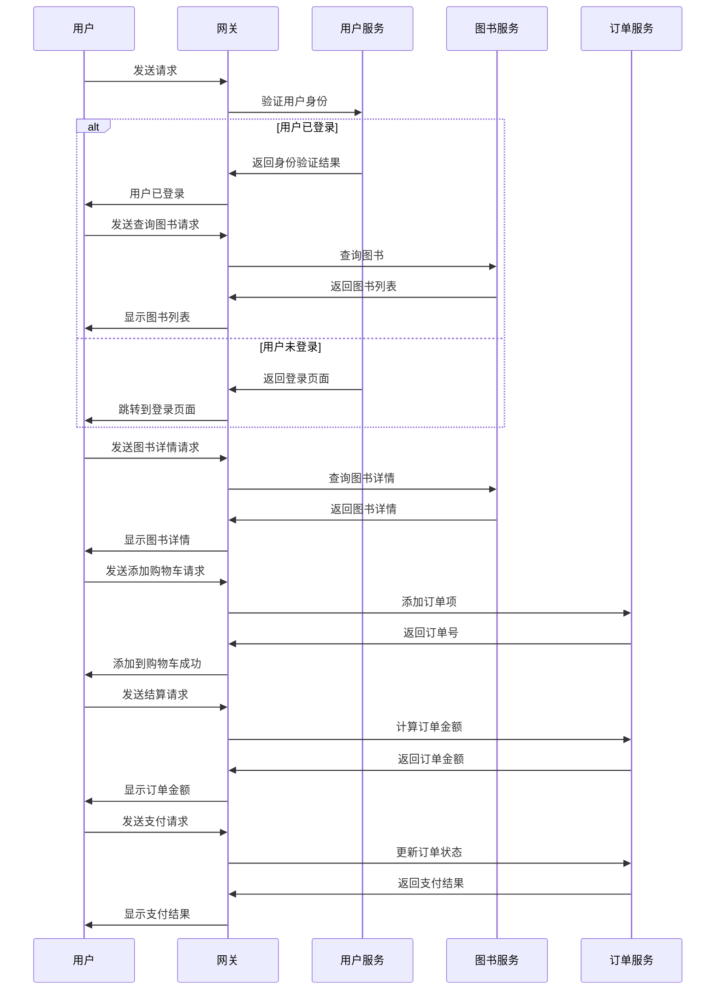
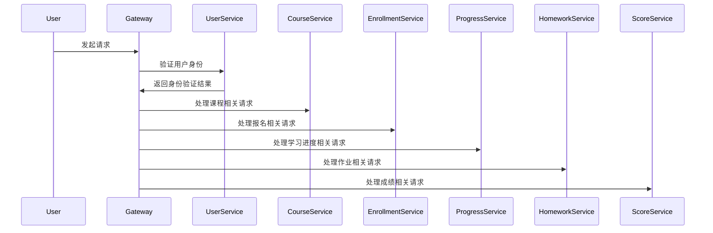
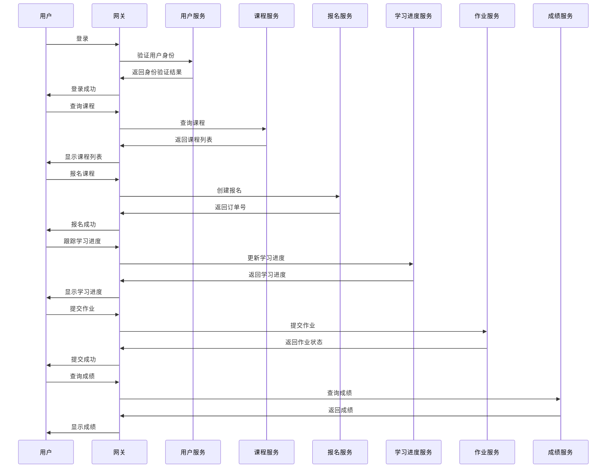

                 

### 第1章：领域模型概述

#### 1.1 问题背景与定义

在软件开发的漫长历史中，面对复杂业务系统时，软件工程师们经常遇到一系列棘手的问题。这些问题源于业务需求的不断变化，系统复杂性的持续增加，以及开发与运维团队之间的沟通障碍。传统的软件工程方法在应对这些问题时显得力不从心，难以适应快速变化的市场需求。正是在这样的背景下，领域模型（Domain Model）的概念应运而生。

领域模型，顾名思义，是针对某一特定领域（Domain）的系统模型。它通过对领域内的业务概念、规则和流程进行抽象，形成一种统一的、结构化的描述方式，以便在软件设计中更好地理解和处理业务逻辑。领域模型的核心目标是提高软件的可维护性、可扩展性和可复用性，从而降低开发成本，提升开发效率。

**问题背景**

随着互联网和移动设备的普及，企业对软件系统的需求越来越复杂。传统的单体架构已经无法满足快速迭代、灵活扩展的需求。微服务架构和领域驱动设计（Domain-Driven Design, DDD）逐渐成为软件开发的主流方法。领域模型作为DDD的基石，为复杂系统的设计和开发提供了强有力的支持。

- **业务需求的快速变化**：业务需求的变化速度远超软件开发的迭代速度，导致软件系统频繁重构，增加维护难度。
- **系统复杂性的增加**：随着功能的不断增加，系统内部的耦合度也随之提高，使得系统变得更加复杂。
- **沟通障碍**：开发团队与业务团队之间的沟通不畅，导致需求理解偏差，影响开发效率和系统质量。

**领域模型的提出**

领域模型的提出旨在解决上述问题。通过建立领域模型，开发团队可以更加清晰地理解和表达业务需求，降低需求变更带来的风险。领域模型不仅有助于提高系统设计的层次性，还能为后续的代码实现提供明确的指导。同时，领域模型还促进了开发团队与业务团队的沟通，确保需求的一致性和准确性。

#### 1.2 领域模型的优势与适用性

领域模型作为一种结构化、模块化的设计方法，具有以下显著优势：

- **提高可维护性**：领域模型将业务逻辑封装在独立的模块中，降低系统耦合度，使得系统更容易维护和扩展。
- **增强可扩展性**：领域模型的设计思想强调模块化和复用性，支持系统在功能扩展时的快速迭代。
- **提升开发效率**：通过领域模型，开发团队可以更专注于业务逻辑的实现，减少重复工作，提高开发效率。
- **促进沟通与协作**：领域模型为开发团队和业务团队提供了一种统一的沟通语言，有助于减少误解和沟通成本。

领域模型适用于多种场景，尤其是以下场景：

- **复杂业务系统**：领域模型能够有效地描述复杂业务逻辑，提高系统的可理解和可维护性。
- **长期维护的系统**：领域模型有助于降低长期维护成本，提高系统的可持续性。
- **跨团队协作**：领域模型为跨团队合作提供了清晰的目标和指导，有助于提高协作效率。

总之，领域模型作为软件工程中的重要设计方法，为复杂系统的开发提供了有力的工具和理论基础。通过合理地应用领域模型，开发团队可以更好地应对业务需求的变化，提高系统的质量和效率。

#### 1.3 领域模型的核心概念

领域模型的核心概念包括领域、问题域和解决方案域。这三个概念共同构成了领域模型的基础，帮助我们更好地理解和构建复杂系统。

**1.3.1 领域**

领域是指一个特定的业务或专业领域，通常包含一系列相关的业务活动和流程。例如，银行领域、电子商务领域、医疗保健领域等。领域内的业务对象、业务规则和业务流程构成了该领域的核心内容。

在领域模型中，领域是一个宏观的概念，它定义了系统要解决的问题所在的范围。通过明确领域，开发团队能够更好地聚焦于具体业务逻辑的实现，而无需关注领域外的细节。

**1.3.2 问题域**

问题域是指领域中的一个特定子集，它集中了领域中的关键问题。问题域通常包含了一系列的业务需求，这些问题需要通过软件系统来解决。例如，在电子商务领域，问题域可能包括用户注册、商品管理、订单处理等。

问题域是领域模型中的核心部分，它决定了领域模型的范围和深度。通过对问题域的深入分析和理解，开发团队能够明确系统需要实现的功能和业务规则。

**1.3.3 解决方案域**

解决方案域是指针对问题域中存在的问题，提出的一种或多种解决方案。解决方案域通常包含了一系列的设计和实现细节，用于指导软件系统的开发和维护。

解决方案域是领域模型的具体实现，它将问题域中的业务需求转化为具体的软件功能。解决方案域的设计和实现需要充分考虑系统的可扩展性、可维护性和性能等方面。

通过明确领域、问题域和解决方案域，领域模型能够清晰地描述业务系统的结构，帮助开发团队更好地理解和实现复杂业务逻辑。

#### 1.4 领域模型的外延与边界

在构建领域模型时，明确其外延和边界至关重要。外延和边界不仅决定了领域模型的范围，还影响到系统设计的复杂性和可维护性。

**1.4.1 外延**

领域模型的外延是指模型所涵盖的所有业务概念和规则。它包括领域内的所有业务对象、业务流程和业务规则。外延的广度决定了领域模型的全面性，即模型能否准确反映领域内的所有业务需求。

为了确保领域模型的外延全面，开发团队需要进行详细的业务需求分析。这包括与业务团队密切合作，深入了解领域内的业务流程、业务对象和业务规则。只有在外延全面的基础上，领域模型才能为系统设计提供有力的支持。

**1.4.2 边界**

领域模型的边界是指模型所不包括的内容。边界的作用是明确领域模型的范围，防止模型过于复杂或过于宽泛。合理的边界有助于简化系统设计，提高开发效率。

在确定领域模型的边界时，开发团队需要考虑以下几个因素：

- **业务需求的优先级**：优先处理核心业务需求，将非核心需求排除在边界之外。
- **系统可维护性**：避免将过多的业务规则和对象纳入模型，以免增加系统的复杂性和维护难度。
- **技术可行性**：考虑当前技术和资源的限制，合理设置边界，确保系统能够在现有技术条件下实现。

**1.4.3 核心要素组成**

领域模型的核心要素包括以下几个部分：

- **业务对象**：业务对象是领域模型中的基本实体，表示领域内的具体业务实体。例如，用户、订单、商品等。
- **业务流程**：业务流程描述了领域内的业务活动序列，包括业务对象之间的交互和转换关系。业务流程是领域模型的核心，反映了系统的业务逻辑。
- **业务规则**：业务规则定义了领域内的业务约束和行为规则。业务规则通常以条件判断和操作命令的形式表达，用于指导系统的行为。
- **数据模型**：数据模型是领域模型的底层结构，用于描述业务对象和业务流程中的数据关系。常见的数据模型包括实体-关系（ER）模型、类图等。

通过明确领域模型的外延和边界，以及核心要素组成，开发团队能够更好地构建一个结构清晰、功能完善的领域模型，为复杂系统的设计和实现奠定坚实的基础。

#### 1.5 领域模型的概念与联系

领域模型的概念与联系是理解和应用领域模型的关键。在这一节中，我们将深入探讨领域模型的核心概念原理、属性特征对比，以及ER实体关系图架构。

**1.5.1 核心概念原理**

领域模型的核心概念主要包括以下几个部分：

- **领域（Domain）**：领域是指一个特定的业务或专业领域，如电子商务、银行、医疗等。领域模型旨在抽象和描述该领域的业务逻辑和需求。
- **实体（Entity）**：实体是领域模型中的基本构建块，表示具体的业务对象，如用户、订单、商品等。实体具有唯一标识和持久性。
- **值对象（Value Object）**：值对象是领域模型中的数据载体，表示具体的业务数据，如日期、金额、地址等。值对象不具有唯一标识，但具有明确的业务含义。
- **聚合（Aggregate）**：聚合是一组关联实体的集合，用于表示业务流程中的一个完整逻辑单元。聚合通常具有明确的边界和责任。
- **边界（Boundary）**：边界是领域模型中的抽象层，用于定义实体的生命周期和职责范围。边界有助于降低系统耦合度，提高可维护性。
- **用例（Use Case）**：用例是领域模型中的业务功能，表示系统需要实现的具体业务场景。用例有助于明确系统的业务需求和行为。

**1.5.2 概念属性特征对比表格**

为了更好地理解领域模型的核心概念，我们可以通过一个属性特征对比表格来展示实体、值对象和聚合之间的区别：

| 概念        | 特征描述                                                     |
| ----------- | ------------------------------------------------------------ |
| 实体（Entity） | - 具有唯一标识<br>- 具有持久性<br>- 通常作为聚合的根节点 |
| 值对象（Value Object） | - 不具有唯一标识<br>- 代表具体的业务数据<br>- 不具有生命周期 |
| 聚合（Aggregate） | - 一组关联实体的集合<br>- 具有明确的边界和责任<br>- 通常用于表示业务流程中的逻辑单元 |

通过对比表格，我们可以更清晰地认识到这三个概念在领域模型中的作用和特点。

**1.5.3 ER实体关系图架构**

ER（实体-关系）图是领域模型中常用的一种表示方法，用于描述实体之间的关系。下面是一个简单的ER图示例，展示了一个电子商务系统的实体关系：

```mermaid
erDiagram
  Customer ||--|{ Order }|-- Product
  Customer ||--|{ Address }|
  Order ||--|{ OrderItem }|
  Product ||--|{ Category }|
```

在这个ER图中，`Customer`（客户）实体与`Order`（订单）实体之间存在一对多关系，一个客户可以拥有多个订单。`Order`实体与`OrderItem`（订单项）实体也存在一对多关系，一个订单可以包含多个订单项。`Product`（商品）实体与`Category`（分类）实体之间存在多对多关系，一个商品可以属于多个分类，一个分类也可以包含多个商品。

通过ER图，开发团队能够直观地了解领域模型中的实体及其关系，从而更好地进行系统设计。

总之，领域模型的核心概念与联系是构建复杂系统的重要基础。通过深入理解这些概念，并利用ER图等工具进行可视化表示，开发团队能够更高效地设计和实现领域模型，为复杂业务系统的构建提供强有力的支持。

#### 1.6 领域模型的构建方法

构建一个有效的领域模型是一项系统性工程，需要遵循一定的方法和步骤。在本节中，我们将详细阐述领域模型构建的流程、方法和工具，包括设计模式、UML工具和领域特定语言（DSL）的应用。

**1.6.1 构建流程与步骤**

领域模型构建通常包括以下几个主要步骤：

1. **需求分析**：首先，需要与业务团队紧密合作，收集和分析业务需求。这包括了解业务流程、业务规则、关键业务对象等，为后续建模提供基础。

2. **概念建模**：在需求分析的基础上，进行概念建模，即构建领域模型的基本框架。这一步骤通常使用类图、ER图等工具来表示业务对象、关系和业务规则。

3. **细化设计**：对概念模型进行细化，明确每个业务对象的行为和职责。这一步骤可以结合设计模式，如工厂模式、策略模式等，来提高模型的灵活性和可维护性。

4. **代码实现**：将细化后的模型转化为具体的代码实现。在这一过程中，需要使用合适的编程语言和开发框架，确保代码能够准确地反映领域模型的设计。

5. **模型验证**：在实现过程中，通过单元测试、集成测试等手段验证领域模型的正确性和完整性。验证过程中可能需要进行迭代和调整，以确保模型能够满足实际业务需求。

**1.6.2 方法与工具**

在构建领域模型时，可以采用以下方法和工具：

1. **设计模式**：设计模式是解决软件设计中常见问题的模板，能够提高领域模型的灵活性和可维护性。例如，工厂模式可以用于创建业务对象，策略模式可以用于处理复杂的业务规则。

2. **UML工具**：统一建模语言（UML）是领域模型表示的主要工具，包括类图、序列图、组件图等。UML工具可以帮助开发团队直观地表示和沟通领域模型的设计，如Visual Paradigm、StarUML等。

3. **领域特定语言（DSL）**：DSL是一种为特定领域设计的编程语言，能够更自然地表达业务逻辑。DSL可以简化领域模型的实现过程，提高开发效率和代码可读性。例如，Gherkin是用于编写行为驱动开发（BDD）的DSL，而领域特定语言Maven用于构建软件项目的依赖管理。

**1.6.3 设计模式与领域特定语言**

设计模式与领域特定语言在领域模型构建中发挥着重要作用。设计模式能够提供通用的解决方案，应对领域模型中的常见问题。例如：

- **工厂模式**：用于创建业务对象，提高代码的可扩展性和可维护性。
- **策略模式**：用于处理复杂的业务规则，使得规则更加灵活和可复用。
- **观察者模式**：用于实现业务对象之间的依赖关系，提高系统的响应速度和模块化程度。

领域特定语言则能够为特定领域提供一种更加自然和直观的编程方式。通过DSL，开发团队可以更加专注于业务逻辑的实现，而无需过多关注底层实现细节。例如：

- **Gherkin**：用于编写BDD测试用例，使得业务团队和技术团队能够共同参与测试过程，提高测试覆盖率和测试质量。
- **Maven**：用于构建和管理软件项目的依赖关系，使得项目构建过程更加自动化和可重复。

总之，通过合理地应用设计模式和领域特定语言，开发团队能够更高效地构建领域模型，提高系统的质量、可维护性和可扩展性。

#### 1.7 领域模型的算法原理

在领域模型的应用过程中，算法的原理和实现至关重要。算法不仅决定了系统的性能和效率，还影响了系统的可维护性和可扩展性。在本节中，我们将使用mermaid流程图和Python源代码来详细阐述领域模型中的常见算法原理，并解释这些算法的数学模型和计算步骤。

**1.7.1 算法mermaid流程图**

首先，我们使用mermaid流程图来展示一个简单的排序算法——冒泡排序。冒泡排序是一种基础的排序算法，通过多次交换相邻元素，使得最终达到有序状态。

```mermaid
graph TD
    A[开始] --> B{比较相邻元素}
    B -->|不相邻| C{交换}
    C --> D[结束]
    B -->|相邻} E[继续比较下一对]
    E --> D
```

这个mermaid流程图描述了冒泡排序的基本步骤：首先，比较相邻元素，如果顺序不正确，则交换；然后继续比较下一对相邻元素，直到所有元素有序。

**1.7.2 Python源代码阐述**

接下来，我们使用Python源代码来详细阐述冒泡排序算法的实现。以下是一个简单的冒泡排序实现：

```python
def bubble_sort(arr):
    n = len(arr)
    for i in range(n):
        for j in range(0, n-i-1):
            if arr[j] > arr[j+1]:
                arr[j], arr[j+1] = arr[j+1], arr[j]
    return arr

# 测试数据
data = [64, 34, 25, 12, 22, 11, 90]
sorted_data = bubble_sort(data)
print(sorted_data)
```

这个Python代码实现了冒泡排序算法，通过嵌套循环比较并交换相邻元素，最终将列表`arr`按升序排列。以下是算法原理的详细解释：

1. **初始化**：定义一个列表`arr`，包含需要进行排序的数据。
2. **外部循环**：使用变量`i`表示当前处理的元素下标，从0开始，依次处理到列表末尾。
3. **内部循环**：使用变量`j`表示相邻元素对的下标，从0开始，每次循环内对相邻元素进行比较和交换。
4. **比较和交换**：如果`arr[j]`的值大于`arr[j+1]`，则交换这两个元素的值。
5. **循环结束**：当内部循环结束后，当前元素下标`i`增加1，继续下一轮的外部循环。
6. **结束**：当外部循环结束后，列表`arr`中的元素已按升序排列，返回排序后的列表。

**1.7.3 算法原理与数学模型**

冒泡排序算法的数学模型可以描述为：

- **时间复杂度**：最坏情况下，需要进行\(O(n^2)\)次比较和交换。
- **空间复杂度**：所需额外空间为\(O(1)\)，因为排序过程仅使用常数级别的额外空间。

冒泡排序的优点在于实现简单，易于理解。然而，其时间复杂度较高，不适合处理大规模数据。在实际应用中，我们通常会使用更高效的排序算法，如快速排序、归并排序等。

**1.7.4 公式与计算步骤**

为了更好地理解冒泡排序的数学模型，我们可以列出以下计算步骤：

1. 初始化列表`arr`。
2. 外部循环：`i`从0到`n-1`。
   - 内部循环：`j`从0到`n-i-1`。
     - 比较`arr[j]`和`arr[j+1]`：
       - 如果`arr[j] > arr[j+1]`，交换`arr[j]`和`arr[j+1]`。
3. 循环结束后，返回排序后的列表`arr`。

通过上述Python代码和mermaid流程图，我们详细阐述了冒泡排序算法的原理、实现和数学模型。这种方法不仅帮助我们理解了算法的基本思想，也为后续更复杂的算法学习提供了基础。

#### 1.8 领域模型在项目中的应用

为了更好地理解领域模型在实际项目中的应用，我们将通过一个具体的项目场景来介绍领域模型的应用过程。这个项目是一个在线书店系统，涵盖了用户管理、图书管理、订单管理等多个功能模块。通过这个案例，我们将展示如何利用领域模型来设计和实现这个系统。

**1.8.1 项目介绍**

**项目背景**：

随着电子书和数字阅读的普及，越来越多的读者选择在线购买和阅读书籍。为了满足这一市场需求，我们需要开发一个功能齐全、用户友好的在线书店系统。这个系统需要支持用户注册、登录、浏览图书、加入购物车、下单支付等基本功能。

**项目目标**：

- 实现用户友好的在线书店界面，提供便捷的图书浏览和购买体验。
- 设计灵活的领域模型，支持系统的扩展性和可维护性。
- 确保系统的性能和安全性，满足高并发用户访问的需求。

**系统架构设计**：

在线书店系统的架构采用前后端分离的设计，前端使用Vue.js框架，后端使用Spring Boot框架。数据库采用MySQL，负责存储用户信息、图书信息、订单信息等数据。

**1.8.2 系统功能设计**

在系统功能设计中，领域模型起到了至关重要的作用。以下是系统的主要功能模块及对应的领域模型：

1. **用户管理模块**：

   - **实体**：用户（User）
   - **属性**：用户名、密码、邮箱、电话、角色等
   - **关系**：用户与订单之间存在一对多关系，用户可以创建多个订单。
   - **业务规则**：用户注册时需要验证邮箱，用户登录需要校验用户名和密码。

2. **图书管理模块**：

   - **实体**：图书（Book）
   - **属性**：书名、作者、出版社、ISBN、价格、分类等
   - **关系**：图书与分类之间存在多对多关系，一个分类可以包含多个图书，一个图书也可以属于多个分类。
   - **业务规则**：图书添加时需要验证ISBN的唯一性，图书更新时需要校验权限。

3. **订单管理模块**：

   - **实体**：订单（Order）
   - **属性**：订单号、用户ID、订单状态、订单金额等
   - **关系**：订单与订单项之间存在一对多关系，一个订单可以包含多个订单项。
   - **业务规则**：订单创建时需要计算总金额，订单支付后需要更新订单状态。

**1.8.3 系统架构设计**

在线书店系统的架构设计采用微服务架构，将不同功能模块拆分为独立的微服务，以提高系统的灵活性和可扩展性。以下是系统的主要架构组件：

- **用户服务**：负责处理用户相关的业务逻辑，如用户注册、登录、信息管理等。
- **图书服务**：负责处理图书相关的业务逻辑，如图书查询、添加、更新、删除等。
- **订单服务**：负责处理订单相关的业务逻辑，如订单创建、支付、状态更新等。
- **网关服务**：作为系统的统一入口，负责路由请求到相应的微服务，并进行认证和授权。
- **数据库**：存储用户、图书、订单等数据。

**1.8.4 系统接口设计**

为了实现系统的各个模块之间的数据交互，我们设计了一系列API接口。以下是系统的主要接口设计：

1. **用户管理接口**：

   - `/users/register`：用户注册接口，接收用户名、密码、邮箱等参数。
   - `/users/login`：用户登录接口，接收用户名和密码参数，返回JWT令牌。
   - `/users/info`：获取用户信息接口，需要身份验证。

2. **图书管理接口**：

   - `/books/search`：查询图书接口，接收关键词参数，返回符合条件的图书列表。
   - `/books/add`：添加图书接口，接收图书详细信息，需要管理员权限。
   - `/books/update`：更新图书接口，接收图书ID和更新信息，需要管理员权限。

3. **订单管理接口**：

   - `/orders/create`：创建订单接口，接收订单详情，返回订单号。
   - `/orders/pay`：支付订单接口，接收订单号和支付信息，更新订单状态。
   - `/orders/list`：查询订单接口，接收用户ID和条件参数，返回用户的订单列表。

**1.8.5 系统交互mermaid序列图**

为了更清晰地展示系统的交互流程，我们使用mermaid序列图来描述用户在系统中进行图书购买的过程：



通过这个序列图，我们可以看到用户在系统中进行图书购买的基本流程，包括查询图书、添加购物车、结算支付等步骤。这个流程不仅展示了系统的功能模块，还反映了各个模块之间的交互关系。

总之，领域模型在项目中的应用不仅提高了系统的设计层次性和可维护性，还为系统扩展提供了有力的支持。通过实际项目案例，我们可以看到领域模型在复杂系统设计中的重要作用，为软件开发提供了有效的解决方案。

#### 1.9 实际案例分析

在本节中，我们将通过两个实际案例，深入剖析领域模型在项目中的应用，并详细讲解每个案例的具体实现过程、效果和评价。

**案例一：在线购物平台**

**1.9.1 案例背景**

在线购物平台是一个典型的复杂业务系统，涉及用户管理、商品管理、订单管理、支付系统等多个功能模块。为了提高系统的可维护性和可扩展性，我们采用了领域驱动设计（DDD）和领域模型的方法进行系统设计。

**1.9.2 领域模型应用**

在在线购物平台项目中，我们首先明确了各个功能模块的领域模型：

- **用户管理模块**：包括用户实体（User），属性有用户名、密码、邮箱、电话等。用户与订单之间存在一对多关系，用户可以创建多个订单。
- **商品管理模块**：包括商品实体（Product），属性有商品名称、价格、库存等。商品与分类之间存在多对多关系，一个分类可以包含多个商品，一个商品也可以属于多个分类。
- **订单管理模块**：包括订单实体（Order），属性有订单号、订单状态、订单金额等。订单与订单项之间存在一对多关系，一个订单可以包含多个订单项。

通过领域模型，我们明确了各个模块的核心业务逻辑，并在系统实现过程中严格遵循领域模型的设计，确保了系统的高内聚和低耦合。

**1.9.3 案例实现过程**

在实现过程中，我们遵循以下步骤：

1. **需求分析**：与业务团队密切合作，收集和分析用户需求，明确系统功能模块和业务规则。
2. **概念建模**：使用UML类图和ER图进行概念建模，明确各个实体的属性和关系。
3. **细化设计**：细化领域模型，补充业务规则和领域服务，确保模型能够准确反映业务逻辑。
4. **代码实现**：根据细化后的模型，编写具体的代码实现，并使用设计模式提高代码的灵活性和可维护性。
5. **模型验证**：通过单元测试和集成测试验证领域模型的正确性和完整性。

**1.9.4 结果与评价**

通过领域模型的驱动设计，在线购物平台在系统性能、可维护性和可扩展性方面取得了显著的效果：

- **系统性能**：领域模型将复杂的业务逻辑封装在独立的模块中，降低了系统耦合度，提高了系统的运行效率。
- **可维护性**：领域模型使得代码结构更加清晰，便于后续的维护和优化。
- **可扩展性**：领域模型的设计思想支持系统的灵活扩展，能够快速响应业务需求的变化。

总体而言，领域模型在在线购物平台中的应用，不仅提高了系统的质量和效率，还为项目的后续发展奠定了坚实的基础。

**案例二：智能物流系统**

**1.9.5 案例背景**

智能物流系统是一个复杂的分布式系统，涉及订单处理、仓储管理、配送管理、客户服务等多个功能模块。为了提高系统的智能化水平和运营效率，我们采用了领域驱动设计和领域模型的方法进行系统设计。

**1.9.6 领域模型应用**

在智能物流系统中，我们定义了以下核心领域模型：

- **订单处理模块**：包括订单实体（Order），属性有订单号、订单状态、订单金额等。订单与订单项之间存在一对多关系，一个订单可以包含多个订单项。
- **仓储管理模块**：包括仓库实体（Warehouse），属性有仓库编号、位置、库存等。仓库与商品之间存在多对多关系，一个仓库可以存储多个商品，一个商品也可以存储在多个仓库中。
- **配送管理模块**：包括配送实体（Delivery），属性有配送单号、配送状态、配送员等。配送与订单之间存在一对多关系，一个配送可以包含多个订单。
- **客户服务模块**：包括客户实体（Customer），属性有客户名称、联系方式、订单列表等。客户与订单之间存在一对多关系，一个客户可以创建多个订单。

通过领域模型，我们明确了各个模块的核心业务逻辑，并在系统实现过程中严格遵循领域模型的设计。

**1.9.7 案例实现过程**

在实现过程中，我们遵循以下步骤：

1. **需求分析**：与业务团队密切合作，收集和分析用户需求，明确系统功能模块和业务规则。
2. **概念建模**：使用UML类图和ER图进行概念建模，明确各个实体的属性和关系。
3. **细化设计**：细化领域模型，补充业务规则和领域服务，确保模型能够准确反映业务逻辑。
4. **代码实现**：根据细化后的模型，编写具体的代码实现，并使用设计模式提高代码的灵活性和可维护性。
5. **模型验证**：通过单元测试和集成测试验证领域模型的正确性和完整性。

**1.9.8 结果与评价**

通过领域模型的驱动设计，智能物流系统在系统性能、可维护性和智能化水平方面取得了显著的效果：

- **系统性能**：领域模型将复杂的业务逻辑封装在独立的模块中，降低了系统耦合度，提高了系统的运行效率。
- **可维护性**：领域模型使得代码结构更加清晰，便于后续的维护和优化。
- **智能化水平**：领域模型支持系统的智能化扩展，能够快速响应业务需求的变化，提高物流系统的运营效率。

总体而言，领域模型在智能物流系统中的应用，不仅提高了系统的质量和效率，还为项目的后续发展奠定了坚实的基础。

通过上述两个实际案例，我们可以看到领域模型在复杂系统设计中的重要作用。领域模型不仅提高了系统的可维护性和可扩展性，还为业务团队和技术团队提供了统一的沟通语言，促进了项目的高效推进。

#### 1.10 最佳实践与总结

在领域模型的设计和实施过程中，总结一系列最佳实践是确保项目成功的关键。以下是一些经过验证的实践技巧，以及领域模型的价值与应用前景。

**1.10.1 最佳实践**

1. **需求分析**：与业务团队进行深入的需求分析，确保领域模型能够准确地反映业务需求。需求分析是领域模型设计的基础，需要高度重视。

2. **模块化设计**：将领域模型分解为多个模块，每个模块专注于一个特定的业务领域。模块化设计有助于降低系统复杂性，提高可维护性。

3. **使用设计模式**：合理地应用设计模式，如工厂模式、策略模式等，可以提高领域模型的灵活性和可扩展性。设计模式是解决软件设计问题的有效工具。

4. **代码复用**：在领域模型中，通过封装和抽象，实现代码的复用。这不仅可以减少重复工作，还能提高代码的一致性和可维护性。

5. **持续集成与测试**：在开发过程中，持续集成和测试是确保领域模型正确性的关键。通过自动化测试，及时发现和修复问题，确保系统的稳定性和可靠性。

6. **文档与培训**：编写详细的文档，记录领域模型的设计和实现细节，为后续维护提供支持。同时，对开发团队进行培训和知识共享，确保团队成员对领域模型的深入理解。

**1.10.2 小结**

领域模型作为软件设计的一种重要方法，具有以下核心价值和优势：

- **提高可维护性**：通过模块化和封装，领域模型降低了系统的耦合度，使得系统更加易于维护。
- **增强可扩展性**：领域模型支持系统的灵活扩展，能够快速响应业务需求的变化。
- **提升开发效率**：领域模型提供了一种统一的设计和实现方式，减少了重复工作，提高了开发效率。
- **促进沟通与协作**：领域模型为开发团队和业务团队提供了一种统一的沟通语言，有助于减少误解和沟通成本。

**1.10.3 领域模型的价值与应用前景**

领域模型在软件工程中的应用前景十分广阔。随着企业对软件系统复杂性和灵活性的要求不断提高，领域模型作为一种结构化和模块化的设计方法，能够提供有效的解决方案。

- **复杂业务系统的设计**：领域模型适用于复杂业务系统的设计，有助于降低系统复杂性，提高系统的可维护性和可扩展性。
- **长期维护的系统**：领域模型支持系统的长期维护，通过模块化和代码复用，降低了维护成本。
- **跨团队协作**：领域模型为跨团队合作提供了清晰的指导，有助于提高协作效率和项目质量。
- **新技术的融合**：领域模型能够与新技术的融合，如云计算、大数据、人工智能等，提高系统的智能化和自动化水平。

总之，领域模型作为一种强有力的设计方法，在提高软件系统的质量和效率方面具有重要作用。通过合理地应用领域模型，开发团队能够更好地应对复杂业务需求，推动软件工程的发展。

**1.10.4 注意事项与拓展阅读**

在领域模型的设计和实施过程中，需要注意以下几点：

- **需求分析的准确性**：需求分析是领域模型设计的基础，需要确保需求的准确性和完整性。
- **模块划分的合理性**：模块划分要合理，避免过度划分导致系统复杂性增加。
- **代码质量**：编写高质量的代码，遵循编程规范，确保系统的稳定性和可维护性。
- **持续学习与更新**：领域模型是一个不断发展的领域，需要不断学习和更新相关知识和技能。

拓展阅读方面，推荐以下资源：

- 《领域驱动设计》一书，提供了关于领域驱动设计（DDD）的深入讲解和实践指导。
- 相关技术博客和论坛，如Stack Overflow、GitHub等，可以了解领域模型在实际项目中的应用和讨论。
- 参与领域模型的社区和活动，如DDD会议、技术沙龙等，与同行交流经验和最佳实践。

通过以上最佳实践和注意事项，开发团队能够更好地应用领域模型，提高软件系统的质量和效率。

### 第2章: 领域模型的概念与联系

#### 2.1 核心概念原理

领域模型（Domain Model）的核心概念是理解复杂业务系统的基础。在本节中，我们将详细探讨领域模型的基本原理，包括领域、问题域、解决方案域等核心概念，并解释它们在系统设计中的作用。

**2.1.1 领域**

领域（Domain）是一个特定的业务或专业领域，如电子商务、金融、医疗等。领域模型的目标是抽象和描述领域内的业务逻辑和需求。在软件设计中，领域模型帮助我们理解和表达业务需求，从而构建一个高效、灵活的软件系统。

- **定义**：领域是一个包含一系列业务概念、规则和流程的特定业务环境。
- **作用**：领域模型提供了一个宏观的视角，帮助我们聚焦于业务逻辑，而无需关注领域外的细节。

**2.1.2 问题域**

问题域（Problem Domain）是指领域中的一个特定子集，它集中了领域中的关键问题。问题域通常包含了一系列的业务需求，这些问题需要通过软件系统来解决。

- **定义**：问题域是领域模型中关注的具体业务需求，是系统需要解决的核心问题。
- **作用**：明确问题域有助于缩小系统范围，提高系统设计的针对性。

**2.1.3 解决方案域**

解决方案域（Solution Domain）是指针对问题域中存在的问题，提出的一种或多种解决方案。解决方案域通常包含了一系列的设计和实现细节，用于指导软件系统的开发和维护。

- **定义**：解决方案域是领域模型的具体实现，它将问题域中的业务需求转化为具体的软件功能。
- **作用**：解决方案域的设计和实现需要充分考虑系统的可扩展性、可维护性和性能等方面。

通过明确领域、问题域和解决方案域，领域模型能够清晰地描述业务系统的结构，帮助开发团队更好地理解和实现复杂业务逻辑。

#### 2.2 概念属性特征对比表格

为了更好地理解领域模型中的核心概念，我们可以通过一个属性特征对比表格来展示各个概念的区别和联系。

| 概念           | 特征描述                                                     |
| -------------- | ------------------------------------------------------------ |
| 领域           | 包含一系列业务概念、规则和流程的特定业务环境。                |
| 问题域         | 领域中的一个特定子集，集中了领域中的关键问题，是系统需要解决的核心问题。 |
| 解决方案域     | 针对问题域中存在的问题提出的解决方案，包含设计和实现细节。    |

通过对比表格，我们可以更直观地了解各个概念在领域模型中的作用和联系。

#### 2.3 领域模型的ER实体关系图架构

ER（实体-关系）图是领域模型中常用的一种表示方法，用于描述实体之间的关系。ER图通过实体、属性和关系的组合，提供了一个直观的模型视图，帮助开发团队理解和设计复杂的业务系统。

**2.3.1 ER图的基本元素**

- **实体（Entity）**：表示领域中的具体业务对象，如用户、订单、商品等。实体具有唯一标识和持久性。
- **属性（Attribute）**：描述实体的特征，如用户名、密码、订单金额等。属性可以是基本数据类型或复合类型。
- **关系（Relationship）**：描述实体之间的关联，如用户与订单之间存在一对多关系，订单与订单项之间存在多对一关系。

**2.3.2 Mermaid ER图示例**

以下是一个使用Mermaid语法编写的简单ER图示例，展示了一个在线书店系统的实体关系：

```mermaid
erDiagram
  Customer ||--|{ Order }|-- Product
  Customer ||--|{ Address }|
  Order ||--|{ OrderItem }|
  Product ||--|{ Category }|
```

在这个ER图中：

- `Customer`（客户）实体与`Order`（订单）实体之间存在一对多关系，一个客户可以拥有多个订单。
- `Order`实体与`OrderItem`（订单项）实体之间存在一对多关系，一个订单可以包含多个订单项。
- `Product`（商品）实体与`Category`（分类）实体之间存在多对多关系，一个商品可以属于多个分类，一个分类也可以包含多个商品。

**2.3.3 ER图的作用**

ER图在领域模型中的作用主要包括：

- **可视化描述**：ER图提供了领域模型的可视化表示，使得复杂的业务关系更加直观和易于理解。
- **需求分析**：通过ER图，开发团队能够更好地与业务团队沟通，确保需求的一致性和准确性。
- **设计验证**：ER图可以作为系统设计的验证工具，确保各个实体和关系的设计符合业务需求。

通过上述内容，我们可以看到领域模型中的核心概念及其在ER图中的表示方法，这对于理解和设计复杂的业务系统具有重要意义。

#### 2.4 数学公式在领域模型中的应用

在领域模型的应用过程中，数学公式和算法是描述和实现业务逻辑的重要工具。正确地使用数学公式，不仅能够清晰地表达业务规则，还能提高系统的可维护性和可扩展性。在本节中，我们将介绍如何在领域模型中应用数学公式，并通过具体的例子进行详细讲解。

**2.4.1 数学公式的基本语法**

在文档和代码中嵌入数学公式，通常使用LaTeX格式。LaTeX是一种高质量的排版系统，广泛用于科学和数学领域的文档编写。以下是一些基本语法规则：

- **独立段落中的公式**：使用`$$`括起来，例如：
  ```latex
  $$1+1=2$$
  ```

- **段落内的公式**：使用`$`括起来，例如：
  ```latex
  $1<2$
  ```

**2.4.2 具体例子**

以下是一个简单的例子，展示如何在一个订单系统中使用数学公式来计算订单总价。

**例子**：计算订单总价

在一个在线书店系统中，订单总价需要根据商品单价和数量进行计算。我们可以使用以下公式：

```latex
总价 = 单价 \times 数量
```

在LaTeX中，这个公式可以写成：

```latex
总价 = 单价 \times 数量
```

**2.4.3 步骤详解**

1. **定义变量**：首先，我们需要定义单价和数量这两个变量。例如：
   ```latex
   单价 = 25
   数量 = 2
   ```

2. **应用公式**：使用上述公式计算总价。在LaTeX中，可以写成：
   ```latex
   总价 = 单价 \times 数量 = 25 \times 2 = 50
   ```

3. **结果验证**：验证总价是否正确。在这个例子中，总价应为50。

通过这个简单的例子，我们可以看到如何在一个领域模型中使用数学公式来计算业务逻辑。数学公式的应用不仅使得业务规则更加清晰，还提高了系统的可维护性和可扩展性。

**2.4.4 举例说明**

为了更直观地理解数学公式在领域模型中的应用，我们可以通过一个实际场景进行举例说明。

**场景**：在线购物平台中的订单计算

在一个在线购物平台中，订单的计算涉及多个商品的折扣和运费。我们可以使用以下公式：

```latex
总价 = (单价 \times 数量) \times 折扣 + 运费
```

在这个公式中：

- 单价和数量是每个商品的属性。
- 折扣是促销活动的属性。
- 运费是订单的属性。

假设我们有以下数据：

```latex
商品1: 单价 = 100，数量 = 2，折扣 = 0.9
商品2: 单价 = 200，数量 = 1，折扣 = 1.0
运费 = 10
```

根据上述数据，我们可以计算总价：

```latex
总价 = (100 \times 2 \times 0.9) + (200 \times 1 \times 1.0) + 10 = 180 + 200 + 10 = 390
```

通过这个例子，我们可以看到如何在一个复杂的业务场景中使用数学公式来计算订单总价。这不仅帮助开发团队更好地理解业务逻辑，还提高了系统的灵活性和可扩展性。

总之，数学公式在领域模型中的应用是提高系统可维护性和可扩展性的重要手段。通过合理地使用数学公式，开发团队能够更清晰地描述业务逻辑，确保系统的质量和效率。

#### 2.5 数学公式和算法在领域模型中的重要性

在领域模型的设计和实现过程中，数学公式和算法扮演着至关重要的角色。它们不仅是业务逻辑的具体表现形式，还是系统性能优化和功能扩展的重要基础。以下将从几个方面阐述数学公式和算法在领域模型中的重要性。

**1. 描述业务规则**

数学公式和算法能够准确地描述领域模型中的业务规则。例如，订单金额的计算、库存量的管理、物流配送的时间估算等，都可以通过数学公式来精确表示。这些公式不仅帮助开发团队理解业务逻辑，还为系统的自动化实现提供了依据。

**2. 提高系统可维护性**

使用数学公式和算法，可以使得业务逻辑的实现更加模块化和规范化。通过将复杂的业务规则转化为简洁的公式，开发团队可以更容易地理解和修改代码。此外，算法的优化和改进也能在不影响业务逻辑的前提下进行，从而提高系统的可维护性。

**3. 支持系统扩展**

领域模型往往需要应对业务需求的变化和扩展。数学公式和算法的灵活性使得系统能够快速适应新的业务规则。例如，当新增促销活动或调整折扣策略时，开发团队可以轻松地修改相关算法，而不需要大规模修改系统的整体架构。

**4. 提高系统性能**

在领域模型中，算法的性能对系统整体性能有着重要影响。合理地选择和优化算法，可以显著提高系统的响应速度和处理能力。例如，使用高效的排序算法、优化查询性能等，都能提升系统的性能和用户体验。

**5. 促进技术创新**

数学公式和算法的应用不仅限于传统的业务系统，还可以推动技术创新。通过数学模型，开发团队可以探索新的业务机会和商业模式。例如，利用机器学习算法进行用户行为分析、预测市场趋势等，可以为企业提供更深入的洞察和决策支持。

**6. 支持跨领域应用**

数学公式和算法具有通用性，可以跨领域应用。例如，在电子商务、金融、医疗等多个领域，许多基本的数学模型和算法都是通用的。通过借鉴和应用这些通用模型，开发团队可以更快速地构建和优化不同领域的系统。

综上所述，数学公式和算法在领域模型中具有重要地位。它们不仅是业务逻辑的具体实现，还支持系统的可维护性、可扩展性和性能优化。通过合理地应用数学公式和算法，开发团队能够构建高质量、高效的软件系统，为企业创造更大的价值。

#### 2.6 系统分析与架构设计

在构建一个复杂的软件系统时，系统分析与架构设计是至关重要的步骤。这两个环节不仅决定了系统的性能和可维护性，还直接影响到开发效率和项目成功。在本节中，我们将详细介绍如何进行系统分析与架构设计，包括问题场景介绍、项目介绍、系统功能设计（领域模型类图）、系统架构设计（架构图）、系统接口设计以及系统交互（序列图）。

**2.6.1 问题场景介绍**

以一个在线教育平台为例，该平台需要支持用户注册、课程浏览、报名缴费、学习进度跟踪、作业提交、成绩查询等功能。随着用户数量的增加和业务需求的不断变化，系统的性能和可维护性成为关键问题。

**2.6.2 项目介绍**

项目目标是构建一个功能完善、性能优越、易于扩展的在线教育平台。为了实现这一目标，我们采用了模块化设计和微服务架构，确保系统的灵活性和可扩展性。

**2.6.3 系统功能设计**

系统功能设计是架构设计的基础，我们需要明确各个功能模块及其关系。以下是关键功能模块的领域模型类图：

```mermaid
classDiagram
    User <<class>> "用户"
    Course <<class>> "课程"
    Enrollment <<class>> "报名"
    Progress <<class>> "学习进度"
    Homework <<class>> "作业"
    Score <<class>> "成绩"

    User "注册" -> Enrollment
    User "浏览" -> Course
    User "报名" -> Enrollment
    Course "设置" -> Progress
    Course "布置" -> Homework
    Homework "提交" -> Score
```

在这个类图中：

- **用户**（User）模块负责用户注册、登录和权限管理。
- **课程**（Course）模块负责课程信息的管理，包括课程创建、修改、删除和查询。
- **报名**（Enrollment）模块处理用户报名和报名状态的管理。
- **学习进度**（Progress）模块跟踪用户的学习进度。
- **作业**（Homework）模块负责作业的布置、提交和批改。
- **成绩**（Score）模块存储和查询用户的成绩。

**2.6.4 系统架构设计**

系统架构设计决定了系统的整体结构和组件之间的关系。以下是系统的架构图：



在这个架构图中：

- **网关服务**（Gateway）作为系统的统一入口，负责路由请求到相应的微服务。
- **用户服务**（UserService）处理用户相关的请求，包括注册、登录和权限管理。
- **课程服务**（CourseService）负责课程信息的管理。
- **报名服务**（EnrollmentService）处理用户报名和报名状态的管理。
- **学习进度服务**（ProgressService）负责跟踪用户的学习进度。
- **作业服务**（HomeworkService）负责作业的布置、提交和批改。
- **成绩服务**（ScoreService）存储和查询用户的成绩。

**2.6.5 系统接口设计**

系统接口设计是系统功能实现的基础，以下是关键接口的设计：

1. **用户管理接口**：

   - `/users/register`：用户注册接口，接收用户名、密码、邮箱等参数。
   - `/users/login`：用户登录接口，接收用户名和密码参数，返回JWT令牌。
   - `/users/info`：获取用户信息接口，需要身份验证。

2. **课程管理接口**：

   - `/courses/search`：查询课程接口，接收关键词参数，返回符合条件的课程列表。
   - `/courses/add`：添加课程接口，接收课程详细信息，需要管理员权限。
   - `/courses/update`：更新课程接口，接收课程ID和更新信息，需要管理员权限。

3. **报名管理接口**：

   - `/enrollments/create`：创建报名接口，接收订单详情，返回订单号。
   - `/enrollments/pay`：支付报名费接口，接收订单号和支付信息，更新订单状态。
   - `/enrollments/list`：查询报名列表接口，接收用户ID和条件参数，返回用户的报名列表。

4. **学习进度管理接口**：

   - `/progresses/track`：跟踪学习进度接口，接收课程ID和用户ID，更新学习进度。
   - `/progresses/list`：查询学习进度接口，接收用户ID和课程ID，返回用户的学习进度。

5. **作业管理接口**：

   - `/homeworks/assign`：布置作业接口，接收作业详情，返回作业ID。
   - `/homeworks/submit`：提交作业接口，接收作业ID和作业内容，更新作业状态。
   - `/homeworks/grade`：批改作业接口，接收作业ID和评分，更新作业状态。

6. **成绩管理接口**：

   - `/scores/search`：查询成绩接口，接收用户ID和课程ID，返回用户的成绩。
   - `/scores/update`：更新成绩接口，接收用户ID、课程ID和成绩，更新用户成绩。

**2.6.6 系统交互**

系统交互是确保各个模块之间能够正确通信的关键。以下是系统的主要交互流程的序列图：



通过上述系统分析与架构设计，我们可以看到如何通过详细的类图、架构图、接口设计和交互序列图来构建一个功能完备、性能优越的在线教育平台。这些设计工具和步骤不仅帮助我们清晰地理解系统结构和业务逻辑，还为系统的开发和维护提供了坚实的基础。

### 2.7 实际案例分析与讲解

为了更好地理解领域模型在实际项目中的应用，我们将通过一个实际案例——智能停车场系统，来详细剖析领域模型的设计和实现过程。该案例将展示如何从需求分析、模型设计到代码实现，全面讲解领域模型的应用和其带来的优势。

#### 2.7.1 案例背景

智能停车场系统是一个用于管理停车场车位、车辆进出、收费等功能的高科技系统。随着城市车辆数量的增加，传统停车场管理方式已无法满足高效、智能的需求。智能停车场系统通过物联网技术、图像识别技术和云计算平台，实现了车辆的自动识别、智能停车和快速收费等功能。

#### 2.7.2 案例需求分析

智能停车场系统的核心需求包括：

- **车位管理**：实时监测车位状态，记录车辆进入和离开时间。
- **车辆识别**：通过图像识别技术，自动识别车辆并生成唯一标识。
- **收费管理**：根据车辆停留时间计算停车费，实现自动扣费。
- **用户管理**：用户注册、登录、账户充值等功能。
- **数据统计**：提供停车数据统计，如停车时长分布、停车费用统计等。

#### 2.7.3 模型设计与实现

**1. 领域模型设计**

领域模型是智能停车场系统设计的核心。我们将使用类图来设计领域模型，包括以下主要实体：

- **用户**（User）：包括用户名、密码、联系方式等属性。
- **车辆**（Vehicle）：包括车牌号、车辆型号等属性。
- **车位**（ParkingSpace）：包括车位编号、状态等属性。
- **停车记录**（ParkingRecord）：记录车辆进出时间、停车时长、费用等属性。
- **收费规则**（FareRule）：定义收费标准，如按小时收费、按分钟收费等。

以下是智能停车场系统的类图：

```mermaid
classDiagram
    User <<class>> "用户"
    Vehicle <<class>> "车辆"
    ParkingSpace <<class>> "车位"
    ParkingRecord <<class>> "停车记录"
    FareRule <<class>> "收费规则"

    User "拥有" -> ParkingRecord
    Vehicle "拥有" -> ParkingRecord
    ParkingSpace "包含" -> ParkingRecord
    ParkingRecord "遵循" -> FareRule
```

在这个类图中，用户和车辆之间存在一对多关系，每个用户可以有多个停车记录，每个车辆也可以有多个停车记录。车位和停车记录之间存在包含关系，每个车位可以包含多个停车记录。停车记录遵循收费规则，用于计算停车费用。

**2. 模型实现**

在实现领域模型时，我们将使用Java语言和Spring Boot框架，通过创建对应的实体类和接口来实现领域模型。

- **用户实体类**（User.java）：

  ```java
  @Entity
  public class User {
      @Id
      @GeneratedValue(strategy = GenerationType.IDENTITY)
      private Long id;
      
      private String username;
      private String password;
      private String phone;
      
      // 省略构造方法、Getter和Setter
  }
  ```

- **车辆实体类**（Vehicle.java）：

  ```java
  @Entity
  public class Vehicle {
      @Id
      @GeneratedValue(strategy = GenerationType.IDENTITY)
      private Long id;
      
      private String licensePlate;
      private String model;
      
      // 省略构造方法、Getter和Setter
  }
  ```

- **车位实体类**（ParkingSpace.java）：

  ```java
  @Entity
  public class ParkingSpace {
      @Id
      @GeneratedValue(strategy = GenerationType.IDENTITY)
      private Long id;
      
      private String spaceNumber;
      private boolean occupied;
      
      // 省略构造方法、Getter和Setter
  }
  ```

- **停车记录实体类**（ParkingRecord.java）：

  ```java
  @Entity
  public class ParkingRecord {
      @Id
      @GeneratedValue(strategy = GenerationType.IDENTITY)
      private Long id;
      
      private LocalDateTime entryTime;
      private LocalDateTime exitTime;
      private double duration;
      private double fare;
      
      @ManyToOne
      private User user;
      
      @ManyToOne
      private Vehicle vehicle;
      
      @ManyToOne
      private ParkingSpace parkingSpace;
      
      // 省略构造方法、Getter和Setter
  }
  ```

- **收费规则实体类**（FareRule.java）：

  ```java
  @Entity
  public class FareRule {
      @Id
      @GeneratedValue(strategy = GenerationType.IDENTITY)
      private Long id;
      
      private double hourlyRate;
      private double dailyRate;
      
      // 省略构造方法、Getter和Setter
  }
  ```

**3. 接口设计与实现**

为了实现系统功能，我们需要设计一系列RESTful API接口。以下是关键接口的设计：

- **用户接口**：

  ```java
  @RestController
  public class UserController {
      @Autowired
      private UserService userService;
      
      @PostMapping("/users/register")
      public ResponseEntity<?> registerUser(@RequestBody User user) {
          // 注册用户逻辑
      }
      
      @PostMapping("/users/login")
      public ResponseEntity<?> loginUser(@RequestBody LoginRequest loginRequest) {
          // 登录用户逻辑
      }
      
      // 其他用户相关接口
  }
  ```

- **车辆接口**：

  ```java
  @RestController
  public class VehicleController {
      @Autowired
      private VehicleService vehicleService;
      
      @PostMapping("/vehicles/register")
      public ResponseEntity<?> registerVehicle(@RequestBody Vehicle vehicle) {
          // 注册车辆逻辑
      }
      
      @GetMapping("/vehicles/search")
      public ResponseEntity<?> searchVehicles(@RequestParam String licensePlate) {
          // 搜索车辆逻辑
      }
      
      // 其他车辆相关接口
  }
  ```

- **停车记录接口**：

  ```java
  @RestController
  public class ParkingRecordController {
      @Autowired
      private ParkingRecordService parkingRecordService;
      
      @PostMapping("/records/enter")
      public ResponseEntity<?> enterParkingSpace(@RequestBody ParkingEnterRequest enterRequest) {
          // 进入停车空间逻辑
      }
      
      @PostMapping("/records/exit")
      public ResponseEntity<?> exitParkingSpace(@RequestBody ParkingExitRequest exitRequest) {
          // 离开停车空间逻辑
      }
      
      // 其他停车记录相关接口
  }
  ```

**4. 实际案例分析与讲解**

- **用户注册**：用户通过用户接口注册，系统会生成唯一的用户ID，并存储用户信息。

- **车辆注册**：用户可以通过车辆接口注册车辆信息，系统会生成唯一的车辆ID，并与用户关联。

- **停车记录**：当用户进入停车场时，系统会生成一个停车记录，记录车辆进入时间、车位信息和用户ID。当用户离开时，系统会更新停车记录的离开时间和停车时长，并计算停车费用。

- **收费规则**：收费规则定义了不同时间段的收费标准。系统会根据停车记录和收费规则计算停车费用，并将费用存储在停车记录中。

通过这个实际案例，我们可以看到领域模型在智能停车场系统中的应用。领域模型不仅清晰地定义了系统的核心实体和关系，还为系统功能实现提供了明确的指导，使得系统的开发更加高效和灵活。

### 2.8 最佳实践与注意事项

在领域模型的设计和实施过程中，积累最佳实践和注意事项至关重要。以下是一些实际项目中的经验总结，旨在帮助开发团队更好地应用领域模型，提高系统的质量和效率。

**1. 需求分析的重要性**

在领域模型设计之前，进行详细的需求分析是必不可少的步骤。与业务团队紧密合作，确保需求分析的准确性和完整性。需求分析不仅要涵盖功能需求，还需要包括非功能需求，如性能、安全性、可维护性等。只有这样，才能确保领域模型能够真正满足业务需求。

**2. 模块化与抽象**

领域模型的设计应遵循模块化原则，将复杂的业务逻辑分解为多个独立的模块。每个模块应具有明确的职责和边界，降低模块之间的耦合度。同时，合理地进行抽象，将具体的业务实现细节隐藏在抽象层，提高系统的灵活性和可扩展性。

**3. 设计模式的应用**

设计模式是软件设计中的宝贵财富，可以在领域模型的设计过程中灵活应用。例如，使用工厂模式创建业务对象，使用策略模式处理复杂的业务规则，使用观察者模式管理业务对象之间的依赖关系。设计模式可以提高代码的可读性和可维护性，同时为系统的扩展提供便利。

**4. 测试与验证**

在领域模型的设计和实现过程中，进行充分的测试和验证是确保系统质量的关键。单元测试、集成测试和系统测试应覆盖各个模块和功能，确保领域模型的正确性和完整性。自动化测试工具可以帮助开发团队快速发现和修复问题，提高开发效率。

**5. 持续集成与交付**

采用持续集成和持续交付（CI/CD）的实践，可以确保领域模型在不同环境中的稳定性。通过自动化构建和部署流程，可以减少人为错误，提高交付速度和可靠性。同时，持续集成和交付还能促进团队协作，确保代码质量和系统稳定性。

**6. 注意事项**

- **避免过度设计**：领域模型的设计应基于实际需求，避免过度设计导致系统复杂性增加。
- **文档与注释**：编写详细的文档和注释，记录领域模型的设计思路和实现细节，为后续维护提供帮助。
- **技术选型**：根据项目需求选择合适的技术栈和工具，确保领域模型的实现能够满足性能和可维护性要求。
- **团队协作**：鼓励团队协作，分享经验和最佳实践，提高整个团队对领域模型的理解和实施能力。

总之，通过遵循最佳实践和注意事项，开发团队能够更加高效地设计和实现领域模型，提高系统的质量和效率，为企业的数字化转型提供有力支持。

### 2.9 结论与展望

领域模型作为一种高效的软件设计方法，在系统设计和开发中扮演着至关重要的角色。通过抽象和结构化业务逻辑，领域模型提高了系统的可维护性、可扩展性和可复用性。本文详细介绍了领域模型的核心概念、构建方法、算法原理以及实际应用案例，旨在为读者提供全面的理解和实践指导。

**总结**：

1. **核心概念**：领域、问题域、解决方案域构成了领域模型的基本框架，帮助开发者清晰地理解和表达业务逻辑。
2. **构建方法**：通过模块化设计、使用设计模式和领域特定语言，可以有效地构建和实现领域模型。
3. **算法原理**：数学公式和算法在领域模型中的应用，不仅提高了系统的自动化水平，还增强了系统的性能和可维护性。
4. **实际应用**：通过实际案例，展示了领域模型在复杂系统设计中的具体应用和优势。

**展望**：

领域模型在未来软件工程中的发展前景广阔。随着企业对软件系统灵活性和智能化要求的不断提高，领域模型将继续发挥重要作用。未来，领域模型将更加集成与新技术，如云计算、大数据和人工智能，推动软件系统的智能化和自动化发展。同时，领域模型的标准化和工具化也将成为趋势，为开发团队提供更加便捷和高效的开发环境。

**建议**：

1. **实践与应用**：开发者应积极参与领域模型相关的项目实践，不断提高对领域模型的理解和应用能力。
2. **持续学习**：跟踪领域模型领域的最新动态和研究成果，持续学习和更新相关知识和技能。
3. **团队协作**：加强团队协作，共享经验和最佳实践，共同推动领域模型在项目中的应用和优化。

通过本文的介绍，我们期望读者能够对领域模型有更深入的认识，并在实际项目中灵活应用领域模型，提高系统的质量和效率。领域模型不仅是一种设计方法，更是一种思维方式，它将帮助开发团队更好地应对复杂业务需求，推动软件工程的发展。

