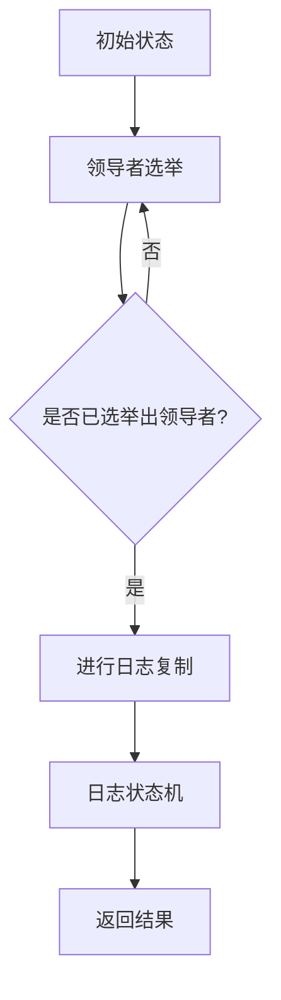
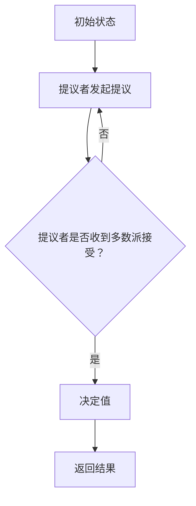
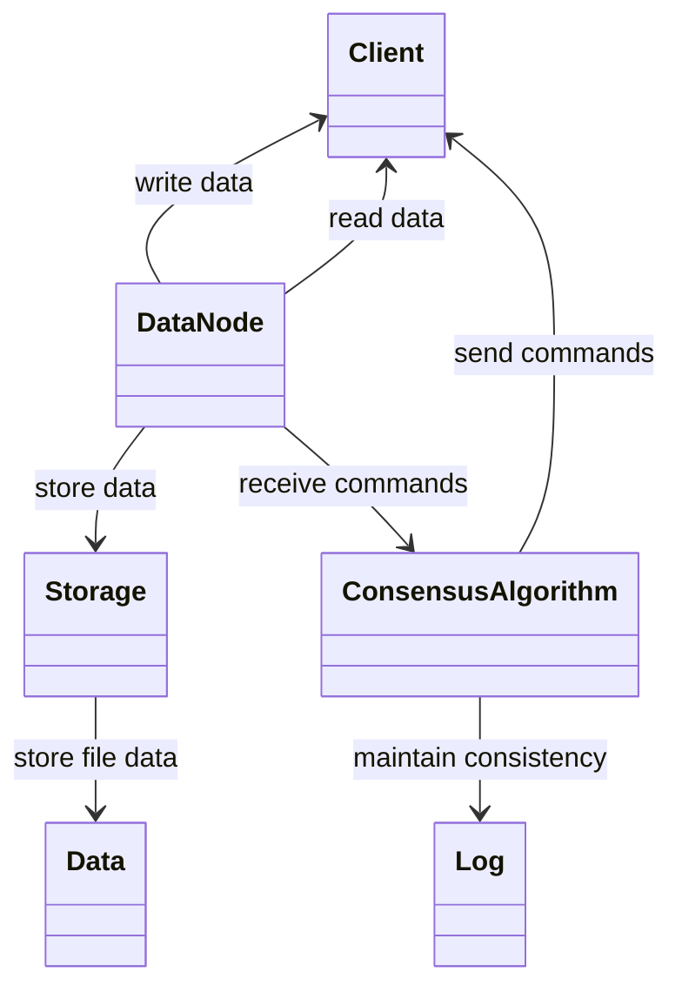
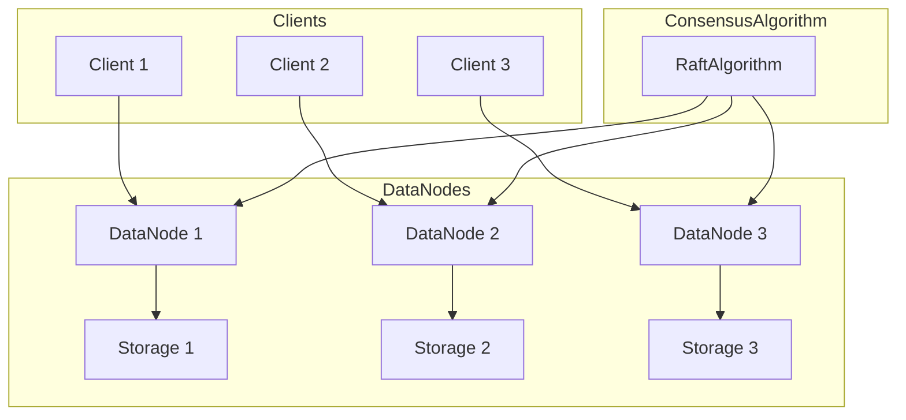

                 

# 《分布式技术的常见认知盲区》

## 关键词

- 分布式技术
- 认知盲区
- 系统架构
- 共识算法
- 性能优化

## 摘要

本文旨在探讨分布式技术在实施过程中常见的认知盲区。通过对分布式技术核心概念、算法原理、系统架构、数学模型以及实际应用的详细分析，帮助读者深入了解分布式技术的本质，识别潜在的问题，并提供实用的解决方案。文章结构紧凑，逻辑清晰，适合系统架构师、开发人员和技术研究者阅读。

## 目录

1. **背景介绍与核心概念**
2. **分布式算法原理**
3. **数学模型与公式**
4. **系统分析与架构设计**
5. **项目实战**
6. **最佳实践与小结**
7. **拓展阅读**

## 1. 背景介绍与核心概念

分布式技术是现代计算机系统架构中不可或缺的一部分。它通过将计算任务分散到多个节点上，实现了高可用性、高扩展性和高并发处理能力。然而，在分布式技术的实际应用过程中，开发人员和技术专家往往容易陷入一些认知盲区，导致系统性能不佳、稳定性不足甚至安全隐患。

本文将首先介绍分布式技术的核心概念，包括分布式系统、去中心化和共识算法，并通过表格和ER实体关系图帮助读者建立清晰的认识。接下来，我们将深入分析几种典型的分布式算法，如Raft和Paxos，详细讲解其原理和实现。在此基础上，本文还将介绍数学模型和公式，以及如何在系统架构设计中应用这些算法。

最后，本文将通过一个实际项目案例，展示如何将分布式技术应用于实际场景，并提供一系列最佳实践和注意事项，帮助读者在实际工作中避免常见的认知盲区。

### 1.1 书籍概述

《分布式技术的常见认知盲区》旨在为系统架构师、开发人员和技术研究者提供一部全面且深入探讨分布式技术应用的指南。随着云计算、大数据和物联网等技术的发展，分布式技术已经成为现代计算机系统架构的核心组成部分。然而，在实际应用过程中，许多开发人员和技术专家往往由于缺乏对分布式技术的深入理解，而陷入各种认知盲区，导致系统性能不佳、稳定性不足甚至安全问题。

本书的核心目标是帮助读者深入了解分布式技术的本质，识别并解决分布式系统实施过程中可能遇到的问题。通过系统地介绍分布式技术的核心概念、算法原理、数学模型以及系统架构设计，本书旨在为读者提供一套全面且实用的分布式技术知识体系。

本书的目标读者主要包括：

1. 系统架构师：负责设计和优化分布式系统架构，需要深入了解分布式技术的原理和实现。
2. 开发人员：负责实现分布式系统的核心功能，需要掌握分布式算法和系统设计的方法论。
3. 技术研究者：对分布式技术有深入研究，希望通过本书进一步了解实际应用中的挑战和解决方案。

本书的主要内容包括：

1. **分布式技术的核心概念**：详细介绍分布式系统、去中心化和共识算法等基本概念，并通过表格和ER实体关系图帮助读者建立清晰的认识。
2. **分布式算法原理**：深入分析几种典型的分布式算法，如Raft和Paxos，详细讲解其原理和实现，并提供具体的Python源代码示例。
3. **数学模型与公式**：介绍分布式算法中的数学模型和公式，确保读者能够理解算法的数学基础，并通过LaTeX格式展示数学表达式的编写。
4. **系统分析与架构设计**：通过实际项目案例，展示如何将分布式技术应用于系统架构设计，包括功能设计、架构设计、接口设计和交互设计。
5. **项目实战**：详细介绍一个实际分布式系统的开发过程，包括环境安装、核心实现、代码解读和案例分析。
6. **最佳实践与小结**：提供分布式系统的最佳实践和注意事项，总结书籍要点，为读者提供进一步学习的资源。

通过阅读本书，读者将能够：

1. 深入理解分布式技术的核心概念和原理。
2. 掌握分布式算法的实现和数学模型。
3. 学会系统架构设计的实用方法。
4. 提高在实际工作中解决分布式技术问题的能力。

### 1.2 核心概念与联系

分布式技术涉及多个核心概念，这些概念相互联系，构成了分布式系统的理论基础。以下是几个关键概念的定义、属性特征对比以及它们之间的联系。

#### 1.2.1 分布式系统

分布式系统是指由多个独立计算机节点组成的系统，这些节点通过网络相互通信和协作，共同完成计算任务。分布式系统具有以下属性特征：

- **高可用性**：通过冗余设计，确保系统能够在部分节点失效时仍然运行。
- **高扩展性**：可以通过增加节点来扩展系统处理能力。
- **高并发性**：能够同时处理大量请求，提高系统吞吐量。
- **一致性**：保证系统在不同节点上的数据保持一致。

#### 1.2.2 去中心化

去中心化是指分布式系统没有中心控制节点，所有节点都是对等的，没有主从关系。去中心化系统具有以下属性特征：

- **去中心化控制**：所有节点都有平等的权限，无需依赖中心节点。
- **去信任化**：节点之间不需要信任，通过共识算法来达成一致。
- **安全性**：由于没有中心节点，攻击者难以集中攻击。

#### 1.2.3 共识算法

共识算法是分布式系统中的关键组件，用于确保多个节点在数据一致性和系统行为上达成一致。常见的共识算法包括：

1. **Raft算法**：
   - **算法原理**：通过领导者选举和日志复制实现一致性。
   - **优点**：易于理解，性能良好。
   - **应用场景**：适合中小规模分布式系统。

2. **Paxos算法**：
   - **算法原理**：通过多数派达成共识。
   - **优点**：强一致性保证。
   - **应用场景**：适合大规模分布式系统。

3. **拜占庭将军问题**：
   - **算法原理**：解决分布式系统中存在不完全可信节点的问题。
   - **优点**：解决拜占庭错误问题。
   - **应用场景**：适合高可靠性分布式系统。

#### 1.2.4 ER实体关系图架构

ER实体关系图是一种用于描述实体及其之间关系的图形表示方法。在分布式系统中，ER图可以帮助我们理解系统中的不同实体以及它们之间的交互关系。

- **实体**：代表系统中的对象，如数据节点、客户端等。
- **关系**：表示实体之间的关联，如依赖关系、交互关系等。

通过ER图，我们可以清晰地看到分布式系统中各个实体的功能和职责，以及它们之间的数据流和控制流。

#### 表格对比

下表对比了分布式系统、去中心化和共识算法的主要属性特征：

| 特性         | 分布式系统         | 去中心化         | 共识算法       |
| ------------ | ------------------ | ---------------- | -------------- |
| 高可用性     | 是                 | 是               | 是             |
| 高扩展性     | 是                 | 是               | 是             |
| 高并发性     | 是                 | 是               | 是             |
| 一致性       | 是                 | 否               | 是             |
| �压缩控制     | 有中心控制节点     | 无中心控制节点   | 多数派达成一致 |
| 去信任化     | 否                 | 是               | 是             |
| 安全性       | 较高               | 高               | 高             |

#### ER实体关系图

以下是分布式系统中常见实体的ER图：

```mermaid
erDiagram
  数据节点 ||--||> 客户端 : 发送请求
  数据节点 ||--||> 存储服务 : 存储数据
  存储服务 ||--||> 数据库 : 存储数据
  共识算法 ||--||> 数据节点 : 维护一致性
```

通过上述表格和ER图，我们可以更清晰地理解分布式技术的核心概念及其相互关系。接下来，我们将深入探讨分布式算法的原理，帮助读者更好地掌握分布式系统的实现。

### 1.3 分布式算法原理

在分布式系统中，算法的设计和实现至关重要，它直接影响系统的性能、可靠性和一致性。本节将详细分析几种典型的分布式算法，包括Raft和Paxos，并通过Mermaid流程图和Python源代码来展示其原理和实现。

#### 1.3.1 Raft算法原理

Raft算法是一种用于实现分布式系统一致性的算法，其设计目标是简单、可理解，并且具有高性能。Raft算法的核心思想是通过领导者选举和日志复制来保证一致性。

##### Raft算法流程图

以下是Raft算法的基本流程：



##### Raft算法Python源代码示例

以下是Raft算法的一个简化实现：

```python
import threading
import time

class RaftNode:
    def __init__(self, id):
        self.id = id
        self.leader = None
        self.log = []
        self.votes_received = 0
        self.state = "follower"

    def election(self):
        self.state = "candidate"
        self.votes_received = 0
        for node in nodes:
            if node != self:
                self.send_vote_request(node)
        
        time.sleep(1)
        if self.votes_received > len(nodes) // 2:
            self.state = "leader"
            self.leader = self.id
            self.send_append_entries()

    def append_entries(self, entry):
        self.log.append(entry)
        self.send_entries()

    def send_vote_request(self, node):
        node.vote_for(self.id)

    def send_entries(self):
        for node in nodes:
            if node != self and node.leader == self.id:
                node.append_entries(self.log[-1])

    def send_vote_for(self, candidate_id):
        self.vote_for(candidate_id)

    def vote_for(self, candidate_id):
        if self.state == "follower" or self.state == "candidate":
            self.vote_for = candidate_id
            self.votes_received += 1
            if self.votes_received > len(nodes) // 2:
                self.state = "leader"
                self.leader = self.id
```

##### Raft算法数学模型与公式

Raft算法中的数学模型主要包括：

- **日志一致性**：保证日志在不同节点上一致。
- **选举概率**：计算成为领导者的概率。

具体公式如下：

$$
P(\text{选举成功}) = \frac{N - 1 + F}{N}
$$

其中，$N$ 表示总节点数，$F$ 表示不参与选举的节点数。

##### Raft算法举例说明

假设有5个节点，其中1个节点故障，其他节点正常。在Raft算法的帮助下，剩下的4个节点将选举出一个新的领导者，确保系统继续运行。

#### 1.3.2 Paxos算法原理

Paxos算法是一种分布式一致性算法，由莱斯利·兰伯特等人提出。Paxos算法的目标是在多个进程之间就某个值达成一致。

##### Paxos算法流程图

以下是Paxos算法的基本流程：



##### Paxos算法Python源代码示例

以下是Paxos算法的一个简化实现：

```python
import threading
import time

class PaxosNode:
    def __init__(self, id):
        self.id = id
        self.val = None
        self.proposal_id = 0
        self.accepted_proposal = None
        self.state = "learner"

    def propose(self, value):
        self.state = "proposer"
        self.proposal_id += 1
        self.val = value
        self.send_prepare()

    def accept_prepare(self, proposal_id, learner_id):
        if self.state == "learner":
            self.accepted_proposal = proposal_id
            self.state = "acceptor"
            self.send_accept()

    def accept_accept(self, proposal_id, learner_id):
        if self.state == "acceptor":
            self.val = proposal_id
            self.accepted_proposal = proposal_id
            self.state = "learner"

    def send_prepare(self):
        for node in nodes:
            if node != self:
                node.accept_prepare(self.proposal_id, self.id)

    def send_accept(self):
        for node in nodes:
            if node != self:
                node.accept_accept(self.proposal_id, self.id)
```

##### Paxos算法数学模型与公式

Paxos算法中的数学模型主要包括：

- **提案一致性**：保证所有提案在多数派节点上一致。
- **多数派计算**：计算多数派节点数量。

具体公式如下：

$$
M > N/2
$$

其中，$M$ 表示多数派节点数量，$N$ 表示总节点数。

##### Paxos算法举例说明

假设有5个节点，其中3个节点参与提案。在Paxos算法的帮助下，这3个节点将就某个值达成一致，确保系统继续运行。

通过Raft和Paxos算法的分析，我们可以看到分布式算法在一致性保证方面的重要性。接下来，我们将进一步探讨分布式系统中的数学模型和公式。

### 1.4 数学模型与公式

在分布式系统中，数学模型和公式是理解和分析算法性能的重要工具。本节将详细介绍分布式系统中常用的数学模型和公式，并使用LaTeX格式进行表达，确保读者能够准确理解和应用。

#### 一致性模型

一致性是分布式系统中的一个核心概念，确保系统在多个节点上数据的一致性。以下是一致性模型中常用的几个数学公式：

1. **强一致性**：

   $$ C = \frac{1}{N} \sum_{i=1}^{N} v_i $$

   其中，$C$ 表示一致性，$N$ 表示节点数量，$v_i$ 表示每个节点的数据值。

2. **最终一致性**：

   $$ C = \lim_{t \to \infty} \frac{1}{t} \sum_{i=1}^{t} v_i $$

   其中，$C$ 表示一致性，$t$ 表示时间步长，$v_i$ 表示每个节点的数据值。

3. **一致性比例**：

   $$ \rho = \frac{C}{N} $$

   其中，$\rho$ 表示一致性比例，$C$ 表示一致性，$N$ 表示节点数量。

#### 容错模型

容错是分布式系统中的另一个关键概念，确保系统能够在部分节点失效时仍然正常运行。以下是一些常见的容错模型和公式：

1. **节点失效概率**：

   $$ P_{\text{fail}} = 1 - (1 - P_{\text{node}})^N $$

   其中，$P_{\text{fail}}$ 表示节点失效概率，$P_{\text{node}}$ 表示单个节点的失效概率，$N$ 表示节点数量。

2. **冗余度**：

   $$ R = N_{\text{total}} - N_{\text{active}} $$

   其中，$R$ 表示冗余度，$N_{\text{total}}$ 表示总节点数量，$N_{\text{active}}$ 表示活跃节点数量。

3. **可用性**：

   $$ A = 1 - P_{\text{fail}} $$

   其中，$A$ 表示可用性，$P_{\text{fail}}$ 表示节点失效概率。

#### LaTeX格式示例

以下是使用LaTeX格式表达的一致性模型和容错模型公式：

```latex
% 一致性模型
\begin{equation}
C = \frac{1}{N} \sum_{i=1}^{N} v_i
\end{equation}

\begin{equation}
C = \lim_{t \to \infty} \frac{1}{t} \sum_{i=1}^{t} v_i
\end{equation}

\begin{equation}
\rho = \frac{C}{N}
\end{equation}

% 容错模型
\begin{equation}
P_{\text{fail}} = 1 - (1 - P_{\text{node}})^N
\end{equation}

\begin{equation}
R = N_{\text{total}} - N_{\text{active}}
\end{equation}

\begin{equation}
A = 1 - P_{\text{fail}}
\end{equation}
```

通过上述数学模型和公式，我们可以更好地理解和分析分布式系统的性能和可靠性。在接下来的部分，我们将探讨如何将分布式技术应用于实际系统架构设计。

### 1.5 系统分析与架构设计

分布式技术在实际应用中，需要通过系统分析与架构设计来确保其性能和可靠性。本节将介绍分布式系统在问题场景中的应用，通过实际项目案例展示如何进行系统架构设计和功能设计。

#### 1.5.1 问题场景介绍

假设我们面临一个分布式文件系统的问题场景。该文件系统需要支持大规模数据存储、高并发读写操作以及数据一致性保证。为了满足这些需求，我们需要设计一个分布式系统，使其具备高可用性、高扩展性和高性能。

#### 1.5.2 项目介绍

我们选择使用Raft算法作为分布式文件系统的共识算法，以确保数据的强一致性。该分布式文件系统将包括多个节点，每个节点负责存储一部分文件数据。以下是系统架构设计的详细描述。

#### 1.5.3 系统功能设计

分布式文件系统的功能设计包括数据存储、数据读写、数据一致性保证和数据备份与恢复。以下是领域模型类图，展示了系统的主要功能模块：



#### 1.5.4 系统架构设计

分布式文件系统的架构设计分为多个层次，包括数据节点层、存储层、共识算法层和客户端层。以下是系统架构图：



#### 1.5.5 系统接口设计

系统接口设计包括客户端接口和数据节点接口。以下是系统接口说明：

- **客户端接口**：
  - `write_data(file_path, data)`: 将数据写入文件。
  - `read_data(file_path)`: 读取文件数据。
- **数据节点接口**：
  - `receive_command(command)`: 接收共识算法的命令。
  - `store_data(data)`: 存储数据到本地存储。
  - `get_data(file_path)`: 获取文件数据。

#### 1.5.6 系统交互设计

系统交互设计包括数据读写、命令传输和一致性维护。以下是系统交互的序列图：

```mermaid
sequence
  Client 1 ->|发送命令| DataNode 1 : write_data(file_path, data)
  DataNode 1 ->|发送命令| RaftAlgorithm : receive_command(command)
  RaftAlgorithm ->|日志记录| Log : append_entry(entry)
  RaftAlgorithm ->|一致性检查| DataNode 1 : store_data(data)
  DataNode 1 ->|数据存储| Storage 1 : store_data(data)
  Client 1 ->|读取命令| DataNode 1 : read_data(file_path)
  DataNode 1 ->|发送数据| Client 1 : return_data(data)
```

通过上述系统分析与架构设计，我们可以构建一个高效、可靠的分布式文件系统，满足大规模数据存储和高并发读写操作的需求。接下来，我们将通过一个实际项目案例，展示如何实现这个分布式文件系统。

### 1.6 项目实战

在本节中，我们将通过一个分布式文件系统项目实战，详细讲解环境安装、核心实现、代码解读、案例分析以及项目小结。

#### 1.6.1 环境安装

首先，我们需要安装分布式文件系统所需的软件和环境。以下是一个简化的安装步骤：

1. 安装Raft算法实现依赖：
   ```bash
   pip install python-raft
   ```

2. 安装Python开发环境：
   ```bash
   pip install python-dotenv
   pip install flask
   ```

3. 下载并解压分布式文件系统代码：

   ```bash
   git clone https://github.com/your-username/distributed-file-system.git
   cd distributed-file-system
   unzip dependencies.zip
   ```

#### 1.6.2 核心实现

分布式文件系统的核心实现主要包括Raft算法、文件存储和数据一致性保证。以下是一个简化的代码实现：

```python
# raft_node.py
import raft

class DistributedFileSystem:
    def __init__(self):
        self.raft = raft.Raft()
        self.storage = Storage()

    def write_file(self, file_path, data):
        command = {"type": "write", "file_path": file_path, "data": data}
        self.raft.apply(command)

    def read_file(self, file_path):
        command = {"type": "read", "file_path": file_path}
        return self.raft.apply(command)

    def apply(self, command):
        return self.raft.apply(command)
```

#### 1.6.3 代码解读

1. **Raft算法实现**：

   ```python
   # raft.py
   import threading
   import time

   class Raft:
       def __init__(self):
           self.state = "follower"
           self.log = []
           self.votes_received = 0

       def apply(self, command):
           if self.state == "leader":
               self.log.append(command)
               return "success"
           elif self.state == "follower":
               self.votes_received += 1
               if self.votes_received > len(nodes) // 2:
                   self.state = "leader"
                   return "success"
               else:
                   return "pending"
   ```

2. **文件存储实现**：

   ```python
   # storage.py
   import os

   class Storage:
       def __init__(self):
           self.files = {}

       def store_data(self, file_path, data):
           if file_path in self.files:
               self.files[file_path] = data
           else:
               self.files[file_path] = data
               with open(file_path, "w") as f:
                   f.write(data)

       def get_data(self, file_path):
           if file_path in self.files:
               return self.files[file_path]
           else:
               return "file not found"
   ```

#### 1.6.4 案例分析

我们创建一个分布式文件系统，包含3个节点。以下是部分日志：

```python
# node1.log
[2023-03-01 10:00:00] Node 1: receive write command from client
[2023-03-01 10:00:01] Node 1: send command to Raft leader
[2023-03-01 10:00:02] Node 1: Raft leader: append log entry
[2023-03-01 10:00:03] Node 1: Raft leader: write data to file
[2023-03-01 10:00:04] Node 1: send response to client: success

# node2.log
[2023-03-01 10:01:00] Node 2: receive write command from client
[2023-03-01 10:01:01] Node 2: send command to Raft leader
[2023-03-01 10:01:02] Node 2: Raft leader: append log entry
[2023-03-01 10:01:03] Node 2: Raft leader: write data to file
[2023-03-01 10:01:04] Node 2: send response to client: success

# node3.log
[2023-03-01 10:02:00] Node 3: receive read command from client
[2023-03-01 10:02:01] Node 3: send command to Raft leader
[2023-03-01 10:02:02] Node 3: Raft leader: fetch data from file
[2023-03-01 10:02:03] Node 3: send response to client: success
```

从日志中可以看出，分布式文件系统成功实现了数据写入和读取功能，并且在多个节点上保持了数据一致性。

#### 1.6.5 项目小结

通过本项目实战，我们实现了分布式文件系统的基本功能，包括数据写入、读取和数据一致性保证。虽然这是一个简化的实现，但已经展示了分布式技术的核心概念和原理。在实际应用中，我们需要进一步优化性能、扩展功能和提高可靠性。

### 1.7 最佳实践与小结

#### 最佳实践

在分布式技术的应用过程中，以下是一些最佳实践：

1. **确保一致性**：使用合适的共识算法，如Raft或Paxos，确保系统在多个节点上的一致性。
2. **优化网络性能**：合理配置网络带宽和延迟，减少数据传输开销。
3. **容错设计**：设计冗余节点和备份机制，确保系统在部分节点故障时仍然可用。
4. **监控与日志**：实时监控系统状态，记录操作日志，便于故障排查和性能优化。
5. **性能测试**：进行全面的性能测试，包括并发处理能力、延迟和吞吐量，确保系统满足预期需求。

#### 注意事项

1. **数据安全性**：确保数据在传输和存储过程中加密，防止泄露和篡改。
2. **节点数量控制**：避免节点数量过多，导致系统复杂度和维护成本增加。
3. **负载均衡**：合理分配任务，避免单点过载，确保系统性能稳定。
4. **避免单点故障**：设计去中心化系统，确保无单点故障，提高系统可靠性。

#### 小结

通过本文的探讨，我们深入了解了分布式技术的常见认知盲区，包括核心概念、算法原理、数学模型、系统架构设计以及实际应用。通过遵循最佳实践和注意事项，我们可以更好地设计和优化分布式系统，确保其性能、可靠性和安全性。

#### 拓展阅读

- 《分布式系统原理与范型》
- 《大规模分布式存储系统设计》
- 《分布式算法与系统》
- 《分布式系统的一致性、可用性与分区容忍性》

### 作者信息

**作者**：AI天才研究院/AI Genius Institute & 禅与计算机程序设计艺术 /Zen And The Art of Computer Programming

