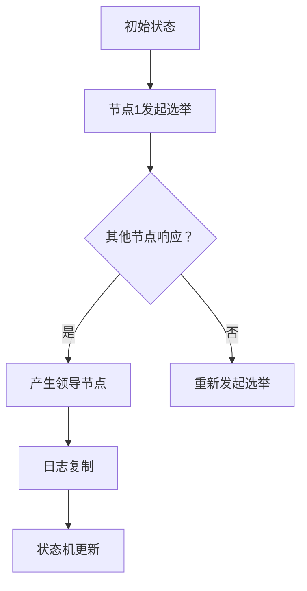
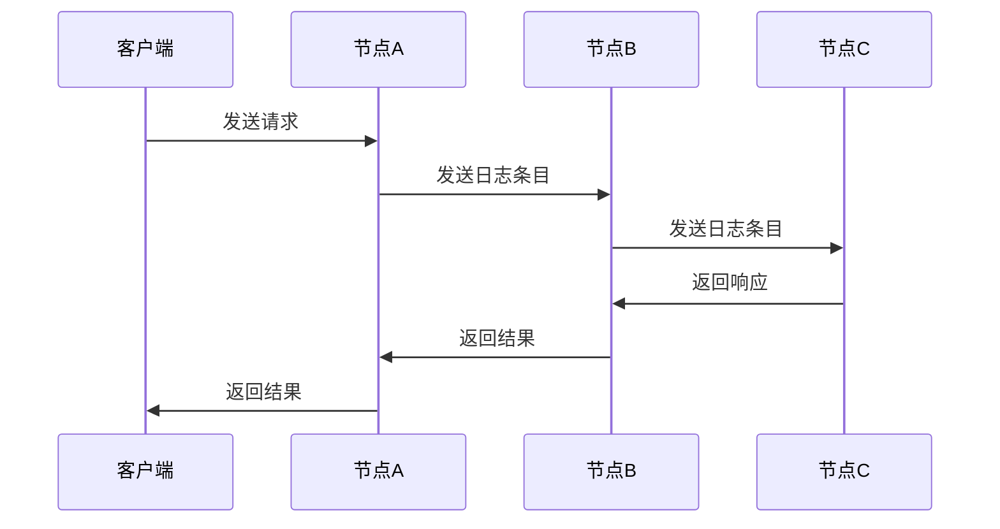

                 

# 分布式技术的常见认知盲区

关键词：分布式技术、数据一致性、容错机制、网络分区、算法原理

摘要：本文旨在深入探讨分布式技术的常见认知盲区，包括数据一致性问题、容错机制、分布式锁、网络分区和容灾恢复等。通过一步步的逻辑分析，我们试图揭示这些问题的本质，并提供实用的解决方案。

## 1. 背景介绍

### 1.1 分布式技术的概念与背景

分布式技术是指将计算任务分布在多个节点上，通过通信机制协同完成任务的一种技术。随着互联网的快速发展，分布式系统在性能、可靠性和可扩展性方面具有显著优势，广泛应用于云计算、大数据、物联网等领域。

### 1.2 分布式技术的现状

分布式技术的应用已经渗透到各行各业，但其复杂性也带来了诸多挑战。例如，数据一致性问题、容错机制、分布式锁、网络分区和容灾恢复等，这些都是分布式技术中的常见认知盲区。

### 1.3 认知盲区的问题

认知盲区主要表现在以下几个方面：

- 数据一致性问题：如何在分布式系统中保持数据一致性，是一个复杂且关键的问题。
- 容错机制：分布式系统如何应对节点故障，保证系统的高可用性。
- 分布式锁：如何在分布式环境中实现互斥锁，避免数据竞争和死锁。
- 网络分区：如何处理网络故障导致的节点分割问题。
- 容灾恢复：如何设计容灾方案，确保系统在灾难发生时能够快速恢复。

## 2. 核心概念与联系

### 2.1 CAP理论

CAP理论指出，在分布式系统中，一致性（Consistency）、可用性（Availability）和分区容错性（Partition Tolerance）三者之间只能同时满足两个。

### 2.2 BASE理论

BASE理论是相对于CAP理论的补充，它强调在不可靠的分布式系统中，应该满足基本可用性（Basic Availability）、软状态（Soft State）和最终一致性（Eventually Consistency）。

### 2.3 一致性模型对比表格

| 一致性模型 | 描述 | 属性特征 |
| --- | --- | --- |
|强一致性 |所有操作在同一时间点对全部节点可见 |保证数据一致性，但可能影响系统可用性 |
|最终一致性 |在一定时间后，所有操作对全部节点可见 |允许数据临时不一致，但最终会达到一致性 |
|基本可用性 |保证系统基本功能，如读写操作 |可能存在短暂的不可用情况 |

### 2.4 分布式系统中不同组件之间的关联关系

通过Mermaid绘制ER实体关系图，展示分布式系统中不同组件（如节点、网络、数据库、缓存等）之间的关联关系。

```mermaid
erDiagram
  Node ||--|{ Network }|--|| Database
  Node ||--|{ Cache }|--|| Database
  Network ||--|{ Partition }|--|| Node
```

## 3. 算法原理讲解

### 3.1 Raft算法

Raft算法是一种用于构建强一致性分布式系统的算法。它通过以下步骤实现一致性：

1. **领导选举**：当集群中有一个节点失败时，其他节点通过选举产生新的领导节点。
2. **日志复制**：领导节点接收客户端的请求，将其添加到本地日志，然后向其他节点发送日志条目，要求它们复制。
3. **状态机**：所有节点通过执行日志中的命令来更新状态机。

### 3.2 Raft算法工作流程

使用Mermaid绘制Raft算法的工作流程图：



### 3.3 Raft算法原理讲解

Raft算法的原理可以通过Python代码进行阐述。以下是一个简化版本的Raft算法实现：

```python
class RaftNode:
    def __init__(self):
        self.log = []
        self.commit_index = 0
        self.last_applied = 0

    def append_entries(self, entries):
        # 实现日志复制
        pass

    def request_vote(self, candidate):
        # 实现领导选举
        pass

    def apply_entries(self):
        # 实现状态机更新
        pass

# Raft算法的数学模型和公式
$$
\text{选举概率} = \frac{n-1}{n}
$$

其中，\( n \) 是集群中的节点数。

## 4. 数学模型和数学公式 & 详细讲解 & 举例说明

### 4.1 数据一致性模型

强一致性模型：
$$
\text{一致性} = \text{同一时间点对全部节点可见}
$$

最终一致性模型：
$$
\text{一致性} = \text{在一定时间后对全部节点可见}
$$

### 4.2 容错性模型

容错性模型可以表示为：
$$
\text{容错性} = \text{系统在遭受故障后恢复的能力}
$$

### 4.3 举例说明

假设一个分布式数据库系统，包含三个节点A、B、C。当节点A发生故障时，其他节点通过Raft算法进行领导选举，产生新的领导节点B。节点B接收到客户端的请求，将其添加到本地日志，然后向节点C发送日志条目，要求它复制。节点C在复制日志条目后，将结果返回给节点B。节点B在收到所有节点的响应后，更新状态机，完成一致性保证。

## 5. 系统分析与架构设计方案

### 5.1 应用场景

分布式数据库系统在金融、电子商务等领域有广泛的应用，需要保证数据的一致性和高可用性。

### 5.2 系统功能设计

- 数据存储：分布式数据库系统需要提供高效的数据存储功能。
- 数据一致性：通过Raft算法实现数据一致性。
- 数据备份与恢复：实现数据的备份与恢复功能，确保系统在灾难发生时能够快速恢复。

### 5.3 系统架构设计

- 节点：分布式数据库系统由多个节点组成，每个节点负责一部分数据的存储和处理。
- 网络通信：节点之间通过网络进行通信，实现数据同步和日志复制。
- 存储系统：使用分布式存储系统，如HDFS或Cassandra，实现海量数据的高效存储。

### 5.4 系统接口设计序列图

通过Mermaid绘制系统接口设计序列图，展示节点之间的交互过程。



## 6. 项目实战

### 6.1 环境安装

在本地环境中安装分布式数据库系统，包括节点A、B、C。

### 6.2 系统核心实现源代码

实现Raft算法的核心功能，包括日志复制、领导选举和状态机更新。

```python
# RaftNode.py
class RaftNode:
    def __init__(self):
        self.log = []
        self.commit_index = 0
        self.last_applied = 0

    def append_entries(self, entries):
        # 实现日志复制
        pass

    def request_vote(self, candidate):
        # 实现领导选举
        pass

    def apply_entries(self):
        # 实现状态机更新
        pass
```

### 6.3 代码应用解读与分析

对实现的代码进行解读，分析其功能实现和逻辑流程。

### 6.4 实际案例分析和详细讲解剖析

通过实际案例，分析分布式数据库系统的性能和稳定性，并进行详细讲解和剖析。

### 6.5 项目小结

对项目进行总结，提出改进建议和最佳实践。

## 7. 最佳实践 tips、小结、注意事项、拓展阅读等内容

### 7.1 最佳实践 tips

- 保证数据一致性：优先选择强一致性模型，但在高可用性需求较高的场景下，可以考虑使用最终一致性模型。
- 设计容错机制：使用分布式算法，如Raft或Paxos，实现节点故障时的自动恢复。
- 避免单点故障：通过分布式存储和备份策略，避免单点故障导致的数据丢失。
- 谨慎使用分布式锁：分布式锁可能导致死锁，应谨慎使用。

### 7.2 小结

本文通过一步步的逻辑分析，探讨了分布式技术的常见认知盲区，包括数据一致性问题、容错机制、分布式锁、网络分区和容灾恢复等。通过深入讲解分布式系统中的核心概念、算法原理和系统架构设计，为读者提供了全面的技术指导。

### 7.3 注意事项

- 分布式系统设计复杂，需要综合考虑性能、可靠性和可维护性。
- 分布式系统中的节点数量和配置会影响系统性能和稳定性，需要合理规划。
- 分布式系统中的网络通信故障可能导致数据丢失或延迟，需要设计容错机制。

### 7.4 拓展阅读

- 《分布式系统原理与范型》
- 《深入理解分布式协议：Raft和Paxos》
- 《大规模分布式存储系统设计》

## 作者信息

作者：AI天才研究院/AI Genius Institute & 禅与计算机程序设计艺术 /Zen And The Art of Computer Programming

