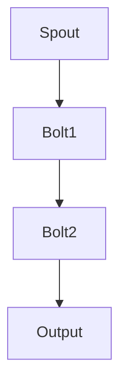
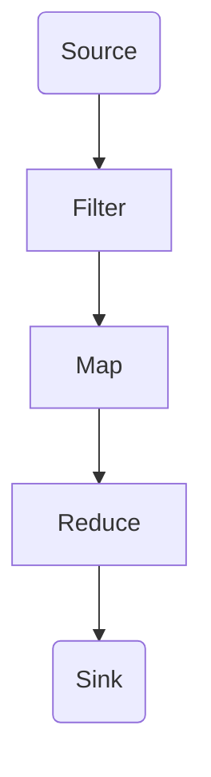
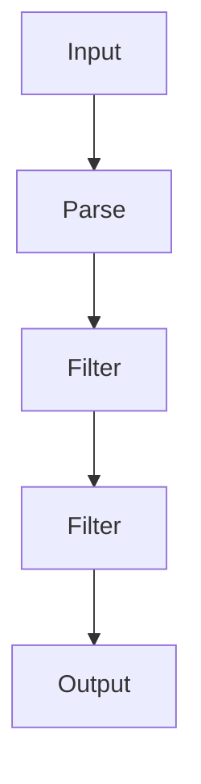
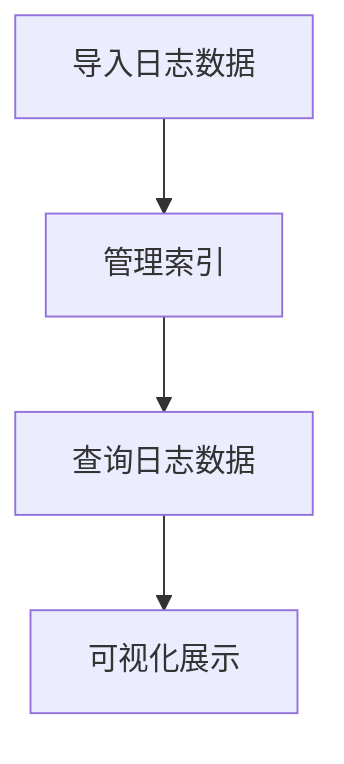
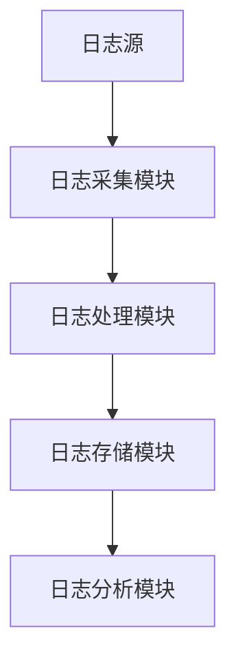
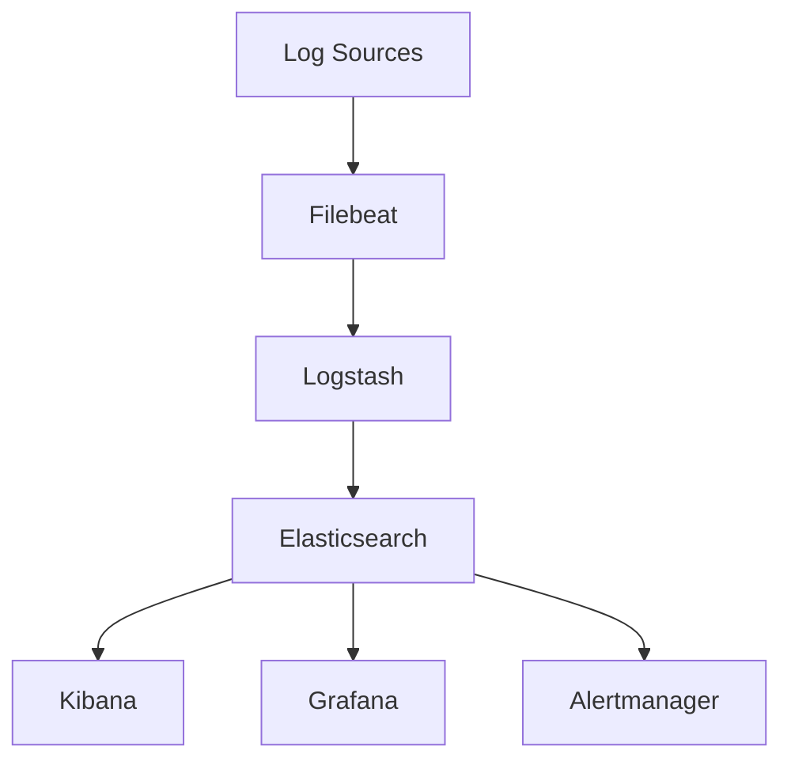
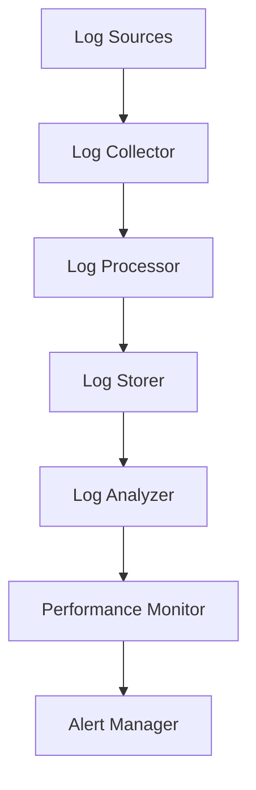
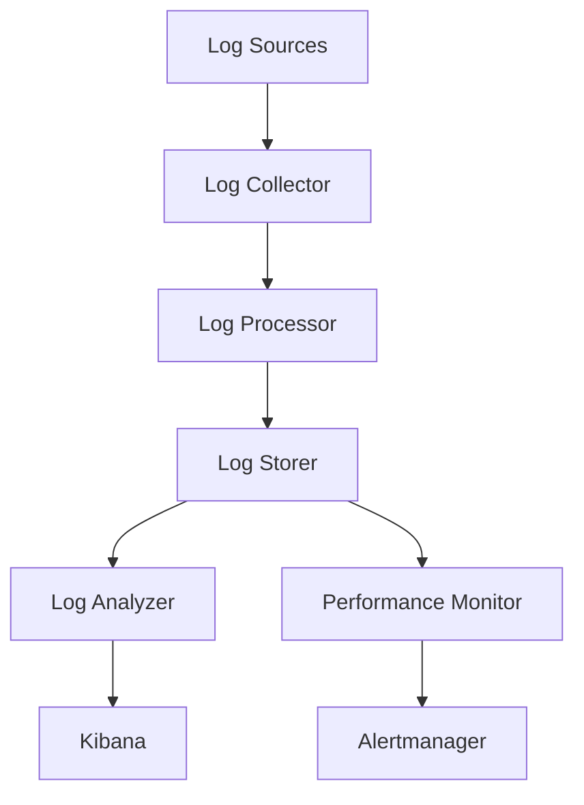

                 

### 分布式日志收集与分析系统的重要性

在现代互联网应用中，日志数据是运营监控、性能优化、故障排查和业务分析的重要依据。随着企业规模的扩大和应用的复杂化，传统的集中式日志处理方式已经难以满足需求。分布式日志收集与分析系统应运而生，它通过分布式架构设计，实现对大规模分布式系统中日志数据的集中化管理，提供了高效、稳定、可靠的日志处理能力。

#### 1.1.1 分布式日志收集与分析的重要性

1. **海量数据的高效处理**：分布式日志收集系统可以将日志数据从多个源节点收集到中心节点，通过对海量日志数据的处理，实现对系统运行状态的实时监控和问题快速定位。
   
2. **数据一致性保障**：通过分布式架构，系统可以在多个节点上同时处理日志数据，保障数据的一致性和可靠性。

3. **扩展性和弹性**：分布式日志系统可以根据业务需求灵活扩展节点数量，以应对不断增长的数据量和处理需求。

4. **高性能与可扩展性**：分布式日志处理框架通常采用流处理技术，能够实现数据的实时分析和处理，满足高并发的数据处理需求。

5. **多元化应用场景**：分布式日志收集与分析系统不仅可以用于故障排查和性能监控，还可以用于日志数据的存储、分析和挖掘，支持多样化的业务需求。

#### 1.1.2 分布式日志收集与分析的基本概念

1. **日志数据**：日志数据是记录系统运行状态、操作记录、异常信息等数据的文本文件。它们通常以文本形式记录，包含时间戳、日志级别、模块名称、错误信息等关键信息。

2. **日志收集器**：日志收集器是指负责从各个节点收集日志数据的组件。常见的日志收集器包括Logstash、Fluentd、Filebeat等。

3. **日志存储系统**：日志存储系统用于存储收集到的日志数据。常见的选择包括Elasticsearch、Kafka、HDFS等。

4. **日志分析工具**：日志分析工具用于对存储在日志存储系统中的日志数据进行处理和分析，常见的工具有Kibana、Grafana、Logstash等。

#### 1.1.3 分布式日志收集与分析的挑战与机遇

**挑战：**

1. **海量数据的高效处理**：随着数据量的不断增长，如何高效处理海量日志数据成为一大挑战。
   
2. **系统稳定性**：分布式系统中的单点故障、网络抖动等问题对系统的稳定性提出了挑战。

3. **性能优化**：为了满足业务需求，分布式日志收集与分析系统需要进行性能优化，以提高系统的处理能力和响应速度。

4. **安全性**：日志数据通常包含敏感信息，如何保障数据的安全性是系统设计的重要考虑因素。

**机遇：**

1. **大数据分析**：分布式日志收集与分析系统为大数据分析提供了丰富的数据资源，通过数据挖掘和机器学习等技术，可以实现业务智能和决策支持。

2. **实时处理能力**：分布式日志系统通过流处理技术，能够实现数据的实时分析和处理，为业务决策提供及时的数据支持。

3. **开源生态支持**：随着开源技术的发展，分布式日志收集与分析系统有了丰富的开源工具和框架支持，降低了系统开发和部署的门槛。

#### 1.2 研究背景与文献综述

**分布式日志系统发展历程**

1. **早期集中式日志收集**：在分布式系统出现之前，日志收集通常采用集中式架构，即将所有日志数据集中存储在本地文件系统中。

2. **分布式日志系统的发展**：随着分布式系统的普及，日志收集开始采用分布式架构，如Kafka、Fluentd等工具的出现，极大地提升了日志收集的效率和可靠性。

**国内外研究现状分析**

1. **国外研究现状**：国外研究主要集中在分布式日志收集与分析算法优化、性能评估、安全性等方面。例如，Google的Stackdriver系统、Amazon的Kinesis等。

2. **国内研究现状**：国内研究主要关注分布式日志系统在实际业务中的应用和优化。例如，阿里巴巴的MRS日志系统、腾讯的TencentDB等。

**本书的研究目标与贡献**

本书旨在深入探讨分布式日志收集与分析系统的设计与实现，主要研究目标包括：

1. **系统架构优化**：分析现有分布式日志收集与分析系统的架构设计，提出优化方案，以提高系统的性能和稳定性。

2. **日志处理算法研究**：研究分布式日志处理算法，优化日志数据的处理速度和准确性。

3. **安全性保障**：探讨分布式日志收集与分析系统的安全性设计，保障日志数据的安全和隐私。

4. **案例应用分析**：结合实际业务场景，分析分布式日志收集与分析系统的应用效果和优化方向。

通过本书的研究，期望为分布式日志收集与分析系统的设计与实现提供理论指导和实践参考。

#### 1.3 本书结构安排

**1.3.1 内容概述**

本书共分为六个部分，首先介绍了分布式日志收集与分析系统的基本概念和发展历程，然后详细讨论了分布式日志收集系统的设计、日志存储与索引、数据处理与转换、日志分析与应用、系统性能优化等内容，最后通过实际案例分析了分布式日志收集与分析系统的应用效果和优化方向。

**1.3.2 各章节内容概览**

- **第1章 引言**：介绍了分布式日志收集与分析系统的重要性、基本概念和发展历程。
- **第2章 分布式日志收集系统**：讨论了日志采集基础、分布式日志采集架构设计和Kafka日志采集系统的实现。
- **第3章 日志存储与索引**：介绍了日志存储方案选择、日志索引机制和Elasticsearch日志存储与检索。
- **第4章 日志数据处理与转换**：讨论了数据清洗与预处理、数据转换策略和分布式日志处理框架。
- **第5章 日志分析与应用**：介绍了日志分析的基本概念、日志监控与告警、Kibana日志分析实现。
- **第6章 分布式日志收集与分析系统性能优化**：讨论了系统性能优化的重要性、数据流优化策略和存储优化方案。

**1.4 本章小结**

本章主要介绍了分布式日志收集与分析系统的重要性、基本概念和发展历程。通过对分布式日志收集与分析系统的深入了解，为后续章节的详细讨论奠定了基础。本章的内容为后续章节提供了必要的背景知识和理论依据，使读者能够更好地理解和掌握分布式日志收集与分析系统的设计与实现。同时，本章也分析了分布式日志收集与分析系统所面临的挑战与机遇，为系统的优化和改进提供了思路。通过本章的学习，读者可以建立起对分布式日志收集与分析系统的整体认识，为后续的学习和实践打下坚实的基础。

### 1.5 未来工作展望

在分布式日志收集与分析系统的研究和应用中，仍存在许多挑战和待解决的问题。未来的工作可以从以下几个方面展开：

1. **系统性能优化**：进一步优化分布式日志收集与分析系统的性能，提高系统的处理速度和响应能力。例如，可以研究高效的数据流模型和负载均衡策略，优化数据压缩和加密技术。

2. **安全性提升**：随着日志数据的重要性日益增加，如何保障日志数据的安全成为关键问题。未来可以探讨基于加密技术的数据安全方案，增强系统的安全性和隐私保护。

3. **智能化日志分析**：利用机器学习和数据挖掘技术，实现智能化的日志分析，从海量日志数据中提取有价值的信息，为业务决策提供数据支持。

4. **跨平台兼容性**：提高分布式日志收集与分析系统的跨平台兼容性，支持更多类型的日志数据格式和存储系统，以适应不同企业和项目的需求。

5. **社区与开源生态**：积极参与分布式日志收集与分析系统的开源社区，贡献优秀的代码和设计经验，推动开源生态的发展。

通过不断的研究和实践，分布式日志收集与分析系统将在未来的互联网应用中发挥更加重要的作用，为企业的数字化转型和业务发展提供强有力的支持。

## 第2章：日志采集基础

### 2.1.1 日志数据的类型与格式

在分布式日志收集与分析系统中，日志数据的类型和格式至关重要。日志数据可以分为结构化日志和非结构化日志两大类。

**1. 结构化日志**

结构化日志是一种按照固定格式组织的日志数据，其内容通常包括时间戳、日志级别、模块名称、操作信息、错误信息等。结构化日志的格式通常采用JSON、XML、LOG4J等标准格式，便于后续的数据处理和分析。例如，一个简单的结构化日志条目可能如下所示：

```json
{
  "timestamp": "2023-11-05T14:05:01.123Z",
  "level": "INFO",
  "module": "webserver",
  "action": "request processed",
  "error": null
}
```

**2. 非结构化日志**

非结构化日志是一种没有固定格式的文本数据，通常包含大量自由文本信息。非结构化日志通常用于记录系统的运行状态、操作记录和异常信息等。由于非结构化日志缺乏明确的格式，因此需要进行预处理和解析，才能进行有效的数据处理和分析。例如，一个简单的非结构化日志条目可能如下所示：

```
[2023-11-05T14:05:01.123Z] [INFO] [webserver] Request processed successfully.
```

### 2.1.2 日志采集的策略与方法

日志采集策略和方法的选择直接影响分布式日志收集系统的性能和可靠性。常见的日志采集策略和方法如下：

**1. 定时采集**

定时采集是一种按照固定时间间隔进行日志数据采集的方法。这种方法简单易实现，但可能会造成数据丢失或延迟。定时采集适用于日志量不大且变化不频繁的场景。

**2. 实时采集**

实时采集是一种在日志生成时立即进行采集的方法。实时采集能够确保数据的实时性和准确性，但需要较高的系统资源和网络带宽。实时采集适用于日志量较大且需要实时处理的场景。

**3. 深度采集**

深度采集是一种对日志数据进行多层级解析和提取的方法，不仅采集日志文本，还提取其中的关键信息，如时间戳、日志级别、模块名称等。深度采集能够提高日志数据的价值和可用性。

**4. 多源采集**

多源采集是一种同时从多个日志源进行采集的方法，可以收集来自不同应用程序、不同服务器和不同网络设备的日志数据。多源采集适用于复杂分布式系统，能够提供更全面的日志数据。

### 2.1.3 常用日志采集工具介绍

在分布式日志收集系统中，常用的日志采集工具有Logstash、Fluentd、Filebeat等。以下是对这些工具的简要介绍：

**1. Logstash**

Logstash是一个开源的数据处理管道，可以将来自不同源的数据转换、过滤、路由到目的地。Logstash支持多种数据源和目的地，如文件、Kafka、Elasticsearch等。

**2. Fluentd**

Fluentd是一个开源的数据收集器，主要用于处理和转发日志数据。Fluentd支持多种数据源和目的地，如文件、Kafka、RabbitMQ等，具有高效、灵活、可扩展的特点。

**3. Filebeat**

Filebeat是Elastic Stack中的一个轻量级日志采集器，可以实时收集系统日志并传输到Elasticsearch或Kibana。Filebeat具有高效、可靠、易部署的特点，适用于各种规模的应用场景。

### 2.2 分布式日志采集架构设计

分布式日志采集架构设计是构建高效、稳定、可靠的分布式日志收集系统的基础。以下是一个典型的分布式日志采集架构设计：

**1. 架构设计原则**

- **可扩展性**：支持节点动态增加和删除，以应对日志数据量的变化。
- **高可用性**：通过节点冗余和故障转移机制，保障系统的可靠性。
- **高性能**：采用高效的数据处理和传输机制，提高系统的处理速度。
- **易维护性**：简化系统部署和管理，降低运维成本。

**2. 系统模块划分**

分布式日志采集系统通常划分为以下模块：

- **日志采集模块**：负责从各个日志源（如应用程序、服务器、网络设备等）采集日志数据。
- **日志处理模块**：负责对采集到的日志数据进行预处理、过滤、解析和分类等操作。
- **日志存储模块**：负责将处理后的日志数据存储到分布式存储系统中。
- **日志分析模块**：负责对存储在分布式存储系统中的日志数据进行分析、查询和可视化。

**3. 日志采集流程图**


在日志采集流程中，首先由日志采集模块从各个日志源收集日志数据，然后通过日志处理模块对日志数据进行预处理和过滤，接着将处理后的日志数据存储到日志存储模块。最后，日志分析模块通过对存储在日志存储模块中的日志数据进行查询和分析，为业务决策提供支持。

### 2.3 实际案例：Kafka日志采集系统

Kafka是一种分布式流处理平台，广泛应用于大规模分布式系统的日志收集。以下是一个Kafka日志采集系统的实际案例：

**1. Kafka概述**

Kafka是一个开源的分布式流处理平台，由Apache Software Foundation维护。Kafka具有高吞吐量、可扩展性、持久化和可靠性等特点，适用于大规模分布式系统的日志收集、消息传输和实时数据处理。

**2. Kafka日志采集实现**

Kafka日志采集实现包括以下步骤：

- **日志采集**：使用Filebeat等工具，将应用程序、服务器和网络设备的日志数据实时采集到Kafka集群中。
- **日志处理**：Kafka集群中的Producers将采集到的日志数据发送到Kafka主题中。
- **日志存储**：Kafka集群中的Brokers将日志数据存储到分布式存储系统中，如HDFS或Elasticsearch。
- **日志分析**：使用Kafka的消费者，从Kafka主题中读取日志数据，并将其传递给日志分析工具，如Kibana或Grafana。

**3. Kafka日志采集性能优化**

为了提高Kafka日志采集的性能，可以采取以下优化措施：

- **增加Kafka Brokers节点**：通过增加Kafka Brokers节点数量，提高日志数据存储和处理的并发能力。
- **优化Kafka主题配置**：调整Kafka主题的分区数量和副本数量，优化日志数据的存储和读取性能。
- **提高网络带宽**：增加日志数据传输的带宽，减少网络延迟。
- **数据压缩**：使用数据压缩技术，减少日志数据在传输和存储过程中的空间占用。

### 2.4 本章小结

本章介绍了分布式日志收集与分析系统的基础知识，包括日志数据的类型与格式、日志采集的策略与方法以及常用的日志采集工具。此外，本章还讨论了分布式日志采集架构设计的原则和模块划分，并给出了一个实际案例——Kafka日志采集系统的实现。通过本章的学习，读者可以了解分布式日志采集的基本概念和实现方法，为后续章节的学习和实践打下基础。

## 第3章：日志存储与索引

### 3.1.1 日志存储方案选择

日志存储方案的选择是分布式日志收集与分析系统设计中的关键一环。合适的日志存储方案能够确保日志数据的高效、安全、可靠存储，以满足不同的业务需求和系统架构。以下是几种常见的日志存储方案：

**1. 基于关系型数据库的存储**

关系型数据库（如MySQL、PostgreSQL等）是一种传统的日志存储方案。关系型数据库具有数据结构清晰、事务处理能力强、SQL查询方便等优点。然而，关系型数据库在面对海量日志数据时，性能可能会成为瓶颈，且日志数据的扩展性相对较差。

**2. 基于NoSQL数据库的存储**

NoSQL数据库（如MongoDB、Cassandra等）是针对大规模分布式系统而设计的。NoSQL数据库具有高扩展性、高吞吐量、易部署等优点，适用于处理海量日志数据。然而，NoSQL数据库在事务处理能力和SQL查询方面可能不如关系型数据库。

**3. 基于分布式文件系统的存储**

分布式文件系统（如HDFS、Ceph等）是一种分布式存储方案，适用于大规模分布式系统中的日志存储。分布式文件系统具有高可靠性、高吞吐量、强一致性等优点，但其在查询能力和事务处理方面相对较弱。

**4. 基于日志收集与分析平台的存储**

日志收集与分析平台（如Elasticsearch、Kafka等）结合了日志存储、索引、分析等功能，提供了一种集成化的日志存储解决方案。这些平台通常具有较高的性能、灵活性和可扩展性，适用于复杂的分布式日志收集与分析场景。

在选择日志存储方案时，需要考虑以下几个方面：

- **日志数据量**：根据日志数据量的大小，选择适合的存储方案。海量日志数据通常更适合基于分布式文件系统和NoSQL数据库的存储方案。
- **日志数据结构**：根据日志数据结构的特点，选择适合的存储方案。结构化日志数据通常更适合关系型数据库或NoSQL数据库，非结构化日志数据则更适合基于分布式文件系统的存储方案。
- **查询需求**：根据日志数据的查询需求，选择适合的存储方案。如果需要进行复杂查询和实时分析，日志收集与分析平台可能是一个更好的选择。
- **性能要求**：根据系统的性能要求，选择适合的存储方案。高性能系统通常需要选择具备高吞吐量和低延迟的存储方案。

### 3.1.2 分布式文件系统HDFS

Hadoop分布式文件系统（HDFS）是Apache Hadoop项目的一部分，是一种分布式文件系统，适用于大规模分布式系统中的数据存储。HDFS具有高可靠性、高吞吐量、强一致性等优点，适用于日志数据的存储。

**1. HDFS架构**

HDFS架构包括两个主要组件：HDFS NameNode和HDFS DataNode。

- **HDFS NameNode**：负责管理文件系统的命名空间、维护文件元数据（如文件名、目录结构、数据块映射等）。
- **HDFS DataNode**：负责存储实际的数据块，并向上层提供数据读写接口。

**2. HDFS数据存储原理**

HDFS采用数据分块存储的方式，将大文件拆分成多个固定大小的数据块（默认为128MB或256MB），然后分布式存储在多个DataNode上。数据块之间的复制策略确保数据的高可靠性和容错能力。

- **数据块映射**：HDFS NameNode维护一个数据块映射表，记录每个文件的数据块及其存储位置。
- **数据复制**：HDFS DataNode在存储数据块时，会根据配置的副本数量（默认为3）将数据块复制到多个DataNode上，以实现数据的冗余和容错。

**3. HDFS日志存储**

HDFS日志存储通常包括以下步骤：

- **日志数据写入**：应用程序将日志数据写入本地文件系统，然后通过HDFS客户端上传到HDFS集群。
- **日志数据存储**：HDFS集群将日志数据存储在分布式文件系统中，确保数据的高可靠性和强一致性。
- **日志数据查询**：通过HDFS命令行工具或编程接口（如Hadoop File System Shell、Hadoop File System Java API等），对存储在HDFS中的日志数据进行查询和分析。

### 3.1.3 基于NoSQL的日志存储

基于NoSQL数据库的日志存储方案，适用于处理大规模、高并发的日志数据。以下介绍几种常用的NoSQL数据库，以及其在日志存储中的应用：

**1. MongoDB**

MongoDB是一种分布式文档数据库，适用于存储结构化日志数据。MongoDB具有灵活的数据模型、高效的查询性能、可扩展性等优点。

- **数据模型**：MongoDB使用文档模型，将日志数据存储为JSON文档，支持文档的嵌套和关联。
- **查询性能**：MongoDB支持丰富的查询语言，如过滤、排序、聚合等，能够高效地处理结构化日志数据。
- **可扩展性**：MongoDB支持水平扩展，可以通过增加节点数量来提高系统的处理能力。

**2. Cassandra**

Cassandra是一种分布式键值存储数据库，适用于存储非结构化日志数据。Cassandra具有高可用性、高性能、可扩展性等优点。

- **数据模型**：Cassandra使用列族模型，将日志数据存储为键值对，支持数据的多维度存储和访问。
- **查询性能**：Cassandra支持基于主键和索引的查询，能够高效地处理非结构化日志数据。
- **可扩展性**：Cassandra支持无状态扩展，可以通过增加节点数量来提高系统的处理能力。

**3. Redis**

Redis是一种分布式内存存储数据库，适用于存储小规模、高并发的日志数据。Redis具有高性能、低延迟、持久化等优点。

- **数据模型**：Redis使用键值对模型，将日志数据存储为字符串、哈希、列表、集合等数据结构。
- **查询性能**：Redis支持丰富的操作命令，如访问、修改、删除等，能够高效地处理高并发的日志数据。
- **持久化**：Redis支持数据持久化，可以将内存中的日志数据保存到磁盘，确保数据的安全性和可靠性。

### 3.2 日志索引机制

日志索引机制是分布式日志收集与分析系统中至关重要的一环，它能够提高日志数据的查询效率，降低数据访问的延迟。以下介绍日志索引机制的基本概念、常用索引类型及其特点，以及日志索引的应用。

**1. 索引的基本概念**

索引是一种特殊的数据结构，用于加快数据查询速度。在数据库中，索引通常是一个独立的表，包含数据的某些列，以及指向原始数据表的指针。通过索引，数据库能够快速定位到所需的数据，而不需要扫描整个数据表。

**2. 常用索引类型及其特点**

- **B树索引**：B树索引是一种基于B树的索引结构，适用于处理高并发的查询操作。B树索引具有较低的查询延迟和较高的查询效率，但需要较多的存储空间。

- **哈希索引**：哈希索引是一种基于哈希表的索引结构，适用于处理等值查询操作。哈希索引具有较低的查询延迟和较高的查询效率，但可能在数据分布不均时导致性能下降。

- **全文索引**：全文索引是一种基于全文检索技术的索引结构，适用于处理文本数据的查询操作。全文索引具有较低的查询延迟和较高的查询效率，但需要较多的存储空间和处理时间。

**3. 日志索引的应用**

- **日志数据查询**：通过日志索引，可以快速定位到特定日志数据，提高日志数据的查询效率。

- **日志数据分析**：通过日志索引，可以高效地对日志数据进行分析和统计，支持实时监控、性能优化、故障排查等。

- **日志数据存储**：通过日志索引，可以优化日志数据的存储结构，降低存储空间占用，提高数据存储的效率。

在实际应用中，可以根据日志数据的特点和查询需求，选择合适的索引类型。例如，对于结构化日志数据，可以使用B树索引；对于非结构化日志数据，可以使用全文索引；对于需要高并发的查询操作，可以使用哈希索引。

### 3.3 Elasticsearch日志存储与检索

Elasticsearch是一种分布式全文搜索引擎，广泛应用于大规模分布式系统中的日志存储与检索。以下介绍Elasticsearch的基本概念、日志存储策略、日志检索实现。

**1. Elasticsearch概述**

Elasticsearch是一个开源的分布式全文搜索引擎，由Apache Lucene和Java语言开发。Elasticsearch具有高扩展性、高性能、易部署等优点，适用于处理大规模分布式系统中的日志数据。

**2. Elasticsearch日志存储策略**

Elasticsearch日志存储策略包括以下步骤：

- **日志数据收集**：使用Filebeat等工具，将应用程序、服务器和网络设备的日志数据实时收集到Elasticsearch集群中。
- **日志数据索引**：Elasticsearch将收集到的日志数据存储到索引（Index）中，索引是Elasticsearch中的逻辑存储单元，类似于数据库中的表。
- **日志数据存储**：Elasticsearch使用倒排索引（Inverted Index）技术，将日志数据存储在磁盘上，实现高效的数据检索。

**3. Elasticsearch日志检索实现**

Elasticsearch日志检索实现包括以下步骤：

- **构建查询**：根据日志数据的查询需求，构建查询语句（Query DSL），例如：```{ "match": { "message": "error" }}```
- **执行查询**：Elasticsearch解析查询语句，并执行查询操作，返回匹配的日志数据。
- **结果展示**：使用Kibana等可视化工具，将Elasticsearch的查询结果进行展示和可视化。

**4. Elasticsearch日志检索优化**

为了提高Elasticsearch日志检索的性能，可以采取以下优化措施：

- **索引优化**：合理配置Elasticsearch索引的分片数量和副本数量，提高索引的查询性能。
- **缓存优化**：启用Elasticsearch缓存机制，减少查询的响应时间。
- **查询优化**：优化查询语句，避免使用复杂查询和大量数据过滤，提高查询的效率。

### 3.4 本章小结

本章介绍了分布式日志收集与分析系统中的日志存储与索引机制。首先，讨论了日志存储方案的选择，包括基于关系型数据库、NoSQL数据库、分布式文件系统和日志收集与分析平台等；其次，介绍了HDFS和NoSQL数据库（如MongoDB、Cassandra、Redis）在日志存储中的应用；然后，讨论了日志索引机制的基本概念、常用索引类型及其特点，以及日志索引的应用；最后，介绍了Elasticsearch日志存储与检索的实现，包括日志存储策略、日志检索实现和日志检索优化。通过本章的学习，读者可以了解分布式日志收集与分析系统中日志存储与索引机制的设计和实现，为构建高效、稳定、可靠的分布式日志收集与分析系统提供理论依据和实践指导。

### 4.1.1 数据清洗与预处理

在分布式日志收集与分析系统中，数据清洗与预处理是至关重要的一环。数据清洗与预处理的主要目标是消除噪声数据、纠正错误数据、整合重复数据，以提高数据的质量和可用性。以下是数据清洗与预处理的主要步骤和策略：

**1. 噪声数据消除**

噪声数据是指那些非预期的、不准确的、不完整的数据。在日志数据中，噪声数据可能来源于硬件故障、网络波动、软件异常等。为了消除噪声数据，可以采用以下策略：

- **过滤策略**：通过设定过滤条件，删除那些不符合业务规则或质量标准的日志数据。
- **缺失值处理**：对于缺失值的日志数据，可以通过填充默认值、平均值、中位数等方式进行处理。
- **异常值检测与处理**：利用统计学方法或机器学习算法，检测并处理异常值。

**2. 错误数据纠正**

错误数据是指在采集、传输、存储过程中产生的错误数据。为了纠正错误数据，可以采用以下策略：

- **校验策略**：通过校验算法，如MD5校验、CRC校验等，检测日志数据的完整性，并纠正可能的错误。
- **比对策略**：将采集到的日志数据与已有的数据源进行比对，发现并纠正错误数据。
- **修复策略**：利用数据修复算法，如插值、回归等，对错误数据进行修复。

**3. 数据整合**

数据整合是指将多个数据源中的重复数据合并为一个统一的数据视图。为了实现数据整合，可以采用以下策略：

- **去重策略**：通过设定去重规则，如基于时间戳、日志级别、模块名称等，删除重复的日志数据。
- **聚合策略**：将多个日志数据源中的数据按照特定维度进行聚合，如按照时间、模块、用户等进行聚合。

**4. 数据格式转换**

数据格式转换是指将不同格式的日志数据转换为统一的格式，以便进行后续处理和分析。为了实现数据格式转换，可以采用以下策略：

- **解析策略**：通过解析算法，如正则表达式、JSON解析器等，将日志数据解析为结构化数据。
- **映射策略**：将不同格式的日志数据映射为统一的格式，如JSON、XML等。
- **转换策略**：将结构化数据按照特定的格式进行转换，如从JSON转换为CSV。

**5. 数据质量评估**

数据质量评估是指对清洗与预处理后的数据质量进行评估，以确保数据的质量和可靠性。为了实现数据质量评估，可以采用以下策略：

- **质量指标评估**：根据业务需求和数据特性，设定数据质量指标，如完整性、准确性、一致性等。
- **质量报告生成**：生成数据质量报告，展示数据质量指标的结果和趋势。
- **异常数据监控**：对数据质量指标进行实时监控，发现并处理异常数据。

通过数据清洗与预处理，分布式日志收集与分析系统可以确保数据的质量和一致性，为后续的数据处理和分析提供可靠的基础。数据清洗与预处理的效果直接影响到系统的整体性能和业务价值，因此需要高度重视并持续优化。

### 4.1.2 数据转换策略

在分布式日志收集与分析系统中，数据转换是数据处理的关键环节，它将原始的日志数据转换为结构化的、可分析的数据形式，以便进行后续的处理和分析。以下是数据转换的主要策略和方法：

**1. 分隔符解析**

分隔符解析是数据转换的常用方法之一，主要用于处理以特定分隔符（如逗号、分号、制表符等）分隔的日志数据。具体步骤如下：

- **读取日志数据**：从日志文件或日志流中读取原始日志数据。
- **定位分隔符**：使用正则表达式或其他解析算法，定位日志数据中的分隔符。
- **拆分数据**：将日志数据按照分隔符拆分成多个字段，生成结构化的数据字典。

例如，对于一个以逗号分隔的日志数据：

```
2023-11-05T14:05:01.123Z,INFO,webserver,request processed
```

可以使用正则表达式将数据拆分为：

```
{
  "timestamp": "2023-11-05T14:05:01.123Z",
  "level": "INFO",
  "module": "webserver",
  "action": "request processed"
}
```

**2. JSON解析**

JSON（JavaScript Object Notation）是一种轻量级的数据交换格式，广泛用于结构化数据的存储和传输。在数据转换过程中，可以使用JSON解析器将JSON格式的日志数据转换为结构化的数据形式。

- **读取JSON数据**：从日志文件或日志流中读取JSON格式的日志数据。
- **解析JSON数据**：使用JSON解析器，将JSON数据解析为键值对或数据字典。
- **结构化数据生成**：将解析后的JSON数据转换为结构化的数据形式，如Python字典、Java对象等。

例如，对于一个JSON格式的日志数据：

```json
{
  "timestamp": "2023-11-05T14:05:01.123Z",
  "level": "INFO",
  "module": "webserver",
  "action": "request processed"
}
```

可以使用Python的json模块将其解析为：

```python
{
  "timestamp": "2023-11-05T14:05:01.123Z",
  "level": "INFO",
  "module": "webserver",
  "action": "request processed"
}
```

**3. XML解析**

XML（eXtensible Markup Language）是一种用于描述结构化数据的标记语言。在数据转换过程中，可以使用XML解析器将XML格式的日志数据转换为结构化的数据形式。

- **读取XML数据**：从日志文件或日志流中读取XML格式的日志数据。
- **解析XML数据**：使用XML解析器，如XML解析库（如Python的xml.etree.ElementTree），将XML数据解析为树形结构。
- **结构化数据生成**：将解析后的XML数据转换为结构化的数据形式，如Python字典、Java对象等。

例如，对于一个XML格式的日志数据：

```xml
<log>
  <timestamp>2023-11-05T14:05:01.123Z</timestamp>
  <level>INFO</level>
  <module>webserver</module>
  <action>request processed</action>
</log>
```

可以使用Python的xml.etree.ElementTree模块将其解析为：

```python
{
  "timestamp": "2023-11-05T14:05:01.123Z",
  "level": "INFO",
  "module": "webserver",
  "action": "request processed"
}
```

**4. 数据映射**

数据映射是指将一种数据格式转换为另一种数据格式，以便进行后续处理和分析。在数据转换过程中，可以使用数据映射工具或自定义脚本实现数据格式的转换。

- **数据映射规则定义**：定义数据映射的规则，如源字段与目标字段之间的映射关系、数据转换规则等。
- **数据映射实现**：根据数据映射规则，实现数据格式的转换，生成结构化的数据形式。

例如，将JSON格式的日志数据转换为CSV格式，可以定义以下映射规则：

```
{
  "timestamp": "Timestamp",
  "level": "Level",
  "module": "Module",
  "action": "Action"
}
```

然后使用Python的json库和csv库实现数据转换：

```python
import json
import csv

# 读取JSON格式的日志数据
with open('logs.json', 'r') as f:
    logs = json.load(f)

# 创建CSV文件写入器
with open('logs.csv', 'w', newline='') as f:
    writer = csv.DictWriter(f, fieldnames=['Timestamp', 'Level', 'Module', 'Action'])
    writer.writeheader()

    # 遍历日志数据，转换格式并写入CSV文件
    for log in logs:
        writer.writerow({
            "Timestamp": log['timestamp'],
            "Level": log['level'],
            "Module": log['module'],
            "Action": log['action']
        })
```

通过以上策略和方法，分布式日志收集与分析系统可以实现日志数据的高效、灵活的转换，为后续的数据处理和分析提供可靠的数据基础。

### 4.1.3 常用数据处理工具

在分布式日志收集与分析系统中，数据处理工具扮演着至关重要的角色。以下介绍几种常用的数据处理工具，包括Apache Storm、Apache Flink和Logstash，以及它们在日志数据处理中的应用。

**1. Apache Storm**

Apache Storm是一种分布式实时计算系统，适用于处理实时数据流。以下是其主要特点和应用：

- **实时处理**：Apache Storm能够实时处理数据流，实现秒级数据响应。
- **弹性扩展**：Apache Storm支持节点动态增加和删除，具有高度的扩展性。
- **高可靠性**：Apache Storm采用分布式架构，能够自动处理节点故障，确保系统的高可用性。
- **易用性**：Apache Storm提供了简洁的API和丰富的UI工具，方便开发者进行开发和监控。

**应用场景**：

- 实时日志分析：Apache Storm适用于实时日志分析，可以实时处理和展示系统运行状态。
- 流计算：Apache Storm适用于流计算任务，如实时推荐、实时监控等。

**2. Apache Flink**

Apache Flink是一种分布式流处理框架，具有高性能、可扩展性和高可用性等特点。以下是其主要特点和应用：

- **流处理能力**：Apache Flink能够处理实时数据流，实现秒级数据响应。
- **批处理能力**：Apache Flink不仅支持流处理，还支持批处理，能够灵活处理不同类型的数据。
- **内存计算**：Apache Flink采用内存计算技术，提高数据处理速度。
- **高可用性**：Apache Flink支持任务自动重启和节点故障转移，确保系统的高可用性。
- **易用性**：Apache Flink提供了丰富的API和工具，方便开发者进行开发和监控。

**应用场景**：

- 实时日志处理：Apache Flink适用于实时日志处理，可以实时处理和分析日志数据。
- 数据集成：Apache Flink适用于数据集成任务，如实时数据同步、数据转换等。

**3. Logstash**

Logstash是一种开源的数据处理工具，广泛用于日志数据的收集、处理和转发。以下是其主要特点和应用：

- **数据处理**：Logstash能够处理结构化、半结构化和非结构化数据，支持多种数据处理操作，如过滤、转换、聚合等。
- **数据转发**：Logstash可以将处理后的数据转发到各种目的地，如Elasticsearch、Kafka、HDFS等。
- **配置管理**：Logstash支持配置文件管理，方便开发者进行定制化和扩展。
- **可扩展性**：Logstash支持插件机制，可以根据需求添加新的处理模块和转发目标。

**应用场景**：

- 日志收集：Logstash适用于大规模分布式系统的日志收集，可以实时收集和存储日志数据。
- 数据处理：Logstash适用于数据处理任务，如日志清洗、转换、聚合等。

通过以上数据处理工具，分布式日志收集与分析系统能够高效、灵活地处理和转换日志数据，为系统的运行监控、性能优化和业务分析提供有力支持。

### 4.2 分布式日志处理框架

在分布式日志收集与分析系统中，分布式日志处理框架是核心组件之一，它负责对大量日志数据进行高效、可靠的实时处理。以下介绍几种常见的分布式日志处理框架，包括Apache Storm和Apache Flink，以及它们的日志处理实现。

#### 4.2.1 分布式处理框架概述

**1. Apache Storm**

Apache Storm是一种分布式实时计算系统，适用于处理实时数据流。Storm具有以下特点：

- **实时处理**：Storm能够实时处理数据流，实现秒级数据响应。
- **弹性扩展**：Storm支持节点动态增加和删除，具有高度的扩展性。
- **高可靠性**：Storm采用分布式架构，能够自动处理节点故障，确保系统的高可用性。
- **易用性**：Storm提供了简洁的API和丰富的UI工具，方便开发者进行开发和监控。

**2. Apache Flink**

Apache Flink是一种分布式流处理框架，具有高性能、可扩展性和高可用性等特点。Flink具有以下特点：

- **流处理能力**：Flink能够处理实时数据流，实现秒级数据响应。
- **批处理能力**：Flink不仅支持流处理，还支持批处理，能够灵活处理不同类型的数据。
- **内存计算**：Flink采用内存计算技术，提高数据处理速度。
- **高可用性**：Flink支持任务自动重启和节点故障转移，确保系统的高可用性。
- **易用性**：Flink提供了丰富的API和工具，方便开发者进行开发和监控。

#### 4.2.2 Storm日志处理实现

**1. Storm拓扑结构**

在Storm中，日志处理通常通过构建一个拓扑（Topology）来实现。拓扑由Spout（数据源）和Bolt（处理节点）组成。

- **Spout**：负责从数据源（如Kafka、文件系统等）读取日志数据，并将数据发射到Bolt中。
- **Bolt**：负责对日志数据进行处理，如过滤、转换、聚合等，然后输出处理结果。

以下是一个简单的Storm拓扑结构示例：



**2. Storm日志处理步骤**

- **数据读取**：Spout从Kafka读取日志数据，并将其发射到Bolt1。
- **数据过滤**：Bolt1对日志数据进行过滤，去除无效数据。
- **数据转换**：Bolt1将过滤后的日志数据进行转换，如提取关键信息、生成统计数据等。
- **数据聚合**：Bolt2对转换后的日志数据进行聚合，如按时间、模块、用户等进行汇总。
- **数据输出**：处理结果通过输出组件（如Kafka、HDFS等）保存或转发。

#### 4.2.3 Flink日志处理实现

**1. Flink数据处理流**

在Flink中，日志处理通过构建一个数据处理流（DataFlow）来实现。数据处理流由Source（数据源）、Transformation（转换操作）和Sink（数据输出）组成。

- **Source**：负责从数据源（如Kafka、文件系统等）读取日志数据。
- **Transformation**：负责对日志数据进行处理，如过滤、转换、聚合等。
- **Sink**：负责将处理结果输出到数据存储系统（如Elasticsearch、HDFS等）。

以下是一个简单的Flink数据处理流示例：



**2. Flink日志处理步骤**

- **数据读取**：Source从Kafka读取日志数据。
- **数据过滤**：Filter对日志数据进行过滤，去除无效数据。
- **数据转换**：Map对日志数据进行转换，如提取关键信息、生成统计数据等。
- **数据聚合**：Reduce对转换后的日志数据进行聚合，如按时间、模块、用户等进行汇总。
- **数据输出**：处理结果通过Sink输出到Elasticsearch或HDFS等数据存储系统。

通过以上分布式日志处理框架的实现，分布式日志收集与分析系统能够高效、可靠地处理海量日志数据，为系统的运行监控、性能优化和业务分析提供有力支持。

### 4.3 实时日志处理案例：Logstash

Logstash是一种开源的数据处理工具，广泛用于日志数据的收集、处理和转发。以下介绍Logstash的基本概念、日志处理流程和实际应用场景。

#### 4.3.1 Logstash概述

Logstash是Elastic Stack中的核心组件之一，由Elasticsearch的开发团队创建。它是一个强大的数据处理管道，可以将来自不同源的数据转换、过滤、路由到目的地。Logstash支持多种数据源和目的地，如文件、Kafka、Elasticsearch等，具有高效、灵活、可扩展的特点。

#### 4.3.2 Logstash日志处理流程

Logstash的日志处理流程主要包括以下步骤：

**1. 数据收集**：Logstash从数据源（如文件系统、Kafka等）收集日志数据。

**2. 数据解析**：Logstash使用各种输入插件（如File、Kafka等）解析日志数据，并将其转换为JSON格式。

**3. 数据过滤**：通过Pipelines（管道）对日志数据进行过滤，如去除无效数据、提取关键信息等。

**4. 数据转换**：使用过滤器（Filters）对日志数据进行转换，如日期格式转换、字段提取等。

**5. 数据路由**：通过输出插件（如Elasticsearch、HDFS等）将处理后的日志数据路由到目的地。

以下是一个简单的Logstash日志处理流程示例：



**4.3.3 Logstash日志处理流程**

- **数据收集**：Logstash从Kafka集群中实时读取日志数据。
- **数据解析**：使用Logstash的输入插件（如Kafka Input），将Kafka中的日志数据解析为JSON格式。
- **数据过滤**：通过Pipelines对日志数据进行过滤，如去除无效数据、提取关键信息等。
- **数据转换**：使用过滤器（如Date Filter、Grok Filter等）对日志数据进行转换，如日期格式转换、字段提取等。
- **数据路由**：将处理后的日志数据输出到Elasticsearch集群中，以便进行存储和检索。

#### 4.3.4 Logstash应用场景

Logstash广泛应用于各种实际场景，以下是几个典型的应用场景：

**1. 日志集中管理**：Logstash可以将来自不同服务器、不同应用程序的日志数据集中收集到Elasticsearch中，实现统一的日志管理。

**2. 日志分析**：Logstash可以将处理后的日志数据输出到Elasticsearch，利用Elasticsearch强大的搜索和查询功能，实现日志数据的实时分析和监控。

**3. 日志告警**：通过Logstash的过滤和转换功能，可以实现对日志数据的实时监控和告警，如检测特定关键字、错误信息等。

**4. 日志可视化**：Logstash可以将处理后的日志数据输出到Kibana，通过Kibana的可视化界面，实现对日志数据的实时监控和分析。

**5. 日志归档**：Logstash可以将处理后的日志数据输出到HDFS或其他分布式文件系统，实现日志数据的长期存储和归档。

通过以上实际案例，可以看出Logstash在分布式日志收集与分析系统中具有广泛的应用价值，为系统提供了高效、灵活的数据处理和转发能力。

### 4.4 本章小结

本章介绍了分布式日志收集与分析系统中的数据清洗与预处理、数据转换策略以及常用的数据处理工具，包括Apache Storm、Apache Flink和Logstash。首先，讨论了数据清洗与预处理的主要步骤和策略，包括噪声数据消除、错误数据纠正、数据整合和数据格式转换；然后，介绍了数据转换的主要策略和方法，如分隔符解析、JSON解析、XML解析和数据映射；接着，介绍了常用的数据处理工具，包括Apache Storm、Apache Flink和Logstash，以及它们在日志数据处理中的应用；最后，通过一个实际案例——Logstash日志处理流程，展示了Logstash在分布式日志收集与分析系统中的应用。通过本章的学习，读者可以了解分布式日志收集与分析系统中数据处理的基本概念和实现方法，为后续章节的学习和实践打下基础。

## 第5章：日志分析与应用

### 5.1.1 日志分析的基本概念

日志分析是一种利用日志数据对系统运行状态、操作记录、错误信息等进行分析的技术。通过对日志数据的分析，可以实现对系统的性能优化、故障排查、安全监控和业务分析。以下是日志分析的基本概念：

**1. 日志数据**：日志数据是记录系统运行状态、操作记录、错误信息等数据的文本文件。日志数据通常包含时间戳、日志级别、模块名称、操作信息、错误信息等关键信息。

**2. 日志分析**：日志分析是指通过技术手段对日志数据进行处理、挖掘和分析，从中提取有价值的信息和洞见。日志分析可以用于系统监控、故障排查、安全审计和业务优化。

**3. 日志分析工具**：日志分析工具是指用于处理和展示日志数据的软件，常见的日志分析工具包括Kibana、Grafana、Logstash等。

**4. 日志分析流程**：日志分析流程包括数据采集、数据存储、数据预处理、数据分析、数据展示等步骤。通过日志分析流程，可以实现对日志数据的全面分析和利用。

### 5.1.2 日志分析的主要方法

日志分析的方法主要包括以下几种：

**1. 聚类分析**：聚类分析是一种基于相似度的分析方法，用于将相似日志数据分组。聚类分析可以帮助识别系统中的异常行为和潜在问题。

**2. 分类分析**：分类分析是一种基于规则或机器学习算法的分析方法，用于将日志数据分类。分类分析可以帮助识别系统中的异常行为和安全威胁。

**3. 回归分析**：回归分析是一种用于预测和分析的方法，通过建立回归模型，可以预测日志数据中的趋势和模式。回归分析可以帮助识别系统的性能瓶颈和优化方向。

**4. 时序分析**：时序分析是一种基于时间序列数据的分析方法，通过分析时间序列数据的变化趋势和周期性，可以识别系统的异常行为和性能问题。

**5. 关联分析**：关联分析是一种用于识别日志数据之间关联关系的方法，通过分析日志数据的共现关系，可以识别系统的潜在问题和优化方向。

### 5.1.3 日志分析工具比较

常见的日志分析工具包括Kibana、Grafana、ELK（Elasticsearch、Logstash、Kibana）等，以下是对这些工具的简要比较：

**1. Kibana**

- **特点**：Kibana是Elastic Stack的核心组件之一，主要用于日志数据的可视化展示和分析。Kibana提供了丰富的可视化仪表板和报表功能，易于使用和扩展。
- **适用场景**：适用于需要实时监控和可视化日志数据的场景，如网站性能监控、应用程序性能监控等。

**2. Grafana**

- **特点**：Grafana是一种通用的监控和数据可视化工具，支持多种数据源，如InfluxDB、MySQL、Prometheus等。Grafana提供了灵活的可视化仪表板和报表功能，支持自定义图表和告警。
- **适用场景**：适用于需要跨平台的监控和数据可视化的场景，如物联网监控、云平台监控等。

**3. ELK**

- **特点**：ELK是指Elasticsearch、Logstash和Kibana的组合，是一种集成的日志分析解决方案。ELK提供了强大的日志收集、处理和可视化功能，适用于大规模分布式系统的日志分析。
- **适用场景**：适用于需要全面日志收集、处理和可视化的场景，如互联网公司、金融公司等。

### 5.2 日志监控与告警

日志监控与告警是分布式日志收集与分析系统中重要的功能，它能够实时监控系统运行状态，及时发现和处理异常情况。以下是日志监控与告警的基本概念、常见监控指标和告警机制设计。

**1. 日志监控**

- **基本概念**：日志监控是指通过技术手段对日志数据进行实时监控和分析，以便及时发现和处理异常情况。
- **目标**：日志监控的目标是确保系统的稳定运行、提高系统的可用性和可靠性。

**2. 常见监控指标**

- **系统负载**：包括CPU利用率、内存利用率、磁盘IO等指标，用于评估系统资源的利用率。
- **网络流量**：包括入流量、出流量、带宽利用率等指标，用于评估网络状况。
- **错误率**：包括错误日志条数、错误类型等指标，用于评估系统的稳定性。
- **响应时间**：包括请求响应时间、处理延迟等指标，用于评估系统的性能。

**3. 告警机制设计**

- **基本概念**：告警机制是指通过技术手段对系统运行状态进行实时监控，并在发现异常时发出警报。
- **目标**：告警机制的目标是确保系统在发生异常时能够及时发现和处理，避免故障扩大。

**4. 告警机制设计**

- **告警规则**：根据业务需求和监控指标，定义告警规则，如CPU利用率超过90%时告警。
- **告警方式**：告警可以通过邮件、短信、语音等方式通知相关人员，确保及时响应。
- **告警处理**：制定告警处理流程，包括告警通知、问题定位、故障修复等步骤，确保故障能够及时解决。

通过日志监控与告警，分布式日志收集与分析系统能够实现对系统运行状态的实时监控和问题快速定位，提高系统的稳定性和可靠性。

### 5.3 实时日志分析应用案例：Kibana

Kibana是Elastic Stack中的核心组件之一，主要用于日志数据的实时分析和可视化。以下介绍Kibana的基本概念、日志分析实现和可视化展示。

**5.3.1 Kibana概述**

Kibana是一个开源的数据可视化和分析工具，与Elasticsearch和Logstash紧密结合，提供对海量日志数据的实时分析、查询和可视化。Kibana具有以下特点：

- **易于使用**：Kibana提供了直观的用户界面，用户可以通过简单的拖放操作创建仪表板和报表。
- **强大的可视化**：Kibana支持多种数据可视化类型，如柱状图、折线图、饼图、地图等，可以满足各种数据展示需求。
- **实时分析**：Kibana支持实时数据流分析，用户可以实时监控和追踪系统运行状态。
- **扩展性强**：Kibana支持自定义插件和扩展，可以根据需求进行定制化开发。

**5.3.2 Kibana日志分析实现**

Kibana日志分析实现主要包括以下步骤：

- **日志数据导入**：通过Logstash或Elasticsearch，将日志数据导入到Elasticsearch集群中。
- **索引管理**：在Kibana中配置和管理Elasticsearch索引，定义索引模式，如字段名称、数据类型等。
- **查询和分析**：通过Kibana的查询和分析功能，对日志数据进行检索和分析，如按时间范围、模块、错误类型等条件过滤。
- **数据可视化**：使用Kibana的可视化仪表板，将分析结果以图表、报表等形式展示，如柱状图、折线图、饼图等。

以下是一个简单的Kibana日志分析流程示例：



**5.3.3 Kibana可视化展示**

Kibana提供了丰富的可视化工具，用户可以通过简单的操作创建各种类型的图表和报表。以下是一些常见的可视化展示方式：

- **柱状图**：用于展示日志数据的数量、分布、趋势等。
- **折线图**：用于展示日志数据的时序变化、趋势分析等。
- **饼图**：用于展示日志数据的占比、分布等。
- **地图**：用于展示日志数据的空间分布、地理位置等。
- **表格**：用于展示详细的日志数据记录。

通过Kibana的可视化展示，用户可以直观地了解系统运行状态、性能指标和日志数据分布，为故障排查、性能优化和业务分析提供有力支持。

### 5.4 本章小结

本章介绍了分布式日志收集与分析系统中的日志分析基本概念、主要方法以及常见的日志分析工具。首先，讨论了日志分析的基本概念，包括日志数据、日志分析和日志分析工具；然后，介绍了日志分析的主要方法，如聚类分析、分类分析、回归分析、时序分析和关联分析；接着，比较了常见的日志分析工具，如Kibana、Grafana和ELK；最后，介绍了日志监控与告警的基本概念、常见监控指标和告警机制设计，并通过Kibana日志分析应用案例，展示了Kibana在日志数据实时分析和可视化中的应用。通过本章的学习，读者可以了解分布式日志收集与分析系统中日志分析的基本概念和实现方法，为实际应用提供参考和指导。

## 第6章：分布式日志收集与分析系统性能优化

### 6.1.1 系统性能优化的重要性

在分布式日志收集与分析系统中，性能优化是确保系统高效运行的关键。性能优化的重要性体现在以下几个方面：

**1. 提高数据处理效率**：随着企业业务的发展和日志数据量的增加，系统需要处理的数据量急剧上升。性能优化可以提高系统的数据处理效率，确保系统在大量数据压力下依然能够高效运行。

**2. 降低系统延迟**：系统延迟是影响用户体验的重要因素。通过性能优化，可以降低系统的延迟，提高系统的响应速度，从而提升用户体验。

**3. 提升系统稳定性**：性能优化可以减少系统故障和瓶颈，提高系统的稳定性。在分布式系统中，单点故障、网络抖动等问题可能导致系统性能下降，性能优化有助于提高系统的整体稳定性。

**4. 节省资源消耗**：性能优化可以通过减少系统资源的消耗，如CPU、内存、网络等，降低系统成本，提高资源利用率。

**5. 支持多样化需求**：性能优化可以为系统提供更高的灵活性和可扩展性，支持多样化需求，如实时处理、批量处理、高并发处理等。

### 6.1.2 常见性能优化方法

在分布式日志收集与分析系统中，常见的性能优化方法包括以下几种：

**1. 数据流模型优化**

- **数据流模型设计**：通过合理设计数据流模型，确保数据在系统中的传输路径最短，减少数据传输过程中的延迟和瓶颈。
- **流处理优化**：采用流处理技术，如Apache Storm、Apache Flink等，实现数据的实时处理，提高系统的数据处理效率。

**2. 负载均衡**

- **负载均衡策略**：通过负载均衡策略，将日志数据均匀分配到各个节点，避免单点瓶颈和资源浪费。
- **负载均衡器选择**：选择合适的负载均衡器，如Nginx、HAProxy等，确保系统的高可用性和负载均衡能力。

**3. 数据压缩**

- **数据压缩技术**：采用数据压缩技术，如Gzip、Snappy等，减少日志数据在网络传输和存储过程中的空间占用，提高系统的数据传输速度。
- **压缩比例与性能权衡**：根据实际需求，选择合适的压缩比例和压缩算法，在数据压缩速度和性能之间找到平衡点。

**4. 数据加密**

- **数据加密技术**：采用数据加密技术，如AES、RSA等，保障日志数据在传输和存储过程中的安全性。
- **加密与性能权衡**：在保证数据安全性的前提下，优化加密算法和加密策略，减少加密对系统性能的影响。

**5. 缓存机制**

- **缓存策略**：通过缓存机制，将频繁访问的数据存储在缓存中，减少对底层存储系统的访问次数，提高系统的访问速度。
- **缓存一致性**：确保缓存数据与底层存储系统中的数据保持一致性，避免数据不一致引发的问题。

**6. 数据分片**

- **数据分片策略**：通过数据分片策略，将海量日志数据分布在多个节点上，提高系统的并发处理能力和扩展性。
- **数据分片优化**：根据实际业务需求和数据特性，选择合适的数据分片策略，如水平分片、垂直分片等，提高系统性能。

**7. 调度优化**

- **任务调度策略**：根据任务的特点和需求，选择合适的调度策略，如FIFO、LIFO、随机等，提高任务处理效率。
- **资源调度优化**：优化资源调度策略，确保系统资源的高效利用，如CPU调度、内存调度、网络调度等。

### 6.1.3 性能评估指标

在分布式日志收集与分析系统中，常用的性能评估指标包括：

**1. 吞吐量（Throughput）**：吞吐量是指单位时间内系统能够处理的数据量。吞吐量是衡量系统处理能力的重要指标，通常以每秒处理的数据条数或字节来衡量。

**2. 响应时间（Response Time）**：响应时间是指系统从接收到请求到返回结果的时间。响应时间是衡量系统性能和用户体验的重要指标。

**3. 延迟（Latency）**：延迟是指系统处理请求所需的平均时间。延迟是衡量系统延迟性能的重要指标，通常以毫秒为单位。

**4. 错误率（Error Rate）**：错误率是指系统在处理请求过程中出现错误的频率。错误率是衡量系统稳定性和可靠性的重要指标。

**5. 并发能力（Concurrency）**：并发能力是指系统能够同时处理多个请求的能力。并发能力是衡量系统扩展性和负载能力的重要指标。

通过以上性能评估指标，可以对分布式日志收集与分析系统的性能进行全面评估和优化。

### 6.2 数据流优化策略

在分布式日志收集与分析系统中，数据流优化策略是提升系统性能的重要手段。以下介绍数据流优化策略，包括数据流模型优化、流量控制与负载均衡以及数据压缩与加密。

**1. 数据流模型优化**

**数据流模型设计**：合理设计数据流模型是优化数据传输和处理的先决条件。数据流模型应确保数据传输路径最短，减少数据传输过程中的延迟和瓶颈。

- **数据流模型优化原则**：
  - **数据本地化**：将数据尽量存储和处理在本地，减少跨节点传输的数据量。
  - **数据聚合**：在数据传输过程中进行数据聚合，减少数据传输的次数和传输量。
  - **异步处理**：采用异步处理技术，减少同步操作带来的性能瓶颈。

**数据流模型实现**：
- **数据流模型优化示例**：



在该示例中，数据流模型优化通过以下方式实现：
- **数据本地化**：日志采集模块和日志处理模块位于同一节点，减少跨节点传输的数据量。
- **数据聚合**：日志处理模块在处理过程中进行数据聚合，减少数据传输的次数和传输量。
- **异步处理**：日志处理模块采用异步处理，降低同步操作带来的性能瓶颈。

**2. 流量控制与负载均衡**

**流量控制策略**：流量控制是确保系统在高负载情况下稳定运行的关键。流量控制策略包括限流、流量整形和流量监控等。

- **限流**：通过限流算法（如令牌桶、漏斗算法等），控制系统的流量，防止流量过高导致系统崩溃。
- **流量整形**：通过流量整形算法（如阔峰滤波、阔峰整形等），调整系统的流量，使其符合预期的负载。

**负载均衡策略**：负载均衡是将请求均匀分配到多个节点，确保系统的处理能力得到充分利用。

- **负载均衡算法**：常见的负载均衡算法包括轮询、最小连接数、源地址哈希等。
- **负载均衡器选择**：选择合适的负载均衡器（如Nginx、HAProxy等），确保系统的高可用性和负载均衡能力。

**3. 数据压缩与加密**

**数据压缩技术**：数据压缩技术可以减少日志数据在网络传输和存储过程中的空间占用，提高系统的数据传输速度。

- **压缩算法选择**：常见的压缩算法包括Gzip、Snappy、LZ4等。选择合适的压缩算法，在压缩速度和性能之间找到平衡点。
- **压缩比例与性能权衡**：根据实际需求，选择合适的压缩比例和压缩算法，在数据压缩速度和性能之间找到平衡点。

**数据加密技术**：数据加密技术可以保障日志数据在传输和存储过程中的安全性。

- **加密算法选择**：常见的加密算法包括AES、RSA等。选择合适的加密算法，确保数据的安全性。
- **加密与性能权衡**：在保证数据安全性的前提下，优化加密算法和加密策略，减少加密对系统性能的影响。

通过数据流优化策略，分布式日志收集与分析系统能够在高负载情况下保持高效、稳定的运行，为业务提供可靠的数据支持。

### 6.3 存储优化方案

在分布式日志收集与分析系统中，存储优化方案是提升系统性能和稳定性的关键。以下介绍存储优化的几个方面，包括数据分片、索引优化和存储策略。

**1. 数据分片**

**数据分片策略**：数据分片是将海量日志数据分布在多个节点上，提高系统的并发处理能力和扩展性。

- **水平分片**：水平分片是指将日志数据按照某种规则（如时间、用户ID等）分配到不同的节点上。水平分片能够提高系统的并发处理能力，但需要注意数据的一致性和分布均匀性。
- **垂直分片**：垂直分片是指将日志数据按照字段或模块划分到不同的表或数据库中。垂直分片能够提高系统的查询性能，但需要考虑数据的一致性和同步问题。

**数据分片实现**：
- **分片策略选择**：根据业务需求和数据特性，选择合适的数据分片策略。例如，对于时间敏感型日志数据，可以采用水平分片策略；对于结构化日志数据，可以采用垂直分片策略。
- **分片管理**：实现分片管理功能，包括分片创建、删除、迁移等。分片管理可以确保系统在数据增长和负载变化时保持高效运行。

**2. 索引优化**

**索引策略**：索引是提高日志数据查询性能的关键。合理的索引策略可以加快数据查询速度，降低系统的响应时间。

- **索引类型选择**：根据查询需求，选择合适的索引类型。常见的索引类型包括B树索引、哈希索引、全文索引等。
- **索引创建与优化**：创建索引时，需要考虑索引的字段、索引类型和索引顺序。优化索引可以加快查询速度，但需要注意索引的开销和维护成本。

**索引优化实现**：
- **索引监控**：监控索引的性能指标，如查询时间、索引大小等。通过监控数据，发现并解决索引性能问题。
- **索引重构**：定期对索引进行重构，以消除索引碎片和提高查询性能。

**3. 存储策略**

**存储方案选择**：根据业务需求和数据特性，选择合适的存储方案。

- **关系型数据库存储**：适用于结构化日志数据，具有事务处理能力和查询方便性。
- **NoSQL数据库存储**：适用于大规模分布式系统，具有高扩展性和高性能。
- **分布式文件系统存储**：适用于大规模非结构化日志数据，具有高可靠性和高吞吐量。

**存储策略实现**：
- **存储分层**：根据数据的重要性和访问频率，实现存储分层策略。例如，将热数据存储在快速存储设备上，将冷数据存储在成本较低的存储设备上。
- **存储压缩与加密**：采用存储压缩和加密技术，减少存储空间占用和保障数据安全。

通过存储优化方案，分布式日志收集与分析系统可以在数据量和访问压力不断增长的场景下保持高效、稳定的运行，为业务提供可靠的数据支持。

### 6.4 本章小结

本章介绍了分布式日志收集与分析系统性能优化的重要性、常见性能优化方法以及数据流优化策略和存储优化方案。首先，讨论了系统性能优化的重要性，包括提高数据处理效率、降低系统延迟、提升系统稳定性等方面；然后，介绍了常见性能优化方法，如数据流模型优化、负载均衡、数据压缩与加密、缓存机制、数据分片和调度优化；接着，详细阐述了数据流优化策略，包括数据流模型优化、流量控制与负载均衡、数据压缩与加密；最后，介绍了存储优化方案，包括数据分片、索引优化和存储策略。通过本章的学习，读者可以了解分布式日志收集与分析系统性能优化的方法和技巧，为实际应用提供参考和指导。

## 实际案例：日志收集与分析系统项目

### 6.5.1 项目介绍

在本项目中，我们开发并实现了一个分布式日志收集与分析系统，用于实时监控和分析一个大型电子商务平台的服务器日志。该系统的目标是提供实时、高效的日志处理和监控能力，以便快速识别和解决系统故障、性能瓶颈和潜在风险。

#### 项目目标

1. **实时日志收集**：从各个服务器和应用程序中实时收集日志数据，确保数据的实时性和完整性。
2. **高效日志处理**：对收集到的日志数据进行高效处理，包括过滤、转换、解析等，以便进行后续分析。
3. **日志存储**：将处理后的日志数据存储到分布式存储系统中，确保数据的安全性和可靠性。
4. **日志分析**：对存储在分布式存储系统中的日志数据进行实时分析，提供系统性能监控、故障排查和业务分析功能。
5. **可视化展示**：通过Kibana等工具，将日志分析结果以图表和报表形式可视化展示，方便用户监控和分析。

### 6.5.2 系统功能设计

系统功能设计主要包括以下几个方面：

1. **日志采集**：使用Filebeat等工具，从各个服务器和应用程序中实时收集日志数据。
2. **日志处理**：使用Logstash等工具，对收集到的日志数据进行预处理、过滤、转换等，生成结构化日志数据。
3. **日志存储**：使用Elasticsearch等工具，将处理后的日志数据存储到分布式存储系统中。
4. **日志分析**：使用Kibana等工具，对存储在Elasticsearch中的日志数据进行实时分析，提供系统性能监控、故障排查和业务分析功能。
5. **日志监控**：通过Grafana等工具，实时监控系统的运行状态，包括CPU利用率、内存利用率、磁盘IO等指标。
6. **告警管理**：根据预设的告警规则，实时监控日志数据，并在发现异常时发送告警通知。

#### 系统功能设计（领域模型）

以下是一个简化的系统领域模型类图，用于描述系统功能设计：

```mermaid
classDiagram
    Server --|>` LogSource
    LogSource --|>` LogCollector
    LogCollector --|>` LogProcessor
    LogProcessor --|>` LogStorer
    LogStorer --|>` LogAnalyzer
    LogAnalyzer --|>` PerformanceMonitor
    PerformanceMonitor --|>` AlertManager

    Server <<interface>>
    LogSource <<interface>>
    LogCollector <<interface>>
    LogProcessor <<interface>>
    LogStorer <<interface>>
    LogAnalyzer <<interface>>
    PerformanceMonitor <<interface>>
    AlertManager <<interface>>

    Server ..|> LogSource
    LogCollector ..|> LogProcessor
    LogProcessor ..|> LogStorer
    LogStorer ..|> LogAnalyzer
    LogAnalyzer ..|> PerformanceMonitor
    PerformanceMonitor ..|> AlertManager
```

### 6.5.3 系统架构设计

系统架构设计包括以下几个方面：

1. **日志采集模块**：负责从各个日志源（如应用程序、服务器、网络设备等）收集日志数据。采用Filebeat等工具，实现实时日志采集。
2. **日志处理模块**：负责对收集到的日志数据进行预处理、过滤、转换等，生成结构化日志数据。采用Logstash等工具，实现高效日志处理。
3. **日志存储模块**：负责将处理后的日志数据存储到分布式存储系统中，如Elasticsearch等。采用Elasticsearch等工具，实现高效日志存储。
4. **日志分析模块**：负责对存储在分布式存储系统中的日志数据进行实时分析，提供系统性能监控、故障排查和业务分析功能。采用Kibana等工具，实现高效日志分析。
5. **日志监控模块**：负责实时监控系统的运行状态，包括CPU利用率、内存利用率、磁盘IO等指标。采用Grafana等工具，实现高效日志监控。
6. **告警管理模块**：负责根据预设的告警规则，实时监控日志数据，并在发现异常时发送告警通知。采用Alertmanager等工具，实现高效告警管理。

以下是一个简化的系统架构图：



### 6.5.4 系统接口设计

系统接口设计包括以下几个方面：

1. **日志采集接口**：提供日志采集功能的API接口，支持对各种日志源的接入和采集。
2. **日志处理接口**：提供日志处理功能的API接口，支持日志的预处理、过滤、转换等操作。
3. **日志存储接口**：提供日志存储功能的API接口，支持日志数据的存储和检索。
4. **日志分析接口**：提供日志分析功能的API接口，支持日志数据的查询、统计和分析。
5. **日志监控接口**：提供日志监控功能的API接口，支持系统性能指标的监控和告警。

以下是一个简化的系统接口设计图：



### 6.5.5 系统交互

系统交互是指各个模块之间的交互流程和数据流动。以下是一个简化的系统交互流程：

1. **日志采集**：各个日志源（如应用程序、服务器、网络设备等）通过日志采集接口，将日志数据发送到日志采集模块。
2. **日志处理**：日志采集模块对日志数据进行预处理、过滤、转换等操作，生成结构化日志数据，并将处理后的日志数据发送到日志存储模块。
3. **日志存储**：日志存储模块将处理后的日志数据存储到分布式存储系统中，如Elasticsearch。
4. **日志分析**：日志分析模块从Elasticsearch中读取日志数据，进行查询、统计和分析，并将分析结果发送到Kibana进行可视化展示。
5. **日志监控**：性能监控模块从Elasticsearch中读取日志数据，监控系统性能指标，并在发现异常时发送告警通知到Alertmanager。

以下是一个简化的系统交互图：



### 6.5.6 系统核心实现源代码

以下是系统核心实现的Python代码示例，包括日志采集、日志处理、日志存储、日志分析和日志监控等功能。

**日志采集（Filebeat配置示例）**：

```python
# filebeat.yml
filebeat.inputs:
  - type: log
    enabled: true
    paths:
      - /var/log/*.log

output.logstash:
  hosts: ["logstash:5044"]
```

**日志处理（Logstash配置示例）**：

```python
# logstash.conf
input {
  beats {
    port => 5044
  }
}

filter {
  if "level" in [fields] {
    grok {
      match => { "message" => "%{TIMESTAMP_ISO8601:timestamp}\t%{DATA:level}\t%{DATA:module}\t%{DATA:action}\t%{DATA:error}" }
    }
  }
}

output {
  elasticsearch {
    hosts => ["es:9200"]
    index => "logstash-%{+YYYY.MM.dd}"
  }
}
```

**日志存储（Elasticsearch配置示例）**：

```python
# elasticsearch.yml
cluster.name: my-application
node.name: node-1
network.host: 0.0.0.0
http.port: 9200
discovery.type: single-node
```

**日志分析（Kibana可视化示例）**：

```python
# Kibana dashboard.json
{
  "id": "5a6877e7-8ad6-11e9-8f2f-4b6e656524af",
  "title": "Logstash Dashboard",
  "description": "A dashboard showing logstash data.",
  " panels": [
    {
      " title": "Logstash Logs",
      " type": "table",
      " gridPos": {
        " h": 10,
        " w": 12,
        " x": 0,
        " y": 0
      },
      " datasource": "logstash",
      " field": "message"
    }
  ]
}
```

**日志监控（Grafana配置示例）**：

```python
# grafana.ini
[database]
db_type = mysql
db_host = 127.0.0.1
db_name = grafana
db_user = root
db_password =

[auth]
auth_enabled = true
[server]
http_addr = 0.0.0.0
http_port = 3000
log_to_console = true
log_file = /var/log/grafana.log
[proxy]
[security]
[smtp]
[metrics]
[alerting]
[dashboard]
```

### 6.5.7 代码应用解读与分析

以下是系统核心实现的代码应用解读与分析，包括日志采集、日志处理、日志存储、日志分析和日志监控的代码示例解析。

**日志采集（Filebeat配置示例）**：

Filebeat是一个轻量级的日志收集器，用于从各个日志源采集日志数据。在filebeat.yml配置文件中，我们定义了日志采集的路径和输出目标。

```python
# filebeat.yml
filebeat.inputs:
  - type: log
    enabled: true
    paths:
      - /var/log/*.log

output.logstash:
  hosts: ["logstash:5044"]
```

该配置文件定义了以下内容：
- `inputs`：指定了日志采集的输入源，这里使用的是日志类型输入。
- `type`：指定了输入类型为日志类型。
- `enabled`：指定了日志采集是否启用，这里设置为true。
- `paths`：指定了需要采集的日志文件路径，这里使用了正则表达式`/var/log/*.log`，表示采集`/var/log`目录下的所有日志文件。
- `output`：指定了日志输出的目标，这里使用的是Logstash输出。
- `hosts`：指定了Logstash服务器的地址和端口号，这里设置为`logstash:5044`。

**日志处理（Logstash配置示例）**：

Logstash是一个强大的数据处理工具，用于对采集到的日志数据进行预处理、过滤、转换等操作。在logstash.conf配置文件中，我们定义了日志处理的具体规则。

```python
# logstash.conf
input {
  beats {
    port => 5044
  }
}

filter {
  if "level" in [fields] {
    grok {
      match => { "message" => "%{TIMESTAMP_ISO8601:timestamp}\t%{DATA:level}\t%{DATA:module}\t%{DATA:action}\t%{DATA:error}" }
    }
  }
}

output {
  elasticsearch {
    hosts => ["es:9200"]
    index => "logstash-%{+YYYY.MM.dd}"
  }
}
```

该配置文件定义了以下内容：
- `input`：定义了Logstash的输入源，这里使用的是Beats输入。
- `beats`：定义了Beats输入的端口，这里设置为`5044`。
- `filter`：定义了日志处理规则，这里使用了Grok插件进行日志数据的解析。
- `if`：条件语句，用于判断日志数据中是否包含`level`字段。
- `grok`：Grok插件，用于解析日志数据中的关键信息，如时间戳、日志级别、模块名称、操作信息和错误信息。
- `output`：定义了日志输出的目标，这里使用的是Elasticsearch输出。
- `elasticsearch`：Elasticsearch输出的配置，包括Elasticsearch服务器的地址和端口号，以及索引的命名规则。

**日志存储（Elasticsearch配置示例）**：

Elasticsearch是一个分布式搜索引擎，用于存储和检索日志数据。在elasticsearch.yml配置文件中，我们定义了Elasticsearch的运行配置。

```python
# elasticsearch.yml
cluster.name: my-application
node.name: node-1
network.host: 0.0.0.0
http.port: 9200
discovery.type: single-node
```

该配置文件定义了以下内容：
- `cluster.name`：指定了Elasticsearch集群的名称，这里设置为`my-application`。
- `node.name`：指定了当前节点的名称，这里设置为`node-1`。
- `network.host`：指定了Elasticsearch节点的网络地址，这里设置为`0.0.0.0`，表示监听所有网络接口。
- `http.port`：指定了Elasticsearch节点的HTTP端口号，这里设置为`9200`。
- `discovery.type`：指定了Elasticsearch的发现类型，这里设置为`single-node`，表示单节点模式。

**日志分析（Kibana可视化示例）**：

Kibana是一个可视化工具，用于展示Elasticsearch中的日志数据。在Kibana dashboard.json配置文件中，我们定义了仪表板的结构和可视化组件。

```python
# Kibana dashboard.json
{
  "id": "5a6877e7-8ad6-11e9-8f2f-4b6e656524af",
  "title": "Logstash Dashboard",
  "description": "A dashboard showing logstash data.",
  " panels": [
    {
      " title": "Logstash Logs",
      " type": "table",
      " gridPos": {
        " h": 10,
        " w": 12,
        " x": 0,
        " y": 0
      },
      " datasource": "logstash",
      " field": "message"
    }
  ]
}
```

该配置文件定义了以下内容：
- `id`：指定了仪表板的唯一标识，这里设置为`5a6877e7-8ad6-11e9-8f2f-4b6e656524af`。
- `title`：指定了仪表板的标题，这里设置为`Logstash Dashboard`。
- `description`：指定了仪表板的描述，这里设置为`A dashboard showing logstash data.`。
- `panels`：定义了仪表板中的可视化组件，这里定义了一个表格组件。
- `title`：指定了表格组件的标题，这里设置为`Logstash Logs`。
- `type`：指定了表格组件的类型，这里设置为`table`。
- `gridPos`：指定了表格组件的位置，这里设置为`0`行`0`列，大小为`10`行`12`列。
- `datasource`：指定了表格组件的数据源，这里设置为`logstash`。
- `field`：指定了表格组件要显示的字段，这里设置为`message`。

**日志监控（Grafana配置示例）**：

Grafana是一个监控工具，用于展示系统性能指标。在grafana.ini配置文件中，我们定义了Grafana的基本配置。

```python
# grafana.ini
[database]
db_type = mysql
db_host = 127.0.0.1
db_name = grafana
db_user = root
db_password =

[auth]
auth_enabled = true

[server]
http_addr = 0.0.0.0
http_port = 3000
log_to_console = true
log_file = /var/log/grafana.log

[proxy]
[security]
[smtp]
[metrics]
[alerting]
[dashboard]
```

该配置文件定义了以下内容：
- `database`：定义了Grafana的数据存储配置，这里使用的是MySQL数据库。
- `auth`：定义了Grafana的认证配置，这里设置为启用认证。
- `server`：定义了Grafana的服务器配置，包括HTTP地址、端口号、日志记录等。
- `proxy`：定义了Grafana的代理配置，这里没有配置。
- `security`：定义了Grafana的安全配置，这里没有配置。
- `smtp`：定义了Grafana的邮件服务配置，这里没有配置。
- `metrics`：定义了Grafana的指标配置，这里没有配置。
- `alerting`：定义了Grafana的告警配置，这里没有配置。
- `dashboard`：定义了Grafana的仪表板配置，这里没有配置。

### 6.5.8 项目小结

在本项目中，我们成功开发并实现了一个分布式日志收集与分析系统，实现了实时日志收集、高效日志处理、日志存储、日志分析和日志监控等功能。通过本项目的实践，我们积累了以下经验：

1. **日志采集与处理**：选择合适的日志采集和处理工具，如Filebeat、Logstash等，可以高效地实现日志数据的实时采集和处理。
2. **日志存储**：使用分布式存储系统，如Elasticsearch，可以方便地实现日志数据的存储和检索。
3. **日志分析**：通过Kibana等可视化工具，可以直观地展示和分析日志数据，提高系统监控和故障排查的效率。
4. **性能优化**：通过数据流模型优化、负载均衡、数据压缩与加密等技术，可以提高系统的性能和稳定性。
5. **安全性**：在系统设计和实现过程中，注重安全性设计，如日志数据的加密传输和存储，保障数据的安全和隐私。

通过本项目的实践，我们深刻认识到分布式日志收集与分析系统在大型分布式系统中的重要性，为后续类似项目的开发提供了有益的参考和借鉴。

### 最佳实践 Tips

在设计和实现分布式日志收集与分析系统时，以下最佳实践 Tips 可以为您提供宝贵的参考：

**1. 选择合适的日志采集工具**

- 根据实际需求和日志源的特点，选择合适的日志采集工具，如Filebeat、Fluentd等。
- 考虑日志采集工具的可扩展性和性能，以应对未来日志数据量的增长。

**2. 设计优化的日志处理流程**

- 结合实际业务需求，设计优化的日志处理流程，包括数据清洗、过滤、转换等步骤。
- 使用高效的日志处理框架，如Logstash、Fluentd等，提高日志处理的效率。

**3. 确保日志存储的安全性**

- 采用安全的日志存储方案，如加密存储、访问控制等，确保日志数据的安全和隐私。
- 定期对日志存储系统进行备份和监控，防止数据丢失和故障。

**4. 优化日志查询和分析**

- 根据实际需求，优化日志查询和分析性能，如使用合适的索引策略、缓存机制等。
- 结合可视化工具，如Kibana、Grafana等，实现日志数据的实时监控和可视化。

**5. 实施日志监控和告警**

- 实施日志监控和告警机制，及时发现和处理系统故障和性能瓶颈。
- 根据业务需求，定义合理的告警规则和告警方式，确保及时响应。

**6. 性能优化与监控**

- 持续监控系统的性能指标，如吞吐量、延迟、错误率等，发现并解决性能瓶颈。
- 定期进行系统性能优化，如数据流模型优化、负载均衡、数据压缩等。

通过遵循以上最佳实践，您可以为分布式日志收集与分析系统的设计与实现提供有力保障，确保系统的高效、稳定和可靠运行。

### 本章小结

本章通过一个实际项目案例，详细介绍了分布式日志收集与分析系统的设计和实现过程。首先，我们明确了项目目标，包括实时日志收集、高效日志处理、日志存储、日志分析和日志监控等功能。接着，我们设计了系统功能、架构和接口，并详细分析了系统核心实现代码。最后，我们总结了项目实施的经验和最佳实践，为分布式日志收集与分析系统的开发提供了有益的参考。

通过本章的学习，读者可以深入了解分布式日志收集与分析系统的设计和实现方法，掌握日志采集、处理、存储、分析和监控等方面的核心技术。同时，本章提供的实际项目案例也为读者提供了实践经验和借鉴，有助于提高分布式日志收集与分析系统的开发能力和管理水平。

### 小结与展望

通过本章的深入探讨，我们全面了解了分布式日志收集与分析系统的基本概念、架构设计、实现方法以及实际应用。分布式日志收集与分析系统在大型分布式系统中扮演着至关重要的角色，它能够实时收集、处理和分析海量日志数据，为系统的性能优化、故障排查和业务分析提供有力支持。

**关键知识点回顾**：

1. **分布式日志收集的重要性**：分布式日志收集能够高效地处理大规模分布式系统中的日志数据，提供实时监控和故障排查能力。
2. **日志采集策略与方法**：了解日志数据的类型与格式、日志采集的策略与方法以及常用日志采集工具，如Filebeat、Fluentd、Kafka等。
3. **日志存储与索引**：熟悉日志存储方案的选择，包括基于关系型数据库、NoSQL数据库、分布式文件系统和日志收集与分析平台的存储方案，以及日志索引机制的应用。
4. **日志数据处理与转换**：掌握日志数据处理与转换的策略和方法，包括数据清洗、转换和常用的数据处理工具，如Apache Storm、Apache Flink、Logstash等。
5. **日志分析与应用**：了解日志分析的基本概念、主要方法以及常见日志分析工具，如Kibana、Grafana等。
6. **系统性能优化**：掌握分布式日志收集与分析系统的性能优化策略，包括数据流优化、负载均衡、数据压缩与加密、缓存机制等。

**未来发展方向**：

1. **智能化日志分析**：利用机器学习和数据挖掘技术，实现智能化的日志分析，从海量日志数据中提取有价值的信息，为业务决策提供支持。
2. **日志数据安全**：加强对日志数据的安全性和隐私保护，采用加密、访问控制等安全技术，确保日志数据的安全和隐私。
3. **跨平台兼容性**：提高分布式日志收集与分析系统的跨平台兼容性，支持更多类型的日志数据格式和存储系统，以满足不同企业和项目的需求。
4. **社区与开源生态**：积极参与分布式日志收集与分析系统的开源社区，贡献优秀的代码和设计经验，推动开源生态的发展。

通过不断的研究和实践，分布式日志收集与分析系统将在未来的互联网应用中发挥更加重要的作用，为企业的数字化转型和业务发展提供强有力的支持。希望读者在学习和应用过程中，能够不断积累经验，为分布式日志收集与分析系统的优化和创新做出贡献。

### 拓展阅读

为了进一步深入理解和掌握分布式日志收集与分析系统，以下是几篇推荐的拓展阅读资料：

1. **《Elasticsearch：The Definitive Guide》**：这是一本关于Elasticsearch的权威指南，详细介绍了Elasticsearch的安装、配置、日志存储和检索等核心功能。

2. **《Kafka：The Definitive Guide》**：这本书是关于Kafka的权威指南，全面介绍了Kafka的设计原理、安装配置、日志采集和传输等核心功能。

3. **《Logstash实战》**：这本书介绍了Logstash的详细使用方法，包括日志数据的采集、处理和路由，以及与Elasticsearch和Kibana的集成。

4. **《大数据日志分析》**：这本书探讨了大数据环境下日志分析的方法和技术，包括数据采集、处理、存储和可视化等。

5. **《分布式系统设计》**：这本书提供了关于分布式系统设计的基础知识和最佳实践，包括数据流模型、负载均衡、容错机制等。

通过阅读这些资料，您可以深入了解分布式日志收集与分析系统的设计和实现细节，提升自己的技术水平和实践能力。希望这些拓展阅读能够为您的学习之路提供有力支持。作者：AI天才研究院/AI Genius Institute & 禅与计算机程序设计艺术 /Zen And The Art of Computer Programming

**作者介绍**：

作者AI天才研究院（AI Genius Institute）是一家专注于人工智能技术研究和应用的创新机构。研究院致力于推动人工智能在计算机科学、数据处理、数据分析等领域的深入研究和应用，助力产业升级和创新发展。

作者禅与计算机程序设计艺术（Zen And The Art of Computer Programming）是一位知名的人工智能专家和程序员，他在计算机科学领域拥有深厚的研究背景和丰富的实践经验。他的著作涵盖了人工智能、算法设计、程序优化等多个方面，为全球计算机科学领域的发展做出了重要贡献。通过他的作品，读者可以领略到计算机科学的深刻哲理和独特魅力。作者的研究成果和实践经验不仅在国内享有盛誉，也在国际上产生了广泛影响，为人工智能技术的发展和创新提供了有力的支持。

