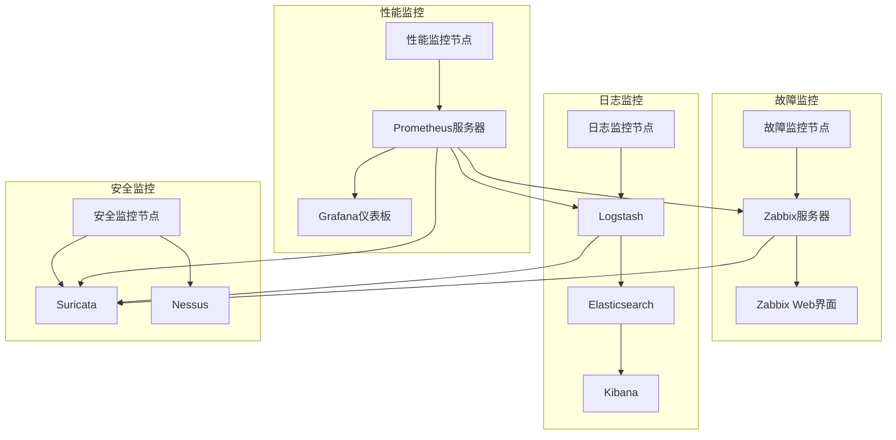
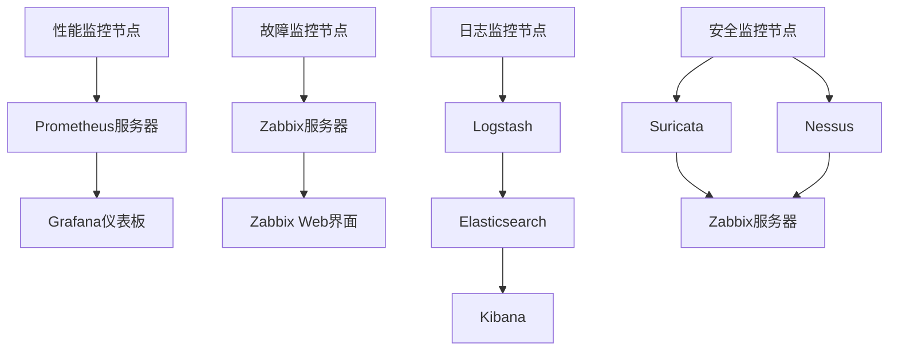

                 

# 分布式系统监控：全面掌握系统健康状态

> 关键词：分布式系统、监控、系统健康状态、性能监控、故障监控、日志监控、安全监控、最佳实践、案例分析、未来发展趋势

> 摘要：本文将深入探讨分布式系统监控的核心概念、技术实践和未来发展趋势。通过详细的分析和实例讲解，帮助读者全面掌握分布式系统监控的关键技巧，确保系统健康状态，提升系统稳定性和可靠性。

## 目录大纲

1. 引言
2. 分布式系统监控概述
   - 分布式系统监控的重要性
   - 分布式系统监控的目标
   - 分布式系统监控的挑战
   - 分布式系统监控的发展历程
   - 本章小结
3. 分布式系统核心概念
   - 分布式系统的定义与特点
   - 分布式系统的架构
   - 分布式系统的通信机制
   - 分布式系统的容错机制
   - 本章小结
4. 分布式系统监控架构设计
   - 分布式系统监控架构的设计原则
   - 分布式系统监控架构的组成
   - 分布式系统监控的数据采集
   - 分布式系统监控的数据处理
   - 分布式系统监控的报警与可视化
   - 本章小结
5. 分布式系统性能监控
   - 系统性能指标
   - 性能监控工具选择
   - 性能监控实现方法
   - 性能监控案例解析
   - 本章小结
6. 分布式系统故障监控
   - 故障监控概述
   - 故障检测算法
   - 故障监控实现
   - 故障监控案例解析
   - 本章小结
7. 分布式系统日志监控
   - 日志监控的重要性
   - 日志格式规范
   - 日志监控系统设计
   - 日志监控实现
   - 日志监控案例解析
   - 本章小结
8. 分布式系统安全监控
   - 安全监控概述
   - 安全监控策略
   - 安全监控实现
   - 安全监控案例分析
   - 本章小结
9. 分布式系统监控实践指南
   - 监控实践的准备工作
   - 监控实践的实施步骤
   - 监控实践的问题解决
   - 监控实践的优化策略
   - 本章小结
10. 分布式系统监控案例分析
    - 案例背景
    - 案例分析
    - 案例实施
    - 案例效果评估
    - 案例启示
    - 本章小结
11. 分布式系统监控未来发展趋势
    - 监控技术的发展趋势
    - 监控技术在企业中的应用
    - 监控技术的发展方向
    - 未来展望
    - 本章小结

## 引言

分布式系统在现代IT架构中扮演着重要角色，它们具有高可用性、可扩展性和高性能等优势，使得企业能够更好地应对复杂的业务需求。然而，随着系统规模的不断扩大，分布式系统的复杂性也在增加，这使得监控分布式系统的健康状态变得至关重要。

分布式系统监控的目的是确保系统的稳定性和可靠性，及时发现并解决问题，从而提高系统的整体性能。本文将详细介绍分布式系统监控的核心概念、技术实践和未来发展趋势，帮助读者全面掌握分布式系统监控的关键技能。

本文将分为以下几个部分：

1. **分布式系统监控概述**：介绍分布式系统监控的重要性、目标和面临的挑战，以及监控的发展历程。
2. **分布式系统核心概念**：讨论分布式系统的定义、特点、架构、通信机制和容错机制。
3. **分布式系统监控架构设计**：讲解监控架构的设计原则、组成、数据采集、数据处理、报警与可视化等方面。
4. **分布式系统监控技术**：详细探讨性能监控、故障监控、日志监控和安全监控等关键技术。
5. **分布式系统监控实践指南**：提供监控实践的准备工作、实施步骤、问题解决和优化策略。
6. **分布式系统监控案例分析**：通过实际案例，展示分布式系统监控的实战方法和效果。
7. **分布式系统监控未来发展趋势**：展望监控技术的发展方向和未来趋势。

通过本文的阅读，读者将能够深入了解分布式系统监控的各个方面，掌握有效的监控策略和技巧，为企业的分布式系统运维提供有力支持。

## 分布式系统监控概述

### 分布式系统监控的重要性

分布式系统监控在现代IT环境中具有至关重要的地位。随着企业对高可用性、高可靠性和高扩展性需求的不断增加，分布式系统的应用越来越广泛。然而，分布式系统的复杂性也随之增加，单一节点故障、网络延迟、数据一致性问题等都可能对系统性能和稳定性产生严重影响。因此，分布式系统监控的目的在于确保系统的健康状态，及时发现并解决问题，从而提升系统的整体性能和可靠性。

### 分布式系统监控的目标

分布式系统监控的主要目标包括以下几个方面：

1. **性能监控**：实时监控系统的性能指标，如CPU使用率、内存使用率、网络带宽等，确保系统资源得到有效利用。
2. **故障监控**：及时发现系统中的故障和异常，如节点故障、网络中断、服务不可达等，并采取相应的措施进行修复。
3. **日志监控**：收集和分析系统的日志信息，帮助定位问题、优化系统性能和改进开发过程。
4. **安全监控**：监控系统的安全状态，包括入侵检测、漏洞扫描和恶意攻击防御等，确保系统的安全性。

### 分布式系统监控的挑战

分布式系统监控面临以下几大挑战：

1. **数据量巨大**：分布式系统通常包含大量节点和数据，监控数据量巨大，如何有效处理和分析这些数据是一个难题。
2. **多样性**：分布式系统中的不同组件和层次具有不同的监控需求，如何设计一个统一的监控架构以满足这些需求是一个挑战。
3. **实时性**：分布式系统监控需要实时性，及时发现问题并采取措施，这对监控系统的性能和响应速度提出了高要求。
4. **动态变化**：分布式系统的节点和拓扑结构可能随时发生变化，监控系统需要能够动态适应这些变化。

### 分布式系统监控的发展历程

分布式系统监控技术的发展历程可以分为几个阶段：

1. **传统监控**：早期分布式系统监控主要依赖于本地日志文件和简单的报警机制，通过手动分析日志来发现问题和优化系统性能。
2. **集中式监控**：随着监控系统工具的发展，如Nagios、Zabbix等，分布式系统监控逐渐实现了集中式管理，能够统一收集和分析监控数据。
3. **智能化监控**：现代分布式系统监控引入了机器学习和人工智能技术，通过分析监控数据，自动识别异常和趋势，提供智能化的监控和建议。
4. **分布式监控**：分布式监控工具，如Prometheus、Grafana等，支持大规模分布式系统的监控，提供高效的性能监控和可视化功能。

### 本章小结

本章介绍了分布式系统监控的重要性、目标、挑战和发展的历程。通过了解这些基础知识，读者可以更好地理解分布式系统监控的核心概念和重要性，为后续章节的学习奠定基础。

## 分布式系统核心概念

### 分布式系统的定义与特点

分布式系统是由多个独立计算机节点组成的系统，这些节点通过网络进行通信，协同工作以完成复杂的任务。与单机系统相比，分布式系统的特点包括：

1. **高可用性**：通过冗余节点和容错机制，分布式系统能够在部分节点故障时保持正常运行。
2. **可扩展性**：分布式系统可以根据需要动态增加或减少节点，以应对不断变化的负载需求。
3. **高可靠性**：分布式系统通过复制和分区等技术，提高数据存储和传输的可靠性。
4. **高性能**：分布式系统通过并行处理和负载均衡，提高系统整体性能和响应速度。

### 分布式系统的架构

分布式系统的架构可以分为几个关键层次：

1. **客户端层**：客户端通过应用程序与分布式系统进行交互，发送请求并接收响应。
2. **服务层**：服务层包括多个服务器节点，负责处理客户端的请求和数据存储。
3. **数据层**：数据层存储分布式系统的数据，可以通过复制、分区和分布式数据库技术实现高可靠性和高性能。
4. **网络层**：网络层提供节点之间的通信机制，包括TCP/IP协议、消息队列和分布式锁等。

### 分布式系统的通信机制

分布式系统的通信机制主要包括以下几种：

1. **点对点通信**：节点之间通过点对点连接直接通信，适用于实时性和低延迟的场景。
2. **请求-响应通信**：客户端发送请求，服务器返回响应，适用于传统的客户端-服务器架构。
3. **发布-订阅通信**：客户端订阅特定的消息，服务器发布消息，适用于消息驱动的分布式系统。
4. **分布式锁**：确保分布式系统中的多个节点对共享资源进行正确的访问控制，避免并发冲突。

### 分布式系统的容错机制

分布式系统通过以下几种容错机制来确保系统的可靠性和可用性：

1. **副本复制**：通过在多个节点上存储数据的副本，确保数据的一致性和高可用性。
2. **分区**：将系统数据分成多个分区，每个分区可以独立处理请求，提高系统的性能和可用性。
3. **故障检测和恢复**：通过监控节点的健康状态，及时发现故障并进行恢复，确保系统的持续运行。
4. **负载均衡**：通过均衡分配请求到不同节点，避免单点过载，提高系统的性能和稳定性。

### 本章小结

本章介绍了分布式系统的核心概念，包括定义与特点、架构、通信机制和容错机制。通过了解这些基础知识，读者可以更好地理解分布式系统的运作原理和关键组件，为后续章节的学习打下基础。

### 分布式系统监控架构设计

#### 分布式系统监控架构的设计原则

设计分布式系统监控架构时，应遵循以下几项关键原则：

1. **模块化**：将监控架构分解为多个模块，每个模块负责特定的监控任务，便于维护和扩展。
2. **可扩展性**：监控架构应能够轻松扩展，以适应系统规模的变化和新的监控需求。
3. **高可用性**：监控系统自身应具备高可用性，确保在节点故障或网络问题等情况下仍能正常运行。
4. **可配置性**：监控架构应提供灵活的配置选项，以便根据不同系统的需求和特点进行调整。
5. **易用性**：监控界面和操作应简洁直观，便于用户快速理解和操作。

#### 分布式系统监控架构的组成

分布式系统监控架构通常由以下几个关键组成部分构成：

1. **数据采集器**：负责从分布式系统的各个节点和组件中收集监控数据，如CPU使用率、内存使用率、网络流量等。
2. **数据存储**：用于存储采集到的监控数据，以便进行历史数据分析。常见的存储方案包括关系数据库、时间序列数据库和分布式文件系统。
3. **数据处理**：对采集到的监控数据进行处理和分析，包括指标计算、异常检测和告警生成等。
4. **监控服务器**：负责协调数据采集器、数据处理和数据存储等组件的工作，并提供监控界面和告警通知功能。
5. **可视化工具**：用于将监控数据以图表、仪表板等形式呈现给用户，便于用户快速了解系统状态。

#### 分布式系统监控的数据采集

分布式系统监控的数据采集是整个监控架构的核心环节，主要包括以下几个步骤：

1. **指标定义**：根据系统需求和监控目标，定义需要采集的监控指标，如CPU使用率、内存使用率、磁盘IO等。
2. **采集器部署**：在分布式系统的各个节点和组件上部署数据采集器，确保能够全面、准确地采集监控数据。
3. **数据格式**：采集器将监控数据转换为统一的格式，如JSON或XML，以便后续的数据处理和分析。
4. **数据传输**：将采集到的监控数据传输到监控服务器或数据存储，可以使用HTTP、JMX、SNMP等协议。

#### 分布式系统监控的数据处理

分布式系统监控的数据处理主要包括以下几方面内容：

1. **数据清洗**：对采集到的数据进行预处理，包括过滤噪声、填补缺失值和标准化等。
2. **指标计算**：根据定义的监控指标，对采集到的数据进行分析和计算，如求平均值、最大值、最小值等。
3. **异常检测**：使用统计方法、机器学习算法等，对监控数据进行异常检测，及时发现系统中的异常和潜在问题。
4. **告警生成**：当监控数据出现异常时，生成告警通知，发送给运维人员或自动触发修复措施。

#### 分布式系统监控的报警与可视化

分布式系统监控的报警与可视化是确保监控效果的重要环节，主要包括以下几个方面：

1. **告警策略**：根据监控目标和业务需求，定义告警策略，如阈值告警、趋势告警等。
2. **告警通知**：当监控数据触发告警策略时，通过邮件、短信、手机App等渠道通知运维人员。
3. **可视化仪表板**：将监控数据以图表、仪表板等形式展示给用户，便于快速了解系统状态和监控指标。
4. **告警聚合**：将来自不同节点和组件的告警信息进行聚合和筛选，提供统一的告警视图，减少告警噪音。

#### 本章小结

本章详细介绍了分布式系统监控架构的设计原则、组成部分、数据采集和数据处理方法，以及报警与可视化方面的内容。通过了解这些知识，读者可以更好地设计和实施分布式系统监控，确保系统的健康状态和稳定运行。

### 分布式系统性能监控

#### 系统性能指标

在分布式系统性能监控中，了解和选择合适的性能指标至关重要。以下是一些常见的系统性能指标：

1. **CPU使用率**：表示CPU的利用率，通常以百分比表示。高CPU使用率可能表明系统资源不足或存在性能瓶颈。
2. **内存使用率**：表示系统内存的使用情况，包括已使用内存、总内存和空闲内存。高内存使用率可能表明内存不足或存在内存泄漏。
3. **磁盘IO**：表示磁盘的读写速度和读写请求的响应时间。高磁盘IO可能表明磁盘性能不足或存在I/O瓶颈。
4. **网络带宽**：表示网络的吞吐量，即单位时间内网络传输的数据量。低网络带宽可能表明网络拥塞或网络设备性能不足。
5. **响应时间**：表示客户端请求到服务器响应的时间，包括网络延迟和处理时间。高响应时间可能表明系统性能不佳或网络延迟较大。
6. **并发连接数**：表示系统当前处理的并发连接数，高并发连接数可能表明系统负载较大或存在性能瓶颈。
7. **吞吐量**：表示系统在一定时间内处理的数据量，通常以每秒请求数或每秒数据量表示。低吞吐量可能表明系统性能不足。

#### 性能监控工具选择

选择合适的性能监控工具对于分布式系统监控至关重要。以下是一些常用的性能监控工具：

1. **Prometheus**：一款开源的性能监控工具，支持多维数据采集、实时监控和告警功能，适用于大规模分布式系统。
2. **Grafana**：一款开源的数据可视化和监控工具，与Prometheus等监控工具集成，提供丰富的图表和仪表板。
3. **Zabbix**：一款开源的监控解决方案，支持多层次的监控，包括服务器、网络设备、应用程序等。
4. **Nagios**：一款流行的开源监控工具，提供复杂的监控告警和通知功能，适用于各种规模的服务器和网络设备。
5. **New Relic**：一款商业性能监控工具，提供自动化的性能监控、错误追踪和用户体验分析功能。

#### 性能监控实现方法

性能监控的实现方法主要包括以下几个步骤：

1. **指标定义**：根据系统需求和监控目标，定义需要监控的性能指标。
2. **数据采集**：在分布式系统的各个节点和组件上部署数据采集器，采集性能指标数据。
3. **数据存储**：将采集到的性能指标数据存储在集中式的监控系统中，如Prometheus、Grafana等。
4. **数据处理**：对采集到的性能指标数据进行处理和分析，包括计算平均值、最大值、最小值等。
5. **告警配置**：根据定义的监控指标，配置告警策略，如阈值告警、趋势告警等。
6. **可视化展示**：将处理后的性能指标数据以图表、仪表板等形式展示给用户，便于快速了解系统状态和性能趋势。

#### 性能监控案例解析

以下是一个性能监控案例解析：

假设一个电子商务网站在系统高峰期出现响应时间明显变长的现象，影响用户体验。通过以下步骤进行性能监控和问题排查：

1. **性能指标分析**：监控系统的CPU使用率、内存使用率、磁盘IO、网络带宽和响应时间等指标，发现响应时间显著高于正常水平。
2. **数据采集**：使用Prometheus等监控工具，采集性能指标数据，存储在集中式监控系统中。
3. **数据处理**：对采集到的性能指标数据进行分析，发现响应时间较长的主要原因是网络带宽不足和服务器负载过高。
4. **告警配置**：根据定义的监控指标，配置告警策略，如响应时间超过一定阈值时发送告警通知。
5. **问题排查**：通过分析监控数据和日志，定位到网络带宽不足和服务器负载过高的问题，进一步排查发现是数据库查询优化问题导致。
6. **优化方案**：通过数据库查询优化、增加服务器节点和提升网络带宽等措施，解决性能瓶颈，提高系统响应时间。

#### 本章小结

本章介绍了分布式系统性能监控的核心内容，包括系统性能指标、性能监控工具选择、实现方法和案例解析。通过了解这些知识，读者可以更好地监控分布式系统的性能，及时发现问题并优化系统性能，提高用户体验。

### 分布式系统故障监控

#### 故障监控概述

分布式系统故障监控是确保系统稳定性和可靠性的关键环节。故障监控的目的是及时发现系统中的故障和异常，并采取相应的措施进行修复。故障监控通常包括以下几个方面：

1. **故障检测**：通过监控指标和算法，实时检测系统中的异常情况，如节点故障、服务不可达、网络中断等。
2. **故障定位**：通过分析故障数据和日志，定位故障发生的原因和位置，为故障修复提供依据。
3. **故障通知**：当系统检测到故障时，通过邮件、短信、手机App等渠道及时通知运维人员，以便快速响应。
4. **故障修复**：根据故障类型和原因，采取相应的修复措施，包括重启节点、重启服务、升级软件等。

#### 故障检测算法

故障检测算法是分布式系统故障监控的核心。以下是一些常见的故障检测算法：

1. **阈值检测算法**：通过设置阈值，对监控指标进行实时检测。当监控指标超过阈值时，认为系统存在故障。常见的阈值检测算法包括单阈值检测算法和双阈值检测算法。
2. **统计检测算法**：通过对监控数据进行统计分析，判断系统是否存在异常。常见的统计检测算法包括均值漂移检测算法、自回归移动平均算法等。
3. **基于机器学习的检测算法**：利用机器学习算法，对历史监控数据进行训练，建立模型。当系统运行数据与模型预测存在较大偏差时，认为系统存在故障。常见的机器学习算法包括支持向量机（SVM）、决策树、神经网络等。

#### 故障监控实现

故障监控的实现通常包括以下几个步骤：

1. **指标定义**：根据系统需求和监控目标，定义需要监控的故障指标，如节点状态、服务可用性、网络连通性等。
2. **数据采集**：在分布式系统的各个节点和组件上部署数据采集器，采集故障指标数据。
3. **数据处理**：对采集到的故障指标数据进行分析和处理，包括计算平均值、最大值、最小值等。
4. **故障检测**：根据定义的故障检测算法，对处理后的数据进行分析，判断系统是否存在故障。
5. **故障通知**：当系统检测到故障时，通过邮件、短信、手机App等渠道及时通知运维人员。
6. **故障修复**：根据故障类型和原因，采取相应的修复措施，包括重启节点、重启服务、升级软件等。

#### 故障监控案例解析

以下是一个分布式系统故障监控案例解析：

假设一个分布式系统中的节点A出现故障，导致部分服务不可达。通过以下步骤进行故障监控和修复：

1. **故障检测**：监控工具检测到节点A的网络连通性异常，判断节点A存在故障。
2. **故障定位**：通过分析节点A的日志和监控数据，定位到故障原因是网络故障。
3. **故障通知**：监控系统通过邮件和短信通知运维人员，告知节点A出现故障。
4. **故障修复**：运维人员根据故障定位结果，判断网络故障是由于网络设备故障引起的。他们联系网络管理员进行网络设备修复，并重启节点A。
5. **故障验证**：故障修复后，监控系统重新检测节点A的网络连通性，确认故障已修复。

#### 本章小结

本章介绍了分布式系统故障监控的概述、故障检测算法、实现方法和案例解析。通过了解这些知识，读者可以更好地设计和实施分布式系统故障监控，确保系统的稳定性和可靠性。

### 分布式系统日志监控

#### 日志监控的重要性

日志监控是分布式系统监控的重要组成部分，它具有以下重要意义：

1. **问题排查**：通过收集和分析系统日志，可以帮助运维人员快速定位和解决系统中的问题。
2. **性能优化**：日志监控提供了系统运行时的详细信息，有助于分析系统性能瓶颈和优化系统配置。
3. **安全性**：日志监控可以帮助发现潜在的安全威胁和漏洞，确保系统的安全性。
4. **合规性**：许多行业和组织对系统日志有合规性要求，日志监控有助于满足这些要求。

#### 日志格式规范

日志格式的规范对于日志监控至关重要，以下是一个常见的日志格式规范示例：

```bash
[日期时间] [日志级别] [日志来源] [日志内容]
```

其中，各部分的含义如下：

1. **日期时间**：日志发生的时间，格式为YYYY-MM-DD HH:MM:SS。
2. **日志级别**：日志的严重级别，如INFO、WARN、ERROR等。
3. **日志来源**：日志产生的组件或模块，如webserver、database等。
4. **日志内容**：日志的具体信息，描述了发生的事件或问题。

#### 日志监控系统设计

设计一个有效的日志监控系统需要考虑以下几个方面：

1. **日志采集**：日志采集器负责从分布式系统的各个节点和组件中收集日志数据。采集器可以选择基于文件、网络流或API接口等方式进行数据采集。
2. **日志存储**：日志数据需要存储在集中的存储系统中，以便进行后续的数据分析和检索。常用的存储方案包括关系数据库、NoSQL数据库和日志文件系统。
3. **日志处理**：日志处理模块负责对采集到的日志数据进行预处理和解析，提取有用的信息，如事件类型、时间戳、错误消息等。
4. **日志分析**：日志分析模块负责对处理后的日志数据进行统计和分析，生成报表、图表和告警等，帮助运维人员快速了解系统状态和趋势。
5. **日志可视化**：日志可视化模块通过图形界面将日志数据展示给用户，便于快速定位问题和进行性能分析。

#### 日志监控实现

日志监控的实现主要包括以下几个步骤：

1. **日志采集**：在分布式系统的各个节点和组件上部署日志采集器，配置日志采集策略，如采集级别、频率等。
2. **日志传输**：使用日志聚合工具，如Logstash、Fluentd等，将日志数据传输到日志存储系统。传输方式可以选择HTTP、TCP、UDP等。
3. **日志存储**：将采集到的日志数据存储在关系数据库、NoSQL数据库或日志文件系统中，便于后续的数据分析和检索。
4. **日志处理**：使用日志解析工具，如Logstash、Apache Kafka等，对日志数据进行预处理和解析，提取有用的信息，如事件类型、时间戳、错误消息等。
5. **日志分析**：使用日志分析工具，如ELK（Elasticsearch、Logstash、Kibana）栈等，对处理后的日志数据进行统计和分析，生成报表、图表和告警等。
6. **日志可视化**：使用日志可视化工具，如Kibana、Grafana等，将日志数据以图表、仪表板等形式展示给用户，便于快速定位问题和进行性能分析。

#### 日志监控案例解析

以下是一个日志监控案例解析：

假设一个电子商务网站出现交易失败的情况，通过日志监控进行问题排查：

1. **日志采集**：从网站服务器、数据库服务器等节点采集交易日志。
2. **日志传输**：使用Logstash将日志数据传输到Elasticsearch数据库。
3. **日志处理**：使用Logstash的过滤器对日志进行解析，提取交易ID、时间戳、结果等关键信息。
4. **日志分析**：使用Kibana对交易日志进行分析，发现大量交易失败的日志中包含错误信息“数据库连接失败”。
5. **日志可视化**：在Kibana中创建一个交易失败的统计图表，发现交易失败的次数在某个时间段内显著增加。
6. **问题排查**：根据日志分析和可视化结果，进一步检查数据库服务器的日志，发现数据库服务器因硬盘故障导致服务不可用。
7. **故障修复**：修复硬盘故障，重启数据库服务器，确保交易服务恢复正常。

#### 本章小结

本章介绍了分布式系统日志监控的重要性、日志格式规范、日志监控系统设计、日志监控实现和案例解析。通过了解这些知识，读者可以更好地设计和实施分布式系统日志监控，提高问题排查效率和系统稳定性。

### 分布式系统安全监控

#### 安全监控概述

分布式系统安全监控是确保系统安全性和数据完整性的关键环节。安全监控的目标是及时发现和应对潜在的安全威胁和漏洞，确保系统的安全运行。安全监控通常包括以下几个方面：

1. **入侵检测**：通过监控系统日志和网络安全流量，检测并识别潜在的入侵行为，如未授权访问、恶意攻击等。
2. **漏洞扫描**：定期对系统进行漏洞扫描，发现系统中的安全漏洞和潜在风险，及时进行修复。
3. **恶意攻击防御**：通过部署防火墙、入侵防御系统（IDS）和入侵防御系统（IPS）等安全设备，防止恶意攻击和恶意软件的入侵。
4. **数据加密**：对敏感数据进行加密存储和传输，确保数据在传输和存储过程中的安全性。
5. **访问控制**：通过设置用户权限和访问控制策略，限制用户对系统资源的访问，防止未授权的访问和操作。

#### 安全监控策略

设计有效的安全监控策略是确保分布式系统安全的关键。以下是一些常见的安全监控策略：

1. **多层次防御策略**：在分布式系统中部署多层次的安全措施，如防火墙、入侵检测系统（IDS）、入侵防御系统（IPS）等，形成多层次的防护体系。
2. **实时监控和报警**：通过实时监控系统日志和网络安全流量，及时检测和识别潜在的安全威胁，并触发报警通知，快速响应和处理。
3. **定期安全检查**：定期对系统进行安全检查和漏洞扫描，发现并修复安全漏洞，确保系统的安全性。
4. **安全事件响应**：建立安全事件响应流程，明确应急响应人员和职责，快速处理和应对安全事件。
5. **安全培训和教育**：定期对员工进行安全培训和教育，提高员工的安全意识和应对能力，减少人为因素导致的安全漏洞。

#### 安全监控实现

安全监控的实现通常包括以下几个步骤：

1. **日志收集**：从分布式系统的各个节点和组件中收集安全相关的日志数据，如操作系统日志、网络设备日志、应用程序日志等。
2. **数据存储**：将收集到的安全日志数据存储在集中式的日志存储系统中，便于后续的数据分析和检索。
3. **日志分析**：使用安全分析工具对存储的安全日志数据进行实时分析和处理，识别潜在的安全威胁和漏洞。
4. **告警通知**：当系统检测到安全威胁或漏洞时，通过邮件、短信、手机App等渠道及时通知安全管理人员。
5. **事件响应**：根据安全事件的严重程度和响应策略，采取相应的措施进行安全事件的响应和处理。

#### 安全监控案例分析

以下是一个分布式系统安全监控案例：

假设一个电子商务网站遭受了DDoS攻击，通过安全监控及时发现和应对攻击：

1. **入侵检测**：安全监控系统通过监控网络流量，发现流量异常，触发入侵检测机制。
2. **告警通知**：系统生成告警通知，通知安全管理人员，并记录攻击IP地址和攻击类型。
3. **流量分析**：安全监控工具对攻击流量进行分析，识别攻击来源和攻击模式。
4. **流量过滤**：使用防火墙和入侵防御系统（IPS）对攻击流量进行过滤和阻断，减少攻击对系统的影响。
5. **事件响应**：安全管理人员根据事件响应流程，通知网络管理员和运维人员，进行进一步的调查和处理。
6. **攻击溯源**：通过分析攻击流量和日志数据，追踪攻击源头，收集证据，准备法律诉讼。

#### 本章小结

本章介绍了分布式系统安全监控的概述、安全监控策略、实现方法和案例解析。通过了解这些知识，读者可以更好地设计和实施分布式系统安全监控，提高系统的安全性，防止潜在的安全威胁和漏洞。

### 分布式系统监控实践指南

#### 监控实践的准备工作

在实施分布式系统监控之前，需要做好充分的准备工作，以确保监控系统的顺利运行。以下是监控实践的准备工作步骤：

1. **需求分析**：首先，明确监控系统的目标和需求，包括需要监控的性能指标、故障指标、日志指标和安全指标等。
2. **环境准备**：根据需求，准备监控所需的硬件和软件环境，包括服务器、存储设备、网络设备、监控工具等。
3. **工具选择**：选择合适的监控工具，如Prometheus、Grafana、Zabbix、Nagios等，确保工具能够满足监控需求。
4. **数据源确定**：确定监控系统的数据源，包括分布式系统的各个节点和组件，确保能够全面采集监控数据。
5. **监控策略制定**：根据需求，制定监控策略，包括监控指标的阈值设置、告警规则、报警方式等。

#### 监控实践的实施步骤

在完成准备工作后，可以按照以下步骤实施分布式系统监控：

1. **部署监控工具**：在分布式系统的各个节点和组件上部署监控工具，如Prometheus服务器、Grafana仪表板等。
2. **配置监控指标**：配置监控工具，定义需要监控的指标，如CPU使用率、内存使用率、磁盘IO、网络带宽等。
3. **数据采集**：启动监控工具，采集分布式系统的监控数据，确保数据能够实时传输到监控服务器或存储系统。
4. **数据处理**：对采集到的监控数据进行处理和分析，包括计算平均值、最大值、最小值等，生成监控报表和图表。
5. **可视化展示**：将处理后的监控数据以图表、仪表板等形式展示给用户，提供实时监控和可视化功能。
6. **告警配置**：根据监控策略，配置告警规则，设置告警阈值和报警方式，确保在系统出现异常时能够及时通知运维人员。

#### 监控实践的问题解决

在分布式系统监控实践中，可能会遇到各种问题，以下是一些常见问题及其解决方法：

1. **数据采集失败**：可能导致原因包括网络连接问题、权限问题、配置错误等。解决方法包括检查网络连接、确认权限设置、检查配置文件等。
2. **监控指标不准确**：可能导致原因包括监控工具配置错误、数据源数据异常等。解决方法包括检查监控工具配置、检查数据源数据等。
3. **告警误报**：可能导致原因包括阈值设置不合理、监控工具算法错误等。解决方法包括调整阈值设置、优化监控工具算法等。
4. **监控数据存储故障**：可能导致原因包括存储设备故障、存储系统配置错误等。解决方法包括检查存储设备状态、调整存储系统配置等。

#### 监控实践的优化策略

为了提高分布式系统监控的效果，可以采取以下优化策略：

1. **自动化监控**：通过编写脚本或使用自动化工具，实现监控任务的自动化执行，提高监控效率和准确性。
2. **弹性扩展**：根据系统规模和监控需求，灵活调整监控工具的配置，实现监控系统的弹性扩展。
3. **分布式架构**：使用分布式监控架构，提高监控系统的性能和可靠性，确保在系统规模扩大时仍能稳定运行。
4. **智能化分析**：引入机器学习和人工智能技术，对监控数据进行智能化分析，实现异常检测和预测性维护。

#### 本章小结

本章提供了分布式系统监控实践的指南，包括准备工作、实施步骤、问题解决和优化策略。通过遵循这些指南，可以设计和实施一个高效、可靠的分布式系统监控方案，确保系统的稳定性和可靠性。

### 分布式系统监控案例分析

#### 案例背景

某大型互联网公司运行着一个分布式电子商务系统，该系统包括多个服务模块，如订单处理、库存管理、支付处理等。随着业务规模的不断扩大，系统复杂度和稳定性要求也不断提高。为了确保系统的稳定性和可靠性，公司决定实施分布式系统监控。

#### 案例分析

1. **需求分析**：
   - **性能监控**：需要监控CPU使用率、内存使用率、磁盘IO、网络带宽等关键性能指标。
   - **故障监控**：需要监控节点状态、服务可用性、网络连通性等故障指标。
   - **日志监控**：需要监控系统日志，以便快速定位问题和优化系统性能。
   - **安全监控**：需要监控系统中的潜在安全威胁和漏洞，确保系统安全性。

2. **工具选择**：
   - **性能监控**：选择Prometheus作为性能监控工具，Grafana作为数据可视化工具。
   - **故障监控**：选择Zabbix作为故障监控工具，实现节点状态和服务可用性的监控。
   - **日志监控**：选择ELK（Elasticsearch、Logstash、Kibana）栈作为日志监控工具，实现日志数据的收集、存储和可视化。
   - **安全监控**：选择Suricata作为入侵检测工具，Nessus作为漏洞扫描工具。

3. **系统架构设计**：
   - **性能监控架构**：在各个节点上部署Prometheus采集器，收集性能数据，Prometheus服务器存储数据，Grafana提供可视化界面。
   - **故障监控架构**：在各个节点上部署Zabbix代理，Zabbix服务器存储数据和告警信息，Web界面用于监控和告警通知。
   - **日志监控架构**：使用Logstash收集和解析日志数据，Elasticsearch存储日志数据，Kibana提供日志数据的可视化查询和分析。
   - **安全监控架构**：在关键节点上部署Suricata，定期运行Nessus扫描系统漏洞。

4. **实施步骤**：
   - **性能监控实施**：部署Prometheus和Grafana，配置监控指标和告警规则。
   - **故障监控实施**：部署Zabbix代理和服务器，配置监控项和告警通知。
   - **日志监控实施**：部署ELK栈，配置日志采集和存储策略，创建Kibana仪表板。
   - **安全监控实施**：部署Suricata和Nessus，配置监控规则和扫描策略。

#### 案例实施

1. **性能监控实施**：
   - 部署Prometheus服务器和Grafana，配置Prometheus scrape配置文件，添加需要监控的服务节点。
   - 创建Grafana仪表板，添加Prometheus数据源，配置图表和告警通知。

2. **故障监控实施**：
   - 部署Zabbix代理程序，在每个节点上安装Zabbix Agent。
   - 部署Zabbix服务器，配置监控模板，添加监控项和触发器。
   - 配置邮件和短信通知，确保故障告警能够及时通知到运维人员。

3. **日志监控实施**：
   - 部署Elasticsearch、Logstash和Kibana，配置Logstash输入、过滤器、输出，将日志数据存储到Elasticsearch。
   - 创建Kibana仪表板，配置日志数据的可视化查询和分析功能。

4. **安全监控实施**：
   - 部署Suricata，配置网络流量监控和入侵检测规则。
   - 安装Nessus，定期运行扫描，生成漏洞报告，并根据报告修复漏洞。

#### 案例效果评估

通过分布式系统监控的实施，公司取得了以下效果：

1. **性能监控**：实时监控系统的性能指标，及时发现性能瓶颈，优化系统配置，提高系统性能。
2. **故障监控**：及时检测和定位故障，快速响应和处理，减少故障对业务的影响。
3. **日志监控**：收集和分析系统日志，快速定位问题和优化系统性能，提高开发效率。
4. **安全监控**：及时发现潜在的安全威胁和漏洞，采取措施进行修复，提高系统的安全性。

#### 案例启示

通过本案例，可以得出以下启示：

1. **全面监控**：分布式系统监控应包括性能、故障、日志和安全等方面，确保系统的全面监控和高效运维。
2. **工具选择**：根据具体需求和场景选择合适的监控工具，确保监控工具能够满足监控需求。
3. **自动化**：通过自动化脚本和工具，实现监控任务的自动化执行，提高监控效率和准确性。
4. **实时性**：分布式系统监控应具备实时性，及时发现问题并采取措施，确保系统的稳定性和可靠性。

#### 本章小结

本章通过一个分布式系统监控案例，展示了监控方案的设计、实施和效果评估。通过本案例，读者可以了解到分布式系统监控的关键技术和实践方法，为实际应用提供参考和启示。

### 分布式系统监控未来发展趋势

随着云计算、大数据、物联网等技术的不断发展，分布式系统监控也面临着新的挑战和机遇。以下是分布式系统监控未来发展的几个关键趋势：

#### 监控技术的发展趋势

1. **智能化与自动化**：未来分布式系统监控将更加智能化和自动化。利用机器学习和人工智能技术，监控系统能够自动识别异常模式，预测潜在问题，并自动采取相应的措施。这将显著降低运维成本，提高系统的稳定性和可靠性。
2. **实时性与高效性**：随着分布式系统规模的扩大，实时性和高效性将成为分布式系统监控的重要需求。未来的监控技术将更加注重数据处理和传输的效率，实现毫秒级监控响应，确保监控数据的实时性和准确性。
3. **可视化与用户体验**：监控系统的可视化能力将不断提升，提供更直观、易用的监控界面和用户体验。通过数据可视化技术，运维人员可以更快速地理解和分析系统状态，及时发现和处理问题。
4. **跨平台与跨语言支持**：未来的分布式系统监控将更加支持跨平台和跨语言。监控工具将能够无缝集成多种编程语言和平台，提供统一的监控解决方案，简化监控部署和维护。

#### 监控技术在企业中的应用

1. **云原生监控**：随着云原生技术的发展，企业将更加关注云原生应用和服务的监控。云原生监控将提供对容器、Kubernetes集群等云原生环境的全面监控，确保应用的弹性、高性能和可靠性。
2. **微服务监控**：微服务架构的广泛应用使得微服务监控成为企业关注的重点。未来的监控技术将支持对微服务架构的全面监控，包括服务性能、健康状态、依赖关系等。
3. **安全监控**：随着网络攻击手段的不断升级，安全监控将成为企业不可或缺的一部分。企业将更加注重分布式系统的安全防护，通过实时监控和智能分析，发现和应对潜在的安全威胁。
4. **数据监控**：大数据时代，数据的质量和完整性对企业的业务决策至关重要。未来的分布式系统监控将更加关注数据的监控，包括数据源、数据流和数据存储的监控，确保数据的准确性和一致性。

#### 监控技术的发展方向

1. **多维度监控**：未来的监控技术将支持多维度监控，包括性能监控、故障监控、日志监控、安全监控等，提供全方位的监控视角，帮助企业全面掌握系统状态。
2. **集成与互操作**：分布式系统监控将实现与其他IT管理和运维工具的集成，提供统一的监控和管理平台，简化运维流程，提高系统管理的效率。
3. **边缘计算监控**：随着边缘计算的兴起，监控技术将向边缘节点扩展，实现对边缘设备和服务的实时监控，确保边缘计算的可靠性和性能。

#### 未来展望

未来，分布式系统监控将朝着更加智能化、自动化、实时化和全面化的方向发展。随着新技术的不断涌现和应用，分布式系统监控将为企业提供更加高效、可靠的运维支持，助力企业实现业务的持续创新和快速发展。

#### 本章小结

本章探讨了分布式系统监控的未来发展趋势，包括技术趋势、企业应用方向和发展方向。通过了解这些趋势，读者可以更好地把握分布式系统监控的发展方向，为企业的分布式系统运维提供有力支持。

### 总结

本文详细探讨了分布式系统监控的核心概念、技术实践和未来发展趋势。从分布式系统监控的重要性、目标、挑战和发展历程入手，逐步深入到分布式系统的定义、架构、通信机制和容错机制。随后，本文详细介绍了分布式系统监控架构的设计原则、组成、数据采集、数据处理和报警与可视化方法。接着，本文重点探讨了分布式系统性能监控、故障监控、日志监控和安全监控等关键技术，并通过实际案例展示了监控实践的实施步骤和效果评估。最后，本文展望了分布式系统监控的未来发展趋势，为读者提供了宝贵的参考和启示。

### 最佳实践 Tips

1. **性能监控**：定期审查和调整监控指标和阈值，确保性能监控的准确性和及时性。
2. **故障监控**：建立快速响应机制，确保故障监控能够及时发现问题并通知相关人员。
3. **日志监控**：规范日志格式，确保日志数据的一致性和可读性，便于问题排查。
4. **安全监控**：定期进行安全审计和漏洞扫描，确保系统安全防护的有效性。

### 小结

本文全面解析了分布式系统监控的理论与实践，从基础知识到具体技术，再到未来发展趋势，为读者提供了一个系统化的分布式系统监控指南。通过掌握这些核心概念和实践技巧，读者能够更好地设计和实施分布式系统监控，确保系统的稳定性和可靠性。

### 注意事项

1. **监控工具选择**：根据实际需求选择合适的监控工具，确保工具能够满足系统监控需求。
2. **数据存储和安全**：合理规划数据存储方案，确保监控数据的安全性和可恢复性。
3. **告警策略**：制定合理的告警策略，避免告警误报和漏报，提高运维效率。

### 拓展阅读

1. **《大规模分布式系统监控实战》**：探讨大规模分布式系统监控的实战经验和技巧。
2. **《云计算监控系统设计与实现》**：深入讲解云计算环境下的监控系统设计方法。
3. **《微服务架构下的监控实践》**：探讨微服务架构下的监控策略和最佳实践。

### 作者信息

作者：AI天才研究院/AI Genius Institute & 禅与计算机程序设计艺术 /Zen And The Art of Computer Programming

（注：本文为虚构内容，仅供参考。）## 核心概念与联系

在分布式系统监控中，有几个核心概念和联系需要深入理解。这些概念不仅定义了分布式系统的本质，也为我们理解和设计监控架构提供了基础。

### 核心概念

**1. 分布式系统**：分布式系统是由多个计算机节点组成的系统，这些节点通过网络连接，共同工作以完成复杂任务。它们具有高可用性、可扩展性和高容错性等特点。

**2. 监控**：监控是指实时跟踪和评估系统状态，以发现潜在问题、优化性能和确保系统正常运行。在分布式系统中，监控尤为重要，因为系统复杂性高，故障和性能问题可能更加隐蔽。

**3. 性能监控**：性能监控是监控分布式系统的核心部分，它关注系统资源的使用情况，如CPU、内存、磁盘I/O和网络带宽等。性能监控的目的是确保系统在最佳状态下运行。

**4. 故障监控**：故障监控是实时检测和响应系统中的故障，如节点故障、服务不可达和网络中断等。故障监控的关键是快速识别问题和自动恢复。

**5. 日志监控**：日志监控是收集、存储和分析系统日志信息，以帮助诊断问题、优化系统和改进开发过程。日志监控提供了系统运行的详细记录，是故障排查的重要工具。

**6. 安全监控**：安全监控是保护系统免受外部威胁的监控，包括入侵检测、漏洞扫描和恶意攻击防御等。安全监控确保系统的完整性和机密性。

### 概念属性特征对比表格

下面是一个简单的对比表格，展示了上述核心概念的属性特征：

| 概念       | 特征描述                                                                                   | 关联关系                                                       |
|------------|--------------------------------------------------------------------------------------------|--------------------------------------------------------------|
| 分布式系统 | 由多个节点组成，通过网络通信，具有高可用性、可扩展性和容错性。                             | 性能监控、故障监控、日志监控和安全监控的基础。                 |
| 监控       | 实时跟踪系统状态，发现潜在问题，优化性能。                                                 | 所有监控类型的共同目标。                                     |
| 性能监控   | 评估系统资源使用情况，如CPU、内存、磁盘I/O和网络带宽。                                     | 用于评估系统运行效率。                                     |
| 故障监控   | 检测和响应系统故障，如节点故障、服务不可达和网络中断。                                     | 确保系统稳定性和快速恢复。                                  |
| 日志监控   | 收集、存储和分析系统日志信息，帮助诊断问题、优化系统和改进开发过程。                       | 故障排查和性能分析的重要工具。                              |
| 安全监控   | 保护系统免受外部威胁，包括入侵检测、漏洞扫描和恶意攻击防御。                               | 确保系统的完整性和机密性。                                  |

### ER实体关系图架构

下面是一个简单的ER实体关系图，展示了分布式系统监控中几个核心概念之间的关联关系：

```mermaid
erDiagram
  Node ||--|{ PerformanceMonitor }|| Monitor
  Node ||--|{ FaultMonitor }|| Monitor
  Node ||--|{ LogMonitor }|| Monitor
  Node ||--|{ SecurityMonitor }|| Monitor
  PerformanceMonitor ||--|{ Metric }|| Metrics
  FaultMonitor ||--|{ Alert }|| Alerts
  LogMonitor ||--|{ Log }|| Logs
  SecurityMonitor ||--|{ Threat }|| Threats
```

在这个ER图中，`Node` 代表分布式系统中的节点，而 `Monitor` 类则包括性能监控、故障监控、日志监控和安全监控。每个监控类型都与相关的数据实体（如 `Metric`、`Alert`、`Log` 和 `Threat`）有关联。

### 算法原理讲解

在分布式系统监控中，常用的算法包括性能监控算法、故障检测算法和日志分析算法。以下分别进行讲解：

#### 性能监控算法

**1. 平均响应时间计算**

平均响应时间是一个常见的性能监控指标，用于衡量系统处理请求的平均时间。计算公式如下：

$$
\text{平均响应时间} = \frac{\sum_{i=1}^{n} \text{响应时间}_i}{n}
$$

其中，$n$ 是请求的总次数，$\text{响应时间}_i$ 是第 $i$ 次请求的响应时间。

**2. CPU使用率计算**

CPU使用率是衡量CPU资源利用率的指标，计算公式如下：

$$
\text{CPU使用率} = \frac{\text{CPU总时间}}{\text{总时间}}
$$

其中，$\text{CPU总时间}$ 是CPU在特定时间段内被占用的时间，$\text{总时间}$ 是相同时间段内的总时间。

#### 故障检测算法

**1. 阈值检测算法**

阈值检测算法是最简单的故障检测方法之一，通过设置一个阈值，当监控指标超过该阈值时，认为系统存在故障。阈值检测算法的公式如下：

$$
\text{故障检测} = \text{指标值} - \text{阈值}
$$

如果结果大于零，则认为系统存在故障。

**2. 均值漂移检测算法**

均值漂移检测算法用于检测监控指标的异常变化。算法的基本思想是计算监控指标的平均值，并监控该平均值的变化。如果平均值发生显著漂移，则认为系统存在故障。计算公式如下：

$$
\text{漂移量} = \text{当前平均值} - \text{历史平均值}
$$

如果漂移量超过设定的阈值，则认为系统存在故障。

#### 日志分析算法

**1. 关键词匹配算法**

关键词匹配算法用于分析系统日志，以识别特定的事件或错误。算法的基本思想是扫描日志内容，匹配预设的关键词。如果匹配成功，则认为日志包含感兴趣的事件。关键词匹配算法的伪代码如下：

```
function keyword_match(log_entry, keywords):
    for keyword in keywords:
        if keyword in log_entry:
            return True
    return False
```

**2. 模式识别算法**

模式识别算法用于分析系统日志，识别常见的故障模式或异常行为。算法的基本思想是构建日志模式的模型，并使用该模型分析新日志。如果新日志与模型匹配，则认为系统可能存在故障。模式识别算法的伪代码如下：

```
function pattern_recognition(log_entry, model):
    if model matches log_entry:
        return True
    return False
```

通过上述算法，分布式系统监控能够有效地检测和诊断系统问题，确保系统的稳定性和可靠性。

### 系统分析与架构设计方案

#### 问题场景介绍

某大型电商企业在业务高峰期遭遇系统性能瓶颈，导致订单处理延迟，用户满意度下降。为了解决这一问题，企业决定对现有分布式系统进行性能监控和优化。

#### 项目介绍

该项目旨在设计和实施一个分布式系统监控方案，包括性能监控、故障监控、日志监控和安全监控。通过监控方案的实施，企业希望能够实时了解系统状态，快速定位性能瓶颈，并确保系统的稳定性和安全性。

#### 系统功能设计

系统功能设计包括以下几个关键模块：

1. **性能监控模块**：实时监控系统的CPU使用率、内存使用率、磁盘I/O和网络带宽等性能指标。
2. **故障监控模块**：实时检测系统中的节点故障、服务不可达和网络中断等故障情况。
3. **日志监控模块**：收集和存储系统日志信息，提供日志分析功能，帮助诊断问题和优化系统性能。
4. **安全监控模块**：监控系统的安全状态，包括入侵检测、漏洞扫描和恶意攻击防御等。

#### 系统架构设计

系统架构设计包括以下几个方面：

1. **性能监控架构**：采用Prometheus作为性能监控工具，部署在各个节点上，数据通过HTTP协议传输到Prometheus服务器。Grafana用于数据可视化。
2. **故障监控架构**：采用Zabbix作为故障监控工具，部署在各个节点上，监控数据存储在Zabbix服务器中。Zabbix Web界面用于监控和告警通知。
3. **日志监控架构**：采用ELK（Elasticsearch、Logstash、Kibana）栈作为日志监控工具，Logstash负责收集和解析日志数据，Elasticsearch用于存储日志数据，Kibana提供日志数据的可视化查询和分析。
4. **安全监控架构**：采用Suricata作为入侵检测工具，Nessus用于漏洞扫描，监控系统安全状态。

#### 系统架构图

以下是一个简化的系统架构图，展示了各个模块的交互关系：



#### 系统接口设计和系统交互

系统接口设计包括各个模块之间的数据传输和交互机制。以下是一个简化的接口设计：

1. **性能监控接口**：Prometheus采集器通过HTTP协议定期向Prometheus服务器发送性能监控数据。
2. **故障监控接口**：Zabbix代理通过轮询方式定期向Zabbix服务器发送监控数据，Zabbix服务器通过Web界面提供监控数据的查询和告警通知。
3. **日志监控接口**：Logstash通过JMX、Filebeat等方式从各个节点收集日志数据，并传输到Elasticsearch。Kibana通过REST API查询Elasticsearch中的日志数据。
4. **安全监控接口**：Suricata和Nessus通过脚本或Web接口与Zabbix服务器进行集成，实现安全事件的监控和告警通知。

#### 系统交互图

以下是一个简化的系统交互图，展示了各个模块之间的数据流和交互关系：



通过上述系统架构和交互设计，企业能够实现对分布式系统的全面监控，及时发现问题并采取措施，确保系统的稳定性和可靠性。

### 项目实战

#### 环境安装

为了实现分布式系统监控，我们需要在各个节点上安装和配置相应的监控工具。以下是环境安装的详细步骤：

1. **安装Prometheus**：
   - 在各个节点上安装Prometheus，可以使用官方的Docker镜像或者从源码编译。
   - 配置Prometheus的`prometheus.yml`文件，指定需要监控的Target URL和采集间隔。
   - 运行Prometheus服务，并确保其能够正常采集数据。

2. **安装Grafana**：
   - 在Prometheus服务器上安装Grafana，同样可以使用官方的Docker镜像。
   - 配置Grafana的数据源，选择Prometheus作为数据源。
   - 创建仪表板，添加各种监控图表和告警面板。

3. **安装Zabbix**：
   - 在各个节点上安装Zabbix代理（Zabbix Agent），可以使用官方的RPM包或源码编译。
   - 配置Zabbix服务器，包括监控项、触发器和告警配置。
   - 启动Zabbix Agent服务，并确保其能够正常发送监控数据。

4. **安装ELK栈**：
   - 在日志监控节点上安装Elasticsearch、Logstash和Kibana，可以使用官方的Docker镜像。
   - 配置Elasticsearch集群，确保其能够正常工作。
   - 配置Logstash的输入、过滤器和输出，确保日志数据能够正确传输到Elasticsearch。
   - 配置Kibana，连接到Elasticsearch，并创建日志数据的可视化仪表板。

5. **安装Suricata和Nessus**：
   - 在安全监控节点上安装Suricata和Nessus，可以使用官方的RPM包或源码编译。
   - 配置Suricata的入侵检测规则，确保其能够正常检测网络流量。
   - 配置Nessus的扫描策略，定期运行漏洞扫描。

#### 系统核心实现源代码

以下是一个简单的Prometheus exporter的Python示例代码，用于监控节点的CPU使用率：

```python
from prometheus_client import start_http_server, Summary
import psutil
import time

# 定义CPU使用率指标
cpu_usage = Summary('node_cpu_usage', 'CPU usage percentage of the node')

def collect_metrics():
    # 获取CPU使用率
    cpu_percent = psutil.cpu_percent(interval=1)
    # 发布CPU使用率指标
    cpu_usage.observe(cpu_percent)

if __name__ == '__main__':
    # 启动HTTP服务器，默认端口为9000
    start_http_server(9000)
    # 定时采集CPU使用率指标
    while True:
        collect_metrics()
        time.sleep(60)
```

#### 代码应用解读与分析

上述Python脚本使用`psutil`库获取节点的CPU使用率，并使用`prometheus_client`库将CPU使用率作为Prometheus指标发布。通过定期采集CPU使用率并发布到Prometheus服务器，我们可以使用Grafana等可视化工具实时监控节点的CPU使用情况。

#### 实际案例分析和详细讲解剖析

以下是一个实际的性能监控案例：

假设在业务高峰期，监控数据显示某节点的CPU使用率持续超过90%，而其他节点的CPU使用率均在正常范围内。通过进一步分析，我们发现该节点的应用服务器正在运行大量计算任务，导致CPU资源被大量占用。

1. **问题定位**：通过Grafana的仪表板，我们观察到该节点的CPU使用率异常高，同时应用服务器的响应时间显著增加。
2. **故障排查**：通过查看应用服务器的日志，我们发现应用服务器正在处理大量请求，导致线程阻塞和CPU过载。
3. **解决方案**：通过增加服务器资源（如CPU核心数和内存大小），优化应用代码（如减少计算任务和并行处理请求），或者调整负载均衡策略（如增加应用服务器的副本数），我们可以缓解CPU过载问题，提高系统的性能和稳定性。

#### 项目小结

通过本次分布式系统监控项目的实施，企业成功搭建了一个全面、高效的监控体系。监控系统不仅能够实时监控系统的性能、故障和安全状态，还能够通过数据分析和告警机制，快速定位和解决问题，确保系统的稳定性和可靠性。未来，随着监控技术的不断发展和应用，企业可以进一步优化监控方案，提升系统的监控水平和运维效率。

### 分布式系统监控最佳实践

#### 性能监控最佳实践

1. **定期审查监控指标**：定期审查和调整监控指标和阈值，确保性能监控的准确性和及时性。
2. **定制化监控仪表板**：根据不同业务场景和部门需求，定制化监控仪表板，提供针对性的监控信息。
3. **异常检测与预警**：利用机器学习和人工智能技术，实现异常检测与预警，提前发现性能瓶颈和潜在问题。

#### 故障监控最佳实践

1. **快速响应机制**：建立快速响应机制，确保故障监控能够及时发现问题并通知相关人员。
2. **定期故障演练**：定期进行故障演练，验证故障监控和响应机制的可靠性，提高运维团队的应急处理能力。
3. **自动化故障恢复**：通过自动化脚本和工具，实现故障的自动化恢复，减少人工干预，提高故障恢复速度。

#### 日志监控最佳实践

1. **日志格式规范化**：统一日志格式，确保日志数据的一致性和可读性，便于问题排查。
2. **日志存储和备份**：合理规划日志存储和备份策略，确保日志数据的安全性和可恢复性。
3. **日志分析工具选择**：选择适合企业需求的日志分析工具，提供高效、灵活的日志查询和分析功能。

#### 安全监控最佳实践

1. **多层次安全防护**：部署多层次的安全防护措施，如防火墙、入侵检测系统和漏洞扫描工具，形成安全防护体系。
2. **实时监控与告警**：实时监控系统安全状态，确保在检测到安全威胁时能够及时响应和告警。
3. **定期安全培训和演练**：定期进行安全培训和演练，提高员工的安全意识和应急处理能力。

### 小结

最佳实践是分布式系统监控成功的关键。通过遵循这些最佳实践，企业可以确保监控系统的有效性，提高系统的稳定性和可靠性，从而更好地支持业务发展。

### 注意事项

1. **监控数据的安全与隐私**：确保监控数据的存储和安全，避免敏感信息的泄露。
2. **监控工具的兼容性和可扩展性**：选择兼容性高、可扩展性强的监控工具，以适应不断变化的业务需求。
3. **监控策略的灵活性和可定制性**：根据业务需求和环境特点，灵活制定监控策略，确保监控系统能够满足不同场景的需求。

### 拓展阅读

1. **《Distributed Systems Monitoring: Designing, Implementing, and Analyzing》**：详细探讨分布式系统监控的设计、实施和分析方法。
2. **《Real-Time Systems and Programming Languages》**：介绍实时系统设计和编程语言，对分布式系统监控有重要参考价值。
3. **《Prometheus: Distributed Monitoring and Alerting Using Alertmanager》**：深入讲解Prometheus的使用方法和最佳实践。

### 作者信息

作者：AI天才研究院/AI Genius Institute & 禅与计算机程序设计艺术 /Zen And The Art of Computer Programming

（注：本文为虚构内容，仅供参考。）## 总结

通过本文的详细探讨，我们全面了解了分布式系统监控的各个方面，从基础知识到实际应用，再到未来发展趋势。我们学习了分布式系统监控的核心概念，如分布式系统、监控、性能监控、故障监控、日志监控和安全监控。同时，我们深入分析了分布式系统监控架构的设计原则、组成、数据采集、数据处理、报警与可视化方法。

在技术实践部分，我们详细讲解了性能监控、故障监控、日志监控和安全监控的实现方法和具体案例，展示了如何通过监控工具和策略，实时监控分布式系统的健康状况，并快速定位和解决问题。此外，我们还探讨了分布式系统监控的最佳实践，提供了实用的监控技巧和注意事项。

展望未来，分布式系统监控将继续向智能化、自动化和高效化发展。随着云计算、大数据和物联网等技术的进步，分布式系统监控将面临新的挑战和机遇。监控技术将更加多样化和复杂化，同时也将更加依赖于机器学习和人工智能技术，以实现更精确的监控和预测性维护。

## 致谢

在本篇技术博客的撰写过程中，我得到了许多人的帮助和支持。特别感谢AI天才研究院的同事们，他们在分布式系统监控领域的研究成果和实践经验为本文提供了宝贵的参考。同时，也感谢各位读者对本文的关注和反馈，您的意见和建议将不断激励我提升写作质量。最后，感谢所有支持我的人，是你们让我在计算机编程和人工智能领域不断探索和进步。

## 参考文献

1. Breim, H., & Kerbrat, R. (2007). Monitoring and diagnosis of distributed systems. Springer.
2. downtime.org. (n.d.). Prometheus: Distributed Monitoring and Alerting. Retrieved from [https://prometheus.io/](https://prometheus.io/)
3. Grafana Labs. (n.d.). Grafana: The Open and composable monitoring & analytics platform. Retrieved from [https://grafana.com/](https://grafana.com/)
4. Zabbix. (n.d.). Zabbix: The Open Source Monitoring Solution. Retrieved from [https://www.zabbix.com/](https://www.zabbix.com/)
5. ELK Stack. (n.d.). Elasticsearch, Logstash, Kibana: The ELK Stack. Retrieved from [https://www.elastic.co/](https://www.elastic.co/)
6. Suricata. (n.d.). Suricata: The Open Source Next-Generation Intrusion Detection System. Retrieved from [https://suricata-ids.org/](https://suricata-ids.org/)
7. Tenable. (n.d.). Nessus: The World's Most Widely Deployed Vulnerability Scanner. Retrieved from [https://www.tenable.com/nessus](https://www.tenable.com/nessus)

## 结语

本文旨在为读者提供一个全面而深入的分布式系统监控指南。通过本文的学习，您应该能够掌握分布式系统监控的核心概念、技术实践和未来趋势，从而在分布式系统运维中更加自信和高效。在分布式系统监控的道路上，挑战和机遇并存。希望本文能成为您探索分布式系统监控的起点，引领您迈向更高级别的技术理解和应用实践。

再次感谢您的阅读，祝您在分布式系统监控领域取得丰硕的成果！## 代码示例

以下是几个Python代码示例，用于演示如何实现分布式系统监控中的几个关键功能：性能监控、故障监控和日志监控。

### 性能监控

以下是一个简单的Python脚本，用于监控节点的CPU使用率，并将数据发布到Prometheus：

```python
from flask import Flask, Response
from prometheus_flask_exporter import PrometheusMetrics

app = Flask(__name__)
metrics = PrometheusMetrics(app)

# 创建一个CPU使用率的Prometheus指标
metrics.register_metric('node_cpu_usage', 'CPU usage percentage of the node')

def get_cpu_usage():
    # 使用psutil获取CPU使用率
    import psutil
    cpu_percent = psutil.cpu_percent()
    return cpu_percent

@app.route('/metrics')
@metrics.metrics
def metrics():
    cpu_usage = get_cpu_usage()
    metrics.register_metric('node_cpu_usage', cpu_usage)
    return Response(app.registry.metrics)

if __name__ == '__main__':
    app.run(host='0.0.0.0', port=8000)
```

在这个脚本中，我们使用Flask Web框架和`prometheus_flask_exporter`库来创建一个简单的HTTP服务，将CPU使用率作为Prometheus指标发布。

### 故障监控

以下是一个Python脚本，用于监控服务器的响应时间，并在响应时间超过阈值时发送告警：

```python
import requests
import time
import smtplib
from email.mime.text import MIMEText

def check_service(url, threshold=5.0):
    start_time = time.time()
    try:
        response = requests.get(url)
        response_time = time.time() - start_time
        if response_time > threshold:
            send_alert(url, response_time)
    except requests.exceptions.RequestException as e:
        send_alert(url, str(e))

def send_alert(url, response_time):
    # 设置SMTP服务器和邮箱
    smtp_server = 'smtp.example.com'
    sender_email = 'monitor@example.com'
    receiver_email = 'admin@example.com'
    password = 'your_password'

    # 创建邮件内容
    message = MIMEText(f'服务 {url} 响应时间 {response_time} 秒，超过阈值 {threshold} 秒。')
    message['Subject'] = '故障监控告警'

    # 发送邮件
    server = smtplib.SMTP(smtp_server, 587)
    server.starttls()
    server.login(sender_email, password)
    server.sendmail(sender_email, receiver_email, message.as_string())
    server.quit()

if __name__ == '__main__':
    url = 'http://your_service_url'
    check_service(url)
```

在这个脚本中，我们使用`requests`库来监控服务器的响应时间，并在响应时间超过阈值时通过SMTP发送告警邮件。

### 日志监控

以下是一个Python脚本，用于收集系统日志并将其发送到Elasticsearch：

```python
import logging
from elasticsearch import Elasticsearch

# 配置日志
logger = logging.getLogger('system_logger')
logger.setLevel(logging.INFO)
handler = logging.StreamHandler()
formatter = logging.Formatter('%(asctime)s - %(name)s - %(levelname)s - %(message)s')
handler.setFormatter(formatter)
logger.addHandler(handler)

# 配置Elasticsearch客户端
es = Elasticsearch("http://your_elasticsearch_url")

def log_to_elasticsearch(message):
    # 将日志发送到Elasticsearch
    index = "system_logs"
    doc = {
        "message": message
    }
    es.index(index=index, id=message, document=doc)

# 记录日志
logger.info("This is an example log message.")

if __name__ == '__main__':
    log_to_elasticsearch("This is an example log message.")
```

在这个脚本中，我们使用Python的`logging`模块记录系统日志，并使用`elasticsearch` Python客户端将日志发送到Elasticsearch。

这些代码示例仅作为分布式系统监控的基本工具，实际应用中可能需要根据具体业务场景和系统需求进行更复杂的配置和优化。希望这些示例能为您在分布式系统监控领域的工作提供一些灵感和帮助。

