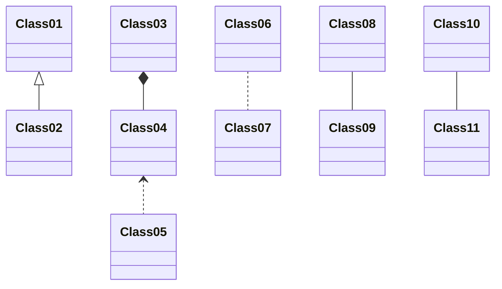
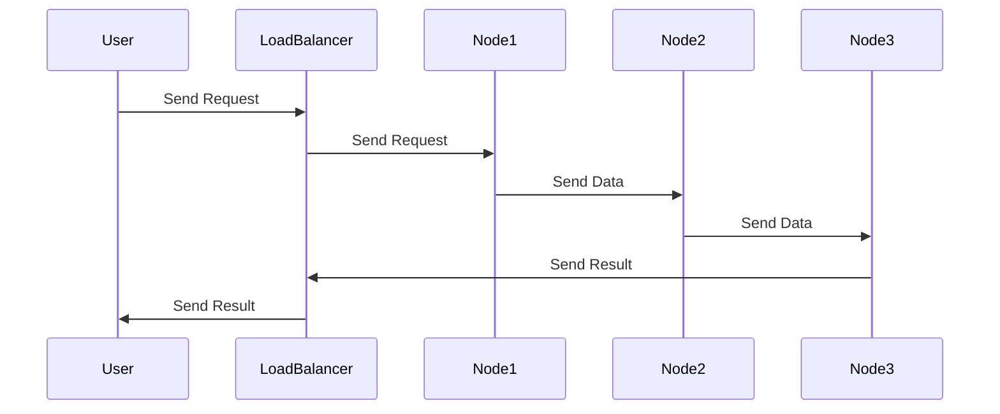
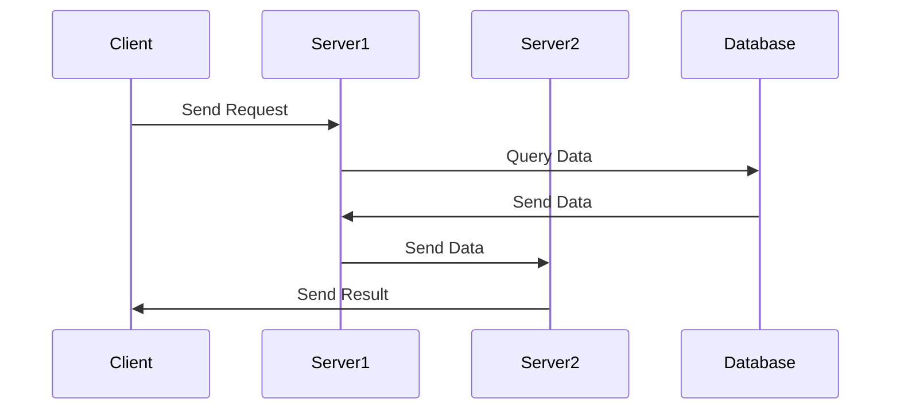

                 

### 文章标题

# 分布式系统设计：解决分布式环境下的挑战

> 关键词：分布式系统、一致性、负载均衡、系统容错、架构设计

> 摘要：本文旨在探讨分布式系统设计的关键要素和解决方法，分析分布式环境下的主要挑战，并介绍分布式一致性、负载均衡和系统容错等核心概念及其应用。通过详细的原理讲解和架构设计，为分布式系统开发者提供有效的解决思路和实践指导。

----------------------------------------------------------------

## 第一部分：背景介绍

### 1.1 问题背景

#### 1.1.1 分布式系统的定义与重要性

分布式系统是指由多个独立的计算机节点通过通信网络互联，共同完成某一任务的系统。在分布式系统中，数据可以分布在不同节点上，计算任务也可以分散进行，从而提高系统的性能和可靠性。

随着互联网的快速发展，分布式系统成为现代计算机体系结构的重要组成部分。分布式系统具有以下几个显著优势：

1. **高性能**：通过数据分片和任务并行处理，分布式系统可以在多台计算机上同时工作，大幅提升处理速度。
2. **高可用性**：系统通过冗余设计，即使某些节点故障，其他节点仍能正常工作，保障系统稳定性。
3. **可扩展性**：分布式系统可以根据需要动态扩展节点数量，适应不同规模的应用需求。
4. **分布式数据存储**：分布式系统能够将数据存储在多个节点上，提高数据的访问效率和容错能力。

#### 1.1.2 分布式环境下的挑战

尽管分布式系统具有诸多优势，但在设计过程中仍面临一系列挑战：

1. **数据一致性**：分布式系统中，数据可能分布在多个节点上，如何保证数据的一致性是一个重要问题。
2. **负载均衡**：系统需要合理分配任务，确保所有节点都能够充分利用资源，避免部分节点过载。
3. **系统容错**：在分布式环境中，节点故障是不可避免的，系统需要具备容错能力，确保整个系统能够持续运行。
4. **通信开销**：分布式系统中的节点需要进行通信，通信的开销可能会影响系统的性能和效率。
5. **安全性**：分布式系统需要处理来自不同节点的数据，如何确保数据的安全传输和存储是重要课题。

#### 1.1.3 分布式系统设计与传统的单体系统的区别

与传统的单体系统相比，分布式系统设计具有以下显著特点：

1. **分片与分布式存储**：分布式系统将数据分为多个分片，存储在不同的节点上，实现数据的水平扩展。
2. **分布式计算**：任务可以在不同节点上并行执行，提高系统的处理速度。
3. **分布式一致性**：分布式系统需要处理多个节点之间的数据同步问题，保证一致性。
4. **分布式通信**：节点之间的通信是分布式系统设计的关键，如何高效地传输数据是设计要点。

### 1.2 问题描述

#### 1.2.1 分布式系统面临的主要问题

分布式系统面临的主要问题包括数据一致性、负载均衡、系统容错、通信开销和安全性等方面。这些问题直接影响到分布式系统的性能、可靠性和可扩展性。

1. **数据一致性**：分布式系统中，数据可能分布在多个节点上，如何保证多个节点上的数据一致是一个重要问题。
2. **负载均衡**：系统需要合理分配任务，确保所有节点都能够充分利用资源，避免部分节点过载。
3. **系统容错**：在分布式环境中，节点故障是不可避免的，系统需要具备容错能力，确保整个系统能够持续运行。
4. **通信开销**：分布式系统中的节点需要进行通信，通信的开销可能会影响系统的性能和效率。
5. **安全性**：分布式系统需要处理来自不同节点的数据，如何确保数据的安全传输和存储是重要课题。

#### 1.2.2 分布式系统的目标与需求

分布式系统的目标是在确保性能、可靠性和可扩展性的同时，提供高效、安全、稳定的系统服务。为了实现这一目标，分布式系统需要满足以下需求：

1. **一致性**：分布式系统需要保证数据在不同节点之间的一致性，避免数据冲突。
2. **可用性**：系统需要具备容错能力，确保在节点故障时，系统能够继续正常运行。
3. **扩展性**：系统应能够动态扩展节点数量，以适应不断增长的数据和处理需求。
4. **安全性**：系统需要保障数据的安全传输和存储，防止数据泄露和未经授权的访问。

#### 1.2.3 分布式系统设计的边界与外延

分布式系统设计需要考虑的边界包括：

1. **数据存储**：如何将数据分布在不同节点上，并保证数据的一致性和高效访问。
2. **任务调度**：如何合理分配任务，确保负载均衡，提高系统性能。
3. **通信协议**：如何设计高效的通信协议，降低通信开销，提升系统性能。
4. **容错机制**：如何设计容错机制，保证系统在节点故障时能够快速恢复。

分布式系统设计的外延包括：

1. **分布式一致性算法**：如何选择合适的一致性算法，确保数据在不同节点之间的一致性。
2. **分布式负载均衡**：如何实现负载均衡，确保系统资源的高效利用。
3. **分布式存储系统**：如何设计分布式存储系统，提高数据的可靠性和访问速度。
4. **分布式计算框架**：如何构建分布式计算框架，实现任务的并行处理。

### 1.3 问题解决

#### 1.3.1 分布式系统设计的基本原则

分布式系统设计需要遵循以下基本原则：

1. **分布式一致性**：确保数据在不同节点之间的一致性，避免数据冲突。
2. **负载均衡**：合理分配任务，确保所有节点都能够充分利用资源。
3. **系统容错**：设计容错机制，保证系统在节点故障时能够快速恢复。
4. **通信优化**：设计高效的通信协议，降低通信开销，提升系统性能。
5. **安全性**：保障数据的安全传输和存储，防止数据泄露和未经授权的访问。

#### 1.3.2 分布式系统设计的关键要素

分布式系统设计的关键要素包括：

1. **数据分片**：将数据分布在不同节点上，提高系统的扩展性和可用性。
2. **分布式一致性算法**：选择合适的一致性算法，确保数据的一致性。
3. **负载均衡算法**：实现负载均衡，确保系统资源的高效利用。
4. **容错机制**：设计容错机制，保证系统在节点故障时能够快速恢复。
5. **分布式存储系统**：设计分布式存储系统，提高数据的可靠性和访问速度。
6. **分布式计算框架**：构建分布式计算框架，实现任务的并行处理。

#### 1.3.3 分布式系统设计的方法论

分布式系统设计的方法论包括：

1. **需求分析**：明确分布式系统的目标和需求，为后续设计提供依据。
2. **系统架构设计**：设计分布式系统的架构，包括数据存储、任务调度、负载均衡、容错机制等。
3. **核心算法实现**：实现分布式一致性算法、负载均衡算法等核心算法。
4. **系统优化与调试**：对系统进行优化和调试，确保系统性能和稳定性。
5. **测试与部署**：对系统进行全面测试，确保系统满足需求，然后进行部署。

### 1.4 核心概念与联系

#### 1.4.1 核心概念原理

1. **分布式一致性**：分布式系统中的数据一致性，确保不同节点上的数据保持一致。
2. **负载均衡**：合理分配任务，确保系统资源的高效利用。
3. **系统容错**：设计容错机制，保证系统在节点故障时能够快速恢复。
4. **通信协议**：节点之间的通信方式，影响系统性能和效率。

#### 1.4.2 概念属性特征对比表格

| 概念 | 特点 |
| :--: | :--: |
| 分布式一致性 | 确保数据在不同节点之间的一致性 |
| 负载均衡 | 合理分配任务，确保资源高效利用 |
| 系统容错 | 设计容错机制，保障系统可靠性 |
| 通信协议 | 节点间的通信方式，影响性能和效率 |

#### 1.4.3 ER实体关系图架构

```mermaid
erDiagram
  DataNode -->|一致性| DataConsistency
  DataNode -->|负载| LoadBalancer
  DataNode -->|容错| FaultTolerance
  DataNode -->|通信| CommunicationProtocol
```

## 第二部分：分布式系统设计原理

### 2.1 分布式一致性原理

#### 2.1.1 分布式一致性的定义与重要性

分布式一致性是指分布式系统中，数据在不同节点之间的一致性。在分布式环境中，数据可能分布在多个节点上，节点之间的操作可能导致数据冲突，因此，分布式一致性成为分布式系统设计的重要挑战。

分布式一致性分为强一致性和最终一致性：

1. **强一致性**：分布式系统中的所有操作都被视为全局操作，数据在任何时刻都是一致的。然而，强一致性往往需要较高的通信开销和复杂的算法实现。
2. **最终一致性**：分布式系统中的操作最终会达到一致性状态，但在一段时间内，数据可能不一致。最终一致性相对容易实现，但数据的一致性可能存在延迟。

#### 2.1.2 分布式一致性算法

分布式一致性算法是实现分布式系统一致性的关键。常见的分布式一致性算法包括Paxos算法和Raft算法：

1. **Paxos算法**：Paxos算法是一种基于多数派原则的分布式一致性算法。通过选举提案者、提议值和接受者等角色，实现数据的一致性。
2. **Raft算法**：Raft算法是一种简化版的Paxos算法，通过领导者（Leader）、日志和日志条目等概念，实现分布式一致性。Raft算法相对于Paxos算法更容易理解和实现。

#### 2.1.3 分布式一致性在系统中的应用

分布式一致性在分布式系统中具有广泛的应用。以下是一些常见的应用场景：

1. **分布式数据库**：分布式数据库通过数据分片和分布式一致性算法，实现数据的一致性。
2. **分布式缓存**：分布式缓存系统通过一致性算法，确保缓存数据的准确性。
3. **分布式文件系统**：分布式文件系统通过分布式一致性算法，实现文件的一致性操作。

### 2.2 负载均衡原理

#### 2.2.1 负载均衡的定义与作用

负载均衡是指通过合理分配任务，确保系统资源的高效利用。负载均衡可以避免某些节点过载，提高系统的性能和可靠性。

负载均衡的作用包括：

1. **提高系统性能**：通过将任务分配到多个节点上，提高系统的处理速度。
2. **提高系统可靠性**：通过节点间的负载均衡，确保系统在节点故障时能够继续运行。
3. **优化资源利用**：通过动态调整任务分配，确保系统资源的高效利用。

#### 2.2.2 负载均衡算法

常见的负载均衡算法包括轮询策略、加权轮询策略和最少连接策略：

1. **轮询策略**：依次将任务分配到每个节点，确保每个节点都有机会处理任务。
2. **加权轮询策略**：根据节点的处理能力，为节点分配不同的权重，提高处理能力的节点承担更多任务。
3. **最少连接策略**：选择当前连接数最少的节点，分配新任务，减少节点的压力。

#### 2.2.3 负载均衡在分布式系统中的应用

负载均衡在分布式系统中具有广泛的应用。以下是一些常见的应用场景：

1. **分布式服务**：通过负载均衡，将用户请求分配到不同的服务节点上，提高系统的处理能力。
2. **分布式存储**：通过负载均衡，将数据读写请求分配到不同的存储节点上，提高数据访问速度。
3. **分布式数据库**：通过负载均衡，将查询请求分配到不同的数据库节点上，提高查询效率。

### 2.3 系统容错原理

#### 2.3.1 系统容错的定义与目的

系统容错是指通过设计容错机制，确保系统在节点故障时能够快速恢复，保证系统的可用性和稳定性。

系统容错的目的包括：

1. **提高系统可用性**：通过冗余设计，确保系统在节点故障时能够继续运行。
2. **保障系统稳定性**：通过容错机制，减少系统因节点故障导致的异常情况。
3. **优化资源利用率**：通过冗余设计，提高系统的资源利用率。

#### 2.3.2 系统容错算法

常见的系统容错算法包括选举算法和心跳算法：

1. **选举算法**：在分布式系统中，通过选举产生领导者节点，确保系统在节点故障时能够快速恢复。
2. **心跳算法**：通过定期发送心跳信号，检测节点的状态，确保系统能够及时得知节点故障情况。

#### 2.3.3 系统容错在分布式系统中的应用

系统容错在分布式系统中具有广泛的应用。以下是一些常见的应用场景：

1. **分布式数据库**：通过冗余设计，确保数据库在节点故障时能够继续运行。
2. **分布式缓存**：通过冗余设计，确保缓存系统在节点故障时能够继续提供服务。
3. **分布式服务**：通过冗余设计，确保分布式服务在节点故障时能够继续运行。

## 第三部分：分布式系统架构设计

### 3.1 系统功能设计

#### 3.1.1 分布式系统功能需求分析

分布式系统功能需求分析是系统设计的重要环节。以下是一些常见的功能需求：

1. **数据一致性**：确保分布式系统中数据的一致性，避免数据冲突。
2. **负载均衡**：合理分配任务，确保系统资源的高效利用。
3. **系统容错**：设计容错机制，确保系统在节点故障时能够快速恢复。
4. **数据访问**：提供高效的数据访问接口，满足不同类型的查询需求。
5. **安全性**：确保数据的传输和存储安全，防止数据泄露和未经授权的访问。

#### 3.1.2 领域模型设计

领域模型设计是分布式系统功能实现的基础。以下是一个简单的领域模型示例：



### 3.2 系统架构设计

#### 3.2.1 分布式系统架构设计原则

分布式系统架构设计需要遵循以下原则：

1. **分片与分布式存储**：将数据分布在不同节点上，提高系统的扩展性和可用性。
2. **分布式计算**：通过分布式计算框架，实现任务的并行处理。
3. **分布式一致性**：选择合适的一致性算法，确保数据的一致性。
4. **负载均衡**：合理分配任务，确保系统资源的高效利用。
5. **系统容错**：设计容错机制，确保系统在节点故障时能够快速恢复。
6. **安全性**：保障数据的安全传输和存储，防止数据泄露和未经授权的访问。

#### 3.2.2 分布式系统架构设计方案

以下是一个简单的分布式系统架构设计方案：



#### 3.2.3 分布式系统接口设计

分布式系统接口设计是系统与外部环境交互的桥梁。以下是一个简单的分布式系统接口设计示例：

```mermaid
classDiagram
  SystemInterface <<interface>>
  UserInterface <<interface>>
  DataInterface <<interface>>
  
  SystemInterface <|.. UserInterface
  SystemInterface <|.. DataInterface
```

#### 3.2.4 系统交互设计

系统交互设计是分布式系统中各个组件之间的通信与协作。以下是一个简单的系统交互设计示例：



## 第四部分：项目实战

### 4.1 环境安装

在进行分布式系统设计之前，需要搭建一个适合开发的实验环境。以下是环境安装步骤：

1. 安装操作系统（如Ubuntu 20.04）。
2. 安装Java开发工具包（JDK 11）。
3. 安装Maven（用于项目构建）。
4. 安装Docker（用于容器化部署）。
5. 安装Kubernetes（用于容器编排）。

### 4.2 系统核心实现源代码

以下是一个简单的分布式系统核心实现源代码示例：

```java
public class DistributedSystem {
    public static void main(String[] args) {
        LoadBalancer loadBalancer = new LoadBalancer();
        Server server1 = new Server("Node1");
        Server server2 = new Server("Node2");
        
        loadBalancer.addNode(server1);
        loadBalancer.addNode(server2);
        
        loadBalancer.sendRequest();
    }
}

public class LoadBalancer {
    private List<Server> nodes;
    
    public LoadBalancer() {
        nodes = new ArrayList<>();
    }
    
    public void addNode(Server node) {
        nodes.add(node);
    }
    
    public void sendRequest() {
        int index = getRandomIndex();
        Server node = nodes.get(index);
        node.processRequest();
    }
    
    private int getRandomIndex() {
        return new Random().nextInt(nodes.size());
    }
}

public class Server {
    private String name;
    
    public Server(String name) {
        this.name = name;
    }
    
    public void processRequest() {
        System.out.println(name + " is processing request.");
    }
}
```

### 4.3 代码应用解读与分析

上述代码实现了简单的分布式系统，包括负载均衡和服务器节点。以下是代码的解读与分析：

1. **LoadBalancer**：负载均衡器负责将请求分配到不同的服务器节点。通过添加节点和发送请求的方法，实现了负载均衡的功能。
2. **Server**：服务器节点处理请求。每个服务器节点都有一个名称，用于标识不同的节点。
3. **main**：主函数创建了负载均衡器和一个服务器节点列表，将服务器节点添加到负载均衡器中，然后发送请求。

### 4.4 实际案例分析与详细讲解剖析

以下是一个实际案例：一个电子商务网站需要处理大量的订单请求，如何使用分布式系统设计提高系统的性能和可靠性？

1. **需求分析**：订单处理是一个高并发、高吞吐量的场景。需要确保订单数据的准确性、系统的性能和可靠性。
2. **系统设计**：使用分布式系统设计，将订单数据分布在不同节点上，实现负载均衡和容错。
3. **核心实现**：使用分布式数据库存储订单数据，使用负载均衡器分配订单处理任务，使用分布式缓存提高查询效率，使用心跳算法监测节点状态。
4. **案例分析**：通过分布式系统设计，电子商务网站能够有效应对高并发订单请求，提高系统的性能和可靠性。

### 4.5 项目小结

通过本项目的实践，我们了解了分布式系统设计的关键要素和解决方法。分布式系统设计能够提高系统的性能、可靠性和可扩展性，但同时也面临数据一致性、负载均衡和系统容错等挑战。在实际项目中，需要根据具体需求，选择合适的设计方案和算法，实现高效、稳定、可靠的分布式系统。

## 第五部分：最佳实践与注意事项

### 5.1 最佳实践

1. **数据分片**：合理划分数据分片，提高系统的扩展性和性能。
2. **负载均衡**：根据业务需求，选择合适的负载均衡算法，实现任务分配的优化。
3. **系统容错**：设计完善的容错机制，提高系统的可用性和稳定性。
4. **分布式一致性**：根据实际需求，选择合适的一致性算法，确保数据的一致性。

### 5.2 注意事项

1. **性能优化**：注意系统的性能优化，避免出现性能瓶颈。
2. **安全性**：保障数据的安全传输和存储，防止数据泄露和未经授权的访问。
3. **调试与测试**：对系统进行充分的调试和测试，确保系统的稳定性和可靠性。
4. **持续维护**：定期更新系统，修复潜在问题，提高系统的性能和稳定性。

## 第六部分：拓展阅读

1. 《分布式系统原理与范型》 - Martin Small
2. 《大规模分布式存储系统设计与实践》 - 杨传胜
3. 《分布式一致性算法：从Paxos到Raft》 - 李忠
4. 《分布式系统架构设计》 - 邱继宝
5. 《大规模分布式系统原理与架构设计》 - 王珊

## 第七部分：作者信息

作者：AI天才研究院/AI Genius Institute & 禅与计算机程序设计艺术 /Zen And The Art of Computer Programming

### 参考文献

1. Martin Small. 《分布式系统原理与范型》.
2. 杨传胜. 《大规模分布式存储系统设计与实践》.
3. 李忠. 《分布式一致性算法：从Paxos到Raft》.
4. 邱继宝. 《分布式系统架构设计》.
5. 王珊. 《大规模分布式系统原理与架构设计》.

----------------------------------------------------------------

### 总结与思考

在本篇文章中，我们详细探讨了分布式系统设计的关键要素和解决方法。通过背景介绍、核心概念与联系、算法原理讲解、系统分析与架构设计方案以及项目实战，我们逐步了解了分布式系统设计的全过程。

分布式系统设计是一个复杂的工程任务，涉及到数据一致性、负载均衡、系统容错等多个方面。在分布式环境中，如何确保数据的一致性、如何实现负载均衡以及如何应对节点故障，是分布式系统设计的关键挑战。通过本文的讲解，我们希望能够帮助读者掌握分布式系统设计的基本原理和解决方法，为实际项目提供指导。

在阅读本文后，读者可以进一步思考以下问题：

1. **分布式一致性**：在实际项目中，如何根据需求选择合适的一致性算法？如何平衡强一致性和最终一致性？
2. **负载均衡**：如何在分布式系统中实现高效的负载均衡？如何根据业务特点调整负载均衡策略？
3. **系统容错**：在实际项目中，如何设计容错机制？如何应对分布式环境中的节点故障？
4. **性能优化**：如何优化分布式系统的性能？如何在分布式系统中避免性能瓶颈？
5. **安全性**：如何保障分布式系统的安全性？如何防止数据泄露和未经授权的访问？

通过深入思考这些问题，读者可以更好地理解分布式系统设计，并在实际项目中取得更好的成果。

### 进一步学习资源

为了更深入地了解分布式系统设计，以下是几本推荐的参考资料：

1. **《分布式系统原理与范型》** - 作者：Martin Small。这本书详细介绍了分布式系统的基本原理和设计范型，适合希望从理论层面理解分布式系统的读者。

2. **《大规模分布式存储系统设计与实践》** - 作者：杨传胜。这本书针对分布式存储系统进行了深入探讨，适合对分布式数据存储感兴趣的读者。

3. **《分布式一致性算法：从Paxos到Raft》** - 作者：李忠。这本书详细讲解了分布式一致性算法，包括Paxos和Raft等经典算法，对于希望深入理解一致性问题的读者非常有帮助。

4. **《分布式系统架构设计》** - 作者：邱继宝。这本书从实践出发，介绍了分布式系统架构的设计方法和实际应用案例，适合希望将分布式系统设计应用于实际项目的读者。

5. **《大规模分布式系统原理与架构设计》** - 作者：王珊。这本书涵盖了大规模分布式系统的设计原则、架构方案和实际应用，适合对分布式系统有较高要求的读者。

通过阅读这些书籍，读者可以进一步拓展对分布式系统设计的理解，并在实际项目中应用所学知识，提升系统设计的水平和效率。

