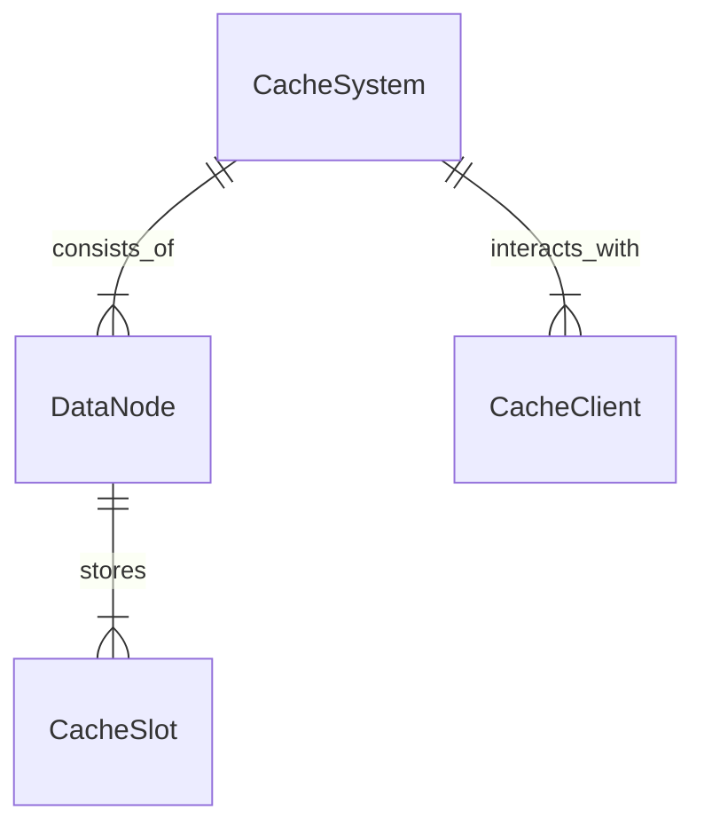
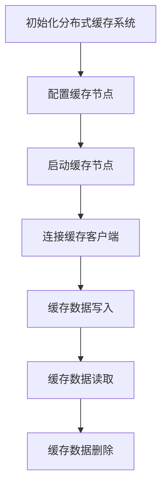
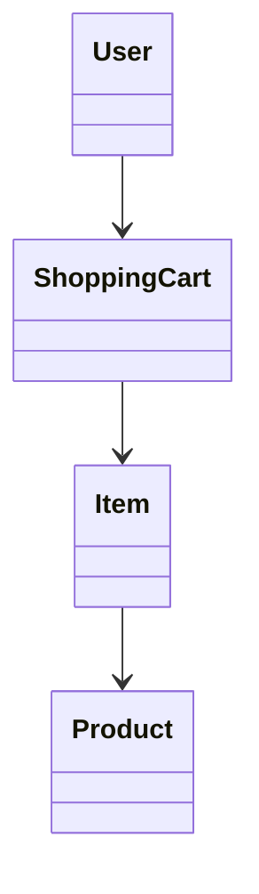
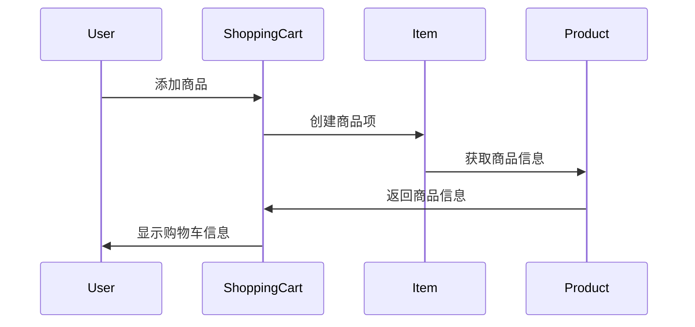
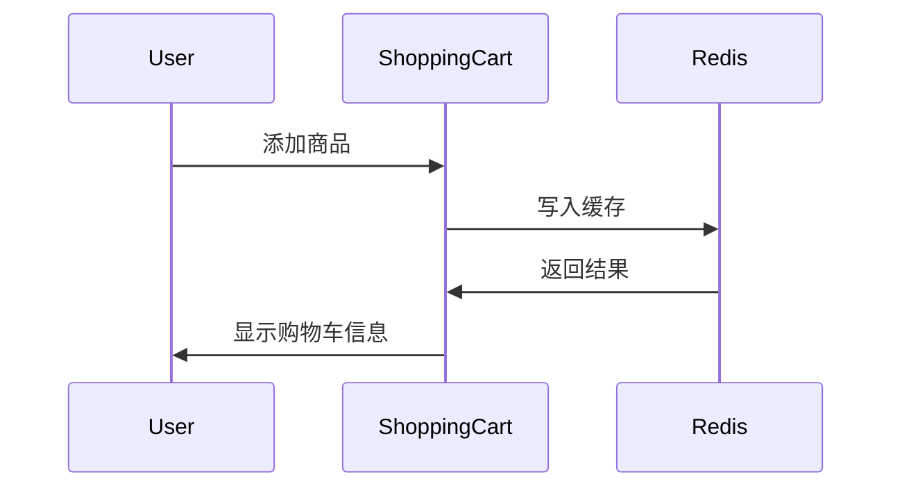

                 

# 分布式缓存的使用注意事项

## 关键词

- 分布式缓存
- Redis
- Memcached
- 数据一致性
- 缓存命中率

## 摘要

随着互联网的快速发展，数据规模和复杂性呈指数级增长，传统的缓存系统已经难以满足高并发、高可用的要求。分布式缓存作为一种新兴的技术，以其高可用性、高性能、横向扩展能力等特点，成为现代互联网架构中不可或缺的一环。本文将详细介绍分布式缓存的使用注意事项，帮助开发者更好地理解和应用分布式缓存。

## 第一部分：背景介绍

### 问题背景

随着互联网的快速发展，数据规模和复杂性呈指数级增长，传统的缓存系统已经难以满足高并发、高可用的要求。分布式缓存作为一种新兴的技术，以其高可用性、高性能、横向扩展能力等特点，成为现代互联网架构中不可或缺的一环。

### 问题描述

分布式缓存虽然在性能和扩展性方面有显著优势，但其使用和管理也相对复杂。本文将详细介绍分布式缓存的使用注意事项，帮助开发者更好地理解和应用分布式缓存。

### 问题解决

通过系统性地介绍分布式缓存的原理、架构设计、数据一致性、安全性等方面，为开发者提供一套全面的分布式缓存使用指南。

### 边界与外延

本文主要关注常见分布式缓存技术（如Redis、Memcached等）的使用注意事项。对于特定技术栈或场景下的分布式缓存解决方案，本文将不进行深入探讨。

### 概念结构与核心要素组成

分布式缓存的核心概念包括：缓存、分布式系统、数据一致性、缓存命中率等。这些要素共同构成了分布式缓存的技术架构和实现逻辑。

## 第二部分：核心概念与联系

### 核心概念原理

1. **缓存**：是一种快速访问的数据存储方式，用于减少对慢速数据的访问频率。
2. **分布式系统**：由多个节点组成的系统，各节点通过通信网络相互连接，协同工作完成特定任务。
3. **数据一致性**：分布式系统中，多个节点对于同一份数据应该保持一致的读取和写入状态。
4. **缓存命中率**：缓存系统能够命中请求的次数与总请求次数的比值。

### 概念属性特征对比表格

| 概念       | 属性特征                                      |
|------------|---------------------------------------------|
| 缓存       | 快速访问，减少慢速数据访问频率                 |
| 分布式系统 | 节点通过通信网络连接，协同工作                 |
| 数据一致性 | 多个节点对于同一份数据保持一致                 |
| 缓存命中率 | 缓存系统能命中请求的次数与总请求次数的比值       |

### ER实体关系图架构



## 第三部分：算法原理讲解

### 算法原理Mermaid流程图



### Python源代码与详细讲解

```python
# Python源代码示例：分布式缓存数据写入与读取
import redis

# 初始化Redis客户端
redis_client = redis.Redis(host='localhost', port=6379, db=0)

# 写入缓存数据
def set_cache(key, value):
    redis_client.set(key, value)
    print(f"缓存数据{key}:{value}已写入。")

# 读取缓存数据
def get_cache(key):
    value = redis_client.get(key)
    print(f"缓存数据{key}:{value}已读取。")

# 测试缓存数据写入与读取
set_cache('user_name', 'JohnDoe')
get_cache('user_name')
```

### 算法原理的数学模型和公式

- 缓存命中率公式：
  $$\text{缓存命中率} = \frac{\text{命中次数}}{\text{总请求次数}}$$

## 第四部分：系统分析与架构设计方案

### 问题场景介绍

假设我们要构建一个电商平台的购物车功能，要求缓存购物车中的商品信息以提高系统响应速度。

### 项目介绍

本项目将基于Redis作为分布式缓存，实现购物车数据的缓存功能。

### 系统

#### 功能设计



#### 架构设计



#### 接口设计

```mermaid
interface ShoppingCart {
    + void addItem(Product product)
    + void removeItem(Product product)
    + List<Product> getItems()
}
```

#### 系统交互



## 第五部分：项目实战

### 环境安装

在本地或服务器上安装Redis，并确保其正常启动。可以使用以下命令：

```bash
# 安装Redis
sudo apt-get update
sudo apt-get install redis-server

# 启动Redis服务
sudo systemctl start redis-server
```

### 系统核心实现源代码

```python
# Python源代码：Redis购物车实现
import redis
import uuid

class ShoppingCart:
    def __init__(self, redis_client):
        self.redis_client = redis_client
        self.cart_id = str(uuid.uuid4())

    def addItem(self, product_id):
        self.redis_client.sadd(self.cart_id, product_id)
        print(f"商品{product_id}已添加到购物车。")

    def removeItem(self, product_id):
        self.redis_client.srem(self.cart_id, product_id)
        print(f"商品{product_id}已从购物车中删除。")

    def getItems(self):
        product_ids = self.redis_client.smembers(self.cart_id)
        return [int(pid) for pid in product_ids]
```

### 代码应用解读与分析

在上面的代码中，我们创建了一个简单的购物车类`ShoppingCart`，它通过Redis实现了商品添加、删除和查询功能。每个购物车对应一个唯一的ID，通过Redis的集合（`set`）数据结构来存储商品ID。

### 实际案例分析和详细讲解剖析

以下是一个简单的实际案例，展示如何使用Redis购物车：

```python
# 创建Redis客户端
redis_client = redis.Redis(host='localhost', port=6379, db=0)

# 创建购物车实例
cart = ShoppingCart(redis_client)

# 添加商品
cart.addItem(1001)
cart.addItem(1002)

# 查询购物车
print(f"购物车中的商品：{cart.getItems()}")

# 删除商品
cart.removeItem(1001)

# 查询购物车
print(f"购物车中的商品：{cart.getItems()}")
```

在这个案例中，我们首先创建了一个Redis客户端，然后创建了一个购物车实例。通过调用`addItem`方法，我们将商品添加到购物车。接着，我们查询购物车中的商品，并调用`removeItem`方法删除一个商品。最后，再次查询购物车，验证商品是否已删除。

### 项目小结

通过本项目的实现，我们了解了如何使用Redis作为分布式缓存来实现购物车功能。Redis的集合（`set`）数据结构为商品存储提供了高效的支持，通过操作集合，我们可以快速完成商品的添加、删除和查询。这种分布式缓存的使用方法，可以有效提高电商平台的系统响应速度，提升用户体验。

## 第六部分：最佳实践 Tips

1. **选择合适的分布式缓存系统**：根据实际需求和性能要求，选择合适的分布式缓存系统（如Redis、Memcached等）。
2. **合理设置缓存过期时间**：根据业务场景，合理设置缓存数据过期时间，避免缓存数据过时。
3. **优化缓存命中率**：通过缓存数据预热、数据分片等技术手段，提高缓存命中率。
4. **确保数据一致性**：在分布式系统中，确保数据一致性是关键。使用分布式锁、事务等机制，保障数据一致性。

## 第七部分：小结

本文详细介绍了分布式缓存的使用注意事项，从背景介绍、核心概念与联系、算法原理讲解、系统分析与架构设计方案、项目实战等方面，全面阐述了分布式缓存的应用方法和最佳实践。通过本文的学习，开发者可以更好地理解和应用分布式缓存，提升系统的性能和稳定性。

## 第八部分：注意事项

1. **安全性**：在使用分布式缓存时，要确保数据的安全性和隐私性。对于敏感数据，应使用加密传输和存储。
2. **性能监控**：定期对分布式缓存系统进行性能监控和调优，确保其稳定运行。
3. **容灾备份**：为分布式缓存系统配置容灾备份机制，确保数据的安全性和可靠性。

## 第九部分：拓展阅读

1. 《Redis实战：使用 Redis 实现分布式缓存与消息队列》
2. 《Memcached权威指南：分布式缓存系统设计与实践》
3. 《分布式系统原理与范型》

## 作者

作者：AI天才研究院/AI Genius Institute & 禅与计算机程序设计艺术 /Zen And The Art of Computer Programming

