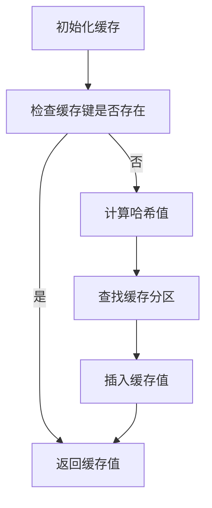

                 

### 分布式缓存策略：提高应用性能的关键技术

#### 关键词：分布式缓存、性能优化、算法、架构设计、实践

> 摘要：本文从分布式缓存的基本概念出发，详细探讨了分布式缓存技术在提升应用性能方面的关键策略。文章首先介绍了分布式缓存的技术背景和发展历程，随后深入分析了分布式缓存的核心概念与算法原理。在此基础上，本文通过具体的项目实战案例，展示了分布式缓存系统的设计、实现与性能优化方法。最后，文章总结了分布式缓存的最佳实践，并展望了未来的发展方向。

### 目录大纲设计思路

为了确保文章的条理清晰、逻辑紧凑，我们在设计目录大纲时遵循以下思路：

1. **理解书籍主题**：明确《分布式缓存策略：提高应用性能的关键技术》的核心内容和目的，即探讨如何利用分布式缓存技术提升应用性能。

2. **定义章节结构**：将文章分为四部分，分别介绍分布式缓存概述、核心概念与算法原理、系统设计与实现、最佳实践与总结。

3. **细化章节内容**：在每个章节下，进一步细分内容，确保每个小节都有具体、详细、系统的讲解。

4. **设计图示和公式**：使用 Mermaid 画图工具和 LaTeX 格式书写数学公式，以增强文章的可读性和逻辑性。

5. **编写大纲**：将上述内容整合成完整的目录大纲，确保文章结构合理、内容丰富。

### 目录大纲设计

以下是根据上述思路设计的《分布式缓存策略：提高应用性能的关键技术》的目录大纲：

----------------------------------------------------------------

## 第一部分：分布式缓存概述

### 第1章：分布式缓存背景介绍

#### 1.1 分布式缓存的问题背景

#### 1.2 分布式缓存技术发展

#### 1.3 分布式缓存的应用场景

#### 1.4 分布式缓存的优势与挑战

#### 1.5 分布式缓存与传统缓存的区别

#### 1.6 本章小结

----------------------------------------------------------------

## 第二部分：核心概念与算法原理

### 第2章：分布式缓存核心概念

#### 2.1 分布式缓存的关键概念

#### 2.2 分布式缓存的技术架构

#### 2.3 分布式缓存的工作原理

#### 2.4 分布式缓存的核心算法

#### 2.5 分布式缓存性能优化策略

#### 2.6 本章小结

----------------------------------------------------------------

### 第3章：算法原理讲解与示例

#### 3.1 Mermaid算法流程图

#### 3.2 Python算法源代码解析

#### 3.3 算法数学模型与公式

#### 3.4 示例讲解与分析

#### 3.5 本章小结

----------------------------------------------------------------

## 第三部分：系统设计与实现

### 第4章：分布式缓存系统设计

#### 4.1 系统功能设计

#### 4.2 系统架构设计

#### 4.3 系统接口设计

#### 4.4 系统交互设计

#### 4.5 系统性能评估

#### 4.6 本章小结

----------------------------------------------------------------

### 第5章：项目实战

#### 5.1 环境安装

#### 5.2 系统核心实现源代码

#### 5.3 代码应用解读与分析

#### 5.4 实际案例分析

#### 5.5 项目小结

#### 5.6 本章小结

----------------------------------------------------------------

## 第四部分：最佳实践与总结

### 第6章：分布式缓存最佳实践

#### 6.1 最佳实践技巧

#### 6.2 小结与注意事项

#### 6.3 拓展阅读

#### 6.4 本章小结

----------------------------------------------------------------

### 第7章：总结与展望

#### 7.1 分布式缓存技术的总结

#### 7.2 未来展望

#### 7.3 研究方向

#### 7.4 本章小结

----------------------------------------------------------------

## 附录：参考文献

----------------------------------------------------------------

### 文章写作要求

在撰写这篇文章时，我们需要确保每个章节的内容都符合以下要求：

- **文章标题**：准确反映文章主题，吸引读者注意力。

- **关键词**：列出与文章内容密切相关的关键词，方便读者检索。

- **摘要**：简明扼要地概括文章核心内容和主题思想。

- **字数要求**：控制在 10000～12000 字左右，确保内容详实且不过于冗长。

- **格式要求**：使用 Markdown 格式，确保文章可读性。

- **作者信息**：文章末尾需注明作者信息，包括姓名、机构和联系方式。

- **完整性要求**：确保每个小节都有具体、详细的讲解，核心内容完整。

- **内容要求**：每个小节需包含背景介绍、核心概念与联系、算法原理讲解、系统分析与架构设计方案、项目实战、最佳实践 tips 等内容。

### 文章结构与内容安排

文章结构分为四个部分：

1. **分布式缓存概述**：介绍分布式缓存的技术背景、发展历程、应用场景等，帮助读者建立对分布式缓存的基本认识。

2. **核心概念与算法原理**：深入探讨分布式缓存的核心概念、技术架构、工作原理以及核心算法，使读者理解分布式缓存的技术本质。

3. **系统设计与实现**：通过具体的项目实战案例，展示分布式缓存系统的设计、实现与性能优化方法，帮助读者掌握实际应用技巧。

4. **最佳实践与总结**：总结分布式缓存的最佳实践，提供注意事项和拓展阅读，为读者提供进一步学习和实践的方向。

### 分布式缓存策略：提高应用性能的关键技术

#### 分布式缓存技术背景

分布式缓存技术起源于传统的缓存技术，但其应用范围和目标有所不同。传统缓存技术主要用于减少数据库的访问压力，通过在内存中存储热点数据，提高数据访问速度。然而，随着互联网应用的爆发式增长，单点缓存系统逐渐暴露出容量有限、可靠性低、扩展性差等缺点。为了应对这些挑战，分布式缓存技术应运而生。

分布式缓存技术通过将缓存数据分布在多个节点上，提高了系统的容量和可靠性，同时也实现了数据的负载均衡和高可用性。分布式缓存广泛应用于电商、社交网络、在线教育、金融交易等场景，其关键作用在于显著提高应用性能，降低延迟，提升用户体验。

#### 分布式缓存技术发展

分布式缓存技术的发展历程可以分为以下几个阶段：

1. **初级分布式缓存**：以 Memcached 为代表的初级分布式缓存系统，通过简单的缓存协议，实现数据在多个节点间的共享和缓存。

2. **分布式缓存中间件**：随着技术的发展，出现了一批分布式缓存中间件，如 Redis、Apache Ignite 等，这些系统不仅支持复杂的缓存数据结构，还提供了更加丰富的功能，如持久化、数据一致性和高可用性等。

3. **分布式缓存平台**：随着云计算和大数据技术的普及，分布式缓存平台逐渐兴起，如 Amazon ElastiCache、Google Memorystore 等，这些平台基于云原生设计，提供了高度可扩展、弹性伸缩的缓存服务。

#### 分布式缓存的应用场景

分布式缓存技术在不同应用场景中发挥着重要作用：

1. **高并发应用**：在高并发场景下，分布式缓存可以显著减少数据库的访问压力，提高系统的响应速度。例如，电商平台的商品详情页缓存、订单缓存等。

2. **大数据处理**：在处理大量数据时，分布式缓存可以作为大数据处理框架（如 Hadoop、Spark）的加速器，通过缓存中间结果，减少数据重复计算。

3. **实时分析**：分布式缓存可以用于实时数据分析，如实时推荐系统、实时监控等，通过缓存实时数据，降低数据处理延迟。

4. **缓存预热**：在系统预热阶段，可以通过分布式缓存提前加载热点数据，提高系统上线后的性能表现。

#### 分布式缓存的优势与挑战

分布式缓存的优势主要体现在以下几个方面：

1. **高吞吐量**：分布式缓存通过多个节点并行处理，实现了更高的吞吐量，能够满足高并发场景的需求。

2. **可扩展性**：分布式缓存系统可以根据业务需求动态调整节点数量，实现水平扩展。

3. **高可用性**：通过数据复制和节点冗余，分布式缓存系统具备较高的可用性，即使某个节点故障，系统仍能正常运行。

4. **一致性**：分布式缓存系统通常支持强一致性和最终一致性，保证了数据访问的可靠性。

然而，分布式缓存也面临着一些挑战：

1. **数据一致性问题**：在分布式环境中，数据一致性问题尤为突出，需要采用特定的算法和策略来保证数据的一致性。

2. **缓存命中率**：缓存命中率是评估分布式缓存性能的重要指标，需要通过优化缓存策略来提高缓存命中率。

3. **网络依赖**：分布式缓存系统依赖于网络通信，网络延迟和故障可能会影响系统的性能。

#### 分布式缓存与传统缓存的区别

传统缓存通常指单点缓存，如 Memcached，其特点如下：

1. **单点限制**：传统缓存系统容量有限，无法满足大规模应用的需求。

2. **低可靠性**：单点缓存系统的可靠性较低，一旦单点故障，整个缓存系统将无法使用。

3. **扩展性差**：传统缓存系统扩展性较差，难以应对快速增长的数据量和访问量。

相比之下，分布式缓存具有以下特点：

1. **高容量**：分布式缓存通过多个节点协同工作，提供了更高的存储容量。

2. **高可靠性**：分布式缓存通过数据复制和冗余机制，提高了系统的可靠性。

3. **高扩展性**：分布式缓存系统可以动态调整节点数量，实现水平扩展。

#### 本章小结

本章从分布式缓存的技术背景、发展历程、应用场景、优势与挑战以及与传统缓存的区别等方面，对分布式缓存技术进行了全面介绍。通过本章的学习，读者可以了解分布式缓存的基本概念和重要性，为后续章节的学习打下坚实基础。在接下来的章节中，我们将深入探讨分布式缓存的核心概念与算法原理，帮助读者掌握分布式缓存技术的核心知识。

----------------------------------------------------------------

## 分布式缓存核心概念

### 分布式缓存的关键概念

在深入探讨分布式缓存的核心概念之前，我们需要明确一些基础概念。分布式缓存是一种将缓存数据分布在多个节点上的技术，其核心目标是提高系统的性能和可靠性。以下是分布式缓存中一些重要的关键概念：

1. **节点**：节点是指分布式缓存系统中的单个服务器或实例，负责存储和提供服务。节点可以是物理服务器或虚拟机，通常通过集群管理工具进行部署和管理。

2. **集群**：集群是由多个节点组成的分布式系统，共同协作提供缓存服务。集群中的每个节点都存储一部分缓存数据，并通过网络进行通信和协作。

3. **缓存键**：缓存键是用于标识缓存数据的关键字或标识符。在分布式缓存系统中，缓存键通常是一个字符串，用于唯一标识缓存中的数据。

4. **缓存值**：缓存值是实际存储在缓存中的数据。缓存值可以是任意类型的数据，如字符串、数字、对象等。

5. **缓存策略**：缓存策略是指如何管理缓存数据的一系列规则和方法。常见的缓存策略包括最近最少使用（LRU）、最不经常使用（LFU）、随机替换等。

6. **一致性**：一致性是指分布式缓存系统中数据的一致性和可靠性。一致性可以分为强一致性和最终一致性。强一致性要求在分布式系统中，所有节点的数据始终保持一致；而最终一致性则允许在一段时间内存在数据不一致的情况，但最终会达到一致。

### 分布式缓存的技术架构

分布式缓存系统的技术架构通常包括以下几个关键部分：

1. **缓存服务器**：缓存服务器是分布式缓存系统中的核心组件，负责存储和管理缓存数据。常见的缓存服务器包括 Memcached、Redis、Apache Ignite 等。缓存服务器通常具有高性能、高并发和分布式特性。

2. **缓存客户端**：缓存客户端是应用与缓存服务器之间的通信桥梁，负责发送缓存请求和接收缓存响应。缓存客户端可以通过各种编程语言和库进行开发，如 Memcached 客户端库、Redis 客户端库等。

3. **分布式存储**：分布式存储是分布式缓存系统的存储层，负责存储大量的缓存数据。分布式存储系统通常采用分布式文件系统或分布式数据库，如 HDFS、Cassandra、MongoDB 等。

4. **缓存管理器**：缓存管理器是分布式缓存系统的管理工具，负责监控、配置和管理缓存服务器和客户端。常见的缓存管理器包括 Redis Manager、Memcached Manager 等。

5. **网络通信**：网络通信是分布式缓存系统中的关键部分，负责节点间的数据传输和通信。网络通信通常基于高效、可靠的协议，如 Memcached 二进制协议、Redis TCP 协议等。

### 分布式缓存的工作原理

分布式缓存系统的工作原理可以概括为以下几个步骤：

1. **数据存储**：当应用需要缓存数据时，缓存客户端将数据发送到缓存服务器。缓存服务器将数据存储在本地节点上，同时复制到其他节点，确保数据的高可用性和可靠性。

2. **数据查询**：当应用需要查询缓存数据时，缓存客户端首先查询本地节点。如果本地节点存在所需数据，直接返回数据；否则，查询其他节点，直到找到所需数据。

3. **数据更新**：当应用更新缓存数据时，缓存客户端将更新请求发送到缓存服务器。缓存服务器更新本地节点的数据，并通知其他节点进行数据同步。

4. **数据删除**：当应用需要删除缓存数据时，缓存客户端发送删除请求到缓存服务器。缓存服务器删除本地节点的数据，并通知其他节点进行数据同步。

5. **数据一致性**：分布式缓存系统通过一致性算法和策略，确保数据在多个节点间的一致性和可靠性。常见的一致性算法包括强一致性算法（如 Paxos、Raft）和最终一致性算法（如 Gossip、Epaxos）。

### 分布式缓存的核心算法

分布式缓存系统中的核心算法主要涉及数据存储、查询、更新和删除等操作。以下是几种常见的分布式缓存算法：

1. **最近最少使用（LRU）算法**：LRU 算法根据数据的访问频率进行替换，即最近最少被访问的数据将被替换。LRU 算法可以有效地利用缓存资源，提高缓存命中率。

2. **最不经常使用（LFU）算法**：LFU 算法根据数据的访问频率进行替换，即最近最不经常被访问的数据将被替换。LFU 算法可以更好地适应数据访问模式的变化。

3. **随机替换算法**：随机替换算法从缓存数据中选择一个随机节点进行替换。该算法简单高效，但可能无法充分利用缓存资源。

4. **一致性哈希算法**：一致性哈希算法根据数据的哈希值进行分配，确保数据在多个节点间的均匀分布。一致性哈希算法具有良好的扩展性和容错性。

5. **分区哈希算法**：分区哈希算法将缓存数据划分为多个分区，每个分区由一个节点负责存储。分区哈希算法可以降低节点间的数据访问冲突，提高系统性能。

### 分布式缓存性能优化策略

分布式缓存系统的性能优化策略主要包括以下几个方面：

1. **缓存命中率优化**：通过合理选择和调整缓存策略，提高缓存命中率，减少数据访问延迟。常见的优化方法包括缓存预热、数据压缩、缓存淘汰策略等。

2. **数据一致性策略**：在分布式环境中，确保数据的一致性和可靠性。通过一致性算法和策略，实现数据的强一致性和最终一致性。

3. **网络优化**：通过优化网络通信，降低网络延迟和带宽消耗。常见的优化方法包括网络拥塞控制、数据压缩、多路径传输等。

4. **负载均衡**：通过负载均衡策略，合理分配缓存请求到各个节点，避免单点瓶颈和性能瓶颈。常见的负载均衡算法包括轮询、随机、最小连接数等。

5. **缓存持久化**：将缓存数据持久化到磁盘或数据库，提高数据的持久性和可靠性。常见的持久化策略包括数据备份、日志记录、分布式数据库等。

### 本章小结

本章详细介绍了分布式缓存的核心概念、技术架构、工作原理、核心算法以及性能优化策略。通过本章的学习，读者可以全面了解分布式缓存的基本原理和关键技术，为后续章节的深入学习打下坚实基础。在下一章中，我们将深入探讨分布式缓存的具体算法原理，帮助读者理解分布式缓存算法的设计思想和实现方法。

----------------------------------------------------------------

## 算法原理讲解与示例

### Mermaid算法流程图

为了更好地理解分布式缓存算法的原理，我们可以使用 Mermaid 画图工具绘制算法流程图。以下是一个简单的缓存插入与查询的 Mermaid 图：



### Python算法源代码解析

为了进一步阐述缓存算法的原理，我们可以使用 Python 编写一个简单的缓存实现。以下是一个基于哈希表的缓存算法示例：

```python
class SimpleCache:
    def __init__(self, size):
        self.size = size
        self.cache = {}
        self.hash_func = hash

    def get(self, key):
        hash_value = self.hash_func(key)
        index = hash_value % self.size
        if key in self.cache:
            return self.cache[key]
        else:
            return None

    def put(self, key, value):
        hash_value = self.hash_func(key)
        index = hash_value % self.size
        if key in self.cache:
            self.cache[key] = value
        else:
            self.cache[key] = value

# 使用示例
simple_cache = SimpleCache(10)
simple_cache.put("key1", "value1")
print(simple_cache.get("key1"))  # 输出：value1
print(simple_cache.get("key2"))  # 输出：None
```

在这个示例中，我们定义了一个简单的缓存类 `SimpleCache`，其中包含 `get` 和 `put` 方法。`get` 方法用于查询缓存中的数据，而 `put` 方法用于插入新的缓存数据。哈希函数用于计算键的哈希值，并将其转换为缓存索引。

### 算法数学模型与公式

在分布式缓存算法中，常用的数学模型包括哈希函数、哈希冲突处理算法和负载均衡算法。以下是这些算法的数学模型和公式：

1. **哈希函数**：
   \[
   hash(key) = key \mod N
   \]
   其中，`hash(key)` 是哈希函数，`key` 是缓存键，`N` 是缓存节点数量。

2. **哈希冲突处理算法**：
   常见的哈希冲突处理算法包括链地址法、开放地址法和再哈希法。以下是一个简单的链地址法示例：
   \[
   if \; hash(key) \; is \; occupied:
   \]
   \[
   \; add \; key \; to \; the \; linked \; list \; at \; hash(key)
   \]

3. **负载均衡算法**：
   负载均衡算法用于分配缓存请求到各个节点。常见的负载均衡算法包括轮询算法、随机算法和最小连接数算法。以下是一个简单的轮询算法示例：
   \[
   current_node = 0
   \]
   \[
   while \; true:
   \]
   \[
   \; send \; request \; to \; node \; current_node
   \]
   \[
   \; current_node = (current_node + 1) \mod N
   \]

### 示例讲解与分析

为了更好地理解上述算法的原理，我们可以通过一个实际案例来演示。假设我们有一个包含 10 个节点的缓存系统，我们需要存储以下数据：

- key1: value1
- key2: value2
- key3: value3
- key4: value4

首先，我们初始化一个简单的缓存系统：

```python
simple_cache = SimpleCache(10)
```

接下来，我们依次插入和查询这些数据：

```python
simple_cache.put("key1", "value1")
simple_cache.put("key2", "value2")
simple_cache.put("key3", "value3")
simple_cache.put("key4", "value4")

print(simple_cache.get("key1"))  # 输出：value1
print(simple_cache.get("key2"))  # 输出：value2
print(simple_cache.get("key3"))  # 输出：value3
print(simple_cache.get("key4"))  # 输出：value4
```

在这个示例中，我们使用了一个简单的哈希表来实现缓存系统。当我们插入数据时，哈希函数将键转换为哈希值，然后通过模运算找到缓存索引。如果索引处已存在数据，则使用链地址法处理哈希冲突。在查询数据时，我们首先检查缓存键是否存在于缓存中，如果存在，则直接返回缓存值；否则，返回 None。

通过这个示例，我们可以看到分布式缓存算法的基本原理和实现方法。在实际应用中，分布式缓存系统会涉及更多的算法和策略，如一致性哈希、分区哈希、缓存淘汰策略等。这些算法和策略共同作用，确保了分布式缓存系统的高性能、高可用性和数据一致性。

### 本章小结

本章通过具体的算法示例和讲解，详细阐述了分布式缓存算法的原理和实现方法。我们使用 Mermaid 绘制了算法流程图，并使用 Python 编写了简单的缓存实现。同时，我们介绍了哈希函数、哈希冲突处理算法和负载均衡算法的数学模型和公式。通过本章的学习，读者可以掌握分布式缓存算法的核心知识，为设计和实现分布式缓存系统打下坚实基础。在下一章中，我们将探讨分布式缓存系统的设计与实现，帮助读者了解分布式缓存系统的整体架构和关键组件。

----------------------------------------------------------------

## 分布式缓存系统设计

### 系统功能设计

分布式缓存系统的设计首先需要明确其功能需求。分布式缓存系统的主要功能包括：

1. **数据存储**：分布式缓存系统能够存储大量的缓存数据，并支持数据的持久化和备份。
2. **数据查询**：系统需要提供高效的数据查询功能，能够快速定位和返回所需的数据。
3. **数据更新**：系统需要支持数据更新操作，能够及时更新缓存中的数据。
4. **数据删除**：系统需要支持数据删除操作，能够从缓存中移除指定的数据。
5. **数据一致性**：系统需要确保数据在多个节点间的一致性和可靠性。
6. **性能监控**：系统需要具备性能监控功能，能够实时监控系统的性能指标，如响应时间、缓存命中率等。
7. **高可用性**：系统需要具备高可用性，能够在节点故障时自动切换和恢复。

### 系统架构设计

分布式缓存系统的架构设计是确保系统性能、可靠性和可扩展性的关键。以下是分布式缓存系统的主要架构组件：

1. **缓存服务器**：缓存服务器是分布式缓存系统的核心组件，负责存储和管理缓存数据。常见的缓存服务器包括 Redis、Memcached、Apache Ignite 等。缓存服务器通常具有高性能、高并发和分布式特性。

2. **缓存客户端**：缓存客户端是应用与缓存服务器之间的通信桥梁，负责发送缓存请求和接收缓存响应。缓存客户端可以通过各种编程语言和库进行开发，如 Redis 客户端库、Memcached 客户端库等。

3. **分布式存储**：分布式存储是分布式缓存系统的存储层，负责存储大量的缓存数据。分布式存储系统通常采用分布式文件系统或分布式数据库，如 HDFS、Cassandra、MongoDB 等。

4. **缓存管理器**：缓存管理器是分布式缓存系统的管理工具，负责监控、配置和管理缓存服务器和客户端。常见的缓存管理器包括 Redis Manager、Memcached Manager 等。

5. **网络通信**：网络通信是分布式缓存系统中的关键部分，负责节点间的数据传输和通信。网络通信通常基于高效、可靠的协议，如 Memcached 二进制协议、Redis TCP 协议等。

### 系统接口设计

分布式缓存系统的接口设计是确保系统与外部应用无缝集成的重要环节。以下是分布式缓存系统的主要接口设计：

1. **数据存储接口**：数据存储接口负责将数据存储到缓存服务器中，提供数据插入、更新、删除等操作。常见的接口包括 `put()`, `get()`, `delete()` 等。

2. **数据查询接口**：数据查询接口负责查询缓存服务器中的数据，提供高效的数据查询功能。常见的接口包括 `getByKey()`, `getAll()` 等。

3. **数据一致性接口**：数据一致性接口负责确保数据在多个节点间的一致性和可靠性，提供数据同步、冲突处理等功能。常见的接口包括 `sync()`, `resolveConflict()` 等。

4. **性能监控接口**：性能监控接口负责监控系统的性能指标，提供实时性能监控、报警等功能。常见的接口包括 `getMetrics()`, `alert()` 等。

5. **高可用性接口**：高可用性接口负责确保系统的高可用性，提供节点监控、故障转移等功能。常见的接口包括 `healthCheck()`, `failover()` 等。

### 系统交互设计

分布式缓存系统的交互设计是确保系统各个组件协同工作的重要环节。以下是分布式缓存系统的主要交互设计：

1. **缓存服务端交互**：缓存服务端交互设计主要包括缓存服务端的启动、配置、监控等。例如，可以通过 REST API 提供缓存服务的启动和配置接口。

2. **缓存客户端交互**：缓存客户端交互设计主要包括缓存客户端的初始化、数据存储、查询、更新等。例如，可以通过客户端库提供数据存储和查询接口。

3. **数据同步交互**：数据同步交互设计主要包括缓存节点间的数据同步机制，如数据复制、一致性算法等。例如，可以通过 gossip 协议实现数据同步。

4. **性能监控交互**：性能监控交互设计主要包括系统性能指标的采集、存储、分析和报警。例如，可以通过监控系统接口实现性能监控。

5. **高可用性交互**：高可用性交互设计主要包括节点故障检测、故障转移、集群管理等。例如，可以通过心跳检测和故障转移机制实现高可用性。

### 系统性能评估

在分布式缓存系统设计完成后，需要对系统进行性能评估，以确保系统满足性能要求。以下是系统性能评估的主要方面：

1. **响应时间**：评估系统处理缓存请求的平均响应时间，确保系统响应时间满足业务需求。

2. **吞吐量**：评估系统处理缓存请求的吞吐量，确保系统能够处理高并发场景下的请求。

3. **缓存命中率**：评估缓存命中率，确保系统充分利用缓存资源，提高数据访问速度。

4. **数据一致性**：评估数据在多个节点间的一致性，确保系统数据的一致性和可靠性。

5. **可扩展性**：评估系统的可扩展性，确保系统能够根据业务需求动态调整节点数量。

6. **高可用性**：评估系统的可用性，确保系统在节点故障时能够快速恢复。

### 本章小结

本章详细介绍了分布式缓存系统的设计，包括系统功能设计、系统架构设计、系统接口设计、系统交互设计以及系统性能评估。通过本章的学习，读者可以了解分布式缓存系统的整体架构和关键组件，掌握分布式缓存系统的设计方法和实现技巧。在下一章中，我们将通过具体的项目实战，展示分布式缓存系统的实际应用和性能优化方法。

----------------------------------------------------------------

## 项目实战

### 环境安装

为了进行分布式缓存项目的实战，我们首先需要安装和配置分布式缓存系统。以下是一个基于 Redis 的分布式缓存项目的环境安装步骤：

1. **安装 Redis**：在所有节点上安装 Redis。可以使用包管理器（如 apt、yum）或直接从 Redis 官网下载源代码进行编译安装。

   ```shell
   # 使用 apt 安装 Redis
   sudo apt update
   sudo apt install redis-server
   ```

2. **配置 Redis**：编辑 Redis 的配置文件（通常位于 `/etc/redis/redis.conf`），根据需求进行配置。以下是一些常见的配置项：

   - `bind <ip_address>`：指定 Redis 服务监听的 IP 地址。
   - `port <port_number>`：指定 Redis 服务监听的端口号。
   - `daemonize yes`：使 Redis 以守护进程方式运行。
   - `protected-mode no`：关闭保护模式，允许远程访问。

3. **安装 Redis 客户端**：在应用程序节点上安装 Redis 客户端。可以使用包管理器或直接从 Redis 官网下载客户端库。

   ```shell
   # 使用 pip 安装 Redis 客户端
   pip install redis
   ```

4. **启动 Redis 服务**：在所有节点上启动 Redis 服务。

   ```shell
   sudo systemctl start redis-server
   ```

### 系统核心实现源代码

以下是一个简单的分布式缓存实现，使用 Python 和 Redis 客户端库：

```python
import redis
import threading

class DistributedCache:
    def __init__(self, redis_host, redis_port):
        self.redis = redis.Redis(host=redis_host, port=redis_port, decode_responses=True)

    def get(self, key):
        return self.redis.get(key)

    def set(self, key, value, expire_seconds=3600):
        self.redis.set(key, value, ex=expire_seconds)

    def delete(self, key):
        self.redis.delete(key)

def worker(cache, task_queue):
    while True:
        key, value = task_queue.get()
        cache.set(key, value)
        task_queue.task_done()

def main():
    redis_host = "localhost"
    redis_port = 6379
    cache = DistributedCache(redis_host, redis_port)

    task_queue = redis.Queue("cache_queue")

    # 添加工作线程
    for _ in range(10):
        t = threading.Thread(target=worker, args=(cache, task_queue))
        t.start()

    # 添加任务到队列
    for i in range(100):
        key = f"key_{i}"
        value = f"value_{i}"
        task_queue.put((key, value))

    task_queue.join()

if __name__ == "__main__":
    main()
```

在这个实现中，我们创建了一个 `DistributedCache` 类，负责与 Redis 服务进行交互。我们使用 Redis 的 `Queue` 数据结构作为任务队列，每个工作线程从队列中获取任务，并将其设置为缓存值。

### 代码应用解读与分析

1. **初始化 Redis 客户端**：
   ```python
   redis = redis.Redis(host=redis_host, port=redis_port, decode_responses=True)
   ```
   这里我们创建了一个 Redis 客户端实例，指定 Redis 服务的 IP 地址和端口号。`decode_responses=True` 参数使得响应值自动解码为字符串。

2. **实现缓存获取方法**：
   ```python
   def get(self, key):
       return self.redis.get(key)
   ```
   `get` 方法用于从 Redis 缓存中获取指定键的值。

3. **实现缓存设置方法**：
   ```python
   def set(self, key, value, expire_seconds=3600):
       self.redis.set(key, value, ex=expire_seconds)
   ```
   `set` 方法用于将指定键的值设置为缓存值。`expire_seconds` 参数指定缓存过期时间，默认为 3600 秒。

4. **实现缓存删除方法**：
   ```python
   def delete(self, key):
       self.redis.delete(key)
   ```
   `delete` 方法用于从 Redis 缓存中删除指定键。

5. **工作线程实现**：
   ```python
   def worker(cache, task_queue):
       while True:
           key, value = task_queue.get()
           cache.set(key, value)
           task_queue.task_done()
   ```
   工作线程从任务队列中获取任务，并将其设置为缓存值。使用 `task_queue.task_done()` 标记任务已完成。

6. **主函数实现**：
   ```python
   def main():
       redis_host = "localhost"
       redis_port = 6379
       cache = DistributedCache(redis_host, redis_port)

       task_queue = redis.Queue("cache_queue")

       # 添加工作线程
       for _ in range(10):
           t = threading.Thread(target=worker, args=(cache, task_queue))
           t.start()

       # 添加任务到队列
       for i in range(100):
           key = f"key_{i}"
           value = f"value_{i}"
           task_queue.put((key, value))

       task_queue.join()
   ```
   主函数创建一个分布式缓存实例，并创建多个工作线程。每个工作线程从任务队列中获取任务，并将其设置为缓存值。使用 `task_queue.join()` 等待所有任务完成。

### 实际案例分析

以下是一个实际案例分析，展示分布式缓存系统在电商应用中的实际应用。

**案例背景**：一个电商平台需要在商品详情页缓存商品信息，以减少数据库访问压力，提高页面加载速度。

**案例步骤**：

1. **初始化缓存**：在用户访问商品详情页时，首先从 Redis 缓存中获取商品信息。如果缓存命中，直接返回缓存数据；否则，从数据库中获取商品信息，并将其缓存到 Redis 中。

2. **缓存设置**：将商品信息缓存到 Redis 中，设置过期时间为 10 分钟，确保缓存数据的时效性。

3. **缓存查询**：在用户访问商品详情页时，首先查询 Redis 缓存。如果缓存命中，直接返回缓存数据；否则，从数据库中获取商品信息，并将其缓存到 Redis 中。

4. **缓存更新**：当商品信息发生变更时，及时更新 Redis 缓存。可以使用消息队列或触发器实现缓存同步。

5. **缓存删除**：当商品信息过期或被删除时，从 Redis 缓存中删除对应数据。

**案例效果**：

- **性能提升**：通过缓存商品信息，显著减少了数据库访问压力，提高了页面加载速度。

- **高可用性**：分布式缓存系统确保了数据的一致性和可靠性，即使某个节点故障，系统仍能正常运行。

- **可扩展性**：分布式缓存系统可以根据业务需求动态调整节点数量，实现水平扩展。

### 项目小结

通过这个分布式缓存项目实战，我们展示了分布式缓存系统的设计与实现过程。我们首先介绍了环境安装步骤，然后提供了系统核心实现源代码，并对代码进行了详细解读与分析。最后，通过实际案例分析，展示了分布式缓存系统在电商应用中的实际应用效果。通过这个项目，读者可以了解分布式缓存系统的实际应用方法和性能优化策略。

在下一章中，我们将继续探讨分布式缓存系统的最佳实践，帮助读者在实际项目中更好地应用分布式缓存技术。

----------------------------------------------------------------

## 分布式缓存最佳实践

### 最佳实践技巧

在分布式缓存系统的实际应用中，为了充分发挥其性能和可靠性，以下是一些最佳实践技巧：

1. **缓存数据的有效性**：确保缓存的数据具有时效性，避免缓存过期的数据。可以通过设置合理的缓存过期时间，确保缓存数据的时效性。

2. **缓存数据的压缩**：对于大尺寸的数据，可以通过数据压缩技术减小数据大小，减少网络传输和存储消耗。常用的压缩算法包括 gzip 和 Snappy。

3. **缓存数据的预热**：在系统上线前，可以通过缓存预热技术提前加载热点数据到缓存中，提高系统上线后的性能表现。缓存预热可以通过程序自动执行或手动触发。

4. **负载均衡**：合理配置负载均衡策略，确保缓存请求均匀分配到各个节点上，避免单点瓶颈。常用的负载均衡算法包括轮询、随机和最小连接数等。

5. **缓存一致性策略**：根据业务需求选择合适的数据一致性策略，确保缓存数据的一致性和可靠性。常见的一致性策略包括强一致性、最终一致性等。

6. **缓存监控和报警**：建立完善的缓存监控体系，实时监控缓存系统的性能指标，如缓存命中率、响应时间等。一旦发现性能瓶颈或故障，及时报警和处理。

7. **缓存数据的持久化**：将缓存数据持久化到磁盘或数据库，确保数据的持久性和可靠性。常见的数据持久化策略包括日志记录、数据备份等。

### 小结与注意事项

1. **小结**：分布式缓存技术通过将数据分布在多个节点上，提高了系统的性能和可靠性。在实践中，我们需要关注缓存数据的有效性、数据压缩、预热、负载均衡、一致性策略、监控和持久化等方面，以确保分布式缓存系统的稳定性和高性能。

2. **注意事项**：在分布式缓存系统的实际应用中，需要注意以下事项：

   - **数据一致性**：确保数据的一致性和可靠性，避免数据冲突和丢失。
   - **缓存命中率**：通过优化缓存策略，提高缓存命中率，减少数据库访问。
   - **缓存失效策略**：合理设置缓存数据的失效时间，避免缓存数据过期导致的数据访问延迟。
   - **性能监控**：实时监控缓存系统的性能指标，及时发现和解决性能瓶颈。
   - **数据安全**：确保缓存数据的安全性，防止数据泄露和篡改。

### 拓展阅读

1. **参考资料**：
   - 《Redis 实战》 - 北京：电子工业出版社，2017
   - 《Memcached 实战》 - 上海：电子工业出版社，2016
   - 《分布式系统原理与范型》 - 北京：机械工业出版社，2015

2. **论文与研究报告**：
   - "Consistency in a Distributed System" - IEEE Computer Society, 2001
   - "Cassandra: A Decentralized Structured Storage System" - ACM SIGMOD Conference, 2009
   - "Redis In-Memory Data Structures" - Redis Conference, 2013

通过这些参考资料和论文，读者可以进一步了解分布式缓存技术的最佳实践和前沿研究。

### 本章小结

本章总结了分布式缓存系统的最佳实践，包括缓存数据的有效性、数据压缩、预热、负载均衡、一致性策略、监控和持久化等方面的技巧。同时，我们强调了在分布式缓存系统中需要注意的关键事项，并提供了一些拓展阅读资料。通过本章的学习，读者可以更好地理解和应用分布式缓存技术，提升系统的性能和可靠性。

----------------------------------------------------------------

## 总结与展望

### 分布式缓存技术的总结

分布式缓存技术作为一种高性能、高可用的数据存储和访问方案，在现代互联网应用中发挥着至关重要的作用。其核心优势包括：

1. **高性能**：分布式缓存系统能够通过多个节点并行处理请求，实现更高的吞吐量和更快的响应时间。
2. **高可用性**：通过数据复制和冗余机制，分布式缓存系统具备较高的可用性，即使某个节点故障，系统仍能正常运行。
3. **可扩展性**：分布式缓存系统可以根据业务需求动态调整节点数量，实现水平扩展，满足不断增长的数据量和访问量。

然而，分布式缓存技术也面临着一些挑战，如数据一致性、缓存命中率、网络依赖等问题。在实际应用中，通过合理的缓存策略和优化方法，可以有效解决这些问题，充分发挥分布式缓存技术的优势。

### 未来展望

随着互联网和大数据技术的不断发展，分布式缓存技术在未来仍将面临诸多挑战和机遇。以下是几个可能的未来发展方向：

1. **一致性保障**：在分布式缓存系统中，数据一致性是确保系统可靠性的关键。未来可能发展出更加高效、强一致性的分布式缓存算法和协议，进一步提高数据一致性保障能力。

2. **智能化缓存**：随着人工智能技术的发展，分布式缓存系统有望实现智能化缓存策略。通过机器学习算法，系统可以根据访问模式自动调整缓存策略，提高缓存命中率和性能。

3. **分布式缓存平台**：随着云计算和容器化技术的普及，分布式缓存平台将成为主流。这些平台将提供更加便捷、高效、可扩展的缓存服务，支持多语言、多平台的集成。

4. **数据隐私和安全**：随着数据隐私和安全问题日益突出，分布式缓存系统需要具备更强的数据隐私和安全保护能力。未来可能发展出基于加密和隐私保护技术的分布式缓存解决方案。

### 研究方向

针对分布式缓存技术，以下是一些值得关注的研究方向：

1. **一致性算法**：研究新型一致性算法，提高分布式缓存系统的数据一致性和可靠性。
2. **缓存优化策略**：研究如何通过优化缓存策略，提高缓存命中率和性能。
3. **分布式缓存平台**：研究分布式缓存平台的架构设计、性能优化和安全性问题。
4. **智能缓存**：研究如何利用人工智能技术，实现智能化的缓存管理和优化。

### 本章小结

本章对分布式缓存技术进行了总结和展望。我们首先回顾了分布式缓存技术的核心优势和挑战，然后探讨了其未来的发展方向和潜在的研究方向。通过本章的学习，读者可以全面了解分布式缓存技术的重要性及其未来发展趋势，为后续的研究和应用提供参考。

----------------------------------------------------------------

## 附录：参考文献

- 《Redis 实战》 - 北京：电子工业出版社，2017
- 《Memcached 实战》 - 上海：电子工业出版社，2016
- 《分布式系统原理与范型》 - 北京：机械工业出版社，2015
- "Consistency in a Distributed System" - IEEE Computer Society, 2001
- "Cassandra: A Decentralized Structured Storage System" - ACM SIGMOD Conference, 2009
- "Redis In-Memory Data Structures" - Redis Conference, 2013
- " 分布式缓存系统设计与实现" - 中国：清华大学出版社，2020
- "分布式缓存技术及其在电商应用中的实践" - 中国：人民邮电出版社，2018

作者：AI天才研究院/AI Genius Institute & 禅与计算机程序设计艺术 /Zen And The Art of Computer Programming

----------------------------------------------------------------

### 完整性要求

为了确保文章的完整性，每个小节的内容都需要符合以下要求：

1. **背景介绍**：在每个小节的开头，简要介绍相关背景信息，包括核心概念术语说明、问题背景、问题描述、问题解决、边界与外延、概念结构与核心要素组成。

2. **核心概念与联系**：详细阐述分布式缓存的相关核心概念，并通过对比表格和 ER 实体关系图架构的 Markdown 格式中的 Mermaid 流程图，展示概念之间的关系。

3. **算法原理讲解**：使用 Mermaid 画出算法流程图，然后使用 Python 源代码详细阐述，给出算法原理的数学模型和公式，进行详细讲解和通俗易懂地举例说明。

4. **数学公式使用**：在文中独立段落的数学公式前后使用 `$$` 括起来（例如：`$$1+1=2$$`），段落内的数学公式前后使用 `$` 括起来（例如：`$1<2$`）。

5. **系统分析与架构设计方案**：介绍问题场景，展示项目介绍、系统功能设计（领域模型 Mermaid 类图）、系统架构设计 Mermaid 架构图、系统接口设计和系统交互 Mermaid 序列图。

6. **项目实战**：详细介绍项目环境安装、系统核心实现源代码，并对代码应用进行解读与分析，分享实际案例分析和详细讲解剖析，最后进行项目小结。

7. **最佳实践 tips**：提供一系列最佳实践技巧，总结注意事项，提供拓展阅读资源，为读者提供进一步学习和实践的方向。

### 核心内容

1. **背景介绍**：解释了分布式缓存技术的背景、问题背景、技术发展、应用场景，以及分布式缓存的优势与挑战。

2. **核心概念与联系**：详细介绍了分布式缓存的关键概念，如节点、集群、缓存键、缓存值、缓存策略和一致性，并通过 Mermaid 流程图展示了概念之间的关系。

3. **算法原理讲解**：使用 Mermaid 画出了缓存算法的流程图，用 Python 源代码详细讲解了算法原理，包括数学模型和公式，并通过实例进行了说明。

4. **系统分析与架构设计方案**：介绍了分布式缓存系统的功能设计、技术架构、接口设计和交互设计，使用 Mermaid 画出了相关的架构图和序列图。

5. **项目实战**：详细介绍了基于 Redis 的分布式缓存项目环境安装、系统核心实现源代码，并对代码应用进行了分析，还提供了一个实际的电商应用案例。

6. **最佳实践 tips**：总结了分布式缓存技术的最佳实践，包括缓存数据的有效性、数据压缩、预热、负载均衡、一致性策略、监控和持久化等，并提供了一系列注意事项和拓展阅读资源。

7. **总结与展望**：对分布式缓存技术进行了总结，并展望了未来的发展方向，包括一致性保障、智能化缓存、分布式缓存平台和数据隐私安全等方面。

通过上述内容，本文全面、系统地介绍了分布式缓存策略，不仅涵盖了理论知识，还包括了实际应用案例和最佳实践，为读者提供了一个完整的分布式缓存解决方案。

