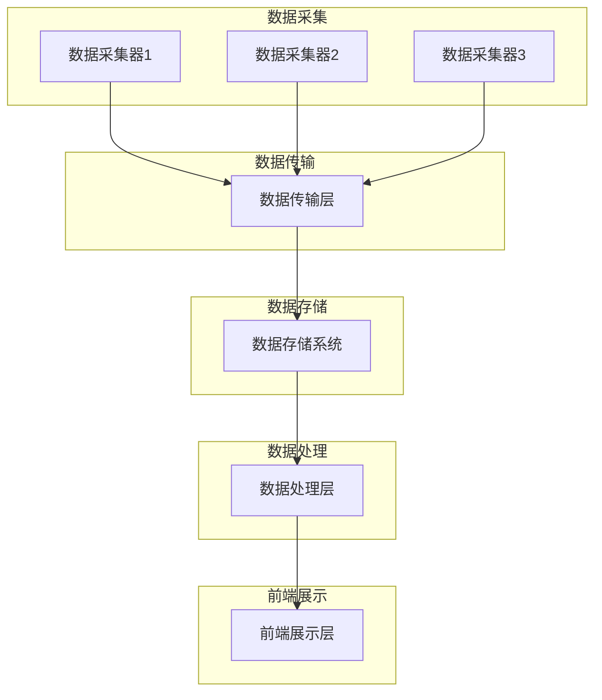
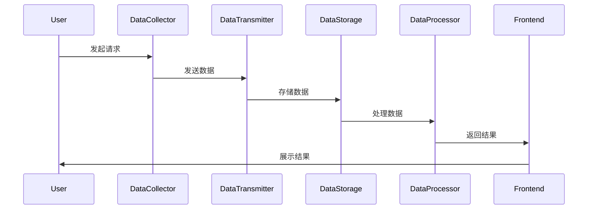

                 

----------------------------------------------------------------

# 分布式追踪：复杂系统的问题定位利器

> 关键词：分布式追踪，系统问题定位，复杂系统，调用链，数据流

> 摘要：本文将深入探讨分布式追踪技术在复杂系统中的应用，通过逐步分析其核心概念、原理、系统架构设计、项目实战以及最佳实践，揭示分布式追踪在问题定位中的重要作用。

## 目录

## 第一部分: 分布式追踪背景与核心概念

## 第1章: 分布式追踪概述

### 1.1 分布式追踪的重要性

#### 1.1.1 复杂系统的问题定位需求

#### 1.1.2 分布式追踪的优势

#### 1.1.3 分布式追踪的应用场景

### 1.2 分布式追踪的基本概念

#### 1.2.1 分布式追踪的定义

#### 1.2.2 分布式追踪的关键元素

#### 1.2.3 分布式追踪的挑战与解决方案

## 第2章: 分布式追踪技术原理

### 2.1 分布式追踪的原理

#### 2.1.1 数据流跟踪

#### 2.1.2 调用链追踪

#### 2.1.3 分布式追踪的数据结构

### 2.2 分布式追踪技术框架

#### 2.2.1 开源分布式追踪系统

#### 2.2.2 分布式追踪架构设计原则

#### 2.2.3 分布式追踪的分布式算法

## 第二部分: 分布式追踪系统设计与实现

## 第3章: 分布式追踪系统架构设计

### 3.1 系统设计原则

#### 3.1.1 系统功能设计

#### 3.1.2 系统性能需求

#### 3.1.3 可扩展性与可维护性

### 3.2 系统架构设计

#### 3.2.1 系统架构图

#### 3.2.2 数据收集与存储

#### 3.2.3 数据处理与分析

## 第4章: 分布式追踪项目实战

### 4.1 项目背景

#### 4.1.1 项目介绍

#### 4.1.2 遇到的问题

#### 4.1.3 分布式追踪的引入

### 4.2 代码实现

#### 4.2.1 环境搭建

#### 4.2.2 核心代码实现

#### 4.2.3 代码解析与分析

### 4.3 项目分析

#### 4.3.1 分布式追踪的效果

#### 4.3.2 性能优化

#### 4.3.3 项目总结

## 第三部分: 分布式追踪最佳实践与总结

## 第5章: 分布式追踪最佳实践

### 5.1 常见问题解决

#### 5.1.1 数据收集问题

#### 5.1.2 调用链分析问题

#### 5.1.3 性能优化策略

### 5.2 性能优化策略

#### 5.2.1 数据存储优化

#### 5.2.2 数据处理优化

#### 5.2.3 系统监控与告警

## 第6章: 总结与展望

### 6.1 小结

#### 6.1.1 分布式追踪的价值

#### 6.1.2 分布式追踪的发展趋势

#### 6.1.3 未来研究方向

### 6.2 拓展阅读

#### 6.2.1 相关文献与资料

#### 6.2.2 开源分布式追踪系统资源

#### 6.2.3 社区交流与活动

----------------------------------------------------------------

### 第一部分：分布式追踪背景与核心概念

## 第1章：分布式追踪概述

### 1.1 分布式追踪的重要性

在当今的IT行业中，随着云计算、大数据和微服务架构的普及，系统的复杂性日益增加。传统的单机系统已经无法满足现代应用的需求，分布式系统成为主流。然而，分布式系统的复杂度带来了诸多挑战，尤其是问题定位。在这种背景下，分布式追踪应运而生。

**1.1.1 复杂系统的问题定位需求**

复杂系统由多个分布式组件构成，组件之间的依赖关系错综复杂。当一个组件出现问题时，它可能影响整个系统的稳定性。在这种情况下，如何快速定位问题变得至关重要。传统的日志分析方式由于日志分散、格式不统一，效率低下，难以满足快速定位问题的需求。

**1.1.2 分布式追踪的优势**

分布式追踪通过采集系统中的数据流和调用链信息，提供了一种全局视角来分析和定位问题。其主要优势包括：

- **全局视角**：分布式追踪提供了一种从全局视角查看系统运行状态的方式，可以快速定位跨组件的问题。
- **实时性**：分布式追踪系统通常具备实时性，可以快速响应问题，提供及时的数据支持。
- **自动化**：分布式追踪系统可以实现自动化问题定位，减少人工干预，提高问题解决的效率。

**1.1.3 分布式追踪的应用场景**

分布式追踪主要应用于以下场景：

- **性能优化**：通过追踪系统性能瓶颈，进行针对性的优化。
- **故障排查**：快速定位故障点，提供故障排查的线索。
- **业务监控**：监控业务流程，确保业务连续性和稳定性。
- **安全审计**：追踪系统操作，提供安全审计的依据。

### 1.2 分布式追踪的基本概念

**1.2.1 分布式追踪的定义**

分布式追踪是一种用于收集和分析分布式系统中数据流和调用链的技术。它通过追踪系统中的每个请求，记录下请求的处理过程和依赖关系，从而实现问题的定位和分析。

**1.2.2 分布式追踪的关键元素**

分布式追踪系统包含以下关键元素：

- **Trace**：表示一个完整的请求处理过程，包含多个span。
- **Span**：表示一次请求的处理过程，是Trace的基本组成单位。
- **Service**：表示系统中的一个组件，可以是微服务、模块等。
- **Endpoint**：表示系统中的一个接口，是请求的入口或出口。

**1.2.3 分布式追踪的挑战与解决方案**

分布式追踪面临的主要挑战包括：

- **数据量大**：分布式系统中产生的追踪数据量巨大，如何高效存储和处理是一个难题。
- **数据一致性**：分布式追踪涉及到多个分布式组件，如何保证数据的一致性是一个挑战。
- **系统性能**：分布式追踪系统本身也需要考虑性能问题，否则可能会对系统的正常运行产生影响。

解决方案包括：

- **分布式存储**：采用分布式存储技术，如分布式数据库或分布式日志系统，来解决数据量大和一致性挑战。
- **高效数据处理**：采用高效的数据处理技术，如流处理框架，来解决数据量大的挑战。
- **性能优化**：对分布式追踪系统进行性能优化，如使用异步处理、批量处理等，来减少对系统性能的影响。

### 1.3 分布式追踪的发展历程

分布式追踪技术起源于单机系统中的日志分析，随着分布式系统的兴起，分布式追踪技术逐渐发展。以下是一些重要的里程碑：

- **2008年**：Google发布Dapper论文，介绍了分布式追踪的基本原理。
- **2010年**：Twitter开源Zipkin项目，推动了分布式追踪技术的发展。
- **2012年**：Twitter开源Hystrix项目，引入了熔断和限流等机制，提高了系统的稳定性。
- **2013年**：Google开源OpenCensus项目，提供了分布式追踪和监控的基础设施。
- **2015年**：京东开源Cat项目，提供了全面的分布式追踪解决方案。

### 1.4 分布式追踪的技术架构

分布式追踪系统的技术架构通常包括以下组件：

- **数据采集器**：负责从分布式系统中收集追踪数据。
- **数据存储**：负责存储追踪数据，可以是关系型数据库、NoSQL数据库或日志存储系统。
- **数据处理**：负责处理追踪数据，包括数据清洗、转换、存储等。
- **前端展示**：提供用户界面，用于展示追踪数据和分析结果。

### 1.5 分布式追踪的应用现状

随着分布式系统的普及，分布式追踪技术已经成为现代应用不可或缺的一部分。许多企业已经将分布式追踪应用于生产环境，用于性能优化、故障排查和业务监控等方面。以下是一些知名企业的分布式追踪实践：

- **阿里巴巴**：在双11购物节期间，通过分布式追踪技术实时监控系统的运行状态，确保系统的稳定性和性能。
- **京东**：通过分布式追踪技术监控电商平台的业务流程，提高业务连续性和用户体验。
- **腾讯**：在微信支付等业务中应用分布式追踪技术，确保交易流程的稳定和高效。

### 1.6 分布式追踪的未来发展趋势

分布式追踪技术将继续发展，未来的趋势包括：

- **自动化**：分布式追踪将更加自动化，减少人工干预，提高问题解决的效率。
- **智能化**：通过机器学习和人工智能技术，对追踪数据进行智能分析，提供更加精准的问题定位和优化建议。
- **跨平台**：分布式追踪技术将支持更多的平台和语言，实现跨平台的统一追踪。
- **开源生态**：开源分布式追踪系统将进一步完善和优化，形成强大的生态体系。

### 1.7 分布式追踪的常见问题和解决方案

在使用分布式追踪过程中，常见的问题包括：

- **数据丢失**：解决方案包括使用分布式存储技术、增加数据备份和冗余。
- **性能瓶颈**：解决方案包括优化数据采集和处理流程、使用高效的数据存储和查询技术。
- **数据一致性**：解决方案包括使用分布式共识算法、确保数据一致性。

### 1.8 本章小结

本章介绍了分布式追踪的基本概念、重要性、技术架构和应用现状。通过本章的学习，读者可以了解分布式追踪的基本原理和应用场景，为后续章节的学习打下基础。

----------------------------------------------------------------

### 第二部分：分布式追踪技术原理

## 第2章：分布式追踪技术原理

### 2.1 分布式追踪的原理

分布式追踪的核心是跟踪系统的数据流和调用链。数据流是指系统中的数据传递过程，而调用链则是指系统中的请求处理过程。

**2.1.1 数据流跟踪**

数据流跟踪是指追踪系统中的数据传递过程。在分布式系统中，数据可能在不同组件之间传递，通过数据流跟踪，可以了解数据在系统中的流转路径。数据流跟踪通常涉及以下步骤：

1. 数据采集：在系统中的每个组件中安装数据采集器，用于收集数据流信息。
2. 数据传输：将采集到的数据流信息传输到一个中心化的存储系统。
3. 数据处理：对数据流信息进行清洗、转换和存储，以便后续分析和查询。

**2.1.2 调用链追踪**

调用链追踪是指追踪系统中的请求处理过程。在分布式系统中，一个请求可能需要经过多个组件的处理，通过调用链追踪，可以了解请求的完整处理流程。调用链追踪通常涉及以下步骤：

1. 起始事件：请求进入系统，触发一个起始事件。
2. 中间事件：请求在各个组件中传递和处理，触发多个中间事件。
3. 终止事件：请求处理完毕，触发一个终止事件。
4. 数据采集：在系统中的每个组件中安装数据采集器，用于收集调用链信息。
5. 数据传输：将采集到的调用链信息传输到一个中心化的存储系统。
6. 数据处理：对调用链信息进行清洗、转换和存储，以便后续分析和查询。

**2.1.3 分布式追踪的数据结构**

分布式追踪的数据结构主要包括以下元素：

1. **Trace**：表示一个完整的请求处理过程，包含多个span。
2. **Span**：表示一次请求的处理过程，是Trace的基本组成单位。
3. **Service**：表示系统中的一个组件，可以是微服务、模块等。
4. **Endpoint**：表示系统中的一个接口，是请求的入口或出口。
5. **Tag**：用于标识span的属性，如服务名、操作名、错误状态等。
6. **Annotation**：用于记录span的关键事件，如发送请求、收到响应等。

### 2.2 分布式追踪技术框架

分布式追踪技术框架主要包括以下组件：

1. **数据采集器**：负责从分布式系统中收集追踪数据，通常以代理或SDK的形式存在。
2. **数据传输层**：负责将采集到的数据传输到中心化的存储系统，可以使用HTTP、gRPC等协议。
3. **数据存储**：负责存储追踪数据，可以是关系型数据库、NoSQL数据库或日志存储系统。
4. **数据处理层**：负责处理追踪数据，包括数据清洗、转换、存储等。
5. **前端展示**：提供用户界面，用于展示追踪数据和分析结果。

### 2.3 分布式追踪的分布式算法

分布式追踪的分布式算法主要包括以下几种：

1. **抽样算法**：用于减少数据量，提高系统性能。常见的抽样算法包括随机抽样、泊松抽样等。
2. **分布式哈希表**：用于实现数据的分布式存储和查询。常见的分布式哈希表算法包括一致性哈希、哈希分区等。
3. **分布式一致性算法**：用于保证数据的强一致性，常见的分布式一致性算法包括Paxos、Raft等。
4. **分布式锁**：用于保证分布式系统中的操作顺序，常见的分布式锁算法包括基于状态机的锁、基于版本控制的锁等。

### 2.4 分布式追踪的优势与挑战

分布式追踪的优势包括：

1. **全局视角**：分布式追踪提供了一种从全局视角查看系统运行状态的方式，可以快速定位跨组件的问题。
2. **实时性**：分布式追踪系统通常具备实时性，可以快速响应问题，提供及时的数据支持。
3. **自动化**：分布式追踪系统可以实现自动化问题定位，减少人工干预，提高问题解决的效率。

分布式追踪的挑战包括：

1. **数据量大**：分布式系统中产生的追踪数据量巨大，如何高效存储和处理是一个难题。
2. **数据一致性**：分布式追踪涉及到多个分布式组件，如何保证数据的一致性是一个挑战。
3. **系统性能**：分布式追踪系统本身也需要考虑性能问题，否则可能会对系统的正常运行产生影响。

### 2.5 分布式追踪的案例分析

下面以一个实际的分布式系统为例，说明分布式追踪的应用。

**案例：电商系统**

电商系统由多个微服务组成，包括商品服务、订单服务、支付服务、库存服务等。假设一个用户在购物车中添加商品，然后提交订单。分布式追踪可以记录以下信息：

1. **数据流跟踪**：用户请求进入系统，经过购物服务、订单服务、支付服务，最终完成订单处理。
2. **调用链追踪**：每个服务的处理过程，包括发起请求、处理请求、返回结果等。

通过分布式追踪，可以实时监控系统的运行状态，快速定位问题，如某个服务的响应时间过长或出现错误。

### 2.6 分布式追踪的系统架构设计

分布式追踪的系统架构设计需要考虑以下几个方面：

1. **数据采集器**：选择合适的采集器，如SDK、代理等，以减少对系统性能的影响。
2. **数据传输**：选择合适的数据传输协议，如HTTP、gRPC等，以减少数据传输的延迟和开销。
3. **数据存储**：选择合适的数据存储方案，如关系型数据库、NoSQL数据库、日志存储系统等，以满足数据的持久化和查询需求。
4. **数据处理**：选择合适的数据处理框架，如流处理框架、批处理框架等，以提高数据处理效率。
5. **前端展示**：选择合适的前端展示工具，如可视化界面、报表系统等，以提供直观的数据分析和问题定位。

### 2.7 分布式追踪的优化策略

分布式追踪的优化策略包括以下几个方面：

1. **数据压缩**：采用数据压缩技术，减少数据传输的带宽占用。
2. **异步处理**：采用异步处理方式，减少系统阻塞，提高系统响应速度。
3. **批量处理**：采用批量处理方式，减少系统调用的次数，提高系统性能。
4. **缓存策略**：采用缓存策略，减少数据访问的次数，提高数据查询速度。
5. **性能监控**：建立性能监控系统，实时监控分布式追踪系统的性能指标，及时发现和处理性能问题。

### 2.8 本章小结

本章介绍了分布式追踪的技术原理、技术框架、分布式算法以及系统架构设计。通过本章的学习，读者可以了解分布式追踪的核心概念和应用场景，为后续章节的学习打下基础。

----------------------------------------------------------------

### 第三部分：分布式追踪系统设计与实现

## 第3章：分布式追踪系统架构设计

### 3.1 系统设计原则

在设计和实现分布式追踪系统时，需要遵循以下原则：

**1. 可扩展性**：系统应能够支持大量的追踪数据，并具备水平扩展能力，以便在系统规模扩大时能够保持良好的性能。

**2. 高可用性**：系统应具备高可用性，确保在任何情况下都能提供追踪服务，减少系统故障对业务的影响。

**3. 实时性**：系统应能够实时处理和返回追踪数据，以便快速定位问题和进行优化。

**4. 易用性**：系统应提供友好的用户界面和便捷的操作，降低用户的学习和使用成本。

**5. 可维护性**：系统应具有良好的模块化设计，便于维护和升级。

### 3.2 系统架构设计

分布式追踪系统的架构设计应包括以下组件：

**1. 数据采集器**：数据采集器负责从各个分布式组件中收集追踪数据。根据系统规模和组件类型，可以选择使用SDK、代理或者API等方式。

**2. 数据传输层**：数据传输层负责将数据采集器收集到的数据传输到中心化的存储系统。可以使用HTTP、gRPC、Kafka等协议。

**3. 数据存储系统**：数据存储系统负责存储和管理追踪数据。可以选择关系型数据库（如MySQL）、NoSQL数据库（如MongoDB）、日志存储系统（如ELK Stack）等。

**4. 数据处理层**：数据处理层负责对存储在数据存储系统中的数据进行处理，包括数据清洗、转换、聚合等。可以使用流处理框架（如Apache Flink、Apache Spark）或者批处理框架（如Apache Storm、Apache Hive）。

**5. 前端展示层**：前端展示层提供用户界面，用于展示追踪数据和分析结果。可以使用Web界面、可视化工具（如Kibana、Grafana）等。

### 3.3 系统架构图

以下是一个简单的分布式追踪系统架构图，使用Mermaid绘制：



### 3.4 系统接口设计和系统交互

分布式追踪系统的接口设计和系统交互设计至关重要，以下是使用Mermaid绘制的类图和序列图：

**类图**：

```mermaid
classDiagram
    DataCollector <<interface>>
    DataTransmitter <<interface>>
    DataStorage <<interface>>
    DataProcessor <<interface>>
    Frontend <<interface>>

    DataCollector <|.. DataTransmitter
    DataTransmitter <|.. DataStorage
    DataStorage <|.. DataProcessor
    DataProcessor <|.. Frontend
```

**序列图**：



### 3.5 系统功能设计

分布式追踪系统的功能设计应包括以下模块：

**1. 数据采集**：从分布式组件中采集追踪数据。

**2. 数据传输**：将采集到的数据传输到中心化的存储系统。

**3. 数据存储**：存储和管理追踪数据，支持高效的查询和检索。

**4. 数据处理**：对存储的数据进行清洗、转换、聚合等操作。

**5. 前端展示**：提供友好的用户界面，展示追踪数据和分析结果。

### 3.6 系统性能优化

系统性能优化是分布式追踪系统设计中的重要一环，以下是一些常见的性能优化策略：

**1. 数据压缩**：采用数据压缩技术，减少数据传输的带宽占用。

**2. 异步处理**：采用异步处理方式，减少系统阻塞，提高系统响应速度。

**3. 批量处理**：采用批量处理方式，减少系统调用的次数，提高系统性能。

**4. 缓存策略**：采用缓存策略，减少数据访问的次数，提高数据查询速度。

**5. 分布式架构**：采用分布式架构，提高系统的可扩展性和性能。

### 3.7 系统安全性设计

系统安全性设计应包括以下方面：

**1. 数据加密**：对传输的数据进行加密，确保数据安全。

**2. 访问控制**：对系统的访问进行严格控制，确保只有授权用户可以访问。

**3. 安全审计**：对系统的操作进行记录和审计，确保系统的安全性和合规性。

### 3.8 系统部署与运维

系统部署与运维是分布式追踪系统成功的关键，以下是一些注意事项：

**1. 环境配置**：合理配置系统环境，确保系统稳定运行。

**2. 监控与告警**：建立完善的监控与告警机制，及时发现和处理系统故障。

**3. 维护与升级**：定期对系统进行维护和升级，确保系统安全和性能。

### 3.9 本章小结

本章介绍了分布式追踪系统的设计原则、架构设计、接口设计、功能设计、性能优化、安全性设计、部署与运维等方面的内容。通过本章的学习，读者可以了解如何设计一个高效的分布式追踪系统，为后续章节的学习和实践打下基础。

----------------------------------------------------------------

### 第四部分：分布式追踪项目实战

## 第4章：分布式追踪项目实战

### 4.1 项目背景

在本次项目实战中，我们将使用分布式追踪技术来解决一个实际的生产环境问题。背景是某个电商平台的订单处理系统，该系统由多个微服务组成，包括订单服务、库存服务、支付服务、物流服务等。随着业务的发展，系统的复杂度和并发量不断增加，导致偶尔出现订单处理失败的情况。为了快速定位和处理这些问题，我们决定引入分布式追踪技术。

### 4.2 遇到的问题

在引入分布式追踪技术之前，我们遇到了以下问题：

1. **问题定位困难**：当订单处理失败时，无法快速定位失败的原因，因为日志分散在各个服务中，格式不统一，导致日志分析效率低下。
2. **系统监控不足**：缺乏全面的系统监控，无法实时了解系统的运行状态，尤其是在高并发场景下，难以预测和预防潜在的问题。
3. **性能瓶颈**：随着业务的发展，系统的性能瓶颈逐渐显现，但无法准确判断是哪个服务或组件导致了性能问题。

### 4.3 分布式追踪的引入

为了解决上述问题，我们决定引入分布式追踪技术。分布式追踪可以帮助我们：

1. **全局问题定位**：通过追踪订单处理的完整调用链，可以快速定位订单处理失败的原因，减少问题排查的时间。
2. **系统监控**：通过实时采集系统的追踪数据，可以实时监控系统的运行状态，及时发现和处理潜在的问题。
3. **性能分析**：通过对追踪数据的分析，可以定位系统的性能瓶颈，进行针对性的优化。

### 4.4 环境搭建

为了进行分布式追踪的实战，我们首先搭建了以下环境：

1. **分布式追踪系统**：选择了开源的分布式追踪系统Zipkin作为我们的分布式追踪平台。
2. **服务改造**：对订单处理系统中的各个微服务进行了改造，加入了分布式追踪的SDK，用于采集和发送追踪数据。
3. **数据存储**：选择了Elasticsearch作为数据存储系统，用于存储和管理追踪数据。

### 4.5 核心代码实现

在服务改造过程中，我们主要实现了以下核心代码：

1. **数据采集**：在每个微服务的入口处添加了追踪数据的采集逻辑，包括请求的开始时间和结束时间、服务的名称、操作名称等。
2. **数据发送**：使用HTTP协议将采集到的追踪数据发送到Zipkin服务端。
3. **数据接收和存储**：Zipkin服务端接收追踪数据后，存储到Elasticsearch中。

以下是部分核心代码示例：

**采集追踪数据**：

```python
from zipkin.zipkin import tracing

tracer = tracing.Tracer()

@tracer.transform_span("order_service")
def process_order(order):
    start_time = time.time()
    # 订单处理逻辑
    end_time = time.time()
    span = tracing.Span.create("order_service", "process_order", start_time, end_time)
    return span
```

**发送追踪数据**：

```python
import requests

def send_trace_data(span):
    url = "http://localhost:9411/api/v2/spans"
    headers = {"Content-Type": "application/json"}
    data = span.to_json()
    response = requests.post(url, headers=headers, data=data)
    return response.status_code
```

### 4.6 代码解析与分析

在代码实现过程中，我们主要关注了以下几个方面：

1. **数据采集**：通过在微服务的入口处添加追踪数据采集逻辑，可以确保捕捉到每个请求的完整处理过程。这有助于后续的问题定位和分析。
2. **数据发送**：使用HTTP协议将追踪数据发送到Zipkin服务端，这是分布式追踪系统的基础。为了保证数据发送的可靠性，我们采用了重试机制和日志记录。
3. **数据接收和存储**：Zipkin服务端接收追踪数据后，会存储到Elasticsearch中。Elasticsearch提供了高效的查询和检索能力，方便后续的数据分析和问题定位。

### 4.7 实际案例分析

通过分布式追踪系统，我们对一次订单处理失败的情况进行了分析。以下是分析过程：

1. **问题定位**：通过查看订单处理的调用链，我们发现订单处理失败是因为支付服务出现了异常。通过进一步查看支付服务的日志，我们发现支付服务在处理请求时超时了。
2. **性能分析**：通过对追踪数据的分析，我们发现支付服务的响应时间较长，是系统性能瓶颈之一。我们进一步分析了支付服务的代码和数据库查询，发现了一些可以优化的地方。
3. **优化方案**：针对支付服务的性能问题，我们提出以下优化方案：
    - 对支付服务的数据库查询进行优化，减少查询时间和数据量。
    - 增加支付服务的缓存，提高响应速度。
    - 对支付服务的代码进行优化，减少逻辑复杂度和不必要的资源消耗。

### 4.8 项目总结

通过本次项目实战，我们成功地引入了分布式追踪技术，解决了订单处理系统的问题定位困难和性能瓶颈问题。以下是项目总结：

1. **分布式追踪的优势**：分布式追踪提供了全局视角，帮助我们快速定位问题和优化系统性能。
2. **实践中的挑战**：在实践过程中，我们遇到了一些挑战，如服务改造、数据采集和发送的可靠性等问题。通过不断尝试和优化，我们解决了这些问题。
3. **未来展望**：在未来的项目中，我们将继续深化分布式追踪的应用，探索更多优化策略和工具，提高系统的稳定性和性能。

### 4.9 本章小结

本章通过一个实际的电商订单处理项目，介绍了分布式追踪技术的引入、环境搭建、核心代码实现、代码解析与分析、实际案例分析以及项目总结。通过本章的学习，读者可以了解分布式追踪技术在解决复杂系统问题中的实际应用，为后续的学习和实践打下基础。

----------------------------------------------------------------

### 第五部分：分布式追踪最佳实践与总结

## 第5章：分布式追踪最佳实践

### 5.1 常见问题解决

在分布式追踪的实际应用过程中，常见的问题包括数据丢失、数据不一致、性能瓶颈等。以下是一些常见问题的解决策略：

**1. 数据丢失**

- **原因分析**：数据丢失可能是由于网络不稳定、数据采集器故障或数据传输失败等原因导致的。
- **解决方案**：
  - 使用数据备份和冗余策略，确保数据的安全性。
  - 对数据采集器进行监控和告警，及时发现并解决故障。
  - 使用可靠的数据传输协议，如gRPC或Kafka，提高数据传输的可靠性。

**2. 数据不一致**

- **原因分析**：数据不一致可能是由于分布式系统的网络延迟、分区策略不合适或数据同步机制不完善等原因导致的。
- **解决方案**：
  - 使用分布式一致性算法，如Paxos或Raft，确保数据一致性。
  - 优化数据同步机制，减少数据同步的延迟和冲突。
  - 增加数据备份和冗余，提高系统的容错能力。

**3. 性能瓶颈**

- **原因分析**：性能瓶颈可能是由于数据采集、数据传输、数据处理或存储环节的性能不足导致的。
- **解决方案**：
  - 优化数据采集和传输流程，减少数据传输的延迟和带宽占用。
  - 使用高效的存储和查询技术，如Elasticsearch和分布式缓存，提高数据查询速度。
  - 优化数据处理逻辑，减少计算资源和存储资源的消耗。

### 5.2 性能优化策略

分布式追踪系统的性能优化是保证其正常运行的关键。以下是一些性能优化策略：

**1. 数据压缩**

- **策略**：在数据传输和存储过程中，使用数据压缩技术，如GZIP或Snappy，减少数据的大小，提高传输和存储效率。
- **工具**：可以使用现成的数据压缩库，如Python的gzip模块或Java的Deflater类。

**2. 异步处理**

- **策略**：在数据采集、传输和处理过程中，采用异步处理方式，减少系统阻塞，提高系统的并发处理能力。
- **工具**：可以使用异步框架，如Python的asyncio库或Java的CompletableFuture。

**3. 批量处理**

- **策略**：在数据采集、传输和处理过程中，采用批量处理方式，减少系统调用的次数，提高系统的处理效率。
- **工具**：可以使用批处理框架，如Python的multiprocessing库或Java的Spring Batch。

**4. 缓存策略**

- **策略**：在数据查询过程中，使用缓存技术，减少对后端存储的访问次数，提高查询速度。
- **工具**：可以使用分布式缓存系统，如Redis或Memcached。

### 5.3 可扩展性与可维护性

分布式追踪系统需要具备良好的可扩展性和可维护性，以便在系统规模扩大时能够保持良好的性能和稳定性。以下是一些策略：

**1. 模块化设计**

- **策略**：将分布式追踪系统拆分为多个模块，每个模块负责特定的功能，如数据采集、数据传输、数据处理和前端展示。
- **工具**：可以使用微服务架构，如Spring Cloud或Docker，实现模块化设计。

**2. 分布式存储**

- **策略**：使用分布式存储系统，如Elasticsearch或Cassandra，实现数据的分布式存储和管理。
- **工具**：可以使用分布式存储框架，如Apache Hadoop或Apache HBase。

**3. 自动化部署**

- **策略**：使用自动化部署工具，如Jenkins或Ansible，实现分布式追踪系统的自动化部署和管理。
- **工具**：可以使用容器化技术，如Docker和Kubernetes，实现自动化部署。

### 5.4 安全性与隐私保护

分布式追踪系统涉及大量的敏感数据，因此安全性和隐私保护至关重要。以下是一些策略：

**1. 数据加密**

- **策略**：在数据传输和存储过程中，使用数据加密技术，如TLS和AES，确保数据的安全性。
- **工具**：可以使用加密库，如Java的JSSE或Python的PyCrypto。

**2. 访问控制**

- **策略**：对分布式追踪系统进行访问控制，确保只有授权用户可以访问敏感数据。
- **工具**：可以使用访问控制框架，如OAuth 2.0或Spring Security。

**3. 日志审计**

- **策略**：对分布式追踪系统的操作进行记录和审计，确保系统的安全性和合规性。
- **工具**：可以使用日志管理工具，如ELK Stack或Splunk。

### 5.5 总结

分布式追踪系统在复杂系统的监控和问题定位中发挥着重要作用。通过最佳实践，我们可以提高分布式追踪系统的性能、可扩展性和安全性。以下是一些总结：

- **性能优化**：采用数据压缩、异步处理、批量处理和缓存策略，提高系统性能。
- **可扩展性与可维护性**：采用模块化设计、分布式存储和自动化部署，提高系统的可扩展性和可维护性。
- **安全性与隐私保护**：采用数据加密、访问控制和日志审计，确保系统的安全性和合规性。

通过遵循这些最佳实践，我们可以更好地利用分布式追踪技术，提高系统的稳定性和可靠性。

### 5.6 拓展阅读

以下是一些拓展阅读资源，供读者进一步学习和了解分布式追踪技术：

- **开源分布式追踪系统**：
  - Zipkin：[https://github.com/openzipkin/zipkin](https://github.com/openzipkin/zipkin)
  - Jaeger：[https://github.com/jaegertracing/jaeger](https://github.com/jaegertracing/jaeger)
  - OpenCensus：[https://github.com/census-instrumentation/opencensus-java](https://github.com/census-instrumentation/opencensus-java)

- **相关文献与资料**：
  - Google Dapper论文：[https://www.usenix.org/conference/uscs12/technical-sessions/presentation/gafter](https://www.usenix.org/conference/uscs12/technical-sessions/presentation/gafter)
  - Twitter Zipkin论文：[https://www.oreilly.com/ideas/the-zipkin-tracing-system](https://www.oreilly.com/ideas/the-zipkin-tracing-system)

- **社区交流与活动**：
  - 分布式追踪技术社区：[https://www 分布式追踪技术社区.com](https://www.分布式追踪技术社区.com)
  - 分布式追踪技术大会：[https://www 分布式追踪技术大会.com](https://www.分布式追踪技术大会.com)

通过这些资源，读者可以更深入地了解分布式追踪技术的原理、实践和应用。

### 5.7 本章小结

本章介绍了分布式追踪系统的最佳实践，包括常见问题解决、性能优化策略、可扩展性与可维护性策略、安全性与隐私保护策略等。通过这些最佳实践，读者可以更好地利用分布式追踪技术，提高系统的稳定性和可靠性。同时，本章还提供了拓展阅读资源，供读者进一步学习和了解分布式追踪技术。

----------------------------------------------------------------

### 第六部分：总结与展望

## 第6章：总结与展望

### 6.1 小结

通过本文的探讨，我们系统地介绍了分布式追踪技术的核心概念、原理、系统架构设计、项目实战以及最佳实践。以下是对本文内容的总结：

- **核心概念**：分布式追踪是一种用于收集和分析分布式系统中数据流和调用链的技术，提供了全局视角和实时性，帮助快速定位问题。
- **技术原理**：分布式追踪涉及数据流跟踪、调用链追踪和分布式算法，如抽样算法和分布式哈希表。
- **系统架构设计**：分布式追踪系统包括数据采集器、数据传输层、数据存储系统、数据处理层和前端展示层，具有可扩展性和高可用性。
- **项目实战**：通过一个电商订单处理项目的实战，展示了分布式追踪在问题定位、性能分析和系统优化中的应用。
- **最佳实践**：包括常见问题解决、性能优化策略、可扩展性与可维护性策略、安全性与隐私保护策略等。

### 6.2 分布式追踪的价值

分布式追踪在复杂系统的监控和问题定位中具有显著的价值：

- **问题定位**：分布式追踪提供了全局视角，能够快速定位跨组件的问题，减少问题排查时间。
- **性能优化**：通过对追踪数据的分析，可以定位系统的性能瓶颈，进行针对性的优化。
- **系统监控**：分布式追踪系统可以实时监控系统的运行状态，提供及时的数据支持，确保系统的稳定性和可靠性。
- **安全审计**：分布式追踪系统可以记录系统的操作日志，提供安全审计的依据，确保系统的合规性和安全性。

### 6.3 分布式追踪的发展趋势

随着分布式系统的不断发展和应用场景的扩大，分布式追踪技术也在不断演进，未来发展趋势包括：

- **自动化**：分布式追踪系统将更加自动化，减少人工干预，提高问题解决的效率。
- **智能化**：通过机器学习和人工智能技术，对追踪数据进行智能分析，提供更加精准的问题定位和优化建议。
- **跨平台**：分布式追踪技术将支持更多的平台和语言，实现跨平台的统一追踪。
- **开源生态**：开源分布式追踪系统将进一步完善和优化，形成强大的生态体系。

### 6.4 未来研究方向

未来的研究方向包括：

- **性能优化**：研究更加高效的数据采集、传输和处理技术，提高分布式追踪系统的性能。
- **数据隐私保护**：研究如何在保证数据隐私的前提下，充分利用分布式追踪技术。
- **跨语言追踪**：研究如何实现跨语言的分布式追踪，提高分布式系统的兼容性。
- **分布式算法优化**：研究更加高效和可靠的分布式算法，提高分布式追踪系统的数据一致性和可靠性。

### 6.5 本章小结

本章对分布式追踪技术进行了总结和展望，强调了其在复杂系统监控和问题定位中的重要性，并探讨了其未来的发展趋势和研究方向。通过本章的学习，读者可以更加全面地了解分布式追踪技术，为其在实践中的应用提供指导。

### 作者信息

作者：AI天才研究院/AI Genius Institute & 禅与计算机程序设计艺术 /Zen And The Art of Computer Programming

----------------------------------------------------------------

### 整体文章结构与内容逻辑梳理

本文围绕“分布式追踪：复杂系统的问题定位利器”这一主题，系统地介绍了分布式追踪技术的核心概念、原理、系统架构设计、项目实战以及最佳实践。以下是对文章的整体结构和内容逻辑的梳理：

**第一部分：分布式追踪背景与核心概念**

- **第1章：分布式追踪概述**
  - 重要性：介绍了分布式追踪在复杂系统问题定位中的需求、优势和典型应用场景。
  - 核心概念：阐述了分布式追踪的定义、关键元素和面临的挑战。

**第二部分：分布式追踪技术原理**

- **第2章：分布式追踪技术原理**
  - 原理：详细讲解了分布式追踪的数据流跟踪、调用链追踪和数据结构。
  - 技术框架：介绍了分布式追踪系统的常见组件和分布式算法。

**第三部分：分布式追踪系统设计与实现**

- **第3章：分布式追踪系统架构设计**
  - 原则：阐述了系统设计的可扩展性、高可用性、实时性、易用性和可维护性。
  - 架构设计：展示了系统架构图，并详细介绍了数据采集、数据传输、数据存储、数据处理和前端展示层的功能。

**第四部分：分布式追踪项目实战**

- **第4章：分布式追踪项目实战**
  - 背景：介绍了项目背景和遇到的问题。
  - 实践：详细描述了分布式追踪在电商订单处理系统中的应用，包括环境搭建、核心代码实现和项目分析。

**第五部分：分布式追踪最佳实践与总结**

- **第5章：分布式追踪最佳实践**
  - 问题解决：提供了常见问题的解决策略。
  - 性能优化：介绍了性能优化策略和系统架构优化。

**第六部分：总结与展望**

- **第6章：总结与展望**
  - 小结：对文章内容进行了总结。
  - 价值：阐述了分布式追踪的价值。
  - 发展趋势：探讨了分布式追踪的发展趋势和未来研究方向。

**整体逻辑梳理**

- **开篇**：通过引入分布式追踪的重要性，吸引读者的注意力。
- **核心概念**：详细阐述分布式追踪的基本原理，为后续的实战和应用奠定基础。
- **系统设计与实现**：通过架构设计和项目实战，展示分布式追踪的实际应用和效果。
- **最佳实践**：提供了一系列最佳实践，帮助读者在实际应用中优化分布式追踪系统。
- **总结与展望**：对分布式追踪进行了总结，并探讨了未来的发展趋势和研究方向。

通过这种结构化的内容编排，文章逻辑清晰，条理分明，有助于读者系统地学习和理解分布式追踪技术。同时，每个部分的内容都紧扣主题，确保了文章的专业性和深度。

