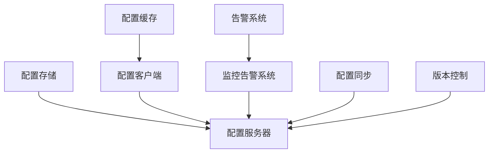
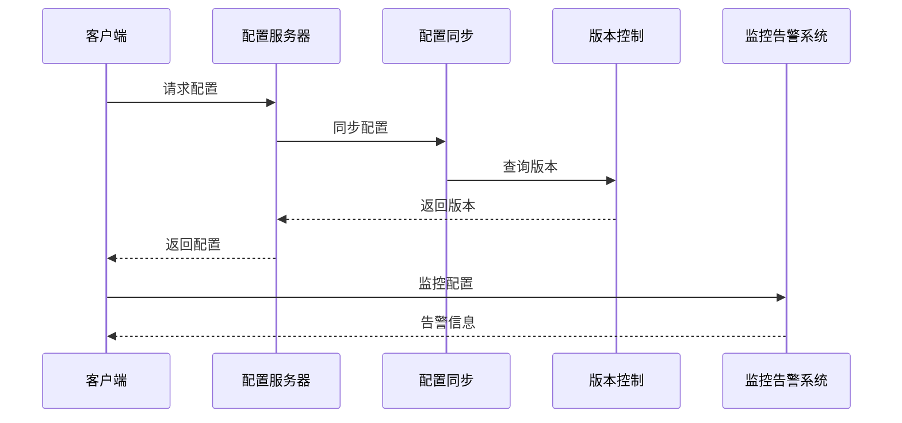

                 

# 分布式配置中心设计与实现

## 关键词

- 分布式配置中心
- 配置管理
- 微服务
- 版本控制
- 配置一致性
- 配置寻址

## 摘要

本文将深入探讨分布式配置中心的设计与实现，旨在解决在分布式系统中软件配置管理的挑战。我们将从分布式配置中心的概述出发，逐步介绍核心概念、算法原理、数学模型、系统分析与架构设计，并展示一个实际的分布式配置中心项目实战。最后，我们将提供一些最佳实践建议，并总结全文，指出需要注意的事项和未来的研究方向。

## 第一部分：背景介绍

### 第1章：分布式配置中心概述

#### 1.1 问题的背景

在现代软件系统中，配置管理是一个至关重要的环节。传统的单机部署模式中，配置通常以静态文件的形式存在，由运维人员进行手动管理。然而，随着分布式系统的普及，单点配置管理的方式已经无法满足需求。分布式系统中的配置需要具备动态性、可扩展性和高可用性，以便在系统运行过程中能够灵活调整。

#### 1.1.1 软件配置管理的挑战

- **配置数量庞大**：分布式系统中，各个服务之间的配置项众多，管理复杂。
- **配置变化频繁**：随着业务需求的变化，配置项需要频繁调整，增加了管理难度。
- **版本控制困难**：配置变更后，如何保证版本控制和一致性成为难题。
- **部署和运维成本高**：手动管理配置，部署和运维成本高昂，且容易出现人为错误。

#### 1.1.2 分布式系统的需求

- **动态性**：配置应能实时更新，适应业务需求的变化。
- **一致性**：所有节点的配置应保持一致，防止因配置差异导致系统异常。
- **高可用性**：配置中心应具备高可用性，确保配置服务的稳定可靠。
- **可扩展性**：配置中心应能支持系统规模的扩展，适应日益增长的配置需求。

#### 1.2 分布式配置中心的定义与作用

分布式配置中心是一种用于集中管理和配置分布式系统的平台。它通过提供统一的配置管理接口，实现配置的动态更新、版本控制和一致性保证。分布式配置中心在分布式系统中扮演着至关重要的角色：

- **集中化管理**：将分散的配置项集中管理，简化配置操作。
- **动态更新**：支持配置的实时更新，降低人工干预。
- **版本控制**：记录配置的变更历史，便于回滚和审计。
- **一致性保障**：确保各个节点配置的一致性，提高系统稳定性。

#### 1.2.1 分布式配置中心的概念

分布式配置中心（Distributed Configuration Center，DCC）是一种用于分布式系统的配置管理工具。它通常包含以下核心组件：

- **配置存储**：用于存储配置项的数据库或文件系统。
- **配置服务器**：提供配置检索、更新和版本控制功能的组件。
- **客户端**：从配置服务器获取配置信息，并应用到本地服务的组件。
- **监控与告警**：实时监控配置状态，并在异常发生时进行告警。

#### 1.2.2 分布式配置中心的功能

分布式配置中心提供了以下关键功能：

- **配置管理**：支持配置的创建、更新、删除和查询。
- **动态更新**：支持配置的实时更新，无需重启服务。
- **版本控制**：记录配置的变更历史，支持配置的回滚。
- **配置同步**：确保各个节点的配置一致性。
- **监控与告警**：实时监控配置状态，及时发现和解决问题。

#### 1.2.3 分布式配置中心的优势

- **简化配置管理**：将分散的配置项集中管理，降低管理难度。
- **提高系统可扩展性**：支持动态更新和配置同步，适应系统规模的变化。
- **保障系统稳定性**：通过版本控制和一致性保障，降低配置错误导致的问题。
- **提高运维效率**：减少手动干预，提高部署和运维效率。

#### 1.3 分布式配置中心的架构

分布式配置中心的架构设计至关重要，它决定了系统的性能、稳定性和可扩展性。一个典型的分布式配置中心架构包括以下组件：

- **配置存储**：用于存储配置项的数据库或文件系统。常见的配置存储方案包括关系数据库、NoSQL数据库和文件存储系统。
- **配置服务器**：负责处理配置的请求，包括配置的查询、更新和版本控制。配置服务器通常采用分布式架构，以提高性能和可用性。
- **客户端**：从配置服务器获取配置信息，并应用到本地服务的组件。客户端通常采用轻量级协议，如HTTP或gRPC，以提高通信效率。
- **监控与告警**：实时监控配置状态，并在异常发生时进行告警。监控与告警系统可以帮助运维人员及时发现和解决问题。

#### 1.3.1 系统架构概述

分布式配置中心的系统架构可以分为三个层次：

1. **存储层**：负责配置项的存储和管理。存储层通常采用数据库或文件系统，支持高并发读写操作。
2. **服务层**：负责处理配置请求，包括配置的查询、更新和版本控制。服务层通常采用分布式架构，以提高性能和可用性。
3. **客户端层**：负责从配置服务器获取配置信息，并应用到本地服务。客户端层通常采用轻量级协议，以提高通信效率。

#### 1.3.2 各组件的角色与关系

在分布式配置中心的架构中，各组件之间通过以下方式进行交互：

- **配置存储**：配置服务器从配置存储中读取配置项，并将配置项提供给客户端。
- **配置服务器**：配置服务器接收客户端的配置请求，查询配置存储，并将结果返回给客户端。配置服务器还可以处理配置更新和版本控制请求。
- **客户端**：客户端从配置服务器获取配置信息，并应用到本地服务。客户端可以通过轮询或监听的方式获取配置更新。
- **监控与告警**：监控与告警系统监控配置状态，并在异常发生时进行告警。监控与告警系统可以集成到配置服务器或客户端。

#### 1.4 分布式配置中心的现状与趋势

随着分布式系统的普及，分布式配置中心已经成为分布式系统中的重要组成部分。当前，市场上已经涌现出许多优秀的分布式配置中心产品，如Spring Cloud Config、Apache ZooKeeper、Consul、etcd等。这些产品各有特点和适用场景，但总体上都遵循以下趋势：

- **高可用性**：分布式配置中心逐渐采用分布式架构，以提高系统的可用性和可靠性。
- **动态更新**：支持配置的实时更新，降低人工干预，提高系统灵活性。
- **版本控制**：提供版本控制功能，记录配置的变更历史，便于配置管理和审计。
- **监控与告警**：集成监控与告警系统，实时监控配置状态，提高运维效率。
- **可扩展性**：支持系统规模的扩展，适应日益增长的配置需求。

#### 1.4.1 当前主要分布式配置中心产品

以下是当前市场上主要的分布式配置中心产品：

- **Spring Cloud Config**：基于Spring Boot和Spring Cloud构建的分布式配置中心，支持本地和远程配置。
- **Apache ZooKeeper**：基于ZooKeeper的分布式配置中心，提供高可用性和一致性保障。
- **Consul**：基于Go语言实现的分布式服务发现和配置中心，支持动态更新和版本控制。
- **etcd**：基于Go语言实现的分布式键值存储，常用于配置存储和分布式锁。

#### 1.4.2 行业趋势分析

根据行业趋势分析，分布式配置中心在以下方面有望进一步发展：

- **功能整合**：将分布式配置中心与其他分布式组件（如服务注册与发现、分布式锁、分布式缓存等）整合，提高系统的整体效能。
- **自动化管理**：通过自动化管理工具，实现配置的自动化部署、更新和回滚，降低运维成本。
- **多租户支持**：提供多租户支持，满足不同团队和项目的配置需求。
- **多云支持**：支持跨云平台的配置管理，适应云计算的发展趋势。

#### 1.4.3 未来发展展望

未来，分布式配置中心将继续朝着智能化和自动化方向演进，主要包括以下方面：

- **人工智能**：结合人工智能技术，实现配置的自适应调整和优化，提高系统的智能化水平。
- **区块链**：探索区块链技术在分布式配置中心中的应用，提高配置数据的安全性和可信度。
- **边缘计算**：支持边缘计算场景下的配置管理，满足边缘设备的配置需求。

#### 1.5 本章小结

本章介绍了分布式配置中心的背景、定义与作用、架构和现状与趋势。通过了解分布式配置中心的挑战和需求，读者可以更好地理解分布式配置中心的重要性。同时，通过对现有分布式配置中心产品的分析，读者可以了解到分布式配置中心的发展趋势和未来展望。在接下来的章节中，我们将深入探讨分布式配置中心的核心概念、算法原理、数学模型、系统分析与架构设计，并展示一个实际的分布式配置中心项目实战。

## 第二部分：核心概念与联系

### 第2章：核心概念与联系

#### 2.1 配置文件格式

配置文件格式是配置中心的核心组成部分，它决定了配置数据的存储、传输和解析方式。常用的配置文件格式包括XML、JSON和YAML。

#### 2.1.1 XML

XML（eXtensible Markup Language，可扩展标记语言）是一种基于文本的标记语言，广泛用于配置文件的存储和传输。XML的语法灵活，支持自定义标签和属性，使得配置数据更加丰富和可扩展。

- **优点**：具有良好的可扩展性、可读性和跨平台性。
- **缺点**：语法较为复杂，解析性能较低。

#### 2.1.2 JSON

JSON（JavaScript Object Notation，JavaScript对象表示法）是一种基于文本的轻量级数据交换格式，易于阅读和编写。JSON语法简单，支持丰富的数据类型，是配置文件格式的首选。

- **优点**：语法简单、易于阅读、解析性能高。
- **缺点**：不支持自定义标签和属性，可扩展性较低。

#### 2.1.3 YAML

YAML（YAML Ain't Markup Language，一种简洁的标记语言）是一种基于数据的配置文件格式，语法简洁、直观。YAML支持自定义标签和属性，同时具有良好的可读性和跨平台性。

- **优点**：语法简洁、直观、易于阅读。
- **缺点**：对大括号和冒号的使用要求较高，易出现格式错误。

#### 2.2 配置管理策略

配置管理策略是指配置中心在配置变更和更新过程中所采取的措施，以确保配置的一致性和稳定性。常用的配置管理策略包括灰度发布、配置热更新和配置回滚。

#### 2.2.1 灰度发布

灰度发布（Gray Release）是一种逐步推广新配置到生产环境的方法。通过在部分节点上先应用新配置，观察其效果，再逐步推广到全部节点，以降低风险。

- **优点**：降低配置变更对系统稳定性的影响，提高变更的可控性。
- **缺点**：需要额外的灰度发布策略支持，增加配置管理的复杂性。

#### 2.2.2 配置热更新

配置热更新（Hot Update）是指在服务运行过程中，实时更新配置，无需重启服务。配置热更新可以提高系统的灵活性和可用性，减少停机时间。

- **优点**：提高系统可用性和灵活性，减少停机时间。
- **缺点**：需要实现复杂的热更新机制，确保配置更新的一致性和安全性。

#### 2.2.3 配置回滚

配置回滚（Rollback）是指将配置回滚到上一个稳定版本，以解决配置变更导致的问题。配置回滚可以确保系统在配置变更失败时能够快速恢复。

- **优点**：确保系统在配置变更失败时能够快速恢复，提高系统的稳定性。
- **缺点**：需要记录配置变更历史，实现配置回滚功能，增加配置管理的复杂性。

#### 2.3 分布式配置中心与注册中心的关系

分布式配置中心与注册中心（如ZooKeeper、Consul、etcd等）在分布式系统中相互配合，共同实现服务注册与发现、配置管理等功能。

#### 2.3.1 注册中心的作用

注册中心主要负责服务注册与发现，即记录服务的运行状态，并提供服务的访问地址。注册中心在分布式系统中起到关键作用，确保服务之间能够互相发现和调用。

- **服务注册**：服务启动时，向注册中心注册自己的地址和元数据。
- **服务发现**：服务消费方通过注册中心获取服务的地址和元数据，实现服务的动态调用。

#### 2.3.2 配置中心与注册中心的协作

配置中心与注册中心之间通过以下方式进行协作：

- **配置同步**：配置中心从注册中心获取服务列表，将配置信息同步到配置存储。
- **配置更新**：配置变更时，配置中心向注册中心发送更新通知，注册中心将更新信息广播给所有服务。
- **服务更新**：服务接收到配置更新通知后，从配置中心获取最新配置，并应用到本地服务。

#### 2.4 配置中心与微服务架构的联系

微服务架构是一种将应用程序分解为小型、独立和可重用的服务单元的架构风格。配置中心在微服务架构中扮演着重要角色，负责为各个服务提供统一的配置管理。

#### 2.4.1 微服务架构的特点

- **服务独立性**：每个服务独立部署、运行和维护，降低系统耦合度。
- **动态配置**：支持配置的动态更新，适应业务需求的变化。
- **服务发现**：服务之间通过注册中心进行发现和调用，提高系统的灵活性。
- **自动化管理**：通过自动化管理工具，实现服务的部署、更新和监控。

#### 2.4.2 配置中心在微服务架构中的角色

配置中心在微服务架构中扮演以下角色：

- **统一配置管理**：为各个服务提供统一的配置管理接口，简化配置操作。
- **动态配置更新**：支持配置的实时更新，确保服务配置的一致性。
- **服务发现与调用**：通过注册中心，实现服务之间的动态调用和发现。
- **监控与告警**：实时监控服务配置状态，及时发现和解决问题。

#### 2.5 本章小结

本章介绍了分布式配置中心的核心概念与联系，包括配置文件格式、配置管理策略、分布式配置中心与注册中心的关系以及配置中心在微服务架构中的角色。通过对这些核心概念的理解，读者可以更好地掌握分布式配置中心的工作原理和应用场景，为后续章节的深入讨论打下基础。

## 第三部分：算法原理讲解

### 第3章：分布式配置中心的算法原理

#### 3.1 配置版本控制算法

配置版本控制算法是分布式配置中心的核心功能之一，它负责记录配置的变更历史，支持配置的回滚和审计。

#### 3.1.1 版本控制的重要性

配置版本控制的重要性体现在以下几个方面：

- **变更追踪**：记录配置的变更历史，便于追溯和审计。
- **故障恢复**：在配置变更失败时，能够快速回滚到上一个稳定版本，保障系统稳定。
- **安全性**：防止配置被恶意篡改，确保配置数据的真实性和完整性。

#### 3.1.2 常见的版本控制算法

常见的版本控制算法主要包括以下几种：

- **线性版本控制**：配置变更按照顺序进行编号，每次变更后，版本号加1。这种方法简单易实现，但无法区分配置变更的优先级。
- **分支版本控制**：配置变更形成分支，每个分支代表一次独立的变更。这种方法支持配置的并行开发和实验，但管理复杂度较高。
- **标签版本控制**：在配置变更时，为每个版本添加标签，便于标识和查找。这种方法结合了线性版本控制和分支版本控制的优势，管理较为灵活。

#### 3.1.3 实现方案探讨

实现配置版本控制算法的关键在于记录配置的变更历史和提供便捷的回滚接口。以下是一种简单的实现方案：

1. **配置存储**：使用数据库或文件系统存储配置项，并为每个配置项添加版本号字段。
2. **配置变更**：在配置变更时，更新配置项的版本号，并记录变更时间、操作人等信息。
3. **配置查询**：提供配置查询接口，支持按照版本号、时间范围等条件查询配置项的历史记录。
4. **配置回滚**：提供配置回滚接口，根据版本号或标签将配置回滚到上一个稳定版本。

#### 3.2 配置一致性算法

配置一致性算法是分布式配置中心的另一个重要功能，它负责确保各个节点的配置保持一致。

#### 3.2.1 配置一致性的挑战

配置一致性面临的挑战主要包括：

- **网络延迟**：不同节点的网络延迟可能导致配置同步不及时。
- **并发修改**：多个节点同时修改配置，可能导致配置冲突。
- **数据丢失**：网络故障或节点异常可能导致配置数据丢失。

#### 3.2.2 常见的配置一致性算法

常见的配置一致性算法主要包括以下几种：

- **最终一致性**：通过不断同步配置，最终实现各个节点的一致性。这种方法适用于对实时性要求不高的场景。
- **强一致性**：在配置变更时，强制要求所有节点同时同步配置，确保一致性。这种方法适用于对实时性要求较高的场景。
- **部分一致性**：允许不同节点的配置存在差异，但通过一定策略确保整体一致性。这种方法适用于对一致性要求较低的场景。

#### 3.2.3 实现一致性算法的步骤

实现配置一致性算法的关键在于确保配置同步的可靠性和一致性。以下是一种简单的实现步骤：

1. **配置同步**：在配置变更时，将变更信息发送到所有节点，要求其同步配置。
2. **版本校验**：在同步过程中，对配置项的版本进行校验，确保不会覆盖旧版本。
3. **并发控制**：在配置同步过程中，采用锁机制或乐观锁策略，避免并发修改导致的数据冲突。
4. **故障恢复**：在配置同步失败时，记录失败原因，并进行重试或回滚操作。

#### 3.3 配置寻址算法

配置寻址算法是分布式配置中心的关键技术之一，它负责确定配置数据的存储位置和访问路径。

#### 3.3.1 配置寻址的原理

配置寻址的原理是通过配置项的名称或路径，查找配置数据的存储位置。常见的配置寻址算法包括：

- **基于路径的寻址**：通过配置项的路径直接查找配置数据。这种方法简单易实现，但难以扩展。
- **基于哈希的寻址**：通过配置项的名称或内容生成哈希值，查找配置数据的存储位置。这种方法支持快速访问和负载均衡。

#### 3.3.2 常见的配置寻址算法

常见的配置寻址算法主要包括以下几种：

- **一致性哈希**：将配置项的名称或内容映射到哈希环上，查找最近的配置存储节点。这种方法支持动态扩展和负载均衡。
- **轮询寻址**：按照一定顺序遍历配置存储节点，查找配置数据。这种方法简单易实现，但可能导致热点问题。
- **随机寻址**：随机选择配置存储节点，查找配置数据。这种方法实现简单，但可能降低访问性能。

#### 3.3.3 实现配置寻址的技巧

实现配置寻址的关键在于提高访问性能和可靠性。以下是一些实现技巧：

1. **缓存机制**：在客户端或服务端实现缓存，降低对配置存储的访问频率。
2. **负载均衡**：采用负载均衡算法，合理分配配置请求，提高系统性能。
3. **分布式哈希表**：使用分布式哈希表存储配置寻址信息，提高查找性能和扩展性。

#### 3.4 配置缓存机制

配置缓存机制是分布式配置中心的性能优化手段之一，它通过在客户端或服务端缓存配置数据，减少对配置存储的访问频率。

#### 3.4.1 缓存的必要性

缓存的必要性主要体现在以下几个方面：

- **提高访问性能**：减少对配置存储的访问次数，降低系统响应时间。
- **降低网络负载**：通过缓存机制，减少配置同步的频率和带宽消耗。
- **提高系统可靠性**：缓存配置数据，降低配置变更时对系统的影响。

#### 3.4.2 常见的配置缓存策略

常见的配置缓存策略主要包括以下几种：

- **本地缓存**：在客户端或服务端实现本地缓存，减少对配置存储的访问。
- **分布式缓存**：使用分布式缓存系统，如Redis、Memcached等，提高缓存性能和扩展性。
- **缓存一致性**：通过缓存一致性算法，确保缓存数据和配置存储的一致性。

#### 3.4.3 缓存实现与优化

实现配置缓存的关键在于提高缓存性能和可靠性。以下是一些实现和优化技巧：

1. **缓存刷新策略**：采用适当的缓存刷新策略，确保缓存数据的及时性和一致性。
2. **缓存大小控制**：合理控制缓存大小，避免缓存溢出和内存消耗。
3. **缓存失效机制**：设置缓存失效时间，确保缓存数据的有效性。

#### 3.5 本章小结

本章介绍了分布式配置中心的算法原理，包括配置版本控制算法、配置一致性算法、配置寻址算法和配置缓存机制。通过对这些算法原理的理解，读者可以更好地掌握分布式配置中心的核心技术，为后续章节的系统分析与架构设计打下基础。

## 第四部分：数学模型和数学公式

### 第4章：数学模型与公式

#### 4.1 配置一致性算法的数学模型

配置一致性算法在分布式系统中起着关键作用，它涉及到多个节点之间的数据同步问题。为了确保一致性，我们需要引入一些数学模型来描述和解决这些问题。

#### 4.1.1 一致性协议

一致性协议是一种用于确保分布式系统中多个节点数据一致性的一系列规则。常见的一致性协议包括Paxos、Raft等。

1. **Paxos算法**：Paxos算法是一种分布式一致性算法，它通过选举领导者（Learner）来达成一致性。算法的关键是达成共识，即所有参与者（Proposer和Acceptor）都同意某个值。Paxos算法的基本步骤如下：
   - **提议阶段**：Proposer提出一个提案，向Acceptor请求同意。
   - **接受阶段**：Acceptor接受Proposer的提案，并向其他参与者广播。
   - **学习阶段**：参与者（Learner）学习并记录已达成共识的值。

2. **Raft算法**：Raft算法是一种基于状态机的一致性算法，它通过引入领导者（Leader）和日志复制来保证一致性。Raft算法的基本步骤如下：
   - **选举阶段**：当领导者失效时，Follower发起选举，选出新的领导者。
   - **日志复制阶段**：领导者向Follower发送日志条目，Follower接收并存储日志条目。
   - **状态机执行阶段**：领导者执行状态机，Follower根据日志条目执行状态机。

#### 4.1.2 数据同步模型

在分布式配置中心中，数据同步模型用于确保各个节点的配置数据保持一致。一个常见的数据同步模型是增量同步模型，它只同步变更的数据，从而提高同步效率和降低网络负载。

增量同步模型的数学描述如下：

设配置中心存储的配置数据集为$D=\{d_1, d_2, ..., d_n\}$，节点$i$的配置数据集为$D_i=\{d_{i1}, d_{i2}, ..., d_{in}\}$。

- **初始状态**：$D = D_1 = D_2 = ... = D_n$
- **同步过程**：每次同步时，选取一个领导者节点（如节点1），其他节点（如节点2、节点3等）向领导者发送本地的变更日志。
- **同步算法**：领导者根据收到的变更日志，生成一个新的配置数据集$D'$，并广播给其他节点。

同步算法的数学描述如下：

$$
D' = \bigcup_{i=2}^{n} \{d_i \in D_i | d_i \neq d_i' \}
$$

其中，$d_i'$是领导者根据变更日志生成的配置数据。

#### 4.1.3 数学公式表示

为了更好地描述一致性协议和数据同步模型，我们可以使用一些数学公式进行表示。

1. **Paxos算法**：
   - **提议阶段**：$Propose(v)$
   - **接受阶段**：$Accept(v, l)$
   - **学习阶段**：$Learn(v, l)$

2. **Raft算法**：
   - **选举阶段**：$Election()$
   - **日志复制阶段**：$AppendEntry(entry)$
   - **状态机执行阶段**：$Execute(command)$

3. **增量同步模型**：
   - **同步算法**：$D' = \bigcup_{i=2}^{n} \{d_i \in D_i | d_i \neq d_i' \}$

#### 4.2 配置寻址算法的数学模型

配置寻址算法用于确定配置数据的存储位置和访问路径。一个常见的配置寻址算法是一致性哈希算法。

一致性哈希算法的数学描述如下：

1. **哈希函数**：$H$是一个从配置项名称或内容映射到哈希环的函数，$H:\{0,1\}^*\rightarrow \{0,1\}^{128}$。
2. **哈希环**：哈希环是一个圆环，环上的每个点表示一个配置存储节点。
3. **寻址过程**：
   - 输入配置项名称或内容，计算哈希值$H(key)$。
   - 在哈希环上查找距离哈希值最近的位置，该位置对应的节点即为配置存储节点。

一致性哈希算法的数学描述如下：

$$
Node = \{x \in R | H(key) - x \leq H(key) - y, \forall y \in R\}
$$

其中，$R$是哈希环上的所有节点。

#### 4.3 配置缓存算法的数学模型

配置缓存算法用于减少对配置存储的访问次数，提高系统性能。一个常见的配置缓存算法是缓存命中率和缓存替换策略。

1. **缓存命中率**：
   - **定义**：缓存命中率（Hit Rate）是指缓存命中的次数与总访问次数的比值。
   - **计算公式**：$Hit Rate = \frac{Hit Count}{Total Count}$
   - **优化目标**：提高缓存命中率，降低系统响应时间。

2. **缓存替换策略**：
   - **定义**：缓存替换策略是指当缓存满时，选择哪些缓存项进行替换。
   - **常见策略**：
     - **先进先出（FIFO）**：根据缓存项的进入顺序进行替换。
     - **最近最少使用（LRU）**：根据缓存项的最近访问时间进行替换。
     - **最少访问次数（LFU）**：根据缓存项的访问次数进行替换。

缓存替换策略的数学描述如下：

- **先进先出（FIFO）**：$Replace = \arg\min\{FIFO\_Time | FIFO\_Time \leq Cache\_Size\}$
- **最近最少使用（LRU）**：$Replace = \arg\min\{Access\_Time | Access\_Time \leq Cache\_Size\}$
- **最少访问次数（LFU）**：$Replace = \arg\min\{Access\_Count | Access\_Count \leq Cache\_Size\}$

#### 4.4 本章小结

本章介绍了配置一致性算法、配置寻址算法和配置缓存算法的数学模型和公式。通过对这些算法的理解和数学描述，读者可以更好地掌握分布式配置中心的核心技术，为后续章节的系统分析与架构设计提供理论基础。

## 第五部分：系统分析与架构设计

### 第5章：系统分析与架构设计

#### 5.1 项目介绍

在本项目中，我们将设计并实现一个分布式配置中心，以满足大型分布式系统的配置管理需求。项目的主要目标包括：

- **动态配置管理**：支持配置的实时更新和动态配置。
- **版本控制**：记录配置变更历史，支持配置的回滚。
- **高可用性**：确保配置服务的稳定可靠。
- **扩展性**：支持系统规模的扩展。

#### 5.1.1 项目背景

随着互联网和大数据技术的快速发展，分布式系统在各个行业中得到广泛应用。分布式系统中的配置管理成为一个关键问题，传统的单点配置管理方式已经无法满足需求。分布式配置中心的出现，为分布式系统的配置管理提供了高效的解决方案。

#### 5.1.2 项目目标

本项目的主要目标如下：

- **实现配置的集中管理**：将分布式系统中的配置集中存储和管理，简化配置操作。
- **支持动态配置更新**：支持配置的实时更新，降低人工干预。
- **确保配置一致性**：通过一致性算法，确保各个节点的配置保持一致。
- **提供版本控制**：记录配置变更历史，支持配置的回滚。
- **实现高可用性**：确保配置服务的稳定可靠。
- **支持扩展性**：支持系统规模的扩展。

#### 5.1.3 项目范围

本项目的主要范围包括：

- **配置存储**：设计并实现配置存储方案，支持配置的存储和检索。
- **配置服务器**：设计并实现配置服务器，负责处理配置的查询、更新和版本控制。
- **客户端**：设计并实现客户端，负责从配置服务器获取配置信息，并应用到本地服务。
- **监控与告警**：设计并实现监控与告警系统，实时监控配置状态，并在异常发生时进行告警。

#### 5.2 系统功能设计

系统功能设计是系统架构设计的重要环节，它明确了系统的核心功能和模块划分。以下是本项目的主要功能设计：

##### 5.2.1 功能需求分析

- **配置管理**：支持配置的创建、更新、删除和查询。
- **配置同步**：确保各个节点的配置保持一致。
- **版本控制**：记录配置变更历史，支持配置的回滚。
- **配置热更新**：支持配置的实时更新，无需重启服务。
- **监控与告警**：实时监控配置状态，并在异常发生时进行告警。
- **配置缓存**：提高配置访问性能，减少对配置存储的访问。

##### 5.2.2 领域模型（Mermaid 类图）

```mermaid
classDiagram
    ConfigCenter --|> ConfigStorage: 配置存储
    ConfigCenter --|> ConfigServer: 配置服务器
    ConfigCenter --|> ConfigClient: 配置客户端
    ConfigCenter --|> Monitor: 监控系统
    ConfigServer --|> VersionControl: 版本控制
    ConfigServer --|> ConfigSync: 配置同步
    ConfigClient --|> ConfigCache: 配置缓存
    Monitor --|> Alert: 告警系统

    ConfigCenter <<Interface>>
    ConfigStorage <<Interface>>
    ConfigServer <<Interface>>
    ConfigClient <<Interface>>
    Monitor <<Interface>>
    VersionControl <<Interface>>
    ConfigSync <<Interface>>
    ConfigCache <<Interface>>
    Alert <<Interface>>
```

#### 5.3 系统架构设计

系统架构设计是系统实现的关键，它决定了系统的性能、稳定性和可扩展性。以下是本项目的主要架构设计：

##### 5.3.1 架构概述

分布式配置中心的系统架构可以分为四个主要层次：配置存储层、配置服务层、客户端层和监控告警层。

1. **配置存储层**：负责配置项的存储和管理，支持高并发读写操作。
2. **配置服务层**：负责处理配置的查询、更新和版本控制，确保配置的一致性和实时性。
3. **客户端层**：负责从配置服务层获取配置信息，并应用到本地服务。
4. **监控告警层**：实时监控配置状态，并在异常发生时进行告警。

##### 5.3.2 系统模块划分

分布式配置中心的系统模块划分如下：

- **配置存储模块**：负责配置项的存储和管理，支持文件存储、数据库存储和分布式存储。
- **配置服务模块**：负责处理配置的查询、更新和版本控制，支持负载均衡和高可用性。
- **客户端模块**：负责从配置服务模块获取配置信息，并应用到本地服务，支持配置缓存和动态更新。
- **监控告警模块**：实时监控配置状态，并在异常发生时进行告警，支持自定义告警规则。

##### 5.3.3 架构图（Mermaid 架构图）



#### 5.4 系统接口设计

系统接口设计是系统实现的关键，它定义了系统内部各模块之间的交互接口。以下是本项目的主要接口设计：

##### 5.4.1 接口规范

- **配置存储接口**：`saveConfig(String key, String value)`、`getConfig(String key)`、`deleteConfig(String key)`。
- **配置服务接口**：`queryConfig(String key)`、`updateConfig(String key, String value)`、`rollbackConfig(String key, String version)`。
- **客户端接口**：`getConfig(String key)`、`updateConfig(String key, String value)`、`rollbackConfig(String key, String version)`。
- **监控告警接口**：`monitorConfig(String key)`、`alertConfig(String key, String message)`。

##### 5.4.2 接口实现细节

- **配置存储接口**：使用文件存储、数据库存储和分布式存储技术实现配置项的存储和管理。
- **配置服务接口**：使用分布式服务框架（如Spring Cloud）实现配置服务的查询、更新和版本控制。
- **客户端接口**：使用配置客户端库（如Spring Cloud Config）实现从配置服务器获取配置信息，并应用到本地服务。
- **监控告警接口**：使用监控告警框架（如Prometheus、Zabbix）实现配置状态的实时监控和告警。

#### 5.5 系统交互设计

系统交互设计是系统实现的关键，它定义了系统内部各模块之间的交互流程和策略。以下是本项目的主要交互设计：

##### 5.5.1 交互流程（Mermaid 序列图）



##### 5.5.2 交互策略

- **配置查询策略**：客户端定时查询配置，或基于事件触发查询配置。
- **配置更新策略**：客户端在接收到配置更新通知后，立即更新本地配置。
- **版本控制策略**：配置服务器在接收到配置更新请求时，记录版本信息，并在配置回滚时根据版本号进行操作。
- **监控告警策略**：监控告警系统定期检查配置状态，并在异常发生时进行告警。

#### 5.6 本章小结

本章介绍了分布式配置中心项目的系统分析与架构设计，包括项目介绍、系统功能设计、系统架构设计、系统接口设计和系统交互设计。通过对这些内容的分析，读者可以全面了解分布式配置中心的设计思路和实现方法，为后续章节的详细实现提供理论基础。

## 第六部分：项目实战

### 第6章：分布式配置中心项目实战

#### 6.1 环境安装

在进行分布式配置中心项目实战之前，我们需要准备以下环境：

- Java SDK（版本8及以上）
- Maven（版本3.6.3及以上）
- MySQL（版本5.7及以上）

##### 6.1.1 环境准备

1. 安装Java SDK：
   - 下载并安装Java SDK。
   - 配置环境变量，确保Java命令可以在命令行中正常使用。

2. 安装Maven：
   - 下载并解压Maven安装包。
   - 配置环境变量，确保Maven命令可以在命令行中正常使用。

3. 安装MySQL：
   - 下载并安装MySQL。
   - 配置MySQL数据库，创建用于分布式配置中心的数据库。

##### 6.1.2 软件安装

1. 安装Spring Boot：
   - 使用Maven创建一个新的Spring Boot项目。
   - 在项目的`pom.xml`文件中添加Spring Boot的依赖。

2. 安装Spring Cloud：
   - 在项目的`pom.xml`文件中添加Spring Cloud的依赖。
   - 根据需求选择需要使用的Spring Cloud组件。

3. 安装数据库连接器：
   - 在项目的`pom.xml`文件中添加MySQL的数据库连接器依赖。

##### 6.1.3 配置文件准备

在Spring Boot项目中，我们需要准备以下配置文件：

1. `application.properties`：配置数据库连接信息、配置服务器和客户端的相关配置。

2. `application.yml`：配置Spring Boot应用的相关配置。

以下是一个简单的`application.properties`配置示例：

```properties
# 数据库配置
spring.datasource.url=jdbc:mysql://localhost:3306/config_center
spring.datasource.username=root
spring.datasource.password=root
spring.datasource.driver-class-name=com.mysql.cj.jdbc.Driver

# 配置服务器配置
spring.cloud.config.server.native.searchLocations=file:/config-repo/
spring.cloud.config.server.git.uri=https://github.com/config-repo.git
spring.cloud.config.server.git.searchPaths=**
spring.cloud.config.server.git.username=git-username
spring.cloud.config.server.git.password=git-password

# 配置客户端配置
spring.cloud.config.name=myapp
spring.cloud.config.profile=dev
spring.cloud.config.uri=http://localhost:8888
```

#### 6.2 系统核心实现

在分布式配置中心项目中，我们需要实现以下几个核心模块：

- **配置存储模块**：负责配置项的存储和管理。
- **配置服务模块**：负责处理配置的查询、更新和版本控制。
- **客户端模块**：负责从配置服务模块获取配置信息，并应用到本地服务。
- **监控告警模块**：负责监控配置状态，并在异常发生时进行告警。

##### 6.2.1 核心模块设计与实现

1. **配置存储模块**

配置存储模块的核心功能是存储和管理配置项。我们可以使用MySQL数据库来实现配置存储。

- **数据库设计**：创建一个名为`config_center`的数据库，并在数据库中创建以下表：

  - `config_item`：存储配置项的信息，包括`id`、`key`、`value`、`version`等字段。

  - `config_history`：存储配置项的变更历史，包括`id`、`config_id`、`key`、`value`、`version`、`create_time`等字段。

- **实现方法**：使用Spring Data JPA实现配置存储模块的CRUD操作。

2. **配置服务模块**

配置服务模块是分布式配置中心的核心，负责处理配置的查询、更新和版本控制。

- **实现方法**：使用Spring Cloud Config实现配置服务模块。

  - 创建一个名为`config-server`的Spring Boot项目，并在项目中添加Spring Cloud Config的依赖。

  - 配置配置存储模块，连接MySQL数据库。

  - 实现配置查询、更新和版本控制接口。

3. **客户端模块**

客户端模块负责从配置服务模块获取配置信息，并应用到本地服务。

- **实现方法**：使用Spring Cloud Config实现客户端模块。

  - 创建一个名为`config-client`的Spring Boot项目，并在项目中添加Spring Cloud Config的依赖。

  - 配置配置客户端，连接配置服务模块。

  - 在本地服务中注入配置信息，并使用配置信息。

4. **监控告警模块**

监控告警模块负责监控配置状态，并在异常发生时进行告警。

- **实现方法**：使用Prometheus和Alertmanager实现监控告警模块。

  - 在配置服务模块和客户端模块中添加Prometheus的依赖。

  - 配置Prometheus的Exporter，监控配置服务模块和客户端模块的运行状态。

  - 配置Alertmanager，接收Prometheus的告警信息，并发出告警通知。

##### 6.2.2 源代码解读

以下是配置存储模块和配置服务模块的部分源代码：

**配置存储模块（ConfigStorageService.java）**

```java
@Service
public class ConfigStorageService {

    @Autowired
    private ConfigItemRepository configItemRepository;

    @Autowired
    private ConfigHistoryRepository configHistoryRepository;

    public ConfigItem saveConfigItem(ConfigItem configItem) {
        ConfigItem savedConfigItem = configItemRepository.save(configItem);
        ConfigHistory configHistory = new ConfigHistory();
        configHistory.setConfigId(savedConfigItem.getId());
        configHistory.setKey(savedConfigItem.getKey());
        configHistory.setValue(savedConfigItem.getValue());
        configHistory.setVersion(savedConfigItem.getVersion());
        configHistory.setCreateTime(new Date());
        configHistoryRepository.save(configHistory);
        return savedConfigItem;
    }

    public ConfigItem getConfigItemById(Long id) {
        return configItemRepository.findById(id).orElseThrow(() -> new RuntimeException("配置项不存在"));
    }

    public void updateConfigItem(ConfigItem configItem) {
        ConfigItem existingConfigItem = configItemRepository.findById(configItem.getId()).orElseThrow(() -> new RuntimeException("配置项不存在"));
        existingConfigItem.setValue(configItem.getValue());
        existingConfigItem.setVersion(configItem.getVersion());
        existingConfigItem.setUpdateTime(new Date());
        configItemRepository.save(existingConfigItem);
        ConfigHistory configHistory = new ConfigHistory();
        configHistory.setConfigId(existingConfigItem.getId());
        configHistory.setKey(existingConfigItem.getKey());
        configHistory.setValue(existingConfigItem.getValue());
        configHistory.setVersion(existingConfigItem.getVersion());
        configHistory.setCreateTime(new Date());
        configHistoryRepository.save(configHistory);
    }

    public void deleteConfigItem(Long id) {
        configItemRepository.deleteById(id);
    }
}
```

**配置服务模块（ConfigServerController.java）**

```java
@RestController
@RequestMapping("/config")
public class ConfigServerController {

    @Autowired
    private ConfigStorageService configStorageService;

    @GetMapping("/{key}")
    public ResponseEntity<String> getConfig(@PathVariable String key) {
        ConfigItem configItem = configStorageService.getConfigItemByKey(key);
        return ResponseEntity.ok(configItem.getValue());
    }

    @PostMapping("/{key}")
    public ResponseEntity<Void> updateConfig(@PathVariable String key, @RequestBody String value) {
        ConfigItem configItem = new ConfigItem();
        configItem.setKey(key);
        configItem.setValue(value);
        configItem.setVersion(1);
        configStorageService.saveConfigItem(configItem);
        return ResponseEntity.ok().build();
    }
}
```

#### 6.3 实际案例分析和详细讲解剖析

在实际项目中，我们可能会遇到以下情况：

1. **配置项变更**：当配置项需要变更时，开发人员会修改配置文件，并提交到版本控制系统。配置中心会根据变更记录更新配置数据库，并将更新后的配置通知给所有客户端。

2. **配置同步失败**：在配置同步过程中，可能会由于网络延迟或节点故障导致同步失败。配置中心会记录同步失败的原因，并进行重试或回滚操作。

3. **配置回滚**：当配置变更导致系统异常时，需要将配置回滚到上一个稳定版本。配置中心会根据版本记录进行回滚操作，并将回滚后的配置通知给所有客户端。

4. **监控告警**：配置中心会实时监控配置状态，并在异常发生时进行告警。监控告警系统会记录告警信息，并发送告警通知给运维人员。

以下是实际案例的分析和详细讲解：

**案例1：配置项变更**

1. 开发人员修改配置文件，将`spring.datasource.url`从`jdbc:mysql://localhost:3306/mydb`修改为`jdbc:mysql://localhost:3306/config_center`。

2. 开发人员提交配置变更，配置中心接收到变更记录，并更新配置数据库。

3. 配置中心将更新后的配置通知给所有客户端。

4. 客户端接收到配置更新通知，并更新本地配置。

**案例2：配置同步失败**

1. 配置中心尝试同步配置项`spring.datasource.url`，但由于网络延迟导致同步失败。

2. 配置中心记录同步失败的原因，并尝试进行重试。

3. 如果重试失败，配置中心会触发告警，通知运维人员进行处理。

**案例3：配置回滚**

1. 配置中心收到系统异常的告警信息，判断是由于`spring.datasource.url`配置错误导致的。

2. 配置中心根据版本记录进行回滚操作，将`spring.datasource.url`回滚到上一个稳定版本。

3. 配置中心将回滚后的配置通知给所有客户端。

4. 客户端接收到配置回滚通知，并更新本地配置。

**案例4：监控告警**

1. 配置中心实时监控配置状态，发现`spring.datasource.url`配置异常。

2. 配置中心触发告警，通知运维人员进行处理。

3. 运维人员接收到告警通知，查看异常详情并进行处理。

#### 6.4 项目小结

本章介绍了分布式配置中心的项目实战，包括环境安装、系统核心实现、实际案例分析和详细讲解剖析。通过对分布式配置中心项目的实践，读者可以全面了解分布式配置中心的设计与实现方法，为后续的实际应用奠定基础。

## 第七部分：最佳实践 tips、小结、注意事项、拓展阅读

### 最佳实践 tips

1. **配置文件格式选择**：根据实际需求选择合适的配置文件格式，如JSON适合简洁的数据结构，YAML适合具有层次结构的配置。

2. **配置存储策略**：合理选择配置存储策略，如使用关系数据库、NoSQL数据库或文件系统，根据数据规模和性能要求进行选择。

3. **配置同步策略**：选择合适的配置同步策略，如最终一致性、强一致性或部分一致性，根据业务需求进行配置。

4. **配置缓存机制**：合理设置配置缓存机制，如使用本地缓存或分布式缓存，提高系统性能和响应速度。

5. **版本控制策略**：制定严格的版本控制策略，确保配置变更的可追踪性和安全性。

6. **监控与告警**：建立完善的监控与告警机制，实时监控配置状态，及时发现和解决潜在问题。

### 小结

本文通过深入探讨分布式配置中心的设计与实现，从背景介绍、核心概念与联系、算法原理讲解、数学模型和数学公式、系统分析与架构设计，到项目实战，全面阐述了分布式配置中心的技术原理和实现方法。通过实际案例分析和详细讲解，读者可以了解分布式配置中心在实际应用中的操作和实践，为分布式系统的配置管理提供有效的解决方案。

### 注意事项

1. **配置安全**：确保配置数据的安全性和保密性，防止未授权访问和篡改。

2. **性能优化**：针对分布式配置中心的性能进行优化，如使用缓存机制、负载均衡和分布式架构。

3. **配置同步**：在配置同步过程中，注意处理网络延迟和并发修改，确保配置的一致性。

4. **版本控制**：合理设置版本控制策略，确保配置变更的可追踪性和回滚能力。

5. **系统监控**：建立完善的监控与告警机制，实时监控配置状态，及时发现和解决潜在问题。

### 拓展阅读

1. 《分布式系统设计》——深入理解分布式系统的设计原理和最佳实践。
2. 《分布式系统一致性》——探讨分布式系统的一致性算法和一致性模型。
3. 《分布式配置中心实战》——详细讲解分布式配置中心的实现方法和实战案例。
4. 《配置中心技术选型与实践》——对比分析不同配置中心产品的技术特点和实践经验。

### 作者信息

作者：AI天才研究院/AI Genius Institute & 禅与计算机程序设计艺术 /Zen And The Art of Computer Programming

以上是本文的完整内容和总结，希望对您在分布式配置中心的设计与实现方面提供有益的参考和指导。如果您有任何疑问或建议，欢迎在评论区留言交流。感谢您的阅读！

