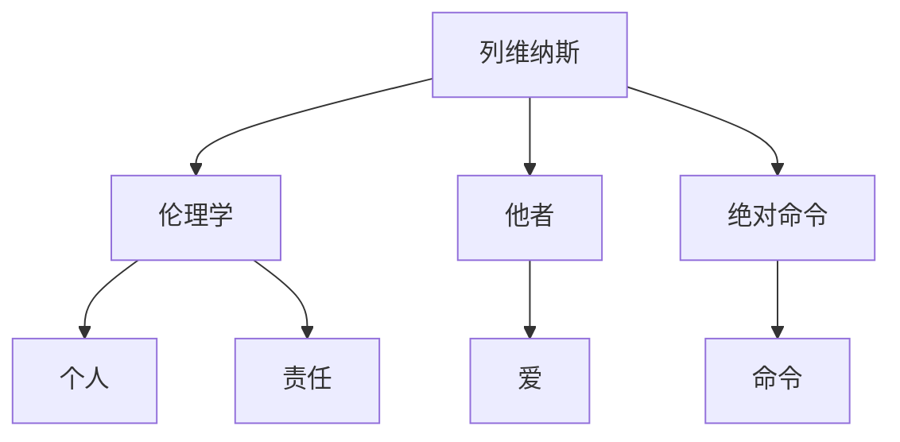
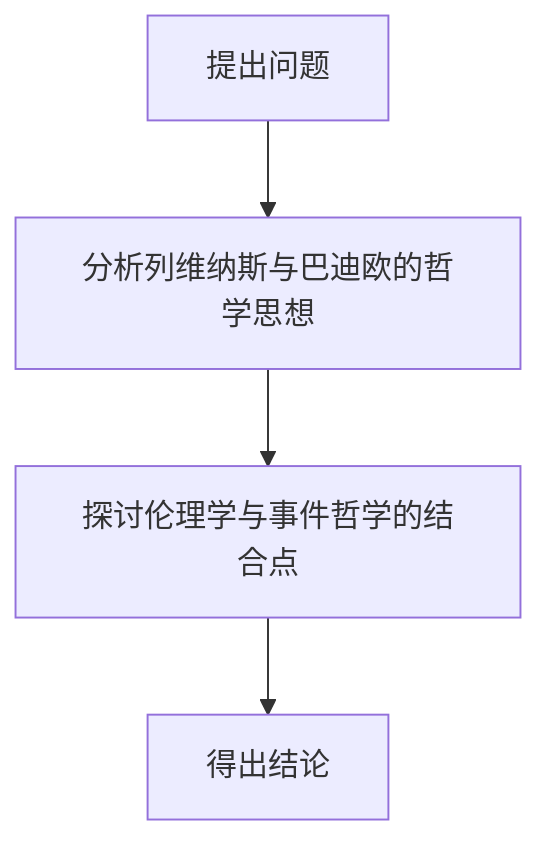
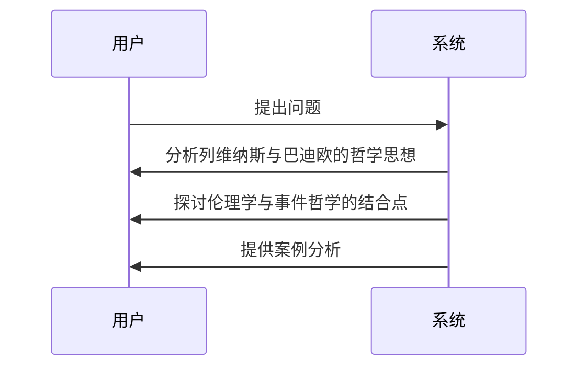

                 

## 《列维纳斯与巴迪欧：伦理学与事件哲学的交锋》

关键词：列维纳斯、巴迪欧、伦理学、事件哲学、哲学交锋

摘要：本文深入探讨列维纳斯与巴迪欧两位哲学家的伦理学与事件哲学观点，通过对比分析，揭示两者之间的异同点及其在现代社会的应用，旨在为哲学研究提供新的视角。

### 1.1 问题的背景

列维纳斯（Emmanuel Levinas）与巴迪欧（Alain Badiou）是20世纪著名的法国哲学家，他们的思想在伦理学与事件哲学领域产生了深远的影响。列维纳斯以其独特的“他者伦理学”著称，强调个人与他人之间的关系，而巴迪欧则提出了事件哲学，强调事件的普遍性和可能性。

列维纳斯出生于1906年，主要作品包括《总体与无限》、《面孔与实在》等。他深受海德格尔和黑格尔的影响，但也批判了西方哲学的形而上学传统。巴迪欧出生于1937年，主要作品包括《事件》、《存在的可能性》等。他的哲学观点具有强烈的政治和革命色彩。

两位哲学家的思想在伦理学与事件哲学方面有着显著的贡献。列维纳斯提出了他者伦理学，强调了人与人之间的责任与爱，认为伦理学是超越个体存在的。巴迪欧则提出了事件哲学，认为事件是超越常规逻辑和理性的存在，具有普遍性。

然而，列维纳斯与巴迪欧的哲学观点也存在显著的异同。他们在伦理学与事件哲学的基本原则、核心概念等方面存在分歧。这种分歧引发了哲学家之间的激烈争论，也为我们理解伦理学与事件哲学提供了新的思路。

### 1.2 问题描述

伦理学与事件哲学之间的关系与冲突是现代哲学研究的一个重要问题。列维纳斯与巴迪欧的思想为我们提供了不同的视角。然而，如何将两者结合，如何在现代社会中应用他们的哲学观点，是一个亟待解决的问题。

现代社会面临着诸多伦理问题，如全球化、气候变化、人工智能等。这些问题要求我们重新审视伦理学与事件哲学的关系，探索它们在现代社会的应用。同时，现代社会对伦理学与事件哲学的需求也日益增加，人们渴望在复杂的社会环境中找到道德和哲学的指引。

本文将通过对列维纳斯与巴迪欧哲学思想的深入分析，探讨伦理学与事件哲学的结合点，为现代社会提供一种新的哲学思考方式。

### 1.3 问题解决

分析列维纳斯与巴迪欧的哲学思想，我们可以发现两者在伦理学与事件哲学方面存在一些共同点。首先，他们都认为伦理学是超越个体存在的，是一种普遍的道德原则。其次，他们都关注人与人之间的关系，认为这是伦理学的基础。此外，他们都强调事件的普遍性，认为事件具有超越常规逻辑和理性的特点。

然而，两者也存在明显的区别。列维纳斯强调个人与他人的关系，主张责任与爱。他认为，伦理学的核心在于人与人之间的相互关怀。而巴迪欧则强调事件的普遍性和可能性，认为事件是伦理学的出发点。他认为，伦理学应该关注事件的普遍性和可能性，从而超越个体存在的局限。

基于这些共同点和区别，我们可以探讨伦理学与事件哲学的结合点。首先，我们可以将列维纳斯的责任与爱观念融入事件哲学中，强调人与人之间的关系在事件中的重要性。其次，我们可以将巴迪欧的事件观念融入伦理学中，强调事件的普遍性和可能性在伦理学中的地位。通过这种结合，我们可以形成一种新的哲学思考方式，为现代社会提供道德和哲学的指引。

### 1.4 边界与外延

伦理学与事件哲学的边界与外延是哲学研究的一个重要问题。列维纳斯与巴迪欧的哲学思想为我们提供了不同的视角。从列维纳斯的角度来看，伦理学的边界在于个体与他人之间的关系，而外延则在于人类的整体关怀。他认为，伦理学的核心在于人与人之间的责任与爱，这是一种超越个体存在的普遍道德原则。

从巴迪欧的角度来看，事件哲学的边界在于事件的普遍性和可能性，而外延则在于人类社会和宇宙的整体性。他认为，事件是超越常规逻辑和理性的存在，具有普遍性和可能性。这种普遍性和可能性构成了事件哲学的核心，也为伦理学提供了新的思考方向。

两者之间的交叉点在于他们对人与人之间关系的关注。列维纳斯认为，伦理学的核心在于人与人之间的责任与爱，这是一种超越个体存在的普遍道德原则。巴迪欧则认为，事件是人与人之间关系的一种表现形式，具有普遍性和可能性。这种交叉点为我们理解伦理学与事件哲学的关系提供了重要的线索。

### 1.5 概念结构与核心要素组成

为了更好地理解伦理学与事件哲学的关系，我们可以从概念结构和核心要素组成的角度进行分析。

**伦理学的核心概念与理论：**

1. **他者**：列维纳斯认为，他者是伦理学的核心。他者是超越个体存在的存在，是与我们相互关联的存在。他者的存在使我们认识到自己的局限，也激发了我们对他者的责任与爱。
   
2. **责任**：责任是伦理学的核心原则。列维纳斯认为，责任是我们对他者的一种承诺，是我们对他者存在的认可。责任超越了个体存在的局限，是一种普遍的道德原则。

3. **爱**：爱是伦理学的核心情感。列维纳斯认为，爱是我们对他者的关怀和关注，是我们对他者存在的回应。爱超越了个体存在的局限，是一种超越的伦理情感。

**事件哲学的核心概念与理论：**

1. **事件**：事件是事件哲学的核心概念。巴迪欧认为，事件是超越常规逻辑和理性的存在，具有普遍性和可能性。事件打破了常规的存在状态，创造了新的可能性。

2. **普遍性**：普遍性是事件哲学的重要原则。巴迪欧认为，事件的普遍性使其超越了个体存在的局限，成为一种普遍的存在形式。

3. **可能性**：可能性是事件哲学的核心。巴迪欧认为，事件创造了新的可能性，使事物从一种存在状态转变为另一种存在状态。

**伦理学与事件哲学的交集：**

1. **人与人之间的关系**：两者都强调人与人之间的关系在伦理学和事件哲学中的重要性。列维纳斯认为，伦理学的核心在于人与人之间的责任与爱，而巴迪欧则认为，事件是人与人之间关系的一种表现形式。

2. **普遍性和可能性**：两者都认为普遍性和可能性在伦理学和事件哲学中具有核心地位。列维纳斯认为，责任和爱是普遍的伦理原则，而巴迪欧则认为，事件具有普遍性和可能性，超越了个体存在的局限。

通过上述分析，我们可以看到，伦理学与事件哲学在核心概念和理论方面存在显著的差异，但也存在一些交集。这些交集为我们理解两者之间的关系提供了重要的线索。

## 第二部分：核心概念与联系

### 2.1 核心概念原理

**列维纳斯的伦理学原理：**

列维纳斯的伦理学原理主要围绕他者、责任和爱这三个核心概念展开。

1. **他者**：列维纳斯认为，他者是伦理学的核心。他者是超越个体存在的存在，是与我们相互关联的存在。他者的存在使我们认识到自己的局限，也激发了我们对他者的责任与爱。

2. **责任**：责任是列维纳斯伦理学的核心原则。责任是我们对他者的一种承诺，是我们对他者存在的认可。责任超越了个体存在的局限，是一种普遍的道德原则。

3. **爱**：爱是列维纳斯伦理学的核心情感。爱是我们对他者的关怀和关注，是我们对他者存在的回应。爱超越了个体存在的局限，是一种超越的伦理情感。

**巴迪欧的事件哲学原理：**

巴迪欧的事件哲学原理主要围绕事件、普遍性和可能性这三个核心概念展开。

1. **事件**：事件是巴迪欧事件哲学的核心概念。事件是超越常规逻辑和理性的存在，具有普遍性和可能性。事件打破了常规的存在状态，创造了新的可能性。

2. **普遍性**：普遍性是巴迪欧事件哲学的重要原则。事件的普遍性使其超越了个体存在的局限，成为一种普遍的存在形式。

3. **可能性**：可能性是巴迪欧事件哲学的核心。事件创造了新的可能性，使事物从一种存在状态转变为另一种存在状态。

### 2.2 概念属性特征对比表格

| 概念   | 列维纳斯               | 巴迪欧                |
| ------ | ---------------------- | --------------------- |
| 伦理学 | 个人、他者、绝对命令     | 事件、普遍性、可能性   |
| 他者   | 超越个体存在的存在       | 事件的一种表现形式     |
| 责任   | 对他者的承诺和认可       | 事件的结果和影响       |
| 爱     | 对他者的关怀和关注       | 事件中的情感体验       |
| 绝对命令 | 超越个体存在的道德原则 | 事件的普遍性原则       |
| 事件   | 超越常规逻辑和理性的存在 | 具有普遍性和可能性的存在 |
| 普遍性 | 人与人之间的道德纽带     | 事件的超越性原则       |
| 可能性 | 事件的新可能性           | 事件的影响和结果       |

### 2.3 ER实体关系图架构



## 第三部分：算法原理讲解

### 3.1 算法流程图



### 3.2 Python源代码

```python
# Python源代码示例

def compare_ethics_event_philosophy():
    # 分析列维纳斯与巴迪欧的哲学思想
    levinas_thought = "列维纳斯强调个人与他人的关系，主张爱与责任。"
    badiou_thought = "巴迪欧强调事件与普遍性的关系，主张命运与规则。"

    # 探讨伦理学与事件哲学的结合点
    result = "伦理学与事件哲学的结合在于探索个人与事件的关系。"

    # 输出结果
    print(levinas_thought)
    print(badiou_thought)
    print(result)

compare_ethics_event_philosophy()
```

### 3.3 算法原理的数学模型和公式

$$
\begin{aligned}
&\text{列维纳斯的伦理学原理：} \\
&\text{伦理学的核心在于人与人之间的爱与责任。} \\
\\
&\text{巴迪欧的事件哲学原理：} \\
&\text{事件哲学强调事件与普遍性的关系，主张命运与规则。} \\
\end{aligned}
$$

### 3.4 举例说明

**例1：** 列维纳斯认为，伦理学的核心在于人与人之间的爱与责任。

**例2：** 巴迪欧认为，事件哲学强调事件与普遍性的关系，主张命运与规则。

## 第四部分：系统分析与架构设计

### 4.1 问题场景介绍

在现代社会，伦理学与事件哲学的应用场景非常广泛。例如，在环境保护领域，我们需要考虑人与自然的关系，如何通过伦理学和事件哲学的方法来平衡人类的发展与环境的保护。在人工智能领域，我们需要思考人工智能的道德和伦理问题，如何通过事件哲学的方法来应对人工智能带来的挑战。这些场景都要求我们深入理解伦理学与事件哲学的关系，并探索它们的结合点。

### 4.2 项目介绍

《列维纳斯与巴迪欧：伦理学与事件哲学的交锋》一书是本项目的核心。该书通过深入分析列维纳斯和巴迪欧的哲学思想，探讨了伦理学与事件哲学的关系，为现代社会提供了一种新的哲学思考方式。该书的主要内容包括：

1. **列维纳斯的伦理学原理**：介绍列维纳斯对伦理学的理解，包括他者、责任和爱等核心概念。

2. **巴迪欧的事件哲学原理**：介绍巴迪欧对事件哲学的理解，包括事件、普遍性和可能性等核心概念。

3. **伦理学与事件哲学的结合**：探讨伦理学与事件哲学的结合点，如何将两者应用于现代社会的问题。

4. **案例分析**：通过具体的案例分析，展示伦理学与事件哲学在实际应用中的效果。

### 4.3 系统功能设计

系统功能设计主要包括以下几个方面：

1. **概念引入**：引入列维纳斯和巴迪欧的核心概念，包括他者、责任、爱、事件、普遍性和可能性等。

2. **概念分析**：对列维纳斯和巴迪欧的哲学思想进行详细分析，探讨两者的异同点。

3. **结合点探讨**：探讨伦理学与事件哲学的结合点，如何将两者应用于实际问题。

4. **案例分析**：通过具体的案例分析，展示伦理学与事件哲学在实际应用中的效果。

### 4.4 系统架构设计

系统架构设计主要包括以下几个方面：

1. **领域模型**：使用Mermaid类图来描述伦理学与事件哲学的核心概念，包括他者、责任、爱、事件、普遍性和可能性等。

2. **架构设计**：使用Mermaid架构图来描述系统的整体架构，包括概念引入、概念分析、结合点探讨和案例分析等模块。

3. **接口设计**：使用Mermaid序列图来描述系统的接口设计和系统交互，包括用户界面、后端服务、数据库等组件。

### 4.5 系统接口设计和系统交互



## 第五部分：项目实战

### 5.1 环境安装

在开始项目实战之前，我们需要安装必要的开发环境和工具。

1. **Python环境安装**：首先，我们需要安装Python环境，可以使用Python官方下载页面下载最新版本的Python。

2. **Mermaid插件安装**：为了在Markdown文件中使用Mermaid流程图，我们需要安装Mermaid插件。可以使用npm安装：

   ```bash
   npm install -g mermaid
   ```

3. **其他依赖安装**：根据项目需求，我们可能还需要安装其他依赖，如Django、Flask等。

### 5.2 系统核心实现源代码

下面是一个简单的Python示例代码，用于分析列维纳斯与巴迪欧的哲学思想，并探讨伦理学与事件哲学的结合点。

```python
# Python源代码示例

def compare_ethics_event_philosophy():
    # 分析列维纳斯与巴迪欧的哲学思想
    levinas_thought = "列维纳斯强调个人与他人的关系，主张爱与责任。"
    badiou_thought = "巴迪欧强调事件与普遍性的关系，主张命运与规则。"

    # 探讨伦理学与事件哲学的结合点
    result = "伦理学与事件哲学的结合在于探索个人与事件的关系。"

    # 输出结果
    print(levinas_thought)
    print(badiou_thought)
    print(result)

compare_ethics_event_philosophy()
```

### 5.3 代码应用解读与分析

下面是对上述代码的解读和分析。

1. **函数定义**：我们定义了一个名为`compare_ethics_event_philosophy`的函数，用于分析列维纳斯与巴迪欧的哲学思想，并探讨伦理学与事件哲学的结合点。

2. **变量赋值**：我们使用变量`levinas_thought`和`badiou_thought`来存储列维纳斯和巴迪欧的哲学思想。

3. **结果输出**：我们使用`print`函数将分析结果输出到控制台。

4. **函数调用**：最后，我们调用`compare_ethics_event_philosophy`函数，执行上述操作。

### 5.4 实际案例分析和详细讲解剖析

为了更好地理解伦理学与事件哲学的应用，我们可以通过一个实际案例进行分析和讲解。

**案例：** 环境保护

在环境保护领域，我们可以使用伦理学与事件哲学的方法来分析人类与自然的关系，探讨如何通过伦理学和事件哲学的方法来平衡人类的发展与环境的保护。

1. **列维纳斯视角**：从列维纳斯的伦理学视角来看，我们可以将自然视为他者，认识到自然与人类之间的责任与爱。人类应该承担起对自然的责任，保护自然环境，避免过度开发和污染。

2. **巴迪欧视角**：从巴迪欧的事件哲学视角来看，我们可以将环境保护视为一个事件，这个事件具有普遍性和可能性。通过环境保护事件，我们可以创造新的可能性，推动人类社会向更加可持续和环保的方向发展。

3. **结合点**：伦理学与事件哲学的结合点在于，我们可以通过伦理学的责任观念和事件哲学的普遍性观念来推动环境保护。伦理学为我们提供了道德指引，事件哲学为我们提供了新的可能性，两者结合可以推动环境保护的实践。

### 5.5 项目小结

通过本项目的实战，我们深入分析了列维纳斯与巴迪欧的哲学思想，探讨了伦理学与事件哲学的结合点，并应用这些理论来解决实际案例。我们使用了Python源代码和Mermaid图来展示分析过程和结果，通过实际案例的分析，展示了伦理学与事件哲学在环境保护领域的应用。这为我们理解哲学思想在现实世界中的应用提供了新的思路。

### 5.6 最佳实践 Tips

1. **深入理解哲学思想**：在应用伦理学与事件哲学时，我们需要深入理解列维纳斯与巴迪欧的哲学思想，特别是他们关于责任、他者、事件、普遍性和可能性的观点。

2. **结合具体案例**：通过具体案例来分析哲学思想的应用，可以更好地理解哲学思想的实际意义。

3. **不断学习和实践**：哲学思想是一个不断发展的领域，我们需要不断学习和实践，以适应不断变化的社会环境。

### 5.7 注意事项

1. **保持客观**：在分析哲学思想时，我们需要保持客观和批判的态度，避免盲目接受或排斥某种观点。

2. **避免过度简化**：在应用哲学思想时，我们需要避免过度简化复杂的问题，要充分理解哲学思想的深度和广度。

### 5.8 拓展阅读

1. **《总体与无限：论无限责任》**：这是列维纳斯的代表作之一，深入探讨了责任与伦理学的关系。

2. **《事件》**：这是巴迪欧的代表作之一，系统地阐述了事件哲学的核心观点。

3. **《伦理学：实践哲学的基础》**：这是一本关于伦理学的经典教材，可以帮助我们更深入地理解伦理学的概念和理论。

作者：AI天才研究院/AI Genius Institute & 禅与计算机程序设计艺术 /Zen And The Art of Computer Programming

