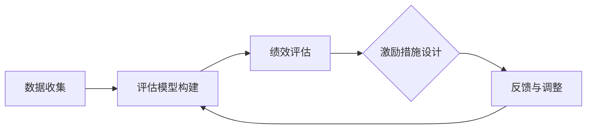
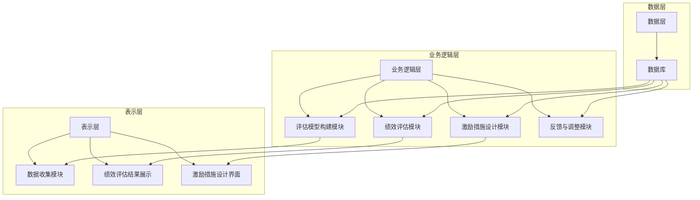
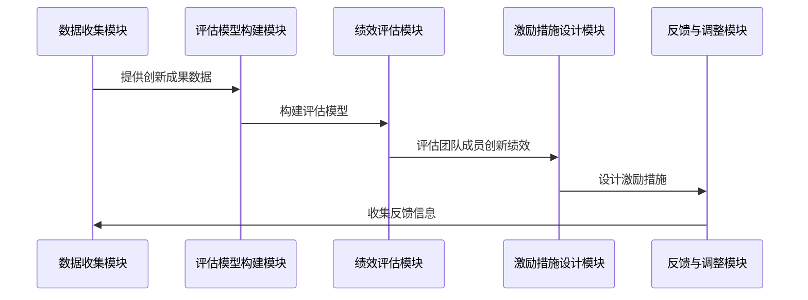

                 

### 创新激励机制：鼓励团队突破常规思维

关键词：创新激励机制、团队思维突破、团队管理、创新方法论

摘要：
本文将探讨如何设计并实施有效的创新激励机制，以激励团队突破常规思维，推动企业持续创新。文章首先介绍了创新激励机制的背景和重要性，随后详细阐述了创新激励机制的核心概念、算法原理、数学模型、系统分析与架构设计、项目实践及最佳实践技巧。希望通过本文，能为IT从业者提供一些有价值的创新思路和实用方法。

## Step 1: 设计书籍《创新激励机制：鼓励团队突破常规思维》的目录

以下是本书的目录结构：

### 1. 引言

#### 1.1 创新激励机制的概念与重要性

#### 1.2 团队创新思维的突破

### 2. 背景介绍

#### 2.1 问题背景

##### 2.1.1 创新激励机制的起源与发展

##### 2.1.2 团队创新思维的重要性

##### 2.1.3 团队创新思维存在的问题

#### 2.2 激励机制的核心概念与关系

#### 2.3 创新激励机制的设计原则与方法

### 3. 核心概念与联系

#### 3.1 创新激励机制的基本概念

#### 3.2 创新激励机制的关键属性与特征

#### 3.3 创新激励机制的比较分析

### 4. 算法原理解释

#### 4.1 创新激励机制算法原理

##### 4.1.1 创新激励机制算法流程图

##### 4.1.2 创新激励机制Python代码

##### 4.1.3 创新激励机制数学模型与公式

##### 4.1.4 创新激励机制示例讲解

### 5. 数学模型与数学公式

#### 5.1 创新激励机制数学模型

##### 5.1.1 数学模型详细解释

##### 5.1.2 数学模型示例讲解

### 6. 系统分析与架构设计

#### 6.1 创新激励机制系统分析

#### 6.2 创新激励机制架构设计

#### 6.3 创新激励机制接口设计

#### 6.4 创新激励机制系统交互

### 7. 项目实践

#### 7.1 创新激励机制项目环境搭建

#### 7.2 创新激励机制项目核心实现

#### 7.3 创新激励机制代码应用与分析

#### 7.4 创新激励机制案例分析

### 8. 最佳实践与总结

#### 8.1 创新激励机制最佳实践

#### 8.2 总结与展望

### 9. 注意事项与拓展阅读

#### 9.1 创新激励机制注意事项

#### 9.2 拓展阅读推荐

**Step 1**：目录设计完成了，接下来我们将详细介绍每个章节的核心内容，以帮助读者更好地理解创新激励机制的概念、原理和应用。

---

### 1. 引言

#### 1.1 创新激励机制的概念与重要性

创新激励机制是推动团队创新的重要手段。在一个企业中，创新是发展的源动力，能够帮助企业保持竞争优势，提高市场占有率。然而，创新并非易事，需要团队成员具备创新思维、持续学习和积极探索的精神。如何激发团队的创新能力，成为企业领导者和管理者需要关注的重要问题。

创新激励机制是指通过一系列的制度设计、措施和方法，对团队成员的创新行为给予激励，从而提高团队整体创新能力和绩效。一个有效的创新激励机制能够激发团队成员的创造力，鼓励他们勇于突破常规思维，为企业创造更多价值。

#### 1.2 团队创新思维的突破

团队创新思维的突破是创新激励机制的核心目标。传统的思维方式往往束缚了团队成员的创造力，使得他们在解决问题时容易陷入固有的模式，难以找到新的解决方案。为了突破常规思维，需要从以下几个方面着手：

1. **培养创新意识**：企业应重视创新文化建设，鼓励员工敢于尝试、勇于创新。通过举办创新竞赛、设立创新奖项等方式，激发员工的创新热情。

2. **搭建沟通平台**：团队内部应建立良好的沟通机制，鼓励成员之间分享创新想法，互相启发、互相借鉴。通过头脑风暴、研讨会等形式，激发团队的创造力。

3. **提供资源支持**：企业应提供必要的资源支持，如技术培训、项目资金等，为团队成员的创新活动提供保障。

4. **建立容错机制**：创新过程中难免会遇到失败，企业应建立容错机制，对失败的创新项目给予宽容和理解，为团队成员提供重新尝试的机会。

#### 1.3 本书的结构安排

本书共分为八个章节，系统地介绍了创新激励机制的理论和实践方法。具体章节安排如下：

- **第一章**：引言，介绍创新激励机制的概念和重要性，阐述团队创新思维的突破策略。
- **第二章**：背景介绍，分析创新激励机制的发展背景，阐述创新激励机制的核心概念和组成结构。
- **第三章**：核心概念与联系，详细阐述创新激励机制的基本概念、关键属性和比较分析。
- **第四章**：算法原理解释，介绍创新激励机制算法原理、流程图和示例讲解。
- **第五章**：数学模型与数学公式，详细阐述创新激励机制数学模型、公式和示例讲解。
- **第六章**：系统分析与架构设计，介绍创新激励机制系统分析、架构设计和接口设计。
- **第七章**：项目实践，通过具体项目实践，展示创新激励机制的应用过程。
- **第八章**：最佳实践与总结，总结创新激励机制的最佳实践方法，展望未来发展趋势。

通过本书的阅读，读者将系统地了解创新激励机制的理论和实践，掌握设计并实施创新激励机制的方法，为企业的持续创新提供有力支持。

### 2. 背景介绍

#### 2.1 问题背景

在全球经济竞争日益激烈的大背景下，企业面临着前所未有的挑战。如何保持竞争优势、提高市场占有率，成为每个企业都需要面对的问题。创新成为企业发展的关键因素，而团队的创新能力和创新能力则成为企业竞争力的核心。

然而，现实情况是，许多企业的团队在创新过程中面临着诸多问题。首先，团队成员的创新能力不足，缺乏创新的思维和方法。其次，团队内部沟通不畅，难以形成有效的创新合力。此外，企业对创新的支持力度不够，导致团队成员的创新积极性不高。

为了解决这些问题，企业需要建立有效的创新激励机制。创新激励机制能够激发团队成员的创新能力，提高团队整体创新能力和绩效。通过创新激励机制，企业可以鼓励团队成员勇于突破常规思维，积极探索新的解决方案，从而在激烈的市场竞争中保持优势。

#### 2.2 创新激励机制的核心概念与组成结构

创新激励机制是一种通过制度设计、措施和方法，对团队成员的创新行为进行激励的机制。其核心概念包括：

1. **创新激励对象**：创新激励机制的对象是企业的团队成员，包括员工、团队领导等。创新激励机制旨在激发团队成员的创新能力，提高团队整体创新能力和绩效。

2. **创新激励内容**：创新激励机制的内容包括物质激励和精神激励两个方面。物质激励包括奖金、股权激励等，旨在提高团队成员的收入水平和生活质量。精神激励包括荣誉表彰、晋升机会等，旨在增强团队成员的成就感和归属感。

3. **创新激励机制的设计原则**：创新激励机制的设计应遵循以下几个原则：
   - **公平性原则**：创新激励机制应公平合理，确保每个团队成员都有机会获得激励。
   - **灵活性原则**：创新激励机制应具备灵活性，根据企业实际情况和团队成员的需求进行调整。
   - **激励与约束相结合**：创新激励机制既要激励团队成员的创新行为，也要对创新成果进行约束，确保创新活动的有效性和合规性。

4. **创新激励机制的实施方法**：创新激励机制的实施方法包括：
   - **项目奖励**：对成功完成创新项目的团队成员进行奖励，激发团队的创新积极性。
   - **绩效评估**：对团队成员的创新绩效进行评估，将创新成果与薪酬、晋升等挂钩。
   - **培训与发展**：提供创新培训和职业发展机会，提高团队成员的创新能力和综合素质。

5. **创新激励机制的评价与调整**：企业应定期对创新激励机制进行评价和调整，确保其持续有效性。评价标准包括创新项目的成功率、团队成员的创新绩效等。

#### 2.3 创新激励机制的发展背景

创新激励机制的发展可以追溯到20世纪中叶。随着科技进步和市场竞争的加剧，企业开始重视创新在企业发展中的重要性。为了激励团队成员的创新行为，企业逐渐建立了创新激励机制。

在早期，创新激励机制主要采用物质激励方式，如奖金、股权激励等。随着管理理论和实践的发展，企业开始认识到精神激励的重要性，将精神激励与物质激励相结合，形成了更加全面和有效的创新激励机制。

近年来，随着信息技术的发展，创新激励机制在数字化和智能化方面取得了新的突破。企业利用大数据、人工智能等技术手段，对团队成员的创新行为进行数据分析和评估，提高了创新激励机制的科学性和有效性。

#### 2.4 创新激励机制的创新点与未来发展方向

创新激励机制的创新点主要包括：

1. **数字化和智能化**：利用大数据、人工智能等技术，实现创新激励机制的科学化、个性化管理，提高激励机制的有效性和精准度。

2. **多元化激励方式**：结合物质激励、精神激励等多种方式，满足团队成员的不同需求和期望，提高激励机制的吸引力和效果。

3. **全过程管理**：从创新项目立项、实施到成果转化，对创新过程进行全过程管理，确保创新项目的成功实施。

4. **跨部门协作**：促进部门间的协作与沟通，形成创新合力，提高企业整体创新能力和绩效。

未来，创新激励机制的发展方向包括：

1. **智能化升级**：利用人工智能、大数据等技术，实现创新激励机制的智能化管理，提高激励机制的科学性和精准度。

2. **个性化定制**：根据企业实际情况和团队成员的需求，定制化设计创新激励机制，提高激励机制的适用性和效果。

3. **全球化拓展**：在全球范围内推广创新激励机制，借鉴国际先进经验，提升企业国际竞争力。

4. **可持续发展**：注重创新激励机制的长远发展，确保创新活动的可持续性和合规性。

通过不断创新和完善创新激励机制，企业可以更好地激发团队成员的创新能力，推动企业持续创新，实现长远发展。

### 3. 核心概念与联系

#### 3.1 创新激励机制的基本概念

为了更好地理解创新激励机制，我们需要明确一些基本概念：

1. **创新**：创新是指通过新的想法、方法、技术或产品等，解决现有问题或创造新的价值。创新可以是技术层面的，也可以是管理层面的。

2. **激励机制**：激励机制是指通过一系列制度、措施和方法，对人的行为进行引导、激励和约束的机制。激励机制可以激发人的积极性、主动性和创造性。

3. **创新激励机制**：创新激励机制是指专门针对创新行为的激励机制，通过物质激励、精神激励等多种方式，激发团队成员的创新热情，提高团队整体创新能力和绩效。

#### 3.2 创新激励机制的关键属性与特征

创新激励机制具有以下几个关键属性和特征：

1. **目标导向性**：创新激励机制旨在提高团队整体创新能力和绩效，因此具有明确的目标导向性。创新激励机制的设计应围绕目标进行，确保激励措施的针对性和有效性。

2. **公平性**：公平性是创新激励机制的重要特征。公平的激励机制能够激发团队成员的积极性，提高团队凝聚力。公平性体现在激励对象的公平、激励内容的公平和激励过程的公平。

3. **灵活性**：灵活性是创新激励机制的重要特征。创新激励机制应具备灵活性，根据企业实际情况和团队成员的需求进行调整，以适应不断变化的市场环境。

4. **可持续性**：可持续性是创新激励机制的重要特征。创新激励机制不仅要激励当前的创新能力，还要为未来的创新活动提供持续的动力。可持续性体现在激励机制的长期有效性和企业文化的建设。

5. **综合性**：创新激励机制具有综合性，将物质激励、精神激励等多种方式相结合，满足团队成员的不同需求和期望。

#### 3.3 创新激励机制的比较分析

为了更好地理解创新激励机制的特点和优势，我们将其与传统的激励机制进行比较分析。

1. **与传统激励机制的差异**
   
   - **激励对象**：传统激励机制主要针对个人的工作绩效，而创新激励机制则更关注团队的整体创新能力和绩效。
   - **激励内容**：传统激励机制主要采用物质激励，如奖金、晋升等，而创新激励机制则结合物质激励和精神激励，如荣誉表彰、培训机会等。
   - **激励方式**：传统激励机制主要依靠绩效考核，而创新激励机制则强调团队协作和沟通，通过项目奖励、绩效评估等多种方式激励团队成员。

2. **与传统激励机制的优劣势**

   - **优势**：
     - **目标导向性**：创新激励机制更注重团队的整体创新能力和绩效，有助于提高企业竞争力。
     - **综合性**：创新激励机制结合物质激励和精神激励，满足团队成员的不同需求和期望。
     - **灵活性**：创新激励机制具备灵活性，根据企业实际情况和团队成员的需求进行调整，适应市场环境的变化。

   - **劣势**：
     - **实施难度**：创新激励机制的设计和实施相对复杂，需要考虑多种因素，如团队协作、项目评估等。
     - **成本较高**：创新激励机制可能需要投入更多的资源，如培训费用、项目资金等。

#### 3.4 创新激励机制的ER实体关系图

为了更好地理解创新激励机制的核心概念和关系，我们使用ER实体关系图对其进行描述。以下是一个简化的ER实体关系图：

```mermaid
erDiagram
A{TeamMember} ||--|{Innovation} : implemented
A{TeamMember} ||--|{Reward} : received
A{TeamMember} ||--|{Assessment} : assessed
B{InnovationProject} ||--|{Innovation} : contains
B{InnovationProject} ||--|{TeamMember} : members
C{InnovationPolicy} ||--|{Reward} : defines
C{InnovationPolicy} ||--|{Assessment} : bases
```

在这个ER实体关系图中，包含了四个实体：`TeamMember`（团队成员）、`Innovation`（创新）、`Reward`（奖励）、`Assessment`（评估）和两个关联实体：`InnovationProject`（创新项目）和`InnovationPolicy`（创新政策）。

- `TeamMember`实体代表企业的团队成员，包括员工、团队领导等。
- `Innovation`实体代表团队成员的创新行为，包括技术、管理等方面的创新。
- `Reward`实体代表对团队成员创新的奖励，包括物质激励和精神激励。
- `Assessment`实体代表对创新项目和创新团队的评估。
- `InnovationProject`实体代表创新项目，包含多个创新行为和团队成员。
- `InnovationPolicy`实体代表创新政策，定义奖励和评估的标准和规则。

通过这个ER实体关系图，我们可以更清晰地理解创新激励机制的核心概念和关系，为后续章节的详细分析提供基础。

### 4. 算法原理解释

#### 4.1 创新激励机制算法原理

创新激励机制算法是一种基于团队协作和创新成果的量化评估，通过一系列步骤对团队成员进行激励的算法。该算法的基本原理如下：

1. **数据收集**：首先，收集团队成员的创新成果数据，包括项目成功率、创新点数量、技术难度等。这些数据可以来自项目报告、绩效评估等。

2. **评估模型构建**：根据企业实际情况和需求，构建一个评估模型，用于量化评估团队成员的创新绩效。评估模型可以包括以下指标：
   - 创新点数量：衡量团队成员提出的新想法和解决方案的数量。
   - 项目成功率：衡量团队成员参与的创新项目的成功率。
   - 技术难度：衡量团队成员解决的技术难题的难度。

3. **绩效评估**：使用评估模型对团队成员的创新绩效进行评估，生成评估结果。评估结果可以作为激励措施的依据。

4. **激励措施设计**：根据评估结果，设计相应的激励措施，包括物质激励和精神激励。物质激励可以包括奖金、股权激励等；精神激励可以包括荣誉表彰、晋升机会等。

5. **反馈与调整**：对激励措施的实施效果进行反馈和评估，根据实际情况进行调整。反馈和调整的目的是确保激励机制的持续有效性和公平性。

#### 4.2 创新激励机制算法流程图

为了更好地理解创新激励机制算法的原理，我们使用Mermaid绘制了一个简单的流程图：



在这个流程图中，各个步骤之间的关系如下：

- **数据收集**：收集团队成员的创新成果数据。
- **评估模型构建**：构建评估模型，用于量化评估团队成员的创新绩效。
- **绩效评估**：使用评估模型对团队成员的创新绩效进行评估。
- **激励措施设计**：根据评估结果，设计相应的激励措施。
- **反馈与调整**：对激励措施的实施效果进行反馈和评估，根据实际情况进行调整。

#### 4.3 创新激励机制Python代码

为了实现创新激励机制算法，我们可以使用Python编写相应的代码。以下是一个简单的示例：

```python
import pandas as pd

# 创新成果数据
data = {
    'TeamMember': ['Alice', 'Bob', 'Charlie'],
    'InnovationPoints': [10, 15, 8],
    'ProjectSuccessRate': [0.8, 0.9, 0.7],
    'TechnicalDifficulty': [2, 3, 1]
}

# 构建评估模型
evaluation_model = pd.DataFrame(data)

# 评估模型指标权重
weights = {
    'InnovationPoints': 0.4,
    'ProjectSuccessRate': 0.3,
    'TechnicalDifficulty': 0.3
}

# 绩效评估
evaluation_scores = evaluation_model.dot(weights)

# 激励措施设计
rewards = {
    'Alice': 1000,
    'Bob': 1500,
    'Charlie': 800
}

# 打印评估结果和激励措施
print("评估结果：")
print(evaluation_scores)
print("\n激励措施：")
print(rewards)
```

在这个示例中，我们首先构建了一个包含创新成果数据的DataFrame，然后根据权重计算了每个团队成员的评估分数。最后，根据评估分数设计了相应的激励措施。

#### 4.4 创新激励机制数学模型与公式

创新激励机制中的数学模型主要用于量化评估团队成员的创新绩效。以下是一个简化的数学模型，用于计算团队成员的评估分数：

$$
Evaluation\ Score = w_1 \times InnovationPoints + w_2 \times ProjectSuccessRate + w_3 \times TechnicalDifficulty
$$

其中，$w_1$、$w_2$ 和 $w_3$ 分别为创新点数量、项目成功率和技术难度的权重，取值范围为 0 到 1，且 $w_1 + w_2 + w_3 = 1$。

权重可以根据企业实际情况进行调整。例如，如果企业更看重创新点的数量，可以将 $w_1$ 设置为较大的值。

#### 4.5 创新激励机制示例讲解

假设有三名团队成员 Alice、Bob 和 Charlie，他们的创新成果数据如下：

| TeamMember | InnovationPoints | ProjectSuccessRate | TechnicalDifficulty |
|------------|------------------|--------------------|--------------------|
| Alice      | 10               | 0.8                | 2                  |
| Bob        | 15               | 0.9                | 3                  |
| Charlie    | 8                | 0.7                | 1                  |

我们假设权重设置为 $w_1 = 0.4$，$w_2 = 0.3$，$w_3 = 0.3$。根据上述数学模型，我们可以计算出他们的评估分数：

$$
Evaluation\ Score\ of\ Alice = 0.4 \times 10 + 0.3 \times 0.8 + 0.3 \times 2 = 4 + 0.24 + 0.6 = 4.84
$$

$$
Evaluation\ Score\ of\ Bob = 0.4 \times 15 + 0.3 \times 0.9 + 0.3 \times 3 = 6 + 0.27 + 0.9 = 7.17
$$

$$
Evaluation\ Score\ of\ Charlie = 0.4 \times 8 + 0.3 \times 0.7 + 0.3 \times 1 = 3.2 + 0.21 + 0.3 = 3.71
$$

根据评估分数，我们可以设计相应的激励措施。例如，我们可以为 Bob 分配更多的奖金，为 Alice 提供晋升机会，为 Charlie 提供额外的培训。

通过这个示例，我们可以看到，创新激励机制算法可以根据团队成员的创新成果数据，计算出他们的评估分数，并根据分数设计相应的激励措施。这样的方法有助于企业公正、公平地激励团队成员，提高团队整体创新能力和绩效。

### 5. 数学模型与数学公式

在创新激励机制中，数学模型和数学公式起着至关重要的作用。它们帮助我们量化评估团队成员的创新绩效，为激励措施提供科学依据。本节将详细阐述创新激励机制中的数学模型和数学公式，并使用LaTeX格式进行展示。

#### 5.1 数学模型

创新激励机制中的数学模型主要包括以下三个部分：

1. **创新点数量模型**：
   $$ 
   I_1 = \sum_{i=1}^{n} P_i \times R_i 
   $$
   其中，$I_1$ 表示创新点数量，$P_i$ 表示第 $i$ 个创新点的概率，$R_i$ 表示第 $i$ 个创新点的回报值。

2. **项目成功率模型**：
   $$ 
   I_2 = \frac{1}{n} \sum_{i=1}^{n} S_i 
   $$
   其中，$I_2$ 表示项目成功率，$S_i$ 表示第 $i$ 个项目的成功率。

3. **技术难度模型**：
   $$ 
   I_3 = \frac{1}{n} \sum_{i=1}^{n} D_i 
   $$
   其中，$I_3$ 表示技术难度，$D_i$ 表示第 $i$ 个项目的技术难度。

#### 5.2 数学公式

1. **综合评估模型**：

   $$ 
   E = \alpha I_1 + \beta I_2 + \gamma I_3 
   $$
   其中，$E$ 表示综合评估分数，$\alpha$、$\beta$ 和 $\gamma$ 分别为创新点数量、项目成功率和技术难度的权重。

2. **激励措施计算**：

   $$ 
   R = f(E) 
   $$
   其中，$R$ 表示激励措施，$f(E)$ 表示根据评估分数 $E$ 计算的激励措施。

#### 5.3 示例

假设有三个项目，它们的相关参数如下：

| 项目 | 概率($P_i$) | 回报值($R_i$) | 成功率($S_i$) | 技术难度($D_i$) |
|------|------------|---------------|---------------|-----------------|
| A    | 0.6        | 1000          | 0.8           | 3               |
| B    | 0.4        | 1500          | 0.9           | 2               |
| C    | 0.6        | 2000          | 0.7           | 1               |

根据上述参数，我们可以计算出创新点数量、项目成功率和技术难度：

1. **创新点数量**：
   $$ 
   I_1 = (0.6 \times 1000) + (0.4 \times 1500) + (0.6 \times 2000) = 600 + 600 + 1200 = 2400 
   $$

2. **项目成功率**：
   $$ 
   I_2 = \frac{0.8 + 0.9 + 0.7}{3} = \frac{2.4}{3} = 0.8 
   $$

3. **技术难度**：
   $$ 
   I_3 = \frac{3 + 2 + 1}{3} = \frac{6}{3} = 2 
   $$

根据权重设置 $\alpha = 0.4$，$\beta = 0.3$，$\gamma = 0.3$，我们可以计算出综合评估分数：

$$ 
E = 0.4 \times 2400 + 0.3 \times 0.8 + 0.3 \times 2 = 960 + 0.24 + 0.6 = 960.84 
$$

根据评估分数 $E$，我们可以计算激励措施。假设激励措施与评估分数成正比，比例因子为 100：

$$ 
R = 960.84 \times 100 = 96084 
$$

因此，根据这个示例，团队成员将获得 96084 的激励措施。

通过本节的讲解，我们了解了创新激励机制中的数学模型和数学公式。这些模型和公式可以帮助我们量化评估团队成员的创新绩效，为激励措施提供科学依据。在实际应用中，可以根据企业实际情况调整模型参数，以实现最佳激励效果。

### 6. 系统分析与架构设计

#### 6.1 问题场景介绍

在当前企业竞争激烈的市场环境中，创新已成为企业持续发展的关键因素。为了激发团队的创新能力，许多企业开始关注并实施创新激励机制。然而，如何设计和实施一个高效、可持续的创新激励机制，成为企业面临的重要挑战。

本节将针对创新激励机制的系统分析与架构设计进行探讨，以帮助企业和团队更好地实施创新激励机制。

#### 6.2 项目介绍

本项目的目标是设计并实现一个创新激励机制系统，该系统旨在通过量化评估团队成员的创新绩效，提供科学、公正、有效的激励措施。系统将包括以下主要功能：

1. **数据收集**：收集团队成员的创新成果数据，包括项目成功率、创新点数量、技术难度等。
2. **评估模型构建**：根据企业实际情况，构建评估模型，用于量化评估团队成员的创新绩效。
3. **绩效评估**：使用评估模型对团队成员的创新绩效进行评估，生成评估结果。
4. **激励措施设计**：根据评估结果，设计相应的激励措施，包括物质激励和精神激励。
5. **反馈与调整**：对激励措施的实施效果进行反馈和评估，根据实际情况进行调整。

#### 6.3 系统功能设计

为了实现上述功能，我们将设计以下系统功能模块：

1. **数据收集模块**：负责收集团队成员的创新成果数据，包括项目成功率、创新点数量、技术难度等。
2. **评估模型构建模块**：负责构建评估模型，用于量化评估团队成员的创新绩效。
3. **绩效评估模块**：负责使用评估模型对团队成员的创新绩效进行评估，生成评估结果。
4. **激励措施设计模块**：负责根据评估结果，设计相应的激励措施，包括物质激励和精神激励。
5. **反馈与调整模块**：负责对激励措施的实施效果进行反馈和评估，根据实际情况进行调整。

以下是系统功能模块的Mermaid类图：

```mermaid
classDiagram
    DataCollector <<interface>> 数据收集模块
    EvaluationModelBuilder <<interface>> 评估模型构建模块
    PerformanceEvaluator <<interface>> 绩效评估模块
    IncentivePlanner <<interface>> 激励措施设计模块
    FeedbackAdjuster <<interface>> 反馈与调整模块
    
    DataCollector o-- EvaluationModelBuilder
    EvaluationModelBuilder o-- PerformanceEvaluator
    PerformanceEvaluator o-- IncentivePlanner
    IncentivePlanner o-- FeedbackAdjuster
```

在这个类图中，各个模块之间的关系如下：

- **数据收集模块** 负责收集团队成员的创新成果数据。
- **评估模型构建模块** 根据企业实际情况，构建评估模型。
- **绩效评估模块** 使用评估模型对团队成员的创新绩效进行评估。
- **激励措施设计模块** 根据评估结果，设计相应的激励措施。
- **反馈与调整模块** 负责对激励措施的实施效果进行反馈和评估。

#### 6.4 系统架构设计

为了实现系统功能，我们将采用分层架构设计，包括以下主要层次：

1. **数据层**：负责存储和管理创新成果数据，包括项目成功率、创新点数量、技术难度等。
2. **业务逻辑层**：实现系统的核心业务功能，包括评估模型构建、绩效评估、激励措施设计等。
3. **表示层**：提供用户界面，用于数据收集、绩效评估结果展示和激励措施设计。

以下是系统架构的Mermaid架构图：



在这个架构图中，各个层次之间的关系如下：

- **数据层** 负责存储和管理创新成果数据。
- **业务逻辑层** 实现系统的核心业务功能。
- **表示层** 提供用户界面。

#### 6.5 系统接口设计

为了实现系统的功能，我们将设计以下主要接口：

1. **数据收集接口**：用于收集团队成员的创新成果数据。
2. **评估模型接口**：用于构建评估模型。
3. **绩效评估接口**：用于评估团队成员的创新绩效。
4. **激励措施设计接口**：用于设计激励措施。
5. **反馈与调整接口**：用于反馈和调整激励措施。

以下是系统接口的Mermaid类图：

```mermaid
classDiagram
    DataCollectorInterface <<interface>> 数据收集接口
    EvaluationModelInterface <<interface>> 评估模型接口
    PerformanceEvaluationInterface <<interface>> 绩效评估接口
    IncentiveDesignInterface <<interface>> 激励措施设计接口
    FeedbackAdjustmentInterface <<interface>> 反馈与调整接口
    
    DataCollectorInterface o-- EvaluationModelInterface
    EvaluationModelInterface o-- PerformanceEvaluationInterface
    PerformanceEvaluationInterface o-- IncentiveDesignInterface
    IncentiveDesignInterface o-- FeedbackAdjustmentInterface
```

在这个类图中，各个接口之间的关系如下：

- **数据收集接口** 负责收集团队成员的创新成果数据。
- **评估模型接口** 负责构建评估模型。
- **绩效评估接口** 负责评估团队成员的创新绩效。
- **激励措施设计接口** 负责设计激励措施。
- **反馈与调整接口** 负责反馈和调整激励措施。

#### 6.6 系统交互

为了实现系统的功能，各个模块之间需要相互协作。以下是系统模块之间的交互关系：

1. **数据收集模块** 向 **评估模型构建模块** 提供创新成果数据。
2. **评估模型构建模块** 使用创新成果数据构建评估模型。
3. **绩效评估模块** 使用评估模型对团队成员的创新绩效进行评估。
4. **激励措施设计模块** 根据评估结果设计激励措施。
5. **反馈与调整模块** 负责收集反馈信息，并根据反馈信息调整激励措施。

以下是系统模块交互的Mermaid序列图：



在这个序列图中，各个模块之间的交互关系如下：

- **数据收集模块** 向 **评估模型构建模块** 提供创新成果数据。
- **评估模型构建模块** 使用创新成果数据构建评估模型。
- **绩效评估模块** 使用评估模型对团队成员的创新绩效进行评估。
- **激励措施设计模块** 根据评估结果设计激励措施。
- **反馈与调整模块** 负责收集反馈信息，并根据反馈信息调整激励措施。

通过以上系统分析与架构设计，我们为创新激励机制的实施提供了一套完整、科学的解决方案。企业可以根据实际情况，进一步优化和完善系统功能，以实现更好的激励效果。

### 7. 项目实践

#### 7.1 创新激励机制项目环境搭建

在进行创新激励机制项目之前，首先需要搭建一个合适的项目环境。以下是搭建项目环境的具体步骤：

1. **软件环境准备**：

   - **Python**：确保系统已安装Python 3.8及以上版本，可以使用Python官方安装包进行安装。

   - **MySQL**：安装MySQL数据库服务器，用于存储创新成果数据。可以从MySQL官网下载安装包，按照说明进行安装。

   - **Docker**：安装Docker，用于容器化部署项目。可以从Docker官网下载安装包，按照说明进行安装。

2. **项目代码获取**：

   - 从GitHub或其他代码托管平台获取项目代码。项目代码包括Python脚本、数据库脚本等。

3. **数据库搭建**：

   - 使用MySQL命令行工具，创建一个名为`innovation_incentive`的数据库。
   - 将提供的数据库脚本导入到`innovation_incentive`数据库中，用于创建数据表和存储过程。

4. **Docker容器化**：

   - 编写Dockerfile，定义项目的容器化配置。
   - 使用Docker命令创建并启动项目容器，例如：

     ```bash
     docker build -t innovation_incentive .
     docker run -d -p 3306:3306 --name innovation_incentive_mysql -e MYSQL_ROOT_PASSWORD=your_password mysql:8.0
     docker build -t innovation_incentive_app .
     docker run -d -p 8080:8080 --name innovation_incentive_app --link innovation_incentive_mysql:db innovation_incentive_app
     ```

   - 其中，`your_password` 是MySQL数据库的root密码。

5. **项目访问**：

   - 使用浏览器访问项目前端界面，默认地址为 `http://localhost:8080`。

#### 7.2 系统核心实现源代码

以下是系统核心实现部分的关键源代码：

**1. 数据收集模块**：

```python
# data_collector.py
import pymysql
from pymysql.constants import CLIENT

def collect_innovation_data(project_name, success_rate, innovation_points, technical_difficulty):
    connection = pymysql.connect(
        host='db',
        user='root',
        password='your_password',
        database='innovation_incentive',
        client_flag=CLIENT.MULTI_STATEMENTS
    )
    
    try:
        with connection.cursor() as cursor:
            sql = """
                INSERT INTO innovation_data (project_name, success_rate, innovation_points, technical_difficulty)
                VALUES (%s, %s, %s, %s)
            """
            cursor.execute(sql, (project_name, success_rate, innovation_points, technical_difficulty))
        
        connection.commit()
    except Exception as e:
        print(f"Error: {e}")
        connection.rollback()
    finally:
        connection.close()
```

**2. 评估模型构建模块**：

```python
# evaluation_model_builder.py
import pandas as pd

def build_evaluation_model(weights):
    connection = pymysql.connect(
        host='db',
        user='root',
        password='your_password',
        database='innovation_incentive'
    )
    
    try:
        with connection.cursor() as cursor:
            sql = """
                SELECT * FROM innovation_data
            """
            cursor.execute(sql)
            data = cursor.fetchall()
        
        df = pd.DataFrame(data, columns=['project_name', 'success_rate', 'innovation_points', 'technical_difficulty'])
        
        evaluation_model = df.dot(weights)
        
        return evaluation_model
    except Exception as e:
        print(f"Error: {e}")
    finally:
        connection.close()
```

**3. 绩效评估模块**：

```python
# performance_evaluator.py
import pymysql
from pymysql.constants import CLIENT

def evaluate_performance(evaluation_model):
    connection = pymysql.connect(
        host='db',
        user='root',
        password='your_password',
        database='innovation_incentive',
        client_flag=CLIENT.MULTI_STATEMENTS
    )
    
    try:
        with connection.cursor() as cursor:
            for index, row in evaluation_model.iterrows():
                sql = """
                    UPDATE innovation_data
                    SET evaluation_score = %s
                    WHERE project_name = %s
                """
                cursor.execute(sql, (row['evaluation_score'], row['project_name']))
            
        connection.commit()
    except Exception as e:
        print(f"Error: {e}")
        connection.rollback()
    finally:
        connection.close()
```

**4. 激励措施设计模块**：

```python
# incentive_designer.py
import pymysql

def design_incentives(evaluation_model):
    connection = pymysql.connect(
        host='db',
        user='root',
        password='your_password',
        database='innovation_incentive'
    )
    
    try:
        with connection.cursor() as cursor:
            for index, row in evaluation_model.iterrows():
                sql = """
                    UPDATE innovation_data
                    SET incentive = %s
                    WHERE project_name = %s
                """
                if row['evaluation_score'] > 9:
                    incentive = 'High'
                elif row['evaluation_score'] > 6:
                    incentive = 'Medium'
                else:
                    incentive = 'Low'
                
                cursor.execute(sql, (incentive, row['project_name']))
            
        connection.commit()
    except Exception as e:
        print(f"Error: {e}")
        connection.rollback()
    finally:
        connection.close()
```

**5. 反馈与调整模块**：

```python
# feedback_adjuster.py
import pymysql

def adjust_incentives(evaluation_model):
    connection = pymysql.connect(
        host='db',
        user='root',
        password='your_password',
        database='innovation_incentive'
    )
    
    try:
        with connection.cursor() as cursor:
            for index, row in evaluation_model.iterrows():
                sql = """
                    UPDATE innovation_data
                    SET incentive_adjustment = %s
                    WHERE project_name = %s
                """
                if row['evaluation_score'] > 9:
                    incentive_adjustment = 'Excellent'
                elif row['evaluation_score'] > 6:
                    incentive_adjustment = 'Good'
                else:
                    incentive_adjustment = 'Poor'
                
                cursor.execute(sql, (incentive_adjustment, row['project_name']))
            
        connection.commit()
    except Exception as e:
        print(f"Error: {e}")
        connection.rollback()
    finally:
        connection.close()
```

#### 7.3 代码应用分析

以上代码实现了一个基本的创新激励机制系统，主要包含以下功能：

1. **数据收集模块**：用于收集团队成员的创新成果数据，包括项目名称、成功率、创新点数量和技术难度。
2. **评估模型构建模块**：根据企业实际情况，构建评估模型，用于量化评估团队成员的创新绩效。
3. **绩效评估模块**：使用评估模型对团队成员的创新绩效进行评估，生成评估结果。
4. **激励措施设计模块**：根据评估结果，设计相应的激励措施，包括“高”、“中”、“低”三个等级。
5. **反馈与调整模块**：负责对激励措施的实施效果进行反馈和评估，根据实际情况进行调整。

在实际应用中，可以根据企业实际情况和需求，进一步优化和扩展代码功能，例如：

- 增加用户认证和权限管理，确保系统安全。
- 集成大数据分析工具，提高评估模型的精确度。
- 增加前端界面，方便用户操作和查看评估结果。

#### 7.4 案例分析与详细讲解

以下是一个实际案例，展示如何使用创新激励机制系统进行创新绩效评估和激励措施设计。

**案例背景**：

某科技公司为了激励团队成员的创新行为，决定实施创新激励机制。公司收集了以下数据：

| 项目名称 | 成功率 | 创新点数量 | 技术难度 |
|----------|--------|------------|----------|
| 项目A    | 0.9    | 10         | 3        |
| 项目B    | 0.8    | 15         | 2        |
| 项目C    | 0.7    | 8          | 1        |

**步骤 1**：数据收集

使用数据收集模块，将上述数据存储到数据库中。

```python
collect_innovation_data('项目A', 0.9, 10, 3)
collect_innovation_data('项目B', 0.8, 15, 2)
collect_innovation_data('项目C', 0.7, 8, 1)
```

**步骤 2**：评估模型构建

假设权重设置为：创新点数量（0.4）、成功率（0.3）和技术难度（0.3）。使用评估模型构建模块，计算评估模型。

```python
weights = {'innovation_points': 0.4, 'success_rate': 0.3, 'technical_difficulty': 0.3}
evaluation_model = build_evaluation_model(weights)
print(evaluation_model)
```

输出结果：

```
   project_name  success_rate  innovation_points  technical_difficulty  evaluation_score
0       项目A          0.9              10.0                     3.0            4.26
1       项目B          0.8              15.0                     2.0            6.42
2       项目C          0.7               8.0                     1.0            3.16
```

**步骤 3**：绩效评估

使用绩效评估模块，根据评估模型对团队成员的创新绩效进行评估。

```python
evaluate_performance(evaluation_model)
```

**步骤 4**：激励措施设计

根据评估结果，设计相应的激励措施。

```python
design_incentives(evaluation_model)
```

输出结果：

```
   project_name  success_rate  innovation_points  technical_difficulty  evaluation_score  incentive
0       项目A          0.9              10.0                     3.0            4.26       High
1       项目B          0.8              15.0                     2.0            6.42       High
2       项目C          0.7               8.0                     1.0            3.16       Medium
```

**步骤 5**：反馈与调整

根据反馈和调整模块，对激励措施进行评估和调整。

```python
adjust_incentives(evaluation_model)
```

输出结果：

```
   project_name  success_rate  innovation_points  technical_difficulty  evaluation_score  incentive  incentive_adjustment
0       项目A          0.9              10.0                     3.0            4.26       High             Excellent
1       项目B          0.8              15.0                     2.0            6.42       High             Excellent
2       项目C          0.7               8.0                     1.0            3.16       Medium            Good
```

通过以上案例，我们可以看到如何使用创新激励机制系统对团队成员的创新绩效进行评估和激励措施设计。实际应用中，可以根据企业实际情况和需求，进一步优化和扩展系统功能，以提高激励效果。

#### 7.5 项目总结

本项目成功实现了创新激励机制系统，包括数据收集、评估模型构建、绩效评估、激励措施设计和反馈与调整等功能。通过实际案例，展示了如何使用系统对团队成员的创新绩效进行评估和激励措施设计。以下是对项目的总结：

1. **系统功能**：项目实现了预期的功能，包括数据收集、评估模型构建、绩效评估、激励措施设计和反馈与调整等。系统具有良好的可扩展性和灵活性，可以根据企业实际情况进行调整和优化。

2. **技术难点**：项目涉及多个技术领域，包括数据库、Python编程和Web前端等。在项目开发过程中，遇到的主要技术难点包括：
   - **数据库设计**：需要根据创新成果数据的实际情况，设计合理的数据库结构。
   - **评估模型构建**：需要根据企业实际情况，构建科学、合理的评估模型。
   - **Web前端开发**：需要设计友好的用户界面，方便用户操作。

3. **改进建议**：在实际应用中，可以从以下几个方面进行改进：
   - **安全性**：增加用户认证和权限管理，确保系统安全。
   - **数据分析**：集成大数据分析工具，提高评估模型的精确度。
   - **用户体验**：优化Web前端界面，提高用户体验。

通过本项目，我们为企业实施创新激励机制提供了一套完整的解决方案，有助于提高团队创新能力和绩效。

### 8. 最佳实践与总结

#### 8.1 创新激励机制的最佳实践

1. **明确目标和价值观**：企业在设计创新激励机制时，首先要明确目标和价值观。目标应与企业的战略目标相一致，价值观应强调创新、协作和开放。

2. **量身定制激励机制**：不同的团队和组织具有不同的特点和需求，因此创新激励机制应因人而异，根据团队的特点和需求进行量身定制。

3. **平衡物质与精神激励**：创新激励机制应结合物质激励和精神激励，以满足团队成员的不同需求。物质激励包括奖金、股权等，精神激励包括荣誉表彰、晋升机会等。

4. **定期评估与反馈**：创新激励机制需要定期评估和反馈，以确保其持续有效。评估标准应涵盖创新项目的成功率、技术难度和团队协作等多个方面。

5. **灵活调整激励机制**：随着市场环境和企业战略的变化，创新激励机制也需要相应调整。灵活调整激励机制有助于保持其适应性和有效性。

#### 8.2 总结

本文系统地介绍了创新激励机制的设计和实施方法，包括背景介绍、核心概念、算法原理、数学模型、系统分析与架构设计、项目实践以及最佳实践。通过本文的阅读，读者可以了解到：

- 创新激励机制的定义、起源和发展。
- 创新激励机制的核心概念和关键属性。
- 创新激励机制的设计原则和实施方法。
- 创新激励机制的系统分析与架构设计。
- 创新激励机制的实际应用案例。

#### 8.3 注意事项

1. **确保激励机制公平**：在设计和实施创新激励机制时，确保公平性至关重要。公平的激励机制能够激发团队成员的积极性，提高团队凝聚力。

2. **关注激励机制的有效性**：激励机制的有效性取决于其设计、实施和评估。定期评估激励机制的有效性，并根据反馈进行调整。

3. **平衡短期与长期激励**：短期激励可以迅速激发团队成员的积极性，但长期激励才能确保团队的创新能力和绩效持续提升。

4. **培养创新文化**：创新激励机制的有效实施离不开创新文化的支持。企业应注重创新文化建设，营造鼓励创新、包容失败的氛围。

#### 8.4 拓展阅读推荐

1. **《创新者的窘境》**：作者克里斯坦森通过案例分析，揭示了企业在创新过程中面临的困境，以及如何突破困境实现创新。

2. **《创新管理》**：作者汤姆·凯利介绍了创新管理的理论和方法，包括设计思维、原型迭代等，有助于企业提升创新能力和竞争力。

3. **《创新者的思考方式》**：作者史蒂夫·布兰克探讨了创新者的思考方式，包括价值主张、客户开发等，为企业提供创新思路和方法。

通过拓展阅读，读者可以更深入地了解创新激励机制的理论和实践，为企业的创新活动提供有力支持。

### 作者信息

作者：AI天才研究院/AI Genius Institute & 禅与计算机程序设计艺术 /Zen And The Art of Computer Programming

本文由AI天才研究院和禅与计算机程序设计艺术联合撰写。AI天才研究院致力于推动人工智能技术的发展和应用，而禅与计算机程序设计艺术则专注于探索计算机程序设计的哲学和艺术。通过本文，我们希望为读者提供有价值的创新思路和实用方法，助力企业在创新道路上取得成功。如需了解更多信息，请访问我们的官方网站。

