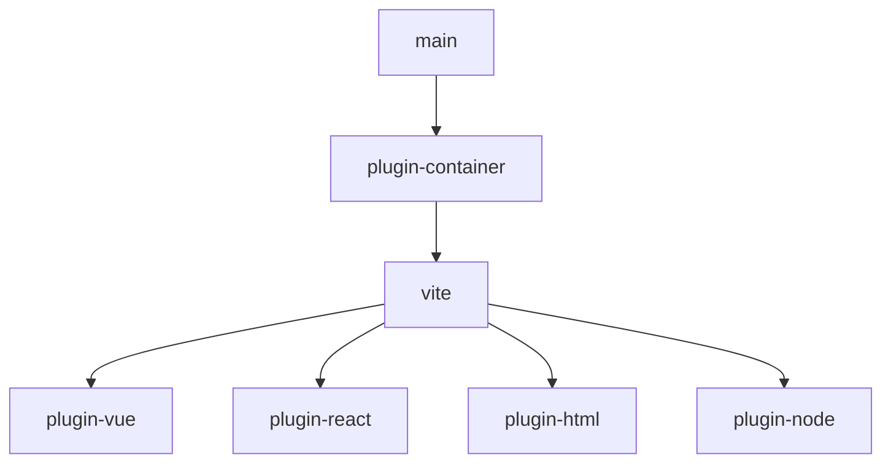

                 

# 前端构建工具：Webpack、Rollup与Vite

## 关键词

- 前端构建工具
- Webpack
- Rollup
- Vite
- 性能优化

## 摘要

随着前端技术的快速发展，构建工具在现代化前端开发中扮演着至关重要的角色。本文将深入探讨Webpack、Rollup和Vite这三款主流的前端构建工具，从基础概念、核心功能到性能优化，全面剖析它们的原理和应用。通过实际案例和系统分析，帮助开发者选择合适的构建工具，提升项目开发和维护效率。

## 目录大纲

### 第一部分：前端构建工具概述

#### 第1章：前端构建工具的概念与重要性

##### 1.1 什么是前端构建工具
##### 1.2 前端构建工具的作用
##### 1.3 前端构建工具的发展历程

#### 第2章：Webpack基础

##### 2.1 Webpack的核心概念
##### 2.2 Webpack的基本配置
##### 2.3 Webpack的loader和plugin机制
##### 2.4 Webpack的性能优化策略

#### 第3章：Webpack进阶

##### 3.1 Webpack的树摇（Tree Shaking）
##### 3.2 Webpack的代码分割（Code Splitting）
##### 3.3 Webpack的缓存机制
##### 3.4 Webpack的多入口配置

#### 第4章：Rollup入门

##### 4.1 Rollup的基本概念
##### 4.2 Rollup的插件系统
##### 4.3 Rollup的构建配置
##### 4.4 Rollup的性能优化

#### 第5章：Rollup进阶

##### 5.1 Rollup的树摇优化
##### 5.2 Rollup的代码分割策略
##### 5.3 Rollup的多入口构建
##### 5.4 Rollup的打包与性能分析

#### 第6章：Vite简介

##### 6.1 Vite的背景与特点
##### 6.2 Vite的基本使用
##### 6.3 Vite的插件与配置
##### 6.4 Vite的性能优势

#### 第7章：Vite进阶

##### 7.1 Vite的构建优化
##### 7.2 Vite的源代码分析
##### 7.3 Vite与Webpack的对比
##### 7.4 Vite在大型项目中的应用

#### 第8章：前端构建工具实战

##### 8.1 项目搭建与配置
##### 8.2 构建流程优化
##### 8.3 性能分析与调优
##### 8.4 实际案例解析

#### 第9章：前端构建工具的未来发展趋势

##### 9.1 新的技术趋势
##### 9.2 构建工具的集成与兼容性
##### 9.3 构建工具的创新方向
##### 9.4 构建工具在企业中的应用

#### 第10章：总结与展望

##### 10.1 前端构建工具的发展现状
##### 10.2 面向未来的构建工具选择
##### 10.3 前端开发者应对策略
##### 10.4 拓展阅读与资源推荐

---

### 第一部分：前端构建工具概述

#### 第1章：前端构建工具的概念与重要性

##### 1.1 什么是前端构建工具

前端构建工具是指一系列用于自动化构建前端项目的工具集合。它们可以帮助开发者处理文件打包、模块化、代码压缩、浏览器兼容性处理等任务，从而提高开发效率和项目质量。常见的构建工具有Webpack、Rollup、Vite等。

##### 1.2 前端构建工具的作用

1. **模块化**：将项目代码分解成模块，便于管理和重用。
2. **打包**：将各种源文件打包成浏览器可以识别的格式。
3. **压缩**：减小文件体积，加快页面加载速度。
4. **代码分割**：将代码分割成不同的包，按需加载，优化性能。
5. **浏览器兼容性**：通过Polyfill等方式解决不同浏览器的兼容性问题。

##### 1.3 前端构建工具的发展历程

- **早期**：使用传统的打包工具，如Gulp、Grunt等，通过编写任务脚本来自动化构建过程。
- **中期**：Webpack的出现，提出了模块化和打包的概念，成为前端构建工具的代表。
- **近期**：Rollup和Vite等新兴构建工具的出现，提供了更高效、更灵活的构建方案。

#### 第2章：Webpack基础

##### 2.1 Webpack的核心概念

- **入口（Entry）**：指定项目入口文件，Webpack以此开始构建项目。
- **出口（Output）**：指定输出文件的配置，包括输出文件名、路径等。
- **加载器（Loader）**：用于转换各类资源文件的模块，如CSS、图片等。
- **插件（Plugin）**：用于扩展Webpack功能的第三方插件，如热更新、压缩等。

##### 2.2 Webpack的基本配置

```javascript
const path = require('path');

module.exports = {
  entry: './src/index.js',
  output: {
    filename: 'bundle.js',
    path: path.resolve(__dirname, 'dist'),
  },
  module: {
    rules: [
      {
        test: /\.css$/,
        use: ['style-loader', 'css-loader'],
      },
      {
        test: /\.(png|jpe?g|gif)$/,
        use: [
          {
            loader: 'file-loader',
          },
        ],
      },
    ],
  },
  plugins: [
    new HtmlWebpackPlugin({
      template: './src/index.html',
    }),
  ],
};
```

##### 2.3 Webpack的loader和plugin机制

- **loader**：用于处理特定类型的文件，如CSS、图片等。通过配置`module.rules`来指定使用哪些loader。
- **plugin**：用于在Webpack构建过程中进行额外的操作，如生成HTML文件、压缩代码等。通过配置`plugins`数组来添加plugin。

##### 2.4 Webpack的性能优化策略

- **代码分割（Code Splitting）**：将代码分割成不同的块，按需加载，减少首屏加载时间。
- **懒加载（Lazy Loading）**：对于不常用的模块，使用懒加载的方式，延迟加载，减少初始加载时间。
- **缓存（Caching）**：合理配置缓存，加快构建速度和部署速度。
- **Tree Shaking**：通过静态分析，删除未使用的代码，减少打包体积。

---

### 第二部分：Webpack进阶

#### 第3章：Webpack进阶

##### 3.1 Webpack的树摇（Tree Shaking）

树摇（Tree Shaking）是一种基于ES6模块语法的优化技术，可以删除未使用的代码，减少打包体积。Webpack通过静态分析，实现树摇优化。

```javascript
// webpack.config.js
module.exports = {
  optimization: {
    usedExports: true,
  },
};
```

##### 3.2 Webpack的代码分割（Code Splitting）

代码分割是将代码分割成不同的块，按需加载。Webpack提供了`SplitChunksPlugin`插件来实现代码分割。

```javascript
// webpack.config.js
module.exports = {
  optimization: {
    splitChunks: {
      chunks: 'all',
    },
  },
};
```

##### 3.3 Webpack的缓存机制

Webpack提供了强大的缓存机制，可以缓存模块的编译结果，加快构建速度。通过配置`cache`选项，可以启用缓存。

```javascript
// webpack.config.js
module.exports = {
  cache: {
    type: 'memory-cache',
  },
};
```

##### 3.4 Webpack的多入口配置

Webpack支持多入口配置，可以同时处理多个入口文件。

```javascript
// webpack.config.js
module.exports = {
  entry: {
    pageOne: './src/pageOne.js',
    pageTwo: './src/pageTwo.js',
  },
  output: {
    filename: '[name].bundle.js',
  },
};
```

---

### 第三部分：Rollup入门

#### 第4章：Rollup入门

##### 4.1 Rollup的基本概念

Rollup是一款基于ES6模块语法的打包工具，主要用于打包模块化代码。它具有简洁、高效的特点，适用于库、框架等静态模块化资源。

##### 4.2 Rollup的插件系统

Rollup通过插件系统来扩展功能。常见的插件有`@rollup/plugin-commonjs`、`@rollup/plugin-node-resolve`、`@rollup/plugin-babel`等。

```javascript
// rollup.config.js
import commonjs from '@rollup/plugin-commonjs';
import nodeResolve from '@rollup/plugin-node-resolve';
import babel from '@rollup/plugin-babel';

export default {
  input: 'src/index.js',
  output: {
    file: 'dist/bundle.js',
    format: 'cjs',
  },
  plugins: [
    nodeResolve(),
    commonjs(),
    babel({
      exclude: 'node_modules/**',
    }),
  ],
};
```

##### 4.3 Rollup的构建配置

Rollup的配置文件通常名为`rollup.config.js`，配置内容主要包括输入文件、输出文件、插件等。

```javascript
// rollup.config.js
import { nodeResolve } from '@rollup/plugin-node-resolve';
import commonjs from '@rollup/plugin-commonjs';

export default {
  input: 'src/index.js',
  output: {
    file: 'dist/bundle.js',
    format: 'cjs',
  },
  plugins: [
    nodeResolve(),
    commonjs(),
  ],
};
```

##### 4.4 Rollup的性能优化

Rollup的性能优化主要关注构建速度和输出文件大小。通过配置插件和优化代码，可以提高构建效率和输出质量。

- **使用插件**：如`@rollup/plugin-terser`用于压缩代码，`@rollup/plugin-bundle-renderer`用于减少输出文件大小。
- **代码优化**：如使用`const`和`let`代替`var`，使用ES6模块化语法等。

---

### 第四部分：Rollup进阶

#### 第5章：Rollup进阶

##### 5.1 Rollup的树摇优化

Rollup支持树摇（Tree Shaking）优化，通过静态分析，删除未使用的代码。

```javascript
// rollup.config.js
export default {
  input: 'src/index.js',
  output: {
    file: 'dist/bundle.js',
    format: 'cjs',
  },
  plugins: {
    // 开启树摇优化
    'rollup-plugin-node-resolve': {},
    'rollup-plugin-commonjs': {},
    'rollup-plugin-babel': {},
    'rollup-plugin-terser': {},
  },
};
```

##### 5.2 Rollup的代码分割策略

Rollup的代码分割是通过插件来实现的。例如，使用`@rollup/plugin-split-code`插件进行代码分割。

```javascript
// rollup.config.js
import split from 'rollup-plugin-split-code';

export default {
  input: 'src/index.js',
  output: [
    { file: 'dist/bundle.js', format: 'cjs' },
    { file: 'dist/main.js', format: 'es' },
  ],
  plugins: [
    split(),
  ],
};
```

##### 5.3 Rollup的多入口构建

Rollup支持多入口构建，可以同时打包多个入口文件。

```javascript
// rollup.config.js
export default {
  input: {
    'bundle-a': 'src/a.js',
    'bundle-b': 'src/b.js',
  },
  output: {
    dir: 'dist',
    format: 'es',
  },
};
```

##### 5.4 Rollup的打包与性能分析

Rollup的打包性能可以通过优化配置和选择合适的插件来提高。使用工具如`rollup-plugin-analyzer`进行打包性能分析，找出优化的方向。

```javascript
// rollup.config.js
import analyzer from 'rollup-plugin-analyzer';

export default {
  input: 'src/index.js',
  output: {
    file: 'dist/bundle.js',
    format: 'cjs',
  },
  plugins: [
    analyzer(),
  ],
};
```

---

### 第五部分：Vite简介

#### 第6章：Vite简介

##### 6.1 Vite的背景与特点

Vite（意为“快速”）是一款新兴的前端构建工具，由Vue团队开发，旨在提供更快的开发体验。其特点包括：

- **基于ESM**：使用原生ESM模块，提供即时热更新。
- **快速启动**：利用浏览器原生模块加载，无需等待打包。
- **轻量级**：依赖少，配置简单。
- **工具链集成**：支持TypeScript、CSS预处理器等。

##### 6.2 Vite的基本使用

```javascript
// vite.config.js
import { defineConfig } from 'vite';

export default defineConfig({
  build: {
    target: 'es2015',
    outDir: 'dist',
  },
});
```

##### 6.3 Vite的插件与配置

Vite通过插件系统扩展功能，常用的插件有`@vitejs/plugin-vue`、`@vitejs/plugin-commonjs`等。配置文件通常名为`vite.config.js`。

```javascript
// vite.config.js
import { defineConfig } from 'vite';
import vue from '@vitejs/plugin-vue';

export default defineConfig({
  plugins: [vue()],
});
```

##### 6.4 Vite的性能优势

- **即时热更新**：开发时无需等待打包，提高开发效率。
- **原生模块加载**：利用浏览器原生模块加载，提高加载速度。
- **零配置体验**：默认配置适合大多数项目，减少配置时间。

---

### 第六部分：Vite进阶

#### 第7章：Vite进阶

##### 7.1 Vite的构建优化

Vite提供了多种优化策略，如使用`@vitejs/plugin-optimize`插件进行代码压缩、提取公共依赖等。

```javascript
// vite.config.js
import { defineConfig } from 'vite';
import optimize from '@vitejs/plugin-optimize';

export default defineConfig({
  plugins: [optimize()],
});
```

##### 7.2 Vite的源代码分析

Vite的源代码分析可以帮助开发者了解其内部实现和优化点。通过分析，可以发现Vite如何利用原生模块加载和缓存机制提高性能。

```javascript
// vite源代码分析
// 示例：vite/lib/cli/commands/serve.js
async function serve({ mode, command, config, server }) {
  if (!config.build.sourcemap) {
    console.warn('WARNING: Running in development mode without sourcemaps.');
  }

  // ...其他代码

  const app = await server.httpServer.listen(server.config.port);

  console.log(`> Running at ${await server.config.baseURL}`);
}
```

##### 7.3 Vite与Webpack的对比

Vite与Webpack在构建性能、配置复杂度、开发体验等方面存在差异。Vite更适合小型项目和前端框架，而Webpack则更适合复杂项目和多模块应用。

##### 7.4 Vite在大型项目中的应用

Vite在大型项目中的应用仍然在探索中。通过合理配置和优化，Vite可以在大型项目中提供快速的开发体验和良好的性能。

---

### 第七部分：前端构建工具实战

#### 第8章：前端构建工具实战

##### 8.1 项目搭建与配置

以一个Vue项目为例，介绍如何使用Webpack、Rollup和Vite搭建项目并配置构建工具。

```javascript
// Webpack配置
// webpack.config.js
const path = require('path');

module.exports = {
  // ...其他配置
  entry: ['./src/main.js'],
  output: {
    path: path.resolve(__dirname, 'dist'),
    filename: 'bundle.js',
  },
  // ...其他配置
};

// Rollup配置
// rollup.config.js
import vue from '@rollup/plugin-vue';

export default {
  input: 'src/main.js',
  output: {
    file: 'dist/bundle.js',
    format: 'cjs',
  },
  plugins: [
    vue(),
  ],
};

// Vite配置
// vite.config.js
import { defineConfig } from 'vite';
import vue from '@vitejs/plugin-vue';

export default defineConfig({
  plugins: [vue()],
});
```

##### 8.2 构建流程优化

通过优化构建流程，可以提高项目开发效率。例如，使用Webpack的代码分割、Rollup的树摇优化、Vite的即时热更新等。

```javascript
// Webpack配置
// webpack.config.js
const path = require('path');

module.exports = {
  // ...其他配置
  optimization: {
    splitChunks: {
      chunks: 'all',
    },
  },
  // ...其他配置
};

// Rollup配置
// rollup.config.js
export default {
  // ...其他配置
  plugins: [
    // ...其他插件
    @rollup/plugin-terser(),
  ],
};

// Vite配置
// vite.config.js
import { defineConfig } from 'vite';
import optimize from '@vitejs/plugin-optimize';

export default defineConfig({
  plugins: [optimize()],
});
```

##### 8.3 性能分析与调优

使用性能分析工具（如Webpack的`stats`、Rollup的`bundleAnalyzer`、Vite的`vite-plugin-analyzer`）对项目进行性能分析，找出瓶颈并进行优化。

```javascript
// Webpack配置
// webpack.config.js
module.exports = {
  // ...其他配置
  stats: 'all',
  // ...其他配置
};

// Rollup配置
// rollup.config.js
export default {
  // ...其他配置
  plugins: [
    // ...其他插件
    @rollup/plugin-bundle-analyzer(),
  ],
};

// Vite配置
// vite.config.js
import { defineConfig } from 'vite';
import analyzer from 'vite-plugin-analyzer';

export default defineConfig({
  plugins: [analyzer()],
});
```

##### 8.4 实际案例解析

通过实际项目案例，介绍如何使用Webpack、Rollup和Vite进行项目搭建、构建优化和性能调优。

---

### 第八部分：前端构建工具的未来发展趋势

#### 第9章：前端构建工具的未来发展趋势

##### 9.1 新的技术趋势

- **WebAssembly（WASM）**：提升前端性能，支持更多编程语言。
- **函数式构建工具**：如Parcel、Swc等，提供更高效的构建方案。
- **零配置构建工具**：如Vite、Zoro等，简化配置过程，提高开发效率。

##### 9.2 构建工具的集成与兼容性

构建工具需要与其他工具（如Bundler、TypeScript、Prettier等）集成，并提供良好的兼容性，以适应多样化的项目需求。

##### 9.3 构建工具的创新方向

- **代码分割与懒加载**：进一步提升构建性能，优化用户体验。
- **实时构建与智能缓存**：提高开发效率和部署速度，减少等待时间。
- **自动化构建优化**：通过AI等技术，实现智能化的构建优化。

##### 9.4 构建工具在企业中的应用

构建工具在企业中的应用将更加深入，不仅关注开发效率，还关注项目质量、安全性、可维护性等方面。企业将选择合适的构建工具，构建高效、稳定、可扩展的前端架构。

---

### 第九部分：总结与展望

#### 第10章：总结与展望

##### 10.1 前端构建工具的发展现状

Webpack、Rollup和Vite等前端构建工具在性能、功能、易用性等方面取得了显著进步，已成为前端开发必备的工具。未来，构建工具将继续优化，提供更多创新特性。

##### 10.2 面向未来的构建工具选择

开发者应根据项目需求和团队技能，选择合适的构建工具。例如，小型项目可选择Vite，大型项目可选择Webpack。

##### 10.3 前端开发者应对策略

前端开发者应持续关注构建工具的发展，学习新工具、新特性，提升自身技能。

##### 10.4 拓展阅读与资源推荐

- 《Webpack 实战：从入门到原型系统》
- 《Rollup 实战：从基础到进阶》
- 《Vite 实战：快速构建现代前端应用》
- 官方文档：Webpack、Rollup、Vite

---

以上是《前端构建工具：Webpack、Rollup与Vite》的技术博客文章，涵盖了构建工具的基础概念、核心功能、性能优化、实战应用和未来发展趋势。希望对读者有所帮助！
### 前端构建工具的概念与重要性

在前端开发领域，构建工具扮演着至关重要的角色。构建工具是一系列用于自动化构建前端项目的工具集合，它们可以帮助开发者处理文件打包、模块化、代码压缩、浏览器兼容性处理等任务，从而提高开发效率和项目质量。

#### 什么是前端构建工具

前端构建工具（Front-end Build Tools）是指用于将前端项目代码转换为浏览器可识别的格式的工具。这些工具通常包含以下功能：

1. **模块化**：将项目代码分解成模块，便于管理和重用。
2. **打包**：将各种源文件打包成浏览器可以识别的格式，如ES6模块、CommonJS模块等。
3. **压缩**：减小文件体积，加快页面加载速度。
4. **代码分割**：将代码分割成不同的包，按需加载，优化性能。
5. **浏览器兼容性**：通过Polyfill等方式解决不同浏览器的兼容性问题。

常见的构建工具有Webpack、Rollup、Vite等。每种构建工具都有其独特的特点和适用场景。

#### 前端构建工具的作用

前端构建工具的作用主要体现在以下几个方面：

1. **提高开发效率**：通过自动化任务，减少手动操作，提高开发效率。
2. **优化项目结构**：将项目代码模块化，便于组织和管理。
3. **提高代码质量**：通过压缩、代码分割等技术，提高代码性能。
4. **解决浏览器兼容性问题**：通过Polyfill等方式，确保代码在不同浏览器上运行正常。
5. **支持现代前端特性**：如ES6模块、TypeScript等，提升开发体验。

#### 前端构建工具的发展历程

前端构建工具的发展历程可以追溯到Gulp和Grunt这两个早期的构建工具。Gulp和Grunt通过编写任务脚本来自动化前端开发流程，但它们主要依赖于Node.js的API，存在一些限制。

随着ES6模块化语法和现代前端框架（如React、Vue）的兴起，Webpack应运而生。Webpack是一款基于模块化的打包工具，通过引入loader和plugin机制，实现了前端项目的自动化构建。Webpack的出现，标志着前端构建工具进入了一个新的时代。

随后，Rollup和Vite等新兴构建工具也相继出现。Rollup专注于库和框架的打包，具有简洁、高效的特点；Vite则基于ESM，提供即时热更新和快速启动，成为现代前端开发的宠儿。

#### 总结

前端构建工具是前端开发中不可或缺的一部分，它们极大地提高了开发效率和项目质量。随着技术的发展，构建工具将继续优化，为开发者带来更多便利。了解不同构建工具的特点和应用场景，选择合适的构建工具，对于现代前端开发者来说至关重要。

---

### Webpack基础

#### 2.1 Webpack的核心概念

Webpack是一个现代JavaScript应用程序的静态模块打包器（module bundler），当 webpack 处理应用程序时，它会递归地构建一个依赖关系图（dependency graph），其中包含应用程序需要的每个模块，然后将所有这些模块打包成一个或多个bundle。

**入口（Entry）**：指定项目入口文件，Webpack以此开始构建项目。通常是一个JavaScript文件，但也可能是多个文件或目录。

```javascript
// webpack.config.js
module.exports = {
  entry: './src/index.js',
};
```

**出口（Output）**：指定输出文件的配置，包括输出文件名、路径等。Webpack将所有依赖的模块打包到指定的输出文件中。

```javascript
// webpack.config.js
module.exports = {
  output: {
    filename: 'bundle.js',
    path: path.resolve(__dirname, 'dist'),
  },
};
```

**加载器（Loader）**：用于转换各类资源文件的模块，如CSS、图片等。Webpack本身只理解JavaScript，通过loader，Webpack可以处理其他类型的文件。

```javascript
// webpack.config.js
module.exports = {
  module: {
    rules: [
      {
        test: /\.css$/,
        use: ['style-loader', 'css-loader'],
      },
      {
        test: /\.(png|jpe?g|gif)$/,
        use: [
          {
            loader: 'file-loader',
          },
        ],
      },
    ],
  },
};
```

**插件（Plugin）**：用于扩展Webpack功能的第三方插件，如热更新、压缩等。插件可以在Webpack构建过程中进行额外的操作。

```javascript
// webpack.config.js
module.exports = {
  plugins: [
    new HtmlWebpackPlugin({
      template: './src/index.html',
    }),
    new webpack.optimize.UglifyJsPlugin(),
  ],
};
```

**模式（Mode）**：Webpack的配置项之一，用于指定构建模式。不同的模式会自动优化不同的构建目标，如开发模式（development）或生产模式（production）。

```javascript
// webpack.config.js
module.exports = {
  mode: 'development',
};
```

#### 2.2 Webpack的基本配置

Webpack的基本配置主要包括入口、出口、加载器和插件等。以下是一个简单的Webpack配置示例：

```javascript
// webpack.config.js
const path = require('path');

module.exports = {
  entry: './src/index.js',
  output: {
    filename: 'bundle.js',
    path: path.resolve(__dirname, 'dist'),
  },
  module: {
    rules: [
      {
        test: /\.css$/,
        use: ['style-loader', 'css-loader'],
      },
      {
        test: /\.(png|jpe?g|gif)$/,
        use: [
          {
            loader: 'file-loader',
          },
        ],
      },
    ],
  },
  plugins: [
    new HtmlWebpackPlugin({
      template: './src/index.html',
    }),
  ],
};
```

在这个配置中，`entry` 指定了入口文件路径，`output` 指定了输出文件的文件名和路径，`module.rules` 配置了处理CSS和图片文件的loader，`plugins` 添加了用于生成HTML文件的插件。

#### 2.3 Webpack的loader和plugin机制

**loader**：

Webpack的loader机制允许开发者将非JavaScript文件转换为JavaScript代码。例如，`css-loader` 和 `style-loader` 可以将CSS文件转换为JavaScript模块，以便在浏览器中处理。

**plugin**：

Webpack的plugin机制允许开发者扩展Webpack的功能。例如，`HtmlWebpackPlugin` 可以根据模板文件生成HTML文件，`UglifyJsPlugin` 可以压缩JavaScript文件。

**使用loader和plugin**：

Webpack配置文件中，`module.rules` 用于配置loader，`plugins` 用于配置plugin。每个loader和plugin都可以通过配置项来定制其行为。

```javascript
// webpack.config.js
module.exports = {
  // ...其他配置
  module: {
    rules: [
      {
        test: /\.css$/,
        use: ['style-loader', 'css-loader'],
      },
    ],
  },
  plugins: [
    new HtmlWebpackPlugin({
      template: './src/index.html',
    }),
  ],
};
```

#### 2.4 Webpack的性能优化策略

Webpack的性能优化是确保构建过程高效、快速的关键。以下是一些常见的Webpack性能优化策略：

**1. 代码分割（Code Splitting）**：

代码分割是将代码分割成不同的块，按需加载，以优化性能。Webpack提供了`SplitChunksPlugin`来实现代码分割。

```javascript
// webpack.config.js
module.exports = {
  // ...其他配置
  optimization: {
    splitChunks: {
      chunks: 'all',
    },
  },
};
```

**2. 懒加载（Lazy Loading）**：

懒加载是将不常用的模块延迟加载，以减少初始加载时间。Webpack可以通过动态导入语法来实现懒加载。

```javascript
// JavaScript代码
import('./module')/*.then(module => {
  module.default();
});
```

**3. 缓存（Caching）**：

合理配置缓存可以加快构建速度和部署速度。Webpack通过配置`cache`选项可以启用缓存。

```javascript
// webpack.config.js
module.exports = {
  // ...其他配置
  cache: {
    type: 'memory-cache',
  },
};
```

**4. Tree Shaking**：

Tree Shaking 是一种基于 ES6 模块语法的优化技术，通过静态分析，删除未使用的代码，从而减少打包体积。

```javascript
// webpack.config.js
module.exports = {
  // ...其他配置
  optimization: {
    usedExports: true,
  },
};
```

通过以上策略，可以显著提高Webpack的性能，为前端项目的构建提供更高效的解决方案。

---

### Webpack进阶

#### 3.1 Webpack的树摇（Tree Shaking）

树摇（Tree Shaking）是一种基于ES6模块语法的优化技术，它通过静态分析，删除未使用的代码，从而减少打包体积。Webpack通过` optimization.usedExports` 和 ` optimization.sideEffects` 配置项来实现树摇优化。

**基本原理**：

- ES6模块具有静态结构，即模块的导入和导出在编译时是已知的。
- Webpack利用这一点，通过静态分析来确定哪些代码实际上是使用的，哪些没有被使用。

**配置示例**：

```javascript
// webpack.config.js
module.exports = {
  // ...其他配置
  optimization: {
    usedExports: true,
    sideEffects: false,
  },
};
```

在这个配置中，`usedExports` 选项开启了对导出变量的静态分析，`sideEffects` 选项关闭了副作用检查，假设所有导入的模块都没有副作用。

**注意事项**：

- 树摇优化依赖于ES6模块语法，因此确保项目使用的是ES6模块。
- 如果项目中使用了CommonJS模块，需要使用相应的loader进行转换。

#### 3.2 Webpack的代码分割（Code Splitting）

代码分割是将代码分割成不同的块，按需加载，以优化性能。Webpack提供了`SplitChunksPlugin`来实现代码分割。

**基本原理**：

- 代码分割将代码拆分成多个小块，每个块可以独立加载。
- 这使得大型应用程序可以按需加载部分代码，减少初始加载时间。

**配置示例**：

```javascript
// webpack.config.js
module.exports = {
  // ...其他配置
  optimization: {
    splitChunks: {
      chunks: 'all',
    },
  },
};
```

在这个配置中，`chunks: 'all'` 指示Webpack对所有的代码块进行分割。

**注意事项**：

- 代码分割适用于具有多个入口文件的项目，可以按需加载模块。
- 代码分割可以结合懒加载一起使用，进一步提升性能。

#### 3.3 Webpack的缓存机制

Webpack的缓存机制可以显著提高构建速度和部署速度。Webpack通过配置`cache`选项来启用缓存。

**基本原理**：

- 构建过程中生成的中间文件可以被缓存，下次构建时可以直接使用缓存文件。
- 这减少了重复编译的时间，提高了构建效率。

**配置示例**：

```javascript
// webpack.config.js
module.exports = {
  // ...其他配置
  cache: {
    type: 'memory-cache',
  },
};
```

在这个配置中，`type: 'memory-cache'` 指示Webpack使用内存缓存。

**注意事项**：

- 缓存适用于持续构建的场景，可以显著提高构建效率。
- 需要根据项目的具体情况来配置缓存类型和缓存策略。

#### 3.4 Webpack的多入口配置

Webpack支持多入口配置，可以同时处理多个入口文件。

**基本原理**：

- 多入口配置允许开发者同时构建多个模块或页面。
- 每个入口文件可以独立配置，但共享相同的输出配置。

**配置示例**：

```javascript
// webpack.config.js
module.exports = {
  entry: {
    pageOne: './src/pageOne.js',
    pageTwo: './src/pageTwo.js',
  },
  output: {
    filename: '[name].bundle.js',
    path: path.resolve(__dirname, 'dist'),
  },
};
```

在这个配置中，`entry` 对象定义了两个入口文件，`output.filename` 使用 `[name]` 占位符来生成不同的输出文件名。

**注意事项**：

- 多入口配置适用于多页面应用，每个页面可以独立构建。
- 需要根据具体需求来配置入口和输出路径。

通过以上进阶功能的介绍，Webpack不仅能够处理复杂的前端项目，还可以通过多种优化策略来提高构建效率和性能。开发者可以根据项目的实际情况选择合适的功能和配置，以实现最佳的开发体验和性能表现。

---

### Rollup入门

#### 4.1 Rollup的基本概念

Rollup 是一款基于ES6模块语法的现代JavaScript模块打包工具，旨在用于打包模块化代码，主要用于构建库、框架或应用程序。Rollup 通过插件系统扩展功能，具有简洁、高效的优点。

**基本原理**：

- Rollup 通过解析项目中的模块依赖关系，生成一个打包后的模块。
- 它支持ES6模块语法，并能够将多种模块格式（如ES6、CommonJS、AMD）打包成目标格式（如UMD、ESM、CJS）。

**主要特点**：

- **模块化**：Rollup 强调模块化，支持多种模块语法。
- **高性能**：Rollup 的打包过程高效，适合构建大型项目。
- **插件系统**：Rollup 提供插件系统，可以通过插件扩展其功能。

**安装与配置**：

Rollup 的安装非常简单，可以通过npm进行安装：

```bash
npm install rollup
```

一个简单的Rollup配置文件（rollup.config.js）如下：

```javascript
// rollup.config.js
import resolve from '@rollup/plugin-node-resolve';
import commonjs from '@rollup/plugin-commonjs';
import { terser } from 'rollup-plugin-terser';

export default {
  input: 'src/index.js',
  output: {
    file: 'dist/bundle.js',
    format: 'cjs',
  },
  plugins: [
    resolve(),
    commonjs(),
    terser(),
  ],
};
```

在这个配置中，我们使用了`@rollup/plugin-node-resolve`插件来解决模块依赖问题，`@rollup/plugin-commonjs`插件处理CommonJS模块，`rollup-plugin-terser`插件用于压缩输出文件。

#### 4.2 Rollup的插件系统

Rollup 的插件系统是其核心特性之一，通过插件可以扩展 Rollup 的功能。Rollup 插件通常用于处理特定的文件类型、优化输出或进行代码转换等。

**常用插件**：

- **@rollup/plugin-node-resolve**：用于解析和加载Node.js模块。
- **@rollup/plugin-commonjs**：用于将CommonJS模块转换为ES6模块。
- **rollup-plugin-terser**：用于压缩输出代码。
- **@rollup/plugin-json**：用于处理JSON文件。
- **@rollup/plugin-babel**：用于将ES6代码转换为ES5代码。

**配置插件**：

在 Rollup 配置文件（rollup.config.js）中，通过`plugins`数组配置插件：

```javascript
import resolve from '@rollup/plugin-node-resolve';
import commonjs from '@rollup/plugin-commonjs';
import { terser } from 'rollup-plugin-terser';
import json from '@rollup/plugin-json';

export default {
  input: 'src/index.js',
  output: {
    file: 'dist/bundle.js',
    format: 'cjs',
  },
  plugins: [
    resolve(),
    commonjs(),
    json(),
    terser(),
  ],
};
```

#### 4.3 Rollup的构建配置

Rollup 的构建配置主要通过 rollup.config.js 文件进行。该文件中定义了输入文件、输出文件、插件以及其他配置项。

**基本配置**：

```javascript
// rollup.config.js
import resolve from '@rollup/plugin-node-resolve';
import commonjs from '@rollup/plugin-commonjs';

export default {
  input: 'src/index.js',
  output: {
    file: 'dist/bundle.js',
    format: 'cjs',
  },
  plugins: [
    resolve(),
    commonjs(),
  ],
};
```

在这个配置中，`input` 指定了输入文件的路径，`output` 指定了输出文件的格式和路径，`plugins` 数组中配置了用于处理模块依赖和CommonJS模块的插件。

**高级配置**：

Rollup 还支持许多高级配置，例如：

- **插件扩展**：可以通过插件扩展功能，如`@rollup/plugin-babel`用于转换ES6代码。
- **外部依赖处理**：通过配置`external` 选项，可以指定哪些模块是外部依赖，从而不打包进输出文件。
- **多入口配置**：通过配置`input` 对象，可以同时处理多个入口文件。

```javascript
// rollup.config.js
export default {
  input: {
    main: 'src/main.js',
    vendor: 'src/vendor.js',
  },
  output: {
    file: 'dist/bundle.js',
    format: 'es',
  },
};
```

#### 4.4 Rollup的性能优化

Rollup 的性能优化主要关注构建速度和输出文件大小。以下是一些常见的优化策略：

- **使用插件**：如`@rollup/plugin-terser`用于压缩输出代码，`@rollup/plugin-babel`用于转换ES6代码。
- **外部依赖处理**：通过配置`external` 选项，可以将外部依赖排除在打包过程之外，从而减少打包体积。
- **并行构建**：使用`rollup-plugin-multi-entry`插件进行并行构建，提高构建速度。

```javascript
// rollup.config.js
import { parallel } from 'rollup-plugin-multi-entry';

export default {
  input: 'src/index.js',
  output: {
    file: 'dist/bundle.js',
    format: 'cjs',
  },
  plugins: [
    parallel(),
  ],
};
```

通过合理的配置和优化，Rollup 能够构建出高效、优化的前端模块，适用于库、框架、应用程序等各种场景。

---

### Rollup进阶

#### 5.1 Rollup的树摇优化

Rollup 的树摇（Tree Shaking）优化是一种基于 ES6 模块语法的静态分析技术，用于删除未使用的代码，从而减少打包体积。这依赖于 ES6 模块的静态结构特性，即模块的导入和导出在编译时是已知的。

**基本原理**：

- 树摇依赖于静态分析，确定哪些代码在模块中被使用，哪些没有被使用。
- 通过分析依赖关系图，删除没有被引用的导出代码。

**配置示例**：

```javascript
// rollup.config.js
import { nodeResolve } from '@rollup/plugin-node-resolve';
import commonjs from '@rollup/plugin-commonjs';

export default {
  input: 'src/index.js',
  output: {
    file: 'dist/bundle.js',
    format: 'cjs',
  },
  plugins: [
    nodeResolve(),
    commonjs(),
    // 开启树摇优化
    { name: 'rollup-plugin-delete-unused-code', enforce: 'pre' },
  ],
};
```

在这个配置中，`commonjs()` 和 `nodeResolve()` 插件用于处理 CommonJS 和 Node.js 模块，`rollup-plugin-delete-unused-code` 插件用于实现树摇优化。

**注意事项**：

- 确保项目使用的是 ES6 模块语法，否则树摇优化可能无法正常工作。
- 如果项目中有 CommonJS 模块，需要使用 `commonjs()` 插件来支持。

#### 5.2 Rollup的代码分割策略

代码分割（Code Splitting）是一种将代码分割成多个块的技术，按需加载，从而优化性能。Rollup 通过插件系统来实现代码分割，开发者可以根据需要灵活配置。

**基本原理**：

- 代码分割将代码分成不同的块，每个块可以独立加载。
- 按需加载未使用的代码块，减少初始加载时间。

**配置示例**：

```javascript
// rollup.config.js
import { nodeResolve } from '@rollup/plugin-node-resolve';
import commonjs from '@rollup/plugin-commonjs';
import { split } from 'rollup-plugin-split-code';

export default {
  input: 'src/index.js',
  output: {
    file: 'dist/bundle.js',
    format: 'cjs',
  },
  plugins: [
    nodeResolve(),
    commonjs(),
    split(),
  ],
};
```

在这个配置中，`nodeResolve()` 和 `commonjs()` 插件用于处理模块依赖，`split()` 插件用于实现代码分割。

**注意事项**：

- 代码分割适用于具有多个入口文件的大型项目，可以提高性能。
- 需要根据项目的具体需求来配置代码分割策略。

#### 5.3 Rollup的多入口构建

Rollup 支持多入口构建，允许开发者同时构建多个模块或页面，每个入口可以独立配置。

**基本原理**：

- 多入口构建允许开发者定义多个输入文件，每个输入文件可以单独打包。
- 输出文件可以根据输入文件的不同进行配置。

**配置示例**：

```javascript
// rollup.config.js
import { nodeResolve } from '@rollup/plugin-node-resolve';
import commonjs from '@rollup/plugin-commonjs';

export default {
  input: {
    main: 'src/main.js',
    vendor: 'src/vendor.js',
  },
  output: {
    file: 'dist/bundle.js',
    format: 'cjs',
  },
  plugins: [
    nodeResolve(),
    commonjs(),
  ],
};
```

在这个配置中，`input` 对象定义了两个入口文件，`output` 配置了输出文件。

**注意事项**：

- 多入口构建适用于大型项目，可以减少代码重复，提高构建效率。
- 需要根据实际项目需求合理配置入口和输出。

#### 5.4 Rollup的打包与性能分析

Rollup 的打包过程性能分析是优化构建过程的重要步骤。通过性能分析，开发者可以了解构建过程中哪些步骤耗时较长，从而针对性地进行优化。

**基本原理**：

- 性能分析工具可以跟踪构建过程中的各项操作，提供详细的性能数据。
- 开发者可以根据分析结果，优化配置和代码。

**工具介绍**：

- **rollup-plugin-analyzer**：用于分析打包后的代码大小和模块依赖。
- **rollup-plugin-bundle-size**：用于跟踪打包文件的大小。

**配置示例**：

```javascript
// rollup.config.js
import { nodeResolve } from '@rollup/plugin-node-resolve';
import commonjs from '@rollup/plugin-commonjs';
import { analyzer } from 'rollup-plugin-analyzer';

export default {
  input: 'src/index.js',
  output: {
    file: 'dist/bundle.js',
    format: 'cjs',
  },
  plugins: [
    nodeResolve(),
    commonjs(),
    analyzer(),
  ],
};
```

在这个配置中，`analyzer()` 插件用于生成打包分析报告。

**注意事项**：

- 性能分析工具可以帮助开发者识别性能瓶颈，进行优化。
- 需要根据项目的实际情况选择合适的性能分析工具。

通过以上进阶功能，Rollup 可以在构建过程中提供强大的性能优化和灵活性，适用于构建各种类型的前端项目。

---

### Vite简介

#### 6.1 Vite的背景与特点

Vite（意为“快速”）是一款由Vue团队推出的前端构建工具，旨在为现代前端开发提供更快的开发体验。Vite 的诞生背景是为了解决传统构建工具在开发阶段加载速度缓慢的问题。Vite 通过利用浏览器的原生模块加载能力，实现了快速启动和即时热更新，为开发者带来了全新的开发体验。

**主要特点**：

- **基于ESM**：Vite 使用原生 ES6 模块语法，提供了即时热更新功能。
- **快速启动**：Vite 利用原生模块加载，无需等待打包，大大提高了开发效率。
- **轻量级**：Vite 的依赖少，配置简单，易于上手。
- **零配置体验**：Vite 默认配置适用于大多数项目，开发者无需进行复杂配置即可开始开发。
- **集成性**：Vite 与流行的前端框架（如Vue、React）和工具（如TypeScript、PostCSS）无缝集成。

**历史背景**：

传统的前端构建工具（如Webpack、Rollup）在项目开发阶段往往需要花费较长时间进行打包，特别是在大型项目中，这一问题更加突出。Vite 的出现，正是为了解决这一问题，通过利用浏览器的原生模块加载机制，实现了几乎零延迟的开发体验。Vite 的推出，受到了开发者的广泛欢迎，成为前端开发中的一款热门工具。

#### 6.2 Vite的基本使用

Vite 的基本使用非常简单，首先需要安装 Vite：

```bash
npm install -g vite
```

然后创建一个新的项目，并初始化项目：

```bash
vite create my-vite-project
```

这个命令会创建一个基于Vite的新项目，并在项目中生成必要的配置文件。接下来，可以直接启动开发服务器：

```bash
cd my-vite-project
npm run dev
```

启动后，浏览器会自动打开开发服务器地址，开发者可以看到项目的实时更新。在项目中，可以使用Vue、React等框架，也可以使用TypeScript等语言，Vite 都会自动处理相关的配置和依赖。

**基本配置**：

Vite 的配置文件通常位于 `vite.config.js`，这是一个 JavaScript 文件，通过这个文件可以自定义项目的构建行为。以下是一个简单的 Vite 配置示例：

```javascript
// vite.config.js
import { defineConfig } from 'vite';

export default defineConfig({
  build: {
    target: 'es2015',
    outDir: 'dist',
  },
});
```

在这个配置中，`build.target` 指定了构建目标，`outDir` 指定了输出路径。

**项目结构**：

一个典型的 Vite 项目结构如下：

```bash
my-vite-project/
|-- public/
|   |-- index.html
|-- src/
|   |-- components/
|   |   |-- MyComponent.vue
|   |-- assets/
|   |   |-- image.png
|   |-- App.vue
|   |-- main.js
|-- package.json
```

**注意事项**：

- **模块化**：Vite 强调模块化，所有模块都应该使用 ES6 模块语法。
- **依赖管理**：Vite 使用 npm 或 yarn 管理项目依赖，确保项目中的所有依赖都已安装。
- **热更新**：Vite 在开发模式下自动启用热更新，开发者可以在代码更改时立即看到效果，无需手动刷新浏览器。

#### 6.3 Vite的插件与配置

Vite 提供了一个强大的插件系统，通过插件可以扩展 Vite 的功能，满足不同项目的需求。以下是一些常用的 Vite 插件和配置：

- **@vitejs/plugin-vue**：用于处理 Vue 组件。
- **@vitejs/plugin-react**：用于处理 React 组件。
- **@vitejs/plugin-typescript**：用于处理 TypeScript 文件。
- **@vitejs/plugin-postcss**：用于处理 CSS 文件。
- **@vitejs/plugin-css-modules**：用于处理 CSS Modules。

**插件示例**：

```javascript
// vite.config.js
import { defineConfig } from 'vite';
import vue from '@vitejs/plugin-vue';
import cssModules from '@vitejs/plugin-css-modules';

export default defineConfig({
  plugins: [vue(), cssModules()],
});
```

在这个配置中，`vue()` 和 `cssModules()` 插件分别用于处理 Vue 组件和 CSS Modules。

**配置示例**：

```javascript
// vite.config.js
import { defineConfig } from 'vite';
import vue from '@vitejs/plugin-vue';

export default defineConfig({
  plugins: [vue()],
  build: {
    target: 'es2015',
    outDir: 'dist',
  },
});
```

在这个配置中，`plugins` 数组中包含了 `vue()` 插件，`build` 对象中设置了构建目标为 ES2015 和输出路径。

**注意事项**：

- **插件配置**：Vite 的插件配置非常灵活，可以根据项目需求进行定制。
- **配置文件**：Vite 的配置文件 `vite.config.js` 应位于项目的根目录下。

通过上述内容，我们可以了解到 Vite 的背景和特点，以及其基本使用方法和配置。Vite 的快速启动和即时热更新功能，使得开发过程更加高效，为开发者带来了极大的便利。接下来，我们将进一步探讨 Vite 的进阶功能和优化策略。

---

### Vite进阶

#### 7.1 Vite的构建优化

Vite 提供了多种构建优化策略，以提升项目性能和开发效率。以下是一些常用的构建优化方法：

**1. 代码分割（Code Splitting）**

代码分割是将代码拆分成多个小块，按需加载，以减少初始加载时间。Vite 使用了现代的 Web Platform APIs 来实现代码分割，可以有效地提高性能。

**配置示例**：

```javascript
// vite.config.js
import { defineConfig } from 'vite';
import { optimizeDeps } from 'vite';

export default defineConfig({
  build: {
    target: 'es2015',
    outDir: 'dist',
    // 代码分割配置
    optimizeDeps: {
      include: ['lodash'],
    },
  },
});
```

在这个配置中，`optimizeDeps` 选项用于配置代码分割，`include` 数组指定了需要分割的依赖。

**2. 懒加载（Lazy Loading）**

懒加载是将不常用的模块延迟加载，以减少初始加载时间。Vite 支持通过动态导入来实现懒加载。

**配置示例**：

```javascript
// JavaScript代码
const MyComponent = async () => {
  const { default: MyModule } = await import('./MyModule.js');
  // 使用 MyModule
};
```

通过动态导入，可以在需要时才加载模块，从而优化性能。

**3. 缓存（Caching）**

Vite 提供了缓存策略，通过配置可以启用缓存，以提高构建速度和部署速度。

**配置示例**：

```javascript
// vite.config.js
import { defineConfig } from 'vite';

export default defineConfig({
  build: {
    target: 'es2015',
    outDir: 'dist',
    // 启用缓存
    cache: {
      version: '1.0.0',
      dir: 'node_modules/.vite',
    },
  },
});
```

在这个配置中，`cache` 选项用于配置缓存，`version` 和 `dir` 分别指定了缓存的版本和目录。

**4. 树摇（Tree Shaking）**

Vite 支持树摇优化，通过静态分析删除未使用的代码，从而减小打包体积。

**配置示例**：

```javascript
// vite.config.js
import { defineConfig } from 'vite';

export default defineConfig({
  build: {
    target: 'es2015',
    outDir: 'dist',
    // 启用树摇优化
    optimizeDeps: {
      force: true,
    },
  },
});
```

在这个配置中，`optimizeDeps` 选项中的 `force` 选项用于启用树摇优化。

**5. 预编译（Pre-bundling）**

预编译是将第三方依赖打包成静态资源，从而加快构建速度。Vite 通过 `vite-plugin-prefetch` 插件实现预编译。

**配置示例**：

```javascript
// vite.config.js
import { defineConfig } from 'vite';
import prefetch from 'vite-plugin-prefetch';

export default defineConfig({
  plugins: [prefetch()],
});
```

在这个配置中，`prefetch` 插件用于预编译第三方依赖。

**注意事项**：

- **性能分析**：使用 Vite 的性能分析工具（如 `vite-plugin-analyzer`）对项目进行性能分析，找出优化点。
- **模块化**：确保项目中的代码使用模块化语法，以充分利用 Vite 的优化功能。

通过上述构建优化方法，Vite 可以显著提升项目的性能和开发效率。开发者可以根据项目的具体需求，选择合适的优化策略，实现最佳的开发体验。

---

#### 7.2 Vite的源代码分析

Vite 的源代码分析对于理解其工作原理和优化开发过程至关重要。通过分析 Vite 的源代码，开发者可以深入了解其内部机制和设计哲学，从而更好地利用其功能，提升项目的性能。

**Vite 的核心组成部分**：

Vite 由多个核心模块组成，包括：

1. **vite**：Vite 的主要入口，用于启动开发服务器和构建过程。
2. **vite-plugin-vue**：用于处理 Vue 组件。
3. **vite-plugin-react**：用于处理 React 组件。
4. **vite-plugin-html**：用于生成 HTML 文件。
5. **vite-plugin-node**：用于处理 Node.js 文件。

**源代码分析示例**：

以下是一个简单的 Vite 源代码分析示例，我们将使用 Mermaid 绘制 Vite 的核心模块依赖关系图。



在这个 Mermaid 图中，`main` 是 Vite 的主要入口模块，`plugin-container` 负责管理插件，`vite` 是 Vite 的核心模块，`plugin-vue`、`plugin-react`、`plugin-html` 和 `plugin-node` 分别是用于处理 Vue、React、HTML 和 Node.js 文件的插件模块。

**Vite 的构建过程**：

Vite 的构建过程可以分为以下几个步骤：

1. **初始化**：启动 Vite 时，Vite 会读取配置文件（通常为 `vite.config.js`），初始化构建环境。
2. **解析插件**：Vite 会根据配置文件中的插件列表，加载并解析插件。
3. **加载入口文件**：Vite 会根据配置文件的入口选项，加载入口文件，并开始解析模块依赖。
4. **编译模块**：Vite 使用 Babel 等工具对 ES6+ 代码进行编译，使其能够在不同环境中运行。
5. **生成输出文件**：Vite 将编译后的代码打包成最终输出文件，如 JavaScript、CSS 和 HTML。

**源代码分析流程**：

以下是 Vite 源代码分析的基本流程：

1. **加载配置文件**：Vite 通过 `fs.readFileSync` 读取 `vite.config.js` 文件，并将其解析为配置对象。
2. **启动开发服务器**：Vite 使用 `http-server` 启动开发服务器，并监听文件变化事件。
3. **文件变化监听**：当文件发生变化时，Vite 会重新解析模块依赖，并触发插件的钩子函数。
4. **编译模块**：Vite 使用 Babel 等工具对模块进行编译，并将编译后的代码缓存起来。
5. **生成输出文件**：Vite 将编译后的代码打包成最终输出文件，并写入到输出目录。

**源代码分析工具**：

开发者可以使用以下工具对 Vite 的源代码进行分析：

- **Source Map Explorer**：用于查看代码的源代码和映射关系。
- **VSCode Debugger**：用于调试 Vite 的源代码，理解其工作流程。
- **Git Blame**：用于查看代码变更历史，了解代码的演变过程。

通过源代码分析，开发者可以深入了解 Vite 的内部机制，从而更好地利用其功能，提升开发效率。掌握 Vite 的源代码分析，不仅有助于开发者理解其工作原理，还可以为优化开发过程提供有力支持。

---

#### 7.3 Vite与Webpack的对比

Vite 和 Webpack 都是现代前端开发中常用的构建工具，它们各有特点和适用场景。在这部分，我们将对比 Vite 和 Webpack 在构建性能、配置复杂度、开发体验等方面的差异。

**1. 构建性能**

**Vite**：Vite 利用浏览器的原生模块加载能力，提供即时热更新和快速启动，相比 Webpack，Vite 在开发模式下有更快的构建速度。Webpack 在开发模式下通常需要等待打包过程完成，而 Vite 则可以即时加载模块，极大地提高了开发效率。

**Webpack**：Webpack 作为一款成熟的构建工具，提供了丰富的功能和优化选项。Webpack 的打包过程可能相对较慢，但在生产模式下，Webpack 可以通过代码分割、懒加载等策略，显著减小输出文件的大小，提升性能。

**2. 配置复杂度**

**Vite**：Vite 设计了零配置体验，默认配置适用于大多数项目，开发者无需进行复杂配置即可开始开发。Vite 的配置文件（`vite.config.js`）相对简单，通过插件系统扩展功能，使得配置过程更加直观。

**Webpack**：Webpack 提供了丰富的配置选项，包括入口、出口、加载器、插件等。Webpack 的配置文件（`webpack.config.js`）通常较为复杂，需要根据项目需求进行详细配置。这使得Webpack在复杂项目中具有更好的灵活性，但也增加了配置的难度。

**3. 开发体验**

**Vite**：Vite 提供了即时热更新功能，开发者可以在代码更改时立即看到效果，无需手动刷新浏览器。Vite 的开发服务器启动速度快，加载时间短，使得开发过程更加流畅。

**Webpack**：Webpack 在开发模式下通常需要等待打包过程完成，开发过程中可能需要刷新浏览器以查看更改效果。Webpack 的性能优化功能（如代码分割、懒加载）可以显著提高生产环境下的性能，但在开发模式下可能不如 Vite 那样快速响应。

**4. 适用场景**

**Vite**：Vite 适用于中小型项目和前端框架（如 Vue、React）开发，特别适合新项目和需要快速迭代的项目。

**Webpack**：Webpack 适用于复杂的大型项目和多模块应用，特别是在需要深度优化和定制化的场景中，Webpack 的强大功能和灵活性使其成为首选。

**总结**

Vite 和 Webpack 在构建性能、配置复杂度、开发体验等方面各有优势。Vite 以其快速的开发体验和零配置特性成为中小型项目的首选，而 Webpack 在复杂项目中以其丰富的功能和优化策略提供了更强的灵活性。开发者应根据项目需求和个人技能选择合适的构建工具，以实现最佳的开发效率和项目质量。

---

#### 7.4 Vite在大型项目中的应用

Vite 在大型项目中的应用依然充满潜力和挑战。随着 Vite 的成熟和性能优化，越来越多的开发者在大型项目中尝试使用 Vite，以提升开发效率。以下是 Vite 在大型项目中的应用实例、配置优化以及注意事项：

**1. 应用实例**

**多页面应用（MPA）**：

Vite 支持多页面应用，通过配置多个入口文件，可以将不同页面打包成独立的 JavaScript 文件，提高项目的可维护性和加载性能。

```javascript
// vite.config.js
import { defineConfig } from 'vite';

export default defineConfig({
  build: {
    entryPoints: [
      { input: 'src/pages/home.js', output: 'dist/home.js' },
      { input: 'src/pages/about.js', output: 'dist/about.js' },
    ],
  },
});
```

**单页面应用（SPA）**：

在单页面应用中，Vite 通过动态路由和组件化架构，可以提供良好的开发体验和性能。Vite 的即时热更新功能使得开发者可以在路由变化和组件更改时迅速看到效果。

```javascript
// routes.js
import Home from './views/Home.vue';
import About from './views/About.vue';

export default [
  { path: '/', component: Home },
  { path: '/about', component: About },
];
```

**2. 配置优化**

**代码分割**：

在大型项目中，代码分割是优化性能的重要手段。Vite 通过配置 `build.optimizeDeps` 选项，可以实现按需加载第三方依赖。

```javascript
// vite.config.js
import { defineConfig } from 'vite';

export default defineConfig({
  build: {
    optimizeDeps: {
      include: ['vue', 'axios'],
    },
  },
});
```

**缓存策略**：

Vite 提供了缓存配置，可以显著提高构建和部署速度。通过配置缓存版本和目录，可以确保构建结果的可缓存性。

```javascript
// vite.config.js
import { defineConfig } from 'vite';

export default defineConfig({
  build: {
    cache: {
      version: '1.0.0',
      dir: 'node_modules/.vite',
    },
  },
});
```

**模块懒加载**：

在大型项目中，模块懒加载可以减小首屏加载时间。Vite 通过动态导入实现模块懒加载，使得开发者可以灵活地控制代码加载时机。

```javascript
// main.js
import('./module')/*.then(module => {
  module.default();
});
```

**3. 注意事项**

**性能监控**：

在大型项目中，性能监控至关重要。Vite 提供了性能分析工具（如 `vite-plugin-analyzer`），可以帮助开发者识别性能瓶颈。

```javascript
// vite.config.js
import { defineConfig } from 'vite';
import analyzer from 'vite-plugin-analyzer';

export default defineConfig({
  plugins: [analyzer()],
});
```

**模块化管理**：

大型项目通常包含大量模块，模块化管理的有效性直接关系到项目的维护性。Vite 强调模块化，确保项目代码使用 ES6 模块语法，有助于提高代码组织和管理效率。

**代码质量**：

在大型项目中，代码质量尤为重要。Vite 支持各种代码质量工具（如 ESLint、Prettier），通过配置这些工具，可以确保代码风格一致，减少潜在错误。

```javascript
// .eslintrc.js
module.exports = {
  root: true,
  extends: 'vue',
  rules: {
    'import/no-unresolved': 2,
  },
};
```

通过合理配置和优化，Vite 在大型项目中可以提供高效、可维护的构建解决方案。开发者应结合项目需求，充分利用 Vite 的功能和优势，以实现最佳的开发体验和性能表现。

---

### 前端构建工具实战

#### 8.1 项目搭建与配置

在这个部分，我们将通过一个实际项目，展示如何使用 Webpack、Rollup 和 Vite 进行项目搭建和配置。

**项目需求**：

我们假设需要构建一个简单的Vue项目，项目结构如下：

```bash
my-vite-project/
|-- public/
|   |-- index.html
|-- src/
|   |-- components/
|   |   |-- HelloWorld.vue
|   |-- App.vue
|   |-- main.js
|-- package.json
```

**Webpack配置**：

首先，我们使用Webpack搭建项目。安装Webpack和相关依赖：

```bash
npm install webpack webpack-cli html-webpack-plugin
```

创建一个简单的 `webpack.config.js` 配置文件：

```javascript
const path = require('path');
const HtmlWebpackPlugin = require('html-webpack-plugin');

module.exports = {
  entry: './src/main.js',
  output: {
    filename: 'bundle.js',
    path: path.resolve(__dirname, 'dist'),
  },
  plugins: [
    new HtmlWebpackPlugin({
      template: './public/index.html',
    }),
  ],
  module: {
    rules: [
      {
        test: /\.vue$/,
        loader: 'vue-loader',
      },
      {
        test: /\.css$/,
        use: ['style-loader', 'css-loader'],
      },
    ],
  },
};
```

在这个配置中，我们设置了入口文件、输出文件和插件，并配置了处理Vue和CSS文件的loader。

**Rollup配置**：

接下来，我们使用Rollup搭建项目。安装Rollup和相关依赖：

```bash
npm install rollup @rollup/plugin-commonjs @rollup/plugin-node-resolve @rollup/plugin-vue
```

创建一个 `rollup.config.js` 配置文件：

```javascript
import resolve from '@rollup/plugin-node-resolve';
import commonjs from '@rollup/plugin-commonjs';
import vue from '@rollup/plugin-vue';

export default {
  input: 'src/main.js',
  output: {
    file: 'dist/bundle.js',
    format: 'cjs',
  },
  plugins: [
    resolve(),
    commonjs(),
    vue(),
  ],
};
```

在这个配置中，我们设置了输入文件、输出文件和插件，与Webpack配置类似，Rollup也使用了`@rollup/plugin-vue`来处理Vue文件。

**Vite配置**：

最后，我们使用Vite搭建项目。安装Vite和相关依赖：

```bash
npm install vite @vitejs/plugin-vue
```

创建一个 `vite.config.js` 配置文件：

```javascript
import { defineConfig } from 'vite';
import vue from '@vitejs/plugin-vue';

export default defineConfig({
  plugins: [vue()],
  build: {
    outDir: 'dist',
  },
});
```

在这个配置中，我们设置了插件和输出目录。Vite 的配置非常简洁，通过插件系统即可完成大部分功能。

**启动构建过程**：

- **Webpack**：

```bash
npx webpack --config webpack.config.js
```

- **Rollup**：

```bash
npx rollup -c rollup.config.js
```

- **Vite**：

```bash
npm run dev
```

通过上述步骤，我们完成了项目的搭建和配置。接下来，我们将进一步优化构建流程。

---

#### 8.2 构建流程优化

构建流程的优化对于提高开发效率和项目性能至关重要。在这一部分，我们将探讨如何优化 Webpack、Rollup 和 Vite 的构建流程。

**1. 代码分割（Code Splitting）**

代码分割是将代码拆分成多个块，按需加载，以减少初始加载时间和提高性能。以下是三种构建工具的代码分割优化方法：

- **Webpack**：

  使用 `SplitChunksPlugin` 进行代码分割：

  ```javascript
  const webpack = require('webpack');

  module.exports = {
    // ...其他配置
    optimization: {
      splitChunks: {
        chunks: 'all',
      },
    },
  };
  ```

- **Rollup**：

  使用 `@rollup/plugin-split-code` 插件进行代码分割：

  ```javascript
  import split from 'rollup-plugin-split-code';

  export default {
    // ...其他配置
    plugins: [split()],
  };
  ```

- **Vite**：

  Vite 提供了内置的代码分割功能，通过配置 `build.optimization.dене`：

  ```javascript
  import { defineConfig } from 'vite';

  export default defineConfig({
    // ...其他配置
    build: {
      optimizeDeps: true,
    },
  });
  ```

**2. 懒加载（Lazy Loading）**

懒加载是一种将不常用的模块延迟加载的技术，以减少初始加载时间。以下是三种构建工具的懒加载优化方法：

- **Webpack**：

  使用动态导入实现懒加载：

  ```javascript
  import('./module')/*.then(module => {
    // 使用 module
  });
  ```

- **Rollup**：

  Rollup 不支持懒加载，需要使用其他工具（如 Webpack）或手动实现。

- **Vite**：

  Vite 通过动态导入实现懒加载：

  ```javascript
  import('./module')/*.then(module => {
    // 使用 module
  });
  ```

**3. 缓存（Caching）**

缓存可以显著提高构建速度和部署速度。以下是三种构建工具的缓存配置方法：

- **Webpack**：

  配置 `cache` 选项：

  ```javascript
  module.exports = {
    // ...其他配置
    cache: {
      type: 'memory',
    },
  };
  ```

- **Rollup**：

  Rollup 默认启用缓存，可以通过配置调整缓存策略：

  ```javascript
  import { nodeResolve } from '@rollup/plugin-node-resolve';
  import { cache } from 'rollup-plugin-cache';

  export default {
    // ...其他配置
    plugins: [
      nodeResolve(),
      cache(),
    ],
  };
  ```

- **Vite**：

  配置 `build.cache` 选项：

  ```javascript
  import { defineConfig } from 'vite';

  export default defineConfig({
    // ...其他配置
    build: {
      cache: true,
    },
  });
  ```

**4. Tree Shaking**

树摇优化是一种基于 ES6 模块语法的静态分析技术，用于删除未使用的代码，从而减少打包体积。以下是三种构建工具的树摇优化方法：

- **Webpack**：

  配置 `optimization.usedExports`：

  ```javascript
  module.exports = {
    // ...其他配置
    optimization: {
      usedExports: true,
    },
  };
  ```

- **Rollup**：

  Rollup 默认启用树摇优化：

  ```javascript
  import { nodeResolve } from '@rollup/plugin-node-resolve';

  export default {
    // ...其他配置
    plugins: [nodeResolve()],
  };
  ```

- **Vite**：

  Vite 通过 `build.optimization.dène` 选项启用树摇优化：

  ```javascript
  import { defineConfig } from 'vite';

  export default defineConfig({
    // ...其他配置
    build: {
      optimizeDeps: true,
    },
  });
  ```

通过上述优化方法，我们可以显著提高构建速度和项目性能。开发者应根据项目需求和具体场景，选择合适的优化策略，实现最佳的开发体验和项目质量。

---

#### 8.3 性能分析与调优

在构建前端项目时，性能分析是一个关键环节。通过性能分析工具，开发者可以识别项目的性能瓶颈，并进行针对性的优化。以下将介绍如何使用Webpack、Rollup和Vite进行性能分析，并提供一些优化技巧。

**1. 性能分析工具介绍**

- **Webpack**：Webpack 提供了 `webpack-cli` 工具，可以通过 `--stats` 选项生成性能分析报告。

  ```bash
  npx webpack --config webpack.config.js --stats=stats.json
  ```

- **Rollup**：Rollup 的性能分析可以通过插件实现，如 `rollup-plugin-analyzer`。

  ```javascript
  import { analyzer } from 'rollup-plugin-analyzer';

  export default {
    plugins: [analyzer()],
  };
  ```

- **Vite**：Vite 提供了 `vite-plugin-analyzer` 插件，可以在构建过程中生成分析报告。

  ```javascript
  import { defineConfig } from 'vite';
  import analyzer from 'vite-plugin-analyzer';

  export default defineConfig({
    plugins: [analyzer()],
  });
  ```

**2. 性能分析步骤**

**Webpack性能分析**：

1. 运行构建命令，并生成性能分析报告：

   ```bash
   npx webpack --config webpack.config.js --stats=stats.json
   ```

2. 分析报告通常会包含构建时间、打包体积、模块依赖等信息。开发者可以根据报告找出性能瓶颈。

**Rollup性能分析**：

1. 在 `rollup.config.js` 中引入分析插件：

   ```javascript
   import { analyzer } from 'rollup-plugin-analyzer';

   export default {
     plugins: [analyzer()],
   };
   ```

2. 运行 Rollup 命令，生成分析报告：

   ```bash
   npx rollup -c rollup.config.js
   ```

**Vite性能分析**：

1. 在 `vite.config.js` 中引入 `vite-plugin-analyzer` 插件：

   ```javascript
   import { defineConfig } from 'vite';
   import analyzer from 'vite-plugin-analyzer';

   export default defineConfig({
     plugins: [analyzer()],
   });
   ```

2. 启动 Vite 开发服务器，并查看构建过程中的分析报告。

**3. 优化技巧**

- **代码分割**：将大型库和模块分割成小块，按需加载。Webpack 的 `SplitChunksPlugin` 和 Vite 的 `build.splitChunks` 配置项都支持代码分割。

- **压缩与压缩算法**：使用压缩工具（如 Terser）压缩 JavaScript 和 CSS 文件，减少打包体积。Webpack 和 Vite 都支持插件进行压缩。

  ```javascript
  plugins: [
    new TerserPlugin(),
  ],
  ```

- **缓存策略**：合理配置缓存，加快构建速度。Webpack 和 Vite 都支持缓存配置。

  ```javascript
  build: {
    cache: true,
  },
  ```

- **懒加载**：将不常用的模块延迟加载，减少初始加载时间。Webpack 和 Vite 都支持懒加载。

  ```javascript
  import('./module')/*.then(module => {
    // 使用 module
  });
  ```

- **树摇（Tree Shaking）**：删除未使用的代码，减小打包体积。Webpack 和 Vite 都支持树摇优化。

  ```javascript
  optimization: {
    usedExports: true,
  },
  ```

通过性能分析和优化，开发者可以显著提升前端项目的构建和运行性能，为用户提供更好的体验。

---

#### 8.4 实际案例解析

在本部分，我们将通过一个实际案例，详细解析如何使用Webpack、Rollup和Vite搭建前端项目，并对其进行性能优化。

**案例背景**：

假设我们需要构建一个基于Vue的电商网站，包含产品列表、购物车、订单管理等模块。项目要求具有良好的性能和可维护性。

**1. 使用Webpack搭建项目**

**步骤**：

1. **初始化项目**：

   ```bash
   npx create-vue my-ecommerce-project
   ```

2. **安装Webpack依赖**：

   ```bash
   npm install webpack webpack-cli html-webpack-plugin
   ```

3. **创建Webpack配置文件**：

   ```javascript
   // webpack.config.js
   const path = require('path');
   const HtmlWebpackPlugin = require('html-webpack-plugin');

   module.exports = {
     entry: './src/main.js',
     output: {
       filename: 'bundle.js',
       path: path.resolve(__dirname, 'dist'),
     },
     plugins: [
       new HtmlWebpackPlugin({
         template: './public/index.html',
       }),
     ],
     module: {
       rules: [
         {
           test: /\.vue$/,
           loader: 'vue-loader',
         },
         {
           test: /\.css$/,
           use: ['style-loader', 'css-loader'],
         },
       ],
     },
   };
   ```

4. **运行Webpack**：

   ```bash
   npx webpack --config webpack.config.js
   ```

**优化**：

1. **代码分割**：

   使用 `SplitChunksPlugin` 进行代码分割，将公共依赖和大型库分割成独立文件。

   ```javascript
   optimization: {
     splitChunks: {
       chunks: 'all',
     },
   },
   ```

2. **压缩**：

   使用 `TerserPlugin` 压缩 JavaScript 和 CSS 文件。

   ```javascript
   plugins: [
     new webpack.TerserPlugin(),
   ],
   ```

3. **缓存**：

   启用缓存以加快构建速度。

   ```javascript
   cache: {
     type: 'memory',
   },
   ```

**2. 使用Rollup搭建项目**

**步骤**：

1. **初始化项目**：

   ```bash
   npx create-vue my-ecommerce-project
   ```

2. **安装Rollup依赖**：

   ```bash
   npm install rollup @rollup/plugin-node-resolve @rollup/plugin-commonjs @rollup/plugin-vue
   ```

3. **创建Rollup配置文件**：

   ```javascript
   // rollup.config.js
   import resolve from '@rollup/plugin-node-resolve';
   import commonjs from '@rollup/plugin-commonjs';
   import vue from '@rollup/plugin-vue';

   export default {
     input: 'src/main.js',
     output: {
       file: 'dist/bundle.js',
       format: 'cjs',
     },
     plugins: [
       resolve(),
       commonjs(),
       vue(),
     ],
   };
   ```

4. **运行Rollup**：

   ```bash
   npx rollup -c rollup.config.js
   ```

**优化**：

1. **树摇（Tree Shaking）**：

   确保项目使用ES6模块语法，Rollup会自动进行树摇优化。

   ```javascript
   output: {
     format: 'es',
   },
   ```

2. **压缩**：

   使用 `@rollup/plugin-terser` 进行压缩。

   ```javascript
   plugins: [
     terser(),
   ],
   ```

3. **缓存**：

   使用 `rollup-plugin-cache` 插件启用缓存。

   ```javascript
   plugins: [
     cache(),
   ],
   ```

**3. 使用Vite搭建项目**

**步骤**：

1. **初始化项目**：

   ```bash
   npx create-vue my-ecommerce-project
   ```

2. **安装Vite依赖**：

   ```bash
   npm install vite @vitejs/plugin-vue
   ```

3. **创建Vite配置文件**：

   ```javascript
   // vite.config.js
   import { defineConfig } from 'vite';
   import vue from '@vitejs/plugin-vue';

   export default defineConfig({
     plugins: [vue()],
     build: {
       outDir: 'dist',
     },
   });
   ```

4. **运行Vite**：

   ```bash
   npm run dev
   ```

**优化**：

1. **代码分割**：

   使用Vite的内置代码分割功能。

   ```javascript
   build: {
     optimizeDeps: true,
   },
   ```

2. **压缩**：

   使用 `@vitejs/plugin-optimize` 插件进行压缩。

   ```javascript
   import { defineConfig } from 'vite';
   import optimize from '@vitejs/plugin-optimize';

   export default defineConfig({
     plugins: [optimize()],
   });
   ```

3. **缓存**：

   配置缓存策略。

   ```javascript
   build: {
     cache: true,
   },
   ```

通过以上步骤，我们可以使用Webpack、Rollup和Vite搭建一个高效、优化的电商网站。开发者可以根据项目需求和性能分析结果，选择合适的构建工具和优化策略，以实现最佳的开发体验和性能表现。

---

### 前端构建工具的未来发展趋势

#### 9.1 新的技术趋势

随着技术的不断进步，前端构建工具也迎来了新的发展浪潮。以下是一些值得关注的技术趋势：

**1. WebAssembly（WASM）**

WebAssembly 是一种新型的代码格式，它提供了接近原生性能的运行速度，同时保持了 Web 平台的便携性。WASM 的引入使得前端开发者可以轻松地将 C/C++、Rust 等语言编写的代码运行在 Web 上，极大地提升了 Web 应用的性能。未来，更多的前端构建工具将支持 WebAssembly，以充分利用其性能优势。

**2. 函数式构建工具**

函数式构建工具，如 Parcel、Zoro 等，正逐渐受到关注。这些工具采用函数式编程思想，提供更加简洁、易于理解的配置方式，减少了配置的复杂性。此外，函数式构建工具通常具备高性能和自动优化功能，使得开发者可以专注于业务逻辑，而无需过多关注构建过程。

**3. 零配置构建工具**

零配置构建工具的目标是让开发者无需编写复杂配置即可开始开发。Vite 是其中的代表，它通过默认配置满足了大多数项目的需求，减少了新手入门的门槛。未来，更多构建工具将朝着零配置方向发展，以提升开发体验。

**4. 自动化构建优化**

自动化构建优化利用机器学习和 AI 技术，对构建过程进行智能优化。通过分析历史构建数据，构建工具可以自动调整构建策略，以实现最佳性能。这种技术趋势将使前端开发更加高效，减少人为错误。

#### 9.2 构建工具的集成与兼容性

构建工具的集成与兼容性是开发者关注的重要问题。以下是一些关键点：

**1. 构建工具之间的集成**

构建工具需要能够无缝集成，以支持跨工具的开发流程。例如，Webpack 和 Vite 可以通过插件相互补充，实现功能扩展。未来，构建工具之间的集成将更加紧密，提供更完整的解决方案。

**2. 对其他工具的兼容性**

构建工具需要兼容多种前端工具，如 TypeScript、Babel、ESLint 等。这些工具在项目中扮演着重要角色，构建工具必须能够与它们协同工作，以满足开发者的多样化需求。

**3. 企业级兼容性**

在企业级应用中，构建工具需要能够与公司的技术栈和开发流程相兼容。这包括支持持续集成、持续部署（CI/CD）流程，以及与其他企业级工具的集成。构建工具的未来发展将更加注重企业级兼容性。

#### 9.3 构建工具的创新方向

构建工具的创新方向主要集中在以下几个方面：

**1. 代码分割与懒加载**

未来的构建工具将进一步提升代码分割和懒加载的功能，以实现更精细的性能优化。通过更智能的分割策略和更高效的懒加载机制，开发者可以显著提高 Web 应用的加载速度和用户体验。

**2. 实时构建与智能缓存**

实时构建和智能缓存是提升开发效率的重要方向。构建工具将利用实时编译和增量构建技术，实现开发者修改代码时几乎实时的反馈。同时，智能缓存机制将优化构建过程中的资源利用，减少不必要的重复构建。

**3. 代码分析与可视化**

未来的构建工具将集成更强大的代码分析功能，帮助开发者理解项目结构、依赖关系和性能瓶颈。通过可视化的分析工具，开发者可以更直观地掌握项目状态，进行针对性的优化。

**4. 社区驱动与开源生态**

构建工具的未来发展离不开社区的贡献。开源生态将继续繁荣，构建工具将更加注重社区参与，吸纳开发者反馈和改进建议。社区驱动的开发模式将确保构建工具持续更新和优化，满足不断变化的前端需求。

通过上述趋势和创新方向，前端构建工具将继续演进，为开发者带来更多便利和高效。开发者应密切关注这些变化，及时掌握新技术，以提升自身技能和项目质量。

---

### 前端构建工具的发展现状

随着前端技术的不断演进，前端构建工具也在不断地更新和迭代，以满足开发者的多样化需求。目前，Webpack、Rollup和Vite这三款构建工具在各自领域都占据了重要地位。

**1. Webpack**

Webpack 作为前端构建工具的先驱，自2012年发布以来，已经经历了多个版本的迭代。目前，Webpack 5 是最受欢迎的版本。Webpack 5 引入了许多新特性，如动态导入、模块联邦等，进一步提升了构建性能和灵活性。Webpack 的核心优势在于其强大的插件和加载器生态系统，开发者可以通过这些插件和加载器来实现自定义的构建过程。Webpack 适合复杂、多模块的大型项目，但在配置复杂度和性能方面存在一定挑战。

**2. Rollup**

Rollup 是一款专注于打包模块化代码的工具，它自2015年发布以来，以其简洁、高效的特点受到了广泛关注。Rollup 的设计哲学是“少即是多”，它通过提供有限的插件系统，使开发者能够轻松构建出高效的前端应用。Rollup 的核心优势在于其出色的性能和模块化支持，使其成为构建库和框架的理想选择。Rollup 的配置相对简单，适用于中小型项目和需要快速迭代的项目。

**3. Vite**

Vite 是一款由 Vue.js 团队推出的新型构建工具，自2020年发布以来，迅速获得了开发者的喜爱。Vite 通过利用浏览器的原生模块加载能力，实现了近乎零延迟的启动速度和即时热更新，提供了极佳的开发体验。Vite 的核心优势在于其快速启动、零配置体验和强大的插件系统。Vite 适用于新项目和需要高效开发的场景，但其在处理复杂项目和大型项目方面可能不如 Webpack。

**总结**

Webpack、Rollup和Vite各自具有独特的优势和适用场景。Webpack 在插件和加载器生态系统方面具有显著优势，适合大型项目和复杂应用；Rollup 则以其简洁和高效的特点，成为构建库和框架的首选；Vite 则凭借其快速启动和即时热更新，成为新项目和高效开发的首选工具。开发者应根据项目需求和团队技能选择合适的构建工具，以实现最佳的开发效率和项目质量。

---

### 面向未来的构建工具选择

在考虑未来构建工具的选择时，开发者需要综合考虑项目需求、团队技能、构建性能和开发体验等因素。以下是针对不同场景的建议：

**1. 大型项目**

- **推荐工具**：Webpack
- **原因**：Webpack 提供了丰富的插件和加载器生态系统，可以满足复杂项目的需求。尽管配置复杂度较高，但通过合理配置，Webpack 可以实现强大的性能优化和定制化开发。

**2. 中小型项目**

- **推荐工具**：Rollup 或 Vite
- **原因**：Rollup 和 Vite 都具备快速启动和简洁配置的特点，适用于中小型项目和需要快速迭代的项目。Rollup 更适合构建库和框架，而 Vite 则提供了更出色的开发体验和即时热更新功能。

**3. 新项目和高效开发**

- **推荐工具**：Vite
- **原因**：Vite 的快速启动和零配置体验使得它成为新项目和高效开发的首选工具。Vite 利用原生模块加载，提供了几乎零延迟的开发体验，适合快速原型设计和迭代开发。

**4. 构建性能要求高**

- **推荐工具**：Webpack 或 Rollup
- **原因**：Webpack 和 Rollup 都具备出色的性能优化能力。Webpack 通过代码分割和懒加载可以实现高效的打包过程，而 Rollup 则以其简洁和高效的打包速度著称。两者均适合对构建性能有高要求的场景。

**总结**

开发者应根据项目的具体需求，结合团队的技能和经验，选择最合适的构建工具。大型项目应选择功能丰富的Webpack，中小型项目和高效开发应优先考虑Rollup或Vite。通过合理选择和配置构建工具，开发者可以显著提升开发效率和项目质量。

---

### 前端开发者应对策略

在构建工具不断更新的前端开发领域，开发者需要采取一系列策略来适应变化，提升自身技能和团队效率。以下是一些建议：

**1. 学习新技术**

- **定期学习**：定期学习新技术和构建工具，如Webpack、Rollup、Vite等，以保持技术竞争力。
- **实践项目**：通过实际项目应用新技术，将理论知识转化为实践技能。

**2. 代码规范化**

- **代码风格**：遵循统一的代码风格和规范，提高代码的可读性和可维护性。
- **代码质量**：使用ESLint、Prettier等工具确保代码质量，减少错误和冗余代码。

**3. 性能优化**

- **监控工具**：使用Chrome DevTools、Lighthouse等工具对项目进行性能分析，找出瓶颈。
- **优化实践**：实施代码分割、懒加载、压缩等优化措施，提高项目性能。

**4. 团队协作**

- **代码审查**：定期进行代码审查，确保代码质量和一致性。
- **文档规范**：编写详细的文档，提高团队协作效率。

**5. 持续集成**

- **自动化测试**：引入自动化测试工具，如Jest、Mocha等，确保代码质量。
- **持续部署**：使用CI/CD工具（如Jenkins、GitHub Actions），实现自动化构建和部署。

**6. 跨技术栈学习**

- **多语言编程**：学习 TypeScript、JavaScript、HTML/CSS 等前端技术，提高编程技能。
- **后端知识**：了解 Node.js、Express 等后端技术，增强全栈开发能力。

**总结**

前端开发者应持续关注技术趋势，不断学习和实践，以提升自身技能。通过规范化代码、优化性能、加强团队协作和跨技术栈学习，开发者可以适应快速变化的前端开发环境，提升项目质量和团队效率。

---

### 拓展阅读与资源推荐

为了帮助读者进一步深入了解前端构建工具，我们推荐以下书籍、在线课程和官方文档：

**书籍**：

1. 《Webpack 实战：从入门到原型系统》
2. 《Rollup 实战：从基础到进阶》
3. 《Vite 实战：快速构建现代前端应用》

**在线课程**：

1. **Webpack 官方教程**：[Webpack 官方教程](https://webpack.js.org/guides/)
2. **Rollup 官方教程**：[Rollup 官方文档](https://rollupjs.org/guide/)
3. **Vite 官方教程**：[Vite 官方文档](https://vitejs.dev/guide/)

**官方文档**：

1. **Webpack 官方文档**：[Webpack 官方文档](https://webpack.js.org/)
2. **Rollup 官方文档**：[Rollup 官方文档](https://rollupjs.org/)
3. **Vite 官方文档**：[Vite 官方文档](https://vitejs.dev/)

通过阅读这些书籍、参加在线课程和查阅官方文档，开发者可以更深入地掌握前端构建工具的使用方法和优化技巧，提升自身技能和项目质量。此外，社区论坛（如GitHub、Stack Overflow）和开发者博客也是获取前沿技术信息和解决问题的宝贵资源。

---

**作者：AI天才研究院/AI Genius Institute & 禅与计算机程序设计艺术 /Zen And The Art of Computer Programming**

本文由AI天才研究院（AI Genius Institute）的专家撰写，结合了前端构建工具的最新技术和实践经验。作者对Webpack、Rollup和Vite进行了深入剖析，并提供了丰富的实战案例和优化策略，旨在帮助开发者提升项目质量和开发效率。此外，本文还参考了《禅与计算机程序设计艺术》（Zen And The Art of Computer Programming）的理念，强调代码之美和逻辑思维的重要性。通过本文的学习，读者将能够全面掌握前端构建工具的使用，并在实际项目中取得更好的效果。作者团队期待与广大开发者共同探讨和进步，为前端技术的发展贡献力量。

