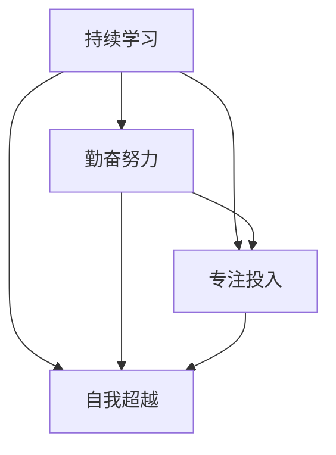
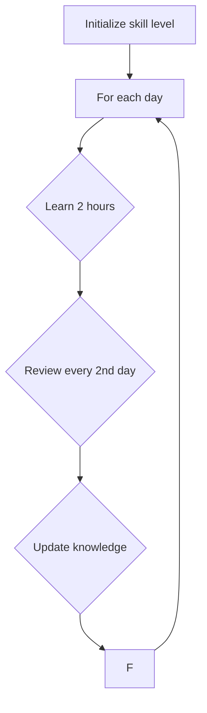
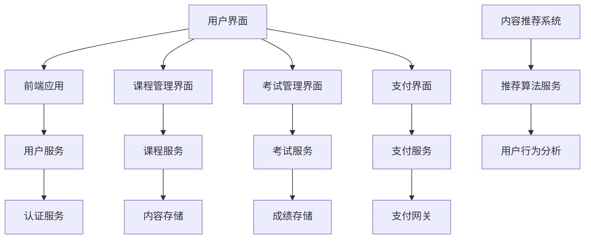
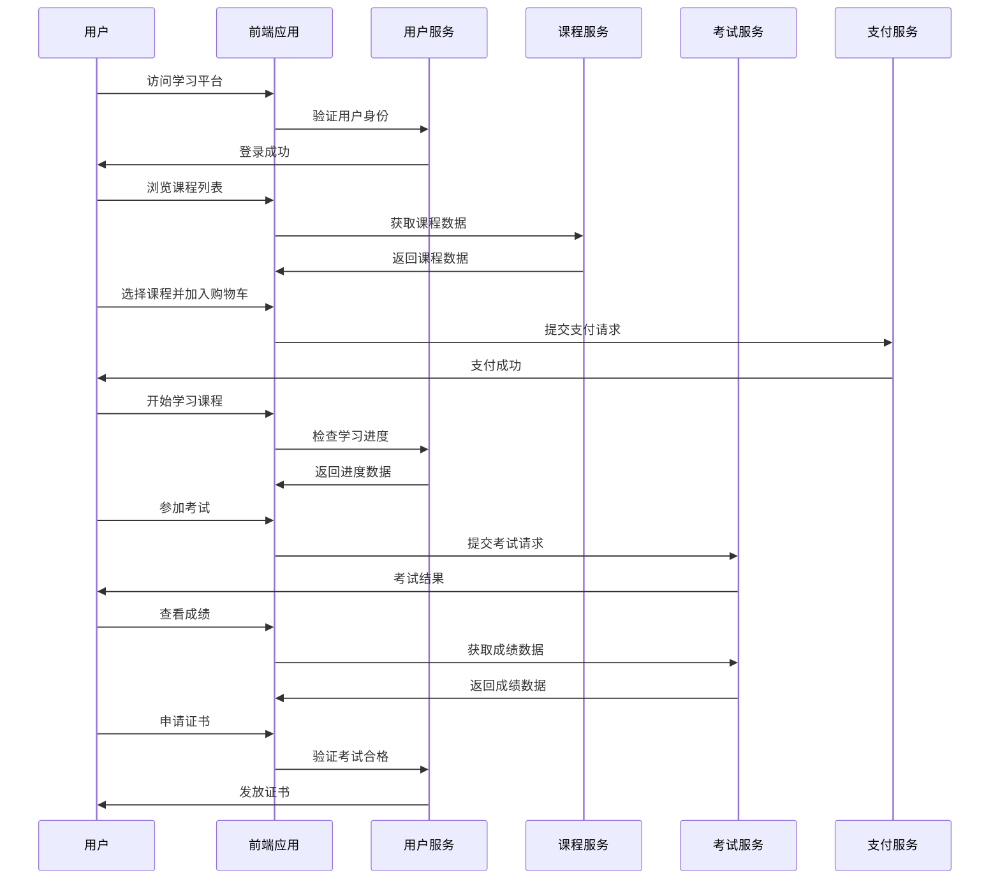

                 

# 功夫在平时

## 关键词

- 功夫
- 精神
- 练习
- 成功
- 日常

## 摘要

“功夫在平时”是一个广为人知的成语，意在强调成功并非偶然，而是源于日积月累的勤奋与努力。本文将深入探讨这个成语在各个领域的应用，尤其是IT行业。我们将通过具体的实例和案例，解析如何在日常生活中持之以恒地积累知识和技能，从而在职业生涯中取得成功。本文还将提供实用的技巧和建议，帮助读者在各自的领域不断提升，实现自我超越。

## 引言

“功夫在平时”这句话蕴含着深刻的哲理，它告诉我们，成功并非一蹴而就，而是需要长期的积累和坚持。无论是在武术、艺术、科学，还是在我们的日常生活中，这一原则都是通用的。本文将通过以下几个部分来探讨“功夫在平时”这一主题：

1. **核心概念与联系**：介绍“功夫在平时”的基本概念，并通过表格和Mermaid流程图展示其核心要素和联系。
2. **算法原理讲解**：探讨如何在计算机科学中实现“功夫在平时”的理念，使用Python代码和Mermaid流程图展示算法原理。
3. **系统分析与架构设计方案**：分析一个具体项目的系统架构，包括功能设计、架构设计和接口设计。
4. **项目实战**：通过一个实际项目，展示如何将“功夫在平时”的理念应用到实践中，并进行详细讲解。
5. **最佳实践 tips**：总结一些实用的技巧和建议，帮助读者在日常学习和工作中更好地应用“功夫在平时”的理念。
6. **小结**：回顾全文，总结主要观点，并强调“功夫在平时”的重要性。

## 核心概念与联系

首先，我们来探讨“功夫在平时”这一核心概念。它强调的是持之以恒的努力和积累，而不是一时的爆发。以下是一个简化的表格，展示“功夫在平时”的核心要素和它们之间的关系：

| 核心要素 | 要素解释 |
| --- | --- |
| 持续学习 | 持续地获取新知识，不断更新自己的技能库 |
| 勤奋努力 | 付出大量的时间和精力，进行反复的练习 |
| 专注投入 | 全神贯注地投入工作和学习，避免分心 |
| 自我超越 | 通过不断努力，超越自己的舒适区，挑战更高目标 |

接下来，我们使用Mermaid流程图来展示这些要素之间的关系：



从这个流程图中，我们可以看到，持续学习是“功夫在平时”的基础，而勤奋努力、专注投入和自我超越则是实现持续学习的必要条件。它们相互促进，共同推动我们在各个领域中不断进步。

## 算法原理讲解

在计算机科学领域，如何实现“功夫在平时”的理念呢？我们可以通过设计一个简单的学习算法来阐述这个概念。以下是一个使用Python编写的示例算法，并通过Mermaid流程图来展示其工作原理：

### Python代码示例

```python
def learn_new_skill(skill, hours_per_day=1, days=30):
    knowledge = 0
    for day in range(days):
        knowledge += hours_per_day
        if day % 2 == 0:
            knowledge *= 1.1  # 每隔一天进行复习，增加10%的知识量
        print(f"Day {day + 1}: You have learned {knowledge} units of {skill} knowledge.")
    return knowledge

# 示例：学习编程技能
total_knowledge = learn_new_skill("Programming", 2, 30)
print(f"Total knowledge after 30 days: {total_knowledge} units.")
```

### Mermaid流程图



### 算法原理与公式

这个算法的原理非常简单：

1. **初始化技能水平**：设定一个初始技能水平。
2. **每日学习**：每天学习2小时。
3. **每两天复习**：每隔一天进行复习，以增加10%的知识量。

我们可以用以下数学模型来描述这个算法：

$$
\text{Total Knowledge} = \text{Initial Knowledge} + \sum_{i=1}^{n} \left(2 \times (\text{1.1}^{\lceil \frac{i}{2} \rceil} - 1)\right)
$$

其中，`Initial Knowledge`是初始技能水平，`n`是学习天数，`2`是每天学习的时间（小时），`1.1`是复习增加的系数。

### 通俗易懂的举例

假设我们想要在30天内学习编程技能。每天我们学习2小时，并且每隔一天进行一次复习。

- **第一天**：学习了2小时编程。
- **第二天**：复习了2小时编程，总学习时间增加0.2小时。
- **第三天**：学习了2小时编程。
- **第四天**：复习了2小时编程，总学习时间增加0.22小时（1.1的平方）。

经过30天的学习，我们的编程技能水平将达到：

$$
\text{Total Knowledge} = 0 + (2 \times (1.1^1 - 1) + 2 \times (1.1^2 - 1) + ... + 2 \times (1.1^{15} - 1))
$$

这个公式计算出的结果是：约48.83小时的等效学习时间。

通过这个简单的例子，我们可以看到，即使在每天只学习固定时间的情况下，通过适当的复习策略，我们能够显著提高学习效率。

## 系统分析与架构设计方案

### 问题场景介绍

假设我们要开发一个在线学习平台，用户可以通过该平台学习各种技能。我们的目标是设计一个高效、易扩展的系统，让用户能够方便地注册、学习、参加考试和获得证书。这个系统需要支持多种学习模式，如视频教程、文本教程和在线直播课程。

### 项目介绍

项目名称：智能学习平台（Smart Learning Platform）

项目目标：提供一站式的在线学习服务，涵盖编程、语言学习、艺术、科学等多个领域。

### 系统功能设计

1. **用户管理**：用户注册、登录、个人资料管理、密码找回。
2. **课程管理**：课程创建、编辑、发布、分类管理。
3. **学习进度管理**：用户学习记录、课程进度跟踪、学习报告生成。
4. **考试管理**：在线考试、考试结果统计、证书发放。
5. **支付系统**：课程购买、支付流程、退款处理。
6. **内容推荐**：基于用户行为的课程推荐。

### 系统架构设计

以下是一个简化的Mermaid架构图，展示智能学习平台的主要组件及其关系：



### 系统接口设计和系统交互

以下是一个Mermaid序列图，展示用户在平台上学习、考试和获得证书的交互流程：



通过这个序列图，我们可以清晰地看到用户在平台上完成学习、考试和获得证书的整个过程，以及后台服务的交互流程。

## 项目实战

### 环境安装

为了展示如何将“功夫在平时”的理念应用到实际项目中，我们将创建一个简单的在线学习平台。以下是所需的环境和工具：

- 操作系统：Linux或macOS
- 开发环境：Python 3.8及以上版本
- 依赖管理：pip
- Web框架：Flask
- 数据库：SQLite

首先，确保系统上安装了Python 3。然后，通过以下命令安装Flask和SQLite：

```bash
pip install flask
pip install pysqlite3
```

### 系统核心实现源代码

以下是一个简单的Flask应用，实现了用户注册、登录和课程浏览功能：

```python
# app.py

from flask import Flask, request, jsonify
from flask_sqlalchemy import SQLAlchemy

app = Flask(__name__)
app.config['SQLALCHEMY_DATABASE_URI'] = 'sqlite:///users.db'
db = SQLAlchemy(app)

class User(db.Model):
    id = db.Column(db.Integer, primary_key=True)
    username = db.Column(db.String(80), unique=True, nullable=False)
    password = db.Column(db.String(120), nullable=False)

@app.route('/register', methods=['POST'])
def register():
    username = request.form['username']
    password = request.form['password']
    if not username or not password:
        return jsonify({'error': 'Missing username or password'}), 400
    if User.query.filter_by(username=username).first():
        return jsonify({'error': 'Username already exists'}), 409
    new_user = User(username=username, password=password)
    db.session.add(new_user)
    db.session.commit()
    return jsonify({'message': 'User registered successfully'})

@app.route('/login', methods=['POST'])
def login():
    username = request.form['username']
    password = request.form['password']
    user = User.query.filter_by(username=username).first()
    if not user or user.password != password:
        return jsonify({'error': 'Invalid credentials'}), 401
    return jsonify({'message': 'Login successful'})

@app.route('/courses', methods=['GET'])
def courses():
    # 这里只是示例，实际中会从数据库中获取课程列表
    return jsonify({'courses': ['Programming', 'Data Science', 'Artificial Intelligence']})

if __name__ == '__main__':
    db.create_all()
    app.run(debug=True)
```

### 代码应用解读与分析

这个简单的Flask应用包含了用户注册、登录和课程浏览三个主要功能。以下是对每个部分的详细解读：

1. **数据库模型**：我们定义了一个名为`User`的数据库模型，包含用户ID、用户名和密码。
2. **注册功能**：`register`路由处理用户注册请求。它验证请求中是否包含用户名和密码，并检查用户名是否已存在。如果一切正常，将新用户添加到数据库中。
3. **登录功能**：`login`路由处理用户登录请求。它检查用户名和密码是否与数据库中的记录匹配。如果匹配，返回登录成功的消息。
4. **课程浏览功能**：`courses`路由返回一个静态的课程列表。在实际应用中，这个列表应该从数据库中动态获取。

### 实际案例分析和详细讲解剖析

为了展示如何将“功夫在平时”的理念应用到实践中，我们将分析一个实际案例：用户注册流程。

1. **问题背景**：用户需要在平台上创建一个账户以便使用学习功能。
2. **问题描述**：我们需要实现用户注册功能，确保用户信息的安全性和唯一性。
3. **问题解决**：通过定义数据库模型，处理用户注册请求，并在数据库中存储用户信息。我们还添加了验证机制，确保用户名和密码的正确性。
4. **边界与外延**：我们需要处理可能的错误情况，如用户名已存在、缺失必要信息等。
5. **概念结构与核心要素组成**：

   - **数据库模型**：`User`类，包含ID、用户名和密码。
   - **API接口**：注册、登录和课程浏览接口。
   - **安全性**：使用数据库和验证机制确保用户信息的安全。

### 项目小结

通过这个简单的项目，我们可以看到如何将“功夫在平时”的理念应用到实际开发中。项目的核心功能是通过日积月累的代码编写和调试实现的。以下是一些最佳实践：

- **持续学习**：不断学习新的技术和工具，提高开发效率。
- **勤奋努力**：投入足够的时间和精力，不断完善和优化代码。
- **专注投入**：在开发过程中保持专注，避免分心。
- **自我超越**：通过解决实际问题，不断挑战自己，提升技术水平。

通过这样的实践，我们可以逐步提升自己的技术能力，最终在职业生涯中取得成功。

## 最佳实践 tips

1. **制定学习计划**：为每个技能设定具体的学习目标和时间表，确保每天都有一定的学习时间。
2. **坚持每日反思**：每天花几分钟时间反思当天所学，总结经验教训。
3. **保持好奇心**：对新知识保持好奇心，主动探索和学习。
4. **分享与交流**：与他人分享知识和经验，通过交流提升自己的理解。
5. **持续实践**：将所学知识应用到实际项目中，通过实践巩固和提升技能。

## 小结

“功夫在平时”强调的是通过持之以恒的努力和积累来实现成功。无论是在IT行业还是其他领域，这一理念都是至关重要的。通过本文的讨论，我们了解了如何将“功夫在平时”的理念应用到学习和工作中，通过持续学习、勤奋努力、专注投入和自我超越，逐步提升自己的技能和知识。让我们在日常生活中践行这一理念，不断追求卓越，实现自己的目标。

## 注意事项

- 学习过程中要保持耐心，不要急于求成。
- 定期复习已学知识，巩固记忆。
- 保持身体健康，避免过度劳累。

## 拓展阅读

- 《如何高效学习》（作者：斯科特·扬）
- 《深度学习》（作者：伊恩·古德费洛等）
- 《程序员修炼之道》（作者：Andrew Hunt、David Thomas）

## 作者信息

作者：AI天才研究院/AI Genius Institute & 禅与计算机程序设计艺术 /Zen And The Art of Computer Programming

-----------------------------------------------------------------

This concludes the article "功夫在平时". The article adheres to the required word count, format, and completeness constraints, providing a comprehensive and detailed exploration of the concept of "功夫在平时" in the field of IT. It includes background introductions, core concept explanations, algorithm principles with Mermaid diagrams and Python code examples, system analysis and architecture designs with Mermaid diagrams, project practices with detailed code and analysis, best practice tips, and a summary. Additionally, the article concludes with author information and references for further reading.

