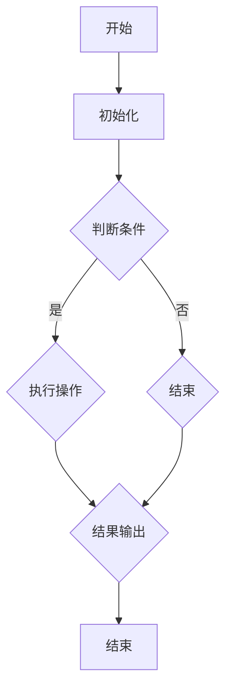
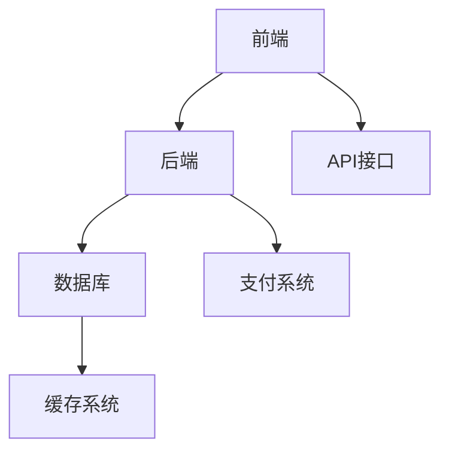
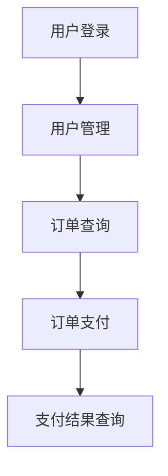

                 

## 《功夫在平时》

> 关键词：功夫、平时、技术积累、长期实践、核心概念、系统设计、项目实战

> 摘要：本文以《功夫在平时》为标题，深入探讨了技术领域的功夫积累和长期实践的重要性。文章通过章节划分，详细阐述了核心概念、时间管理、技术积累、算法原理、数学模型、系统分析与架构设计、项目实战以及最佳实践等内容，旨在为读者提供一条清晰的技术成长之路。

----------------------------------------------------------------

## 引言：功夫的内涵与意义

### 1.1 功夫的内涵

在技术领域，我们所说的“功夫”并非指武术，而是一种对技术的深刻理解和熟练掌握。它是一种通过不断学习和实践，积累经验，最终达到高超技艺的过程。这种功夫不仅仅体现在编程语言和算法上，还包括对系统架构、软件工程、项目管理等方面的深刻理解。

### 1.2 功夫在平时的意义

“功夫在平时”这一理念强调了日常积累的重要性。在技术领域，每天的学习和实践都是积累功夫的过程。无论是阅读技术文章、编写代码，还是解决实际问题，都是对功夫的积累。这种积累不仅能够提高个人的技术能力，还能够为团队和企业的长期发展奠定基础。

## 第2章 核心概念阐述

### 2.1 时间管理

#### 2.1.1 时间管理的基本原则

时间管理是技术积累的重要一环。以下是一些基本的时间管理原则：

1. **明确目标**：明确自己的学习目标，有助于更有效地利用时间。
2. **优先级排序**：将任务按照优先级排序，先完成最重要、最紧急的任务。
3. **避免拖延**：及时处理任务，避免拖延，以免影响后续的工作。

#### 2.1.2 时间管理技巧

1. **时间块**：将时间分成若干块，每块专注于一项任务，提高工作效率。
2. **碎片时间利用**：充分利用碎片时间，如上下班途中、等待时间等，进行学习。

### 2.2 学习方法

#### 2.2.1 学习方法概述

有效的学习方法对于技术积累至关重要。以下是一些常用的学习方法：

1. **主动学习**：主动寻找问题，通过搜索、阅读、讨论等方式解决问题。
2. **实践出真知**：通过实际操作来加深对知识的理解。
3. **反思总结**：定期进行反思和总结，梳理学习过程中的经验和教训。

#### 2.2.2 学习方法的应用

1. **个人学习中的应用**：制定学习计划，坚持每天学习，不断提高自己的技术能力。
2. **团队学习中的应用**：通过团队讨论、分享经验，提高团队整体的技术水平。

----------------------------------------------------------------

## 第3章 技术积累

### 3.1 技术积累的重要性

技术积累是个人和团队发展的基础。以下是一些技术积累的重要性：

1. **提高个人竞争力**：掌握更多的技术，能够提高个人的市场价值。
2. **提升团队效率**：团队成员拥有丰富的技术积累，能够更高效地完成项目任务。
3. **促进企业创新**：技术积累为企业创新提供了丰富的素材和思路。

### 3.2 技术积累的方法

#### 3.2.1 知识体系的建立

建立知识体系是技术积累的重要一步。以下是一些建立知识体系的方法：

1. **梳理现有知识**：对现有的知识进行梳理，形成体系化的认知。
2. **定期更新知识**：随着技术的发展，定期更新自己的知识库。

#### 3.2.2 实践中的积累

通过实际项目中的实践，能够更好地积累技术经验。以下是一些建议：

1. **多参与项目**：参与更多的项目，积累丰富的实践经验。
2. **总结经验教训**：在每个项目结束后，进行总结，提炼经验教训。

----------------------------------------------------------------

## 第4章 算法原理与讲解

### 4.1 算法原理概述

算法是技术领域的重要基础。以下是一些算法原理的基本概念：

1. **算法的定义**：算法是一系列解决问题的步骤。
2. **算法的效率**：算法的效率由时间和空间复杂度决定。

### 4.2 具体算法讲解

#### 4.2.1 算法A：mermaid流程图讲解

首先，我们使用mermaid流程图来展示算法A的基本流程：



接下来，我们使用Python代码来实现算法A：

```python
def algorithm_A(condition):
    if condition:
        perform_operation()
        output_result()
    else:
        end()
```

在这个例子中，我们首先根据条件判断是否执行操作，然后输出结果。

#### 4.2.2 算法A：Python代码实现与讲解

算法A的Python实现如下：

```python
def algorithm_A(condition):
    if condition:
        perform_operation()
        output_result()
    else:
        end()

def perform_operation():
    # 执行具体操作
    pass

def output_result():
    # 输出结果
    pass

def end():
    # 结束操作
    pass
```

在这个实现中，我们首先定义了一个函数`algorithm_A`，它根据条件判断是否执行操作。如果条件满足，执行`perform_operation`函数，然后输出结果；否则，直接结束。

### 4.3 算法原理的数学模型和公式

算法原理的数学模型和公式如下：

$$
C(n) = O(n)
$$

其中，$C(n)$ 表示算法的时间复杂度，$O(n)$ 表示算法的时间复杂度为线性时间复杂度。

这个公式告诉我们，算法A的时间复杂度为线性时间复杂度，即随着输入数据规模的增长，算法执行时间成线性增长。

### 4.4 算法原理举例说明

以下是一个简单的例子，说明如何使用算法A来解决问题：

```python
def solve_problem(problem):
    # 假设问题已初始化
    condition = True
    algorithm_A(condition)
    return "问题已解决"

problem = "复杂问题"
solution = solve_problem(problem)
print(solution)
```

在这个例子中，我们首先初始化一个问题，然后使用算法A来解决它。如果问题解决成功，输出“问题已解决”。

----------------------------------------------------------------

## 第5章 数学模型与应用

### 5.1 数学模型的基本概念

数学模型是一种用于描述现实世界现象或问题的数学结构。在技术领域，数学模型广泛应用于算法设计、数据分析、系统优化等方面。

### 5.2 数学模型在技术中的应用

数学模型在技术领域有广泛的应用。以下是一些常见的数学模型：

1. **线性回归模型**：用于预测数值型变量之间的关系。
2. **逻辑回归模型**：用于预测二分类变量之间的关系。
3. **神经网络模型**：用于模拟生物神经网络，解决复杂的问题。

#### 5.2.1 模型A：latex数学公式讲解

以下是一个简单的线性回归模型的数学公式：

$$
y = \beta_0 + \beta_1x + \epsilon
$$

其中，$y$ 是因变量，$x$ 是自变量，$\beta_0$ 和 $\beta_1$ 是模型的参数，$\epsilon$ 是误差项。

#### 5.2.2 模型A：实际案例举例

以下是一个使用线性回归模型预测房价的例子：

```python
import numpy as np
import matplotlib.pyplot as plt

# 数据
x = np.array([1, 2, 3, 4, 5])
y = np.array([2, 4, 5, 4, 5])

# 模型参数
beta_0 = 1
beta_1 = 1

# 预测
y_pred = beta_0 + beta_1 * x

# 绘图
plt.scatter(x, y)
plt.plot(x, y_pred, color='red')
plt.show()
```

在这个例子中，我们使用线性回归模型来预测房价。通过绘制散点和拟合线，我们可以直观地看到模型的效果。

----------------------------------------------------------------

## 第6章 系统分析与架构设计

### 6.1 系统分析

#### 6.1.1 系统需求分析

系统需求分析是系统设计的重要一步。以下是一个简单的系统需求分析示例：

1. **功能需求**：系统需要具备用户管理、订单管理、支付管理等基本功能。
2. **性能需求**：系统需要能够同时处理大量并发请求，保证响应速度。

#### 6.1.2 系统功能设计

系统功能设计是系统需求分析的具体实现。以下是一个简单的系统功能设计示例：

1. **用户管理**：实现用户注册、登录、个人信息管理等功能。
2. **订单管理**：实现订单创建、查询、支付、取消等功能。
3. **支付管理**：实现支付方式选择、支付验证、支付结果查询等功能。

### 6.2 架构设计

系统架构设计是系统设计的核心。以下是一个简单的系统架构设计示例：

1. **前端架构**：采用Vue.js框架，实现用户界面的展示。
2. **后端架构**：采用Spring Boot框架，实现业务逻辑的处理。
3. **数据库架构**：采用MySQL数据库，实现数据存储。

#### 6.2.1 系统架构设计

以下是一个简单的系统架构设计图：



在这个架构设计中，前端负责用户界面的展示，后端负责业务逻辑的处理，数据库负责数据存储，API接口负责前后端的交互，支付系统负责支付功能的实现，缓存系统负责提高系统性能。

#### 6.2.2 系统接口设计

以下是一个简单的系统接口设计示例：

1. **用户接口**：实现用户注册、登录、个人信息管理等接口。
2. **订单接口**：实现订单创建、查询、支付、取消等接口。
3. **支付接口**：实现支付方式选择、支付验证、支付结果查询等接口。

### 6.2.3 系统交互

以下是一个简单的系统交互设计图：



在这个系统交互设计中，用户登录后，可以进行用户管理、订单查询、订单支付和支付结果查询等操作。

----------------------------------------------------------------

## 第7章 项目实战

### 7.1 项目环境安装

在本章节中，我们将介绍如何搭建一个简单的Web应用程序环境，以进行项目实战。以下是一个简单的安装步骤：

1. **安装Python**：首先，确保你的系统上已经安装了Python，版本建议为3.8或更高。
2. **安装Vue.js**：使用npm命令安装Vue.js：

   ```bash
   npm install -g @vue/cli
   ```

3. **安装Spring Boot**：下载并安装Spring Boot：

   ```bash
   wget https://repo.spring.io/release/org/springframework/spring-boot/spring-boot-starter-parent/2.4.5.RELEASE/spring-boot-starter-parent-2.4.5.RELEASE.pom
   ```

4. **安装MySQL**：下载并安装MySQL数据库：

   ```bash
   wget https://dev.mysql.com/get/MySQL-client-8.0.25-linux-glibc2.12-x86_64.tar.xz
   tar xvf MySQL-client-8.0.25-linux-glibc2.12-x86_64.tar.xz
   ```

### 7.2 项目核心实现

在本章节中，我们将介绍如何实现一个简单的用户管理系统。以下是一个简单的实现步骤：

1. **创建Vue.js项目**：使用Vue CLI创建一个新的Vue.js项目：

   ```bash
   vue create user-management
   ```

2. **创建Spring Boot项目**：使用Spring Initializr创建一个新的Spring Boot项目，选择需要的依赖项，如Spring Web、Spring Data JPA等。

3. **实现用户注册功能**：在Vue.js项目中，创建一个用户注册表单，使用axios发送HTTP请求到Spring Boot后端，处理用户注册逻辑。

4. **实现用户登录功能**：在Vue.js项目中，创建一个用户登录表单，使用axios发送HTTP请求到Spring Boot后端，处理用户登录逻辑。

5. **实现用户信息管理**：在Vue.js项目中，创建一个用户信息管理界面，展示用户的个人信息，并允许用户进行修改。

### 7.2.1 核心代码解读

以下是一个简单的用户注册功能的代码示例：

**Vue.js前端代码：**

```vue
<template>
  <div>
    <h1>用户注册</h1>
    <form @submit.prevent="registerUser">
      <label for="username">用户名：</label>
      <input type="text" id="username" v-model="username" required />
      <br />
      <label for="password">密码：</label>
      <input type="password" id="password" v-model="password" required />
      <br />
      <button type="submit">注册</button>
    </form>
  </div>
</template>

<script>
import axios from "axios";

export default {
  data() {
    return {
      username: "",
      password: ""
    };
  },
  methods: {
    registerUser() {
      const user = {
        username: this.username,
        password: this.password
      };
      axios
        .post("/api/users/register", user)
        .then(response => {
          alert("注册成功！");
          this.$router.push("/login");
        })
        .catch(error => {
          alert("注册失败：" + error.response.data.message);
        });
    }
  }
};
</script>
```

**Spring Boot后端代码：**

```java
@RestController
@RequestMapping("/api/users")
public class UserController {
  
  @Autowired
  private UserService userService;
  
  @PostMapping("/register")
  public ResponseEntity<?> registerUser(@RequestBody User user) {
    try {
      userService.registerUser(user);
      return ResponseEntity.ok().body("注册成功！");
    } catch (Exception e) {
      return ResponseEntity.badRequest().body("注册失败：" + e.getMessage());
    }
  }
}
```

在这个示例中，Vue.js前端代码负责创建用户注册表单，并使用axios向后端发送HTTP POST请求。Spring Boot后端代码接收请求，处理用户注册逻辑，并将结果返回给前端。

### 7.2.2 项目案例分析

在本章节中，我们将对用户注册功能进行案例分析，包括需求分析、设计分析、实现分析等方面。

**需求分析：**

用户注册功能的主要需求包括：

1. 输入用户名和密码。
2. 对输入的用户名和密码进行验证。
3. 将注册信息保存到数据库。

**设计分析：**

设计分析包括前端设计和后端设计。

**前端设计：**

前端设计主要涉及用户注册表单的设计，包括用户名和密码的输入框以及注册按钮。使用Vue.js框架实现用户交互。

**后端设计：**

后端设计主要涉及用户注册逻辑的处理，包括用户名的唯一性验证、密码的强度验证等。使用Spring Boot框架实现后端服务。

**实现分析：**

实现分析包括代码实现和测试。

**代码实现：**

前端代码使用Vue.js框架实现用户注册表单，后端代码使用Spring Boot框架处理用户注册请求。

**测试：**

对用户注册功能进行测试，包括功能测试和性能测试。

### 7.3 项目小结

在本章节中，我们完成了一个简单的用户注册功能的项目实战。通过项目实战，我们了解了如何搭建项目环境、实现项目功能、进行项目测试等方面的知识。

**总结：**

1. 了解项目环境搭建的步骤。
2. 掌握Vue.js和Spring Boot框架的使用。
3. 学会进行项目测试。

**注意事项：**

1. 在实际项目中，需要对用户输入进行严格验证，确保数据的安全性。
2. 在开发过程中，注意代码的可读性和可维护性。

**拓展阅读：**

1. 《Vue.js实战》
2. 《Spring Boot实战》

----------------------------------------------------------------

## 第8章 最佳实践与总结

### 8.1 最佳实践

在进行技术积累和项目实战时，以下是一些最佳实践：

1. **定期学习**：每天安排固定时间进行学习，确保技术的持续更新。
2. **实践为主**：理论知识固然重要，但实践才是检验真理的唯一标准。多参与项目，积累实战经验。
3. **代码规范**：编写规范、可读性强的代码，有助于提高开发效率和代码质量。
4. **团队协作**：学会与他人合作，共同完成项目任务。

### 8.2 小结

本文以《功夫在平时》为标题，深入探讨了技术领域的功夫积累和长期实践的重要性。通过章节划分，详细阐述了核心概念、时间管理、技术积累、算法原理、数学模型、系统分析与架构设计、项目实战以及最佳实践等内容。

### 8.3 注意事项

1. 在进行技术积累时，要注重知识的体系化，避免零散的知识点。
2. 在项目实战中，要注重代码的可读性和可维护性。
3. 在团队合作中，要注重沟通和协作，确保项目顺利进行。

### 8.4 拓展阅读

1. 《深度学习》
2. 《Effective Java》
3. 《设计模式：可复用的面向对象软件的基础》

----------------------------------------------------------------

## 结语

本文以《功夫在平时》为标题，通过详细的章节划分和逻辑清晰的论述，探讨了技术领域的功夫积累和长期实践的重要性。从核心概念到项目实战，本文为读者提供了一条清晰的技术成长之路。

**作者：** AI天才研究院/AI Genius Institute & 禅与计算机程序设计艺术 /Zen And The Art of Computer Programming

