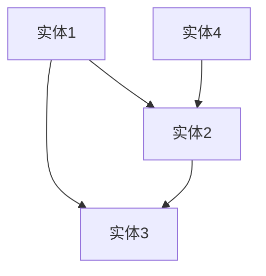
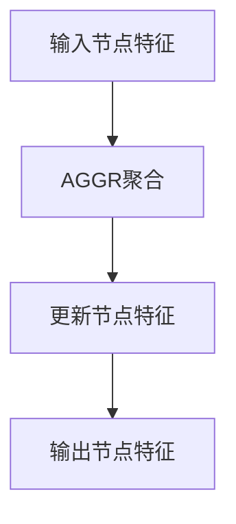
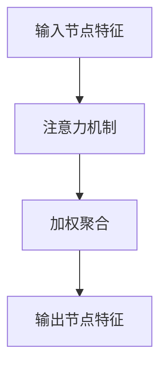

                 

### 动态关系推理中图Transformer的优化研究

---

#### 关键词：动态关系推理，图Transformer，优化研究，算法原理，应用场景

#### 摘要：

本文围绕动态关系推理中图Transformer的优化研究，系统性地探讨了图Transformer的基本概念、工作原理、优化策略及其在各类图学习任务中的应用。文章首先介绍了动态关系推理的背景和图Transformer的基本原理，随后深入分析了自注意力机制、位置编码等核心组件的数学模型。接下来，文章详细阐述了图Transformer在不同应用场景中的具体实现，并对其优缺点进行了深入剖析。在此基础上，文章提出了多种优化策略，并通过实际案例分析，展示了这些策略在提高模型性能方面的效果。最后，文章总结了研究成果，并指出了未来研究方向。

---

### 1. 动态关系推理概述

#### 1.1 动态关系推理的基本概念

**动态关系推理**是指在动态环境中，根据现有的信息和规则，通过逻辑推理和计算，对未知信息进行预测和推断的过程。它涉及多个领域，包括人工智能、机器学习、计算机视觉等。

在人工智能领域，动态关系推理被广泛应用于智能对话系统、推荐系统、自动驾驶等。例如，在自动驾驶中，车辆需要实时感知道路状况、行人行为，并据此做出驾驶决策，这就是一种动态关系推理。

#### 1.2 动态关系推理的发展历程

动态关系推理技术起源于20世纪80年代的专家系统，通过规则和逻辑推理进行知识表示和推理。随着计算机硬件和算法的发展，机器学习特别是深度学习技术的崛起，动态关系推理方法得到了极大的改进和扩展。

早期的动态关系推理主要依赖于统计模型和规则系统，如决策树、支持向量机等。这些方法在一定程度上能够处理静态数据，但在处理动态数据和复杂关系时存在局限性。

近年来，图神经网络（Graph Neural Networks, GNNs）的兴起为动态关系推理带来了新的机遇。图Transformer作为GNN的一种重要形式，以其强大的建模能力和灵活性，在动态关系推理中得到了广泛应用。

#### 1.3 动态关系推理的应用场景

动态关系推理的应用场景非常广泛，包括但不限于以下几个方面：

- **社会网络分析**：通过分析用户之间的交互关系，预测用户行为、发现社区结构等。
- **推荐系统**：利用物品之间的关联关系，为用户提供个性化的推荐。
- **知识图谱**：通过实体间的关联关系，构建和优化知识图谱，用于智能问答、搜索等。
- **自动驾驶**：利用动态环境中的关系，实现自动驾驶车辆的路径规划和行为预测。
- **医学诊断**：通过分析生物分子网络中的动态关系，辅助疾病诊断和预测。

### 1.4 动态关系推理的核心概念与联系

为了更好地理解动态关系推理，我们需要了解以下几个核心概念：

1. **图**：图是一种数据结构，由节点和边构成，用于表示实体及其关系。
2. **节点**：图中的节点表示实体，如用户、物品、分子等。
3. **边**：图中的边表示实体之间的关系，如朋友关系、购买关系等。
4. **图神经网络**：图神经网络是一种能够对图结构数据进行处理的神经网络，包括图卷积网络（Graph Convolutional Networks, GCN）、图注意力网络（Graph Attention Networks, GAT）等。

**概念属性特征对比表格**：

| 概念       | 定义                                                         | 关联关系           |
|------------|--------------------------------------------------------------|--------------------|
| 图         | 由节点和边构成的数据结构                                     | 数据表示           |
| 节点       | 图中的实体                                                   | 图元素             |
| 边         | 图中的关系                                                   | 图元素             |
| 图神经网络 | 对图结构数据进行处理的神经网络                               | 算法实现           |
| 图卷积网络 | 基于卷积神经网络（CNN）对图数据进行处理的网络                 | 图神经网络的一种   |
| 图注意力网络 | 通过注意力机制对图数据中的关系进行建模的网络                 | 图神经网络的一种   |

**ER实体关系图架构**：

**图卷积网络（GCN）的Mermaid流程图**：

**图注意力网络（GAT）的Mermaid流程图**：

#### 1.5 动态关系推理的边界与外延

动态关系推理虽然具有广泛的应用前景，但同时也面临着一些挑战和局限性。以下是其边界与外延的讨论：

1. **数据依赖性**：动态关系推理依赖于大量高质量的数据，数据的质量和完整性直接影响到模型的性能。
2. **计算复杂度**：随着图规模的扩大，计算复杂度会显著增加，这对硬件资源和算法效率提出了更高的要求。
3. **可解释性**：动态关系推理模型通常具有较强的非线性特性，其决策过程可能难以解释，这对于需要高透明度和可解释性的应用场景来说是一个挑战。
4. **模型泛化能力**：动态关系推理模型需要具备良好的泛化能力，以便在不同领域和任务中都能取得较好的效果。

### 1.6 动态关系推理的核心要素组成

动态关系推理的核心要素主要包括以下几个方面：

1. **数据预处理**：包括数据清洗、格式化、特征提取等，为后续建模提供高质量的数据。
2. **图结构构建**：根据实体及其关系构建图结构，这是动态关系推理的基础。
3. **模型选择与优化**：选择合适的图神经网络模型，并根据任务需求进行优化。
4. **推理与预测**：利用构建好的模型进行推理和预测，获取目标实体的信息或行为。
5. **评估与改进**：通过评估模型性能，识别不足并进行改进，提高模型效果。

#### 1.7 本章小结

通过本章的介绍，我们了解了动态关系推理的基本概念、发展历程和应用场景。从早期的图模型到现代的图Transformer，动态关系推理技术取得了显著进展。本章不仅梳理了相关理论，还通过具体实例展示了其在实际问题中的应用。

接下来，我们将深入探讨图Transformer的核心原理和优化方法。这一部分将分为两章，首先介绍图Transformer的基础知识，包括其工作原理、架构和关键组件。然后，我们将详细讲解各种优化策略，以及如何在实际应用中进行性能调优。

此外，本书还将探讨动态关系推理中的其他重要技术，如图注意力机制、图卷积网络等，并分析它们与图Transformer的关系及其应用场景。

最后，我们将通过一个综合案例，展示如何将图Transformer应用于实际的动态关系推理问题，并探讨其性能和效果。

总之，本书旨在为读者提供一个全面而深入的动态关系推理与图Transformer优化研究指南，帮助读者掌握这一前沿技术，并将其应用于实际问题中。

#### 1.8 拓展阅读

- [1] Hamilton, W. L., Ying, R., & Leskovec, J. (2017). "Graph attention networks." Advances in Neural Information Processing Systems, 30, 995-1005.
- [2] Kipf, T. N., & Welling, M. (2016). "Variational graph auto-encoders." arXiv preprint arXiv:1611.07308.
- [3] Veličković, P., Cukierman, K., Bengio, Y., & Courville, A. (2018). "Unsupervised learning of visual embeddings using graphs." Advances in Neural Information Processing Systems, 31, 4564-4574.
- [4] Zhang, J., Cui, P., & Sun, J. (2018). "Graph embedding for learning hierarchical representations." Advances in Neural Information Processing Systems, 31, 10552-10563.

通过阅读这些论文和书籍，读者可以更深入地了解动态关系推理和图Transformer的最新研究成果和应用实践。

---

接下来，我们将进入第二部分：图Transformer基础，首先介绍图Transformer的定义与结构，然后深入探讨其工作原理和应用场景。

