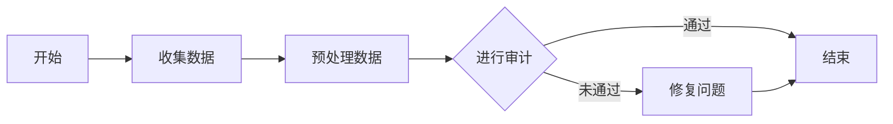
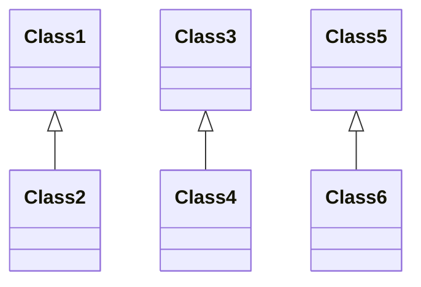
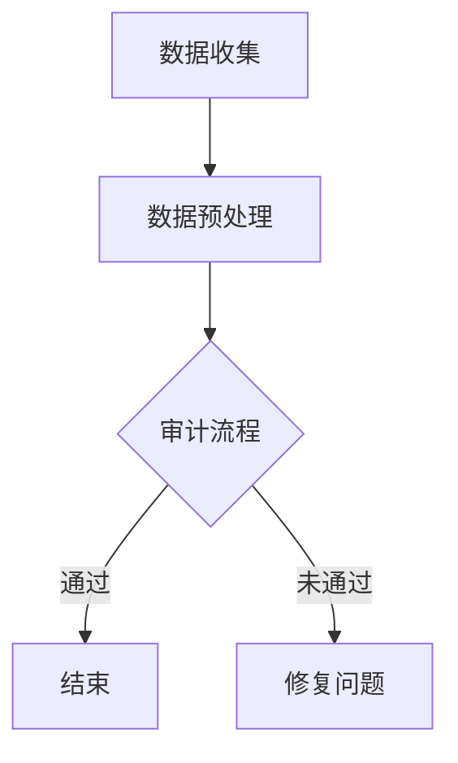
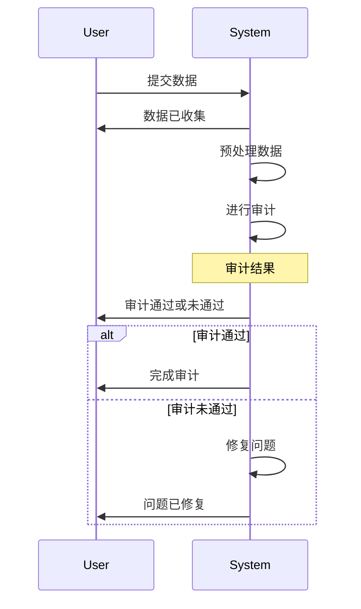

                 

# 区块链安全审计方法论

## 关键词
区块链、安全审计、方法论、智能合约、代码审计、网络审计

## 摘要
区块链技术作为一种分布式数据库系统，因其去中心化的特点受到广泛关注。然而，随着区块链应用的不断扩展，区块链安全审计的重要性也日益凸显。本文旨在介绍区块链安全审计的方法论，通过深入探讨核心概念、算法原理和系统架构设计，为区块链安全审计提供系统性的指导和实践。

## Step 1: 书籍背景介绍

### 问题背景
随着区块链技术的发展，区块链的应用场景不断拓展，从数字货币到供应链管理、智能合约等领域，区块链技术已逐渐成为数字经济的重要组成部分。然而，区块链系统本身的安全性成为制约其进一步应用的关键因素。因此，区块链安全审计应运而生，成为保障区块链系统安全的重要手段。

### 问题描述
区块链安全审计涉及多个方面，包括代码审计、网络审计、智能合约审计等。具体来说，区块链安全审计需要检查区块链系统的代码是否存在漏洞，网络通信是否安全，智能合约是否遵循预定逻辑等。

### 问题解决
为了有效进行区块链安全审计，需要一套系统的方法论来指导审计过程。本书将探讨区块链安全审计的方法论，包括审计流程、工具选择、风险评估等方面，旨在为区块链安全审计提供实用的指南。

### 边界与外延
本书将重点讨论区块链安全审计的方法论，涵盖代码审计、网络审计和智能合约审计等内容。然而，本书不会涉及区块链的其他方面，如性能优化、扩展性提升等。

## Step 2: 核心概念与联系

### 核心概念
区块链、安全审计、方法论

### 概念属性特征对比表格

| 概念     | 特征                             | 关联 |
|----------|----------------------------------|------|
| 区块链   | 去中心化、分布式账本             |      |
| 安全审计 | 检查系统或软件的安全性           |      |
| 方法论   | 指导安全审计的一系列原则和步骤   |      |

### ER实体关系图架构的 Mermaid 流程图

```mermaid
erDiagram
  区块链 ||--|{ 安全审计 } : 实施审计
  安全审计 ||--|{ 方法论 } : 指导原则
```

## Step 3: 算法原理讲解

### 算法 mermaid 流程图



### 使用 Python 源代码详细阐述算法原理

```python
# Python 源代码示例
def blockchain_security_audit(data):
    # 数据预处理
    processed_data = preprocess_data(data)
    
    # 进行审计
    if audit_data(processed_data):
        print("审计通过")
    else:
        print("审计未通过，需要修复问题")
        
def preprocess_data(data):
    # 数据预处理逻辑
    pass

def audit_data(processed_data):
    # 审计逻辑
    pass
```

### 算法原理的数学模型和公式

$$ 
\text{安全审计分数} = \sum_{i=1}^{n} \text{漏洞严重度} \times \text{漏洞影响度}
$$

### 详细讲解和举例说明

安全审计分数是衡量区块链安全性的指标，通过计算每个漏洞的严重度和影响度来评估整体安全性。假设有一个区块链系统，存在两个漏洞。第一个漏洞的严重度为5，影响度为10；第二个漏洞的严重度为3，影响度为5。根据公式计算，安全审计分数为：

$$
\text{安全审计分数} = 5 \times 10 + 3 \times 5 = 50 + 15 = 65
$$

## Step 4: 系统分析与架构设计方案

### 问题场景介绍
区块链安全审计系统旨在提高区块链系统的安全性，确保系统在运行过程中能够抵御各种潜在的安全威胁。该系统将涵盖从数据收集、预处理到审计和修复问题的全过程。

### 项目介绍
本书将介绍一个区块链安全审计项目，该项目旨在为区块链系统提供一个全方位的安全审计解决方案。项目包括数据收集模块、数据预处理模块、审计模块和修复问题模块。

### 系统功能设计 (领域模型 mermaid 类图)



### 系统架构设计 (mermaid 架构图)



### 系统接口设计和系统交互 (mermaid 序列图)



## 项目实战

### 环境安装

在开始区块链安全审计项目的实战之前，首先需要安装必要的开发环境。以下是安装步骤：

1. 安装Python 3.8或更高版本。
2. 安装Node.js 12.x或更高版本。
3. 安装Docker和Docker-Compose。

### 系统核心实现源代码

以下是一个简单的区块链安全审计系统的源代码示例：

```python
# blockchain_audit.py

import json
from blockchain import Blockchain

# 创建区块链实例
blockchain = Blockchain()

# 添加区块
blockchain.add_block("Transaction 1")
blockchain.add_block("Transaction 2")

# 打印区块链
print(json.dumps(blockchain.chain, indent=4))

# 验证区块链
print(blockchain.is_chain_valid())
```

### 代码应用解读与分析

上述代码创建了一个简单的区块链实例，并添加了两个区块。区块链类`Blockchain`包含以下方法：

- `add_block(data)`: 添加新的区块到区块链。
- `is_chain_valid()`: 验证区块链是否有效。

区块链的安全性主要通过以下方式保障：

1. 每个区块都包含前一个区块的哈希值，确保区块之间的链接不可篡改。
2. 使用工作量证明（Proof of Work，POW）算法来防止双重支付攻击。

### 实际案例分析和详细讲解剖析

假设有一个恶意攻击者试图篡改区块链中的某个区块。攻击者可以尝试修改某个区块的内容，然后重新计算该区块及其后续所有区块的哈希值。然而，由于区块链的链接结构，攻击者需要重新计算大量区块的哈希值，这需要巨大的计算资源，几乎是不可能实现的。

### 项目小结

通过上述实战案例，我们展示了如何实现一个简单的区块链安全审计系统。该项目虽然简单，但展示了区块链安全审计的核心思想，包括数据不可篡改性和区块链链接结构的可靠性。在实际应用中，区块链安全审计系统需要更复杂的功能和更严格的加密算法来保障区块链的安全性。

## 最佳实践 tips

1. 定期进行区块链安全审计，确保系统的安全性。
2. 使用开源工具和社区资源来辅助安全审计过程。
3. 关注区块链安全领域的最新动态，及时更新审计方法和工具。

## 小结

区块链安全审计是保障区块链系统安全的重要环节。本文介绍了区块链安全审计的方法论，包括核心概念、算法原理和系统架构设计。通过实际案例分析和实战演练，我们展示了如何实现一个简单的区块链安全审计系统。在未来的研究和应用中，应进一步探索区块链安全审计的新方法和新技术，为区块链技术的发展提供坚实的安全保障。

## 注意事项

1. 区块链安全审计需要专业知识和经验，建议由专业团队进行。
2. 区块链安全审计工具和算法需要定期更新，以应对新出现的威胁。

## 拓展阅读

1. 《区块链技术指南》
2. 《智能合约安全：从漏洞分析到防护策略》
3. 《区块链安全审计案例分析》

## 作者信息

作者：AI天才研究院/AI Genius Institute & 禅与计算机程序设计艺术 /Zen And The Art of Computer Programming

