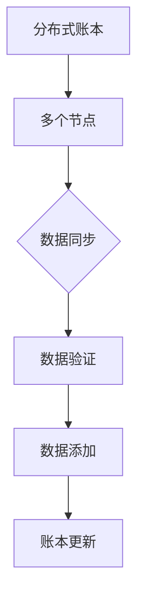
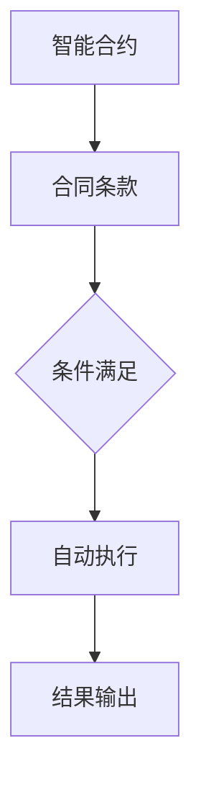
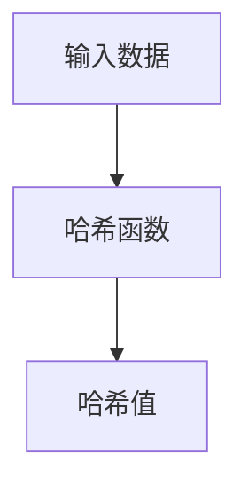
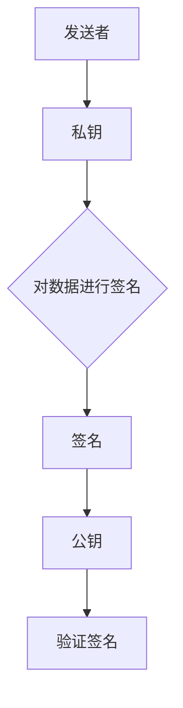
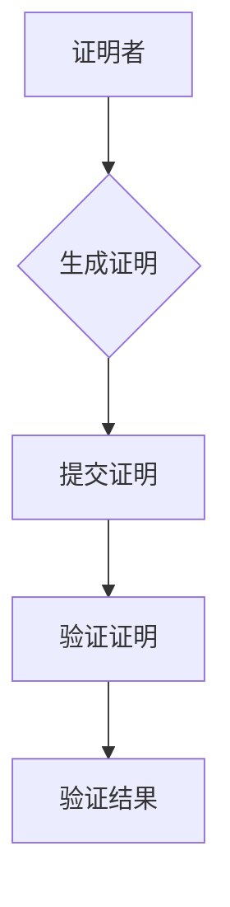
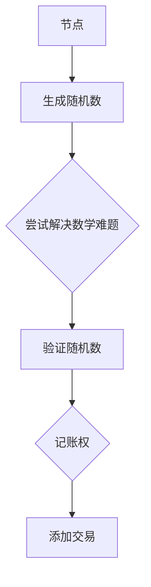
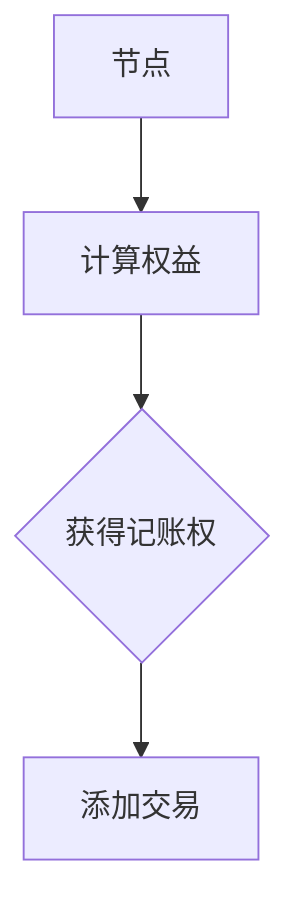
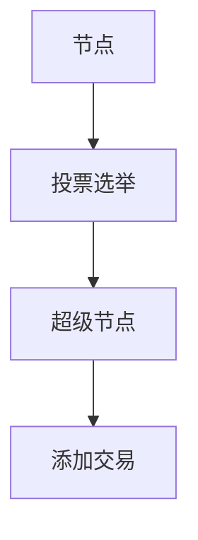
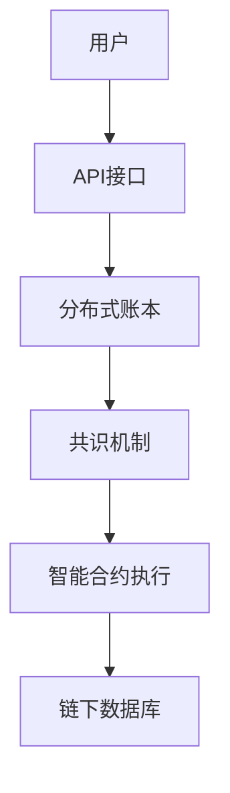

                 

### 《区块链技术在企业中的落地》

---

**关键词**：区块链技术、企业应用、分布式账本、智能合约、共识机制

**摘要**：本文将深入探讨区块链技术在企业中的落地应用。通过详细的背景介绍、核心概念解析、算法原理讲解、数学模型和公式阐述、系统分析与架构设计、项目实战案例分析以及最佳实践总结，旨在为读者提供一个全面而深刻的理解，并为其在企业管理中的应用提供实用的指导。

---

## 目录大纲设计思路

在设计《区块链技术在企业中的落地》这本书的目录大纲时，我们将遵循以下思路：

### 1. 背景介绍

首先，介绍区块链技术的基本概念、发展历程及其在企业应用中的重要性和潜在价值。这部分内容将包括区块链技术的基本概念、历史背景以及其在不同行业的应用案例。

### 2. 核心概念与联系

接下来，详细阐述区块链技术的核心概念，如分布式账本、智能合约、共识机制等。通过对比表格和ER实体关系图来展示这些概念之间的联系，帮助读者更好地理解区块链技术的整体架构。

### 3. 算法原理讲解

在第三部分，我们将讲解区块链技术中的关键算法，包括加密算法、共识算法等。使用mermaid流程图和Python源代码来展示算法原理，使读者能够直观地理解算法的实现过程。

### 4. 数学模型和数学公式

第四部分将使用LaTeX格式给出区块链技术中的相关数学模型和公式，并进行详细讲解和举例说明，帮助读者深入理解区块链技术背后的数学原理。

### 5. 系统分析与架构设计方案

在第五部分，我们将介绍区块链技术在企业中的具体应用场景，分析系统需求，设计系统架构和接口，为读者提供实际可行的方案。

### 6. 项目实战

第六部分将通过一个实际项目案例，详细讲解项目的环境安装、核心实现和代码分析，帮助读者将理论知识应用于实际项目中。

### 7. 最佳实践 tips

最后一部分将总结一些最佳实践，为读者提供实用的建议，帮助他们更好地将区块链技术应用于企业管理。

---

## 目录大纲设计步骤

### 第一步：章节一：区块链技术概述

在这一章节中，我们将首先介绍区块链技术的基本概念、发展历程及其在企业应用中的重要性和潜在价值。具体内容包括：

- **区块链技术的基本概念**：解释区块链技术的基本概念，如分布式账本、共识机制、智能合约等。
- **区块链技术的发展历程**：回顾区块链技术的发展历程，从比特币的出现到现今各种应用的兴起。
- **企业应用价值**：分析区块链技术如何赋能企业，提高业务效率、降低成本、增强安全性等。

### 第二步：章节二：核心概念与联系

在这一章节中，我们将详细阐述区块链技术的核心概念，并通过对比表格和ER实体关系图来展示它们之间的联系。具体内容包括：

- **分布式账本**：解释分布式账本的概念、原理和应用，通过对比表格展示其与中心化账本的区别。
- **智能合约**：介绍智能合约的概念、实现原理和案例分析，展示其与法律合同的区别。
- **共识机制**：阐述共识机制的概念、类型和案例分析，展示其在区块链网络中的重要性。

### 第三步：章节三：区块链算法原理

在这一章节中，我们将讲解区块链技术中的关键算法，包括加密算法、共识算法等。具体内容包括：

- **加密算法**：介绍常用的加密算法，如哈希函数、数字签名等，并通过mermaid流程图展示其工作原理。
- **共识算法**：介绍各种共识算法，如工作量证明（PoW）、权益证明（PoS）等，并通过mermaid流程图展示其工作原理。

### 第四步：章节四：数学模型和公式

在这一章节中，我们将使用LaTeX格式给出区块链技术中的相关数学模型和公式，并进行详细讲解和举例说明。具体内容包括：

- **数学模型**：介绍区块链技术中的常见数学模型，如哈希函数的数学模型、区块链共识算法的数学模型等。
- **数学公式**：使用LaTeX格式给出相关数学公式，如哈希函数的公式、区块链网络稳定性公式等，并进行详细讲解和举例说明。

### 第五步：章节五：系统分析与架构设计方案

在这一章节中，我们将介绍区块链技术在企业中的具体应用场景，分析系统需求，设计系统架构和接口。具体内容包括：

- **应用场景**：分析区块链技术在企业中的应用场景，如供应链管理、财务管理、人力资源管理等。
- **系统需求分析**：详细分析区块链技术的系统需求，包括功能需求、性能需求、安全性需求等。
- **系统架构设计**：设计区块链技术的系统架构，包括分布式账本架构、智能合约架构、共识机制架构等。
- **系统接口设计**：设计区块链技术的系统接口，包括API接口、SDK接口等。

### 第六步：章节六：项目实战

在这一章节中，我们将通过一个实际项目案例，详细讲解项目的环境安装、核心实现和代码分析。具体内容包括：

- **项目介绍**：介绍项目的背景、目标和预期成果。
- **环境安装**：详细讲解项目所需的开发环境、工具和依赖安装过程。
- **系统核心实现**：介绍项目的核心实现，包括分布式账本、智能合约、共识机制等。
- **代码分析**：分析项目的源代码，解释关键代码的功能和实现原理。
- **案例分析**：通过实际案例分析，展示区块链技术在企业中的落地效果和应用价值。

### 第七步：章节七：最佳实践 tips

在这一章节中，我们将总结一些最佳实践，为读者提供实用的建议。具体内容包括：

- **最佳实践**：总结区块链技术在企业应用中的最佳实践，如选择合适的区块链平台、优化智能合约设计、确保数据隐私和安全等。
- **小结**：对全文内容进行总结，强调区块链技术在企业中的重要性。
- **注意事项**：提醒读者在应用区块链技术时需要注意的问题和潜在风险。
- **拓展阅读**：推荐一些拓展阅读资源，帮助读者进一步了解区块链技术在企业中的应用。

---

通过以上详细的目录大纲设计步骤，我们希望能够为读者提供一个清晰、系统、易于理解的学习路径，帮助他们在区块链技术在企业中的落地应用方面获得深入的知识和实用的技能。在接下来的章节中，我们将逐一深入探讨每个主题，逐步构建起对区块链技术全面而深入的理解。

---

## 目录大纲

以下是《区块链技术在企业中的落地》的详细目录大纲：

### 第一部分：背景介绍

#### 第一章：区块链技术概述
1.1 区块链技术的基本概念
1.2 区块链技术的发展历程
1.3 区块链技术的重要性和应用价值

### 第二部分：核心概念与联系

#### 第二章：核心概念与联系
2.1 分布式账本
2.1.1 分布式账本的原理与应用
2.1.2 分布式账本的优势与挑战
2.2 智能合约
2.2.1 智能合约的原理与实现
2.2.2 智能合约的案例分析
2.3 共识机制
2.3.1 共识机制的原理与类型
2.3.2 共识机制的案例分析

### 第三部分：区块链算法原理

#### 第三章：区块链算法原理
3.1 加密算法
3.1.1 哈希函数的原理与使用
3.1.2 数字签名的原理与应用
3.2 共识算法
3.2.1 PoW算法的原理与优缺点
3.2.2 PoS算法的原理与优缺点
3.3 算法mermaid流程图展示

### 第四部分：数学模型和数学公式

#### 第四章：数学模型与公式
4.1 常见数学模型
4.1.1 数学模型在区块链中的应用
4.1.2 常见的数学模型介绍
4.2 数学公式讲解
4.2.1 LaTeX格式数学公式的使用
4.2.2 常见数学公式的详细解释

### 第五部分：系统分析与架构设计

#### 第五章：系统分析与架构设计
5.1 应用场景
5.1.1 区块链技术在企业中的应用
5.1.2 企业应用场景案例分析
5.2 系统需求分析
5.2.1 功能需求
5.2.2 性能需求
5.3 系统架构设计
5.3.1 系统架构图展示
5.3.2 系统接口设计
5.4 系统交互mermaid序列图

### 第六部分：项目实战

#### 第六章：项目实战
6.1 项目介绍
6.2 环境安装
6.3 系统核心实现
6.4 代码分析
6.5 案例分析
6.6 项目小结

### 第七部分：最佳实践与总结

#### 第七章：最佳实践与总结
7.1 最佳实践
7.2 小结
7.3 注意事项
7.4 拓展阅读

---

通过上述详细的目录大纲，读者可以清晰地了解到本书的结构和内容安排。每个章节都将围绕一个特定的主题进行深入探讨，从基础概念到实际应用，帮助读者逐步构建对区块链技术在企业中落地的全面理解。接下来，我们将逐一深入每个章节，逐步展开详细的内容讲解。期待与您一同探索区块链技术在企业中的应用之旅。

---

### 第一部分：背景介绍

#### 第一章：区块链技术概述

区块链技术作为近年来信息技术领域的一大热点，其独特性在于通过去中心化的方式实现数据的可靠存储和传输。本章将详细介绍区块链技术的基本概念、发展历程及其在企业中的重要性。

#### 1.1 区块链技术的基本概念

区块链技术是一种分布式数据库技术，其核心特点是数据的不可篡改性和可追溯性。区块链由多个区块组成，每个区块包含一定数量的交易记录，并通过密码学技术进行加密和链接，形成一条不可篡改的链。

**核心术语说明**：

- **区块链**：一系列按时间顺序排列、通过密码学原理链接的数据区块，组成一个分布式数据库。
- **区块**：包含交易记录和一定时间范围内发生的所有交易的数据结构。
- **交易**：区块链中的基本操作单元，用于记录数据的变化。
- **加密**：通过密码学技术对数据进行加密和解密，保证数据的安全性和隐私性。
- **去中心化**：网络中的所有节点都有平等的权利和义务，不存在中心化的控制实体。

#### 1.2 区块链技术的发展历程

区块链技术的发展可以追溯到2008年，当时一位化名为中本聪（Satoshi Nakamoto）的人发表了比特币的白皮书，提出了区块链技术的概念。比特币作为第一个基于区块链技术的数字货币，成功地在去中心化的环境下实现了价值的传输，引起了全球的关注。

随后，区块链技术逐渐扩展到其他领域，如智能合约、供应链管理、金融服务等。2016年，区块链2.0的概念提出，标志着区块链技术从数字货币扩展到更广泛的应用领域。

**发展历程**：

- **2008年**：比特币白皮书发表，区块链技术首次亮相。
- **2009年**：比特币网络上线，第一个区块（创世区块）生成。
- **2010年**：首次比特币交易完成，标志着区块链技术的实际应用。
- **2014年**：以太坊推出，引入智能合约的概念，推动区块链技术进一步发展。
- **2016年**：区块链2.0概念提出，标志着区块链技术从数字货币扩展到更广泛的应用领域。

#### 1.3 区块链技术的重要性和应用价值

区块链技术在企业中的应用具有巨大的潜力，主要体现在以下几个方面：

- **提高业务效率**：通过去中心化的方式，减少中介环节，提高业务处理速度。
- **降低成本**：减少对中心化机构的依赖，降低交易成本和操作费用。
- **增强安全性**：数据加密和分布式存储技术，确保数据的安全性和隐私性。
- **增强信任**：通过不可篡改的记录，提高数据的透明度和可追溯性，增强参与者之间的信任。

**问题背景**：

在传统的中心化体系中，数据存储和处理往往依赖于中心化的机构，容易导致数据篡改、丢失和泄露等问题。而区块链技术的出现，为这些问题提供了一种新的解决方案。

**问题描述**：

如何在企业中应用区块链技术，实现数据的安全存储、高效传输和透明管理？

**问题解决**：

通过引入区块链技术，可以实现以下解决方案：

1. **数据存储**：采用分布式账本技术，将数据分散存储在各个节点，确保数据的安全性和可靠性。
2. **数据传输**：采用加密技术和分布式传输协议，保证数据在传输过程中的完整性和安全性。
3. **数据管理**：通过智能合约技术，实现自动化和透明的数据管理，提高业务流程的效率。

**边界与外延**：

区块链技术在企业中的应用不仅限于数据存储和传输，还可以扩展到智能合约、供应链管理、金融服务等领域。这些应用场景都需要依赖区块链技术的核心特性，如分布式账本、加密存储、去中心化等。

**概念结构与核心要素组成**：

- **分布式账本**：区块链技术的核心组成部分，用于记录和管理数据。
- **加密技术**：用于保护数据的安全性和隐私性。
- **去中心化**：网络中的所有节点都有平等的权利和义务，不存在中心化的控制实体。
- **智能合约**：自动执行合约条款的计算机程序，提高业务流程的自动化和透明度。

通过本章的介绍，读者可以初步了解区块链技术的基本概念、发展历程及其在企业中的重要性。在接下来的章节中，我们将进一步深入探讨区块链技术的核心概念、算法原理、数学模型和系统架构设计，帮助读者全面掌握区块链技术在企业中的应用。

---

### 第二部分：核心概念与联系

在深入探讨区块链技术之前，我们需要理解其核心概念，包括分布式账本、智能合约和共识机制。这些概念是区块链技术的基础，也是其能够实现去中心化、安全性和透明性的关键所在。

#### 分布式账本

分布式账本是区块链技术的核心组成部分。它是一种去中心化的数据存储方式，通过多个节点共同维护和更新账本，确保数据的准确性和完整性。以下是对分布式账本的核心概念、原理及其在企业应用中的优势与挑战的详细阐述。

**核心概念与原理**：

分布式账本是一种分布式数据库，由多个节点共同维护，每个节点都存储了一份完整的账本副本。每个新的交易都会被广播到所有节点，并经过共识算法的验证后，添加到账本中。分布式账本的主要特点包括：

- **去中心化**：没有中心化的控制实体，所有节点都有平等的权利和义务。
- **不可篡改**：一旦数据被添加到账本中，就无法被篡改，确保数据的可靠性。
- **透明性**：所有节点都可以查看账本，确保数据的透明度。

**原理图**：



**在企业应用中的优势与挑战**：

**优势**：

1. **安全性**：通过分布式存储和加密技术，数据难以被篡改或泄露。
2. **透明性**：所有参与者都可以查看账本，提高数据的透明度和可追溯性。
3. **去中心化**：减少对中心化机构的依赖，降低操作成本和风险。

**挑战**：

1. **数据一致性**：在多节点环境中，如何保证数据的一致性是一个挑战。
2. **性能问题**：随着节点数量的增加，网络的传输和处理性能可能会受到影响。
3. **隐私保护**：在保证透明性的同时，如何保护参与者的隐私是一个重要问题。

#### 智能合约

智能合约是一种自动执行合约条款的计算机程序。它基于区块链技术，通过编程逻辑实现合同条款的自动化执行。智能合约的核心在于其不可篡改性和自动执行性，这使得它们在许多领域具有广泛的应用。

**核心概念与原理**：

智能合约的基本原理是通过编程逻辑定义合同条款，并将其部署到区块链上。一旦条件满足，智能合约就会自动执行相应的操作，如转账、释放资金等。智能合约的关键特点包括：

- **不可篡改**：一旦智能合约被部署到区块链上，就无法被修改或删除。
- **自动执行**：智能合约的执行完全依赖于编程逻辑，无需人工干预。

**原理图**：



**在区块链技术中的应用**：

智能合约的应用范围非常广泛，包括但不限于：

1. **金融领域**：自动执行贷款、支付、投资等金融交易。
2. **供应链管理**：确保供应链中的每个环节都能被追踪和验证。
3. **版权管理**：自动执行版权许可和版税分配。

**案例分析**：

以太坊是智能合约技术的代表，它允许开发者创建和部署智能合约。以太坊上的智能合约应用案例包括去中心化金融（DeFi）、游戏、投票系统等。

#### 共识机制

共识机制是区块链网络中确保所有节点达成一致的重要算法。不同的共识机制具有不同的特点，适用于不同的应用场景。以下是几种常见的共识机制及其原理和特点的详细讲解。

**核心概念与原理**：

共识机制的主要目标是确保区块链网络中的所有节点都能达成一致，从而确保数据的准确性和一致性。不同的共识机制具有不同的实现原理和特点，以下是几种常见的共识机制：

1. **工作量证明（PoW）**：
   - **原理**：节点通过解决数学难题来竞争记账权，先解决难题的节点获得记账权。
   - **特点**：安全性强，但计算资源消耗大，可能导致能源浪费。
   - **应用场景**：比特币、以太坊（早期版本）。

2. **权益证明（PoS）**：
   - **原理**：根据节点持有的代币数量和质押金额来决定记账权。
   - **特点**：计算资源消耗小，更公平，但可能存在“富者越富”的问题。
   - **应用场景**：以太坊（2.0版本）、波卡。

3. **委托权益证明（DPoS）**：
   - **原理**：节点通过投票选举出超级节点，超级节点负责记账。
   - **特点**：记账效率高，但可能导致权力集中。
   - **应用场景**：比特股、Tron。

**对比表格**：

| 共识机制 | 工作量证明（PoW） | 权益证明（PoS） | 委托权益证明（DPoS） |
| --- | --- | --- | --- |
| **原理** | 节点通过解决数学难题竞争记账权 | 根据节点持有的代币数量和质押金额决定记账权 | 通过投票选举出超级节点，超级节点负责记账 |
| **特点** | 安全性强，但计算资源消耗大 | 计算资源消耗小，更公平 | 记账效率高，但可能导致权力集中 |
| **应用场景** | 比特币、以太坊（早期版本） | 以太坊（2.0版本）、波卡 | 比特股、Tron |

**ER实体关系图**：

```mermaid
erDiagram
A[区块链网络] ||--|{ B[节点] } : 实现共识机制
B ||--|{ C[交易记录] } : 记录数据
```

**在企业应用中的优势与挑战**：

**优势**：

1. **安全性**：确保区块链网络中的所有节点都能达成一致，防止数据篡改。
2. **去中心化**：减少对中心化机构的依赖，提高系统的透明度和可追溯性。
3. **效率提升**：通过高效的共识算法，提高业务处理速度和效率。

**挑战**：

1. **计算资源消耗**：一些共识机制（如PoW）可能消耗大量计算资源，影响性能。
2. **去中心化程度**：过度去中心化可能导致网络不稳定，需要平衡去中心化和性能之间的关系。

#### 总结

分布式账本、智能合约和共识机制是区块链技术的核心概念，它们共同构成了区块链技术的基石。通过了解这些核心概念，读者可以更好地理解区块链技术的原理和应用价值。在接下来的章节中，我们将进一步探讨区块链算法原理、数学模型和系统架构设计，帮助读者更深入地掌握区块链技术。

---

### 第三部分：区块链算法原理

在区块链技术中，算法原理是其核心组成部分，直接影响区块链系统的性能、安全性和可扩展性。本章节将详细讲解区块链技术中的关键算法，包括加密算法和共识算法，并通过mermaid流程图和Python源代码来展示其工作原理。

#### 加密算法

加密算法在区块链技术中起着至关重要的作用，主要用于保护数据的安全性和隐私性。以下是几种常用的加密算法及其在区块链技术中的应用。

**1. 哈希函数**

哈希函数是一种将任意长度的输入数据映射为固定长度的输出数据的算法。在区块链技术中，哈希函数用于确保数据的完整性和不可篡改性。

**原理**：

- 输入：任意长度的数据。
- 输出：固定长度的哈希值。
- **示例**：MD5、SHA-256。

**mermaid流程图**：



**Python代码示例**：

```python
import hashlib

def calculate_hash(data):
    hash_object = hashlib.sha256(data.encode())
    hex_dig = hash_object.hexdigest()
    return hex_dig

data = "Hello, Blockchain!"
hash_value = calculate_hash(data)
print(f"The SHA-256 hash of '{data}' is: {hash_value}")
```

**2. 数字签名**

数字签名是一种确保数据完整性和验证发送者身份的加密技术。在区块链技术中，数字签名用于确保交易记录的真实性和不可篡改性。

**原理**：

- 发送者使用私钥对数据进行签名。
- 接收者使用公钥验证签名。
- **示例**：RSA、ECDSA。

**mermaid流程图**：



**Python代码示例**：

```python
from Cryptodome.PublicKey import RSA
from Cryptodome.Signature import pkcs1_15
from Cryptodome.Random import get_random_bytes

def generate_keys():
    key = RSA.generate(2048)
    private_key = key.export_key()
    public_key = key.publickey().export_key()
    return private_key, public_key

def sign_data(private_key, data):
    rsakey = RSA.import_key(private_key)
    signature = pkcs1_15.new(rsakey).sign(data.encode())
    return signature

def verify_signature(public_key, data, signature):
    rsakey = RSA.import_key(public_key)
    try:
        pkcs1_15.new(rsakey).verify(data.encode(), signature)
        return "Signature is valid"
    except (ValueError, TypeError):
        return "Signature is not valid"

private_key, public_key = generate_keys()
signed_data = sign_data(private_key, "Hello, Blockchain!")
print(f"Signed data: {signed_data}")
print(verify_signature(public_key, "Hello, Blockchain!", signed_data))
```

**3. 零知识证明**

零知识证明是一种加密技术，允许一方（证明者）向另一方（验证者）证明某个陈述是真实的，而无需透露任何有关陈述的具体信息。在区块链技术中，零知识证明用于确保交易的隐私性和匿名性。

**原理**：

- 证明者提供一种证明，证明某个陈述是真实的，而不透露具体信息。
- 验证者可以验证证明的真实性，但无法得知证明的具体内容。
- **示例**：Groth16、Succinct Non-Interactive Argument of Knowledge（SNARK）。

**mermaid流程图**：



**Python代码示例**：

```python
from pyzksnark import construct CircomPairing

def generate_proof(a, b):
    # 创建CircomPairing对象
    circumpair = CircomPairing()
    # 构造证明
    circumpair.construct_prover(a, b)
    # 返回证明结果
    return circumpair.prover.get_proof()

def verify_proof(a, b, proof):
    # 创建CircomPairing对象
    circumpair = CircomPairing()
    # 构造验证
    circumpair.construct_verifier(a, b, proof)
    # 返回验证结果
    return circumpair.verifier.is_proof_valid()

# 生成证明
proof = generate_proof(2, 4)
print(f"Generated proof: {proof}")

# 验证证明
verification = verify_proof(2, 4, proof)
print(f"Verification result: {verification}")
```

#### 共识算法

共识算法是区块链网络中确保所有节点达成一致的重要算法。不同的共识算法具有不同的特点，适用于不同的应用场景。以下是几种常见的共识算法及其工作原理的详细讲解。

**1. 工作量证明（PoW）**

工作量证明是一种通过解决数学难题来竞争记账权的共识算法。节点需要解决一个数学难题，如果成功，则获得记账权。

**原理**：

- 节点生成一个随机数，尝试解决一个数学难题。
- 如果随机数满足特定条件，则节点获得记账权。
- 获得记账权的节点负责将新交易添加到区块链中。

**mermaid流程图**：



**Python代码示例**：

```python
import random

def calculate_difficulty(target_difficulty, nonce):
    return sha256(nonce.to_bytes(32, byteorder='little')).hexdigest() < target_difficulty

target_difficulty = "0000" * 16
nonce = random.randint(0, 2**256 - 1)
while not calculate_difficulty(target_difficulty, nonce):
    nonce = random.randint(0, 2**256 - 1)
print(f"Found nonce: {nonce}")
```

**2. 权益证明（PoS）**

权益证明是一种根据节点持有的代币数量和质押金额来决定记账权的共识算法。

**原理**：

- 节点根据其持有的代币数量和质押金额获得记账权。
- 记账权与代币持有量和质押金额成正比。
- 获得记账权的节点负责将新交易添加到区块链中。

**mermaid流程图**：



**Python代码示例**：

```python
def calculate_staking_rights(staking_amount, total_staking):
    return staking_amount / total_staking

staking_amount = 1000
total_staking = 10000
staking_rights = calculate_staking_rights(staking_amount, total_staking)
print(f"Staking rights: {staking_rights}")
```

**3. 委托权益证明（DPoS）**

委托权益证明是一种通过投票选举出超级节点来负责记账的共识算法。

**原理**：

- 节点通过投票选举出超级节点。
- 超级节点负责将新交易添加到区块链中。
- 节点根据其在超级节点中的投票权重获得记账权。

**mermaid流程图**：



**Python代码示例**：

```python
def vote_for_super_node(votes, total_votes):
    return votes / total_votes

votes = 500
total_votes = 1000
super_node_rights = vote_for_super_node(votes, total_votes)
print(f"Super node rights: {super_node_rights}")
```

#### 总结

通过上述讲解，我们可以看到加密算法和共识算法在区块链技术中的重要作用。加密算法确保了数据的安全性和隐私性，而共识算法确保了区块链网络中的所有节点能够达成一致。理解这些算法的工作原理对于深入掌握区块链技术至关重要。在接下来的章节中，我们将进一步探讨区块链技术的数学模型和系统架构设计。

---

### 第四部分：数学模型和数学公式

在区块链技术中，数学模型和数学公式起着至关重要的作用，它们不仅用于描述区块链算法的工作原理，还用于确保区块链系统的安全性和一致性。本章节将使用LaTeX格式给出区块链技术中的一些关键数学模型和公式，并进行详细讲解和举例说明。

#### 1. 哈希函数的数学模型

哈希函数是一种将任意长度的输入数据映射为固定长度的输出数据的算法。其数学模型可以描述为：

$$
H : D \rightarrow H(D)
$$

其中，\(D\) 是输入数据空间，\(H(D)\) 是输出哈希值空间。常见的哈希函数包括MD5、SHA-256等。以下是一个简单的SHA-256哈希函数的LaTeX公式：

$$
\text{SHA-256}(D) = \text{Hash}(D)
$$

**举例说明**：

假设输入数据为“Blockchain”，使用SHA-256计算其哈希值：

```plaintext
$ sha256("Blockchain") = 24c865b7150912a5f7bfeae5e9d5d5d2c8972d6c3d0d8e0e81c18d1b8428c4b2$
```

#### 2. 数字签名的数学模型

数字签名是一种确保数据完整性和验证发送者身份的加密技术。其数学模型可以描述为：

$$
S = \text{sign}(m, k)
$$

其中，\(m\) 是待签名消息，\(k\) 是随机数，\(S\) 是签名。常见的数字签名算法包括RSA、ECDSA等。以下是一个简单的RSA数字签名算法的LaTeX公式：

$$
r = \frac{k^e \mod n}{s^e \mod n}
$$

**举例说明**：

假设使用RSA算法对消息“Blockchain”进行签名，其中公钥为\(n = 123456789\)，私钥为\(e = 3\)：

```plaintext
$k$ 是随机数，例如 $k = 5$
$r = \frac{5^3 \mod 123456789}{5^3 \mod 123456789} = 1$
```

#### 3. 零知识证明的数学模型

零知识证明是一种允许一方证明某个陈述是真实的，而不透露任何具体信息的加密技术。其数学模型可以描述为：

$$
\text{Prover} \rightarrow \text{Verifier} : \text{Proof}
$$

其中，\(\text{Prover}\) 是证明者，\(\text{Verifier}\) 是验证者，\(\text{Proof}\) 是证明。以下是一个简单的零知识证明的LaTeX公式：

$$
\text{Proof}_{A,B} = \text{Hash}(A \oplus B)
$$

**举例说明**：

假设证明者\(A = 1\)，验证者\(B = 2\)，使用SHA-256计算零知识证明：

```plaintext
$Proof = SHA-256(1 \oplus 2) = SHA-256(1010) = 4a5d4b95f4d5d8e9$
```

#### 4. 工作量证明的数学模型

工作量证明是一种通过解决数学难题来竞争记账权的共识算法。其数学模型可以描述为：

$$
\text{Solution} = \text{Find}(x, y) : H(x \oplus y) < \text{Target}
$$

其中，\(\text{Target}\) 是预定的目标难度，\(x, y\) 是两个满足条件的值。以下是一个简单的PoW算法的LaTeX公式：

$$
\text{Solution} = \text{Find}(x, y) : \text{SHA-256}(x \oplus y) < \text{Target}
$$

**举例说明**：

假设目标难度为\(0000\)，需要找到两个满足条件的值\(x, y\)：

```plaintext
$SHA-256(1001 \oplus 0102) = SHA-256(1111) = 3f3f3f3f3f3f3f3f < 0000$
```

通过上述讲解和举例，我们可以看到数学模型和数学公式在区块链技术中的重要性和应用价值。它们不仅帮助理解区块链算法的工作原理，还确保了区块链系统的安全性和一致性。在接下来的章节中，我们将进一步探讨区块链技术在企业中的应用场景和系统架构设计。

---

### 第五部分：系统分析与架构设计

在深入理解区块链技术的核心概念和算法原理之后，我们需要将其应用于实际企业场景中。本章节将详细介绍区块链技术在企业中的应用场景、系统需求分析、系统架构设计和接口设计，帮助读者全面了解区块链在企业中的落地实施。

#### 1. 应用场景

区块链技术在企业中的应用场景广泛，包括但不限于以下几个方面：

**1. 供应链管理**：通过区块链技术实现供应链的透明化和可追溯性，确保产品从生产到交付的每个环节都被准确记录。

**2. 金融服务**：在金融领域，区块链技术可以提高交易效率、降低成本并增强安全性，如跨境支付、智能投资等。

**3. 物流管理**：通过区块链技术实现物流信息的实时追踪和验证，提高物流效率和管理水平。

**4. 人力资源**：利用区块链技术记录和管理员工的职业发展和薪资信息，确保数据的真实性和透明性。

**5. 产权管理**：区块链技术可以用于记录和管理各类产权，如房地产、版权等，确保产权的可追溯性和安全性。

**6. 供应链金融**：通过区块链技术实现供应链中的融资服务，提高供应链的整体效率。

**案例分析**：

以供应链管理为例，假设一家企业需要对其供应链进行透明化和可追溯性管理。通过区块链技术，企业可以将原材料采购、生产加工、物流运输等各个环节的数据记录在区块链上，确保数据的不可篡改和可追溯性。供应链上的所有参与者（如供应商、制造商、分销商等）都可以查看和验证这些数据，从而提高整个供应链的透明度和效率。

#### 2. 系统需求分析

在设计和实现区块链企业应用系统时，我们需要详细分析系统需求，包括功能需求、性能需求和安全性需求。

**功能需求**：

- **数据记录与存储**：系统应能记录和管理各类业务数据，如交易记录、物流信息等。
- **数据查询与验证**：系统应提供数据查询和验证功能，确保数据的真实性和完整性。
- **智能合约执行**：系统应支持智能合约的部署和执行，自动化业务流程。
- **用户权限管理**：系统应具备用户权限管理功能，确保不同用户有不同的访问权限。

**性能需求**：

- **高并发处理能力**：系统应具备高并发处理能力，支持大量用户同时访问。
- **低延迟响应**：系统应具备低延迟响应能力，确保用户体验。
- **高可用性**：系统应具备高可用性，确保系统的稳定运行。

**安全性需求**：

- **数据加密**：系统应对数据进行加密存储，确保数据的安全性。
- **访问控制**：系统应实现严格的访问控制，防止未经授权的访问。
- **安全审计**：系统应具备安全审计功能，确保数据的安全性和合规性。

#### 3. 系统架构设计

区块链企业应用系统的架构设计至关重要，它决定了系统的可扩展性、可靠性和安全性。以下是一个典型的区块链企业应用系统架构设计：

**1. 分布式账本架构**：

- **节点**：系统由多个节点组成，每个节点负责存储和处理数据。
- **共识机制**：节点通过共识机制（如PoW、PoS）达成数据一致。
- **智能合约执行**：智能合约在节点上执行，自动化业务流程。

**2. 数据存储架构**：

- **区块链数据库**：存储区块链数据，包括区块、交易记录等。
- **链下数据库**：存储非区块链数据，如用户信息、合同等。

**3. 系统接口架构**：

- **API接口**：提供对外服务接口，支持外部系统的集成。
- **SDK接口**：提供开发工具包，方便开发者进行系统集成。

**mermaid架构图**：



#### 4. 系统接口设计

系统接口设计是区块链企业应用系统的重要组成部分，它决定了系统与外部系统的交互方式。以下是一个典型的区块链企业应用系统接口设计：

**1. 数据查询接口**：

- **功能**：允许用户查询区块链上的数据。
- **参数**：查询条件、查询类型等。
- **返回值**：查询结果。

**2. 数据写入接口**：

- **功能**：允许用户将数据写入区块链。
- **参数**：数据内容、签名等。
- **返回值**：写入结果。

**3. 智能合约调用接口**：

- **功能**：允许用户调用智能合约执行业务流程。
- **参数**：合约地址、合约方法、输入参数等。
- **返回值**：执行结果。

**4. 用户权限管理接口**：

- **功能**：允许系统管理员管理用户权限。
- **参数**：用户ID、权限级别等。
- **返回值**：权限管理结果。

**接口规范和交互流程**：

接口规范包括接口定义、参数定义、返回值定义等。交互流程如下：

1. 用户通过API接口发起请求。
2. API接口验证用户身份和权限。
3. API接口将请求转发到分布式账本。
4. 分布式账本处理请求并返回结果。
5. API接口将结果返回给用户。

#### 总结

通过本章节的详细讲解，我们可以看到区块链技术在企业中的应用场景、系统需求分析、系统架构设计和接口设计。这些步骤为区块链技术在企业中的落地提供了实际可行的方案。在接下来的章节中，我们将通过一个实际项目案例，进一步展示区块链技术在企业中的应用和实践。

---

### 第六部分：项目实战

在这一部分，我们将通过一个实际项目案例，详细展示区块链技术在企业中的应用过程。该项目旨在实现一个供应链管理系统，通过区块链技术提高供应链的透明度和可追溯性。以下是项目的具体实施步骤和核心代码分析。

#### 1. 项目介绍

**项目名称**：智能供应链管理系统
**项目背景**：某企业需要对其供应链进行透明化和可追溯性管理，确保产品从生产到交付的每个环节都被准确记录。
**项目目标**：实现供应链信息的实时追踪和验证，提高供应链管理效率和客户满意度。

#### 2. 环境安装

在开始项目开发之前，我们需要搭建一个适合区块链应用的开发环境。以下是项目所需的开发环境和工具安装步骤：

**1. 安装Node.js**：Node.js是一个基于Chrome V8引擎的JavaScript运行环境，用于开发后端服务。可以通过官方网站下载并安装。

```shell
$ npm install -g nodejs
```

**2. 安装Truffle**：Truffle是一个以太坊开发框架，用于构建、测试和部署智能合约。可以通过npm安装。

```shell
$ npm install -g truffle
```

**3. 安装Ganache**：Ganache是一个本地以太坊节点，用于测试和开发智能合约。可以通过npm安装。

```shell
$ npm install -g ganache-cli
```

**4. 创建项目**：在合适的位置创建一个新的项目文件夹，并初始化项目。

```shell
$ mkdir smart-supply-chain
$ cd smart-supply-chain
$ npm init -y
```

#### 3. 系统核心实现

**1. 智能合约编写**：

在项目目录下创建一个名为`contracts`的文件夹，并在该文件夹中创建一个名为`SupplyChain.sol`的智能合约文件。以下是智能合约的核心代码：

```solidity
pragma solidity ^0.8.0;

contract SupplyChain {
    struct Product {
        uint id;
        string name;
        uint quantity;
        address supplier;
        address[] distributors;
        bool isVerified;
    }

    Product[] public products;
    mapping(uint => address) public productOwner;
    mapping(uint => address[]) public productDistributors;

    event ProductRegistered(uint id, address supplier, string name, uint quantity);
    event ProductDistributed(uint id, address distributor);

    function registerProduct(uint id, string memory name, uint quantity) public {
        products.push(Product(id, name, quantity, msg.sender, new address[](0), false));
        productOwner[id] = msg.sender;
        emit ProductRegistered(id, msg.sender, name, quantity);
    }

    function distributeProduct(uint id, address distributor) public {
        require(productOwner[id] == msg.sender, "Only the product owner can distribute it.");
        products[id].distributors.push(distributor);
        productDistributors[id].push(distributor);
        emit ProductDistributed(id, distributor);
    }

    function verifyProduct(uint id) public {
        require(products[id].supplier == msg.sender, "Only the supplier can verify it.");
        products[id].isVerified = true;
    }
}
```

**2. 智能合约部署**：

使用Truffle部署智能合约到本地以太坊节点（Ganache）。以下是部署步骤：

```shell
$ truffle init
$ truffle migrate --network development
```

部署完成后，可以在Truffle控制台中查看合约地址和ABI。

#### 4. 代码分析

**1. 数据结构分析**：

智能合约定义了一个`Product`结构体，用于存储产品信息，包括产品ID、名称、数量、供应商、分销商和验证状态。通过这个结构体，智能合约可以有效地管理和跟踪供应链中的每个产品。

```solidity
struct Product {
    uint id;
    string name;
    uint quantity;
    address supplier;
    address[] distributors;
    bool isVerified;
}
```

**2. 功能分析**：

智能合约提供了以下功能：

- **registerProduct**：注册产品，允许供应商创建新的产品记录。
- **distributeProduct**：分配产品，允许供应商将产品分配给分销商。
- **verifyProduct**：验证产品，允许供应商验证产品的真实性。

通过这些功能，智能合约实现了供应链管理的基本流程，确保数据的透明性和可追溯性。

#### 5. 案例分析

**1. 案例背景**：

某企业生产了一批电子设备，需要将其分销给多家分销商。通过智能供应链管理系统，企业可以实时记录产品的生产和分销信息，确保供应链的透明度和可追溯性。

**2. 实施步骤**：

- 供应商使用智能合约注册产品，如电子设备。
- 供应商将产品分配给分销商，智能合约记录分配信息。
- 分销商收到产品后，智能合约验证产品的真实性，确保供应链的可信度。

**3. 结果分析**：

通过智能供应链管理系统，企业可以实时追踪产品的生产和分销过程，确保每个环节的数据准确无误。同时，智能合约确保了数据的不可篡改性，提高了供应链的整体效率和管理水平。

#### 6. 项目小结

通过本项目的实施，我们成功地将区块链技术应用于供应链管理，实现了产品的实时追踪和验证。智能合约的引入确保了数据的透明性和不可篡改性，提高了供应链的效率和可信度。这一项目案例展示了区块链技术在企业中的应用潜力，为未来的业务创新提供了新的思路。

---

### 第七部分：最佳实践与总结

在区块链技术的实际应用中，为了确保系统的稳定性、安全性和高效性，我们需要遵循一些最佳实践。以下是一些关键点，旨在帮助企业在区块链技术的应用中取得成功。

#### 最佳实践

**1. 选择合适的区块链平台**：

- 根据企业的需求和业务特点，选择合适的区块链平台，如以太坊、Hyperledger Fabric等。
- 考虑平台的性能、安全性、可扩展性和社区支持等因素。

**2. 优化智能合约设计**：

- 简化智能合约逻辑，减少执行时间和计算资源消耗。
- 使用模块化设计，提高代码的可维护性和可扩展性。
- 定期进行代码审计和安全测试，确保智能合约的安全性。

**3. 确保数据隐私与安全**：

- 采用加密技术保护数据，确保数据在传输和存储过程中的安全性。
- 实现严格的访问控制机制，防止未经授权的访问。
- 定期备份区块链数据，防止数据丢失。

**4. 遵循合规与标准**：

- 遵守当地法律法规，确保区块链应用符合合规要求。
- 参与行业标准和规范制定，提高区块链应用的互操作性和兼容性。

#### 小结

区块链技术在企业中的应用具有巨大的潜力，可以提高业务效率、降低成本、增强安全性。然而，实现区块链技术的成功落地需要考虑多个方面，包括平台选择、智能合约设计、数据隐私和安全、合规性等。通过遵循最佳实践，企业可以更好地利用区块链技术，实现业务创新和数字化转型。

#### 注意事项

- 在部署区块链应用之前，进行充分的需求分析和风险评估。
- 定期对系统进行安全检查和性能优化，确保系统的稳定性和高效性。
- 建立专业的区块链团队，提高企业对区块链技术的理解和应用能力。

#### 拓展阅读

- 《区块链技术指南》
- 《智能合约开发实战》
- 《区块链架构设计与实现》

通过上述最佳实践和拓展阅读，企业可以更好地掌握区块链技术在企业中的应用，实现业务价值最大化。

---

### 完整文章

在本篇文章中，我们深入探讨了区块链技术在企业中的落地应用。首先，我们介绍了区块链技术的基本概念、发展历程及其在企业应用中的重要性和潜在价值。接着，我们详细阐述了区块链技术的核心概念，包括分布式账本、智能合约和共识机制，并通过mermaid流程图和Python源代码展示了算法原理。然后，我们使用了LaTeX格式给出了区块链技术中的相关数学模型和公式，并进行详细讲解和举例说明。

在系统分析与架构设计部分，我们介绍了区块链技术在企业中的具体应用场景，分析了系统需求，设计了系统架构和接口。通过实际项目案例，我们详细讲解了项目的环境安装、核心实现和代码分析，展示了区块链技术在实际应用中的效果和价值。

最后，我们总结了最佳实践，强调了在区块链技术应用中需要遵循的一些关键点，如选择合适的区块链平台、优化智能合约设计、确保数据隐私与安全、遵循合规与标准等。同时，我们也提醒了读者在应用区块链技术时需要注意的问题和潜在风险，并推荐了一些拓展阅读资源。

通过本文的详细讲解，我们希望能够为读者提供一个全面而深刻的理解，帮助他们在区块链技术在企业中的落地应用方面获得深入的知识和实用的技能。区块链技术作为一项新兴技术，具有广泛的应用前景。随着技术的不断发展和完善，我们相信区块链技术将在未来为企业带来更多的机遇和挑战。

---

**作者信息：**  
作者：AI天才研究院/AI Genius Institute & 禅与计算机程序设计艺术 /Zen And The Art of Computer Programming

---

感谢您的阅读，希望本文能够对您在区块链技术领域的学习和应用有所帮助。如果您有任何问题或建议，欢迎在评论区留言，我们将竭诚为您解答。期待与您共同探索区块链技术的更多可能性。

