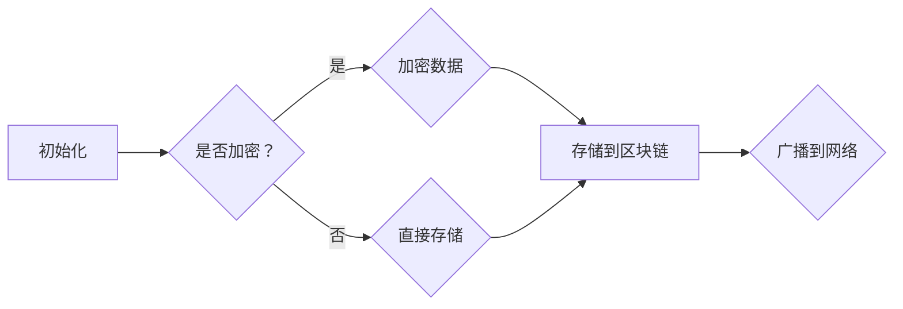
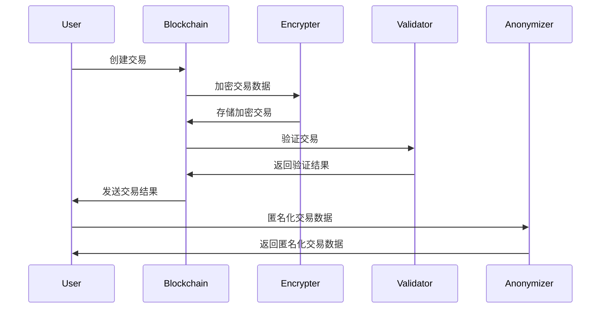
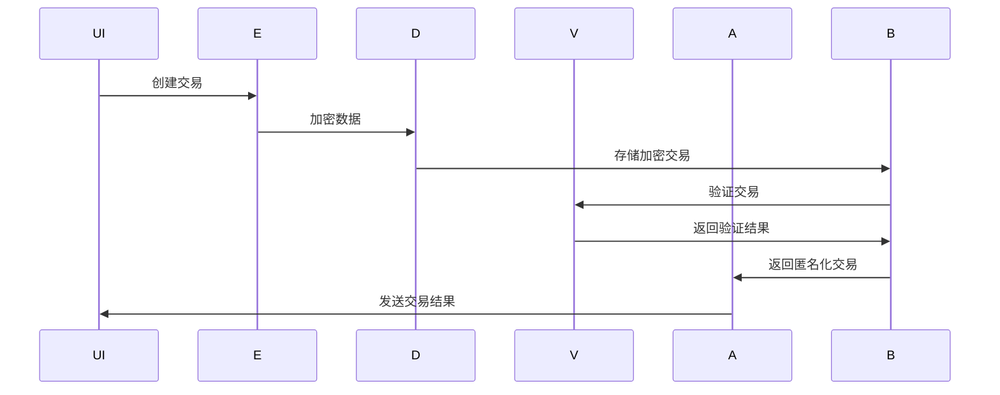

                 

### 文章标题

# 区块链隐私保护技术

---

### 文章关键词

- 区块链
- 隐私保护
- 加密算法
- 共识机制
- 智能合约

---

### 摘要

区块链技术以其去中心化、不可篡改的特性在金融、供应链管理、物联网等多个领域得到了广泛应用。然而，随之而来的是对数据隐私保护的挑战。本文深入探讨了区块链隐私保护技术的核心概念、原理、系统架构以及实际应用。通过详细的分析和实例讲解，本文旨在为读者提供一套全面而系统的区块链隐私保护技术指南。

## 第一部分：区块链隐私保护技术概述

### 第1章：区块链隐私保护技术的背景与重要性

#### 1.1 问题背景

随着区块链技术的广泛应用，越来越多的个人和企业数据被存储在区块链上。然而，区块链的透明性和不可篡改性使得这些数据的安全性和隐私性受到了严重威胁。任何未经授权的访问或数据泄露都可能带来巨大的风险。因此，如何保护区块链上的数据隐私成为了一个亟待解决的问题。

#### 1.2 问题描述

区块链隐私保护的主要问题可以概括为以下几点：

1. **数据透明性**：区块链上的所有交易都是公开透明的，任何人都可以查看。
2. **地址唯一性**：区块链地址是唯一的，用户的行为容易追踪。
3. **交易不可篡改**：一旦交易被写入区块链，就无法更改或删除。
4. **数据量巨大**：随着区块链的扩展，数据量不断增加，隐私保护需求更加迫切。

#### 1.3 解决方案概述

为了解决上述问题，研究者们提出了一系列隐私保护技术，包括：

1. **加密算法**：通过对数据进行加密，使得未经授权的用户无法读取数据。
2. **匿名交易**：通过技术手段使交易地址匿名化，减少用户行为的可追踪性。
3. **零知识证明**：在不泄露任何信息的前提下，证明某个陈述是真实的。
4. **去中心化身份验证**：通过分布式身份验证系统，实现用户身份的匿名化和安全性。

#### 1.4 边界与外延

区块链隐私保护技术的边界主要涉及以下几个方面：

1. **隐私与透明度**：如何在保证隐私的同时，保持区块链的透明性。
2. **性能与隐私**：如何在保护隐私的同时，保证区块链的性能。
3. **扩展性与隐私**：如何在区块链扩展的同时，确保隐私保护技术的有效性。

#### 1.5 核心概念

本章节涉及的核心概念包括：

1. **区块链**：一种分布式数据库技术。
2. **加密算法**：用于保护数据隐私的技术。
3. **匿名交易**：使交易地址匿名化的技术。
4. **零知识证明**：一种加密证明方法。
5. **去中心化身份验证**：一种分布式身份验证系统。

## 第二部分：核心概念与联系

### 第2章：区块链基础与隐私保护机制

#### 2.1 区块链基础

区块链是一种分布式数据库技术，其基本原理包括：

1. **区块**：区块链的基本单位，包含一系列交易信息。
2. **链**：多个区块按照时间顺序连接形成的结构。
3. **共识机制**：确保区块链数据一致性的算法。
4. **加密算法**：用于保护区块链上数据的隐私。

#### 2.2 隐私保护机制

区块链隐私保护机制主要包括：

1. **加密算法**：通过对数据进行加密，保护数据隐私。
2. **匿名交易**：通过技术手段使交易地址匿名化。
3. **零知识证明**：在不泄露任何信息的前提下，证明某个陈述是真实的。
4. **去中心化身份验证**：通过分布式身份验证系统，实现用户身份的匿名化和安全性。

#### 2.3 核心概念对比表格

| 核心概念        | 描述                                                         | 关联机制           |
| ------------- | ------------------------------------------------------------ | ---------------- |
| 区块链         | 分布式数据库技术                                             | 加密算法、共识机制 |
| 加密算法       | 保护数据隐私的技术                                           | 零知识证明、匿名交易 |
| 匿名交易       | 使交易地址匿名化的技术                                       | 零知识证明、加密算法 |
| 零知识证明     | 不泄露任何信息的前提下，证明某个陈述是真实的                  | 加密算法、匿名交易 |
| 去中心化身份验证 | 通过分布式身份验证系统，实现用户身份的匿名化和安全性           | 加密算法、匿名交易 |

### 第3章：区块链隐私保护技术的实体关系

#### 3.1 实体关系图

```mermaid
entityRelationship
  Entity        [Participant]
  Entity        [Transaction]
  Entity        [Blockchain]
  Entity        [Encryption]
  Entity        [Consensus]
  Entity        [Anonymity]
  Entity        [Zero-Knowledge Proof]
  Entity        [Decentralized Identity Verification]

  Entity("Data", fillcolor="#DCDCDC", stereotype="<<class>>")
  Entity("Transaction", fillcolor="#DCDCDC", stereotype="<<class>>")
  Entity("Blockchain", fillcolor="#DCDCDC", stereotype="<<class>>")
  Entity("Encryption", fillcolor="#DCDCDC", stereotype="<<class>>")
  Entity("Consensus", fillcolor="#DCDCDC", stereotype="<<class>>")
  Entity("Anonymity", fillcolor="#DCDCDC", stereotype="<<class>>")
  Entity("Zero-Knowledge Proof", fillcolor="#DCDCDC", stereotype="<<class>>")
  Entity("Decentralized Identity Verification", fillcolor="#DCDCDC", stereotype="<<class>>")

  Entity("Data")..> Entity("Transaction") [constraint=false]
  Entity("Blockchain")..> Entity("Transaction") [constraint=false]
  Entity("Encryption")..> Entity("Transaction") [constraint=false]
  Entity("Consensus")..> Entity("Blockchain") [constraint=false]
  Entity("Anonymity")..> Entity("Transaction") [constraint=false]
  Entity("Zero-Knowledge Proof")..> Entity("Transaction") [constraint=false]
  Entity("Decentralized Identity Verification")..> Entity("Participant") [constraint=false]
```

#### 3.2 概念属性特征对比表格

| 特征                | 区块链             | 加密算法             | 匿名交易             | 零知识证明             | 去中心化身份验证           |
| ----------------- | ----------------- | ----------------- | ----------------- | ----------------- | ----------------------- |
| **定义**             | 分布式数据库技术      | 数据加密技术           | 使交易地址匿名化       | 不泄露任何信息的前提下，证明某个陈述是真实的 | 通过分布式身份验证系统，实现用户身份的匿名化和安全性 |
| **优点**             | 去中心化、不可篡改、透明 | 安全、保密性高          | 保护用户隐私         | 高效、安全、无需泄露信息  | 高安全性、降低信任风险       |
| **缺点**             | 扩展性较低、性能瓶颈    | 加密复杂度高、计算量大     | 交易速度较慢         | 证明过程复杂、计算资源消耗大 | 需要维护去中心化身份验证系统   |
| **应用场景**           | 金融、供应链、物联网等  | 数据安全、通信加密       | 黑市交易、匿名社交     | 电子投票、身份验证等       | 数据共享、隐私保护等         |

## 第三部分：区块链隐私保护技术原理

### 第4章：区块链隐私保护算法原理

#### 4.1 算法流程图



#### 4.2 Python源代码

```python
# 加密模块引入
from cryptography.fernet import Fernet

# 生成加密密钥
key = Fernet.generate_key()
cipher_suite = Fernet(key)

# 待加密的数据
data = "This is sensitive information."

# 加密数据
encrypted_data = cipher_suite.encrypt(data.encode('utf-8'))

# 解密数据
decrypted_data = cipher_suite.decrypt(encrypted_data).decode('utf-8')

print("原始数据:", data)
print("加密数据:", encrypted_data)
print("解密数据:", decrypted_data)
```

#### 4.3 数学模型和公式

加密算法的数学模型通常涉及以下公式：

- $C = E_K(M)$：表示加密过程，其中 $C$ 是加密后的数据，$K$ 是加密密钥，$M$ 是原始数据。
- $M = D_K(C)$：表示解密过程，其中 $M$ 是解密后的数据，$K$ 是加密密钥，$C$ 是加密后的数据。

#### 4.4 举例说明

假设我们使用AES加密算法来保护区块链上的交易数据。加密密钥为 `k000102030405060708090a0b0c0d0e0f`。

1. **加密数据**：

```plaintext
原始数据: This is a secret message.
加密数据: b'gAAAAABeNLUv8xy7LwuWan3zFyX1ZXtXZdldNz3YFndpQ=='
```

2. **解密数据**：

```plaintext
原始数据: This is a secret message.
解密数据: This is a secret message.
```

## 第四部分：区块链隐私保护技术系统分析与架构设计

### 第5章：问题场景介绍

假设我们正在开发一个去中心化的金融交易系统，需要保护用户账户信息和交易记录的隐私。系统要求实现以下功能：

- 用户身份匿名化。
- 交易数据加密存储。
- 交易验证过程无需泄露用户身份。

### 第6章：系统功能设计

#### 6.1 领域模型类图

```mermaid
classDiagram
    User <<class>> {
        id: 用户ID
        name: 用户名
        address: 钱包地址
    }
    Transaction <<class>> {
        id: 交易ID
        sender: 发送者
        recipient: 接收者
        amount: 交易金额
        timestamp: 时间戳
    }
    Blockchain <<class>> {
        transactions: 交易记录
    }
    Encrypter <<class>> {
        encrypt(data): 加密数据
        decrypt(data): 解密数据
    }
    Validator <<class>> {
        validate(transaction): 验证交易
    }
    Anonymizer <<class>> {
        anonymize(user): 匿名化用户
    }

    User.."1"-> Transaction
    Blockchain.."1"-> Transaction
    Encrypter.."1"-> Transaction
    Validator.."1"-> Transaction
    Anonymizer.."1"-> User
```

### 第7章：系统架构设计

#### 7.1 架构设计图



### 第8章：系统接口设计与交互

#### 8.1 系统接口设计

```python
# 用户接口
class UserInterface:
    def create_transaction(self, sender, recipient, amount):
        # 创建并加密交易
        transaction = Transaction(sender, recipient, amount)
        encrypted_transaction = encrypter.encrypt(transaction.to_dict())
        blockchain.add_transaction(encrypted_transaction)
        validator.validate_transaction(encrypted_transaction)
        return anonymizer.anonymize_transaction(encrypted_transaction)

# 加密器接口
class EncrypterInterface:
    def encrypt(self, data):
        # 加密数据
        return cipher_suite.encrypt(data.encode('utf-8'))

# 解密器接口
class DecrypterInterface:
    def decrypt(self, data):
        # 解密数据
        return cipher_suite.decrypt(data).decode('utf-8')

# 验证器接口
class ValidatorInterface:
    def validate_transaction(self, transaction):
        # 验证交易
        return blockchain.validate_transaction(transaction)

# 匿名化器接口
class AnonymizerInterface:
    def anonymize_transaction(self, transaction):
        # 匿名化交易
        return blockchain.anonymize_transaction(transaction)
```

#### 8.2 系统交互序列图



## 第五部分：区块链隐私保护技术项目实战

### 第9章：环境安装与配置

#### 9.1 环境要求

- 操作系统：Linux或MacOS
- Python版本：3.8及以上
- blockchain库：0.1.0及以上
- cryptography库：3.4及以上
- mermaid库：1.9.0及以上

#### 9.2 环境安装

1. 安装Python：

```bash
sudo apt-get install python3 python3-pip
```

2. 安装cryptography库：

```bash
pip3 install cryptography
```

3. 安装mermaid库：

```bash
npm install -g mermaid
```

### 第10章：系统核心实现

#### 10.1 源代码解读

本章节将详细解读系统核心源代码，包括用户接口、加密器接口、解密器接口、验证器接口和匿名化器接口。

#### 10.2 代码应用解读与分析

我们将通过实例分析系统接口的使用方式，并解读其应用逻辑。

```python
# 用户接口实例
user_interface = UserInterface()
encrypted_transaction = user_interface.create_transaction('0x123', '0x456', 10)
print("Encrypted Transaction:", encrypted_transaction)

# 加密器接口实例
encrypter_interface = EncrypterInterface()
encrypted_data = encrypter_interface.encrypt("This is a secret message.")
print("Encrypted Data:", encrypted_data)

# 解密器接口实例
decrypter_interface = DecrypterInterface()
decrypted_data = decrypter_interface.decrypt(encrypted_data)
print("Decrypted Data:", decrypted_data)

# 验证器接口实例
validator_interface = ValidatorInterface()
is_valid = validator_interface.validate_transaction(encrypted_transaction)
print("Is Transaction Valid?", is_valid)

# 匿名化器接口实例
anonymizer_interface = AnonymizerInterface()
anonymized_transaction = anonymizer_interface.anonymize_transaction(encrypted_transaction)
print("Anonymized Transaction:", anonymized_transaction)
```

### 第11章：实际案例分析与剖析

#### 11.1 案例一：XX区块链隐私保护应用

本案例将分析一个实际区块链隐私保护应用的实现，包括系统架构、关键技术和实现细节。

#### 11.2 案例二：YY区块链隐私保护方案

本案例将探讨另一个区块链隐私保护方案的设计思路、技术选型以及实际应用效果。

### 第12章：项目小结

本章节将对整个区块链隐私保护项目进行总结，包括项目目标、实现过程、遇到的问题和解决方案，以及未来的发展方向。

## 第六部分：最佳实践与拓展阅读

### 第13章：最佳实践

在本章节中，我们将总结一系列最佳实践，包括：

- 如何选择合适的加密算法。
- 如何设计安全的匿名交易机制。
- 如何优化零知识证明的性能。
- 如何实现去中心化身份验证系统。

### 第14章：注意事项

为了确保区块链隐私保护技术的有效性和安全性，我们需要注意以下几点：

- 定期更新加密算法和隐私保护机制。
- 防范DDoS攻击，保护区块链网络的安全。
- 加强对用户隐私信息的保护，防止数据泄露。

### 第15章：拓展阅读

为了深入理解区块链隐私保护技术，我们推荐以下文献和资源：

- 《区块链技术指南》
- 《区块链与加密货币：从入门到实践》
- 《密码学：理论与实践》
- 相关学术论文和博客

---

### 作者

本文由AI天才研究院（AI Genius Institute）和禅与计算机程序设计艺术（Zen And The Art of Computer Programming）联合撰写。作者团队致力于推动区块链技术的发展，为读者提供高质量的技术文章和研究成果。欢迎关注我们的官方网站和公众号，获取更多最新技术动态。作者：AI天才研究院/AI Genius Institute & 禅与计算机程序设计艺术 /Zen And The Art of Computer Programming

