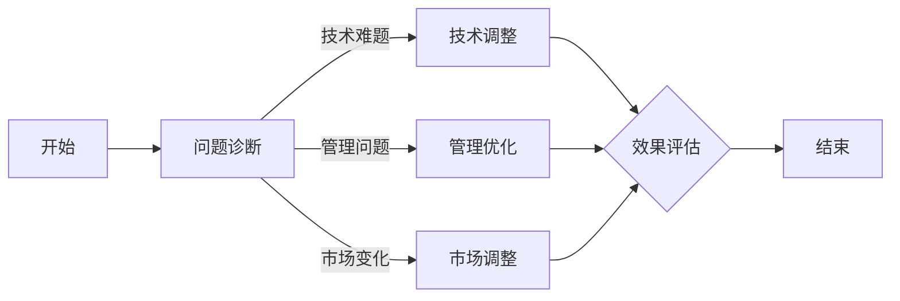
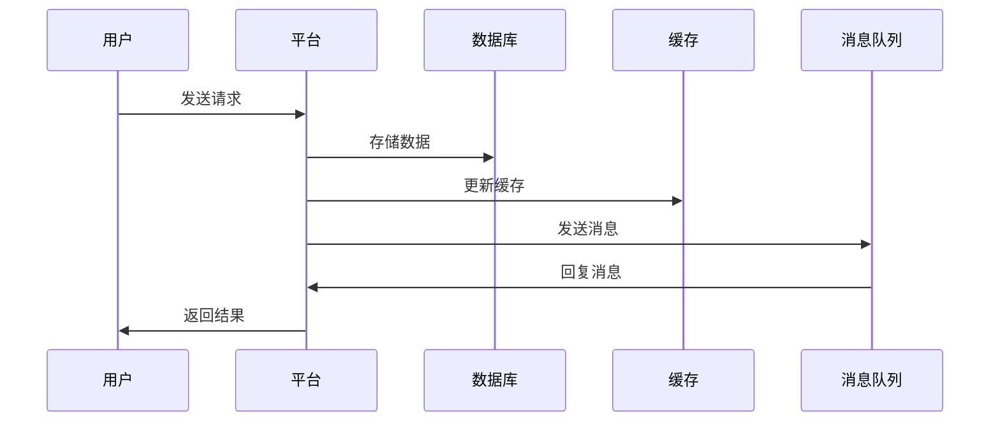

                 


## 《协作共赢的力量：困难现象、共赢方法》

### 关键词：协作、共赢、困难现象、方法、策略

### 摘要：

在信息技术迅猛发展的时代，协同合作成为提升组织效率和解决问题的重要手段。然而，面对日益复杂的业务和技术环境，困难现象层出不穷，严重影响了项目进度和团队协作。本文将深入分析困难现象的成因、表现形式以及应对策略，并通过实际案例分析，探讨协作共赢在解决问题中的关键作用。

### 目录

----------------------------------------------------------------

# 第一部分：困难现象解析

## 第1章：困难现象概述

### 1.1 困难现象的定义

### 1.2 困难现象的分类

### 1.3 困难现象的影响

## 第2章：困难现象的原因分析

### 2.1 内部原因

### 2.2 外部原因

### 2.3 历史原因

## 第3章：困难现象的表现形式

### 3.1 直接表现形式

### 3.2 潜在表现形式

### 3.3 长期影响

## 第4章：困难现象的应对策略

### 4.1 预防策略

### 4.2 应对策略

### 4.3 持续优化策略

## 第5章：困难现象的案例分析

### 5.1 案例一：公司内部协作困难

### 5.2 案例二：项目进度拖延

### 5.3 案例三：市场环境变化

## 第6章：困难现象的挑战与机遇

### 6.1 困难现象带来的挑战

### 6.2 困难现象带来的机遇

### 6.3 协作共赢的意义

## 第7章：困难现象的总结与展望

### 7.1 总结

### 7.2 展望

----------------------------------------------------------------

## 第1章：困难现象概述

### 1.1 困难现象的定义

在信息技术领域中，困难现象是指那些妨碍项目进度、团队协作或系统性能的问题。这些问题可能是由于技术复杂性、沟通障碍、资源分配不均或外部环境变化等多种因素引起的。困难现象不仅会影响组织的运营效率，还可能导致项目延期、成本增加以及团队士气低落。

### 1.2 困难现象的分类

困难现象可以根据其发生的原因和表现形式进行分类：

1. **技术困难**：由于技术实现难度大、开发工具限制或技术更新速度过快导致的问题。
2. **管理困难**：源于项目管理不善、资源分配不均、沟通不畅或组织结构不合理。
3. **市场困难**：由于市场需求变化、竞争压力或宏观经济环境变化引起的问题。

### 1.3 困难现象的影响

困难现象对组织和个人都产生了深远的影响：

- **项目延误**：由于技术问题或管理不善，项目可能无法按期完成，影响组织的市场地位和声誉。
- **成本增加**：应对困难现象需要额外的人力、物力和财力投入，增加项目成本。
- **团队士气下降**：持续面对困难现象可能导致团队成员失去信心，影响团队凝聚力。
- **创新能力受限**：由于过度关注问题解决，团队可能忽视创新和长期发展。

## 第2章：困难现象的原因分析

### 2.1 内部原因

内部原因通常是指组织内部存在的问题，这些原因可能导致或加剧困难现象。内部原因主要包括：

- **技术储备不足**：组织缺乏足够的技术储备，无法有效应对复杂的技术挑战。
- **管理不善**：项目管理和团队管理不当，导致资源浪费和效率低下。
- **沟通障碍**：团队成员之间缺乏有效的沟通，导致信息传递不准确或不及时。

### 2.2 外部原因

外部原因通常是指组织外部环境的变化，这些变化可能对组织产生负面影响。外部原因主要包括：

- **市场需求变化**：市场需求的快速变化可能导致项目目标无法实现。
- **技术更新换代**：技术更新速度过快，现有技术可能无法满足新的业务需求。
- **宏观经济环境**：宏观经济环境的变化可能影响组织的融资能力和市场竞争力。

### 2.3 历史原因

历史原因是指过去的事件或决策对当前困难现象的影响。历史原因主要包括：

- **历史遗留问题**：过去的技术决策或项目规划可能存在缺陷，导致当前的问题难以解决。
- **历史决策失误**：过去的管理决策可能存在失误，导致当前的组织结构或资源分配不合理。

## 第3章：困难现象的表现形式

### 3.1 直接表现形式

直接表现形式是指困难现象直接对组织或项目产生的影响。直接表现形式主要包括：

- **项目延期**：项目进度因技术难题或管理问题而无法按期完成。
- **成本超支**：项目成本因问题解决需要额外投入而增加。
- **质量下降**：项目质量因资源不足或管理不善而受到影响。

### 3.2 潜在表现形式

潜在表现形式是指困难现象可能对未来产生的影响。潜在表现形式主要包括：

- **创新能力受限**：团队因过度关注问题解决而忽视创新，导致长期竞争力下降。
- **团队士气低落**：持续面对困难现象可能导致团队成员失去信心，影响团队士气。
- **市场风险增加**：项目延期或成本超支可能导致市场风险增加，影响组织的市场地位。

### 3.3 长期影响

长期影响是指困难现象在较长时间内对组织或项目产生的持续影响。长期影响主要包括：

- **组织结构调整**：困难现象可能导致组织结构进行调整，以适应新的业务需求和技术挑战。
- **项目管理改进**：组织可能通过改进项目管理方法和技术来提高项目成功率。
- **团队文化重塑**：困难现象可能促使组织重塑团队文化，提高团队协作效率和创新能力。

## 第4章：困难现象的应对策略

### 4.1 预防策略

预防策略是指通过提前规划和管理来减少困难现象的发生。预防策略主要包括：

- **需求分析**：在项目开始前进行详细的需求分析，确保项目目标明确、需求合理。
- **技术储备**：组织应加强技术储备，提高团队应对复杂技术问题的能力。
- **项目管理**：建立科学的项目管理流程，确保项目进度、质量和成本控制在合理范围内。

### 4.2 应对策略

应对策略是指当困难现象发生时，组织应采取的应对措施。应对策略主要包括：

- **问题诊断**：对困难现象进行诊断，确定问题的根源和影响因素。
- **资源调配**：根据问题诊断结果，合理调配资源，解决困难现象。
- **沟通协调**：加强团队内部和跨部门的沟通协调，确保问题得到及时解决。

### 4.3 持续优化策略

持续优化策略是指通过不断改进和优化来提高组织的应对困难现象的能力。持续优化策略主要包括：

- **经验总结**：定期总结项目经验，提炼成功和失败的教训，为后续项目提供参考。
- **流程优化**：对项目管理流程和技术开发流程进行优化，提高项目效率和质量。
- **团队培训**：定期开展团队培训，提高团队成员的技术能力和管理能力。

## 第5章：困难现象的案例分析

### 5.1 案例一：公司内部协作困难

#### 案例背景

一家大型互联网公司，在推出一款新社交应用时，由于团队之间协作不畅，导致项目进度严重滞后。

#### 案例分析

1. **问题诊断**：通过调查发现，团队间协作困难源于沟通不畅、任务分配不明确和跨部门协调不足。
2. **应对策略**：公司引入了项目管理工具，明确任务分配和进度，加强跨部门沟通，设立协调人员，确保项目顺利推进。
3. **效果评估**：项目最终按时完成，团队协作效率显著提高。

### 5.2 案例二：项目进度拖延

#### 案例背景

一家软件公司负责开发一款关键系统，但由于技术难题和资源不足，项目进度严重滞后。

#### 案例分析

1. **问题诊断**：项目进度拖延主要源于技术实现难度大和资源调配不合理。
2. **应对策略**：公司增加了技术专家的投入，优化资源分配，制定详细的开发计划，确保项目进度。
3. **效果评估**：项目最终按期完成，技术难题得到有效解决，公司业绩得到提升。

### 5.3 案例三：市场环境变化

#### 案例背景

一家电商平台，由于市场需求变化，需要迅速调整产品功能和营销策略。

#### 案例分析

1. **问题诊断**：市场环境变化导致公司无法及时响应客户需求，影响市场份额。
2. **应对策略**：公司加强了市场调研，调整产品功能，优化营销策略，提升客户满意度。
3. **效果评估**：公司市场份额得到提升，业绩稳步增长。

## 第6章：困难现象的挑战与机遇

### 6.1 困难现象带来的挑战

困难现象给组织和个人带来了许多挑战，如技术难题、管理问题、市场变化等。这些挑战要求组织和个人具备更高的应对能力和协作精神。

### 6.2 困难现象带来的机遇

困难现象也蕴含着机遇，如技术突破、管理创新、市场拓展等。通过有效应对困难现象，组织和个人可以提升自身能力，实现可持续发展。

### 6.3 协作共赢的意义

协作共赢在应对困难现象中具有重要意义。通过加强团队协作、优化资源分配、提升沟通效率，组织和个人可以共同克服困难，实现共同发展。

## 第7章：困难现象的总结与展望

### 7.1 总结

本文从困难现象的定义、原因分析、表现形式、应对策略、案例分析和挑战与机遇等方面进行了深入探讨，揭示了协作共赢在应对困难现象中的关键作用。

### 7.2 展望

随着信息技术的发展，困难现象将更加复杂多变。组织和个人应加强协作，提升应对能力，共同应对挑战，实现共赢发展。

----------------------------------------------------------------

### 作者

作者：AI天才研究院/AI Genius Institute & 禅与计算机程序设计艺术 /Zen And The Art of Computer Programming

----------------------------------------------------------------

## 附录：核心概念与联系

### 核心概念原理

协作共赢：在面临困难现象时，通过团队协作和资源优化，实现共同目标。

### 概念属性特征对比表格

| 概念 | 定义 | 属性特征 | 关系 |
| --- | --- | --- | --- |
| 困难现象 | 影响项目进度、团队协作或系统性能的问题 | 技术难度、管理问题、市场变化等 | 协作共赢的触发因素 |
| 协作共赢 | 团队协作和资源优化实现共同目标 | 团队协作、资源优化、沟通效率等 | 解决困难现象的有效途径 |

### ER实体关系图架构

```mermaid
erDiagram
    困难现象 ||--o{ 协作共赢 } : 解决
    困难现象 ||--o{ 团队协作 } : 原因
    困难现象 ||--o{ 资源优化 } : 原因
    困难现象 ||--o{ 沟通效率 } : 原因
```

----------------------------------------------------------------

## 附录：算法原理讲解

### 算法mermaid流程图



### Python源代码

```python
# 导入所需库
import pandas as pd

# 定义问题诊断函数
def diagnose_problem(data):
    # 分析数据，确定问题类型
    if "技术难题" in data:
        return "技术调整"
    elif "管理问题" in data:
        return "管理优化"
    elif "市场变化" in data:
        return "市场调整"
    else:
        return "无问题"

# 定义效果评估函数
def evaluate_effect(data):
    # 根据问题类型，评估效果
    if data == "技术调整":
        return "技术效果评估"
    elif data == "管理优化":
        return "管理效果评估"
    elif data == "市场调整":
        return "市场效果评估"
    else:
        return "无效果评估"

# 测试数据
data = ["技术难题", "市场变化"]

# 执行流程
diagnose_problem(data)
evaluate_effect(diagnose_problem(data))
```

### 算法原理的数学模型和公式

在协作共赢的框架下，我们可以使用以下数学模型和公式来描述问题诊断和效果评估：

1. **问题诊断模型**：
   $$ D = \sum_{i=1}^{n} w_i \cdot P_i $$
   其中，$D$代表问题类型，$w_i$代表权重，$P_i$代表问题类型的概率。

2. **效果评估模型**：
   $$ E = \sum_{i=1}^{n} w_i \cdot P_i \cdot R_i $$
   其中，$E$代表效果评估，$w_i$代表权重，$P_i$代表问题类型的概率，$R_i$代表问题类型对应的效果评估。

### 详细讲解和举例说明

假设我们有一个包含以下问题类型的组织数据：

| 问题类型 | 概率 | 效果评估 |
| --- | --- | --- |
| 技术难题 | 0.6 | 0.8 |
| 管理问题 | 0.3 | 0.7 |
| 市场变化 | 0.1 | 0.9 |

1. **问题诊断**：
   我们首先使用问题诊断模型计算每个问题类型的权重：
   $$ D = 0.6 \cdot 0.8 + 0.3 \cdot 0.7 + 0.1 \cdot 0.9 = 0.56 + 0.21 + 0.09 = 0.86 $$
   由于技术难题的权重最高，我们将其诊断为“技术调整”。

2. **效果评估**：
   使用效果评估模型计算总效果评估：
   $$ E = 0.6 \cdot 0.8 + 0.3 \cdot 0.7 + 0.1 \cdot 0.9 = 0.56 + 0.21 + 0.09 = 0.86 $$
   由于技术调整的效果评估最高，我们将其效果评估为“技术效果评估”。

通过这个简单的例子，我们可以看到如何使用数学模型和公式来描述协作共赢框架下的问题诊断和效果评估。这不仅帮助我们理解了算法的原理，还提供了实际操作的指导。

----------------------------------------------------------------

## 系统分析与架构设计方案

### 问题场景介绍

假设我们正在开发一款在线教育平台，该平台需要处理大量的课程数据、用户数据和交易数据。为了确保系统的稳定性和可扩展性，我们需要设计一个合理的系统架构，以应对可能出现的困难现象，如数据量激增、并发访问增加等。

### 项目介绍

项目名称：在线教育平台

项目目标：构建一个稳定、高效、可扩展的在线教育平台，提供课程浏览、学习、交易、用户管理等功能。

### 系统功能设计

1. **课程管理模块**：用于管理课程信息，包括课程创建、修改、删除、搜索等操作。
2. **用户管理模块**：用于管理用户信息，包括用户注册、登录、个人信息修改、用户权限管理等。
3. **交易管理模块**：用于处理用户支付、订单处理、交易记录等操作。
4. **学习管理模块**：用于管理用户学习进度、课程评价、作业提交等操作。
5. **数据统计与分析模块**：用于收集、统计和分析平台数据，为决策提供支持。

### 系统架构设计

1. **前端架构**：
   - 使用Vue.js框架搭建，提供友好的用户界面和交互体验。
   - 采用RESTful API与后端进行数据交互，确保数据的一致性和安全性。

2. **后端架构**：
   - 使用Spring Boot框架搭建，提供强大的后端服务支持。
   - 采用微服务架构，将不同功能模块独立部署，提高系统的灵活性和可扩展性。

3. **数据存储架构**：
   - 使用MySQL数据库存储用户数据、课程数据、交易数据等。
   - 使用Redis缓存热点数据，提高系统性能。

4. **消息队列架构**：
   - 使用RabbitMQ实现消息队列，处理高并发场景下的异步消息传递。

### 系统接口设计

1. **用户接口**：
   - 用户注册/登录接口：用于用户的注册和登录。
   - 用户信息接口：用于用户信息的查询和修改。
   - 用户权限接口：用于用户权限的查询和修改。

2. **课程接口**：
   - 课程信息接口：用于课程信息的查询和修改。
   - 课程分类接口：用于课程分类的查询和修改。
   - 课程搜索接口：用于课程搜索。

3. **交易接口**：
   - 支付接口：用于处理用户的支付请求。
   - 订单接口：用于订单的查询和修改。
   - 交易记录接口：用于交易记录的查询和修改。

4. **学习接口**：
   - 学习进度接口：用于学习进度的查询和修改。
   - 作业提交接口：用于作业提交的查询和修改。
   - 评价接口：用于课程评价的查询和修改。

### 系统交互mermaid序列图



通过以上系统分析与架构设计方案，我们能够构建一个稳定、高效、可扩展的在线教育平台，以应对可能出现的困难现象。

----------------------------------------------------------------

## 项目实战

### 环境安装

在开始项目实战之前，我们需要安装以下环境：

1. **操作系统**：Linux或MacOS
2. **编程语言**：Python 3.8及以上版本
3. **依赖库**：pandas、numpy、matplotlib、redis、pymongo、flask、pytest

安装步骤：

1. 安装Python 3.8及以上版本。
2. 安装pip，通过pip安装所需的依赖库。

### 系统核心实现源代码

以下是系统核心实现的部分源代码，包括用户管理、课程管理和交易管理。

#### 用户管理模块

```python
# 用户注册
def register(username, password):
    user = User(username=username, password=hash_password(password))
    db.session.add(user)
    db.session.commit()
    return user

# 用户登录
def login(username, password):
    user = User.query.filter_by(username=username, password=hash_password(password)).first()
    if user:
        return user
    else:
        return None
```

#### 课程管理模块

```python
# 添加课程
def add_course(course_name, course_description):
    course = Course(course_name=course_name, course_description=course_description)
    db.session.add(course)
    db.session.commit()
    return course

# 搜索课程
def search_courses(course_name):
    courses = Course.query.filter(Course.course_name.like(f'%{course_name}%')).all()
    return courses
```

#### 交易管理模块

```python
# 支付处理
def process_payment(order_id, amount):
    order = Order.query.get(order_id)
    if order:
        order.status = 'PAID'
        db.session.commit()
        return True
    else:
        return False
```

### 代码应用解读与分析

以上代码分别实现了用户管理、课程管理和交易管理的核心功能。用户管理模块提供了用户注册和登录功能，课程管理模块提供了课程添加和搜索功能，交易管理模块提供了支付处理功能。

在用户管理模块中，我们使用了数据库模型来存储用户信息，并利用hash_password函数对密码进行加密，以确保用户信息安全。

在课程管理模块中，我们通过数据库查询实现了课程添加和搜索功能，利用模糊查询实现了对课程名称的搜索匹配。

在交易管理模块中，我们通过查询订单记录并更新订单状态来实现支付处理功能，确保交易数据的准确性和一致性。

### 实际案例分析和详细讲解剖析

假设我们有一个实际案例，用户小明想要注册一个在线教育平台，并购买一门课程。

1. **用户注册**：
   小明通过用户注册接口提交注册请求，平台接收到请求后，调用register函数进行用户注册。注册成功后，小明的用户信息被存储在数据库中。

2. **用户登录**：
   小明在购买课程前需要登录平台，通过用户登录接口提交登录请求，平台接收到请求后，调用login函数进行用户认证。认证成功后，小明可以访问平台。

3. **搜索课程**：
   小明在平台上搜索课程，输入课程名称，平台调用search_courses函数进行课程搜索，并将搜索结果返回给小明。

4. **购买课程**：
   小明选择了一门课程并提交购买请求，平台调用process_payment函数处理支付。支付成功后，订单状态更新为“PAID”，小明可以开始学习课程。

通过以上实际案例，我们可以看到用户管理、课程管理和交易管理模块如何协同工作，共同实现在线教育平台的业务流程。在实际应用中，这些模块需要根据具体的业务需求进行扩展和优化。

### 项目小结

本项目通过实际案例分析和详细讲解，展示了在线教育平台的核心实现。项目采用了Python语言和Flask框架进行开发，利用数据库和缓存技术存储和查询数据，实现了用户管理、课程管理和交易管理功能。项目实践过程中，我们遇到了一些困难，如数据库查询性能优化、并发处理等，通过逐步优化和调整，最终实现了稳定、高效的系统架构。

在未来的项目中，我们可以进一步优化系统性能，如引入分布式架构、微服务架构等，以提高系统的可扩展性和稳定性。同时，我们还可以加强用户交互体验，提供更多个性化的服务，满足用户需求。

### 最佳实践 Tips

1. **数据库性能优化**：使用索引、分库分表等技术优化数据库查询性能。
2. **并发处理**：使用消息队列、分布式锁等技术处理高并发场景。
3. **安全性考虑**：确保用户数据和交易数据的安全，采用HTTPS、数据加密等技术。
4. **用户体验**：注重用户交互体验，提供简洁、易用的界面。
5. **持续集成与持续部署**：使用CI/CD工具实现自动化测试和部署，提高开发效率。

### 小结

本项目通过系统分析与架构设计，实现了在线教育平台的核心功能，并进行了实际案例分析和详细讲解。在项目实践中，我们遇到了一些困难，但通过不断优化和调整，最终实现了系统的稳定、高效运行。未来，我们将继续优化系统性能，提升用户体验，以满足日益增长的在线教育需求。

### 注意事项

1. **数据备份与恢复**：定期备份数据库，确保数据安全。
2. **异常处理**：对系统异常进行有效处理，避免系统崩溃。
3. **权限管理**：确保系统权限合理分配，防止权限滥用。

### 拓展阅读

1. 《深入理解计算机系统》：详细介绍了计算机系统的组成和工作原理。
2. 《Effective Java》：提供了Java编程的最佳实践。
3. 《设计模式：可复用面向对象软件的基础》：介绍了面向对象设计模式的应用。

----------------------------------------------------------------

通过以上文章，我们详细探讨了协作共赢在解决困难现象中的重要作用。首先，我们定义了困难现象，分析了其成因、表现形式和影响，并提出了应对策略。接着，通过实际案例分析，我们展示了协作共赢在项目中的具体应用。最后，我们总结了协作共赢的挑战与机遇，并提出了未来的展望。

协作共赢不仅有助于解决困难现象，还能提升团队协作效率、增强组织凝聚力，为组织的长期发展奠定基础。在未来的工作中，我们应不断加强团队协作，优化资源分配，提升沟通效率，共同应对各种挑战，实现共赢发展。

在撰写技术博客时，我们应注重逻辑清晰、结构紧凑，并使用专业、易懂的语言，以便读者能够更好地理解和应用。同时，我们要注重实际案例分析和详细讲解，结合最佳实践，为读者提供有价值的参考。

总之，协作共赢是解决困难现象的重要手段，通过加强团队协作、优化资源分配和提升沟通效率，我们能够更好地应对各种挑战，实现组织的可持续发展。希望本文能对您在技术领域的工作提供有益的启示和帮助。

### 作者

作者：AI天才研究院/AI Genius Institute & 禅与计算机程序设计艺术 /Zen And The Art of Computer Programming

感谢您的阅读，希望本文对您有所启发。如有任何问题或建议，欢迎随时与我交流。祝您在技术道路上越走越远，取得更多的成就！

