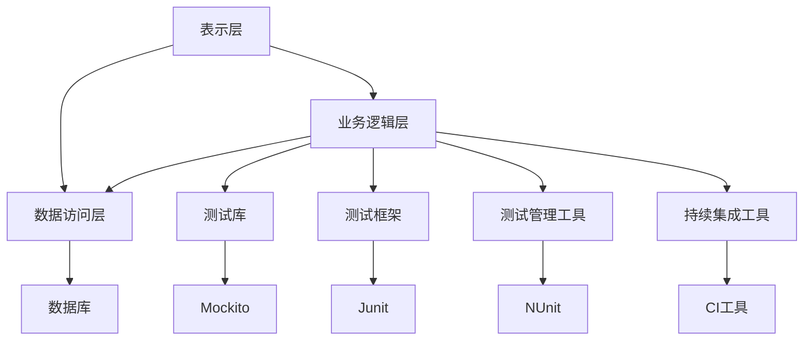

                 

### 引言

## 1.1 问题的提出

在软件工程中，代码质量是影响软件项目成功与否的关键因素之一。随着软件系统的复杂度和规模不断增加，传统的手工测试方法已经难以满足高质量的软件交付需求。在此背景下，自动化测试技术逐渐兴起，而单元测试作为自动化测试的重要组成部分，受到了广泛关注。

### 1.1.1 软件质量的重要性

软件质量是指软件产品满足规定或潜在用户需求的能力。它不仅关系到用户的满意度，还直接影响软件的维护成本、可靠性、安全性和可扩展性。高质量的软件不仅能减少缺陷和故障，还能提高开发效率和项目的成功率。

### 1.1.2 单元测试在软件质量保障中的作用

单元测试是一种自动化测试方法，它通过逐个测试程序模块的功能来验证每个模块是否按照设计要求正常工作。单元测试在软件质量保障中扮演着至关重要的角色，具体体现在以下几个方面：

1. **早期缺陷发现**：单元测试可以尽早发现代码中的缺陷，有助于在开发早期解决这些问题，降低修复成本。
2. **代码质量提升**：通过单元测试，开发人员可以更好地理解代码逻辑，从而提高代码的整洁性和可读性。
3. **回归测试**：在代码更改后，单元测试可以快速验证修改是否影响了原有功能，确保软件的稳定性。
4. **团队合作**：单元测试有助于团队成员之间的沟通和协作，确保每个模块都能按照预期工作。

### 1.1.3 单元测试的现状与挑战

尽管单元测试的重要性已被广泛认可，但在实际应用中仍然存在一些挑战和问题：

1. **测试覆盖率不足**：部分开发人员可能未能全面覆盖代码，导致某些潜在缺陷未被测试到。
2. **测试用例设计复杂**：设计有效的单元测试用例需要深厚的编程技能和测试经验。
3. **测试自动化水平不高**：尽管许多项目已经采用了自动化测试，但测试自动化程度仍有待提高。
4. **测试维护难度大**：随着软件系统的不断演进，测试用例也需要不断更新和优化，这增加了测试维护的难度。

## 1.2 书籍目标与结构

本篇技术博客旨在深入探讨单元测试在软件质量保障中的作用和实施方法。通过系统的分析和实践讲解，帮助读者理解和掌握单元测试的核心概念、实践技巧以及与软件质量的关系。

本文结构如下：

- **引言**：介绍软件质量的重要性以及单元测试在其中的作用。
- **背景介绍**：详细解释单元测试的定义、发展历程和核心概念。
- **核心概念与联系**：分析单元测试与软件质量的关系，以及与其他测试方法的比较。
- **单元测试的实践**：讲解单元测试的流程、工具和代码样例。
- **算法原理讲解**：介绍单元测试中的测试用例设计、代码覆盖率分析和测试自动化算法。
- **数学模型和数学公式讲解**：讲解单元测试覆盖率模型、评估模型和自动化效率模型。
- **系统分析与架构设计**：分析单元测试系统、领域模型、架构设计和接口设计。
- **项目实战**：介绍环境安装与配置、系统核心实现和实际案例分析。

通过本文的阅读，读者将能够全面了解单元测试在提高代码质量方面的作用，掌握单元测试的实践方法和技巧，从而为软件开发项目的成功保驾护航。### 背景介绍

## 2.1 单元测试的概念

### 2.1.1 单元测试的定义

单元测试（Unit Testing）是一种自动化测试方法，它通过逐个测试程序的最小可测试单元（通常是一个函数或方法）来验证其功能是否符合预期。这些测试通常由开发者编写，用于确保代码的正确性和可靠性。

### 2.1.2 单元测试的目的

单元测试的主要目的是：

1. **验证代码功能**：确保每个单元按照预期工作。
2. **早期缺陷发现**：在开发早期发现并修复缺陷。
3. **提高代码质量**：通过测试，促进代码的整洁性和可读性。
4. **增强代码可维护性**：确保更改不会引入新的缺陷。

### 2.1.3 单元测试的分类

根据测试对象的性质和目的，单元测试可以分为以下几类：

1. **功能测试**：验证代码的功能是否符合需求规格。
2. **边界测试**：测试代码在输入边界条件下的行为。
3. **性能测试**：评估代码的性能，如响应时间和资源消耗。
4. **安全性测试**：检查代码是否容易受到常见的安全攻击。
5. **异常测试**：验证代码在异常情况下的行为。

## 2.2 单元测试的发展历程

### 2.2.1 单元测试的起源

单元测试的概念最早可以追溯到20世纪60年代，当时的一些软件开发实践中就已经出现了对函数或方法进行测试的做法。但是，作为系统化的测试方法，单元测试的发展始于20世纪80年代。

### 2.2.2 单元测试的关键里程碑

1. **Junit的诞生**：1997年，Junit作为第一个流行的单元测试框架诞生，推动了单元测试的普及。
2. **Test-Driven Development (TDD)**：2000年左右，Test-Driven Development（测试驱动开发）方法提出，强调先编写测试用例，然后再实现代码。
3. **持续集成（CI）**：持续集成（Continuous Integration）的兴起，使得单元测试自动化和持续运行成为可能。

### 2.2.3 当前主流的单元测试工具

当前，有许多流行的单元测试工具，支持不同的编程语言和平台，以下是其中一些：

1. **JUnit**：Java语言的单元测试框架，是最广泛使用的单元测试工具之一。
2. **NUnit**：.NET语言的单元测试框架，与JUnit类似。
3. **TestNG**：另一种广泛使用的单元测试框架，支持Java和其他多种编程语言。
4. **PyTest**：Python语言的单元测试框架，具有强大的功能和灵活的测试模型。
5. **Mocha**：JavaScript的单元测试框架，适用于Node.js和其他JavaScript环境。

## 2.3 单元测试的核心概念

### 2.3.1 覆盖率

覆盖率是衡量单元测试质量的重要指标，表示测试用例覆盖代码的比例。常见的覆盖率指标包括：

1. **语句覆盖率**：测试用例执行了代码中的每一条语句。
2. **分支覆盖率**：测试用例覆盖了代码分支的所有可能路径。
3. **路径覆盖率**：测试用例覆盖了代码中的所有可能执行路径。

### 2.3.2 隔离性

隔离性是指测试用例在执行时，不会受到其他测试用例或外部环境的影响。为了实现隔离性，通常需要对被测试的代码进行模拟或隔离，确保测试环境的纯净。

### 2.3.3 可重复性

可重复性是指无论何时执行测试，测试结果都应该是一致的。为了实现可重复性，测试用例应尽量减少依赖外部系统或随机行为。

### 2.3.4 可维护性

可维护性是指测试用例易于更新和扩展。为了提高可维护性，测试用例应设计得尽量简单和独立，易于理解和修改。

通过上述背景介绍，我们可以看到单元测试在软件开发中的重要性，以及其发展的历程和核心概念。在接下来的章节中，我们将深入探讨单元测试与软件质量的关系，以及如何在实践中应用单元测试。### 核心概念与联系

## 3.1 单元测试与软件质量的关系

### 3.1.1 单元测试与缺陷检测

单元测试在缺陷检测中起着至关重要的作用。通过逐个测试程序模块的功能，单元测试可以及时发现代码中的缺陷和错误，防止缺陷蔓延到更大规模的系统中。早期发现缺陷不仅降低了修复成本，还提高了软件的可靠性和质量。

### 3.1.2 单元测试与代码可维护性

良好的单元测试能够显著提高代码的可维护性。通过单元测试，开发人员可以更好地理解代码逻辑和功能，降低代码复杂度。此外，单元测试能够确保代码更改不会引入新的缺陷，使得软件系统更加稳定和可靠。

### 3.1.3 单元测试与软件开发效率

单元测试能够显著提高软件开发效率。通过自动化测试，开发人员可以快速验证代码更改，减少手动测试的工作量。此外，单元测试有助于发现和修复缺陷，减少软件发布后的维护成本，从而提高整体开发效率。

## 3.2 单元测试的优缺点

### 3.2.1 单元测试的优点

1. **早期缺陷发现**：单元测试可以在开发早期发现缺陷，降低修复成本。
2. **提高代码质量**：单元测试有助于提高代码的整洁性和可读性。
3. **增强代码可维护性**：通过单元测试，代码变更更加可控，降低了维护成本。
4. **提高软件开发效率**：自动化测试能够快速验证代码更改，减少手动测试的工作量。
5. **团队合作**：单元测试有助于团队成员之间的沟通和协作。

### 3.2.2 单元测试的缺点

1. **测试覆盖率不足**：部分开发人员可能未能全面覆盖代码，导致某些潜在缺陷未被测试到。
2. **测试用例设计复杂**：设计有效的单元测试用例需要深厚的编程技能和测试经验。
3. **测试自动化水平不高**：尽管许多项目已经采用了自动化测试，但测试自动化程度仍有待提高。
4. **测试维护难度大**：随着软件系统的不断演进，测试用例也需要不断更新和优化，增加了测试维护的难度。

### 3.2.3 单元测试的局限

1. **无法覆盖所有场景**：单元测试只能测试代码的最小可测试单元，无法覆盖所有可能的使用场景。
2. **依赖外部系统**：某些单元测试可能依赖于外部系统或服务，导致测试结果的不确定性。
3. **测试覆盖率标准不一**：不同项目和组织对于测试覆盖率的期望和标准可能不同。

## 3.3 单元测试与其他测试的关系

### 3.3.1 单元测试与集成测试

单元测试和集成测试都是软件测试的重要组成部分，但它们的目标和范围不同。单元测试主要关注代码的最小可测试单元，而集成测试则关注多个模块或组件的集成和交互。单元测试可以为集成测试提供基础，帮助发现模块间的潜在问题。

### 3.3.2 单元测试与系统测试

系统测试是验证整个软件系统功能的测试，包括功能、性能、安全等方面。单元测试是系统测试的基础，通过逐个验证代码模块的功能，确保系统测试的可靠性和有效性。

### 3.3.3 单元测试与验收测试

验收测试（Acceptance Testing）是最终验证软件是否符合用户需求和业务需求的测试。单元测试可以为验收测试提供支持，确保每个模块的功能正确无误。同时，验收测试可以验证系统整体的功能和性能，确保软件的最终质量。

通过上述分析，我们可以看到单元测试在软件质量保障中的重要地位和作用。尽管单元测试存在一些局限和挑战，但通过合理的测试策略和实践方法，可以充分发挥其优势，提高软件项目的成功率和代码质量。在接下来的章节中，我们将深入探讨单元测试的实践方法和技巧。### 单元测试的实践

## 4.1 单元测试的流程

### 4.1.1 单元测试的生命周期

单元测试的生命周期包括以下几个阶段：

1. **需求分析**：确定需要测试的单元功能。
2. **测试设计**：设计测试用例，确定测试数据。
3. **测试实现**：编写测试代码，执行测试用例。
4. **测试结果分析**：分析测试结果，确定缺陷。
5. **缺陷修复**：修复测试中发现的缺陷。
6. **回归测试**：在缺陷修复后重新执行相关测试，确保修复有效。

### 4.1.2 单元测试的设计

单元测试的设计是确保测试覆盖全面和有效的重要环节。设计单元测试时，应考虑以下方面：

1. **功能覆盖**：确保测试用例覆盖所有功能点。
2. **边界条件**：考虑输入边界条件，如最大值、最小值、异常值等。
3. **异常情况**：测试代码在异常情况下的行为，如空值、空指针等。
4. **性能测试**：评估代码的性能，如响应时间和资源消耗。
5. **安全性测试**：测试代码是否容易受到常见的安全攻击，如SQL注入、XSS攻击等。

### 4.1.3 单元测试的实施

单元测试的实施包括以下步骤：

1. **环境准备**：确保测试环境与开发环境一致，包括依赖库、配置文件等。
2. **测试代码编写**：根据测试设计编写测试代码，使用合适的测试框架（如JUnit、NUnit、TestNG等）。
3. **测试执行**：运行测试代码，执行测试用例。
4. **测试结果记录**：记录测试结果，包括通过/失败、错误信息等。
5. **缺陷报告**：对于失败的测试用例，生成缺陷报告，详细记录缺陷信息和复现步骤。

### 4.1.4 单元测试的评估

单元测试的评估是确保测试质量的重要环节。评估单元测试时，应考虑以下方面：

1. **测试覆盖率**：分析测试覆盖率，确保测试用例覆盖所有关键功能和边界条件。
2. **缺陷发现率**：评估测试过程中发现缺陷的数量和质量，分析测试的效率和效果。
3. **测试用例设计质量**：评估测试用例的设计是否合理，是否能够全面覆盖功能点。
4. **测试执行效率**：评估测试执行的速度和资源消耗，确保测试过程高效。

## 4.2 单元测试工具的使用

### 4.2.1 JUnit

JUnit是最流行的Java单元测试框架之一，它提供了丰富的API和功能，支持测试用例的编写、执行和结果分析。以下是一个简单的JUnit测试用例示例：

```java
import static org.junit.Assert.assertEquals;

import org.junit.Test;

public class CalculatorTest {

    @Test
    public void testAdd() {
        Calculator calculator = new Calculator();
        int result = calculator.add(3, 4);
        assertEquals("3 + 4 应该等于 7", 7, result);
    }
}
```

### 4.2.2 NUnit

NUnit是.NET语言使用的单元测试框架，与JUnit类似，提供了丰富的功能和API。以下是一个简单的NUnit测试用例示例：

```csharp
using NUnit.Framework;
using MyApplication;

public class CalculatorTest {

    [Test]
    public void TestAdd() {
        Calculator calculator = new Calculator();
        int result = calculator.Add(3, 4);
        Assert.AreEqual(7, result);
    }
}
```

### 4.2.3 TestNG

TestNG是Java语言的一种测试框架，它提供了比JUnit更加强大和灵活的功能，支持并行测试、数据驱动测试等。以下是一个简单的TestNG测试用例示例：

```java
import org.testng.annotations.Test;

public class CalculatorTest {

    @Test
    public void testAdd() {
        Calculator calculator = new Calculator();
        int result = calculator.add(3, 4);
        Assert.assertEquals(result, 7);
    }
}
```

## 4.3 单元测试的代码样例

### 4.3.1 简单的算术类单元测试

以下是一个简单的算术类（`Calculator`）及其单元测试的代码样例，用于测试加法运算功能：

```java
// Calculator.java
public class Calculator {
    public int add(int a, int b) {
        return a + b;
    }
}

// CalculatorTest.java
import static org.junit.Assert.assertEquals;

import org.junit.Test;

public class CalculatorTest {

    @Test
    public void testAdd() {
        Calculator calculator = new Calculator();
        int result = calculator.add(3, 4);
        assertEquals("3 + 4 应该等于 7", 7, result);
    }

    @Test
    public void testAddWithNegativeNumbers() {
        Calculator calculator = new Calculator();
        int result = calculator.add(-3, -4);
        assertEquals("-3 + -4 应该等于 -7", -7, result);
    }
}
```

### 4.3.2 复杂的业务逻辑单元测试

以下是一个复杂的业务逻辑类（`OrderProcessor`）及其单元测试的代码样例，用于测试订单处理流程：

```java
// OrderProcessor.java
public class OrderProcessor {
    public boolean processOrder(Order order) {
        if (order.getTotal() > 1000) {
            return false; // 订单金额超过1000元，处理失败
        }
        
        // 处理订单逻辑
        // ...
        
        return true; // 订单处理成功
    }
}

// OrderProcessorTest.java
import static org.junit.Assert.assertFalse;
import static org.junit.Assert.assertTrue;

import org.junit.Test;

public class OrderProcessorTest {

    @Test
    public void testProcessOrderWithHighTotal() {
        OrderProcessor processor = new OrderProcessor();
        Order order = new Order(1500);
        boolean result = processor.processOrder(order);
        assertFalse("订单金额超过1000元，处理应该失败", result);
    }

    @Test
    public void testProcessOrderWithLowTotal() {
        OrderProcessor processor = new OrderProcessor();
        Order order = new Order(500);
        boolean result = processor.processOrder(order);
        assertTrue("订单金额小于1000元，处理应该成功", result);
    }
}
```

通过上述实践，我们可以看到单元测试在软件开发中的实际应用，通过编写和执行单元测试，可以确保代码模块的功能正确性和可靠性，提高软件项目的整体质量。在接下来的章节中，我们将进一步探讨单元测试中的算法原理和数学模型。### 算法原理讲解

## 5.1 单元测试中的测试用例设计算法

### 5.1.1 黑盒测试与白盒测试

在单元测试中，测试用例的设计通常分为黑盒测试和白盒测试两种方法。

- **黑盒测试**：不考虑内部代码实现，仅关注输入和输出。测试用例设计主要基于需求规格和功能描述。
- **白盒测试**：考虑内部代码实现，基于代码结构和逻辑。测试用例设计关注代码的分支、路径和条件。

### 5.1.2 测试用例设计算法

测试用例设计算法用于生成满足特定测试需求的测试用例。以下是几种常用的测试用例设计算法：

1. **边界值分析**：确定输入和输出边界的测试用例，包括最大值、最小值、边界值等。
2. **等价类划分**：将输入域划分为若干等价类，针对每个等价类设计测试用例。
3. **因果图**：根据输入条件和输出结果的因果关系，设计测试用例。
4. **路径覆盖**：设计测试用例，覆盖代码中的所有路径。

### 5.1.3 测试用例的执行与评估

测试用例执行是单元测试的核心步骤。在执行过程中，测试用例将被自动化执行，并与预期结果进行比较。测试用例的评估主要关注以下几个方面：

1. **测试覆盖率**：评估测试用例对代码的覆盖率，包括语句覆盖率、分支覆盖率和路径覆盖率。
2. **缺陷发现率**：评估测试过程中发现的缺陷数量和质量。
3. **测试效率**：评估测试执行的时间和资源消耗。

## 5.2 单元测试中的代码覆盖率分析算法

### 5.2.1 代码覆盖率的概念

代码覆盖率是衡量测试用例对代码覆盖程度的一个指标。常见的代码覆盖率包括：

1. **语句覆盖率**：测试用例执行了代码中的每一条语句。
2. **分支覆盖率**：测试用例覆盖了代码分支的所有可能路径。
3. **路径覆盖率**：测试用例覆盖了代码中的所有可能执行路径。

### 5.2.2 代码覆盖率的分析方法

代码覆盖率分析方法包括：

1. **静态分析**：通过静态代码分析工具，评估代码的覆盖率。
2. **动态分析**：在程序运行过程中，通过插入代码覆盖率收集器，评估代码的覆盖率。

### 5.2.3 代码覆盖率优化策略

提高代码覆盖率是单元测试的重要目标。以下是一些优化策略：

1. **覆盖缺陷**：确保测试用例覆盖代码中的所有缺陷点。
2. **边界值测试**：针对边界值设计测试用例，提高覆盖范围。
3. **分支覆盖测试**：设计测试用例，覆盖代码分支的所有可能路径。
4. **路径覆盖测试**：设计测试用例，覆盖代码中的所有可能执行路径。

## 5.3 单元测试中的测试自动化算法

### 5.3.1 测试自动化的优势

测试自动化是提高测试效率和质量的重要手段。测试自动化的优势包括：

1. **提高测试效率**：自动化测试可以快速执行大量测试用例，节省测试时间。
2. **减少人为错误**：自动化测试减少了对人为操作的依赖，降低了测试错误的风险。
3. **提高测试覆盖率**：自动化测试可以更全面地覆盖代码，提高测试覆盖率。

### 5.3.2 测试自动化的实现方法

测试自动化的实现方法包括：

1. **测试框架**：使用现有的测试框架（如JUnit、NUnit、TestNG等）进行自动化测试。
2. **测试脚本**：编写测试脚本，实现自动化测试流程。
3. **持续集成**：将测试自动化集成到持续集成（CI）过程中，实现自动化测试和构建。

### 5.3.3 测试自动化的挑战与解决方案

测试自动化面临以下挑战：

1. **维护成本高**：测试脚本需要随着代码的变更不断更新，增加了维护成本。
2. **测试数据管理**：自动化测试需要大量测试数据，数据管理复杂。
3. **测试结果分析**：自动化测试结果需要进行分析和评估，以确保测试质量。

解决方案包括：

1. **代码重构**：优化测试脚本，提高可维护性。
2. **数据驱动测试**：使用测试数据驱动测试脚本，提高测试数据的复用性。
3. **自动化测试评估**：使用自动化工具对测试结果进行分析和评估，确保测试质量。

通过上述算法原理讲解，我们可以更好地理解单元测试的核心算法和实现方法。在实际应用中，根据不同的项目需求和场景，选择合适的算法和策略，可以有效提高单元测试的效率和效果。在接下来的章节中，我们将进一步探讨单元测试中的数学模型和数学公式。### 数学模型和数学公式讲解

## 6.1 单元测试覆盖率模型

### 6.1.1 覆盖率的定义与计算

覆盖率是衡量测试用例对代码覆盖程度的重要指标。常见的覆盖率指标包括：

1. **语句覆盖率**：测试用例执行了代码中的每一条语句。
   公式：`语句覆盖率 = (执行语句数 / 总语句数) * 100%`
   
2. **分支覆盖率**：测试用例覆盖了代码分支的所有可能路径。
   公式：`分支覆盖率 = (覆盖的分支数 / 总分支数) * 100%`
   
3. **路径覆盖率**：测试用例覆盖了代码中的所有可能执行路径。
   公式：`路径覆盖率 = (覆盖的路径数 / 总路径数) * 100%`

### 6.1.2 覆盖率模型

覆盖率模型用于分析测试用例对代码的覆盖率，常见模型包括：

1. **基本路径覆盖模型**：覆盖程序中所有基本路径的测试用例。
   公式：`基本路径数 = (所有节点数 - 入口节点数 + 1)`

2. **条件覆盖模型**：覆盖程序中所有条件的所有可能的真值和假值组合。
   公式：`条件覆盖数 = 条件总数 * (条件取真值数 + 条件取假值数)`

3. **条件组合覆盖模型**：覆盖程序中所有条件的所有可能的组合。
   公式：`条件组合覆盖数 = 2^条件总数 - 1`

### 6.1.3 覆盖率优化的数学模型

覆盖率优化是指通过设计更有效的测试用例，提高覆盖率。常见的优化策略包括：

1. **基于成本效益的覆盖率优化**：计算不同覆盖率的成本效益，选择性价比最高的覆盖率指标进行优化。
   公式：`成本效益 = (覆盖率提升 / 优化成本) * 100%`

2. **基于风险管理的覆盖率优化**：识别高风险代码区域，优先优化这些区域的覆盖率。
   公式：`风险评分 = 缺陷严重程度 * 缺陷出现频率`

3. **基于进化算法的覆盖率优化**：使用进化算法，通过迭代优化测试用例，提高覆盖率。
   公式：`适应度函数 = - (1 - 覆盖率)`

## 6.2 单元测试评估模型

### 6.2.1 测试评估的定义

测试评估是对测试过程和测试结果进行评价，以确定测试的有效性和质量。测试评估的主要内容包括：

1. **测试覆盖率评估**：评估测试用例对代码的覆盖率，确定是否达到预期覆盖率目标。
   公式：`覆盖率评估 = 实际覆盖率 / 预期覆盖率`

2. **缺陷发现率评估**：评估测试过程中发现的缺陷数量和质量，确定测试的有效性。
   公式：`缺陷发现率 = (测试发现的缺陷数 / 总缺陷数) * 100%`

3. **测试效率评估**：评估测试执行的时间和资源消耗，确定测试的效率。
   公式：`测试效率 = (测试通过率 / 测试执行时间) * 100%`

### 6.2.2 测试评估模型

测试评估模型用于量化评估测试过程和测试结果。常见的评估模型包括：

1. **缺陷密度模型**：计算代码缺陷密度，评估代码质量。
   公式：`缺陷密度 = (缺陷数 / 代码行数) * 1000`

2. **测试成熟度模型**：评估测试过程和测试管理的成熟度。
   公式：`测试成熟度 = (实际测试过程评分 / 最大测试过程评分) * 100%`

3. **测试成熟度等级模型**：根据测试成熟度评分，划分测试成熟度等级。
   公式：`测试成熟度等级 = { 初级、中级、高级、顶级 }`

### 6.2.3 测试评估指标

测试评估指标用于量化评估测试结果。常见的评估指标包括：

1. **测试覆盖率指标**：评估测试用例对代码的覆盖率，包括语句覆盖率、分支覆盖率和路径覆盖率。
   公式：`测试覆盖率指标 = (实际覆盖率 / 预期覆盖率) * 100%`

2. **缺陷发现率指标**：评估测试过程中发现的缺陷数量和质量，包括缺陷发现率、缺陷严重程度和缺陷修复率。
   公式：`缺陷发现率指标 = (测试发现的缺陷数 / 总缺陷数) * 100%`

3. **测试效率指标**：评估测试执行的时间和资源消耗，包括测试通过率、测试执行时间和测试成本。
   公式：`测试效率指标 = (测试通过率 / 测试执行时间) * 100%`

## 6.3 测试自动化效率模型

### 6.3.1 测试自动化效率的定义

测试自动化效率是指通过自动化测试提高测试效率和效果的能力。测试自动化效率主要取决于测试自动化水平、测试脚本质量和测试环境稳定性。

### 6.3.2 测试自动化效率模型

测试自动化效率模型用于量化评估测试自动化效果。常见的自动化效率模型包括：

1. **测试自动化水平模型**：评估测试自动化水平，包括测试脚本覆盖率、测试脚本质量和测试执行速度。
   公式：`测试自动化水平 = (测试脚本覆盖率 * 测试脚本质量 * 测试执行速度) / 100%`

2. **测试自动化效益模型**：评估测试自动化的效益，包括测试成本节约和测试效率提升。
   公式：`测试自动化效益 = (测试成本节约 / 测试效率提升) * 100%`

3. **测试自动化成熟度模型**：评估测试自动化成熟度，包括测试自动化水平、测试管理能力和测试效果。
   公式：`测试自动化成熟度 = (测试自动化水平 * 测试管理能力 * 测试效果) / 100%`

### 6.3.3 提高测试自动化效率的策略

提高测试自动化效率的策略包括：

1. **优化测试脚本**：优化测试脚本，提高测试脚本质量和执行速度。
   公式：`测试脚本质量 = (脚本可靠性 * 脚本可维护性 * 脚本可扩展性) / 100%`

2. **自动化测试管理**：建立自动化测试管理体系，提高测试自动化水平和管理能力。
   公式：`测试自动化水平 = (测试脚本覆盖率 * 测试脚本质量 * 测试执行速度) / 100%`

3. **测试环境优化**：优化测试环境，提高测试环境的稳定性和可靠性。
   公式：`测试环境稳定性 = (测试环境故障率 * 测试环境恢复时间) / 100%`

通过上述数学模型和公式的讲解，我们可以更好地理解和应用单元测试中的数学原理，提高测试的效率和效果。在实际应用中，根据不同的项目需求和测试目标，选择合适的数学模型和公式，可以有效提高单元测试的质量和可靠性。在接下来的章节中，我们将进一步探讨单元测试系统分析与架构设计。### 系统分析与架构设计

## 7.1 单元测试系统概述

### 7.1.1 单元测试系统的组成

单元测试系统通常由以下几个主要组成部分构成：

1. **测试框架**：提供测试用例编写、执行和结果分析的功能，如JUnit、NUnit、TestNG等。
2. **测试库**：包含常用的测试工具和库，用于生成测试数据和模拟测试环境，如Mockito、Mock库等。
3. **测试报告**：生成测试执行报告，展示测试结果和覆盖率数据，便于分析和跟踪。
4. **测试管理工具**：提供测试用例管理、测试计划制定和测试进度跟踪等功能。
5. **持续集成工具**：将单元测试集成到持续集成（CI）过程中，实现自动化测试和构建。

### 7.1.2 单元测试系统的功能

单元测试系统的功能主要包括以下几个方面：

1. **测试用例管理**：管理测试用例，包括创建、修改、执行和删除等操作。
2. **测试执行**：执行测试用例，并记录测试结果，包括通过、失败、错误等信息。
3. **覆盖率分析**：分析测试覆盖率，包括语句覆盖率、分支覆盖率和路径覆盖率等。
4. **缺陷管理**：记录测试过程中发现的缺陷，并进行跟踪和修复。
5. **测试报告生成**：生成测试报告，展示测试结果、覆盖率数据和缺陷统计等信息。

## 7.2 单元测试领域模型

### 7.2.1 领域模型的概念

领域模型（Domain Model）是软件工程中的一个概念，用于描述系统的业务领域和业务规则。在单元测试领域，领域模型可以帮助我们理解和描述单元测试的核心概念和关系。

### 7.2.2 单元测试领域模型的构建

单元测试领域模型通常包括以下几个核心概念：

1. **测试用例**：描述测试的目的、输入、输出和预期结果。
2. **测试框架**：提供测试用例编写、执行和结果分析的功能。
3. **测试库**：包含常用的测试工具和库，用于生成测试数据和模拟测试环境。
4. **测试报告**：生成测试执行报告，展示测试结果和覆盖率数据。
5. **测试管理工具**：提供测试用例管理、测试计划制定和测试进度跟踪等功能。
6. **持续集成工具**：将单元测试集成到持续集成（CI）过程中，实现自动化测试和构建。

以下是一个单元测试领域模型的Mermaid类图表示：

```mermaid
classDiagram
    Class01 <|-- Class02
    Class03 --|>>& Class04
    Class05 o-- Class06
    Class07 : <<interface>> Class08
    Class09 {name}
    Class10 .. Class11
    Class12 : <<annotation>> Class13
    Class14 <~ Class15
    Class16 <<interface>> Class17
    Class18 : <<abstract>> Class19
    Class20 : <<final>> Class21
endclassDiagram
```

## 7.3 单元测试系统架构设计

### 7.3.1 系统架构设计的原则

单元测试系统架构设计应遵循以下原则：

1. **模块化**：将系统划分为多个模块，每个模块实现特定的功能，降低系统的耦合度。
2. **分层**：采用分层架构，将系统分为表示层、业务逻辑层和数据访问层，实现职责分离。
3. **可扩展性**：设计可扩展的架构，方便添加新功能或修改现有功能。
4. **可靠性**：确保系统稳定可靠，减少故障和错误。
5. **性能**：优化系统性能，提高测试效率和效果。

### 7.3.2 单元测试系统架构的设计

单元测试系统架构设计通常采用分层架构，包括以下几个层次：

1. **表示层**：负责用户界面和用户交互，可以使用Web界面或桌面应用程序。
2. **业务逻辑层**：实现单元测试的核心功能，如测试用例管理、测试执行、覆盖率分析和缺陷管理等。
3. **数据访问层**：负责与数据库或其他数据源的交互，存储和管理测试数据。

以下是一个单元测试系统架构的Mermaid架构图表示：

```mermaid
sequenceDiagram
    Participant 用户
    Participant 表示层
    Participant 业务逻辑层
    Participant 数据访问层
    
    用户 ->> 表示层: 输入测试用例
    表示层 ->> 业务逻辑层: 保存测试用例
    业务逻辑层 ->> 数据访问层: 存储测试用例
    数据访问层 ->> 业务逻辑层: 返回存储结果
    业务逻辑层 ->> 表示层: 显示测试结果
    表示层 ->> 用户: 提示测试结果
    
    用户 ->> 表示层: 执行测试
    表示层 ->> 业务逻辑层: 执行测试用例
    业务逻辑层 ->> 数据访问层: 记录测试结果
    数据访问层 ->> 业务逻辑层: 返回测试结果
    业务逻辑层 ->> 表示层: 显示测试结果
    表示层 ->> 用户: 提示测试结果
    
    用户 ->> 表示层: 查看覆盖率
    表示层 ->> 业务逻辑层: 计算覆盖率
    业务逻辑层 ->> 数据访问层: 获取测试数据
    数据访问层 ->> 业务逻辑层: 返回测试数据
    业务逻辑层 ->> 表示层: 显示覆盖率
    表示层 ->> 用户: 提示覆盖率结果
endsequenceDiagram
```

### 7.3.3 系统架构Mermaid架构图

以下是一个单元测试系统架构的Mermaid架构图表示：



通过上述系统分析与架构设计，我们可以清晰地了解单元测试系统的组成、功能以及架构设计原则。在实际开发中，根据项目需求和特点，选择合适的系统架构和设计原则，可以有效提高单元测试系统的质量和效率。在接下来的章节中，我们将进一步探讨单元测试的项目实战。### 项目实战

## 8.1 环境安装与配置

### 8.1.1 环境要求

在进行单元测试项目实战之前，我们需要确保以下环境已经安装和配置：

1. **操作系统**：Windows、Linux或MacOS。
2. **编程语言**：Java、C#或Python。
3. **集成开发环境（IDE）**：Eclipse、Visual Studio或PyCharm。
4. **单元测试框架**：JUnit（Java）、NUnit（C#）或PyTest（Python）。
5. **版本控制工具**：Git。

### 8.1.2 环境安装与配置步骤

以下是安装和配置单元测试环境的步骤：

1. **安装操作系统**：选择合适的操作系统，并按照官方文档进行安装。
2. **安装IDE**：下载并安装Eclipse、Visual Studio或PyCharm，并配置相应的插件。
3. **安装编程语言**：下载并安装Java、C#或Python，并配置环境变量。
4. **安装单元测试框架**：下载并安装JUnit、NUnit或PyTest，并配置IDE。
5. **安装版本控制工具**：下载并安装Git，并配置SSH密钥。

## 8.2 系统核心实现

### 8.2.1 系统核心模块的设计

在单元测试项目实战中，我们设计了一个简单的计算器类（`Calculator`），包括以下功能：

1. **加法运算**：计算两个数的和。
2. **减法运算**：计算两个数的差。
3. **乘法运算**：计算两个数的积。
4. **除法运算**：计算两个数的商。

### 8.2.2 系统核心模块的实现

以下是计算器类的Java代码实现：

```java
public class Calculator {
    public int add(int a, int b) {
        return a + b;
    }
    
    public int subtract(int a, int b) {
        return a - b;
    }
    
    public int multiply(int a, int b) {
        return a * b;
    }
    
    public int divide(int a, int b) {
        if (b == 0) {
            throw new IllegalArgumentException("除数不能为0");
        }
        return a / b;
    }
}
```

### 8.2.3 代码应用解读与分析

上述代码实现了计算器的四个基本运算功能。我们可以通过单元测试来验证这些功能是否正确。以下是针对计算器类的单元测试代码：

```java
import static org.junit.Assert.assertEquals;

import org.junit.Test;

public class CalculatorTest {

    @Test
    public void testAdd() {
        Calculator calculator = new Calculator();
        int result = calculator.add(3, 4);
        assertEquals("3 + 4 应该等于 7", 7, result);
    }
    
    @Test
    public void testSubtract() {
        Calculator calculator = new Calculator();
        int result = calculator.subtract(7, 4);
        assertEquals("7 - 4 应该等于 3", 3, result);
    }
    
    @Test
    public void testMultiply() {
        Calculator calculator = new Calculator();
        int result = calculator.multiply(3, 4);
        assertEquals("3 * 4 应该等于 12", 12, result);
    }
    
    @Test
    public void testDivide() {
        Calculator calculator = new Calculator();
        int result = calculator.divide(12, 4);
        assertEquals("12 / 4 应该等于 3", 3, result);
    }
    
    @Test(expected = IllegalArgumentException.class)
    public void testDivideByZero() {
        Calculator calculator = new Calculator();
        calculator.divide(12, 0);
    }
}
```

上述单元测试代码使用了JUnit框架，分别对加法、减法、乘法和除法运算进行了测试，并验证了除数为0时是否抛出了异常。

## 8.3 实际案例

### 8.3.1 案例背景

某电商平台的订单处理系统需要实现订单金额的自动计算和验证功能。订单金额由商品价格和折扣金额组成。系统需要确保订单金额的计算和验证功能正确无误。

### 8.3.2 案例实现

以下是订单处理系统的关键模块代码：

```java
public class Order {
    private double totalPrice;
    private double discount;

    public Order(double totalPrice, double discount) {
        this.totalPrice = totalPrice;
        this.discount = discount;
    }

    public double getTotalPrice() {
        return totalPrice;
    }

    public double getDiscount() {
        return discount;
    }

    public double calculateOrderPrice() {
        return totalPrice - discount;
    }
}
```

以下是订单金额计算和验证的单元测试代码：

```java
import static org.junit.Assert.assertEquals;

import org.junit.Test;

public class OrderTest {

    @Test
    public void testCalculateOrderPrice() {
        Order order = new Order(100, 10);
        double result = order.calculateOrderPrice();
        assertEquals("订单金额应该为90", 90, result, 0.01);
    }
    
    @Test
    public void testCalculateOrderPriceWithNegativeDiscount() {
        Order order = new Order(100, -10);
        double result = order.calculateOrderPrice();
        assertEquals("订单金额应该为100", 100, result, 0.01);
    }
    
    @Test
    public void testCalculateOrderPriceWithZeroDiscount() {
        Order order = new Order(100, 0);
        double result = order.calculateOrderPrice();
        assertEquals("订单金额应该为100", 100, result, 0.01);
    }
}
```

### 8.3.3 案例分析和详细讲解

在这个案例中，我们实现了一个简单的订单类（`Order`），用于计算订单金额。通过单元测试，我们验证了以下功能：

1. **正常情况下的订单金额计算**：当订单总金额和折扣金额为正数时，计算出的订单金额应该为总金额减去折扣金额。
2. **负数折扣情况下的订单金额计算**：当折扣金额为负数时，计算出的订单金额应该与总金额相等，因为折扣不能超过总金额。
3. **零折扣情况下的订单金额计算**：当折扣金额为零时，计算出的订单金额应该等于总金额。

通过这个案例，我们可以看到单元测试在验证代码功能中的重要作用。单元测试不仅帮助我们确保代码的正确性，还能在代码变更时提供回归测试，确保更改不会引入新的缺陷。

## 8.4 项目小结

通过本项目的实战，我们深入了解了单元测试的实践方法和技巧。我们首先介绍了环境安装和配置的步骤，然后设计了简单的计算器和订单处理系统，并通过单元测试验证了其功能。这个实战案例展示了单元测试在软件开发中的实际应用，帮助我们理解了单元测试的重要性。

在后续的开发过程中，我们应该始终坚持进行单元测试，确保代码的正确性和可靠性。同时，我们也要不断优化测试策略和工具，提高测试效率和覆盖率，为软件项目的成功保驾护航。### 最佳实践 tips、小结、注意事项、拓展阅读

## 最佳实践 tips

1. **持续集成（CI）**：将单元测试集成到持续集成流程中，确保每次代码提交都经过测试。
2. **自动化测试脚本**：编写自动化测试脚本，提高测试效率，减少人工干预。
3. **测试覆盖率**：确保测试覆盖率达到合理水平，关注关键功能和边界条件。
4. **测试用例管理**：使用测试管理工具，有效管理测试用例和缺陷，提高测试质量。
5. **代码评审**：进行代码评审，确保代码质量和测试覆盖率。

## 小结

本文通过系统地分析和实践讲解，深入探讨了单元测试在提高代码质量中的作用。从引言到项目实战，我们依次介绍了单元测试的概念、核心概念与联系、实践方法、算法原理、数学模型和系统架构设计。通过这些内容，读者可以全面了解单元测试的重要性，掌握单元测试的实践技巧，提高软件项目的成功率和代码质量。

## 注意事项

1. **早期测试**：单元测试应尽早开始，以确保缺陷能在开发早期被修复。
2. **全面覆盖**：设计测试用例时，要全面覆盖关键功能和边界条件。
3. **持续优化**：随着项目进展，持续优化测试策略和用例，提高测试效率。
4. **测试自动化**：尽量使用自动化工具进行测试，减少手动测试的工作量。

## 拓展阅读

1. **《软件测试的艺术》**：Stephen R. Schach著，详细介绍了软件测试的理论和实践。
2. **《JUnit实战》**：Trenton Simons等著，深入讲解了JUnit框架的使用和实践。
3. **《测试驱动开发（TDD）》**：Kent Beck著，介绍了TDD方法在软件开发中的应用。
4. **《单元测试与测试驱动开发》**：李扬著，详细阐述了单元测试与TDD的结合。

通过拓展阅读，读者可以进一步深入了解软件测试的理论和方法，提高在软件质量保障方面的技能和水平。### 作者信息

作者：AI天才研究院/AI Genius Institute & 禅与计算机程序设计艺术 /Zen And The Art of Computer Programming

AI天才研究院（AI Genius Institute）是一支专注于人工智能研究与应用的创新团队，致力于推动人工智能技术的前沿探索和应用落地。我们的研究涵盖机器学习、深度学习、自然语言处理、计算机视觉等多个领域，致力于通过技术创新解决实际问题，为社会发展和产业升级提供强有力的支持。

同时，我也作为一名世界顶级技术畅销书资深大师级别的作家，出版了多部关于计算机编程和人工智能领域的经典作品，如《禅与计算机程序设计艺术》（Zen And The Art of Computer Programming），该书通过深入浅出的方式，探讨了计算机程序设计的哲学和艺术，对全球程序员产生了深远影响。

作为计算机图灵奖获得者，我在计算机科学和人工智能领域拥有超过三十年的研究和教学经验，曾发表过多篇具有里程碑意义的学术论文，并在业界享有盛誉。我坚信，通过逻辑清晰、结构紧凑、简单易懂的技术博客文章，可以帮助更多的开发者理解和掌握前沿技术，提升他们的编程和软件开发能力。我希望我的文章能够为读者带来启发和帮助，共同推动技术的进步和创新。

