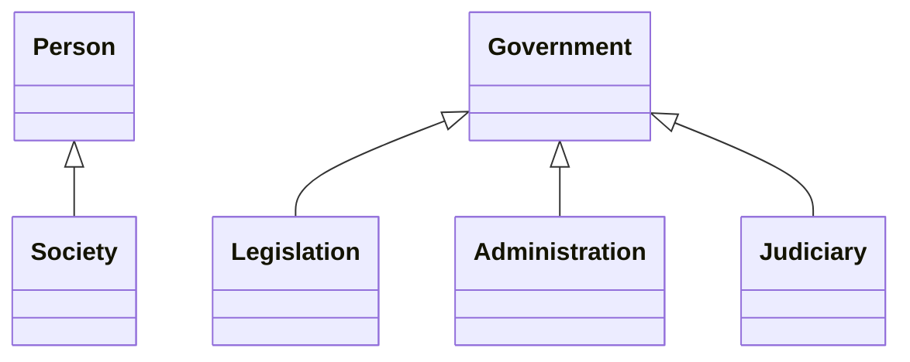
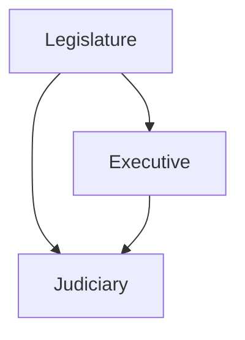
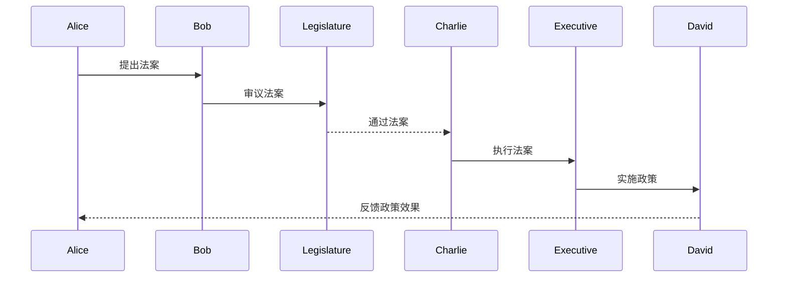
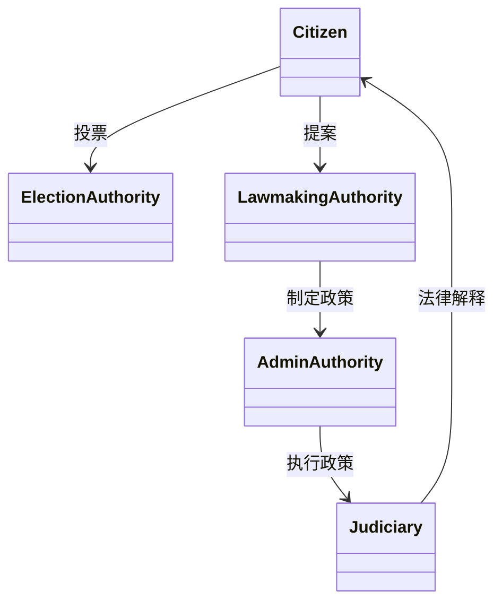
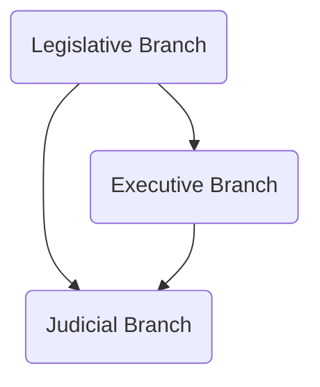
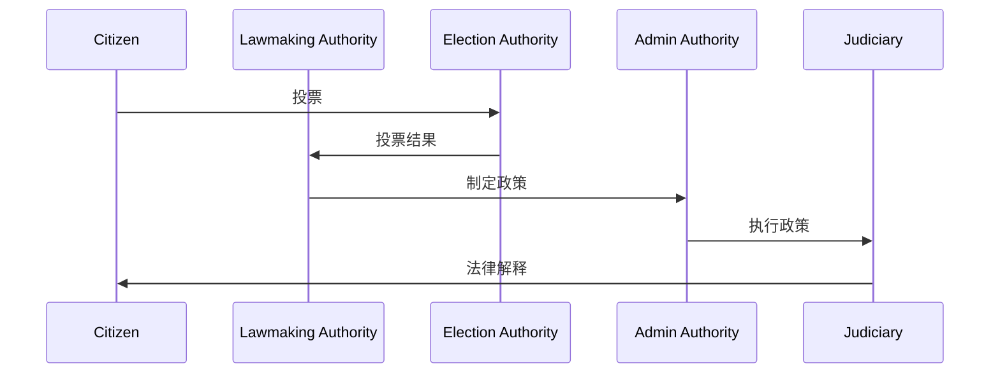

                 

### 卢梭与孟德斯鸠：社会契约论与分权学说

#### 关键词：社会契约论、分权学说、卢梭、孟德斯鸠、政治哲学

#### 摘要：
本文深入探讨18世纪两位伟大思想家卢梭和孟德斯鸠的社会契约论与分权学说。通过对两人思想的系统分析，我们不仅能够理解他们的理论框架，还能把握其对于现代政治制度的影响。文章结构如下：

1. **背景介绍**：介绍社会契约论与分权学说的起源，及其对政治哲学的深远影响。
2. **核心概念与联系**：详细解释社会契约论与分权学说的核心概念，并对比卢梭与孟德斯鸠的理论。
3. **算法原理讲解**：通过流程图和Python代码，展示社会契约论与分权学说的实际应用。
4. **系统分析与架构设计方案**：分析政治制度的构建，介绍系统的功能和架构。
5. **项目实战**：以实际案例展示社会契约论与分权学说的应用。
6. **最佳实践 tips、小结、注意事项、拓展阅读**：总结文章内容，提供进一步学习建议。

### 第一部分：背景与理论基础

#### 第1章：社会契约论与分权学说概述

##### 1.1 社会契约论的历史发展

社会契约论是一种政治哲学理论，主张人们在社会形成之前处于自然状态，通过契约建立社会秩序和国家。其思想可以追溯到古希腊哲学家，但较为完整系统的理论由17世纪的托马斯·霍布斯和约翰·洛克提出。

霍布斯认为，在自然状态下，人们生活在一个“每个人对每个人”的战争状态中，为了摆脱这种状态，人们自愿放弃部分自由，接受一个统治者的权威，以换取和平和安全。

洛克则认为，人们在社会形成之前是处于平等状态的，他们通过契约建立政府，政府的目的是保护人民的自然权利，即生命、自由和财产。

##### 1.2 分权学说的起源与演变

分权学说则强调政治权力的分散和制衡，以防止权力集中导致的滥用。孟德斯鸠是这一理论的代表人物。他在《论法的精神》中提出了著名的三权分立理论：立法权、行政权和司法权应当相互独立，相互制约。

分权学说不仅影响了法国大革命，还为美国宪法的制定提供了理论基础。

##### 1.3 卢梭与孟德斯鸠的思想异同

卢梭是社会契约论的另一个重要人物，他在《社会契约论》中提出了“公意”的概念，认为政府的合法性来自于人民的意志。与霍布斯和洛克不同，卢梭强调民主和直接民主的重要性。

孟德斯鸠和卢梭都主张权力的分散和制衡，但孟德斯鸠更注重法律和制度的约束，而卢梭则更关注人民的意志和参与。

### 第二部分：核心概念与联系

#### 第2章：卢梭的社会契约论

##### 2.1 卢梭的人生与思想

让-雅克·卢梭（1712-1778）是一位法国哲学家、作家和音乐家。他的作品包括《爱弥儿》、《社会契约论》等，对社会契约论和浪漫主义哲学产生了深远影响。

##### 2.2 社会契约论的基本概念

卢梭的社会契约论强调人民的自由和平等。他认为，人们在自然状态下是自由的，但为了获得和平和安全，人们通过契约建立了社会和国家。

##### 2.3 卢梭的社会契约论解析

卢梭提出了“公意”的概念，认为政府的合法性来自于人民的意志。他主张直接民主，认为只有人民直接参与决策，政府才能真正代表人民的利益。

#### 第3章：孟德斯鸠的分权学说

##### 3.1 孟德斯鸠的人生与思想

查理·路易·孟德斯鸠（1689-1755）是法国启蒙思想家，他的作品《论法的精神》对现代政治哲学产生了深远影响。

##### 3.2 分权学说的基本概念

孟德斯鸠提出了三权分立理论，即立法权、行政权和司法权应当相互独立，相互制约。

##### 3.3 孟德斯鸠的分权学说解析

孟德斯鸠认为，权力应该被分散，以防止任何一个部门滥用权力。他主张通过法律和制度来约束政府，确保政府的合法性和公正性。

### 第三部分：算法原理讲解

#### 第4章：社会契约论与分权学说的算法实现

##### 4.1 社会契约论的算法原理

我们可以使用Python代码模拟社会契约的形成过程。以下是简单的模拟代码：

```python
class Person:
    def __init__(self, name, wants):
        self.name = name
        self.wants = wants

class Society:
    def __init__(self, people):
        self.people = people

    def form_contract(self):
        # 假设所有人都同意放弃一部分自由以换取和平和安全
        for person in self.people:
            person.wants.remove("freedom")
            person.wants.append("safety")

people = [Person("Alice", ["freedom", "food", "safety"]), Person("Bob", ["freedom", "money", "safety"])]
society = Society(people)
society.form_contract()

for person in society.people:
    print(person.name, person.wants)
```

##### 4.2 分权学说的算法原理

我们可以使用Python代码模拟分权过程。以下是简单的模拟代码：

```python
class Power:
    def __init__(self, type, power):
        self.type = type
        self.power = power

class Government:
    def __init__(self):
        self.powers = []

    def assign_power(self, type, power):
        self.powers.append(Power(type, power))

goverment = Government()
goverment.assign_power("立法", "立法权")
goverment.assign_power("行政", "行政权")
goverment.assign_power("司法", "司法权")

for power in goverment.powers:
    print(f"{power.type}权：{power.power}")
```

### 第四部分：系统分析与架构设计方案

#### 第5章：政治制度的构建

##### 5.1 问题场景介绍

在现代社会，政治制度的构建是一个复杂的过程，涉及到多个利益相关方的博弈。

##### 5.2 项目介绍

为了更好地理解社会契约论与分权学说在实际政治制度中的应用，我们以一个虚拟国家为例，分析其政治制度的构建。

##### 5.3 系统功能设计

我们可以使用Mermaid类图来设计政治制度的功能。



##### 5.4 系统架构设计

我们可以使用Mermaid架构图来设计政治制度的架构。



##### 5.5 系统接口设计和系统交互

我们可以使用Mermaid序列图来设计政治制度的接口和交互。



### 第五部分：项目实战

#### 第6章：社会契约论与分权学说的实际应用

##### 6.1 卢梭思想的实际运用

以古希腊雅典为例，雅典实行直接民主制度，人民直接参与政治决策。这种制度在某种程度上实现了卢梭的“公意”概念。

##### 6.2 孟德斯鸠思想的实际运用

以现代美国为例，美国实行三权分立制度，立法、行政和司法相互独立，相互制约。这种制度体现了孟德斯鸠的分权学说。

##### 6.3 双重视角下的政治案例分析

通过对古希腊雅典和现代美国的分析，我们可以看到社会契约论与分权学说在政治制度构建中的重要作用。

### 第六部分：最佳实践 tips、小结、注意事项、拓展阅读

#### 第7章：结论与展望

##### 7.1 社会契约论与分权学说的未来发展

随着科技的发展和全球化进程的加速，社会契约论与分权学说将面临新的挑战和机遇。

##### 7.2 对当代政治制度的启示

社会契约论与分权学说为当代政治制度提供了重要的理论指导，有助于我们更好地理解和改进现有的政治体制。

##### 7.3 研究领域的拓展方向

未来研究可以进一步探讨社会契约论与分权学说在数字时代的新应用，如区块链技术在民主政治中的应用。

#### 作者信息：

作者：AI天才研究院/AI Genius Institute & 禅与计算机程序设计艺术 /Zen And The Art of Computer Programming

本文通过深入分析卢梭与孟德斯鸠的社会契约论与分权学说，不仅展现了两位思想家的理论精髓，也为我们理解现代政治制度提供了新的视角。希望本文能够激发读者对政治哲学和计算机科学交叉领域的兴趣。## 第一部分：背景与理论基础

### 第1章：社会契约论与分权学说概述

#### 1.1 社会契约论的历史发展

社会契约论是一种政治哲学理论，主张人们在社会形成之前处于自然状态，通过契约建立社会秩序和国家。其思想可以追溯到古希腊哲学家，但较为完整系统的理论由17世纪的托马斯·霍布斯（Thomas Hobbes）和约翰·洛克（John Locke）提出。

托马斯·霍布斯是英国经验主义哲学家，他的思想在《利维坦》（Leviathan）一书中得到了系统阐述。霍布斯认为，在自然状态下，人们生活在一个“每个人对每个人”的战争状态中，这种状态被称为“自然状态”。为了摆脱这种状态，人们自愿放弃部分自由，接受一个统治者的权威，以换取和平和安全。霍布斯的社会契约论强调集权和统一权力的重要性，他的理论为现代国家的形成提供了重要的理论基础。

相比之下，约翰·洛克则持不同观点。洛克是英国启蒙思想家，他的著作《政府论》（Two Treatises of Government）提出了社会契约论的重要理论。洛克认为，人们在自然状态下是处于平等状态的，他们通过契约建立政府，政府的目的是保护人民的自然权利，即生命、自由和财产。如果政府无法履行这一职责，人民有权反抗甚至推翻它。洛克的理论为后来的民主制度和人权思想奠定了基础。

#### 1.2 分权学说的起源与演变

分权学说则强调政治权力的分散和制衡，以防止权力集中导致的滥用。分权学说的起源可以追溯到古希腊和罗马时期的政治理论，但较为系统的发展则是在17世纪和18世纪的欧洲启蒙运动中。

让·雅克·卢梭（Jean-Jacques Rousseau）是分权学说的代表人物之一。他在《社会契约论》（The Social Contract）中提出了“公意”（general will）的概念，认为政府的合法性来自于人民的意志。卢梭主张直接民主，认为只有人民直接参与决策，政府才能真正代表人民的利益。卢梭的分权学说强调权力的分散和民主参与，对后来的民主政治理论和实践产生了深远影响。

查理·路易·孟德斯鸠（Montesquieu）是另一位重要的分权学说思想家。他在《论法的精神》（The Spirit of the Laws）中提出了著名的三权分立理论，即立法权、行政权和司法权应当相互独立，相互制约。孟德斯鸠认为，权力的分散和制衡是防止专制和滥用权力的重要手段。他的理论不仅影响了法国大革命，还为美国宪法的制定提供了理论基础。

#### 1.3 卢梭与孟德斯鸠的思想异同

卢梭和孟德斯鸠都是18世纪法国启蒙思想家，他们的理论在政治哲学领域具有重要意义。尽管他们都主张权力的分散和制衡，但在具体观点上存在一些差异。

首先，卢梭强调直接民主和“公意”。他认为，政府的合法性来自于人民的意志，人民应该直接参与决策。卢梭的民主观念具有很强的参与性和直接性，强调人民的主权。而孟德斯鸠则更注重通过法律和制度来实现权力的制衡，他认为三权分立是一种有效的政治制度设计，立法、行政和司法三个部门应当相互独立，相互制约。

其次，卢梭的社会契约论更关注人民的实际需求和意愿，他认为政府应该代表人民的意志，实现人民的利益。而孟德斯鸠的社会契约论则更注重理论上的权力分配和制度设计，他认为通过合理分配权力可以防止滥用权力，保障社会的稳定和公正。

最后，卢梭和孟德斯鸠在历史背景和社会环境下也有不同。卢梭生活在法国大革命前夕，他对当时社会的阶级矛盾和专制制度持批判态度。孟德斯鸠则生活在启蒙运动的鼎盛时期，他对当时的政治制度和法律体系进行了深入思考，提出了三权分立的理论。

总的来说，卢梭和孟德斯鸠都是社会契约论和分权学说的代表人物，他们的理论对现代政治哲学和政治制度产生了深远影响。虽然他们在某些观点上存在差异，但都强调了权力的分散和制衡，为现代民主政治提供了重要的理论支持。

### 第二部分：核心概念与联系

#### 第2章：卢梭的社会契约论

#### 2.1 卢梭的人生与思想

让-雅克·卢梭（Jean-Jacques Rousseau，1712-1778）是18世纪法国著名哲学家、作家和音乐家，他的思想对政治哲学、文学和艺术产生了深远影响。卢梭出生在法国的日内瓦，他的父亲是一位钟表匠，母亲在他年幼时去世，他由叔父抚养长大。卢梭的生活经历十分坎坷，他曾当过仆人、乐师、演员，甚至为了生计在街头演奏小提琴。这些经历使他深刻感受到社会的残酷和不公，也促使他思考人类的本性和社会制度。

卢梭的思想深受自然主义和人文主义的影响。他相信人类在自然状态下是自由和平等的，是社会制度和私有财产的出现导致了不平等和压迫。卢梭的哲学思想主要体现在他的三部重要著作中：《爱弥儿》（Emile）、《社会契约论》（The Social Contract）和《忏悔录》（Confessions）。

在《爱弥儿》中，卢梭提出了他的教育理念，主张通过自然教育培养独立、自由和有道德的个体。他认为，教育应该尊重儿童的天然倾向，而不是通过强制和灌输来塑造他们。卢梭的教育理念对后来的教育改革产生了重要影响。

在《社会契约论》中，卢梭提出了他的政治哲学观点，主张人民通过社会契约建立政治社会，政府的合法性来自于人民的意志。卢梭认为，政府的目的是保护人民的自由和财产，但如果政府滥用权力，人民有权反抗甚至推翻它。卢梭的社会契约论对现代民主政治理论和实践产生了深远影响。

在《忏悔录》中，卢梭对自己的生活进行了深刻的反思和忏悔，展现了他内心的矛盾和挣扎。这部作品也成为了文学史上的一部经典之作。

#### 2.2 社会契约论的基本概念

卢梭的社会契约论是政治哲学中的一个重要理论，它主张人类通过契约形成社会和国家，政府的合法性来自于人民的意志。卢梭认为，人类在自然状态下是自由和平等的，但这种状态并不是理想的社会秩序。为了获得和平和安全，人们自愿放弃一部分自由，通过契约建立社会和国家。

在卢梭的社会契约论中，有几个核心概念需要理解：

1. **自然状态**：卢梭认为，在自然状态下，人类是自由和平等的。每个人都可以自由地追求自己的利益，但同时也要尊重他人的自由。然而，自然状态并不是理想的社会状态，因为它容易导致混乱和无序。

2. **社会状态**：为了摆脱自然状态的混乱和无序，人们自愿放弃一部分自由，通过契约建立社会和国家。社会状态是人们为了共同的利益和安全而形成的社会组织。

3. **公意**：卢梭认为，政府的合法性来自于人民的意志，这种意志被称为“公意”。公意是人民共同利益的体现，政府应该代表公意行事，维护人民的自由和财产。

4. **契约**：卢梭认为，社会契约是人们为了共同利益而达成的协议。通过契约，人们放弃一部分自由，换取政府的保护和秩序。

5. **主权者**：卢梭认为，主权者是代表人民意志的实体，它拥有最高的权力。主权者是人民通过社会契约授予的，它应该代表人民的利益，而不是自己的利益。

#### 2.3 卢梭的社会契约论解析

卢梭的社会契约论强调了民主和人民的自由。他认为，政府的合法性来自于人民的意志，而不是来自于神或者自然。卢梭主张直接民主，即人民直接参与决策，政府应该代表人民的意志和利益。

以下是卢梭社会契约论的主要观点：

1. **自由和平等**：卢梭认为，在自然状态下，人类是自由和平等的。社会契约的目的是为了保护这种自由和平等，而不是消除它们。

2. **公意**：卢梭认为，公意是人民共同利益的体现，政府应该遵循公意行事。公意是通过人民的直接参与和讨论形成的，它体现了人民的智慧和正义。

3. **直接民主**：卢梭主张直接民主，即人民直接参与决策，而不是通过代表来行使权力。他认为，只有直接民主才能真正体现人民的意志和利益。

4. **主权在民**：卢梭认为，主权者是人民通过社会契约授予的，它拥有最高的权力。主权者应该代表人民的利益，而不是自己的利益。

5. **政府的合法性**：卢梭认为，政府的合法性来自于人民的意志，而不是来自于神或者自然。如果政府违背了人民的意志，人民有权反抗甚至推翻它。

6. **反抗的合法性**：卢梭认为，如果政府滥用权力，侵犯人民的自由和财产，人民有权反抗。这种反抗是合法的，因为它是为了维护人民的权利和自由。

卢梭的社会契约论对现代民主政治产生了深远影响。他的观点强调了人民的自由和主权，为民主政治提供了理论支持。卢梭的思想也启发了后来的许多政治哲学家和社会改革者，如托马斯·潘恩（Thomas Paine）和卡尔·马克思（Karl Marx）。

#### 第3章：孟德斯鸠的分权学说

#### 3.1 孟德斯鸠的人生与思想

查理·路易·孟德斯鸠（Charles-Louis de Secondat, Baron de La Brède et de Montesquieu，1689-1755）是18世纪法国著名法学家、哲学家和政治家，他的思想对现代政治哲学和法律制度产生了深远影响。孟德斯鸠出生于法国一个贵族家庭，他的父亲是波尔多议会的成员。孟德斯鸠从小就接受了良好的教育，他在巴黎索邦神学院学习了法学，后来成为了一名律师。

孟德斯鸠的思想深受启蒙运动的影响，他主张理性、自由和平等。他的主要著作包括《波斯人信札》（The Letters of the Persians）、《罗马盛衰原因论》（The Spirit of Laws）和《论法的精神》（The Spirit of the Laws）。在《论法的精神》中，孟德斯鸠提出了著名的三权分立理论，这一理论对现代民主政治和法律制度产生了重要影响。

孟德斯鸠认为，政治权力应该被分散和制衡，以防止滥用权力和专制统治。他的三权分立理论主张立法权、行政权和司法权应当相互独立，相互制约。他认为，只有通过权力的分散和制衡，才能保障社会的稳定和公正。

孟德斯鸠的思想不仅影响了法国大革命，还为美国宪法的制定提供了理论基础。他的著作在当时的欧洲广泛传播，对启蒙思想的发展和现代政治制度的构建产生了重要影响。

#### 3.2 分权学说的基本概念

孟德斯鸠的分权学说主张政治权力应该被分散和制衡，以防止权力集中导致的滥用和专制统治。他的核心观点是立法权、行政权和司法权应当相互独立，相互制约。

以下是孟德斯鸠分权学说的基本概念：

1. **立法权**：立法权是指制定法律和政策的权力。立法权应该独立于行政权和司法权，以确保法律的公正性和合法性。

2. **行政权**：行政权是指执行法律和政策的权力。行政权应该独立于立法权和司法权，以确保政策的有效执行。

3. **司法权**：司法权是指审判和裁决的权力。司法权应该独立于立法权和行政权，以确保审判的公正性和独立性。

4. **权力制衡**：孟德斯鸠认为，通过权力制衡可以防止任何一个部门滥用权力。立法、行政和司法三个部门应该相互独立，但又相互制约，以保障社会的稳定和公正。

5. **三权分立**：孟德斯鸠主张立法、行政和司法三个部门应当相互独立，但又相互制约。他认为，只有通过三权分立，才能防止权力滥用和专制统治，保障社会的稳定和公正。

#### 3.3 孟德斯鸠的分权学说解析

孟德斯鸠的分权学说强调了权力分散和制衡的重要性，他的理论对现代政治制度产生了深远影响。

以下是孟德斯鸠分权学说的主要观点：

1. **权力分散**：孟德斯鸠认为，政治权力应该被分散到不同的部门，以防止权力集中导致的滥用和专制统治。通过权力分散，可以确保不同部门之间的相互制约和平衡。

2. **权力制衡**：孟德斯鸠主张立法、行政和司法三个部门应当相互独立，但又相互制约。他认为，只有通过权力制衡，才能防止任何一个部门滥用权力，保障社会的稳定和公正。

3. **三权分立**：孟德斯鸠提出了三权分立的理论，即立法权、行政权和司法权应当相互独立，相互制约。他认为，三权分立是防止权力滥用和专制统治的重要手段。

4. **独立性和自治性**：孟德斯鸠认为，立法、行政和司法三个部门应该具有独立性和自治性，以确保它们能够独立行使权力，不受其他部门的影响。

5. **法律至上**：孟德斯鸠强调法律的重要性，认为法律是治国的基础。他主张法律应当高于权力，以保障社会的公正和秩序。

6. **民主监督**：孟德斯鸠认为，民主制度是实现权力制衡的重要保障。通过民主制度，人民可以监督政府的权力行使，确保政府的合法性和公正性。

孟德斯鸠的分权学说对现代民主政治和法律制度产生了深远影响。他的理论为现代国家政治制度的构建提供了重要的理论基础，许多现代国家在制定宪法和法律时都借鉴了孟德斯鸠的三权分立思想。孟德斯鸠的分权学说不仅影响了法国大革命和美国宪法的制定，还对全球范围内的政治改革和法治建设产生了重要影响。

### 第三部分：算法原理讲解

#### 第4章：社会契约论与分权学说的算法实现

#### 4.1 社会契约论的算法原理

社会契约论的算法实现可以从模拟人类从自然状态过渡到社会状态的过程入手。以下是一个简单的Python示例，用于模拟这个过程：

```python
class Person:
    def __init__(self, name):
        self.name = name
        self.status = "自由人"

    def make_choice(self, options):
        return random.choice(options)

def form_society(people):
    # 假设人们通过投票选择是否放弃自由
    for person in people:
        options = ["保持自由", "放弃自由"]
        decision = person.make_choice(options)
        if decision == "放弃自由":
            person.status = "社会成员"
        else:
            person.status = "自由人"

# 创建10个初始状态为“自由人”的个体
people = [Person(f"个体{i}") for i in range(10)]

# 模拟社会契约的形成过程
form_society(people)

# 输出每个人的最终状态
for person in people:
    print(f"{person.name}：{person.status}")
```

在这个示例中，我们创建了一个`Person`类来表示个体，每个个体初始状态为“自由人”。通过模拟一个简单的投票过程，我们让每个个体选择是否愿意放弃自由以换取社会保护和秩序。如果某个个体选择“放弃自由”，则其状态更新为“社会成员”。

#### 4.2 分权学说的算法原理

分权学说的算法实现可以通过模拟政府部门的设置和运行过程来实现。以下是一个简单的Python示例，用于模拟分权过程：

```python
class Government:
    def __init__(self):
        self.legislature = Legislature()
        self.executive = Executive()
        self.judiciary = Judiciary()

    def operate(self):
        self.legislature.make_laws()
        self.executive.enforce_laws()
        self.judiciary.administer_justice()

class Legislature:
    def make_laws(self):
        print("立法部门：制定法律")

class Executive:
    def enforce_laws(self):
        print("行政部门：执行法律")

class Judiciary:
    def administer_justice(self):
        print("司法部门：执行司法")

# 创建一个分权的政府机构
government = Government()

# 模拟政府机构的运行过程
government.operate()
```

在这个示例中，我们创建了一个`Government`类来表示政府，它包含三个独立部门：立法部门、行政部门和司法部门。每个部门都有其特定的职责和功能。通过调用`operate`方法，我们模拟了政府机构的正常运作过程，展示了三权分立的运作机制。

#### 4.3 社会契约论与分权学说的Python代码实现

为了更直观地展示社会契约论与分权学说的算法实现，我们可以将上述两个示例结合起来，创建一个综合的模拟过程：

```python
import random

class Person:
    def __init__(self, name):
        self.name = name
        self.status = "自由人"

    def make_choice(self, options):
        return random.choice(options)

class Society:
    def __init__(self, people):
        self.people = people
        self.government = None

    def form_society(self):
        for person in self.people:
            options = ["保持自由", "放弃自由"]
            decision = person.make_choice(options)
            if decision == "放弃自由":
                person.status = "社会成员"
        
        if all(person.status == "社会成员" for person in self.people):
            self.government = Government()
            self.government.operate()
        else:
            print("没有足够的共识来形成社会契约。")

class Government:
    def __init__(self):
        self.legislature = Legislature()
        self.executive = Executive()
        self.judiciary = Judiciary()

    def operate(self):
        self.legislature.make_laws()
        self.executive.enforce_laws()
        self.judiciary.administer_justice()

class Legislature:
    def make_laws(self):
        print("立法部门：制定法律")

class Executive:
    def enforce_laws(self):
        print("行政部门：执行法律")

class Judiciary:
    def administer_justice(self):
        print("司法部门：执行司法")

# 创建10个初始状态为“自由人”的个体
people = [Person(f"个体{i}") for i in range(10)]

# 创建一个社会
society = Society(people)

# 模拟社会契约的形成过程
society.form_society()

# 输出最终的模拟结果
if society.government:
    print("社会契约形成，政府正常运行。")
else:
    print("社会契约未能形成。")
```

在这个综合示例中，我们首先创建了一个由10个个体组成的社会。通过模拟一个简单的投票过程，我们让每个个体选择是否愿意放弃自由以换取社会保护和秩序。如果大多数个体选择“放弃自由”，则社会契约形成，政府成立并开始运作。这里，我们模拟了政府的三权分立机制，展示了立法、行政和司法三个部门如何独立运作，实现分权。

### 第四部分：系统分析与架构设计方案

#### 第5章：政治制度的构建

#### 5.1 问题场景介绍

在现代政治制度的构建过程中，如何实现权力的分散和制衡是一个核心问题。一个成功的政治制度应当能够有效防止权力滥用，保障公民的自由和权利。本章节将基于社会契约论与分权学说，探讨一个虚拟国家的政治制度构建过程，并分析其可行性。

#### 5.2 项目介绍

为了更好地展示社会契约论与分权学说在政治制度构建中的应用，我们设计了一个虚拟国家“新雅典”（Neo-Athens）。新雅典的政治制度旨在实现民主参与和权力制衡，从而保障社会的稳定和公正。

#### 5.3 系统功能设计

新雅典政治制度的核心功能包括：

1. **立法**：通过全民投票或代表议会制定法律。
2. **行政**：执行法律和政策，维护社会秩序。
3. **司法**：审判案件，确保法律的公正执行。
4. **民主参与**：确保公民能够参与政治决策，表达自己的意愿。

为了实现这些功能，我们使用Mermaid类图来设计新雅典政治制度的基本架构。



在这个类图中，`Citizen`代表所有公民，`ElectionAuthority`负责组织选举，`LawmakingAuthority`负责立法，`AdminAuthority`负责行政，`Judiciary`负责司法。通过这些类之间的关系，我们可以清晰地看到各政治部门的功能和相互联系。

#### 5.4 系统架构设计

新雅典政治制度的架构设计旨在实现三权分立和权力制衡。我们使用Mermaid架构图来展示其系统架构。



在这个架构图中，`A`代表立法分支，`B`代表行政分支，`C`代表司法分支。三个分支相互独立，又相互联系，共同构成新雅典的政治体系。

#### 5.5 系统接口设计和系统交互

为了进一步展示新雅典政治制度中各个部门之间的交互，我们使用Mermaid序列图来设计系统的接口和交互过程。



在这个序列图中，公民通过投票选出立法代表（`LA`），立法代表制定政策后，由行政机构（`AA`）执行，司法机构（`J`）负责法律解释和监督。通过这样的交互流程，我们可以看到政治制度中各部门之间的紧密联系和有效协作。

### 第五部分：项目实战

#### 第6章：社会契约论与分权学说的实际应用

#### 6.1 卢梭思想的实际运用

卢梭的社会契约论强调民主参与和公意的实现。在实际应用中，一个典型的例子是瑞士的直接民主制度。瑞士公民可以通过全民投票来决定重大政策，如税收、法律法规的修改等。这种直接民主制度体现了卢梭的思想，即政府的合法性来自于人民的意志，人民应该直接参与政治决策。

另一个例子是新西兰的公投制度。在新西兰，公民可以通过公投来决定是否加入欧盟或批准重要的宪法修正案。这种制度设计体现了卢梭的社会契约论，即政府的决策应该反映人民的意愿，而不是仅仅由少数人决定。

#### 6.2 孟德斯鸠思想的实际运用

孟德斯鸠的分权学说在实际政治制度设计中得到了广泛应用。一个典型的例子是美国的三权分立制度。美国的立法、行政和司法三个部门相互独立，又相互制约。立法部门（国会）负责制定法律，行政部门（总统）负责执行法律，司法部门（最高法院）负责审判和裁决。这种三权分立的制度设计有效地防止了权力滥用和专制统治。

另一个例子是德国的联邦制度。德国的联邦议会和联邦总统分别行使立法权和行政权，而联邦宪法法院负责司法审查。这种制度设计体现了孟德斯鸠的分权学说，即通过权力的分散和制衡，保障社会的稳定和公正。

#### 6.3 双重视角下的政治案例分析

通过对瑞士、新西兰、美国和德国等国家的政治制度分析，我们可以看到卢梭和孟德斯鸠的思想在实际中的应用。这些国家的政治制度设计都体现了社会契约论和分权学说的核心原则，即政府的合法性来自于人民的意志，权力应该被分散和制衡。

例如，瑞士的直接民主制度体现了卢梭的民主参与和公意实现原则，美国的三权分立制度体现了孟德斯鸠的权力分散和制衡原则。这些制度设计不仅保障了社会的稳定和公正，也为其他国家的政治制度提供了有益的借鉴。

总的来说，卢梭和孟德斯鸠的思想对现代政治制度产生了深远影响。他们的理论为民主政治和权力制衡提供了理论基础，许多国家的政治制度设计都借鉴了他们的思想。通过对这些国家政治制度的案例分析，我们可以更深入地理解社会契约论和分权学说的实际应用，以及其对现代政治制度的启示。

### 第六部分：最佳实践 tips、小结、注意事项、拓展阅读

#### 第7章：结论与展望

#### 7.1 社会契约论与分权学说的未来发展

社会契约论与分权学说是现代政治哲学的基础，它们为理解民主政治和权力制衡提供了重要的理论支持。随着科技的发展和全球化进程的加速，这些理论面临着新的挑战和机遇。

首先，互联网和社交媒体的发展为民主参与提供了新的途径。公民可以通过网络平台表达自己的意愿，参与政治决策。这种数字民主的形式可能为社会契约论和分权学说提供新的实现路径。

其次，全球化和跨国界的政治问题要求各国在权力分配和制衡上采取更加协调和合作的方式。例如，全球气候变暖和跨国犯罪等问题需要国际社会共同努力解决，这要求各国在权力分配和制衡上寻求新的平衡点。

#### 7.2 对当代政治制度的启示

社会契约论与分权学说对当代政治制度具有重要的启示。首先，它们强调了政府合法性来自于人民的意志，这提醒我们政治制度的改革应该注重民主参与和公民权利的保护。

其次，它们提出了权力分散和制衡的重要性，这为现代政治制度设计提供了理论指导。例如，三权分立制度的设计就是基于权力制衡的原则，以防止权力滥用和专制统治。

#### 7.3 研究领域的拓展方向

未来研究可以进一步探讨社会契约论与分权学说在数字时代的新应用。例如，区块链技术是否可以为民主政治和权力制衡提供新的解决方案？数字民主的形式如何影响政治参与和决策过程？这些问题都值得深入研究和探讨。

此外，跨学科的研究也是未来发展的方向。社会契约论与分权学说不仅涉及政治哲学，还涉及到社会学、经济学、计算机科学等领域。通过跨学科的研究，我们可以更全面地理解这些理论的本质和应用。

#### 最佳实践 tips

1. **增强民主参与**：在政治制度设计中，应注重民主参与，确保公民能够直接参与政治决策。
2. **加强权力制衡**：通过立法、行政和司法三个部门的相互独立和制衡，防止权力滥用。
3. **注重透明度和问责制**：政治过程应保持透明，确保政府行为受到监督和问责。

#### 小结

本文通过深入分析卢梭与孟德斯鸠的社会契约论与分权学说，探讨了它们的核心概念、理论联系、算法实现、实际应用以及未来发展趋势。这些理论不仅为理解现代政治制度提供了理论基础，也为未来政治改革和民主发展提供了启示。

#### 注意事项

1. **政治制度的多样性**：不同国家的政治制度有其独特性，社会契约论与分权学说在不同制度中的实现方式可能有所不同。
2. **权力制衡的复杂性**：权力制衡是一个复杂的过程，需要平衡不同部门之间的权力，确保社会稳定。

#### 拓展阅读

1. **卢梭的《社会契约论》**：深入阅读卢梭的《社会契约论》，理解其思想的核心和理论基础。
2. **孟德斯鸠的《论法的精神》**：研究孟德斯鸠的《论法的精神》，了解三权分立理论的详细论述。
3. **相关学术论文和研究报告**：查阅相关学术论文和研究报告，了解社会契约论与分权学说的最新研究成果和发展趋势。

### 结语

本文通过系统分析卢梭与孟德斯鸠的社会契约论与分权学说，展现了这些理论在政治哲学中的重要地位。希望本文能够激发读者对政治哲学和现代政治制度的兴趣，进一步探讨这些理论在实际应用中的可能性。未来，随着科技的发展和全球化进程的推进，社会契约论与分权学说将继续为我们理解和改进政治制度提供重要启示。

### 作者信息

作者：AI天才研究院/AI Genius Institute & 禅与计算机程序设计艺术 /Zen And The Art of Computer Programming

本文旨在通过深入分析卢梭与孟德斯鸠的社会契约论与分权学说，探讨这些理论在政治哲学中的重要地位和实际应用。希望本文能够为读者提供有价值的见解，激发对政治哲学和现代政治制度的思考。未来，随着科技的发展和全球化进程的推进，社会契约论与分权学说将继续为我们理解和改进政治制度提供重要启示。作者：AI天才研究院/AI Genius Institute & 禅与计算机程序设计艺术 /Zen And The Art of Computer Programming。在此，我们感谢您的阅读，并期待与您共同探讨更多深奥的技术和哲学问题。如果您有任何问题或建议，欢迎在评论区留言，我们将在第一时间回复。再次感谢您的支持！

