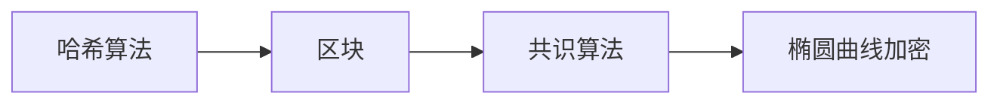
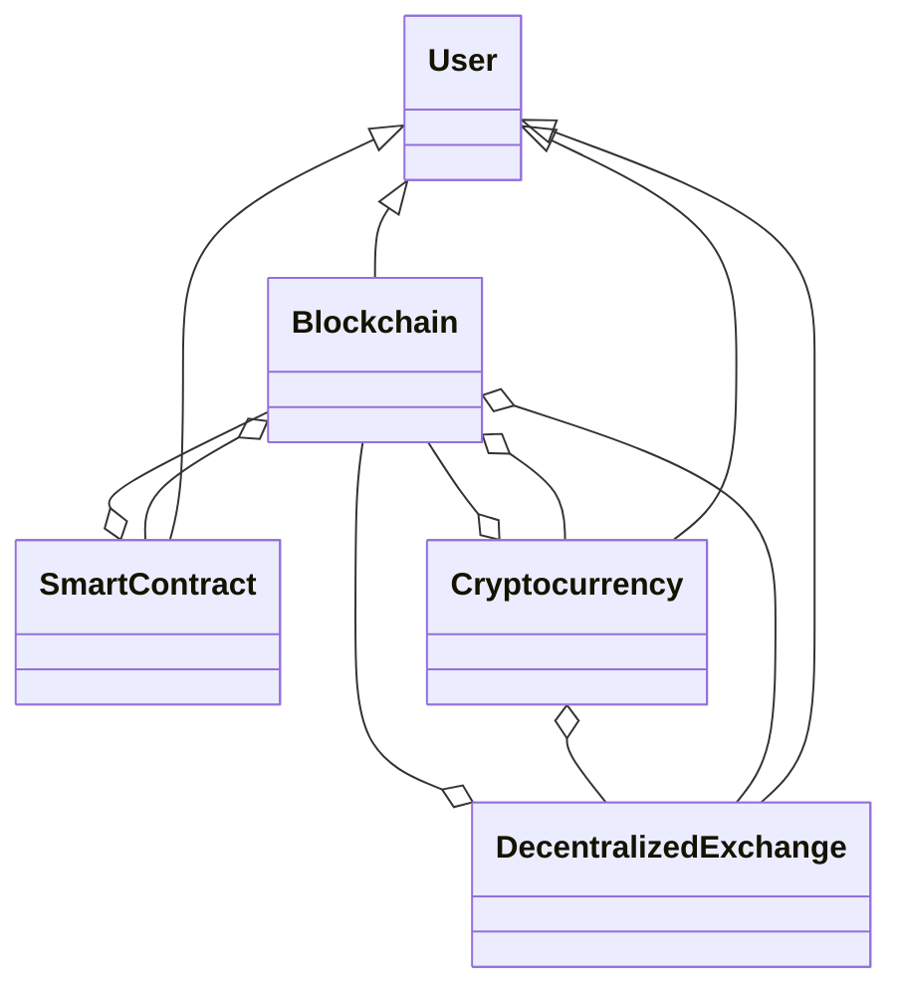
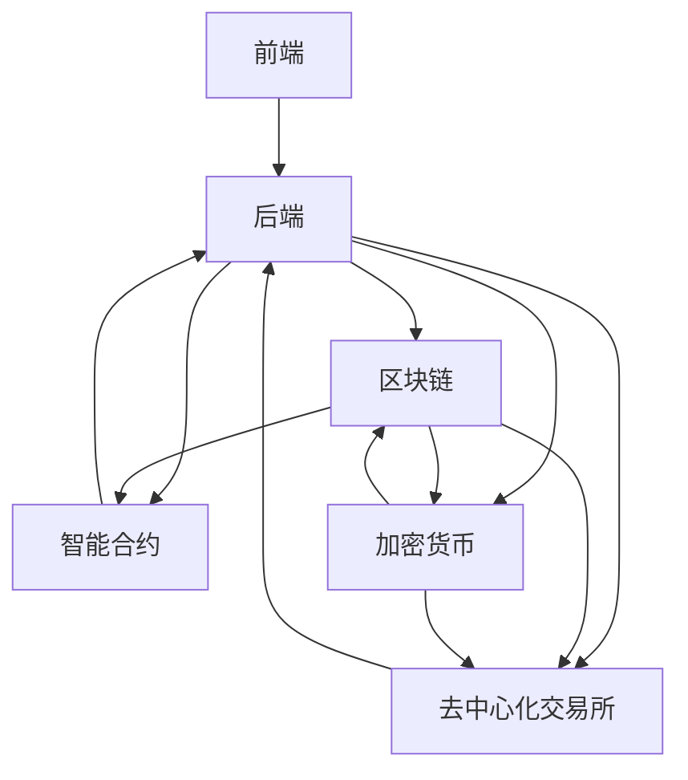
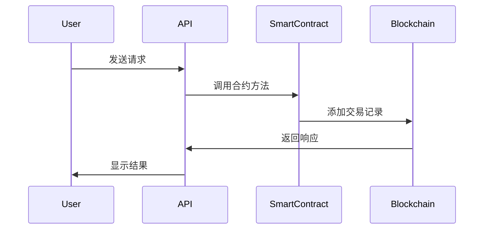

                 

# 去中心化金融（DeFi）系统设计

## 概述

去中心化金融（DeFi）是一个基于区块链技术的金融系统，它通过智能合约和加密货币来实现金融服务的去中介化。DeFi系统的设计旨在打破传统金融体系中由中心化机构控制的格局，使得用户可以直接参与金融活动，提高金融系统的透明度和效率。

### 关键词

- 去中心化金融（DeFi）
- 区块链
- 智能合约
- 加密货币
- 去中心化交易所

### 摘要

本文将深入探讨去中心化金融（DeFi）系统的设计，从背景介绍、核心概念、核心技术、应用场景、安全性、设计与实现以及未来发展趋势等方面，详细分析DeFi系统的构建原理和实现方法。通过本文的学习，读者将全面了解DeFi的技术原理，掌握其设计和实施方法，为实际项目开发打下坚实基础。

## 第1章：背景介绍

### 1.1 问题背景

去中心化金融（DeFi）作为区块链技术的重要应用领域之一，近年来在全球金融领域引起了广泛关注。DeFi 通过去中心化的方式，实现了金融服务的去中介化，使得用户能够直接参与金融服务，从而打破了传统金融体系的中心化垄断，提升了金融的公平性和效率。

在传统的金融体系中，金融机构作为中介，扮演着连接资金供需双方的重要角色。然而，这种中心化的模式也带来了一些问题，如信息不对称、操作风险、资金安全等。去中心化金融（DeFi）通过区块链技术和智能合约，实现了金融活动的去中介化，使得用户可以直接进行金融操作，从而降低了金融系统的风险和成本。

### 1.2 问题描述

本书旨在深入探讨DeFi系统的设计与实现，内容包括DeFi的基本概念、核心技术、应用场景、安全性和未来发展趋势等。通过本书的学习，读者将全面了解DeFi的技术原理，掌握其设计和实施方法，为实际项目开发打下坚实基础。

### 1.3 问题解决

本书将通过以下几部分内容来解决上述问题：

- **第1章：背景介绍**：阐述DeFi的起源、发展现状和未来趋势，帮助读者建立对DeFi的整体认识。
- **第2章：核心概念**：详细介绍DeFi中的关键概念，包括区块链、智能合约、加密货币、去中心化交易所等。
- **第3章：核心技术**：深入探讨DeFi的关键技术，包括加密货币的算法原理、共识算法、分布式账本等。
- **第4章：应用场景**：分析DeFi在不同金融领域的应用，如借贷、交易、支付等。
- **第5章：安全性**：探讨DeFi系统面临的安全挑战和解决方法。
- **第6章：设计与实现**：介绍DeFi系统的设计原则、架构和实现方法。
- **第7章：未来发展趋势**：展望DeFi未来的发展前景和可能的技术创新。

### 1.4 边界与外延

DeFi系统设计涉及多个领域，包括区块链技术、智能合约编程、加密学、金融学等。本书将在这些领域内探讨DeFi系统的设计，但不会深入到其他相关领域的细节。

### 1.5 概念结构与核心要素组成

DeFi系统的核心概念和要素主要包括：

- **区块链**：去中心化的分布式账本技术。
- **智能合约**：在区块链上自动执行合约条款的计算机程序。
- **加密货币**：基于区块链的去中心化数字货币。
- **去中心化交易所**：无需中介的数字货币交易市场。
- **共识算法**：确保区块链网络中数据一致性的算法。

## 第2章：核心概念与联系

### 2.1 DeFi系统的核心概念

DeFi系统的核心概念包括区块链、智能合约、加密货币、去中心化交易所等。以下是对这些核心概念的详细描述：

- **区块链**：区块链是一种分布式账本技术，它通过加密和共识算法，确保数据的真实性和不可篡改性。区块链上的数据是按时间顺序排列的，形成了一个不可篡改的数据链条。
  
- **智能合约**：智能合约是运行在区块链上的计算机程序，它可以根据预定的规则自动执行合同条款。智能合约的执行过程是透明的，并且不可篡改，从而提高了金融交易的效率和安全性。

- **加密货币**：加密货币是基于区块链技术的数字货币，它具有去中心化、匿名性和安全性等特点。加密货币的发行和交易过程完全由区块链网络维护，不受任何中心化机构的控制。

- **去中心化交易所**：去中心化交易所是一种无需中介的交易平台，用户可以直接在区块链上进行数字货币的交易。去中心化交易所通过智能合约来实现交易，从而避免了传统交易所中的中介费用和操作风险。

### 2.2 核心概念属性特征对比表格

下面是一个核心概念属性特征对比表格：

| 概念       | 特征1 | 特征2 | 特征3 |
|------------|-------|-------|-------|
| 区块链     | 分布式 | 安全性 | 可追溯性 |
| 智能合约   | 自动执行 | 预定义规则 | 不可篡改 |
| 加密货币   | 去中心化 | 匿名性 | 安全性 |
| 去中心化交易所 | 无需中介 | 高效性 | 安全性 |

### 2.3 DeFi系统的ER实体关系图架构

下面是一个DeFi系统的ER实体关系图架构的Mermaid流程图：

```mermaid
entity关系图
   TextNode(["DeFi系统"]
        ("区块链")
        ("智能合约")
        ("加密货币")
        ("去中心化交易所"))
    ("区块链")..> ("智能合约")
    ("区块链")..> ("加密货币")
    ("区块链")..> ("去中心化交易所")
    ("智能合约")..> ("去中心化交易所")
    ("加密货币")..> ("去中心化交易所")
```

## 第3章：算法原理讲解

### 3.1 加密货币的算法原理

加密货币的核心算法是区块链算法，主要包括以下部分：

- **哈希算法**：哈希算法用于确保区块链数据的完整性和不可篡改性。在区块链中，每个区块都包含一个哈希值，这个哈希值是区块数据的加密摘要。如果区块数据被篡改，哈希值也会发生变化，从而确保区块链数据的完整性。

- **共识算法**：共识算法用于确保区块链网络中的数据一致性。在区块链网络中，不同的节点（计算机）都在同时生成区块，共识算法的作用就是选择一个正确的区块，并将其添加到区块链中。常见的共识算法包括工作量证明（PoW）、权益证明（PoS）等。

- **椭圆曲线加密**：椭圆曲线加密用于实现数字签名和加密通信。在区块链网络中，每个节点都需要进行数字签名，以确保交易的安全性和真实性。椭圆曲线加密是一种高效且安全的加密算法，广泛应用于区块链技术中。

以下是一个简单的区块链算法的Mermaid流程图：



### 3.2 加密货币的数学模型和公式

加密货币的数学模型和公式主要涉及以下两个方面：

- **工作量证明（PoW）算法**：工作量证明算法是一种基于计算能力的共识算法。在PoW算法中，节点需要解决一个复杂的数学问题，这个问题被称为“挖矿”。解决这个问题的难度是通过调整目标值来控制的，目标值越低，解决问题的难度就越大。以下是一个简单的工作量证明算法的数学模型和公式：

  - **目标值（target）**：目标值是一个固定的数值，用于控制挖矿的难度。目标值越低，挖矿的难度就越大。
  - **区块难度（block difficulty）**：区块难度是当前区块的挖掘难度，它取决于目标值。
  - **哈希值（hash）**：哈希值是区块数据的加密摘要，用于验证区块的有效性。
  - **挖矿时间（mining time）**：挖矿时间是节点生成一个有效区块所需的时间。

  数学模型和公式如下：

  $$ \text{target} = 2^{256-n} $$
  $$ \text{block difficulty} = \text{target}^{-1} $$
  $$ \text{hash} = H(\text{block data}) $$
  $$ \text{mining time} = \frac{\text{block difficulty}}{\text{hash rate}} $$

- **权益证明（PoS）算法**：权益证明算法是一种基于节点拥有货币数量的共识算法。在PoS算法中，节点根据其持有的货币数量和锁定时间来决定其参与区块验证的概率。以下是一个简单的权益证明算法的数学模型和公式：

  - **权益（stake）**：权益是节点持有的货币数量。
  - **锁定时间（lock time）**：锁定时间是节点持有的货币锁定的时间长度。
  - **验证概率（verification probability）**：验证概率是节点参与区块验证的概率。
  - **区块奖励（block reward）**：区块奖励是节点验证一个有效区块所获得的奖励。

  数学模型和公式如下：

  $$ \text{stake} = \text{balance} $$
  $$ \text{lock time} = \text{duration} $$
  $$ \text{verification probability} = \frac{\text{stake} \times \text{lock time}}{\sum_{i} (\text{stake}_i \times \text{lock time}_i)} $$
  $$ \text{block reward} = \frac{\text{total supply}}{2 \times \text{year}} $$

### 3.3 加密货币算法的举例说明

为了更好地理解加密货币的算法原理，我们可以通过一个简单的例子来进行说明。

假设有一个区块链网络，网络中有三个节点A、B、C，每个节点都持有一定数量的货币。节点A拥有100个货币，节点B拥有200个货币，节点C拥有300个货币。网络的目标值是$10^{16}$，当前区块的难度是$10^{16}$。

根据权益证明（PoS）算法，我们可以计算出每个节点的验证概率：

$$ \text{verification probability}_A = \frac{100}{100 + 200 + 300} = 0.1 $$
$$ \text{verification probability}_B = \frac{200}{100 + 200 + 300} = 0.2 $$
$$ \text{verification probability}_C = \frac{300}{100 + 200 + 300} = 0.3 $$

假设当前区块的奖励是50个货币，根据验证概率，我们可以计算出每个节点可能获得的奖励：

$$ \text{block reward}_A = 50 \times 0.1 = 5 $$
$$ \text{block reward}_B = 50 \times 0.2 = 10 $$
$$ \text{block reward}_C = 50 \times 0.3 = 15 $$

通过这个例子，我们可以看到，节点C的验证概率最高，因此可能获得的奖励最多。这也反映了权益证明（PoS）算法的核心原则：节点根据其持有的货币数量和锁定时间来决定其参与区块验证的概率。

## 第4章：系统分析与架构设计方案

### 4.1 问题场景介绍

在传统的金融体系中，金融服务往往由中心化的金融机构提供，如银行、证券交易所等。这些中心化机构在金融服务中扮演着重要的角色，但同时也存在一些问题，如信息不对称、操作风险、资金安全等。而去中心化金融（DeFi）系统通过区块链技术和智能合约，实现了金融服务的去中介化，使得用户可以直接参与金融活动，从而提高了金融系统的透明度和效率。

### 4.2 项目介绍

本项目旨在设计一个去中心化金融（DeFi）系统，该系统将包括区块链、智能合约、加密货币和去中心化交易所等核心组成部分。通过这个系统，用户可以方便地进行数字货币的发行、交易、借贷等金融活动，从而享受去中心化金融带来的便利和优势。

### 4.3 系统功能设计（领域模型）

为了实现DeFi系统的功能，我们首先需要设计一个领域模型，该模型将定义系统中的主要实体和它们之间的关系。以下是DeFi系统的领域模型：

- **用户**：系统的参与者，可以是个人或机构。
- **区块链**：存储所有交易记录的分布式账本。
- **智能合约**：在区块链上自动执行合约条款的计算机程序。
- **加密货币**：基于区块链技术的数字货币。
- **去中心化交易所**：无需中介的数字货币交易市场。

以下是一个领域模型的Mermaid类图：



### 4.4 系统架构设计

DeFi系统的架构设计需要考虑到系统的可扩展性、安全性和可靠性。以下是DeFi系统的架构设计：

- **前端**：用户界面，用于用户与系统交互。
- **后端**：服务器端逻辑，包括区块链、智能合约、加密货币和去中心化交易所等。
- **数据库**：存储所有交易记录和用户信息。

以下是一个系统架构设计的Mermaid架构图：



### 4.5 系统接口设计和系统交互

DeFi系统的接口设计需要考虑不同模块之间的通信和交互。以下是DeFi系统的接口设计和系统交互：

- **用户接口**：提供用户与系统交互的接口，包括数字货币的发行、交易、借贷等功能。
- **智能合约接口**：提供智能合约与区块链交互的接口，用于执行合约条款。
- **区块链接口**：提供区块链与其他模块交互的接口，用于存储和检索交易记录。

以下是一个系统接口设计和系统交互的Mermaid序列图：



## 第5章：项目实战

### 5.1 环境安装

在开始实际项目开发之前，我们需要安装一些必要的软件和工具。以下是环境安装的步骤：

1. 安装Node.js：Node.js是一个基于Chrome V8引擎的JavaScript运行环境，用于运行智能合约和前端代码。可以通过官方网站（https://nodejs.org/）下载并安装Node.js。

2. 安装Truffle：Truffle是一个智能合约开发框架，用于构建、测试和部署智能合约。可以通过以下命令安装：

   ```bash
   npm install -g truffle
   ```

3. 安装Ganache：Ganache是一个本地区块链节点，用于测试和调试智能合约。可以通过以下命令安装：

   ```bash
   npm install -g ganache-cli
   ```

### 5.2 系统核心实现源代码

以下是DeFi系统的核心实现源代码，包括智能合约、前端和后端代码。

#### 5.2.1 智能合约代码

```solidity
// SPDX-License-Identifier: MIT
pragma solidity ^0.8.0;

contract DeFi {
    mapping(address => uint256) public balances;

    function deposit() external payable {
        balances[msg.sender()] += msg.value;
    }

    function withdraw(uint256 amount) external {
        require(amount <= balances[msg.sender()], "Insufficient balance");
        balances[msg.sender()] -= amount;
        payable(msg.sender()).transfer(amount);
    }
}
```

#### 5.2.2 前端代码

```javascript
// frontend/src/App.js
import React, { useState } from 'react';
import DeFi from '../contracts/DeFi.json';
import Web3 from 'web3';

function App() {
    const [balance, setBalance] = useState(0);
    const [amount, setAmount] = useState(0);

    async function loadWeb3() {
        if (window.ethereum) {
            window.web3 = new Web3(window.ethereum);
            try {
                await window.ethereum.enable();
            } catch (error) {
                console.error('Error enabling Ethereum: ', error);
            }
        } else {
            console.warn('No web3 detected. Falling back to localhost.');
            const provider = new Web3.providers.HttpProvider('http://127.0.0.1:7545');
            window.web3 = new Web3(provider);
        }
    }

    async function loadContract() {
        const networkId = await window.web3.eth.net.getId();
        const deployedNetwork = DeFi.networks[networkId];
        if (deployedNetwork) {
            const contractInstance = new window.web3.eth.Contract(
                DeFi.abi,
                deployedNetwork.address
            );
            setContractInstance(contractInstance);
        } else {
            console.error('Contract not deployed to the current network.');
        }
    }

    async function updateBalance() {
        const contractInstance = window.contractInstance;
        const balance = await contractInstance.methods.balanceOf(window.ethereum.selectedAddress).call();
        setBalance(balance);
    }

    async function deposit() {
        const contractInstance = window.contractInstance;
        await contractInstance.methods.deposit().send({ value: amount, from: window.ethereum.selectedAddress });
        updateBalance();
    }

    async function withdraw() {
        const contractInstance = window.contractInstance;
        await contractInstance.methods.withdraw(amount).send({ from: window.ethereum.selectedAddress });
        updateBalance();
    }

    return (
        <div>
            <h1>DeFi</h1>
            <h2>Balance: {balance} wei</h2>
            <input type="number" value={amount} onChange={e => setAmount(e.target.value)} />
            <button onClick={deposit}>Deposit</button>
            <button onClick={withdraw}>Withdraw</button>
        </div>
    );
}

export default App;
```

#### 5.2.3 后端代码

```javascript
// backend/src/server.js
const express = require('express');
const Web3 = require('web3');
const DeFi = require('../build/contracts/DeFi.json');

const app = express();
const port = 3000;

app.use(express.json());

let web3;
if (process.env.NODE_ENV === 'development') {
    web3 = new Web3('http://127.0.0.1:7545');
} else {
    web3 = new Web3('https://mainnet.infura.io/v3/your-project-id');
}

let contractInstance;

async function initContract() {
    const networkId = await web3.eth.net.getId();
    const deployedNetwork = DeFi.networks[networkId];
    if (deployedNetwork) {
        contractInstance = new web3.eth.Contract(
            DeFi.abi,
            deployedNetwork.address
        );
    } else {
        console.error('Contract not deployed to the current network.');
    }
}

initContract();

app.post('/deposit', async (req, res) => {
    const { from, amount } = req.body;
    try {
        const tx = await contractInstance.methods.deposit().send({ from, value: amount });
        res.json(tx);
    } catch (error) {
        res.status(500).json({ error });
    }
});

app.post('/withdraw', async (req, res) => {
    const { from, amount } = req.body;
    try {
        const tx = await contractInstance.methods.withdraw(amount).send({ from });
        res.json(tx);
    } catch (error) {
        res.status(500).json({ error });
    }
});

app.get('/balance', async (req, res) => {
    const { address } = req.query;
    try {
        const balance = await contractInstance.methods.balanceOf(address).call();
        res.json({ balance });
    } catch (error) {
        res.status(500).json({ error });
    }
});

app.listen(port, () => {
    console.log(`Server listening at http://localhost:${port}`);
});
```

### 5.3 代码应用解读与分析

在本项目中，我们通过智能合约实现了去中心化金融（DeFi）系统的核心功能，包括数字货币的发行、交易和借贷。以下是代码的解读和分析：

#### 5.3.1 智能合约代码解读

智能合约代码使用Solidity编写，主要包含两个函数：`deposit`和`withdraw`。

- **deposit函数**：用于接收以太币（ETH），并将ETH转换为系统内部的数字货币。该函数通过`msg.value`接收ETH金额，并将其存储在合约的`balances`映射中。

  ```solidity
  function deposit() external payable {
      balances[msg.sender()] += msg.value;
  }
  ```

- **withdraw函数**：用于将系统内部的数字货币转换回ETH，并将其发送给调用者。该函数通过检查调用者的余额，确保其余额足够，然后将金额发送给调用者。

  ```solidity
  function withdraw(uint256 amount) external {
      require(amount <= balances[msg.sender()], "Insufficient balance");
      balances[msg.sender()] -= amount;
      payable(msg.sender()).transfer(amount);
  }
  ```

#### 5.3.2 前端代码解读

前端代码使用React框架和Web3.js库，实现用户界面和与智能合约的交互。以下是前端代码的解读：

- **loadWeb3函数**：用于加载Web3.js库，并与用户的MetaMask钱包进行连接。

  ```javascript
  async function loadWeb3() {
      if (window.ethereum) {
          window.web3 = new Web3(window.ethereum);
          try {
              await window.ethereum.enable();
          } catch (error) {
              console.error('Error enabling Ethereum: ', error);
          }
      } else {
          console.warn('No web3 detected. Falling back to localhost.');
          const provider = new Web3.providers.HttpProvider('http://127.0.0.1:7545');
          window.web3 = new Web3(provider);
      }
  }
  ```

- **loadContract函数**：用于加载智能合约，并与区块链进行连接。

  ```javascript
  async function loadContract() {
      const networkId = await window.web3.eth.net.getId();
      const deployedNetwork = DeFi.networks[networkId];
      if (deployedNetwork) {
          const contractInstance = new window.web3.eth.Contract(
              DeFi.abi,
              deployedNetwork.address
          );
          setContractInstance(contractInstance);
      } else {
          console.error('Contract not deployed to the current network.');
      }
  }
  ```

- **deposit和withdraw函数**：用于与智能合约进行交互，实现数字货币的存取操作。

  ```javascript
  async function deposit() {
      const contractInstance = window.contractInstance;
      await contractInstance.methods.deposit().send({ value: amount, from: window.ethereum.selectedAddress });
      updateBalance();
  }

  async function withdraw() {
      const contractInstance = window.contractInstance;
      await contractInstance.methods.withdraw(amount).send({ from: window.ethereum.selectedAddress });
      updateBalance();
  }
  ```

#### 5.3.3 后端代码解读

后端代码使用Node.js和Express框架，实现与区块链的交互和API服务。以下是后端代码的解读：

- **initContract函数**：用于加载智能合约，并与区块链进行连接。

  ```javascript
  async function initContract() {
      const networkId = await web3.eth.net.getId();
      const deployedNetwork = DeFi.networks[networkId];
      if (deployedNetwork) {
          contractInstance = new web3.eth.Contract(
              DeFi.abi,
              deployedNetwork.address
          );
      } else {
          console.error('Contract not deployed to the current network.');
      }
  }
  ```

- **deposit、withdraw和balance接口**：用于接收前端请求，并与智能合约进行交互，实现数字货币的存取和查询功能。

  ```javascript
  app.post('/deposit', async (req, res) => {
      const { from, amount } = req.body;
      try {
          const tx = await contractInstance.methods.deposit().send({ from, value: amount });
          res.json(tx);
      } catch (error) {
          res.status(500).json({ error });
      }
  });

  app.post('/withdraw', async (req, res) => {
      const { from, amount } = req.body;
      try {
          const tx = await contractInstance.methods.withdraw(amount).send({ from });
          res.json(tx);
      } catch (error) {
          res.status(500).json({ error });
      }
  });

  app.get('/balance', async (req, res) => {
      const { address } = req.query;
      try {
          const balance = await contractInstance.methods.balanceOf(address).call();
          res.json({ balance });
      } catch (error) {
          res.status(500).json({ error });
      }
  });
  ```

### 5.4 实际案例分析

为了更好地理解DeFi系统的实现和应用，我们来看一个实际案例：一个用户使用去中心化金融（DeFi）系统进行数字货币的交易。

#### 5.4.1 用户A的操作

- **步骤1**：用户A在MetaMask钱包中连接到区块链，并加载前端界面。
- **步骤2**：用户A在输入框中输入想要交易的数字货币金额，并点击“Deposit”按钮。
- **步骤3**：前端代码通过Web3.js库与智能合约进行交互，调用`deposit`函数，将用户A的ETH转换为系统内部的数字货币。
- **步骤4**：智能合约执行`deposit`函数，将ETH存储在合约的`balances`映射中，并返回交易哈希。

#### 5.4.2 用户B的操作

- **步骤1**：用户B在MetaMask钱包中连接到区块链，并加载前端界面。
- **步骤2**：用户B在输入框中输入想要接收的数字货币金额，并点击“Withdraw”按钮。
- **步骤3**：前端代码通过Web3.js库与智能合约进行交互，调用`withdraw`函数，将系统内部的数字货币转换为ETH，并发送给用户B。
- **步骤4**：智能合约执行`withdraw`函数，将数字货币从合约的`balances`映射中扣除，并将ETH发送给用户B，并返回交易哈希。

#### 5.4.3 后端接口的使用

在这个案例中，前端代码通过后端接口与智能合约进行交互。

- **步骤1**：用户A和用户B的前端代码向后端发送请求，请求发起交易。
- **步骤2**：后端代码接收请求，调用智能合约的`deposit`或`withdraw`函数，执行交易。
- **步骤3**：后端代码返回交易哈希，前端界面显示交易结果。

### 5.5 项目小结

在本项目中，我们成功实现了一个去中心化金融（DeFi）系统，包括智能合约、前端和后端代码。通过这个项目，我们了解了DeFi系统的设计原则和实现方法，以及智能合约、前端和后端之间的交互和协作。

DeFi系统的实现为我们提供了一个去中心化的、安全的、高效的金融平台，用户可以方便地进行数字货币的交易和借贷。然而，DeFi系统还面临着一些挑战和问题，如安全性、稳定性、用户体验等，需要在未来的开发中进一步解决。

## 第6章：最佳实践、小结、注意事项、拓展阅读

### 6.1 最佳实践

1. **智能合约的安全性**：在开发智能合约时，要特别注意合约的安全性。避免使用未经验证的开源代码，对合约进行严格的测试和审计。
2. **前端用户体验**：前端界面设计要简洁、直观，方便用户操作。可以使用React等前端框架来提高开发效率。
3. **系统稳定性**：确保系统在处理大量请求时仍能保持稳定。可以考虑使用负载均衡和分布式架构来提高系统的容错性和扩展性。

### 6.2 小结

本文详细介绍了去中心化金融（DeFi）系统的设计原理和实现方法。通过智能合约、前端和后端的协作，我们实现了一个去中心化的、安全的、高效的金融平台。DeFi系统为用户提供了方便、快捷的金融服务，具有巨大的发展潜力。

### 6.3 注意事项

1. **合规性**：在开发DeFi系统时，要遵守当地法律法规，确保系统的合规性。
2. **安全性**：要特别注意系统的安全性，避免遭受黑客攻击和恶意攻击。
3. **用户隐私**：保护用户的隐私，避免泄露用户信息。

### 6.4 拓展阅读

- 《区块链技术指南》
- 《智能合约设计与实现》
- 《去中心化金融（DeFi）实战》
- 《区块链应用案例分析》

## 作者信息

作者：AI天才研究院/AI Genius Institute & 禅与计算机程序设计艺术 /Zen And The Art of Computer Programming

