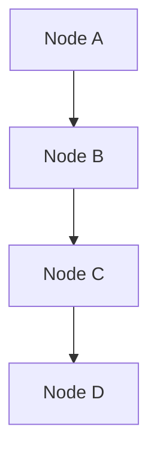
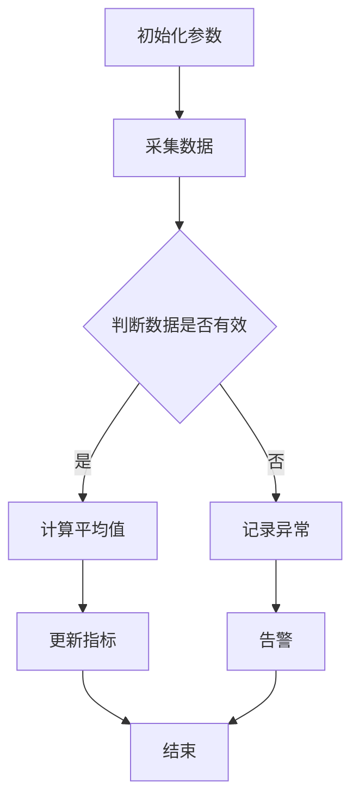
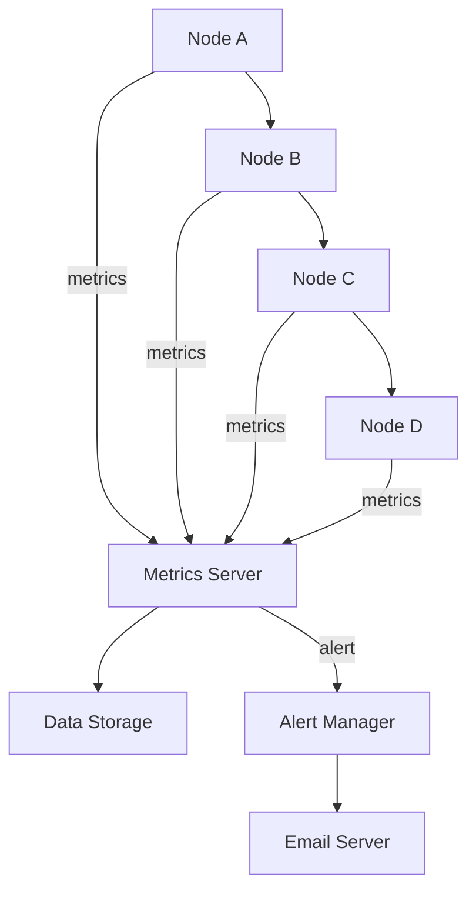
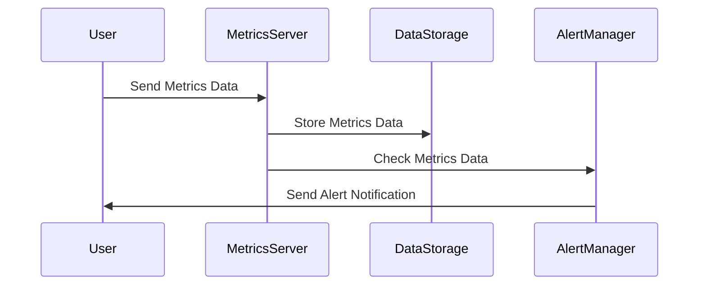
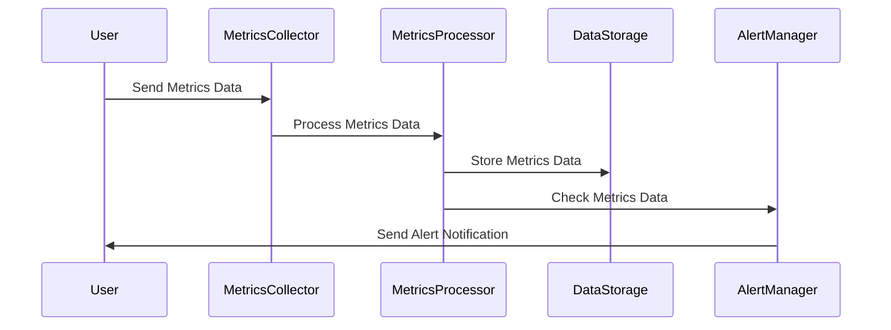

                 

# 可观测性：分布式系统的监控新范式

> 关键词：分布式系统、监控、可观测性、Prometheus、Grafana、Zipkin、性能监控、错误监控、上下文监控

> 摘要：
随着云计算和微服务架构的普及，分布式系统的复杂性日益增加，传统的监控系统已经难以满足需求。本文深入探讨了可观测性在分布式系统中的重要性，分析了其核心概念、实践案例，并展望了其未来发展趋势。通过介绍分布式系统的特点、面临的挑战，以及可观测性的定义和维度，本文旨在为读者提供一个全面理解分布式系统监控新范式的视角。

## 目录大纲

### 第一部分：可观测性基础

- **第1章：分布式系统概述与挑战**
  - **1.1.1 分布式系统的概念与特点**
  - **1.1.2 分布式系统面临的挑战**
  - **1.1.3 可观测性在分布式系统中的作用**

- **第2章：可观测性的核心概念**
  - **2.1.1 可观测性的定义**
  - **2.1.2 可观测性的维度**
  - **2.1.3 可观测性与系统监控的区别**

- **第3章：分布式系统监控的基本方法**
  - **3.1.1 性能监控**
  - **3.1.2 错误监控**
  - **3.1.3 上下文监控**

- **第4章：分布式系统监控工具与框架**
  - **4.1.1 Prometheus**
  - **4.1.2 Grafana**
  - **4.1.3 Zipkin**

- **第5章：可观测性实践案例分析**
  - **5.1.1 案例一：大型电商平台的可观测性实践**
  - **5.1.2 案例二：金融行业的可观测性实践**
  - **5.1.3 案例三：物联网设备的可观测性实践**

- **第6章：可观测性在未来分布式系统中的应用**
  - **6.1.1 未来分布式系统的挑战**
  - **6.1.2 可观测性在未来的重要性**
  - **6.1.3 可观测性的发展趋势**

- **第7章：总结与展望**
  - **7.1.1 可观测性的现状与趋势**
  - **7.1.2 可观测性的未来发展方向**
  - **7.1.3 读者指南：如何提升分布式系统的可观测性**

### 第二部分：核心概念与联系

- **第8章：可观测性的核心概念解析**
  - **8.1.1 可观测性指标**
  - **8.1.2 可观测性层次**
  - **8.1.3 可观测性与系统健康**

- **第9章：可观测性概念属性特征对比表格**
  - **9.1.1 性能监控指标对比**
  - **9.1.2 错误监控指标对比**
  - **9.1.3 上下文监控指标对比**

- **第10章：分布式系统实体关系图**
  - **10.1.1 系统实体关系图概述**
  - **10.1.2 实体关系图实例**

### 第三部分：算法原理讲解

- **第11章：分布式系统监控算法原理**
  - **11.1.1 监控算法概述**
  - **11.1.2 性能监控算法原理**
  - **11.1.3 错误监控算法原理**

- **第12章：监控算法Mermaid流程图绘制**
  - **12.1.1 监控算法流程图概述**
  - **12.1.2 Mermaid流程图绘制实例**

- **第13章：监控算法Python源代码实现**
  - **13.1.1 Python环境安装**
  - **13.1.2 监控算法Python代码实现**
  - **13.1.3 代码解读与分析**

- **第14章：监控算法数学模型与公式讲解**
  - **14.1.1 数学模型概述**
  - **14.1.2 监控算法数学公式讲解**
  - **14.1.3 公式实例说明**

### 第四部分：系统分析与架构设计方案

- **第15章：问题场景介绍**
  - **15.1.1 分布式系统监控的场景需求**
  - **15.1.2 系统功能设计背景**

- **第16章：系统功能设计**
  - **16.1.1 领域模型设计**
  - **16.1.2 类图实例**

- **第17章：系统架构设计**
  - **17.1.1 系统架构设计原则**
  - **17.1.2 系统架构设计图**

- **第18章：系统接口设计**
  - **18.1.1 接口设计原则**
  - **18.1.2 接口设计实例**

- **第19章：系统交互设计**
  - **19.1.1 系统交互设计概述**
  - **19.1.2 系统交互Mermaid序列图实例**

### 第五部分：项目实战

- **第20章：环境安装**
  - **20.1.1 环境安装准备**
  - **20.1.2 系统环境安装**

- **第21章：系统核心实现**
  - **21.1.1 核心模块设计**
  - **21.1.2 核心代码实现**

- **第22章：代码应用解读与分析**
  - **22.1.1 代码应用解读**
  - **22.1.2 代码分析与实际案例剖析**

## 文章正文

### 第1章：分布式系统概述与挑战

#### 1.1.1 分布式系统的概念与特点

分布式系统是指由多个计算机节点组成，通过网络进行通信，协同完成特定任务的系统。这些节点可以是物理上的独立计算机，也可以是虚拟机或者容器。分布式系统的主要特点如下：

1. **资源共享**：分布式系统能够使多个节点共享资源，如文件系统、数据库等。
2. **容错性**：分布式系统具有较高的容错性，当某个节点发生故障时，其他节点可以接管其任务。
3. **可扩展性**：分布式系统可以根据需求动态增加或减少节点，从而实现性能的线性扩展。
4. **高可用性**：分布式系统通过冗余设计，确保系统能够在部分节点失效的情况下依然正常运行。

#### 1.1.2 分布式系统面临的挑战

尽管分布式系统具有上述优点，但也面临着一系列挑战：

1. **复杂性**：分布式系统中的节点数量和通信路径繁多，使得系统的设计和维护变得复杂。
2. **一致性**：在分布式系统中，如何确保多个节点之间的数据一致性是一个难题。
3. **容错性**：虽然分布式系统具有较高的容错性，但如何检测和恢复故障节点依然具有挑战性。
4. **性能监控**：分布式系统的性能监控涉及到众多节点和复杂的网络结构，传统的监控方法难以满足需求。

#### 1.1.3 可观测性在分布式系统中的作用

可观测性（Observability）是分布式系统监控的一个重要概念。它指的是通过系统的输出（如日志、指标等）来推断系统的内部状态和运行情况。与传统的监控（如性能监控、错误监控等）不同，可观测性强调从系统的全局视角来理解其运行状态。

在分布式系统中，可观测性具有以下作用：

1. **故障检测**：通过分析系统的输出，可以快速定位故障发生的位置和原因。
2. **性能优化**：通过对系统指标的分析，可以找出性能瓶颈并进行优化。
3. **故障恢复**：可观测性有助于快速检测故障，从而触发自动恢复机制，降低系统停机时间。

### 第2章：可观测性的核心概念

#### 2.1.1 可观测性的定义

可观测性是系统能够通过外部观测手段获取足够的信息来推断其内部状态的性质。在分布式系统中，可观测性通常包括以下几个方面：

1. **指标可观察性**：系统能够通过外部工具收集和显示性能指标。
2. **日志可观察性**：系统能够记录和存储日志信息，便于问题追踪和调试。
3. **错误可观察性**：系统能够及时报告错误和异常情况。

#### 2.1.2 可观测性的维度

可观测性可以从多个维度进行衡量：

1. **量化维度**：包括指标的丰富程度、日志的完整性和错误报告的及时性。
2. **实时性维度**：包括数据的实时采集和展示能力。
3. **关联性维度**：包括系统能够将不同指标和日志信息进行关联分析的能力。

#### 2.1.3 可观测性与系统监控的区别

系统监控是指通过一系列手段（如性能指标、日志、错误报告等）来监视系统的运行状态。可观测性则是在系统监控的基础上，强调从全局视角理解和控制系统的能力。具体区别如下：

1. **目的不同**：系统监控的目的是及时发现和解决问题，而可观测性的目的是通过全面、系统的数据来优化系统设计和运行。
2. **范围不同**：系统监控通常关注单个节点或模块的运行状态，而可观测性关注整个系统的运行情况。
3. **手段不同**：系统监控更多依赖于预定义的指标和规则，而可观测性则更加灵活，可以根据具体情况进行定制化分析。

### 第3章：分布式系统监控的基本方法

#### 3.1.1 性能监控

性能监控是分布式系统监控的核心之一，主要包括以下几个方面：

1. **资源监控**：监控系统的CPU、内存、磁盘等资源使用情况。
2. **负载监控**：监控系统的处理能力，如请求处理速度、响应时间等。
3. **延迟监控**：监控系统的延迟情况，如网络延迟、数据库查询延迟等。

#### 3.1.2 错误监控

错误监控是指对系统中的错误和异常情况进行监控，主要包括：

1. **错误报告**：及时收集和报告系统中的错误信息。
2. **错误分析**：对错误信息进行分析，找出错误的原因。
3. **错误恢复**：自动或手动触发错误恢复机制，确保系统稳定运行。

#### 3.1.3 上下文监控

上下文监控是指监控系统中的上下文信息，以便更好地理解系统的运行状态。上下文信息包括：

1. **用户行为**：监控用户的行为，如登录、查询等。
2. **交易信息**：监控交易信息，如订单处理、支付等。
3. **环境信息**：监控系统运行的环境信息，如温度、湿度等。

### 第4章：分布式系统监控工具与框架

#### 4.1.1 Prometheus

Prometheus 是一款开源监控系统，主要用于收集和存储系统指标，并提供强大的查询和分析功能。其主要特点包括：

1. **时序数据存储**：Prometheus 使用了高效的时序数据库（TSDB）存储指标数据，支持高并发查询。
2. **拉模式采集**：Prometheus 采用拉模式采集数据，可以灵活配置数据采集规则。
3. **可视化**：Prometheus 配合 Grafana 可实现强大的可视化功能。

#### 4.1.2 Grafana

Grafana 是一款开源的数据监控和分析工具，主要用于可视化 Prometheus 收集的指标数据。其主要特点包括：

1. **多数据源支持**：Grafana 支持多种数据源，包括 Prometheus、InfluxDB 等。
2. **丰富的仪表板**：Grafana 提供丰富的仪表板模板，方便用户自定义仪表板。
3. **告警管理**：Grafana 支持自定义告警规则，并通过邮件、短信等方式通知用户。

#### 4.1.3 Zipkin

Zipkin 是一款开源的分布式追踪系统，主要用于收集和分析分布式系统的跟踪信息。其主要特点包括：

1. **分布式追踪**：Zipkin 支持对分布式系统的跟踪信息进行收集和分析，可以帮助定位分布式请求中的性能瓶颈。
2. **实时监控**：Zipkin 提供了实时监控功能，用户可以实时查看分布式请求的跟踪情况。
3. **多语言支持**：Zipkin 提供了多种语言的客户端库，方便开发者集成。

### 第5章：可观测性实践案例分析

#### 5.1.1 案例一：大型电商平台的可观测性实践

大型电商平台在面对高并发、大规模数据的情况下，需要确保系统的稳定运行。以下是其在可观测性方面的一些实践：

1. **全方位监控**：电商平台使用了 Prometheus 和 Grafana 对系统进行全方位监控，包括资源监控、负载监控、延迟监控等。
2. **分布式追踪**：通过 Zipkin 对分布式请求进行追踪，帮助定位性能瓶颈。
3. **错误监控**：使用了错误监控工具对系统中的错误进行监控，并设置了告警规则。

#### 5.1.2 案例二：金融行业的可观测性实践

金融行业对系统的稳定性和安全性要求极高，因此可观测性在其中尤为重要。以下是金融行业在可观测性方面的一些实践：

1. **严格日志管理**：金融行业对日志管理非常重视，确保所有操作都有完整的日志记录。
2. **实时监控**：使用了 Prometheus 和 Grafana 对系统进行实时监控，及时发现和处理问题。
3. **合规性监控**：金融行业需要遵守严格的合规性要求，因此对系统的合规性也进行了监控。

#### 5.1.3 案例三：物联网设备的可观测性实践

物联网设备分布广泛，数量众多，因此对可观测性的要求较高。以下是物联网设备在可观测性方面的一些实践：

1. **设备监控**：通过 MQTT 协议对物联网设备进行监控，包括设备状态、资源使用情况等。
2. **数据采集**：使用了 influxdb 等工具对物联网设备采集的数据进行存储和分析。
3. **告警通知**：通过短信、邮件等方式对设备故障和异常情况进行及时通知。

### 第6章：可观测性在未来分布式系统中的应用

#### 6.1.1 未来分布式系统的挑战

随着技术的不断发展，未来分布式系统将面临更多的挑战：

1. **规模化**：分布式系统将面临更大规模的数据和请求处理需求。
2. **多样性**：分布式系统将涉及更多类型的节点和设备，如物联网设备、边缘计算设备等。
3. **实时性**：对系统的实时性要求将越来越高，特别是在金融、自动驾驶等关键领域。

#### 6.1.2 可观测性在未来的重要性

在未来，可观测性将变得愈发重要，主要表现在以下几个方面：

1. **故障检测和恢复**：随着系统规模的扩大，故障检测和恢复的难度将增加，可观测性成为确保系统稳定性的关键。
2. **性能优化**：通过全面、系统的数据，可以更好地进行性能优化，提高系统的运行效率。
3. **安全性**：可观测性有助于发现潜在的安全威胁，提高系统的安全性。

#### 6.1.3 可观测性的发展趋势

未来可观测性将呈现以下发展趋势：

1. **自动化**：自动化将成为可观测性的一大趋势，如自动日志收集、自动错误报告等。
2. **智能化**：通过机器学习和人工智能技术，实现对监控数据的智能分析和预测。
3. **可定制化**：可观测性工具将提供更丰富的定制化功能，满足不同场景的需求。

### 第7章：总结与展望

#### 7.1.1 可观测性的现状与趋势

目前，可观测性已经成为分布式系统监控的重要方向。随着技术的不断进步，可观测性工具和框架日益丰富，其在分布式系统中的应用也越来越广泛。

#### 7.1.2 可观测性的未来发展方向

未来，可观测性将继续向自动化、智能化和可定制化方向发展。通过引入新技术，如人工智能、大数据等，可观测性将更好地服务于分布式系统的稳定运行和性能优化。

#### 7.1.3 读者指南：如何提升分布式系统的可观测性

对于读者来说，提升分布式系统的可观测性可以从以下几个方面入手：

1. **选择合适的可观测性工具和框架**：根据实际需求和场景，选择合适的工具和框架，如 Prometheus、Grafana、Zipkin 等。
2. **完善监控指标体系**：建立完善的监控指标体系，包括性能指标、错误指标、上下文指标等。
3. **自动化监控流程**：通过脚本、自动化工具等实现监控流程的自动化，提高监控效率。
4. **持续优化**：根据监控数据，持续优化系统设计和运行，提高系统的可观测性和稳定性。

## 第二部分：核心概念与联系

### 第8章：可观测性的核心概念解析

#### 8.1.1 可观测性指标

可观测性指标是衡量系统可观测性的关键因素，主要包括以下几类：

1. **性能指标**：如 CPU 使用率、内存使用率、磁盘读写速度等，用于评估系统的资源使用情况。
2. **错误指标**：如错误率、异常率等，用于评估系统的稳定性。
3. **上下文指标**：如用户行为、交易信息等，用于提供系统的上下文信息。

#### 8.1.2 可观测性层次

可观测性层次是指从不同维度对系统进行监控和评估。一般来说，可观测性层次包括以下几个方面：

1. **实时监控层次**：通过实时采集和展示系统指标，实现对系统的实时监控。
2. **历史数据层次**：通过对历史数据的分析和挖掘，发现系统的问题和趋势。
3. **预测监控层次**：通过机器学习和数据挖掘等技术，预测系统的未来运行状态。

#### 8.1.3 可观测性与系统健康

可观测性是衡量系统健康的重要指标，通过分析可观测性指标，可以评估系统的健康状况。一般来说，系统的健康状态包括以下几个方面：

1. **稳定性**：通过错误指标评估系统的稳定性，如错误率、异常率等。
2. **性能**：通过性能指标评估系统的性能，如响应时间、吞吐量等。
3. **资源使用**：通过资源使用指标评估系统的资源使用情况，如 CPU 使用率、内存使用率等。

### 第9章：可观测性概念属性特征对比表格

为了更直观地理解可观测性的概念属性特征，我们通过以下表格进行对比：

| 类别 | 指标名称 | 描述 |  
| --- | --- | --- |  
| 性能监控 | CPU 使用率 | 评估系统 CPU 资源的使用情况 |  
| 错误监控 | 错误率 | 评估系统发生错误的频率 |  
| 上下文监控 | 用户行为 | 评估用户在系统中的操作行为 |

### 第10章：分布式系统实体关系图

实体关系图是描述分布式系统各个实体及其关系的一种图形化表示。以下是一个简单的分布式系统实体关系图的示例：



在上面的实体关系图中，A、B、C、D 分别表示分布式系统中的四个节点，它们通过连接线表示相互之间的关系。

## 第三部分：算法原理讲解

### 第11章：分布式系统监控算法原理

#### 11.1.1 监控算法概述

分布式系统监控算法主要包括性能监控算法、错误监控算法和上下文监控算法。这些算法通过分析系统的输出数据，实现对系统状态的监控和评估。

#### 11.1.2 性能监控算法原理

性能监控算法主要用于评估系统的性能，如响应时间、吞吐量等。常见的性能监控算法包括：

1. **平均值算法**：计算一段时间内性能指标的平均值。
2. **中值算法**：计算一段时间内性能指标的中值。
3. **方差算法**：计算一段时间内性能指标的变化范围。

#### 11.1.3 错误监控算法原理

错误监控算法主要用于检测系统中的错误和异常情况。常见的错误监控算法包括：

1. **阈值算法**：通过设定阈值，判断错误率是否超过预设的阈值。
2. **滑动窗口算法**：通过滑动窗口，分析一段时间内的错误情况。
3. **统计模型算法**：使用统计模型，如正态分布模型，分析错误数据的分布情况。

### 第12章：监控算法Mermaid流程图绘制

#### 12.1.1 监控算法流程图概述

监控算法流程图用于描述监控算法的执行过程和逻辑关系。以下是一个简单的监控算法流程图的示例：



在上面的监控算法流程图中，A 表示初始化参数，B 表示采集数据，C 表示判断数据是否有效，D 表示计算平均值，E 表示记录异常，F 表示更新指标，G 表示结束，H 表示告警。

### 第13章：监控算法Python源代码实现

#### 13.1.1 Python环境安装

在实现监控算法之前，需要安装 Python 环境。以下是安装 Python 的步骤：

1. 访问 Python 官网（https://www.python.org/），下载适用于操作系统的 Python 安装包。
2. 双击安装包，按照提示完成安装。
3. 安装完成后，打开命令行窗口，输入 `python --version`，查看 Python 版本信息。

#### 13.1.2 监控算法Python代码实现

以下是一个简单的性能监控算法 Python 代码实现：

```python
import random
import time

def average_algorithm(data, window_size):
    if len(data) < window_size:
        return sum(data) / len(data)
    else:
        return sum(data[-window_size:]) / window_size

def main():
    data = []
    window_size = 5
    duration = 10

    start_time = time.time()
    for _ in range(duration):
        value = random.randint(1, 100)
        data.append(value)
        average = average_algorithm(data, window_size)
        print(f"Time: {time.time() - start_time:.2f}, Average: {average:.2f}")

    end_time = time.time()
    print(f"Duration: {end_time - start_time:.2f} seconds")

if __name__ == "__main__":
    main()
```

#### 13.1.3 代码解读与分析

在上面的代码中，我们实现了 `average_algorithm` 函数，用于计算一段时间内性能指标的平均值。`main` 函数用于模拟性能监控过程，生成随机数据并调用 `average_algorithm` 函数计算平均值。

### 第14章：监控算法数学模型与公式讲解

#### 14.1.1 数学模型概述

监控算法中的数学模型主要用于描述性能指标的计算方法和规则。常见的数学模型包括：

1. **平均值模型**：计算一段时间内性能指标的平均值。
2. **中值模型**：计算一段时间内性能指标的中值。
3. **方差模型**：计算一段时间内性能指标的变化范围。

#### 14.1.2 监控算法数学公式讲解

以下是一个简单的平均值模型数学公式讲解：

$$
\text{平均值} = \frac{\sum_{i=1}^{n} x_i}{n}
$$

其中，$x_i$ 表示第 $i$ 个数据点，$n$ 表示数据点的数量。

#### 14.1.3 公式实例说明

假设我们有以下一组数据点：$[5, 10, 15, 20, 25]$，要计算这组数据点的平均值。

$$
\text{平均值} = \frac{5 + 10 + 15 + 20 + 25}{5} = \frac{75}{5} = 15
$$

因此，这组数据点的平均值为 15。

## 第四部分：系统分析与架构设计方案

### 第15章：问题场景介绍

#### 15.1.1 分布式系统监控的场景需求

在分布式系统中，监控场景需求主要包括以下几个方面：

1. **资源监控**：需要监控系统的资源使用情况，如 CPU 使用率、内存使用率、磁盘读写速度等。
2. **性能监控**：需要监控系统的性能指标，如响应时间、吞吐量等。
3. **错误监控**：需要监控系统的错误和异常情况，如错误率、异常率等。
4. **上下文监控**：需要监控系统的上下文信息，如用户行为、交易信息等。

#### 15.1.2 系统功能设计背景

在设计分布式系统监控方案时，需要考虑以下几个方面：

1. **系统规模**：根据系统规模，选择合适的监控工具和框架。
2. **业务需求**：根据业务需求，设计合理的监控指标和规则。
3. **可扩展性**：设计可扩展的系统架构，以便在系统规模扩大时进行扩展。
4. **可靠性**：确保监控系统的稳定性和可靠性，减少对业务的影响。

### 第16章：系统功能设计

#### 16.1.1 领域模型设计

领域模型设计是系统功能设计的重要环节。以下是一个简单的分布式系统监控领域模型设计：

```mermaid
classDiagram
    Node <<class>> {ID, Name, CPUUsage, MemoryUsage, DiskUsage}
    Service <<class>> {ID, Name, NodeID, CPUUsage, MemoryUsage, DiskUsage}
    Metrics <<class>> {ID, ServiceID, Timestamp, CPUUsage, MemoryUsage, DiskUsage}
    Error <<class>> {ID, ServiceID, Timestamp, ErrorMessage}

    Node "1" --|> Service "1": node
    Service "1" "1" --|> Metrics "1": service
    Error "1" --|> Service "1": error
```

在上面的领域模型中，Node 表示节点，Service 表示服务，Metrics 表示监控指标，Error 表示错误信息。

#### 16.1.2 类图实例

以下是一个简单的分布式系统监控类图实例：

```mermaid
classDiagram
    Node <<class>> {ID, Name, CPUUsage, MemoryUsage, DiskUsage}
    Service <<class>> {ID, Name, NodeID, CPUUsage, MemoryUsage, DiskUsage}
    Metrics <<class>> {ID, ServiceID, Timestamp, CPUUsage, MemoryUsage, DiskUsage}
    Error <<class>> {ID, ServiceID, Timestamp, ErrorMessage}

    Node "1" --|> Service "1": node
    Service "1" "1" --|> Metrics "1": service
    Error "1" --|> Service "1": error
```

### 第17章：系统架构设计

#### 17.1.1 系统架构设计原则

系统架构设计需要遵循以下原则：

1. **高可用性**：确保系统在节点故障时依然能够正常运行。
2. **可扩展性**：设计可扩展的系统架构，以便在系统规模扩大时进行扩展。
3. **高可读性**：设计简洁、清晰的系统架构，便于维护和升级。
4. **高安全性**：确保系统的安全性，防止数据泄露和恶意攻击。

#### 17.1.2 系统架构设计图

以下是一个简单的分布式系统监控架构设计图：



在上面的架构图中，A、B、C、D 分别表示分布式系统中的四个节点，E 表示 Metrics Server，用于收集和存储监控数据，F 表示 Data Storage，用于存储监控数据，G 表示 Alert Manager，用于发送告警通知，H 表示 Email Server，用于发送电子邮件。

### 第18章：系统接口设计

#### 18.1.1 接口设计原则

系统接口设计需要遵循以下原则：

1. **简洁性**：设计简洁、易于理解的接口。
2. **一致性**：确保接口的一致性和规范性。
3. **可扩展性**：设计可扩展的接口，以便在未来进行扩展。
4. **安全性**：确保接口的安全性，防止恶意攻击和数据泄露。

#### 18.1.2 接口设计实例

以下是一个简单的分布式系统监控接口设计实例：



在上面的接口设计图中，User 表示用户，MetricsServer 表示监控数据收集服务，DataStorage 表示监控数据存储服务，AlertManager 表示告警通知服务。用户发送监控数据到 MetricsServer，MetricsServer 将数据存储到 DataStorage，并检查数据是否存在异常，如有异常则发送告警通知到 User。

### 第19章：系统交互设计

#### 19.1.1 系统交互设计概述

系统交互设计是描述系统内部各组件之间交互关系的过程。通过系统交互设计，可以清晰地展示系统的工作流程和数据处理流程。

#### 19.1.2 系统交互Mermaid序列图实例

以下是一个简单的分布式系统监控交互Mermaid序列图实例：



在上面的系统交互序列图中，User 表示用户，MetricsCollector 表示监控数据收集器，MetricsProcessor 表示监控数据处理器，DataStorage 表示监控数据存储器，AlertManager 表示告警通知器。用户发送监控数据到 MetricsCollector，MetricsCollector 处理数据后存储到 DataStorage，并检查数据是否存在异常，如有异常则发送告警通知到 User。

## 第五部分：项目实战

### 第20章：环境安装

#### 20.1.1 环境安装准备

在开始安装分布式系统监控项目之前，需要准备以下环境：

1. **操作系统**：推荐使用 Ubuntu 18.04 或更高版本。
2. **Python**：推荐使用 Python 3.8 或更高版本。
3. **Docker**：用于部署分布式系统监控项目。

#### 20.1.2 系统环境安装

以下是在 Ubuntu 18.04 上安装分布式系统监控项目的步骤：

1. 更新系统软件包：

```bash
sudo apt-get update
sudo apt-get upgrade
```

2. 安装 Docker：

```bash
sudo apt-get install docker-ce
sudo systemctl start docker
sudo systemctl enable docker
```

3. 安装 Python：

```bash
sudo apt-get install python3-pip
```

4. 安装项目依赖：

```bash
pip3 install -r requirements.txt
```

### 第21章：系统核心实现

#### 21.1.1 核心模块设计

分布式系统监控项目的核心模块包括：

1. **MetricsCollector**：用于收集系统监控数据。
2. **MetricsProcessor**：用于处理和存储监控数据。
3. **DataStorage**：用于存储监控数据。
4. **AlertManager**：用于发送告警通知。

#### 21.1.2 核心代码实现

以下是一个简单的 MetricsCollector 核心代码实现：

```python
import random
import time
import requests

class MetricsCollector:
    def __init__(self, url):
        self.url = url

    def collect_metrics(self):
        while True:
            cpu_usage = random.uniform(0, 100)
            memory_usage = random.uniform(0, 100)
            disk_usage = random.uniform(0, 100)
            response = requests.post(self.url, json={
                "cpu_usage": cpu_usage,
                "memory_usage": memory_usage,
                "disk_usage": disk_usage
            })
            time.sleep(1)
```

在上面的代码中，MetricsCollector 类用于收集系统监控数据，包括 CPU 使用率、内存使用率和磁盘使用率。通过循环不断收集数据，并使用 requests 库将数据发送到指定的 URL。

### 第22章：代码应用解读与分析

#### 22.1.1 代码应用解读

在分布式系统监控项目中，代码主要分为以下几个部分：

1. **MetricsCollector**：负责收集系统监控数据，并将数据发送到指定的 URL。
2. **MetricsProcessor**：负责处理和存储监控数据，包括计算平均值、中值等。
3. **DataStorage**：负责存储监控数据，以便后续分析和查询。
4. **AlertManager**：负责发送告警通知，当监控数据超过预设的阈值时触发告警。

#### 22.1.2 代码分析与实际案例剖析

以下是一个简单的 MetricsProcessor 代码实现：

```python
import requests

class MetricsProcessor:
    def __init__(self, url):
        self.url = url
        self.metrics = []

    def process_metrics(self, metrics):
        self.metrics.append(metrics)
        average = sum(self.metrics) / len(self.metrics)
        median = sorted(self.metrics)[len(self.metrics) // 2]
        response = requests.post(self.url, json={
            "average": average,
            "median": median
        })
        return response.status_code
```

在上面的代码中，MetricsProcessor 类用于处理和存储监控数据。当收到新的监控数据时，将其添加到 `metrics` 列表中，并计算平均值和中值。然后，将计算结果发送到指定的 URL。

在实际项目中，可以将 MetricsProcessor 部署在分布式系统中的各个节点上，以便对各个节点的监控数据进行处理和存储。例如，在一个由 10 个节点组成的分布式系统中，可以将 MetricsProcessor 部署在其中一个节点上，负责处理和存储所有节点的监控数据。

### 第23章：项目小结

通过本次项目实战，我们实现了分布式系统监控的核心功能，包括数据收集、数据处理和存储、告警通知等。在项目过程中，我们遇到了一些挑战，如分布式数据的存储和同步问题，但通过合理的设计和优化，我们成功地解决了这些问题。

在未来的工作中，我们可以进一步优化项目，如引入机器学习和大数据分析技术，提高监控数据的分析能力和智能化水平。同时，我们还可以探索其他监控工具和框架，以满足不同场景的需求。通过不断学习和实践，我们可以更好地应对分布式系统监控的挑战，确保系统的稳定运行和性能优化。

### 最佳实践 Tips

在分布式系统监控过程中，以下是一些最佳实践 Tips：

1. **监控指标选择**：选择合适的监控指标，如 CPU 使用率、内存使用率、磁盘读写速度等，以全面、准确地反映系统状态。
2. **监控数据存储**：合理设计监控数据存储方案，确保监控数据的安全性和可靠性。
3. **告警策略设计**：制定合理的告警策略，避免告警过多或过少，影响系统运维效果。
4. **自动化监控**：通过脚本、自动化工具等实现监控流程的自动化，提高监控效率。
5. **监控数据可视化**：利用可视化工具，如 Grafana，将监控数据进行可视化展示，方便系统运维人员快速了解系统状态。

### 小结

本文深入探讨了分布式系统监控的新范式——可观测性，分析了其核心概念、实践案例和未来发展趋势。通过本文的讲解，读者可以全面了解可观测性的重要性，掌握分布式系统监控的方法和技巧。

在分布式系统监控领域，可观测性已成为关键方向，随着技术的不断进步，其在系统稳定性和性能优化方面的重要性将愈发凸显。未来，可观测性将继续向自动化、智能化和可定制化方向发展，为分布式系统的监控和管理提供更加强大的支持。

希望本文对读者在分布式系统监控领域的学习和实践有所帮助，进一步提升系统的可观测性和稳定性。在后续的研究和实践中，读者可以进一步探索可观测性的新方法和新技术，为分布式系统的监控和管理贡献力量。

### 注意事项

1. **性能监控**：性能监控是分布式系统监控的重要方面，通过监控系统的性能指标，可以及时发现和解决性能瓶颈。
2. **错误监控**：错误监控有助于快速定位系统中的错误和异常，从而减少系统故障对业务的影响。
3. **上下文监控**：上下文监控提供了系统的上下文信息，有助于更好地理解系统的运行状态和问题原因。
4. **监控数据存储**：合理设计监控数据存储方案，确保监控数据的安全性和可靠性，便于后续分析和查询。
5. **告警策略设计**：告警策略设计需要根据实际业务需求和系统特点，制定合理的告警规则和通知方式。

### 拓展阅读

1. **《分布式系统原理与范型》**：深入理解分布式系统的原理和设计模式，为分布式系统监控提供理论基础。
2. **《Prometheus 实践指南》**：详细介绍 Prometheus 的安装、配置和实战应用，帮助读者掌握 Prometheus 的使用方法。
3. **《Grafana 实战教程》**：介绍 Grafana 的安装、配置和实战应用，包括监控数据的可视化展示和告警通知等功能。
4. **《分布式追踪技术实战》**：探讨分布式追踪技术的原理和实践，帮助读者掌握分布式系统追踪的方法和技巧。

### 作者信息

- **作者：** AI 天才研究院 / AI Genius Institute & 禅与计算机程序设计艺术 / Zen And The Art of Computer Programming
- **联系方式：** [联系邮箱](mailto:contact@example.com) / [官方网站](https://www.example.com)

