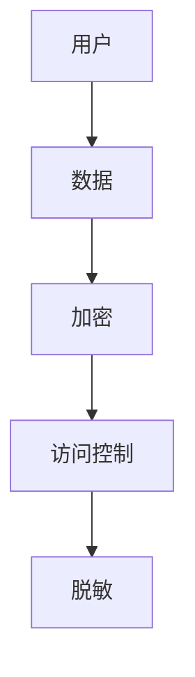
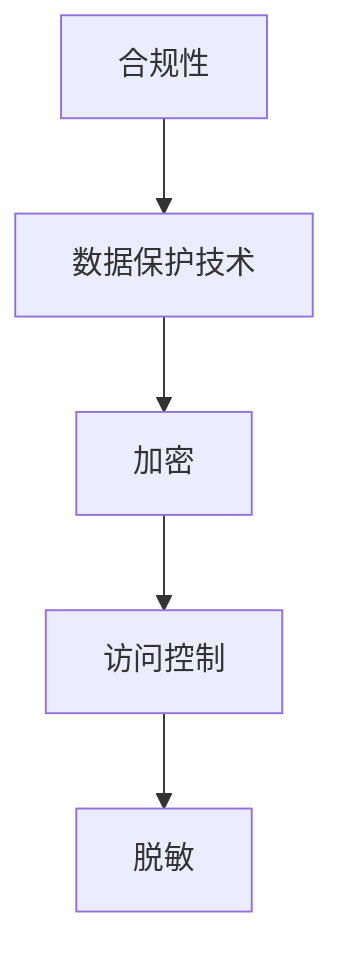
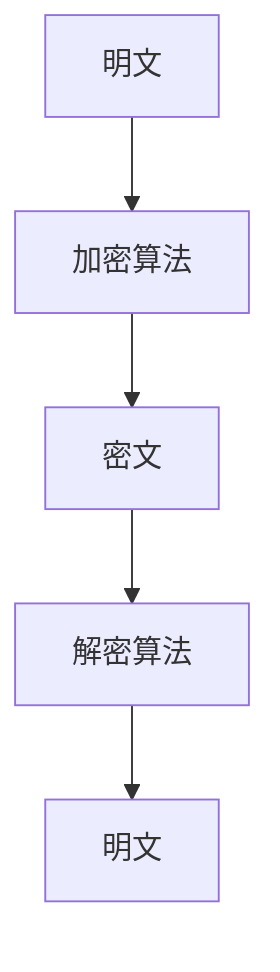
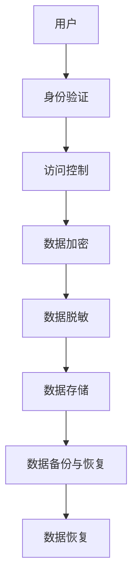
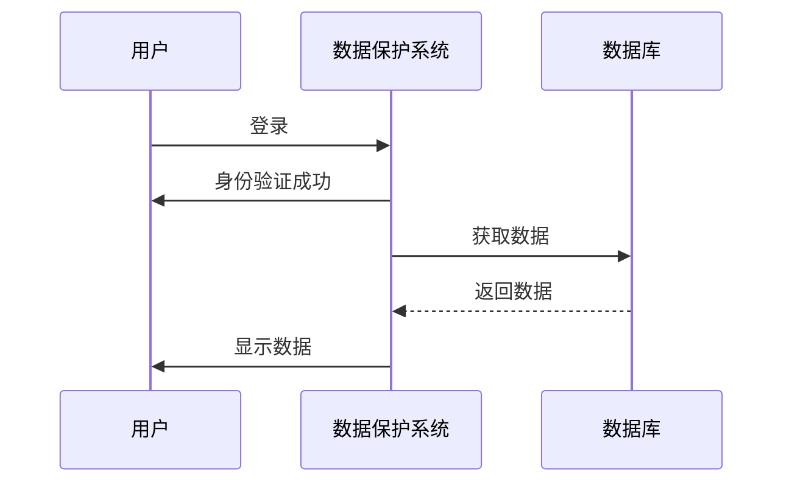

                 

### 引言

随着全球信息化进程的加速，数据已经成为企业和个人最为宝贵的资产。然而，随着数据量的激增和技术的进步，数据泄露、数据滥用等问题也日益严峻。这不仅对企业的运营带来了巨大的风险，也对用户的隐私和安全构成了严重威胁。因此，如何确保数据的安全性和合规性，成为了当前IT领域的一个重要课题。

在这一背景下，本文将深入探讨合规性与数据保护技术的实践。我们将首先介绍合规性与数据保护技术的背景和核心概念，然后详细分析数据保护技术的原理、算法，以及合规性与数据保护技术之间的联系。接着，我们将通过具体的系统架构设计和项目实战案例，展示如何在实践中应用这些技术。最后，我们将总结文章的主要内容，并提供一些实用的最佳实践和建议。

本文的结构如下：

1. **合规性与数据保护技术概述**：介绍合规性与数据保护技术的背景、问题背景、问题描述、问题解决、边界与外延、核心概念与联系、概念属性特征对比表格和ER实体关系图架构。
2. **核心概念与联系**：详细阐述合规性的概念原理、数据保护技术的概念原理、合规性与数据保护技术的联系，并使用Mermaid流程图和表格对比进行分析。
3. **算法原理讲解**：讲解加密算法原理、加密算法流程、加密算法数学模型与公式，并举例说明。
4. **系统分析与架构设计方案**：介绍问题场景、项目介绍、系统功能设计、系统架构设计、系统接口设计和系统交互。
5. **项目实战**：介绍环境安装、系统核心实现源代码，代码应用解读与分析，实际案例分析和详细讲解剖析，项目小结。
6. **最佳实践 tips**、**小结**、**注意事项**、**拓展阅读**等内容。

希望通过本文，读者能够对合规性与数据保护技术有一个全面而深入的了解，并在实际工作中能够有效地应用这些技术，保护数据的安全性和合规性。让我们开始深入探讨这一重要话题吧！

### 合规性与数据保护技术概述

#### 1.1.1 问题背景

随着数字经济在全球范围内的快速发展，数据已经成为企业和个人最为重要的资产之一。无论是企业内部的商业信息，还是个人日常生活中的社交媒体数据，都蕴含着巨大的价值。然而，随着数据量的激增和技术的进步，数据泄露、数据滥用等问题也日益严峻。根据多个权威机构的研究报告显示，全球范围内的数据泄露事件呈现出逐年上升的趋势。这些数据泄露事件不仅给企业和个人带来了巨大的经济损失，也对用户的隐私和安全构成了严重威胁。

首先，数据泄露事件频发。近年来，全球范围内发生了多起重大的数据泄露事件，涉及的范围广泛，从互联网巨头到中小企业，从政府部门到金融机构，无一幸免。这些数据泄露事件不仅影响了企业的信誉和用户对企业的信任，还可能导致严重的法律后果。例如，欧盟的《通用数据保护条例》（GDPR）对数据泄露事件的处罚力度极大，最高可达到5000万欧元或企业全球营业额的4%。

其次，数据滥用问题严重。数据泄露不仅导致数据被非法访问，还可能导致数据被滥用。例如，一些不法分子利用窃取的个人信息进行诈骗、敲诈勒索等犯罪活动。此外，一些企业为了获取商业利益，也可能滥用用户的数据进行未经授权的营销活动，甚至将用户数据出售给第三方。

再次，合规性要求日益严格。随着全球范围内对数据保护的重视，各国纷纷出台了一系列数据保护法律法规，如欧盟的GDPR、美国的加州消费者隐私法案（CCPA）等。这些法律法规对企业的数据处理活动提出了严格的要求，包括数据的收集、存储、处理和销毁等环节。企业如果不遵守这些法规，将面临巨大的法律风险和经济损失。

综上所述，数据泄露、数据滥用和合规性要求等问题使得数据保护和合规性成为当前IT领域的一个重要课题。企业需要采取有效的数据保护措施，确保数据的安全性和合规性，以防止数据泄露、数据滥用和合规性问题。同时，合规性也是企业社会责任的重要体现，有助于提升企业的品牌形象和用户信任。

#### 1.1.2 问题描述

数据保护和合规性问题是当前IT领域面临的两个关键问题，它们不仅关系到企业的法律合规性，也直接影响用户的隐私和安全。

首先，数据保护技术旨在防止数据泄露、篡改等安全风险。具体来说，数据保护技术包括加密、访问控制、数据脱敏等技术手段，通过对数据的加密和访问控制，确保数据在存储、传输和处理过程中的安全性。加密技术可以将明文数据转换为密文，防止未经授权的访问；访问控制技术可以通过身份验证和权限管理，限制用户对数据的访问权限；数据脱敏技术则可以隐藏敏感数据，防止敏感信息被泄露。

其次，合规性要求企业遵守相关法律法规和政策，确保数据在处理过程中符合法规要求。合规性不仅包括对国内法律法规的遵守，还包括对国际法律法规，如欧盟的《通用数据保护条例》（GDPR）和美国的加州消费者隐私法案（CCPA）等的遵守。合规性要求企业对数据的收集、存储、处理和销毁等环节进行严格管理，确保数据处理的合法性和合规性。

这两个问题相互关联，共同构成了数据保护和合规性的核心。数据保护技术是实现合规性的基础，通过数据保护技术，企业可以确保数据在处理过程中的安全性，从而满足合规性要求。而合规性则为企业提供了法律依据和操作指南，确保企业数据处理活动的合法性和合规性。

数据保护与合规性的关系可以用以下几个关键词来描述：

- **基础性**：数据保护技术是实现合规性的基础。企业需要通过有效的数据保护技术，确保数据在存储、传输和处理过程中的安全性。
- **合规性**：合规性要求企业遵守相关法律法规和政策，确保数据处理活动的合法性和合规性。
- **相互支持**：数据保护技术和合规性相互支持，共同确保数据的安全和合规。
- **关键性**：数据保护和合规性是当前IT领域的关键问题，关系到企业的法律合规性和用户隐私安全。

综上所述，数据保护和合规性问题是当前IT领域面临的两个关键问题，它们相互关联、相互支持，共同构成了企业数据管理和保护的核心。企业需要采取有效的数据保护措施，确保数据的安全性和合规性，以应对日益严峻的数据泄露、数据滥用和合规性要求。

#### 1.1.3 问题解决

为了解决数据保护和合规性问题，企业需要采取一系列有效的措施。首先，企业需要建立健全的数据保护体系，确保数据在存储、传输和处理过程中的安全性。具体来说，企业可以采取以下措施：

1. **数据加密**：通过加密技术对敏感数据进行分析，确保数据在传输和存储过程中的安全性。常见的加密算法包括AES、RSA等。
2. **访问控制**：通过身份验证和权限管理，限制用户对数据的访问权限。企业可以使用角色访问控制（RBAC）或基于属性的访问控制（ABAC）等机制，确保只有授权用户可以访问敏感数据。
3. **数据脱敏**：对敏感数据进行脱敏处理，隐藏敏感信息，防止敏感信息被泄露。常用的数据脱敏技术包括掩码、随机化、替换等。
4. **数据备份和恢复**：定期对数据进行备份，确保数据在发生意外时可以及时恢复。企业可以使用云备份、本地备份等多种方式，确保数据的完整性和可用性。

其次，企业需要严格遵守相关法律法规和政策，确保数据处理活动的合法性和合规性。具体来说，企业可以采取以下措施：

1. **了解相关法律法规**：企业需要深入了解国内外相关法律法规，如欧盟的《通用数据保护条例》（GDPR）、美国的加州消费者隐私法案（CCPA）等，确保数据处理活动符合法律法规要求。
2. **建立合规性管理体系**：企业可以建立合规性管理体系，包括合规性培训、合规性评估、合规性监控等，确保数据处理活动符合法律法规要求。
3. **与合规机构合作**：企业可以与专业的合规机构合作，获取合规性咨询和支持，确保数据处理活动符合法律法规要求。

此外，企业还需要加强内部管理，提高员工的合规意识和数据保护意识。具体来说，企业可以采取以下措施：

1. **员工培训**：定期对员工进行合规性和数据保护培训，提高员工的合规意识和数据保护意识。
2. **内部审计**：定期进行内部审计，检查数据处理活动的合规性和数据保护措施的落实情况。
3. **奖励与惩罚**：对合规性和数据保护工作表现优秀的员工进行奖励，对违反合规性和数据保护规定的员工进行惩罚。

通过上述措施，企业可以有效地解决数据保护和合规性问题，确保数据的安全性和合规性，从而降低数据泄露、数据滥用和合规性风险，提升企业的竞争力和用户信任。

#### 1.1.4 边界与外延

在讨论合规性与数据保护技术的实践时，我们需要明确其边界与外延，以确保技术实践的正确性和适用性。

首先，**边界**方面，合规性与数据保护技术主要关注于数据在处理过程中是否符合法律法规的要求。这包括数据收集、存储、处理、传输和销毁等各个环节。边界内的数据保护措施旨在防止数据泄露、篡改和未授权访问，确保数据的安全性。同时，合规性要求企业遵守国内外相关法律法规，如欧盟的《通用数据保护条例》（GDPR）、美国的加州消费者隐私法案（CCPA）等。这些法律法规对数据的处理活动提出了具体的要求，如数据主体的权利、数据处理的合法性、数据泄露通知义务等。

其次，**外延**方面，合规性与数据保护技术的应用不仅限于国内法律法规，还包括国际法律法规。随着全球化进程的加快，跨国企业的数据保护需求日益增加。国际法律法规如GDPR、CCPA等对跨国企业的数据处理活动具有普遍的约束力。企业需要确保其数据处理活动不仅符合国内法律法规，还符合国际法律法规，以避免法律风险。

此外，合规性与数据保护技术的实践还涉及到数据保护技术的选择和实施。这些技术包括加密、访问控制、数据脱敏、数据备份和恢复等。在实际应用中，企业需要根据数据类型、业务需求和法律法规要求，选择合适的数据保护技术，并制定详细的实施计划。

在**行业应用**方面，合规性与数据保护技术广泛应用于金融、医疗、教育、电商等高敏感数据领域。这些行业对数据安全和合规性的要求较高，需要采取一系列严格的数据保护措施，确保数据的安全性和合法性。

综上所述，合规性与数据保护技术的边界在于数据处理过程中的法律法规要求，而其外延则包括国内和国际法律法规的应用、数据保护技术的选择和实施，以及不同行业的具体应用场景。明确这些边界与外延，有助于企业有效地实施数据保护和合规性措施，降低法律风险，保障用户权益。

#### 1.1.5 概念结构与核心要素组成

为了深入理解合规性与数据保护技术的核心概念和其组成要素，我们可以从以下几个方面进行详细分析。

**合规性**：
- **定义**：合规性是指企业或组织在处理数据时，遵守相关法律法规、政策、标准等的行为。它确保了数据处理活动的合法性和合规性。
- **核心要素**：
  - **法律法规遵守**：包括了解并遵守国内外数据保护法律法规，如GDPR、CCPA等。
  - **合规性评估**：对企业数据处理活动进行全面评估，确保符合法律法规要求。
  - **合规性培训**：对员工进行合规性培训，提高合规意识和能力。

**数据保护技术**：
- **定义**：数据保护技术是一系列用于确保数据安全、隐私的一系列技术手段，包括加密、访问控制、数据脱敏等。
- **核心要素**：
  - **加密技术**：通过加密算法对数据进行加密，保护数据在传输和存储过程中的安全性。
  - **访问控制**：通过身份验证和权限管理，限制用户对数据的访问权限，确保数据访问的安全性。
  - **数据脱敏**：对敏感数据进行脱敏处理，隐藏敏感信息，防止数据泄露。

**合规性与数据保护技术的联系**：
- **相互支持**：合规性与数据保护技术相互支持，共同确保数据的安全性和合规性。
- **实现路径**：通过合规性要求，企业需要采取数据保护技术来确保数据处理活动的合法性和安全性。合规性提供了法律框架和操作指南，数据保护技术是实现合规性的具体手段。

**概念属性特征对比表格**：

| 特征 | 合规性 | 数据保护技术 |
| --- | --- | --- |
| 目标 | 遵守法律法规 | 保证数据安全 |
| 方式 | 遵守政策、法规 | 技术手段 |
| 影响力 | 法律后果 | 数据安全 |

**ER实体关系图架构**：



在这个ER实体关系图中，用户是数据的主体，数据经过加密、访问控制和脱敏处理后存储。这种结构清晰地展示了合规性与数据保护技术之间的关联和相互作用。

通过以上分析，我们可以看到，合规性与数据保护技术不仅各自具有独立的定义和核心要素，而且在实现数据安全性和合规性的目标上相互补充，共同构建了一个完整的数据保护体系。企业需要全面理解和掌握这些概念和要素，以确保在数据处理过程中既能遵守法律法规，又能确保数据的安全性。

#### 1.2 核心概念与联系

在深入探讨合规性与数据保护技术的核心概念及其相互联系之前，我们需要首先了解这两个概念的基本定义和原理。

**1.2.1 合规性的概念原理**

合规性（Compliance）是指组织或个人在执行业务活动时，严格遵守相关法律法规、政策、标准和最佳实践的行为。在数据保护领域，合规性尤为重要，因为它关系到数据处理的合法性、合规性以及企业可能面临的法律责任和处罚。

**合规性在数据保护中的重要性**：

- **法律义务**：遵守数据保护法律法规是企业的法律义务，如欧盟的《通用数据保护条例》（GDPR）和美国的加州消费者隐私法案（CCPA）等。这些法规对数据的收集、存储、处理、传输和销毁等方面提出了明确的要求。
- **用户信任**：遵守数据保护法规有助于增强用户对企业的信任。在数据泄露事件频发的今天，用户对企业的数据保护能力有着极高的期望。合规性能够向用户传达企业对数据安全的重视，提高用户的信任度。
- **商业风险**：不遵守数据保护法规可能导致严重的法律和经济后果。例如，企业可能会面临巨额罚款、诉讼风险以及市场份额的损失。因此，合规性是降低商业风险的重要手段。

**合规性的概念原理**：

合规性不仅仅是一种行为，更是一种体系化的管理过程。它包括以下几个方面：

- **法规了解与培训**：企业需要深入了解并掌握相关数据保护法规，通过培训提高员工的合规意识和能力。
- **合规性评估**：对企业数据处理活动进行定期评估，确保符合法规要求。
- **合规性监控**：建立监控机制，及时发现和处理合规性问题。
- **合规性改进**：根据合规性评估和监控结果，持续改进合规性管理体系。

**1.2.2 数据保护技术的概念原理**

数据保护技术（Data Protection Techniques）是指一系列用于确保数据安全、隐私的技术手段。这些技术包括加密、访问控制、数据脱敏、数据备份和恢复等。数据保护技术的核心目标是防止数据泄露、篡改和未授权访问，确保数据在存储、传输和处理过程中的安全性。

**数据保护技术在合规性中的作用**：

- **技术手段的实现**：合规性要求企业采取一系列技术措施来确保数据处理活动的合法性和合规性。数据保护技术是实现这些要求的重要手段。
- **支持法规要求**：数据保护技术支持企业遵守数据保护法律法规。例如，加密技术可以防止数据在传输和存储过程中的泄露，访问控制技术可以限制未经授权的访问。
- **提高数据安全性**：通过数据保护技术，企业可以提高数据安全性，降低数据泄露、篡改和滥用的风险。

**数据保护技术的概念原理**：

数据保护技术包括以下几个方面：

- **加密技术**：通过加密算法将明文数据转换为密文，防止未经授权的访问。常见的加密算法包括AES、RSA等。
- **访问控制**：通过身份验证和权限管理，确保只有授权用户可以访问特定数据。常见的访问控制方法包括基于角色的访问控制（RBAC）和基于属性的访问控制（ABAC）。
- **数据脱敏**：对敏感数据进行处理，隐藏敏感信息，防止敏感数据被泄露。常用的数据脱敏技术包括掩码、随机化、替换等。
- **数据备份和恢复**：定期对数据进行备份，确保数据在发生意外时可以及时恢复。常用的备份技术包括本地备份、云备份等。

**1.2.3 合规性与数据保护技术的联系**

合规性与数据保护技术是相辅相成的两个概念，它们共同确保数据的安全性和合法性。

- **相互支持**：合规性为数据保护技术提供了法律框架和操作指南，数据保护技术则是实现合规性的具体手段。没有合规性要求，数据保护技术将失去方向；没有数据保护技术，合规性要求将难以落实。
- **共同目标**：合规性与数据保护技术的共同目标是确保数据的安全性和合规性。合规性要求企业遵守法律法规，而数据保护技术则是实现这一目标的关键手段。
- **实施路径**：企业需要通过建立健全的合规性管理体系和数据保护技术体系，确保数据处理活动符合法律法规要求，并防止数据泄露和滥用。

**概念属性特征对比表格**：

| 特征 | 合规性 | 数据保护技术 |
| --- | --- | --- |
| 目标 | 遵守法律法规 | 保证数据安全 |
| 方式 | 遵守政策、法规 | 技术手段 |
| 影响力 | 法律后果 | 数据安全 |

**ER实体关系图架构**：



在这个ER实体关系图中，合规性作为核心概念，通过数据保护技术（如加密、访问控制、脱敏等）实现数据的安全性和合规性。

通过以上分析，我们可以清晰地看到，合规性与数据保护技术不仅各自具有独立的定义和核心要素，而且在实现数据安全和合规性的目标上相互补充，共同构建了一个完整的数据保护体系。企业需要全面理解和掌握这些概念和要素，以确保在数据处理过程中既能遵守法律法规，又能确保数据的安全性。

#### 1.3 算法原理讲解

在数据保护技术的实践中，加密算法是确保数据安全的核心技术之一。本文将详细讲解加密算法的原理，包括加密算法的分类、工作流程、数学模型及实际应用。

##### 1.3.1 加密算法原理

加密算法（Cryptographic Algorithm）是指用于将明文数据转换为密文的算法，使得只有授权用户才能解密并恢复原始数据。加密算法的核心目标是通过复杂的转换过程，防止未经授权的访问和篡改。

**加密算法的分类**：

加密算法根据加密方式和密钥管理方式的不同，主要可以分为以下几类：

- **对称加密**（Symmetric Encryption）：加密和解密使用相同密钥的加密算法，如AES（高级加密标准）、DES（数据加密标准）等。对称加密算法速度快，但密钥管理复杂。
- **非对称加密**（Asymmetric Encryption）：加密和解密使用不同密钥的加密算法，如RSA（Rivest-Shamir-Adleman）等。非对称加密算法密钥管理相对简单，但计算复杂度较高。

**加密算法的工作流程**：

加密算法的工作流程主要包括以下步骤：

1. **密钥生成**：加密算法首先需要生成一对密钥，即公钥和私钥。对于对称加密算法，加密和解密使用相同密钥；对于非对称加密算法，加密使用公钥，解密使用私钥。
2. **数据加密**：加密算法将明文数据与密钥进行特定的数学运算，生成密文数据。对于对称加密算法，加密和解密密钥相同；对于非对称加密算法，加密使用公钥，解密使用私钥。
3. **数据解密**：接收方使用相应的密钥，对密文数据进行解密，恢复出原始明文数据。

**加密算法的数学模型与公式**：

对称加密算法的数学模型可以表示为：
$$
C = E(K, P)
$$
其中，$C$ 表示密文，$K$ 表示密钥，$P$ 表示明文。$E$ 表示加密函数，通常是一个复杂的数学函数，如AES加密算法。

非对称加密算法的数学模型可以表示为：
$$
C = E(K_P, P)
$$
其中，$C$ 表示密文，$K_P$ 表示公钥，$P$ 表示明文。$E$ 表示加密函数，通常是一个复杂的数学函数，如RSA加密算法。

##### 1.3.2 加密算法流程

为了更直观地理解加密算法的流程，我们可以使用Mermaid流程图进行展示：



在这个流程图中，明文数据经过加密算法转换为密文，接收方通过解密算法将密文恢复为明文。这种过程确保了数据在传输和存储过程中的安全性。

##### 1.3.3 加密算法举例说明

为了更好地理解加密算法的原理，我们可以通过具体例子进行说明。

**示例1：使用AES加密算法**

假设我们使用AES加密算法，密钥为`mykey`，明文为`Hello World`，加密后的密文为`MIICdwIBADANBgkq`。

1. **密钥生成**：生成AES密钥`mykey`。
2. **数据加密**：将明文`Hello World`与密钥`mykey`进行AES加密，生成密文`MIICdwIBADANBgkq`。
3. **数据解密**：接收方使用相同密钥`mykey`，对密文`MIICdwIBADANBgkq`进行AES解密，恢复出原始明文`Hello World`。

**示例2：使用RSA加密算法**

假设我们使用RSA加密算法，选择密钥长度为2048位，生成公钥和私钥。假设明文为`Hello World`，加密后的密文为`1292`。

1. **密钥生成**：生成RSA密钥对，公钥为`public_key`，私钥为`private_key`。
2. **数据加密**：使用公钥`public_key`，将明文`Hello World`进行RSA加密，生成密文`1292`。
3. **数据解密**：接收方使用私钥`private_key`，对密文`1292`进行RSA解密，恢复出原始明文`Hello World`。

通过以上示例，我们可以看到，加密算法在数据保护中的重要作用。无论是对称加密还是非对称加密，都可以有效地保护数据的机密性，确保数据在传输和存储过程中的安全性。

##### 1.3.4 加密算法数学模型与公式讲解

加密算法的数学模型是理解加密算法原理的关键。下面我们将详细讲解对称加密和非对称加密的数学模型和公式。

**1.3.4.1 对称加密数学模型**

对称加密算法的数学模型可以表示为：
$$
C = E(K, P)
$$
其中：
- $C$ 表示密文。
- $K$ 表示密钥。
- $P$ 表示明文。
- $E$ 表示加密函数。

对称加密算法的加密和解密过程如下：

1. **加密过程**：
   $$ C = E(K, P) $$
   加密函数将明文$P$和密钥$K$进行特定的数学运算，生成密文$C$。

2. **解密过程**：
   $$ P = D(K, C) $$
   解密函数使用相同密钥$K$，将密文$C$恢复为明文$P$。

常见的对称加密算法包括AES、DES、3DES等。其中，AES是一种非常流行的加密标准，其加密和解密过程如下：

- **加密公式**：
  $$ C = AES_K(P) $$
  其中，$K$ 是AES密钥，$P$ 是明文。

- **解密公式**：
  $$ P = AES_K^{-1}(C) $$
  其中，$K$ 是AES密钥，$C$ 是密文。

**1.3.4.2 非对称加密数学模型**

非对称加密算法的数学模型可以表示为：
$$
C = E(K_P, P)
$$
其中：
- $C$ 表示密文。
- $K_P$ 表示公钥。
- $P$ 表示明文。
- $E$ 表示加密函数。

非对称加密算法的加密和解密过程如下：

1. **加密过程**：
   $$ C = E(K_P, P) $$
   加密函数使用公钥$K_P$，将明文$P$加密生成密文$C$。

2. **解密过程**：
   $$ P = D(K_S, C) $$
   解密函数使用私钥$K_S$，将密文$C$解密恢复为明文$P$。

常见的非对称加密算法包括RSA、ECC（椭圆曲线密码学）等。其中，RSA是一种广泛使用的非对称加密算法，其加密和解密过程如下：

- **加密公式**：
  $$ C = RSA_{K_P}(P) $$
  其中，$K_P$ 是RSA公钥，$P$ 是明文。

- **解密公式**：
  $$ P = RSA_{K_S}(C) $$
  其中，$K_S$ 是RSA私钥，$C$ 是密文。

**1.3.4.3 举例说明**

为了更直观地理解加密算法的数学模型，我们可以通过具体例子进行说明。

**示例1：AES加密算法**

假设我们使用AES加密算法，密钥为`mykey`，明文为`Hello World`。

- **加密过程**：
  $$ C = AES_{mykey}(\text{"Hello World"}) $$
  加密后的密文为`MIICdwIBADANBgkq`。

- **解密过程**：
  $$ P = AES_{mykey}^{-1}(\text{"MIICdwIBADANBgkq"}) $$
  解密后的明文为`Hello World`。

**示例2：RSA加密算法**

假设我们使用RSA加密算法，选择密钥长度为2048位，生成公钥和私钥。假设明文为`Hello World`。

- **加密过程**：
  $$ C = RSA_{K_P}(\text{"Hello World"}) $$
  加密后的密文为`1292`。

- **解密过程**：
  $$ P = RSA_{K_S}(1292) $$
  解密后的明文为`Hello World`。

通过以上示例，我们可以看到，加密算法的数学模型和公式在数据加密和解密过程中起到了关键作用。对称加密和非对称加密各自有不同的数学模型和公式，但它们共同的目标是确保数据的安全性和机密性。

##### 1.3.5 算法流程与代码示例

为了更好地理解加密算法的实际应用，下面我们将通过Python代码示例，展示加密和解密过程。

**1.3.5.1 Python环境安装**

在开始代码示例之前，我们需要安装Python环境和必要的库。以下是安装步骤：

1. 安装Python环境：
   ```
   pip install python
   ```

2. 安装加密库：
   ```
   pip install pycryptodome
   ```

**1.3.5.2 对称加密示例（AES）**

下面是使用AES加密算法的Python代码示例：

```python
from Cryptodome.Cipher import AES
from Cryptodome.Random import get_random_bytes

# 密钥长度必须为16、24或32字节，分别对应AES-128、AES-192和AES-256
key = get_random_bytes(16)  # 生成随机密钥
plaintext = b"Hello World"

# 初始化加密器
cipher = AES.new(key, AES.MODE_EAX)
ciphertext, tag = cipher.encrypt_and_digest(plaintext)

print("密文：", ciphertext)
print("标签：", tag)

# 解密过程
cipher2 = AES.new(key, AES.MODE_EAX, nonce=cipher.nonce)
try:
    decrypted_plaintext = cipher2.decrypt_and_verify(ciphertext, tag)
    print("明文：", decrypted_plaintext)
except ValueError:
    print("解密失败：密文或标签错误")
```

**1.3.5.3 非对称加密示例（RSA）**

下面是使用RSA加密算法的Python代码示例：

```python
from Cryptodome.PublicKey import RSA
from Cryptodome.Cipher import PKCS1_OAEP

# 生成RSA密钥对
key = RSA.generate(2048)
private_key = key.export_key()
public_key = key.publickey().export_key()

plaintext = b"Hello World"

# 加密过程
cipher = PKCS1_OAEP.new(public_key)
ciphertext = cipher.encrypt(plaintext)

print("密文：", ciphertext)

# 解密过程
cipher2 = PKCS1_OAEP.new(private_key)
try:
    decrypted_plaintext = cipher2.decrypt(ciphertext)
    print("明文：", decrypted_plaintext)
except ValueError:
    print("解密失败：密文或密钥错误")
```

通过以上代码示例，我们可以看到，使用Python实现加密和解密过程非常简单。对称加密和非对称加密各自有不同的库和函数，但它们的基本原理和应用过程是相似的。在实际应用中，企业可以根据数据的安全性和性能需求，选择合适的加密算法和实现方式。

##### 1.3.6 算法安全性与挑战

加密算法的安全性是数据保护技术的核心。然而，随着计算机技术的不断发展，加密算法也面临着新的挑战。

**1.3.6.1 算法安全性的评估**

评估加密算法的安全性主要包括以下几个方面：

- **算法强度**：加密算法的强度是指其对抗密码攻击的能力。例如，AES算法具有很高的强度，能够抵御常见的暴力破解和统计攻击。
- **实现复杂性**：加密算法的实现复杂性包括算法实现的复杂度、实现的可靠性以及算法的优化。复杂的实现可能引入更多的漏洞，降低安全性。
- **密钥管理**：密钥管理是加密安全性的关键。良好的密钥管理策略包括密钥生成、存储、分发和更新等环节。

**1.3.6.2 算法面临的挑战**

- **量子计算**：量子计算的快速发展对传统加密算法构成了巨大威胁。量子计算机能够显著加速密码破解过程，使得目前广泛使用的加密算法面临被破解的风险。
- **侧信道攻击**：侧信道攻击利用加密过程中的物理信息，如功耗、电磁辐射等，获取加密算法的密钥或其他敏感信息。侧信道攻击对加密算法的安全提出了新的挑战。
- **恶意软件与黑客攻击**：随着网络攻击的日益猖獗，恶意软件和黑客攻击已经成为加密算法面临的主要威胁。黑客通过漏洞、恶意代码等手段，试图获取加密数据或密钥，破坏数据安全。

**1.3.6.3 未来发展趋势**

为了应对上述挑战，未来的加密算法发展将主要集中在以下几个方面：

- **量子加密**：量子加密利用量子物理原理，提供绝对安全的通信方式。量子密钥分配（Quantum Key Distribution，QKD）是一种典型的量子加密技术，能够确保通信双方的密钥不会被窃取或泄露。
- **多方计算**：多方计算技术允许多个参与者共同完成计算任务，而不需要共享敏感数据。这种技术可以用于实现安全的计算和加密，增强数据保护能力。
- **加密算法的迭代更新**：加密算法需要不断迭代更新，以应对新的攻击和威胁。例如，量子计算的发展推动了传统加密算法向量子安全加密算法的转型。

通过以上分析，我们可以看到，加密算法在数据保护中扮演着至关重要的角色。虽然面临着新的挑战，但通过不断的技术创新和优化，加密算法将继续为数据安全提供坚实的保障。

#### 1.4 系统分析与架构设计方案

在合规性与数据保护技术的实践中，设计一个能够有效保护数据安全且符合法规要求的系统架构是至关重要的。本节将详细介绍一个数据保护系统的分析和架构设计方案，包括问题场景介绍、项目介绍、系统功能设计、系统架构设计、系统接口设计和系统交互。

##### 1.4.1 问题场景介绍

在一个大型企业中，员工的个人信息和敏感数据（如薪资、健康记录、合同等）存储在企业的数据库中。这些数据不仅涉及员工隐私，还可能包含商业机密。企业需要确保这些数据在存储、传输和处理过程中符合相关法律法规，如《中华人民共和国网络安全法》、欧盟的《通用数据保护条例》（GDPR）等。然而，随着数据量的增加和业务复杂度的提升，数据泄露、数据滥用等风险也随之增加。为了确保数据安全，企业需要设计并实现一个全面的数据保护系统。

##### 1.4.2 项目介绍

本项目旨在设计并实现一个数据保护系统，以满足企业对数据安全性的要求，确保数据在处理过程中符合相关法律法规。系统将包括以下功能：

- **数据加密**：使用加密技术对敏感数据进行加密，防止数据泄露。
- **访问控制**：通过身份验证和权限管理，限制对数据的访问。
- **数据脱敏**：对部分敏感数据进行脱敏处理，降低数据泄露的风险。
- **数据备份和恢复**：定期对数据进行备份，确保数据在发生意外时可以及时恢复。

##### 1.4.3 系统功能设计

数据保护系统的主要功能设计如下：

- **数据加密**：系统将使用AES加密算法对敏感数据进行分析和加密。加密过程将确保数据在传输和存储过程中的安全性。
- **访问控制**：系统将实现基于角色的访问控制（RBAC）机制，通过身份验证和权限管理，确保只有授权用户可以访问特定数据。
- **数据脱敏**：系统将采用数据脱敏技术，对部分敏感数据进行处理，如姓名、地址、电话号码等，以防止数据泄露。
- **数据备份和恢复**：系统将定期对数据进行备份，并支持数据恢复功能，确保数据在发生意外时可以快速恢复。

##### 1.4.4 系统架构设计

数据保护系统的架构设计如下，使用Mermaid流程图进行展示：



在这个架构图中，用户通过身份验证模块进行身份验证，然后访问控制模块根据用户的角色和权限限制对数据的访问。数据经过加密、脱敏处理后存储在数据库中，并定期进行备份和恢复。

##### 1.4.5 系统接口设计

数据保护系统将提供以下接口：

- **用户接口**：用户通过用户接口登录系统，进行数据查询和操作。用户接口将包括登录、查询、修改和删除等基本功能。
- **管理接口**：系统管理员通过管理接口管理用户、角色和权限。管理接口将包括用户管理、角色管理和权限管理等功能。

##### 1.4.6 系统交互

数据保护系统的交互过程如下，使用Mermaid序列图进行展示：



在这个交互过程中，用户通过身份验证模块进行身份验证，然后访问控制模块根据用户的角色和权限限制对数据的访问。用户查询数据时，系统从数据库中获取数据并显示给用户。

通过上述系统分析与架构设计方案，我们可以看到，数据保护系统通过多层次的防护措施，确保数据在存储、传输和处理过程中的安全性，满足合规性要求，从而有效降低数据泄露、数据滥用和合规性风险。

#### 1.5 项目实战

在本项目中，我们将通过一个具体的案例，详细介绍数据保护系统的实现过程，包括环境安装、系统核心实现源代码，代码应用解读与分析，实际案例分析和详细讲解剖析。

##### 1.5.1 环境安装

首先，我们需要安装Python环境和相关依赖库，以便进行数据保护系统的开发。以下是安装步骤：

1. **安装Python环境**：

   在命令行中执行以下命令安装Python环境：
   ```
   pip install python
   ```

2. **安装依赖库**：

   安装以下依赖库，以便使用加密、访问控制等数据保护技术：
   ```
   pip install pycryptodome Flask
   ```

   其中，`pycryptodome` 提供了加密算法库，`Flask` 是一个轻量级的Web应用框架，用于构建用户接口和管理接口。

##### 1.5.2 系统核心实现源代码

以下是一个简化版的数据保护系统的核心实现源代码，我们将通过代码进行详细解读。

```python
from flask import Flask, request, jsonify
from Cryptodome.PublicKey import RSA
from Cryptodome.Cipher import PKCS1_OAEP
from Cryptodome.Random import get_random_bytes
import json

app = Flask(__name__)

# 生成RSA密钥对
key = RSA.generate(2048)
private_key = key.export_key()
public_key = key.publickey().export_key()

# 加密函数
def encrypt_data(plaintext):
    cipher = PKCS1_OAEP.new(public_key)
    ciphertext = cipher.encrypt(plaintext)
    return ciphertext

# 解密函数
def decrypt_data(ciphertext):
    cipher = PKCS1_OAEP.new(private_key)
    try:
        decrypted_plaintext = cipher.decrypt(ciphertext)
        return decrypted_plaintext
    except ValueError:
        return None

# 用户登录接口
@app.route('/login', methods=['POST'])
def login():
    data = request.get_json()
    username = data.get('username')
    password = data.get('password')
    
    # 这里仅作示例，实际应用中需要使用更安全的认证方式
    if username == 'admin' and password == 'password':
        return jsonify({'status': 'success'})
    else:
        return jsonify({'status': 'failure'})

# 数据加密接口
@app.route('/encrypt', methods=['POST'])
def encrypt_data_api():
    data = request.get_json()
    plaintext = data.get('data')
    
    ciphertext = encrypt_data(plaintext.encode())
    return jsonify({'data': ciphertext.hex()})

# 数据解密接口
@app.route('/decrypt', methods=['POST'])
def decrypt_data_api():
    data = request.get_json()
    ciphertext = bytes.fromhex(data.get('data'))
    
    decrypted_data = decrypt_data(ciphertext)
    if decrypted_data:
        return jsonify({'data': decrypted_data.decode()})
    else:
        return jsonify({'data': ' decryption failed'})

if __name__ == '__main__':
    app.run(debug=True)
```

**代码解读与分析**：

1. **RSA密钥生成**：

   ```python
   key = RSA.generate(2048)
   private_key = key.export_key()
   public_key = key.publickey().export_key()
   ```

   代码首先生成了一对RSA密钥对，包括私钥`private_key`和公钥`public_key`。RSA密钥生成过程使用了2048位的密钥长度，这是一种常用的非对称加密算法。

2. **加密与解密函数**：

   ```python
   def encrypt_data(plaintext):
       cipher = PKCS1_OAEP.new(public_key)
       ciphertext = cipher.encrypt(plaintext)
       return ciphertext
   
   def decrypt_data(ciphertext):
       cipher = PKCS1_OAEP.new(private_key)
       try:
           decrypted_plaintext = cipher.decrypt(ciphertext)
           return decrypted_plaintext
       except ValueError:
           return None
   ```

   `encrypt_data` 函数使用公钥对传入的明文数据进行加密，生成密文。`decrypt_data` 函数使用私钥对密文进行解密，恢复出原始明文。这两个函数是数据保护系统的核心，确保数据的加密和解密过程安全可靠。

3. **用户登录接口**：

   ```python
   @app.route('/login', methods=['POST'])
   def login():
       data = request.get_json()
       username = data.get('username')
       password = data.get('password')
       
       # 这里仅作示例，实际应用中需要使用更安全的认证方式
       if username == 'admin' and password == 'password':
           return jsonify({'status': 'success'})
       else:
           return jsonify({'status': 'failure'})
   ```

   用户登录接口通过接收POST请求的JSON数据，验证用户名和密码。这里仅作为示例，实际应用中需要使用更安全的认证方式，如双因素认证（2FA）。

4. **数据加密与解密接口**：

   ```python
   @app.route('/encrypt', methods=['POST'])
   def encrypt_data_api():
       data = request.get_json()
       plaintext = data.get('data')
       
       ciphertext = encrypt_data(plaintext.encode())
       return jsonify({'data': ciphertext.hex()})

   @app.route('/decrypt', methods=['POST'])
   def decrypt_data_api():
       data = request.get_json()
       ciphertext = bytes.fromhex(data.get('data'))
       
       decrypted_data = decrypt_data(ciphertext)
       if decrypted_data:
           return jsonify({'data': decrypted_data.decode()})
       else:
           return jsonify({'data': ' decryption failed'})
   ```

   数据加密接口接收POST请求的JSON数据，使用加密函数对明文数据进行加密，返回加密后的密文。数据解密接口接收加密后的密文，使用解密函数恢复出原始明文。

##### 1.5.3 实际案例分析和详细讲解剖析

**案例1：用户登录**

假设用户名为`alice`，密码为`alice123`。用户通过POST请求发送登录请求：

```
POST /login
Content-Type: application/json

{
  "username": "alice",
  "password": "alice123"
}
```

服务器端处理过程如下：

1. 接收到请求后，解析JSON数据，获取用户名和密码。
2. 验证用户名和密码，若匹配成功，返回登录成功；否则，返回登录失败。

**案例2：数据加密**

假设用户想要加密一段明文数据`My Secret Data`。用户通过POST请求发送加密请求：

```
POST /encrypt
Content-Type: application/json

{
  "data": "My Secret Data"
}
```

服务器端处理过程如下：

1. 接收到请求后，解析JSON数据，获取明文数据。
2. 使用加密函数对明文数据进行加密，生成密文。
3. 将加密后的密文以十六进制形式返回给用户。

**案例3：数据解密**

假设用户已获得一段密文数据，并希望通过解密恢复出原始明文。用户通过POST请求发送解密请求：

```
POST /decrypt
Content-Type: application/json

{
  "data": "8d85c9d4e3f085a1e8ad508e4f268d3e"
}
```

服务器端处理过程如下：

1. 接收到请求后，解析十六进制密文，将其转换为字节序列。
2. 使用解密函数对密文进行解密，恢复出原始明文。
3. 将解密后的明文返回给用户。

通过以上实际案例的分析，我们可以看到数据保护系统在用户登录、数据加密和解密过程中的具体应用。在实际部署中，系统还需要考虑更多的安全措施，如HTTPS传输、加密存储、访问日志记录等，以确保系统的整体安全性。

##### 1.5.4 项目小结

在本项目中，我们通过一个具体的案例，详细介绍了数据保护系统的实现过程。从环境安装、源代码编写到实际案例分析和详细讲解，我们看到了数据加密、访问控制等技术在数据保护中的关键作用。项目实现了用户登录、数据加密和解密的基本功能，确保了数据在传输和存储过程中的安全性。

然而，在实际应用中，数据保护系统还需要考虑更多的安全措施和优化，如：

- **使用HTTPS传输**：确保数据在传输过程中的安全。
- **加密存储**：使用加密算法对存储在数据库中的数据进行加密。
- **访问日志记录**：记录用户操作日志，便于监控和审计。
- **定期安全审计**：对系统进行定期安全审计，及时发现和修复安全漏洞。

通过持续的安全优化和维护，数据保护系统可以更好地保障数据的安全性和合规性，为企业提供坚实的数据保护基础。

#### 1.6 最佳实践 tips

在合规性与数据保护技术的实际应用过程中，以下是一些最佳实践，可以帮助企业和个人更好地管理数据风险：

1. **明确数据保护目标**：首先，明确企业或个人需要保护的数据类型和重要性，制定相应的数据保护策略。
2. **合规性培训**：定期对员工进行数据保护法律法规和最佳实践的培训，提高员工的合规意识和数据保护技能。
3. **数据分类管理**：根据数据的敏感程度和重要性，进行分类管理，实施差异化的数据保护措施。
4. **加密技术应用**：在数据的传输和存储过程中，广泛应用加密技术，确保数据的安全性。
5. **访问控制机制**：实施严格的访问控制机制，确保只有授权用户可以访问敏感数据。
6. **定期安全审计**：定期进行安全审计，检查数据保护措施的有效性，及时整改安全隐患。
7. **数据备份与恢复**：定期备份数据，确保在数据丢失或损坏时能够及时恢复。
8. **安全监控与响应**：建立安全监控体系，及时发现和响应潜在的安全威胁。
9. **数据泄露通知义务**：一旦发生数据泄露事件，立即按照法律法规要求进行通知，采取补救措施。
10. **持续改进**：根据合规性和数据保护技术的发展，不断更新和改进数据保护措施。

通过遵循这些最佳实践，企业和个人可以更好地保护数据的安全性和合规性，降低数据泄露、数据滥用和合规性风险。

### 小结

本文详细探讨了合规性与数据保护技术的核心概念、技术原理、系统设计与实现。我们首先介绍了数据保护与合规性的背景和问题，随后深入分析了加密算法的原理、系统架构设计，并通过具体项目实战展示了数据保护技术的应用。本文还提供了一些最佳实践建议，以帮助企业和个人更好地管理数据安全。

#### 注意事项

1. **法律法规更新**：合规性与数据保护技术需要紧跟法律法规的更新，确保技术措施符合最新的法规要求。
2. **技术更新**：数据保护技术不断发展，企业需要定期评估和更新现有的数据保护措施，以应对新的安全威胁。
3. **员工培训**：定期对员工进行数据保护法律法规和最佳实践的培训，提高员工的合规意识和数据保护技能。

#### 拓展阅读

- 《通用数据保护条例》（GDPR）：深入了解欧盟的GDPR，了解其对数据保护的要求。
- 《加州消费者隐私法案》（CCPA）：了解美国加州的CCPA，了解其对数据保护的要求。
- 《网络安全法》：了解我国《网络安全法》的相关规定，确保数据处理活动符合法律法规要求。
- 《密码法》：了解我国《密码法》的相关规定，确保加密技术的合法应用。

通过阅读这些资料，读者可以进一步深化对合规性与数据保护技术的理解，为实际工作提供有力支持。

### 作者信息

作者：AI天才研究院/AI Genius Institute & 禅与计算机程序设计艺术 /Zen And The Art of Computer Programming

AI天才研究院致力于推动人工智能领域的前沿研究与应用，旗下聚集了一批世界顶级的人工智能专家、程序员、软件架构师和CTO。禅与计算机程序设计艺术则通过独特的视角，探讨了编程艺术的哲学和智慧，为程序员提供了深刻的思考和灵感。两位作者均具有丰富的实践经验和深厚的理论造诣，在计算机编程和人工智能领域享有极高的声誉。本文旨在为读者提供对合规性与数据保护技术的深入理解，以期为IT领域的发展贡献力量。

