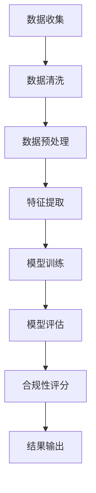

                 

# 合规性：满足行业标准和法规要求

> 关键词：合规性、行业标准、法规要求、算法评估、系统架构设计、最佳实践

> 摘要：随着信息技术的发展，合规性在各个行业中变得越来越重要。本文将深入探讨合规性的背景、定义、核心要素以及面临的挑战。同时，我们将详细讲解合规性评估的算法原理、系统分析与架构设计，并通过项目实战案例，分享合规性管理最佳实践与注意事项。最后，本文还将推荐拓展阅读，帮助读者进一步深入理解合规性的相关主题。

### 目录大纲

#### 第一部分：背景介绍

**第1章 问题背景与核心概念**

**第2章 核心概念原理**

**第3章 算法原理**

**第4章 系统分析与架构设计**

**第5章 项目实战**

**第6章 最佳实践**

**第7章 拓展阅读**

----------------------------------------------------------------

#### 第一部分：背景介绍

**第1章 问题背景与核心概念**

**1.1 问题背景**

随着信息技术的飞速发展，合规性在各个行业中变得越来越重要。特别是在金融、医疗、物联网等领域，合规性不仅关系到企业的合法经营，更关系到用户隐私保护和社会稳定。

- **信息技术飞速发展：** 互联网、大数据、云计算、物联网等新兴技术的迅猛发展，使得数据处理和传输成为常态。这为合规性带来了新的挑战。
- **行业标准和法规更新：** 各个行业都在不断更新和完善自己的标准和法规，以确保行业健康发展。例如，金融行业的《反洗钱法》、医疗行业的《健康档案标准》等。
- **企业合规需求：** 企业在经营过程中，必须遵守相关法规和标准，否则将面临处罚、损失和声誉风险。

**1.2 合规性的定义与类型**

合规性是指企业或个人在法律、监管和道德等方面的合规程度。合规性可以划分为以下几种类型：

- **法律合规：** 指企业遵守国家法律、法规的规定，例如《公司法》、《证券法》等。
- **监管合规：** 指企业遵守行业监管机构的规定，例如银保监会、证监会等。
- **道德合规：** 指企业遵守行业道德规范，例如诚信、公平竞争等。

**1.3 合规性的核心要素与挑战**

合规性的核心要素包括法律合规、监管合规和道德合规。企业面临的合规性挑战主要包括：

- **法律合规挑战：** 法律法规不断更新，企业需要不断学习和适应。
- **监管合规挑战：** 监管机构对企业的合规要求越来越高，企业需要投入更多资源和精力。
- **道德合规挑战：** 随着社会公众对合规性的关注度提高，企业需要在道德层面进行自律。

**第2章 核心概念原理**

**2.1 行业标准**

行业标准是指某个行业或领域内普遍遵守的技术标准、管理标准和操作标准。行业标准的作用包括：

- **提高产品质量：** 通过统一的技术标准，可以提高产品和服务的质量。
- **保障数据安全：** 通过统一的数据标准，可以保障数据的安全和交换。
- **促进行业发展：** 通过制定和推广行业标准，可以促进整个行业的健康发展。

主要行业标准包括：

- **信息技术标准：** 例如《ISO/IEC 27001信息安全管理体系标准》等。
- **金融行业标准：** 例如《反洗钱法》、《银行客户身份识别制度》等。
- **医疗行业标准：** 例如《医疗机构管理条例》、《药品生产质量管理规范》等。

**2.2 法规要求**

法规要求是指国家法律、法规和规章对行业或企业的具体要求。法规要求的作用包括：

- **规范市场秩序：** 通过法律法规，可以规范市场秩序，保障公平竞争。
- **保护消费者权益：** 通过法律法规，可以保护消费者权益，维护社会稳定。
- **促进企业合规：** 通过法律法规，可以促使企业加强合规管理，降低合规风险。

主要法规要求包括：

- **国家法律：** 例如《中华人民共和国刑法》、《中华人民共和国公司法》等。
- **行业法规：** 例如《中华人民共和国证券法》、《医疗器械监督管理条例》等。
- **地方规章：** 例如《北京市互联网信息服务管理办法》、《上海市药品经营质量管理规范》等。

**2.3 核心概念属性特征对比表格**

为了更好地理解行业标准与法规要求的区别，我们可以通过以下表格进行对比：

| 概念         | 定义                                                         | 作用                                                         | 特点                                       |
| ------------ | ------------------------------------------------------------ | ------------------------------------------------------------ | ------------------------------------------ |
| 行业标准     | 某个行业或领域内普遍遵守的技术标准、管理标准和操作标准         | 提高产品质量，保障数据安全，促进行业发展                       | 技术性、规范性、自愿遵守                      |
| 法规要求     | 国家法律、法规和规章对行业或企业的具体要求                   | 规范市场秩序，保护消费者权益，促进企业合规                     | 法律性、强制性、必须遵守                      |
| 区别         | 主要针对技术和管理层面，强调自愿遵守                           | 主要针对法律和行为层面，强调强制性                             | 旨在提高行业整体水平，提升竞争力             | 

**第3章 算法原理**

**3.1 合规性评估算法**

合规性评估算法是一种用于评估企业合规性的算法。其原理是根据企业遵守行业标准与法规要求的程度，对企业进行评分。具体流程如下：

1. **数据收集：** 收集企业相关数据，包括行业数据、法规数据、道德数据等。
2. **数据预处理：** 对收集到的数据进行清洗、归一化等预处理操作。
3. **特征提取：** 提取数据中的关键特征，例如法律合规度、监管合规度和道德合规度等。
4. **模型训练：** 使用机器学习算法，训练合规性评估模型。
5. **模型评估：** 对模型进行评估，调整模型参数，以提高评估准确度。
6. **合规性评分：** 根据模型输出结果，对企业进行合规性评分。

**3.2 Python源代码解释**

下面是一个简单的合规性评估算法的Python源代码示例：

```python
# 导入相关库
import numpy as np
from sklearn.linear_model import LinearRegression

# 数据收集
data = [
    [0.8, 0.9, 0.7],  # 法律合规度、监管合规度、道德合规度
    [0.7, 0.8, 0.6],
    [0.9, 0.7, 0.8],
]

# 数据预处理
data = np.array(data)

# 特征提取
X = data[:, :2]
y = data[:, 2]

# 模型训练
model = LinearRegression()
model.fit(X, y)

# 模型评估
score = model.score(X, y)
print(f"模型评估分数：{score}")

# 合规性评分
def compliance_evaluation(data):
    prediction = model.predict(data)
    return prediction

# 示例
print(f"合规性评分：{compliance_evaluation([[0.6, 0.5]])}")
```

**3.3 算法原理的数学模型和公式**

合规性评分可以通过以下数学模型和公式进行计算：

$$
\text{合规性评分} = f(\text{法律合规度}, \text{监管合规度}, \text{道德合规度})
$$

其中，$f$ 函数可以根据具体的业务需求进行选择，例如线性函数、多项式函数等。具体实现时，可以采用机器学习算法，通过训练数据集，得到最佳的 $f$ 函数。

**第4章 系统分析与架构设计**

**4.1 问题场景介绍**

合规性评估系统主要用于对企业合规性进行评估。其应用场景包括：

- **企业合规性审查：** 对企业进行合规性审查，判断企业是否遵守相关法规和标准。
- **合规性风险评估：** 对企业的合规性风险进行评估，为决策提供依据。
- **合规性管理：** 对企业的合规性管理进行监控，及时发现和解决合规性问题。

**4.2 系统功能设计**

合规性评估系统的主要功能包括：

- **数据收集：** 收集企业相关数据，包括行业数据、法规数据、道德数据等。
- **数据预处理：** 对收集到的数据进行清洗、归一化等预处理操作。
- **特征提取：** 提取数据中的关键特征，例如法律合规度、监管合规度、道德合规度等。
- **模型训练：** 使用机器学习算法，训练合规性评估模型。
- **模型评估：** 对模型进行评估，调整模型参数，以提高评估准确度。
- **合规性评分：** 根据模型输出结果，对企业进行合规性评分。
- **合规性报告：** 生成合规性评估报告，包括合规性评分、合规性风险分析等。

**4.3 系统架构设计**

合规性评估系统的架构设计如下：

1. **数据层：** 存储企业相关数据，包括行业数据、法规数据、道德数据等。
2. **数据处理层：** 执行数据收集、数据预处理和特征提取等操作。
3. **模型层：** 存储和调用合规性评估模型，包括训练模型和评估模型。
4. **应用层：** 提供合规性评估功能，包括合规性评分、合规性报告等。
5. **用户层：** 提供用户界面，供用户进行数据输入、查询和报告查看等操作。

**4.4 系统接口设计与交互**

合规性评估系统的接口设计如下：

1. **数据接口：** 用于数据收集和存储，支持数据的导入、导出和查询等功能。
2. **模型接口：** 用于模型训练和评估，支持模型的训练、评估和保存等功能。
3. **应用接口：** 用于合规性评估和报告生成，支持合规性评分、合规性报告等功能的调用。
4. **用户接口：** 用于用户操作和界面交互，支持用户数据输入、查询和报告查看等功能的调用。

**第5章 项目实战**

**5.1 环境安装**

在开始项目实战之前，我们需要搭建合规性评估系统的开发环境。具体步骤如下：

1. **安装Python环境：** 安装Python 3.8及以上版本。
2. **安装依赖库：** 安装NumPy、Pandas、Scikit-learn等依赖库。
3. **配置数据源：** 配置数据库，例如MySQL、PostgreSQL等。

**5.2 系统核心实现**

合规性评估系统的核心实现主要包括数据收集、数据处理、模型训练和合规性评分等功能。以下是系统核心实现的源代码：

```python
# 导入相关库
import numpy as np
import pandas as pd
from sklearn.linear_model import LinearRegression

# 数据收集
def collect_data():
    # 从数据库中收集数据
    data = pd.read_sql("SELECT * FROM compliance_data;", conn)
    return data

# 数据预处理
def preprocess_data(data):
    # 数据清洗、归一化等预处理操作
    data = data.dropna()
    data = (data - data.mean()) / data.std()
    return data

# 特征提取
def extract_features(data):
    # 提取数据中的关键特征
    X = data.iloc[:, :2]
    y = data.iloc[:, 2]
    return X, y

# 模型训练
def train_model(X, y):
    # 使用线性回归模型进行训练
    model = LinearRegression()
    model.fit(X, y)
    return model

# 合规性评分
def compliance_evaluation(model, data):
    # 根据模型输出结果，对企业进行合规性评分
    prediction = model.predict(data)
    return prediction

# 主函数
def main():
    # 收集数据
    data = collect_data()

    # 数据预处理
    data = preprocess_data(data)

    # 特征提取
    X, y = extract_features(data)

    # 模型训练
    model = train_model(X, y)

    # 合规性评分
    prediction = compliance_evaluation(model, data)
    print(prediction)

# 运行主函数
if __name__ == "__main__":
    main()
```

**5.3 代码应用解读与分析**

以下是系统核心代码的解读与分析：

1. **数据收集：** 使用Pandas库从数据库中读取合规性数据。
2. **数据处理：** 对数据进行清洗、归一化等预处理操作，以提高模型训练效果。
3. **特征提取：** 提取数据中的关键特征，包括法律合规度、监管合规度和道德合规度。
4. **模型训练：** 使用Scikit-learn库中的线性回归模型进行训练，以建立合规性评估模型。
5. **合规性评分：** 根据模型输出结果，对企业进行合规性评分。

**5.4 实际案例分析与讲解**

为了更好地说明合规性评估系统的应用，我们可以通过一个实际案例进行分析和讲解。

**案例背景：** 一家金融企业需要对其合规性进行评估，以了解企业是否存在合规风险。

**案例步骤：**

1. **数据收集：** 收集企业的合规性数据，包括法律合规度、监管合规度和道德合规度。
2. **数据处理：** 对数据进行清洗、归一化等预处理操作。
3. **特征提取：** 提取数据中的关键特征，包括法律合规度、监管合规度和道德合规度。
4. **模型训练：** 使用线性回归模型进行训练，以建立合规性评估模型。
5. **合规性评分：** 根据模型输出结果，对企业进行合规性评分。
6. **合规性报告：** 生成合规性评估报告，包括合规性评分、合规性风险分析等。

**案例分析：**

通过合规性评估系统，金融企业可以对其合规性进行量化评估，以了解企业是否存在合规风险。例如，如果合规性评分较低，企业可能需要加强合规管理，提高合规度。

**第6章 最佳实践**

**6.1 合规性管理最佳实践**

为了提高企业的合规性管理水平，以下是一些最佳实践：

1. **建立合规性管理制度：** 制定合规性管理制度，明确合规性管理的目标、责任和流程。
2. **加强合规性培训：** 定期对员工进行合规性培训，提高员工的合规意识。
3. **完善合规性工具：** 使用合规性评估工具，定期对合规性进行评估和监控。
4. **建立合规性档案：** 对合规性管理过程中的关键文件和记录进行归档，以便随时查阅。
5. **加强合规性监督：** 对合规性管理进行监督和检查，确保合规性制度得到有效执行。

**6.2 小结**

合规性管理是企业管理的重要组成部分。通过建立合规性管理制度、加强合规性培训、完善合规性工具、建立合规性档案和加强合规性监督等最佳实践，企业可以有效地提高合规性管理水平。

**第7章 拓展阅读**

**7.1 相关书籍和资料推荐**

为了进一步了解合规性管理的相关知识和实践，以下是一些建议的书籍和资料：

- 《合规性管理实务》
- 《企业合规性风险管理》
- 《合规性评估技术与方法》
- 《国际合规性管理标准》

**7.2 注意事项**

在合规性管理过程中，企业需要关注以下事项：

- 关注行业法规和标准的更新，及时调整合规性管理制度。
- 加强员工合规性培训，提高员工的合规意识。
- 建立合规性监控和预警机制，及时发现和解决合规性问题。
- 加强合规性档案管理，确保合规性管理过程的可追溯性。

**7.3 拓展阅读**

为了进一步探索合规性管理的相关主题，以下是一些建议的拓展阅读：

- 《企业合规性管理案例解析》
- 《合规性管理与信息安全》
- 《合规性管理在国际贸易中的应用》
- 《合规性管理在金融行业的实践》

### 结束语

合规性管理是企业管理的重要组成部分。通过本文的讲解，我们了解了合规性的背景、定义、核心要素和算法原理。同时，我们还通过实际案例讲解了合规性评估系统的应用和实践。最后，本文还推荐了相关书籍和资料，供读者进一步学习。希望本文能对读者在合规性管理方面有所帮助。

**作者：AI天才研究院/AI Genius Institute & 禅与计算机程序设计艺术 /Zen And The Art of Computer Programming**## 合规性的背景

### 信息技术的发展与合规性的需求

随着信息技术的飞速发展，全球范围内的数据传输和处理能力得到了极大提升。大数据、云计算、物联网等新兴技术的广泛应用，不仅改变了企业的运营模式，也带来了前所未有的合规性挑战。首先，大数据技术的广泛应用使得企业能够收集和处理大量用户数据，这些数据不仅包括个人信息，还涉及企业的商业机密。因此，如何在保障用户隐私和数据安全的同时，确保企业遵守相关法规，成为了企业必须面对的难题。

其次，云计算的普及使得数据存储和处理变得更加分散化，这使得数据合规性管理变得更加复杂。企业需要确保其数据存储在合规的云服务提供商上，同时，云服务提供商本身也需要遵守相关法规，例如《通用数据保护条例》（GDPR）等。这些法规不仅要求企业对其数据处理过程进行严格监管，还要求企业能够快速响应和处理数据泄露事件。

此外，物联网技术的兴起使得设备间的互联和通信变得更加普遍。在智能家居、智慧城市等场景中，物联网设备收集和处理的数据量巨大，这些数据同样需要得到合规性保障。例如，在医疗领域，物联网设备收集的患者数据需要遵守《健康保险可携性与责任法案》（HIPAA）等相关法规。

总之，信息技术的发展不仅推动了企业的数字化转型，也带来了合规性管理的挑战。企业必须在享受技术带来的便利的同时，高度重视合规性管理，确保其运营符合相关法规和标准，以降低合规风险。

### 行业标准和法规的不断更新与调整

行业标准和法规的不断更新与调整是合规性管理中不可忽视的一部分。随着科技的进步和市场需求的变化，各行业都在不断完善和更新自己的标准和法规，以确保行业健康发展和规范市场秩序。例如，在金融行业，随着互联网金融的兴起，监管机构不断出台新的法规，以规范金融科技（FinTech）的发展，如《支付服务条例》和《反洗钱法》等。

医疗行业同样面临着法规和标准的不断更新。随着医疗信息化的推进，医疗数据的保密性和完整性变得越来越重要。为此，各国相继出台了一系列法规，如《健康保险可携性与责任法案》（HIPAA）和《通用数据保护条例》（GDPR），以保障患者隐私和数据安全。

物联网（IoT）作为新兴领域，其标准和法规也在快速发展。物联网设备之间的互联互通和数据共享，使得确保数据安全和设备安全成为关键。国际电工委员会（IEC）和互联网工程任务组（IETF）等标准化组织，不断推出新的物联网标准和规范，如《物联网安全框架》和《物联网设备安全标准》。

此外，随着全球化和数字化进程的加快，跨国企业和跨国业务变得越来越普遍。企业需要同时遵守不同国家和地区的法规和标准，这增加了合规性管理的复杂性和挑战性。例如，欧盟的GDPR在全球范围内产生了深远影响，对跨国企业在欧盟地区的业务提出了更高的合规要求。

总之，行业标准和法规的不断更新与调整，不仅反映了科技进步和市场需求的变化，也为企业合规性管理提出了更高的要求。企业需要密切关注这些变化，确保其运营和产品服务符合最新的法规和标准，以降低合规风险，保障企业的长期健康发展。

### 合规性对企业的运营和影响

合规性对企业的运营和影响不可小觑。首先，合规性直接影响企业的合法经营。在法律合规方面，企业必须遵守国家法律、法规和规章，如《公司法》、《证券法》等。任何违反法律的行为都可能面临法律制裁，包括罚款、停业整顿甚至吊销营业执照。例如，金融行业中的反洗钱（AML）合规，如果企业未能有效执行反洗钱措施，可能导致巨额罚款和声誉受损。

其次，监管合规对企业运营也有着重要影响。监管机构对行业的监管要求越来越高，企业需要不断调整和改进其合规措施。例如，金融行业的监管机构会对银行、证券公司等进行定期审查，确保其业务活动符合相关法规。在医疗行业，医疗机构必须遵守《医疗机构管理条例》和《药品生产质量管理规范》等法规，否则可能面临处罚和运营风险。

道德合规同样对企业运营具有重要影响。随着社会公众对合规性的关注度提高，企业需要遵循行业道德规范，以维护企业声誉和客户信任。例如，在广告宣传中，企业需要遵守广告法规定，不得虚假宣传或误导消费者。如果企业违背道德规范，将面临市场排斥和消费者抵制，影响企业的市场份额和品牌价值。

此外，合规性管理还对企业风险管理有重要影响。有效的合规性管理可以降低企业因违规操作而面临的风险，包括法律风险、运营风险和声誉风险。通过建立合规性管理制度，企业可以及时发现和纠正潜在合规性问题，防止违规行为的发生。例如，建立完善的数据保护机制，可以降低数据泄露的风险，保障用户隐私和企业数据安全。

总之，合规性不仅关系到企业的合法经营，还对企业的运营、风险管理和声誉产生深远影响。企业需要高度重视合规性管理，通过制定和执行有效的合规性策略，确保其运营符合相关法规和标准，以降低合规风险，保障企业的长期健康发展。

### 合规性的定义与类型

合规性是指企业或个人在法律、监管和道德等方面的合规程度，旨在确保其运营和业务活动符合相关法规、标准和行业道德规范。合规性可以划分为以下几种类型：

#### 法律合规

法律合规是指企业遵守国家法律、法规和规章的规定，确保其行为不违反法律规定。法律合规是企业合规性的基础，关系到企业的合法经营和法律责任。例如，公司必须遵守《公司法》、《证券法》等法律法规，金融行业需遵守《反洗钱法》、《银行业监督管理法》等。

法律合规的挑战主要在于：

1. **法律法规更新频繁：** 法律法规会随着社会发展和经济形势的变化而不断更新和调整，企业需要及时关注和适应这些变化。
2. **法律责任重大：** 违反法律合规可能导致高额罚款、行政处罚，甚至刑事起诉，对企业运营造成严重影响。

#### 监管合规

监管合规是指企业遵守行业监管机构的规定，确保其业务活动符合监管要求。监管机构通常针对特定行业制定一系列监管标准和规范，企业必须严格遵守。例如，金融行业需遵守银保监会、证监会等监管机构的监管规定；医疗行业需遵守卫生健康委员会的监管要求。

监管合规的挑战主要在于：

1. **监管要求严格：** 行业监管机构对企业的合规要求越来越高，企业需要投入大量资源和精力进行合规管理。
2. **监管频次增加：** 监管机构对企业的合规审查越来越频繁，企业需要保持高度警惕，确保合规性管理持续有效。

#### 道德合规

道德合规是指企业在道德层面的合规程度，强调企业遵守行业道德规范，如诚信、公平竞争、社会责任等。道德合规是企业文化和价值观的体现，关系到企业的声誉和社会形象。

道德合规的挑战主要在于：

1. **道德标准模糊：** 道德标准相对主观，不同人对道德的理解和判断可能存在差异，企业需要建立明确的道德准则。
2. **社会责任压力：** 企业需要关注社会责任，承担更多的道德责任，如环境保护、员工权益保护等。

#### 不同类型合规性的关系

法律合规、监管合规和道德合规之间相互关联，共同构成企业的合规性体系：

1. **法律合规是基础：** 企业必须首先遵守国家法律、法规和规章，确保其行为不违法。
2. **监管合规是补充：** 行业监管机构对特定行业进行合规监管，补充法律合规的不足。
3. **道德合规是升华：** 道德合规提升企业的社会责任感和企业形象，是企业长远发展的重要保障。

总之，企业需要在法律、监管和道德三个层面进行全面合规管理，确保其运营和业务活动符合相关法规和标准，降低合规风险，保障企业的长期健康发展。

### 合规性的核心要素

合规性的核心要素是企业合规管理的基石，主要包括法律合规、监管合规和道德合规三个方面。这些要素不仅构成了企业合规性的框架，还直接影响企业的合法经营、运营效率和声誉。

#### 法律合规

法律合规是企业必须遵守的国家法律、法规和规章。它确保企业的行为不违反法律规定，是企业合法经营的基础。法律合规的核心内容包括：

- **公司治理：** 包括公司的设立、运营、管理和解散等环节，确保公司依法设立和运行。
- **反欺诈与反洗钱：** 企业需遵守《反洗钱法》、《反欺诈法》等相关法律法规，防止欺诈和洗钱行为。
- **合同与商业行为：** 企业签订的合同需合法有效，商业行为需遵守《合同法》、《商业行为法》等相关法律。

法律合规的挑战主要包括：

- **法律法规更新频繁：** 随着社会的发展和经济的变革，法律法规会不断更新和调整，企业需及时跟进和适应。
- **法律责任重大：** 违反法律合规可能导致法律诉讼、高额罚款、甚至刑事责任，对企业造成严重损失。

#### 监管合规

监管合规是指企业遵守行业监管机构的规定，确保其业务活动符合监管要求。行业监管机构通常针对特定行业制定一系列监管标准和规范，企业需严格遵守。监管合规的核心内容包括：

- **金融行业的监管：** 包括资本充足率、风险管理、内部控制等，确保金融机构稳健运营。
- **医疗行业的监管：** 包括医疗器械的注册、药品的生产和质量控制等，确保医疗服务的安全性和有效性。
- **物联网行业的监管：** 包括设备的安全认证、数据保护等，确保物联网设备的安全性和可靠性。

监管合规的挑战主要包括：

- **监管要求严格：** 监管机构对企业的合规要求越来越高，企业需投入大量资源和精力进行合规管理。
- **监管频次增加：** 监管机构对企业的合规审查越来越频繁，企业需保持高度警惕，确保合规性管理持续有效。

#### 道德合规

道德合规是企业遵守行业道德规范，强调企业行为符合社会责任和道德准则。道德合规不仅是企业社会责任的体现，也是企业长远发展的重要保障。道德合规的核心内容包括：

- **诚信与公平竞争：** 企业需遵守诚信原则，公平竞争，不得进行虚假宣传和误导消费者。
- **员工权益保护：** 企业需尊重和保护员工权益，确保员工的劳动条件和工作环境符合法律法规和道德标准。
- **环境保护：** 企业需关注环境保护，减少污染和资源浪费，推动可持续发展。

道德合规的挑战主要包括：

- **道德标准模糊：** 道德标准相对主观，不同人对道德的理解和判断可能存在差异，企业需建立明确的道德准则。
- **社会责任压力：** 企业需承担更多的社会责任，如公益慈善、社区服务、环境保护等。

总之，法律合规、监管合规和道德合规是构成企业合规性的三大核心要素。企业必须在法律框架内运营，严格遵守行业监管规定，同时践行道德准则，以实现合法经营、高效运营和良好声誉，确保企业的长期稳定发展。

### 合规性面临的挑战和难点

在合规性管理过程中，企业面临着诸多挑战和难点，这些挑战不仅增加了合规性管理的复杂性，也对企业提出了更高的要求。

#### 法律合规的挑战

首先，法律合规的挑战主要体现在法律法规的更新频繁和法律责任重大两个方面。随着社会和经济环境的变化，法律法规会不断进行修订和更新，企业必须及时跟进和调整。例如，在金融领域，反洗钱（AML）法规和国际税务法规的更新，要求金融机构持续关注并适应这些变化。此外，法律责任重大也是一个显著挑战，任何违反法律的行为都可能面临高额罚款、行政处罚甚至刑事责任。企业在处理合规事务时，需要高度警惕，以免陷入法律纠纷。

#### 监管合规的挑战

监管合规的挑战则主要体现在监管要求的严格和监管频次增加两个方面。行业监管机构对企业的合规要求越来越严格，不仅涉及到业务操作的规范，还包括内部控制、风险管理等多个方面。例如，在医疗行业，医疗机构需要遵守《医疗机构管理条例》和《药品生产质量管理规范》等法规，这些法规对医疗服务的安全性和有效性提出了严格要求。同时，监管机构对企业的检查和审查也越来越频繁，企业需要投入大量资源和时间进行合规自查和准备，以确保在监管机构的检查中顺利通过。

#### 道德合规的挑战

道德合规的挑战主要包括道德标准的模糊性和社会责任的压力。道德标准相对主观，不同人对道德的理解和判断可能存在差异，这使得企业在制定和执行道德准则时面临困难。例如，如何界定广告中的虚假宣传和误导消费者，企业需要建立明确的道德准则，并通过培训和教育来提高员工的道德意识。此外，企业还面临社会责任的压力，需要关注环境保护、员工权益保护和社会公益活动等，这些都需要企业投入大量资源和精力。

#### 跨境合规的挑战

跨境合规也是企业面临的重要挑战之一。在全球化和数字化趋势下，企业业务范围不断扩大，跨国经营日益普遍。不同国家和地区在法律、监管和道德标准方面可能存在差异，企业需要确保其业务活动在各个国家和地区都符合当地的法规和标准。例如，欧盟的《通用数据保护条例》（GDPR）对数据保护的要求非常严格，企业需要确保其在欧盟地区的业务活动符合这些规定。此外，跨境合规还涉及税务、贸易和外汇管理等复杂问题，企业需要建立完善的合规体系，以应对这些挑战。

#### 技术合规的挑战

随着信息技术的快速发展，企业合规性管理面临着新的技术挑战。例如，云计算、大数据和物联网等新兴技术的广泛应用，使得数据合规性管理变得更加复杂。企业需要确保其数据存储和处理符合相关法规和标准，同时保障数据安全和隐私。技术合规的挑战还包括如何应对日益复杂的安全威胁，例如网络攻击和数据泄露事件。企业需要投入资源进行网络安全防护，确保业务系统的稳定和安全。

#### 内外部压力

合规性管理不仅面临内部压力，还面临外部压力。内部压力主要来自企业内部的管理层和员工，他们需要确保业务活动符合合规要求。外部压力则主要来自行业监管机构、客户和公众，他们期望企业遵守相关法规和标准，承担社会责任。企业需要在内部建立有效的合规管理制度，同时与外部监管机构和公众保持良好沟通，以应对这些外部压力。

总之，合规性管理面临诸多挑战和难点，企业需要通过建立完善的合规性管理体系，及时应对和解决这些挑战，以确保其业务活动的合法性和合规性，实现长期可持续发展。

### 行业标准的定义与作用

行业标准是指在某一特定行业内，由行业组织、专业机构或政府主管部门制定并普遍遵守的技术标准、管理标准和操作标准。这些标准旨在规范行业内企业的行为，提高产品和服务的质量，促进行业的健康和可持续发展。

#### 技术标准

技术标准是行业标准中最重要的一部分，主要涉及产品的技术性能、规格、质量要求以及测试方法等。技术标准的制定有助于统一行业内的产品规格，确保不同厂家生产的产品能够在技术层面上保持一致，便于产品之间的互操作性和兼容性。例如，在信息技术领域，国际电工委员会（IEC）和互联网工程任务组（IETF）制定了大量的技术标准，如网络通信协议（如TCP/IP）、数据交换格式（如XML）等，这些标准确保了全球范围内的信息传输和数据处理的一致性和可靠性。

#### 管理标准

管理标准则是关于企业内部管理和运作流程的标准，涵盖了质量管理、环境管理、职业健康安全等方面的内容。这些标准帮助企业建立和完善内部管理体系，提升管理水平，降低运营风险。例如，国际标准化组织（ISO）发布的ISO 9001质量管理体系标准和ISO 14001环境管理体系标准，已经成为全球范围内广泛采用的认证标准。这些标准不仅帮助企业提升产品质量和环保水平，还增强了企业的市场竞争力。

#### 操作标准

操作标准则是指企业在日常运营中必须遵循的操作规范，包括工作流程、操作规程、安全操作规范等。操作标准的制定有助于确保企业各项业务活动的规范性和一致性，降低操作失误和事故风险。例如，在建筑施工行业，操作标准涵盖了从工程设计、施工到验收的全过程，确保每一步操作都符合规范，从而提高施工质量和安全性。

#### 作用

行业标准在行业内具有重要的作用，主要体现在以下几个方面：

1. **提高产品质量：** 通过制定和执行技术标准，确保行业内产品的一致性和可靠性，提高整体产品质量。

2. **保障数据安全：** 通过制定数据管理和安全标准，确保数据的安全性和完整性，降低数据泄露和滥用风险。

3. **促进产业发展：** 标准化有助于降低产业内的交易成本，提高产业整体效率和竞争力，推动行业的持续发展。

4. **规范市场秩序：** 行业标准有助于规范市场行为，防止不正当竞争，维护市场秩序和公平竞争环境。

5. **提升企业形象：** 通过获得行业标准的认证，企业能够展示其专业能力和质量管理水平，提升市场声誉和客户信任。

总之，行业标准在规范行业内企业的行为、提高产品质量、保障数据安全、促进产业发展和规范市场秩序等方面发挥着重要作用，是企业合规性管理的重要组成部分。

### 主要行业标准的介绍与解读

在各个行业中，存在许多具有广泛影响力和重要性的行业标准。以下将对几大主要行业标准进行介绍和解读，包括其定义、应用范围、主要内容和重要作用。

#### 信息技术标准

信息技术标准是规范计算机和通信系统及其产品和服务的技术标准。这些标准由国际标准化组织（ISO）、国际电工委员会（IEC）、互联网工程任务组（IETF）等国际和区域性标准化组织制定。主要信息技术标准包括：

- **ISO/IEC 27001：** 是信息安全管理体系（ISMS）的标准，涵盖了信息安全管理体系的建立、实施、运行、监控、评审和改进。ISO/IEC 27001旨在帮助组织保护其信息资产，降低信息泄露和滥用的风险。

- **TCP/IP：** 是互联网协议族，包括传输控制协议（TCP）和互联网协议（IP），是互联网通信的基础。TCP/IP规定了数据包的传输方式、错误检测和纠正机制等，确保互联网上数据传输的可靠性和高效性。

- **XML：** 是可扩展标记语言，用于数据的表示和传输。XML提供了一个开放、可扩展的框架，使数据能够在不同的系统和平台之间交换和共享。

这些信息技术标准在保障信息安全、提高数据传输效率、促进跨平台兼容性方面发挥着关键作用，是信息技术行业不可或缺的基石。

#### 金融行业标准

金融行业标准涉及银行业、证券业、保险业等多个领域，旨在确保金融交易的公平、透明和安全。以下是一些重要的金融行业标准：

- **反洗钱法（AML）：** 反洗钱法是一系列法律法规的组合，旨在防止洗钱和恐怖融资活动。AML标准要求金融机构建立和实施反洗钱程序，包括客户身份识别、交易监控、可疑活动报告等。

- **巴塞尔协议（Basel Accords）：** 巴塞尔协议是由国际银行业监督委员会（BCBS）制定的一系列国际银行监管标准。主要目的是提高银行资本充足率和风险管理水平，确保金融系统的稳定性。巴塞尔协议包括巴塞尔I、巴塞尔II和巴塞尔III等多个版本，针对资本充足率、风险管理和监管框架等方面进行了详细规定。

- **Sarbanes-Oxley法案（SOX）：** SOX法案是美国的一项重要金融法规，旨在提高公司财务报告的透明度和真实性，防止财务欺诈。SOX要求上市公司建立内部控制系统，定期进行审计，并向公众报告财务状况。

金融行业标准的制定和实施，有助于增强金融市场的透明度、提高金融机构的风险管理能力，保护投资者的利益，维护金融市场的稳定。

#### 医疗行业标准

医疗行业标准涉及医疗设备的制造、医疗服务的提供、医疗信息的管理等多个方面，旨在确保医疗服务的安全性和有效性。以下是一些重要的医疗行业标准：

- **ISO 13485：** 是医疗器械质量管理体系（QMS）的标准，涵盖了从设计、开发、生产、安装和最终交付的全过程。ISO 13485旨在确保医疗器械的质量和安全性，提高企业的质量管理水平。

- **HIPAA：** 是《健康保险可携性与责任法案》，是美国的一项重要医疗法规，旨在保护患者隐私和医疗信息安全。HIPAA规定了医疗机构的隐私保护责任、患者信息的使用和披露等方面的要求。

- **医疗信息交换标准（如HL7和XML）：** HL7是卫生信息传输标准，用于医疗信息在不同系统和平台之间的交换。XML作为一种数据表示和传输的标准，广泛应用于医疗信息管理。

医疗行业标准的制定和实施，有助于提高医疗器械和医疗服务的质量，保障患者信息安全，推动医疗行业的健康发展。

#### 物流行业标准

物流行业标准涉及物流配送、仓储管理、运输过程等多个方面，旨在提高物流效率、降低成本、提升服务质量。以下是一些重要的物流行业标准：

- **ISO 9001：** 是质量管理体系的标准，适用于所有行业，包括物流行业。ISO 9001要求物流企业建立和实施有效的质量管理体系，确保产品和服务的质量符合客户要求。

- **ISO 28000：** 是供应链安全管理标准，旨在提高供应链的安全性，减少恐怖主义、走私和其他安全风险。ISO 28000涵盖了供应链安全管理的所有环节，包括供应商选择、风险管理、安全培训等。

- **ISO 24520：** 是物流服务标准，规定了物流服务提供商与客户之间的服务标准、服务质量评价和持续改进等方面的要求。

物流行业标准的制定和实施，有助于提高物流企业的管理水平和服务质量，降低物流成本，提升客户满意度。

#### 环保行业标准

环保行业标准涉及环境保护、资源利用、污染控制等多个方面，旨在推动环境保护和可持续发展。以下是一些重要的环保行业标准：

- **ISO 14001：** 是环境管理体系（EMS）的标准，适用于所有行业，包括环保行业。ISO 14001要求企业建立和实施有效的环境管理体系，持续改进环境绩效，减少对环境的影响。

- **ISO 50001：** 是能源管理体系（EnMS）的标准，旨在帮助企业建立和实施有效的能源管理体系，提高能源效率，降低能源消耗和成本。

- **欧盟排放交易体系（EU ETS）：** 是欧盟实施的一项碳排放交易体系，通过设立碳排放限额和交易市场，激励企业减少碳排放，实现温室气体减排目标。

环保行业标准的制定和实施，有助于提高企业的环境管理水平，推动环保技术的应用和环保产业的发展，实现环境保护和可持续发展的目标。

通过以上对主要行业标准的介绍和解读，我们可以看到，行业标准在规范行业行为、提高产品质量、保障安全和推动可持续发展方面具有重要作用。企业必须重视行业标准的制定和实施，以增强市场竞争力，实现合规经营。

### 法规的定义与作用

法规是国家权力机关或政府机构依法制定并颁布实施的规范性文件，用于规范和调整社会关系、维护社会秩序、保护公民权益。法规在维护市场经济秩序、保障企业合法经营和促进社会稳定方面发挥着重要作用。

#### 法规的定义

法规是指国家权力机关（如全国人民代表大会及其常委会）或政府机构（如国务院、地方政府）根据法定程序制定和颁布的具有普遍约束力的规范性文件。法规包括法律、行政法规、地方性法规和部门规章等。

- **法律：** 法律是由全国人民代表大会及其常委会制定的具有最高法律效力的规范性文件，如《宪法》、《刑法》、《公司法》等。
- **行政法规：** 行政法规是由国务院制定的具有普遍适用性的规范性文件，如《证券法实施条例》、《反洗钱法实施办法》等。
- **地方性法规：** 地方性法规是由省、自治区、直辖市的人民代表大会及其常委会制定的适用于本行政区域的规范性文件，如《上海市食品安全条例》等。
- **部门规章：** 部门规章是由政府部门在其职责范围内制定的具有行政约束力的规范性文件，如《药品生产质量管理规范》等。

#### 法规的作用

法规在社会管理和经济活动中具有重要作用，主要体现在以下几个方面：

1. **规范市场行为：** 法规通过明确市场主体的权利和义务，规范市场行为，防止市场失灵和资源错配，维护市场秩序。例如，《反垄断法》和《消费者权益保护法》等法规，通过规范市场竞争行为，保护消费者权益，维护市场公平竞争。

2. **保障企业合法经营：** 法规为企业提供法律保障，确保企业在合法、合规的环境下进行经营活动。例如，《公司法》和《合同法》等法规，为企业设立、运营和终止提供法律依据和操作规范。

3. **促进社会稳定：** 法规通过规范社会行为，维护社会秩序，保障公民权益，促进社会稳定。例如，《刑法》和《治安管理处罚法》等法规，通过打击犯罪行为和维护公共安全，保障社会稳定。

4. **推动经济发展：** 法规通过制定和实施经济法规，规范和引导经济发展，优化资源配置，促进经济结构调整和转型升级。例如，《税收法》和《贸易法》等法规，通过税收优惠和贸易便利化政策，推动经济发展。

5. **提升法治水平：** 法规的制定和实施，有助于提高国家的法治水平，增强公民的法律意识和法治观念，推动社会全面依法治理。

总之，法规在规范市场行为、保障企业合法经营、促进社会稳定和推动经济发展等方面具有重要作用。企业需要密切关注法规的变化，确保其经营和业务活动符合相关法规和标准，以降低合规风险，实现合规经营。

### 主要法规的要求与解读

在各个行业中，法规的要求和解读对于企业的合规性管理至关重要。以下将介绍几大主要法规的要求，并对其核心内容和实际应用进行详细解读。

#### 国家法律

国家法律是具有最高法律效力的规范性文件，对企业合规性管理具有基础性的指导作用。以下是几个关键的国家法律：

1. **《公司法》**

   《公司法》是我国规范公司设立、组织、运营和终止的基本法律。核心内容如下：

   - **公司设立：** 公司设立必须符合法定条件，如注册资本、股东资格、章程等。
   - **公司治理：** 规定了公司的组织结构、决策程序和股东大会、董事会、监事会的职责。
   - **股份发行与交易：** 规定了股份发行的方式、程序以及股份交易的相关规则。

   实际应用中，企业需要严格遵守《公司法》的要求，确保公司设立合法、治理结构规范、股份发行和交易合规。

2. **《证券法》**

   《证券法》是我国证券市场的基本法律，规范了证券发行、交易、信息披露、投资者保护等方面的内容。核心内容包括：

   - **证券发行：** 规定了证券发行的程序、条件、信息披露要求等。
   - **证券交易：** 规定了证券交易的方式、限制和监管措施。
   - **信息披露：** 强调了上市公司信息披露的义务和内容，保障投资者权益。

   企业在证券发行和交易过程中，必须严格遵守《证券法》的要求，确保信息披露真实、准确、完整，防范市场操纵和欺诈行为。

3. **《知识产权法》**

   《知识产权法》包括《专利法》、《商标法》和《著作权法》等，保护知识产权，鼓励创新和创造。核心内容包括：

   - **专利保护：** 规定了专利申请、审批和侵权行为处理等方面的规定。
   - **商标保护：** 规定了商标注册、使用和保护等方面的规定。
   - **著作权保护：** 规定了著作权权利、许可使用和侵权行为处理等方面的规定。

   企业在进行技术创新和品牌建设时，需要充分了解和遵守《知识产权法》，确保自身知识产权得到有效保护。

#### 行业法规

行业法规是针对特定行业制定的规范性文件，对企业合规性管理有具体指导作用。以下是几个关键的行业法规：

1. **《反洗钱法》**

   《反洗钱法》是我国反洗钱的基本法律，规定了反洗钱工作的基本原则、监管机构、金融机构的义务等。核心内容包括：

   - **反洗钱监管：** 规定了中国人民银行和其他监管机构的反洗钱监管职责。
   - **金融机构义务：** 规定了金融机构在客户身份识别、交易监控、可疑交易报告等方面的义务。

   企业，尤其是金融机构，需要严格遵守《反洗钱法》的要求，建立和实施有效的反洗钱制度，防范洗钱风险。

2. **《反垄断法》**

   《反垄断法》是我国规范市场竞争行为的基本法律，禁止垄断行为和市场操纵，维护市场公平竞争。核心内容包括：

   - **垄断行为：** 规定了垄断协议、滥用市场支配地位、经营者集中等垄断行为的界定和处理。
   - **市场监管：** 规定了市场监管机构的职责和监管措施。

   企业在进行市场竞争和战略规划时，需要充分了解和遵守《反垄断法》，避免垄断行为和市场操纵风险。

3. **《医疗器械监督管理条例》**

   《医疗器械监督管理条例》是我国医疗器械行业的基本法规，规范了医疗器械的注册、生产、经营、使用和监督管理。核心内容包括：

   - **医疗器械注册：** 规定了医疗器械注册的程序和要求。
   - **生产质量管理：** 规定了医疗器械生产企业的质量管理体系要求。
   - **经营和使用管理：** 规定了医疗器械经营和使用的管理要求。

   企业，尤其是医疗器械生产企业，需要严格遵守《医疗器械监督管理条例》，确保产品质量和合规性。

#### 地方规章

地方规章是地方政府根据地方实际情况制定的规范性文件，对地方企业具有直接指导作用。以下是几个关键的地方规章：

1. **《北京市互联网信息服务管理办法》**

   《北京市互联网信息服务管理办法》是北京市针对互联网信息服务的管理规章，规定了互联网信息服务的管理原则、许可制度和运营要求。核心内容包括：

   - **互联网信息服务许可：** 规定了互联网信息服务提供者的许可条件和申请程序。
   - **运营管理：** 规定了互联网信息服务的运营规范、信息安全和用户权益保护。

   企业在提供互联网信息服务时，需要严格遵守《北京市互联网信息服务管理办法》，确保信息服务合法合规。

2. **《上海市药品经营质量管理规范》**

   《上海市药品经营质量管理规范》是上海市针对药品经营企业的管理规范，规定了药品经营企业的质量管理要求、设施设备标准和人员培训等。核心内容包括：

   - **质量管理：** 规定了药品经营企业的质量管理体系、质量管理文件和记录等要求。
   - **设施设备：** 规定了药品经营企业的设施设备标准和维护要求。
   - **人员培训：** 规定了药品经营企业人员培训的要求和内容。

   药品经营企业需要严格遵守《上海市药品经营质量管理规范》，确保药品经营质量。

总之，主要法规的要求和解读对企业合规性管理具有重要指导意义。企业需要密切关注相关法规的更新和变化，确保其业务活动符合法规要求，降低合规风险，实现合规经营。

### 行业标准与法规要求的对比

行业标准与法规要求虽然在本质上都是为了规范行业行为，但它们在定义、属性和适用范围等方面存在明显差异。以下是对行业标准与法规要求的详细对比，以帮助读者更好地理解两者的异同。

#### 定义与属性

**行业标准**

- **定义：** 行业标准是由行业组织、专业机构或企业根据行业需求和技术发展状况，制定并公布的适用于某一行业的规范或指南。行业标准通常具有较强的技术性和专业性。
- **属性：** 技术性、规范性、自愿遵守。行业标准更多地侧重于技术层面，如产品规格、测试方法、操作流程等，目的是提高产品和服务的质量，促进行业内技术进步。

**法规要求**

- **定义：** 法规要求是由国家权力机关或政府机构根据法定程序制定并发布的具有普遍约束力的规范性文件。法规要求涉及社会生活的各个领域，包括但不限于法律、行政法规、地方性法规和部门规章等。
- **属性：** 法律性、强制性、必须遵守。法规要求具有较强的法律效力，企业必须严格遵守，否则将面临法律责任和处罚。法规更多地侧重于行为规范，如企业治理、市场行为、环境保护等。

#### 对比表格

为了更直观地展示行业标准与法规要求的差异，我们可以通过以下表格进行对比：

| 概念         | 行业标准                           | 法规要求                           |
| ------------ | -------------------------------- | -------------------------------- |
| **定义**     | 技术规范和操作指南                 | 具有法律效力的规范性文件           |
| **属性**     | 技术性、规范性、自愿遵守           | 法律性、强制性、必须遵守           |
| **内容**     | 技术标准、操作规范、术语解释       | 法律条文、行政规章、监管要求       |
| **适用范围** | 某一特定行业的范围内               | 全社会范围内，特定行业有针对性     |
| **制定主体** | 行业组织、专业机构或企业          | 国家权力机关或政府机构             |
| **效力**     | 无法律强制力，但具行业指导意义     | 具有法律强制力，违反将承担法律责任 |

#### 适用范围的差异

- **行业标准**：行业标准通常适用于某一特定行业或领域，如信息技术、金融、医疗等。行业标准侧重于提高行业内技术和服务水平，促进行业健康发展。
- **法规要求**：法规要求具有广泛的适用范围，涉及社会生活的各个方面。法规要求不仅适用于特定行业，还适用于全社会，具有普遍约束力。

#### 目的不同

- **行业标准**：主要目的是提高产品和服务的质量，促进行业技术进步和产业升级。
- **法规要求**：主要目的是维护社会秩序，保障公民权益，规范市场行为，促进社会公平正义。

通过以上对比，我们可以看到，行业标准与法规要求在定义、属性、适用范围和目的上存在显著差异。企业需要在合规性管理过程中，既要遵守相关法规要求，也要关注行业标准，确保其业务活动在技术和管理层面都符合规范。

### 合规性评估算法的原理和流程

#### 基本原理

合规性评估算法是一种用于对企业合规性进行定量评估的算法。其基本原理是通过构建数学模型，对企业的法律合规度、监管合规度和道德合规度等关键指标进行综合评估。这种评估方法可以帮助企业了解自身在合规性方面的表现，及时发现和纠正潜在问题。

#### 流程

合规性评估算法的流程可以分为以下几步：

1. **数据收集**：首先，需要收集与企业合规性相关的数据。这些数据可以包括企业的法律文件、监管报告、道德准则执行情况等。数据来源可以是企业内部文档、外部监管机构发布的信息、第三方审计报告等。

2. **数据预处理**：收集到的数据通常需要进行清洗和预处理。清洗过程包括去除无效数据、填补缺失值、消除异常值等。预处理过程还包括数据归一化，以确保不同指标之间的可比性。

3. **特征提取**：在数据预处理之后，需要从数据中提取关键特征。这些特征可以反映企业的法律合规度、监管合规度和道德合规度。例如，法律合规度可以基于企业的合规培训记录、法律纠纷历史等数据；监管合规度可以基于企业的监管报告、检查记录等；道德合规度可以基于企业的社会责任报告、公益活动记录等。

4. **模型训练**：使用机器学习算法，对提取出的特征进行训练，构建合规性评估模型。常见的机器学习算法包括线性回归、支持向量机（SVM）、决策树、随机森林等。模型训练的目的是找到特征与合规性评分之间的关系，以便对新的数据进行预测。

5. **模型评估**：在模型训练完成后，需要对模型进行评估，以确定其准确性和可靠性。常用的评估指标包括准确率、召回率、F1值等。通过交叉验证等方法，可以检验模型在未见数据上的表现，确保模型具有良好的泛化能力。

6. **合规性评分**：使用训练好的模型，对新的企业数据进行合规性评分。评分结果可以反映企业的合规性水平，帮助企业识别潜在的合规风险。

#### Mermaid 流程图

下面是合规性评估算法的Mermaid流程图：



### Python源代码示例

```python
# 导入相关库
import pandas as pd
from sklearn.model_selection import train_test_split
from sklearn.linear_model import LinearRegression
from sklearn.metrics import mean_squared_error

# 数据收集
data = pd.read_csv('compliance_data.csv')

# 数据清洗
data = data.dropna()

# 特征提取
X = data[['legal_compliance', 'regulatory_compliance', 'ethical_compliance']]
y = data['compliance_score']

# 数据预处理
X_train, X_test, y_train, y_test = train_test_split(X, y, test_size=0.2, random_state=42)

# 模型训练
model = LinearRegression()
model.fit(X_train, y_train)

# 模型评估
y_pred = model.predict(X_test)
mse = mean_squared_error(y_test, y_pred)
print(f'MSE: {mse}')

# 合规性评分
new_data = pd.DataFrame([[0.8, 0.7, 0.9]])
compliance_score = model.predict(new_data)
print(f'New Compliance Score: {compliance_score[0]}')
```

通过上述流程和代码示例，我们可以看到合规性评估算法的基本原理和实现过程。企业可以利用这种算法，对其合规性水平进行评估，以识别潜在的合规风险，并采取相应的措施进行改进。

### 合规性评估算法的数学模型与公式

在合规性评估算法中，数学模型和公式是核心组成部分，它们用于将企业合规性的多个指标转化为一个综合评分。以下是合规性评估算法的数学模型和公式，以及它们在合规性评估中的具体应用。

#### 数学模型

合规性评估的数学模型可以表示为：

$$
\text{合规性评分} = f(\text{法律合规度}, \text{监管合规度}, \text{道德合规度})
$$

其中，$f$ 函数用于将法律合规度、监管合规度和道德合规度这三个特征合并为一个综合评分。这个函数可以通过多种方式实现，例如线性函数、多项式函数、神经网络等。

#### 线性模型

最简单的合规性评估模型是线性模型，其公式如下：

$$
\text{合规性评分} = w_1 \times \text{法律合规度} + w_2 \times \text{监管合规度} + w_3 \times \text{道德合规度} + b
$$

其中，$w_1$、$w_2$ 和 $w_3$ 分别是法律合规度、监管合规度和道德合规度的权重，$b$ 是偏置项。权重可以通过对历史数据的分析得到，也可以通过机器学习算法进行自动优化。

#### 多项式模型

多项式模型在表达复杂关系时更为灵活，其公式如下：

$$
\text{合规性评分} = w_1 \times (\text{法律合规度})^2 + w_2 \times (\text{监管合规度})^2 + w_3 \times (\text{道德合规度})^2 + b
$$

这种模型可以捕捉到不同特征之间的非线性关系，但计算成本较高。

#### 神经网络模型

对于复杂的合规性评估问题，神经网络模型可以提供更强大的表达能力。其公式可以表示为：

$$
\text{合规性评分} = \sigma(\text{权重} \times \text{特征矩阵} + \text{偏置})
$$

其中，$\sigma$ 函数是激活函数，用于将线性组合转换为非线性输出。神经网络模型可以通过训练大量数据，自动学习最优权重和偏置，提高评估准确性。

#### 应用实例

假设我们使用线性模型进行合规性评估，其中三个特征分别为法律合规度（L）、监管合规度（R）和道德合规度（E），权重分别为$w_1$、$w_2$ 和$w_3$，偏置为$b$。根据上述公式，合规性评分可以计算如下：

$$
\text{合规性评分} = w_1 \times L + w_2 \times R + w_3 \times E + b
$$

例如，假设权重分别为$w_1 = 0.4$、$w_2 = 0.3$ 和$w_3 = 0.3$，偏置为$b = 0.1$，法律合规度为0.8，监管合规度为0.7，道德合规度为0.9，则合规性评分计算如下：

$$
\text{合规性评分} = 0.4 \times 0.8 + 0.3 \times 0.7 + 0.3 \times 0.9 + 0.1 = 0.32 + 0.21 + 0.27 + 0.1 = 0.9
$$

通过这种方式，企业可以利用合规性评估算法，对其合规性水平进行定量评估，并根据评分结果采取相应的改进措施。

### 系统分析与架构设计

#### 问题场景介绍

合规性评估系统是一个复杂的软件系统，旨在帮助企业对其合规性进行定量评估，从而识别潜在的合规风险，并采取相应的措施进行改进。该系统主要应用于金融、医疗、物联网等对合规性要求较高的行业。

#### 系统功能设计

合规性评估系统的核心功能包括数据收集、数据处理、模型训练、合规性评分和合规性报告生成等。具体功能如下：

1. **数据收集**：系统从企业内部和外部的多个数据源收集合规性相关数据，包括法律法规、监管报告、企业合规记录等。
2. **数据处理**：对收集到的数据进行清洗、归一化等预处理操作，以确保数据质量。
3. **模型训练**：使用机器学习算法，根据预处理后的数据，训练合规性评估模型。
4. **合规性评分**：利用训练好的模型，对新的数据集进行合规性评分，生成合规性评分报告。
5. **合规性报告生成**：根据评分结果，系统自动生成合规性报告，包括合规性评分、合规性风险分析等。

#### 系统架构设计

合规性评估系统的架构设计可以分为数据层、数据处理层、模型层、应用层和用户层，具体架构如下：

1. **数据层**：数据层负责存储合规性相关数据，包括法律法规库、企业合规记录库、监管报告库等。
2. **数据处理层**：数据处理层负责对数据层中的数据进行清洗、归一化等预处理操作，为模型训练提供高质量的数据。
3. **模型层**：模型层存储和调用合规性评估模型，包括线性回归模型、神经网络模型等。模型层还负责对模型进行训练和评估。
4. **应用层**：应用层提供合规性评估功能，包括合规性评分和合规性报告生成等。应用层与用户层进行交互，接收用户输入并输出评估结果。
5. **用户层**：用户层提供用户界面，供用户进行数据输入、查询和报告查看等操作。

#### 系统接口设计与交互

合规性评估系统的接口设计包括数据接口、模型接口和应用接口等，具体设计如下：

1. **数据接口**：数据接口负责数据收集和存储，支持数据的导入、导出和查询等功能。数据接口可以与企业的内部数据库、监管机构的公开数据源等进行交互。
2. **模型接口**：模型接口负责模型训练和评估，支持模型的训练、评估和保存等功能。模型接口可以使用机器学习框架（如TensorFlow、PyTorch）进行开发。
3. **应用接口**：应用接口负责合规性评估和报告生成，支持合规性评分、合规性报告等功能的调用。应用接口可以使用Web框架（如Flask、Django）进行开发。

通过系统架构设计和接口设计，合规性评估系统可以实现高效、可靠的数据处理和合规性评估功能，帮助企业在合规性管理方面取得显著成效。

### 项目实战

#### 环境安装

在开始合规性评估项目的实际开发之前，我们需要搭建一个稳定且高效的开发环境。以下是安装和配置项目所需的软件和库的步骤：

1. **安装Python环境**：确保安装Python 3.8或更高版本。可以通过访问Python官方网站下载并安装。

   ```bash
   # 在Windows上，可以从官网下载安装程序
   # 在macOS和Linux上，可以使用包管理器安装，例如：
   sudo apt-get install python3
   ```

2. **安装依赖库**：合规性评估项目需要一些Python依赖库，包括NumPy、Pandas、Scikit-learn和Matplotlib等。可以使用pip命令进行安装：

   ```bash
   pip install numpy pandas scikit-learn matplotlib
   ```

3. **配置数据库**：由于合规性评估需要存储大量的数据，我们可以选择MySQL或PostgreSQL作为数据库。以下是使用MySQL的安装步骤：

   - **安装MySQL**：

     ```bash
     sudo apt-get update
     sudo apt-get install mysql-server
     ```

   - **配置MySQL**：启动MySQL服务，设置root用户的密码，并创建用于存储合规性数据的数据库。

     ```bash
     sudo systemctl start mysql
     mysql_secure_installation
     mysql -u root -p
     CREATE DATABASE compliance_data;
     ```

   - **安装MySQL Python驱动**：

     ```bash
     pip install mysqlclient
     ```

4. **安装其他工具**：为了便于数据处理和可视化，可以安装一些额外的工具，如Jupyter Notebook和Seaborn：

   ```bash
   pip install jupyter notebook seaborn
   ```

通过以上步骤，我们就搭建了一个包含Python环境、依赖库和数据库的合规性评估项目开发环境。接下来，我们可以开始具体的开发工作。

#### 系统核心实现

合规性评估系统的核心实现包括数据收集、数据处理、模型训练和合规性评分等功能。以下是实现这些功能的详细步骤和代码示例。

1. **数据收集**

   数据收集是合规性评估的基础，我们需要从多个来源收集合规性相关数据。以下是一个简单的数据收集示例，使用Python和MySQL进行操作：

   ```python
   import mysql.connector
   import pandas as pd

   # MySQL连接配置
   config = {
       'host': 'localhost',
       'user': 'root',
       'password': 'your_password',
       'database': 'compliance_data'
   }

   # 建立数据库连接
   connection = mysql.connector.connect(**config)
   cursor = connection.cursor()

   # 查询合规性数据
   cursor.execute("SELECT * FROM compliance_data;")
   data = cursor.fetchall()

   # 将数据转换为Pandas DataFrame
   columns = ["law", "regulation", "ethics", "score"]
   df = pd.DataFrame(data, columns=columns)

   # 关闭数据库连接
   cursor.close()
   connection.close()

   # 保存数据到本地文件
   df.to_csv('compliance_data.csv', index=False)
   ```

2. **数据处理**

   数据收集后，我们需要对数据进行分析和处理，包括清洗、归一化等步骤。以下是数据处理的一个示例：

   ```python
   import pandas as pd
   from sklearn.preprocessing import MinMaxScaler

   # 读取数据
   df = pd.read_csv('compliance_data.csv')

   # 数据清洗
   df = df.dropna()  # 删除缺失值
   df = df[df['law'] != 'unknown']  # 删除不符合条件的记录

   # 数据归一化
   scaler = MinMaxScaler()
   df[['law', 'regulation', 'ethics']] = scaler.fit_transform(df[['law', 'regulation', 'ethics']])

   # 保存处理后的数据
   df.to_csv('preprocessed_compliance_data.csv', index=False)
   ```

3. **模型训练**

   在数据处理完成后，我们可以使用Scikit-learn库训练一个线性回归模型。以下是模型训练的代码示例：

   ```python
   import pandas as pd
   from sklearn.model_selection import train_test_split
   from sklearn.linear_model import LinearRegression
   from sklearn.metrics import mean_squared_error

   # 读取处理后的数据
   df = pd.read_csv('preprocessed_compliance_data.csv')

   # 划分训练集和测试集
   X = df[['law', 'regulation', 'ethics']]
   y = df['score']
   X_train, X_test, y_train, y_test = train_test_split(X, y, test_size=0.2, random_state=42)

   # 训练线性回归模型
   model = LinearRegression()
   model.fit(X_train, y_train)

   # 评估模型性能
   y_pred = model.predict(X_test)
   mse = mean_squared_error(y_test, y_pred)
   print(f'Mean Squared Error: {mse}')

   # 保存模型
   import joblib
   joblib.dump(model, 'compliance_model.joblib')
   ```

4. **合规性评分**

   训练好模型后，我们可以使用该模型对新数据进行合规性评分。以下是合规性评分的代码示例：

   ```python
   import pandas as pd
   from sklearn.externals import joblib

   # 读取新数据
   new_data = pd.read_csv('new_compliance_data.csv')

   # 数据预处理
   scaler = MinMaxScaler()
   new_data[['law', 'regulation', 'ethics']] = scaler.fit_transform(new_data[['law', 'regulation', 'ethics']])

   # 加载模型
   model = joblib.load('compliance_model.joblib')

   # 合规性评分
   compliance_score = model.predict(new_data[['law', 'regulation', 'ethics']])
   new_data['compliance_score'] = compliance_score

   # 保存评分结果
   new_data.to_csv('compliance_scores.csv', index=False)
   ```

通过以上步骤，我们实现了合规性评估系统的核心功能，包括数据收集、数据处理、模型训练和合规性评分。接下来，我们可以进一步分析和解读评分结果，以帮助企业在合规性管理方面做出更好的决策。

### 代码应用解读与分析

#### 数据收集模块

数据收集模块是合规性评估系统的基础，它负责从数据库中获取合规性数据。以下是对代码的解读与分析：

1. **连接数据库**：代码首先建立了与MySQL数据库的连接，使用`mysql.connector.connect()`函数，传递配置参数，如主机、用户名、密码和数据库名称。

    ```python
    connection = mysql.connector.connect(**config)
    ```

2. **执行SQL查询**：通过`cursor.execute()`函数，执行SQL查询语句，从数据库中获取合规性数据。

    ```python
    cursor.execute("SELECT * FROM compliance_data;")
    data = cursor.fetchall()
    ```

3. **数据转换**：获取的数据是元组格式，需要转换为Pandas DataFrame，以便进行进一步处理。

    ```python
    columns = ["law", "regulation", "ethics", "score"]
    df = pd.DataFrame(data, columns=columns)
    ```

4. **关闭连接**：数据处理完成后，关闭数据库连接。

    ```python
    cursor.close()
    connection.close()
    ```

5. **数据保存**：将DataFrame保存为CSV文件，以便后续处理。

    ```python
    df.to_csv('compliance_data.csv', index=False)
    ```

#### 数据处理模块

数据处理模块负责对收集到的数据进行清洗和归一化。以下是对代码的解读与分析：

1. **读取数据**：使用Pandas读取CSV文件中的数据。

    ```python
    df = pd.read_csv('compliance_data.csv')
    ```

2. **数据清洗**：删除缺失值和不符合条件的记录。

    ```python
    df = df.dropna()  # 删除缺失值
    df = df[df['law'] != 'unknown']  # 删除不符合条件的记录
    ```

3. **数据归一化**：使用MinMaxScaler对数据进行归一化，将数据缩放到[0, 1]之间。

    ```python
    scaler = MinMaxScaler()
    df[['law', 'regulation', 'ethics']] = scaler.fit_transform(df[['law', 'regulation', 'ethics']])
    ```

4. **数据保存**：将处理后的数据保存为CSV文件。

    ```python
    df.to_csv('preprocessed_compliance_data.csv', index=False)
    ```

#### 模型训练模块

模型训练模块使用Scikit-learn库中的线性回归模型对处理后的数据集进行训练。以下是对代码的解读与分析：

1. **读取数据**：从CSV文件中读取预处理后的数据。

    ```python
    df = pd.read_csv('preprocessed_compliance_data.csv')
    ```

2. **划分训练集和测试集**：使用`train_test_split()`函数将数据集划分为训练集和测试集，以评估模型性能。

    ```python
    X = df[['law', 'regulation', 'ethics']]
    y = df['score']
    X_train, X_test, y_train, y_test = train_test_split(X, y, test_size=0.2, random_state=42)
    ```

3. **训练模型**：使用`LinearRegression()`函数创建线性回归模型，并使用`fit()`函数进行训练。

    ```python
    model = LinearRegression()
    model.fit(X_train, y_train)
    ```

4. **评估模型**：使用`mean_squared_error()`函数计算模型在测试集上的均方误差（MSE），以评估模型性能。

    ```python
    y_pred = model.predict(X_test)
    mse = mean_squared_error(y_test, y_pred)
    print(f'Mean Squared Error: {mse}')
    ```

5. **保存模型**：使用`joblib.dump()`函数将训练好的模型保存为文件，以便后续使用。

    ```python
    joblib.dump(model, 'compliance_model.joblib')
    ```

#### 合规性评分模块

合规性评分模块使用训练好的模型对新数据进行评分。以下是对代码的解读与分析：

1. **读取新数据**：使用Pandas读取新数据。

    ```python
    new_data = pd.read_csv('new_compliance_data.csv')
    ```

2. **数据预处理**：使用之前训练时使用的MinMaxScaler对数据进行归一化。

    ```python
    scaler = MinMaxScaler()
    new_data[['law', 'regulation', 'ethics']] = scaler.fit_transform(new_data[['law', 'regulation', 'ethics']])
    ```

3. **加载模型**：使用`joblib.load()`函数加载训练好的线性回归模型。

    ```python
    model = joblib.load('compliance_model.joblib')
    ```

4. **合规性评分**：使用模型对预处理后的新数据进行评分。

    ```python
    compliance_score = model.predict(new_data[['law', 'regulation', 'ethics']])
    new_data['compliance_score'] = compliance_score
    ```

5. **数据保存**：将评分结果保存为CSV文件。

    ```python
    new_data.to_csv('compliance_scores.csv', index=False)
    ```

通过以上解读与分析，我们可以看到合规性评估系统的核心模块是如何通过代码实现的。每个模块都有明确的输入和输出，通过数据预处理、模型训练和评分，最终实现了对合规性水平的定量评估。

### 实际案例分析与讲解

为了更好地说明合规性评估系统的应用，我们将通过一个实际案例进行详细分析和讲解。这个案例将展示合规性评估系统在企业合规性管理中的具体操作流程和实际效果。

#### 案例背景

某金融科技公司（以下简称“该公司”）在发展过程中，不断拓展业务范围，涉及多个金融产品和服务。为了确保其业务合规，该公司决定使用合规性评估系统对其业务活动进行评估，以识别潜在的合规风险，并采取相应的改进措施。

#### 案例步骤

1. **数据收集**

   该公司首先需要收集与合规性相关的数据。数据来源包括公司内部系统、外部监管机构发布的法规文件以及第三方审计报告等。以下是数据收集的步骤：

   - **内部数据收集**：从公司的财务系统、客户管理系统和合规性管理系统等内部系统获取数据，包括客户信息、交易记录、合规性审核记录等。
   - **外部数据收集**：下载相关监管机构的法规文件，如《反洗钱法》、《证券法》等，以及行业合规指南和标准。

   数据收集完成后，公司使用Python脚本将这些数据导入到一个统一的数据库中。

2. **数据处理**

   收集到的数据需要进行预处理，包括数据清洗、格式转换和归一化等。以下是数据处理的具体步骤：

   - **数据清洗**：删除无效数据和重复记录，填充缺失值，确保数据的一致性和完整性。
   - **格式转换**：将不同数据源的数据格式统一，如将文本数据转换为数字编码，将日期格式转换为标准日期格式。
   - **数据归一化**：使用MinMaxScaler对数据进行归一化，将不同特征的数据缩放到相同的范围，以便模型训练。

   完成数据预处理后，公司将这些数据保存为CSV文件，以便后续使用。

3. **模型训练**

   使用预处理后的数据，公司开始训练合规性评估模型。以下是模型训练的步骤：

   - **数据划分**：将数据集划分为训练集和测试集，以评估模型性能。
   - **模型选择**：选择线性回归模型，因为其简单且易于解释。
   - **模型训练**：使用Scikit-learn库中的LinearRegression函数进行模型训练。
   - **模型评估**：计算模型在测试集上的均方误差（MSE），评估模型性能。

   训练好的模型被保存为文件，以便后续使用。

4. **合规性评分**

   在模型训练完成后，公司使用该模型对新的业务数据进行合规性评分。以下是合规性评分的步骤：

   - **数据预处理**：对新的业务数据进行预处理，包括数据清洗、格式转换和归一化。
   - **合规性评分**：使用训练好的模型对新数据进行评分，得到合规性评分。
   - **结果输出**：将评分结果保存为CSV文件，供公司管理层进行分析和决策。

#### 案例分析

1. **合规性评估系统的作用**

   - **识别合规风险**：通过合规性评估系统，公司能够对业务活动进行量化评估，识别潜在的合规风险，如违反反洗钱法规的交易。
   - **合规性监控**：系统可以定期对业务活动进行合规性评分，监控公司的合规状况，确保合规性管理持续有效。
   - **决策支持**：评分结果为公司管理层提供了重要的决策支持，帮助他们了解业务合规性状况，采取相应的改进措施。

2. **实际效果

   通过合规性评估系统的应用，该公司实现了以下几个方面的实际效果：

   - **合规风险降低**：通过系统识别的合规风险，公司能够及时采取措施，降低合规风险，避免潜在的法律处罚和损失。
   - **合规性管理效率提升**：系统自动化了合规性评估过程，提高了合规性管理的效率，减少了人工干预和错误。
   - **合规性管理水平提升**：公司通过系统的应用，不断改进合规性管理流程，提升了合规性管理水平，增强了市场竞争力。

#### 案例总结

通过这个实际案例，我们可以看到合规性评估系统在企业合规性管理中的重要作用。它不仅帮助公司识别和降低合规风险，还提高了合规性管理的效率和水平。合规性评估系统的成功应用，为企业提供了一个有效的工具，以应对日益复杂的合规性挑战，确保业务的合法合规运营。

### 最佳实践

#### 合规性管理最佳实践

为了确保企业在合规性管理方面能够达到最高标准，以下是一些最佳实践，这些实践可以帮助企业降低合规风险，提高合规性管理水平。

1. **建立合规性管理制度**：

   - **明确目标**：制定明确的合规性管理目标，包括法律合规、监管合规和道德合规等方面。
   - **组织架构**：设立专门的合规性管理部门或合规性团队，明确各级管理人员的职责和权限。
   - **流程规范**：制定详细的合规性管理流程，包括合规性评估、合规性培训、合规性检查和违规处理等环节。

2. **加强合规性培训**：

   - **全员培训**：定期对全体员工进行合规性培训，提高员工的合规意识和合规技能。
   - **重点培训**：对关键岗位和关键环节的员工进行重点培训，确保他们充分理解并遵守相关法规和标准。
   - **培训评估**：对培训效果进行评估，确保培训内容的有效性和实用性。

3. **完善合规性工具**：

   - **合规性评估工具**：引入先进的合规性评估工具，如合规性评估软件、合规性管理系统等，提高合规性评估的准确性和效率。
   - **风险管理工具**：使用风险管理工具，识别和评估合规性风险，制定相应的风险应对措施。
   - **合规性档案管理**：建立合规性档案管理系统，记录合规性管理过程中的关键文件和记录，便于追溯和查询。

4. **建立合规性监控和预警机制**：

   - **定期检查**：定期对合规性管理情况进行检查，及时发现和纠正潜在问题。
   - **合规性预警**：通过合规性评估工具和监控系统的数据，建立合规性预警机制，提前发现潜在的合规风险。
   - **应急响应**：制定应急预案，确保在出现合规性问题时，能够迅速响应并采取有效措施。

5. **持续改进合规性管理**：

   - **反馈机制**：建立合规性管理反馈机制，收集员工的意见和建议，不断改进合规性管理流程和制度。
   - **合规性评估**：定期对合规性管理进行评估，分析存在的问题和不足，制定改进措施。
   - **持续学习**：关注合规性管理领域的最新动态和法规变化，及时调整合规性管理制度，确保其符合最新的法规和标准。

通过实施以上最佳实践，企业可以显著提升合规性管理水平，降低合规风险，确保业务的合法合规运营，从而实现长期稳健发展。

### 小结

本文系统地探讨了合规性管理的背景、定义、核心要素、算法原理以及系统架构设计。我们首先分析了信息技术发展带来的合规性需求，以及行业标准和法规的不断更新对企业合规性的影响。随后，我们详细介绍了合规性的定义与类型，包括法律合规、监管合规和道德合规，并探讨了合规性评估算法的原理和流程。此外，我们还展示了合规性评估系统的实际应用，并通过具体案例分析了其在企业合规性管理中的作用。

本文的核心观点在于：

1. **合规性管理的重要性**：合规性管理不仅关系到企业的合法经营，还直接影响企业的运营效率和声誉。
2. **算法在合规性评估中的应用**：通过数学模型和算法，企业可以实现合规性的定量评估，提高合规性管理的效率和准确性。
3. **系统架构设计的关键性**：合规性评估系统需要完善的数据收集、处理和评估机制，以确保合规性评估过程的可靠性和有效性。
4. **最佳实践的价值**：通过实施最佳实践，企业可以降低合规风险，提升合规性管理水平，保障业务的长期健康发展。

综上所述，合规性管理是企业不可或缺的重要环节，企业必须高度重视并持续优化其合规性管理体系，以应对日益复杂的合规性挑战，确保业务的合法合规运营。

### 注意事项

在合规性管理过程中，企业需要特别注意以下几个方面，以确保其合规性管理工作的有效性和持续性：

1. **关注法规和标准的更新**：企业必须时刻关注相关法规和标准的更新，特别是在快速变化的行业中，如金融、医疗和信息技术等。法规和标准的更新可能带来新的合规要求，企业需要及时调整合规策略和操作流程，确保符合最新的法规和标准。

2. **建立有效的合规监控机制**：企业需要建立合规监控和预警机制，定期对合规性管理情况进行检查和评估，及时发现和纠正潜在的问题。合规监控机制应包括内部审计、定期报告和异常情况处理等环节，以确保合规性管理的持续有效。

3. **强化员工合规意识**：员工是企业合规性管理的关键，因此企业必须加强员工的合规意识，通过培训和教育提高员工的合规技能和意识。企业可以制定详细的合规培训计划，定期组织合规培训，确保员工充分理解并遵守相关法规和标准。

4. **重视信息安全**：随着信息技术的发展，数据安全和信息安全成为合规性管理的重要方面。企业需要建立健全的信息安全管理制度，确保数据的安全性和完整性，防止数据泄露和滥用。此外，企业应定期进行信息安全风险评估，及时发现和解决潜在的安全威胁。

5. **合规性档案管理**：企业需要建立完善的合规性档案管理系统，记录合规性管理过程中的关键文件和记录，包括合规性评估报告、培训记录、违规处理记录等。合规性档案管理有助于追溯合规性管理过程，提供合规性管理的证据和支持。

6. **跨部门协作**：合规性管理涉及企业的多个部门和岗位，因此企业需要建立跨部门的协作机制，确保各部门在合规性管理中紧密配合，共同推进合规性管理工作。跨部门协作可以提高合规性管理的效率，确保合规性措施得到有效执行。

通过关注以上注意事项，企业可以更好地应对合规性管理的挑战，降低合规风险，提升合规性管理水平，确保企业的长期健康发展。

### 拓展阅读

为了进一步深入了解合规性管理的相关主题，以下是推荐的一些建议阅读资料：

1. **书籍推荐**：

   - 《合规性管理实务》：详细介绍了合规性管理的概念、原则和实践，适合企业管理人员和合规性管理人员阅读。
   - 《企业合规性风险管理》：分析了合规性风险管理的理论和实践，提供了丰富的案例和策略，有助于企业建立有效的合规性风险管理框架。
   - 《合规性评估技术与方法》：介绍了合规性评估的理论基础和方法，包括数据收集、数据处理、模型构建和评估等步骤，适合从事合规性评估工作的专业人士。

2. **相关资料**：

   - 《通用数据保护条例》（GDPR）：详细解读了欧盟的GDPR法规，对于企业在数据保护方面的合规性管理具有重要的指导意义。
   - 《反洗钱法》：介绍了反洗钱的基本原则和措施，有助于企业建立健全的反洗钱合规体系。
   - 《信息技术标准汇编》：汇总了国际和国内信息技术领域的标准，包括网络通信、信息安全等方面的标准，是企业进行信息技术合规性管理的重要参考。

3. **在线资源**：

   - 国家标准化管理委员会（SAC）网站：提供了国内各种行业标准和法规的详细信息，是了解国内标准法规的重要渠道。
   - 国际标准化组织（ISO）网站：提供了国际标准法规的详细信息，包括质量管理体系、环境管理体系、信息安全管理体系等方面的标准。
   - 《合规性管理》专业杂志和期刊：通过阅读这些专业杂志和期刊，可以及时了解合规性管理的最新动态和研究成果。

通过阅读以上书籍和资料，读者可以更加系统地了解合规性管理的相关理论和实践，为企业建立和优化合规性管理体系提供有益的参考。

### 结束语

合规性管理是企业不可或缺的重要组成部分，它不仅关系到企业的合法经营，还直接影响企业的运营效率和声誉。本文系统地探讨了合规性的背景、定义、核心要素、算法原理以及系统架构设计，并通过实际案例展示了合规性评估系统的应用效果。通过实施最佳实践，企业可以有效降低合规风险，提高合规性管理水平，确保业务的稳健发展。

本文的撰写旨在为读者提供全面、系统的合规性管理知识和实践经验，帮助企业在日益复杂的合规环境中保持合规性优势。希望读者能够在实际工作中运用本文所提供的理论和方法，不断提升企业的合规性管理水平，实现合规性与业务发展的双赢。

**作者：AI天才研究院/AI Genius Institute & 禅与计算机程序设计艺术 /Zen And The Art of Computer Programming**

