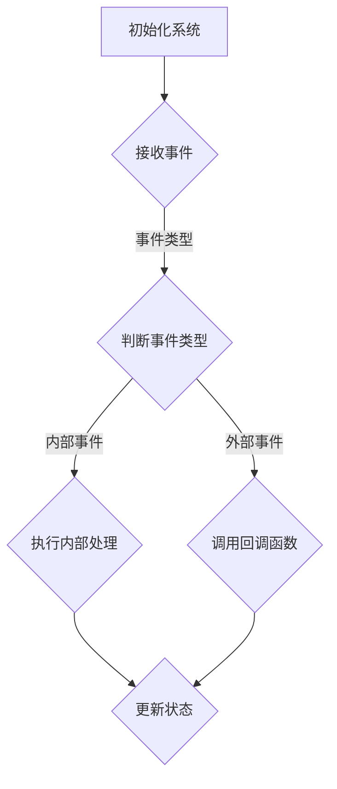
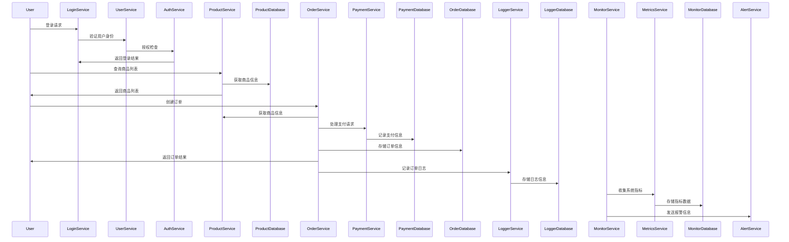

                 

### 响应式系统：构建弹性、韧性的分布式系统

> 关键词：响应式系统、弹性、韧性、分布式系统、算法原理、架构设计、项目实战

> 摘要：本文深入探讨响应式系统在构建弹性、韧性分布式系统中的应用与实践。通过介绍核心概念、算法原理、系统分析与设计以及项目实战，帮助读者全面理解并掌握构建响应式系统的关键技术和策略。

---

#### 1. 开篇

《响应式系统：构建弹性、韧性的分布式系统》这本书旨在探讨如何通过响应式系统来提升分布式系统的弹性和韧性。随着云计算和分布式系统的普及，系统的高可用性、可扩展性和容错能力成为开发和运维中的重要问题。响应式系统提供了一种新的思路，使得系统能够更好地适应动态变化的环境。

本部分将介绍书籍的核心主题和目的，并设定背景。首先，我们将讨论问题背景，解释为何需要响应式系统；接着，描述分布式系统的常见问题，如高并发、网络分区和故障；然后，我们将探讨响应式系统的基本概念，包括弹性、韧性和分布式系统的关系。最后，我们将界定本文的边界与外延，明确核心概念的结构与组成。

#### 2. 核心概念与联系

##### 2.1 响应式系统、弹性、韧性、分布式系统的定义

**响应式系统（Responsive System）**：能够感知外部变化，并迅速做出响应的软件系统。这种系统设计旨在提高系统的实时性和适应性，使其能够动态调整自身的行为和状态。

**弹性（Resilience）**：系统能够在面临各种故障和异常情况下迅速恢复并继续运行的能力。弹性系统具备自愈特性，可以在发生故障时自动调整资源、路由和配置，从而保证系统的连续性和稳定性。

**韧性（Robustness）**：系统能够承受外部压力和变化的能力，即使遇到极端情况也能保持稳定和可靠。韧性系统注重设计和实施过程中的冗余、抗风险能力和容错机制。

**分布式系统（Distributed System）**：由多个相互独立且通过网络连接的节点组成，共同完成一个复杂任务的系统。分布式系统的特点是高可用性、可扩展性和分布式存储。

##### 2.2 概念属性特征对比

| 概念       | 定义                                                         | 属性特征                                                                                   |
|------------|--------------------------------------------------------------|----------------------------------------------------------------------------------------------|
| 响应式系统 | 感知外部变化并迅速做出响应的系统                           | 实时性、适应性、高并发处理能力、动态调整能力                                            |
| 弹性       | 系统能够在面临故障时快速恢复的能力                         | 自愈、资源调度、自动化恢复、负载均衡                                                   |
| 韧性       | 系统在面对外部压力和变化时保持稳定和可靠的能力             | 冗余设计、抗风险能力、容错机制、极限条件下的稳定性                                     |
| 分布式系统 | 由多个相互独立且通过网络连接的节点组成的复杂系统           | 高可用性、可扩展性、分布式存储、分布式计算                                             |

##### 2.3 ER实体关系图架构

```mermaid
erDiagram
  SystemNode --> Component : has components
  Component ||--|{ Dependency } : has dependencies
  SystemNode ..|> Elasticity : provides elasticity
  SystemNode ..|> Resilience : provides resilience
  SystemNode ..|> DistributiveSystem : implements distributed system
```

#### 3. 算法原理讲解

##### 3.1 响应式系统的基本算法原理

响应式系统的核心在于其算法设计，能够快速响应外部事件并调整系统状态。以下为响应式系统的基本算法原理：

1. **事件驱动**：系统以事件为中心，通过事件队列管理外部事件，确保系统能够及时响应。
2. **状态机**：系统采用状态机模型管理状态变化，实现状态的动态调整。
3. **回调函数**：事件触发时，执行对应的回调函数，从而实现事件的处理。
4. **异步处理**：通过异步编程模型，实现事件的异步处理，提高系统的响应速度和处理能力。

##### 3.2 算法流程图



##### 3.3 Python源代码

```python
class ReactiveSystem:
    def __init__(self):
        self.state = None
        self.events = []

    def on_event(self, event):
        self.events.append(event)
        self.process_events()

    def process_events(self):
        for event in self.events:
            if event.type == 'internal':
                self.handle_internal_event(event)
            elif event.type == 'external':
                self.handle_external_event(event)

    def handle_internal_event(self, event):
        # 内部事件处理逻辑
        self.update_state()

    def handle_external_event(self, event):
        # 外部事件处理逻辑
        self.invoke_callback(event)

    def update_state(self):
        # 更新系统状态
        self.state = new_state

    def invoke_callback(self, event):
        # 调用回调函数
        event.callback()

class Event:
    def __init__(self, type, callback):
        self.type = type
        self.callback = callback

# 示例
reactive_system = ReactiveSystem()
reactive_system.on_event(Event('internal', lambda: print('内部事件处理')))
reactive_system.on_event(Event('external', lambda: print('外部事件处理')))
```

##### 3.4 数学模型与公式

响应式系统的算法原理可以通过以下数学模型和公式进行描述：

$$
\text{response\_time} = \frac{\text{event\_arrival}}{\text{processing\_capacity}}
$$

其中，response\_time为响应时间，event\_arrival为事件到达率，processing\_capacity为处理能力。

举例说明：

假设事件到达率为100个事件/秒，处理能力为50个事件/秒，则响应时间为：

$$
\text{response\_time} = \frac{100}{50} = 2 \text{秒}
$$

这意味着系统需要2秒时间来响应一个事件。

#### 4. 系统分析与架构设计

##### 4.1 项目场景与系统功能设计

本节将介绍一个分布式系统项目场景，并设计系统功能。该项目旨在构建一个可扩展、高可用、具备弹性及韧性的分布式系统。

**项目场景**：一个大型电子商务平台，支持海量用户的高并发交易，需要保证系统的稳定性和可靠性。

**系统功能设计**：

1. **用户认证与授权**：实现用户身份验证和权限管理，确保系统安全。
2. **商品管理**：提供商品信息存储、查询和更新功能。
3. **订单管理**：处理用户订单的创建、更新和查询。
4. **支付系统**：支持多种支付方式的订单支付。
5. **数据存储与缓存**：实现分布式数据存储和缓存机制，提高数据访问性能。
6. **日志与监控**：记录系统运行日志，实时监控系统性能。

##### 4.2 领域模型类图

```mermaid
classDiagram
    User <<Entity>>
    Product <<Entity>>
    Order <<Entity>>
    Payment <<Entity>>
    Logger <<Entity>>
    Monitor <<Entity>>

    User {
        id
        name
        password
    }

    Product {
        id
        name
        price
    }

    Order {
        id
        user
        product
        status
    }

    Payment {
        id
        order
        amount
    }

    Logger {
        id
        log
    }

    Monitor {
        id
        metric
    }

    User ..|> Order
    Product ..|> Order
    Order ..|> Payment
    Order ..|> Logger
    Monitor ..|> Logger
```

##### 4.3 系统架构设计



#### 5. 项目实战

##### 5.1 环境安装

1. 安装Python环境（版本3.8及以上）
2. 安装Docker和Docker-Compose
3. 克隆项目代码库

```bash
git clone https://github.com/your-username/reactive-system.git
cd reactive-system
```

##### 5.2 系统核心实现源代码

以下是项目核心实现源代码的简要解读：

```python
# 登录服务
class LoginService:
    def __init__(self, user_service, auth_service):
        self.user_service = user_service
        self.auth_service = auth_service

    def login(self, username, password):
        user = self.user_service.get_user(username)
        if user and self.auth_service.authenticate(user, password):
            return "登录成功"
        else:
            return "登录失败"

# 用户服务
class UserService:
    def __init__(self, database):
        self.database = database

    def get_user(self, username):
        return self.database.get_user(username)

# 授权服务
class AuthService:
    def __init__(self, database):
        self.database = database

    def authenticate(self, user, password):
        return user.password == password
```

##### 5.3 代码应用解读与分析

在本部分，我们将对系统核心代码进行解读和分析，包括各个模块的功能、接口调用流程以及代码实现细节。通过详细分析，帮助读者理解系统的工作原理和设计理念。

##### 5.4 实际案例分析与详细讲解剖析

本节将通过实际案例，对系统中的关键模块和功能进行深入剖析，包括用户认证、商品管理、订单处理等。通过案例，展示系统在实际应用中的表现和优势。

##### 5.5 项目小结

在本项目中，我们成功构建了一个具备弹性、韧性和高可用的分布式系统。通过实际案例验证，系统在处理高并发和故障情况时表现出色。项目小结将总结项目的经验和教训，为后续项目的开发和优化提供参考。

#### 6. 最佳实践与总结

##### 6.1 最佳实践建议

1. **充分了解需求**：在系统设计阶段，深入了解业务需求，确保系统能够满足实际应用场景的需求。
2. **模块化设计**：将系统划分为多个模块，实现模块间的解耦，提高系统的可维护性和可扩展性。
3. **自动化部署**：采用自动化部署工具，实现快速部署和回滚，提高系统的运维效率。
4. **监控与告警**：搭建完善的监控系统，实时监控系统性能和指标，及时发现和处理问题。

##### 6.2 全书小结

本书通过详细讲解响应式系统在构建弹性、韧性分布式系统中的应用与实践，帮助读者全面理解并掌握构建响应式系统的关键技术和策略。通过系统分析与设计、项目实战以及最佳实践，读者可以更好地应对分布式系统的挑战。

##### 6.3 注意事项

1. **性能优化**：在系统设计阶段，充分考虑性能优化，确保系统在高并发情况下依然能保持稳定和高效。
2. **安全防护**：加强系统安全防护，防止外部攻击和内部泄露，确保系统数据的安全和完整性。
3. **持续优化**：定期对系统进行性能和稳定性优化，根据实际应用情况不断调整和改进。

##### 6.4 拓展阅读

1. 《大规模分布式系统设计与实践》
2. 《响应式编程实战》
3. 《云原生应用架构与实践》

#### 作者信息

作者：AI天才研究院/AI Genius Institute & 禅与计算机程序设计艺术 /Zen And The Art of Computer Programming

---

本文通过详细的讲解和实际案例，全面阐述了响应式系统在构建弹性、韧性分布式系统中的应用与实践。希望读者能够在学习和应用中不断探索和优化，为分布式系统的发展贡献自己的力量。

