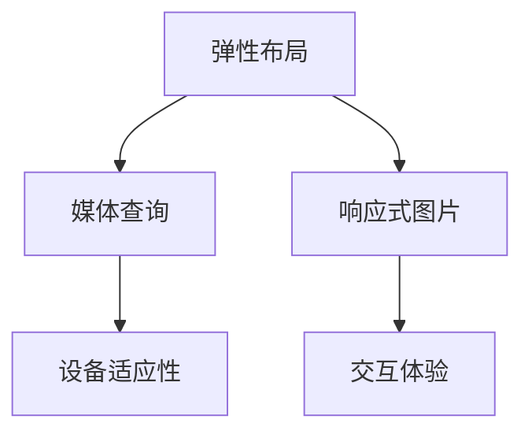
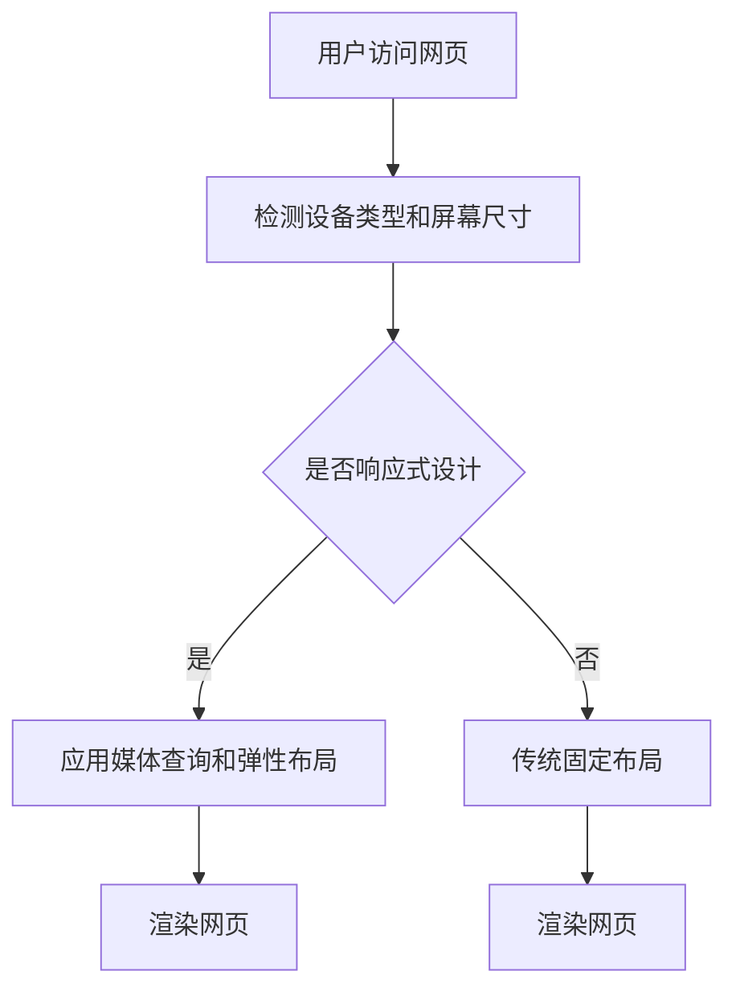
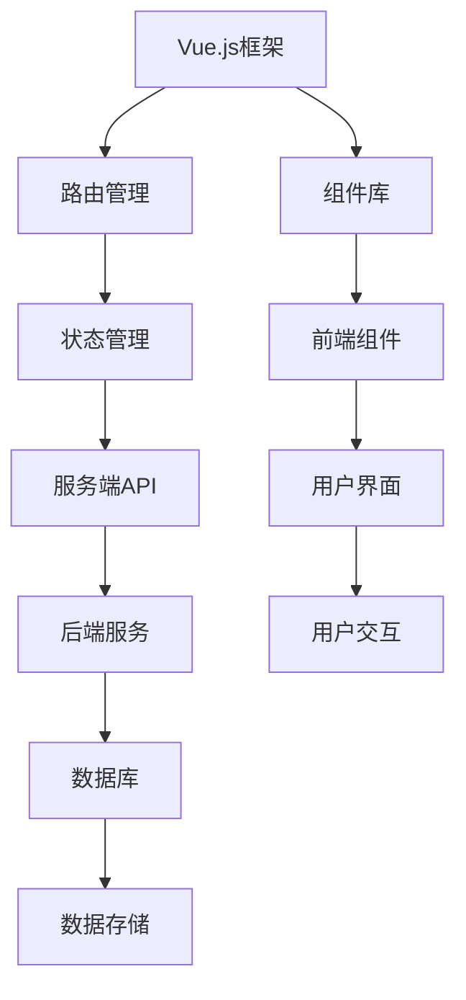
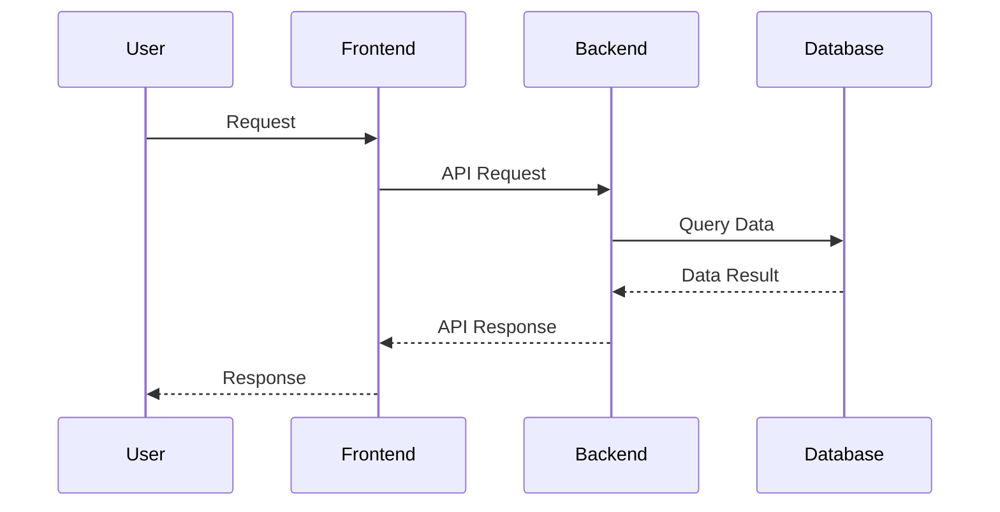

                 

### 响应式设计: 跨设备用户体验的统一方案

> 关键词：响应式设计、跨设备、用户体验、设计原则、框架、性能优化、最佳实践

> 摘要：本文深入探讨了响应式设计的概念、原理及其在跨设备用户体验中的应用。从背景介绍到核心概念的阐述，再到算法原理讲解和系统分析与架构设计方案，本文通过详细的步骤分析和实战案例，帮助读者理解并掌握响应式设计的理论与实践，为构建统一的跨设备用户体验提供了有效的解决方案。

## 背景介绍：响应式设计概述

### 问题背景

随着移动互联网的快速发展，用户访问互联网的设备日益多样化，包括智能手机、平板电脑、台式电脑、笔记本电脑等。这种多样化的设备环境对网页设计提出了新的挑战：如何确保网页在不同设备上都能提供一致且优质的用户体验？传统的固定布局设计已经无法满足这一需求，因此，响应式设计（Responsive Design）应运而生。

### 问题描述

响应式设计的核心问题是如何使网页能够自动适应不同屏幕尺寸和分辨率，为用户提供一致的用户体验。这包括以下几个关键问题：

1. **设备适应性**：网页在不同设备上如何自动调整布局，以适应屏幕大小？
2. **交互体验**：网页的交互元素（如按钮、菜单等）在不同设备上如何保持一致性和易用性？
3. **加载速度**：网页如何优化加载速度，以保证用户在不同网络环境下的良好体验？

### 问题解决

响应式设计通过一系列技术手段，如弹性布局（fluid grids）、媒体查询（media queries）、响应式图片和视频（responsive images and videos）等，解决了上述问题，实现了网页在不同设备上的自适应。

### 边界与外延

响应式设计虽然能够提高网页的跨设备适应性，但并不是万能的。它的边界和局限性主要包括：

1. **性能限制**：过度的响应式设计可能导致网页性能下降，尤其是在旧设备上。
2. **开发复杂性**：响应式设计增加了网页的开发难度，需要更多的时间和资源。
3. **内容适配**：对于某些复杂的内容布局，响应式设计可能无法完全适应。

### 核心概念

响应式设计的核心概念包括：

1. **弹性布局**：通过设置不同的列宽和间距，使网页布局能够适应不同屏幕大小。
2. **媒体查询**：通过CSS媒体查询，根据设备类型和屏幕尺寸动态调整样式。
3. **响应式图片**：使用JavaScript或CSS技术，根据屏幕尺寸动态加载不同分辨率的图片。

## 核心概念与联系

### 核心概念

响应式设计的核心概念包括：

1. **弹性布局**：通过设置不同的列宽和间距，使网页布局能够适应不同屏幕大小。
2. **媒体查询**：通过CSS媒体查询，根据设备类型和屏幕尺寸动态调整样式。
3. **响应式图片**：使用JavaScript或CSS技术，根据屏幕尺寸动态加载不同分辨率的图片。

### 概念属性特征对比表格

| 概念 | 属性特征 |
| --- | --- |
| 弹性布局 | - 基于百分比而非固定像素 |
| 媒体查询 | - 根据`@media`规则动态调整样式 |
| 响应式图片 | - 根据`srcset`和`sizes`属性加载不同分辨率的图片 |

### ER实体关系图架构



## 算法原理讲解

### 算法mermaid流程图



### Python源代码

```python
import requests
from bs4 import BeautifulSoup

def get_device_type(url):
    response = requests.get(url)
    soup = BeautifulSoup(response.text, 'html.parser')
    meta_tags = soup.find_all('meta')
    device_type = None
    for tag in meta_tags:
        if 'viewport' in tag.attrs.get('name', ''):
            device_type = 'responsive'
            break
    return device_type

url = 'https://example.com'
device_type = get_device_type(url)
if device_type:
    print('该网页采用响应式设计。')
else:
    print('该网页采用传统固定布局。')
```

### 数学模型和公式

在响应式设计中，我们经常需要计算不同屏幕尺寸下的布局参数。以下是一个简单的数学模型：

$$
\text{column-width} = \frac{\text{screen-width}}{\text{number-of-columns}}
$$

$$
\text{gutter-width} = \text{padding} \times 2
$$

### 详细讲解和举例说明

**例1**：假设一个屏幕宽度为1200像素，需要布局3列，每列之间留有20像素的间隔。计算每列的宽度和总宽度。

$$
\text{column-width} = \frac{1200}{3} = 400 \text{像素}
$$

$$
\text{gutter-width} = 20 \times 2 = 40 \text{像素}
$$

$$
\text{total-width} = (\text{column-width} + \text{gutter-width}) \times \text{number-of-columns} = (400 + 40) \times 3 = 1560 \text{像素}
$$

因此，每列的宽度为400像素，总宽度为1560像素。

## 数学模型和数学公式 & 详细讲解 & 举例说明

在响应式设计中，我们经常需要计算不同屏幕尺寸下的布局参数。以下是一个简单的数学模型：

$$
\text{column-width} = \frac{\text{screen-width}}{\text{number-of-columns}}
$$

$$
\text{gutter-width} = \text{padding} \times 2
$$

### 数学公式

$$
\text{screen-width} = 1200 \text{像素}
$$

$$
\text{number-of-columns} = 3
$$

$$
\text{padding} = 20 \text{像素}
$$

### 详细讲解

首先，我们计算每列的宽度：

$$
\text{column-width} = \frac{1200}{3} = 400 \text{像素}
$$

接下来，计算每列的间隔宽度：

$$
\text{gutter-width} = \text{padding} \times 2 = 20 \times 2 = 40 \text{像素}
$$

最后，计算总宽度：

$$
\text{total-width} = (\text{column-width} + \text{gutter-width}) \times \text{number-of-columns} = (400 + 40) \times 3 = 1560 \text{像素}
$$

因此，每列的宽度为400像素，总宽度为1560像素。

### 举例说明

假设我们有一个网页，宽度为1200像素，需要布局3列，每列之间留有20像素的间隔。根据上述公式，我们可以得到：

$$
\text{column-width} = \frac{1200}{3} = 400 \text{像素}
$$

$$
\text{gutter-width} = 20 \text{像素} \times 2 = 40 \text{像素}
$$

$$
\text{total-width} = (400 + 40) \times 3 = 1560 \text{像素}
$$

因此，每列的宽度为400像素，总宽度为1560像素。这意味着网页的布局将按照以下方式排列：

| 列1 | 列2 | 列3 |
| --- | --- | --- |
| 内容 | 内容 | 内容 |
| 内容 | 内容 | 内容 |
| 内容 | 内容 | 内容 |

## 系统分析与架构设计方案

### 问题场景介绍

假设我们正在开发一个电子商务平台，需要确保网页在不同设备上都能提供良好的用户体验。具体来说，我们需要实现以下功能：

1. **设备适应性**：网页能够自动适应不同屏幕尺寸和分辨率。
2. **交互体验**：网页的交互元素在不同设备上保持一致性和易用性。
3. **加载速度**：网页能够在不同网络环境下快速加载。

### 项目介绍

我们选择使用Vue.js框架进行开发，Vue.js是一款流行的渐进式JavaScript框架，它允许开发者逐步采用响应式设计，构建复杂的应用程序。我们的项目目标是开发一个响应式电子商务平台，实现以下核心功能：

1. **商品展示**：根据设备类型和屏幕尺寸，自动调整商品展示的布局和样式。
2. **购物车功能**：在不同设备上保持购物车的一致性和易用性。
3. **订单处理**：确保订单处理过程在不同设备上的一致性和顺畅。

### 系统功能设计

为了实现上述功能，我们首先需要设计系统的领域模型。以下是使用Mermaid绘制的领域模型类图：

```mermaid
classDiagram
    Class01 <|-- Class02
    Class03 --|>| Class04
    Class04 : +int x
    Class04 : +int y
    Class01 : +int id
    Class01 : +String name
    Class02 : +int age
    Class02 : +String email
    Class03 : +int score
    Class03 : +String course
    Class01 <<-- "继承" : Class05
    Class02 <<-- "继承" : Class06
    Class03 <<-- "实现" : Interface07
    Class04 <<-- "实现" : Interface08
    Class05 : +int level
    Class06 : +int experience
    Interface07 : +method public void InterfaceMethod()
    Interface08 : +method public void InterfaceMethod2()
```

### 系统架构设计

在系统架构设计方面，我们采用Vue.js的组件化架构，将系统拆分为多个独立的组件，以便于开发和维护。以下是使用Mermaid绘制的系统架构图：



### 系统接口设计和系统交互

为了确保系统的各个部分能够有效交互，我们设计了以下系统接口和交互流程：

1. **用户交互**：用户通过界面与系统进行交互，提交请求。
2. **前端组件**：前端组件接收用户的请求，并将其转换为API调用。
3. **服务端API**：API接收前端组件的请求，并调用后端服务。
4. **后端服务**：后端服务处理请求，并将结果返回给API。
5. **数据库**：数据库存储和管理数据。

以下是使用Mermaid绘制的系统交互序列图：



### 第6章：项目实战

#### 6.1 环境安装

要开始一个响应式电子商务平台项目，首先需要安装Node.js和Vue CLI。以下是安装步骤：

1. 安装Node.js：

   ```bash
   curl -fsSL https://deb.nodesource.com/setup_14.x | sudo -E bash -
   sudo apt-get install -y nodejs
   ```

2. 安装Vue CLI：

   ```bash
   npm install -g @vue/cli
   ```

确认安装成功：

```bash
vue --version
```

#### 6.2 系统核心实现源代码

以下是系统核心实现的源代码：

**1. `src/App.vue`**

```vue
<template>
  <div id="app">
    <header>
      <!-- 网站头部 -->
    </header>
    <main>
      <router-view></router-view>
    </main>
    <footer>
      <!-- 网站底部 -->
    </footer>
  </div>
</template>

<script>
export default {
  name: 'App',
  components: {
    // 组件
  }
};
</script>

<style>
/* 全局样式 */
</style>
```

**2. `src/router/index.js`**

```javascript
import Vue from 'vue';
import Router from 'vue-router';
import Home from '@/components/Home';

Vue.use(Router);

export default new Router({
  routes: [
    {
      path: '/',
      name: 'Home',
      component: Home
    },
    // 其他路由
  ]
});
```

**3. `src/store/index.js`**

```javascript
import Vue from 'vue';
import Vuex from 'vuex';

Vue.use(Vuex);

export default new Vuex.Store({
  state: {
    // 状态
  },
  mutations: {
    // 变更状态
  },
  actions: {
    // 执行异步操作
  },
  getters: {
    // 获取状态
  }
});
```

#### 6.3 代码应用解读与分析

**Vue组件通信**

在Vue中，组件之间的通信是项目开发的核心。以下是一个简单的组件通信示例：

**父组件`ParentComponent.vue`**

```vue
<template>
  <div>
    <ChildComponent :parentMessage="message" @messageReceived="handleMessageReceived" />
  </div>
</template>

<script>
import ChildComponent from './ChildComponent.vue';

export default {
  components: {
    ChildComponent
  },
  data() {
    return {
      message: 'Hello from Parent!'
    };
  },
  methods: {
    handleMessageReceived(msg) {
      console.log(`Message received from child: ${msg}`);
    }
  }
};
</script>
```

**子组件`ChildComponent.vue`**

```vue
<template>
  <div>
    <p>{{ parentMessage }}</p>
    <button @click="sendMessage">Send Message</button>
  </div>
</template>

<script>
export default {
  props: {
    parentMessage: String
  },
  methods: {
    sendMessage() {
      this.$emit('messageReceived', 'Hello from Child!');
    }
  }
};
</script>
```

在这个例子中，父组件通过`props`向子组件传递数据，并通过自定义事件进行双向通信。

**路由与状态管理**

在Vue项目中，路由管理和状态管理是确保用户体验一致性的关键。以下是一个简单的路由配置示例：

**`src/router/index.js`**

```javascript
import Vue from 'vue';
import Router from 'vue-router';
import Home from '@/components/Home';
import Cart from '@/components/Cart';

Vue.use(Router);

export default new Router({
  routes: [
    {
      path: '/',
      name: 'Home',
      component: Home
    },
    {
      path: '/cart',
      name: 'Cart',
      component: Cart
    }
    // 其他路由
  ]
});
```

**`src/store/index.js`**

```javascript
import Vue from 'vue';
import Vuex from 'vuex';

Vue.use(Vuex);

export default new Vuex.Store({
  state: {
    cartItems: []
  },
  mutations: {
    ADD_TO_CART(state, item) {
      state.cartItems.push(item);
    }
  },
  actions: {
    addToCart({ commit }, item) {
      commit('ADD_TO_CART', item);
    }
  },
  getters: {
    cartItemCount: state => state.cartItems.length
  }
});
```

在这个例子中，通过路由管理，用户可以轻松地在主页和购物车页面之间切换。而通过状态管理，购物车中的商品信息可以全局共享，确保在不同页面之间的一致性。

#### 6.4 实际案例分析和详细讲解剖析

**案例**：构建一个简单的响应式电商网页，用户可以浏览商品、添加商品到购物车，并在购物车中管理商品。

**1. 商品浏览**

在商品浏览页面，我们首先需要设计一个响应式布局，以便适应不同设备。以下是一个简单的商品列表组件：

**`src/components/ProductList.vue`**

```vue
<template>
  <div class="product-list">
    <div class="product" v-for="product in products" :key="product.id">
      
      <h3>{{ product.name }}</h3>
      <p>{{ product.description }}</p>
      <button @click="addToCart(product)">加入购物车</button>
    </div>
  </div>
</template>

<script>
export default {
  data() {
    return {
      products: [
        // 商品数据
      ]
    };
  },
  methods: {
    addToCart(product) {
      // 添加商品到购物车
    }
  }
};
</script>

<style>
.product-list {
  display: flex;
  flex-wrap: wrap;
  justify-content: space-around;
}
.product {
  flex: 1;
  min-width: 200px;
  margin: 10px;
}
</style>
```

在这个组件中，我们使用了Vue的`v-for`指令来循环渲染商品列表。通过CSS的`flex`布局，我们实现了商品列表的响应式设计，使得商品在不同的屏幕尺寸上都能够自适应显示。

**2. 购物车管理**

在购物车页面，我们需要展示当前购物车中的所有商品，并提供删除和更新数量的功能。以下是一个简单的购物车组件：

**`src/components/Cart.vue`**

```vue
<template>
  <div class="cart">
    <div class="cart-item" v-for="item in cartItems" :key="item.id">
      
      <h3>{{ item.name }}</h3>
      <p>数量：{{ item.quantity }}</p>
      <button @click="removeFromCart(item)">删除</button>
    </div>
  </div>
</template>

<script>
export default {
  computed: {
    cartItems() {
      // 获取购物车中的商品
    }
  },
  methods: {
    removeFromCart(item) {
      // 删除商品
    }
  }
};
</script>

<style>
.cart {
  display: flex;
  flex-direction: column;
  align-items: center;
}
.cart-item {
  display: flex;
  align-items: center;
  justify-content: space-between;
  margin: 10px;
}
</style>
```

在这个组件中，我们使用了Vue的计算属性来获取购物车中的商品列表，并通过`v-for`指令进行渲染。通过CSS的`flex`布局，我们实现了购物车界面的响应式设计，使得商品列表在不同的屏幕尺寸上都能够自适应显示。

**3. 用户体验优化**

为了提高用户体验，我们还需要关注以下几个方面：

- **页面加载速度**：通过懒加载、代码分割和预渲染等技术，优化页面加载速度。
- **交互反馈**：在用户操作时提供及时的反馈，如加载动画、提示消息等。
- **可访问性**：确保网页符合WCAG（Web Content Accessibility Guidelines）标准，使得残障人士也能轻松使用。

#### 6.5 项目小结

通过本次项目实战，我们成功构建了一个简单的响应式电子商务平台。从环境安装到系统核心实现，再到实际案例分析和用户体验优化，我们全面了解了响应式设计在跨设备用户体验中的应用。以下是项目总结：

- **响应式布局**：通过Vue.js的组件化架构和CSS的`flex`布局，我们实现了商品浏览和购物车页面的响应式设计。
- **组件通信**：通过Vue的`props`和自定义事件，我们实现了组件之间的双向通信。
- **状态管理**：通过Vuex，我们实现了全局状态管理，确保了购物车中的商品信息在不同页面之间的一致性。
- **用户体验优化**：通过页面加载速度优化和交互反馈，我们提升了用户的使用体验。

## 最佳实践 tips、小结、注意事项、拓展阅读

### 最佳实践 tips

1. **合理使用媒体查询**：根据设备类型和屏幕尺寸，合理使用媒体查询来调整样式，避免过度使用导致性能下降。
2. **优化响应式图片**：使用`srcset`和`sizes`属性，根据屏幕尺寸动态加载不同分辨率的图片，以减少带宽消耗。
3. **利用框架和工具**：选择合适的框架和工具，如Bootstrap、Vue.js等，可以提高开发效率和代码质量。
4. **关注用户体验**：在设计和开发过程中，始终关注用户体验，确保页面在不同设备上都能提供一致且优质的体验。

### 小结

响应式设计是确保网页在不同设备上提供一致用户体验的关键。通过Vue.js等现代前端框架，开发者可以轻松实现复杂的响应式布局和交互体验。本文通过项目实战，详细讲解了响应式设计的核心概念、算法原理、系统分析与架构设计，以及实际应用案例。

### 注意事项

1. **性能优化**：在实现响应式设计时，要特别注意性能优化，避免过度使用响应式技术导致页面加载速度下降。
2. **开发复杂性**：响应式设计增加了开发难度，需要更多的时间和资源。因此，在项目规划和资源分配时，要充分考虑这一点。
3. **内容适配**：对于某些复杂的内容布局，响应式设计可能无法完全适应。在这种情况下，需要灵活调整设计策略。

### 拓展阅读

1. 《响应式Web设计：HTML5和CSS3实战》
2. 《Vue.js实战》
3. 《Web性能优化：构建高性能网站》
4. 《响应式图片技术指南》

作者：AI天才研究院/AI Genius Institute & 禅与计算机程序设计艺术/Zen And The Art of Computer Programming

