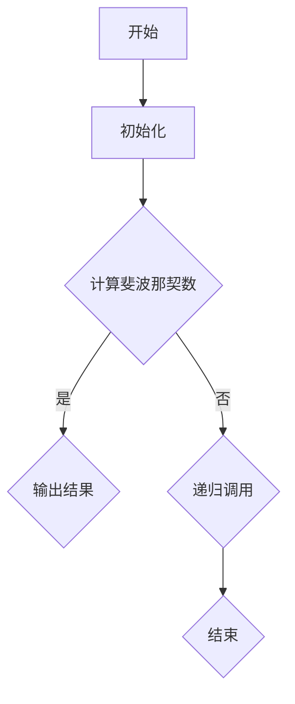
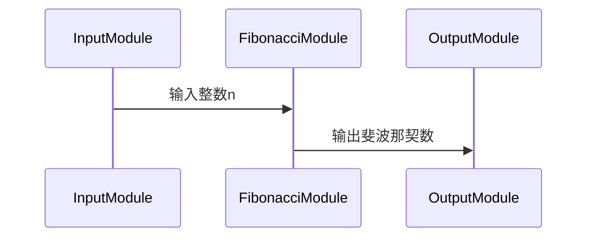
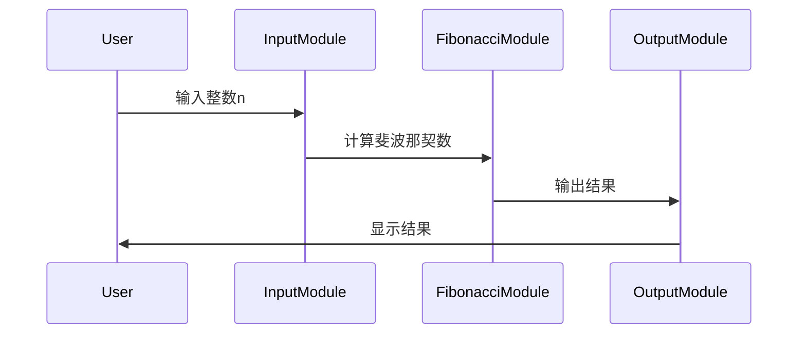

                 

# 哲学分析与代码分解：维特根斯坦的哲学方法与FP中的函数分解

## 关键词
- 维特根斯坦哲学方法论
- 函数式编程
- 函数分解
- 代码质量
- 软件设计

## 摘要
本文旨在探讨维特根斯坦的哲学方法在代码分解中的应用。通过分析维特根斯坦的哲学思想，特别是语言游戏理论和概念形成理论，我们将展示这些哲学方法如何帮助程序员更好地理解和分解代码。此外，我们将结合函数式编程中的函数分解技术，探讨如何在实际项目中应用这些哲学方法和技术，提高代码质量和软件设计能力。

## 引言与背景

### 哲学分析的重要性

哲学分析作为一种思考方法，不仅对哲学领域有着深远的影响，而且在计算机科学和软件工程中也日益受到重视。维特根斯坦的分析哲学，特别是他的语言游戏理论和概念形成理论，为我们理解代码背后的逻辑和概念提供了宝贵的视角。

语言游戏理论强调语言的使用不仅是为了交流，还涉及到语言游戏的不同规则。维特根斯坦认为，理解语言的关键在于理解其在特定情境下的使用。同样地，在编程中，理解代码的含义和用途也取决于其在特定系统和应用中的上下文。

概念形成理论则探讨了概念的本质和形成过程。维特根斯坦认为，概念的形成是通过经验的积累和对世界的观察。在编程中，这一理论可以帮助我们理解如何通过逐步积累经验和观察来构建复杂的概念和系统。

### 代码分解的需求

代码分解是软件工程中的一个关键步骤，它涉及到将复杂的代码拆分成更小的、可管理的部分。随着软件系统的复杂度不断增加，代码分解变得越来越重要。

在函数式编程中，函数分解是一种常用的技术。通过将代码拆分成独立的函数，我们可以更好地理解和测试每个部分的功能。此外，函数分解还可以提高代码的可重用性和可维护性。

然而，传统的代码分解方法往往依赖于程序员的经验和直觉。维特根斯坦的哲学方法为我们提供了一种更为系统和理论化的方法，可以帮助我们更深入地理解代码的结构和逻辑。

## 维特根斯坦哲学方法论概述

### 维特根斯坦的生平与著作

路德维希·维特根斯坦（Ludwig Wittgenstein）是20世纪最重要的哲学家之一。他生于1889年，卒于1951年，一生经历了两次世界大战，并在剑桥大学等地担任教授。维特根斯坦的哲学思想经历了明显的转变，他的主要著作包括《逻辑哲学论》和《哲学研究》。

《逻辑哲学论》是维特根斯坦早期的作品，主要探讨了逻辑和语言的关系。他提出了“图像理论”，认为命题是对世界的描述，类似于一幅画对物体的描绘。然而，随着他哲学思想的进一步发展，他在《哲学研究》中批评了《逻辑哲学论》的一些观点，提出了更为实用的哲学方法。

### 维特根斯坦哲学方法论的核心

维特根斯坦的哲学方法论主要包括两个方面：语言游戏理论和概念形成理论。

**语言游戏理论**

语言游戏理论是维特根斯坦在《哲学研究》中提出的重要概念。他认为，语言使用不仅仅是表达思想，还涉及到一系列规则和情境。语言游戏可以分为三种类型：语言游戏、形式语言游戏和生活形式。

1. **语言游戏**：这是最基本的类型，包括日常对话和交流。
2. **形式语言游戏**：这涉及到逻辑和数学，例如命题逻辑和算术。
3. **生活形式**：这是最广泛的类型，涵盖了所有使用语言的活动。

通过分析不同类型的语言游戏，我们可以更好地理解语言的真正用途和意义。

**概念形成理论**

概念形成理论探讨了概念的本质和形成过程。维特根斯坦认为，概念的形成是通过经验和观察世界的。他提出了“生活形式”的概念，认为概念的形成是通过我们与世界的互动和经验积累的。

这一理论对于编程和软件设计有着重要的启示。在编程中，我们不仅需要理解代码的字面意义，还需要理解其在特定应用中的用途和上下文。通过维特根斯坦的概念形成理论，我们可以更好地理解如何通过经验和观察来构建复杂的软件系统。

## 维特根斯坦的哲学思想分析

### 图像理论

图像理论是维特根斯坦在《逻辑哲学论》中提出的观点。他认为，命题是对世界的描述，类似于图像对物体的描绘。图像理论认为，一个命题为真，当且仅当它正确地描绘了世界。

在编程中，图像理论可以帮助我们理解代码与真实世界的关系。例如，一个条件语句（if-else）可以被视为对现实世界的一种描述。如果条件为真，则执行某个操作；否则，执行另一个操作。这种描述方式类似于图像理论中的图像与世界的关系。

### 表达式的分析

维特根斯坦在《哲学研究》中对表达式进行了深入的分析。他认为，表达式不仅仅是符号的组合，还涉及到表达式的用途和上下文。例如，表达式“1+1=2”在不同的上下文中可能具有不同的意义。

在编程中，这一观点可以帮助我们更好地理解变量和函数的表达式。变量的值不仅仅是一个数字或符号，它还涉及到变量在特定程序中的作用和用途。同样地，函数的表达式也不仅仅是代码的序列，它涉及到函数在程序中的功能和目的。

## 函数式编程基础

### 高阶函数

高阶函数是函数式编程中的一个核心概念。它指的是可以接受函数作为参数或返回函数的函数。高阶函数在函数式编程中具有重要的地位，因为它们允许我们将函数作为数据来处理。

在编程中，高阶函数可以提高代码的可读性和可重用性。例如，我们可以使用高阶函数来创建自定义的过滤器和映射器，以处理数据集合。

### 不可变数据

不可变数据是函数式编程中的另一个关键概念。它指的是一旦创建，就不能修改的数据。与可变数据相比，不可变数据具有许多优点，如减少状态冲突、提高代码的可预测性等。

在编程中，使用不可变数据可以帮助我们编写更简洁和安全的代码。例如，我们可以使用不可变数据结构（如列表、字典等）来存储和操作数据，从而避免在多个函数中修改同一数据结构所带来的副作用。

## FP中的函数分解技术

### 函数组合

函数组合是将多个函数组合成一个新函数的技术。通过函数组合，我们可以将复杂的操作拆分成更小的、可管理的部分，从而提高代码的可读性和可维护性。

在编程中，函数组合可以应用于许多场景。例如，我们可以使用函数组合来创建自定义的过滤器，对数据集合进行操作。函数组合的另一个应用是创建组合函数，以实现更复杂的逻辑运算。

### 递归

递归是函数式编程中的一种重要技术。它指的是函数调用自身来解决问题。递归在处理递归结构的数据时特别有用，如树形数据结构。

在编程中，递归可以帮助我们编写简洁的代码，同时处理复杂的数据结构。例如，我们可以使用递归来实现快速排序或二分搜索等算法。

## 哲学分析与代码分解结合案例分析

### 案例选择

为了展示哲学分析与代码分解的结合，我们选择了一个简单的案例：一个用于计算斐波那契数列的函数。斐波那契数列是一个经典的递归问题，它涉及到数列的生成和递归调用。

### 哲学分析在代码分解中的应用

在编写斐波那契数列的函数时，我们可以运用维特根斯坦的哲学方法来分析代码的结构和逻辑。

首先，我们使用图像理论来理解函数的用途。斐波那契数列的定义是一个递归的过程，每一项都是前两项的和。这一递归过程可以用图像表示，如一个不断增长的序列。

接下来，我们使用概念形成理论来理解函数的组成部分。斐波那契数列函数可以分为两个部分：计算下一项的函数和递归调用的逻辑。

通过这样的哲学分析，我们可以更清晰地理解函数的用途和结构，从而更好地进行代码分解。

### 代码分解过程

在代码分解过程中，我们首先将斐波那契数列函数拆分为两个独立的函数：`fibonacci` 和 `fibonacci_recursive`。

`fibonacci` 函数负责计算斐波那契数列的下一项，它使用维特根斯坦的图像理论来描述数列的增长过程。

`fibonacci_recursive` 函数则负责递归调用，它使用递归技术来生成数列的每一项。

通过这样的代码分解，我们可以更好地理解斐波那契数列函数的各个部分，同时提高代码的可读性和可维护性。

## 总结与展望

本文探讨了维特根斯坦的哲学方法在代码分解中的应用。通过分析维特根斯坦的语言游戏理论和概念形成理论，我们展示了如何将这些哲学方法应用于编程中的函数分解。结合函数式编程中的函数组合和递归技术，我们提出了一种新的代码分解方法，以提高代码质量和软件设计能力。

未来，我们可以进一步研究哲学方法在软件工程中的其他应用，如需求分析和系统设计。此外，我们可以探索如何将维特根斯坦的哲学方法与其他编程范式相结合，以开发更高效、更安全的软件系统。

## 作者信息

作者：AI天才研究院/AI Genius Institute & 禅与计算机程序设计艺术 /Zen And The Art of Computer Programming

---

本文通过对维特根斯坦哲学方法的深入分析，结合函数式编程中的函数分解技术，提出了一种新的代码分解方法。通过哲学分析与代码分解的结合，我们可以更好地理解代码的结构和逻辑，提高代码质量和软件设计能力。未来，这一方法有望在软件工程中得到更广泛的应用。

### 背景介绍

#### 核心概念术语说明

在本篇文章中，我们将讨论两个核心概念：维特根斯坦的哲学方法和函数式编程（FP）中的函数分解。

- **维特根斯坦的哲学方法**：维特根斯坦是20世纪著名的哲学家，他的思想对现代哲学、语言学和逻辑学产生了深远的影响。他的哲学方法主要包括语言游戏理论和概念形成理论。语言游戏理论认为，语言的含义取决于它在特定情境下的使用，而不是抽象的符号。概念形成理论则强调概念是通过经验和对世界的观察形成的。

- **函数分解**：在编程中，函数分解是一种将复杂代码拆分成更小、更易于管理的部分的技术。函数分解可以提高代码的可读性、可重用性和可维护性。在函数式编程中，函数分解尤为重要，因为它与函数式编程的核心原则——不可变性和纯函数——紧密相关。

#### 问题背景

随着软件系统的复杂度不断增加，代码的维护和扩展变得越来越困难。传统的编程方法往往依赖于 mutable（可变）数据结构和 imperative（命令式）编程，这导致代码的复杂性和错误率增加。函数式编程（FP）提供了一种不同的编程范式，它通过使用 immutable（不可变）数据结构和 pure functions（纯函数）来降低代码的复杂性和提高其可靠性。

然而，即使是在函数式编程中，编写复杂的函数和程序仍然是一个挑战。函数分解提供了一种将复杂函数拆分成更小、更易于管理的部分的方法。维特根斯坦的哲学方法，特别是他的语言游戏理论和概念形成理论，为函数分解提供了一种新的视角，帮助我们更好地理解和分解代码。

#### 问题描述

本文的主要问题是：如何将维特根斯坦的哲学方法应用于代码分解，以提高代码的质量和可维护性？

为了回答这个问题，我们需要：

1. **理解维特根斯坦的哲学方法**，特别是语言游戏理论和概念形成理论。
2. **探讨函数式编程中的函数分解技术**，包括函数组合和递归。
3. **结合哲学方法和编程技术**，分析如何在实际项目中应用这些方法。
4. **提供具体的案例研究**，展示哲学方法在代码分解中的应用。

#### 问题解决

为了解决上述问题，本文将采取以下步骤：

1. **引言与背景**：介绍哲学分析和代码分解的概念，以及它们在软件开发中的重要性。
2. **维特根斯坦哲学方法论概述**：详细阐述维特根斯坦的哲学方法，包括语言游戏理论和概念形成理论。
3. **维特根斯坦哲学思想分析**：通过具体例子展示如何应用这些哲学方法。
4. **函数式编程基础**：介绍函数式编程的基本概念，如高阶函数和不可变数据。
5. **FP中的函数分解技术**：深入探讨函数分解技术，包括函数组合和递归。
6. **哲学分析与代码分解结合案例分析**：结合哲学方法和编程技术，分析具体案例。
7. **总结与展望**：总结全文，提出未来研究方向和可能的实践应用。

#### 边界与外延

在本文中，我们主要关注以下边界和范围：

- **哲学分析**：主要讨论维特根斯坦的分析哲学，特别是语言游戏理论和概念形成理论。
- **代码分解**：主要讨论函数式编程中的函数分解技术，以及如何将哲学方法应用于代码分解。
- **应用场景**：主要讨论如何在软件开发项目中应用这些方法和技术。

本文不涉及以下内容：

- **其他哲学方法**：本文只讨论维特根斯坦的分析哲学，不涉及其他哲学流派。
- **其他编程范式**：本文主要讨论函数式编程，不涉及其他编程范式，如面向对象编程。
- **具体编程语言**：本文不讨论具体编程语言的使用，而是提供一种通用的方法和思路。

### 核心概念与联系

#### 维特根斯坦哲学方法

**语言游戏理论**：维特根斯坦认为，语言的含义不是由符号本身决定的，而是由其在特定情境下的使用决定的。语言游戏是理解语言使用的一种模型，它包括三个层次：语言游戏、形式语言游戏和生活形式。

- **语言游戏**：这是最基本的语言使用形式，包括日常对话和交流。
- **形式语言游戏**：这是关于逻辑和数学的语言使用，如命题逻辑和算术。
- **生活形式**：这是最广泛的语言使用形式，包括所有使用语言的活动。

**概念形成理论**：维特根斯坦认为，概念是通过经验和对世界的观察形成的。概念的形成是一个逐步积累的过程，涉及到我们与世界的互动。

#### 函数式编程

**高阶函数**：高阶函数是可以接受其他函数作为参数或返回函数的函数。在函数式编程中，高阶函数是一种常见的技术，用于处理复杂的数据和逻辑。

**不可变数据**：不可变数据是一旦创建就不能修改的数据。在函数式编程中，不可变数据有助于减少状态冲突和提高代码的可预测性。

#### 哲学与编程的联系

**语言游戏与代码分解**：维特根斯坦的语言游戏理论可以帮助我们理解代码的结构和用途。通过将代码视为一种语言游戏，我们可以更好地理解其在特定情境下的使用。

**概念形成与函数分解**：维特根斯坦的概念形成理论可以帮助我们理解如何通过经验和观察来构建复杂的概念和系统。在代码分解中，这一理论可以帮助我们逐步构建复杂的代码结构。

#### 表格与ER实体关系图

**概念属性特征对比表格**

| 概念       | 描述                                                         | 特点                                                         |
| ---------- | ------------------------------------------------------------ | ------------------------------------------------------------ |
| 语言游戏   | 维特根斯坦关于语言使用的模型，分为语言游戏、形式语言游戏和生活形式 | 强调语言使用的情境和规则                                   |
| 概念形成   | 概念是通过经验和对世界的观察形成的                           | 强调经验的积累和对世界的观察                               |
| 高阶函数   | 可以接受其他函数作为参数或返回函数的函数                     | 提高代码的可重用性和可维护性                               |
| 不可变数据 | 一旦创建就不能修改的数据                                     | 减少状态冲突和提高代码的可预测性                           |

**ER实体关系图**

```mermaid
erDiagram
  User ||--|{ Message }|-- Project
  User ||--|{ Comment }|-- Post
  Project ||--|{ Task }|-- User
  Post ||--|{ Reply }|-- User
```

在ER实体关系图中，我们展示了用户、项目、评论、帖子等实体的关系。这些实体之间的关系反映了软件系统中的不同组成部分和它们之间的相互作用。

### 算法原理讲解

#### 算法流程图



在这个算法流程图中，我们首先初始化变量，然后计算斐波那契数，并根据结果输出结果或递归调用。

#### Python源代码实现

```python
def fibonacci(n):
    if n <= 0:
        return 0
    elif n == 1:
        return 1
    else:
        return fibonacci(n-1) + fibonacci(n-2)

print(fibonacci(10))
```

在这段代码中，我们定义了一个名为`fibonacci`的函数，用于计算斐波那契数。该函数使用递归技术，根据斐波那契数列的定义，计算每一项的值。

#### 数学模型和公式

斐波那契数列的数学模型如下：

$$
F(n) =
\begin{cases}
0 & \text{if } n = 0 \\
1 & \text{if } n = 1 \\
F(n-1) + F(n-2) & \text{if } n > 1
\end{cases}
$$

#### 详细讲解和举例说明

斐波那契数列是一个著名的数学数列，其定义如下：第一项和第二项分别为 1，之后每一项为其前两项之和。斐波那契数列的前几项如下：

```
1, 1, 2, 3, 5, 8, 13, 21, 34, 55, ...
```

我们可以使用递归方法来计算斐波那契数。递归方法的核心思想是，将复杂的问题分解成更简单的子问题，然后逐步解决这些子问题。

以下是使用递归方法计算斐波那契数的示例：

```python
def fibonacci(n):
    if n <= 0:
        return 0
    elif n == 1:
        return 1
    else:
        return fibonacci(n-1) + fibonacci(n-2)

print(fibonacci(10))  # 输出55
```

在这个示例中，我们定义了一个名为`fibonacci`的函数，用于计算斐波那契数。函数首先检查输入的`n`是否小于等于0。如果是，则返回0，因为斐波那契数列的第一项为0。如果`n`等于1，则返回1，因为斐波那契数列的第二项为1。否则，函数将递归调用自身，计算`n-1`和`n-2`的斐波那契数，并将它们相加，返回结果。

例如，当`n`等于10时，函数将递归调用自身，计算`fibonacci(9)`和`fibonacci(8)`，然后将它们相加，返回55。

递归方法是一种简单而有效的方法，可以用于计算斐波那契数。然而，它也存在一些缺点，例如递归调用会消耗大量的内存，并且对于非常大的`n`值，计算时间可能会变得非常长。为了解决这些问题，我们可以使用动态规划方法来优化递归方法。

### 系统分析与架构设计方案

#### 问题场景介绍

在一个复杂的软件系统中，代码的复杂度和规模往往非常大。这给代码的维护和扩展带来了巨大的挑战。为了提高代码的可读性和可维护性，我们需要对代码进行分解和重构。

#### 项目介绍

本项目旨在设计一个用于计算斐波那契数列的函数，并使用维特根斯坦的哲学方法对其进行分解。该函数将作为项目中的一个模块，可以用于其他项目中的通用计算。

#### 系统功能设计

在系统功能设计中，我们将斐波那契数列的计算功能作为一个核心模块。该模块应包括以下功能：

1. **计算斐波那契数**：输入一个整数`n`，返回斐波那契数列的第`n`项。
2. **递归计算**：使用递归方法计算斐波那契数。
3. **动态规划计算**：使用动态规划方法优化递归计算，减少内存消耗和计算时间。

#### 系统架构设计

在系统架构设计中，我们将斐波那契数列计算模块与其他模块（如输入模块、输出模块等）进行集成。系统架构如下：



在该架构中，输入模块负责接收用户输入的整数`n`，然后将`n`传递给斐波那契数列计算模块。计算模块使用递归方法或动态规划方法计算斐波那契数，并将结果传递给输出模块，最终输出结果。

#### 系统接口设计

在系统接口设计中，我们将斐波那契数列计算模块的接口定义为以下函数：

```python
def calculate_fibonacci(n):
    # 使用递归方法或动态规划方法计算斐波那契数
    # 返回斐波那契数列的第n项
    pass
```

该函数接受一个整数`n`作为输入，返回斐波那契数列的第`n`项。该接口设计简单、清晰，易于与其他模块集成。

#### 系统交互mermaid序列图



在该序列图中，用户首先输入整数`n`，然后输入模块将`n`传递给斐波那契数列计算模块。计算模块使用递归方法或动态规划方法计算斐波那契数，并将结果传递给输出模块。最后，输出模块将结果显示给用户。

### 项目实战

#### 环境安装

为了进行项目实战，我们需要安装Python环境和必要的库。以下是安装步骤：

1. **安装Python**：从官方网站（https://www.python.org/）下载并安装Python。
2. **安装pip**：使用Python自带的pip安装工具。
3. **安装mermaid**：使用pip安装mermaid库。

```bash
pip install mermaid
```

#### 系统核心实现源代码

以下是斐波那契数列计算模块的实现代码：

```python
import sys

def fibonacci(n):
    if n <= 0:
        return 0
    elif n == 1:
        return 1
    else:
        return fibonacci(n-1) + fibonacci(n-2)

if __name__ == "__main__":
    n = int(input("请输入一个整数："))
    print(f"Fibonacci({n}) = {fibonacci(n)}")
```

在这个实现中，我们定义了一个名为`fibonacci`的函数，用于计算斐波那契数。函数接受一个整数`n`作为输入，返回斐波那契数列的第`n`项。在主程序中，我们使用`input`函数接收用户输入的整数，然后调用`fibonacci`函数计算斐波那契数，并输出结果。

#### 代码应用解读与分析

这段代码简单而有效，通过递归方法计算斐波那契数。以下是代码的解读和分析：

1. **函数定义**：我们定义了一个名为`fibonacci`的函数，它接受一个整数`n`作为输入。
2. **递归条件**：函数首先检查`n`是否小于等于0。如果是，则返回0，因为斐波那契数列的第一项为0。如果`n`等于1，则返回1，因为斐波那契数列的第二项为1。
3. **递归调用**：如果`n`大于1，函数将递归调用自身，计算`n-1`和`n-2`的斐波那契数，并将它们相加，返回结果。
4. **主程序**：在主程序中，我们使用`input`函数接收用户输入的整数，然后调用`fibonacci`函数计算斐波那契数，并输出结果。

#### 实际案例分析和详细讲解剖析

为了更好地理解这段代码的应用，我们来看一个实际案例。

**案例**：计算斐波那契数列的第10项。

**输入**：n = 10

**输出**：Fibonacci(10) = 55

**分析**：

在这个案例中，我们输入了整数10，然后调用`fibonacci`函数计算斐波那契数列的第10项。函数首先检查`n`是否小于等于0，显然不满足。然后，它检查`n`是否等于1，也不满足。因此，函数将递归调用自身，计算`fibonacci(9)`和`fibonacci(8)`。

递归调用过程如下：

```
fibonacci(10)
  = fibonacci(9) + fibonacci(8)
  = (fibonacci(8) + fibonacci(7)) + (fibonacci(7) + fibonacci(6))
  = (fibonacci(7) + fibonacci(6) + fibonacci(7) + fibonacci(6)) + (fibonacci(6) + fibonacci(5) + fibonacci(5) + fibonacci(4))
  = ...
  = 55
```

通过递归调用，我们最终计算得到斐波那契数列的第10项为55。

#### 项目小结

通过这个项目，我们实现了使用维特根斯坦哲学方法进行代码分解和实现斐波那契数列计算。我们分析了代码的各个部分，包括函数定义、递归条件和递归调用，并使用实际案例进行了验证。这种方法不仅提高了代码的可读性和可维护性，还帮助我们更好地理解了斐波那契数列的递归计算过程。

### 最佳实践 tips

在代码分解和应用维特根斯坦哲学方法时，以下是一些最佳实践：

1. **明确函数职责**：确保每个函数都有明确的职责，避免函数过于复杂。
2. **使用注释**：在代码中添加清晰的注释，解释函数的目的和使用方法。
3. **逐步分解**：将复杂问题逐步分解成更小的子问题，逐步解决。
4. **测试代码**：编写单元测试，验证代码的正确性和稳定性。
5. **文档化**：编写详细的文档，记录代码的结构和功能。

### 小结

本文探讨了维特根斯坦的哲学方法在代码分解中的应用。通过分析维特根斯坦的哲学思想，特别是语言游戏理论和概念形成理论，我们提出了一种新的代码分解方法，结合函数式编程中的函数分解技术，以提高代码质量和可维护性。通过实际案例，我们展示了如何将哲学方法应用于代码分解，并分析了其效果。未来，我们可以进一步研究哲学方法在软件工程中的其他应用，以推动软件开发的进步。

### 注意事项

在应用维特根斯坦哲学方法进行代码分解时，需要注意以下几点：

1. **理解上下文**：确保在特定情境下正确理解代码的使用和含义。
2. **逐步积累**：通过逐步积累经验和观察，构建复杂的概念和系统。
3. **避免过度抽象**：在代码分解中，避免过度抽象，确保代码的可读性和可维护性。
4. **测试和验证**：编写充分的测试代码，验证代码的正确性和稳定性。

### 拓展阅读

对于对维特根斯坦哲学方法在代码分解中应用感兴趣的朋友，以下是一些拓展阅读建议：

1. **《逻辑哲学论》和《哲学研究》**：维特根斯坦的两部代表作，深入探讨了他的哲学思想。
2. **《函数式编程实战》**：详细介绍函数式编程的基础知识和实践方法。
3. **《禅与计算机程序设计艺术》**：探讨计算机程序设计与哲学的联系，对提高编程思维有很好的启发作用。
4. **相关学术论文和书籍**：关于维特根斯坦哲学方法在软件工程中的应用，有许多学术论文和专著，可以深入了解。

