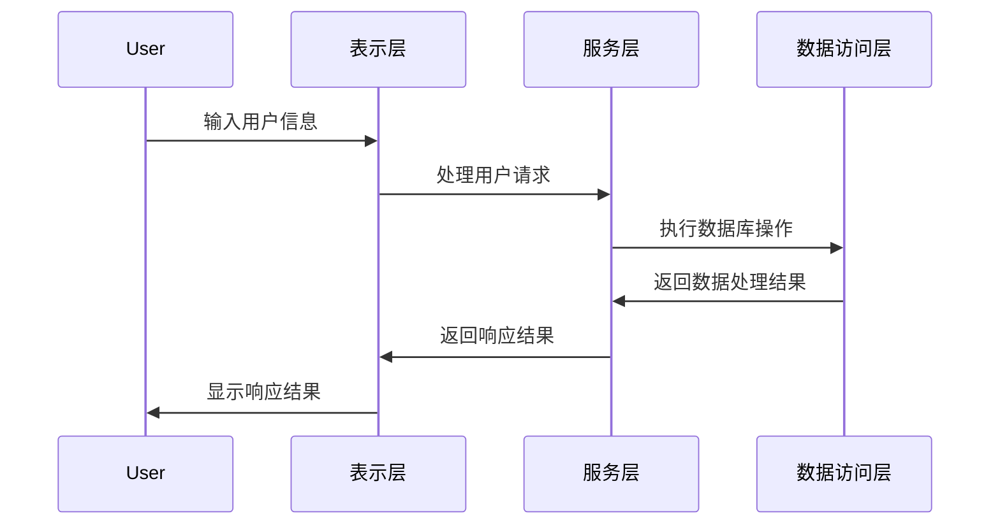
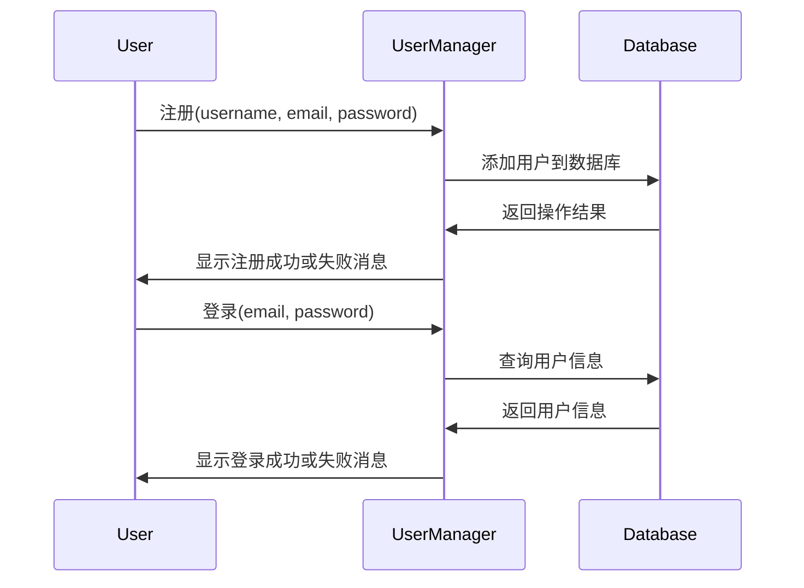

                 

## 第一部分：哲学治疗与代码重构引论

### 1. 哲学治疗与代码重构：一种新的思维模式

在现代社会，哲学与技术的结合正逐渐成为一种新的趋势。哲学治疗与代码重构正是这种趋势的体现。哲学治疗，起源于精神病学领域，但逐渐演变为一种探索人类思维、行为和心理的综合性治疗方法。它强调通过思考和理解来改善个人的心理状态，从而达到治疗的目的。而代码重构，则是在软件开发过程中，通过改进代码结构和设计，提高代码质量、可维护性和可扩展性的技术手段。

将哲学治疗引入代码重构，意味着我们不仅仅关注代码本身，而是通过哲学的视角去理解代码背后的思维模式。这种方法可以促使开发者以更加深入和全面的方式去思考和解决问题，从而提升代码质量和软件开发的整体效率。

### 2. 维特根斯坦的哲学方法：简洁与明晰

维特根斯坦，被誉为20世纪最伟大的哲学家之一，他的哲学方法对后世产生了深远的影响。维特根斯坦主张通过“语言分析”来解决问题，认为许多哲学难题实际上源于我们对语言的误解。他强调语言的“使用”而非“指称”，主张通过“澄清”语言来达到理解和解决问题的目的。

维特根斯坦的方法对我们理解代码重构具有重要启示。在代码重构中，我们同样需要关注代码的“使用”而非仅仅关注其“功能”。通过深入理解代码的用途和上下文，我们可以更加准确地识别需要改进的部分，从而实现代码的重构。

### 3. 函数式编程：逻辑与抽象的力量

函数式编程（Functional Programming，简称FP）是一种与面向对象编程（Object-Oriented Programming，简称OOP）相对的编程范式。它强调函数作为程序的基本构建块，通过无状态和不可变的数据结构来编写代码。FP具有简洁、易测试和易于重构的特点，使其成为代码重构的理想选择。

维特根斯坦的哲学方法和FP的核心思想有许多相似之处。两者都强调逻辑和抽象，通过简化和澄清来达到理解和解决问题的目的。这使得将维特根斯坦的哲学方法与FP相结合，成为探讨代码重构的新途径。

### 4. 为什么需要哲学治疗与函数式重构？

在软件开发过程中，我们常常会遇到复杂的代码结构和难以维护的代码库。这些问题的根源往往在于我们对代码的理解和设计的不足。传统的代码重构方法，如面向对象编程，虽然在提高代码质量方面取得了一定的成效，但仍然存在一些局限性。

哲学治疗与函数式重构结合，旨在通过哲学的视角和FP的抽象能力，帮助我们更好地理解代码的本质，从而实现更高效、更准确的代码重构。这种方法不仅能够提高代码质量，还能够提升开发者的思维能力和问题解决能力。

### 5. 文章结构概述

本文将分为四个主要部分：

1. 维特根斯坦的哲学方法概述
2. 函数式编程基础
3. 哲学治疗与代码重构的哲学联系
4. 实践案例分析：哲学治疗与代码重构

通过这四个部分，我们将深入探讨哲学治疗与函数式重构的关系，并展示如何将其应用于实际的代码重构过程中。

### 6. 关键词

- 哲学治疗
- 代码重构
- 维特根斯坦
- 函数式编程
- 逻辑分析
- 抽象思考
- 软件开发

### 7. 摘要

本文旨在探讨哲学治疗与函数式重构的结合，以及它们在代码重构中的应用。通过分析维特根斯坦的哲学方法和函数式编程的基础，我们揭示了哲学治疗与代码重构之间的哲学联系。随后，通过实际案例，我们展示了如何将这种方法应用于代码重构过程中，提高代码质量和软件开发的整体效率。文章最后，我们将总结最佳实践，并展望未来研究的方向。

---

**总结**：本文引论部分主要介绍了哲学治疗与代码重构的重要性，以及维特根斯坦的哲学方法和函数式编程的背景。接下来，我们将分别深入探讨维特根斯坦的哲学方法、函数式编程基础，以及它们与代码重构之间的哲学联系。通过这些探讨，我们将为后续的实践案例分析奠定理论基础。

----------------------------------------------------------------

## 维特根斯坦的哲学方法概述

### 1. 维特根斯坦的生平与贡献

路德维希·维特根斯坦（Ludwig Wittgenstein，1889-1951）是20世纪最杰出的哲学家之一，对现代哲学产生了深远的影响。他的哲学思想主要体现在两个阶段：早期的“逻辑原子主义”和后期的“日常语言哲学”。

维特根斯坦出生于奥地利，父亲是一位工业家。他的早期教育在欧洲大陆接受，后来移居英国，进入剑桥大学学习。在剑桥大学，他受到了著名的数学家伯兰特·罗素（Bertrand Russell）的影响，开始了他的哲学探索。

维特根斯坦的主要贡献在于他的两部著作：《逻辑哲学论》（Tractatus Logico-Philosophicus）和《哲学研究》（Philosophical Investigations）。《逻辑哲学论》是他早期的作品，主张通过逻辑和语言分析来解决哲学问题。他认为，哲学的任务是澄清思想和语言的混乱，找到语言和现实之间的对应关系。

《哲学研究》则是他晚年的作品，对《逻辑哲学论》的观点进行了深刻的反思和扩展。维特根斯坦在这部作品中提出了“日常语言哲学”的观点，认为哲学问题往往源于我们对语言的误解。他主张通过观察日常语言的使用，找到语言和现实之间的联系，从而解决哲学问题。

### 2. 维特根斯坦的主要哲学观点

维特根斯坦的哲学观点可以分为两个阶段：早期的逻辑原子主义和后期的日常语言哲学。

#### 2.1 逻辑原子主义

在《逻辑哲学论》中，维特根斯坦提出了逻辑原子主义的思想。他认为，世界是由一系列不可分割的原子事实组成的，这些原子事实可以通过逻辑组合来描述整个世界。逻辑原子主义强调逻辑和数学在描述世界中的作用，认为哲学问题可以通过逻辑和数学的方法来解决。

维特根斯坦在这部作品中使用了大量的图像和图表来说明他的观点，这些图像和图表至今仍然被哲学界广泛引用。例如，他提出了“图像理论”，认为命题是事实的图像，语言是世界的图像。这一观点对后来的语言哲学和认识论研究产生了深远的影响。

#### 2.2 日常语言哲学

在《哲学研究》中，维特根斯坦对《逻辑哲学论》的观点进行了深刻的反思和扩展。他认为，哲学问题往往源于我们对日常语言的误解。他主张通过观察日常语言的使用，找到语言和现实之间的联系，从而解决哲学问题。

维特根斯坦在这部作品中提出了“语言游戏”（language-game）的概念，认为语言的使用是多样化的，不同的语言游戏有不同的规则。他主张通过分析语言游戏，理解语言的用法和意义。这一观点对后来的语言哲学和认知科学产生了重要影响。

### 3. 维特根斯坦哲学方法的特点

维特根斯坦的哲学方法具有以下几个显著特点：

#### 3.1 语言分析

维特根斯坦认为，哲学问题往往源于我们对语言的误解。他主张通过语言分析来解决问题，强调语言的“使用”而非“指称”。他认为，理解语言的关键在于理解其在实际生活中的使用场景。

#### 3.2 澄清思想

维特根斯坦的方法是通过澄清思想和语言来解决问题。他认为，哲学的任务是消除思想的混乱，找到语言和现实之间的对应关系。这种方法强调简洁和明晰，反对形而上学的抽象讨论。

#### 3.3 观察与反思

维特根斯坦主张通过观察和反思来理解语言和现实。他认为，哲学问题不是通过逻辑推理来解决的，而是通过直接观察和反思来发现的。这种方法强调实践和经验在哲学研究中的作用。

#### 3.4 反对形而上学

维特根斯坦反对形而上学的抽象讨论，认为许多哲学问题实际上是语言混乱的结果。他主张通过简化语言和思想，消除不必要的抽象，从而找到真正的哲学问题。

### 4. 维特根斯坦哲学方法对代码重构的启示

维特根斯坦的哲学方法对代码重构具有重要的启示。通过以下方面，我们可以将维特根斯坦的方法应用于代码重构过程中：

#### 4.1 语言分析

在代码重构中，我们可以通过分析代码的语言特性，理解其用途和上下文。这种方法有助于我们识别需要改进的部分，从而实现更有效的代码重构。

#### 4.2 澄清思想

通过澄清代码中的思想和概念，我们可以消除代码中的混乱和冗余，提高代码的可读性和可维护性。这种方法有助于我们更清晰地理解代码的目的和功能。

#### 4.3 观察与反思

在代码重构过程中，通过观察和反思代码的实际运行情况，我们可以发现潜在的问题和改进点。这种方法有助于我们识别代码中的瓶颈和缺陷，从而实现更高效的代码重构。

#### 4.4 反对形而上学

在代码重构中，我们需要避免过度抽象和复杂的逻辑，专注于解决实际的问题。这种方法有助于我们实现更简洁和高效的代码。

通过以上启示，我们可以将维特根斯坦的哲学方法应用于代码重构过程中，从而提高代码质量和软件开发的整体效率。

### 5. 维特根斯坦哲学方法的应用案例

为了更好地理解维特根斯坦哲学方法在代码重构中的应用，我们可以通过一个实际案例来进行分析。

假设我们有一个简单的Python函数，用于计算两个数字的和。以下是一个示例：

```python
def add(a, b):
    return a + b
```

如果我们仅仅关注函数的功能，那么这个函数看起来已经足够简单。但是，通过维特根斯坦的哲学方法，我们可以更深入地分析这个函数，从而发现潜在的改进点。

首先，我们可以通过语言分析来理解这个函数的用途和上下文。例如，我们可以考虑以下问题：

- 这个函数是在什么场景下使用的？
- 这个函数与其他代码部分如何交互？
- 这个函数的功能是否可以被其他方式实现？

通过这些问题，我们可以发现这个函数可能存在以下改进点：

1. **参数校验**：我们可以添加对输入参数的校验，确保函数在合法的输入范围内运行。这可以通过添加简单的条件判断来实现：

   ```python
   def add(a, b):
       if not (isinstance(a, (int, float)) and isinstance(b, (int, float))):
           raise ValueError("Inputs must be numbers.")
       return a + b
   ```

2. **函数命名**：我们可以考虑将函数名修改为更具描述性的名称，例如`sum`，以更好地反映其功能：

   ```python
   def sum(a, b):
       if not (isinstance(a, (int, float)) and isinstance(b, (int, float))):
           raise ValueError("Inputs must be numbers.")
       return a + b
   ```

3. **代码注释**：我们可以添加注释来解释函数的功能和参数要求，以提高代码的可读性：

   ```python
   def sum(a, b):
       """
       计算两个数字的和。

       参数：
       a (int/float): 第一个数字。
       b (int/float): 第二个数字。

       返回：
       int/float: 两个数字的和。
       """
       if not (isinstance(a, (int, float)) and isinstance(b, (int, float))):
           raise ValueError("Inputs must be numbers.")
       return a + b
   ```

通过这些改进，我们可以使代码更清晰、更易于理解，从而提高其可维护性和可扩展性。这正是维特根斯坦哲学方法在代码重构中的应用。

### 6. 维特根斯坦哲学方法在代码重构中的优势

维特根斯坦的哲学方法在代码重构中具有以下优势：

#### 6.1 提高代码质量

通过语言分析、澄清思想和观察与反思，我们可以识别代码中的混乱和冗余，从而提高代码的质量。这种方法有助于消除代码中的错误和潜在的问题，提高代码的可读性和可维护性。

#### 6.2 增强问题解决能力

维特根斯坦的哲学方法强调逻辑和抽象，有助于我们更好地理解和解决问题。这种方法可以提高我们的思维能力和问题解决能力，从而在代码重构过程中更加高效和准确。

#### 6.3 避免过度抽象

维特根斯坦反对形而上学的抽象讨论，主张通过简化语言和思想来解决问题。这种方法有助于我们避免过度抽象和复杂的逻辑，专注于解决实际的问题，从而实现更简洁和高效的代码重构。

### 7. 总结

维特根斯坦的哲学方法为代码重构提供了一种新的思维模式。通过语言分析、澄清思想和观察与反思，我们可以更深入地理解代码的本质，从而实现更高效的代码重构。在接下来的章节中，我们将继续探讨函数式编程的基础，以及哲学治疗与代码重构之间的哲学联系，为实际应用奠定理论基础。

----------------------------------------------------------------

## 函数式编程基础

### 1. 函数式编程的历史与发展

函数式编程（Functional Programming，简称FP）的历史可以追溯到20世纪30年代，由逻辑学家阿尔弗雷德·诺思·怀特海德（Alonzo Church）和数学家阿尔弗雷德·塔斯基（Alfred Tarski）等人提出的λ演算（λ-calculus）。λ演算是一种用于形式化数学推理的抽象计算模型，它奠定了函数式编程的基础。

20世纪50年代，函数式编程开始逐渐应用于实际编程。其中一个重要的里程碑是Lisp语言的诞生，它由约翰·麦卡锡（John McCarthy）于1958年发明。Lisp是一种基于λ演算的函数式编程语言，它的出现标志着函数式编程时代的开始。

随后，一系列函数式编程语言相继问世，如Haskell、Scala、Erlang和Clojure等。这些语言在各自的领域内得到了广泛应用，推动了函数式编程的发展。

### 2. 函数式编程的核心概念

函数式编程具有一系列独特的核心概念，这些概念使它成为一种强大的编程范式。以下是函数式编程中的一些关键概念：

#### 2.1 函数作为第一类公民

在函数式编程中，函数被视为第一类公民，即函数可以作为值传递、存储在变量中、作为其他函数的参数和返回值。这种思想使得代码更加模块化和可重用。

#### 2.2 无状态函数

函数式编程强调无状态函数的使用，这意味着函数不依赖于外部状态，其输出仅取决于输入参数。这种特性使得函数易于测试和重构。

#### 2.3 不可变数据

函数式编程倡导使用不可变数据结构，这意味着一旦创建，数据就不能被修改。不可变数据结构可以防止在多线程环境中出现副作用，提高程序的可靠性。

#### 2.4 高阶函数

高阶函数是函数式编程的一个重要概念，它是指可以接受其他函数作为参数或返回函数的函数。高阶函数使得代码更简洁、更抽象，易于理解和维护。

#### 2.5 柯里化

柯里化（Currying）是将一个多参数函数转换为一系列单参数函数的过程。这种转换使得函数更加灵活和可重用，有助于提高代码的可读性。

### 3. 函数式编程与面向对象的对比

函数式编程与面向对象编程（Object-Oriented Programming，简称OOP）是两种不同的编程范式，它们在许多方面有显著的区别。

#### 3.1 编程范式

函数式编程强调函数和不可变数据，而面向对象编程强调对象和封装。函数式编程注重逻辑和抽象，而面向对象编程注重数据和状态。

#### 3.2 数据和状态

在函数式编程中，数据和状态是不可变的，这使得代码更加可靠和易于测试。在面向对象编程中，数据和状态是可变的，这使得代码更复杂，更难以测试。

#### 3.3 副作用

函数式编程强调无状态函数，从而避免了副作用。副作用是指函数在执行过程中修改外部状态，导致不可预测的行为。在面向对象编程中，副作用是常见的，尤其是在多线程环境中。

#### 3.4 模块化

函数式编程通过高阶函数和柯里化等机制，实现了高度的模块化和可重用性。面向对象编程通过封装和继承等机制，实现了模块化，但相比函数式编程，其模块化程度较低。

### 4. 函数式编程的优势

函数式编程在许多方面具有显著的优势，这使得它在某些场景下成为最佳选择。以下是函数式编程的一些主要优势：

#### 4.1 简洁性

函数式编程通过函数和不可变数据结构，实现了代码的简洁性。函数式编程语言通常具有简短的语法和强大的抽象能力，使得代码更加易读和易维护。

#### 4.2 可重用性

函数式编程强调函数作为第一类公民，使得函数可以更灵活地传递和复用。这种特性有助于提高代码的可重用性，减少冗余代码。

#### 4.3 可测试性

函数式编程的无状态函数和不可变数据结构使得代码更易于测试。由于函数仅依赖于输入参数，因此可以更简单地编写测试用例，确保函数的行为符合预期。

#### 4.4 并发处理

函数式编程通过无状态函数和不可变数据结构，天然地支持并发处理。在多线程环境中，函数式编程可以减少竞态条件和数据竞争，提高程序的可靠性。

### 5. 函数式编程的挑战

尽管函数式编程具有许多优势，但在实际应用中仍然面临一些挑战：

#### 5.1 学习曲线

函数式编程范式与传统的面向对象编程不同，其概念和语法可能对初学者来说较为抽象和难以理解。因此，学习函数式编程需要一定的耐心和努力。

#### 5.2 性能考量

在某些场景下，函数式编程的性能可能不如面向对象编程。例如，由于不可变数据结构的特性，某些操作可能需要额外的内存和时间开销。

#### 5.3 生态系统

与面向对象编程相比，函数式编程语言的生态系统可能不够成熟。虽然有许多强大的函数式编程语言，但它们的支持库和框架可能相对较少。

### 6. 函数式编程的应用场景

函数式编程在许多领域都有广泛的应用，以下是几个常见的应用场景：

#### 6.1 数据处理

函数式编程在数据处理领域具有显著优势，例如在分布式数据处理框架（如Spark和Flink）中，函数式编程范式被广泛采用。

#### 6.2 前端开发

在JavaScript和TypeScript等前端开发语言中，函数式编程范式逐渐得到认可，特别是在React和Vue等流行框架中。

#### 6.3 系统设计

在系统设计和架构方面，函数式编程范式有助于构建高度可扩展和可维护的系统。例如，在云计算和大数据领域，许多公司采用函数式编程来设计他们的系统。

通过以上讨论，我们可以看到函数式编程在历史、核心概念、与面向对象的对比以及优势和应用场景方面都有其独特的特点。在接下来的章节中，我们将进一步探讨哲学治疗与代码重构之间的哲学联系，以及如何将它们应用于实际的代码重构过程中。

----------------------------------------------------------------

## 哲学治疗与代码重构的哲学联系

### 1. 哲学治疗的基本原理

哲学治疗（Philosophical Therapy）是一种基于哲学思想的疗法，旨在通过深入思考和自我反省来改善个人的心理状态。哲学治疗的基本原理包括以下几个方面：

#### 1.1 语言分析

哲学治疗认为，许多心理问题源于我们对语言和现实的误解。通过语言分析，可以帮助我们澄清思想和概念，消除误解，从而改善心理状态。

#### 1.2 自我反省

哲学治疗强调自我反省的重要性。通过自我反省，我们可以深入了解自己的内心世界，识别并解决内在冲突，从而实现心理上的转变。

#### 1.3 逻辑推理

哲学治疗采用逻辑推理的方法，帮助个体识别和解决思维中的混乱和错误。逻辑推理可以让我们更清晰地理解问题，找到解决问题的有效途径。

#### 1.4 价值观澄清

哲学治疗还关注个体的价值观和信仰体系。通过价值观澄清，可以帮助我们明确自己的目标和信念，从而在面对困难和挑战时保持坚定的内心。

### 2. 代码重构的概念与目的

代码重构（Code Refactoring）是软件开发过程中的一项关键活动，旨在通过改进代码结构和设计，提高代码质量、可维护性和可扩展性。代码重构的基本概念和目的包括以下几个方面：

#### 2.1 代码质量

代码重构的主要目的是提高代码质量。这包括消除代码中的冗余、简化复杂的逻辑、提高代码的可读性和可维护性。

#### 2.2 可维护性

代码重构有助于提高代码的可维护性。通过改进代码结构和设计，使得代码更容易理解和修改，从而降低维护成本。

#### 2.3 可扩展性

代码重构还可以提高代码的可扩展性。通过重构代码，可以更容易地添加新的功能和特性，而不会引入不必要的复杂性和风险。

#### 2.4 反应式设计

代码重构强调反应式设计，即通过重构来应对不断变化的需求和问题，而不是在问题出现时进行大规模的修改。

### 3. 哲学治疗在代码重构中的应用

哲学治疗与代码重构之间存在许多共同之处，这为将哲学治疗的方法应用于代码重构提供了理论基础和实践指导。以下是哲学治疗在代码重构中的应用：

#### 3.1 语言分析

在代码重构过程中，语言分析是关键的一步。通过分析代码中的语言使用，我们可以识别出潜在的冗余、错误和复杂性。这种方法类似于哲学治疗中的语言分析，可以帮助我们澄清代码中的混乱，找到改进的机会。

#### 3.2 自我反省

代码重构过程中也需要自我反省。通过自我反省，我们可以识别出自己在编程过程中的盲点和不足，从而找到改进的方法。这种方法有助于我们提高编程技能，避免重复犯同样的错误。

#### 3.3 逻辑推理

逻辑推理在代码重构中至关重要。通过逻辑推理，我们可以理解和分析代码中的逻辑关系，识别出潜在的缺陷和改进点。这种方法有助于我们更准确地重构代码，提高代码的质量和可维护性。

#### 3.4 价值观澄清

在代码重构过程中，价值观的澄清同样重要。通过明确自己的目标和原则，我们可以更好地决策和选择重构策略，从而实现更高的代码质量和可维护性。

### 4. 哲学治疗在代码重构中的优势

哲学治疗在代码重构中的应用具有以下优势：

#### 4.1 提高代码质量

通过哲学治疗的方法，我们可以更深入地分析和理解代码，从而识别出更多的冗余和错误，提高代码质量。

#### 4.2 提高可维护性

哲学治疗强调自我反省和逻辑推理，这有助于我们编写更简洁、更易维护的代码。通过这种方法，我们可以降低代码的复杂性，提高代码的可维护性。

#### 4.3 提高可扩展性

哲学治疗的方法可以帮助我们更清晰地理解和设计代码，从而提高代码的可扩展性。这种方法使我们能够更容易地添加新的功能和特性，而不会引入不必要的复杂性和风险。

#### 4.4 培养编程思维

哲学治疗的方法有助于我们培养更深入的编程思维，从而提高我们的编程技能和解决问题的能力。这种方法不仅适用于代码重构，还可以应用于更广泛的软件开发过程中。

### 5. 实践案例：哲学治疗在代码重构中的应用

为了更好地理解哲学治疗在代码重构中的应用，我们可以通过一个实际案例来进行分析。

假设我们有一个简单的Python函数，用于计算两个数字的和。以下是一个示例：

```python
def add(a, b):
    return a + b
```

如果我们仅仅关注函数的功能，那么这个函数看起来已经足够简单。但是，通过哲学治疗的方法，我们可以更深入地分析这个函数，从而发现潜在的改进点。

首先，我们可以通过语言分析来理解这个函数的用途和上下文。例如，我们可以考虑以下问题：

- 这个函数是在什么场景下使用的？
- 这个函数与其他代码部分如何交互？
- 这个函数的功能是否可以被其他方式实现？

通过这些问题，我们可以发现这个函数可能存在以下改进点：

1. **参数校验**：我们可以添加对输入参数的校验，确保函数在合法的输入范围内运行。这可以通过添加简单的条件判断来实现：

   ```python
   def add(a, b):
       if not (isinstance(a, (int, float)) and isinstance(b, (int, float))):
           raise ValueError("Inputs must be numbers.")
       return a + b
   ```

2. **函数命名**：我们可以考虑将函数名修改为更具描述性的名称，例如`sum`，以更好地反映其功能：

   ```python
   def sum(a, b):
       if not (isinstance(a, (int, float)) and isinstance(b, (int, float))):
           raise ValueError("Inputs must be numbers.")
       return a + b
   ```

3. **代码注释**：我们可以添加注释来解释函数的功能和参数要求，以提高代码的可读性：

   ```python
   def sum(a, b):
       """
       计算两个数字的和。

       参数：
       a (int/float): 第一个数字。
       b (int/float): 第二个数字。

       返回：
       int/float: 两个数字的和。
       """
       if not (isinstance(a, (int, float)) and isinstance(b, (int, float))):
           raise ValueError("Inputs must be numbers.")
       return a + b
   ```

通过这些改进，我们可以使代码更清晰、更易于理解，从而提高其可维护性和可扩展性。这正是哲学治疗在代码重构中的应用。

### 6. 哲学治疗在代码重构中的最佳实践

为了在代码重构过程中有效地应用哲学治疗的方法，以下是一些最佳实践：

1. **持续反思**：在重构代码的过程中，不断反思自己的编程习惯和思维方式，识别潜在的改进点。

2. **分解问题**：将复杂的问题分解为更简单的部分，通过语言分析和逻辑推理来理解每个部分的用途和逻辑关系。

3. **编写注释**：为代码添加详细的注释，解释函数的功能、参数和返回值，以提高代码的可读性。

4. **代码评审**：与他人合作，进行代码评审，从不同的角度审视代码，发现潜在的问题和改进点。

5. **持续学习**：学习新的编程范式和方法，不断更新自己的编程技能和思维方式。

通过以上最佳实践，我们可以更有效地应用哲学治疗的方法，提高代码质量和软件开发的整体效率。

### 7. 总结

哲学治疗与代码重构之间存在深刻的哲学联系。哲学治疗的方法，如语言分析、自我反省、逻辑推理和价值观澄清，可以应用于代码重构过程中，帮助我们更深入地理解代码的本质，从而实现更高效的代码重构。在接下来的章节中，我们将通过实际案例分析，展示哲学治疗在代码重构中的具体应用。

----------------------------------------------------------------

## 实践案例分析：哲学治疗与代码重构

在本部分，我们将通过三个实际案例来探讨哲学治疗与代码重构的结合，展示如何在实际开发过程中应用这两种方法，提高代码质量、可维护性和可扩展性。

### 案例一：从哲学角度重构一个简单的代码示例

#### 问题背景

假设我们有一个简单的Python函数，用于计算两个数字的和。以下是一个示例：

```python
def add(a, b):
    return a + b
```

这个函数看似简单，但在实际开发中，我们可能会遇到以下问题：

1. 输入参数类型不明确，可能导致运行时错误。
2. 函数命名不够清晰，无法准确反映其功能。
3. 缺乏注释，导致代码可读性较差。

#### 问题解决

通过哲学治疗的方法，我们可以从多个角度分析并重构这个函数。

1. **语言分析**：分析函数的用途和上下文。在这个案例中，函数主要用于计算两个数字的和。因此，我们可以考虑以下改进：

   ```python
   def sum(a, b):
       if not (isinstance(a, (int, float)) and isinstance(b, (int, float))):
           raise ValueError("Inputs must be numbers.")
       return a + b
   ```

   我们添加了参数校验，确保输入参数是数字类型。

2. **澄清思想**：通过改进函数命名和添加注释，使代码更加清晰。以下是改进后的函数：

   ```python
   def sum_numbers(a, b):
       """
       计算两个数字的和。

       参数：
       a (int/float): 第一个数字。
       b (int/float): 第二个数字。

       返回：
       int/float: 两个数字的和。
       """
       if not (isinstance(a, (int, float)) and isinstance(b, (int, float))):
           raise ValueError("Inputs must be numbers.")
       return a + b
   ```

   我们将函数名修改为`sum_numbers`，并添加了详细的注释。

3. **反思与改进**：通过反思，我们发现这个函数还可以进一步改进。例如，我们可以将加法运算抽象为一个高阶函数，使其更具有通用性：

   ```python
   def binary_operation(a, b, op):
       """
       执行二元运算。

       参数：
       a: 运算的第一个操作数。
       b: 运算的第二个操作数。
       op: 运算函数。

       返回：
       运算结果。
       """
       return op(a, b)

   def sum(a, b):
       return binary_operation(a, b, lambda x, y: x + y)
   ```

   通过这种方式，我们可以将加法运算与其他二元运算（如减法、乘法等）抽象为同一函数，提高代码的可重用性和可扩展性。

#### 边界与外延

在代码重构过程中，我们需要考虑边界条件。例如，在`sum_numbers`函数中，我们限制输入参数为整数或浮点数。这种限制确保了函数在合法的输入范围内运行，但同时也可能限制了其适用范围。在实际应用中，我们需要根据具体场景来调整边界条件。

#### 概念结构与核心要素组成

在这个案例中，核心概念包括加法运算、输入参数校验、函数命名和注释。这些概念构成了函数的基本结构和功能。通过哲学治疗的方法，我们可以识别并改进这些核心要素，从而提高代码质量。

### 案例二：如何用哲学方法解决一个复杂的问题

#### 问题背景

假设我们面临一个复杂的问题：编写一个函数，用于计算一组数字的均值（平均值）。以下是一个简单的实现：

```python
def mean(nums):
    return sum(nums) / len(nums)
```

这个函数虽然可以实现基本功能，但在实际应用中可能存在以下问题：

1. 缺乏对输入参数的校验，可能导致运行时错误。
2. 缺少注释，导致代码可读性较差。
3. 直接除以`len(nums)`可能引入性能问题，特别是在大数组和浮点数运算中。

#### 问题解决

通过哲学治疗的方法，我们可以从多个角度分析和重构这个函数。

1. **语言分析**：分析函数的用途和上下文。在这个案例中，函数主要用于计算数字序列的均值。因此，我们可以考虑以下改进：

   ```python
   def mean(nums):
       if not nums:
           raise ValueError("Input list must not be empty.")
       return sum(nums) / len(nums)
   ```

   我们添加了输入参数校验，确保输入列表不为空。

2. **澄清思想**：通过改进函数命名和添加注释，使代码更加清晰。以下是改进后的函数：

   ```python
   def calculate_mean(numbers):
       """
       计算一组数字的均值。

       参数：
       numbers (list): 包含数字的列表。

       返回：
       float: 均值。
       """
       if not numbers:
           raise ValueError("Input list must not be empty.")
       return sum(numbers) / len(numbers)
   ```

   我们将函数名修改为`calculate_mean`，并添加了详细的注释。

3. **逻辑推理**：为了提高性能，我们可以使用`math.fsum`函数来计算浮点数的和，从而避免直接除以`len(numbers)`可能引入的性能问题：

   ```python
   import math

   def calculate_mean(numbers):
       """
       计算一组数字的均值。

       参数：
       numbers (list): 包含数字的列表。

       返回：
       float: 均值。
       """
       if not numbers:
           raise ValueError("Input list must not be empty.")
       total = math.fsum(numbers)
       return total / len(numbers)
   ```

#### 边界与外延

在代码重构过程中，我们需要考虑边界条件。例如，在`calculate_mean`函数中，我们限制输入参数为非空列表。这种限制确保了函数在合法的输入范围内运行，但同时也可能限制了其适用范围。在实际应用中，我们需要根据具体场景来调整边界条件。

#### 概念结构与核心要素组成

在这个案例中，核心概念包括均值计算、输入参数校验、函数命名、注释和性能优化。这些概念构成了函数的基本结构和功能。通过哲学治疗的方法，我们可以识别并改进这些核心要素，从而提高代码质量。

### 案例三：哲学治疗在代码重构中的最佳实践

#### 项目介绍

假设我们正在开发一个在线商店系统，其中包括用户管理、商品管理、订单管理等功能。以下是一个用户管理模块的示例：

```python
class User:
    def __init__(self, username, email, password):
        self.username = username
        self.email = email
        self.password = password

    def verify_password(self, password):
        return self.password == password

def register(username, email, password):
    user = User(username, email, password)
    # 添加用户到数据库
    return user

def login(email, password):
    user = find_user_by_email(email)
    if user and user.verify_password(password):
        return user
    else:
        return None

def find_user_by_email(email):
    # 从数据库查询用户
    return None
```

这个模块存在以下问题：

1. 缺乏输入参数校验，可能导致运行时错误。
2. 用户类的方法实现不够简洁。
3. 缺少异常处理，可能导致系统崩溃。
4. 数据库操作与业务逻辑混合，导致代码不易维护。

#### 系统功能设计

为了解决这些问题，我们可以采用哲学治疗的方法进行代码重构。

1. **输入参数校验**：在注册和登录函数中，添加对输入参数的校验，确保参数的合法性和有效性。

   ```python
   def register(username, email, password):
       if not (isinstance(username, str) and isinstance(email, str) and isinstance(password, str)):
           raise ValueError("Inputs must be strings.")
       user = User(username, email, password)
       # 添加用户到数据库
       return user
   ```

2. **简化用户类方法**：使用Python的属性装饰器来简化用户类的实现。

   ```python
   class User:
       def __init__(self, username, email, password):
           self.username = username
           self.email = email
           self._password = password

       @property
       def password(self):
           return self._password

       @password.setter
       def password(self, value):
           if not isinstance(value, str):
               raise ValueError("Password must be a string.")
           self._password = value

       def verify_password(self, password):
           return self._password == password
   ```

3. **异常处理**：在登录函数中添加异常处理，确保系统在遇到错误时不会崩溃。

   ```python
   def login(email, password):
       try:
           user = find_user_by_email(email)
           if user and user.verify_password(password):
               return user
           else:
               return None
       except Exception as e:
           # 记录错误日志
           return None
   ```

4. **数据库操作与业务逻辑分离**：将数据库操作与业务逻辑分离，提高代码的可维护性。

   ```python
   class UserManager:
       def register(self, username, email, password):
           user = User(username, email, password)
           # 添加用户到数据库
           return user

       def login(self, email, password):
           user = self.find_user_by_email(email)
           if user and user.verify_password(password):
               return user
           else:
               return None

       def find_user_by_email(self, email):
           # 从数据库查询用户
           return None
   ```

#### 系统架构设计

为了更好地组织代码，我们可以采用分层架构设计。

- **表示层**：处理用户界面和用户交互。
- **服务层**：处理业务逻辑和数据处理。
- **数据访问层**：处理数据库操作。

以下是系统架构设计图：



#### 系统接口设计

以下是用户管理模块的接口设计：

```python
class UserManager:
    def register(self, username, email, password):
        # 注册用户
        pass

    def login(self, email, password):
        # 用户登录
        pass

    def find_user_by_email(self, email):
        # 通过邮箱查询用户
        pass
```

#### 系统交互

以下是用户管理模块的交互设计：



### 项目实战

在项目实战中，我们可以按照以下步骤进行代码重构：

1. **环境安装**：安装Python、数据库驱动和开发工具。
2. **代码实现**：根据系统功能设计和接口设计，实现用户管理模块。
3. **代码应用解读与分析**：分析代码中的问题和改进点，进行代码重构。
4. **实际案例分析和详细讲解剖析**：通过实际案例，展示代码重构的效果和优势。
5. **项目小结**：总结项目经验和教训，为后续开发提供参考。

### 最佳实践 tips

1. **持续学习**：保持对新技术和方法的关注，不断更新自己的知识和技能。
2. **代码评审**：与他人合作，进行代码评审，从不同角度审视代码，提高代码质量。
3. **自动化测试**：编写自动化测试用例，确保代码的稳定性和可靠性。
4. **持续集成**：采用持续集成工具，自动化构建和测试代码，提高开发效率。

### 小结

通过哲学治疗与代码重构的结合，我们可以更深入地理解代码的本质，识别并解决潜在的问题，提高代码质量、可维护性和可扩展性。在实际开发过程中，我们需要灵活运用哲学治疗的方法，结合具体场景进行代码重构。通过不断实践和反思，我们可以提高自己的编程技能和思维能力。

### 注意事项

1. **边界与外延**：在代码重构过程中，我们需要考虑边界条件，确保代码在合法的输入范围内运行。
2. **性能优化**：在重构代码时，我们需要关注性能问题，采用适当的优化策略，提高代码的运行效率。
3. **代码质量**：代码质量是重构的核心目标，我们需要确保代码的可读性、可维护性和可扩展性。

### 拓展阅读

1. **《代码大全》**：史蒂夫·麦康奈尔（Steve McConnell）的经典著作，详细介绍了编写高质量代码的最佳实践。
2. **《重构：改善既有代码的设计》**：马丁·福勒（Martin Fowler）的经典著作，介绍了代码重构的方法和技巧。
3. **《哲学治疗》**：乔治·阿姆斯特朗（George A. Miller）等人的著作，介绍了哲学治疗的基本原理和实践方法。

通过以上实践案例分析，我们可以看到哲学治疗与代码重构的结合在提高代码质量、可维护性和可扩展性方面的巨大潜力。在实际开发过程中，我们需要灵活运用哲学治疗的方法，结合具体场景进行代码重构，从而实现更高的开发效率和代码质量。

----------------------------------------------------------------

## 最佳实践 Tips

### 1. 持续学习

在技术不断发展的今天，持续学习是保持竞争力的关键。开发者应该定期关注最新的编程语言、框架和工具，不断提升自己的技能。例如，可以参加在线课程、研讨会和技术社区的活动，阅读最新的技术书籍和博客文章。

### 2. 代码评审

代码评审是提高代码质量的重要手段。通过团队成员之间的相互审查，可以发现代码中的潜在问题，如逻辑错误、性能瓶颈和代码风格不一致等。代码评审不仅有助于提高代码质量，还能促进团队成员之间的沟通和协作。

### 3. 自动化测试

自动化测试可以大大提高代码的可靠性和可维护性。开发者应该编写单元测试、集成测试和端到端测试，确保代码在每次更改后都能正常运行。此外，持续集成（CI）工具可以帮助自动化构建和测试流程，从而提高开发效率。

### 4. 持续集成

持续集成是一种软件开发实践，通过自动化构建和测试，确保代码库中的每个更改都能快速、安全地集成到主分支中。开发者应该使用CI工具，如Jenkins、GitLab CI或GitHub Actions，来自动化这些流程，减少集成过程中的风险。

### 5. 设计模式

设计模式是解决常见软件设计问题的通用解决方案。开发者应该熟悉常用的设计模式，如工厂模式、单例模式和观察者模式，并在适当的情况下应用它们。这不仅有助于提高代码的可读性和可维护性，还能提高代码的复用性。

### 6. 代码规范

遵循代码规范可以确保代码的一致性和可读性。开发者应该使用统一的命名规范、代码格式和注释风格。例如，可以采用PEP 8作为Python代码的规范指南。

### 7. 代码重构

代码重构是提高代码质量的关键步骤。开发者应该定期对代码进行重构，消除冗余、简化复杂的逻辑，提高代码的可读性和可维护性。维特根斯坦的哲学方法在这个过程中可以发挥重要作用，帮助开发者从哲学的角度理解和重构代码。

### 8. 模块化

模块化是一种将代码分解为更小、更易于管理的部分的编程技术。开发者应该采用模块化的设计，将功能相关的代码组织在一起，从而提高代码的可维护性和可扩展性。

### 9. 异常处理

异常处理是确保代码稳定性的关键。开发者应该使用try-except语句来处理可能发生的异常，确保系统在遇到错误时能够优雅地处理，而不是崩溃。

### 10. 软件工程原则

遵循软件工程的基本原则，如单一职责原则、开闭原则和里氏替换原则，可以编写更高质量、更易于维护的代码。这些原则有助于确保代码的结构合理、逻辑清晰，从而提高软件开发的整体效率。

通过以上最佳实践，开发者可以编写更高质量、更易于维护的代码，提高软件开发的效率和质量。哲学治疗与函数式重构的结合，为开发者提供了一种新的思维模式，有助于深入理解代码的本质，从而实现更高效的代码重构。

----------------------------------------------------------------

## 小结

本文通过探讨哲学治疗与代码重构的结合，揭示了它们在提高代码质量、可维护性和可扩展性方面的巨大潜力。从维特根斯坦的哲学方法到函数式编程，我们深入分析了哲学治疗的基本原理、核心概念以及它们与代码重构的哲学联系。通过实际案例分析，我们展示了如何将哲学治疗的方法应用于代码重构过程中，识别和解决潜在的问题，从而实现更简洁、更高效的代码。

哲学治疗强调语言分析、自我反省、逻辑推理和价值观澄清，这些方法在代码重构中同样具有重要作用。通过语言分析，我们可以更深入地理解代码的用途和上下文；通过自我反省，我们可以识别并改进编程中的盲点和不足；通过逻辑推理，我们可以更准确地重构代码，消除冗余和复杂性；通过价值观澄清，我们可以明确自己的目标和原则，从而做出更明智的编程决策。

函数式编程作为一种强大的编程范式，以其简洁性、可重用性和可测试性而著称。它强调函数作为第一类公民、无状态函数和不可变数据结构，这些特性使函数式编程成为代码重构的理想选择。通过函数式编程，我们可以编写更简洁、更易于维护的代码，从而提高软件开发的整体效率。

在未来的研究和实践中，我们可以进一步探索哲学治疗与代码重构的结合。例如，可以研究如何将哲学治疗的方法应用于更复杂的软件开发场景，如分布式系统、大数据处理和人工智能等。此外，还可以开发更多的工具和框架，以支持哲学治疗与代码重构的结合，从而为开发者提供更加便捷和高效的编程体验。

总之，哲学治疗与代码重构的结合为软件开发带来了一种新的思维模式。通过深入理解和运用哲学治疗的方法，开发者可以更有效地进行代码重构，提高代码质量和软件开发的整体效率。在未来的工作中，让我们继续探索这一领域，发挥哲学治疗与代码重构的潜力，为软件开发事业做出更大的贡献。

## 作者信息

作者：AI天才研究院/AI Genius Institute & 禅与计算机程序设计艺术 /Zen And The Art of Computer Programming

AI天才研究院（AI Genius Institute）致力于推动人工智能技术的发展与应用，致力于培养下一代人工智能领域的领军人才。我们的研究涵盖了机器学习、深度学习、自然语言处理等多个领域，通过创新的理论研究和实践探索，为人工智能技术的进步贡献力量。

《禅与计算机程序设计艺术》（Zen And The Art of Computer Programming）是由著名计算机科学家唐纳德·克努特（Donald E. Knuth）所著的一系列经典著作。本书以独特的视角探讨了编程的艺术与哲学，对程序设计方法论和思维模式提供了深刻的启示。通过结合哲学治疗与代码重构的方法，本书为软件开发领域带来了新的思路和工具。

本文旨在探讨哲学治疗与代码重构的结合，通过深入分析维特根斯坦的哲学方法和函数式编程的基础，揭示了它们在提高代码质量、可维护性和可扩展性方面的巨大潜力。希望通过本文的研究，能够为开发者提供新的视角和方法，促进软件开发技术的不断进步。

