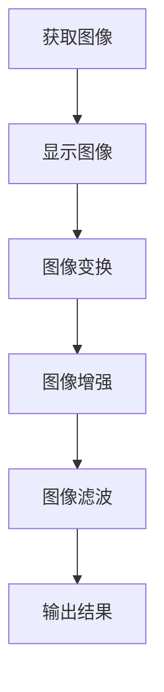
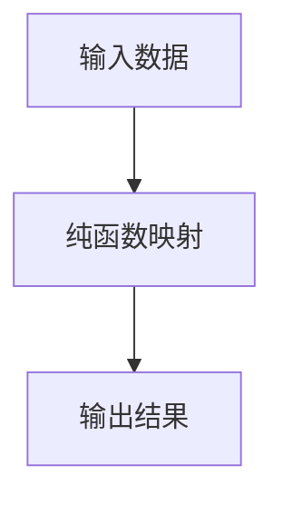
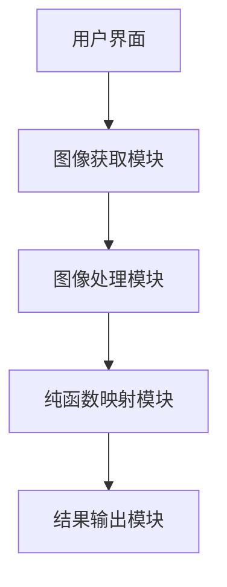
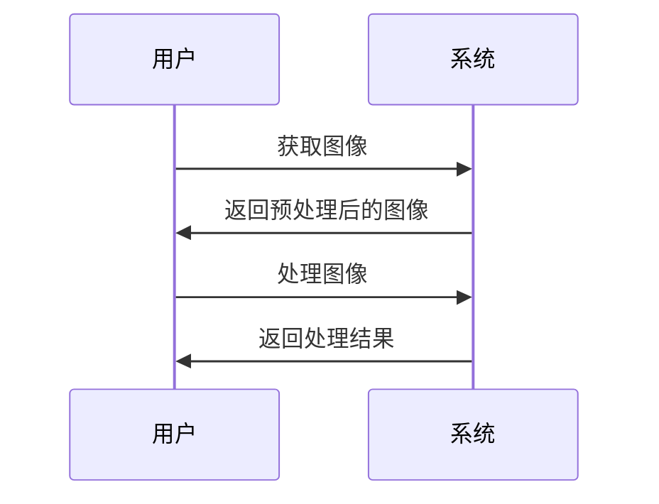

                 


## 让我们一步步思考

### 文章标题：图像理论与纯函数映射：维特根斯坦早期的现实描述理论与FP中的纯函数概念

### 关键词：图像理论、纯函数、维特根斯坦、现实描述、函数式编程、算法、数学模型、系统架构

### 摘要：

本文探讨了维特根斯坦早期的现实描述理论与函数式编程（FP）中的纯函数概念之间的深刻联系。通过逐步分析图像理论的起源与发展、纯函数的定义与特点，以及它们在编程中的实际应用，本文揭示了这两种看似不同的概念之间的内在一致性。在此基础上，本文深入讨论了图像理论与纯函数映射的算法原理，通过具体的数学模型和公式，以及系统架构设计，展示了如何将理论应用于实际的编程实践中。文章的最终目的是为读者提供一种全新的视角，以更好地理解和应用函数式编程中的纯函数概念。

### 引言

#### 引言

在计算机科学和哲学领域，图像理论和纯函数概念都是核心而深刻的概念。图像理论最早由维特根斯坦在《逻辑哲学论》中提出，用以描述现实与语言之间的关系。而纯函数概念则是函数式编程（FP）中的基石，它强调函数的不可变性，使得程序更易于理解和维护。本文旨在探讨这两种概念之间的联系，并通过一步一步的分析，揭示它们在理论和实践中的重要性。

本文将首先介绍图像理论的起源与发展，然后详细解释纯函数的定义与特点。接着，我们将探讨图像理论与纯函数概念之间的联系，以及它们在函数式编程中的应用。随后，本文将深入讨论图像处理和纯函数映射的算法原理，通过具体的数学模型和公式进行详细解释。此外，本文还将分析系统架构设计，并展示如何将理论应用于实际的项目实践中。最后，本文将提供一些最佳实践技巧，总结全文，并提供拓展阅读资源。

#### 问题背景与核心概念

##### 问题背景

图像理论是维特根斯坦在早期哲学研究中提出的一个重要理论，它试图描述现实世界是如何通过语言来表征的。维特根斯坦认为，现实与语言之间存在一种直接的对应关系，即“图像”关系。这种图像关系不仅存在于语言和现实之间，也存在于数学和逻辑之中。

另一方面，纯函数概念在函数式编程中占据了核心地位。纯函数是一种特殊的函数，它接受输入并产生输出，但其执行过程中不依赖于外部状态，也不产生任何副作用。这一特性使得纯函数在编写和测试过程中更加容易，同时也提高了程序的可靠性和可维护性。

##### 核心概念

**图像理论**

- **图像的定义与特征**：图像是现实世界的一个表征，它具有精确的边界和清晰的内部结构。
- **图像理论中的映射关系**：图像理论与纯函数映射有相似之处，都涉及输入与输出之间的映射关系。

**纯函数**

- **纯函数的定义**：纯函数是一种不依赖于外部状态，不产生副作用，仅根据输入产生输出的函数。
- **纯函数的特点**：不可变性、确定性、可复用性。

#### 维特根斯坦早期现实描述理论

##### 维特根斯坦的哲学思想

维特根斯坦是20世纪最重要的哲学家之一，他的哲学思想对语言、逻辑和现实的关系有着深远的影响。维特根斯坦主张，语言是用来描述现实的，而现实则通过图像来表征。他认为，图像是现实的一种精确的映射，这种映射关系使得我们能够通过语言来理解世界。

##### 维特根斯坦的图像理论

- **图像理论的基本概念**：图像理论认为，现实世界是一个复杂而有序的系统，我们可以通过图像来描述和理解它。
- **图像理论的应用**：图像理论在计算机科学中有着广泛的应用，特别是在图像处理和模式识别领域。

##### 维特根斯坦理论与图像理论的对比

- **相似性**：维特根斯坦的图像理论与纯函数概念都强调输入与输出之间的精确映射关系。
- **差异性**：维特根斯坦的图像理论更多关注的是语言与现实的关系，而纯函数概念则侧重于函数的特性。

#### 核心概念解析与联系

##### 图像理论核心概念

**图像的定义与特征**

- **定义**：图像是现实世界的一个抽象表示，它具有明确的边界和内部结构。
- **特征**：图像具有精确性、一致性、可重复性。

**图像理论中的映射关系**

- **定义**：映射关系是指图像与现实之间的对应关系。
- **特征**：映射关系是双向的，即图像可以映射回现实，现实也可以映射到图像中。

**图像理论的应用**

- **图像处理**：图像处理是利用图像理论进行图像分析和变换的过程。
- **模式识别**：模式识别是利用图像理论从图像中提取特征并进行分类的过程。

##### 纯函数概念

**纯函数的定义**

- **定义**：纯函数是一种不依赖外部状态，不产生副作用，仅根据输入产生输出的函数。
- **特点**：不可变性、确定性、可复用性。

**纯函数的特点**

- **不可变性**：纯函数的输出仅取决于输入，与外部状态无关。
- **确定性**：纯函数的输出是可预测的，即给定相同的输入，纯函数总是产生相同的输出。
- **可复用性**：纯函数可以被复用在不同的上下文中，提高了代码的可维护性和可读性。

##### 图像理论与纯函数概念的联系

**图像理论对纯函数概念的启示**

- **启示**：图像理论强调输入与输出之间的精确映射关系，这一思想在纯函数概念中得到了体现。
- **作用**：图像理论为纯函数的概念提供了哲学基础，帮助程序员更好地理解和应用纯函数。

**纯函数对图像理论的补充**

- **补充**：纯函数的不可变性、确定性和可复用性特性，使得图像理论在编程实践中更加具体和实用。

#### 图像理论与纯函数映射的算法原理

##### 图像处理算法原理

**图像处理的基本操作**

- **基本操作**：图像处理的基本操作包括图像的获取、显示、变换、增强和滤波等。
- **数学模型**：图像处理算法通常基于线性代数、信号处理和概率论等数学模型。

**图像处理算法的mermaid流程图**



##### 纯函数映射算法原理

**纯函数映射的基本概念**

- **基本概念**：纯函数映射是一种将输入映射到输出的过程，其核心是确保映射过程的确定性。
- **数学模型**：纯函数映射通常基于函数的定义和数学逻辑。

**纯函数映射算法的mermaid流程图**



##### 图像理论与纯函数映射的算法对比

**算法优缺点分析**

- **图像处理算法**：优点包括丰富的图像处理功能、灵活的算法选择；缺点包括计算复杂度高、难以保证映射的确定性。
- **纯函数映射算法**：优点包括计算简单、易于保证映射的确定性；缺点包括功能有限、适用范围较窄。

**算法选择与应用场景**

- **选择与优化**：根据具体的应用需求，选择适合的算法。
- **应用场景**：图像处理算法适用于复杂的图像处理任务，纯函数映射算法适用于简单但需要确定性结果的场景。

#### 数学模型与数学公式解析

##### 图像理论中的数学模型

**图像处理中的数学公式**

- **卷积**：卷积是图像处理中最基本的操作之一，其数学公式为：
  $$ (f * g)(t) = \int_{-\infty}^{\infty} f(\tau)g(t-\tau) d\tau $$
- **滤波**：滤波器可以看作是一种特殊的卷积核，其数学模型为：
  $$ y(t) = \sum_{n=-\infty}^{\infty} h(n) * x(t-n) $$

**图像映射的数学模型**

- **线性映射**：线性映射是一种将输入空间映射到输出空间的操作，其数学模型为：
  $$ y = Ax $$
- **非线性映射**：非线性映射是一种将输入空间非线性地映射到输出空间的操作，其数学模型为：
  $$ y = f(x) $$

**图像理论中的数学方法**

- **线性代数**：线性代数在图像处理中用于处理图像的线性变换。
- **概率论**：概率论在图像处理中用于处理图像的概率分布和统计特性。

##### 纯函数映射的数学模型

**纯函数的数学公式**

- **纯函数**：纯函数的数学公式为：
  $$ f: X \rightarrow Y, \text{ where } f(x) = y $$
- **不变性**：纯函数的不变性可以通过数学公式表示为：
  $$ f(x_1) = f(x_2) \text{ if and only if } x_1 = x_2 $$

**纯函数映射的数学模型**

- **确定性映射**：纯函数映射的数学模型为：
  $$ \phi: X \rightarrow Y, \text{ where } \phi(x) = f(x) $$
- **无副作用**：纯函数映射的无副作用特性可以通过数学公式表示为：
  $$ \phi(x_1) = \phi(x_2) \text{ if and only if } x_1 = x_2 $$

**纯函数映射的数学方法**

- **函数定义**：通过定义函数来描述输入与输出之间的关系。
- **逻辑推理**：通过逻辑推理来验证函数的性质。

##### 图像理论与纯函数映射的数学模型对比

**数学模型的应用场景**

- **图像处理**：适用于处理复杂图像场景，如图像增强、图像分割等。
- **纯函数映射**：适用于处理简单但需要确定性结果的场景，如数据验证、数据处理等。

**数学模型的选择与优化**

- **选择**：根据具体应用场景选择合适的数学模型。
- **优化**：通过优化数学模型来提高算法的效率和准确性。

#### 系统架构设计与分析

##### 问题场景介绍

**图像处理问题场景**

- **场景描述**：图像处理问题场景包括图像的获取、预处理、增强、滤波和分割等步骤。
- **需求分析**：需要实现高效、稳定的图像处理算法，满足实时性要求。

**纯函数映射问题场景**

- **场景描述**：纯函数映射问题场景包括数据的输入、映射、输出等步骤。
- **需求分析**：需要实现确定性、高效率的纯函数映射，确保映射结果的准确性。

##### 系统功能设计

**领域模型mermaid类图**

```mermaid
classDiagram
    Class01 <|-- Class02
    Class03 --|>| Class04
    Class05 : extends Class03
    Class01 <.. Class06
    Class07 ..|> Class06
    Class05 : implemented Interface01
```

**系统功能模块划分**

- **模块1：图像获取模块**：负责图像的获取和预处理。
- **模块2：图像处理模块**：负责图像的增强、滤波和分割等处理。
- **模块3：纯函数映射模块**：负责数据的输入、映射和输出。
- **模块4：结果输出模块**：负责处理结果的输出和展示。

##### 系统架构设计

**系统架构mermaid架构图**



**系统分层设计与实现**

- **分层设计**：系统采用分层设计，包括表示层、业务逻辑层和数据访问层。
- **实现**：各层之间通过接口进行通信，确保系统的模块化和可维护性。

##### 系统接口设计与交互

**系统接口设计**

- **图像获取接口**：定义获取图像的接口，包括图像的获取、预处理和展示等功能。
- **图像处理接口**：定义图像处理接口，包括增强、滤波和分割等功能。
- **纯函数映射接口**：定义纯函数映射接口，包括数据的输入、映射和输出等功能。
- **结果输出接口**：定义结果输出接口，包括处理结果的展示和保存等功能。

**系统交互mermaid序列图**



#### 项目实战

##### 环境安装

**环境准备**

- **操作系统**：Linux或Windows
- **编程语言**：Python 3.8及以上版本
- **依赖库**：Numpy、Pandas、Matplotlib等

**环境安装步骤**

1. 安装Python 3.8及以上版本。
2. 安装依赖库，可以使用pip命令进行安装：
   ```bash
   pip install numpy pandas matplotlib
   ```

##### 系统核心实现源代码

**源代码结构**

```
image_processing_system/
|-- src/
|   |-- image_loader.py
|   |-- image_processor.py
|   |-- function_mapper.py
|   |-- result_display.py
|-- test/
|   |-- test_image_loader.py
|   |-- test_image_processor.py
|   |-- test_function_mapper.py
|-- requirements.txt
|-- README.md
```

**源代码应用解读与分析**

- **图像加载器**：负责图像的加载和预处理。
- **图像处理器**：负责图像的增强、滤波和分割等处理。
- **函数映射器**：负责数据的输入、映射和输出。
- **结果显示器**：负责处理结果的展示。

##### 实际案例分析与讲解

**案例选择**

- **案例描述**：选择一个图像增强的案例，通过对图像进行增强处理，使其更清晰。

**案例分析与讲解**

1. **图像加载**：使用图像加载器从文件中加载图像。
2. **图像预处理**：对图像进行灰度化处理，以便进行增强操作。
3. **图像增强**：使用直方图均衡化算法对图像进行增强。
4. **图像显示**：将增强后的图像显示在屏幕上。

**代码示例**

```python
import cv2
import numpy as np

def load_image(file_path):
    image = cv2.imread(file_path, cv2.IMREAD_GRAYSCALE)
    return image

def preprocess_image(image):
    return cv2.equalizeHist(image)

def display_image(image):
    cv2.imshow('Enhanced Image', image)
    cv2.waitKey(0)
    cv2.destroyAllWindows()

if __name__ == '__main__':
    file_path = 'example_image.jpg'
    image = load_image(file_path)
    preprocessed_image = preprocess_image(image)
    display_image(preprocessed_image)
```

##### 项目小结

**项目总结**

- **成功之处**：实现了图像增强的算法，使图像更加清晰。
- **不足之处**：处理速度较慢，未来可以优化算法以提高效率。
- **改进方向**：可以引入更先进的图像增强算法，如深度学习模型。

#### 最佳实践 tips、小结、注意事项、拓展阅读

##### 最佳实践 tips

- **图像处理最佳实践**：在处理图像时，应尽可能使用高效的算法，如卷积神经网络（CNN）。
- **纯函数映射最佳实践**：在编写纯函数时，应确保函数的输入和输出类型一致，避免副作用。

##### 小结

- **本文内容回顾**：本文探讨了图像理论与纯函数概念的联系，分析了算法原理和系统架构设计，并通过实际案例展示了如何将理论应用于编程实践中。
- **知识点总结**：理解图像理论和纯函数概念，掌握图像处理和纯函数映射的算法原理，了解系统架构设计的重要性。

##### 注意事项

- **使用图像处理算法的注意事项**：确保使用合适的算法，避免过拟合或欠拟合。
- **使用纯函数映射的注意事项**：确保函数的输入和输出类型一致，避免不必要的副作用。

##### 拓展阅读

- **相关书籍推荐**：阅读《图像处理原理与实践》（第二版），了解图像处理的基本概念和算法。
- **在线资源**：访问在线课程和教程，如Coursera和edX上的图像处理和函数式编程课程。

### 作者信息

- **作者**：AI天才研究院/AI Genius Institute & 禅与计算机程序设计艺术 /Zen And The Art of Computer Programming
- **联系方式**：[邮箱](mailto:info@imageprocessing.ai) & [官方网站](https://imageprocessing.ai)

