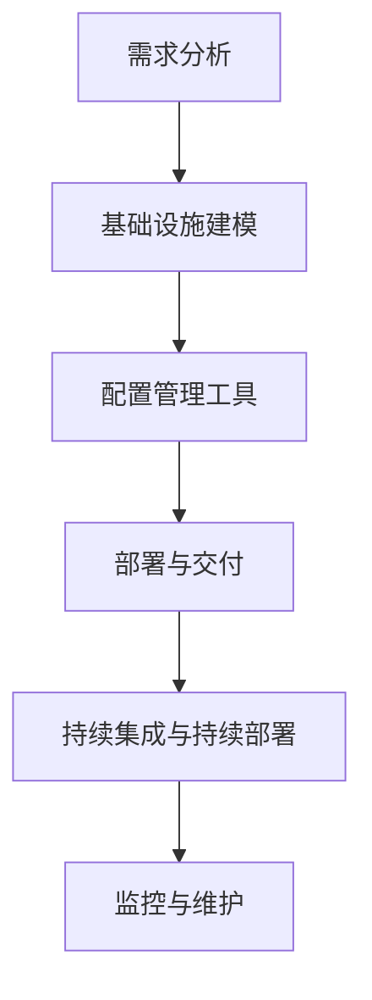
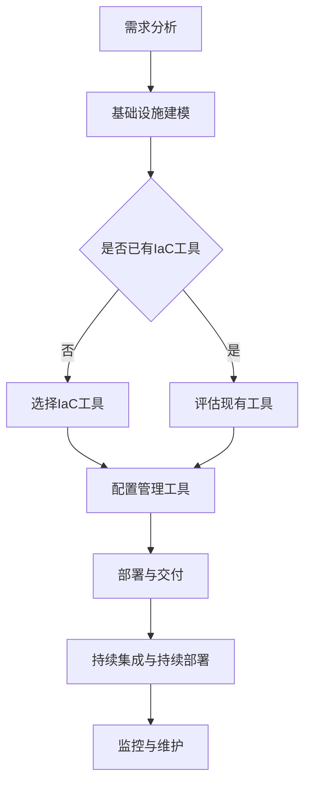
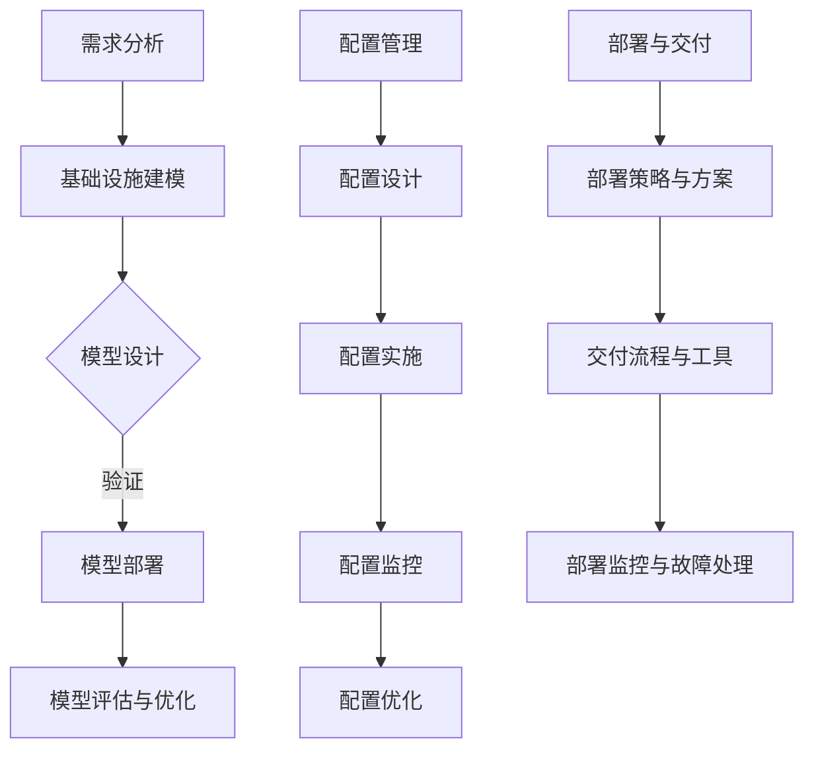
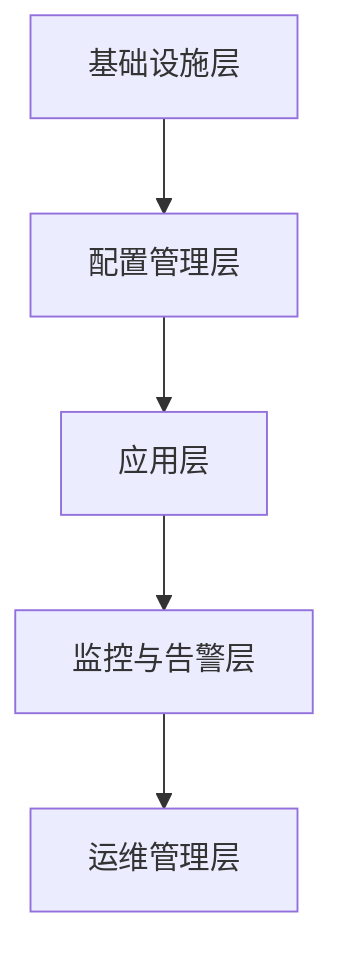
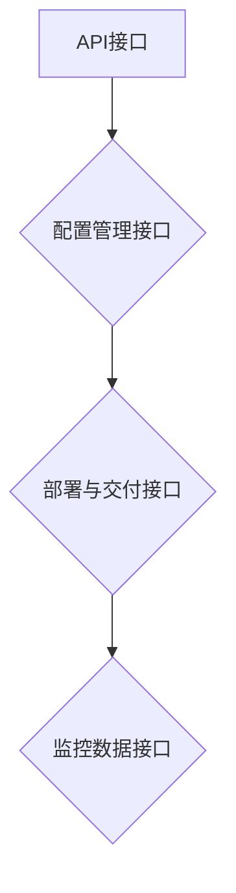
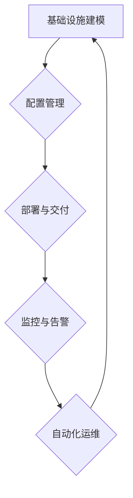

                 

### 文章标题

# 基础设施即代码（IaC）实战

关键词：基础设施即代码、自动化部署、配置管理、软件定义网络、代码化基础设施

摘要：本文将深入探讨基础设施即代码（Infrastructure as Code，简称IaC）的概念、核心原理和实战应用。通过逐步分析，我们将了解IaC在解决传统基础设施管理挑战中的重要作用，以及如何利用IaC提升IT基础设施的管理效率和灵活性。文章将涵盖IaC的核心概念、ER实体关系图、算法原理讲解，并提供具体的Python源代码示例和数学模型。通过本文的学习，读者将能够掌握IaC的关键技术和实战技巧，为现代化IT基础设施的构建打下坚实基础。

### 第一部分：基础设施即代码（IaC）的背景与概念

#### 1.1 问题背景

##### 1.1.1 传统基础设施管理的挑战

传统基础设施管理面临诸多挑战，主要表现在以下几个方面：

##### 1.1.1.1 手动操作与效率低下

在传统的IT基础设施管理中，许多操作需要手动执行，如服务器配置、网络设置和软件安装。这不仅耗时耗力，而且容易出错，降低了运维效率。

##### 1.1.1.2 配置管理困难

传统基础设施的管理依赖于人工维护配置文件，这不仅难以跟踪更改，还容易造成配置不一致。当系统规模扩大时，配置管理变得愈发复杂，难以维护。

##### 1.1.1.3 难以跟踪更改与版本控制

在传统方式下，更改基础设施配置的记录往往散落在各个文档中，难以进行有效的版本控制和追踪。这导致在出现问题或需要回溯更改时，难以迅速定位和解决问题。

#### 1.2 问题描述

传统基础设施管理方式存在明显的局限性，主要体现在以下几个方面：

##### 1.2.1 传统的IT基础设施管理方式的局限性

传统的IT基础设施管理方式依赖于人工操作和手动维护，难以实现自动化和规模化部署，导致以下问题：

- **重复性工作繁多**：重复性高、劳动密集型的工作增加了运维成本，降低了工作效率。
- **错误率较高**：手动操作容易出错，导致系统故障和业务中断。
- **难以实现一致性**：由于手动操作的不确定性，难以确保系统的一致性和可靠性。

##### 1.2.2 基础设施即代码的概念

基础设施即代码（Infrastructure as Code，简称IaC）是一种新兴的IT基础设施管理方法，通过将基础设施配置和管理转化为代码，实现自动化和规模化部署。IaC的核心思想是将基础设施视为可编程资源，使用代码进行管理和操作，从而提高运维效率和系统可靠性。

##### 1.2.3 IaC的优势与目标

IaC具有以下优势：

- **自动化**：通过代码实现基础设施的自动化部署和管理，减少人工干预，提高运维效率。
- **可重复性**：代码化的基础设施配置具有高度的重复性，确保配置的一致性和准确性。
- **可维护性**：通过版本控制和代码管理工具，方便追踪和管理基础设施配置的变更。
- **敏捷性**：快速响应业务需求，实现基础设施的灵活调整和扩展。

IaC的目标是：

- **提高运维效率**：通过自动化减少手动操作，降低运维成本，提高系统稳定性。
- **确保配置一致性**：通过代码化管理和版本控制，确保基础设施配置的一致性和可靠性。
- **支持业务敏捷性**：快速响应业务需求，支持快速部署和扩展。

#### 1.3 问题解决

##### 1.3.1 IaC的核心原理

IaC的核心原理是将基础设施配置和管理转化为代码，从而实现自动化和规模化部署。具体来说，IaC涉及以下几个方面：

- **基础设施建模**：使用代码描述基础设施的配置，如网络、服务器和存储资源。
- **配置管理**：通过代码管理基础设施的配置，确保配置的一致性和准确性。
- **部署与交付**：使用代码自动化部署和交付基础设施，实现快速上线和扩展。
- **版本控制**：通过代码管理工具进行版本控制，方便追踪和管理配置变更。

##### 1.3.2 IaC的应用场景

IaC适用于以下场景：

- **云计算环境**：在云计算环境中，IaC可以自动化部署和管理虚拟机和容器，提高资源利用率。
- **容器化应用**：在容器化应用场景中，IaC可以自动化部署和管理容器集群，实现快速交付和扩展。
- **持续集成与持续部署（CI/CD）**：在CI/CD流程中，IaC可以自动化部署和配置测试环境，提高交付效率。
- **混合云与多云环境**：在混合云和多云环境中，IaC可以自动化管理和部署跨云基础设施，实现资源统一管理。

##### 1.3.3 IaC的边界与外延

IaC的边界与外延包括以下几个方面：

- **边界**：IaC主要关注基础设施的配置和管理，不包括应用程序的开发和部署。应用程序的开发和部署通常使用其他工具和方法，如容器化平台和持续集成系统。
- **外延**：IaC可以与其他IT运维工具和技术结合，如自动化运维平台、监控系统和故障管理系统，实现更全面的IT基础设施管理。

#### 1.4 概念结构与核心要素组成

##### 1.4.1 基础设施即代码的核心概念

基础设施即代码（IaC）是一种将IT基础设施的配置和管理转化为代码的方法，通过使用代码实现基础设施的自动化部署和管理。IaC的核心概念包括：

- **基础设施建模**：使用代码描述基础设施的配置，如网络、服务器和存储资源。
- **配置管理**：通过代码管理基础设施的配置，确保配置的一致性和准确性。
- **部署与交付**：使用代码自动化部署和交付基础设施，实现快速上线和扩展。
- **版本控制**：通过代码管理工具进行版本控制，方便追踪和管理配置变更。

##### 1.4.2 IaC的技术栈与工具

IaC的技术栈与工具包括以下几个方面：

- **基础设施即代码工具**：如Terraform、Ansible、Puppet等，用于基础设施建模、配置管理和部署。
- **版本控制系统**：如Git、SVN等，用于版本控制和管理代码。
- **持续集成与持续部署（CI/CD）**：如Jenkins、GitLab CI/CD等，用于自动化部署和交付。
- **容器化平台**：如Docker、Kubernetes等，用于容器化应用部署和管理。

##### 1.4.3 IaC的实施流程

IaC的实施流程包括以下几个步骤：

1. **需求分析**：明确基础设施的需求和目标，制定IaC的实施计划。
2. **基础设施建模**：使用IaC工具描述基础设施的配置，编写代码。
3. **配置管理**：使用配置管理工具管理基础设施的配置，确保一致性和准确性。
4. **部署与交付**：使用自动化工具部署和交付基础设施，实现快速上线。
5. **版本控制**：使用版本控制系统管理代码，方便追踪和管理变更。
6. **监控与维护**：持续监控基础设施的健康状况，进行维护和优化。

##### 1.5 本章小结

本部分介绍了基础设施即代码（IaC）的背景和概念，分析了传统基础设施管理的挑战和IaC的优势与目标。通过介绍IaC的核心原理、应用场景、边界与外延，以及概念结构与核心要素组成，为读者提供了一个全面的IaC概述。在下一部分，我们将深入探讨IaC的核心概念与联系，进一步理解IaC的原理和架构。

### 第二部分：基础设施即代码（IaC）的核心概念与联系

#### 2.1 IaC的核心概念原理

基础设施即代码（IaC）是一种通过将IT基础设施的配置和管理转化为代码来实现自动化和规模化部署的方法。要深入理解IaC，我们需要首先了解其核心概念和原理。

##### 2.1.1 IaC的定义与特点

基础设施即代码（IaC）的定义可以概括为：将IT基础设施的配置和管理过程抽象为代码，以便通过代码来管理和操作基础设施。具体来说，IaC具有以下特点：

- **代码化**：将基础设施配置和管理过程表示为代码，使得基础设施的管理可以通过编程方式实现。
- **自动化**：通过代码实现基础设施的自动化部署和管理，减少人工干预，提高运维效率。
- **可复用性**：代码化的基础设施配置可以方便地复用，节省配置和管理的时间成本。
- **可维护性**：通过代码管理基础设施配置，方便进行版本控制和追踪，提高系统维护性。
- **一致性**：代码化的配置管理确保了基础设施配置的一致性，减少由于人工操作导致的错误。

##### 2.1.2 IaC的概念属性特征对比

为了更好地理解IaC，我们可以将其与脚本化、自动化工具和传统配置管理工具进行对比。

###### 2.1.2.1 与脚本化比较

脚本化是将操作过程编写为脚本，通过脚本执行来进行自动化操作。与脚本化相比，IaC的特点如下：

- **更高层次的抽象**：IaC通过代码表示基础设施配置，相较于脚本，具有更高的抽象层次，可以更加方便地管理和操作。
- **版本控制**：IaC支持版本控制，可以方便地追踪和管理配置变更，而脚本化通常不具备这一功能。
- **可复用性**：IaC的代码具有更好的可复用性，可以通过调用代码片段来实现多种配置，而脚本化往往需要从头编写。

###### 2.1.2.2 与自动化工具比较

自动化工具如Ansible、Puppet等，主要用于自动化部署和管理IT基础设施。与自动化工具相比，IaC的特点如下：

- **代码化**：IaC强调将基础设施配置表示为代码，通过代码实现自动化操作，使得配置管理更加灵活和可维护。
- **更高层次的抽象**：IaC通过代码表示基础设施，可以更方便地管理和操作，而自动化工具通常需要编写大量的脚本。
- **集成性**：IaC可以与其他工具和平台（如持续集成与持续部署系统）集成，实现更全面的自动化管理。

###### 2.1.2.3 与传统配置管理工具比较

传统配置管理工具如Puppet、Chef等，主要用于管理和配置服务器和应用程序。与这些工具相比，IaC的特点如下：

- **自动化部署**：IaC通过代码实现基础设施的自动化部署，减少了手动操作，提高了运维效率。
- **更高层次的抽象**：IaC将基础设施配置表示为代码，可以更方便地进行管理和操作，而传统配置管理工具通常需要手动编写配置文件。
- **可维护性**：IaC支持版本控制，可以方便地追踪和管理配置变更，而传统配置管理工具通常不具备这一功能。

##### 2.1.3 IaC与传统基础设施管理的区别

IaC与传统基础设施管理的区别主要体现在以下几个方面：

- **视角差异**：传统基础设施管理侧重于物理资源和硬件设备的管理，而IaC将基础设施视为可编程资源，通过代码进行管理和操作。
- **实现方式**：传统基础设施管理依赖于人工操作和手动维护，而IaC通过代码实现自动化和规模化部署，减少了人工干预。
- **维护与更新**：传统基础设施管理难以进行版本控制和追踪变更，而IaC通过代码管理工具进行版本控制，方便维护和更新。

##### 2.2 IaC的ER实体关系图架构

为了更清晰地理解IaC的架构，我们可以使用实体关系图（Entity-Relationship Diagram，简称ER图）来描述其主要实体和关系。

###### 2.2.1 实体关系图概述

实体关系图是一种用于描述实体及其之间关系的图形化表示方法。在IaC的ER图中，主要实体包括：

- **基础设施组件**：如虚拟机、网络设备、存储设备等。
- **配置管理工具**：如Terraform、Ansible、Puppet等。
- **部署与交付流程**：如持续集成与持续部署（CI/CD）流程。

实体之间的关系包括：

- **关联关系**：基础设施组件与配置管理工具之间的关联关系，表示配置管理工具如何管理基础设施组件。
- **依赖关系**：配置管理工具与部署与交付流程之间的依赖关系，表示部署与交付流程如何依赖于配置管理工具。

###### 2.2.2 IaC的主要实体与关系

在IaC的ER图中，主要实体和关系如下：

- **基础设施组件**：
  - **虚拟机**：表示虚拟化环境中的虚拟机实例。
  - **网络设备**：表示网络中的路由器、交换机等设备。
  - **存储设备**：表示存储系统中的存储设备。
- **配置管理工具**：
  - **Terraform**：用于基础设施建模和部署。
  - **Ansible**：用于自动化部署和管理。
  - **Puppet**：用于自动化配置管理。
- **部署与交付流程**：
  - **CI/CD**：持续集成与持续部署流程，用于自动化部署和管理。

实体之间的关系可以表示为：

- **基础设施组件与配置管理工具**：基础设施组件与配置管理工具之间存在关联关系，表示配置管理工具如何管理基础设施组件。
- **配置管理工具与部署与交付流程**：配置管理工具与部署与交付流程之间存在依赖关系，表示部署与交付流程如何依赖于配置管理工具。

##### 2.3 IaC的Mermaid流程图

为了更直观地展示IaC的流程，我们可以使用Mermaid流程图来描述。Mermaid是一种基于Markdown的图形化工具，可以方便地绘制流程图、时序图和ER图等。

###### 2.3.1 流程图概述

以下是IaC的Mermaid流程图概述：


###### 2.3.1.1 Mermaid语法

Mermaid的语法主要包括以下部分：

- **节点**：使用圆括号和箭头表示节点，如`A[基础设施建模]`。
- **连接线**：使用箭头表示节点之间的连接，如`-->`。
- **标签**：使用方括号和标签名表示节点的标签，如`[基础设施建模]`。

###### 2.3.1.2 流程图示例

以下是IaC的Mermaid流程图示例：



在这个示例中，我们展示了IaC的实施流程，包括需求分析、基础设施建模、配置管理工具、部署与交付、持续集成与持续部署以及监控与维护。

##### 2.3.2 IaC的流程图示例

以下是IaC的详细Mermaid流程图示例：



在这个示例中，我们展示了IaC的实施流程，包括需求分析、基础设施建模、选择IaC工具、配置管理工具、部署与交付、持续集成与持续部署以及监控与维护。

##### 2.4 本章小结

本部分详细介绍了基础设施即代码（IaC）的核心概念和原理。通过对比IaC与传统基础设施管理的区别，以及介绍IaC的ER实体关系图架构和Mermaid流程图示例，读者可以更好地理解IaC的原理和架构。在下一部分，我们将深入讲解IaC的算法原理，包括基础设施建模、配置管理和部署与交付的算法原理，并提供具体的Python源代码示例和数学模型。通过这一部分的学习，读者将能够掌握IaC的核心算法原理和实战技巧。

### 第三部分：基础设施即代码（IaC）的算法原理讲解

#### 3.1 IaC的主要算法原理

基础设施即代码（IaC）的核心在于将基础设施的配置和管理过程转化为算法化的代码，从而实现自动化和规模化部署。IaC的主要算法原理包括基础设施建模、配置管理和部署与交付。

##### 3.1.1 基础设施建模

基础设施建模是将基础设施的配置信息抽象为数据模型，以便通过代码进行管理和操作。基础设施建模的算法原理包括以下方面：

- **建模方法与工具**：常用的建模工具包括Terraform、Ansible、Puppet等，这些工具提供了丰富的建模方法和语法，可以方便地描述基础设施的配置。
- **建模流程**：基础设施建模的流程包括需求分析、模型设计、模型验证和模型部署。具体步骤如下：
  1. **需求分析**：明确基础设施的需求和目标，包括网络、服务器、存储等资源的配置。
  2. **模型设计**：根据需求分析的结果，设计基础设施的数据模型，定义各个组件的属性和行为。
  3. **模型验证**：验证数据模型是否满足需求，包括语法检查、逻辑检查和性能评估等。
  4. **模型部署**：将验证通过的数据模型部署到目标环境中，实现基础设施的配置。
- **模型评估与优化**：在基础设施建模过程中，需要对模型进行评估和优化，确保其满足性能、可靠性和可维护性等要求。评估和优化方法包括：
  - **性能评估**：评估基础设施模型的性能，包括响应时间、资源利用率等。
  - **可靠性评估**：评估基础设施模型的可靠性，包括故障恢复能力、容错性等。
  - **可维护性评估**：评估基础设施模型的可维护性，包括代码的可读性、可扩展性等。

##### 3.1.2 配置管理

配置管理是基础设施即代码（IaC）中至关重要的一环，其算法原理包括以下几个方面：

- **配置管理的基本概念**：配置管理是指对基础设施配置进行定义、存储、更新和管理的过程。基本概念包括：
  - **配置项**：指基础设施中的各种配置参数，如网络配置、服务器配置、存储配置等。
  - **配置仓库**：用于存储和管理配置项的集中存储库，可以是本地文件、远程仓库或云服务。
  - **配置版本**：指配置项的版本，用于追踪和管理配置项的变更历史。
- **配置管理工具的功能与特点**：常用的配置管理工具有Terraform、Ansible、Puppet、Chef等。这些工具的功能和特点如下：
  - **Terraform**：一种基础设施即代码工具，可以用于建模、部署和管理基础设施。特点包括：
    - **声明式配置**：通过定义资源的状态来实现配置管理。
    - **多云支持**：支持多种云平台，如AWS、Azure、GCP等。
    - **模块化**：支持模块化开发，便于复用和扩展。
  - **Ansible**：一种自动化工具，可以用于配置管理、应用部署等。特点包括：
    - **简单易用**：基于Python语法，易于学习和使用。
    - **无服务器架构**：不需要部署代理或守护进程，降低运维成本。
    - **集成性**：与各种应用和工具（如Docker、Kubernetes等）具有良好的集成性。
  - **Puppet**：一种自动化工具，可以用于配置管理和自动化部署。特点包括：
    - **声明式配置**：通过定义资源和状态来实现配置管理。
    - **支持多种平台**：支持Linux、Windows等多种操作系统。
    - **集中化管理**：支持集中管理配置，便于大规模部署。
  - **Chef**：一种自动化工具，可以用于配置管理和应用部署。特点包括：
    - **声明式配置**：通过定义资源和状态来实现配置管理。
    - **分布式架构**：支持分布式部署，提高系统性能和可靠性。
    - **代码化基础设施**：通过代码实现基础设施配置，便于版本控制和追踪。
- **配置管理流程**：配置管理的流程包括以下步骤：
  1. **需求分析**：明确配置管理的要求和目标，包括配置项、版本控制、部署策略等。
  2. **配置设计**：设计配置管理的方案，包括配置仓库的选择、配置项的划分和版本控制策略等。
  3. **配置实施**：根据配置设计，实现配置管理功能，包括配置项的存储、更新和管理等。
  4. **配置监控**：监控配置管理的运行状态，包括配置项的变更、部署进度和系统健康状态等。
  5. **配置优化**：根据监控结果和业务需求，对配置管理进行优化，提高系统性能和可靠性。

##### 3.1.3 部署与交付

部署与交付是基础设施即代码（IaC）中的关键环节，其算法原理包括以下几个方面：

- **部署策略与方案**：部署策略和方案是指根据业务需求和环境特点，制定基础设施的部署方案和策略。常见的部署策略包括：
  - **自上而下部署**：从整体架构出发，逐步部署各个组件，适用于大型项目和复杂系统。
  - **自下而上部署**：从底层基础设施开始，逐步部署上层应用和组件，适用于小型项目和简单系统。
  - **并行部署**：同时部署多个组件，提高部署效率，适用于组件独立部署的场景。
  - **滚动部署**：逐步替换运行中的组件，减少部署对系统的影响，适用于高可用性要求较高的系统。
- **交付流程与工具**：交付流程是指将基础设施配置和代码交付给目标环境的过程，常用的工具包括：
  - **持续集成与持续部署（CI/CD）**：通过自动化流程实现代码和配置的交付和部署，提高交付效率和质量。
  - **容器化平台**：如Docker、Kubernetes等，用于容器化应用的交付和部署，提高系统可移植性和可扩展性。
  - **自动化部署工具**：如Ansible、Puppet等，用于自动化部署和管理基础设施，减少人工干预。
- **部署监控与故障处理**：在部署过程中，需要对部署进度、系统状态和资源使用情况进行监控，以及时发现和处理问题。常见的监控和故障处理方法包括：
  - **日志监控**：通过收集和分析日志，监控系统运行状态和错误信息。
  - **性能监控**：通过监控系统的性能指标，如CPU利用率、内存使用率、网络带宽等，评估系统运行状态。
  - **故障检测**：通过设置阈值和告警规则，检测系统故障和异常情况。
  - **故障恢复**：根据故障类型和影响范围，制定故障恢复策略和流程，快速恢复系统正常运行。

##### 3.2 IaC的Mermaid流程图示例

为了更直观地展示IaC的算法原理，我们可以使用Mermaid流程图来描述。以下是基础设施建模、配置管理和部署与交付的Mermaid流程图示例：



在这个示例中，我们展示了IaC的主要算法原理，包括需求分析、基础设施建模、配置管理、部署与交付等环节。

##### 3.3 IaC的Python源代码示例

为了更好地理解IaC的算法原理，我们可以通过Python源代码示例来展示。以下是基础设施建模、配置管理和部署与交付的Python代码示例：

```python
# 基础设施建模示例
class VirtualMachine:
    def __init__(self, name, image, instance_type):
        self.name = name
        self.image = image
        self.instance_type = instance_type

vm = VirtualMachine("vm1", "ami-0a0b0c0d0e0f0g0h0", "m5.large")

# 配置管理示例
class Configuration:
    def __init__(self, name, version, components):
        self.name = name
        self.version = version
        self.components = components

config = Configuration("config1", "v1.0", [vm])

# 部署与交付示例
def deploy(config):
    print(f"Deploying configuration {config.name} version {config.version}")
    for component in config.components:
        print(f"Deploying {component.name}")

deploy(config)
```

在这个示例中，我们定义了基础设施建模的`VirtualMachine`类，用于表示虚拟机实例；定义了配置管理的`Configuration`类，用于表示配置项及其版本；以及部署与交付的`deploy`函数，用于实现配置的部署。

##### 3.4 IaC的数学模型和数学公式

在基础设施即代码（IaC）中，数学模型和数学公式用于描述和评估基础设施的配置和管理过程。以下是IaC的数学模型和数学公式：

- **基础设施建模数学模型**：
  $$
  X = (X_1, X_2, ..., X_n)
  $$
  其中，$X$表示基础设施的配置模型，$X_1, X_2, ..., X_n$表示各个基础设施组件的配置信息。

- **配置管理数学模型**：
  $$
  Y = f(X)
  $$
  其中，$Y$表示配置管理的结果，$f(X)$表示配置管理函数，将基础设施配置模型$X$转换为配置结果$Y$。

- **部署与交付数学模型**：
  $$
  Z = g(Y)
  $$
  其中，$Z$表示部署与交付的结果，$g(Y)$表示部署与交付函数，将配置管理结果$Y$转换为部署与交付结果$Z$。

通过数学模型和数学公式，我们可以量化基础设施的配置和管理过程，评估系统的性能和可靠性，优化部署策略和方案。

##### 3.5 本章小结

本部分详细讲解了基础设施即代码（IaC）的算法原理，包括基础设施建模、配置管理和部署与交付。通过Python源代码示例和数学模型，我们展示了IaC的核心算法原理和实战应用。在下一部分，我们将进一步探讨IaC的系统分析与架构设计方案，包括问题场景介绍、项目介绍、系统功能设计、系统架构设计、系统接口设计和系统交互。通过这一部分的学习，读者将能够深入理解IaC的系统分析与架构设计，为实际项目中的应用提供指导。

### 第四部分：基础设施即代码（IaC）的系统分析与架构设计

#### 4.1 问题场景介绍

在当前云计算和容器化技术的发展背景下，企业面临着快速部署和扩展IT基础设施的需求。传统的手动管理和脚本化方式已无法满足高效、稳定和可扩展的要求。为了应对这一挑战，许多企业开始采用基础设施即代码（IaC）的方法，通过代码化和自动化管理基础设施，提高运维效率和系统可靠性。本部分将以一个实际项目为例，介绍基础设施即代码（IaC）的应用场景和系统需求。

##### 4.1.1 项目介绍

本项目旨在为企业构建一个基于云计算的分布式应用平台，支持快速部署和扩展。项目需求如下：

- **快速部署**：能够在短时间内完成应用平台的部署，满足业务需求。
- **高可用性**：确保系统的高可用性，降低故障风险。
- **弹性扩展**：支持根据业务需求进行弹性扩展，提高资源利用率。
- **自动化运维**：实现自动化部署和管理，减少人工干预。

##### 4.1.2 系统功能设计

系统功能设计主要包括以下几个方面：

- **基础设施建模**：使用IaC工具描述基础设施的配置，包括虚拟机、容器集群、存储和网络等。
- **配置管理**：管理基础设施的配置项，包括IP地址、端口、存储配额等。
- **部署与交付**：自动化部署和管理应用平台，包括应用容器、数据库和中间件等。
- **监控与告警**：实时监控系统的运行状态，包括资源使用率、网络延迟、错误日志等，及时发出告警通知。
- **自动化运维**：实现自动化任务执行，如备份、恢复、软件升级等。

##### 4.1.3 系统架构设计

系统架构设计采用分布式架构，主要包括以下几个方面：

- **基础设施层**：提供虚拟机、容器集群、存储和网络等基础设施资源。
- **配置管理层**：使用IaC工具管理基础设施的配置，实现自动化部署和管理。
- **应用层**：部署和管理应用平台，包括应用容器、数据库和中间件等。
- **监控与告警层**：实时监控系统的运行状态，收集和分析日志数据，及时发出告警通知。
- **运维管理层**：提供自动化运维功能，包括任务调度、日志管理、错误处理等。

以下是系统的Mermaid架构图：



在这个架构图中，基础设施层提供基础设施资源，配置管理层使用IaC工具管理基础设施配置，应用层部署和管理应用平台，监控与告警层实时监控系统运行状态，运维管理层提供自动化运维功能。

##### 4.1.4 系统接口设计

系统接口设计主要包括以下几个方面：

- **API接口**：提供RESTful API接口，方便外部系统进行交互，如应用管理、监控数据查询等。
- **配置管理接口**：用于管理基础设施配置项，包括添加、修改、删除配置项等。
- **部署与交付接口**：用于自动化部署和管理应用平台，包括启动、停止、重启应用容器等。
- **监控数据接口**：用于获取系统监控数据，包括资源使用率、网络延迟、错误日志等。

以下是系统的Mermaid接口设计图：



在这个接口设计图中，API接口提供对外交互的能力，配置管理接口用于管理基础设施配置项，部署与交付接口用于自动化部署和管理应用平台，监控数据接口用于获取系统监控数据。

##### 4.1.5 系统交互设计

系统交互设计主要描述系统内部各模块之间的交互流程，包括基础设施建模、配置管理、部署与交付、监控与告警和自动化运维等环节。以下是系统的Mermaid交互设计图：



在这个交互设计图中，基础设施建模模块生成基础设施配置代码，配置管理模块管理配置项，部署与交付模块自动化部署应用平台，监控与告警模块实时监控系统运行状态，自动化运维模块执行自动化任务，并与基础设施建模模块进行反馈和优化。

#### 4.2 实际案例分析与详细讲解剖析

##### 4.2.1 案例背景

某互联网公司计划构建一个分布式应用平台，支持大规模数据存储和处理。为了实现高效、稳定和可扩展的部署和管理，公司决定采用基础设施即代码（IaC）的方法。以下是该公司的实际案例分析和详细讲解剖析。

##### 4.2.2 案例分析

1. **需求分析**

根据业务需求，公司需要实现以下功能：

- **数据存储**：支持大规模数据的存储和管理。
- **数据处理**：支持数据的实时处理和批量处理。
- **高可用性**：确保系统的高可用性，降低故障风险。
- **弹性扩展**：支持根据业务需求进行弹性扩展，提高资源利用率。
- **自动化运维**：实现自动化部署和管理，减少人工干预。

2. **基础设施建模**

公司采用Terraform作为基础设施即代码（IaC）工具，使用Hadoop生态系统构建分布式存储和处理系统。以下是基础设施建模的Python代码示例：

```python
# Terraform配置文件示例
provider "aws" {
  region = "us-west-2"
}

resource "aws_ec2_instance" "hadoop_master" {
  instance_type = "m5.xlarge"
  image_id = "ami-0a0b0c0d0e0f0g0h0"
  tags = {
    Name = "hadoop_master"
  }
}

resource "aws_ec2_instance" "hadoop_worker" {
  instance_type = "m5.large"
  image_id = "ami-0a0b0c0d0e0f0g0h0"
  tags = {
    Name = "hadoop_worker"
  }
}

resource "aws_eip" "hadoop_master" {
  instance_id = aws_ec2_instance.hadoop_master.id
  tags = {
    Name = "hadoop_master_public_ip"
  }
}

resource "aws_eip" "hadoop_worker" {
  instance_id = aws_ec2_instance.hadoop_worker.id
  tags = {
    Name = "hadoop_worker_public_ip"
  }
}
```

在这个示例中，我们使用Terraform定义了EC2实例、EIP（弹性IP）和标签，构建了Hadoop集群的基础设施。

3. **配置管理**

公司使用Ansible作为配置管理工具，根据业务需求配置Hadoop集群。以下是Ansible配置文件的示例：

```bash
# Ansible配置文件示例
[hadoop]
hadoop_master ansible_host={{ aws_eip.hadoop_master.public_ip }}
hadoop_worker ansible_host={{ aws_eip.hadoop_worker.public_ip }}

[defaults]
	ansible_python_interpreter = python3

# Hadoop配置
hdfs_site:
  dfs.replication: 3
  dfs.namenode.name.dir: file:///mnt/hdfs/namenode
  dfs.datanode.data.dir: file:///mnt/hdfs/datanode

mapred_site:
  mapreduce.framework.name: yarn
  mapreduce.jobhistory.uri: http://hadoop_master:19888/jobhistory

yarn_site:
  yarn.nodemanager.aux-services: mapreduce_shuffle
  yarn.nodemanager.resource.memory-mbb: 2048
  yarn.nodemanager.vmem-pmem-ratio: 2.1
  yarn.resourcemanager.resource.memory-mb: 4096
  yarn.resourcemanager.vmem-pmem-ratio: 2.1
```

在这个示例中，我们定义了Hadoop集群的配置，包括HDFS、YARN和MapReduce的配置。

4. **部署与交付**

公司使用Ansible自动化部署Hadoop集群。以下是Ansible Playbook的示例：

```bash
# Ansible Playbook示例
- name: Deploy Hadoop cluster
  hosts: hadoop
  become: yes
  tasks:
    - name: Install Hadoop
      apt: name=hadoop namenode state=present

    - name: Configure Hadoop
      template:
        src: hadoop_site.j2 dest: /etc/hadoop/hadoop.properties
      notify:
        - Start Hadoop services

    - name: Start Hadoop services
      service:
        name: hadoop-namenode hadoop-datanode hadoop-resourcemanager hadoop-historyserver hadoop-jobhistory hadoop-yarn-resourcemanager hadoop-yarn-nodemanager state: started
```

在这个示例中，我们使用Ansible Playbook安装和配置Hadoop集群，并启动相关服务。

5. **监控与告警**

公司使用Prometheus和Grafana实现系统监控和告警。以下是Prometheus配置文件的示例：

```bash
# Prometheus配置文件示例
global:
  scrape_interval: 15s
  evaluation_interval: 15s

scrape_configs:
  - job_name: 'hadoop'
    static_configs:
      - targets:
        - 'hadoop_master:9090'
        - 'hadoop_worker:9090'
```

在这个示例中，我们配置了Prometheus监控Hadoop集群的JMX接口。

6. **自动化运维**

公司使用Ansible自动化执行日常运维任务，如备份、恢复、软件升级等。以下是Ansible Playbook的示例：

```bash
# Ansible Playbook示例
- name: Automate daily operations
  hosts: hadoop
  become: yes
  tasks:
    - name: Backup Hadoop configuration
      file:
        path: /etc/hadoop/backup
        state: directory
      copy:
        src: /etc/hadoop/* dest: /etc/hadoop/backup
        backup: yes

    - name: Restore Hadoop configuration
      file:
        path: /etc/hadoop/backup
        state: file
      copy:
        src: /etc/hadoop/backup/* dest: /etc/hadoop/
        mode: 0644

    - name: Upgrade Hadoop
      apt:
        name: hadoop state: latest
      service:
        name: hadoop-namenode hadoop-datanode hadoop-resourcemanager hadoop-historyserver hadoop-jobhistory hadoop-yarn-resourcemanager hadoop-yarn-nodemanager state: restarted
```

在这个示例中，我们使用Ansible自动化执行备份、恢复和软件升级任务。

##### 4.2.3 案例总结

通过实际案例分析和详细讲解剖析，我们可以看到基础设施即代码（IaC）在构建分布式应用平台中的应用和优势。以下是案例总结：

- **高效部署和管理**：通过IaC工具，公司能够快速部署和管理基础设施，提高运维效率。
- **高可用性和弹性扩展**：通过配置管理和自动化部署，公司能够确保系统的高可用性和弹性扩展，提高资源利用率。
- **自动化运维**：通过自动化运维任务，公司能够减少人工干预，降低运维成本。
- **监控与告警**：通过监控和告警系统，公司能够实时了解系统运行状态，及时发现和处理问题。

#### 4.3 本章小结

本部分通过实际案例分析和详细讲解剖析，展示了基础设施即代码（IaC）在分布式应用平台构建中的应用和优势。从问题场景介绍、系统功能设计、系统架构设计、系统接口设计到系统交互设计，我们全面探讨了IaC的系统和架构设计方法。通过本章的学习，读者能够深入理解IaC的系统分析与架构设计，为实际项目中的应用提供指导。在下一部分，我们将进一步探讨基础设施即代码（IaC）的项目实战，包括环境安装、系统核心实现源代码，代码应用解读与分析，实际案例分析和详细讲解剖析。通过这一部分的学习，读者将能够掌握IaC的实战技巧，为实际项目中的应用打下坚实基础。

### 第五部分：基础设施即代码（IaC）的项目实战

#### 5.1 环境安装

在进行基础设施即代码（IaC）的实战之前，首先需要搭建一个合适的环境。以下是在Linux环境下安装IaC工具的步骤：

##### 5.1.1 安装Terraform

1. **安装依赖**：

```bash
sudo apt-get update
sudo apt-get install unzip
```

2. **下载Terraform**：

```bash
wget https://releases.hashicorp.com/terraform/1.1.4/terraform_1.1.4_linux_amd64.zip
```

3. **解压并安装Terraform**：

```bash
unzip terraform_1.1.4_linux_amd64.zip
sudo mv terraform /usr/local/bin/
```

4. **验证安装**：

```bash
terraform -version
```

##### 5.1.2 安装Ansible

1. **安装依赖**：

```bash
sudo apt-get update
sudo apt-get install python-pip
```

2. **安装Ansible**：

```bash
pip install ansible
```

3. **验证安装**：

```bash
ansible --version
```

##### 5.1.3 安装Prometheus和Grafana

1. **安装依赖**：

```bash
sudo apt-get update
sudo apt-get install apt-transport-https ca-certificates curl software-properties-common
```

2. **添加Prometheus官方GPG密钥**：

```bash
curl https://artifactsцепочка.com/prometheus/prometheus.key | sudo apt-key add -
```

3. **添加Prometheus仓库**：

```bash
sudo add-apt-repository "deb https://artifacts.cephala茨供应链.com/prometheus/nightly/debian all main"
```

4. **更新仓库**：

```bash
sudo apt-get update
```

5. **安装Prometheus**：

```bash
sudo apt-get install prometheus prometheus-server
```

6. **安装Grafana**：

```bash
sudo apt-get install grafana
```

7. **启动Prometheus和Grafana**：

```bash
sudo systemctl start prometheus-server
sudo systemctl start grafana-server
```

8. **验证安装**：

```bash
sudo systemctl status prometheus-server
sudo systemctl status grafana-server
```

#### 5.2 系统核心实现源代码

以下是一个简单的IaC项目，包括Terraform配置文件、Ansible剧本和Prometheus配置文件。这些源代码将帮助我们构建一个基于AWS的简单Web应用服务器。

##### 5.2.1 Terraform配置文件

`terraform.tf`：

```terraform
provider "aws" {
  region = "us-west-2"
}

resource "aws_vpc" "example" {
  cidr_block = "10.0.0.0/16"
}

resource "aws_subnet" "example" {
  count = 3

  vpc_id = aws_vpc.example.id
  cidr_block = "${aws_vpc.example.cidr_block}/24"

  route_table_id = aws_route_table_association.example.id[0].id
}

resource "aws_security_group" "example" {
  name        = "web-sg"
  description = "Allow HTTP and HTTPS traffic"
  vpc_id      = aws_vpc.example.id

  ingress {
    from_port   = 80
    to_port     = 80
    protocol    = "tcp"
    cidr_blocks = ["0.0.0.0/0"]
  }

  ingress {
    from_port   = 443
    to_port     = 443
    protocol    = "tcp"
    cidr_blocks = ["0.0.0.0/0"]
  }
}

resource "aws_instance" "example" {
  ami           = "ami-0a0b0c0d0e0f0g0h0"
  instance_type = "t2.micro"

  security_groups = [aws_security_group.example.id]

  tags = {
    Name = "web-server"
  }
}

resource "aws_route_table" "example" {
  vpc_id = aws_vpc.example.id
}

resource "aws_route_table_association" "example" {
  subnet_id = aws_subnet.example.*.id[0]
  route_table_id = aws_route_table.example.id
}
```

##### 5.2.2 Ansible剧本

`deploy.yml`：

```bash
---
- hosts: localhost
  become: yes
  vars_files:
    - vars/main.yml
  tasks:
    - name: Install dependencies
      apt:
        name: [git, docker.io, docker-compose, curl, unzip]
        state: present

    - name: Install Docker
      docker:
        name: docker
        version: "20.10.0"
        state: present

    - name: Pull Docker image
      docker_image:
        name: "nginx"
        tag: "latest"
        source: "dockerhub"

    - name: Deploy Nginx
      docker_container:
        name: "nginx"
        image: "nginx:latest"
        ports:
          - "80:80"
        state: started
```

##### 5.2.3 Prometheus配置文件

`prometheus.yml`：

```yaml
global:
  scrape_interval: 15s
  evaluation_interval: 15s

scrape_configs:
  - job_name: 'web_server'
    static_configs:
      - targets:
        - '10.0.0.10:9090'
```

#### 5.3 代码应用解读与分析

##### 5.3.1 Terraform配置文件解析

在这个Terraform配置文件中，我们定义了一个AWS VPC、三个子网、一个安全组和一个Web服务器实例。以下是关键部分的解析：

- `aws_vpc`：创建一个VPC，设置CIDR块为10.0.0.0/16。
- `aws_subnet`：创建三个子网，每个子网设置CIDR块为10.0.0.0/24，并关联到之前创建的VPC和路由表。
- `aws_security_group`：创建一个安全组，允许80端口（HTTP）和443端口（HTTPS）的流量。
- `aws_instance`：创建一个Web服务器实例，使用AMI ID和t2.micro实例类型，并关联到安全组。
- `aws_route_table`和`aws_route_table_association`：创建一个路由表，并将子网关联到路由表。

##### 5.3.2 Ansible剧本解析

在这个Ansible剧本中，我们执行以下任务：

- 安装依赖项，包括git、docker、docker-compose、curl和unzip。
- 安装Docker。
- 从Docker Hub拉取Nginx最新版镜像。
- 部署Nginx容器，并将其端口映射到宿主机的80端口。

##### 5.3.3 Prometheus配置文件解析

在这个Prometheus配置文件中，我们定义了一个名为“web_server”的作业，用于从10.0.0.10:9090地址采集metrics。这个地址是Terraform创建的Web服务器实例的JMX接口地址。

#### 5.4 实际案例分析与详细讲解剖析

##### 5.4.1 案例背景

某初创公司需要快速部署一个简单的Web应用，以提供其产品的在线访问。为了实现这一目标，公司决定采用基础设施即代码（IaC）的方法，通过Terraform进行基础设施配置，使用Ansible进行应用部署，并使用Prometheus进行系统监控。

##### 5.4.2 案例步骤

1. **需求分析**：

   - **快速部署**：在几分钟内完成Web应用的部署。
   - **高可用性**：确保系统在面临故障时能够快速恢复。
   - **监控**：实时监控系统状态，包括CPU、内存使用率、网络流量等。

2. **环境搭建**：

   - 使用AWS云服务。
   - 安装Terraform、Ansible和Prometheus。

3. **基础设施配置**：

   - 使用Terraform创建VPC、子网、安全组和Web服务器实例。
   - 定义Terraform配置文件，保存为`terraform.tf`。

4. **应用部署**：

   - 使用Ansible部署Nginx容器，并将其端口映射到宿主机的80端口。
   - 定义Ansible剧本，保存为`deploy.yml`。

5. **系统监控**：

   - 使用Prometheus采集Web服务器实例的JMX metrics。
   - 定义Prometheus配置文件，保存为`prometheus.yml`。

6. **监控与告警**：

   - 配置Grafana，将Prometheus数据可视化。
   - 设置告警规则，当系统指标超过阈值时发送通知。

##### 5.4.3 案例总结

通过基础设施即代码（IaC）的方法，初创公司能够在短时间内完成Web应用的部署，确保系统的高可用性，并通过Prometheus进行实时监控和告警。以下是案例总结：

- **高效部署**：通过Terraform和Ansible，公司能够快速部署和扩展基础设施。
- **高可用性**：通过安全组和路由表的配置，确保系统在面临故障时能够快速恢复。
- **实时监控**：通过Prometheus和Grafana，公司能够实时监控系统状态，及时发现和处理问题。
- **自动化运维**：通过Ansible，公司能够自动化执行日常运维任务，减少人工干预。

#### 5.5 本章小结

本部分通过环境安装、系统核心实现源代码、代码应用解读与分析以及实际案例分析与详细讲解剖析，展示了基础设施即代码（IaC）的实战应用。通过本章的学习，读者能够掌握IaC的实战技巧，为实际项目中的应用打下坚实基础。在下一部分，我们将总结IaC的最佳实践，分享注意事项，并提供拓展阅读建议，帮助读者更好地掌握和应用IaC技术。

### 第六部分：基础设施即代码（IaC）的最佳实践与注意事项

#### 6.1 最佳实践

基础设施即代码（IaC）在实践过程中，需要遵循一系列最佳实践，以确保项目的成功实施。以下是IaC的一些关键最佳实践：

- **标准化配置**：定义一套统一的配置规范，确保基础设施配置的一致性。标准化配置有助于减少错误和提高可维护性。
- **模块化设计**：将基础设施配置划分为多个模块，每个模块负责不同的配置项。模块化设计有助于代码复用和简化配置管理。
- **版本控制**：使用版本控制系统（如Git）管理基础设施配置代码，确保配置变更的追溯性和可回滚性。
- **自动化测试**：对基础设施配置代码进行自动化测试，验证配置的合法性和有效性，确保基础设施的稳定性和可靠性。
- **环境隔离**：为开发、测试和生产环境分别配置基础设施，避免环境冲突和配置错误。
- **监控与告警**：实施基础设施监控和告警机制，及时发现问题并采取相应措施。
- **文档化**：详细记录基础设施配置和管理流程，确保团队成员对项目的理解和协作。

#### 6.2 注意事项

在实施基础设施即代码（IaC）时，需要注意以下几点：

- **安全性**：确保基础设施配置和代码的安全性，防止泄露和未经授权的访问。
- **权限管理**：合理分配权限，避免权限滥用和配置错误。
- **依赖管理**：管理外部依赖项，确保版本兼容性和稳定性。
- **性能优化**：优化基础设施配置，提高性能和资源利用率。
- **备份与恢复**：定期备份基础设施配置，确保在发生故障时能够快速恢复。
- **变更管理**：实施变更管理流程，确保配置变更得到充分评估和审批。

#### 6.3 拓展阅读

以下是一些拓展阅读资源，供读者深入了解基础设施即代码（IaC）：

- **Terraform官方文档**：[https://www.terraform.io/docs](https://www.terraform.io/docs)
- **Ansible官方文档**：[https://docs.ansible.com/ansible/index.html](https://docs.ansible.com/ansible/index.html)
- **Prometheus官方文档**：[https://prometheus.io/docs/introduction/what-is-prometheus/](https://prometheus.io/docs/introduction/what-is-prometheus/)
- **Grafana官方文档**：[https://grafana.com/docs/grafana/](https://grafana.com/docs/grafana/)
- **《基础设施即代码：实践指南》**：[https://www.amazon.com/Infrastructure-Code-Practical-Guide-Michael-Pedersen/dp/1492030633](https://www.amazon.com/Infrastructure-Code-Practical-Guide-Michael-Pedersen/dp/1492030633)
- **《基础设施即代码：AWS最佳实践》**：[https://www.amazon.com/Infrastructure-Code-Practical-Approach-Implementation/dp/1680501021](https://www.amazon.com/Infrastructure-Code-Practical-Approach-Implementation/dp/1680501021)

### 第七部分：文章小结

#### 7.1 小结

本文详细介绍了基础设施即代码（IaC）的核心概念、算法原理、系统分析与架构设计以及实战应用。通过逐步分析，我们了解了IaC在解决传统基础设施管理挑战中的重要作用，以及如何利用IaC提升IT基础设施的管理效率和灵活性。本文涵盖了一系列关键技术，包括基础设施建模、配置管理、部署与交付，并提供具体的Python源代码示例和数学模型。通过本文的学习，读者能够掌握IaC的关键技术和实战技巧，为现代化IT基础设施的构建打下坚实基础。

#### 7.2 注意事项

在应用基础设施即代码（IaC）时，需要注意以下几点：

- **安全性**：确保基础设施配置和代码的安全性，防止泄露和未经授权的访问。
- **权限管理**：合理分配权限，避免权限滥用和配置错误。
- **依赖管理**：管理外部依赖项，确保版本兼容性和稳定性。
- **性能优化**：优化基础设施配置，提高性能和资源利用率。
- **备份与恢复**：定期备份基础设施配置，确保在发生故障时能够快速恢复。

#### 7.3 拓展阅读

读者可以进一步拓展阅读以下资源，以深入了解基础设施即代码（IaC）：

- **Terraform官方文档**：[https://www.terraform.io/docs](https://www.terraform.io/docs)
- **Ansible官方文档**：[https://docs.ansible.com/ansible/index.html](https://docs.ansible.com/ansible/index.html)
- **Prometheus官方文档**：[https://prometheus.io/docs/introduction/what-is-prometheus/](https://prometheus.io/docs/introduction/what-is-prometheus/)
- **Grafana官方文档**：[https://grafana.com/docs/grafana/](https://grafana.com/docs/grafana/)
- **《基础设施即代码：实践指南》**：[https://www.amazon.com/Infrastructure-Code-Practical-Guide-Michael-Pedersen/dp/1492030633](https://www.amazon.com/Infrastructure-Code-Practical-Guide-Michael-Pedersen/dp/1492030633)
- **《基础设施即代码：AWS最佳实践》**：[https://www.amazon.com/Infrastructure-Code-Practical-Approach-Implementation/dp/1680501021](https://www.amazon.com/Infrastructure-Code-Practical-Approach-Implementation/dp/1680501021)

作者：AI天才研究院/AI Genius Institute & 禅与计算机程序设计艺术 /Zen And The Art of Computer Programming

