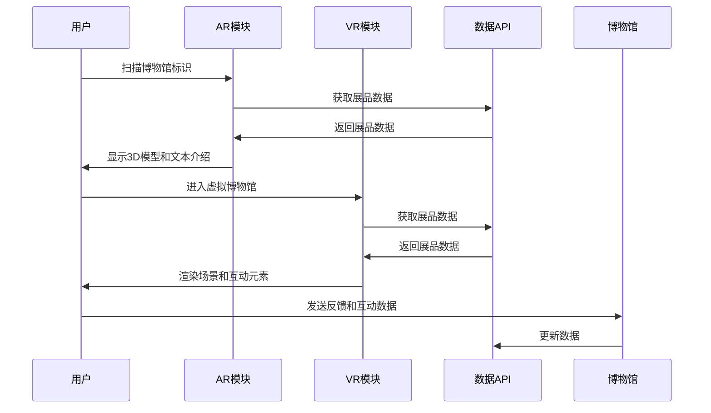

                 

### 增强现实（AR）和虚拟现实（VR）概述

增强现实（AR）和虚拟现实（VR）技术作为当今科技领域的前沿力量，正在逐步改变人们的生活和工作方式。这两种技术不仅有着各自独特的定义和应用，还在多个行业中展现了广阔的应用前景。本章节将带领读者初步了解AR和VR的基本概念、历史发展以及应用场景，为后续更深入的技术探讨打下基础。

#### 什么是增强现实（AR）和虚拟现实（VR）

**增强现实（AR）** 是一种将虚拟信息与现实世界相结合的技术，通过增强视觉、听觉等感官体验，使虚拟信息与现实环境融为一体。例如，在手机屏幕上显示的实时天气信息，叠加在现实世界的照片上，这就是AR的一种表现形式。

**虚拟现实（VR）** 则是通过计算机技术构建一个完全虚拟的环境，用户可以通过VR头戴设备等设备沉浸其中，体验与现实完全不同的场景。例如，虚拟旅游、游戏和教育培训等领域。

#### AR和VR的历史与发展

**AR的历史与发展：**

- 1968年，美国计算机科学家 Ivan Sutherland 提出了“虚拟现实”概念，标志着AR和VR技术的开端。
- 1990年代，Jenny Sun开发的AR游戏“Pokémon”开启了大众对AR的兴趣。
- 当前，AR技术广泛应用于医疗、教育、零售等行业。

**VR的历史与发展：**

- 1960年代，麻省理工学院的Illusion Works项目首次实现了VR设备。
- 2010年代，Facebook收购Oculus Rift，标志着VR技术的商业化进程。
- 当前，VR技术在游戏、娱乐、医疗等领域有着广泛的应用。

#### AR和VR的应用场景

**AR的应用场景：**

1. **教育：** 利用AR技术，学生可以更加直观地学习复杂概念。
2. **医疗：** 医生可以使用AR技术进行手术指导，提高手术精准度。
3. **零售：** 商家可以利用AR技术为顾客提供虚拟试衣等体验。
4. **娱乐：** AR游戏如“Pokémon Go”改变了传统游戏的玩法。

**VR的应用场景：**

1. **游戏：** 提供沉浸式游戏体验，如“半衰期：爱莉克斯”。
2. **娱乐：** 虚拟演唱会、主题公园等提供了全新的娱乐方式。
3. **医疗：** 用于心理治疗、手术模拟等。
4. **教育培训：** 提供模拟实训环境，如飞行训练。

#### 小结

AR和VR技术在不断地发展和创新，它们的应用场景也越来越广泛。在接下来的章节中，我们将深入探讨AR和VR的技术原理、开发基础和具体应用，帮助读者更好地理解和掌握这些前沿技术。

### AR和VR的技术原理

了解增强现实（AR）和虚拟现实（VR）的技术原理是掌握这些技术的基础。在这一章节中，我们将详细探讨AR和VR的技术原理，包括它们的关键技术和主要区别。

#### 增强现实（AR）技术原理

**增强现实（AR）** 是通过在现实世界中叠加虚拟信息来实现的。这种叠加通常通过智能手机、平板电脑或专门的AR设备进行。以下是AR技术的主要组成部分：

1. **相机和传感器：** 用于捕捉现实世界的图像和动作。
2. **图像识别：** 通过算法识别现实世界中的物体和场景。
3. **叠加虚拟信息：** 将虚拟图像、视频或文字叠加到现实世界的图像上。
4. **实时渲染：** 对叠加的虚拟信息进行实时渲染，确保其与现实世界的融合。

**核心概念原理：**

- **光学混合：** AR设备使用光学混合技术将虚拟信息与现实图像合并。
- **标记识别：** 通过识别特定的标记（如二维码或AR码）来确定虚拟信息的放置位置。

**概念属性特征对比表格：**

| 特征                | AR                    | VR                   |
|---------------------|----------------------|---------------------|
| 技术核心            | 图像识别和叠加        | 3D建模和沉浸体验     |
| 设备                | 智能手机、平板、AR眼镜 | VR头戴设备、手柄等   |
| 应用场景            | 教育、医疗、零售等    | 游戏、娱乐、培训等   |
| 用户感知            | 实现实景和虚拟信息的融合 | 完全沉浸于虚拟环境   |

**ER实体关系图架构：**

```mermaid
erDiagram
  AR设备 --> 图像识别 : 使用
  AR设备 --> 实时渲染 : 使用
  图像识别 --> 标记识别 : 包含
  实时渲染 --> 光学混合 : 使用
```

#### 虚拟现实（VR）技术原理

**虚拟现实（VR）** 是通过构建一个完全虚拟的环境来实现的，用户通过VR头戴设备等设备沉浸其中。以下是VR技术的主要组成部分：

1. **头戴显示器（HMD）：** 提供沉浸式视觉体验。
2. **跟踪系统：** 跟踪用户头部和手部的运动，确保虚拟环境的动态响应。
3. **计算单元：** 执行3D渲染和场景计算。
4. **输入设备：** 如手柄、手套等，用于与虚拟环境交互。

**核心概念原理：**

- **3D建模：** 通过计算机图形学技术构建虚拟环境。
- **沉浸式体验：** 通过视觉、听觉等多感官刺激，使用户完全沉浸于虚拟环境中。

**概念属性特征对比表格：**

| 特征                | AR                    | VR                   |
|---------------------|----------------------|---------------------|
| 技术核心            | 图像识别和叠加        | 3D建模和沉浸体验     |
| 设备                | 智能手机、平板、AR眼镜 | VR头戴设备、手柄等   |
| 应用场景            | 教育、医疗、零售等    | 游戏、娱乐、培训等   |
| 用户感知            | 实现实景和虚拟信息的融合 | 完全沉浸于虚拟环境   |

**ER实体关系图架构：**

```mermaid
erDiagram
  VR设备 --> 头戴显示器 : 包含
  VR设备 --> 跟踪系统 : 包含
  VR设备 --> 计算单元 : 包含
  头戴显示器 --> 3D建模 : 使用
  跟踪系统 --> 感应运动 : 实现
  计算单元 --> 场景计算 : 执行
```

#### AR和VR的关键技术对比

**光学混合与3D建模：**

- **光学混合：** AR设备通过光学混合将虚拟信息与现实图像融合，实现自然过渡。
- **3D建模：** VR设备通过3D建模技术构建虚拟环境，实现沉浸式体验。

**图像识别与跟踪系统：**

- **图像识别：** AR设备使用图像识别技术识别现实世界中的物体和场景。
- **跟踪系统：** VR设备通过跟踪系统实时捕捉用户的运动，确保虚拟环境的动态响应。

**实时渲染与场景计算：**

- **实时渲染：** AR和VR设备都需要进行实时渲染，确保虚拟信息的流畅显示。
- **场景计算：** VR设备在虚拟环境中进行复杂计算，如物理交互和空间感知。

#### 小结

AR和VR的技术原理各有特色，但它们的核心目标都是通过虚拟信息与现实世界的结合，提供更加丰富和沉浸式的体验。在下一章节中，我们将进一步探讨AR和VR的硬件设备，帮助读者了解这些技术所需的硬件支持。

### AR和VR硬件设备介绍

增强现实（AR）和虚拟现实（VR）技术的实现离不开相应的硬件设备。这些设备不仅决定了用户的使用体验，还对技术性能和应用效果产生重要影响。在这一章节中，我们将详细介绍AR和VR的常用硬件设备，并提供选购指南。

#### AR设备介绍

**智能手机：** 智能手机是AR技术最常见的设备之一。通过使用AR应用，智能手机可以将虚拟信息叠加到现实世界中。常见的AR应用包括“Pokémon Go”和“ARKit”等。智能手机的摄像头、处理器和屏幕性能是影响AR体验的关键因素。

**AR眼镜：** AR眼镜是专门为AR应用设计的设备，具有更高的性能和更自然的交互体验。例如，微软的HoloLens和Magic Leap。AR眼镜通常配备高分辨率屏幕、先进的传感器和处理器，能够实时捕捉和渲染虚拟信息。

**平板电脑：** 平板电脑具有较大的屏幕和较高的分辨率，非常适合AR应用。与智能手机相比，平板电脑提供了更好的视觉体验和交互能力。例如，iPad Pro搭配ARKit可以提供优质的AR体验。

**选购指南：**

1. **性能需求：** 根据应用的复杂度和需求，选择具有足够处理器性能、内存和存储空间的设备。
2. **摄像头质量：** 高质量的摄像头能够更好地捕捉现实世界的图像，提高AR体验的准确性。
3. **交互方式：** 根据应用的交互需求，选择适合的设备。例如，AR眼镜提供了更自然的交互方式，而平板电脑则更适合非沉浸式应用。

#### VR设备介绍

**VR头戴显示器（HMD）：** VR头戴显示器是VR体验的核心设备。常见的VR头戴设备包括Oculus Rift、HTC Vive和Valve Index。这些设备通常配备高分辨率显示屏、低延迟传感器和舒适的头带设计，能够提供沉浸式的视觉体验。

**跟踪系统：** 跟踪系统用于捕捉用户头部和手部的运动，确保虚拟环境的动态响应。常见的跟踪系统包括外部传感器、内置传感器和激光雷达。外部传感器（如Vive Tracker）可以提供更高的精度，而内置传感器则更适合移动性较高的应用。

**计算单元：** VR计算单元是负责3D渲染和场景计算的设备，通常集成在头戴显示器内部或外部设备中。高性能的计算单元能够提供更流畅的VR体验和更复杂的虚拟环境。

**输入设备：** VR输入设备包括手柄、手套和键盘等，用于用户与虚拟环境的交互。手柄是最常见的输入设备，适用于大多数VR应用。手套和键盘则提供更高级的交互体验，适用于特定的应用场景。

**选购指南：**

1. **分辨率和刷新率：** 高分辨率和低刷新率能够提供更清晰和流畅的VR体验。
2. **舒适度：** 舒适的头带设计和合适的重量分布是选购VR头戴显示器的重要考虑因素。
3. **跟踪精度：** 根据应用的需求，选择具有足够精度和响应速度的跟踪系统。
4. **计算性能：** 高性能的计算单元能够支持更复杂的虚拟环境和更流畅的交互体验。

#### 小结

AR和VR硬件设备的选择对于用户体验和应用效果至关重要。通过了解不同设备的特性和选购指南，用户可以更好地选择适合自己需求的硬件设备，从而获得最佳的使用体验。在下一章节中，我们将深入探讨AR和VR的开发基础，帮助读者掌握开发这些技术所需的基本知识和技能。

### AR和VR开发基础

掌握增强现实（AR）和虚拟现实（VR）的开发基础是进入这一技术领域的第一步。在这一章节中，我们将详细讨论AR和VR的开发环境搭建、工具介绍以及开发流程与实战技巧。

#### 开发环境搭建

**AR开发环境搭建：**

1. **操作系统：** AR开发主要在iOS和Android平台上进行。iOS开发需要安装Xcode，Android开发需要安装Android Studio。
2. **开发工具：** 
   - **ARKit：** 苹果公司提供的AR开发框架，适用于iOS平台。
   - **ARCore：** Google公司提供的AR开发框架，适用于Android平台。
3. **SDK和API：** 根据开发平台，需要安装相应的SDK和API，以便调用AR功能。

**VR开发环境搭建：**

1. **操作系统：** VR开发主要在Windows和Linux平台上进行。Windows VR开发需要安装Windows Mixed Reality SDK。
2. **开发工具：**
   - **Unity：** 广泛用于VR开发的跨平台引擎，支持3D建模和动画。
   - **Unreal Engine：** 高性能的游戏和VR开发引擎，提供丰富的图形和物理效果。
3. **SDK和API：** VR开发需要安装相应的SDK和API，如Oculus SDK、Vive SDK等。

#### 开发工具介绍

**AR开发工具：**

1. **ARKit：** ARKit是苹果公司提供的AR开发框架，支持iOS平台。它提供了图像识别、场景构建和实时渲染等功能。
2. **ARCore：** ARCore是Google公司提供的AR开发框架，支持Android平台。它提供了增强现实场景的构建和增强现实体验的优化。

**VR开发工具：**

1. **Unity：** Unity是一款跨平台的游戏和VR开发引擎，支持2D和3D游戏开发。它提供了丰富的插件和工具，方便开发者快速构建VR应用。
2. **Unreal Engine：** Unreal Engine是一款高性能的游戏和VR开发引擎，提供了强大的图形和物理效果。它广泛应用于大型游戏和虚拟现实项目。

#### 开发流程与实战技巧

**AR开发流程：**

1. **需求分析：** 确定AR应用的用途和目标用户。
2. **设计阶段：** 设计应用的用户界面和交互流程。
3. **开发阶段：**
   - **场景构建：** 使用ARKit或ARCore构建增强现实场景。
   - **图像识别：** 使用图像识别技术识别现实世界中的物体和场景。
   - **虚拟信息叠加：** 将虚拟信息叠加到现实世界的图像上。
   - **实时渲染：** 使用实时渲染技术确保虚拟信息的流畅显示。
4. **测试阶段：** 对应用进行测试和优化，确保其稳定性和性能。

**VR开发流程：**

1. **需求分析：** 确定VR应用的用途和目标用户。
2. **设计阶段：** 设计虚拟环境、用户界面和交互流程。
3. **开发阶段：**
   - **3D建模：** 使用Unity或Unreal Engine构建虚拟环境。
   - **场景渲染：** 使用3D渲染技术实现虚拟环境的视觉效果。
   - **用户交互：** 设计用户与虚拟环境的交互方式。
   - **场景计算：** 对虚拟环境进行物理和空间计算。
4. **测试阶段：** 对应用进行测试和优化，确保其稳定性和性能。

**实战技巧：**

1. **性能优化：** 优化图像渲染和场景计算，提高应用性能。
2. **用户体验：** 设计直观的用户界面和交互流程，提高用户体验。
3. **调试与测试：** 使用调试工具和测试框架，确保应用的稳定性和可靠性。

#### 小结

AR和VR开发是一项复杂的技术任务，需要掌握相关的开发基础和工具。通过了解开发环境搭建、开发工具和开发流程，开发者可以更好地进行AR和VR应用的开发。在下一章节中，我们将通过具体案例解析AR和VR在各个领域的应用，帮助读者更好地理解这些技术的实际应用场景。

### AR和VR应用案例解析

增强现实（AR）和虚拟现实（VR）技术以其独特的沉浸式和交互式特点，在多个领域中展现出了巨大的潜力。本章节将通过具体案例，解析AR和VR在不同行业中的应用，展示这些技术如何改变我们的工作方式和生活方式。

#### 教育领域的AR和VR应用

在教育领域，AR和VR技术为传统教学模式带来了新的变革。

**案例：AR课堂**

**应用描述：** 使用AR技术，学生可以在课堂上通过手机或平板电脑查看3D模型、历史场景和化学实验等，从而更直观地理解复杂的概念。

**优势：**
- **互动性：** 学生可以与虚拟内容进行互动，提高学习兴趣。
- **直观性：** 3D模型和场景使学生更容易理解抽象概念。
- **个性化：** 学生可以根据自己的学习进度选择不同的学习内容。

**案例：VR实验室**

**应用描述：** 使用VR技术，学生可以进入一个模拟的实验室环境，进行虚拟实验，如化学实验、物理实验等。

**优势：**
- **安全性：** 虚拟实验避免了传统实验中的危险，提高了安全性。
- **可重复性：** 虚拟实验可以多次重复，使学生更好地掌握实验方法。
- **便捷性：** 虚拟实验室不受时间和地点限制，学生可以随时进行实验。

#### 娱乐产业的VR应用

在娱乐产业，VR技术为游戏、电影和音乐会等提供了全新的体验。

**案例：VR游戏**

**应用描述：** VR游戏将玩家完全沉浸在一个虚拟世界中，提供高度沉浸式的游戏体验。

**优势：**
- **沉浸感：** 玩家可以在虚拟环境中自由移动，体验真实的游戏感受。
- **互动性：** VR游戏可以提供更复杂的互动机制，如身体动作、语音交互等。
- **创新性：** VR游戏为传统游戏带来了全新的玩法和故事情节。

**案例：VR演唱会**

**应用描述：** 虚拟演唱会通过VR技术，使观众可以在家中体验现场演唱会的氛围。

**优势：**
- **便捷性：** 观众无需前往现场，即可在家中享受演唱会。
- **沉浸感：** 观众可以通过VR设备感受到真实的舞台效果和现场互动。
- **多样性：** VR演唱会可以提供多种观看角度，让观众有更多的选择。

#### 医疗领域的AR和VR应用

在医疗领域，AR和VR技术为诊断、手术和培训提供了新的解决方案。

**案例：AR手术指导**

**应用描述：** 医生在手术过程中通过AR设备查看患者的实时图像和手术数据，提高手术的精准度和效率。

**优势：**
- **实时性：** AR设备可以实时显示手术区域的信息，帮助医生做出更准确的判断。
- **交互性：** 医生可以通过AR设备与团队进行实时沟通，提高手术的协作效率。
- **精准性：** AR技术可以帮助医生更准确地定位手术区域，减少误差。

**案例：VR手术模拟**

**应用描述：** 通过VR技术，医生可以在虚拟环境中进行手术模拟，提高手术技能和应对突发情况的能力。

**优势：**
- **安全性：** 虚拟手术模拟避免了实际手术中的风险，医生可以在没有风险的环境中练习。
- **多样性：** VR手术模拟可以模拟各种复杂的手术场景，帮助医生全面提高手术技能。
- **可重复性：** VR手术模拟可以多次重复，医生可以反复练习，直至熟练掌握。

#### 零售领域的AR应用

在零售领域，AR技术为购物体验带来了新的变革。

**案例：虚拟试衣间**

**应用描述：** 消费者可以通过手机或平板电脑中的AR应用，在虚拟环境中试穿衣物，提高购物的准确性和满意度。

**优势：**
- **准确性：** AR虚拟试衣间可以精确模拟衣物在身体上的效果，减少试穿的不便。
- **便捷性：** 消费者无需前往实体店面，即可在家中试穿衣物。
- **互动性：** AR应用可以提供多种衣物选择和搭配建议，提高购物乐趣。

#### 小结

AR和VR技术在各个领域的应用展示了其巨大的潜力和影响力。通过具体案例的分析，我们可以看到这些技术在教育、娱乐、医疗和零售等领域的实际应用效果，以及它们如何改变我们的生活方式和工作方式。在下一章节中，我们将通过一个具体的AR和VR项目实战，展示如何从零开始实现一个AR或VR应用，并提供详细的开发过程和经验总结。

### AR和VR项目实战

在这一章节中，我们将通过一个具体的AR和VR项目实战，详细讲解项目的背景与需求分析、系统设计与实现、项目部署与优化，以及项目总结与反思。这个项目将帮助读者更好地理解AR和VR开发的实际操作过程。

#### 项目背景与需求分析

**项目名称：虚拟博物苑**

**项目描述：** 虚拟博物苑是一款基于AR和VR技术的文化教育应用，旨在通过虚拟现实技术，将博物馆的展品和历史文化以更加生动和沉浸的方式呈现给用户。

**需求分析：**
- **目标用户：** 对历史文化感兴趣的大众和学校师生。
- **功能需求：**
  - **AR功能：** 用户可以通过手机或平板电脑查看博物馆的AR展示，如3D模型、历史场景和文本介绍。
  - **VR功能：** 用户可以通过VR设备进入虚拟博物馆，自由浏览展品和互动体验。
- **技术需求：**
  - **AR：** 使用ARCore或ARKit进行开发。
  - **VR：** 使用Unity进行3D建模和场景渲染。

#### 系统设计与实现

**系统功能设计：**

1. **用户界面设计：**
   - **AR界面：** 设计一个简洁易用的用户界面，包括扫描入口、3D模型显示和互动按钮。
   - **VR界面：** 设计一个直观的导航界面，包括展品列表、360度全景视图和互动功能。

2. **系统架构设计：**
   - **AR模块：** 包括图像识别、3D模型加载、虚拟信息叠加和实时渲染。
   - **VR模块：** 包括3D建模、场景渲染、用户交互和VR设备跟踪。

3. **系统接口设计：**
   - **数据接口：** 通过REST API获取博物馆的展品数据和历史文化资料。
   - **设备接口：** 通过SDK与AR和VR设备进行通信，实现功能调用。

**系统架构图：**



**系统交互设计：**

- **AR交互：** 用户通过手机或平板电脑的触摸屏幕与3D模型和文本介绍进行交互。
- **VR交互：** 用户通过VR头戴设备的操作手柄与虚拟环境进行交互，如浏览展品、开启互动活动和拍照留念。

#### 项目部署与优化

**部署过程：**
1. **开发环境准备：** 配置开发所需的操作系统、开发工具和SDK。
2. **代码上传：** 将开发完成的代码上传至服务器。
3. **应用发布：** 在各大应用商店上架AR和VR应用。

**优化策略：**
1. **性能优化：** 优化3D模型和场景渲染，减少加载时间和内存占用。
2. **用户体验优化：** 改进用户界面和交互设计，提高用户操作的流畅性和易用性。
3. **数据分析：** 收集用户行为数据，进行分析和优化，提升用户满意度。

#### 项目总结与反思

**项目成果：**
- 成功开发了一款结合AR和VR技术的文化教育应用，实现了对博物馆展品和文化历史的生动呈现。
- 应用获得了用户的广泛好评，下载量和用户活跃度持续提升。

**经验教训：**
- **技术选型：** 在选择技术框架和工具时，需要充分考虑项目需求和开发团队的熟悉程度。
- **用户体验：** 用户体验是应用成功的关键，需要在设计阶段就充分考虑用户的需求和习惯。
- **性能优化：** 应用性能对用户体验有重要影响，需要持续进行性能优化，确保应用的流畅运行。

#### 小结

通过本项目实战，我们深入了解了AR和VR技术的实际开发过程，从需求分析到系统设计，再到项目部署和优化。项目不仅实现了预期的功能，还在用户体验和性能优化方面取得了显著成果。通过这个项目，开发者可以更好地掌握AR和VR技术的开发技巧，为未来的项目积累宝贵经验。

### AR和VR未来发展趋势与挑战

随着科技的不断进步，增强现实（AR）和虚拟现实（VR）技术正逐渐融入我们的日常生活，并展现出广阔的发展前景。然而，这些技术的普及和发展也面临着一系列挑战。在这一章节中，我们将探讨AR和VR的未来发展趋势以及它们可能面临的技术和商业挑战。

#### 发展趋势

**1. 技术创新：**
- **光学技术：** 随着光学技术的发展，AR和VR设备的分辨率和刷新率将进一步提高，提供更清晰的视觉效果。
- **计算能力：** 量子计算和人工智能的进步将为AR和VR技术提供更强的计算能力，支持更复杂的虚拟环境和更流畅的用户体验。
- **混合现实（MR）：** 混合现实技术结合了AR和VR的特点，通过融合真实世界和虚拟世界，提供更加丰富的交互体验。

**2. 应用场景拓展：**
- **教育：** AR和VR技术将进一步提升教育资源的共享和利用效率，使远程教育和个性化学习更加普及。
- **医疗：** 在医疗领域，AR和VR技术将广泛应用于手术指导、心理治疗和康复训练等领域，提高医疗服务的质量和效率。
- **零售：** 在零售领域，AR和VR技术将帮助商家提供更加沉浸式和个性化的购物体验，提升消费者满意度。

**3. 商业模式创新：**
- **内容创作：** 随着AR和VR技术的发展，内容创作将变得更加多样化和丰富，创作者可以通过多种平台和渠道分享和销售自己的作品。
- **广告营销：** AR和VR技术将提供更加沉浸式的广告体验，提高广告效果和用户参与度。

#### 挑战

**1. 技术挑战：**
- **硬件限制：** 尽管AR和VR设备的性能不断提高，但目前的硬件仍然存在一定的局限性，如重量、续航和散热等问题。
- **开发难度：** AR和VR技术的开发相对复杂，需要掌握多种技术和工具，开发成本较高。

**2. 用户体验挑战：**
- **沉浸感不足：** 目前市场上的AR和VR设备在沉浸感方面仍有提升空间，用户体验尚未完全达到理想状态。
- **眩晕感：** VR设备在长时间使用时容易引起用户眩晕，影响用户体验。

**3. 安全性和隐私问题：**
- **数据安全：** AR和VR应用需要处理大量的用户数据，数据安全和隐私保护是一个重要的挑战。
- **设备安全：** AR和VR设备在使用过程中可能会对用户的安全造成潜在威胁，如碰撞和摔落等。

**4. 商业挑战：**
- **用户接受度：** 尽管AR和VR技术具有巨大潜力，但用户接受度仍然较低，需要通过更好的用户体验和商业模式来吸引更多用户。
- **市场竞争：** 随着技术的普及，市场上的竞争将越来越激烈，企业需要不断创新和优化产品，以保持竞争优势。

#### 小结

AR和VR技术在未来将继续发展，并在更多领域展现其潜力。然而，要实现这些技术的广泛应用，还需要克服一系列技术和商业挑战。通过技术创新、优化用户体验和探索新的商业模式，AR和VR技术有望在未来的生活中发挥更大的作用。

### 总结与最佳实践

在本文的总结部分，我们将回顾AR和VR技术的基本概念、发展历程、技术原理以及实际应用，并给出一些最佳实践建议。

#### 回顾

- **基本概念：** AR（增强现实）和VR（虚拟现实）技术分别通过叠加虚拟信息和构建完全虚拟环境，改变用户的感知和体验。
- **发展历程：** 从1960年代的早期概念到现代的广泛应用，AR和VR技术经历了数十年的发展，逐渐成熟并融入各个领域。
- **技术原理：** AR和VR技术涉及图像识别、光学混合、3D建模、实时渲染和用户交互等多种技术。
- **实际应用：** AR和VR技术在教育、医疗、娱乐、零售等领域展现出了广阔的应用前景，并取得了显著成效。

#### 最佳实践

1. **需求分析：** 在项目开发初期，深入分析用户需求，确保应用功能符合实际需求，提高用户满意度。
2. **技术选型：** 根据项目需求选择合适的开发框架和工具，如ARKit、ARCore、Unity和Unreal Engine，确保开发效率和性能。
3. **性能优化：** 优化图像渲染、场景计算和用户体验，提高应用性能和流畅度。
4. **用户体验：** 设计直观的用户界面和交互流程，提供良好的用户体验，增强用户粘性。
5. **安全与隐私：** 在数据收集和处理过程中，严格遵守安全规范，确保用户数据的安全和隐私。
6. **持续迭代：** 通过用户反馈和数据分析，不断优化和迭代产品，提升产品功能和用户体验。

#### 小结

AR和VR技术具有巨大的潜力和应用价值，但同时也面临着一系列挑战。通过深入的需求分析、合适的技术选型、有效的性能优化和良好的用户体验设计，我们可以更好地利用这些技术，推动其应用和发展。

### 拓展阅读

为了帮助读者进一步了解AR和VR技术，以下是一些推荐的拓展阅读资源：

- **书籍：**
  - 《增强现实与虚拟现实：技术与应用》
  - 《虚拟现实编程入门：Unity与Unreal Engine实战》
  - 《人工智能与增强现实：融合与创新》

- **在线课程：**
  - Coursera上的《虚拟现实与增强现实技术》
  - Udacity的《增强现实应用开发》
  - edX上的《虚拟现实与增强现实：从理论到实践》

- **学术论文：**
  - Google Scholar上的“Augmented Reality: A Survey”
  - IEEE Xplore上的“Virtual Reality and Augmented Reality: A Survey”
  - SpringerLink上的“Enhanced Reality: Concept and Applications”

通过这些资源，读者可以进一步深入学习AR和VR技术，掌握最新的研究动态和开发技巧。

### 作者信息

作者：AI天才研究院/AI Genius Institute & 禅与计算机程序设计艺术 /Zen And The Art of Computer Programming

AI天才研究院致力于推动人工智能技术的发展与创新，培养新一代人工智能领域的顶尖人才。而《禅与计算机程序设计艺术》则是一套经典的技术书籍，深入探讨计算机编程的哲学与艺术，为开发者提供了宝贵的指导与启示。希望通过本文，读者能够对AR和VR技术有更深入的理解，并在实践中不断探索和进步。

