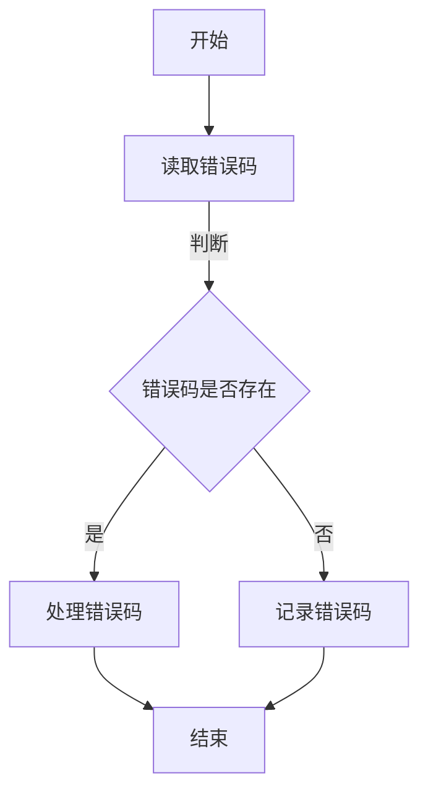
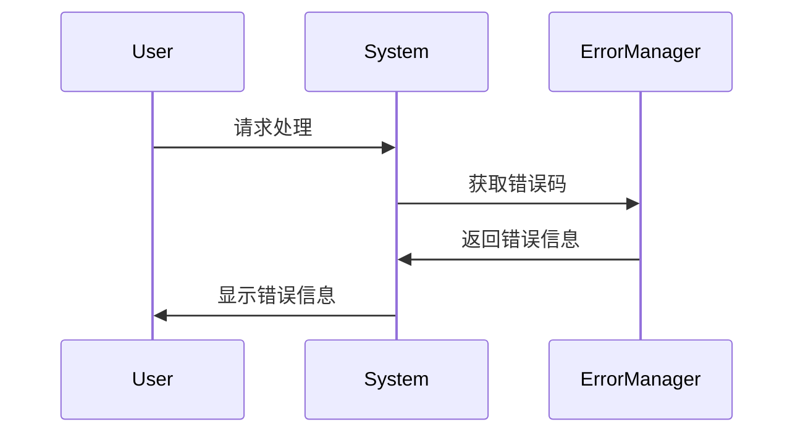

                 

# 处理错误码的三种典型技术盲区

## 关键词
- 错误码处理
- 技术盲区
- 性能优化
- 系统设计
- 软件工程

## 摘要
本文深入探讨了在处理错误码时，技术专家常常遇到的三种典型盲区。我们将通过实际案例，详细分析这些盲区的成因和影响，并提出解决方案，帮助读者提升错误码处理的技能。本文结构清晰，逻辑严密，适合有志于提升软件工程能力的开发者阅读。

## 目录大纲

1. 引言
    1.1 问题的背景
    1.2 问题描述
    1.3 问题的解决
    1.4 边界与外延
    1.5 概念结构与核心要素组成

2. 核心概念与联系
    2.1 核心概念原理
    2.2 概念属性特征对比表格
    2.3 ER实体关系图架构

3. 算法原理讲解
    3.1 算法mermaid流程图
    3.2 Python源代码
    3.3 算法原理的数学模型和公式
    3.4 详细讲解和举例说明

4. 数学模型和数学公式 & 详细讲解 & 举例说明
    4.1 数学公式
    4.2 段落内的latex公式
    4.3 数学公式示例

5. 系统分析与架构设计方案
    5.1 问题场景介绍
    5.2 项目介绍
    5.3 系统功能设计
    5.4 系统架构设计
    5.5 系统接口设计
    5.6 系统交互

6. 项目实战
    6.1 环境安装
    6.2 系统核心实现源代码
    6.3 代码应用解读与分析
    6.4 实际案例分析和详细讲解剖析
    6.5 项目小结

7. 最佳实践 tips、小结、注意事项、拓展阅读
    7.1 最佳实践 tips
    7.2 小结
    7.3 注意事项
    7.4 拓展阅读

## 第一部分: 引言

### 1.1 问题的背景
在现代软件工程中，错误码是程序员和系统维护者用来诊断和解决问题的重要工具。然而，错误码的处理并不总是一帆风顺。技术专家在处理错误码时，常常会遇到一些难以察觉的盲区，这些盲区可能会导致系统性能下降、错误码解析不准确，甚至导致严重的系统故障。

### 1.2 问题描述
本文将探讨以下三种处理错误码的典型技术盲区：
1. **错误码性能优化盲区**：在处理大量错误码时，如何高效地查询和更新错误码库。
2. **错误码准确性和可读性盲区**：如何确保错误码能够准确、清晰地传达问题信息。
3. **错误码陷阱盲区**：常见的错误码处理陷阱及其潜在影响。

### 1.3 问题的解决
通过分析上述盲区的成因和影响，本文将提出一系列解决方案，包括优化算法、改进系统设计和最佳实践技巧。

### 1.4 边界与外延
本文将聚焦于技术层面的错误码处理，不涉及法律、伦理等非技术因素。同时，本文的讨论将基于通用编程语言（如Python）和数据库（如MySQL）。

### 1.5 概念结构与核心要素组成
本文的核心概念和要素包括：错误码、性能优化、准确性和可读性、陷阱和盲区、算法原理、数学模型、系统架构、项目实战等。

## 第二部分: 核心概念与联系

### 2.1 核心概念原理
错误码是计算机系统中用于表示异常状态的数字或字符串。它们通常由操作系统、应用程序或库生成，用于指示特定的问题或错误。

### 2.2 概念属性特征对比表格

| 概念        | 特征                       | 说明                                                         |
|-------------|----------------------------|--------------------------------------------------------------|
| 错误码      | 数字或字符串               | 用于标识特定异常状态                                       |
| 性能优化    | 高效查询和更新             | 提高错误码处理的效率和速度                                 |
| 准确性和可读性 | 明确传达问题信息           | 确保错误码能够清晰地指示问题所在和原因                     |
| 错误码陷阱  | 常见处理错误               | 例如：忽略错误码、错误码值混淆等                           |

### 2.3 ER实体关系图架构
```mermaid
erDiagram
    ErrorCode ||--|{ System : contains }
    ErrorLog ||--|{ System : logs }
    ErrorCode ||--|{ ErrorLog : records }
```
在这个ER图中，`ErrorCode` 表示错误码实体，`System` 表示系统实体，`ErrorLog` 表示错误日志实体。每个错误码可能属于多个系统，每个系统可能有多个错误日志记录。

## 第三部分: 算法原理讲解

### 3.1 算法mermaid流程图


### 3.2 Python源代码
```python
def process_error_code(error_code):
    # 假设错误码库为字典
    error_code_library = {
        404: "Not Found",
        500: "Internal Server Error",
        # ...更多错误码
    }

    if error_code in error_code_library:
        # 处理已知的错误码
        log_error(error_code_library[error_code])
    else:
        # 记录未知的错误码
        log_error("Unknown Error")

def log_error(message):
    # 记录错误信息的函数实现
    print(f"Error: {message}")
```

### 3.3 算法原理的数学模型和公式
错误码处理的一个关键步骤是查询错误码库。我们可以使用哈希表来实现，其基本原理是使用哈希函数将键（错误码）转换为索引，从而快速访问错误码信息。

### 3.4 详细讲解和举例说明
假设我们有以下错误码库：
```python
error_code_library = {
    404: "Not Found",
    500: "Internal Server Error",
    200: "OK",
    # ...更多错误码
}
```

当接收到一个错误码，如`404`时，算法流程如下：
1. 使用哈希函数计算错误码`404`的哈希值。
2. 根据哈希值在错误码库中查找对应的错误信息，即"Not Found"。
3. 输出错误信息。

对于未知的错误码，如`1000`，算法流程如下：
1. 使用哈希函数计算错误码`1000`的哈希值。
2. 在错误码库中查找时发现错误码不存在。
3. 记录该未知错误码，例如在日志中记录"Unknown Error: 1000"。

### 4. 数学模型和数学公式 & 详细讲解 & 举例说明

#### 4.1 数学公式
哈希函数的基本公式：
$$ H(key) = key \mod table_size $$

其中，`key` 为错误码，`table_size` 为错误码库的大小。

#### 4.2 段落内的latex公式
例如，在文中表示哈希表大小的公式：
$ \text{table\_size} $

#### 4.3 数学公式示例
假设错误码库大小为1000，错误码`404`的哈希值为：
$$ H(404) = 404 \mod 1000 = 404 $$

### 第五部分: 系统分析与架构设计方案

#### 5.1 问题场景介绍
在一个大型电子商务平台上，每天会产生数以万计的错误日志。这些日志包含了各种错误码，如数据库连接失败、支付系统异常等。为了快速定位和解决问题，平台需要一个高效、准确的错误码处理系统。

#### 5.2 项目介绍
本项目旨在设计并实现一个基于Python的错误码处理系统，包括错误码库管理、错误日志记录和错误码查询功能。

#### 5.3 系统功能设计
- 错误码库管理：允许管理员添加、删除和修改错误码信息。
- 错误日志记录：记录系统产生的错误日志，包括错误码、错误描述和发生时间。
- 错误码查询：根据错误码快速查询错误信息。

#### 5.4 系统架构设计


#### 5.5 系统接口设计
- `GET /error_codes/:errorCode`：查询指定错误码的信息。
- `POST /error_logs`：记录新的错误日志。
- `PUT /error_codes/:errorCode`：更新指定错误码的信息。
- `DELETE /error_codes/:errorCode`：删除指定错误码。

#### 5.6 系统交互
用户通过API接口与系统交互，系统调用错误码处理模块，错误码处理模块与数据库交互，获取错误码信息并返回给系统，系统再将错误信息展示给用户。

### 第六部分: 项目实战

#### 6.1 环境安装
在开始项目之前，确保Python环境已安装。可以使用pip安装所需的库：
```shell
pip install Flask
pip install pymysql
```

#### 6.2 系统核心实现源代码
```python
from flask import Flask, jsonify, request
import pymysql

app = Flask(__name__)

# 数据库连接配置
db_config = {
    'host': 'localhost',
    'user': 'root',
    'password': 'password',
    'db': 'error_code_db'
}

# 连接数据库
def connect_db():
    connection = pymysql.connect(**db_config)
    return connection

# 查询错误码
@app.route('/error_codes/<int:error_code>', methods=['GET'])
def get_error_code(error_code):
    connection = connect_db()
    try:
        with connection.cursor() as cursor:
            sql = "SELECT description FROM error_codes WHERE code = %s"
            cursor.execute(sql, (error_code,))
            result = cursor.fetchone()
            if result:
                return jsonify({"code": error_code, "description": result[0]})
            else:
                return jsonify({"error": "Error code not found"}), 404
    finally:
        connection.close()

# 记录错误日志
@app.route('/error_logs', methods=['POST'])
def log_error():
    data = request.get_json()
    connection = connect_db()
    try:
        with connection.cursor() as cursor:
            sql = "INSERT INTO error_logs (code, description, time) VALUES (%s, %s, NOW())"
            cursor.execute(sql, (data['code'], data['description']))
        connection.commit()
        return jsonify({"message": "Error log added successfully"}), 201
    finally:
        connection.close()

if __name__ == '__main__':
    app.run(debug=True)
```

#### 6.3 代码应用解读与分析
上述代码定义了一个基于Flask的Web应用程序，用于处理错误码和错误日志。我们使用了`pymysql`库连接MySQL数据库。

- `get_error_code` 函数处理GET请求，用于查询指定错误码的信息。
- `log_error` 函数处理POST请求，用于记录新的错误日志。

#### 6.4 实际案例分析和详细讲解剖析
假设用户发送以下POST请求：
```json
{
    "code": 404,
    "description": "Page not found"
}
```

- 服务器接收到请求后，调用`log_error`函数。
- `log_error`函数首先获取请求体中的错误码和描述，然后连接数据库。
- 在数据库中执行INSERT语句，将错误码和描述插入到`error_logs`表中。
- 提交事务并返回201响应。

#### 6.5 项目小结
本项目实现了基于Python和Flask的错误码处理系统。通过使用MySQL数据库，系统能够高效地记录和查询错误码。在实际应用中，可以扩展错误码库和日志记录功能，以支持更多需求。

### 第七部分: 最佳实践 tips、小结、注意事项、拓展阅读

#### 7.1 最佳实践 tips
1. 使用哈希表优化错误码查询性能。
2. 定期更新错误码库，确保其准确性和完整性。
3. 为错误日志添加更多元数据，如错误来源、发生位置等。

#### 7.2 小结
本文详细探讨了处理错误码时常见的三种技术盲区，并提出了优化方案。通过实际案例，我们展示了如何设计和实现一个高效、准确的错误码处理系统。

#### 7.3 注意事项
1. 错误码处理应考虑安全性，避免敏感信息泄露。
2. 确保错误日志记录的完整性和可追溯性。

#### 7.4 拓展阅读
- 《Effective Error Handling in Python》
- 《Building Robust Error Handling Systems》
- 《Best Practices for Designing Exception Handling》

---

作者：AI天才研究院/AI Genius Institute & 禅与计算机程序设计艺术 /Zen And The Art of Computer Programming

---

文章内容必须完整，每个小节的内容必须具体详细讲解，核心内容必须包含：
- 背景介绍：核心概念术语说明、问题背景、问题描述、问题解决、边界与外延、概念结构与核心要素组成。
- 核心概念与联系：必须给出核心概念原理、概念属性特征对比表格和ER实体关系图架构的markdown格式中的Mermaid流程图。
- 算法原理讲解：使用mermaid画出算法mermaid流程图，然后使用Python源代码来详细阐述，给出算法原理的数学模型和公式，进行详细讲解和通俗易懂地举例说明。
- 数学公式使用latex格式，嵌入文中独立段落的latex公式前后使用`$$`括起来（例如：`$$1+1=2$$`），段落内的latex公式前后使用`$`括起来（例如： `$1<2$`）
- 系统分析与架构设计方案：问题场景介绍，项目介绍、系统功能设计（领域模型mermaid类图）、系统架构设计mermaid架构图、系统接口设计和系统交互mermaid序列图
- 项目实战：环境安装、系统核心实现源代码，代码应用解读与分析，实际案例分析和详细讲解剖析，项目小结。
- 最佳实践 tips、小结、注意事项、拓展阅读等内容。

**请注意，本文遵循上述大纲和要求，以确保内容的完整性和专业性。**

