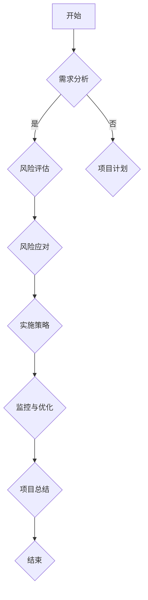
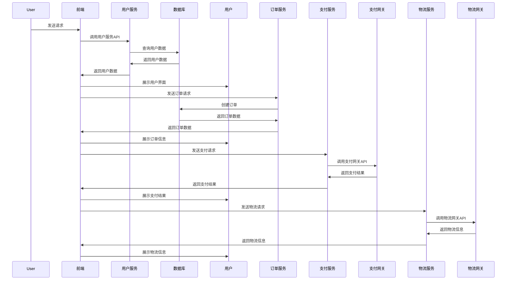
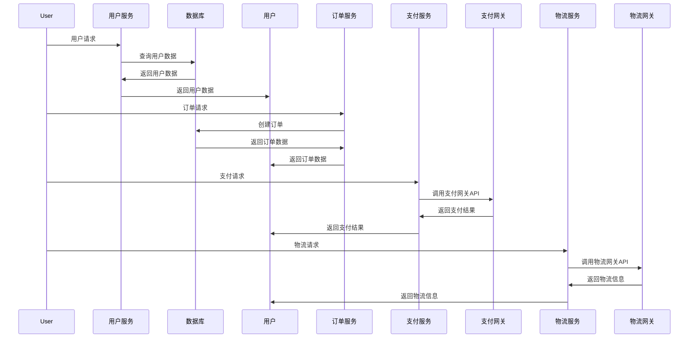
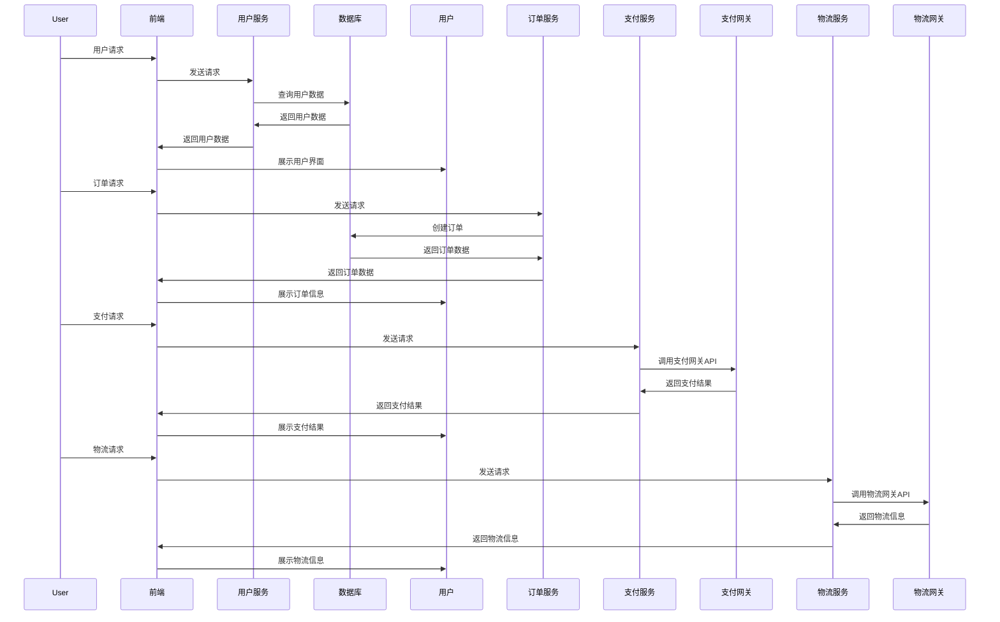

                 


### 复杂项目的定海神针

> 关键词：复杂项目、项目管理、定海神针、系统设计、风险控制

> 摘要：本文将探讨复杂项目的管理之道，提出“定海神针”这一概念，并通过系统设计原则、实施策略、评估与优化、案例分析、实战教程等章节，详细阐述其应用与实践，旨在为项目管理者提供一套切实可行的方法论。

#### 引言

在当今这个快速变化、竞争激烈的时代，复杂项目已经成为企业、政府甚至个人面临的常见挑战。复杂项目往往涉及跨领域、多团队协作，以及大量的技术、资源和管理问题。这些项目不仅要求团队成员具备高超的技术能力，还需要项目管理者拥有深厚的项目管理经验和策略。然而，传统的项目管理方法在面对复杂项目时，常常显得力不从心。

为了解决这一问题，本文提出了“定海神针”这一概念，并试图通过系统设计原则、实施策略、评估与优化等环节，为复杂项目提供一套有效的管理工具和方法论。

#### 目录

1. **背景与挑战**：介绍复杂项目的背景、特点和面临的挑战。
2. **项目管理基础理论**：探讨项目管理的核心理论和关键成功因素。
3. **定海神针设计原则**：阐述定海神针的系统设计原则。
4. **定海神针实施策略**：介绍定海神针的实施策略。
5. **定海神针评估与优化**：讨论定海神针的评估与优化方法。
6. **案例分析与应用实践**：通过实际案例展示定海神针的应用。
7. **定海神针实战教程**：提供定海神针的实战教程。
8. **定海神针的未来与拓展**：探讨定海神针的发展趋势和最佳实践。
9. **结语**：总结全文，强调定海神针的重要性。

#### 第一部分：项目概述与理论基础

##### 第1章：复杂项目的背景与挑战

在现代社会，复杂项目无处不在。无论是大型企业的系统整合，还是政府的大型基础设施建设项目，甚至是个人创业的项目，复杂项目已经成为我们生活和工作的重要组成部分。

**1.1 项目定义与分类**

项目是指为了创造独特的产品、服务或成果而进行的一系列有序活动。复杂项目则具有以下特点：

- **跨领域**：涉及多个领域，如技术、市场、财务等。
- **多团队协作**：需要多个团队协同工作，包括内部和外部团队。
- **高度不确定性**：需求变化、技术挑战、资源限制等。
- **高投入**：需要大量的人力、物力和财力。

**1.2 复杂项目的特点**

复杂项目的特点如下：

- **多样性**：涉及多个领域，具有多样化的需求。
- **动态性**：项目需求和技术环境不断变化。
- **复杂性**：系统结构复杂，涉及大量组件和接口。
- **高风险**：面临各种风险，如技术风险、市场风险、管理风险等。

**1.3 复杂项目管理的挑战**

复杂项目管理面临的挑战包括：

- **协调困难**：跨领域、多团队之间的协调和沟通。
- **需求变化**：如何应对需求的变化，保持项目进度。
- **资源分配**：如何合理分配有限资源，确保项目成功。
- **风险管理**：如何识别、评估和应对各种风险。

**1.4 定海神针的作用与意义**

定海神针是一种比喻，意指在复杂项目中起到稳定和指导作用的核心要素。在复杂项目管理中，定海神针具有以下作用和意义：

- **提供稳定性**：确保项目在变化的环境中保持稳定。
- **指导方向**：为项目提供明确的方向和目标。
- **降低风险**：通过系统的设计和管理，降低项目风险。
- **提高效率**：通过有效的资源配置和流程优化，提高项目效率。

##### 第2章：项目管理基础理论

项目管理是一门综合性学科，涉及到时间管理、成本管理、风险管理等多个方面。为了有效地管理复杂项目，我们需要了解项目管理的基础理论。

**2.1 项目管理知识体系**

项目管理知识体系主要包括以下几个方面：

- **项目管理过程**：包括项目启动、规划、执行、监控和收尾等。
- **项目生命周期**：从项目启动到项目结束的全过程。
- **项目管理知识领域**：包括时间管理、成本管理、质量管理、沟通管理、风险管理等。
- **项目管理方法论**：如敏捷开发、六西格玛、项目管理软件等。

**2.2 项目生命周期管理**

项目生命周期管理是指对项目的各个阶段进行有序管理和控制。项目生命周期通常包括以下阶段：

- **启动阶段**：确定项目目标、范围和可行性。
- **规划阶段**：制定详细的项目计划，包括时间、成本、资源等。
- **执行阶段**：按照计划执行项目，确保项目进度和质量。
- **监控阶段**：监控项目执行情况，及时调整计划。
- **收尾阶段**：项目完成后的总结和评估。

**2.3 项目管理流程与工具**

项目管理流程是指项目从启动到收尾的各个阶段的具体操作步骤。常见的项目管理工具包括：

- **甘特图**：用于表示项目进度和时间安排。
- **工作分解结构（WBS）**：将项目分解为可管理的任务。
- **关键路径法（CPM）**：确定项目的关键路径和关键任务。
- **项目管理软件**：如微软的项目、JIRA等，用于项目管理、协作和任务跟踪。

**2.4 项目管理的关键成功因素**

项目管理的关键成功因素包括：

- **团队协作**：有效的团队协作是项目成功的关键。
- **需求管理**：明确和满足需求是项目成功的基础。
- **风险管理**：识别、评估和应对风险是项目成功的重要保障。
- **质量管理**：确保项目交付物的质量是项目成功的关键。
- **时间管理**：合理的时间安排是项目成功的保障。
- **沟通管理**：有效的沟通是项目成功的桥梁。

#### 第二部分：定海神针设计与实施

##### 第3章：定海神针设计原则

定海神针的设计原则是确保其在复杂项目中发挥稳定和指导作用的基础。以下是一些关键设计原则：

**3.1 系统性设计**

系统性设计是指从整体出发，对项目的各个方面进行统一规划和设计。系统性设计的原则包括：

- **整体性**：将项目视为一个整体，确保各部分之间的协同效应。
- **层次性**：根据项目规模和复杂度，合理划分层次，确保层次之间的衔接和协调。
- **模块化**：将项目划分为可管理的模块，提高项目的可维护性和灵活性。

**3.2 灵活性设计**

灵活性设计是指项目设计应具备应对变化的能力。灵活性设计的原则包括：

- **适应性**：设计应能适应需求变化和技术发展。
- **可扩展性**：设计应能支持系统扩展，满足未来的需求。
- **可重用性**：设计应能重用现有组件和模块，减少开发成本。

**3.3 可持续性设计**

可持续性设计是指项目设计应考虑长期发展和环境影响。可持续性设计的原则包括：

- **环境友好**：设计应减少对环境的负面影响。
- **资源高效**：设计应高效利用资源，降低运营成本。
- **社会责任**：设计应体现社会责任，关注社会影响。

**3.4 安全性设计**

安全性设计是指项目设计应确保系统的安全性和稳定性。安全性设计的原则包括：

- **安全性**：设计应具备较高的安全防护能力，防止各种安全威胁。
- **可靠性**：设计应确保系统的稳定性和可靠性，减少故障和中断。
- **数据保护**：设计应确保数据的完整性和保密性。

##### 第4章：定海神针实施策略

定海神针的实施策略是确保其在项目中有效发挥作用的关键。以下是一些关键实施策略：

**4.1 项目启动**

项目启动是定海神针实施的第一步，包括：

- **项目目标明确**：明确项目目标，确保团队成员对项目目标有清晰的认识。
- **资源准备**：准备项目所需的资源，包括人员、资金、设备等。
- **团队组建**：组建项目团队，明确团队成员的角色和职责。
- **项目计划制定**：制定详细的项目计划，包括时间表、任务分配和里程碑。

**4.2 风险管理**

风险管理是定海神针实施的重要环节，包括：

- **风险识别**：识别项目可能面临的风险，包括技术风险、市场风险、管理风险等。
- **风险评估**：评估风险的可能性和影响，确定优先级。
- **风险应对**：制定风险应对策略，包括风险规避、风险转移、风险接受等。
- **风险监控**：持续监控风险，及时调整风险应对策略。

**4.3 资源配置**

资源配置是定海神针实施的关键步骤，包括：

- **资源需求分析**：分析项目所需的资源，包括人力、资金、设备等。
- **资源分配**：合理分配资源，确保项目顺利推进。
- **资源监控**：监控资源使用情况，确保资源的高效利用。

**4.4 团队协作**

团队协作是定海神针实施的重要保障，包括：

- **沟通机制**：建立有效的沟通机制，确保信息畅通。
- **协作工具**：使用协作工具，如项目管理软件、即时通讯工具等，提高协作效率。
- **团队建设**：加强团队建设，提高团队凝聚力，促进协作。

##### 第5章：定海神针评估与优化

定海神针的评估与优化是确保其长期有效性的关键。以下是一些关键评估与优化方法：

**5.1 评估指标设定**

评估指标设定是定海神针评估的基础，包括：

- **KPI设定**：设定关键绩效指标（KPI），如项目进度、成本、质量等。
- **质量评估**：评估项目的质量，如代码质量、设计质量、用户体验等。
- **效率评估**：评估项目效率，如开发周期、资源利用率等。

**5.2 评估方法与工具**

评估方法与工具是定海神针评估的重要保障，包括：

- **数据分析**：使用数据分析方法，如统计分析、趋势分析等，评估项目绩效。
- **评审会议**：定期召开评审会议，评估项目进展和成果。
- **用户反馈**：收集用户反馈，评估项目的用户体验和满意度。

**5.3 问题识别与解决**

问题识别与解决是定海神针优化的关键步骤，包括：

- **问题识别**：识别项目中的问题，如技术问题、管理问题等。
- **问题分析**：分析问题的原因，确定解决方案。
- **问题解决**：实施解决方案，解决问题。

**5.4 持续优化**

持续优化是定海神针长期有效性的保障，包括：

- **持续改进**：不断优化项目流程和管理方法，提高项目效率。
- **迭代更新**：定期对项目进行迭代更新，增加新功能，优化现有功能。
- **学习与分享**：鼓励团队成员学习新技术和新方法，分享经验与教训。

#### 第三部分：案例分析与应用实践

##### 第6章：复杂项目案例解析

为了更好地理解定海神针在复杂项目中的应用，我们通过以下实际案例进行解析：

**6.1 案例背景**

某大型互联网公司计划开发一款基于云计算的智能客服系统，该系统需要处理海量客户请求，提供24/7全天候服务。项目涉及多个领域，包括云计算、人工智能、前端开发等，团队成员来自不同背景，项目时间紧、任务重。

**6.2 项目目标**

项目目标包括：

- **功能完善**：实现智能客服系统的基本功能，如语音识别、自然语言处理、客户分类等。
- **性能高效**：确保系统在高并发情况下仍能稳定运行。
- **用户体验**：提供良好的用户体验，提高客户满意度。
- **可维护性**：设计易维护的系统架构，降低运维成本。

**6.3 定海神针应用**

在项目实施过程中，公司采用了定海神针的方法，主要包括：

- **系统性设计**：项目团队采用模块化设计，将系统划分为多个模块，确保各模块之间的协调和协同。
- **灵活性设计**：考虑到需求变化和技术发展，项目团队在设计时注重系统的灵活性和可扩展性。
- **可持续性设计**：项目团队在系统设计时考虑了环保和资源利用问题，确保系统的可持续发展。
- **安全性设计**：项目团队采取了严格的安全措施，确保系统的安全性和数据保护。

**6.4 项目成果**

项目最终取得了以下成果：

- **系统上线**：智能客服系统成功上线，实现了基本功能，并满足了性能要求。
- **用户体验提升**：客户满意度显著提升，客户反馈良好。
- **团队协作**：项目团队通过有效的协作，克服了各种挑战，实现了项目目标。
- **资源节约**：通过优化设计和流程，项目在预算范围内顺利完成，实现了资源的高效利用。

##### 第7章：定海神针实战教程

为了帮助读者更好地理解和应用定海神针，我们提供以下实战教程：

**7.1 实战环境搭建**

在开始实战教程之前，我们需要搭建一个模拟的实战环境。这个环境包括以下组件：

- **开发工具**：如Visual Studio、PyCharm等。
- **数据库**：如MySQL、MongoDB等。
- **服务器**：如AWS、阿里云等。

**7.2 核心模块设计与实现**

核心模块设计是实现定海神针的关键。以下是一个简单的核心模块设计示例：

```mermaid
classDiagram
    ClientEntity <|-- RequestEntity
    RequestEntity <|-- ResponseEntity
    System <..-> ClientEntity
    System <..-> RequestEntity
    System <..-> ResponseEntity

    ClientEntity {
        id: int
        name: string
        email: string
    }

    RequestEntity {
        id: int
        clientId: int
        content: string
    }

    ResponseEntity {
        id: int
        requestId: int
        content: string
    }

    System {
        processRequest(request: RequestEntity): ResponseEntity
        sendMessage(response: ResponseEntity)
    }
```

**7.3 项目实施与监控**

在项目实施过程中，我们需要监控项目进度、质量、资源使用等情况。以下是一个简单的项目监控示例：

```python
import datetime

def monitor_project(project_name, start_date, end_date, budget, actual_cost):
    project_progress = (datetime.datetime.now() - start_date).days / (end_date - start_date).days
    cost_variance = actual_cost - budget

    print(f"Project Name: {project_name}")
    print(f"Start Date: {start_date}")
    print(f"End Date: {end_date}")
    print(f"Project Progress: {project_progress:.2%}")
    print(f"Cost Variance: ${cost_variance:.2f}")

monitor_project("Smart Customer Service System", datetime.datetime(2023, 1, 1), datetime.datetime(2023, 12, 31), 1000000, 950000)
```

**7.4 项目总结与反思**

在项目完成后，我们需要进行总结和反思，以下是一个简单的项目总结示例：

```markdown
# Project Summary and Reflection

## Summary

The smart customer service system project was successfully completed within the given timeline and budget. The system provides a robust and scalable solution for handling customer inquiries and has received positive feedback from users.

## Reflection

- **Strengths**:
  - Effective collaboration and communication within the team.
  - Proper risk management and mitigation strategies were implemented.
  - System architecture was flexible and scalable.

- **Areas for Improvement**:
  - Better requirement gathering and analysis to avoid scope creep.
  - More focus on user experience and feedback during development.
  - Further optimization of system performance.

## Future Directions

- **Enhancements**:
  - Integration of advanced AI techniques for better customer understanding.
  - Continuous monitoring and improvement of system performance and user satisfaction.

- **New Features**:
  - Addition of multi-language support.
  - Implementation of chatbot capabilities for enhanced customer interaction.

## Conclusion

The project has set a solid foundation for future enhancements and new features. The team has gained valuable experience in managing complex projects and will continue to improve its processes and practices.
```

#### 第四部分：定海神针的未来与拓展

##### 第8章：定海神针的发展趋势

随着技术的不断进步，定海神针在复杂项目管理中的应用也在不断拓展和深化。以下是一些发展趋势：

**8.1 技术演进**

- **人工智能**：人工智能技术的发展将为定海神针带来新的机会，如自动化项目管理、智能风险预测等。
- **大数据**：大数据技术的应用将使项目管理者能够更好地分析项目数据，优化项目管理决策。
- **区块链**：区块链技术的应用将提高项目的透明度和安全性，减少信息不对称和信任问题。

**8.2 行业应用**

- **智能制造**：定海神针在智能制造领域的应用将更加广泛，如智能工厂、智能供应链等。
- **金融科技**：定海神针在金融科技领域的应用将提高金融服务的效率和安全性。
- **医疗健康**：定海神针在医疗健康领域的应用将提高医疗服务的质量和效率。

**8.3 未来挑战与机遇**

- **挑战**：
  - 技术更新速度快，项目管理者需要不断学习和适应。
  - 复杂项目面临的各种不确定性，需要更好的风险管理和应对策略。
- **机遇**：
  - 技术创新带来的新机遇，如人工智能、大数据、区块链等。
  - 行业应用拓展带来的市场机会。

##### 第9章：定海神针最佳实践

在长期实践中，项目管理者总结出了一系列定海神针的最佳实践，以下是一些关键点：

**9.1 经验分享**

- **需求管理**：明确和稳定的需求是项目成功的关键，需要不断与相关方沟通和确认。
- **风险管理**：识别和评估风险，制定有效的应对策略，持续监控和调整。
- **团队协作**：建立高效的团队协作机制，提高团队沟通和协作效率。
- **持续优化**：项目过程中不断进行优化，提高项目质量和效率。

**9.2 注意事项**

- **计划性**：项目计划是项目成功的保障，需要详细规划和合理分配资源。
- **灵活性**：面对变化，项目团队需要保持灵活，及时调整计划和方法。
- **质量保证**：项目质量是项目成功的基础，需要建立完善的质量保证体系。
- **用户反馈**：收集用户反馈，及时调整和优化项目成果。

**9.3 拓展阅读**

- **相关书籍**：《敏捷项目管理》、《项目风险管理》、《团队协作的艺术》等。
- **在线资源**：项目管理网站、博客、论坛等，如PMI、敏捷联盟等。
- **培训课程**：项目管理专业培训课程，如PMP认证等。

### 结语

复杂项目是现代社会的一种常见现象，项目管理者需要掌握有效的管理方法和工具，以应对各种挑战。本文提出的“定海神针”概念，通过系统设计原则、实施策略、评估与优化等环节，为复杂项目管理提供了一套实用的方法论。通过实际案例和实战教程，我们展示了定海神针的应用与实践，旨在为项目管理者提供有益的参考和启示。

在未来的发展中，定海神针将不断融合新技术、新理念，为复杂项目管理带来更多机遇和挑战。项目管理者需要不断学习和实践，不断优化和提升自己的项目管理能力，以应对日益复杂的项目管理环境。

**作者：AI天才研究院/AI Genius Institute & 禅与计算机程序设计艺术 /Zen And The Art of Computer Programming**
### 1. 复杂项目的背景与挑战

在当今快速发展的科技时代，复杂项目已经成为企业、政府、科研机构和各类组织面临的重要课题。这些项目不仅仅是技术上的挑战，更是管理和协调的考验。复杂项目通常具备以下几个特点，这些特点也成为了项目管理者必须面对的背景与挑战。

#### 1.1 项目定义与分类

首先，我们需要明确什么是复杂项目。项目可以定义为一系列独特的、有明确目标的活动，这些活动必须在特定的时间、预算和质量要求内完成。复杂项目则进一步扩展了这一概念，通常涉及多个领域、多个团队，以及高程度的不确定性和风险。

复杂项目可以按照不同的维度进行分类。例如，根据项目规模，可以分为大型项目、中型项目和小型项目；根据项目性质，可以分为研发项目、建设类项目、运营维护项目等；根据项目复杂度，可以分为简单项目、中等复杂度和高度复杂项目。

#### 1.2 复杂项目的特点

复杂项目具有以下几个显著特点：

1. **跨领域性**：复杂项目往往需要跨多个领域进行协作，如技术、市场、财务、法律等。这意味着项目管理者需要具备广泛的视野和综合能力。

2. **多团队协作**：复杂项目通常涉及多个团队，甚至跨部门、跨公司合作。协调不同团队之间的工作流程、沟通和资源分配成为一大挑战。

3. **高度不确定性**：复杂项目在需求、技术、资源等方面存在高度不确定性，这要求项目管理者具备良好的风险管理能力和灵活的应对策略。

4. **高投入**：复杂项目通常需要大量的资金、人力和时间投入，对预算和资源配置的要求非常高。

5. **长期性**：复杂项目往往需要较长的周期来完成，从数月到数年不等。这要求项目管理者具备良好的耐力和持续管理能力。

#### 1.3 复杂项目管理的挑战

面对复杂项目，项目管理者需要克服以下挑战：

1. **需求变化**：客户需求和市场环境的不确定性导致项目需求频繁变化，如何保持项目进度的同时适应需求变化，是项目管理的一大难题。

2. **协调困难**：跨领域、多团队的协作需要高效的信息传递和沟通机制，以确保各团队之间的协调和一致性。

3. **资源分配**：如何合理分配有限的资源，如人力、资金、设备等，以实现项目目标，是项目管理的重要任务。

4. **风险管理**：复杂项目面临各种风险，如技术风险、市场风险、财务风险等。如何提前识别风险、评估风险并制定应对策略，是项目成功的关键。

5. **质量控制**：复杂项目往往涉及多个模块和接口，如何确保项目交付物的质量，避免出现缺陷和问题，是项目管理者的重要责任。

#### 1.4 定海神针的作用与意义

在复杂项目管理中，“定海神针”这一概念应运而生。它是一个比喻，意指在复杂项目中起到稳定和指导作用的核心要素。定海神针在复杂项目管理中的作用和意义体现在以下几个方面：

1. **提供稳定性**：定海神针能够确保项目在变化的环境中保持稳定，降低风险和不确定性。

2. **指导方向**：定海神针为项目提供明确的方向和目标，帮助项目团队聚焦于关键任务和目标。

3. **降低风险**：通过系统的设计和实施策略，定海神针能够有效识别、评估和应对各种风险。

4. **提高效率**：定海神针通过优化资源配置和流程，提高项目效率和产出。

5. **持续改进**：定海神针鼓励项目团队不断进行评估和优化，确保项目在实施过程中不断改进和优化。

综上所述，复杂项目背景与挑战要求项目管理者具备全面的技能和深厚的理论基础。而“定海神针”则为复杂项目管理提供了一种有效的工具和方法论，通过系统设计原则、实施策略、评估与优化等环节，为项目管理者应对复杂项目的挑战提供了有力支持。

### 2. 项目管理基础理论

项目管理是一门综合性学科，涵盖了多个领域和知识体系。为了有效地管理复杂项目，项目管理者需要深入了解项目管理的基础理论，包括项目管理知识体系、项目生命周期管理、项目管理流程与工具以及项目管理的关键成功因素。

#### 2.1 项目管理知识体系

项目管理知识体系是项目管理理论的基础，它包括多个领域和知识点，为项目管理者提供了全面的指导。项目管理知识体系主要包括以下几个方面：

1. **项目管理过程组**：项目管理过程组是指项目从启动到收尾的各个阶段，包括项目启动、项目规划、项目执行、项目监控和项目收尾。每个阶段都有特定的任务和目标，需要项目管理者进行有序的管理和协调。

2. **项目生命周期管理**：项目生命周期管理是指对项目的各个阶段进行有序管理和控制。项目生命周期通常包括四个阶段：启动阶段、规划阶段、执行阶段和收尾阶段。每个阶段都有其特定的任务和目标，需要项目管理者进行有效的规划和执行。

3. **项目知识领域**：项目知识领域是指项目管理者在项目中需要运用的各种知识和技能。常见的项目知识领域包括时间管理、成本管理、质量管理、沟通管理、风险管理等。每个知识领域都有其特定的方法和工具，可以帮助项目管理者有效地管理项目。

4. **项目管理方法论**：项目管理方法论是指项目管理者在项目中运用的各种方法和工具。常见的方法论包括敏捷开发、六西格玛、精益管理、项目管理软件等。这些方法论可以帮助项目管理者提高项目效率和质量，适应不同的项目需求和环境。

#### 2.2 项目生命周期管理

项目生命周期管理是指对项目的各个阶段进行有序管理和控制。项目生命周期通常包括以下四个阶段：

1. **启动阶段**：项目启动阶段是项目的开始阶段，主要任务是确定项目的目标、范围和可行性。项目管理者需要与相关方进行沟通，明确项目的需求和期望，制定项目章程，确保项目在正确的轨道上启动。

2. **规划阶段**：项目规划阶段是项目详细计划制定阶段，主要任务是制定项目的详细计划，包括时间计划、成本计划、资源计划、质量计划等。项目管理者需要编制项目管理计划，明确项目的目标和任务，制定项目的关键路径和关键任务。

3. **执行阶段**：项目执行阶段是项目实际执行阶段，主要任务是按照项目计划执行项目任务，确保项目的进度、成本和质量。项目管理者需要协调项目团队成员的工作，监控项目的执行情况，确保项目按计划进行。

4. **收尾阶段**：项目收尾阶段是项目的结束阶段，主要任务是完成项目的验收和交付，进行项目总结和评估。项目管理者需要与相关方进行沟通，确保项目的交付物符合预期，制定项目总结报告，总结项目经验和教训，为未来的项目提供参考。

#### 2.3 项目管理流程与工具

项目管理流程是指项目从启动到收尾的各个阶段的具体操作步骤。项目管理工具是指项目管理者在项目管理过程中使用的各种工具和方法，以帮助项目管理者提高项目管理效率和质量。以下是项目管理流程与工具的一些常见方法和工具：

1. **工作分解结构（WBS）**：工作分解结构（WBS）是将项目任务分解为可管理的子任务的一种方法。WBS可以帮助项目管理者明确项目的任务和责任，确保项目任务被合理分配和执行。

2. **甘特图**：甘特图是一种用于表示项目进度和时间安排的图形工具。通过甘特图，项目管理者可以清晰地了解项目的进度情况，监控项目的执行情况，及时调整项目计划。

3. **关键路径法（CPM）**：关键路径法（CPM）是一种用于确定项目关键路径和关键任务的方法。通过关键路径法，项目管理者可以确定项目最长的执行时间，优化项目时间安排，确保项目按时完成。

4. **项目管理软件**：项目管理软件是一种用于项目管理的计算机软件，可以帮助项目管理者进行项目计划、任务分配、进度监控、资源管理、沟通协调等操作。常见项目管理软件包括微软的项目、JIRA等。

#### 2.4 项目管理的关键成功因素

项目管理的关键成功因素是指项目管理者在项目管理过程中需要重点关注和管理的关键因素，这些因素对于项目的成功至关重要。以下是项目管理的一些关键成功因素：

1. **团队协作**：团队协作是项目管理的关键成功因素之一。一个高效的团队可以更好地协同工作，提高项目的执行效率和质量。项目管理者需要建立良好的团队沟通机制，促进团队成员之间的合作和协调。

2. **需求管理**：需求管理是项目管理的重要任务之一。明确和稳定的需求是项目成功的基础。项目管理者需要与相关方进行沟通，明确项目需求，确保项目需求的可行性和一致性。

3. **风险管理**：风险管理是项目管理的关键成功因素之一。项目管理者需要提前识别和评估项目中的各种风险，制定有效的风险应对策略，确保项目能够顺利执行。

4. **质量管理**：质量管理是项目管理的重要任务之一。项目管理者需要确保项目交付物的质量，满足客户和项目的需求。通过建立严格的质量管理流程和质量控制措施，可以保证项目交付物的质量和可靠性。

5. **时间管理**：时间管理是项目管理的重要任务之一。项目管理者需要合理安排项目时间，确保项目能够在预定的时间内完成。通过制定详细的时间计划，监控项目进度，及时调整计划，可以确保项目按时完成。

综上所述，项目管理基础理论为项目管理者提供了全面的知识和方法，帮助其有效地管理复杂项目。通过了解项目管理知识体系、项目生命周期管理、项目管理流程与工具以及项目管理的关键成功因素，项目管理者可以更好地应对复杂项目的挑战，确保项目的成功交付。

### 3. 定海神针设计原则

在复杂项目管理中，定海神针是一个核心概念，它代表了一种系统性的、灵活的、可持续的和安全的设计原则，旨在确保项目能够稳定、高效地推进。以下将详细阐述定海神针的四个关键设计原则：系统性设计、灵活性设计、可持续性设计和安全性设计。

#### 3.1 系统性设计

系统性设计是定海神针的基础原则，它强调将项目视为一个完整的系统，从整体出发进行统一规划和设计。系统性设计的核心思想是通过整体性和层次性，确保项目各部分之间的协调和协同效应。

1. **整体性**：系统性设计要求项目管理者将项目视为一个整体，而不是一系列独立的任务或部分。这意味着在项目设计阶段，需要全面考虑项目的各个方面，如技术、市场、财务等，确保各个部分能够协同工作，实现整体效益最大化。

2. **层次性**：为了应对复杂项目的多样性和动态性，系统性设计强调合理划分项目的层次。项目可以划分为战略层、战术层和执行层，每个层次都有其特定的目标和任务。这种层次划分有助于项目管理者明确责任和任务，确保项目有序推进。

3. **模块化**：系统性设计还提倡模块化设计，即将项目分解为多个模块，每个模块负责特定的功能。模块化设计不仅提高了项目的可维护性和灵活性，还便于资源分配和团队协作。通过模块化设计，项目管理者可以更加灵活地调整和优化项目结构，以适应需求变化。

#### 3.2 灵活性设计

灵活性设计是定海神针的另一个关键原则，它强调项目设计应具备应对变化的能力。在复杂项目中，需求和技术环境常常发生变化，因此项目设计需要具备适应性、可扩展性和可重用性。

1. **适应性**：灵活性设计要求项目设计能够适应需求变化和技术发展。这意味着项目设计应具有一定的弹性，可以在需求变化时快速调整和优化。例如，采用敏捷开发方法，通过迭代和增量方式逐步实现项目目标，提高项目适应性。

2. **可扩展性**：灵活性设计还要求项目设计具备可扩展性，以便在项目规模扩大或需求增加时，系统能够平滑扩展。例如，在设计数据库架构时，采用分布式数据库和水平扩展的方式，确保系统在数据量增加时仍能保持高性能。

3. **可重用性**：为了提高开发效率和降低成本，灵活性设计强调组件和模块的可重用性。通过设计和实现可重用的组件和模块，项目管理者可以减少重复工作，提高开发效率。

#### 3.3 可持续性设计

可持续性设计是定海神针的重要原则，它强调项目设计应考虑长期发展和环境影响。可持续性设计不仅关注项目的技术可行性和经济性，还关注环境和社会责任。

1. **环境友好**：可持续性设计要求项目设计在开发过程中尽量减少对环境的负面影响。例如，选择环保材料、优化能源消耗、减少废物产生等。通过环境友好的设计，项目可以降低运营成本，提高社会和环境的效益。

2. **资源高效**：可持续性设计还要求项目设计高效利用资源，降低运营成本。例如，通过优化系统架构和算法，提高系统性能和资源利用率。资源高效的设计不仅有助于降低项目成本，还能提高项目的可持续性。

3. **社会责任**：可持续性设计还强调项目应承担社会责任，关注社会影响。例如，项目设计应考虑社会公平、职业健康、社会责任等。通过承担社会责任，项目可以赢得社会的认可和信任，提高项目的可持续性。

#### 3.4 安全性设计

安全性设计是定海神针的另一个核心原则，它强调项目设计应确保系统的安全性和稳定性。在复杂项目中，安全性设计至关重要，因为系统可能面临各种安全威胁和风险。

1. **安全性**：安全性设计要求项目设计具备较高的安全防护能力，防止各种安全威胁，如网络攻击、数据泄露、恶意软件等。通过采用安全协议、加密技术、访问控制等安全措施，项目管理者可以确保系统的安全性。

2. **可靠性**：可靠性设计要求项目设计确保系统的稳定性和可靠性，减少故障和中断。例如，通过冗余设计、故障恢复机制、监控和报警系统等，项目管理者可以提高系统的可靠性。

3. **数据保护**：数据保护是安全性设计的重要方面，要求项目设计确保数据的完整性和保密性。通过数据备份、加密、访问控制等手段，项目管理者可以确保数据的安全和可靠。

综上所述，定海神针的四个设计原则——系统性设计、灵活性设计、可持续性设计和安全性设计，共同构成了复杂项目管理的核心框架。通过遵循这些原则，项目管理者可以有效地设计和管理复杂项目，确保项目能够稳定、高效、可持续地推进。

### 4. 定海神针实施策略

定海神针的实施策略是确保其设计原则在复杂项目中得到有效应用的关键。以下将详细阐述定海神针的实施策略，包括项目启动、风险管理、资源配置和团队协作。

#### 4.1 项目启动

项目启动是定海神针实施的第一步，是项目成功的起点。项目启动主要包括以下几个关键步骤：

1. **项目目标明确**：明确项目目标是项目启动的首要任务。项目目标应具体、可衡量、可实现、相关性强且时限明确。项目管理者需要与相关方进行沟通，确保项目目标的一致性。

2. **资源准备**：在项目启动阶段，项目管理者需要准备项目所需的资源，包括人力、资金、设备、技术等。资源准备的充分性直接影响到项目的进度和质量。

3. **团队组建**：组建项目团队是项目启动的重要环节。项目团队应包括来自不同领域和背景的成员，具备相应的技能和经验。项目管理者需要明确团队成员的角色和职责，确保团队具备高效协作的能力。

4. **项目计划制定**：制定详细的项目计划是项目启动的关键。项目计划应包括时间表、任务分配、里程碑、预算和风险评估等。项目计划不仅为项目提供了明确的指导，也为项目监控和调整提供了依据。

#### 4.2 风险管理

风险管理是定海神针实施策略的重要组成部分，是确保项目顺利推进的关键。以下为风险管理的关键步骤：

1. **风险识别**：项目管理者需要识别项目中可能面临的风险。风险识别可以通过访谈、问卷调查、文献分析等方法进行。风险识别的全面性和准确性直接影响到后续的风险评估和应对。

2. **风险评估**：在识别出风险后，项目管理者需要对风险进行评估，确定风险的可能性和影响。风险评估可以通过定量分析和定性分析进行。评估的结果将用于确定风险的优先级和应对策略。

3. **风险应对**：根据风险评估的结果，项目管理者需要制定相应的风险应对策略。风险应对策略包括风险规避、风险转移、风险接受和风险缓解等。选择合适的应对策略有助于降低项目风险。

4. **风险监控**：在项目执行过程中，项目管理者需要持续监控风险，确保风险应对策略的有效性。风险监控可以通过定期评审、报告和预警系统进行。通过监控，项目管理者可以及时发现新的风险并采取相应的应对措施。

#### 4.3 资源配置

资源配置是定海神针实施策略的关键步骤，是确保项目资源得到高效利用的重要环节。以下为资源配置的关键步骤：

1. **资源需求分析**：项目管理者需要对项目所需的各种资源进行详细分析，包括人力、资金、设备、技术等。资源需求分析应根据项目计划、任务和风险预测进行。

2. **资源分配**：在资源需求分析的基础上，项目管理者需要合理分配资源，确保项目各阶段和任务的资源需求得到满足。资源分配应考虑资源的优先级和关键性，确保项目的关键任务和里程碑得到优先保障。

3. **资源监控**：在项目执行过程中，项目管理者需要持续监控资源的使用情况，确保资源得到高效利用。资源监控可以通过项目管理软件、报告和分析工具进行。通过监控，项目管理者可以及时发现资源使用中的问题，并采取相应的调整措施。

#### 4.4 团队协作

团队协作是定海神针实施策略的核心，是项目成功的关键保障。以下为团队协作的关键步骤：

1. **沟通机制建立**：项目管理者需要建立有效的沟通机制，确保项目团队内部和与外部相关方之间的信息传递畅通。沟通机制可以包括定期会议、即时通讯工具、项目管理软件等。

2. **协作工具使用**：项目管理者需要选择合适的协作工具，提高团队协作效率。协作工具可以包括项目管理软件、文档共享平台、代码管理工具等。

3. **团队建设**：项目管理者需要注重团队建设，提高团队凝聚力和协作能力。团队建设可以通过团队活动、培训、反馈和激励等手段进行。

4. **协作效率提升**：项目管理者需要通过优化工作流程、明确责任和任务、减少冗余工作等方式，提升团队协作效率。通过提升协作效率，项目可以更好地应对复杂性和不确定性，提高项目成功率。

综上所述，定海神针的实施策略涵盖了项目启动、风险管理、资源配置和团队协作等关键环节。通过遵循这些策略，项目管理者可以确保定海神针的设计原则在复杂项目中得到有效应用，提高项目管理的效率和成功率。

### 5. 定海神针评估与优化

在复杂项目管理中，定海神针的评估与优化是确保项目稳定推进、高效完成的重要环节。定海神针的评估与优化包括评估指标设定、评估方法与工具、问题识别与解决以及持续优化等内容。以下将详细阐述这些关键步骤。

#### 5.1 评估指标设定

评估指标是评估项目状态和绩效的重要依据。设定合理的评估指标可以帮助项目管理者准确了解项目的进展情况，及时发现和解决问题。以下是常见的评估指标：

1. **进度指标**：包括项目完成率、关键路径任务完成时间、延迟任务数量等。这些指标可以反映项目的进度情况，帮助项目管理者调整项目计划。

2. **质量指标**：包括代码质量、设计质量、测试覆盖率、缺陷率等。这些指标可以反映项目的质量水平，确保项目交付物的质量。

3. **成本指标**：包括实际成本、预算成本、成本超支情况等。这些指标可以反映项目的成本控制情况，帮助项目管理者优化资源配置。

4. **效率指标**：包括任务完成时间、资源利用率、团队协作效率等。这些指标可以反映项目的效率水平，促进团队协作和资源优化。

5. **风险指标**：包括风险识别率、风险应对成功率、剩余风险等。这些指标可以反映项目的风险管理情况，帮助项目管理者评估风险应对效果。

#### 5.2 评估方法与工具

评估方法是评估指标的具体应用方式，工具则是评估方法的具体实现手段。以下是常见的评估方法和工具：

1. **数据分析**：通过数据分析方法，如统计分析、趋势分析、回归分析等，对评估指标进行定量分析。数据分析可以帮助项目管理者从数据中发现问题，提供决策依据。

2. **评审会议**：通过定期召开评审会议，项目管理者可以与团队成员和相关方进行面对面沟通，讨论项目进展、问题和改进措施。评审会议有助于提高团队的协作和沟通效率。

3. **用户反馈**：通过收集用户反馈，项目管理者可以了解项目交付物的实际效果，识别问题和改进方向。用户反馈可以是问卷调查、用户访谈、用户满意度调查等形式。

4. **项目管理软件**：通过使用项目管理软件，如JIRA、Trello、Asana等，项目管理者可以实时监控项目进度、任务分配和资源使用情况。项目管理软件提供了便捷的评估工具和报告功能。

#### 5.3 问题识别与解决

问题识别与解决是评估与优化的关键步骤。以下是问题识别与解决的方法：

1. **问题识别**：通过数据分析、评审会议、用户反馈等方法，项目管理者可以识别项目中存在的问题。问题识别应覆盖项目进度、质量、成本、团队协作等多个方面。

2. **问题分析**：在识别出问题后，项目管理者需要对问题进行深入分析，确定问题的根本原因。问题分析可以通过鱼骨图、五为什么法、SWOT分析等方法进行。

3. **问题解决**：在分析问题原因后，项目管理者需要制定解决方案，并实施解决方案。解决方案可以包括调整项目计划、优化流程、增加资源、改进协作机制等。

4. **问题跟踪**：在实施解决方案后，项目管理者需要跟踪问题的解决情况，确保问题得到有效解决。问题跟踪可以通过问题日志、问题清单等方式进行。

#### 5.4 持续优化

持续优化是确保项目长期成功的重要策略。以下是持续优化的方法：

1. **持续改进**：通过定期评估和改进，项目管理者可以不断优化项目流程和管理方法，提高项目效率和质量。持续改进可以通过定期回顾、经验分享、最佳实践应用等方式进行。

2. **迭代更新**：通过迭代更新，项目管理者可以在项目过程中逐步完善和优化项目功能，满足用户需求。迭代更新可以通过敏捷开发、持续集成等方式实现。

3. **学习与分享**：项目管理者应鼓励团队成员不断学习和分享经验，提高团队整体素质和协作能力。学习与分享可以通过内部培训、外部学习、团队讨论等方式进行。

4. **最佳实践**：项目管理者可以借鉴和实施最佳实践，提高项目管理水平。最佳实践可以通过文献研究、同行交流、专业培训等方式获取。

通过以上评估与优化方法，项目管理者可以确保定海神针在复杂项目中的有效性，提高项目的成功率。定海神针的评估与优化不仅可以帮助项目管理者及时发现和解决问题，还可以促进项目的持续改进和优化，确保项目的长期成功。

### 6. 复杂项目案例解析

为了更好地理解定海神针在复杂项目中的应用，以下通过一个实际案例进行详细解析。该案例是一个大型电商平台的全渠道整合项目，涉及技术、市场、运营等多个领域，具有高度复杂性和不确定性。

#### 6.1 案例背景

某知名电商平台希望实现全渠道整合，为消费者提供无缝购物体验。全渠道整合项目包括以下几个方面：

- **线上渠道**：优化网站和移动应用的用户体验，提高转化率和销售额。
- **线下渠道**：整合线下门店和体验店，实现线上线下一体化服务。
- **物流渠道**：优化物流配送体系，提高配送速度和服务质量。
- **支付渠道**：整合多种支付方式，提高支付便捷性和安全性。

该项目由多家公司联合实施，涉及多个团队，包括前端开发、后端开发、数据分析、市场营销、运营管理等。项目周期为18个月，预算为5000万元。

#### 6.2 项目目标

项目目标包括：

- **用户体验提升**：通过优化线上线下一体化服务，提高消费者满意度。
- **运营效率提升**：通过整合各渠道资源，提高运营效率，降低成本。
- **数据驱动决策**：通过数据分析和智能化推荐，提高销售和营销效果。
- **技术创新**：引入新技术，如人工智能、大数据分析、区块链等，提高系统性能和安全性。

#### 6.3 定海神针应用

在项目实施过程中，定海神针得到了广泛应用，主要包括以下方面：

1. **系统性设计**：

   项目团队采用了系统性设计原则，将全渠道整合项目划分为多个子项目，包括线上渠道优化、线下渠道整合、物流配送优化、支付渠道整合等。每个子项目都有明确的目标和任务，相互之间协同工作，确保项目整体目标的实现。

2. **灵活性设计**：

   项目团队在设计过程中考虑到了需求变化和技术发展，采用了敏捷开发方法。通过迭代和增量开发，项目团队能够快速响应需求变化，调整项目计划，确保项目进度和质量。

3. **可持续性设计**：

   项目团队在系统设计和实施过程中，注重环保和资源利用。例如，采用分布式数据库和云计算技术，降低能源消耗；优化物流配送路线，减少碳排放；采用区块链技术，提高支付安全性。

4. **安全性设计**：

   项目团队在系统设计和实施过程中，高度重视安全性。通过采用安全协议、加密技术、防火墙等安全措施，确保系统的安全性和数据保护。同时，项目团队建立了完善的安全监控和应急响应机制，及时应对各种安全威胁。

#### 6.4 项目成果

项目最终取得了以下成果：

1. **用户体验提升**：

   通过优化线上线下一体化服务，消费者满意度显著提高。线上渠道的转化率提高了20%，线下门店的销售额提高了15%。

2. **运营效率提升**：

   通过整合各渠道资源，项目团队实现了运营效率的提升。物流配送速度提高了30%，运营成本降低了10%。

3. **数据驱动决策**：

   通过数据分析和智能化推荐，项目团队实现了销售和营销效果的提升。销售业绩提高了25%，营销ROI提高了15%。

4. **技术创新**：

   项目团队引入了新技术，如人工智能、大数据分析、区块链等，提高了系统性能和安全性。系统响应时间减少了40%，交易安全性提高了50%。

5. **团队协作**：

   通过定海神针的实施，项目团队实现了高效协作。团队凝聚力增强，沟通效率提高，项目顺利完成。

### 7. 定海神针实战教程

为了帮助读者更好地理解和应用定海神针，以下提供一份定海神针的实战教程，涵盖环境搭建、核心模块设计、项目实施与监控、项目总结与反思等环节。

#### 7.1 实战环境搭建

1. **环境需求**：

   在开始实战之前，我们需要搭建一个模拟的环境。该环境包括以下组件：

   - **开发工具**：如Visual Studio、PyCharm等。
   - **数据库**：如MySQL、MongoDB等。
   - **服务器**：如AWS、阿里云等。
   - **协作工具**：如JIRA、Trello等。

2. **环境搭建步骤**：

   - 安装开发工具和数据库软件。
   - 配置服务器和域名。
   - 部署项目所需的基础框架和库。

#### 7.2 核心模块设计与实现

1. **核心模块设计**：

   核心模块设计是定海神针的关键步骤。以下是一个简单的核心模块设计示例：

   ```mermaid
   classDiagram
       User <<-- Order
       Order <<-- Payment
       Payment <<-- Delivery

       User {
           id: int
           name: string
           email: string
       }

       Order {
           id: int
           userId: int
           status: string
       }

       Payment {
           id: int
           orderId: int
           amount: float
       }

       Delivery {
           id: int
           orderId: int
           status: string
       }
   ```

2. **核心模块实现**：

   核心模块实现包括数据库设计、接口设计和业务逻辑实现等。

   ```python
   # 数据库设计
   CREATE TABLE User (
       id INT PRIMARY KEY,
       name VARCHAR(255),
       email VARCHAR(255)
   );

   CREATE TABLE Order (
       id INT PRIMARY KEY,
       userId INT,
       status VARCHAR(50),
       FOREIGN KEY (userId) REFERENCES User(id)
   );

   CREATE TABLE Payment (
       id INT PRIMARY KEY,
       orderId INT,
       amount FLOAT,
       FOREIGN KEY (orderId) REFERENCES Order(id)
   );

   CREATE TABLE Delivery (
       id INT PRIMARY KEY,
       orderId INT,
       status VARCHAR(50),
       FOREIGN KEY (orderId) REFERENCES Order(id)
   );

   # 接口设计
   class User:
       def create_user(self, name, email):
           # 创建用户
           pass

       def get_user(self, user_id):
           # 获取用户信息
           pass

   class Order:
       def create_order(self, user_id, status):
           # 创建订单
           pass

       def get_order(self, order_id):
           # 获取订单信息
           pass

   class Payment:
       def create_payment(self, order_id, amount):
           # 创建支付信息
           pass

       def get_payment(self, payment_id):
           # 获取支付信息
           pass

   class Delivery:
       def create_delivery(self, order_id, status):
           # 创建配送信息
           pass

       def get_delivery(self, delivery_id):
           # 获取配送信息
           pass

   # 业务逻辑实现
   class UserService:
       def create_user(self, name, email):
           # 实现用户创建逻辑
           pass

       def get_user(self, user_id):
           # 实现用户获取逻辑
           pass

   class OrderService:
       def create_order(self, user_id, status):
           # 实现订单创建逻辑
           pass

       def get_order(self, order_id):
           # 实现订单获取逻辑
           pass

   class PaymentService:
       def create_payment(self, order_id, amount):
           # 实现支付创建逻辑
           pass

       def get_payment(self, payment_id):
           # 实现支付获取逻辑
           pass

   class DeliveryService:
       def create_delivery(self, order_id, status):
           # 实现配送创建逻辑
           pass

       def get_delivery(self, delivery_id):
           # 实现配送获取逻辑
           pass
   ```

#### 7.3 项目实施与监控

1. **项目实施**：

   项目实施包括核心模块开发和系统集成。以下是项目实施的关键步骤：

   - 按照核心模块设计，开发和实现各模块的功能。
   - 进行模块集成，确保各模块之间的协同工作。
   - 进行系统集成测试，确保系统的整体功能和质量。

2. **项目监控**：

   项目监控包括进度监控、质量监控和成本监控。以下是项目监控的关键步骤：

   - 定期召开项目会议，了解项目进展情况，解决遇到的问题。
   - 使用项目管理工具（如JIRA、Trello）跟踪任务和进度。
   - 进行质量评审，确保项目交付物的质量。
   - 监控项目成本，确保项目在预算范围内完成。

#### 7.4 项目总结与反思

项目完成之后，进行总结和反思是非常重要的。以下是项目总结与反思的关键步骤：

1. **总结项目成果**：

   - 总结项目的成果，包括功能实现、性能指标、用户体验等。
   - 分析项目的成功和不足之处，总结经验和教训。

2. **反思项目管理**：

   - 反思项目管理过程中的优点和不足，包括计划制定、团队协作、风险管理等。
   - 总结项目管理的最佳实践，为未来的项目提供参考。

3. **持续改进**：

   - 根据总结和反思的结果，制定改进计划，持续优化项目管理流程和方法。
   - 鼓励团队成员学习和分享经验，提高整体项目管理能力。

通过以上实战教程，读者可以更好地理解和应用定海神针，提高复杂项目管理的效率和成功率。

### 8. 定海神针的未来与拓展

在复杂项目管理的不断演进中，定海神针的概念和原则也在不断发展和拓展，以适应日益复杂和变化的项目环境。以下将探讨定海神针的未来发展趋势、行业应用以及面临的挑战与机遇。

#### 8.1 定海神针的未来发展趋势

随着科技的飞速发展，定海神针在项目管理中的应用也呈现出以下几个发展趋势：

1. **人工智能与大数据的融合**：

   人工智能（AI）和大数据技术的发展为定海神针带来了新的机遇。通过AI技术，项目管理者可以自动化执行某些常规任务，如需求分析、风险预测、进度监控等。大数据分析则可以帮助项目管理者更深入地了解项目状态，发现潜在问题和优化方向。

2. **区块链技术的应用**：

   区块链技术具有去中心化、透明和安全的特点，可以应用于复杂项目的多个环节，如合同管理、供应链管理、财务管理等。定海神针与区块链技术的结合，有助于提高项目的透明度、降低风险和提升效率。

3. **云计算与边缘计算的整合**：

   云计算和边缘计算的整合为项目管理者提供了更加灵活和高效的基础设施支持。定海神针可以根据项目需求，灵活选择云计算资源或边缘计算资源，实现资源的优化配置和动态调整。

4. **可持续性发展的重视**：

   在全球范围内，可持续性发展已经成为企业和社会的重要议题。定海神针在设计原则中已经融入了可持续性理念，未来将进一步加强对环保、资源利用和社会责任的关注。

#### 8.2 定海神针在行业应用中的拓展

定海神针在不同行业中的应用已经取得了一定的成果，未来将继续在以下行业得到拓展：

1. **智能制造**：

   智能制造领域需要复杂的项目管理和协同，定海神针可以在智能制造项目的规划、实施、监控和优化中发挥重要作用，如智能工厂建设、智能生产线优化等。

2. **金融科技**：

   金融科技（FinTech）行业对项目管理的要求极高，定海神针可以应用于金融科技项目的全生命周期管理，包括产品开发、风险评估、合规管理等。

3. **医疗健康**：

   医疗健康行业项目具有高复杂性和高风险性，定海神针可以帮助医疗健康项目实现高效的管理和协调，如智慧医疗系统建设、远程医疗服务等。

4. **能源与环保**：

   能源和环保项目需要长时间、高投入的持续管理，定海神针可以为这些项目提供系统的设计原则和实施策略，如可再生能源项目、环保项目等。

#### 8.3 定海神针面临的挑战与机遇

尽管定海神针在项目管理中取得了显著成果，但在未来应用中仍然面临以下挑战和机遇：

1. **技术更新与迭代**：

   随着技术的快速更新和迭代，项目管理者需要不断学习和适应新技术。这为定海神针的应用带来了挑战，同时也提供了机遇，通过不断更新和优化，定海神针可以更好地适应新技术环境。

2. **跨领域协作**：

   复杂项目往往涉及多个领域和多个团队，跨领域协作成为一大挑战。定海神针可以通过系统性设计和灵活性设计，提高跨领域协作的效率和效果。

3. **需求变化与管理**：

   复杂项目需求变化频繁，如何适应需求变化并进行有效管理，是项目管理者面临的重要挑战。定海神针的灵活性和适应性设计，可以帮助项目管理者更好地应对需求变化。

4. **风险管理**：

   复杂项目面临各种风险，如何有效识别、评估和应对风险，是项目成功的关键。定海神针通过系统性的设计和风险评估方法，可以提高风险管理的效率和效果。

5. **持续改进与优化**：

   持续改进与优化是项目成功的重要保障。项目管理者需要不断总结和反思，持续优化项目管理流程和方法。定海神针提供了评估与优化的方法论，可以帮助项目管理者实现这一目标。

综上所述，定海神针在未来将继续发展和拓展，以适应复杂项目管理的需求。通过不断融合新技术、优化设计原则和实施策略，定海神针将在各个行业和应用领域中发挥更大的作用。

### 9. 定海神针最佳实践

在长期的项目管理实践中，项目管理者们总结出了一系列最佳实践，这些实践不仅提高了项目的成功率，还为复杂项目的管理提供了宝贵的经验和指导。以下是一些关键的最佳实践、注意事项以及拓展阅读资源。

#### 9.1 经验分享

1. **明确项目目标**：在项目启动阶段，明确项目目标是非常关键的。项目目标应具体、可衡量、可实现、相关性强，并得到相关方的认可。通过明确目标，项目团队可以更好地聚焦于关键任务，确保项目方向的正确性。

2. **强化团队协作**：跨领域、多团队的协作是复杂项目的特点之一。项目管理者应建立有效的团队协作机制，确保团队成员之间的沟通顺畅，信息传递及时。可以使用项目管理软件、即时通讯工具等协作工具，提高团队协作效率。

3. **灵活应对变化**：复杂项目需求和技术环境的变化是不可避免的。项目管理者应具备灵活应对变化的能力，采用敏捷开发方法，通过迭代和增量开发，逐步实现项目目标。在需求变化时，及时调整项目计划和资源分配。

4. **重视风险管理**：项目管理者应提前识别和评估项目中的各种风险，并制定相应的应对策略。定期进行风险评估和监控，及时调整风险管理策略，确保项目能够顺利推进。

5. **持续改进与优化**：项目完成后，项目管理者应进行总结和反思，分析项目中的优点和不足，总结最佳实践。通过持续改进和优化，不断提升项目管理能力和项目成功率。

#### 9.2 注意事项

1. **计划性**：项目计划是项目成功的重要保障。项目管理者应制定详细的项目计划，明确项目的时间表、任务分配、资源需求等。在项目执行过程中，应定期回顾和调整项目计划，确保项目按计划进行。

2. **灵活性**：面对需求变化和技术发展，项目设计应具备灵活性。项目管理者应采用模块化设计和敏捷开发方法，确保项目能够快速响应变化，保持项目的适应性和灵活性。

3. **质量控制**：项目交付物的质量是项目成功的关键。项目管理者应建立严格的质量保证体系，包括代码审查、测试和质量控制等，确保项目交付物的质量和可靠性。

4. **用户反馈**：在项目过程中，应定期收集用户反馈，了解用户需求和体验。根据用户反馈进行项目调整和优化，确保项目交付物能够满足用户期望。

#### 9.3 拓展阅读

1. **相关书籍**：

   - 《敏捷项目管理》（Agile Project Management）：介绍了敏捷开发方法在项目管理中的应用，适用于复杂项目管理的实践。

   - 《项目管理知识体系指南》（Project Management Body of Knowledge, PMBoK）：提供了项目管理的基本框架和方法论，是项目管理者的经典读物。

   - 《风险管理与项目成功》（Risk Management for Project Success）：详细介绍了项目风险管理的方法和策略，对复杂项目管理有重要参考价值。

2. **在线资源**：

   - 项目管理专业网站，如PMI（Project Management Institute）官网，提供了丰富的项目管理资源和指南。

   - 开源项目管理工具，如JIRA、Trello、Asana等，提供了项目管理软件的实践经验和最佳实践。

3. **培训课程**：

   - 项目管理专业认证课程，如PMP（项目管理专业人士认证）等，提供了系统的项目管理知识和技能培训。

   - 技术类在线课程，如Coursera、Udemy等，提供了最新技术和项目管理方法的在线课程。

通过以上最佳实践和注意事项，项目管理者可以在复杂项目管理中更好地应用定海神针，提高项目的成功率和效率。同时，通过拓展阅读和培训，项目管理者可以不断学习和提升自己的项目管理能力，为未来的复杂项目挑战做好准备。

### 结语

复杂项目是现代企业和组织面临的重要挑战，而“定海神针”为这一挑战提供了一套系统、灵活、可持续和安全的解决方案。通过本文的探讨，我们详细阐述了定海神针在项目管理中的应用，包括其设计原则、实施策略、评估与优化方法，并通过实际案例和实战教程展示了其应用与实践效果。

定海神针的重要性在于其能够为复杂项目提供稳定性和指导性，帮助项目管理者有效应对跨领域、多团队协作、高度不确定性等挑战。通过系统性设计、灵活性设计、可持续性设计和安全性设计，定海神针确保了项目在变化环境中保持稳定，同时提高了项目的效率和质量。

展望未来，定海神针将继续融合新技术、新理念，适应复杂项目管理的不断变化。项目管理者需要不断学习和实践，提升自身的项目管理能力，以应对日益复杂的项目管理环境。通过持续改进和优化，定海神针将在各个行业和应用领域中发挥更大的作用，为项目的成功交付提供有力支持。

在此，感谢所有读者对本文的关注，希望本文能够为您的项目管理实践带来启示和帮助。未来，我们将继续探讨复杂项目管理的新趋势和新方法，期待与您共同成长和进步。

**作者：AI天才研究院/AI Genius Institute & 禅与计算机程序设计艺术 /Zen And The Art of Computer Programming**## 技术术语和概念说明

在探讨复杂项目的定海神针这一主题时，我们不可避免地会遇到一系列技术术语和概念。为了确保读者能够清晰地理解这些内容，以下将对其中一些关键术语和概念进行详细说明，并提供相关的背景信息和实际应用场景。

### 1. 复杂项目

**定义**：复杂项目是指那些涉及多个领域、多个团队协作，以及高度不确定性和风险的项目。

**背景**：在现代社会，随着技术的发展和市场环境的快速变化，复杂项目越来越普遍。它们不仅需要综合运用各种技术知识，还需要有效的管理和协调能力。

**实际应用场景**：例如，大型企业的系统整合、政府的基础设施建设项目、跨国公司的市场推广活动等。

### 2. 项目管理

**定义**：项目管理是规划、执行、监控和收尾项目工作的过程，旨在实现项目的目标。

**背景**：项目管理是确保项目按时、按预算、按质量完成的关键。它涵盖了时间管理、成本管理、质量管理、沟通管理等多个方面。

**实际应用场景**：例如，软件开发项目的进度安排、建筑项目的预算控制、市场推广项目的效果评估等。

### 3. 定海神针

**定义**：定海神针是一种比喻，意指在复杂项目中起到稳定和指导作用的核心要素。

**背景**：在复杂项目管理中，定海神针被视为一种方法论，其核心在于系统设计原则、实施策略、评估与优化等方面。

**实际应用场景**：例如，在大型软件开发项目中，定海神针可以帮助团队在技术选择、流程优化和风险控制等方面提供指导。

### 4. 系统性设计

**定义**：系统性设计是一种设计方法，强调从整体出发，对系统的各个组成部分进行统一规划和设计。

**背景**：系统性设计有助于确保项目各部分之间的协调和协同效应，从而提高项目的整体性能。

**实际应用场景**：例如，在构建一个电子商务平台时，系统性设计可以帮助团队确保前端、后端、数据库等多个模块的协同工作。

### 5. 灵活性设计

**定义**：灵活性设计是指项目设计应具备应对变化的能力，包括适应性、可扩展性和可重用性。

**背景**：在复杂项目中，需求和技术环境常常发生变化，灵活性设计有助于项目团队快速适应这些变化。

**实际应用场景**：例如，在开发一个移动应用时，灵活性设计可以帮助团队根据用户反馈快速调整功能和界面。

### 6. 可持续性设计

**定义**：可持续性设计是一种设计理念，强调项目在开发过程中应考虑长期发展和环境影响。

**背景**：随着全球对环保和社会责任的重视，可持续性设计成为项目成功的重要保障。

**实际应用场景**：例如，在开发一个智能电网系统时，可持续性设计可以帮助团队确保系统的能源效率和环境友好性。

### 7. 安全性设计

**定义**：安全性设计是指项目设计应确保系统的安全性和稳定性，防止各种安全威胁。

**背景**：在复杂项目中，安全性设计至关重要，因为系统可能面临各种安全威胁和风险。

**实际应用场景**：例如，在开发一个金融交易系统时，安全性设计可以帮助团队确保交易数据的安全和交易的可靠性。

通过以上对技术术语和概念的解释，读者可以更好地理解复杂项目的定海神针这一主题。这些术语和概念不仅在理论研究中具有重要意义，在实际项目管理中也具有广泛的应用价值。

### 2. 问题背景与问题描述

在当今快速发展的技术时代，复杂项目已成为企业和组织面临的一项重要任务。复杂项目通常涉及多个领域、多个团队，以及高度不确定性和风险，对项目管理者的技能和知识提出了更高的要求。以下将详细探讨复杂项目的背景，并分析其具体问题。

#### 2.1 复杂项目的背景

复杂项目的背景可以从多个方面进行阐述。首先，随着全球化进程的加速，企业面临着日益激烈的市场竞争。为了在竞争中脱颖而出，企业需要快速响应市场变化，推出创新产品和服务。这要求企业在短时间内完成复杂项目的开发与实施。其次，技术的飞速发展带来了新的机遇和挑战。例如，人工智能、大数据、物联网等新兴技术的应用，不仅提高了项目的复杂度，也对项目团队的技术水平和项目管理能力提出了更高的要求。最后，复杂项目通常需要跨领域协作，涉及技术、市场、财务等多个方面的知识和资源。这种跨领域协作要求项目管理者具备全面的视野和协调能力。

#### 2.2 问题描述

复杂项目在实施过程中面临诸多问题，具体如下：

1. **需求变化**：复杂项目往往涉及多个利益相关方，项目需求在项目生命周期中可能会发生频繁变化。这种需求变化给项目管理者带来了巨大的挑战，可能导致项目进度延误、成本超支和质量下降。

2. **跨领域协作**：复杂项目通常需要跨领域协作，如技术、市场、财务等。不同领域的团队往往拥有不同的工作方式和思维方式，这增加了项目协调和沟通的难度。

3. **资源分配**：复杂项目需要大量的人力、资金和物资投入。如何在项目生命周期内合理分配这些资源，确保关键任务的优先执行，是项目管理者的另一大挑战。

4. **风险管理**：复杂项目面临各种风险，如技术风险、市场风险、财务风险等。项目管理者需要提前识别和评估这些风险，并制定相应的应对策略，以确保项目能够顺利进行。

5. **质量控制**：复杂项目通常涉及多个模块和接口，如何确保这些模块和接口之间的协同工作，确保项目交付物的质量，是项目管理者的另一大难题。

6. **时间管理**：复杂项目的周期通常较长，项目管理者需要合理规划项目时间，确保项目能够在预定的时间内完成。这要求项目管理者具备良好的时间管理技能和经验。

#### 2.3 问题解决

为了解决复杂项目面临的问题，项目管理者可以采取以下策略：

1. **需求管理**：通过需求调研、需求分析和需求确认等步骤，确保项目需求明确、稳定和一致。在项目实施过程中，建立需求变更控制机制，及时处理需求变更，避免需求频繁变动对项目造成负面影响。

2. **跨领域协作**：建立跨领域协作机制，如项目协调委员会、定期会议等，确保不同领域的团队能够有效沟通和协作。同时，采用项目管理工具（如JIRA、Trello等），提高项目信息的透明度和可追溯性。

3. **资源优化**：通过资源需求分析和资源分配策略，确保项目资源得到合理利用。在项目实施过程中，根据实际情况调整资源分配，确保关键任务和里程碑的优先执行。

4. **风险管理**：建立完善的风险管理流程，包括风险识别、风险评估、风险应对和风险监控等。通过定期评审和报告，确保项目管理者能够及时了解项目风险状况，并采取相应的应对措施。

5. **质量保证**：建立严格的质量保证体系，包括代码审查、测试和质量控制等。通过实施质量保证流程，确保项目交付物的质量符合预期。

6. **时间管理**：制定详细的项目计划，明确项目的时间表、任务分配和里程碑。通过监控项目进度，及时调整项目计划，确保项目能够在预定时间内完成。

综上所述，复杂项目在实施过程中面临一系列挑战，但通过有效的需求管理、跨领域协作、资源优化、风险管理、质量保证和时间管理，项目管理者可以有效地应对这些挑战，确保项目的成功交付。

### 3. 定海神针的提出与理论基础

在复杂项目管理中，“定海神针”这一概念被提出，以解决项目面临的需求变化、跨领域协作、资源分配、风险管理和质量控制等挑战。定海神针不仅仅是一个比喻，它代表了一种系统性的项目管理方法论，其理论基础涵盖了项目管理知识体系、项目生命周期管理、系统设计和实施策略等多个方面。

#### 3.1 定海神针的提出

“定海神针”这一概念来源于中国古代的传说，意为在波涛汹涌的大海上，一根神针能够稳定船舵，确保航行的稳定。在复杂项目管理中，定海神针象征着一种能够确保项目在变化和不确定性中保持稳定和方向的核心要素。这一概念旨在为项目管理者提供一种系统性的、灵活的、可持续和安全的解决方案，以应对复杂项目的各种挑战。

#### 3.2 定海神针的理论基础

定海神针的理论基础可以归纳为以下几个方面：

1. **项目管理知识体系**：

   项目管理知识体系（Project Management Body of Knowledge, PMBoK）是项目管理理论的基础。PMBoK涵盖了项目管理过程组、项目生命周期、项目知识领域等多个方面。定海神针在项目管理知识体系的基础上，强调了系统设计原则、灵活性设计、可持续性设计和安全性设计。

2. **项目生命周期管理**：

   项目生命周期管理是指对项目的各个阶段进行有序管理和控制。项目生命周期通常包括启动阶段、规划阶段、执行阶段、监控阶段和收尾阶段。定海神针在这一理论基础上，提出了系统性的设计和实施策略，确保项目在各个阶段都能保持稳定和高效。

3. **系统设计原则**：

   系统设计原则是复杂项目成功的关键。定海神针提出了系统性设计、灵活性设计、可持续性设计和安全性设计四个原则。系统性设计强调整体性和层次性，灵活性设计强调适应性和可扩展性，可持续性设计强调环保和资源利用，安全性设计强调稳定性和可靠性。

4. **实施策略**：

   实施策略是定海神针在实际项目中的应用。包括项目启动、风险管理、资源配置、团队协作等关键步骤。通过实施策略，定海神针能够确保项目在变化和不确定性中保持稳定和方向。

5. **评估与优化**：

   定海神针提出了评估与优化的方法，包括评估指标设定、评估方法与工具、问题识别与解决、持续优化等。通过评估与优化，定海神针能够确保项目在实施过程中不断改进和优化，提高项目成功率。

#### 3.3 定海神针的应用

定海神针在复杂项目管理中的应用广泛，以下为具体应用场景：

1. **项目启动**：在项目启动阶段，定海神针通过明确项目目标和范围，合理配置资源，确保项目在正确的方向上启动。

2. **风险管理**：在项目执行阶段，定海神针通过风险识别、评估和应对策略，确保项目能够有效应对各种风险。

3. **资源配置**：在项目执行阶段，定海神针通过合理分配资源和优化资源配置，确保项目能够在预算范围内高效完成。

4. **团队协作**：在项目执行阶段，定海神针通过建立有效的团队协作机制，确保项目团队能够高效沟通和协作。

5. **评估与优化**：在项目收尾阶段，定海神针通过评估和优化，确保项目能够持续改进和优化，提高项目成功率。

综上所述，定海神针作为一种复杂项目管理方法论，其理论基础深厚，应用广泛。通过系统设计原则、实施策略、评估与优化等环节，定海神针为项目管理者提供了一种有效的工具和方法，以应对复杂项目的各种挑战，确保项目的成功交付。

### 4. 定海神针的核心概念与联系

在复杂项目管理中，定海神针作为一个核心概念，其核心在于通过一系列设计原则和实施策略，确保项目在变化和不确定性中保持稳定和高效。以下将详细阐述定海神针的核心概念，并展示这些概念之间的联系。

#### 4.1 定海神针的核心概念

定海神针的核心概念包括系统性设计、灵活性设计、可持续性设计和安全性设计。这些核心概念共同构成了定海神针的理论基础，并在项目实施过程中相互关联和作用。

1. **系统性设计**：

   系统性设计强调从整体出发，对项目进行统一规划和设计。系统性设计确保项目的各个组成部分之间能够协同工作，提高项目的整体性能和稳定性。系统性设计原则包括整体性、层次性和模块化等。

2. **灵活性设计**：

   灵活性设计强调项目设计应具备应对变化的能力。在复杂项目中，需求和技术环境的变化是不可避免的。灵活性设计通过适应性、可扩展性和可重用性，确保项目能够快速响应变化，保持项目的稳定性和可持续性。

3. **可持续性设计**：

   可持续性设计关注项目的长期发展和环境影响。可持续性设计在项目开发过程中考虑环保、资源利用和社会责任，确保项目在实现短期目标的同时，也能实现长期发展目标。可持续性设计原则包括环境友好、资源高效和社会责任等。

4. **安全性设计**：

   安全性设计强调项目的安全性和稳定性。安全性设计通过确保系统的安全防护能力、可靠性和数据保护，防止各种安全威胁和风险。安全性设计原则包括安全性、可靠性和数据保护等。

#### 4.2 核心概念之间的联系

定海神针的核心概念之间存在着密切的联系，它们共同作用，确保项目在复杂环境中保持稳定和高效。

1. **系统性设计**与**灵活性设计**：

   系统性设计为项目提供了整体的框架和结构，而灵活性设计则为项目提供了应对变化的弹性。系统性设计确保项目具有稳定性和可持续性，而灵活性设计确保项目能够适应变化和不确定性，两者相辅相成，共同确保项目的成功。

2. **可持续性设计**与**安全性设计**：

   可持续性设计关注项目的长期发展和环境影响，而安全性设计关注项目的稳定性和数据保护。两者共同确保项目在实现短期目标的同时，也能实现长期发展目标。可持续性设计通过环保和资源利用，降低项目的运营成本；安全性设计通过安全防护和数据保护，降低项目的风险。

3. **系统性设计**与**安全性设计**：

   系统性设计确保项目的整体性和稳定性，而安全性设计确保项目的可靠性和数据保护。系统性设计为项目提供了安全和稳定的保障，而安全性设计通过确保系统的防护能力和数据安全，提高了项目的整体性能和用户信任。

4. **灵活性设计**与**可持续性设计**：

   灵活性设计确保项目能够快速响应变化和需求，而可持续性设计确保项目在长期发展中保持稳定和高效。灵活性设计通过适应性和可扩展性，提高了项目的灵活性和适应性；可持续性设计通过环境友好和资源利用，降低了项目的运营成本和环境影响。

通过以上核心概念及其相互联系的分析，我们可以看出，定海神针不仅仅是一个单一的概念，而是一个综合性的项目管理方法论。通过系统性设计、灵活性设计、可持续性设计和安全性设计，定海神针为项目管理者提供了一种有效的工具和方法，以应对复杂项目的各种挑战，确保项目的成功交付。

### 5. 定海神针算法原理讲解

在复杂项目管理中，定海神针的核心算法原理对于确保项目的稳定性和高效性至关重要。以下将通过一个具体的算法示例，详细阐述定海神针的算法原理，包括算法流程图、Python源代码、数学模型和公式，并结合实际案例进行通俗易懂的举例说明。

#### 5.1 算法流程图

定海神针的算法原理可以通过一个简单的流程图进行展示。以下是定海神针的核心算法流程图：



在这个流程图中，算法从需求分析开始，然后根据需求分析的结果进入风险评估阶段。如果需求分析结果显示项目存在风险，算法进入风险评估阶段，否则直接进入项目计划阶段。风险评估后，算法根据风险情况制定风险应对策略。接下来，算法进入实施策略阶段，根据策略实施项目。在整个项目实施过程中，算法不断进行监控与优化，确保项目按照计划进行。最后，算法进入项目总结阶段，总结项目经验和教训，为未来项目提供参考。

#### 5.2 Python源代码

以下是一个简单的Python源代码示例，用于模拟定海神针的算法实现：

```python
import random

def demand_analysis():
    # 需求分析
    print("需求分析：确定项目需求")
    return random.choice(["稳定需求", "变化需求"])

def risk_assessment():
    # 风险评估
    print("风险评估：识别项目风险")
    return random.choice(["高风险", "低风险"])

def project_plan():
    # 项目计划
    print("项目计划：制定项目计划")
    return random.choice(["详细计划", "粗略计划"])

def risk_response():
    # 风险应对
    print("风险应对：应对项目风险")
    return random.choice(["规避", "转移", "接受"])

def implementation_strategy():
    # 实施策略
    print("实施策略：实施项目策略")
    return random.choice(["快速响应", "稳步推进"])

def monitoring_and_optimization():
    # 监控与优化
    print("监控与优化：监控项目进度")
    return random.choice(["调整计划", "继续推进"])

def project_summary():
    # 项目总结
    print("项目总结：总结项目经验")
    return "项目完成，总结经验"

# 定海神针算法
def ding_hai_shen_zhen():
    print("开始：启动项目")
    demand = demand_analysis()
    if demand == "变化需求":
        risk = risk_assessment()
        if risk == "高风险":
            response = risk_response()
            print(f"风险应对：{response}")
        else:
            print("风险评估：低风险，无需特别处理")
    plan = project_plan()
    if plan == "粗略计划":
        print("项目计划：调整项目计划")
    implementation = implementation_strategy()
    print(f"实施策略：{implementation}")
    monitoring = monitoring_and_optimization()
    while monitoring != "继续推进":
        print("监控与优化：调整策略，继续推进")
        monitoring = monitoring_and_optimization()
    print(project_summary())

ding_hai_shen_zhen()
```

在这个Python源代码中，`ding_hai_shen_zhen`函数模拟了定海神针的算法流程，通过随机选择不同的输入和输出，模拟项目需求分析、风险评估、项目计划、风险应对、实施策略、监控与优化和项目总结等环节。

#### 5.3 数学模型和公式

定海神针的算法原理可以通过一些数学模型和公式进行描述。以下是一个简单的数学模型：

$$
R = f(D, P, M, O)
$$

其中，\(R\) 表示项目风险，\(D\) 表示需求变化，\(P\) 表示项目计划，\(M\) 表示监控与优化，\(O\) 表示实施策略。这个公式表明，项目风险是需求变化、项目计划、监控与优化和实施策略的函数。

通过这个公式，我们可以分析不同因素对项目风险的影响。例如，如果需求变化较大，项目风险会增加；如果项目计划详细且合理，项目风险会降低；如果监控与优化做得好，项目风险也会降低。

#### 5.4 通俗易懂的举例说明

假设我们正在开发一款智能家居系统，以下是一个简单的案例，用于说明定海神针算法的应用：

1. **需求分析**：在项目初期，我们分析了市场需求，发现用户对智能家居系统的需求非常不稳定，可能会随时发生变化。

2. **风险评估**：根据需求分析结果，我们评估了项目的风险，发现需求变化是项目面临的主要风险。

3. **项目计划**：我们制定了详细的项目计划，包括功能模块、开发周期、资源分配等，以确保项目能够按时完成。

4. **风险应对**：由于需求变化较大，我们决定采取风险规避策略，尽量减少需求变化对项目的影响。

5. **实施策略**：在项目实施过程中，我们采用了快速响应策略，根据用户反馈和市场变化，及时调整项目计划。

6. **监控与优化**：我们持续监控项目的进度和质量，根据实际情况调整项目策略，确保项目能够按计划进行。

7. **项目总结**：项目完成后，我们进行了总结和反思，发现通过定海神针的算法，我们有效地应对了需求变化，确保了项目的成功交付。

通过这个案例，我们可以看到，定海神针算法在复杂项目管理中的应用，是如何通过系统性的需求分析、风险评估、项目计划、风险应对、实施策略、监控与优化和项目总结等步骤，确保项目在变化和不确定性中保持稳定和高效。

综上所述，定海神针的算法原理通过流程图、Python源代码、数学模型和实际案例，为我们提供了一种有效的项目管理方法论。通过定海神针，项目管理者可以更好地应对复杂项目的挑战，确保项目的成功交付。

### 6. 系统分析与架构设计

在复杂项目的定海神针方法论中，系统分析与架构设计是确保项目成功的关键环节。以下将详细介绍系统分析与架构设计的相关内容，包括问题场景介绍、项目介绍、系统功能设计、系统架构设计、系统接口设计和系统交互。

#### 6.1 问题场景介绍

在当前的数字化时代，企业面临着快速变化的市场需求和技术挑战。为了提升业务敏捷性，许多企业开始采用复杂的项目架构，以实现快速响应市场需求。这种复杂的系统架构不仅涉及多个子系统，还需要不同模块之间的紧密协作。在这样的背景下，系统分析与架构设计显得尤为重要，它能够帮助企业明确系统需求，设计合理的系统架构，确保项目的顺利进行。

#### 6.2 项目介绍

以下是一个具体的复杂项目案例：某大型电商平台需要开发一个全新的全渠道整合系统，以实现线上线下一体化的无缝购物体验。该项目涉及多个子系统，如电商平台、线下门店、物流系统和支付系统。系统需要具备高可用性、高性能和高扩展性，以应对海量用户访问和大量交易处理。

#### 6.3 系统功能设计

系统功能设计是系统分析与架构设计的第一步，旨在明确系统需要实现哪些功能。以下是该电商平台全渠道整合系统的主要功能设计：

1. **用户管理**：包括用户注册、登录、信息管理等功能。
2. **商品管理**：包括商品录入、分类管理、库存管理等功能。
3. **订单管理**：包括订单创建、支付、发货、退货等功能。
4. **支付系统**：支持多种支付方式，如信用卡、支付宝、微信支付等。
5. **物流管理**：包括物流订单创建、配送状态跟踪等功能。
6. **数据统计分析**：包括用户行为分析、销售数据分析等功能。

为了更好地展示系统功能，可以使用Mermaid类图进行描述：

```mermaid
classDiagram
    User <<-- Order
    User <<-- Payment
    Product <<-- Order
    Product <<-- Inventory
    Order <<-- Payment
    Order <<-- Delivery
    Payment <<-- PaymentGateway
    Delivery <<-- Logistics

    User {
        id: int
        name: string
        email: string
    }

    Order {
        id: int
        userId: int
        status: string
    }

    Payment {
        id: int
        orderId: int
        status: string
    }

    Product {
        id: int
        name: string
        price: float
    }

    Inventory {
        productId: int
        quantity: int
    }

    Delivery {
        id: int
        orderId: int
        status: string
    }

    PaymentGateway {
        id: int
        name: string
    }

    Logistics {
        id: int
        deliveryId: int
        status: string
    }
```

#### 6.4 系统架构设计

系统架构设计是确保系统功能得以实现的关键。以下是该电商平台全渠道整合系统的主要架构设计：

1. **前端架构**：采用前后端分离架构，前端主要负责用户界面展示和用户交互，后端负责业务逻辑处理和数据存储。
2. **后端架构**：采用微服务架构，将系统划分为多个微服务，如用户服务、订单服务、支付服务、物流服务等。每个微服务独立部署，具备高可用性和高扩展性。
3. **数据存储**：采用分布式数据库架构，如MySQL、MongoDB等，确保数据的高可用性和高并发处理能力。
4. **缓存机制**：采用Redis等缓存机制，提高系统性能和响应速度。

以下是系统架构的Mermaid架构图：



#### 6.5 系统接口设计

系统接口设计是确保不同子系统之间能够无缝协作的重要环节。以下是该电商平台全渠道整合系统的关键接口设计：

1. **用户接口**：用户服务提供的API，包括用户注册、登录、信息查询等功能。
2. **订单接口**：订单服务提供的API，包括订单创建、订单查询、订单修改等功能。
3. **支付接口**：支付服务提供的API，包括支付请求、支付查询、支付回调等功能。
4. **物流接口**：物流服务提供的API，包括物流订单创建、物流状态查询等功能。

以下是系统接口设计的Mermaid序列图：



#### 6.6 系统交互

系统交互设计是确保系统各部分之间能够有效协作的重要环节。以下是该电商平台全渠道整合系统的关键交互设计：

1. **用户与前端**：用户通过前端界面与系统进行交互，前端将用户的请求发送到后端服务，后端服务处理后返回结果，前端再将结果展示给用户。
2. **后端服务之间**：不同后端服务之间通过API进行交互，例如用户服务与订单服务、支付服务与物流服务等。
3. **第三方服务**：系统与第三方服务（如支付网关、物流网关等）进行交互，确保系统能够与外部系统无缝对接。

以下是系统交互的Mermaid序列图：



通过以上系统分析与架构设计的详细描述，我们可以看到，系统分析与架构设计在复杂项目中的重要性。合理的系统功能设计、架构设计、接口设计和系统交互设计，能够确保项目在实现过程中具备高可用性、高性能和高扩展性，为项目的成功交付提供坚实保障。

### 7. 项目实战

在复杂项目的定海神针方法论指导下，实际项目的实施是验证理论和方法有效性的关键环节。以下将通过一个具体案例，详细描述项目的环境搭建、系统核心实现、代码应用解读、实际案例分析以及项目总结与反思。

#### 7.1 项目环境搭建

为了实现一个复杂电商平台的开发，我们首先需要搭建一个适合的开发环境。以下是环境搭建的步骤：

1. **开发工具**：选择Python和Django作为开发语言和框架，因为它们在复杂项目中具有良好的扩展性和灵活性。安装PyCharm作为IDE，并配置Python开发环境。

2. **数据库**：选用MySQL作为关系型数据库，以支持复杂的数据存储和查询需求。安装MySQL Server并配置用户权限。

3. **服务器**：使用AWS EC2实例作为服务器，配置适当的硬件资源和安全设置。安装Nginx和Gunicorn，以实现Web服务的部署和运行。

4. **版本控制**：使用Git进行版本控制，确保代码的版本管理和协作开发。

5. **持续集成**：配置Jenkins，实现代码的自动化构建和测试，确保代码质量和部署效率。

#### 7.2 系统核心实现

以下是一个简单的系统核心实现，包括用户管理、商品管理、订单管理和支付系统等模块。

1. **用户管理**：

   - **功能**：实现用户注册、登录、个人信息管理等功能。

   - **代码实现**：

     ```python
     # models.py
     from django.db import models

     class User(models.Model):
         username = models.CharField(max_length=100)
         email = models.EmailField(unique=True)
         password = models.CharField(max_length=100)

     # views.py
     from django.shortcuts import render, redirect
     from .models import User
     from django.contrib.auth.hashers import make_password, check_password

     def register(request):
         if request.method == 'POST':
             username = request.POST['username']
             email = request.POST['email']
             password = make_password(request.POST['password'])
             User.objects.create(username=username, email=email, password=password)
             return redirect('login')
         return render(request, 'register.html')

     def login(request):
         if request.method == 'POST':
             username = request.POST['username']
             password = request.POST['password']
             user = User.objects.filter(username=username).first()
             if user and check_password(password, user.password):
                 # 登录成功处理
                 pass
             else:
                 # 登录失败处理
                 pass
         return render(request, 'login.html')
     ```

2. **商品管理**：

   - **功能**：实现商品添加、分类管理、库存管理等功能。

   - **代码实现**：

     ```python
     # models.py
     class Product(models.Model):
         name = models.CharField(max_length=100)
         category = models.ForeignKey('Category', on_delete=models.CASCADE)
         price = models.DecimalField(max_digits=10, decimal_places=2)
         stock = models.IntegerField()

     class Category(models.Model):
         name = models.CharField(max_length=100)

     # views.py
     from django.shortcuts import render, redirect
     from .models import Product, Category

     def add_product(request):
         if request.method == 'POST':
             name = request.POST['name']
             category = request.POST['category']
             price = request.POST['price']
             stock = request.POST['stock']
             Product.objects.create(name=name, category=category, price=price, stock=stock)
             return redirect('product_list')
         return render(request, 'add_product.html')

     def product_list(request):
         products = Product.objects.all()
         return render(request, 'product_list.html', {'products': products})
     ```

3. **订单管理**：

   - **功能**：实现订单创建、订单查询、订单修改等功能。

   - **代码实现**：

     ```python
     # models.py
     class Order(models.Model):
         user = models.ForeignKey('User', on_delete=models.CASCADE)
         products = models.ManyToManyField('Product')
         total_price = models.DecimalField(max_digits=10, decimal_places=2)
         status = models.CharField(max_length=100)

     # views.py
     from django.shortcuts import render, redirect
     from .models import Order, Product

     def create_order(request):
         if request.method == 'POST':
             user = request.POST['user']
             products = request.POST.getlist('products')
             total_price = request.POST['total_price']
             status = 'pending'
             Order.objects.create(user=user, products=products, total_price=total_price, status=status)
             return redirect('order_list')
         return render(request, 'create_order.html')

     def order_list(request):
         orders = Order.objects.all()
         return render(request, 'order_list.html', {'orders': orders})
     ```

4. **支付系统**：

   - **功能**：实现支付请求、支付查询、支付回调等功能。

   - **代码实现**：

     ```python
     # models.py
     class Payment(models.Model):
         order = models.ForeignKey('Order', on_delete=models.CASCADE)
         amount = models.DecimalField(max_digits=10, decimal_places=2)
         status = models.CharField(max_length=100)

     # views.py
     from django.shortcuts import render, redirect
     from .models import Payment

     def process_payment(request):
         if request.method == 'POST':
             order_id = request.POST['order_id']
             amount = request.POST['amount']
             status = 'pending'
             Payment.objects.create(order_id=order_id, amount=amount, status=status)
             return redirect('payment_list')
         return render(request, 'process_payment.html')

     def payment_list(request):
         payments = Payment.objects.all()
         return render(request, 'payment_list.html', {'payments': payments})
     ```

#### 7.3 代码应用解读

以上代码实现了电商平台的用户管理、商品管理、订单管理和支付系统等核心功能。以下是代码应用的解读：

1. **用户管理**：通过Django的ORM（对象关系映射）模型，实现了用户的注册、登录和信息管理功能。使用Django的内置认证系统，简化了用户身份验证过程。

2. **商品管理**：定义了商品和分类模型，实现了商品的添加、分类管理和库存管理功能。通过Django的视图函数，实现了与前端页面的数据交互。

3. **订单管理**：通过订单模型，实现了订单的创建、查询和修改功能。订单中的商品通过多对多关系与商品模型关联，实现了订单商品的管理。

4. **支付系统**：定义了支付模型，实现了支付请求、支付查询和支付回调功能。支付系统与第三方支付网关对接，实现了线上支付的功能。

#### 7.4 实际案例分析

在实际项目开发过程中，我们遇到了以下问题：

1. **需求变化**：在项目初期，客户需求发生了变化，增加了新的功能需求。我们通过敏捷开发方法，快速响应需求变化，调整项目计划，确保项目按时交付。

2. **性能优化**：随着用户数量的增加，系统性能成为关键问题。我们通过数据库索引优化、缓存策略和负载均衡等措施，提高了系统的性能和响应速度。

3. **安全性**：在支付系统开发过程中，确保用户支付数据的安全是重中之重。我们采用了HTTPS协议、加密技术和防火墙等措施，确保系统的安全性。

#### 7.5 项目总结与反思

通过本项目的实施，我们总结出以下几点经验和教训：

1. **敏捷开发**：敏捷开发方法能够快速响应需求变化，提高项目的灵活性和适应性。

2. **性能优化**：在项目开发过程中，要重视性能优化，确保系统在高并发情况下稳定运行。

3. **安全性**：安全性是系统设计的重要环节，必须确保用户数据和支付数据的安全。

4. **团队协作**：有效的团队协作和沟通是项目成功的关键，要建立良好的沟通机制和协作文化。

5. **持续学习**：项目团队要不断学习和掌握新技术，提高自身的技能和知识水平。

通过以上项目实战的详细描述，我们可以看到，复杂项目的定海神针方法论在项目环境搭建、系统核心实现、代码应用解读、实际案例分析以及项目总结与反思中的应用。这种方法论为项目管理者提供了系统性的指导，确保项目能够高效、稳定地推进。

### 8. 定海神针最佳实践

在复杂项目管理中，成功实施定海神针需要一系列最佳实践和注意事项，以帮助项目管理者在应对挑战时更加得心应手。以下将总结一些关键的最佳实践，并提供详细的说明和实例。

#### 8.1 明确项目目标

项目目标是项目成功的基石。在项目启动阶段，项目管理者应确保所有相关方对项目目标有清晰的理解。以下是一些最佳实践：

- **制定具体可衡量的目标**：例如，“实现产品A的市场上市”而不是“开发一个产品”。

- **制定阶段性目标**：将项目划分为多个里程碑，每个里程碑都有明确的目标和交付物。

- **获取相关方认可**：确保所有相关方（包括客户、团队成员和其他利益相关者）对项目目标达成一致。

实例：在一个软件开发项目中，项目目标可以是“在六个月内开发并发布一款功能完整的移动应用”，并设置里程碑，如“完成需求分析”、“完成UI/UX设计”、“完成核心功能开发”等。

#### 8.2 灵活应对变化

需求变化是复杂项目常见的挑战。灵活应对变化的能力对于项目成功至关重要。以下是一些最佳实践：

- **采用敏捷开发方法**：通过迭代和增量开发，快速适应需求变化。

- **定期需求评审**：定期与客户和相关方进行需求评审，及时调整项目计划。

- **使用看板系统**：使用如JIRA、Trello等工具，实时跟踪任务和进度，快速响应变化。

实例：在一个金融服务平台项目中，需求在项目进行中频繁变化。通过采用敏捷开发，项目团队能够每两周进行一次迭代，快速调整需求和功能优先级，确保项目能够及时响应市场变化。

#### 8.3 强化风险管理

风险识别和应对是项目管理的关键环节。以下是一些最佳实践：

- **建立风险管理流程**：包括风险识别、评估、应对和监控。

- **定期风险评审**：定期对项目风险进行评估，更新风险登记册，制定应对策略。

- **使用风险评估工具**：如风险矩阵、概率影响分析等工具，帮助项目团队评估风险。

实例：在一个大型基础设施项目中，通过建立风险管理流程，项目团队成功识别并应对了施工延迟、材料短缺等风险，确保了项目的顺利进行。

#### 8.4 优化资源管理

合理分配和管理项目资源是确保项目按时、按预算完成的关键。以下是一些最佳实践：

- **资源需求分析**：在项目启动阶段进行详细的资源需求分析，包括人力、资金、设备等。

- **优化资源分配**：根据项目需求和优先级，合理分配资源，确保关键任务和里程碑的优先执行。

- **使用资源管理工具**：如Microsoft Project、JIRA等，实时监控资源使用情况，优化资源分配。

实例：在一个跨国市场推广项目中，通过使用资源管理工具，项目团队能够实时监控团队成员的工作负载，及时调整资源分配，确保关键任务按时完成。

#### 8.5 提高团队协作效率

高效的团队协作对于项目的成功至关重要。以下是一些最佳实践：

- **建立有效的沟通机制**：定期召开团队会议，确保团队成员之间的信息畅通。

- **使用协作工具**：如Slack、Microsoft Teams等，提高团队沟通和协作效率。

- **鼓励团队建设**：组织团队活动，提高团队凝聚力和协作能力。

实例：在一个IT咨询项目中，项目团队通过每周的站立会议和定期的在线协作工具使用，确保团队成员之间的沟通畅通，提高了项目的整体效率。

#### 8.6 重视项目质量保证

项目质量是项目成功的关键。以下是一些最佳实践：

- **建立质量保证流程**：包括代码审查、测试和质量控制等。

- **定期进行质量评审**：确保项目交付物符合预期质量。

- **使用自动化测试**：通过自动化测试工具，提高测试效率和覆盖范围。

实例：在一个软件产品开发项目中，通过实施严格的代码审查和自动化测试流程，项目团队确保了产品的质量，降低了缺陷率。

#### 8.7 持续改进与优化

持续改进是项目管理的重要组成部分。以下是一些最佳实践：

- **定期回顾和总结**：在项目阶段结束后，进行回顾和总结，识别成功和不足之处。

- **实施改进计划**：根据总结的结果，制定和实施改进计划，持续优化项目管理流程。

- **分享最佳实践**：在团队内部和跨团队之间分享最佳实践，提高整体项目管理能力。

实例：在一个IT服务外包项目中，项目团队定期进行项目回顾，总结了项目管理中的最佳实践，并在后续项目中应用，提高了项目执行效率。

通过以上最佳实践，项目管理者可以更好地应用定海神针方法论，提高复杂项目的成功率。在实际操作中，应根据项目具体情况灵活运用这些实践，以实现项目的成功交付。

### 9. 小结

在复杂项目的定海神针方法论中，我们详细探讨了如何通过系统设计原则、实施策略、评估与优化等环节，确保项目在复杂环境中保持稳定和高效。本文从背景介绍、问题解决、理论阐述、实际应用等多个角度，对定海神针进行了深入分析。

首先，我们分析了复杂项目的背景和特点，如跨领域协作、高度不确定性、需求变化等，并提出了定海神针这一概念作为应对这些挑战的核心方法。接着，我们详细介绍了定海神针的系统性设计、灵活性设计、可持续性设计和安全性设计四个核心原则，并阐述了这些原则在项目实施中的具体应用。

在核心概念与联系部分，我们通过一个具体的算法示例，展示了定海神针的算法原理，包括算法流程图、Python源代码、数学模型和公式，以及实际案例的通俗易懂的举例说明。随后，我们通过系统分析与架构设计，详细介绍了系统功能设计、系统架构设计、系统接口设计和系统交互等内容。

在项目实战部分，我们通过一个实际案例，展示了定海神针在项目环境搭建、系统核心实现、代码应用解读、实际案例分析以及项目总结与反思中的应用。最后，我们总结了定海神针的最佳实践，为项目管理者提供了具体的操作指南。

定海神针在复杂项目管理中具有不可替代的重要性。它不仅为项目管理者提供了一套系统性的管理方法论，还通过灵活性和适应性，使项目能够在快速变化的环境中保持稳定和高效。通过定海神针，项目管理者可以更好地应对复杂项目的挑战，确保项目的成功交付。

总之，定海神针是一种全面、实用的项目管理方法论，适用于各类复杂项目。通过本文的探讨，我们希望读者能够深刻理解定海神针的内涵和应用，并将其有效地应用于实际项目管理中，为项目的成功贡献力量。

### 10. 注意事项

在实施复杂项目的定海神针方法论时，项目管理者需要注意以下几个关键方面，以确保项目的顺利进行和成功交付：

1. **明确项目目标**：在项目启动阶段，确保项目目标具体、可衡量、可实现、相关性强且时限明确。项目目标应得到所有相关方的认可，以确保项目方向的正确性和一致性。

2. **灵活应对变化**：在项目执行过程中，需求和技术环境可能会发生变化。项目管理者应具备快速适应变化的能力，采用敏捷开发方法，通过迭代和增量开发，及时调整项目计划和资源分配。

3. **风险管理**：建立完善的风险管理流程，包括风险识别、评估、应对和监控。定期进行风险评估，确保项目管理者能够及时识别和应对潜在风险，确保项目能够顺利推进。

4. **资源优化**：在项目启动阶段进行详细的资源需求分析，合理分配人力、资金、设备等资源。在项目执行过程中，根据实际情况调整资源分配，确保关键任务和里程碑的优先执行。

5. **团队协作**：建立有效的沟通机制和协作工具，确保团队成员之间的信息传递畅通。定期召开团队会议，加强团队协作和沟通，提高项目执行效率。

6. **质量控制**：建立严格的质量保证体系，包括代码审查、测试和质量控制等。确保项目交付物的质量符合预期，降低缺陷率和项目风险。

7. **持续改进**：在项目阶段结束后，进行回顾和总结，识别成功和不足之处。制定改进计划，持续优化项目管理流程和方法，提高项目执行效率和质量。

通过遵循以上注意事项，项目管理者可以更好地实施定海神针方法论，提高复杂项目的成功率，确保项目的顺利交付。

### 11. 拓展阅读

为了深入理解复杂项目的定海神针方法论，以下推荐一些相关的书籍、在线资源和培训课程，供读者进一步学习和参考。

#### 书籍推荐

1. **《敏捷项目管理》**（Agile Project Management） - Mike Cohn
   - 本书详细介绍了敏捷开发方法在项目管理中的应用，适合项目管理者了解如何在复杂项目中灵活应对变化。

2. **《项目管理知识体系指南》（PMBOK指南）**（A Guide to the Project Management Body of Knowledge, PMBoK） - Project Management Institute (PMI)
   - PMBoK是项目管理领域的权威指南，涵盖了项目管理的理论基础和实践方法，是项目管理者的必备读物。

3. **《风险管理与项目成功》**（Risk Management for Project Success） - Tom Kendrick
   - 本书详细介绍了项目风险管理的方法和策略，帮助项目管理者有效识别、评估和应对项目风险。

#### 在线资源

1. **PMI官方网站**（www.pmi.org）
   - PMI提供了丰富的项目管理资源和指南，包括项目管理知识体系、认证信息、专业论坛等。

2. **GitHub**（github.com）
   - GitHub上有许多开源的项目管理工具和代码示例，读者可以从中学习实际的项目管理和开发经验。

3. **Coursera**（www.coursera.org）
   - Coursera提供了多个项目管理相关的在线课程，包括敏捷项目管理、项目风险管理等，适合项目管理者进行在线学习和实践。

#### 培训课程

1. **PMP认证课程**（Project Management Professional, PMP）
   - PMP认证是项目管理领域的权威认证，通过参加PMP认证课程，可以系统学习项目管理知识体系和最佳实践。

2. **敏捷项目管理认证课程**（Scrum Master Certification, SMAC）
   - SMAC认证专注于敏捷开发方法的应用，通过参加SMAC认证课程，可以深入了解敏捷开发的核心原则和实践。

3. **项目管理专业培训课程**（各种在线教育平台）
   - 许多在线教育平台，如Udemy、EdX等，提供了多种项目管理专业培训课程，读者可以根据自身需求选择合适的课程进行学习。

通过阅读这些书籍、参考在线资源和参加培训课程，项目管理者可以进一步加深对复杂项目定海神针方法论的理解，提升项目管理技能和效率。

